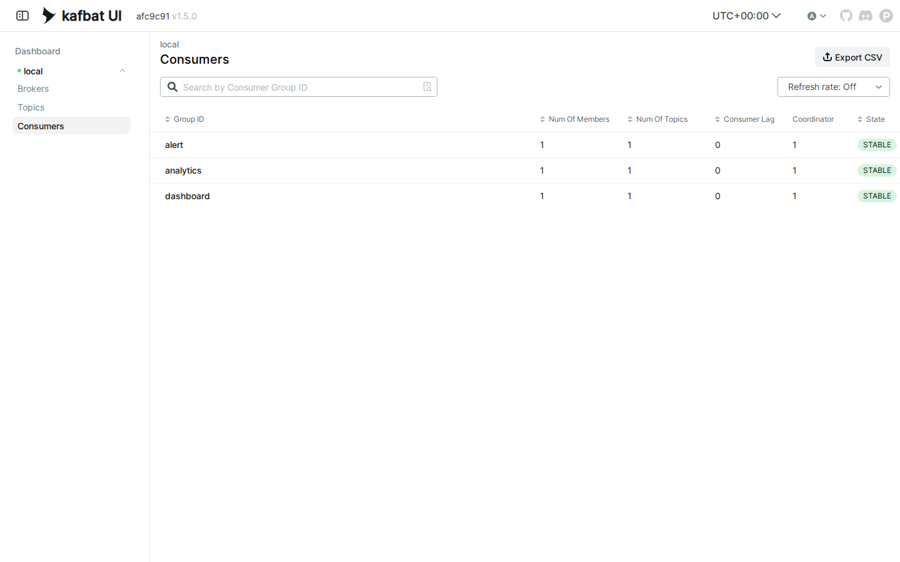
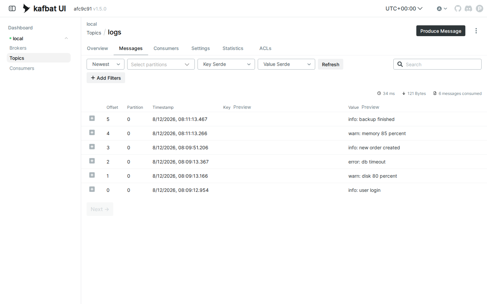

# LAB 4 — Pub/Sub ด้วย Consumer Groups + Replay

> โฟลเดอร์ `004_LAB_PubSub_Replay` = **LAB 4** ในสไลด์ `Kafka_Slides.html`
> (ไฟล์โค้ดของแล็บนี้ : `emit_log.py` · `subscriber.py` · `requirements.txt` — ต่อจาก LAB 3 : คราวนั้น group เดียวกันช่วยกันแบ่งงาน คราวนี้ **คนละ group = ต่างคนต่างได้ครบทุกข้อความ** ปิดท้ายด้วยท่าที่ RabbitMQ ทำไม่ได้ — **replay**)

## สิ่งที่จะได้เรียนรู้

- ทำ **Pub/Sub (broadcast)** บน Kafka โดยไม่ต้องมี exchange ไม่ต้องมี queue ชั่วคราว — แค่ตั้ง **ชื่อ group ให้ต่างกัน**
- topic ของ Kafka คือ **append-only log** : ข้อความถูกเขียนต่อท้ายเรื่อย ๆ และ **อ่านแล้วไม่หาย** (ต่างจาก RabbitMQ ที่ ack แล้วข้อความถูกลบ) · **offset** = ตำแหน่งใน log · **group** = ทีมที่ถือ bookmark ร่วมกัน — Kafka จดให้เองว่าแต่ละ group อ่านถึงไหนแล้ว
- **replay** : group ใหม่ที่มาทีหลัง อ่านย้อนประวัติทั้งหมดได้ตั้งแต่ offset 0 — ใน RabbitMQ fanout ถ้าไม่ออนไลน์ตอนส่ง = พลาดถาวร
- ใน group เดียวกัน **1 partition อ่านได้ทีละคน** — สมาชิกเกินจำนวน partition จะว่างงาน (ตรรกะเดียวกับ LAB 3)
- อ่านตาราง `kafka-consumer-groups.sh --all-groups --describe` ให้เป็น : CURRENT-OFFSET · LOG-END-OFFSET · LAG ของแต่ละ group

## ภาพรวมของแล็บนี้

โจทย์ของแล็บนี้คือ **ระบบกระจาย log** แบบเดียวกับ RabbitMQ LAB 3 — มีจอ dashboard และระบบ alert ที่ต่างก็อยากเห็น log **ทุกบรรทัด** — แต่คราวนี้ทำด้วย Kafka แล้วเทียบกันหมัดต่อหมัด
1. **เปิดเครื่องเรียน + broker + topic `logs` (1 partition) + venv** — เตรียมของด้วยขั้นตอนที่คุ้นเคยจากแล็บก่อน
2. **เปิด subscriber 2 กลุ่ม** — `dashboard` กับ `alert` คนละหน้าต่าง ทั้งคู่รอฟัง topic เดียวกัน
3. **ส่ง log 3 แบบ** — **ทั้งสองกลุ่มได้ครบทุกข้อความ** = pub/sub โดยไม่ต้องสร้างอะไรเพิ่มเลย
4. **เพิ่มสมาชิกคนที่สองใน group `dashboard`** — topic มี 1 partition จึงมีคนได้อ่านแค่คนเดียว อีกคน **ว่างงาน**
5. **เปิด group ใหม่ `analytics` ทีหลังสุด** — อ่านย้อนได้ **ครบทุกข้อความตั้งแต่ offset 0** = replay
6. **ปิด `dashboard` แล้วส่งเพิ่ม 2 ข้อความ แล้วเปิดใหม่** — ได้เฉพาะ 2 ข้อความที่พลาด เพราะ **group จำ offset ไว้ให้**
7. **ส่องทุก group ด้วย `kafka-consumer-groups.sh`** — สาม group ชี้ topic เดียวกัน ต่างคนต่างถือ offset ของตัวเอง
8. **เปิด Kafka UI** — เห็นรายชื่อ group และเห็นว่าข้อความทั้ง 6 **ยังอยู่ครบ** แม้ทุกคนอ่านจบแล้ว

---

## 0. เตรียมเครื่องเรียน

ทำบนเครื่องของเราเอง (ไม่ใช้ cloud) — เปิด container ที่ติดตั้ง Docker มาให้แล้ว

```bash
docker rm -f devtools
docker run -dit --name devtools --privileged -p 2222:22 tuchsanai/devtools:2569_1
ssh root@localhost -p 2222        # password : passwd
```

> 📝 **คำอธิบาย:** สามบรรทัดนี้คือการ "เปิดเครื่องเรียน" ให้ทุกคนได้สภาพแวดล้อมเหมือนกันเป๊ะ · `docker rm -f devtools` ลบกล่องเรียนตัวเก่าทิ้งก่อนกันชื่อซ้ำ (`-f` = force ลบได้แม้ยังทำงานอยู่) ·
> `-dit` คือ `-d` รันเบื้องหลัง + `-i` เปิด stdin ค้างไว้ + `-t` ให้มี terminal กล่องจะได้ไม่ดับทันที · `--privileged` ให้สิทธิ์เต็มเพื่อรัน **Docker ซ้อนข้างในกล่อง** (จำเป็น — broker ของแล็บนี้เป็น container ที่รันอยู่ข้างในเครื่องเรียนอีกที) ·
> `-p 2222:22` ส่ง port 2222 ของเครื่องเรา เข้า port 22 (SSH) ของกล่อง

> ใน VS Code ใช้ **Remote-SSH** ต่อไปที่ `root@localhost:2222` แล้วทำแล็บทั้งหมดข้างใน — แล็บนี้จะ forward port `8080` ที่แท็บ PORTS ของ VS Code (หน้าเว็บ Kafka UI)

ตรวจว่าพร้อมใช้งาน :

```bash
docker --version
docker compose version
```

> 📝 **คำอธิบาย:** ถามเวอร์ชันของ Docker Engine และ Compose เพื่อ **ยืนยันว่าคำสั่ง `docker` วิ่งถึง daemon ได้จริง** ก่อนเริ่มแล็บ · สิ่งที่ต้องดูคือ "มีเลขเวอร์ชันขึ้นมาไหม" ไม่ใช่ "เลขตรงกับเอกสารไหม" ·
> ถ้าขึ้น `Cannot connect to the Docker daemon` แปลว่ายังอยู่นอกกล่องเรียนหรือ daemon ยังไม่ขึ้น ให้ย้อนทำข้อ 0 ใหม่

✅ **Expected output** — ขอแค่มี **เลขเวอร์ชัน** ขึ้นครบสองบรรทัด ไม่ใช่ error (เลขเวอร์ชันของแต่ละคนอาจไม่ตรงกับเอกสารนี้):

```
Docker version 29.6.2, build dfc4efb
Docker Compose version v5.3.1
```

---

## 1. Clone โค้ดแล็บ

```bash
mkdir -p ~/labwork && cd ~/labwork
git clone https://github.com/Tuchsanai/DevTools.git
cd DevTools/07_Kafka/004_LAB_PubSub_Replay
```

> 📝 **คำอธิบาย:** `mkdir -p ~/labwork` สร้างโฟลเดอร์เก็บงาน (`-p` = มีอยู่แล้วก็ไม่ error) · `git clone` ดึงรีโพของวิชาลงมา ทำครั้งเดียวใช้ได้ทุกแล็บของชุดนี้ · แล้ว `cd` เข้าโฟลเดอร์แล็บ ซึ่งมี `emit_log.py` · `subscriber.py` · `requirements.txt` รออยู่แล้ว ·
> ถ้าเคย clone ไว้ git จะบอกว่าโฟลเดอร์ไม่ว่าง — ข้ามไป `cd` ได้เลย

---

## 2. เปิด Kafka Broker + Kafka UI

ขั้นตอนเดียวกับแล็บก่อน — broker หนึ่งกล่อง UI อีกหนึ่งกล่อง :

```bash
docker rm -f kafka kafka-ui 2>/dev/null
docker run -d --name kafka -p 9092:9092 apache/kafka:4.1.0
```

> 📝 **คำอธิบาย:** บรรทัดแรกลบของเก่ากันชื่อซ้ำ (`2>/dev/null` โยนข้อความทิ้งถ้าไม่มีตัวเก่า) · `docker run -d` รัน broker เบื้องหลัง · `--name kafka` ตั้งชื่อไว้เรียกสั้น ๆ · `-p 9092:9092` เปิด port **PLAINTEXT** ให้โปรแกรม Python ต่อเข้า — Kafka มี port เดียวสำหรับโปรแกรม ส่วนหน้าเว็บเป็น container แยกต่างหาก (ต่างจาก RabbitMQ ที่ UI เป็นปลั๊กอินในกล่องเดียวกัน) ·
> `apache/kafka:4.1.0` คือ image ทางการของ Apache — รุ่น 4.x ใช้ **KRaft mode** จัดการตัวเองได้ในกล่องเดียว ไม่ต้องมี ZooKeeper แล้ว · ค่า default ประกาศตัวที่ `localhost:9092` พอดีกับแล็บของเรา

✅ **Expected output** — ครั้งแรกจะเห็นการ pull ทีละ layer แล้วปิดท้ายด้วย **container ID ยาว 64 ตัวอักษร** (layer ID · digest ของแต่ละคนจะไม่ตรงกับเอกสารนี้ · ถ้าเคย pull แล้วจะเห็นแค่ ID บรรทัดเดียว):

```
Unable to find image 'apache/kafka:4.1.0' locally
4.1.0: Pulling from apache/kafka
fb760d495f93: Pulling fs layer
        ... (รวม 11 layer ทยอย Download complete / Pull complete) ...
Digest: sha256:bff074a5d0051dbc0bbbcd25b045bb1fe84833ec0d3c7c965d1797dd289ec88f
Status: Downloaded newer image for apache/kafka:4.1.0
3e5b44fb7b9c7a2b3c42cd829a986c6a615c71a7bd7aa5c345469060c874bb01
```

รอ broker พร้อมก่อนต่อ — ดูจาก log เหมือนเคย (`docker ps` ต้องเห็น `kafka` สถานะ `Up` พร้อม mapping `9092->9092`) :

```bash
docker logs kafka --tail 4
```

> 📝 **คำอธิบาย:** บรรทัดที่ต้องรอคือ **`Kafka Server started`** — ถ้ายังไม่เห็น รอ 2–3 วินาทีแล้วรันซ้ำ · Kafka บูตเร็วกว่า RabbitMQ มาก (ราว 5 วินาที เทียบกับ 13 วินาทีของ RabbitMQ) แต่บทเรียนเดิมยังใช้ได้เสมอ : **container `Up` ≠ โปรแกรมข้างในพร้อม** ต้องดูจาก log

✅ **Expected output** — จุดชี้ขาดคือบรรทัดสุดท้าย `Kafka Server started` (วันเวลา · commitId ของแต่ละคนจะไม่ตรงกับเอกสารนี้):

```
[2026-08-12 08:06:44,282] INFO Kafka version: 4.1.0 (org.apache.kafka.common.utils.AppInfoParser)
[2026-08-12 08:06:44,282] INFO Kafka commitId: 13f70256db3c994c (org.apache.kafka.common.utils.AppInfoParser)
[2026-08-12 08:06:44,282] INFO Kafka startTimeMs: 1786522004282 (org.apache.kafka.common.utils.AppInfoParser)
[2026-08-12 08:06:44,283] INFO [KafkaRaftServer nodeId=1] Kafka Server started (kafka.server.KafkaRaftServer)
```

broker พร้อมแล้ว เปิด **Kafka UI** (หน้าเว็บสำหรับคนดู) ต่อได้เลย :

```bash
docker run -d --name kafka-ui --network host \
  -e KAFKA_CLUSTERS_0_NAME=local \
  -e KAFKA_CLUSTERS_0_BOOTSTRAPSERVERS=localhost:9092 \
  kafbat/kafka-ui:latest
```

> 📝 **คำอธิบาย:** `kafbat/kafka-ui` คือหน้าเว็บโอเพนซอร์สสำหรับส่อง Kafka — เสิร์ฟที่ port `8080` · `--network host` ให้กล่อง UI ใช้เครือข่ายเดียวกับเครื่องเรียน มันจึงเห็น broker ที่ `localhost:9092` ได้ตรง ๆ · สอง `-e` ตั้งชื่อ cluster ที่จะโชว์ (`local`) กับที่อยู่ broker · เราจะกลับมาเปิดหน้าเว็บนี้ในข้อ 12 หลังมีของให้ดูครบแล้ว

✅ **Expected output** — pull ครั้งแรกแล้วจบด้วย container ID (layer ID · digest ของแต่ละคนจะไม่ตรงกับเอกสารนี้):

```
Unable to find image 'kafbat/kafka-ui:latest' locally
latest: Pulling from kafbat/kafka-ui
5b9ab419b7b2: Pulling fs layer
        ... (รวม 7 layer ทยอย Download complete / Pull complete) ...
Status: Downloaded newer image for kafbat/kafka-ui:latest
447cfd415126bc68dbd7641003eb86d3eb6ce88d193628e006bf9ce545472d9e
```

---

## 3. สร้าง topic `logs` — จงใจให้มี partition เดียว

```bash
docker exec kafka /opt/kafka/bin/kafka-topics.sh --bootstrap-server localhost:9092 \
  --create --topic logs --partitions 1
```

> 📝 **คำอธิบาย:** `docker exec kafka ...` สั่งเครื่องมือ CLI ที่ติดมากับ broker (อยู่ใน `/opt/kafka/bin/` ข้างในกล่อง) · `--create --topic logs` สร้าง topic ชื่อ `logs` · `--partitions 1` คือหมากสำคัญของแล็บนี้ : **partition เดียว = ทุกข้อความอยู่ในแถวเดียว เรียงลำดับเดียวกันทั้ง topic** — และใน group เดียวกัน **1 partition มีเจ้าของได้ทีละคน** เดี๋ยวข้อ 8 จะใช้จุดนี้สอนเรื่องสมาชิกว่างงาน

✅ **Expected output**:

```
Created topic logs.
```

ตรวจโครงสร้างของ topic ที่เพิ่งสร้าง :

```bash
docker exec kafka /opt/kafka/bin/kafka-topics.sh --bootstrap-server localhost:9092 \
  --describe --topic logs
```

> 📝 **คำอธิบาย:** `--describe` แสดงหน้าตาข้างในของ topic · บรรทัดแรกคือภาพรวม : `PartitionCount: 1` ตามที่สั่ง · `ReplicationFactor: 1` เพราะมี broker เดียว · บรรทัดถัดมาไล่ทีละ partition : `Partition: 0` มี `Leader: 1` คือ broker หมายเลข 1 เป็นเจ้าของ (`Isr` = สำเนาที่ตามทันปัจจุบัน · คอลัมน์ `Elr` เป็นของใหม่ใน Kafka 4.x ว่างได้เป็นปกติ)

✅ **Expected output** — `PartitionCount: 1` และมีบรรทัด `Partition: 0` เพียงบรรทัดเดียว (TopicId ของแต่ละคนจะไม่ตรงกับเอกสารนี้):

```
Topic: logs	TopicId: uKT7QFR4QsmOZMWehRxnUg	PartitionCount: 1	ReplicationFactor: 1	Configs: min.insync.replicas=1,segment.bytes=1073741824
	Topic: logs	Partition: 0	Leader: 1	Replicas: 1	Isr: 1	Elr: 	LastKnownElr:
```

---

## 4. เตรียม Python — venv + kafka-python

เครื่องเรียนมี Python 3 แล้ว แต่ระบบสมัยใหม่ (PEP 668) **ไม่ยอมให้ `pip install` ลงเครื่องตรง ๆ** ต้องสร้าง **virtual environment** ก่อน (ถ้าสร้างไว้แล้วจากแล็บก่อน ข้ามบรรทัดแรกได้) :

```bash
python3 -m venv ~/venv-kafka
source ~/venv-kafka/bin/activate
pip install kafka-python==3.0.10
```

> 📝 **คำอธิบาย:** `python3 -m venv ~/venv-kafka` สร้างสภาพแวดล้อม Python แยกส่วนตัวที่ `~/venv-kafka` — ติดตั้งอะไรในนี้ไม่กระทบ Python ของระบบ · `source ~/venv-kafka/bin/activate` เปิดใช้งาน สังเกต prompt ขึ้นคำนำหน้า `(venv-kafka)` = ตอนนี้ `python`/`pip` ชี้เข้า venv แล้ว ·
> `pip install kafka-python==3.0.10` ติดตั้ง **kafka-python** ไลบรารีที่ใช้คุยกับ Kafka โดยล็อกเวอร์ชันให้ตรงกับเอกสาร (ตรงกับ `requirements.txt` ของแล็บ — จะใช้ `pip install -r requirements.txt` แทนก็ได้)

✅ **Expected output** — บรรทัดสุดท้ายต้องเป็น `Successfully installed kafka-python-3.0.10` (ถ้าติดตั้งไว้แล้วจะขึ้น `Requirement already satisfied` แทน ก็ถือว่าผ่าน):

```
Collecting kafka-python==3.0.10
  Downloading kafka_python-3.0.10-py3-none-any.whl.metadata (11 kB)
Downloading kafka_python-3.0.10-py3-none-any.whl (614 kB)
   ━━━━━━━━━━━━━━━━━━━━━━━━━━━━━━━━━━━━━━━━ 614.2/614.2 kB 5.8 MB/s eta 0:00:00
Installing collected packages: kafka-python
Successfully installed kafka-python-3.0.10
```

> **⚠️ กติกาสำคัญ :** แล็บนี้ใช้ **หลาย terminal พร้อมกัน** — ทุกหน้าต่างใหม่ (ssh เข้ามาใหม่) ต้องพิมพ์ `source ~/venv-kafka/bin/activate` ก่อนเสมอ (ดูว่า prompt มี `(venv-kafka)` นำหน้าหรือยัง) ไม่งั้นเจอ `ModuleNotFoundError: No module named 'kafka'` ทันทีที่รันโปรแกรม

---

## 5. แนวคิด + โค้ดของแล็บนี้

ใน RabbitMQ LAB 3 การ broadcast ต้องมีอุปกรณ์ครบชุด : ประกาศ **fanout exchange** + ให้ผู้รับแต่ละคนสร้าง **queue ชั่วคราว** + `queue_bind` สมัครรับ — ใน Kafka **ไม่ต้องสร้างอะไรเลย** เพราะโครงสร้างข้อมูลต่างกันตั้งแต่ราก : topic คือ **สมุด log เล่มยาว** ที่ข้อความถูก **เขียนต่อท้าย** (append-only) ตามเลข **offset** (0, 1, 2, …) · consumer ไม่ได้ดึงข้อความออก — แค่ "เลื่อนสายตาอ่าน" แล้วให้ Kafka จดว่า **group ของตัวเองอ่านถึง offset ไหน** (bookmark) · **คนละ group = bookmark คนละอัน** จึงได้ครบทุกข้อความ (pub/sub) · **group เดียวกัน = ถือ bookmark ร่วมกัน** ช่วยกันแบ่ง partition อ่าน (work queue แบบ LAB 3)

| | RabbitMQ LAB 3 (fanout) | Kafka (แล็บนี้) |
|---|---|---|
| ต้องสร้างอะไรเพื่อ broadcast | exchange fanout + queue ชั่วคราว + bind | ไม่ต้อง — ตั้งชื่อ group ต่างกันพอ |
| ผู้รับมาทีหลังข้อความที่ส่งไปแล้ว | **พลาดถาวร** (exchange ไม่เก็บของ) | **อ่านย้อนได้ทั้งหมด** — log ยังอยู่ |
| อ่านแล้วข้อความไปไหน | ack แล้ว **ถูกลบออกจาก queue** | **ยังอยู่ใน log** — จดแค่ offset ว่าอ่านถึงไหน |
| ทีมเดียวกันหลายคน | หลาย consumer เกาะ queue เดียว = แบ่งงาน | หลาย consumer ใน group เดียว = แบ่ง partition |

### `emit_log.py` — ผู้ส่ง log (publisher)

```python
import sys
from kafka import KafkaProducer

# 1) ต่อ broker
producer = KafkaProducer(bootstrap_servers='localhost:9092')

# 2) เนื้อข้อความมาจาก argument เช่น `python emit_log.py "info: user login"`
#    (ไม่ใส่ = ข้อความตัวอย่าง)
message = ' '.join(sys.argv[1:]) or 'info: Hello logs!'

# 3) ส่งเข้า topic 'logs' — ผู้ส่งไม่รู้และไม่สนใจว่า "ใครสมัครอ่านอยู่บ้าง"
metadata = producer.send('logs', message.encode()).get(timeout=10)
print(f" [x] Sent '{message}'  ->  partition={metadata.partition} offset={metadata.offset}")

producer.close()
```

> 📝 **คำอธิบาย:** ไล่ตามเลขในคอมเมนต์ · **(1)** `KafkaProducer` ต่อ broker ที่ `localhost:9092` — ไม่มี user/password เพราะ broker โหมดแล็บเปิด PLAINTEXT · **(2)** เอาคำที่พิมพ์ต่อท้ายคำสั่งมารวมเป็นข้อความ ไม่พิมพ์อะไรเลยใช้ `'info: Hello logs!'` แทน ·
> **(3)** `send('logs', ...)` ยื่นข้อความเข้า topic แบบ **ไม่ระบุ key** — และเหมือน RabbitMQ LAB 3 ตรงที่ **ผู้ส่งไม่รู้จักผู้รับเลย** รู้จักแค่ชื่อ topic · `send()` คืน future จึงต่อ `.get(timeout=10)` รอใบตอบรับจาก broker ซึ่งบอก **partition และ offset ที่ข้อความถูกเขียนลงไปจริง** — แล็บนี้จะใช้เลข offset ที่พิมพ์ออกมานี้เทียบกับฝั่งผู้อ่านตลอดทั้งแล็บ

### `subscriber.py` — ผู้สมัครอ่าน (รับชื่อ group จาก argument)

```python
import sys
from kafka import KafkaConsumer

def main():
    # 1) ชื่อกลุ่มมาจาก argument เช่น `python subscriber.py dashboard`
    #    นี่คือหัวใจของแล็บนี้ : คนละ group = ต่างคนต่างได้ "ครบทุกข้อความ" (pub/sub)
    #    group เดียวกัน = ช่วยกันแบ่งอ่าน (work queue แบบ LAB 3)
    if len(sys.argv) < 2:
        sys.exit('usage: python subscriber.py <group-name>')
    group = sys.argv[1]

    # 2) group ใหม่ที่ยังไม่เคยอ่านเลย + auto_offset_reset='earliest'
    #    → เริ่มอ่านตั้งแต่ข้อความแรกสุดใน log (มาทีหลังก็อ่านย้อนอดีตได้ทั้งหมด!)
    consumer = KafkaConsumer('logs',
                             bootstrap_servers='localhost:9092',
                             group_id=group,
                             auto_offset_reset='earliest')

    print(f' [*] Subscriber (group={group}) waiting. To exit press CTRL+C')

    # 3) Kafka จดให้เองว่า group นี้อ่านถึง offset ไหนแล้ว (commit อัตโนมัติ)
    #    ปิดโปรแกรมแล้วเปิดใหม่ จะอ่านต่อจากที่ค้างไว้ ไม่เริ่มนับหนึ่งใหม่
    for message in consumer:
        print(f' [x] group={group} got offset={message.offset} '
              f'value={message.value.decode()}')

if __name__ == '__main__':
    try:
        main()
    except KeyboardInterrupt:
        print('Interrupted')
        sys.exit(0)
```

> 📝 **คำอธิบาย:** **(1)** โปรแกรมเดียวใช้เล่นได้ทุกบทบาท — บทบาทถูกกำหนดด้วย **ชื่อ group ที่พิมพ์ต่อท้าย** ไม่ใช่ตัวโค้ด (โค้ดเดียวกันเป๊ะ ต่างกันแค่ argument!) · **(2)** `group_id=group` บอกว่าเราอ่านในนามทีมไหน · `auto_offset_reset='earliest'` มีผลเฉพาะ **group ที่ยังไม่มี bookmark** : ให้เริ่มจากข้อความแรกสุดใน log — นี่คือกลไกเบื้องหลังการ replay ในข้อ 9 (ค่า default คือ `latest` = สนใจแต่ของใหม่) ·
> **(3)** วนอ่านไปเรื่อย ๆ พิมพ์ **offset กับเนื้อความ** ของทุกข้อความ — ระหว่างนั้น kafka-python จะ **commit offset ให้อัตโนมัติ** เบื้องหลัง Kafka จึงรู้เสมอว่า group นี้อ่านถึงไหน · `KeyboardInterrupt` ดัก Ctrl+C ให้พิมพ์ `Interrupted` แล้วจบสวย ๆ เหมือนทุกแล็บที่ผ่านมา

---

## 6. เปิด subscriber 2 กลุ่ม — `dashboard` กับ `alert`

เปิด terminal เพิ่มอีก **2 หน้าต่าง** (แต่ละหน้าต่างคือ ssh เข้าเครื่องเรียนใหม่อีกรอบ : `ssh root@localhost -p 2222`)

**หน้าต่างที่ 2** — ทีมจอแสดงผล :

```bash
source ~/venv-kafka/bin/activate
cd ~/labwork/DevTools/07_Kafka/004_LAB_PubSub_Replay
python subscriber.py dashboard
```

> 📝 **คำอธิบาย:** หน้าต่างใหม่ = shell ใหม่ ต้อง activate venv ก่อนเสมอ (กติกาข้อ 4) แล้ว `cd` เข้าโฟลเดอร์แล็บ · รัน subscriber ในนาม **group `dashboard`** — โปรแกรมพิมพ์บรรทัด waiting แล้วค้างรอ (ไม่ได้แฮงก์ มันตั้งใจรอ) · topic ตอนนี้ยังว่างเปล่า จึงยังไม่มีอะไรเด้งมา แม้ `earliest` จะสั่งให้อ่านตั้งแต่ต้น log — ต้น log ก็คือความว่างเปล่า

✅ **Expected output** — ขึ้น waiting แล้วค้างรอ:

```
 [*] Subscriber (group=dashboard) waiting. To exit press CTRL+C
        ^ ค้างอยู่ตรงนี้ — ถูกต้องแล้ว ปล่อยไว้อย่างนี้
```

**หน้าต่างที่ 3** — ทีมแจ้งเตือน : สามคำสั่งเดียวกันเป๊ะ เปลี่ยนแค่บรรทัดท้ายเป็น `python subscriber.py alert` :

> 📝 **คำอธิบาย:** โปรแกรม **ไฟล์เดียวกันเป๊ะ** ต่างกันตรง argument เท่านั้น — เท่านี้เราก็มี "ผู้สมัครรับ" สองทีมเกาะ topic `logs` เดียวกันแล้ว · เทียบกับ RabbitMQ LAB 3 ที่จุดเดียวกันนี้ต้องรอ broker สุ่มชื่อ queue ชั่วคราว `amq.gen-…` ให้แต่ละจอ — ของ Kafka ไม่มี queue ให้สร้าง เพราะทุกคนอ่านจาก log เล่มเดียวกันอยู่แล้ว

✅ **Expected output** — บรรทัด waiting แบบเดียวกัน แต่เป็นของ `group=alert`:

```
 [*] Subscriber (group=alert) waiting. To exit press CTRL+C
```

---

## 7. ส่ง log 3 แบบ — ทุกกลุ่มได้ครบทุกข้อความ

กลับมาที่ **หน้าต่างที่ 1** (ปล่อยสองจอนั้นรอไว้อย่างนั้น — และอย่าลืมว่าหน้าต่างนี้ต้องมี `(venv-kafka)` นำหน้า prompt กับอยู่ในโฟลเดอร์แล็บ) :

```bash
python emit_log.py "info: user login"
python emit_log.py "warn: disk 80 percent"
python emit_log.py "error: db timeout"
```

> 📝 **คำอธิบาย:** ส่ง log สามระดับ : info · warn · error (เนื้อความคือทุกคำที่ต่อท้ายชื่อไฟล์) · แต่ละครั้งโปรแกรมต่อ broker → เขียนต่อท้าย log → พิมพ์ **offset ที่ได้** → จบทันที · ดูเลข offset ที่ไต่ขึ้น 0 → 1 → 2 ใน partition เดียวกัน — หลักฐานว่าข้อความ **ต่อแถวเรียงลำดับในสมุดเล่มเดียว** · ระหว่างรันแต่ละครั้ง ชำเลืองดูหน้าต่างที่ 2 กับ 3 ไปด้วย จะเห็นเด้งมาแทบพร้อมกันทั้งสองจอ

✅ **Expected output** — offset ไล่ 0, 1, 2:

```
 [x] Sent 'info: user login'  ->  partition=0 offset=0
 [x] Sent 'warn: disk 80 percent'  ->  partition=0 offset=1
 [x] Sent 'error: db timeout'  ->  partition=0 offset=2
```

✅ **Expected output — หน้าต่างที่ 2 (group `dashboard`)** : ได้ **ครบทั้ง 3 ข้อความ** เรียงตาม offset:

```
 [*] Subscriber (group=dashboard) waiting. To exit press CTRL+C
 [x] group=dashboard got offset=0 value=info: user login
 [x] group=dashboard got offset=1 value=warn: disk 80 percent
 [x] group=dashboard got offset=2 value=error: db timeout
```

✅ **Expected output — หน้าต่างที่ 3 (group `alert`)** : ได้ **ครบทั้ง 3 ข้อความเหมือนกันเป๊ะ** offset ชุดเดียวกันด้วย:

```
 [*] Subscriber (group=alert) waiting. To exit press CTRL+C
 [x] group=alert got offset=0 value=info: user login
        ... (ครบทั้ง 3 ข้อความ offset 0–2 เหมือนหน้าต่างที่ 2) ...
```

> **นี่คือ pub/sub ฉบับ Kafka :** ผลลัพธ์เหมือน RabbitMQ LAB 3 ทุกประการ — ส่ง 1 ครั้ง ทุกทีมได้ครบ — แต่ **ต้นทุนต่างกันลิบ** : RabbitMQ ต้องมี fanout exchange + queue ชั่วคราว + binding ส่วน Kafka ใช้แค่ **ชื่อ group ที่ต่างกัน** เพราะไม่มีการ "แจกจ่ายสำเนา" จริง ๆ — ทุก group อ่านจาก log เล่มเดียวกัน ต่างคนต่างถือ bookmark ของตัวเอง

---

## 8. group เดียวกันช่วยกันอ่าน — สมาชิกเกินก็ว่างงาน

แล้วถ้าเปิด subscriber **ชื่อ group ซ้ำกับที่มีอยู่** ล่ะ? เปิด **หน้าต่างที่ 4** แล้วลองดู :

```bash
source ~/venv-kafka/bin/activate
cd ~/labwork/DevTools/07_Kafka/004_LAB_PubSub_Replay
python subscriber.py dashboard
```

> 📝 **คำอธิบาย:** ตอนนี้ group `dashboard` มีสมาชิก **2 ตัว** (หน้าต่างที่ 2 กับ 4) — Kafka จะจัด **rebalance** แบ่ง partition กันใหม่ในไม่กี่วินาที · แต่ topic `logs` มีแค่ **1 partition** ซึ่งมีเจ้าของได้ทีละคน → สมาชิกคนหนึ่งได้ครอง partition อีกคน **ไม่ได้อะไรเลย** — ตรรกะเดียวกับ LAB 3 เป๊ะ (worker 3 ตัวบน 2 partition ก็มีคนว่างงานหนึ่งตัว)

✅ **Expected output** — ตัวใหม่ขึ้นบรรทัด waiting เฉย ๆ แล้วเงียบ (ไม่มีข้อความเก่าเด้งมา เพราะ bookmark ของ group `dashboard` อ่านถึง offset 2 ไปแล้ว)

รอสัก 10 วินาทีให้ rebalance จบ แล้วส่งข้อความใหม่จาก **หน้าต่างที่ 1** :

```bash
python emit_log.py "info: new order created"
```

✅ **Expected output** — ฝั่งผู้ส่งได้ offset ถัดไปคือ 3 · **หน้าต่างที่ 2 (dashboard ตัวแรก)** เด้งบรรทัด `got offset=3` เพิ่ม · **หน้าต่างที่ 4 (dashboard ตัวที่สอง) เงียบสนิท ว่างงาน** (ในรอบทดสอบนี้ partition ตกเป็นของตัวแรก — เครื่องของแต่ละคนอาจสลับกันได้ แต่จะ **มีแค่ตัวเดียวเสมอ** ที่ได้รับ) · ส่วน **หน้าต่างที่ 3 (`alert`)** ได้ `offset=3` ตามปกติ เพราะอยู่คนละ group:

```
 [x] Sent 'info: new order created'  ->  partition=0 offset=3
```

พิสูจน์ว่า "ว่างงานจริง ไม่ใช่บังเอิญ" ด้วยตาราง member ของ group `dashboard` จากหน้าต่างที่ 1 :

```bash
docker exec kafka /opt/kafka/bin/kafka-consumer-groups.sh --bootstrap-server localhost:9092 \
  --describe --group dashboard --members
```

> 📝 **คำอธิบาย:** `--members` แสดงสมาชิกทุกตัวของ group พร้อมจำนวน partition ที่ถือครอง · จุดที่ต้องดูคือคอลัมน์ **#PARTITIONS** : ตัวหนึ่งได้ `1` อีกตัวได้ `0` — อยากให้สมาชิก 2 ตัวช่วยกันอ่านจริง ๆ topic ต้องมีอย่างน้อย 2 partition (แบบที่ทำใน LAB 3)

✅ **Expected output** — สมาชิก 2 แถว ถือ partition `1` กับ `0` (CONSUMER-ID ของแต่ละคนจะไม่ตรงกับเอกสารนี้):

```
GROUP           CONSUMER-ID                                              HOST            CLIENT-ID           #PARTITIONS
dashboard       kafka-python-3.0.10-70601410-4c71-49d6-911b-06a1b97c0c69 /172.18.0.1     kafka-python-3.0.10 1
dashboard       kafka-python-3.0.10-ecd79610-d650-48d6-99a7-19c331ea1622 /172.18.0.1     kafka-python-3.0.10 0
```

ดูจบแล้วไปที่ **หน้าต่างที่ 4** กด **Ctrl+C** ปิดตัวที่สองทิ้ง (เห็น `Interrupted` แล้วคืน prompt) — เดี๋ยวหน้าต่างนี้จะถูกใช้ต่อในข้อ 9

---

## 9. Replay — group ใหม่มาทีหลัง อ่านย้อนอดีตได้ทั้งหมด

ตอนนี้ log มี 4 ข้อความ (offset 0–3) และถูก `dashboard` กับ `alert` อ่านครบไปแล้ว — ใน RabbitMQ LAB 3 ถ้าเปิดจอใหม่ตอนนี้จะ **ไม่เห็นอะไรเลย** เพราะ fanout ทิ้งข้อความที่ไม่มีคน bind ไปแล้วถาวร · Kafka ล่ะ? เปิดทีมใหม่ชื่อ `analytics` ใน **หน้าต่างที่ 4** :

```bash
python subscriber.py analytics
```

> 📝 **คำอธิบาย:** `analytics` เป็น **group ใหม่ที่ไม่เคยมี bookmark** — เงื่อนไข `auto_offset_reset='earliest'` ในโค้ดจึงทำงาน : เริ่มอ่านตั้งแต่ **offset 0** ไล่มาจนทันปัจจุบัน · ข้อความทั้งหมดยังอยู่ใน log ครบ เพราะการที่ group อื่นอ่านไปแล้ว **ไม่ได้ลบอะไรออกเลย** — แค่ bookmark ของเขาขยับ (หน้าต่างนี้ activate venv + `cd` ไว้แล้วจากข้อ 8 จึงรันได้ทันที)

✅ **Expected output** — ประวัติทั้ง 4 ข้อความไหลมาครบทันทีตั้งแต่ offset 0 แล้วค้างรอของใหม่ต่อ:

```
 [*] Subscriber (group=analytics) waiting. To exit press CTRL+C
 [x] group=analytics got offset=0 value=info: user login
 [x] group=analytics got offset=1 value=warn: disk 80 percent
 [x] group=analytics got offset=2 value=error: db timeout
 [x] group=analytics got offset=3 value=info: new order created
```

> **นี่คือ replay — จุดที่ Kafka ฉีกจาก RabbitMQ ชัดที่สุด :** ระบบวิเคราะห์ที่สร้างทีหลังระบบ production เป็นปี ก็ยังย้อนอ่านเหตุการณ์ทั้งหมดได้ตั้งแต่ต้น (ตราบใดที่ log ยังไม่ถูกลบตามนโยบาย retention — ค่า default คือเก็บ 7 วัน) · ปล่อยจอนี้รันค้างไว้ — เดี๋ยวข้อ 10 จะได้เห็นมันรับของใหม่แบบ realtime ด้วย

---

## 10. ปิดแล้วเปิดใหม่ — group จำ offset ให้เสมอ

คำถามสุดท้าย : ถ้า subscriber **ดับไปชั่วคราว** แล้วมีข้อความใหม่เข้ามา ตอนกลับมาจะเจออะไร? ไปที่ **หน้าต่างที่ 2** กด **Ctrl+C** ปิด `dashboard` (พิมพ์ `Interrupted` แล้วคืน prompt เหมือนทุกครั้ง) — แล้วระหว่างที่มันออฟไลน์ ส่งเพิ่ม 2 ข้อความจาก **หน้าต่างที่ 1** :

```bash
python emit_log.py "warn: memory 85 percent"
python emit_log.py "info: backup finished"
```

> 📝 **คำอธิบาย:** สองข้อความนี้เขียนลง log เป็น offset 4 กับ 5 ตามคิว · หน้าต่างที่ 3 (`alert`) กับหน้าต่างที่ 4 (`analytics`) ที่ยังออนไลน์จะเด้งรับทันทีทั้งคู่ — ส่วน `dashboard` ที่ดับอยู่ **ไม่ได้สูญเสียอะไร** เพราะข้อความอยู่ใน log ไม่ได้อยู่ในตัวโปรแกรม

✅ **Expected output** — offset 4 และ 5:

```
 [x] Sent 'warn: memory 85 percent'  ->  partition=0 offset=4
 [x] Sent 'info: backup finished'  ->  partition=0 offset=5
```

แล้วเปิด `dashboard` กลับมาที่ **หน้าต่างที่ 2** เหมือนเดิม :

```bash
python subscriber.py dashboard
```

> 📝 **คำอธิบาย:** group `dashboard` มี bookmark ค้างอยู่ที่ "อ่านถึง offset 3 แล้ว" — Kafka จึงส่งต่อให้ตั้งแต่ offset 4 เป๊ะ ๆ · **ไม่เริ่มนับหนึ่งใหม่** (เพราะ group นี้มี bookmark แล้ว `auto_offset_reset` จึงไม่มีผล) และ **ไม่พลาดของที่ส่งตอนออฟไลน์** — ดีที่สุดของทั้งสองโลก · รอสัก 10–15 วินาทีให้ตัวใหม่เข้า group เสร็จ ข้อความค้างจะเด้งมาเอง

✅ **Expected output** — ได้เฉพาะ **2 ข้อความที่พลาดไป** (offset 4, 5) ไม่มีของเก่าปนมา:

```
 [*] Subscriber (group=dashboard) waiting. To exit press CTRL+C
 [x] group=dashboard got offset=4 value=warn: memory 85 percent
 [x] group=dashboard got offset=5 value=info: backup finished
```

> เทียบสามเหตุการณ์ให้ชัด : **group เดิมกลับมา** → อ่านต่อจาก bookmark (ได้เฉพาะที่พลาด) · **group ใหม่เอี่ยม** → เริ่มจาก offset 0 (ได้ทั้งหมด — ข้อ 9) · **RabbitMQ fanout** → ของที่ส่งตอนออฟไลน์หายถาวร — ทั้งหมดนี้ต่างกันเพราะ Kafka แยก "ข้อมูล (log)" ออกจาก "ความคืบหน้าการอ่าน (offset ของแต่ละ group)" อย่างเด็ดขาด

---

## 11. ส่องทุก group พร้อมกัน — `kafka-consumer-groups.sh`

ตอนนี้มี 3 group เกาะ topic เดียวกันอยู่ (ทั้งสามจอยังรันอยู่) — ดูภาพรวมทั้งหมดจาก **หน้าต่างที่ 1** :

```bash
docker exec kafka /opt/kafka/bin/kafka-consumer-groups.sh --bootstrap-server localhost:9092 \
  --all-groups --describe
```

> 📝 **คำอธิบาย:** `--all-groups --describe` ไล่รายงานทุก group ในระบบ ทีละตาราง · วิธีอ่านคอลัมน์สำคัญ : **CURRENT-OFFSET** = bookmark ของ group นี้ (อ่านถึงไหนแล้ว) · **LOG-END-OFFSET** = ท้ายสมุด log ตอนนี้ (มีทั้งหมดกี่ข้อความแล้ว — ของเราคือ 6) · **LAG** = ผลต่างของสองตัวนั้น คืองานที่ยังอ่านไม่ถึง — ศูนย์คือตามทันหมด ·
> จุดที่ต้องเห็น : ทั้งสาม group ชี้ `logs` partition `0` **ตัวเดียวกัน** แต่ต่างคนต่างมีแถว offset ของตัวเอง — สามทีมอ่านสมุดเล่มเดียว bookmark สามอัน · คอลัมน์ CONSUMER-ID มีค่า = ตอนนี้มีสมาชิกออนไลน์ถืออยู่จริง

✅ **Expected output** — สามตาราง `alert` · `analytics` · `dashboard` ทุกตัว CURRENT-OFFSET 6 · LAG 0 (CONSUMER-ID · ลำดับ group ของแต่ละคนจะไม่ตรงกับเอกสารนี้):

```
GROUP           TOPIC           PARTITION  CURRENT-OFFSET  LOG-END-OFFSET  LAG             CONSUMER-ID                                              HOST            CLIENT-ID
alert           logs            0          6               6               0               kafka-python-3.0.10-f66898fd-ce15-49a1-8a0a-2ad8ebba413e /172.18.0.1     kafka-python-3.0.10

GROUP           TOPIC           PARTITION  CURRENT-OFFSET  LOG-END-OFFSET  LAG             CONSUMER-ID                                              HOST            CLIENT-ID
analytics       logs            0          6               6               0               kafka-python-3.0.10-0ea90046-5adb-476c-b0a1-2a22d2cbd1ff /172.18.0.1     kafka-python-3.0.10

GROUP           TOPIC           PARTITION  CURRENT-OFFSET  LOG-END-OFFSET  LAG             CONSUMER-ID                                              HOST            CLIENT-ID
dashboard       logs            0          6               6               0               kafka-python-3.0.10-6347c281-bad3-4a60-a5ed-3f34a5e2da42 /172.18.0.1     kafka-python-3.0.10
```

---

## 12. ดูใน Kafka UI

หน้าเว็บ UI เปิดอยู่ที่ port `8080` **ข้างในเครื่องเรียน** ไม่ใช่บนเครื่องเราโดยตรง — ต้องให้ VS Code forward port ออกมาก่อน (VS Code จะสร้าง **SSH tunnel** ให้อัตโนมัติ) :

1. เปิดแท็บ **PORTS** (แถวเดียวกับ TERMINAL)
2. กดปุ่ม **Forward a Port**
3. พิมพ์ `8080` แล้วกด **Enter**
4. เปิด `http://localhost:8080` ในเบราว์เซอร์ (หรือคลิกไอคอนลูกโลกในแถวของ port)


Kafka UI **ไม่มีหน้า login** (ต่างจาก RabbitMQ) — เปิดมาเจอ Dashboard ของ cluster `local` ได้เลย · เมนูซ้าย **Consumers** — เห็นทั้งสาม group สถานะ **STABLE** สมาชิกคนละ 1 ตัว และ Consumer Lag = 0 ตรงกับตารางในข้อ 11 :



เมนูซ้าย **Topics** → คลิก `logs` → แท็บ **Messages** — เห็น **ครบทั้ง 6 ข้อความ** offset 0–5 พร้อมเวลาและเนื้อความ :



> 📝 **คำอธิบาย:** ภาพนี้คือหลักฐานชิ้นสุดท้ายของแล็บ : ทุก group อ่านครบหมดแล้ว (LAG 0 ทุกทีม) แต่ข้อความ **ยังอยู่ครบทั้ง 6** — ถ้าเป็น RabbitMQ ป่านนี้ queue ว่างเปล่าไปนานแล้ว · ตารางเรียงของใหม่ไว้บน (offset 5 อยู่แถวแรก) สลับมุมมองได้ที่ dropdown ซ้ายบน · คอลัมน์ Partition เป็น `0` ทุกแถว เพราะ topic นี้มี partition เดียว

#### ทางเลือก : forward ด้วยคำสั่ง `ssh -L` (ไม่ใช้ VS Code)

เปิด terminal ใหม่บนเครื่องเรา แล้ว ssh พร้อมพ่วง tunnel :

```bash
ssh -L 8080:localhost:8080 root@localhost -p 2222        # password : passwd
```

> 📝 **คำอธิบาย:** ทำ SSH tunnel ด้วยมือ แทนการกดปุ่มในแท็บ PORTS · `-L 8080:localhost:8080` เปิด port 8080 บนเครื่องเรา แล้วส่งทุก connection ผ่านท่อ ssh ไปโผล่ที่ `localhost:8080` ฝั่งเครื่องเรียน · `-p 2222` คือ port ของ SSH (คนละความหมายกับ `-p` ของ `docker run`) · หน้าต่างนี้ต้องเปิดค้างไว้ — ปิดเมื่อไหร่ tunnel หายทันที

**ทดลองเสร็จแล้ว — ลบ tunnel ทุกครั้ง** : แบบ VS Code แท็บ **PORTS** → คลิกขวาที่ port `8080` → **Stop Forwarding Port** · แบบ `ssh -L` พิมพ์ `exit` (หรือกด `Ctrl+D`) ใน session นั้น — tunnel ปิดทันที

---

## ทดลองเพิ่มเติม

### ก. ผู้อ่านขาจร — อ่านครบโดยไม่กระทบ bookmark ของใคร

`kafka-console-consumer.sh` คือ consumer สำเร็จรูปใน broker — ลองใช้อ่านทั้ง log **โดยไม่ระบุ group** จากหน้าต่างที่ 1 (สามจอ subscriber ยังรันอยู่เหมือนเดิม) :

```bash
docker exec kafka /opt/kafka/bin/kafka-console-consumer.sh --bootstrap-server localhost:9092 \
  --topic logs --from-beginning --max-messages 6
```

> 📝 **คำอธิบาย:** `--from-beginning` อ่านตั้งแต่ offset 0 (ไม่ใส่ = รอเฉพาะของใหม่) · `--max-messages 6` อ่านครบ 6 แล้วจบตัวเองเลย ไม่ต้องกด Ctrl+C · เราไม่ได้ตั้งชื่อ group — เครื่องมือจะสุ่ม group ชั่วคราว `console-consumer-XXXXX` ให้ ซึ่ง **ไม่ commit offset** อ่านเสร็จก็จากไปไร้ร่องรอย ·
> เหมาะมากเวลา debug : อยากเห็นว่าใน topic มีอะไร โดยไม่ไปขยับ bookmark ของระบบจริง

✅ **Expected output** — เนื้อความครบ 6 บรรทัดเรียงลำดับ ปิดท้ายด้วยบรรทัดสรุป:

```
info: user login
warn: disk 80 percent
        ... (เนื้อความครบทั้ง 6 ข้อความเรียงลำดับ offset) ...
info: backup finished
Processed a total of 6 messages
```

แล้ว bookmark ของใครขยับไหม? เช็กซ้ำ :

```bash
docker exec kafka /opt/kafka/bin/kafka-consumer-groups.sh --bootstrap-server localhost:9092 \
  --all-groups --describe
```

> 📝 **คำอธิบาย:** เทียบกับผลของข้อ 11 — สามทีมหลักต้องอยู่ที่ CURRENT-OFFSET `6` **เท่าเดิมเป๊ะ** · ที่โผล่เพิ่มคือบรรทัดแจ้งว่า group ขาจร `console-consumer-…` **ไม่มีสมาชิกออนไลน์แล้ว** (และไม่มีแถว offset เพราะมันไม่เคย commit) — เดี๋ยว Kafka ก็เก็บกวาด group ร้างนี้ทิ้งเอง

✅ **Expected output** — สาม group เดิมไม่ขยับสักตัว (เลขท้ายชื่อ `console-consumer` เป็นเลขสุ่ม · ตำแหน่งบรรทัดแจ้งอาจแทรกต่างจุดจากเอกสารนี้):

```
GROUP           TOPIC           PARTITION  CURRENT-OFFSET  LOG-END-OFFSET  LAG             CONSUMER-ID                                              HOST            CLIENT-ID
alert           logs            0          6               6               0               kafka-python-3.0.10-f66898fd-ce15-49a1-8a0a-2ad8ebba413e /172.18.0.1     kafka-python-3.0.10
        ... (ตาราง analytics และ dashboard ตามมา — CURRENT-OFFSET 6 · LAG 0 เท่าข้อ 11 เป๊ะทุกตาราง) ...
Consumer group 'console-consumer-6589' has no active members.
```

### ข. Kafka จด offset ไว้ที่ไหน? — topic ลับชื่อ `__consumer_offsets`

```bash
docker exec kafka /opt/kafka/bin/kafka-topics.sh --bootstrap-server localhost:9092 --list
```

> 📝 **คำอธิบาย:** ตอน LAB ก่อน ๆ คำสั่งนี้เคยเห็นแค่ topic ของเราเอง — ตอนนี้มี `__consumer_offsets` โผล่มาด้วย : **topic ภายใน** ที่ Kafka สร้างเองตั้งแต่มี group แรก commit offset · bookmark ของทุก group (ที่เห็นเป็น CURRENT-OFFSET ในข้อ 11) ถูกเก็บเป็นข้อความอยู่ใน topic นี้นี่เอง — **Kafka ใช้ Kafka เก็บข้อมูลของตัวเอง** · ชื่อขึ้นต้น `__` คือของระบบ ห้ามไปยุ่ง

✅ **Expected output**:

```
__consumer_offsets
logs
```

---

## แก้ปัญหาที่พบบ่อย

| อาการ | สาเหตุ / ทางแก้ |
|---|---|
| subscriber เปิดใหม่แล้ว **ไม่เห็นข้อความเก่า** ทั้งที่ตั้ง `earliest` | **ไม่ใช่ bug — by design** : group ชื่อนี้เคยอ่านแล้ว (เช็กได้ — LAG เป็น 0) `auto_offset_reset` มีผลเฉพาะ group ที่ยังไม่มี bookmark → อยากอ่านทั้งหมดใหม่ ใช้ **ชื่อ group ใหม่** แบบข้อ 9 |
| สอง subscriber **กลุ่มเดียวกัน** แต่ข้อความเข้าตัวเดียวตลอด | **ตั้งใจให้เป็นแบบนั้น** : topic นี้มี 1 partition ซึ่งใน group เดียวกันมีเจ้าของได้ทีละคน (ข้อ 8) — อยากแบ่งกันอ่านจริง ต้องสร้าง topic ให้มีหลาย partition |
| `kafka.errors.KafkaTimeoutError: KafkaTimeoutError: Unable to bootstrap from localhost:9092` | broker ยังไม่พร้อมหรือไม่ได้รัน — `docker ps` ดูว่ามี `kafka` สถานะ `Up` แล้ว `docker logs kafka` รอบรรทัด `Kafka Server started` · (เอกสารรุ่นเก่าของ kafka-python เรียก error นี้ว่า `NoBrokersAvailable`) |
| `ModuleNotFoundError: No module named 'kafka'` | หน้าต่างนั้นลืม `source ~/venv-kafka/bin/activate` (prompt ไม่มี `(venv-kafka)` นำหน้า) — activate แล้วรันใหม่ |
| เด้ง `usage: python subscriber.py <group-name>` | ลืมพิมพ์ชื่อ group ต่อท้าย — โปรแกรมนี้บังคับระบุเสมอ เช่น `python subscriber.py dashboard` |

> ข้อความ error ในตารางมาจากการทำผิดจริงบนเครื่องเรียน

---

## เก็บกวาด (Cleanup)

ปิด subscriber ทุกจอด้วย **Ctrl+C** ก่อน (ทุกจอพิมพ์ `Interrupted` แล้วคืน prompt) แล้วลบทั้ง broker และ UI :

```bash
docker rm -f kafka kafka-ui
docker ps -a
```

> 📝 **คำอธิบาย:** `docker rm -f kafka kafka-ui` หยุดแล้วลบสองกล่องในคำสั่งเดียว (`-f` เพราะยังรันอยู่) — log ทั้ง 6 ข้อความและ offset ของทุก group หายไปพร้อม container เพราะเราไม่ได้ mount volume ไว้ (ระบบจริงจะ mount เก็บ log ไว้เสมอ — นี่แหละของที่ replay ได้) · `docker ps -a` ตรวจซ้ำว่าไม่เหลือ container ค้าง ·
> ที่ **ไม่ต้องลบ** : image `apache/kafka:4.1.0` กับ `kafbat/kafka-ui:latest` (แล็บถัดไปจะได้ไม่ต้อง pull ใหม่) และ venv `~/venv-kafka` (ใช้ต่อได้ทุกแล็บของชุดนี้) · ถ้ายังเปิด tunnel ของ UI ค้างอยู่ อย่าลืมปิดตามท้ายข้อ 12 ด้วย

✅ **Expected output** — Docker พิมพ์ชื่อที่ลบสำเร็จกลับมา แล้วตารางเหลือแค่หัว ไม่มีแถวข้อมูล:

```
kafka
kafka-ui
CONTAINER ID   IMAGE     COMMAND   CREATED   STATUS    PORTS     NAMES
```

---

## สรุปคำสั่งของแล็บนี้

| คำสั่ง | ความหมาย |
|---|---|
| `docker run -d --name kafka -p 9092:9092 apache/kafka:4.1.0` | เปิด broker (KRaft — กล่องเดียวจบ) |
| `docker run -d --name kafka-ui --network host -e ... kafbat/kafka-ui:latest` | เปิดหน้าเว็บ Kafka UI ที่ port `8080` |
| `kafka-topics.sh --create --topic logs --partitions 1` | สร้าง topic แถวเดียว — ทุกข้อความเรียงลำดับเดียวกันทั้ง topic |
| `python subscriber.py <group>` | เปิดผู้อ่านในนาม group นั้น — คนละ group ได้ครบ · group ซ้ำช่วยกันอ่าน |
| `python emit_log.py "ข้อความ"` | เขียน log ต่อท้าย topic แล้วพิมพ์ partition/offset ที่ได้ |
| `kafka-consumer-groups.sh --all-groups --describe` | ตาราง offset ของทุก group — อ่าน CURRENT-OFFSET · LOG-END-OFFSET · LAG |
| `kafka-consumer-groups.sh --describe --group <g> --members` | ดูสมาชิกของ group + จำนวน partition ที่แต่ละตัวถือ |
| `kafka-console-consumer.sh --topic logs --from-beginning` | อ่านทั้ง log แบบขาจร ไม่กระทบ offset ของใคร |
| `kafka-topics.sh --list` | ดู topic ทั้งหมด (รวม `__consumer_offsets` ของระบบ) |
| `docker rm -f kafka kafka-ui` | ลบ broker + UI เมื่อจบแล็บ |

> **จำภาพเดียวให้ขึ้นใจ :** topic = สมุด log เล่มเดียว · แต่ละ group ถือ bookmark ของตัวเอง — **อ่านไม่ทำให้ข้อความหาย** คนมาใหม่ย้อนอ่านได้ คนกลับมาอ่านต่อจากเดิมได้

## ✅ เช็กลิสต์ก่อนจบแล็บ

- [ ] `docker logs kafka` เห็นบรรทัด `Kafka Server started` ก่อนเริ่มต่อ · สร้าง topic `logs` แล้ว `--describe` ยืนยัน `PartitionCount: 1`
- [ ] subscriber `dashboard` กับ `alert` ขึ้น waiting ทั้งคู่ (คนละหน้าต่าง)
- [ ] ส่ง 3 ข้อความ เห็น offset ไล่ 0 → 1 → 2 และ **ทั้งสอง group ได้ครบ 3 ข้อความเหมือนกัน** — อธิบายได้ว่าทำไมไม่ต้องมี exchange/queue ชั่วคราวแบบ RabbitMQ LAB 3
- [ ] เปิด `dashboard` ตัวที่สอง → ส่งข้อความใหม่ → **มีตัวเดียวที่ได้รับ** และ `--members` โชว์ `#PARTITIONS` เป็น `1` กับ `0`
- [ ] เปิด group ใหม่ `analytics` ทีหลังสุด → ได้ **ครบทุกข้อความตั้งแต่ offset 0** (replay)
- [ ] ปิด `dashboard` → ส่ง 2 ข้อความ → เปิดใหม่ → ได้เฉพาะ offset 4–5 ที่พลาดไป **ไม่เริ่มนับหนึ่งใหม่**
- [ ] อ่านตาราง `--all-groups --describe` ได้ : สาม group ชี้ topic เดียวกัน CURRENT-OFFSET 6 · LAG 0 ทุกทีม
- [ ] เปิด Kafka UI ผ่าน port `8080` — หน้า Consumers เห็น 3 group STABLE · แท็บ Messages ของ `logs` เห็นครบ 6 ข้อความ
- [ ] console consumer อ่านครบ 6 โดย CURRENT-OFFSET ของทุก group **ไม่ขยับ** และเห็น `__consumer_offsets` ใน `--list`
- [ ] ปิด tunnel ของ UI แล้ว (Stop Forwarding Port หรือ `exit` ใน session ของ `ssh -L`)
- [ ] `docker rm -f kafka kafka-ui` แล้ว `docker ps -a` เหลือแค่หัวตาราง

*ผลลัพธ์ทั้งหมดในเอกสารนี้มาจากการรันจริงในเครื่องเรียน `tuchsanai/devtools:2569_1` เมื่อ 12 ส.ค. 2026*
