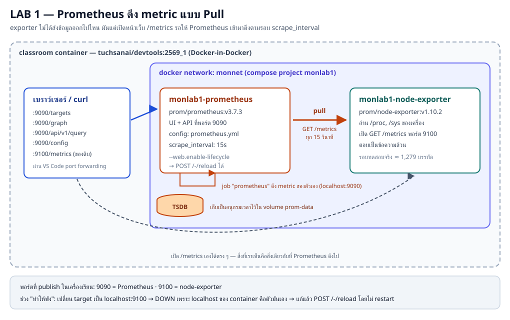
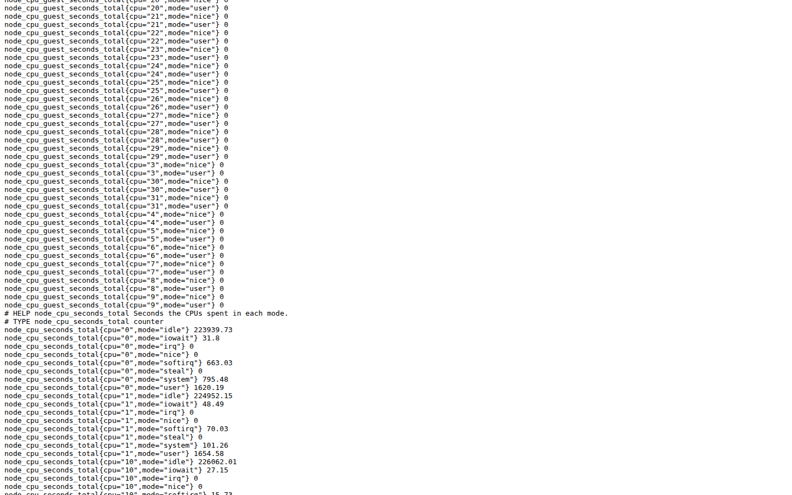
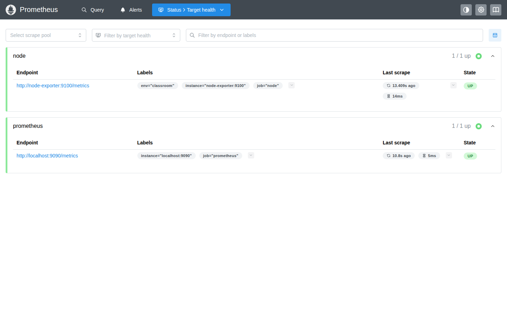
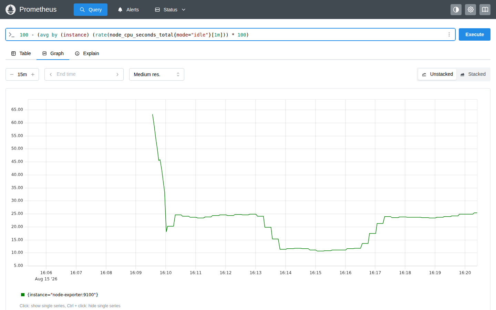
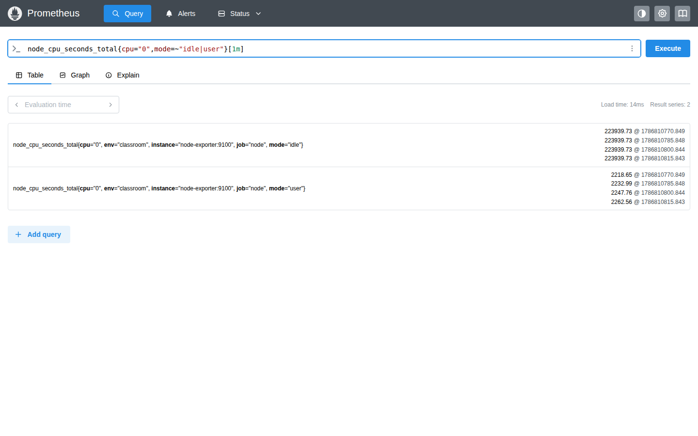
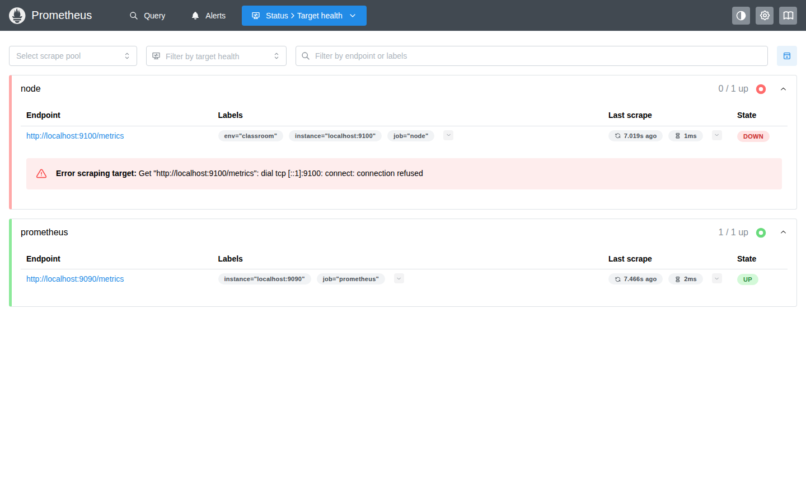

# LAB 1 — Prometheus ครั้งแรก: จาก `/metrics` ถึง PromQL

> โฟลเดอร์ `001_LAB_Prometheus_First_Scrape` = **LAB 1** ของชุด Monitoring
> (ไฟล์ของแล็บนี้: `docker-compose.yml` · `prometheus.yml` · `prometheus.broken.yml` · `readme.md` · `images/`)

## สิ่งที่จะได้เรียนรู้

- เข้าใจ **pull model**: Prometheus เป็นฝ่ายเดินไปดึงข้อมูลเอง ไม่ใช่ให้แอปส่งเข้ามา
- อ่าน **exposition format** ของ exporter เป็น: `# HELP` / `# TYPE` / `metric_name{label="value"} number`
- แยก **counter** (ขึ้นอย่างเดียว) กับ **gauge** (ขึ้นลงได้) จากบรรทัด `# TYPE` จริง
- เขียนและอ่าน `prometheus.yml` ทีละบรรทัด: `global` · `scrape_configs` · `static_configs` · `targets` · labels
- อ่านหน้า **Status → Target health** (`/targets`): State, Last scrape, Duration, labels ที่ Prometheus แปะให้เอง
- ใช้ PromQL ชุดแรก: `up`, ตัวกรอง label, `rate()` บน counter และสูตร **%CPU used**
- เห็นกับดักการ `sum()` โดยไม่กรอง label ด้วยของจริง (พื้นที่ดิสก์ถูกนับซ้ำ 4 เท่า)
- แยก **instant vector / range vector `[1m]` / scalar** ออกจากกันได้
- ไล่ปัญหา target **DOWN** 2 แบบ (config ผิด กับ target ล่มจริง) แล้วแก้ด้วย **hot reload** ที่ไม่ต้อง restart container
- พิสูจน์ว่า UI กับ HTTP API (`/api/v1/query`) คือทางเดียวกัน

## ภาพรวมของแล็บนี้

1. **เปิดเฉพาะ node-exporter ก่อน** — เปิด `http://localhost:9100/metrics` ดูของดิบ ให้เห็นว่า exporter คือ "หน้าเว็บที่พ่นตัวเลข" เฉย ๆ
2. **อ่าน exposition format** — `# HELP`, `# TYPE`, บรรทัดข้อมูล และความต่างของ counter กับ gauge
3. **เพิ่ม Prometheus** — เขียน `prometheus.yml` ให้ไป scrape ทั้ง node-exporter และตัวมันเอง ทุก 15 วินาที
4. **ดู `/targets`** — ยืนยันว่า scrape สำเร็จ พร้อมเวลาและ label ที่แปะมากับข้อมูล
5. **PromQL ชุดแรก** — `up`, หน่วยความจำ, load, `rate()` ของ counter, %CPU ที่ใช้จริง และกับดักการรวม series โดยไม่กรอง
6. **3 ประเภทของผลลัพธ์** — instant vector / range vector / scalar
7. **ทำให้พังครั้งที่ 1** — ตั้ง target เป็น `localhost:9100` (ความผิดพลาดอันดับหนึ่งของคนเริ่มใช้ Prometheus) แล้วแก้ด้วย hot reload
8. **ทำให้พังครั้งที่ 2** — หยุด node-exporter ให้เห็นว่า `up` กลายเป็น `0` แล้วเปิดกลับ
9. **เรียกผ่าน API** — `/api/v1/query` และ `/api/v1/query_range` คือเบื้องหลังของหน้า Query



> **คำถามก่อนเริ่ม:** Prometheus รู้ค่า CPU/RAM ของเครื่องเราได้อย่างไร — มีใครส่งข้อมูลไปให้มันหรือเปล่า? และถ้า Prometheus ดับไป 5 นาที ข้อมูลช่วงนั้นจะไปอยู่ที่ไหน? แล็บนี้จะพิสูจน์คำตอบด้วย container จริง

แล็บนี้ใช้ terminal เดียว ทุกคำสั่งตั้งแต่ข้อ 1 เป็นต้นไปให้รัน **ข้างในเครื่องเรียน** ผ่าน VS Code Remote-SSH

---

## 0. เตรียมเครื่องเรียน

ทำบนเครื่องของเราเอง — เปิด classroom container ที่มี Docker พร้อมใช้ แล้ว SSH เข้าไป:

```bash
docker start devtools 2>/dev/null || \
  docker run -dit --name devtools --privileged -p 2222:22 tuchsanai/devtools:2569_1
ssh root@localhost -p 2222        # password : passwd
```

> 📝 **คำอธิบาย:** `docker start ... || docker run ...` ใช้เครื่องเรียนเดิมถ้ามี และสร้างใหม่เฉพาะเมื่อยังไม่มี · `-dit` รันเบื้องหลังพร้อม terminal · `--name devtools` ตั้งชื่อคงที่ · `--privileged` จำเป็นสำหรับรัน Docker ซ้อนข้างใน classroom container · `-p 2222:22` ส่ง port SSH จากเครื่องเราเข้า port 22 ของกล่อง · หลัง SSH แล้ว prompt จะเป็นฝั่งเครื่องเรียน ซึ่งเป็นที่รันคำสั่ง Docker ทั้งหมดของ LAB
>
> ⚠️ `--privileged` ให้สิทธิ์สูงมาก ใช้เฉพาะ disposable classroom container นี้ ห้ามนำรูปแบบนี้ไปใช้กับ production workload

ใน VS Code แนะนำให้ใช้ **Remote-SSH** ต่อ `root@localhost:2222` แล้วเปิดโฟลเดอร์ `~/labwork/DevTools` เพื่อแก้ไฟล์และเปิด terminal ในเครื่องเรียนโดยตรง

ตรวจว่า Docker CLI คุยกับ daemon ชั้นในได้:

```bash
docker --version
docker info --format 'Docker daemon: {{.ServerVersion}}'
```

> 📝 **คำอธิบาย:** บรรทัดแรกดูเวอร์ชัน CLI ส่วน `docker info` ถาม daemon จริง จึงแยกได้ระหว่าง "ติดตั้งคำสั่ง Docker แล้ว" กับ "daemon พร้อมรับคำสั่งแล้ว" · ถ้าพบ `Cannot connect to the Docker daemon` ให้รอสักครู่แล้วลองใหม่ หรือย้อนตรวจว่า SSH เข้ามาในเครื่องเรียนแล้ว

✅ **Expected output** — ต้องมีเลขเวอร์ชันครบสองบรรทัด (เลขเวอร์ชันและ build อาจเปลี่ยนตาม image ห้องเรียน):

```text
Docker version 29.6.2, build dfc4efb
Docker daemon: 29.6.2
```

---

## 1. Clone โค้ดแล็บ

```bash
mkdir -p ~/labwork && cd ~/labwork
git clone https://github.com/Tuchsanai/DevTools.git
cd DevTools/03_Application_Docker/03_Monitoring/001_LAB_Prometheus_First_Scrape
ls -1
```

> 📝 **คำอธิบาย:** `mkdir -p` สร้างพื้นที่ทำงานโดยไม่ error ถ้ามีอยู่แล้ว · `git clone` ดึงไฟล์ของหลักสูตร · `cd` เข้า LAB นี้ให้ถูกโฟลเดอร์ก่อนใช้ Compose (สำคัญมาก เพราะ compose ของแล็บนี้ mount โฟลเดอร์ปัจจุบันเข้าไปเป็น config ของ Prometheus) · ถ้าเคย clone repository ไว้แล้ว ให้ข้าม `git clone` แล้ว `cd` เข้า path เดิมได้เลย

✅ **Expected output** — ต้องเห็นไฟล์ของแล็บครบ:

```text
docker-compose.yml
images
prometheus.broken.yml
prometheus.yml
readme.md
```

ดึง image ที่ pin เวอร์ชันไว้ก่อนเริ่ม เพื่อแยกขั้น download ออกจากขั้นสร้าง container:

```bash
docker compose pull --quiet
```

> 📝 **คำอธิบาย:** แล็บนี้ใช้ `prom/node-exporter:v1.10.2` และ `prom/prometheus:v3.7.3` · `--quiet` ลดรายละเอียดแต่ Compose รุ่นนี้ยังรายงานสถานะ Pulling/Pulled · การ pin tag ทำให้ทั้งห้องได้เวอร์ชันเดียวกัน — **ห้ามใช้ `latest`** เพราะ UI/ชื่อเมนูของ Prometheus 3 ต่างจาก Prometheus 2 ที่พบในบทเรียนเก่าทั่วอินเทอร์เน็ต

✅ **Expected output** — ลำดับบรรทัดอาจสลับกัน และถ้ามี image อยู่แล้วอาจจบเร็วกว่านี้:

```text
 Image prom/node-exporter:v1.10.2 Pulling
 Image prom/prometheus:v3.7.3 Pulling
 Image prom/node-exporter:v1.10.2 Pulled
 Image prom/prometheus:v3.7.3 Pulled
```

---

## 2. เปิดเฉพาะ Exporter ก่อน — ดูของดิบที่ Prometheus จะไปดึง

เริ่มจาก service เดียวคือ `node-exporter` (ยังไม่เปิด Prometheus):

```bash
docker compose up -d node-exporter
docker compose ps
```

> 📝 **คำอธิบาย:** `docker compose up -d <service>` เปิดเฉพาะ service ที่ระบุ ทำให้เห็นชัดว่า exporter ทำงานได้ด้วยตัวเองโดยไม่ต้องมี Prometheus · ใน `docker-compose.yml` ตั้ง `container_name: monlab1-node-exporter` ไว้ ชื่อจึงสั้นและเดาได้ · exporter ต้อง mount `/proc`, `/sys`, `/` เข้ามาเพราะตัวเลขทั้งหมดมันอ่านจากไฟล์พิเศษของเคอร์เนล ไม่ได้ "วัด" เอง
>
> ⚠️ ในเครื่องเรียนแบบ Docker-in-Docker **ห้ามใช้** `- /:/host:ro,rslave` แบบที่เห็นในเอกสารทั่วไป เพราะจะได้ error `path / is mounted on / but it is not a shared or slave mount` — compose ของแล็บนี้จึงใช้ `- /:/rootfs:ro` คู่กับ flag `--path.rootfs=/rootfs` แทน

✅ **Expected output** — มี container เดียวและ port `9100` ถูกเปิดออกมา (เวลาอาจต่างกัน):

```text
 Network monnet Creating
 Network monnet Created
 Container monlab1-node-exporter Creating
 Container monlab1-node-exporter Created
 Container monlab1-node-exporter Starting
 Container monlab1-node-exporter Started
NAME                    IMAGE                        COMMAND                  SERVICE         CREATED        STATUS                  PORTS
monlab1-node-exporter   prom/node-exporter:v1.10.2   "/bin/node_exporter …"   node-exporter   1 second ago   Up Less than a second   0.0.0.0:9100->9100/tcp, [::]:9100->9100/tcp
```

เปิดดูสิ่งที่ exporter ตอบกลับมา:

```bash
curl -s http://localhost:9100/metrics | head -30
```

> 📝 **คำอธิบาย:** นี่คือ **exposition format** — เป็นข้อความล้วน ไม่ใช่ JSON · `head -30` ตัดมาดูแค่ต้นไฟล์ เพราะทั้งหน้ายาวเป็นพันบรรทัด · สังเกตว่าช่วงต้นเป็น `go_*` ซึ่งเป็น metric ของ **ตัว exporter เอง** (มันเขียนด้วยภาษา Go) ส่วน metric ของเครื่องจะขึ้นต้นด้วย `node_*` และอยู่ถัดลงไป · จุดสำคัญคือ exporter **ไม่ได้ส่งข้อมูลไปไหนเลย** มันแค่เปิดหน้าเว็บรอให้คนมาดึง — ตอนนี้ยังไม่มี Prometheus สักตัว แต่ข้อมูลก็มีให้อ่านแล้ว

✅ **Expected output** — ตัวเลขต่างกันได้ทุกเครื่อง แต่โครงสร้างต้องเป็นแบบนี้:

```text
# HELP go_gc_duration_seconds A summary of the wall-time pause (stop-the-world) duration in garbage collection cycles.
# TYPE go_gc_duration_seconds summary
go_gc_duration_seconds{quantile="0"} 0
go_gc_duration_seconds{quantile="0.25"} 0
go_gc_duration_seconds{quantile="0.5"} 0
go_gc_duration_seconds{quantile="0.75"} 0
go_gc_duration_seconds{quantile="1"} 0
go_gc_duration_seconds_sum 0
go_gc_duration_seconds_count 0
# HELP go_gc_gogc_percent Heap size target percentage configured by the user, otherwise 100. This value is set by the GOGC environment variable, and the runtime/debug.SetGCPercent function. Sourced from /gc/gogc:percent.
# TYPE go_gc_gogc_percent gauge
go_gc_gogc_percent 100
# HELP go_gc_gomemlimit_bytes Go runtime memory limit configured by the user, otherwise math.MaxInt64. This value is set by the GOMEMLIMIT environment variable, and the runtime/debug.SetMemoryLimit function. Sourced from /gc/gomemlimit:bytes.
# TYPE go_gc_gomemlimit_bytes gauge
go_gc_gomemlimit_bytes 9.223372036854776e+18
# HELP go_goroutines Number of goroutines that currently exist.
# TYPE go_goroutines gauge
go_goroutines 7
# HELP go_info Information about the Go environment.
# TYPE go_info gauge
go_info{version="go1.25.3"} 1
```

### 2.1 อ่าน counter กับ gauge จากบรรทัด `# TYPE` จริง

```bash
curl -s http://localhost:9100/metrics | grep -E '^# (HELP|TYPE) node_cpu_seconds_total '
curl -s http://localhost:9100/metrics | grep '^node_cpu_seconds_total{cpu="0"'
```

> 📝 **คำอธิบาย:** `# HELP` = คำอธิบายภาษาอังกฤษของ metric · `# TYPE` = ชนิด (`counter`, `gauge`, `histogram`, `summary`, `untyped`) · บรรทัดข้อมูลคือ `ชื่อ{label="ค่า",...} ตัวเลข` · `node_cpu_seconds_total` เป็น **counter** หน่วยเป็น "วินาทีสะสม" ที่ CPU แต่ละแกนใช้ไปในแต่ละ mode — มันมีแต่เพิ่มขึ้น จึงห้ามอ่านค่าดิบตรง ๆ ต้องใช้ `rate()` ในข้อ 5 · label `cpu` และ `mode` ทำให้ metric ชื่อเดียวแตกเป็นหลาย **series** (เครื่องทดสอบมี 32 core × 8 mode = 256 series จาก metric ชื่อเดียว)

✅ **Expected output** — ตัวเลขวินาทีสะสมต่างกันได้ตามอายุเครื่อง:

```text
# HELP node_cpu_seconds_total Seconds the CPUs spent in each mode.
# TYPE node_cpu_seconds_total counter
node_cpu_seconds_total{cpu="0",mode="idle"} 223938.67
node_cpu_seconds_total{cpu="0",mode="iowait"} 31.76
node_cpu_seconds_total{cpu="0",mode="irq"} 0
node_cpu_seconds_total{cpu="0",mode="nice"} 0
node_cpu_seconds_total{cpu="0",mode="softirq"} 656.26
node_cpu_seconds_total{cpu="0",mode="steal"} 0
node_cpu_seconds_total{cpu="0",mode="system"} 791.19
node_cpu_seconds_total{cpu="0",mode="user"} 677.39
```

ทีนี้ดูฝั่ง gauge บ้าง:

```bash
curl -s http://localhost:9100/metrics | grep -E '^# (HELP|TYPE) node_memory_MemAvailable_bytes '
curl -s http://localhost:9100/metrics | grep -E '^node_(load1|memory_MemAvailable_bytes|memory_MemTotal_bytes) '
```

> 📝 **คำอธิบาย:** `node_memory_MemAvailable_bytes` เป็น **gauge** = ค่า ณ ขณะนั้น ขึ้นลงได้ อ่านตรง ๆ ได้เลย ไม่ต้อง `rate()` · `node_load1` ก็เป็น gauge เช่นกัน · หน่วยของ Prometheus นิยมใช้หน่วยฐาน (bytes, seconds) แล้วค่อยหารตอน query — จึงเห็นเลขยาว ๆ แบบ `6.6037305344e+10`

✅ **Expected output** — ค่า RAM/โหลดขึ้นกับเครื่อง (เลขอาจต่างกันในแต่ละเครื่อง):

```text
# HELP node_memory_MemAvailable_bytes Memory information field MemAvailable_bytes.
# TYPE node_memory_MemAvailable_bytes gauge
node_load1 7.72
node_memory_MemAvailable_bytes 6.1058863104e+10
node_memory_MemTotal_bytes 6.6037305344e+10
```

### 2.2 หน้าเดียวมีกี่บรรทัด กี่ชนิด

```bash
curl -s http://localhost:9100/metrics | grep -vc '^#'
curl -s http://localhost:9100/metrics | grep '^# TYPE' | awk '{print $4}' | sort | uniq -c | sort -rn
```

> 📝 **คำอธิบาย:** `grep -vc '^#'` นับเฉพาะบรรทัดข้อมูล (ตัดบรรทัดคอมเมนต์ `# HELP`/`# TYPE` ออก) = จำนวน series ที่ exporter เปิดให้ในรอบนั้น · คำสั่งที่สองนับว่ามี metric กี่ชนิดแต่ละแบบ ทำให้เห็นว่าโลกจริงมี gauge เยอะสุด และมี `untyped` ปนอยู่ด้วย

✅ **Expected output** — จำนวนขึ้นกับ collector ที่เปิดและฮาร์ดแวร์ (เลขอาจต่างกันในแต่ละเครื่อง):

```text
1279
    176 gauge
     67 counter
     49 untyped
      1 summary
```

### 2.3 เปิดด้วยเบราว์เซอร์

ใน VS Code เปิดแท็บ **PORTS** ข้าง TERMINAL → **Forward a Port** → ใส่ `9100` แล้วเปิด `http://localhost:9100/metrics`

> 📝 **คำอธิบาย:** port `9100` เปิดอยู่ **ในเครื่องเรียน** ไม่ใช่บนเครื่องเรา การพิมพ์ `localhost:9100` บนเบราว์เซอร์ของเราจะใช้ได้ก็ต่อเมื่อทำ port forwarding แล้วเท่านั้น (VS Code Remote-SSH ทำให้อัตโนมัติ หรือใช้ `ssh -L 9100:localhost:9100 root@localhost -p 2222`)



> 📝 **คำอธิบาย:** ภาพนี้เลื่อนลงมาที่ช่วง `# HELP node_cpu_seconds_total` เพื่อให้เห็นครบสามส่วนในภาพเดียว: บรรทัด HELP, บรรทัด TYPE ที่บอกว่า `counter` และบรรทัดข้อมูลที่แตกตาม label `cpu`/`mode` · นี่คือ "ฐานข้อมูล" ทั้งหมดที่ exporter มี — ไม่มี history ไม่มีกราฟ มีแต่ค่าปัจจุบัน ใครอยากได้ย้อนหลังต้องมาดึงเก็บเอง

---

## 3. เพิ่ม Prometheus — คนที่เดินมาดึงข้อมูลทุก 15 วินาที

ดูไฟล์ `prometheus.yml` ก่อน:

```bash
cat prometheus.yml
```

✅ **Expected output**

```text
global:
  scrape_interval: 15s
  scrape_timeout: 10s
  evaluation_interval: 15s
  external_labels:
    monitor: monlab1

scrape_configs:
  - job_name: prometheus
    static_configs:
      - targets:
          - localhost:9090

  - job_name: node
    static_configs:
      - targets:
          - node-exporter:9100
        labels:
          env: classroom
```

> 📝 **คำอธิบายทีละบรรทัด:**
>
> - `global:` ค่าตั้งต้นที่ใช้กับทุก job ถ้า job ไม่ได้กำหนดทับ
> - `scrape_interval: 15s` ดึงข้อมูลทุก 15 วินาที — **ถ้าไม่เขียนบรรทัดนี้ ค่า default คือ `1m`** ซึ่งห่างเกินไปสำหรับห้องเรียน (กราฟจุดห่าง และ `rate(...[1m])` จะมีจุดไม่พอจนได้ผลว่าง) ข้อ 7 มีวิธีพิสูจน์ค่า default นี้
> - `scrape_timeout: 10s` ถ้า exporter ตอบช้ากว่านี้ถือว่ารอบนั้นล้มเหลว (ต้อง ≤ `scrape_interval`)
> - `evaluation_interval: 15s` รอบประเมิน rule (ยังไม่ใช้ในแล็บนี้ จะได้ใช้ตอน LAB Alerting)
> - `external_labels:` label ที่ติดไปกับข้อมูลตอนส่งออกนอกระบบ (federation/remote write/Alertmanager) — ตั้งไว้เพื่อบอกว่า Prometheus ตัวนี้คือใคร
> - `scrape_configs:` รายการงาน scrape ทั้งหมด
> - `job_name: prometheus` งานแรกให้ Prometheus **ดึง metric ของตัวเอง** เป็นวิธีมาตรฐานในการเฝ้าดูตัวมันเอง
> - `static_configs:` / `targets:` ระบุปลายทางแบบเขียนมือ (โลกจริงมี service discovery ของ Docker/Kubernetes มาแทน)
> - `node-exporter:9100` ใช้ **ชื่อ service ของ Compose** ซึ่ง Docker DNS แปลงเป็น IP บน network `monnet` ให้ — ห้ามใช้ `localhost` (ข้อ 7 จะพิสูจน์ว่าพังอย่างไร)
> - `labels: env: classroom` label ที่แปะเพิ่มให้ทุก series ของ target นี้ตอน scrape — ใช้แยกสภาพแวดล้อม dev/prod ได้
> - Prometheus จะเติม label ให้เองอีก 2 ตัวเสมอคือ `job` และ `instance`

เปิด Prometheus แล้วรอจนพร้อม:

```bash
docker compose up -d
for i in $(seq 1 60); do
  curl -fsS http://localhost:9090/-/ready >/dev/null 2>&1 && break
  sleep 1
done
curl -s http://localhost:9090/-/ready; echo
docker compose ps
```

> 📝 **คำอธิบาย:** `docker compose up -d` (ไม่ระบุ service) เปิดครบทุกตัว โดย `node-exporter` ที่รันอยู่แล้วจะไม่ถูกแตะ (ขึ้นสถานะ `Running`) · endpoint `/-/ready` เป็น readiness ของ Prometheus เอง ใช้แทนการเดา `sleep` · เพดาน 60 รอบกัน loop ค้างเมื่อมีปัญหาจริง · ใน compose เราใส่ `--web.enable-lifecycle` ไว้ตั้งแต่ต้นเพราะ **flag นี้ปิดโดย default** และจำเป็นสำหรับ hot reload ในข้อ 7 · `--storage.tsdb.retention.time=2h` เก็บข้อมูลย้อนหลังพอสำหรับคาบเรียนเท่านั้น

✅ **Expected output** — Prometheus ถูกสร้างใหม่ ส่วน node-exporter เดิมยังอยู่ (เวลาอาจต่างกัน):

```text
 Volume monlab1_prom-data Creating
 Volume monlab1_prom-data Created
 Container monlab1-node-exporter Running
 Container monlab1-prometheus Creating
 Container monlab1-prometheus Created
 Container monlab1-prometheus Starting
 Container monlab1-prometheus Started
Prometheus Server is Ready.
NAME                    IMAGE                        COMMAND                  SERVICE         CREATED          STATUS          PORTS
monlab1-node-exporter   prom/node-exporter:v1.10.2   "/bin/node_exporter …"   node-exporter   16 seconds ago   Up 16 seconds   0.0.0.0:9100->9100/tcp, [::]:9100->9100/tcp
monlab1-prometheus      prom/prometheus:v3.7.3       "/bin/prometheus --c…"   prometheus      1 second ago     Up 1 second     0.0.0.0:9090->9090/tcp, [::]:9090->9090/tcp
```

รอให้ scrape รอบแรกเสร็จก่อนดูผล:

```bash
for i in $(seq 1 60); do
  n=$(curl -s 'http://localhost:9090/api/v1/targets?state=active' | grep -o '"health":"up"' | wc -l)
  [ "$n" = "2" ] && break
  sleep 1
done
echo "targets ที่ UP = $n"
```

> 📝 **คำอธิบาย:** ทันทีที่ Prometheus เพิ่งขึ้น target จะมีสถานะ `unknown` เพราะยัง **ไม่ถึงรอบ scrape แรก** — ไม่ใช่ error · loop นี้รอจนได้ `"health":"up"` ครบ 2 อัน (job `node` + job `prometheus`) แล้วค่อยไปต่อ

✅ **Expected output**

```text
targets ที่ UP = 2
```

---

## 4. หน้า Targets — หลักฐานว่า scrape สำเร็จ

ใน VS Code forward port `9090` แล้วเปิด `http://localhost:9090/targets` (หรือกดเมนู **Status → Target health**)



> 📝 **คำอธิบาย:** Prometheus 3.7.3 ใช้ UI ใหม่ (ไม่เหมือนภาพในบทเรียนเก่าที่เป็น Prometheus 2) เมนูบนสุดมี **Query**, **Alerts**, **Status** · หน้านี้อยู่ที่ **Status → Target health** · แต่ละกล่องคือหนึ่ง **scrape pool** (= หนึ่ง job) พร้อมตัวนับ `1 / 1 up` · คอลัมน์ **Endpoint** คือ URL ที่ Prometheus ยิงไปจริง · **Labels** คือ label ที่จะติดไปกับทุก series ของ target นี้ (`env="classroom"` มาจากไฟล์ config ส่วน `instance`/`job` Prometheus ใส่ให้เอง) · **Last scrape** บอกว่าเพิ่งดึงไปเมื่อกี่วินาทีที่แล้ว และตัวเลขข้าง ๆ คือเวลาที่ใช้ดึง · **State** เป็น `UP` สีเขียวเมื่อ scrape รอบล่าสุดสำเร็จ

อ่านข้อมูลชุดเดียวกันจาก API (ไม่ต้องเปิดเบราว์เซอร์):

```bash
curl -s 'http://localhost:9090/api/v1/targets?state=active' | python3 -c 'import sys, json
for t in json.load(sys.stdin)["data"]["activeTargets"]:
    print(t["labels"]["job"], t["scrapeUrl"], t["health"], str(round(t["lastScrapeDuration"] * 1000, 1)) + "ms")'
```

> 📝 **คำอธิบาย:** `?state=active` ขอเฉพาะ target ที่กำลังใช้งาน · `python3` มีในเครื่องเรียนอยู่แล้วจึงใช้แทน `jq` · เราหยิบ 4 ค่าที่ใช้ไล่ปัญหาบ่อยที่สุด: job, URL ที่ยิงจริง, สุขภาพ และเวลาที่ใช้ scrape · **จำ URL นี้ไว้** ข้อ 7 จะใช้ดู `lastError` ตอน target พัง

✅ **Expected output** — เวลาที่ใช้ scrape ต่างกันได้ (เลขอาจต่างกันในแต่ละเครื่อง):

```text
node http://node-exporter:9100/metrics up 14.4ms
prometheus http://localhost:9090/metrics up 5.9ms
```

---

## 5. PromQL ชุดแรก

เปิดหน้า **Query** (`http://localhost:9090/graph`) แล้วพิมพ์ query ทีละอันในช่องด้านบน กด **Execute** — แท็บ **Table** แสดงค่าล่าสุด ส่วนแท็บ **Graph** วาดย้อนหลังตามช่วงเวลาที่เลือก

เพื่อให้จดผลลงเอกสารได้ง่าย เราจะถาม Prometheus จาก terminal ด้วย ให้วางฟังก์ชันช่วยนี้ลง shell หนึ่งครั้ง:

```bash
promq() {
  curl -sG http://localhost:9090/api/v1/query --data-urlencode "query=$1" \
  | python3 -c 'import sys, json
d = json.load(sys.stdin)["data"]
if d["resultType"] == "scalar":
    print("scalar => " + d["result"][1]); raise SystemExit
for r in d["result"]:
    m = dict(r["metric"]); name = m.pop("__name__", "")
    lbl = ",".join(k + "=" + v for k, v in sorted(m.items()))
    if "values" in r:
        pts = r["values"]
        print(name + "{" + lbl + "} => " + str(len(pts)) + " points: " + pts[0][1] + " ... " + pts[-1][1])
    else:
        print(name + "{" + lbl + "} => " + r["value"][1])'
}
```

> 📝 **คำอธิบาย:** `curl -sG ... --data-urlencode` ส่ง query ผ่าน GET โดย encode อักขระพิเศษ (`{`, `"`, ช่องว่าง) ให้เอง จึงพิมพ์ PromQL ตรง ๆ ได้ · python สั้น ๆ แปลง JSON ให้เหลือ `metric{labels} => ค่า` · ฟังก์ชันนี้รองรับผลลัพธ์ทั้ง 3 แบบที่จะเจอในข้อ 6 · **นี่คือ API เดียวกับที่หน้าเว็บเรียกใช้** ไม่ใช่ทางลัดพิเศษอะไร

### 5.1 `up` — metric ที่ Prometheus สร้างเอง

```bash
promq 'up'
promq 'up{job="node"}'
```

> 📝 **คำอธิบาย:** `up` ไม่ได้มาจาก exporter แต่ Prometheus **สร้างขึ้นเองทุกครั้งที่ scrape**: `1` = รอบนั้นดึงสำเร็จ, `0` = ล้มเหลว · `{job="node"}` คือ **label matcher** ใช้กรองให้เหลือเฉพาะ series ที่ต้องการ (`=`, `!=`, `=~` regex, `!~`) · `up` เป็น metric แรกที่ควรดูเสมอเวลาสงสัยว่า "ข้อมูลหายไปไหน"

✅ **Expected output** — สองบรรทัดแรกมาจาก query แรก บรรทัดสุดท้ายมาจาก query ที่กรองแล้ว (ลำดับสองบรรทัดแรกอาจสลับกัน เพราะ Prometheus ไม่รับประกันลำดับ):

```text
up{env=classroom,instance=node-exporter:9100,job=node} => 1
up{instance=localhost:9090,job=prometheus} => 1
up{env=classroom,instance=node-exporter:9100,job=node} => 1
```

### 5.2 gauge อ่านตรง ๆ ได้เลย

```bash
promq 'node_memory_MemAvailable_bytes / 1024 / 1024'
promq 'node_load1'
```

> 📝 **คำอธิบาย:** หารด้วย 1024 สองครั้งเพื่อแปลง bytes → MiB · metric ตัวนี้ถูก **exporter ส่งมาเป็น bytes ตามธรรมเนียมการตั้งชื่อของ Prometheus** (ให้ใช้หน่วยฐาน แล้วค่อยแปลงตอน query/แสดงผล) — ตัว Prometheus เองไม่ได้แปลงหน่วยให้ มันเก็บตัวเลขตามที่ exporter ส่งมาเป๊ะ · ผลลัพธ์ **ไม่มีชื่อ metric** เหลืออยู่ เพราะการคำนวณทำให้มันไม่ใช่ metric เดิมอีกต่อไป — ปกติแล้วนี่คือพฤติกรรมของ PromQL ทุกครั้งที่มีตัวดำเนินการทางคณิตศาสตร์ · `node_load1` คือ load average 1 นาทีของเครื่องเรียน

✅ **Expected output** — ค่าขึ้นกับเครื่องและงานที่รันอยู่ (เลขอาจต่างกันในแต่ละเครื่อง):

```text
{env=classroom,instance=node-exporter:9100,job=node} => 56738.44140625
node_load1{env=classroom,instance=node-exporter:9100,job=node} => 5.83
```

### 5.3 สร้างภาระ CPU ชั่วคราว เพื่อให้กราฟมีอะไรให้ดู

```bash
rm -f /tmp/load.pids
for i in 1 2 3 4; do
  sh -c 'while :; do :; done' &
  echo $! >> /tmp/load.pids
done
cat /tmp/load.pids
```

> 📝 **คำอธิบาย:** สร้าง busy loop 4 ตัว แต่ละตัวกิน CPU เต็ม 1 core · `&` สั่งให้รันเบื้องหลัง · `$!` คือ PID ของงานล่าสุด เก็บไว้ในไฟล์เพื่อสั่งหยุดทีหลัง (ห้ามลืมหยุดในข้อ 6.4) · node-exporter อ่าน `/proc` ของเครื่องเรียน มันจึงเห็นภาระนี้ทันทีในรอบ scrape ถัดไป

✅ **Expected output** — เป็นเลข PID 4 ตัว (ตัวเลขต่างกันทุกครั้ง):

```text
3110
3111
3112
3113
```

### 5.4 counter ต้องใช้ `rate()` เสมอ

```bash
promq 'rate(node_cpu_seconds_total{mode="idle"}[1m])' | head -4
promq 'count(rate(node_cpu_seconds_total{mode="idle"}[1m]))'
promq 'avg by (instance) (rate(node_cpu_seconds_total{mode="idle"}[1m]))'
```

> 📝 **คำอธิบาย:** `rate(x[1m])` = อัตราการเพิ่มต่อวินาที โดยดูข้อมูลย้อนหลัง 1 นาที · เพราะหน่วยของ `node_cpu_seconds_total` คือ "วินาทีที่ CPU ใช้ไป" ผลของ `rate()` จึงอ่านเป็น **"วินาทีต่อวินาที"** — และเนื่องจากที่นี่เรากรอง `mode="idle"` ไว้ ค่าที่ได้ต่อ 1 แกนจึงคือ **สัดส่วนเวลาที่แกนนั้น "ว่าง"**: `1.0` = ว่างตลอดทั้งช่วง · `0` = ทำงานเต็มเวลาไม่ว่างเลย (ถ้า "ไม่มีข้อมูล" จะไม่มี series โผล่มาเลย ไม่ใช่ได้เลข `0`) · ผลออกมาแยกราย `cpu` เพราะ label ยังอยู่ครบ จึงต้อง `avg by (instance)` รวบให้เหลือค่าเฉลี่ยต่อเครื่อง · **กฎที่ต้องจำ:** ช่วงเวลาใน `[...]` ต้องกว้างพอให้มีอย่างน้อย 2 จุด — ที่ scrape 15 วินาที `[1m]` มักได้ราว 4 จุด กำลังดี ถ้าใส่ `[15s]` จะได้ผลว่างหรือกระโดด

✅ **Expected output** — เครื่องทดสอบมี 32 core และมี busy loop 4 ตัวอยู่

> ⚠️ **หมายเลข core ของคุณจะไม่ตรงกับตัวอย่างนี้** — busy loop ไม่ได้ถูก pin ไว้กับแกนใดแกนหนึ่ง ตัวจัดคิวของเคอร์เนลย้ายมันข้ามแกนได้ตลอดเวลา สิ่งที่ต้องดูคือ **มีบางแกน idle ใกล้ 0 และค่าเฉลี่ยรวมลดลง** ไม่ใช่ว่าต้องเป็น `cpu="0"` เป๊ะ
> ถ้าเพิ่งเปิด busy loop ไป ให้**รออย่างน้อย 1 นาที**ก่อนอ่านค่า เพราะหน้าต่าง `[1m]` ยังคาบเกี่ยวช่วงก่อนเปิดโหลดอยู่ ค่าจะยังไม่นิ่ง

```text
{cpu=0,env=classroom,instance=node-exporter:9100,job=node,mode=idle} => 0
{cpu=1,env=classroom,instance=node-exporter:9100,job=node,mode=idle} => 0
{cpu=10,env=classroom,instance=node-exporter:9100,job=node,mode=idle} => 0
{cpu=11,env=classroom,instance=node-exporter:9100,job=node,mode=idle} => 0.9807538447863067
{} => 32
{instance=node-exporter:9100} => 0.750393090496954
```

> **อ่านผลนี้อย่างไร:** `cpu="0"` มีค่า idle = 0 แปลว่า core นั้นถูกใช้เต็มเวลา (busy loop ไปนั่งอยู่ตรงนั้น) ส่วน `cpu="11"` idle ≈ 0.98 แปลว่าว่างเกือบตลอด · บรรทัด `{} => 32` คือจำนวน series ที่เข้าเงื่อนไข = จำนวน core ของเครื่อง · ค่าเฉลี่ย idle ทั้งเครื่อง ≈ 0.75 = ว่างเฉลี่ย 75% เพราะ 4 core จาก 32 ถูกใช้เต็ม

### 5.5 สูตร %CPU ที่ใช้จริง

```bash
promq '100 - (avg by (instance) (rate(node_cpu_seconds_total{mode="idle"}[1m])) * 100)'
```

> 📝 **คำอธิบาย:** ไม่มี metric ชื่อ "%CPU" ให้ใช้ตรง ๆ — ต้องประกอบเอง · หลักคิด: หาสัดส่วนเวลาที่ CPU **ว่าง** (mode `idle`) เฉลี่ยทุก core แล้วเอา 100 ลบ · คูณ 100 เพื่อแปลงสัดส่วน (0–1) เป็นเปอร์เซ็นต์ · สูตรนี้คือสูตรมาตรฐานที่ dashboard ทั่วโลกใช้ และเป็นเหตุผลว่าทำไมต้องเข้าใจ `rate()` ให้ได้ก่อน

✅ **Expected output** — ค่าขึ้นกับภาระเครื่องจริง (เลขอาจต่างกันในแต่ละเครื่อง):

```text
{instance=node-exporter:9100} => 24.960690950304596
```

เปิดแท็บ **Graph** ในหน้า Query แล้ววาง query เดียวกัน ตั้งช่วงเวลาเป็น `15m`:



> 📝 **คำอธิบาย:** แท็บ **Graph** เรียก API `query_range` ให้คำนวณ query เดิมซ้ำหลาย ๆ จุดเวลาแล้ววาดเส้น (ข้อ 9 จะเรียก API ตัวนี้เอง) · ภาพนี้มาจากรอบทดสอบที่ **เปิด busy loop → หยุด → เปิดใหม่** จึงเห็นทั้งขาลงและขาขึ้น (ประมาณ 24% ตอนมีภาระ และ 11% ตอนไม่มี) ส่วนของผู้เรียนที่ทำตามลำดับจะเห็นแค่ขั้นบันไดขาขึ้นตอนเริ่ม busy loop · จุดแรกสุดของกราฟมักกระโดดสูงผิดปกติ เพราะเป็นจุดแรกที่ `rate()` มีข้อมูลครบหน้าต่าง — ไม่ใช่ของจริง · ปุ่ม `15m` คือความกว้างของหน้าต่างเวลา ส่วน `Medium res.` คือความถี่ของจุด — ถ้าเลือกช่วงกว้างมากแต่ความละเอียดต่ำ กราฟจะเรียบเกินจริง · เส้นจะไม่มีทางเหมือนของเราเป๊ะ เพราะขึ้นกับภาระเครื่องของแต่ละคน

### 5.6 กับดักที่ต้องรู้ตั้งแต่วันแรก — ต้องกรอง label ก่อนรวม

```bash
promq 'node_filesystem_avail_bytes'
promq 'count by (fstype) (node_filesystem_avail_bytes)'
promq 'sum(node_filesystem_avail_bytes) / 1024 / 1024 / 1024'
promq 'node_filesystem_avail_bytes{mountpoint="/var/lib/docker"} / 1024 / 1024 / 1024'
```

> 📝 **คำอธิบาย:** metric เดียวกันอาจมีหลาย series ที่ **ชี้ไปยังของสิ่งเดียวกัน** · ในกล่องเรียนนี้ทั้ง 4 series มี `device="/dev/sde"` เหมือนกันหมด (ต่างกันแค่ `mountpoint` ที่ Docker เอา `/etc/hosts`, `/etc/hostname`, `/etc/resolv.conf` และ `/var/lib/docker` mount เข้ามา) ค่าจึงเท่ากันเป๊ะทั้ง 4 บรรทัด · พอสั่ง `sum()` โดยไม่กรอง จะได้ **ประมาณ 4 เท่าของความจริง** ซึ่งเป็นบั๊กที่พบบ่อยมากใน dashboard ของมือใหม่ · วิธีที่ถูกคือกรองให้เหลือ series ที่ต้องการจริง ๆ ก่อน (ที่นี่ใช้ `mountpoint="/var/lib/docker"`) แล้วเทียบกับ `df -hT` เพื่อยืนยัน
>
> หมายเหตุ: ตัวอย่างทั่วอินเทอร์เน็ตชอบเขียน `{fstype!="overlay",fstype!="tmpfs"}` — ที่นี่จะไม่เห็นผลอะไร เพราะ node-exporter v1.10.2 กรอง filesystem พวกนี้ออกให้แล้วโดย default (`--collector.filesystem.fs-types-exclude`) ผลลัพธ์จึงเหลือแต่ `ext4` · **บทเรียนคือให้ดูของจริงก่อนเสมอ** อย่าลอกตัวกรองมาใช้โดยไม่ตรวจว่ามันกรองอะไรออกจริงบ้าง

✅ **Expected output** — เลขความจุขึ้นกับเครื่อง (เลขอาจต่างกันในแต่ละเครื่อง) แต่ต้องเห็นค่าซ้ำกัน 4 บรรทัด และผลรวมเป็น 4 เท่า:

```text
node_filesystem_avail_bytes{device=/dev/sde,env=classroom,fstype=ext4,instance=node-exporter:9100,job=node,mountpoint=/etc/hostname} => 716389822464
node_filesystem_avail_bytes{device=/dev/sde,env=classroom,fstype=ext4,instance=node-exporter:9100,job=node,mountpoint=/etc/hosts} => 716389822464
node_filesystem_avail_bytes{device=/dev/sde,env=classroom,fstype=ext4,instance=node-exporter:9100,job=node,mountpoint=/etc/resolv.conf} => 716389822464
node_filesystem_avail_bytes{device=/dev/sde,env=classroom,fstype=ext4,instance=node-exporter:9100,job=node,mountpoint=/var/lib/docker} => 716389822464
{fstype=ext4} => 4
{} => 2668.760055541992
{device=/dev/sde,env=classroom,fstype=ext4,instance=node-exporter:9100,job=node,mountpoint=/var/lib/docker} => 667.190013885498
```

เทียบกับคำสั่งของระบบปฏิบัติการเพื่อดูว่าเลขไหนคือความจริง:

```bash
df -hT | grep -E 'Filesystem|/dev/sde'
```

> 📝 **คำอธิบาย:** `df` รายงานพื้นที่ว่างจริงของดิสก์ · ต้องตรงกับผลของ query ที่กรอง `mountpoint` แล้ว (667 GiB ≈ 668G) ไม่ใช่ผลของ `sum()` ที่ได้ 2,668 GiB · **นิสัยที่ควรติดตัว:** ทุกครั้งที่ใช้ `sum()` ให้ถามตัวเองก่อนว่า "series ที่กำลังรวมกันอยู่ หมายถึงของคนละชิ้นจริงหรือเปล่า"

✅ **Expected output** — ขนาดดิสก์ต่างกันได้ตามเครื่อง:

```text
Filesystem     Type     Size  Used Avail Use% Mounted on
/dev/sde       ext4    1007G  289G  668G  31% /etc/hosts
```

---

## 6. ผลลัพธ์ของ PromQL — 3 แบบที่จะใช้จริงในหลักสูตรนี้

> PromQL มี expression type ทั้งหมด **4 แบบ** คือ instant vector · range vector · scalar · string
> แต่ `string` แทบไม่ได้ใช้ในงาน monitoring จริง หัวข้อนี้จึงโฟกัสที่ 3 แบบแรก

### 6.1 instant vector — ค่าเดียวต่อ series ณ เวลาปัจจุบัน

```bash
promq 'node_load1'
```

> 📝 **คำอธิบาย:** selector เปล่า ๆ (ไม่มี `[...]` ต่อท้าย) ให้ **instant vector** = ค่าล่าสุด 1 ค่าต่อ 1 series · นี่คือรูปแบบที่ใช้บ่อยที่สุด · แท็บ Graph วาดได้เฉพาะ **instant vector และ scalar** (วาด range vector กับ string ไม่ได้) · ถ้า ณ เวลานั้นไม่มีข้อมูลใหม่ Prometheus จะมองย้อนหลังได้ไม่เกิน 5 นาที (lookback delta) ถ้าเกินนั้นถือว่า series หายไป

✅ **Expected output** — ค่าตามภาระเครื่องขณะนั้น (เลขอาจต่างกันในแต่ละเครื่อง):

```text
node_load1{env=classroom,instance=node-exporter:9100,job=node} => 9.7
```

### 6.2 range vector — หลายจุดเวลาต่อ series

```bash
promq 'node_cpu_seconds_total{cpu="0",mode=~"idle|user"}[1m]'
```

> 📝 **คำอธิบาย:** ใส่ `[1m]` ต่อท้าย selector ได้ **range vector** = ชุดจุดข้อมูลย้อนหลัง 1 นาทีของแต่ละ series · ฟังก์ชันช่วยของเราพิมพ์เป็น "จำนวนจุด: ค่าแรก ... ค่าสุดท้าย" · scrape ทุก 15 วินาที → 1 นาทีได้ **4 จุด** · `mode=~"idle|user"` ใช้ regex matcher เลือกสอง mode มาเทียบกัน · **range vector เอาไปวาดกราฟตรง ๆ ไม่ได้** ต้องผ่านฟังก์ชันอย่าง `rate()`, `increase()`, `avg_over_time()` ก่อนเสมอ

✅ **Expected output** — ตัวเลขสะสมต่างกันได้ แต่ต้องได้ 4 จุด และฝั่ง `user` ต้องเพิ่มขึ้น (เลขอาจต่างกันในแต่ละเครื่อง):

```text
node_cpu_seconds_total{cpu=0,env=classroom,instance=node-exporter:9100,job=node,mode=idle} => 4 points: 223939.73 ... 223939.73
node_cpu_seconds_total{cpu=0,env=classroom,instance=node-exporter:9100,job=node,mode=user} => 4 points: 2203.77 ... 2247.76
```

ลองใน UI ด้วย: วาง `node_cpu_seconds_total{cpu="0",mode=~"idle|user"}[1m]` แล้วดูแท็บ **Table**



> 📝 **คำอธิบาย:** แท็บ Table แสดงทุกจุดเวลาพร้อม timestamp ของมัน ทำให้เห็นด้วยตาว่า range vector ต่างจาก instant vector อย่างไร · ถ้าเปลี่ยนไปแท็บ Graph จะได้ error เพราะวาด range vector ตรง ๆ ไม่ได้

### 6.3 scalar — ตัวเลขโดด ๆ ไม่มี label

```bash
promq 'scalar(count(up))'
```

> 📝 **คำอธิบาย:** `count(up)` นับจำนวน series ของ `up` (= จำนวน target) ได้ instant vector ที่ไม่มี label · `scalar()` แปลงให้เป็นตัวเลขโดด ๆ ซึ่งใช้ในสูตรที่ต้องการค่าเดียว เช่น threshold · ถ้า instant vector มีมากกว่า 1 series `scalar()` จะได้ `NaN`

✅ **Expected output**

```text
scalar => 2
```

### 6.4 หยุด busy loop

```bash
kill $(cat /tmp/load.pids)
rm -f /tmp/load.pids
ps -eo pid,args | grep -c '[w]hile :'
```

> 📝 **คำอธิบาย:** ส่งสัญญาณหยุดให้ทุก PID ที่จดไว้ · `grep -c '[w]hile :'` นับ process ที่เหลือ — วงเล็บเหลี่ยมรอบตัวอักษรแรกเป็นทริกให้ `grep` ไม่นับตัวมันเอง · ต้องได้ `0` ก่อนไปข้อต่อไป ไม่งั้นเครื่องจะร้อนทั้งคาบ

✅ **Expected output**

```text
0
```

---

## 7. ทำให้พังครั้งที่ 1 — `localhost` ในมุมของ container

นี่คือความผิดพลาดอันดับหนึ่งของคนเริ่มใช้ Prometheus: เขียน target เป็น `localhost:9100` เพราะบนเครื่องเรียนเรา `curl http://localhost:9100/metrics` ได้จริง

> **ทายก่อน:** ถ้าเปลี่ยน target ของ job `node` จาก `node-exporter:9100` เป็น `localhost:9100` แล้ว reload — target จะ UP หรือ DOWN และ error จะหน้าตาอย่างไร?

```bash
cp prometheus.yml prometheus.yml.bak
cp prometheus.broken.yml prometheus.yml
grep -A5 'job_name: node' prometheus.yml
```

> 📝 **คำอธิบาย:** สำรองไฟล์ดีไว้ก่อนเสมอ (`prometheus.yml.bak`) เพราะเราจะเขียนทับไฟล์เดิม · compose ของแล็บนี้ mount **ทั้งโฟลเดอร์** เป็น `/etc/prometheus` (read-only) การคัดลอกทับไฟล์บนเครื่องเรียนจึงมีผลกับสิ่งที่ container เห็นทันที โดยไม่ต้อง recreate container

✅ **Expected output**

```text
  - job_name: node
    static_configs:
      - targets:
          - localhost:9100      # ← ผิด: ต้องเป็นชื่อ service บน network monnet คือ node-exporter:9100
        labels:
          env: classroom
```

สั่ง reload แบบไม่ restart:

```bash
curl -s -X POST http://localhost:9090/-/reload -w 'reload -> HTTP %{http_code}\n'
```

> 📝 **คำอธิบาย:** `-X POST` สำคัญมาก — endpoint นี้ **รับเฉพาะ POST/PUT** ถ้ายิงด้วย GET จะได้ `HTTP 405 Only POST or PUT requests allowed` · endpoint นี้จะมีก็ต่อเมื่อรัน Prometheus ด้วย `--web.enable-lifecycle` (ปิดโดย default เพราะใครก็ตามที่ยิง POST ได้จะสั่ง reload/shutdown ได้ — production ต้องมี auth/จำกัด network ก่อนเปิด) · ผลลัพธ์ `200` แปลว่า config ใหม่ถูก **โหลดสำเร็จ**; ถ้า config ผิดไวยากรณ์จะได้ `400` และ Prometheus จะ **ใช้ config เดิมต่อไป** (ไม่ล้ม)
>
> ⚠️ Prometheus 3.7.3 **ยังไม่มี** auto-reload config แบบเปิดใช้ได้ทันที (อยู่หลัง feature flag) — ตัวอย่างบนอินเทอร์เน็ตที่บอกว่าแก้ไฟล์แล้วมีผลเองมักเป็นของรุ่นอื่น อย่าเชื่อโดยไม่ทดสอบ

✅ **Expected output**

```text
reload -> HTTP 200
```

รอจน target เปลี่ยนสถานะแล้วดูรายละเอียด:

```bash
for i in $(seq 1 60); do
  h=$(curl -s 'http://localhost:9090/api/v1/targets?state=active' | grep -o '"health":"down"' | wc -l)
  [ "$h" = "1" ] && break
  sleep 1
done
echo "targets ที่ DOWN = $h (รอ $i วินาที)"
curl -s 'http://localhost:9090/api/v1/targets?state=active' | python3 -c 'import sys, json
for t in json.load(sys.stdin)["data"]["activeTargets"]:
    print(t["labels"]["job"], "|", t["scrapeUrl"], "|", t["health"], "|", t["lastError"])'
promq 'up{job="node"}'
```

> 📝 **คำอธิบาย:** ต้องรอถึงรอบ scrape ถัดไป (สูงสุด 15 วินาที) สถานะถึงจะเปลี่ยน — reload ไม่ได้บังคับให้ scrape ทันที · ฟิลด์ `lastError` คือคำตอบว่า "พังเพราะอะไร" · สังเกตว่า `up` ยัง**มี series อยู่** แต่ค่าเป็น `0` — Prometheus บอกเราว่า "รู้จัก target นี้ แต่ดึงไม่สำเร็จ" ซึ่งต่างจากกรณี metric หายไปเลย

✅ **Expected output** — จำนวนวินาทีที่รออาจต่างกัน:

```text
targets ที่ DOWN = 1 (รอ 5 วินาที)
node | http://localhost:9100/metrics | down | Get "http://localhost:9100/metrics": dial tcp [::1]:9100: connect: connection refused
prometheus | http://localhost:9090/metrics | up |
up{env=classroom,instance=node-exporter:9100,job=node} => 1
up{env=classroom,instance=localhost:9100,job=node} => 0
```

> **สังเกตให้ดี:** ผลที่ได้ **ขึ้นกับจังหวะเวลาที่รัน** — ถ้ารันเร็วพอ จะเห็น `up` ของ job `node` **สอง** series คือตัวเก่า (`instance=node-exporter:9100`) ที่ยังค้างค่า `1` อยู่ คู่กับตัวใหม่ (`instance=localhost:9100`) ที่เป็น `0`
>
> ที่ค้างได้เพราะ instant query มองย้อนหลังได้ถึง 5 นาที (lookback delta) **แต่ค่านี้เป็นเพียงขอบเขตสูงสุด ไม่ใช่เวลาที่รับประกันว่าจะค้างครบ** — เมื่อ target ถูกถอดออกจาก config แล้ว Prometheus จะเขียน **stale marker** ให้ในเวลาไม่นาน และทันทีที่มี marker series เก่าจะหายจากผล query ทันที ไม่ต้องรอครบ 5 นาที (ค่า 5 นาทีจะมีผลจริงเฉพาะกรณีที่ไม่มี marker เช่น Prometheus ถูก restart ไปก่อน)
>
> ดังนั้นถ้ารันแล้วเห็น series เดียวก็ถือว่าปกติ — สิ่งที่ต้องดูให้ชัดคือ **`instance` ของแต่ละบรรทัด** ว่ากำลังอ่าน series ไหนอยู่



> 📝 **คำอธิบาย:** ในหน้า **Status → Target health** แถบซ้ายของ pool `node` เปลี่ยนเป็นสีแดง State เป็น `DOWN` และมีข้อความ error เต็ม ๆ ให้อ่าน · ข้อความ `dial tcp [::1]:9100: connect: connection refused` คือกุญแจ: `[::1]` คือ localhost **ของ container prometheus เอง** ไม่ใช่เครื่องเรียน และใน container นั้นไม่มีใครฟัง port 9100 อยู่ · แต่ละ container มี network namespace ของตัวเอง — `localhost` จึงแปลว่า "ตัวฉันเอง" เสมอ · ทางที่ถูกคือใช้ **ชื่อ service** (`node-exporter`) ซึ่ง Docker DNS ของ network `monnet` แปลงให้เป็น IP ของ container ปลายทาง

แก้กลับแล้ว reload อีกครั้ง:

```bash
cp prometheus.yml.bak prometheus.yml
rm -f prometheus.yml.bak
curl -s -X POST http://localhost:9090/-/reload -w 'reload -> HTTP %{http_code}\n'
for i in $(seq 1 60); do
  n=$(curl -s 'http://localhost:9090/api/v1/targets?state=active' | grep -o '"health":"up"' | wc -l)
  [ "$n" = "2" ] && break
  sleep 1
done
echo "targets ที่ UP = $n"
```

> 📝 **คำอธิบาย:** คัดลอกไฟล์สำรองกลับมาทับแล้วลบไฟล์สำรองทิ้ง เพื่อไม่ให้เหลือขยะในโฟลเดอร์แล็บ · reload อีกครั้งเพื่อให้ Prometheus อ่าน config ที่ถูกต้อง · loop รอจน target กลับมา UP ครบ 2 ตัวก่อนไปตรวจผล — อย่าเพิ่งสรุปจากคำสั่ง reload อย่างเดียวเพราะ `200` แค่บอกว่า "โหลด config ผ่าน" ไม่ได้แปลว่า "scrape สำเร็จ"

✅ **Expected output**

```text
reload -> HTTP 200
targets ที่ UP = 2
```

พิสูจน์ว่า config ที่ Prometheus **ใช้อยู่จริง** เปลี่ยนแล้ว และ container ไม่ได้ restart:

```bash
curl -s http://localhost:9090/api/v1/status/config | python3 -c 'import sys, json
print(json.load(sys.stdin)["data"]["yaml"])' | grep -E 'job_name:|^    - '
docker inspect -f 'prometheus StartedAt = {{.State.StartedAt}}' monlab1-prometheus
docker compose ps prometheus
```

> 📝 **คำอธิบาย:** `/api/v1/status/config` คืน config ที่โหลดอยู่ในหน่วยความจำ (หน้าเว็บ **Status → Configuration** ใช้ข้อมูลชุดเดียวกัน) — เป็นวิธีเดียวที่ยืนยันได้ว่า "ไฟล์บนดิสก์" กับ "สิ่งที่โปรแกรมใช้อยู่" ตรงกัน · `StartedAt` คือเวลาที่ container เริ่มรัน ถ้า hot reload ทำงานถูกต้องค่านี้ **ต้องไม่เปลี่ยน** และ `docker compose ps` ต้องแสดง uptime ที่นับต่อเนื่อง ไม่รีเซ็ตเป็นวินาทีเดียว

✅ **Expected output** — เวลาและ uptime ต่างกันได้ แต่ target ต้องกลับเป็น `node-exporter:9100` และ `STATUS` ต้องเป็น uptime ที่นับมาตั้งแต่ `up -d` (ไม่ใช่ไม่กี่วินาที):

```text
- job_name: prometheus
    - localhost:9090
- job_name: node
    - node-exporter:9100
prometheus StartedAt = 2026-08-15T16:09:01.352947471Z
NAME                 IMAGE                    COMMAND                  SERVICE      CREATED          STATUS          PORTS
monlab1-prometheus   prom/prometheus:v3.7.3   "/bin/prometheus --c…"   prometheus   13 minutes ago   Up 13 minutes   0.0.0.0:9090->9090/tcp, [::]:9090->9090/tcp
```

### 7.1 เทียบกับ `docker compose restart`

```bash
docker compose restart prometheus
docker inspect -f 'prometheus StartedAt = {{.State.StartedAt}}' monlab1-prometheus
for i in $(seq 1 60); do
  curl -fsS http://localhost:9090/-/ready >/dev/null 2>&1 && break
  sleep 1
done
echo "ready หลัง restart (รอ $i วินาที)"
```

> 📝 **คำอธิบาย:** `restart` ก็ทำให้ config ใหม่มีผลเหมือนกัน แต่ **หยุดกระบวนการจริง** — `StartedAt` เปลี่ยนเป็นเวลาปัจจุบัน · ระหว่างนั้น Prometheus ไม่ได้ scrape ใครเลย ข้อมูลช่วงนั้นจึงหายเป็นรู และเมื่อกลับมาต้องเสียเวลาอ่าน WAL ก่อนพร้อมใช้ · ข้อมูลเก่าไม่หายเพราะเก็บอยู่ใน volume `monlab1_prom-data` แต่ "ช่วงที่ดับ" ไม่มีใครเก็บให้ · ในระบบจริงจึงเลือก **reload** เสมอเมื่อแค่แก้ config

✅ **Expected output** — เวลาต่างกันได้ แต่ `StartedAt` ต้องกลายเป็นเวลาปัจจุบัน (ต่างจากค่าก่อนหน้า):

```text
 Container monlab1-prometheus Restarting
 Container monlab1-prometheus Started
prometheus StartedAt = 2026-08-15T16:22:02.514812639Z
ready หลัง restart (รอ 2 วินาที)
```

### 7.2 พิสูจน์ค่า default ของ `scrape_interval`

```bash
cp prometheus.yml prometheus.yml.bak
grep -v 'scrape_interval: 15s' prometheus.yml > /tmp/no-interval.yml
cp /tmp/no-interval.yml prometheus.yml
curl -s -X POST http://localhost:9090/-/reload -w 'reload -> HTTP %{http_code}\n'
curl -s http://localhost:9090/api/v1/status/config | python3 -c 'import sys, json
print(json.load(sys.stdin)["data"]["yaml"])' | head -3
```

> 📝 **คำอธิบาย:** ลบบรรทัด `scrape_interval: 15s` ออกชั่วคราวแล้ว reload · หน้า config จะแสดง **ค่าที่ Prometheus ใช้จริง** ซึ่งเติม default ให้เอง — ได้เห็นกับตาว่า default คือ `1m` · นี่คือเหตุผลที่ทุกไฟล์ config ในชุดแล็บนี้กำหนด `scrape_interval` เองเสมอ

✅ **Expected output** — `scrape_interval` ที่ Prometheus ใช้จริงกลายเป็น `1m` ทั้งที่เราไม่ได้เขียนไว้ที่ไหนเลย:

```text
reload -> HTTP 200
global:
  scrape_interval: 1m
  scrape_timeout: 10s
```

คืนค่าเดิมก่อนไปต่อ:

```bash
cp prometheus.yml.bak prometheus.yml
rm -f prometheus.yml.bak /tmp/no-interval.yml
curl -s -X POST http://localhost:9090/-/reload -w 'reload -> HTTP %{http_code}\n'
curl -s http://localhost:9090/api/v1/status/config | python3 -c 'import sys, json
print(json.load(sys.stdin)["data"]["yaml"])' | head -3
```

✅ **Expected output** — กลับมาเป็น `15s` ตามไฟล์ของเรา:

```text
reload -> HTTP 200
global:
  scrape_interval: 15s
  scrape_timeout: 10s
```

---

## 8. ทำให้พังครั้งที่ 2 — target ล่มจริง

คราวนี้ config ถูกต้องทุกบรรทัด แต่ปลายทางหายไป:

```bash
docker compose stop node-exporter
for i in $(seq 1 60); do
  h=$(curl -s 'http://localhost:9090/api/v1/targets?state=active' | grep -o '"health":"down"' | wc -l)
  [ "$h" = "1" ] && break
  sleep 1
done
echo "targets ที่ DOWN = $h (รอ $i วินาที)"
curl -s 'http://localhost:9090/api/v1/targets?state=active' | python3 -c 'import sys, json
for t in json.load(sys.stdin)["data"]["activeTargets"]:
    print(t["labels"]["job"], "|", t["health"], "|", t["lastError"])'
promq 'up{job="node",instance="node-exporter:9100"}'
```

> 📝 **คำอธิบาย:** `docker compose stop` หยุด container โดยไม่ลบ · config ถูกต้องทุกบรรทัด แต่ปลายทางหายไป `up` จึงเป็น `0` · **อ่าน error ให้เป็น** — คราวนี้ข้อความไม่เหมือนข้อ 7 เลย: ได้ `lookup node-exporter on 127.0.0.11:53: server misbehaving` เพราะ Docker ถอดชื่อ container ที่หยุดแล้วออกจาก DNS ภายใน (`127.0.0.11` คือ DNS ของ Docker network) → **แปลงชื่อไม่ได้ตั้งแต่ต้น** ต่างจากข้อ 7 ที่แปลงชื่อได้แต่ไม่มีใครฟัง (`connection refused`) · สองข้อความนี้แยกสาเหตุคนละแบบ: DNS พัง กับ ปลายทางไม่รับ connection · นี่คือรูปแบบที่ alert `TargetDown` (`up == 0`) จับได้ในโลกจริง และเป็นเหตุผลที่ทุกระบบต้องมี alert จาก `up` เป็นอย่างแรก

✅ **Expected output** — จำนวนวินาทีที่รออาจต่างกัน:

```text
 Container monlab1-node-exporter Stopping
 Container monlab1-node-exporter Stopped
targets ที่ DOWN = 1 (รอ 13 วินาที)
node | down | Get "http://node-exporter:9100/metrics": dial tcp: lookup node-exporter on 127.0.0.11:53: server misbehaving
prometheus | up |
up{env=classroom,instance=node-exporter:9100,job=node} => 0
```

> 📝 **ทำไม query ตัวสุดท้ายต้องระบุ `instance=` ด้วย:** ถ้าถามแค่ `up{job="node"}` ตอนนี้ จะยังติด series เก่าจากข้อ 7 (`instance="localhost:9100"`) ที่ค้างอยู่อีกไม่กี่นาที ทำให้อ่านผลสับสน · การระบุ `instance` ให้ครบทำให้ชี้ชัดว่ากำลังพูดถึง target ตัวไหน — เป็นนิสัยที่ควรติดตัวเวลา debug

เปิดกลับ:

```bash
docker compose start node-exporter
for i in $(seq 1 60); do
  n=$(curl -s 'http://localhost:9090/api/v1/targets?state=active' | grep -o '"health":"up"' | wc -l)
  [ "$n" = "2" ] && break
  sleep 1
done
echo "targets ที่ UP = $n (รอ $i วินาที)"
promq 'up{job="node",instance="node-exporter:9100"}'
```

> 📝 **คำอธิบาย:** ไม่ต้อง reload อะไรทั้งนั้น — Prometheus พยายาม scrape ตามรอบอยู่แล้ว พอปลายทางกลับมาก็ UP เอง · ลองดูกราฟ `up{job="node"}` ในแท็บ Graph จะเห็นหลุมช่วงที่เป็น 0 ชัดเจน · ข้อ 7 ต้องสั่ง reload เพราะเรา **แก้ config** แต่ข้อ 8 ไม่ต้องเพราะ config ไม่ได้เปลี่ยน มีแต่ปลายทางที่หายไปแล้วกลับมา

✅ **Expected output** — จำนวนวินาทีที่รออาจต่างกัน:

```text
 Container monlab1-node-exporter Starting
 Container monlab1-node-exporter Started
targets ที่ UP = 2 (รอ 7 วินาที)
up{env=classroom,instance=node-exporter:9100,job=node} => 1
```

---

## 9. UI กับ API คือทางเดียวกัน

```bash
curl -sG http://localhost:9090/api/v1/query \
  --data-urlencode 'query=up{job="node",instance="node-exporter:9100"}' | python3 -m json.tool
```

> 📝 **คำอธิบาย:** นี่คือสิ่งที่หน้า Query ยิงทุกครั้งที่กด Execute · โครงสร้างคำตอบ: `status` บอกสำเร็จหรือไม่ · `resultType` = `vector` (instant) / `matrix` (range) / `scalar` / `string` · `metric` คือชุด label ทั้งหมดรวม `__name__` ซึ่งเป็นที่เก็บ "ชื่อ metric" จริง ๆ (ชื่อ metric ก็คือ label ตัวหนึ่ง) · `value` = `[timestamp, "ค่าเป็นสตริง"]` — Prometheus ส่งตัวเลขมาเป็น string เพื่อไม่ให้ความละเอียดเพี้ยนตอนแปลง JSON

✅ **Expected output** — timestamp ต่างกันแน่นอน:

```text
{
    "status": "success",
    "data": {
        "resultType": "vector",
        "result": [
            {
                "metric": {
                    "__name__": "up",
                    "env": "classroom",
                    "instance": "node-exporter:9100",
                    "job": "node"
                },
                "value": [
                    1786811194.813,
                    "1"
                ]
            }
        ]
    }
}
```

ฝั่งกราฟใช้ API อีกตัว:

```bash
now=$(date +%s)
curl -sG http://localhost:9090/api/v1/query_range \
  --data-urlencode 'query=node_load1' \
  --data-urlencode "start=$((now - 120))" \
  --data-urlencode "end=$now" \
  --data-urlencode 'step=30' | python3 -m json.tool
```

> 📝 **คำอธิบาย:** `query_range` คือเบื้องหลังแท็บ **Graph**: ให้ `start`, `end` (Unix timestamp) และ `step` (ระยะห่างของจุด) แล้วมันคำนวณ query ซ้ำทุก step · ผลลัพธ์เป็น `matrix` มี `values` เป็นลิสต์ของ `[timestamp, "ค่า"]` · ช่วง 120 วินาที step 30 วินาที → ได้ประมาณ 3–5 จุด · ถ้าขอช่วงกว้างมากด้วย step เล็ก ๆ Prometheus จะปฏิเสธเพราะจุดเกินลิมิต — นี่คือเหตุผลที่ dashboard ต้องเลือก resolution ให้เหมาะ

✅ **Expected output** — จำนวนจุดและค่าอาจต่างกัน (เลขอาจต่างกันในแต่ละเครื่อง):

```text
{
    "status": "success",
    "data": {
        "resultType": "matrix",
        "result": [
            {
                "metric": {
                    "__name__": "node_load1",
                    "env": "classroom",
                    "instance": "node-exporter:9100",
                    "job": "node"
                },
                "values": [
                    [
                        1786811074,
                        "5.85"
                    ],
                    [
                        1786811104,
                        "5.5"
                    ],
                    [
                        1786811134,
                        "5.15"
                    ],
                    [
                        1786811164,
                        "4.8"
                    ],
                    [
                        1786811194,
                        "4.12"
                    ]
                ]
            }
        ]
    }
}
```

---

## เกณฑ์ผ่านแล็บ (Acceptance)

ตรวจด้วยคำสั่งเดียวนี้ ต้องได้ `2` ทั้งสองบรรทัด:

```bash
curl -s 'http://localhost:9090/api/v1/targets?state=active' | grep -o '"health":"up"' | wc -l
promq 'count(up == 1)'
```

> 📝 **คำอธิบาย:** บรรทัดแรกนับจากมุมของ **control plane** (Prometheus บอกว่ามี target สุขภาพดีกี่ตัว) · บรรทัดที่สองนับจากมุมของ **ข้อมูลจริงใน TSDB** โดย `up == 1` กรองเฉพาะ series ที่ค่าเท่ากับ 1 แล้ว `count()` นับจำนวน · ตรวจสองมุมกันพลาด: ถ้าเลขไม่ตรงกันแปลว่ามี series ค้าง/หายที่ต้องไปหาสาเหตุ

✅ **Expected output** — บรรทัดแรกคือจำนวน target ที่ UP บรรทัดที่สองคือจำนวน series ของ `up` ที่มีค่า `1`:

```text
2
{} => 2
```

- [ ] `docker compose ps` เห็น 2 container: `monlab1-node-exporter` (9100) และ `monlab1-prometheus` (9090)
- [ ] หน้า **Status → Target health** เห็น 2 scrape pool และ UP ทั้งคู่
- [ ] อธิบายได้ว่า `up` มาจากไหน และค่า `0` ต่างจาก "ไม่มี series" อย่างไร
- [ ] อธิบายได้ว่าทำไม counter ต้องผ่าน `rate()` และทำไม `[1m]` ถึงใช้ได้กับ scrape 15 วินาที
- [ ] แยก instant vector / range vector / scalar ออกจากกันได้
- [ ] อธิบายได้ว่าทำไม `sum(node_filesystem_avail_bytes)` ถึงให้เลขมากกว่าความจริงหลายเท่า
- [ ] อธิบายได้ว่าทำไม `localhost:9100` ถึงพัง แต่ `node-exporter:9100` ถึงได้
- [ ] reload สำเร็จ (`HTTP 200`) โดย `docker inspect ... StartedAt` ของ prometheus ไม่เปลี่ยน
- [ ] เรียก `/api/v1/query` ด้วย curl แล้วได้ผลเหมือนที่เห็นในหน้า Query

---

## สรุปคำสั่งของแล็บนี้

| คำสั่ง | ความหมาย |
|---|---|
| `docker compose up -d node-exporter` | เปิดเฉพาะ exporter เพื่อดูของดิบก่อน |
| `curl -s http://localhost:9100/metrics` | อ่าน exposition format ที่ Prometheus จะมาดึง |
| `docker compose up -d` | เปิด Prometheus เพิ่มเข้ามาใน stack |
| `curl http://localhost:9090/-/ready` | เช็คว่า Prometheus พร้อมรับงานแล้ว |
| `curl 'http://localhost:9090/api/v1/targets?state=active'` | ดูสถานะ target ทั้งหมดพร้อม `lastError` |
| `promq 'up'` | ถาม PromQL จาก terminal ผ่าน `/api/v1/query` |
| `curl -X POST http://localhost:9090/-/reload` | โหลด config ใหม่โดยไม่ restart (ต้องมี `--web.enable-lifecycle`) |
| `curl http://localhost:9090/api/v1/status/config` | ดู config ที่โปรแกรมใช้อยู่จริง (พร้อม default ที่เติมให้) |
| `docker compose stop/start node-exporter` | จำลอง target ล่มและกลับมา |
| `docker compose down -v` | ปิด stack พร้อมลบ volume ข้อมูล |

## สรุปสิ่งที่ได้เรียน

- **Pull model:** exporter เป็นฝ่ายตั้งรับ (เปิด `/metrics` ค้างไว้) Prometheus เป็นฝ่ายเดินไปดึงตาม `scrape_interval` — ดังนั้น "ไม่มีข้อมูล" มักแปลว่า *ดึงไม่ถึง* ไม่ใช่ *แอปไม่ส่ง*
- **Exposition format** เป็นข้อความล้วน คนอ่านได้ ดีบั๊กด้วย `curl` ได้ทันทีโดยไม่ต้องมี Prometheus
- **counter ต้อง `rate()`** เพราะค่าดิบมีแต่เพิ่ม และหน้าต่างต้องกว้างพอ (อย่างน้อย 4× `scrape_interval` เป็นค่าที่ปลอดภัย)
- **label คือหัวใจ** ทั้งการกรอง (`{job="node"}`) การรวบ (`avg by (instance)`) และการเผลอนับซ้ำเมื่อไม่กรอง
- **`localhost` ใน container = ตัวมันเอง** ต้องเรียกกันด้วยชื่อ service บน network เดียวกัน
- **hot reload ≠ restart:** reload คง process เดิมและไม่ทิ้งช่วงข้อมูล ส่วน restart ทำให้เกิดรูในกราฟ
- **UI = API:** ทุกอย่างที่เห็นบนหน้าเว็บถามซ้ำได้ด้วย `curl` ซึ่งเป็นพื้นฐานของการเขียนสคริปต์ตรวจสุขภาพระบบ

---

## เก็บกวาด (Cleanup)

```bash
docker compose down -v
docker compose ps -a
docker volume ls
```

> 📝 **คำอธิบาย:** `down` ลบ container และ network ส่วน `-v` ลบ volume `monlab1_prom-data` ด้วย จึงล้างข้อมูล metric ที่เก็บไว้ทั้งหมด (ตั้งใจให้เริ่มใหม่สะอาดสำหรับแล็บถัดไป) · **ต้องทำก่อนย้ายไป LAB 2 เสมอ** เพราะทุกแล็บในชุดนี้ใช้ port `9090`/`9100` ชุดเดียวกัน · อย่าลืมยกเลิก port forwarding ของ `9090`/`9100` ใน VS Code ด้วย

✅ **Expected output** — ต้องไม่เหลือ container ของโปรเจกต์ และไม่เหลือ volume `monlab1_prom-data`:

```text
 Container monlab1-prometheus Stopping
 Container monlab1-prometheus Stopped
 Container monlab1-prometheus Removing
 Container monlab1-prometheus Removed
 Container monlab1-node-exporter Stopping
 Container monlab1-node-exporter Stopped
 Container monlab1-node-exporter Removing
 Container monlab1-node-exporter Removed
 Network monnet Removing
 Volume monlab1_prom-data Removing
 Volume monlab1_prom-data Removed
 Network monnet Removed
NAME      IMAGE     COMMAND   SERVICE   CREATED   STATUS    PORTS
DRIVER    VOLUME NAME
```

---

## แก้ปัญหาที่พบบ่อย

| อาการ | สาเหตุ | วิธีแก้ |
|---|---|---|
| `/targets` ขึ้น `DOWN` + `dial tcp [::1]:9100: connect: connection refused` | target เขียนเป็น `localhost:9100` ซึ่งหมายถึงตัว container prometheus เอง | แก้เป็นชื่อ service `node-exporter:9100` แล้ว `curl -X POST .../-/reload` |
| `/targets` ขึ้น `DOWN` + `connection refused` ที่ IP ของ container | container ปลายทางหยุดอยู่ | `docker compose start node-exporter` แล้วรอรอบ scrape ถัดไป |
| target ขึ้น `unknown` ไม่ใช่ `up` | เพิ่ง `up -d` ยังไม่ถึงรอบ scrape แรก | รอไม่เกิน `scrape_interval` (15 วินาที) หรือใช้ readiness loop ในข้อ 3 |
| `curl .../-/reload` ได้ `HTTP 405 Only POST or PUT requests allowed` | ยิงด้วย GET | ใส่ `-X POST` |
| `curl .../-/reload` ได้ `HTTP 404` | container ไม่ได้รันด้วย `--web.enable-lifecycle` | ตรวจ `command:` ใน `docker-compose.yml` แล้ว `docker compose up -d` ใหม่ |
| `curl .../-/reload` ได้ `HTTP 400` | ไฟล์ config ผิดไวยากรณ์ (Prometheus ยังใช้ config เดิมต่อไป) | ดู `docker compose logs prometheus` จะบอกบรรทัดที่ผิด แล้วแก้ให้ถูกก่อน reload ใหม่ |
| แก้ไฟล์ `prometheus.yml` แล้วไม่มีอะไรเปลี่ยน | Prometheus 3.7.3 ไม่ auto-reload | ต้องสั่ง `curl -X POST .../-/reload` เอง แล้วยืนยันด้วย `/api/v1/status/config` |
| `rate(...[15s])` ได้ผลว่าง | หน้าต่างแคบกว่า 2 จุดข้อมูล | ใช้หน้าต่าง ≥ 4× `scrape_interval` เช่น `[1m]` |
| `node_exporter` สร้างไม่ขึ้น: `path / is mounted on / but it is not a shared or slave mount` | ใช้ `- /:/host:ro,rslave` ในเครื่องเรียนแบบ Docker-in-Docker | ใช้ `- /:/rootfs:ro` + `--path.rootfs=/rootfs` ตามที่ compose ของแล็บนี้ตั้งไว้ |
| เปิด `http://localhost:9090` บนเครื่องตัวเองไม่ได้ | port อยู่ในเครื่องเรียน ไม่ใช่เครื่องเรา | forward port ด้วย VS Code (แท็บ PORTS) หรือ `ssh -L 9090:localhost:9090 root@localhost -p 2222` |
| `docker compose up -d` ฟ้อง port ถูกใช้แล้ว | ยังเปิดแล็บอื่นของชุด Monitoring ค้างอยู่ | เข้าโฟลเดอร์แล็บนั้นแล้ว `docker compose down -v` ก่อน |

---

*Expected output และ screenshot ในเอกสารนี้มาจากการรันจริงในเครื่องเรียน `tuchsanai/devtools:2569_1` (Docker 29.6.2 · Compose v5.3.1) เมื่อ 15 ส.ค. 2026*
