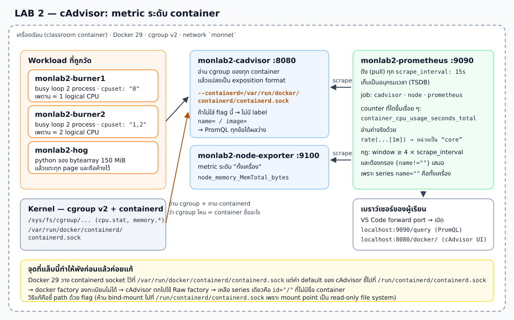
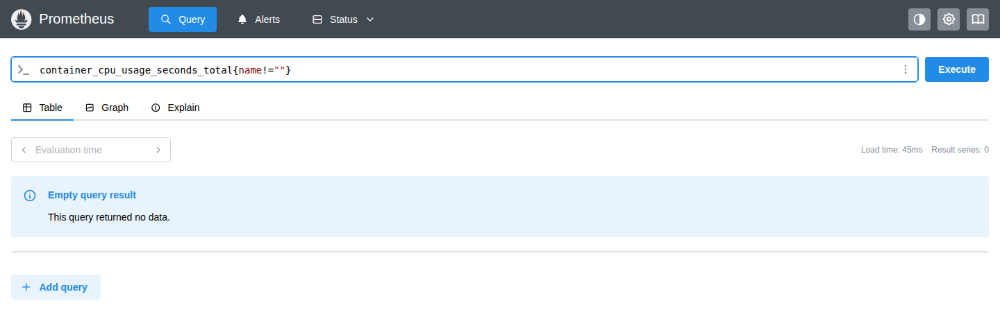
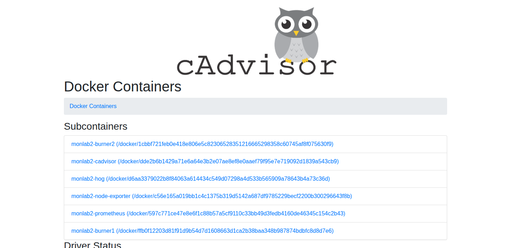
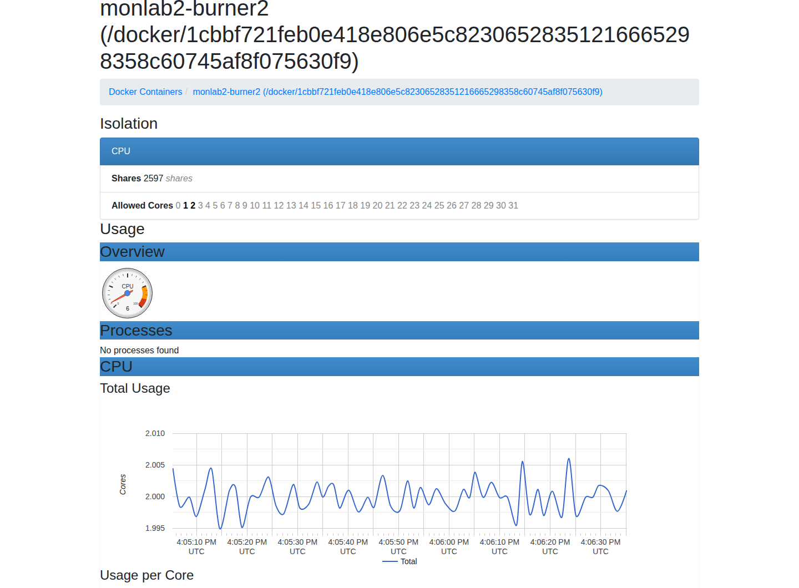
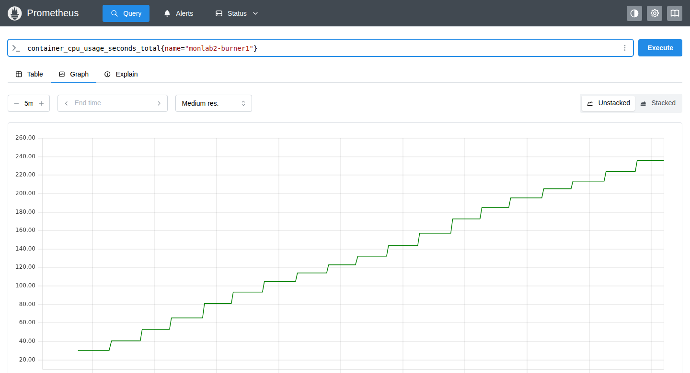
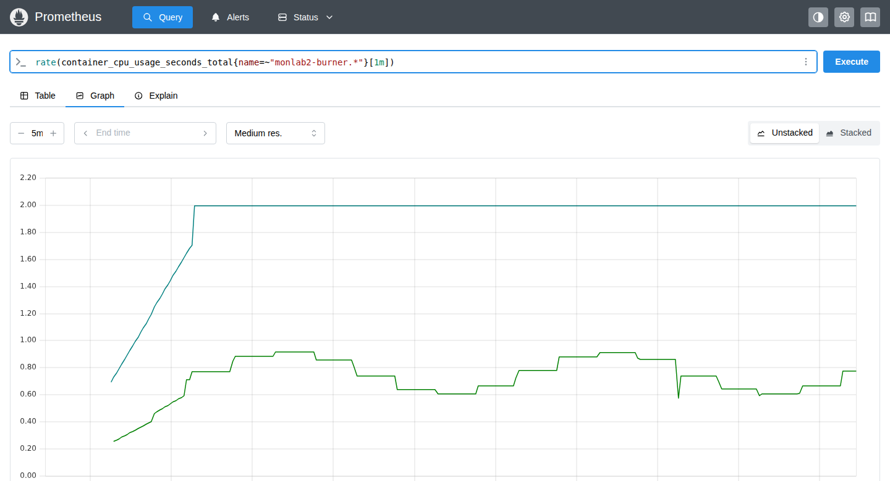
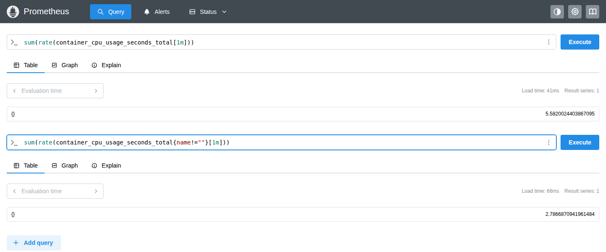
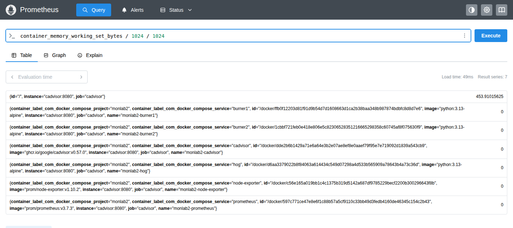

# LAB 2 — cAdvisor: วัด CPU/RAM ราย Container และอ่าน Counter ด้วย `rate()`

> โฟลเดอร์ `002_LAB_Container_Metrics_cAdvisor` = **LAB 2** ของชุด Monitoring
> (ไฟล์ของแล็บนี้: `docker-compose.yml` · `docker-compose.broken.yml` · `prometheus.yml` · `images/`)

## สิ่งที่จะได้เรียนรู้

- รู้ว่า **cAdvisor** คืออะไร: มันไม่ได้ "ถาม Docker" อย่างเดียว แต่ไปอ่าน **cgroup ของ kernel** แล้วแปลงเป็น metric
- เห็นกับดักจริงของ Docker 29: ถ้าไม่ชี้ `--containerd=...` ให้ถูก path จะ **ไม่มี label `name=` เลย** และ PromQL ทุกข้อได้ผลว่าง
- อ่าน **counter** ให้เป็น — `container_cpu_usage_seconds_total` ขึ้นเรื่อย ๆ ตัวเลขดิบไม่มีความหมายจนกว่าจะหาอัตราการเปลี่ยนแปลง
- ใช้ `rate(...[1m])` แล้วอ่านผลลัพธ์ของ CPU counter เป็นหน่วย **"จำนวน core ที่ใช้จริง"**
- แยกให้ออกระหว่าง **เพดานที่ตั้งไว้** (`cpuset`) กับ **ค่าที่ container ได้ใช้จริง**
- รู้จักกับดัก `{name!=""}` — series ที่ `name=""` คือ "ทั้งเครื่อง" ถ้าลืมกรองผลรวมจะเบิ้ลสองเท่า
- เข้าใจกฎ **rate window ≥ 4 × `scrape_interval`** และพิสูจน์ด้วยตัวเองว่า `[15s]` ให้ผลว่าง
- รู้ว่า counter **reset** เมื่อ container ถูก restart และ `rate()` จัดการให้อย่างไร
- อ่าน metric หน่วยความจำให้เป็น รวมถึงกรณีที่ค่าออกมาเป็น `0` ว่าแปลว่าอะไร
- เทียบผลกับ `docker stats` เพื่อเห็นว่าอะไรที่ Prometheus ทำได้แต่ `docker stats` ทำไม่ได้

## ภาพรวมของแล็บนี้

1. **อ่าน compose ก่อน** — รู้ว่าจะมี exporter อะไร และมี workload อะไรถูกวัดบ้าง
2. **รัน cAdvisor แบบค่า default ก่อน (สาธิตแบบมีไกด์)** — เราจงใจรันแบบผิดเพื่อดูอาการ
3. **อ่านอาการ 3 ชั้น** — log ของ cAdvisor → metric ดิบ → PromQL ที่ได้ผลว่าง
4. **แก้ด้วย flag `--containerd=...`** แล้วดูว่า label กลับมาครบ
5. **เปิด UI ของ cAdvisor เอง** — พิสูจน์ว่าเป็นแหล่งเดียวกับที่ Prometheus ดึงไป
6. **counter → `rate()`** — เห็นตัวเลขดิบโตขึ้น แล้วแปลงเป็น "จำนวน core"
7. **กับดัก `{name!=""}`** — เห็นผลรวมเบิ้ลสองเท่าด้วยตาตัวเอง
8. **กฎ window ≥ 4 × scrape_interval** — ลอง `[15s]` แล้วได้ผลว่าง
9. **counter reset** — restart container แล้วดูว่าเกิดอะไรกับ counter และกับ `rate()`
10. **หน่วยความจำ** — อ่าน `container_memory_working_set_bytes` และเรียนวิธีตรวจสอบเมื่อค่าเป็น `0`
11. **เทียบกับ `docker stats`** แล้วเก็บกวาด



> **คำถามก่อนเริ่ม:** ถ้าเราปักหมุด container ไว้กับ CPU เพียง 1 ตัว (`cpuset: "0"`) แล้วยิง busy loop 2 process พร้อมกัน
> ค่า `rate(container_cpu_usage_seconds_total[1m])` จะออกมาเป็น 2 (เพราะ 2 process) หรือ 1 (เพราะมี CPU เดียว)?
> แล้ว container ที่ปักหมุดไว้ 2 CPU จะได้เท่าไร? จดคำตอบที่เดาไว้ก่อน แล้วเราจะวัดของจริงกัน

แล็บนี้ใช้ terminal เดียว ทุกคำสั่งตั้งแต่ข้อ 1 เป็นต้นไปให้รัน **ข้างในเครื่องเรียน** ผ่าน VS Code Remote-SSH

---

## 0. เตรียมเครื่องเรียน

ทำบนเครื่องของเราเอง — เปิด classroom container ที่มี Docker พร้อมใช้ แล้ว SSH เข้าไป:

```bash
docker start devtools 2>/dev/null || \
  docker run -dit --name devtools --privileged -p 2222:22 tuchsanai/devtools:2569_1
ssh root@localhost -p 2222        # password : passwd
```

> 📝 **คำอธิบาย:** `docker start ... || docker run ...` ใช้เครื่องเรียนเดิมถ้ามี และสร้างใหม่เฉพาะเมื่อยังไม่มี · `-dit` รันเบื้องหลังพร้อม terminal · `--name devtools` ตั้งชื่อคงที่ · `--privileged` จำเป็นสำหรับรัน Docker ซ้อนข้างใน classroom container · `-p 2222:22` ส่ง port SSH จากเครื่องเราเข้า port 22 ของกล่อง · หลัง SSH แล้ว prompt จะเป็นฝั่งเครื่องเรียน ซึ่งเป็นที่รันคำสั่ง Docker ทั้งหมดของ LAB
>
> ⚠️ `--privileged` ให้สิทธิ์สูงมาก ใช้เฉพาะ disposable classroom container นี้ ห้ามนำรูปแบบนี้ไปใช้กับ production workload

ใน VS Code แนะนำให้ใช้ **Remote-SSH** ต่อ `root@localhost:2222` แล้วเปิดโฟลเดอร์ `~/labwork/DevTools` เพื่อแก้ไฟล์และเปิด terminal ในเครื่องเรียนโดยตรง

ตรวจว่า Docker CLI คุยกับ daemon ชั้นในได้:

```bash
docker --version
docker info --format 'Docker daemon: {{.ServerVersion}}'
```

> 📝 **คำอธิบาย:** บรรทัดแรกดูเวอร์ชัน CLI ส่วน `docker info` ถาม daemon จริง จึงแยกได้ระหว่าง "ติดตั้งคำสั่ง Docker แล้ว" กับ "daemon พร้อมรับคำสั่งแล้ว" · เวอร์ชันของ daemon สำคัญกับแล็บนี้เป็นพิเศษ เพราะ **path ของ containerd socket เปลี่ยนไปตามรุ่นของ Docker** ซึ่งเป็นหัวใจของข้อ 3-4

✅ **Expected output** — ต้องมีเลขเวอร์ชันครบสองบรรทัด (เลขเวอร์ชันและ build อาจเปลี่ยนตาม image ห้องเรียน):

```text
Docker version 29.6.2, build dfc4efb
Docker daemon: 29.6.2
```

> ⚠️ ทุกแล็บในชุด Monitoring ใช้ port `9090`, `9100`, `8080` ชุดเดียวกัน ถ้าเพิ่งทำ LAB 1 มา ให้ `docker compose down` ในโฟลเดอร์ LAB 1 ก่อน ไม่งั้นจะชนกันตอน `up`

---

## 1. Clone โค้ดแล็บ

```bash
mkdir -p ~/labwork && cd ~/labwork
git clone https://github.com/Tuchsanai/DevTools.git
cd DevTools/03_Application_Docker/03_Monitoring/002_LAB_Container_Metrics_cAdvisor
```

> 📝 **คำอธิบาย:** `mkdir -p` สร้างพื้นที่ทำงานโดยไม่ error ถ้ามีอยู่แล้ว · `git clone` ดึงไฟล์ของหลักสูตร · `cd` เข้า LAB นี้ให้ถูกโฟลเดอร์ก่อนใช้ Compose · ถ้าเคย clone repository ไว้แล้ว ให้ข้าม `git clone` แล้ว `cd` เข้า path เดิมได้เลย

ดึง image ที่ pin เวอร์ชันไว้ก่อนเริ่ม เพื่อแยกขั้น download ออกจากขั้นสร้าง container:

```bash
docker compose pull --quiet
```

> 📝 **คำอธิบาย:** แล็บนี้ใช้ 4 image คือ `prom/prometheus:v3.7.3`, `prom/node-exporter:v1.10.2`, `ghcr.io/google/cadvisor:v0.57.0` และ `python:3.13-alpine` · ทุกตัว **pin tag ไว้** ไม่ใช้ `latest` เพื่อให้ทั้งห้องได้ผลเหมือนกันและเอกสารนี้ยังตรงในอีกหลายเดือนข้างหน้า · `--quiet` ลดรายละเอียด แต่ Compose รุ่นนี้ยังรายงานสถานะ Pulling/Pulled

✅ **Expected output** — รอบทดสอบจริงได้สถานะต่อไปนี้; ลำดับบรรทัดสลับกันได้ และถ้ามี image อยู่แล้วจะจบเร็วกว่านี้มาก:

```text
 Image ghcr.io/google/cadvisor:v0.57.0 Pulling 
 Image prom/prometheus:v3.7.3 Pulling 
 Image python:3.13-alpine Pulling 
 Image prom/node-exporter:v1.10.2 Pulling 
 Image prom/node-exporter:v1.10.2 Pulled 
 Image python:3.13-alpine Pulled 
 Image ghcr.io/google/cadvisor:v0.57.0 Pulled 
 Image prom/prometheus:v3.7.3 Pulled 
```

---

## 2. อ่าน Compose ก่อนรัน — ใครวัดใคร

เปิด `docker-compose.yml` แล้วดูสามกลุ่มนี้ กลุ่มแรกคือ **ตัววัด**:

```yaml
  cadvisor:
    image: ghcr.io/google/cadvisor:v0.57.0
    container_name: monlab2-cadvisor
    privileged: true
    devices:
      - /dev/kmsg
    command:
      - --containerd=/var/run/docker/containerd/containerd.sock
      - --docker_only=true
      - --store_container_labels=false
      - --whitelisted_container_labels=com.docker.compose.service,com.docker.compose.project
    volumes:
      - /:/rootfs:ro
      - /var/run:/var/run:ro
      - /sys:/sys:ro
      - /var/lib/docker/:/var/lib/docker:ro
    ports:
      - "8080:8080"
```

> 📝 **คำอธิบาย flag ทีละตัว:**
> `--containerd=/var/run/docker/containerd/containerd.sock` บอก cAdvisor ว่า containerd socket อยู่ที่ไหน — **นี่คือบรรทัดที่แล็บนี้จะทดลองถอดออกในข้อ 3** เพราะค่า default ของ cAdvisor คือ `/run/containerd/containerd.sock` ซึ่ง Docker 29 ไม่ได้วางไว้ตรงนั้น
> `--docker_only=true` ให้รายงานเฉพาะ container จริง ไม่รายงาน cgroup ระดับกลางอย่าง `/docker` ที่เป็นแค่ยอดรวม
> `--store_container_labels=false` ไม่เอา label ทุกอันของ image มาแปะทุก series (ถ้าเปิดไว้ series จะพ่วง `container_label_org_opencontainers_image_*` ยาวเหยียดและกิน cardinality)
> `--whitelisted_container_labels=...` เลือกเก็บเฉพาะ 2 label ที่มีประโยชน์จริงคือ project/service ของ Compose
>
> **volume ทั้ง 4 อันคือ "ตา" ของ cAdvisor:** `/sys:ro` คือที่อยู่ของ `/sys/fs/cgroup` ซึ่งเป็นตัวเลขดิบทั้งหมด · `/var/run:ro` ทำให้เข้าถึง docker/containerd socket ได้ · `/var/lib/docker:ro` ใช้ดูข้อมูล layer/filesystem · `/:/rootfs:ro` ใช้ดู filesystem ของเครื่อง · ทุกอัน mount เป็น `:ro` และเปิด `privileged` เพราะต้องอ่านของระดับ kernel
>
> ⚠️ **อย่าพยายาม bind-mount socket ไปที่ `/run/containerd/containerd.sock` เพื่อ "หลอก" ค่า default** — ใน classroom container จะได้ error `create mountpoint for /run/containerd/containerd.sock: read-only file system` ให้ชี้ path ด้วย flag เท่านั้น

กลุ่มที่สองคือ **ของถูกวัด** — เราต้องมี workload ที่พฤติกรรมชัดเจนพอจะตรวจคำตอบได้:

```yaml
  burner1:
    image: python:3.13-alpine
    container_name: monlab2-burner1
    cpuset: "0"
    command:
      - sh
      - -c
      - |
        python -c 'while True: pass' &
        python -c 'while True: pass' &
        wait

  burner2:
    container_name: monlab2-burner2
    cpuset: "1,2"
    # busy loop 2 process เหมือนกันทุกอย่าง ต่างกันแค่ cpuset

  hog:
    container_name: monlab2-hog
    command:
      - python
      - -c
      - |
        import time
        SIZE = 150 * 1024 * 1024
        buf = bytearray(SIZE)
        for i in range(0, SIZE, 4096):
            buf[i] = 1
        print("allocated and touched %d MiB" % (SIZE // 1024 // 1024), flush=True)
        while True:
            time.sleep(60)
```

> 📝 **คำอธิบาย:** `cpuset: "0"` ปักหมุด `burner1` ไว้กับ logical CPU หมายเลข 0 เพียงตัวเดียว ส่วน `cpuset: "1,2"` ให้ `burner2` ใช้ได้ 2 ตัว · ทั้งคู่รัน busy loop **จำนวนเท่ากัน (2 process)** เพื่อให้ตัวแปรที่ต่างมีแค่ "จำนวน CPU ที่ใช้ได้"
>
> `hog` จอง `bytearray` 150 MiB แล้ว **เขียนค่าลงทุก page (ทุก 4096 byte)** — จำเป็นมาก เพราะถ้าจองเฉย ๆ โดยไม่แตะ kernel อาจยังไม่ได้ map หน้าจริงให้ ทำให้ working set ไม่ขึ้น · จากนั้น `sleep` ค้างไว้เพื่อให้ค่าคงที่ข้ามหลายรอบ scrape (อย่างน้อย 4-6 รอบ) ก่อนเราไปอ่าน
>
> ⚠️ **ทำไมไม่ใช้ `cpus:` หรือ `mem_limit:`** — ในกล่องเรียนที่ซ้อน container หลายชั้น การตั้ง limit สองอันนี้จะสร้าง container ไม่สำเร็จ (`cannot enter cgroupv2 ... it is in threaded mode`) แต่ `cpuset` ใช้ได้เสมอ · ดูรายละเอียดในตาราง Troubleshooting ท้ายเอกสาร

กลุ่มที่สามคือ `prometheus.yml` ที่บอกว่าจะไปดึงจากใครบ้าง:

```yaml
global:
  scrape_interval: 15s
  evaluation_interval: 15s

scrape_configs:
  - job_name: prometheus
    static_configs:
      - targets:
          - localhost:9090

  - job_name: node
    static_configs:
      - targets:
          - node-exporter:9100

  - job_name: cadvisor
    static_configs:
      - targets:
          - cadvisor:8080
```

> 📝 **คำอธิบาย:** ค่า default ของ `scrape_interval` ใน Prometheus คือ **1 นาที** ซึ่งช้าเกินไปสำหรับห้องเรียน เราจึงกำหนดเองเป็น `15s` เพื่อให้เห็น `rate()` ขยับภายในเวลาไม่กี่นาที · ตัวเลข 15 วินาทีนี้จะกลายเป็นตัวคูณของกฎ **"window ≥ 4 × scrape_interval"** ในข้อ 8 · ชื่อ `node-exporter` และ `cadvisor` คือ **ชื่อ service ใน Compose** ซึ่ง Docker DNS แปลงเป็น IP ให้บน network `monnet` โดยอัตโนมัติ จึงไม่ต้องรู้ IP ล่วงหน้า

---

## 3. สาธิตแบบมีไกด์ — รัน cAdvisor ด้วยค่า default แล้วดูว่าพังยังไง

> 🎯 **เรากำลังจะรันแบบผิดโดยตั้งใจ** ไม่ใช่ปริศนาให้ตามล่า — จุดประสงค์คือให้จำ "อาการ" ของปัญหานี้ได้
> เพราะเวลาเอา cAdvisor ไปติดตั้งเองในโปรเจกต์จริง นี่คือปัญหาแรกที่คนส่วนใหญ่เจอ และอาการของมัน
> **ไม่ได้บอกว่าอะไรพัง** — target ยัง UP, ไม่มี error สีแดง แต่ PromQL ได้ผลว่างเปล่า

ไฟล์ `docker-compose.broken.yml` ต่างจากของจริงแค่การถอด flag เดียวออก:

```yaml
services:
  cadvisor:
    command:
      - --docker_only=true
      - --store_container_labels=false
      - --whitelisted_container_labels=com.docker.compose.service,com.docker.compose.project
```

เปิด stack ด้วย override นี้:

```bash
docker compose -f docker-compose.yml -f docker-compose.broken.yml up -d
```

> 📝 **คำอธิบาย:** ใส่ `-f` สองครั้ง = ให้ Compose อ่านไฟล์หลักก่อนแล้วเอาไฟล์หลังทับ · key `command:` เป็น list ที่ถูก **แทนที่ทั้งก้อน** ไม่ใช่ต่อท้าย ดังนั้น cAdvisor จะไม่ได้รับ `--containerd=...` และจะกลับไปใช้ค่า default `/run/containerd/containerd.sock`

✅ **Expected output** — สร้าง network, volume และ 6 container (ลำดับบรรทัดสลับกันได้):

```text
 Network monnet Creating 
 Network monnet Created 
 Volume monlab2_promdata Creating 
 Volume monlab2_promdata Created 
 Container monlab2-prometheus Creating 
 Container monlab2-cadvisor Creating 
 Container monlab2-burner1 Creating 
 Container monlab2-hog Creating 
 Container monlab2-burner2 Creating 
 Container monlab2-node-exporter Creating 
 Container monlab2-node-exporter Created 
 Container monlab2-prometheus Created 
 Container monlab2-cadvisor Created 
 Container monlab2-hog Created 
 Container monlab2-burner1 Created 
 Container monlab2-burner2 Created 
 Container monlab2-prometheus Starting 
 Container monlab2-cadvisor Starting 
 Container monlab2-hog Starting 
 Container monlab2-burner1 Starting 
 Container monlab2-burner2 Starting 
 Container monlab2-node-exporter Starting 
 Container monlab2-cadvisor Started 
 Container monlab2-node-exporter Started 
 Container monlab2-prometheus Started 
 Container monlab2-burner1 Started 
 Container monlab2-hog Started 
 Container monlab2-burner2 Started 
```

ตรวจว่าทุกตัวขึ้นแล้วและ cAdvisor พร้อมตอบ:

```bash
docker compose ps
ok=0
for i in $(seq 1 60); do curl -fsS http://localhost:8080/healthz >/dev/null 2>&1 && { ok=1; break; }; sleep 1; done
if [ "$ok" = 1 ]; then
  echo "READY: cAdvisor ตอบแล้วใน ~${i}s · healthz=$(curl -s http://localhost:8080/healthz)"
else
  echo "TIMEOUT: cAdvisor ไม่ตอบภายใน 60 วินาที — ดูสาเหตุด้วย 'docker compose logs cadvisor'"
fi
```

> 📝 **คำอธิบาย:** `docker compose ps` ยืนยันว่า container ครบ 6 ตัว · readiness loop ใช้ `curl -f` ที่คืน error เมื่อ HTTP ไม่ใช่ 2xx แล้ววนซ้ำทุก 1 วินาที **มีเพดาน 60 รอบ** เพื่อไม่ให้ค้างตลอดกาลถ้าระบบพังจริง · `/healthz` คือ endpoint สุขภาพของ cAdvisor เอง
>
> ⚠️ **ทำไมต้องมีตัวแปร `ok`:** ถ้าเขียนแค่ `for ...; do ... && break; done; echo "พร้อมแล้ว"` ลูปที่ **หมดเวลา** กับลูปที่ **สำเร็จ** จะจบเหมือนกันเป๊ะ แล้วบรรทัด `echo` จะโกหกว่าพร้อมทั้งที่ระบบพัง · ผู้เรียนจะเดินหน้าต่อไปเจอ error ที่ไม่เกี่ยวกันแล้วงงหนักกว่าเดิม · **readiness loop ทุกอันในชุดแล็บนี้จึงเก็บผลลัพธ์จริงไว้ในตัวแปรแล้วแยกข้อความ READY / TIMEOUT เสมอ**

✅ **Expected output** — `burner1`/`burner2`/`hog` ไม่มี PORTS เพราะไม่ต้องเปิด port ใด ๆ (เวลาและ container ID จะต่างกัน):

```text
NAME                    IMAGE                             COMMAND                  SERVICE         CREATED        STATUS                                     PORTS
monlab2-burner1         python:3.13-alpine                "sh -c 'python -c 'w…"   burner1         1 second ago   Up Less than a second                      
monlab2-burner2         python:3.13-alpine                "sh -c 'python -c 'w…"   burner2         1 second ago   Up Less than a second                      
monlab2-cadvisor        ghcr.io/google/cadvisor:v0.57.0   "/usr/bin/entrypoint…"   cadvisor        1 second ago   Up Less than a second (health: starting)   0.0.0.0:8080->8080/tcp, [::]:8080->8080/tcp
monlab2-hog             python:3.13-alpine                "python -c 'import t…"   hog             1 second ago   Up Less than a second                      
monlab2-node-exporter   prom/node-exporter:v1.10.2        "/bin/node_exporter …"   node-exporter   1 second ago   Up Less than a second                      0.0.0.0:9100->9100/tcp, [::]:9100->9100/tcp
monlab2-prometheus      prom/prometheus:v3.7.3            "/bin/prometheus --c…"   prometheus      1 second ago   Up Less than a second                      0.0.0.0:9090->9090/tcp, [::]:9090->9090/tcp
READY: cAdvisor ตอบแล้วใน ~1s · healthz=ok
```

### 3.1 อาการชั้นที่ 1 — log ของ cAdvisor

```bash
docker compose logs cadvisor 2>&1 | \
  grep -E 'Registration of the (containerd|docker) container factory|Registering Raw factory'
```

> 📝 **คำอธิบาย:** cAdvisor มีสิ่งที่เรียกว่า **factory** หลายตัว แต่ละตัวรู้วิธีอ่าน container ของ runtime แบบหนึ่ง · ตอน start มันจะพยายามลงทะเบียนทีละตัวแล้วบอกผลใน log · `grep -E` เลือกเฉพาะ 3 บรรทัดที่เป็นหัวใจ · สังเกตว่าบรรทัดพวกนี้ขึ้นต้นด้วย `I` (Info) **ไม่ใช่ `E` (Error)** — cAdvisor ถือว่า "ไม่เจอ runtime นี้" เป็นเรื่องปกติ นี่คือเหตุผลที่ปัญหานี้เงียบมาก

✅ **Expected output** — สองบรรทัดแรกคือ `failed` และบรรทัดสุดท้ายคือแผนสำรองที่มันเลือกใช้ (เวลาและเลข process ต่างกันได้):

```text
monlab2-cadvisor  | I0815 16:01:06.178758       1 factory.go:220] Registration of the containerd container factory failed: unable to create containerd client: containerd: cannot unix dial containerd api service: dial unix /run/containerd/containerd.sock: connect: no such file or directory
monlab2-cadvisor  | I0815 16:01:06.188364       1 factory.go:220] Registration of the docker container factory failed: unable to create containerd client: containerd: cannot unix dial containerd api service: dial unix /run/containerd/containerd.sock: connect: no such file or directory
monlab2-cadvisor  | I0815 16:01:06.188617       1 factory.go:105] Registering Raw factory
```

> **อ่านให้ออก:** `dial unix /run/containerd/containerd.sock: no such file or directory` = cAdvisor ไปเคาะประตูผิดบ้าน
> เมื่อ **docker factory** ลงทะเบียนไม่ได้ มันก็ไม่มีทางรู้ว่า cgroup ไหนคือ container ชื่ออะไร จึงตกไปใช้ **Raw factory**
> ซึ่งอ่าน cgroup ดิบได้อย่างเดียว — รู้ตัวเลข แต่ไม่รู้ชื่อ

### 3.2 อาการชั้นที่ 2 — metric ดิบที่ cAdvisor พ่นออกมา

```bash
curl -s http://localhost:8080/metrics | grep '^container_cpu_usage_seconds_total'
curl -s http://localhost:8080/metrics | grep -c 'name="'
```

> 📝 **คำอธิบาย:** คำสั่งแรกดู metric CPU ทั้งหมดที่ cAdvisor ประกาศ · คำสั่งที่สองนับว่ามีกี่บรรทัดที่มี label `name=` เลย · `/metrics` คือหน้าเว็บธรรมดาที่พ่นข้อความ ไม่ใช่ API พิเศษ — Prometheus ก็ดึงหน้านี้หน้าเดียวกันนี่แหละ

✅ **Expected output** — เหลือ **series เดียว** ที่มีแต่ `id="/"` และ **ไม่มี label `name=` แม้แต่บรรทัดเดียว** (ตัวเลข CPU และ timestamp ต่างกันแน่นอน):

```text
container_cpu_usage_seconds_total{cpu="total",id="/"} 3089.14125 1786809666189
0
```

> **นี่คือหัวใจของปัญหา:** `id="/"` แปลว่า "ทั้งเครื่อง" — ไม่มี container ตัวไหนถูกแยกออกมาเลย
> ทั้งที่มี container รันอยู่ 6 ตัวชัด ๆ

### 3.3 อาการชั้นที่ 3 — ฝั่ง Prometheus

```bash
for i in $(seq 1 60); do curl -fsS http://localhost:9090/-/ready >/dev/null 2>&1 && break; sleep 1; done
curl -s 'http://localhost:9090/api/v1/targets?state=active' | \
  python3 -c 'import sys,json;[print(t["labels"]["job"], t["scrapeUrl"], t["health"]) for t in json.load(sys.stdin)["data"]["activeTargets"]]'
```

> 📝 **คำอธิบาย:** `/-/ready` บอกว่า Prometheus พร้อมรับ query แล้ว · `/api/v1/targets?state=active` คือหน้า **Targets** ในรูปแบบ JSON · `python3 -c` ย่อ JSON ก้อนใหญ่ให้เหลือ 3 คอลัมน์ที่เราสนใจ: job, URL ที่ไปดึง, และสุขภาพ

✅ **Expected output** — **ทั้งสาม target UP หมด** ซึ่งเป็นสิ่งที่ทำให้ปัญหานี้หลอกคนได้:

```text
cadvisor http://cadvisor:8080/metrics up
node http://node-exporter:9100/metrics up
prometheus http://localhost:9090/metrics up
```

ทีนี้ลอง query จริง (รอสัก 20 วินาทีให้ Prometheus scrape ไปแล้วอย่างน้อย 1 รอบ):

```bash
curl -s --get http://localhost:9090/api/v1/query \
  --data-urlencode 'query=count(container_cpu_usage_seconds_total{name!=""})' | python3 -m json.tool
```

> 📝 **คำอธิบาย:** `--get` บังคับให้ curl ส่งเป็น GET พร้อม query string · `--data-urlencode` เข้ารหัสอักขระพิเศษอย่าง `{`, `"`, `!=` ให้อัตโนมัติ (ถ้าไม่ทำ Prometheus จะ parse ไม่ผ่าน) · `count(...)` นับจำนวน series ที่ตรงเงื่อนไข

✅ **Expected output** — `result` เป็น list ว่าง แปลว่า **ไม่มี series ไหนเลยที่มี `name` ไม่ว่าง**:

```json
{
    "status": "success",
    "data": {
        "resultType": "vector",
        "result": []
    }
}
```

ดูด้วยตาผ่านหน้าเว็บก็ได้ — forward port `9090` ด้วย VS Code แล้วเปิด `http://localhost:9090/query`:

1. เปิดแท็บ **PORTS** ข้าง TERMINAL
2. กด **Forward a Port** แล้วกรอก `9090` (และกรอก `8080` ไว้ด้วยเลย เพราะข้อ 5 จะใช้)
3. เปิด `http://localhost:9090/query` แล้วพิมพ์ `container_cpu_usage_seconds_total{name!=""}` กด **Execute**



> 📝 **คำอธิบาย:** หน้าจอบอก `Result series: 0` และ `Empty query result` — ไม่มีคำว่า error สักคำ เพราะในมุมของ Prometheus **ไม่มีอะไรผิด** มันดึง metric มาได้ครบ เพียงแต่ metric ที่ได้มาไม่มี label ที่เราถามหา
>
> #### ทางเลือก: forward ด้วยคำสั่ง `ssh -L`
>
> ถ้าไม่ใช้ VS Code ให้เปิด terminal ใหม่บนเครื่องเราแล้วปล่อย session นี้ค้างไว้:
>
> ```bash
> ssh -L 9090:localhost:9090 -L 8080:localhost:8080 root@localhost -p 2222        # password : passwd
> ```

---

## 4. แก้ให้ถูก — ชี้ path ของ containerd socket

Docker 29 วาง containerd socket ไว้ที่ `/var/run/docker/containerd/containerd.sock` ยืนยันได้ด้วยตาตัวเอง:

```bash
ls -l /var/run/docker/containerd/containerd.sock
ls -l /run/containerd/containerd.sock 2>&1 | head -1
```

> 📝 **คำอธิบาย:** บรรทัดแรกต้องเจอไฟล์ socket จริง (ตัวอักษรแรกของ permission เป็น `s` = socket) · บรรทัดที่สองคือ path ที่ cAdvisor เดาเองเป็นค่า default ซึ่งไม่มีอยู่ · `/var/run` เป็น symlink ไป `/run` บนระบบส่วนใหญ่ ดังนั้นสองอันนี้ต่างกันจริง ๆ ที่ส่วน `docker/` ตรงกลาง
>
> ℹ️ บน Docker รุ่นเก่าหรือ distro ที่รัน containerd แยกเป็น service ของตัวเอง path อาจเป็น `/run/containerd/containerd.sock` ตามค่า default จริง ๆ — **สิ่งที่ต้องจำคือ "ต้องไปตรวจว่า socket อยู่ไหนก่อน" ไม่ใช่จำ path ใด path หนึ่ง**

✅ **Expected output** — อันแรกเจอ (ขึ้นต้นด้วย `s` = socket) อันที่สองไม่มี (วันเวลาต่างกันได้):

```text
srw-rw---- 1 root root 0 Aug 15 22:42 /var/run/docker/containerd/containerd.sock
ls: cannot access '/run/containerd/containerd.sock': No such file or directory
```

ตอนนี้กลับมาใช้ compose หลักที่มี flag ครบ:

```bash
docker compose up -d
```

> 📝 **คำอธิบาย:** ไม่ต้อง `down` ก่อน — Compose เทียบ config ที่ประกาศไว้กับของที่รันอยู่ แล้ว **recreate เฉพาะ service ที่เปลี่ยน** · ในที่นี้มีแค่ `cadvisor` ที่ `command` ต่างไป ส่วน `burner1`/`burner2`/`hog` ยังรันต่อเนื่องไม่สะดุด (สำคัญ เพราะเราไม่อยากให้ counter ของ workload รีเซ็ต)

✅ **Expected output** — 5 ตัว `Running` และมีแค่ `cadvisor` ที่ถูก `Recreate`:

```text
 Container monlab2-prometheus Running 
 Container monlab2-node-exporter Running 
 Container monlab2-burner1 Running 
 Container monlab2-burner2 Running 
 Container monlab2-hog Running 
 Container monlab2-cadvisor Recreate 
 Container monlab2-cadvisor Recreated 
 Container monlab2-cadvisor Starting 
 Container monlab2-cadvisor Started 
```

ตรวจ log ชั้นที่ 1 ซ้ำด้วยคำสั่งเดิม:

```bash
for i in $(seq 1 60); do curl -fsS http://localhost:8080/healthz >/dev/null 2>&1 && break; sleep 1; done
docker compose logs cadvisor 2>&1 | \
  grep -E 'Registration of the (containerd|docker) container factory|Registering Raw factory'
```

✅ **Expected output** — `failed` กลายเป็น `successfully` ทั้งสองบรรทัด:

```text
monlab2-cadvisor  | I0815 16:01:52.079030       1 factory.go:222] Registration of the containerd container factory successfully
monlab2-cadvisor  | I0815 16:01:52.085600       1 factory.go:222] Registration of the docker container factory successfully
monlab2-cadvisor  | I0815 16:01:52.085811       1 factory.go:105] Registering Raw factory
```

> 📝 **คำอธิบาย:** `Registering Raw factory` ยังอยู่และ **ถูกต้องแล้ว** — Raw factory คือคนที่รายงาน cgroup ระดับเครื่อง (`id="/"`) ส่วน docker factory คือคนที่ใส่ชื่อ container ให้ · ทั้งคู่ทำงานคู่กัน นี่คือเหตุผลที่เราจะยังเห็น series `name=""` ปนอยู่เสมอ (สำคัญมากในข้อ 7)

ดู metric ดิบซ้ำ:

```bash
curl -s http://localhost:8080/metrics | grep '^container_cpu_usage_seconds_total{' | grep 'cpu="total"' | sort
curl -s http://localhost:8080/metrics | grep -c 'name="'
```

> 📝 **คำอธิบาย:** เติม `{` ท้ายชื่อ metric เพื่อไม่ให้ติดบรรทัด `# HELP` / `# TYPE` · `sort` ทำให้อ่านง่ายและเทียบกันได้
>
> ℹ️ **เรื่อง label `cpu=` ที่เข้าใจผิดกันบ่อย:** `container_cpu_usage_seconds_total` ของ cAdvisor v0.57.0 พ่นได้ **แบบใดแบบหนึ่งเท่านั้น ไม่ได้พ่นพร้อมกัน**
> - ถ้า **ไม่มี** ตัวเลข usage แยกราย CPU ให้อ่าน → พ่น series เดียวคือ `cpu="total"`
> - ถ้า **มี** → พ่นแยกเป็น `cpu="cpu00"`, `cpu="cpu01"`, … **แทน** `total` (ไม่มี `total` ให้)
>
> กล่องเรียนของเราเป็น **cgroup v2** ซึ่งไม่มีตัวเลข CPU usage รายแกนให้ cAdvisor อ่าน จึงได้ `cpu="total"` เสมอ — `grep 'cpu="total"'` ในคำสั่งข้างบนจึงใช้ได้ · แต่ถ้ายกคำสั่งนี้ไปรันบนเครื่องที่พ่นแบบราย CPU **จะได้ผลว่าง** · เวลาเขียน PromQL ที่ต้องทำงานได้ทั้งสองแบบ ให้รวมด้วย `sum by (name) (rate(...))` เสมอ อย่าอ้าง `cpu="total"` ตรง ๆ

✅ **Expected output** — ได้ **7 series**: หนึ่งอันคือทั้งเครื่อง (`id="/"`, `name=""`) และอีก 6 อันคือ container ของเราครบทุกตัว พร้อม `name=`, `image=` และ label ของ Compose (ค่า hash, ตัวเลข และ timestamp ต่างกันแน่นอน):

```text
container_cpu_usage_seconds_total{container_label_com_docker_compose_project="",container_label_com_docker_compose_service="",cpu="total",id="/",image="",name=""} 3267.492146 1786809732108
container_cpu_usage_seconds_total{container_label_com_docker_compose_project="monlab2",container_label_com_docker_compose_service="burner1",cpu="total",id="/docker/ffb0f12203d81f91d9b54d7d1608663d1ca2b38baa348b987874bdbfc8d8d7e6",image="python:3.13-alpine",name="monlab2-burner1"} 44.077953 1786809732165
container_cpu_usage_seconds_total{container_label_com_docker_compose_project="monlab2",container_label_com_docker_compose_service="burner2",cpu="total",id="/docker/1cbbf721feb0e418e806e5c82306528351216665298358c60745af8f075630f9",image="python:3.13-alpine",name="monlab2-burner2"} 131.174704 1786809731903
container_cpu_usage_seconds_total{container_label_com_docker_compose_project="monlab2",container_label_com_docker_compose_service="cadvisor",cpu="total",id="/docker/dde2b6b1429a71e6a64e3b2e07ae8ef8e0aaef79f95e7e719092d1839a543cb9",image="ghcr.io/google/cadvisor:v0.57.0",name="monlab2-cadvisor"} 0.35142 1786809732198
container_cpu_usage_seconds_total{container_label_com_docker_compose_project="monlab2",container_label_com_docker_compose_service="hog",cpu="total",id="/docker/d6aa3379022b8f84063a614434c549d07298a4d533b565909a78643b4a73c36d",image="python:3.13-alpine",name="monlab2-hog"} 0.089537 1786809731179
container_cpu_usage_seconds_total{container_label_com_docker_compose_project="monlab2",container_label_com_docker_compose_service="node-exporter",cpu="total",id="/docker/c56e165a019bb1c4c1375b319d5142a687df9785229becf2200b300296643f8b",image="prom/node-exporter:v1.10.2",name="monlab2-node-exporter"} 0.093767 1786809731154
container_cpu_usage_seconds_total{container_label_com_docker_compose_project="monlab2",container_label_com_docker_compose_service="prometheus",cpu="total",id="/docker/597c771ce47e8e6f1c88b57a5cf9110c33bb49d3fedb4160de46345c154c2b43",image="prom/prometheus:v3.7.3",name="monlab2-prometheus"} 0.230058 1786809732746
```

```text
666
```

> **บทเรียนจาก break & fix:** exporter ที่ต่อกับ runtime ได้ไม่ครบจะ **ยังตอบ 200 และ target ยัง UP** แต่ข้อมูลจะขาดมิติที่เราต้องใช้จริง
> เวลาเจอ "PromQL ได้ผลว่างทั้งที่ target UP" ให้ไล่จากล่างขึ้นบนเสมอ: **metric ดิบที่ exporter → log ของ exporter → config ของ exporter** อย่าเพิ่งไปแก้ที่ query

---

## 5. เปิด UI ของ cAdvisor — แหล่งเดียวกับที่ Prometheus ดึง

cAdvisor มีหน้าเว็บของตัวเอง forward port `8080` แล้วเปิด `http://localhost:8080/docker/`:



> 📝 **คำอธิบาย:** หน้า `/docker/` ลิสต์ container ทุกตัวที่ **docker factory** มองเห็น — ถ้าย้อนกลับไปทำข้อ 3 หน้านี้จะว่างเปล่า · แต่ละแถวคือคู่ของ "ชื่อ container" กับ "cgroup path" ซึ่งตรงกับ label `name=` และ `id=` ใน `/metrics` เป๊ะ ๆ · ด้านล่างมี Driver Status บอก Docker version, storage driver และจำนวน container ที่กำลังรัน

คลิกที่ `monlab2-burner2` เพื่อดูรายตัว:



> 📝 **คำอธิบาย:** ช่อง **Allowed Cores** ตัวหนาที่เลข `1 2` คือ `cpuset: "1,2"` ที่เราตั้งไว้ · กราฟ **Total Usage** มีหน่วยเป็น **Cores** และแกวางอยู่ราว ๆ `2.000` ซึ่งจะตรงกับที่เราคำนวณด้วย `rate()` ในข้อ 6 · กราฟ **Usage Breakdown** แยก User/Kernel ให้ดูว่าเวลาหมดไปกับโค้ดของเราหรือกับ syscall
>
> ⚠️ cAdvisor **เก็บประวัติไว้ในหน่วยความจำของ process ตัวเองแค่ช่วงสั้น ๆ** (ค่า default `--storage_duration` 2 นาที) · การกด refresh หน้าเว็บ **ไม่ได้เริ่มนับใหม่** — หน้าเว็บแค่ไปดึงประวัติชุดเดิมจาก daemon มาวาดใหม่เท่านั้น · ที่ทำให้ประวัติหายจริง ๆ มีสองอย่าง: **restart container ของ cAdvisor** (หน่วยความจำหายไปพร้อม process) หรือ **ข้อมูลเก่ากว่า `--storage_duration` แล้วถูกทิ้ง** · ไม่ว่าทางไหน ข้อมูลก็อยู่ได้แค่ระดับนาที — นี่คือเหตุผลที่เราต้องมี Prometheus เพื่อเก็บย้อนหลังเป็นชั่วโมง/วัน แล้วเอามาเทียบข้ามช่วงเวลาได้
>
> ⚠️ cAdvisor UI ไม่มีระบบยืนยันตัวตน อย่าเปิด port 8080 ออกอินเทอร์เน็ตใน production

---

## 6. Counter → `rate()` — จากตัวเลขดิบสู่ "จำนวน core"

เพื่อให้พิมพ์ query สั้นลง สร้างฟังก์ชันช่วยไว้ใน shell (คัดลอกทั้งก้อนวางครั้งเดียว):

```bash
promq() {
  curl -s --get http://localhost:9090/api/v1/query --data-urlencode "query=$1" \
  | python3 -c 'import sys,json
r = json.load(sys.stdin)["data"]["result"]
print("(empty result)") if not r else [print("%-24s %s" % (s["metric"].get("name","<no name label>"), s["value"][1])) for s in r]'
}
```

> 📝 **คำอธิบาย:** ฟังก์ชันนี้ยิง `/api/v1/query` แล้วพิมพ์เฉพาะ 2 คอลัมน์: ค่า label `name` กับตัวเลข · ถ้า series ไหนไม่มี label `name` จะขึ้นว่า `<no name label>` ซึ่งเราจะใช้จับ series "ทั้งเครื่อง" ในข้อ 7 · ถ้าไม่มีผลเลยจะพิมพ์ `(empty result)` แทนที่จะเงียบ ๆ · ฟังก์ชันอยู่แค่ใน shell session นี้ ถ้าปิด terminal ต้องวางใหม่

### 6.1 ตัวเลขดิบของ counter

```bash
promq 'container_cpu_usage_seconds_total{name="monlab2-burner2"}'
sleep 20
promq 'container_cpu_usage_seconds_total{name="monlab2-burner2"}'
sleep 20
promq 'container_cpu_usage_seconds_total{name="monlab2-burner2"}'
```

> 📝 **คำอธิบาย:** `container_cpu_usage_seconds_total` เป็น **counter** — หน่วยคือ "วินาที CPU ที่ container นี้ใช้ไปแล้วทั้งหมดตั้งแต่เกิด" มันจึงมีแต่เพิ่มขึ้น ไม่มีวันลด (ยกเว้นตอน reset ในข้อ 9) · ค่าดิบเพียงค่าเดียวไม่มีประโยชน์ เพราะ "ใช้ไป 812 วินาที" ไม่ได้บอกว่าตอนนี้กินแรงเครื่องแค่ไหน · ต้อง **เทียบสองจุดเวลา** เท่านั้น
>
> ⚠️ ถ้ายิงห่างกันน้อยกว่า `scrape_interval` (15s) จะได้ **ตัวเลขเดิมเป๊ะ** เพราะ instant query คืนค่า sample ล่าสุดที่ scrape มาได้ ไม่ได้ไปวัดสด ๆ

✅ **Expected output** — ตัวเลขต้องโตขึ้นทุกครั้ง (ค่าเริ่มต้นขึ้นกับว่ารันมานานแค่ไหน):

```text
monlab2-burner2          812.918082
monlab2-burner2          842.094334
monlab2-burner2          901.496618
```

> **คิดเลขในใจ:** จาก `842.094` ไป `901.497` ห่างกัน 2 รอบ scrape = 30 วินาที ได้ผลต่าง `59.40` วินาที CPU
> `59.40 ÷ 30 ≈ 1.98` → **container นี้ใช้ CPU อยู่ประมาณ 2 core** ซึ่งตรงกับ `cpuset: "1,2"` พอดี
> `rate()` ก็คือการทำเลขชุดนี้ให้อัตโนมัติ
>
> ⚠️ ผลต่างที่ได้จะเป็น **จำนวนเท่าของ 15 วินาที** เสมอ (≈30 หรือ ≈60 วินาที CPU สำหรับ 2 core) ไม่ใช่ 20 วินาทีตามที่เรา `sleep`
> เพราะเราอ่าน sample ที่ scrape ไว้แล้ว ไม่ได้วัดสด — จังหวะที่เราถามกับจังหวะที่ Prometheus เก็บเป็นคนละจังหวะกัน

ดูรูปร่างของ counter ให้เห็นภาพ — เปิด `http://localhost:9090/query` พิมพ์
`container_cpu_usage_seconds_total{name="monlab2-burner1"}` แล้วเลือกแท็บ **Graph** ตั้งช่วงเวลา `5m`:



> 📝 **คำอธิบาย:** เส้นไต่ขึ้นตลอดแบบเกือบเป็นเส้นตรง — **ความชันของเส้นนี้ต่างหากคือข้อมูล** ส่วนความสูงบอกแค่ว่ารันมานานเท่าไร · เวลาเห็นกราฟหน้าตาแบบนี้ในแดชบอร์ดจริง แปลว่าคนทำลืมใส่ `rate()`

### 6.2 ใส่ `rate()` แล้วอ่านเป็น core

```bash
promq 'rate(container_cpu_usage_seconds_total{name="monlab2-burner1"}[1m])'
promq 'rate(container_cpu_usage_seconds_total{name="monlab2-burner2"}[1m])'
promq 'topk(3, sum by (name) (rate(container_cpu_usage_seconds_total{name!=""}[1m])))'
```

> 📝 **คำอธิบาย:** `[1m]` คือ **range vector** — บอกว่า "เอา sample ทุกจุดในหนึ่งนาทีที่ผ่านมา" · `rate()` หาความชันเฉลี่ยต่อวินาทีจาก sample ชุดนั้น · เนื่องจากหน่วยของ counter คือ "วินาที CPU" ผลของ `rate` จึงมีหน่วยเป็น **วินาที CPU ต่อวินาทีจริง = จำนวน core** · `topk(3, ...)` เรียงจากมากไปน้อยแล้วเอา 3 อันดับแรก ใช้ตอบคำถาม "ตอนนี้ใครกิน CPU มากที่สุด" ได้ทันที · ห่อด้วย `sum by (name)` ก่อน เพื่อให้คำสั่งนี้ยังถูกต้องบนเครื่องที่ cAdvisor พ่น CPU แยกราย core (ดูกล่อง ℹ️ ในข้อ 4) — ไม่งั้น `topk` จะไปเรียง *ราย core* แทนที่จะเรียงราย container
>
> ⚠️ `rate()` ต้องการ sample **อย่างน้อย 2 จุด** ในหน้าต่าง จึงเริ่มมีค่าให้อ่านหลังจาก Prometheus ขูดไปแล้ว 2 รอบ (~30 วินาทีที่ `scrape_interval: 15s`) · แต่ **ค่าจะยังไม่นิ่ง** จนกว่าหน้าต่าง `[1m]` จะเต็ม (~60 วินาที) เพราะช่วงแรกมันเฉลี่ยจากจุดน้อย ๆ · ถ้าเพิ่ง `up -d` มาให้รอสักครู่แล้วค่อยอ่าน ตัวเลขจะเทียบกันได้ตรงกว่า

✅ **Expected output** — ตัวเลขจะไม่ตรงเป๊ะทุกครั้ง เพราะจังหวะ housekeeping ของ cAdvisor ไม่ตรงกับจังหวะ scrape พอดี และเพราะเครื่องว่างไม่เท่ากันในแต่ละรอบ · สิ่งที่ต้องเห็นคือ **`burner2` ≈ 2.0 และ `burner1` ไม่เกิน 1.0** (รอบทดสอบซ้ำหลายครั้งได้ `burner1` อยู่ในช่วง `0.66–1.00` — ยิ่งเครื่องว่าง ยิ่งเข้าใกล้ `1.00` · ส่วน `burner2` ได้ `2.000x` ทุกครั้ง):

```text
monlab2-burner1          0.7494109094133032
monlab2-burner2          1.9998976190476185
monlab2-burner2          1.9998976190476185
monlab2-burner1          0.7494109094133032
monlab2-cadvisor         0.0048071824207754545
```

ดูเป็นกราฟ — พิมพ์ `rate(container_cpu_usage_seconds_total{name=~"monlab2-burner.*"}[1m])` แท็บ **Graph** ช่วง `5m`:



> 📝 **คำอธิบาย:** `=~` คือ regex matcher จึงจับได้ทั้ง `monlab2-burner1` และ `monlab2-burner2` ในคำสั่งเดียว · เส้นบนคือ `burner2` นิ่งอยู่ที่ `2.00` เป๊ะ ๆ · เส้นล่างคือ `burner1` แกว่งอยู่ราว `0.6–0.9`
>
> **ตอบคำถามก่อนเริ่ม:** `burner1` มี busy loop 2 process แต่ได้ CPU **ไม่ถึง 2** เพราะถูก `cpuset: "0"` บีบให้ใช้ได้แค่ 1 logical CPU — จำนวน process ไม่ได้ทำให้ได้ CPU มากขึ้น **เพดานคือจำนวน CPU ที่ปักหมุดไว้**
>
> **แล้วทำไม `burner1` ไม่ถึง 1.00 พอดี?** เพราะ CPU 0 ของเครื่องทดสอบยังต้องแบ่งเวลาให้งานอื่นของ host (interrupt, kernel thread, container อื่นที่ไม่ได้ปักหมุด) · นี่คือบทเรียนที่สำคัญกว่าตัวเลขสวย ๆ:
> **`rate()` บอก "ได้ใช้จริงเท่าไร" ไม่ใช่ "ขอไว้เท่าไร"** — สิ่งที่รับประกันได้เสมอคือ `rate ≤ จำนวน CPU ที่ปักหมุด` ส่วนจะได้เต็มเพดานหรือไม่ขึ้นกับว่าเครื่องว่างแค่ไหน · บนเครื่องที่ CPU 0 ว่าง ค่าจะเข้าใกล้ `1.00`
>
> **นี่คือเหตุผลที่เรา monitor ตั้งแต่แรก** — ถ้าดูแต่ config เราจะเชื่อว่า `burner1` ได้ 1 core เต็ม แต่ของจริงไม่ใช่

---

## 7. กับดักที่ทำให้ตัวเลขเบิ้ล — ลืม `{name!=""}`

```bash
promq 'sum(rate(container_cpu_usage_seconds_total[1m]))'
promq 'sum(rate(container_cpu_usage_seconds_total{name!=""}[1m]))'
promq 'rate(container_cpu_usage_seconds_total{name=""}[1m])'
```

> 📝 **คำอธิบาย:** สามบรรทัดนี้คือ "รวมทุก series", "รวมเฉพาะ container" และ "เฉพาะ series ทั้งเครื่อง" ตามลำดับ · จำจากข้อ 4 ได้ไหมว่า cAdvisor พ่น **7 series**: 6 ตัวคือ container และอีก 1 ตัวคือ `id="/"` ที่ `name=""` ซึ่งเป็น **ยอดรวมของทั้งเครื่อง** · ถ้า `sum()` โดยไม่กรอง เท่ากับเอา "ยอดรวม" ไปบวกกับ "รายตัว" อีกที

✅ **Expected output** — ค่าแรก **สูงเกินจริง** และในกล่องเรียนนี้ออกมาราว ๆ 2 เท่าของค่าที่สอง ส่วนค่าที่สาม (ทั้งเครื่อง) ≈ ค่าที่สอง (ผลรวม container):

```text
<no name label>          5.515743086598964
<no name label>          2.756600859671139
<no name label>          2.759142226927825
```

ดูเทียบกันบนหน้าเว็บได้ด้วยการกด **Add query** เพื่อใส่สอง expression ในหน้าเดียว:



> 📝 **คำอธิบาย:** ในรูปคือ `5.5820 ÷ 2.7866 ≈ 2.003` และในผลรันด้านบนคือ `5.5157 ÷ 2.7566 ≈ 2.001` — **ใกล้ 2 เท่าทั้งสองรอบ**
>
> ⚠️ อย่าจำว่า "เบิ้ล 2 เท่าเป๊ะ" — สิ่งที่รับประกันได้คือ **มันนับเกิน (overcount)** เท่านั้น · ที่ออกมาใกล้ 2.00 พอดีในรอบนี้ เพราะงาน CPU แทบทั้งหมดบนเครื่องมาจาก container ของเราเอง ยอดรวมของ root cgroup จึงเกือบเท่ากับผลรวมรายตัว · ถ้าเครื่องมี process นอก container ทำงานอยู่ด้วย (เช่น dockerd, sshd, งานของ host) `id="/"` จะ**มากกว่า**ผลรวมรายตัว อัตราส่วนก็จะเกิน 2 · กลับกัน ถ้ามี container ที่ cAdvisor มองไม่เห็น อัตราส่วนก็จะต่ำกว่า 2 · **ผลที่ตามมาในโลกจริงเหมือนกันหมด** คือแดชบอร์ด "CPU รวมของคลัสเตอร์" ที่แสดงค่าสูงเกินจริง และ alert ที่ยิงผิดตลอดเวลา
>
> **กฎที่ต้องจำ:** ทุก PromQL ที่เกี่ยวกับ `container_*` และมีการ aggregate (`sum`, `avg`, `topk`) **ต้องใส่ `{name!=""}` เสมอ**
> เพราะ Raw factory ของ cAdvisor รายงาน cgroup ระดับเครื่องปนมาด้วยเสมอ

ลองแบบแยกราย container ก็ต้องกรองเหมือนกัน:

```bash
promq 'sum(rate(container_network_receive_bytes_total{name!=""}[1m])) by (name)'
```

> 📝 **คำอธิบาย:** `by (name)` บอกให้รวมแยกตามชื่อ container แทนที่จะยุบเป็นก้อนเดียว · `container_network_receive_bytes_total` เป็น counter ของ byte ที่รับเข้ามา จึงต้องผ่าน `rate()` ก่อนเช่นกัน หน่วยผลลัพธ์คือ **byte ต่อวินาที**

✅ **Expected output** — `prometheus` รับข้อมูลมากที่สุดเพราะมันคือคนที่ไปดึง metric จากทุกคน ส่วน `burner`/`hog` ไม่คุยกับใครเลยจึงเป็น 0 (ตัวเลขต่างกันได้ และ `hog` อาจไม่ปรากฏถ้าไม่มี traffic เลย):

```text
monlab2-burner1          0
monlab2-burner2          0
monlab2-cadvisor         42.56333424135113
monlab2-node-exporter    46.784673986108
monlab2-prometheus       2200.782797546598
```

---

## 8. กฎหน้าต่างเวลา — `[15s]` ให้ผลว่าง

```bash
promq 'rate(container_cpu_usage_seconds_total{name="monlab2-burner1"}[15s])'
promq 'rate(container_cpu_usage_seconds_total{name="monlab2-burner1"}[1m])'
```

> 📝 **คำอธิบาย:** `rate()` ต้องมี **อย่างน้อย 2 จุดข้อมูล** ในหน้าต่างจึงจะหาความชันได้ · `scrape_interval` ของเราคือ 15 วินาที ดังนั้นหน้าต่าง `[15s]` มีที่ว่างพอสำหรับ sample เพียง 1 จุด (บางจังหวะได้ 2 บางจังหวะได้ 1) → ผลจึงว่างหรือกระโดดไปมา

✅ **Expected output** — อันแรกว่าง อันที่สองมีค่า:

```text
(empty result)
monlab2-burner1          0.7494109094133032
```

> **กฎที่ต้องจำ: `rate window ≥ 4 × scrape_interval`**
> ที่มาของเลข 4 คือ เผื่อไว้ให้มี sample อย่างน้อย 4 จุดในหน้าต่าง เพื่อว่าถ้า scrape พลาดไป 1-2 ครั้ง (เน็ตสะดุด, exporter ช้า) `rate()` ก็ยังคำนวณได้ไม่ขาดตอน
> `scrape_interval: 15s` → หน้าต่างต่ำสุดที่ควรใช้คือ `[1m]` · ถ้า `scrape_interval: 30s` ก็ต้องใช้ `[2m]` ขึ้นไป
>
> เวลาเห็นกราฟ `rate()` ที่ **ขาดเป็นช่วง ๆ** ให้สงสัยข้อนี้ก่อนเสมอ

---

## 9. Counter Reset — เมื่อ container เกิดใหม่

```bash
promq 'container_cpu_usage_seconds_total{name="monlab2-burner2"}'
docker compose restart burner2
sleep 35
promq 'container_cpu_usage_seconds_total{name="monlab2-burner2"}'
promq 'rate(container_cpu_usage_seconds_total{name="monlab2-burner2"}[1m])'
```

> 📝 **คำอธิบาย:** `docker compose restart` หยุดแล้วเปิด process ใหม่ในโครง container เดิม · cgroup ถูกสร้างใหม่ ตัวนับจึงกลับไปเริ่มที่ 0 · `sleep 35` รอให้ Prometheus scrape ค่าหลัง restart ไปแล้วอย่างน้อย 2 รอบ

✅ **Expected output** — counter ตกจากเก้าร้อยกว่าเหลือสี่สิบกว่า แต่ `rate()` **ไม่ติดลบ** (ค่ากำลังไต่กลับขึ้นหา 2.0 เพราะในหน้าต่าง 1 นาทีมีทั้งช่วงก่อนและหลัง restart):

```text
monlab2-burner2          901.496618
monlab2-burner2          45.682427
monlab2-burner2          1.6411348475684873
```

> 📝 **คำอธิบาย:** ถ้า `rate()` คำนวณแบบซื่อ ๆ ผลจะติดลบมหาศาล (`45 - 901`) · แต่ `rate()` **ตรวจจับ counter reset ให้อัตโนมัติ**: เมื่อเห็นค่าลดลงระหว่างสอง sample มันจะถือว่าเป็นการรีเซ็ตแล้วบวกค่าก่อนรีเซ็ตชดเชยให้ · นี่คือเหตุผลที่ **ห้ามคำนวณ `A - B` เองบน counter**
>
> ℹ️ **ข้อควรรู้เรื่อง `# TYPE counter`:** การชดเชย reset นี้เป็นพฤติกรรมของ **ฟังก์ชัน `rate()`/`increase()` เอง** — มันดูจากตัวเลขที่ลดลงล้วน ๆ ไม่ได้ไปเปิดดูว่า metric ประกาศ TYPE เป็นอะไร · Prometheus ไม่ได้เก็บ "ชนิด" ติดไปกับ float sample แต่ละจุดด้วยซ้ำ `# TYPE` ถูกเก็บแยกเป็น **metadata** (ดูได้ที่ `/api/v1/metadata`) ไว้ให้ UI แนะนำและให้คนอ่านเข้าใจตรงกัน · แปลว่าต่อให้ exporter ไม่ประกาศ TYPE `rate()` ก็ยังชดเชย reset ให้ · หน้าที่ของ `# TYPE counter` คือ **สัญญาว่า metric นี้มีความหมายแบบ counter** — และเรา *เลือกใช้* `rate()` เพราะรู้ความหมายนั้น ไม่ใช่เพราะ TYPE ไปเปิดสวิตช์อะไรให้

มีอีกกรณีที่ต่างออกไปและคนพลาดบ่อยกว่า — สร้าง container **ใหม่ทั้งใบ**:

```bash
promq 'container_cpu_usage_seconds_total{name="monlab2-hog"}'
docker compose up -d --force-recreate hog
sleep 35
promq 'container_cpu_usage_seconds_total{name="monlab2-hog"}'
```

> 📝 **คำอธิบาย:** `--force-recreate` ลบ container เดิมแล้วสร้างใหม่ ทำให้ได้ **container ID ใหม่** · label `id=` ของ cAdvisor ผูกกับ container ID → **series เปลี่ยนตัวตน** ไม่ใช่แค่ค่ารีเซ็ต

✅ **Expected output** — หลัง recreate จะเห็น **สอง series ชื่อเดียวกัน** อยู่พร้อมกันชั่วคราว:

```text
monlab2-hog              0.104379
monlab2-hog              0.104379
monlab2-hog              0.080466
```

> 📝 **คำอธิบาย:** series เก่า **ยังถูก query เจออีกราว 5 นาที** ไม่ได้หายทันทีที่ container ตาย · ถ้าตอนนั้นเราเผลอใช้ `sum by (name)` ค่าจะรวมของเก่ากับของใหม่เข้าด้วยกัน — **ชั่วคราวแต่พอที่จะทำให้ alert ยิงผิดได้**
>
> **ทำไมถึงค้างนาน — และทำไมบาง exporter ไม่ค้าง:** Prometheus มีสองกลไกที่ทำให้ series ที่ "หายไป" เลิกปรากฏในผล query
>
> | กรณี | exporter ทำอะไร | Prometheus ทำอะไร | ผลที่เห็น |
> |---|---|---|---|
> | **cAdvisor** (แล็บนี้) | แนบ **timestamp ของตัวเอง** มากับทุก sample | **ไม่เขียน stale marker** ให้ series ที่มาพร้อม timestamp ของตัวเอง (เว้นแต่ตั้ง `track_timestamps_staleness: true` ใน scrape job) | series เก่าอยู่ต่อจนพ้น **lookback window 5 นาที** (`--query.lookback-delta` default `5m`) แล้วค่อยหาย |
> | **node-exporter / แอป Python ใน LAB 4** | ส่งแต่ค่า **ไม่แนบ timestamp** | เจอว่า scrape รอบถัดไปไม่มี series นั้นแล้ว → เขียน **stale marker** ให้ทันที | หายจาก instant query ภายใน **1 รอบ scrape** ไม่ต้องรอ 5 นาที |
>
> พิสูจน์ด้วยตาว่า cAdvisor แนบ timestamp มาจริง (สังเกตเลข 13 หลักท้ายบรรทัด = epoch มิลลิวินาที):
>
> ```bash
> curl -s http://localhost:8080/metrics | grep '^container_cpu_usage_seconds_total{' | head -1
> curl -s http://localhost:9100/metrics | grep '^node_cpu_seconds_total{cpu="0",mode="idle"}'
> ```
>
> บรรทัดของ cAdvisor จะลงท้ายด้วยตัวเลขแบบ `... 1.030835 1786815416366` ส่วนของ node-exporter จบที่ค่าเฉย ๆ `... 227800.44` — **ความต่างแค่บรรทัดเดียวนี้คือคำอธิบายทั้งหมดว่าทำไม series ของ container ถึงค้างนานกว่า**
>
> อยากเห็นเป็นตัวเลข ให้จับเวลาเองได้เลย (คำสั่งนี้วนถามทุก 15 วินาทีว่ามี series ชื่อ `monlab2-hog` อยู่กี่เส้น):
>
> ```bash
> t0=$(date +%s)
> for i in $(seq 1 30); do
>   n=$(curl -s --get http://localhost:9090/api/v1/query \
>        --data-urlencode 'query=count(container_cpu_usage_seconds_total{name="monlab2-hog"})' \
>        | python3 -c 'import sys,json; r=json.load(sys.stdin)["data"]["result"]; print(r[0]["value"][1] if r else 0)')
>   echo "t=+$(( $(date +%s) - t0 ))s  series_count=$n"
>   [ "$n" = "1" ] && [ "$i" -gt 3 ] && break
>   sleep 15
> done
> ```
>
> ✅ ผลรันจริงในกล่องเรียนนี้ — series เก่ายังอยู่ที่วินาทีที่ 286 และหายไปแล้วเมื่อวัดอีกครั้งที่วินาทีที่ 301 (**ราว ๆ 5 นาที** ตรงกับค่า `--query.lookback-delta`):
>
> ```text
> t=+0s    series_count=1
> t=+15s   series_count=2
> ...
> t=+286s  series_count=2
> t=+301s  series_count=1
> ```
>
> เทียบกับ LAB 4 ที่ใช้ exporter แบบไม่ใส่ timestamp: ตอนแก้ label แล้วรีสตาร์ตแอป จำนวนค่า `endpoint` ร่วงจาก 204 เหลือ 5 **ภายในรอบ scrape เดียว** ไม่ต้องรอ 5 นาทีเลย — กลไกคนละตัวกันจริง ๆ
>
> **สรุปเรื่อง counter:** `rate()` และ `increase()` จัดการ reset ให้ทั้งคู่ · แต่ `increase()` ใช้การประมาณค่าที่ขอบหน้าต่าง จึงอาจให้ค่าที่ไม่ใช่จำนวนเต็มทั้งที่นับของที่เป็นจำนวนเต็ม · เวลาต้องการ "จำนวนครั้งที่แน่นอน" ให้ระวังจุดนี้เสมอ
>
> ℹ️ **ผลข้างเคียงที่จะติดไปถึงข้อ 10:** series `monlab2-hog` ตัวเก่าจะยังโผล่มาอีกราว 5 นาที
> ดังนั้นถ้าทำข้อ 10 ต่อทันที อย่าตกใจถ้าเห็นแถว `monlab2-hog` **สองแถว** — รอสักครู่แล้ว query ใหม่จะเหลือแถวเดียว

---

## 10. หน่วยความจำ — และวิธีอ่านเมื่อค่าออกมาเป็น `0`

```bash
promq 'container_memory_working_set_bytes / 1024 / 1024'
```

> 📝 **คำอธิบาย:** `container_memory_working_set_bytes` เป็น **gauge** (ขึ้นลงได้ ไม่ต้องใส่ `rate()`) · มันคือ "หน่วยความจำที่ container ใช้อยู่จริงและเรียกคืนไม่ได้ง่าย ๆ" ซึ่ง **cAdvisor ประมาณให้** ด้วยสูตร `usage - inactive_file` · เพราะตัดส่วนที่ kernel ยึดคืนได้ออกไปแล้ว มันจึงเป็น **สัญญาณเตือนล่วงหน้าที่ดีกว่า** `container_memory_usage_bytes` (ซึ่งรวม page cache ที่คืนได้เข้าไปด้วย จึงดูน่ากลัวเกินจริง) และเหมาะกว่าสำหรับทำ alert ·
> ⚠️ **แต่มันไม่ใช่ตัวที่ kernel ใช้ตัดสิน OOM kill** — kernel ไม่รู้จัก metric นี้ด้วยซ้ำ · บน cgroup v2 การตัดสินใจเกิดจากการเทียบ `memory.current` กับ `memory.max` ของ cgroup นั้นตรง ๆ · `working_set` เป็นตัวเลขที่ **cAdvisor คำนวณให้เราดู** ไม่ใช่ตัวเลขที่ kernel ใช้ · ให้ใช้มันเป็น **leading indicator** ("ใกล้จะซวยแล้ว") ไม่ใช่คำทำนายที่แม่นยำว่าจะโดน kill ที่ค่าไหน · หาร 1024 สองครั้งเพื่อแปลง byte → MiB · **สังเกตว่าเราจงใจไม่ใส่ `{name!=""}` ในข้อนี้** เพื่อให้เห็น series ทั้งเครื่องเทียบกับ container



✅ **Expected output** — **ในกล่องเรียนที่ซ้อน container หลายชั้น ค่ารายตัวจะเป็น `0` ทั้งหมด** ส่วน series ทั้งเครื่องมีค่าจริง (ตัวเลขต่างกันได้):

```text
<no name label>          458.01953125
monlab2-burner1          0
monlab2-burner2          0
monlab2-cadvisor         0
monlab2-hog              0
monlab2-node-exporter    0
monlab2-prometheus       0
```

> ℹ️ ถ้าเพิ่งทำข้อ 9 จบมาไม่ถึง 5 นาที จะเห็นแถว `monlab2-hog` สองแถว (series เก่ายังไม่ stale) ซึ่งถูกต้องแล้ว

> **อย่าเพิ่งสรุปว่า cAdvisor เสีย** — งานของคนทำ monitoring คือพิสูจน์ว่าตัวเลขเชื่อได้ไหม ตรวจ 3 ชั้นแบบเดียวกับข้อ 3

ชั้นที่ 1 — เครื่องมืออื่นเห็นเหมือนกันไหม:

```bash
docker stats --no-stream --format 'table {{.Name}}\t{{.CPUPerc}}\t{{.MemUsage}}'
```

> 📝 **คำอธิบาย:** `docker stats` อ่าน cgroup โดยตรงผ่าน Docker API ไม่ได้ผ่าน cAdvisor เลย · ถ้ามันเห็นเลขเดียวกัน แปลว่าปัญหาไม่ได้อยู่ที่ cAdvisor · `--no-stream` ให้พิมพ์ครั้งเดียวแล้วจบ ไม่ค้างหน้าจอ

✅ **Expected output** — CPU มีค่าปกติ แต่ **MEM USAGE เป็น `0B / 0B` เหมือนกัน** (ตัวเลข CPU ต่างกันได้):

```text
NAME                    CPU %     MEM USAGE / LIMIT
monlab2-cadvisor        0.32%     0B / 0B
monlab2-burner2         199.71%   0B / 0B
monlab2-burner1         56.39%    0B / 0B
monlab2-hog             0.00%     0B / 0B
monlab2-prometheus      0.07%     0B / 0B
monlab2-node-exporter   0.00%     0B / 0B
```

ชั้นที่ 2 — ไปดูที่ต้นทางของตัวเลข คือ cgroup ของ kernel:

```bash
cat /sys/fs/cgroup/cgroup.type
cat /sys/fs/cgroup/cgroup.controllers
cat /sys/fs/cgroup/cgroup.subtree_control
```

> 📝 **คำอธิบาย:** `cgroup.controllers` = ตัวควบคุมที่ **มีให้ใช้** ที่ระดับนี้ · `cgroup.subtree_control` = ตัวควบคุมที่ **ถูกส่งต่อให้ cgroup ลูก** ซึ่งก็คือ container ของเรา · ถ้า `memory` ไม่อยู่ในบรรทัดที่สาม แปลว่า kernel **ไม่ได้บันทึกการใช้หน่วยความจำแยกราย container เลย** — ไฟล์ `memory.current` ของ container จึงไม่มี และทุกคนที่ไปอ่านย่อมได้ 0

✅ **Expected output** — `memory` มีใน `controllers` แต่ **ไม่มีใน `subtree_control`**:

```text
domain threaded
cpuset cpu io memory hugetlb pids rdma
cpuset cpu pids
```

ชั้นที่ 3 — หน่วยความจำถูกจองจริงหรือเปล่า ไปถามที่ตัว process:

```bash
docker compose logs hog
docker compose exec hog grep VmRSS /proc/1/status
```

> 📝 **คำอธิบาย:** `VmRSS` ใน `/proc/<pid>/status` คือหน่วยความจำจริงที่ process นี้ถืออยู่ (Resident Set Size) อ่านจาก process โดยตรง ไม่เกี่ยวกับ cgroup · ตัวเลขนี้พิสูจน์ว่าโปรแกรมทำงานถูกต้อง

✅ **Expected output** — จองไป 150 MiB จริง (RSS ราว 158 MiB เพราะรวม interpreter ของ Python เข้าไปด้วย; ตัวเลขต่างกันเล็กน้อยได้):

```text
monlab2-hog  | allocated and touched 150 MiB
VmRSS:	  162000 kB
```

> **บทเรียนของข้อนี้ — สำคัญกว่าตัวเลข:**
> `0` ใน metric **ไม่ได้แปลว่า "ไม่ได้ใช้"** มันอาจแปลว่า "ไม่มีใครนับให้" · exporter เป็นแค่คนอ่านไฟล์ที่ kernel เขียนไว้ ถ้า kernel ไม่ได้เปิดการนับ exporter ก็ได้ 0
> ก่อนตั้ง alert บน metric ใด ๆ ต้องพิสูจน์ก่อนเสมอว่า **มันขยับตามความจริง** — ถ้าตั้ง alert `container_memory_working_set_bytes > X` บนเครื่องแบบนี้ alert จะไม่มีวันยิง และเราจะ "ตาบอด" โดยไม่รู้ตัว
>
> ℹ️ **บนเครื่องที่ delegate `memory` controller ให้ cgroup ลูกครบ** (เช่นรัน classroom container ตรงบน Docker ของเครื่องผู้เรียนโดยไม่ซ้อนหลายชั้น) query เดียวกันนี้จะคืนค่าจริงของ `monlab2-hog` ราว 150+ MiB · กล่องทดสอบที่ใช้ทำเอกสารนี้ซ้อน container สามชั้นและ cgroup ชั้นในอยู่ใน **threaded mode** จึงเปิด `memory` ให้ลูกไม่ได้ — เราจึงไม่เขียน expected output ของกรณีนั้น เพราะไม่ได้รันจริง

### 10.1 แถม — กับดัก vector matching ตอนหารด้วย metric อื่น

อยากรู้ว่า `hog` กินหน่วยความจำกี่เปอร์เซ็นต์ของทั้งเครื่อง ลองเขียนตรง ๆ ก่อน:

```bash
promq 'container_memory_working_set_bytes{name="monlab2-hog"} / node_memory_MemTotal_bytes * 100'
promq 'container_memory_working_set_bytes{name="monlab2-hog"} / scalar(node_memory_MemTotal_bytes) * 100'
promq 'node_memory_MemTotal_bytes / 1024 / 1024 / 1024'
```

> 📝 **คำอธิบาย:** เมื่อเอา **vector หาร vector** PromQL จะจับคู่ทีละ series โดยเทียบ label **ทุกตัว** ให้ตรงกัน · ฝั่งซ้ายมี `name`, `id`, `image`, `job="cadvisor"` ส่วนฝั่งขวามี `job="node"`, `instance="node-exporter:9100"` → **ไม่มีคู่ไหนตรงกันเลย** ผลจึงว่างเปล่า ทั้งที่ query ถูกต้องตามไวยากรณ์ทุกประการ · `scalar()` แปลง vector ที่มี series เดียวให้เป็นตัวเลขธรรมดา การหารด้วยตัวเลขจึงไม่ต้องจับคู่ label อีกต่อไป (อีกทางเลือกคือใช้ `on() group_left`)

✅ **Expected output** — แบบแรกว่างเปล่า แบบที่สองคำนวณได้ (ได้ `0` เพราะตัวตั้งเป็น 0 ตามที่อธิบายไปข้างบน) และบรรทัดสุดท้ายยืนยันว่า `node_memory_MemTotal_bytes` มีค่าจริง:

```text
(empty result)
monlab2-hog              0
<no name label>          61.50203323364258
```

> **กฎที่ต้องจำ:** query ที่ได้ผลว่างใน PromQL มี 2 สาเหตุใหญ่ — **(1) ไม่มีข้อมูลจริง ๆ** กับ **(2) label จับคู่ไม่ได้** · วิธีแยกคือลองรันทีละข้างก่อนเสมอ ถ้าสองข้างมีค่าแต่พอหารกันแล้วว่าง แปลว่าเป็นสาเหตุที่ 2

---

## 11. เทียบกับ `docker stats` — ทำไมต้องมี Prometheus

```bash
docker stats --no-stream --format 'table {{.Name}}\t{{.CPUPerc}}'
promq 'topk(3, rate(container_cpu_usage_seconds_total{name!=""}[1m]) * 100)'
```

> 📝 **คำอธิบาย:** `docker stats` คิด CPU% แบบเดียวกับ `rate()` (เทียบ CPU time สองจุดเวลา) เพียงแต่ทำในตัวมันเอง · ตัวเลขจะใกล้กันแต่ไม่เท่ากันเป๊ะ เพราะช่วงเวลาที่ใช้เฉลี่ยไม่เท่ากัน — `docker stats` ใช้ช่วงสั้นมาก ส่วนเราใช้ `[1m]` · คูณ 100 เพื่อให้หน่วยเป็นเปอร์เซ็นต์เหมือน `docker stats`

✅ **Expected output** — `burner2` ตรงกันเกือบเป๊ะทั้งสองเครื่องมือ ส่วน `burner1` ต่างกันชัดเจน (ตัวเลขต่างกันได้):

```text
NAME                    CPU %
monlab2-hog             0.00%
monlab2-cadvisor        0.41%
monlab2-burner2         199.47%
monlab2-burner1         99.69%
monlab2-prometheus      0.00%
monlab2-node-exporter   0.00%
monlab2-burner2          199.98696936952828
monlab2-burner1          83.28637308130577
monlab2-cadvisor         0.6555021805060542
```

> 📝 **คำอธิบาย:** `burner1` ได้ `99.69%` จาก `docker stats` แต่ `83.29%` จาก `rate(...[1m])` — **ไม่มีอันไหนผิด** · `docker stats` วัดช่วงสั้นมากช่วงหนึ่ง (ตอนนั้น CPU 0 ว่างพอดี) ส่วน `rate(...[1m])` เฉลี่ยตลอด 1 นาทีซึ่งมีช่วงที่ต้องแบ่ง CPU 0 ให้งานอื่นรวมอยู่ด้วย
> **บทเรียน:** ตัวเลข monitoring ทุกตัวมี "หน้าต่างเวลา" ติดมาด้วยเสมอ ถ้าไม่รู้ว่าหน้าต่างเท่าไร ก็ยังตีความตัวเลขไม่ได้

> **สิ่งที่ `docker stats` ทำไม่ได้ แต่ Prometheus ทำได้:**
> - ย้อนดูว่า "เมื่อวานตอนบ่ายสามใครกิน CPU" — `docker stats` มีแต่ปัจจุบัน
> - เทียบข้ามเครื่องหลายสิบเครื่องในหน้าจอเดียว
> - ตั้ง alert อัตโนมัติ เช่น `rate(...) > 1.5` ต่อเนื่อง 5 นาที
> - ทำ dashboard ให้คนอื่นดูโดยไม่ต้องมีสิทธิ์ SSH เข้าเครื่อง
>
> **สิ่งที่ `docker stats` ยังดีกว่า:** เห็นผลทันทีโดยไม่ต้องติดตั้งอะไรเลย — ใช้ตอน debug เร่งด่วนที่หน้าเครื่อง

---

## เกณฑ์ผ่านแล็บ (Acceptance)

ตรวจได้ด้วยคำสั่งจริงทั้งหมด:

```bash
# 1) cAdvisor ต้องมี label name= (ต้องได้เลขมากกว่า 0)
curl -s http://localhost:8080/metrics | grep -c 'name="'

# 2) ต้องเห็น container ของแล็บครบ 6 ตัว
promq 'count(container_cpu_usage_seconds_total{cpu="total",name!=""})'

# 3) burner2 ต้องได้ ~2 core และมากกว่า burner1 อย่างชัดเจน
promq 'rate(container_cpu_usage_seconds_total{name=~"monlab2-burner.*"}[1m])'

# 4) ผลรวมที่ไม่กรอง name ต้องเป็นราวสองเท่าของที่กรอง
promq 'sum(rate(container_cpu_usage_seconds_total[1m])) / sum(rate(container_cpu_usage_seconds_total{name!=""}[1m]))'
```

✅ **Expected output** — รอบตรวจจริงได้แบบนี้ (ตัวเลขข้อ 1 และข้อ 3 ต่างกันได้):

```text
651
<no name label>          7
monlab2-burner1          0.8328637308130576
monlab2-burner2          1.999869693695283
<no name label>          2.0088755941624594
```

> 📝 **คำอธิบาย:** ข้อ 2 ได้ `7` แทนที่จะเป็น `6` เพราะรอบตรวจนี้เพิ่งทำ `--force-recreate hog` ในข้อ 9 ไป จึงมี series ของ `hog` ทั้งตัวเก่าและตัวใหม่ · รอสัก 5 นาทีแล้วรันใหม่จะได้ `6` · **ถ้าได้ `(empty result)` หรือเลขน้อยกว่านั้นมาก แปลว่ายังติดปัญหาข้อ 3 อยู่**

- [ ] อธิบายได้ว่าทำไม cAdvisor ต้องรู้ path ของ containerd socket และอาการตอนไม่รู้เป็นอย่างไร
- [ ] ชี้ได้ว่า series ไหนคือ "ทั้งเครื่อง" (`name=""`, `id="/"`) และทำไมต้องกรองทิ้งก่อน aggregate
- [ ] อธิบายได้ว่าทำไม counter ดิบใช้ทำ dashboard ไม่ได้ และ `rate()` แก้อะไรให้
- [ ] อ่านผลของ `rate(container_cpu_usage_seconds_total[1m])` เป็นหน่วย "core" ได้
- [ ] แสดง `rate()` ของ `monlab2-burner2` ได้ประมาณ `2.0` และของ `monlab2-burner1` ต่ำกว่าอย่างชัดเจน
- [ ] อธิบายกฎ window ≥ 4 × `scrape_interval` และสาธิตว่า `[15s]` ให้ผลว่างได้
- [ ] อธิบายได้ว่าเกิดอะไรกับ counter เมื่อ container restart และเมื่อ container ถูกสร้างใหม่ทั้งใบ
- [ ] อธิบายได้ว่า metric ที่เป็น `0` ต้องตรวจอะไรบ้างก่อนสรุปว่า "ไม่ได้ใช้ทรัพยากร"
- [ ] ข้อ 4 ของ Acceptance ได้ค่าใกล้ `2`

---

## เก็บกวาด (Cleanup)

```bash
docker compose down -v
docker compose ps -a
docker volume ls | grep monlab2 || echo "no monlab2 volume left"
```

> 📝 **คำอธิบาย:** `down` หยุดและลบ container กับ network · `-v` ลบ **named volume** `monlab2_promdata` ที่เก็บฐานข้อมูล TSDB ด้วย · ⚠️ **`-v` ลบ metric ย้อนหลังทั้งหมดทิ้ง** ถ้าอยากเก็บข้อมูลไว้ดูต่อให้ใช้ `docker compose down` เฉย ๆ · แต่สำหรับห้องเรียนควรใช้ `-v` เพราะ **volume เก่าที่ค้างอยู่คือสาเหตุคลาสสิกของ "metric เก่าโผล่มาปนกับของใหม่"** ตอนขึ้นแล็บถัดไป · การเก็บกวาดจำเป็นเพราะ LAB 3 ใช้ port `9090`, `9100`, `8080` ชุดเดียวกัน

✅ **Expected output** — container 6 ตัว, network และ volume ถูกลบ เหลือแต่หัวตาราง (ลำดับหยุดอาจต่างกัน):

```text
 Container monlab2-hog Stopping 
 Container monlab2-node-exporter Stopping 
 Container monlab2-burner1 Stopping 
 Container monlab2-prometheus Stopping 
 Container monlab2-cadvisor Stopping 
 Container monlab2-burner2 Stopping 
 Container monlab2-node-exporter Stopped 
 Container monlab2-node-exporter Removing 
 Container monlab2-node-exporter Removed 
 Container monlab2-cadvisor Stopped 
 Container monlab2-cadvisor Removing 
 Container monlab2-cadvisor Removed 
 Container monlab2-prometheus Stopped 
 Container monlab2-prometheus Removing 
 Container monlab2-prometheus Removed 
 Container monlab2-burner1 Stopped 
 Container monlab2-burner1 Removing 
 Container monlab2-burner1 Removed 
 Container monlab2-burner2 Stopped 
 Container monlab2-burner2 Removing 
 Container monlab2-burner2 Removed 
 Container monlab2-hog Stopped 
 Container monlab2-hog Removing 
 Container monlab2-hog Removed 
 Volume monlab2_promdata Removing 
 Network monnet Removing 
 Volume monlab2_promdata Removed 
 Network monnet Removed 
NAME      IMAGE     COMMAND   SERVICE   CREATED   STATUS    PORTS
no monlab2 volume left
```

อย่าลืมปิด port forwarding `9090` และ `8080` ใน VS Code หรือออกจาก session `ssh -L` ด้วย

---

## แก้ปัญหาที่พบบ่อย

| อาการ | สาเหตุ | วิธีแก้ |
|---|---|---|
| PromQL `container_*{name!=""}` ว่างเปล่า ทั้งที่ target UP | cAdvisor ต่อ containerd ไม่ได้ จึงตกไปใช้ Raw factory | ตรวจ `docker compose logs cadvisor \| grep factory` ถ้าเห็น `failed` ให้ใส่ `--containerd=/var/run/docker/containerd/containerd.sock` |
| `create mountpoint for /run/containerd/containerd.sock: read-only file system` | พยายาม bind-mount socket ไปทับ path default | อย่า mount — ชี้ path ด้วย flag `--containerd=` แทน |
| ตัวเลข `sum(rate(container_cpu...))` ดูสูงผิดปกติเป็นสองเท่า | ลืม `{name!=""}` จึงรวม series `id="/"` ของทั้งเครื่องเข้าไปด้วย | เติม `{name!=""}` ในทุก query ที่ aggregate |
| กราฟ `rate()` ขาดเป็นช่วง ๆ หรือว่างเปล่า | หน้าต่างเล็กเกินไปเทียบกับ `scrape_interval` | ใช้ window ≥ 4 × `scrape_interval` (15s → `[1m]`) |
| `container_memory_*` เป็น 0 ทุกตัว | kernel ไม่ได้ delegate `memory` controller ให้ cgroup ลูก | ตรวจ `cat /sys/fs/cgroup/cgroup.subtree_control` ถ้าไม่มีคำว่า `memory` แปลว่าสภาพแวดล้อมนั้นวัดไม่ได้ ไม่ใช่ความผิดของ exporter · ตรวจยืนยันด้วย `docker stats` ซึ่งจะเป็น `0B` เหมือนกัน |
| `Error ... cannot enter cgroupv2 "/sys/fs/cgroup/docker" with domain controllers -- it is in threaded mode` | ใส่ `cpus:` / `mem_limit:` / `--cpu-shares` ในกล่องเรียนที่ซ้อน container หลายชั้น | ใช้ `cpuset:` แทน (ใช้ได้เสมอ) · ถ้าจำเป็นต้องทดสอบ limit จริงต้องรันบนเครื่องที่ไม่ซ้อนหลายชั้น |
| query ที่มีการหารระหว่าง metric สองตัวได้ผลว่าง | vector matching หา label ที่ตรงกันไม่ได้ | ครอบตัวหารด้วย `scalar(...)` หรือใช้ `on(...) group_left(...)` |
| `docker compose up` แล้ว port ชนกับแล็บอื่น | LAB 1-6 ใช้ port 9090/9100/8080 ชุดเดียวกัน | `docker compose down` ในโฟลเดอร์แล็บก่อนหน้าก่อนขึ้นแล็บใหม่ |
| เปิด `localhost:9090` บนเครื่องตัวเองไม่ได้ | Prometheus รันอยู่ **ในเครื่องเรียน** ไม่ใช่บนเครื่องเรา | forward port ด้วย VS Code PORTS หรือ `ssh -L 9090:localhost:9090 root@localhost -p 2222` |
| `promq: command not found` | ฟังก์ชันอยู่แค่ใน shell session เดิม | วางนิยามฟังก์ชันในข้อ 6 ใหม่อีกครั้ง |

---

## สรุปคำสั่งของแล็บนี้

| คำสั่ง | ความหมาย |
|---|---|
| `docker compose -f docker-compose.yml -f docker-compose.broken.yml up -d` | รัน cAdvisor ด้วยค่า default เพื่อดูอาการตอนไม่มี label `name=` |
| `docker compose logs cadvisor \| grep factory` | ดูว่า cAdvisor ลงทะเบียน runtime factory ตัวไหนสำเร็จบ้าง |
| `curl -s localhost:8080/metrics \| grep -c 'name="'` | นับว่ามี metric ที่มีชื่อ container กี่บรรทัด (0 = ยังพัง) |
| `docker compose up -d` | กลับมาใช้ config ที่ถูกต้อง recreate เฉพาะ cadvisor |
| `promq 'rate(container_cpu_usage_seconds_total{name="X"}[1m])'` | อ่าน CPU ที่ container X ใช้จริง หน่วยเป็น core |
| `promq 'topk(3, rate(...{name!=""}[1m]))'` | หา 3 container ที่กิน CPU มากที่สุดตอนนี้ |
| `promq 'sum(rate(...[1m]))'` เทียบกับ `{name!=""}` | พิสูจน์ว่าลืมกรองแล้วค่าจะเบิ้ล |
| `docker compose restart burner2` | สาธิต counter reset |
| `docker compose up -d --force-recreate hog` | สาธิตว่า container ใหม่ = series ใหม่ |
| `cat /sys/fs/cgroup/cgroup.subtree_control` | ตรวจว่า kernel นับ memory ให้ cgroup ลูกหรือไม่ |
| `docker compose down -v` | ลบ container, network และฐานข้อมูล metric ทั้งหมด |

> **จำภาพเดียวให้ได้:** kernel เขียนตัวเลขลง cgroup → cAdvisor อ่านแล้วแปะชื่อ container ให้ (ต้องต่อ containerd ได้ก่อน) →
> Prometheus ดึงทุก 15 วินาทีแล้วเก็บเป็นเส้นเวลา → เราถามด้วย `rate(...[1m])` เพื่อเปลี่ยน counter ที่ไต่ขึ้นเรื่อย ๆ ให้กลายเป็น "ตอนนี้ใช้กี่ core"

*Expected output และ screenshot ในเอกสารนี้มาจากการรันจริงในเครื่องเรียน `tuchsanai/devtools:2569_1` (Docker 29.6.2 · Compose v5.3.1 · 32 logical CPU) เมื่อ 15 ส.ค. 2026*
