# LAB 3 — Grafana Dashboard as Code: จากไฟล์ JSON สู่หน้าจอที่ทั้งทีมเห็นเหมือนกัน

> โฟลเดอร์ `003_LAB_Grafana_Dashboard_As_Code` = **LAB 3** ของชุด Monitoring
> (ไฟล์ของแล็บนี้: `docker-compose.yml` · `prometheus.yml` ·
> `grafana/provisioning/datasources/prometheus.yml` · `grafana/provisioning/dashboards/dashboards.yml` ·
> `grafana/dashboards/docker-host.json` · `grafana/dashboards/broken-uid.json`)

## สิ่งที่จะได้เรียนรู้

- แยกให้ออกระหว่าง **“กดสร้างใน UI”** กับ **“เขียนเป็นไฟล์แล้วให้ Grafana อ่าน”** (provisioning) และรู้ว่าอย่างแรกหายตอน `docker compose down -v`
- อ่าน provisioning ทีละไฟล์: ไฟล์ไหนถูกอ่านตอน start, path ที่ Grafana มองคืออะไร, ไฟล์ไหนถูกสแกนซ้ำระหว่างรัน
- เข้าใจว่าทำไม **`uid` ของ datasource ต้องตายตัว** และเกิดอะไรขึ้นเมื่อ dashboard JSON อ้าง uid ไม่ตรง
- สร้าง query ใน **Explore** แล้วเห็นว่าหน้าตา panel ทั้งใบสุดท้ายคือ **JSON** ก้อนเดียว
- อ่าน panel เป็น: query → **unit** (`percent`, `bytes(IEC)`, `Bps`, `s`) → **threshold** สี → legend
- ใช้ **variable** `$container` แบบ `label_values(...)` และเข้าใจว่า multi-select ถูกแปลงเป็น regex
- พิสูจน์ว่า dashboard เป็น “โค้ด” จริง: Grafana **ปฏิเสธการ Save ทับ** และ `down -v` แล้วทุกอย่างกลับมาครบ
- ไล่บั๊กด้วย Grafana API (`/api/datasources`, `/api/search`, `/api/dashboards/uid/...`) ไม่ใช่เดาจากหน้าจออย่างเดียว

## ภาพรวมของแล็บนี้

1. **เปิด stack** — Prometheus + node-exporter + cAdvisor + Grafana + workload 2 ตัวที่ทำให้กราฟมีชีวิต
2. **ตรวจ target** ให้ครบ 3 job ก่อน แล้วค่อยไปดู Grafana (ถ้าต้นน้ำไม่มีข้อมูล ปลายน้ำก็ว่าง)
3. **ดู datasource ที่ provision มา** — เห็นป้าย “Provisioned … cannot be modified using the UI”
4. **อ่าน provisioning ทีละไฟล์** — datasource / dashboard provider / dashboard JSON
5. **Explore** — เขียน PromQL แล้วเห็นกราฟก่อนกลายเป็น panel
6. **เปิด dashboard 13 panel** ที่มาจากไฟล์เดียว แล้วอ่าน unit/threshold/legend
7. **เจาะ panel** — ดู query จริงในโหมด Edit และดู JSON ของทั้ง dashboard
8. **เล่น variable** `$container`
9. **ทำให้พังแล้วแก้** — `broken-uid.json` อ้าง uid ผิด → panel ขึ้น `Datasource promdatasource was not found` → แก้ไฟล์ → หายเองใน 10 วินาที
10. **พิสูจน์ as-code** — สร้าง datasource ด้วยมือ 1 ตัว แล้ว `down -v && up -d`: ตัวที่ทำมือหาย ตัวที่เป็นไฟล์กลับมา

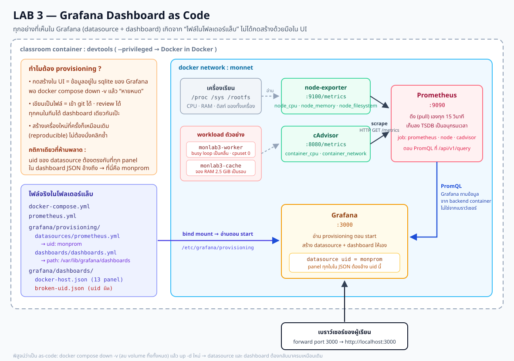

> **คำถามก่อนเริ่ม:** ถ้าเพื่อนร่วมทีมเพิ่งลบ container Grafana ทิ้งพร้อม volume แล้วสร้างใหม่ — dashboard 13 panel ที่คุณนั่งทำมาทั้งบ่ายจะยังอยู่ไหม? แล็บนี้จะให้คุณลบจริงแล้วดูด้วยตาว่าคำตอบขึ้นอยู่กับ “คุณสร้างมันด้วยอะไร”

แล็บนี้ใช้ terminal เดียว ทุกคำสั่งตั้งแต่ข้อ 1 เป็นต้นไปให้รัน **ข้างในเครื่องเรียน** ผ่าน VS Code Remote-SSH

---

## 0. เตรียมเครื่องเรียน

ทำบนเครื่องของเราเอง — เปิด classroom container ที่มี Docker พร้อมใช้ แล้ว SSH เข้าไป:

```bash
docker start devtools 2>/dev/null || \
  docker run -dit --name devtools --privileged -p 2222:22 tuchsanai/devtools:2569_1
ssh root@localhost -p 2222        # password : passwd
```

> 📝 **คำอธิบาย:** `docker start ... || docker run ...` ใช้เครื่องเรียนเดิมถ้ามี และสร้างใหม่เฉพาะเมื่อยังไม่มี · `-dit` รันเบื้องหลังพร้อม terminal · `--name devtools` ตั้งชื่อคงที่ · `--privileged` จำเป็นสำหรับรัน Docker ซ้อนข้างใน classroom container · `-p 2222:22` ส่ง port SSH จากเครื่องเราเข้า port 22 ของกล่อง · หลัง SSH แล้ว prompt จะเป็นฝั่งเครื่องเรียน ซึ่งเป็นที่รันคำสั่ง Docker ทั้งหมดของ LAB
>
> ⚠️ `--privileged` ให้สิทธิ์สูงมาก ใช้เฉพาะ disposable classroom container นี้ ห้ามนำรูปแบบนี้ไปใช้กับ production workload

ใน VS Code แนะนำให้ใช้ **Remote-SSH** ต่อ `root@localhost:2222` แล้วเปิดโฟลเดอร์ `~/labwork/DevTools` เพื่อแก้ไฟล์และเปิด terminal ในเครื่องเรียนโดยตรง

ตรวจว่า Docker CLI คุยกับ daemon ชั้นในได้:

```bash
docker --version
docker info --format 'Docker daemon: {{.ServerVersion}}'
docker compose version
```

> 📝 **คำอธิบาย:** บรรทัดแรกดูเวอร์ชัน CLI ส่วน `docker info` ถาม daemon จริง จึงแยกได้ระหว่าง “ติดตั้งคำสั่ง Docker แล้ว” กับ “daemon พร้อมรับคำสั่งแล้ว” · แล็บนี้ใช้ Compose v2 syntax (คำสั่ง `docker compose` ไม่ใช่ `docker-compose`) จึงตรวจเวอร์ชันไว้ด้วย · ถ้าพบ `Cannot connect to the Docker daemon` ให้รอสักครู่แล้วลองใหม่

✅ **Expected output** — ต้องมีเลขเวอร์ชันครบสามบรรทัด (เลขเวอร์ชันและ build อาจเปลี่ยนตาม image ห้องเรียน):

```text
Docker version 29.6.2, build dfc4efb
Docker daemon: 29.6.2
Docker Compose version v5.3.1
```

---

## 1. Clone โค้ดแล็บ

```bash
mkdir -p ~/labwork && cd ~/labwork
git clone https://github.com/Tuchsanai/DevTools.git
cd DevTools/03_Application_Docker/03_Monitoring/003_LAB_Grafana_Dashboard_As_Code
ls
```

> 📝 **คำอธิบาย:** `mkdir -p` สร้างพื้นที่ทำงานโดยไม่ error ถ้ามีอยู่แล้ว · `git clone` ดึงไฟล์ของหลักสูตร · `cd` เข้า LAB นี้ให้ถูกโฟลเดอร์ก่อนใช้ Compose · ถ้าเคย clone ไว้แล้วให้ข้าม `git clone` แล้ว `cd` เข้า path เดิมได้เลย
>
> ⚠️ ทุกแล็บของชุด Monitoring ใช้ port ชุดเดียวกัน (9090 / 9100 / 8080 / 3000) — **ถ้าเพิ่งทำ LAB อื่นมา ต้อง `docker compose down` ในโฟลเดอร์แล็บนั้นก่อน** ไม่งั้นจะชนกันที่ port

✅ **Expected output** — เห็นไฟล์ของแล็บครบ:

```text
docker-compose.yml
grafana
images
prometheus.yml
readme.md
```

ดึง image ที่ pin เวอร์ชันไว้ก่อนเริ่ม เพื่อแยกขั้น download ออกจากขั้นสร้าง container:

```bash
docker compose pull --quiet
```

> 📝 **คำอธิบาย:** ทุก tag ในแล็บนี้ถูก pin ไว้ (`prom/prometheus:v3.7.3`, `prom/node-exporter:v1.10.2`, `ghcr.io/google/cadvisor:v0.57.0`, `grafana/grafana:12.3.1`, `python:3.13-alpine`) เพื่อให้ทั้งห้องได้พฤติกรรมเดียวกัน · **ห้ามใช้ `latest`** เพราะวันนี้กับพรุ่งนี้อาจได้คนละเวอร์ชัน แล้ว dashboard JSON ที่เขียนไว้อาจเพี้ยน

✅ **Expected output** — รอบทดสอบจริงได้สถานะต่อไปนี้; ถ้ามี image อยู่แล้วจะจบเร็วกว่าและลำดับบรรทัดสลับกันได้:

```text
 Image prom/prometheus:v3.7.3 Pulling 
 Image grafana/grafana:12.3.1 Pulling 
 Image prom/node-exporter:v1.10.2 Pulling 
 Image python:3.13-alpine Pulling 
 Image ghcr.io/google/cadvisor:v0.57.0 Pulling 
 Image python:3.13-alpine Pulled 
 Image prom/node-exporter:v1.10.2 Pulled 
 Image ghcr.io/google/cadvisor:v0.57.0 Pulled 
 Image prom/prometheus:v3.7.3 Pulled 
 Image grafana/grafana:12.3.1 Pulled 
```

---

## 2. เปิด Stack แล้วตรวจ “ต้นน้ำ” ก่อนเสมอ

`docker-compose.yml` ของแล็บนี้มี 6 service — 3 ตัวเป็นระบบ monitoring, 1 ตัวคือ Grafana, และอีก 2 ตัวเป็น workload ที่จงใจใส่มาเพื่อให้กราฟมีอะไรให้ดู:

```yaml
name: monlab3

services:
  prometheus:      # เก็บ metric  :9090
  node-exporter:   # metric ของทั้งเครื่อง  :9100
  cadvisor:        # metric ของแต่ละ container  :8080
  grafana:         # หน้าจอ  :3000
  worker:          # busy loop เป็นคลื่นไซน์ (cpuset: "0")
  cache:           # จอง RAM ทีละ 128 MiB จนถึง 2.5 GiB แล้วปล่อย วนไปเรื่อย ๆ
```

> 📝 **คำอธิบาย:** `name: monlab3` ทำให้ Compose ตั้งชื่อ project เป็น `monlab3` แน่นอน (ไม่ขึ้นกับชื่อโฟลเดอร์) และเราตั้ง `container_name:` ให้ทุกตัวเป็น `monlab3-*` เพื่อให้ label `name=` ที่ cAdvisor ส่งออกมาสั้นและเดาได้ → PromQL ในเอกสารนี้จึงอ้างชื่อได้ตรง ๆ
>
> `worker` ใช้ `cpuset: "0"` ปักหมุดไว้ 1 core (**ไม่ใช้ `cpus:` หรือ `mem_limit:`** เพราะในกล่องเรียนที่ซ้อน Docker หลายชั้น การตั้ง limit สองตัวนี้จะสร้าง container ไม่สำเร็จ) · `cache` จอง `bytearray` ทีละ 128 MiB เพื่อให้กราฟ RAM ของเครื่องเป็นฟันเลื่อยที่มองเห็นได้จริง
>
> node-exporter ต้อง mount `/proc`, `/sys`, `/` แบบในไฟล์นี้เท่านั้น — ถ้าใช้รูปแบบ `- /:/host:ro,rslave` ที่เห็นบ่อยในอินเทอร์เน็ต จะพังทันทีด้วย `path / is mounted on / but it is not a shared or slave mount`
>
> cAdvisor ต้องมี `--containerd=/var/run/docker/containerd/containerd.sock` เพราะค่า default (`/run/containerd/...`) **ไม่มีจริงบน Docker 29** ถ้าไม่ใส่ metric จะไม่มี label `name=` เลย แล้ว PromQL ทุกข้อในแล็บนี้จะได้ผลว่าง

เปิดทั้ง stack:

```bash
docker compose up -d
docker compose ps
```

> 📝 **คำอธิบาย:** `up -d` สร้าง network `monnet`, volume 2 ก้อน แล้วสั่ง start ทุก service เบื้องหลัง · `ps` ยืนยันว่าทุกตัว `Up` และเห็น port ที่ publish ออกมา · `worker` กับ `cache` ไม่มี port เพราะไม่ได้ให้บริการอะไร มีหน้าที่ “ทำงาน” ให้เราวัดเท่านั้น

✅ **Expected output** — ลำดับ container สลับกันได้ แต่ต้องได้ 6 ตัวและ `cadvisor` ขึ้น `(healthy)`:

```text
 Network monnet Creating 
 Network monnet Created 
 Volume monlab3_prom-data Creating 
 Volume monlab3_prom-data Created 
 Volume monlab3_grafana-data Creating 
 Volume monlab3_grafana-data Created 
 ...
 Container monlab3-grafana Started 
NAME                    IMAGE                             COMMAND                  SERVICE         CREATED         STATUS                   PORTS
monlab3-cache           python:3.13-alpine                "python -c 'import t…"   cache           7 seconds ago   Up 5 seconds             
monlab3-cadvisor        ghcr.io/google/cadvisor:v0.57.0   "/usr/bin/entrypoint…"   cadvisor        7 seconds ago   Up 5 seconds (healthy)   0.0.0.0:8080->8080/tcp, [::]:8080->8080/tcp
monlab3-grafana         grafana/grafana:12.3.1            "/run.sh"                grafana         6 seconds ago   Up 5 seconds             0.0.0.0:3000->3000/tcp, [::]:3000->3000/tcp
monlab3-node-exporter   prom/node-exporter:v1.10.2        "/bin/node_exporter …"   node-exporter   7 seconds ago   Up 5 seconds             0.0.0.0:9100->9100/tcp, [::]:9100->9100/tcp
monlab3-prometheus      prom/prometheus:v3.7.3            "/bin/prometheus --c…"   prometheus      7 seconds ago   Up 5 seconds             0.0.0.0:9090->9090/tcp, [::]:9090->9090/tcp
monlab3-worker          python:3.13-alpine                "python -c 'import m…"   worker          7 seconds ago   Up 5 seconds
```

รอให้ทั้ง Prometheus และ Grafana พร้อม แล้วตรวจ target:

```bash
prom_ok=0; graf_ok=0
for i in $(seq 1 60); do curl -sf http://localhost:9090/-/ready >/dev/null && { prom_ok=1; break; }; sleep 2; done
for j in $(seq 1 90); do curl -sf http://localhost:3000/api/health >/dev/null && { graf_ok=1; break; }; sleep 2; done
[ "$prom_ok" = 1 ] && echo "READY: Prometheus" || echo "TIMEOUT: Prometheus ไม่พร้อม — ดู 'docker compose logs prometheus'"
[ "$graf_ok" = 1 ] && echo "READY: Grafana"    || echo "TIMEOUT: Grafana ไม่พร้อม — ดู 'docker compose logs grafana'"
curl -s http://localhost:3000/api/health

sleep 20
curl -s "http://localhost:9090/api/v1/targets?state=active" | python3 -c "
import sys,json
for t in json.load(sys.stdin)['data']['activeTargets']:
    print(t['labels']['job'].ljust(12), t['scrapeUrl'].ljust(34), t['health'])
"
```

> 📝 **คำอธิบาย:** loop สองอันคือ **readiness check** ไม่ใช่ `sleep` ตายตัว — `curl -f` คืน error เมื่อ HTTP ไม่ใช่ 2xx จึงวนรอจนบริการตอบจริง และมีเพดาน (60 / 90 รอบ) กัน loop ค้างไม่รู้จบ · **ตัวแปร `prom_ok` / `graf_ok` สำคัญ** เพราะลูปที่หมดเวลาจะจบเหมือนลูปที่สำเร็จทุกประการ ถ้าไม่เก็บผลไว้ เราจะพิมพ์ว่า "พร้อมแล้ว" ทั้งที่ระบบยังไม่ขึ้น แล้วไปหลงทางกับ error ที่ไม่เกี่ยวกันในข้อถัดไป · `sleep 20` หลังจากนั้นเผื่อให้ scrape รอบแรกของทั้ง 3 job เกิดขึ้นก่อน (scrape_interval = 15s) มิฉะนั้น `health` อาจยังเป็น `unknown` · `/api/health` ของ Grafana บอกทั้งสถานะฐานข้อมูลภายในและเวอร์ชัน

✅ **Expected output** — Grafana ตอบ `database: ok` และ target ต้อง **up ครบ 3 job** (commit hash เปลี่ยนตาม build ได้):

```text
READY: Prometheus
READY: Grafana
{
  "database": "ok",
  "version": "12.3.1",
  "commit": "3a1c80ca7ce612f309fdc99338dd3c5e486339be"
}
cadvisor     http://cadvisor:8080/metrics       up
node         http://node-exporter:9100/metrics  up
prometheus   http://localhost:9090/metrics      up
```

> **กฎที่ควรติดตัว:** ถ้า panel ใน Grafana ว่าง ให้ย้อนมาดูบรรทัดพวกนี้ก่อนเสมอ — ปัญหา “กราฟไม่ขึ้น” ส่วนใหญ่ไม่ได้อยู่ที่ Grafana แต่อยู่ที่ target ไม่ UP หรือ query ผิด

---

## 3. เปิด Grafana แล้วดู Datasource ที่ “ไม่ได้กดสร้างเอง”

Grafana อยู่ port `3000` ข้างในเครื่องเรียน ให้ forward port ออกมาที่เครื่องเราก่อน:

1. ใน VS Code เปิดแท็บ **PORTS** ข้าง TERMINAL
2. กด **Forward a Port** แล้วกรอก `3000`
3. เปิด `http://localhost:3000`

> 📝 **คำอธิบาย:** port `3000` ที่ `docker compose ps` แสดงคือ port **ในเครื่องเรียน** ไม่ใช่บนเครื่องเราโดยตรง จึงต้องมี port forwarding มาก่อน · ถ้าไม่ใช้ VS Code ให้เปิด terminal ใหม่บนเครื่องเราแล้วปล่อย session นี้ค้างไว้:
>
> ```bash
> ssh -L 3000:localhost:3000 root@localhost -p 2222        # password : passwd
> ```
>
> `-L 3000:localhost:3000` สร้าง tunnel จาก port 3000 ของเครื่องเราไป port 3000 ในเครื่องเรียน · `-p 2222` ตรงนี้เลือก port SSH ไม่ใช่ port ของ Grafana

**เข้าสู่ระบบด้วย `admin` / `admin`** (ถ้าหน้าจอชวนเปลี่ยนรหัสผ่าน กด **Skip** ได้ในห้องเรียน)

> ⚠️ **เรื่องความปลอดภัยที่ต้องพูดให้ชัด:** compose ของแล็บนี้ตั้ง
> `GF_AUTH_ANONYMOUS_ENABLED=true` และ `GF_AUTH_ANONYMOUS_ORG_ROLE=Viewer`
> แปลว่า **ใครเปิด URL ก็ดู dashboard ได้โดยไม่ต้อง login** — ทำแบบนี้เพราะเป็นห้องเรียน จะได้ส่งลิงก์ให้เพื่อนดูกราฟได้ทันที
> **ห้ามทำแบบนี้ใน production เด็ดขาด** และรหัส `admin/admin` ที่ตั้งผ่าน `GF_SECURITY_ADMIN_USER` / `GF_SECURITY_ADMIN_PASSWORD` ก็เป็นค่าสำหรับห้องเรียนเท่านั้น
> สิทธิ์ Viewer แบบ anonymous **ดูได้อย่างเดียว** — สร้าง/แก้ panel, เปิด Explore หรือดูหน้า Data sources ไม่ได้ ดังนั้นข้อ 3–9 ต้อง **login เป็น admin ก่อน**

ไปที่เมนู **Connections → Data sources**

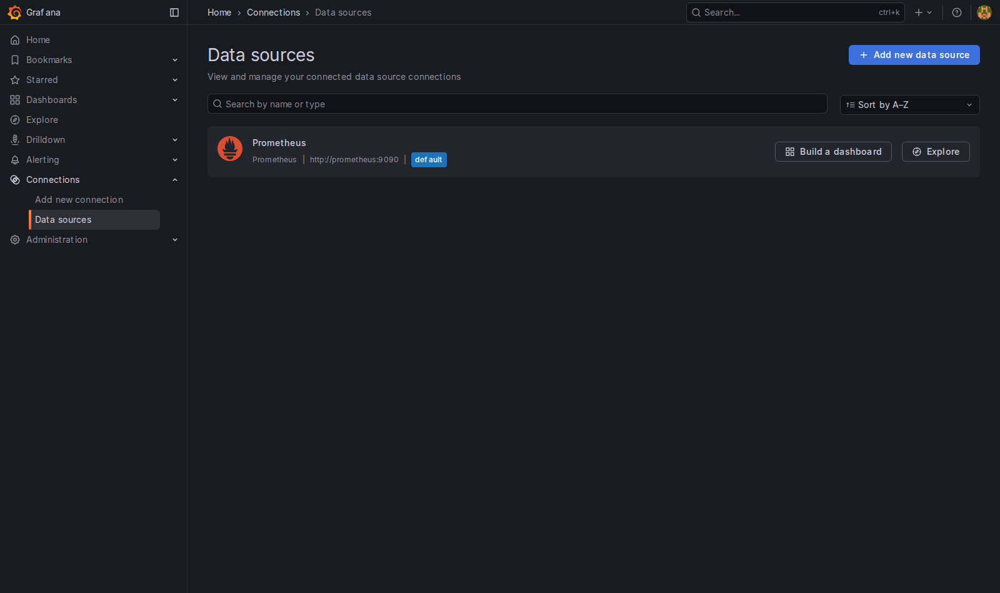

มี datasource ชื่อ `Prometheus` ชี้ไป `http://prometheus:9090` อยู่แล้ว **ทั้งที่เราไม่ได้กดสร้าง** — คลิกเข้าไปดู

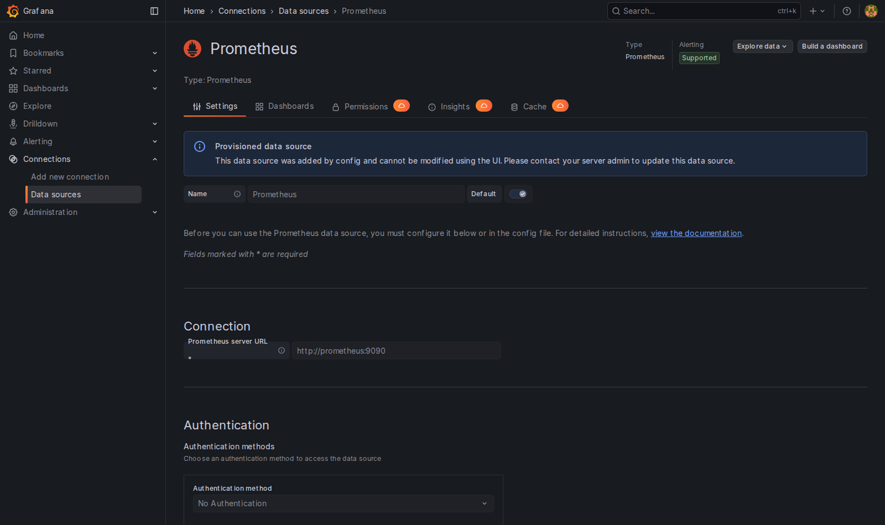

> 📝 **คำอธิบาย:** แถบสีฟ้าเขียนว่า *“Provisioned data source — This data source was added by config and cannot be modified using the UI.”* นี่คือผลของ `editable: false` ในไฟล์ provisioning · ช่อง URL เป็น `http://prometheus:9090` ไม่ใช่ `localhost:9090` เพราะ **Grafana ยิง query จากในคอนเทนเนอร์ของตัวเอง** ไม่ใช่จากเบราว์เซอร์ของเรา จึงต้องใช้ชื่อ service ใน network `monnet` เป็น DNS

ตรวจแบบข้อความด้วย API (เห็นชัดกว่าและ copy ไปใช้ใน script ได้):

```bash
curl -s -u admin:admin http://localhost:3000/api/datasources | python3 -m json.tool | grep -E '"(name|uid|type|url|isDefault|readOnly)"'
```

> 📝 **คำอธิบาย:** `-u admin:admin` คือ basic auth ของ Grafana API · `python3 -m json.tool` จัด JSON ให้อ่านง่าย · `grep -E` เหลือเฉพาะ field ที่อธิบายสายงานได้ครบ · **`readOnly: true` คือหลักฐานว่า datasource ตัวนี้มาจากไฟล์ ไม่ใช่จากการกดสร้าง**

✅ **Expected output**

```text
        "uid": "monprom",
        "name": "Prometheus",
        "type": "prometheus",
        "url": "http://prometheus:9090",
        "isDefault": true,
        "readOnly": true
```

---

## 4. อ่าน Provisioning ทีละไฟล์

Grafana มองหา config ที่ path เดียวเท่านั้นคือ **`/etc/grafana/provisioning/`** ข้างในคอนเทนเนอร์ ส่วน compose ของเรา mount เข้าไปแบบนี้:

```yaml
    volumes:
      - ./grafana/provisioning:/etc/grafana/provisioning:ro
      - ./grafana/dashboards:/var/lib/grafana/dashboards:ro
      - grafana-data:/var/lib/grafana
```

> 📝 **คำอธิบาย:** บรรทัดแรกคือ “สมองสั่งการ” — บอก Grafana ว่ามี datasource/ dashboard provider อะไรบ้าง · บรรทัดที่สองคือ “ตัว dashboard จริง” ที่ provider จะไปอ่าน · `:ro` = อ่านอย่างเดียว กัน Grafana เขียนทับไฟล์ต้นฉบับของเรา · `grafana-data` เป็น named volume เก็บ sqlite ภายในของ Grafana (ผู้ใช้, การตั้งค่า, dashboard ที่กดสร้างเอง) — **จุดสำคัญคือของที่อยู่ใน volume นี้จะหายเมื่อ `down -v` แต่ของที่อยู่ในไฟล์ไม่หาย**

### 4.1 `grafana/provisioning/datasources/prometheus.yml`

```yaml
apiVersion: 1

datasources:
  - name: Prometheus
    uid: monprom
    type: prometheus
    access: proxy
    url: http://prometheus:9090
    isDefault: true
    editable: false
    jsonData:
      httpMethod: POST
      timeInterval: 15s
```

> 📝 **คำอธิบาย ทีละบรรทัด:**
> - `apiVersion: 1` — เวอร์ชันของ schema ไฟล์ provisioning (ไม่ใช่เวอร์ชัน Grafana) ต้องมีเสมอ
> - **`uid: monprom`** — หัวใจของแล็บนี้ ถ้าไม่กำหนดเอง Grafana จะ **สุ่ม uid ให้** (เดี๋ยวข้อ 10 จะเห็นตัวอย่างจริงว่าสุ่มออกมาหน้าตาแบบไหน) แล้ว dashboard JSON ที่ commit ไว้จะอ้างไม่ตรงทันทีเมื่อไปสร้างที่เครื่องอื่น
> - `access: proxy` — Grafana ยิง query จาก **backend ของตัวเอง** ไปหา Prometheus · เมื่อก่อนเคยมีโหมด `direct` ที่ให้เบราว์เซอร์ของผู้ใช้ยิงไปหา Prometheus เอง แต่ **ถูกถอดออกตั้งแต่ Grafana 9.2** เพราะติดปัญหา CORS และเปิด URL ภายในองค์กรให้เบราว์เซอร์เห็น · ใน Grafana 12.3.1 ที่เราใช้ **ไม่มีให้เลือกแล้ว** Prometheus datasource ทำงานผ่าน backend ทางเดียวเท่านั้น — บรรทัดนี้จึงเขียนไว้เพื่อความชัดเจน ไม่ใช่เพื่อเลือกโหมด
> - `url: http://prometheus:9090` — ชื่อ service ใน compose = DNS ของ network `monnet`
> - `isDefault: true` — panel ที่ไม่ระบุ datasource จะใช้ตัวนี้ (แต่ dashboard ของเรา **ระบุ uid ทุก panel** ไม่พึ่ง default)
> - `editable: false` — ล็อกไม่ให้แก้จาก UI จนคนละเรื่องกับไฟล์
> - `timeInterval: 15s` — บอก Grafana ว่า Prometheus scrape ทุก 15 วินาที ทำให้ `$__rate_interval` และ Min step คำนวณถูก
>   ℹ️ **ตรงไปตรงมา:** ค่า default ของ Grafana ก็คือ `15s` อยู่แล้ว ซึ่งบังเอิญตรงกับ `scrape_interval` ของแล็บนี้พอดี **ถ้าไม่ตั้งบรรทัดนี้ กราฟในแล็บนี้ก็ยังปกติ** · ที่ต้องเขียนไว้เพราะวันที่ไปเจอระบบจริงที่ scrape ทุก `30s` หรือ `1m` **แล้วลืมตั้ง** Grafana จะยังคิดว่า 15s แล้วขอ step ถี่เกินกว่าที่มีข้อมูลจริง — ตอนนั้นแหละที่กราฟจะเป็นรู · การเขียน `timeInterval` ให้ตรงกับ scrape จริงเสมอคือนิสัยที่กันปัญหานั้นไว้ล่วงหน้า
>
> ⚠️ ไฟล์ในโฟลเดอร์ `datasources/` ถูกอ่าน **ตอน Grafana start เท่านั้น** — แก้แล้วต้อง `docker compose restart grafana`

### 4.2 `grafana/provisioning/dashboards/dashboards.yml`

```yaml
apiVersion: 1

providers:
  - name: monlab3-files
    orgId: 1
    folder: Monitoring LAB3
    type: file
    disableDeletion: false
    updateIntervalSeconds: 10
    allowUiUpdates: false
    options:
      path: /var/lib/grafana/dashboards
      foldersFromFilesStructure: false
```

> 📝 **คำอธิบาย:** ไฟล์นี้ **ไม่ใช่ dashboard** แต่เป็น “ใบสั่งงาน” บอกว่าให้ไปอ่าน dashboard จากโฟลเดอร์ไหน
> - `type: file` + `options.path` — **path นี้คือ path ข้างในคอนเทนเนอร์** ต้องตรงกับที่ compose mount `./grafana/dashboards` เข้าไป ถ้าวางไฟล์ JSON ไว้ข้าง ๆ ไฟล์ YAML นี้เฉย ๆ Grafana **จะไม่เห็น**
> - `folder: Monitoring LAB3` — ชื่อโฟลเดอร์ที่จะโผล่ในหน้า Dashboards
> - `updateIntervalSeconds: 10` — สแกนโฟลเดอร์ซ้ำทุก 10 วินาที ทำให้แก้ไฟล์ JSON แล้วเห็นผล **โดยไม่ต้อง restart** (เราจะใช้ข้อนี้ตอนแก้บั๊กในข้อ 9)
> - `allowUiUpdates: false` — กด Save ทับจาก UI ไม่ได้ ของจริงอยู่ในไฟล์เสมอ นี่คือหัวใจของคำว่า *dashboard as code*
>
> ℹ️ ต่อให้ตั้ง `allowUiUpdates: true` ก็ยัง **ไม่ควร** แก้ผ่าน UI เพราะสิ่งที่แก้จะถูกเขียนลงฐานข้อมูลของ Grafana เท่านั้น **ไม่ได้เขียนกลับไฟล์ JSON** และรอบสแกนถัดไปที่ไฟล์เปลี่ยน ระบบจะทับของที่แก้ใน UI ทิ้ง

### 4.3 `grafana/dashboards/docker-host.json`

ไฟล์นี้คือ dashboard ทั้งใบ ลองส่องหัวไฟล์และนับ panel:

```bash
head -c 400 grafana/dashboards/docker-host.json; echo
grep -c '"gridPos"' grafana/dashboards/docker-host.json
grep -o '"uid": "monprom"' grafana/dashboards/docker-host.json | wc -l
```

> 📝 **คำอธิบาย:** `"gridPos"` มีหนึ่งอันต่อ panel จึงใช้นับจำนวน panel ได้ · บรรทัดสุดท้ายนับว่ามีการอ้าง `uid: monprom` กี่จุด — **ทุก panel และทุก target ต้องอ้าง uid นี้** ไม่มีจุดไหนหลุด

✅ **Expected output** — 13 panel และมีการอ้าง `monprom` 32 จุด (1 จุดต่อ panel + 1 จุดต่อ query + 1 จุดของ variable):

```text
{
  "annotations": {
    "list": [
      {
        "builtIn": 1,
        "datasource": {
          "type": "grafana",
          "uid": "-- Grafana --"
        },
        "enable": true,
        "hide": true,
        "iconColor": "rgba(0, 211, 255, 1)",
        "name": "Annotations & Alerts",
        "type": "dashboard"
      }
    ]
  },
  "description": "Dashboard ของ LAB3 — provision ม
13
32
```

ถาม Grafana ว่ามันมองเห็นอะไรบ้าง:

```bash
curl -s -u admin:admin "http://localhost:3000/api/search?type=dash-db" | python3 -c "
import sys,json
for d in json.load(sys.stdin): print(d['uid'].ljust(16), '|', d['title'], '| folder:', d.get('folderTitle'))
"

curl -s -u admin:admin http://localhost:3000/api/dashboards/uid/monlab3-host | python3 -c "
import sys,json
r=json.load(sys.stdin)
print('title      :', r['dashboard']['title'])
print('panels     :', len(r['dashboard']['panels']))
print('provisioned:', r['meta']['provisioned'])
print('file       :', r['meta']['provisionedExternalId'])
"
```

> 📝 **คำอธิบาย:** `/api/search` = สิ่งที่เห็นในหน้า Dashboards แบบข้อความ · `/api/dashboards/uid/<uid>` คืนทั้งตัว dashboard และ `meta` — **`provisioned: True` พร้อมชื่อไฟล์ต้นทาง คือหลักฐานว่า Grafana ผูก dashboard ใบนี้กับไฟล์ของเราจริง** ไม่ใช่ของที่ใครกดสร้างทิ้งไว้ · การเช็กด้วย API สำคัญกว่าดู log เพราะ log ที่ไม่มี error **ไม่ได้แปลว่า dashboard ขึ้นแล้ว**

✅ **Expected output**

```text
monlab3-broken   | LAB3 · Broken Datasource UID | folder: Monitoring LAB3
monlab3-host     | LAB3 · Docker Host Overview | folder: Monitoring LAB3
title      : LAB3 · Docker Host Overview
panels     : 13
provisioned: True
file       : docker-host.json
```

> `monlab3-broken` คือ dashboard ที่ตั้งใจทำพังไว้ให้ (ไฟล์ `broken-uid.json`) — เราจะเปิดมันในข้อ 9

---

## 5. Explore — ที่ที่ query เกิดก่อนจะกลายเป็น panel

ก่อนจะไปดู dashboard สำเร็จรูป ลองเขียน query เองที่เมนู **Explore** (ต้อง login เป็น admin):

1. เมนูซ้าย → **Explore**
2. เลือก datasource `Prometheus`
3. สลับปุ่มมุมขวาเป็น **Code** แล้ววาง query นี้

```promql
topk(5, sum by (name) (rate(container_cpu_usage_seconds_total{name!=""}[2m])))
```

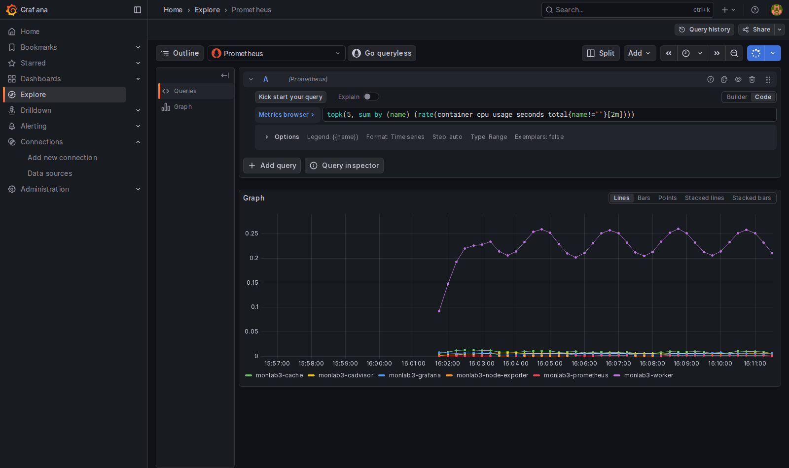

> 📝 **คำอธิบาย query ทีละชั้น (อ่านจากในออกนอก):**
> - `container_cpu_usage_seconds_total` เป็น **counter** หน่วยวินาที-CPU สะสม → ดูค่าดิบไม่มีประโยชน์เพราะมีแต่เพิ่ม
> - `{name!=""}` **ต้องมี** — cAdvisor ส่ง series ของ “ทั้งเครื่อง” มาด้วยโดยมี `name=""` (`id="/"`) ถ้าไม่กรอง ผลรวมจะเบิ้ล
> - `rate(...[2m])` แปลง counter เป็น “ต่อวินาที” → สำหรับ CPU อ่านได้ว่า **จำนวน core ที่ใช้** (1.0 = กิน 1 core เต็ม)
> - `sum by (name)` ยุบทุก core/ทุก cgroup ย่อยของ container เดียวกันเป็นเส้นเดียว
> - `topk(5, ...)` เอาเฉพาะ 5 ตัวที่กินมากสุด ไม่งั้น legend ยาวจนอ่านไม่ไหว
>
> เส้นที่วิ่งเป็นคลื่นไซน์คือ `monlab3-worker` ที่เราตั้งใจให้ busy loop แบบ duty cycle เปลี่ยนไปมา — มันคือ “คนไข้” ให้เราวัด

> **จุดที่ต้องจับให้ได้:** Explore ไม่ได้เก็บอะไรไว้เลย มันคือกระดาษทด · สิ่งที่ทำให้ query กลายเป็นของถาวรคือการเอาไป**เขียนไว้ในไฟล์** ซึ่งเป็นสิ่งที่ dashboard ของเราทำ

---

## 6. Dashboard 13 Panel ที่มาจากไฟล์เดียว

เปิดเมนู **Dashboards → Monitoring LAB3 → LAB3 · Docker Host Overview**
(หรือเข้าตรง ๆ ที่ `http://localhost:3000/d/monlab3-host` — uid ที่เรากำหนดเองทำให้ลิงก์นี้เหมือนกันทุกเครื่อง)

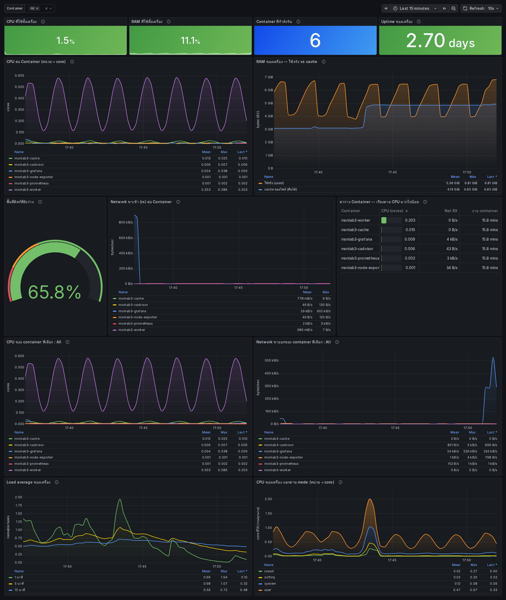

> 📝 **อ่าน dashboard นี้ให้เป็น** — แต่ละแถวตอบคนละคำถาม:
>
> | แถว | panel | ตอบคำถามว่า | จุดที่ต้องสังเกต |
> |---|---|---|---|
> | 1 | Stat × 4 | “ตอนนี้เครื่องเป็นยังไง” | unit `percent` และ `s` · สีพื้นหลังมาจาก **threshold** (เขียว → เหลืองที่ 60% → แดงที่ 85%) |
> | 2 | CPU ต่อ Container | “ใครกิน CPU” | หน่วยเป็น **core** ไม่ใช่ % · เส้นคลื่นคือ `monlab3-worker` |
> | 2 | RAM ของเครื่อง | “RAM หายไปไหน” | unit **bytes(IEC)** → Grafana เขียน GiB ให้เอง · ฟันเลื่อยคือ `monlab3-cache` จอง/ปล่อย RAM |
> | 3 | Gauge ดิสก์ว่าง | “ยังเหลือที่เท่าไร” | threshold **กลับด้าน**: ว่างน้อย = แดง |
> | 3 | Network rx | “ใครรับข้อมูลเยอะ” | unit `Bps` · ตัวที่สูงคือ Grafana/Prometheus เพราะถูก scrape และถูกเราเปิดดู |
> | 3 | ตาราง Container | “จัดอันดับตอนนี้” | เป็น **instant query** 3 ชุดรวมกันด้วย transformation `joinByField` บน label `name` · คอลัมน์ CPU เป็น cell แบบ gauge |
> | 4 | สอง panel ที่มี `$container` | “เจาะดูตัวเดียว” | ผูกกับ variable ที่ dropdown ข้างบน |
> | 5 | Load average | “คิวงานยาวแค่ไหน” | หน่วยคือ **จำนวน task ที่พร้อมรัน** ไม่ใช่เปอร์เซ็นต์ · เทียบกับจำนวน core ของเครื่องเสมอ |
> | 5 | CPU by mode | “เวลา CPU หมดไปกับอะไร” | `sum by (mode) (rate(...))` → หน่วยเป็น **core** เหมือน panel CPU ต่อ Container · `user` = โค้ดของโปรแกรม · `system` = kernel · `iowait` = รอดิสก์ · `softirq` = งานเครือข่าย/ขัดจังหวะ |
>
> ⚠️ **จุดที่พลาดกันบ่อยใน panel CPU by mode:** ถ้าเขียน `avg by (mode)` แทน `sum by (mode)` ผลที่ได้จะเป็น **สัดส่วนเฉลี่ยต่อ 1 แกน (0–1)** ไม่ใช่จำนวน core · บนเครื่อง 32 core ค่า `user` จริง 7 core จะแสดงเป็น `0.22` ซึ่งดูเหมือน "เครื่องว่างมาก" ทั้งที่ไม่ใช่ · ทั้งชุดแล็บนี้ตกลงกันว่า **`rate()` ของ CPU counter อ่านเป็น "จำนวน core"** เสมอ ดังนั้น panel นี้จึงต้องใช้ `sum` · ถ้าอยากได้เป็นเปอร์เซ็นต์จริง ๆ ต้องใช้ `avg` **คู่กับ unit `percentunit`** และเขียนกำกับให้ชัดว่าเป็น "ต่อแกน" — อย่าผสมสองแบบในแดชบอร์ดเดียวกัน

ถ้าอยากตรวจแบบไม่ต้องเชื่อสายตา ให้ยิง query ของ panel ผ่าน datasource proxy ของ Grafana เอง:

```bash
Q='count(count by (name) (container_last_seen{name!=""}))'
curl -s -u admin:admin --get "http://localhost:3000/api/datasources/proxy/uid/monprom/api/v1/query" \
  --data-urlencode "query=$Q"
```

> 📝 **คำอธิบาย:** endpoint นี้คือทางที่ panel ใช้จริง — ถ้าเส้นทางนี้ตอบข้อมูลได้ แปลว่า Grafana → datasource `monprom` → Prometheus ต่อกันครบ ถ้า panel ยังว่างทั้งที่คำสั่งนี้มีข้อมูล ปัญหาจะอยู่ที่ **ตัว panel** (uid ผิด / ช่วงเวลา / unit) ไม่ใช่ที่การเชื่อมต่อ · `--data-urlencode` ช่วย encode อักขระอย่าง `{`, `"`, `!` ให้เอง

✅ **Expected output** — `"value"` ตัวหลังคือจำนวน container ที่ cAdvisor เห็น (เท่ากับ 6 ในแล็บนี้; เลข timestamp จะต่างกันทุกครั้ง):

```text
{"status":"success","data":{"resultType":"vector","result":[{"metric":{},"value":[1786811210.905,"6"]}]}}
```

> ⚠️ **ทำไม dashboard นี้ไม่มี panel “RAM ต่อ container”?**
> ในกล่องเรียนที่รัน Docker ซ้อนกันหลายชั้น cgroup v2 ชั้นในไม่ได้เปิด controller `memory` ให้ ตรวจได้ด้วย
> ```bash
> cat /sys/fs/cgroup/cgroup.subtree_control     # ได้: cpuset cpu pids  (ไม่มีคำว่า memory)
> docker stats --no-stream --format 'table {{.Name}}\t{{.CPUPerc}}\t{{.MemUsage}}'
> ```
> ผลจริงในเครื่องทดสอบคือ **`0B / 0B` ทุก container** และ `container_memory_working_set_bytes{name!=""}` ก็ได้ `0` ทุกตัว
> ```text
> NAME                    CPU %     MEM USAGE / LIMIT
> monlab3-grafana         0.20%     0B / 0B
> monlab3-worker          63.75%    0B / 0B
> monlab3-cache           0.00%     0B / 0B
> ```
> เราจึงเลือกวัด RAM ที่ **ระดับเครื่อง** (จาก node-exporter ซึ่งอ่าน `/proc/meminfo` ได้ปกติ) แทน — และให้ `monlab3-cache` จอง RAM เป็นรอบเพื่อให้เห็นการขยับจริงบนกราฟ
> **ถ้าเครื่องของคุณเห็นคำว่า `memory` ในผลลัพธ์บรรทัดแรก** แปลว่าเพิ่ม panel ต่อ container ได้ ลองทำเป็นแบบฝึกหัด: เติม panel ใหม่ลง `docker-host.json` โดยใช้ query
> `topk(5, sum by (name) (container_memory_working_set_bytes{name!=""}))` และตั้ง `"unit": "bytes"` แล้วรอ 10 วินาที (ดูข้อ 9 ว่าทำไมไม่ต้อง restart)

---

## 7. เจาะเข้าไปใน Panel — Query, Unit, Threshold แล้วก็ JSON

เอาเมาส์ชี้ที่ชื่อ panel **“CPU ต่อ Container”** → กดเมนู `⋮` → **Edit**

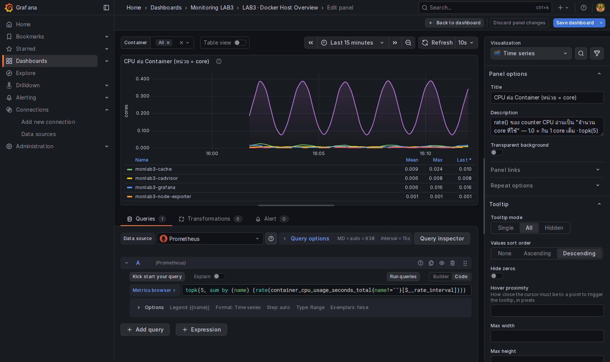

> 📝 **คำอธิบาย:** ช่องล่างคือ query เดียวกับที่เราพิมพ์ใน Explore เป๊ะ ๆ ต่างกันแค่ใช้ `$__rate_interval` แทน `[2m]` — ตัวแปรนี้ Grafana คำนวณให้เองจาก `timeInterval: 15s` ที่เราตั้งไว้ใน datasource บวกกับความกว้างของหน้าจอ ทำให้กราฟไม่เป็นรูเวลา zoom · แผงขวามือคือ **Panel options** (ชื่อ, คำอธิบาย) ส่วนที่ต้องเลื่อนลงไปดูคือ **Standard options → Unit** และ **Thresholds** ซึ่งทั้งหมดนี้ก็คือฟิลด์ใน JSON

ลองกด **Save dashboard** ดู — จะไม่สำเร็จ พิสูจน์แบบเห็นข้อความชัด ๆ ด้วย API:

```bash
curl -s -u admin:admin -H "Content-Type: application/json" -X POST \
  http://localhost:3000/api/dashboards/db \
  -d '{"dashboard":{"uid":"monlab3-host","title":"LAB3 · Docker Host Overview","panels":[],"version":0},"overwrite":true}'
```

> 📝 **คำอธิบาย:** คำสั่งนี้พยายามบันทึกทับ dashboard `monlab3-host` ด้วยเวอร์ชันที่ไม่มี panel เลย · Grafana ปฏิเสธเพราะ dashboard ใบนี้ผูกกับไฟล์ที่ provision มา (`allowUiUpdates: false`) · **นี่คือของดี ไม่ใช่ข้อจำกัดที่น่ารำคาญ** — มันการันตีว่าสิ่งที่อยู่บนจอ = สิ่งที่อยู่ใน git เสมอ ไม่มีใครแอบแก้แล้วลืมบอก

✅ **Expected output**

```text
{"message":"Cannot save provisioned dashboard"}
```

อยากเห็นทั้ง dashboard เป็น JSON ให้กดปุ่ม **Export → Export as code** มุมขวาบน

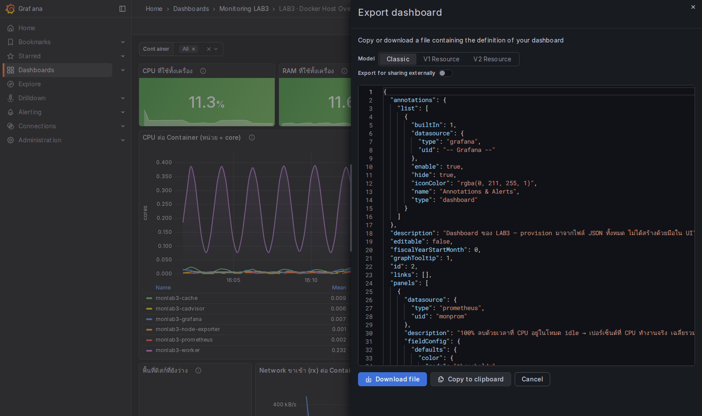

> 📝 **คำอธิบาย:** สิ่งที่เห็นในกล่องนี้คือหน้าตาเดียวกับไฟล์ `grafana/dashboards/docker-host.json` ในโฟลเดอร์แล็บ — **dashboard ไม่ใช่ “หน้าเว็บ” แต่เป็นข้อมูล JSON ที่ Grafana เอามาวาด** · เลือก Model เป็น **Classic** เพราะ Grafana 12 ยังรองรับ schema นี้กับ file provisioning ส่วน V1/V2 Resource เป็นรูปแบบใหม่สำหรับ API ไม่ใช่รูปแบบที่ provider แบบ file อ่าน
>
> ⚠️ อย่าเปิด **“Export for sharing externally”** ถ้าจะเอา JSON ไปใส่โฟลเดอร์ provisioning เพราะมันจะแปลง datasource เป็นตัวแปร `${DS_PROMETHEUS}` พร้อมบล็อก `__inputs` ซึ่งใช้กับ import wizard เท่านั้น — เอามา provision ตรง ๆ แล้ว panel จะพัง

เทียบกับไฟล์จริงเพื่อให้เห็นว่ามันคือของอันเดียวกัน:

```bash
python3 -c "
import json
d=json.load(open('grafana/dashboards/docker-host.json'))
p=[x for x in d['panels'] if x['id']==5][0]
print('title     :', p['title'])
print('type      :', p['type'])
print('datasource:', p['datasource'])
print('unit      :', p['fieldConfig']['defaults']['unit'])
print('expr      :', p['targets'][0]['expr'])
"
```

> 📝 **คำอธิบาย:** อ่าน panel id 5 ออกมาจากไฟล์ตรง ๆ — ทุกอย่างที่เราคลิกดูในหน้า Edit อยู่ในนี้หมด: ชนิด panel, datasource uid, unit, และ PromQL

✅ **Expected output**

```text
title     : CPU ต่อ Container (หน่วย = core)
type      : timeseries
datasource: {'type': 'prometheus', 'uid': 'monprom'}
unit      : short
expr      : topk(5, sum by (name) (rate(container_cpu_usage_seconds_total{name!=""}[$__rate_interval])))
```

---

## 8. Variable `$container` — ทำ Dashboard ให้ใช้ซ้ำได้

กด dropdown **Container** ที่มุมซ้ายบนของ dashboard

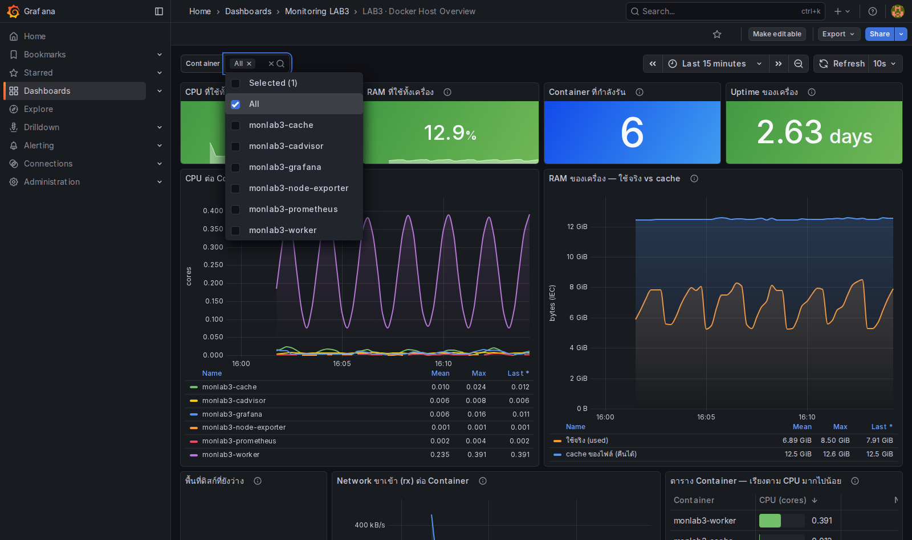

รายชื่อในนั้นไม่ได้พิมพ์ไว้ล่วงหน้า แต่มาจาก query นี้ในไฟล์ JSON:

```text
label_values(container_memory_working_set_bytes{name!=""}, name)
```

> 📝 **คำอธิบาย:** `label_values(<selector>, <label>)` = “ไปดูว่า series ที่ตรงเงื่อนไขนี้มีค่า label `name` อะไรบ้าง” · **มันอ่านจากรายชื่อ series ไม่ได้อ่านค่าตัวเลข** ดังนั้นถึงในกล่องเรียนค่าของ metric นี้จะเป็น 0 (ดูกล่องเตือนในข้อ 6) รายชื่อ container ก็ยังถูกต้อง · ตั้ง `"refresh": 2` ให้ Grafana ไปถามรายชื่อใหม่ทุกครั้งที่เปลี่ยนช่วงเวลา จึงเห็น container ที่เพิ่งสร้างได้โดยไม่ต้อง reload
>
> panel ที่ใช้ variable เขียนแบบนี้:
> `sum by (name) (rate(container_cpu_usage_seconds_total{name!="", name=~"$container"}[$__rate_interval]))`
> - `name=~"$container"` — Grafana แทน `$container` ให้ก่อนส่งไป Prometheus · ถ้าเลือกหลายตัวจะกลายเป็น regex `(monlab3-worker|monlab3-cache)`
> - ถ้าเลือก **All** จะกลายเป็น `allValue` ที่เราตั้งไว้คือ `.+`
> - **ยังต้องมี `name!=""` อยู่ดี** เพราะถ้าเผลอตั้ง `allValue` เป็น `.*` เมื่อไร series ของ “ทั้งเครื่อง” จะหลุดเข้ามาเป็นเส้นใหญ่เส้นหนึ่งทันที (ตอนทดสอบเจอมาแล้ว legend จะขึ้นคำว่า `Value` เฉย ๆ ไม่มีชื่อ container)

**ลองเอง:** เลือกเฉพาะ `monlab3-worker` แล้วดูสอง panel แถวที่ 4 — ชื่อ panel จะเปลี่ยนตามด้วยเพราะเราใส่ `$container` ไว้ในชื่อ panel

ตรวจว่ารายชื่อมาจากไหนแบบข้อความ:

```bash
curl -sg "http://localhost:9090/api/v1/label/name/values?match[]=container_memory_working_set_bytes{name!=\"\"}" | python3 -m json.tool
```

> 📝 **คำอธิบาย:** นี่คือ endpoint ที่ Grafana เรียกให้เราอยู่เบื้องหลังตอนเปิด dropdown · `-g` ปิดการตีความ `{}` `[]` ของ curl ไม่งั้นจะ error

✅ **Expected output**

```text
{
    "status": "success",
    "data": [
        "monlab3-cache",
        "monlab3-cadvisor",
        "monlab3-grafana",
        "monlab3-node-exporter",
        "monlab3-prometheus",
        "monlab3-worker"
    ]
}
```

---

## 9. ทำให้พังแล้วแก้ — Datasource UID ไม่ตรง

เปิด **Dashboards → Monitoring LAB3 → LAB3 · Broken Datasource UID**
เอาเมาส์ชี้ที่ **สามเหลี่ยมสีแดงมุมซ้ายบนของ panel**

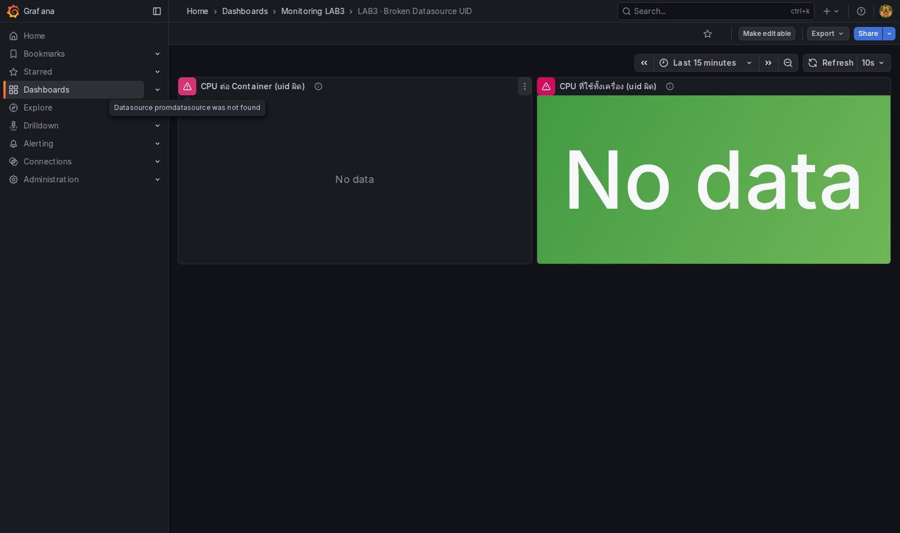

```text
Datasource promdatasource was not found
```

> 📝 **อาการที่ต้องจำ:** panel ไม่ได้ขึ้นว่า “query ผิด” และ Prometheus ก็ไม่ได้ล่ม — Grafana แค่ **หา datasource ตาม uid ไม่เจอ** เลยไม่รู้จะไปถามใคร · อาการนี้เจอบ่อยมากเวลาก๊อป dashboard JSON จากอินเทอร์เน็ตหรือจากอีก environment มาใช้

### ไล่หาสาเหตุ 3 ขั้น

**ขั้นที่ 1 — dashboard ขออะไร:**

```bash
curl -s -u admin:admin http://localhost:3000/api/dashboards/uid/monlab3-broken | python3 -c "
import sys,json
for p in json.load(sys.stdin)['dashboard']['panels']:
    print('panel', p['id'], p['type'], '->', p['datasource'])
"
```

✅ **Expected output**

```text
panel 1 timeseries -> {'type': 'prometheus', 'uid': 'promdatasource'}
panel 2 stat -> {'type': 'prometheus', 'uid': 'promdatasource'}
```

**ขั้นที่ 2 — ระบบมีอะไรให้จริง:**

```bash
curl -s -u admin:admin http://localhost:3000/api/datasources | python3 -c "
import sys,json
for d in json.load(sys.stdin): print(d['name'].ljust(20), 'uid='+d['uid'])
"
```

✅ **Expected output** — มีแค่ `monprom` ไม่มี `promdatasource`:

```text
Prometheus           uid=monprom
```

**ขั้นที่ 3 — หาไฟล์ต้นเหตุ:**

```bash
grep -n '"uid": "promdatasource"' grafana/dashboards/broken-uid.json
```

✅ **Expected output** — เจอ 4 จุด (2 จุดของ panel + 2 จุดของ target ในแต่ละ panel):

```text
32:        "uid": "promdatasource"
115:            "uid": "promdatasource"
133:        "uid": "promdatasource"
190:            "uid": "promdatasource"
```

> 📝 **คำอธิบาย:** สังเกตว่าหนึ่ง panel มี uid **สองที่** คือระดับ panel และระดับ target (query) — เวลาแก้ด้วยมือมักลืมที่ใดที่หนึ่ง แล้วอาการจะครึ่ง ๆ กลาง ๆ · การ log ของ Grafana **ไม่ช่วยเรื่องนี้** เพราะ provisioning สำเร็จปกติ (ไฟล์ JSON ถูกต้องตาม schema) ความผิดพลาดอยู่ที่ “ค่าใน field” ไม่ใช่ที่รูปแบบไฟล์ — เราจึงต้องไล่ด้วย API ตามสามขั้นนี้

### แก้

```bash
sed -i 's/promdatasource/monprom/g' grafana/dashboards/broken-uid.json
echo "แก้แล้ว รอ provisioner สแกนรอบถัดไป 10 วินาที"
sleep 14
curl -s -u admin:admin http://localhost:3000/api/dashboards/uid/monlab3-broken | python3 -c "
import sys,json
for p in json.load(sys.stdin)['dashboard']['panels']:
    print('panel', p['id'], p['type'], '->', p['datasource'])
"
```

> 📝 **คำอธิบาย:** `sed -i 's/เดิม/ใหม่/g'` แก้ทุกจุดในไฟล์รวดเดียว (`g` = global) · **ไม่ต้อง restart Grafana** เพราะ `updateIntervalSeconds: 10` ในไฟล์ provider สั่งให้สแกนโฟลเดอร์ทุก 10 วินาที เราจึง `sleep 14` เผื่อไว้ · นี่คือความต่างจากไฟล์ `datasources/` ที่อ่านครั้งเดียวตอน start

✅ **Expected output** — uid เปลี่ยนเป็น `monprom` ทั้งสอง panel:

```text
panel 1 timeseries -> {'type': 'prometheus', 'uid': 'monprom'}
panel 2 stat -> {'type': 'prometheus', 'uid': 'monprom'}
```

กด refresh ที่หน้า dashboard — สามเหลี่ยมแดงหายไปและ panel มีข้อมูล

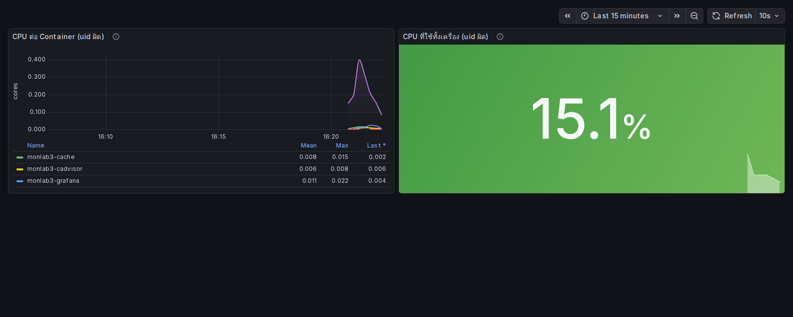

คืนไฟล์ให้กลับเป็นสภาพเดิม (เผื่อคนอื่นมาทำต่อ):

```bash
git checkout -- grafana/dashboards/broken-uid.json
grep -c promdatasource grafana/dashboards/broken-uid.json
```

> 📝 **คำอธิบาย:** ใช้ `git checkout --` แทนการ `sed` กลับ เพราะแก้กลับด้วยมืออาจไม่ตรงต้นฉบับทุกจุด (ในไฟล์นี้คำว่า `promdatasource` ยังปรากฏในข้อความ `description` ด้วย) · นี่ก็เป็นข้อดีของ dashboard as code อีกข้อ — **มี git เป็น undo**

✅ **Expected output** — กลับมาเป็น 5 บรรทัด (4 บรรทัด uid + 1 บรรทัดคำอธิบาย):

```text
5
```

> **บทเรียนจาก break & fix:** `uid` คือสัญญาระหว่างสองไฟล์ — `provisioning/datasources/*.yml` เป็นคนประกาศ ส่วน `dashboards/*.json` เป็นคนอ้างถึง ถ้าปล่อยให้ Grafana สุ่ม uid ให้ dashboard ที่ commit ไว้จะพังทันทีที่ไปสร้างที่เครื่องใหม่

---

## 10. พิสูจน์ว่าเป็น “as-code” จริง

ตอนนี้จะทดลองสิ่งที่คนทำงานกลัวที่สุด: **ลบทุกอย่างทิ้งรวมทั้ง volume**

ก่อนลบ ให้สร้าง datasource ด้วยมือ 1 ตัวไว้เป็น “ตัวเปรียบเทียบ” — วิธีกดใน UI คือ **Connections → Data sources → Add new data source → Prometheus** แล้วกรอก URL `http://prometheus:9090` และตั้งชื่อ `Prometheus-by-hand` (ทำผ่าน API ก็ได้ผลเหมือนกันและเห็นค่า uid ชัดกว่า):

```bash
curl -s -u admin:admin -H "Content-Type: application/json" -X POST \
  http://localhost:3000/api/datasources \
  -d '{"name":"Prometheus-by-hand","type":"prometheus","access":"proxy","url":"http://prometheus:9090"}' \
  | python3 -c "
import sys,json
d=json.load(sys.stdin)
print('สร้างสำเร็จ:', d['datasource']['name'], '| uid ที่ Grafana สุ่มให้:', d['datasource']['uid'])
"

curl -s -u admin:admin http://localhost:3000/api/datasources | python3 -c "
import sys,json
for d in json.load(sys.stdin): print(d['name'].ljust(20), 'uid='+d['uid'].ljust(18), 'readOnly='+str(d['readOnly']))
"
```

> 📝 **คำอธิบาย:** ดู uid ที่ Grafana สุ่มให้ให้ดี ๆ — มันคือสตริงสุ่มที่ **เครื่องอื่นจะได้ไม่เหมือนกัน** นี่คือเหตุผลที่ dashboard ซึ่งอ้าง uid แบบสุ่มจะย้ายเครื่องไม่ได้ · `readOnly` แยกสองตัวนี้ออกจากกันชัดเจน: `True` = มาจากไฟล์, `False` = คนกดสร้าง

✅ **Expected output** — uid ที่สุ่มมาจะไม่เหมือนของคุณ (ของรอบทดสอบคือ `ffv9taxyroqo0c`):

```text
สร้างสำเร็จ: Prometheus-by-hand | uid ที่ Grafana สุ่มให้: ffv9taxyroqo0c
Prometheus           uid=monprom            readOnly=True
Prometheus-by-hand   uid=ffv9taxyroqo0c     readOnly=False
```

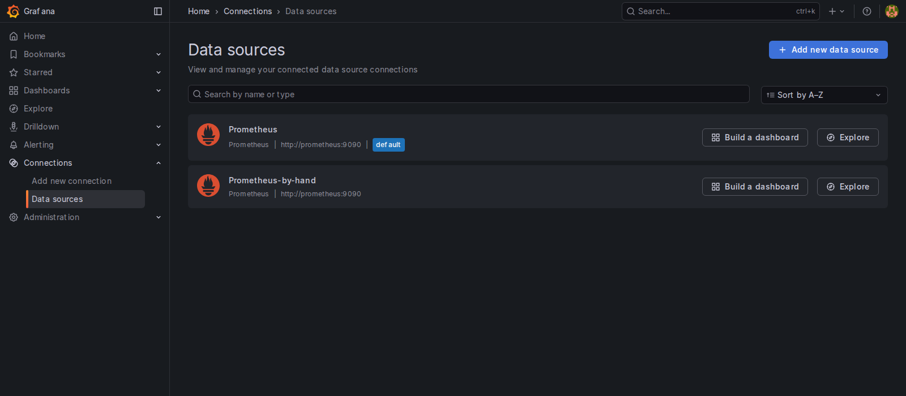

ทีนี้ทำลายทุกอย่างแล้วสร้างใหม่:

```bash
docker compose down -v
docker compose up -d
graf_ok=0
for i in $(seq 1 90); do curl -sf http://localhost:3000/api/health >/dev/null && { graf_ok=1; break; }; sleep 2; done
[ "$graf_ok" = 1 ] && echo "READY: grafana พร้อม" || echo "TIMEOUT: grafana ไม่พร้อม — ดู 'docker compose logs grafana'"
```

> 📝 **คำอธิบาย:** `-v` คือหัวใจของการทดลองนี้ — มันลบ **named volume** `monlab3_grafana-data` (ฐานข้อมูลภายในของ Grafana) และ `monlab3_prom-data` (ข้อมูล metric ย้อนหลัง) ทิ้งด้วย ไม่ใช่แค่ลบ container · ถ้าใช้ `down` เฉย ๆ volume จะยังอยู่และการทดลองนี้จะไม่พิสูจน์อะไรเลย

✅ **Expected output** — ต้องเห็นบรรทัด `Volume ... Removed` ทั้งสองก้อน:

```text
 Container monlab3-cache Removed 
 Volume monlab3_prom-data Removing 
 Volume monlab3_grafana-data Removing 
 Network monnet Removing 
 Volume monlab3_grafana-data Removed 
 Volume monlab3_prom-data Removed 
 Network monnet Removed 
```

ตรวจผลลัพธ์:

```bash
curl -s -u admin:admin http://localhost:3000/api/datasources | python3 -c "
import sys,json
for d in json.load(sys.stdin): print(d['name'].ljust(20), 'uid='+d['uid'].ljust(18), 'readOnly='+str(d['readOnly']))
"
curl -s -u admin:admin "http://localhost:3000/api/search?type=dash-db" | python3 -c "
import sys,json
for d in json.load(sys.stdin): print(d['uid'].ljust(16), '|', d['title'])
"
```

✅ **Expected output** — **`Prometheus-by-hand` หายไปแล้ว** ส่วนของที่เป็นไฟล์กลับมาครบทั้ง datasource และ dashboard 2 ใบ:

```text
Prometheus           uid=monprom            readOnly=True
monlab3-broken   | LAB3 · Broken Datasource UID
monlab3-host     | LAB3 · Docker Host Overview
```

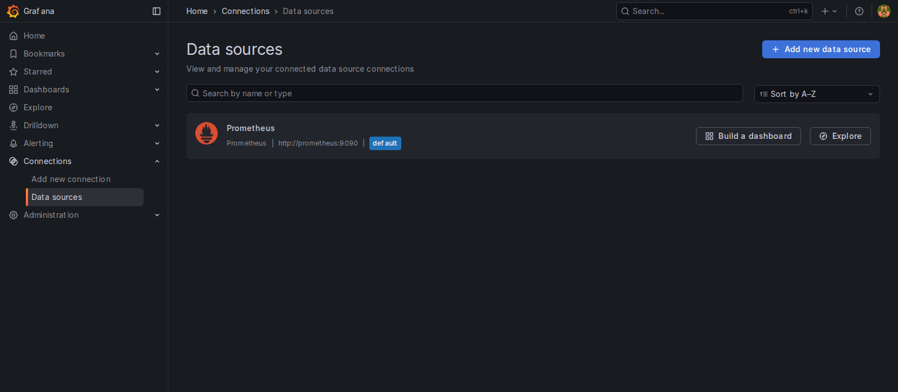

เปิด `http://localhost:3000/d/monlab3-host` อีกครั้ง — dashboard 13 panel ยังอยู่เหมือนเดิมทุกอย่าง (กราฟจะเริ่มนับหนึ่งใหม่เพราะข้อมูลย้อนหลังของ Prometheus ถูกลบไปพร้อม volume แต่ **โครงสร้าง panel ไม่หายแม้แต่ใบเดียว**)

> **นี่คือคำตอบของคำถามก่อนเริ่ม:** dashboard ที่เกิดจากการ “กดสร้าง” อยู่ในฐานข้อมูลของ Grafana → หายพร้อม volume · dashboard ที่เกิดจาก “ไฟล์” อยู่ใน git → สร้างใหม่กี่ครั้งก็เหมือนเดิม และเพื่อนร่วมทีมได้ของชุดเดียวกันเป๊ะ

---

## เกณฑ์ผ่านแล็บ (Acceptance)

ตรวจได้ด้วยคำสั่งเหล่านี้ทั้งหมด — ต้องผ่านครบ 6 ข้อ:

```bash
# 1) target ครบ 3 job และ up ทั้งหมด
curl -s "http://localhost:9090/api/v1/targets?state=active" | python3 -c "
import sys,json
t=json.load(sys.stdin)['data']['activeTargets']
print('targets:', len(t), '| up:', sum(1 for x in t if x['health']=='up'))
"

# 2) datasource มาจากไฟล์และ uid ตรงตามที่ตกลง
curl -s -u admin:admin http://localhost:3000/api/datasources | python3 -c "
import sys,json
d=json.load(sys.stdin)
print('datasources:', [(x['name'],x['uid'],x['readOnly']) for x in d])
"

# 3) dashboard ถูก provision มาจากไฟล์ และมี 13 panel
curl -s -u admin:admin http://localhost:3000/api/dashboards/uid/monlab3-host | python3 -c "
import sys,json
r=json.load(sys.stdin)
print('panels:', len(r['dashboard']['panels']), '| provisioned:', r['meta']['provisioned'], '| file:', r['meta']['provisionedExternalId'])
"

# 4) ทุก panel อ้าง uid monprom ไม่มีตัวไหนหลุด
curl -s -u admin:admin http://localhost:3000/api/dashboards/uid/monlab3-host | python3 -c "
import sys,json
d=json.load(sys.stdin)['dashboard']
print('datasource ที่ถูกอ้าง:', {json.dumps(p['datasource'],sort_keys=True) for p in d['panels']})
"

# 5) Grafana ปฏิเสธการ save ทับ dashboard ที่มาจากไฟล์
curl -s -u admin:admin -H "Content-Type: application/json" -X POST \
  http://localhost:3000/api/dashboards/db \
  -d '{"dashboard":{"uid":"monlab3-host","title":"x","panels":[],"version":0},"overwrite":true}'; echo

# 6) variable มีรายชื่อ container จริง
curl -sg "http://localhost:9090/api/v1/label/name/values?match[]=container_memory_working_set_bytes{name!=\"\"}" \
  | python3 -c "import sys,json;print('containers:', json.load(sys.stdin)['data'])"
```

✅ **Expected output**

```text
targets: 3 | up: 3
datasources: [('Prometheus', 'monprom', True)]
panels: 13 | provisioned: True | file: docker-host.json
datasource ที่ถูกอ้าง: {'{"type": "prometheus", "uid": "monprom"}'}
{"message":"Cannot save provisioned dashboard"}
containers: ['monlab3-cache', 'monlab3-cadvisor', 'monlab3-grafana', 'monlab3-node-exporter', 'monlab3-prometheus', 'monlab3-worker']
```

พร้อมกับข้อที่ต้อง “ดูด้วยตา”:

- [ ] เปิด `http://localhost:3000/d/monlab3-host` แล้ว **ทุก panel มีข้อมูล** ไม่มีใบไหนขึ้น `No data`
- [ ] Stat “CPU ที่ใช้ทั้งเครื่อง” เปลี่ยนสีตาม threshold ได้ (ลองย่อช่วงเวลาเป็น `Last 5 minutes` แล้วดูตอน `monlab3-worker` ขึ้นสุดคลื่น)
- [ ] เลือก `monlab3-worker` ตัวเดียวใน dropdown แล้ว panel แถวที่ 4 เหลือเส้นเดียวและชื่อ panel เปลี่ยนตาม
- [ ] เปิด `LAB3 · Broken Datasource UID` แล้วชี้สามเหลี่ยมแดง เห็นข้อความ `Datasource promdatasource was not found`

---

## เก็บกวาด (Cleanup)

```bash
docker compose down -v
docker compose ps -a
docker volume ls
```

> 📝 **คำอธิบาย:** `down -v` ลบ container + network + volume ของแล็บนี้ให้หมด · `ps -a` รวม container ที่หยุดแล้ว จึงใช้ยืนยันว่าไม่มีของค้าง · การเก็บกวาดสำคัญเพราะ LAB ถัดไปใช้ port `9090`, `9100`, `8080`, `3000` ชุดเดียวกัน · อย่าลืมปิด port forwarding `3000` ใน VS Code หรือออกจาก session `ssh -L` ด้วย

✅ **Expected output** — เหลือแต่หัวตารางทั้งสองอัน:

```text
 Volume monlab3_grafana-data Removed 
 Volume monlab3_prom-data Removed 
 Network monnet Removed 
NAME      IMAGE     COMMAND   SERVICE   CREATED   STATUS    PORTS
DRIVER    VOLUME NAME
```

---

## แก้ปัญหาที่พบบ่อย

| อาการ | สาเหตุ | วิธีแก้ |
|---|---|---|
| panel ขึ้น `Datasource <ชื่อ> was not found` | uid ใน dashboard JSON ไม่ตรงกับ uid ของ datasource ที่ provision ไว้ | ไล่สามขั้นในข้อ 9: ดู uid ที่ dashboard ขอ → ดู uid ที่มีจริง → `grep` หาในไฟล์ แล้วแก้ให้ตรง (อย่าลืมว่า uid มีทั้งระดับ panel และระดับ target) |
| dashboard ไม่โผล่ใน Grafana เลย ทั้งที่ไฟล์ JSON อยู่ครบ | ไฟล์ JSON ไม่ได้อยู่ที่ path เดียวกับ `options.path` ในไฟล์ provider | ตรวจว่า compose mount `./grafana/dashboards` ไปที่ `/var/lib/grafana/dashboards` และ `options.path` เขียน path **ข้างในคอนเทนเนอร์** ตัวเดียวกัน แล้วยืนยันด้วย `/api/search` ไม่ใช่ดูแค่ log ว่าไม่มี error |
| แก้ไฟล์ datasource แล้วไม่มีอะไรเปลี่ยน | ไฟล์ใน `provisioning/datasources/` ถูกอ่าน **ตอน start เท่านั้น** | `docker compose restart grafana` (ต่างจาก dashboard JSON ที่สแกนซ้ำทุก 10 วินาที) |
| กด Save dashboard ไม่ได้ ขึ้น `Cannot save provisioned dashboard` | เป็นพฤติกรรมที่ตั้งใจ (`allowUiUpdates: false`) | แก้ที่ไฟล์ JSON แล้ว commit — ถ้าอยากลองเล่นก่อน ให้ Export ไปสร้าง dashboard ใหม่ของตัวเอง (ไม่ผูกกับ provisioning) |
| ทุก panel ที่กรองด้วย `{name="..."}` ว่างเปล่า | cAdvisor ลงทะเบียน docker factory ไม่ได้ metric เลยไม่มี label `name=` | ตรวจว่า compose มี `--containerd=/var/run/docker/containerd/containerd.sock` (ค่า default ของ cAdvisor ชี้ไป `/run/containerd/...` ซึ่งไม่มีจริงบน Docker 29) |
| `container_memory_working_set_bytes` และ `docker stats` ได้ `0` ทุกตัว | cgroup v2 ชั้นในไม่ได้เปิด controller `memory` (เจอในกล่องเรียนที่ซ้อน Docker หลายชั้น) | ตรวจด้วย `cat /sys/fs/cgroup/cgroup.subtree_control` ถ้าไม่มีคำว่า `memory` ให้ใช้ metric ระดับเครื่องจาก node-exporter แทน (ดูกล่องเตือนข้อ 6) |
| `node-exporter` สร้างไม่ขึ้น `path / is mounted on / but it is not a shared or slave mount` | ใช้รูปแบบ mount `- /:/host:ro,rslave` ที่ใช้ไม่ได้ใน Docker-in-Docker | ใช้ mount 3 บรรทัดแบบในไฟล์ `docker-compose.yml` ของแล็บนี้ (`/proc`, `/sys`, `/` แยกกัน) |
| สร้าง container ไม่ได้ `cannot enter cgroupv2 ... threaded mode` | ใส่ `cpus:` หรือ `mem_limit:` ในกล่องเรียนที่ซ้อนหลายชั้น | ใช้ `cpuset: "0"` แทนเพื่อจำกัดเป็นจำนวน core |
| log ของ Grafana มี `Failed to read plugin provisioning files` และ `can't read alerting provisioning files` | เรา mount ทับ `/etc/grafana/provisioning` ด้วยโฟลเดอร์ที่มีแค่ `datasources/` กับ `dashboards/` | **ไม่ต้องแก้ ไม่กระทบอะไร** — เป็นแค่ provisioner สองตัวที่เราไม่ได้ใช้บ่นว่าไม่มีโฟลเดอร์ของมัน ให้ดูบรรทัด `inserting datasource from configuration ... uid=monprom` และ `finished to provision dashboards` แทน |
| เปิด `localhost:3000` บนเครื่องตัวเองไม่ได้ | ยังไม่ได้ forward port จากเครื่องเรียน | forward port `3000` ใน VS Code หรือใช้ `ssh -L 3000:localhost:3000 root@localhost -p 2222` |
| `up -d` แล้วชนกับ port ที่ใช้อยู่ | แล็บอื่นของชุด Monitoring ยังรันค้าง | `cd` ไปโฟลเดอร์แล็บนั้นแล้ว `docker compose down` ก่อน |

---

## สรุปคำสั่งของแล็บนี้

| คำสั่ง | ความหมาย |
|---|---|
| `docker compose up -d` | เปิด Prometheus + exporters + Grafana + workload |
| `curl -s http://localhost:3000/api/health` | เช็กว่า Grafana พร้อมและดูเวอร์ชัน |
| `curl -s -u admin:admin .../api/datasources` | ดูว่ามี datasource อะไร uid อะไร มาจากไฟล์หรือกดสร้าง (`readOnly`) |
| `curl -s -u admin:admin ".../api/search?type=dash-db"` | ดูว่า Grafana เห็น dashboard อะไรบ้าง (ใช้แทนการเดาจาก log) |
| `curl -s -u admin:admin .../api/dashboards/uid/monlab3-host` | ดึง dashboard ทั้งใบ + `meta.provisioned` ว่ามาจากไฟล์ไหน |
| `curl ... /api/datasources/proxy/uid/monprom/api/v1/query` | ยิง PromQL ผ่านเส้นทางเดียวกับที่ panel ใช้ |
| `sed -i 's/promdatasource/monprom/g' ...json` | แก้ uid ในไฟล์ dashboard แล้วรอ 10 วินาทีให้ provisioner สแกน |
| `git checkout -- <ไฟล์>` | คืน dashboard กลับสภาพเดิม (git = ปุ่ม undo ของ dashboard as code) |
| `docker compose down -v` | ลบทุกอย่างรวมทั้ง volume — ใช้พิสูจน์ว่าอะไรเป็นโค้ดจริง |

## ✅ เช็กลิสต์ก่อนจบแล็บ

- [ ] อธิบายได้ว่า provisioning ต่างจากการกดสร้างใน UI อย่างไร และอะไรหายเมื่อ `down -v`
- [ ] ชี้ได้ว่าไฟล์ไหนถูกอ่านตอน start (datasources) และไฟล์ไหนถูกสแกนซ้ำทุก 10 วินาที (dashboards)
- [ ] อธิบายได้ว่าทำไม `url` ของ datasource ต้องเป็น `http://prometheus:9090` ไม่ใช่ `localhost:9090`
- [ ] บอกได้ว่า `uid: monprom` สำคัญอย่างไร และอาการเมื่อ uid ไม่ตรงหน้าตาเป็นแบบไหน
- [ ] อ่าน panel เป็น: query → unit → threshold → legend และรู้ว่า `rate()` ของ CPU counter อ่านเป็น “core”
- [ ] เปลี่ยนค่าใน dropdown `$container` แล้วเห็น panel เปลี่ยนตาม และอธิบายได้ว่า multi-select กลายเป็น regex
- [ ] ทำ break & fix ของ `broken-uid.json` ครบวงจร (เห็น error → ไล่ด้วย API → แก้ไฟล์ → หายเองใน 10 วินาที)
- [ ] `docker compose down -v && docker compose up -d` แล้ว dashboard 13 panel กลับมาครบ ส่วน datasource ที่ทำมือหายไป
- [ ] อธิบายได้ว่าทำไมเปิด anonymous access ในห้องเรียนได้ แต่ห้ามทำใน production
- [ ] `docker compose down -v` ปิดท้าย และ `docker compose ps -a` เหลือเพียงหัวตาราง

> **จำภาพเดียวให้ได้:** ไฟล์ใน git → Grafana อ่านตอน start → datasource `monprom` → panel ทุกใบอ้าง uid เดียวกันนี้ → ลบ container กี่รอบก็ได้ของเดิมกลับมาเสมอ

*Expected output และ screenshot ในเอกสารนี้มาจากการรันจริงในเครื่องเรียน `tuchsanai/devtools:2569_1` (Docker 29.6.2 · Compose v5.3.1 · Grafana 12.3.1 · Prometheus v3.7.3) เมื่อ 15 ส.ค. 2026*
