# LAB 4 — ติดมิเตอร์ให้แอปของเราเอง: Counter / Gauge / Histogram แล้วอ่านด้วยวิธี RED

> โฟลเดอร์ `004_LAB_App_Instrumentation_RED` = **LAB 4** ของชุด Monitoring
> (ไฟล์ของแล็บนี้: `docker-compose.yml` · `docker-compose.rawpath.yml` · `prometheus.yml` ·
> `app/Dockerfile` · `app/app.py` · `app/requirements.txt` ·
> `loadgen/Dockerfile` · `loadgen/gen.py` ·
> `grafana/provisioning/datasources/prometheus.yml` · `grafana/provisioning/dashboards/dashboards.yml` ·
> `grafana/dashboards/red-dashboard.json`)

สาม LAB ที่ผ่านมาเราดึงตัวเลขจาก exporter ที่คนอื่นเขียนไว้ให้ (node-exporter, cAdvisor)
แล็บนี้เปลี่ยนบทบาท — **เราเป็นคนเขียนตัวเลขเอง** แล้วเรียนวิธีอ่านมันให้ตอบคำถามที่ผู้ใช้แคร์จริง ๆ ว่า
"ระบบรับงานได้เท่าไร · พังกี่เปอร์เซ็นต์ · ช้าแค่ไหน"

## สิ่งที่จะได้เรียนรู้

- แยกออกว่าเมื่อไรควรใช้ **Counter** เมื่อไรควรใช้ **Gauge** และเมื่อไรต้องใช้ **Histogram**
- เห็นด้วยตาว่า "จุดวัด" ในโค้ดอยู่ตรงไหนของ request lifecycle (`.inc()` / `.observe()` / gauge ขึ้นลง)
- อ่านหน้า `/metrics` ของแอปตัวเองได้ และแยกออกว่าอันไหนเราเขียน อันไหน client library แถมมาให้
- คำนวณ **RED** (Rate / Errors / Duration) ด้วย PromQL ทีละบรรทัด พร้อมอธิบายว่าทำไมต้อง `rate()`
- ผ่าไส้ histogram: `_bucket` / `_sum` / `_count`, ความหมายของ `le` และเหตุที่ bucket เป็นแบบ **สะสม**
- คำนวณ p95 ด้วยมือจากตาราง bucket แล้วเทียบกับ `histogram_quantile` ว่าตรงกันจริง
- พิสูจน์ว่า **ค่าเฉลี่ยหลอกตา**: avg 0.16 วินาที แต่ p95 = 1.5 วินาที (ต่างกันเกือบ 10 เท่า)
- ใช้ Gauge `app_inflight_requests` ดูงานที่ค้างอยู่ในมือ และเข้าใจว่าต่างจาก counter อย่างไร
- ทำ **cardinality ระเบิด** ด้วยการใช้ path ดิบเป็น label แล้วดูหลักฐานเป็นตัวเลข ก่อนแก้กลับ

## ภาพรวมของแล็บนี้

1. **อ่านโค้ดก่อนรัน** — ดูว่ามิเตอร์ 4 ตัวถูกประกาศไว้ตรงไหน และถูกเรียกตอนไหน
2. **รันแอปตัวเดียวก่อน** — เปิด `/metrics` ตอนยังไม่มีใครเรียก เพื่อเห็นว่า "ยังไม่มี series"
3. **ยิงมือทีละ endpoint** — เห็น series งอกออกมาทีละเส้นตามที่เราเรียก
4. **เปิด stack เต็ม** — เพิ่ม Prometheus + Grafana + loadgen ที่ยิง 10 req/s แบบไม่สุ่ม
5. **R — Rate** — `rate()` บน counter และแยกตาม endpoint
6. **E — Errors** — สัดส่วน 5xx เทียบทั้งหมด (ไม่ใช่จำนวนดิบ)
7. **D — Duration** — `histogram_quantile` หา p50/p95/p99
8. **ผ่า histogram** — คำนวณ p95 ด้วยมือจากตาราง bucket และเทียบ `_sum/_count` กับ p95
9. **Gauge inflight** — ดูงานที่กำลังค้าง และ `max_over_time`
10. **Grafana RED dashboard** — provision มาให้แล้ว เปิดแล้วมีข้อมูลทันที
11. **ทำให้พังแล้วแก้** — เปิด `RAW_PATH_LABEL=1` ให้ cardinality ระเบิด แล้วปิดกลับ
12. **เก็บกวาดและรันซ้ำจากศูนย์**

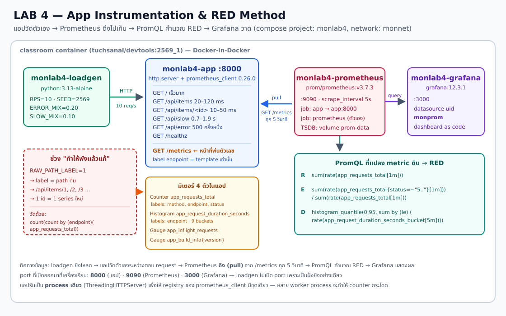

> **คำถามก่อนเริ่ม:** ถ้าแอปตอบ request 10 ครั้งต่อวินาที โดย 9 ครั้งเสร็จใน 30 มิลลิวินาที และอีก 1 ครั้งใช้เวลา 1.3 วินาที
> — **ค่าเฉลี่ย** จะบอกเราว่าประมาณ 0.16 วินาที ฟังดูดีมาก แต่ผู้ใช้ 10% รอนานกว่า 1 วินาทีทุกวัน
> คำถามคือ: ถ้าเราเก็บแค่ "ค่าเฉลี่ย" เราจะรู้เรื่องนี้ไหม? และถ้าอยากรู้ ต้องเก็บอะไรแทน? แล็บนี้ตอบด้วยตัวเลขจริง

แล็บนี้ใช้ terminal เดียว ทุกคำสั่งตั้งแต่ข้อ 1 เป็นต้นไปให้รัน **ข้างในเครื่องเรียน** ผ่าน VS Code Remote-SSH

---

## 0. เตรียมเครื่องเรียน

ทำบนเครื่องของเราเอง — เปิด classroom container ที่มี Docker พร้อมใช้ แล้ว SSH เข้าไป:

```bash
docker start devtools 2>/dev/null || \
  docker run -dit --name devtools --privileged -p 2222:22 tuchsanai/devtools:2569_1
ssh root@localhost -p 2222        # password : passwd
```

> 📝 **คำอธิบาย:** `docker start ... || docker run ...` ใช้เครื่องเรียนเดิมถ้ามี และสร้างใหม่เฉพาะเมื่อยังไม่มี · `-dit` รันเบื้องหลังพร้อม terminal · `--name devtools` ตั้งชื่อคงที่ · `--privileged` จำเป็นสำหรับรัน Docker ซ้อนข้างใน classroom container · `-p 2222:22` ส่ง port SSH จากเครื่องเราเข้า port 22 ของกล่อง · หลัง SSH แล้ว prompt จะเป็นฝั่งเครื่องเรียน ซึ่งเป็นที่รันคำสั่ง Docker ทั้งหมดของ LAB
>
> ⚠️ `--privileged` ให้สิทธิ์สูงมาก ใช้เฉพาะ disposable classroom container นี้ ห้ามนำรูปแบบนี้ไปใช้กับ production workload

ใน VS Code แนะนำให้ใช้ **Remote-SSH** ต่อ `root@localhost:2222` แล้วเปิดโฟลเดอร์ `~/labwork/DevTools` เพื่อแก้ไฟล์และเปิด terminal ในเครื่องเรียนโดยตรง

ตรวจว่า Docker CLI คุยกับ daemon ชั้นในได้:

```bash
docker --version
docker info --format 'Docker daemon: {{.ServerVersion}}'
```

> 📝 **คำอธิบาย:** บรรทัดแรกดูเวอร์ชัน CLI ส่วน `docker info` ถาม daemon จริง จึงแยกได้ระหว่าง "ติดตั้งคำสั่ง Docker แล้ว" กับ "daemon พร้อมรับคำสั่งแล้ว" · ถ้าพบ `Cannot connect to the Docker daemon` ให้รอสักครู่แล้วลองใหม่

✅ **Expected output** — ต้องมีเลขเวอร์ชันครบสองบรรทัด (เลขเวอร์ชันและ build อาจเปลี่ยนตาม image ห้องเรียน):

```text
Docker version 29.6.2, build dfc4efb
Docker daemon: 29.6.2
```

> ⚠️ **แล็บชุด Monitoring ใช้ port ชุดเดียวกันทุกแล็บ** (9090 / 3000 / 8000) ถ้าเพิ่งทำ LAB 1-3 มา
> ให้ `docker compose down` ในโฟลเดอร์แล็บก่อนหน้าให้เรียบร้อยก่อน ไม่งั้นจะเจอ `port is already allocated`

---

## 1. Clone โค้ดแล็บ แล้วเตรียม image

```bash
mkdir -p ~/labwork && cd ~/labwork
git clone https://github.com/Tuchsanai/DevTools.git
cd DevTools/03_Application_Docker/03_Monitoring/004_LAB_App_Instrumentation_RED
```

> 📝 **คำอธิบาย:** `mkdir -p` สร้างพื้นที่ทำงานโดยไม่ error ถ้ามีอยู่แล้ว · `git clone` ดึงไฟล์ของหลักสูตร · `cd` เข้า LAB นี้ให้ถูกโฟลเดอร์ก่อนใช้ Compose · ถ้าเคย clone ไว้แล้ว ให้ข้าม `git clone` แล้ว `cd` เข้า path เดิมได้เลย

แล็บนี้มี **2 service ที่ต้อง build เอง** (`app`, `loadgen`) และ **2 service ที่ pull มา** (`prometheus`, `grafana`)
จึงต้องแยกสองคำสั่ง:

```bash
docker compose pull --quiet prometheus grafana
docker compose build
```

> 📝 **คำอธิบาย:** ต้องระบุชื่อ service ให้ `pull` เพราะถ้าสั่ง `docker compose pull` เฉย ๆ Compose จะพยายามไป pull `monlab4/app:1.0.0` จาก Docker Hub ซึ่งไม่มีอยู่จริง แล้วจบด้วย `pull access denied` · `docker compose build` สร้าง image สองตัวจาก `./app` และ `./loadgen` · เรา pin tag ทุกตัว (`prom/prometheus:v3.7.3`, `grafana/grafana:12.3.1`, `python:3.13-alpine`, `prometheus_client==0.26.0`) เพื่อให้ทั้งห้องได้ผลเหมือนกัน — **ห้ามใช้ `latest`** เพราะวันนี้กับพรุ่งนี้อาจได้คนละเวอร์ชัน

✅ **Expected output** — บรรทัดสำคัญคือ `Successfully installed prometheus_client-0.26.0` และ `Built` ทั้งสองตัว (เลข `#N`, hash และเวลาแต่ละขั้นจะต่างกันทุกครั้ง):

```text
 Image grafana/grafana:12.3.1 Pulling
 Image prom/prometheus:v3.7.3 Pulling
 Image grafana/grafana:12.3.1 Pulled
 Image prom/prometheus:v3.7.3 Pulled
...
#15 [app 4/5] RUN pip install --no-cache-dir -r requirements.txt
#15 1.603 Collecting prometheus_client==0.26.0 (from -r requirements.txt (line 1))
#15 1.745   Downloading prometheus_client-0.26.0-py3-none-any.whl.metadata (2.1 kB)
#15 1.780 Downloading prometheus_client-0.26.0-py3-none-any.whl (64 kB)
#15 1.870 Installing collected packages: prometheus_client
#15 1.915 Successfully installed prometheus_client-0.26.0
#15 DONE 2.0s
...
 Image monlab4/app:1.0.0 Built
 Image monlab4/loadgen:1.0.0 Built
```

---

## 2. อ่านโค้ดก่อน — มิเตอร์ถูกวางไว้ตรงไหนของ request

เปิด `app/app.py` แล้วดู 3 ส่วนนี้

### 2.1 ประกาศมิเตอร์ (ทำครั้งเดียวตอน import)

```python
REQUESTS = Counter(
    "app_requests_total", "จำนวน HTTP request ทั้งหมดที่แอปนี้ตอบไปแล้ว",
    ["method", "endpoint", "status"],
)
DURATION = Histogram(
    "app_request_duration_seconds", "เวลาที่ใช้ตอบ 1 request (วินาที)", ["endpoint"],
    buckets=(0.01, 0.025, 0.05, 0.1, 0.25, 0.5, 1.0, 2.5, 5.0),
)
INFLIGHT = Gauge("app_inflight_requests", "จำนวน request ที่กำลังประมวลผลอยู่ ณ ขณะนี้")
BUILD_INFO = Gauge("app_build_info", "...", ["version"])
BUILD_INFO.labels(version=APP_VERSION).set(1)
```

> 📝 **คำอธิบาย:** **Counter** ขึ้นอย่างเดียว ใช้ตอบ "เกิดไปแล้วกี่ครั้ง" — ห้ามใช้กับค่าที่ลดได้ · **Gauge** ขึ้นลงได้ ใช้ตอบ "ตอนนี้เท่าไร" · **Histogram** เก็บทั้ง count และการแจกแจงลงถัง จึงคำนวณ percentile ย้อนหลังได้ ซึ่ง Counter/Gauge ทำไม่ได้
>
> **`buckets` ต้องเลือกเอง** ให้ครอบเวลาจริงของแอป ชุดนี้ `0.01 → 5` วินาที ครอบทั้งงานเร็ว (20 ms) และงานหนัก (1.9 s) · ถ้าเลือกผิด เช่นถังใหญ่สุดคือ 0.5 วินาที ทั้งที่แอปใช้ 2 วินาที เราจะไม่มีทางรู้เลยว่าช้าแค่ไหน รู้แค่ว่า "เกิน 0.5"
>
> **`app_build_info` เป็น Gauge ค่า 1 เสมอ** — เป็นสูตรมาตรฐานของ Prometheus สำหรับเก็บข้อมูลที่ไม่ใช่ตัวเลข: ความหมายอยู่ที่ *label* ไม่ใช่ที่ค่า ทำให้ join กับ metric อื่นได้ว่า "ตอนนั้นรันเวอร์ชันอะไรอยู่"
>
> ⚠️ **`labels` ที่ประกาศไว้ 3 ตัว = มิติของปัญหา** จำนวน series ที่จะเกิดคือ (จำนวนค่า method) × (จำนวนค่า endpoint) × (จำนวนค่า status) — ตัวที่อันตรายที่สุดคือ `endpoint` และนั่นคือหัวข้อของข้อ 12

### 2.2 จุดวัดจริงใน request lifecycle

```python
    def do_GET(self):
        path = urlsplit(self.path).path
        if path == "/metrics":
            self._send(200, generate_latest(REGISTRY), CONTENT_TYPE_LATEST)
            return                       # ← /metrics ไม่วัดตัวเอง

        endpoint = endpoint_label(path)  # ← แปลง path ดิบเป็น "ชื่อ route"

        INFLIGHT.inc()                   # ← จุดวัดที่ 1: ก่อนเริ่มงาน
        started = time.perf_counter()
        status = 500                     # กันเหนียว เผื่อหลุดถึง finally โดยยังไม่ได้ค่า
        try:
            try:
                status, body = route(path)
            except Exception:            # ← งานพังกลางทาง
                traceback.print_exc()
                status, body = 500, b'{"error":"internal error"}\n'
            self._send(status, body)     # ← ตอบ 500 กลับไปให้ client จริง ๆ
        finally:                         # ← จุดวัดที่ 2: หลังงานจบ (แม้ exception)
            elapsed = time.perf_counter() - started
            DURATION.labels(endpoint=endpoint).observe(elapsed)
            REQUESTS.labels(method="GET", endpoint=endpoint, status=str(status)).inc()
            INFLIGHT.dec()
```

> 📝 **คำอธิบาย:** ทั้ง 3 มิเตอร์ถูกแตะที่จุดต่างกันโดยเจตนา · `INFLIGHT.inc()` ต้องอยู่ **ก่อน** งานเริ่ม และ `.dec()` ต้องอยู่ใน `finally` ไม่งั้นถ้าเกิด exception gauge จะค้างสูงตลอดกาลและอ่านไม่ได้อีกเลย · `DURATION.observe()` และ `REQUESTS.inc()` อยู่ใน `finally` เหมือนกัน เพื่อให้ request ที่พังก็ยังถูกนับ (ไม่งั้น error ratio จะต่ำกว่าความจริงเสมอ)
>
> ⚠️ **จุดที่คนทำ instrumentation พลาดบ่อยที่สุด: นับเป็น 500 แต่ไม่ได้ตอบ 500** — ถ้าเราแค่ตั้ง `status = 500` ไว้แล้วปล่อยให้ exception หลุดขึ้นไปให้ `http.server` จัดการเอง client จะได้แค่ **connection ที่ถูกปิดเปล่า ๆ ไม่มี HTTP response** ทั้งที่กราฟของเราขึ้นว่า "500" · ตัวเลขที่ไม่ตรงกับสิ่งที่ผู้ใช้เจอจริงอันตรายกว่าไม่มีตัวเลขเลย เพราะมันทำให้เราไล่ผิดทาง · เราจึง **ดัก `except` แล้วส่ง 500 ออกไปเอง** ก่อนถึงจุดวัด — `metric` กับ `response` จึงพูดตรงกันเสมอ
>
> `/metrics` ถูก `return` ออกก่อนถึงจุดวัด เพราะ Prometheus ยิงมันทุก 5 วินาที ถ้านับด้วยจะกลายเป็นว่า "traffic" ของแอปมีแต่ตัว Prometheus เอง ทำให้ตัวเลข RED เพี้ยน
>
> 📌 **สัญญาของ metric ชุดนี้ (เขียนไว้ให้ชัด เพราะ LAB 5 และ LAB 6 ใช้ชื่อ metric ชุดเดียวกัน):**
> 1. นับ **ทุก request ที่เข้ามา ยกเว้น `/metrics`** — `/healthz` และ path ที่ไม่รู้จัก (`/other`) ก็นับด้วย
> 2. `app_request_duration_seconds` จับเวลาตั้งแต่ก่อนเริ่มงาน **จนเขียน response เสร็จ** ไม่ใช่แค่ส่วนที่เป็น business logic
> 3. `status` ที่บันทึก = status ที่ **ส่งกลับไปให้ client จริง ๆ**
>
> **ทำไมต้องเขียนสัญญานี้ไว้:** ชื่อ metric ที่เหมือนกันแต่ "ประชากร" กับ "ขอบเขตเวลา" ไม่เหมือนกัน คือกับดักที่ทำให้แดชบอร์ดรวมหลาย service เทียบกันไม่ได้ และไม่มีใครรู้ตัวเพราะกราฟยังขึ้นสวยอยู่
> ℹ️ หลายทีมใน production เลือก **ไม่นับ health check / probe** เข้า RED เพราะมันดัน "R" ให้สูงเกินจริงและเจือจาง error ratio — **ถูกทั้งสองแบบ ขอแค่ทุก service ในระบบใช้กติกาเดียวกันและเขียนบอกไว้**

### 2.3 label `endpoint` ต้องเป็น *template* ไม่ใช่ path ดิบ

```python
def endpoint_label(path: str) -> str:
    if RAW_PATH_LABEL:
        return path                       # โหมดของเสีย (ข้อ 12)
    if path in KNOWN_PATHS:
        return path
    if ITEM_ID_PATH.match(path):
        return "/api/items/:id"           # ยุบ /api/items/1, /2, /3 ... เป็นเส้นเดียว
    return "/other"                       # path ที่ไม่รู้จักยุบเป็นถังเดียว
```

> 📝 **คำอธิบาย:** นี่คือบรรทัดที่สำคัญที่สุดของแล็บ · ค่าของ label ต้องเป็นเซตที่ **นับได้และไม่โต** · `/api/items/1` กับ `/api/items/2` เป็น request คนละใบ แต่เป็น *route เดียวกัน* จึงต้องเป็น label ค่าเดียวกัน · บรรทัด `return "/other"` ก็จำเป็น ไม่งั้นใครยิง `/aaa`, `/bbb`, `/ccc` มั่ว ๆ (bot สแกนเว็บทำแบบนี้ตลอด) ก็สร้าง series ใหม่ได้ไม่จำกัด

### 2.4 แอปนี้ "ไม่สุ่ม" — ตัวเลขที่ได้จึงเหมือนกันทั้งห้อง

```python
LATENCY_TABLE = {
    "/api/items":     (0.020, 0.045, 0.070, 0.095, 0.120),
    "/api/items/:id": (0.010, 0.030, 0.050),
    "/api/error":     (0.010, 0.020, 0.030),
    "/api/slow":      (0.7, 1.1, 1.5, 1.9),
}
```

> 📝 **คำอธิบาย:** แต่ละ endpoint วนใช้ค่าหน่วงในตารางตามลำดับ ไม่ได้สุ่ม · `/api/error` ก็ตัดสินใจแบบนับรอบ: บวก `ERROR_RATE` เข้ากระปุกทุกครั้ง ครบ 1 เมื่อไรก็จ่าย error 1 ใบ → `ERROR_RATE=0.5` แปลว่า **200, 500, 200, 500 สลับกันเป๊ะ** · ผลคือค่า RED ที่ทุกคนวัดได้จะตรงกับที่เอกสารนี้เขียนไว้ ไม่ใช่ "แล้วแต่ดวง"
>
> ค่าเฉลี่ยของ `/api/slow` ตามตารางนี้คือ (0.7+1.1+1.5+1.9)/4 = **1.3 วินาที** — จำเลขนี้ไว้ เดี๋ยวเราจะเอาไปตรวจกับ `_sum/_count` ในข้อ 9

---

## 3. รันแอปตัวเดียวก่อน — เปิด `/metrics` ตอนยังไม่มีใครเรียก

```bash
docker compose up -d app
docker compose logs app
```

> 📝 **คำอธิบาย:** `up -d app` เปิดเฉพาะ service `app` ไม่แตะ Prometheus/Grafana/loadgen — เราอยากเห็นหน้า `/metrics` แบบสะอาด ๆ ก่อนมี traffic · log บอกโหมดของ label ให้ยืนยันว่ากำลังใช้ template อยู่

✅ **Expected output** — Compose สร้าง network `monnet` และ container เดียว จากนั้น log บอกโหมด:

```text
 Network monnet Creating
 Network monnet Created
 Container monlab4-app Creating
 Container monlab4-app Created
 Container monlab4-app Starting
 Container monlab4-app Started
monlab4-app  | monlab4-app v1.0.0 listening on :8000
monlab4-app  |   endpoint label mode = TEMPLATE (/api/items/:id)
monlab4-app  |   ERROR_RATE = 0.5
```

ดูว่ามี metric ชนิดอะไรอยู่บ้างในหน้า `/metrics`:

```bash
curl -s http://localhost:8000/metrics | grep '^# TYPE'
```

> 📝 **คำอธิบาย:** บรรทัด `# TYPE` คือคำประกาศชนิดของ metric ในรูปแบบ exposition format · ที่ขึ้นต้นด้วย `app_` คือของที่**เราเขียนเอง** ส่วน `python_*` และ `process_*` คือของแถมจาก `prometheus_client` ซึ่งได้มาฟรีเพียงเพราะเรา import library เข้ามา

✅ **Expected output** — 4 บรรทัดล่างสุดคือมิเตอร์ของเรา:

```text
# TYPE python_gc_objects_collected_total counter
# TYPE python_gc_objects_uncollectable_total counter
# TYPE python_gc_collections_total counter
# TYPE python_info gauge
# TYPE process_virtual_memory_bytes gauge
# TYPE process_resident_memory_bytes gauge
# TYPE process_start_time_seconds gauge
# TYPE process_cpu_seconds_total counter
# TYPE process_open_fds gauge
# TYPE process_max_fds gauge
# TYPE app_requests_total counter
# TYPE app_request_duration_seconds histogram
# TYPE app_inflight_requests gauge
# TYPE app_build_info gauge
```

ทีนี้ดูเฉพาะส่วนของเรา:

```bash
curl -s http://localhost:8000/metrics | grep -E '^(# (HELP|TYPE) app_|app_)'
```

> 📝 **คำอธิบาย:** `# HELP` คือคำอธิบายที่เราใส่ไว้ใน argument ที่สองตอนประกาศ metric — มันโผล่ออกมาที่นี่จริง ๆ และ Grafana ก็เอาไปแสดงเป็น tooltip ได้ · **สังเกตให้ดี: `app_requests_total` และ `app_request_duration_seconds` มีแค่ `# HELP`/`# TYPE` แต่ไม่มีตัวเลขสักบรรทัด** เพราะ metric ที่มี label จะยังไม่มี series จนกว่าจะมีคนเรียก `.labels(...)` ครั้งแรก · ตรงข้ามกับ `app_inflight_requests` ที่ไม่มี label จึงมีค่า `0.0` ตั้งแต่วินาทีแรก

✅ **Expected output** — 46 บรรทัดทั้งหน้า และเฉพาะส่วน `app_` มีเพียงเท่านี้:

```text
# HELP app_requests_total จำนวน HTTP request ทั้งหมดที่แอปนี้ตอบไปแล้ว
# TYPE app_requests_total counter
# HELP app_request_duration_seconds เวลาที่ใช้ตอบ 1 request (วินาที)
# TYPE app_request_duration_seconds histogram
# HELP app_inflight_requests จำนวน request ที่กำลังประมวลผลอยู่ ณ ขณะนี้
# TYPE app_inflight_requests gauge
app_inflight_requests 0.0
# HELP app_build_info ข้อมูลบิลด์ของแอป (ค่าเป็น 1 เสมอ ความหมายอยู่ที่ label)
# TYPE app_build_info gauge
app_build_info{version="1.0.0"} 1.0
```

---

## 4. ยิงมือทีละ endpoint แล้วดู series งอกออกมา

```bash
for p in / /api/items /api/slow /api/error /api/error /api/items/7 /api/items/99 /nope; do
  printf 'GET %-16s -> ' "$p"
  curl -s -o /dev/null -w 'HTTP %{http_code}  ใช้เวลา %{time_total}s\n' "http://localhost:8000$p"
done
```

> 📝 **คำอธิบาย:** `-o /dev/null` ทิ้ง body เพราะเราสนใจแค่ status กับเวลา · `-w '%{http_code} %{time_total}'` ให้ curl พิมพ์ status code และเวลาทั้ง request · เรียก `/api/error` **สองครั้งติด** เพื่อพิสูจน์กลไก "นับรอบ" ว่าครั้งแรกได้ 200 และครั้งที่สองได้ 500 เป๊ะ · `/api/items/7` กับ `/api/items/99` เป็น id คนละตัว แต่เดี๋ยวจะเห็นว่าถูกนับรวมเป็น label เดียว · `/nope` เป็น path ที่ไม่มีอยู่จริง

✅ **Expected output** — เวลาจะตรงกับตารางในข้อ 2.4 (บวกค่า overhead เล็กน้อย; ทศนิยมท้าย ๆ ต่างกันได้):

```text
GET /                -> HTTP 200  ใช้เวลา 0.001246s
GET /api/items       -> HTTP 200  ใช้เวลา 0.021198s
GET /api/slow        -> HTTP 200  ใช้เวลา 0.701457s
GET /api/error       -> HTTP 200  ใช้เวลา 0.011142s
GET /api/error       -> HTTP 500  ใช้เวลา 0.021218s
GET /api/items/7     -> HTTP 200  ใช้เวลา 0.011209s
GET /api/items/99    -> HTTP 200  ใช้เวลา 0.031338s
GET /nope            -> HTTP 404  ใช้เวลา 0.001031s
```

ดู counter ที่เพิ่งงอก:

```bash
curl -s http://localhost:8000/metrics | grep '^app_requests_total'
```

> 📝 **คำอธิบาย:** ตอนนี้มี **7 series** จาก 8 request · จุดที่ต้องสังเกต 3 อย่าง:
> (1) `/api/items/7` และ `/api/items/99` รวมกันเป็น `endpoint="/api/items/:id"` ค่า `2.0` — template ทำงานแล้ว
> (2) `/api/error` แตกเป็น **สอง** series เพราะ `status` ต่างกัน (200 กับ 500) — label ทุกตัวที่ต่างกันแม้ค่าเดียว = คนละ series
> (3) `/nope` กลายเป็น `endpoint="/other"` ไม่ใช่ `/nope`

✅ **Expected output**:

```text
app_requests_total{endpoint="/",method="GET",status="200"} 1.0
app_requests_total{endpoint="/api/items",method="GET",status="200"} 1.0
app_requests_total{endpoint="/api/slow",method="GET",status="200"} 1.0
app_requests_total{endpoint="/api/error",method="GET",status="200"} 1.0
app_requests_total{endpoint="/api/error",method="GET",status="500"} 1.0
app_requests_total{endpoint="/api/items/:id",method="GET",status="200"} 2.0
app_requests_total{endpoint="/other",method="GET",status="404"} 1.0
```

ดู histogram ของ `/api/slow` ที่เพิ่งถูกเรียกไป 1 ครั้ง:

```bash
curl -s http://localhost:8000/metrics | grep 'app_request_duration_seconds.*api/slow'
```

> 📝 **คำอธิบาย:** **นี่คือหน้าตาจริงของ histogram** — 1 การ observe เดียวสร้างถึง 12 บรรทัด: `_bucket` 10 บรรทัด (9 ถัง + `+Inf`) บวก `_count` และ `_sum` · ค่าที่วัดได้คือ 0.7003 วินาที จึงตกใน `le="1.0"` เป็นตัวแรกที่นับได้ 1 · **ถังเป็นแบบสะสม (cumulative)**: `le="1.0"` แปลว่า "จำนวน request ที่ใช้เวลา ≤ 1.0 วินาที" ดังนั้นทุกถังที่ใหญ่กว่าก็ต้องนับด้วย จึงเป็น 1 เหมือนกันหมดจนถึง `+Inf` · `_sum` = ผลรวมเวลาทั้งหมด, `_count` = จำนวนครั้ง → เอามาหารกันได้ค่าเฉลี่ย
>
> ⚠️ **12 บรรทัดต่อ 1 ค่าของ label** คือเหตุผลที่ histogram แพงกว่า counter มาก — ถ้า label ระเบิด histogram จะพาไปตายเร็วกว่าเพื่อน (ดูข้อ 12)

✅ **Expected output**:

```text
app_request_duration_seconds_bucket{endpoint="/api/slow",le="0.01"} 0.0
app_request_duration_seconds_bucket{endpoint="/api/slow",le="0.025"} 0.0
app_request_duration_seconds_bucket{endpoint="/api/slow",le="0.05"} 0.0
app_request_duration_seconds_bucket{endpoint="/api/slow",le="0.1"} 0.0
app_request_duration_seconds_bucket{endpoint="/api/slow",le="0.25"} 0.0
app_request_duration_seconds_bucket{endpoint="/api/slow",le="0.5"} 0.0
app_request_duration_seconds_bucket{endpoint="/api/slow",le="1.0"} 1.0
app_request_duration_seconds_bucket{endpoint="/api/slow",le="2.5"} 1.0
app_request_duration_seconds_bucket{endpoint="/api/slow",le="5.0"} 1.0
app_request_duration_seconds_bucket{endpoint="/api/slow",le="+Inf"} 1.0
app_request_duration_seconds_count{endpoint="/api/slow"} 1.0
app_request_duration_seconds_sum{endpoint="/api/slow"} 0.7003223309875466
```

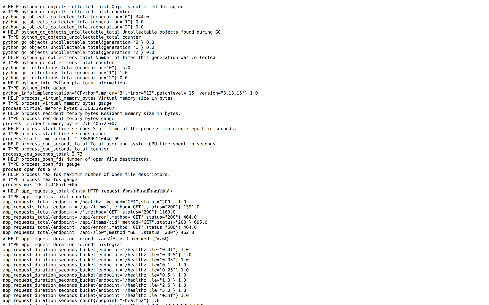

---

## 5. เปิด stack เต็ม — Prometheus + Grafana + loadgen

```bash
docker compose up -d
docker compose ps
```

> 📝 **คำอธิบาย:** คำสั่งเดิมแต่ไม่ระบุชื่อ service จึงเปิดที่เหลือทั้งหมด · `app` ที่รันอยู่แล้วจะขึ้นว่า `Running` ไม่ถูกสร้างใหม่ (Compose สร้างใหม่เฉพาะตัวที่ config เปลี่ยน) · `loadgen` ไม่มี port mapping เพราะเป็นฝั่งยิงอย่างเดียว ไม่มีใครต้องเข้าหามัน
>
> `prometheus.yml` ตั้ง `scrape_interval: 5s` ซึ่งถี่กว่า default ของ Prometheus (1 นาที) มาก — เลือกแบบนี้เพราะในคาบเรียนเราไม่มีเวลารอ 15 นาทีให้กราฟมีจุดพอ · ราคาที่จ่ายคือพื้นที่เก็บและ CPU ที่มากขึ้น 12 เท่า · **กฎที่ต้องจำคู่กัน: หน้าต่างของ `rate()` ต้อง ≥ 4 เท่าของ `scrape_interval`** ที่นี่ 5s × 4 = 20s ดังนั้น `[1m]` ที่เราจะใช้ปลอดภัยมาก

✅ **Expected output** — 4 container ขึ้นครบ (เวลาและลำดับต่างกันได้):

```text
NAME                 IMAGE                    COMMAND                  SERVICE      CREATED          STATUS          PORTS
monlab4-app          monlab4/app:1.0.0        "python app.py"          app          31 seconds ago   Up 31 seconds   0.0.0.0:8000->8000/tcp, [::]:8000->8000/tcp
monlab4-grafana      grafana/grafana:12.3.1   "/run.sh"                grafana      8 seconds ago    Up 8 seconds    0.0.0.0:3000->3000/tcp, [::]:3000->3000/tcp
monlab4-loadgen      monlab4/loadgen:1.0.0    "python gen.py"          loadgen      9 seconds ago    Up 8 seconds
monlab4-prometheus   prom/prometheus:v3.7.3   "/bin/prometheus --c…"   prometheus   9 seconds ago    Up 8 seconds    0.0.0.0:9090->9090/tcp, [::]:9090->9090/tcp
```

ดูว่า loadgen วางแผนยิงอะไรบ้าง:

```bash
docker compose logs loadgen | head -3
```

> 📝 **คำอธิบาย:** loadgen ไม่สุ่มว่าจะยิง endpoint ไหน แต่สร้าง "ตารางเวร" ยาว 20 ช่องจากสัดส่วนที่ตั้งไว้ แล้ววนใช้ซ้ำ · จากตาราง `/` 5 ช่อง, `/api/items` 6, `/api/items/<id>` 3, `/api/slow` 2, `/api/error` 4 จาก 20 ช่อง ที่ RPS=10 จึงคำนวณล่วงหน้าได้เลยว่า `/api/items` จะได้ 6/20 × 10 = **3.0 req/s** และ `/api/error` จะได้ 4/20 × 10 = **2.0 req/s**
>
> **error ratio ที่คาดไว้ = (สัดส่วนที่ไป `/api/error`) × (`ERROR_RATE` ของแอป) = 0.20 × 0.5 = 0.10 พอดี** — ทำนายไว้ก่อน แล้วข้อ 7 ค่อยไปตรวจกับของจริง

✅ **Expected output**:

```text
monlab4-loadgen  | loadgen -> http://app:8000  RPS=10.0  ERROR_MIX=0.2  SLOW_MIX=0.1  SEED=2569
monlab4-loadgen  | pattern(20 ช่อง) = {'/': 5, '/api/items': 6, '__item_id__': 3, '/api/slow': 2, '/api/error': 4}
monlab4-loadgen  |   -> คาดว่า error ratio = 0.2 x ERROR_RATE ของแอป
```

ตรวจว่า Prometheus ขูดแอปเราสำเร็จ:

```bash
curl -s 'http://localhost:9090/api/v1/targets?state=active' | python3 -c "
import json,sys
for t in json.load(sys.stdin)['data']['activeTargets']:
    print(f\"{t['labels']['job']:<12} {t['scrapeUrl']:<34} {t['health']}\")
"
```

> 📝 **คำอธิบาย:** `/api/v1/targets` คือ API ตัวเดียวกับที่หน้า `/targets` ใน UI ใช้ · `state=active` ตัด target ที่ถูกปลดออกไปแล้วทิ้ง · ชื่อ host `app` มาจากชื่อ service ใน compose แล้ว Docker DNS ภายใน network `monnet` แปลงให้เป็น IP ให้เอง — เราจึงไม่ต้องรู้ IP ของ container เลย

✅ **Expected output** — ต้อง `up` ทั้งสอง job:

```text
app          http://app:8000/metrics            up
prometheus   http://localhost:9090/metrics      up
```

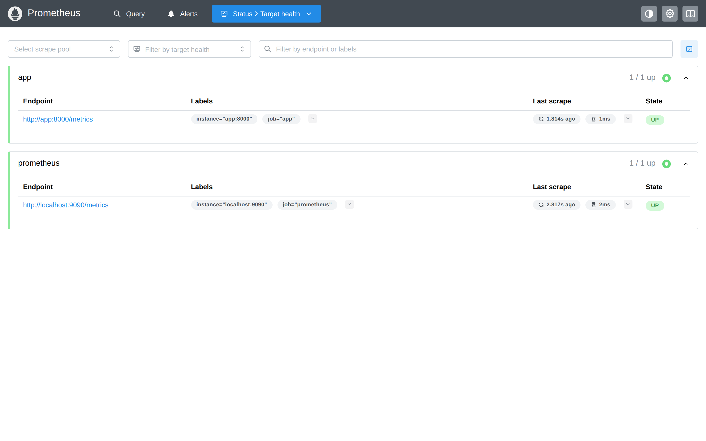

### เปิด UI จากเครื่องเรา

Prometheus อยู่ที่ port `9090` และ Grafana อยู่ที่ `3000` **ข้างในเครื่องเรียน** — เครื่องเราเข้าตรง ๆ ไม่ได้
ต้องทำ port forwarding ก่อน:

1. ใน VS Code เปิดแท็บ **PORTS** ข้าง TERMINAL
2. กด **Forward a Port** แล้วกรอก `9090` ทำซ้ำอีกครั้งกับ `3000`
3. เปิด `http://localhost:9090/graph` และ `http://localhost:3000` บนเบราว์เซอร์ของเรา

ถ้าไม่ใช้ VS Code ให้เปิด terminal ใหม่บนเครื่องเราแล้วปล่อย session นี้ค้างไว้:

```bash
ssh -L 9090:localhost:9090 -L 3000:localhost:3000 root@localhost -p 2222   # password : passwd
```

> 📝 **คำอธิบาย:** `-L 9090:localhost:9090` สร้าง tunnel จาก port 9090 ของเครื่องเราไป port 9090 ในเครื่องเรียน · `-p 2222` ตรงนี้เลือก port SSH ไม่ใช่ port ของ UI · ปิด session เมื่อจบเพื่อปิด tunnel

---

## 6. R — Rate: "รับงานได้เท่าไร"

ทุก query ในแล็บนี้รันได้ 2 ทาง — พิมพ์ในช่อง expression ที่ `http://localhost:9090/graph`
หรือรันจาก terminal ด้วย `promtool` ที่ติดมากับ image ของ Prometheus อยู่แล้ว
ตั้ง shell function ไว้ก่อนเพื่อไม่ต้องพิมพ์ยาว:

```bash
pq() { docker compose exec -T prometheus promtool query instant http://localhost:9090 "$1"; }
```

> 📝 **คำอธิบาย:** `docker compose exec -T prometheus` สั่งงานข้างใน container ของ Prometheus (`-T` ปิด TTY เพื่อให้ผลลัพธ์ pipe ต่อได้) · `promtool query instant <url> <expr>` ยิง instant query แล้วพิมพ์ผลแบบอ่านง่าย ไม่ต้องแปลง JSON เอง · ถ้าปิด terminal แล้วเปิดใหม่ ต้องประกาศ `pq` อีกครั้ง

**รอให้ loadgen ยิงอย่างน้อย 2 นาที** ก่อนอ่านค่า เพราะ `rate(...[1m])` ต้องมีข้อมูลเต็มหน้าต่างก่อนจึงจะนิ่ง

```bash
pq 'sum(rate(app_requests_total[1m]))'
```

> 📝 **คำอธิบาย:** อ่านจากในออกนอก · `app_requests_total` เป็น **counter** ค่าดิบของมันคือ "นับสะสมตั้งแต่แอปเริ่มรัน" ซึ่งเอามาดูตรง ๆ ไม่มีประโยชน์ (มันขึ้นเรื่อย ๆ เสมอ) · `rate(...[1m])` แปลงเป็น "เพิ่มขึ้นเฉลี่ยกี่หน่วยต่อวินาที ในช่วง 1 นาทีล่าสุด" — และ `rate()` ยัง**จัดการ counter reset ให้อัตโนมัติ** ด้วย ถ้าแอป restart แล้วตัวนับกลับไป 0 มันจะไม่คิดเป็นค่าติดลบ · `sum(...)` ยุบทุก series (ทุก endpoint ทุก status) เป็นเลขเดียว

✅ **Expected output** — ต้องได้ประมาณ 10 req/s ตามที่ตั้ง `RPS=10` (ทศนิยมท้ายต่างกันได้):

```text
{} => 10.000363649587259 @[1786810557.61]
```

แยกดูรายทาง:

```bash
pq 'sum by (endpoint) (rate(app_requests_total[1m]))'
```

> 📝 **คำอธิบาย:** `sum by (endpoint)` = ยุบทุก label **ยกเว้น** `endpoint` จึงเหลือหนึ่งเส้นต่อหนึ่ง route · ตัวเลขที่ได้ต้องตรงกับ "ตารางเวร" ในข้อ 5: `/api/items` 6/20×10 = 3.0 · `/` 5/20×10 = 2.5 · `/api/error` 4/20×10 = 2.0 · `/api/items/:id` 3/20×10 = 1.5 · `/api/slow` 2/20×10 = 1.0 · รวมกันได้ 10 พอดี
>
> `/healthz` และ `/other` เป็น **0** เพราะถูกเรียกไปตอนข้อ 4 แล้วไม่ถูกเรียกอีกเลย — counter ยังอยู่ (ค่ามันไม่มีวันลด) แต่ `rate()` ของมันเป็น 0 เพราะไม่มีการเพิ่ม นี่คือความต่างสำคัญระหว่าง "ค่าดิบของ counter" กับ "rate ของ counter"

✅ **Expected output** — ลำดับบรรทัดสลับกันได้:

```text
{endpoint="/"} => 2.5091821520782576 @[1786810557.819]
{endpoint="/api/items"} => 3.0001090948761773 @[1786810557.819]
{endpoint="/api/slow"} => 1.0000363649587258 @[1786810557.819]
{endpoint="/api/error"} => 2.0000727299174517 @[1786810557.819]
{endpoint="/api/items/:id"} => 1.4909633077566458 @[1786810557.819]
{endpoint="/other"} => 0 @[1786810557.819]
{endpoint="/healthz"} => 0 @[1786810557.819]
```

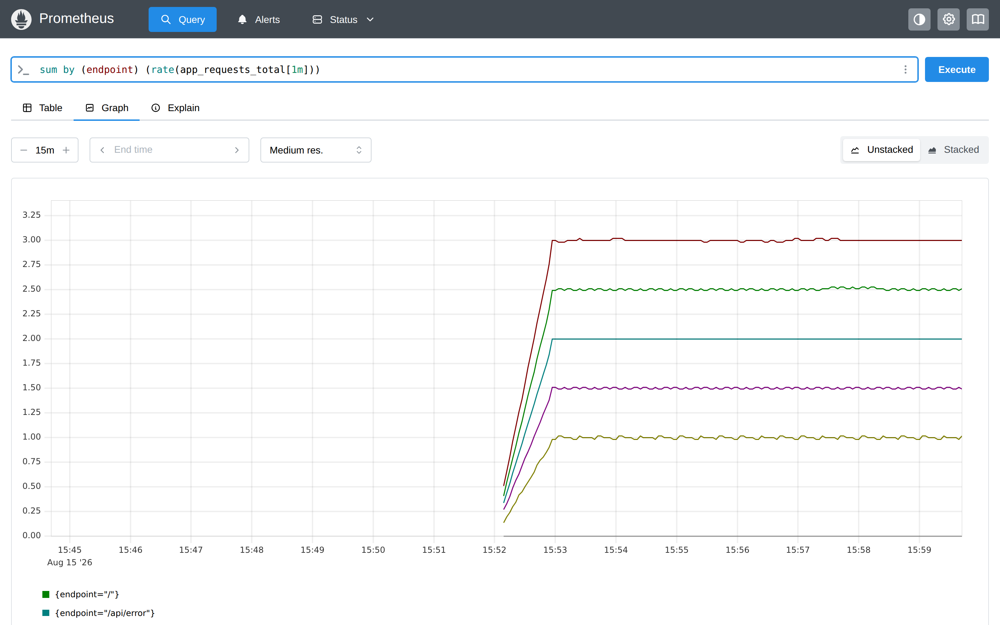

> **ลองผิดให้เห็นเอง:** พิมพ์ `app_requests_total` เปล่า ๆ ในช่อง expression แล้วกด Graph
> จะเห็นเส้นไต่ขึ้นเรื่อย ๆ เป็นบันได ไม่มีทางบอกได้ว่า "ตอนนี้ระบบรับงานเท่าไร" — ต้องมี `rate()` เท่านั้น

---

## 7. E — Errors: "พังกี่เปอร์เซ็นต์"

```bash
pq 'sum by (status) (rate(app_requests_total[1m]))'
```

> 📝 **คำอธิบาย:** ดูก่อนว่าแต่ละ status code มาเท่าไร · 9 req/s เป็น 200 และ 1 req/s เป็น 500 · `404` เป็น 0 เพราะยิงไปครั้งเดียวตอนข้อ 4

✅ **Expected output**:

```text
{status="200"} => 9.000327284628531 @[1786810558.027]
{status="500"} => 1.0000363649587256 @[1786810558.027]
{status="404"} => 0 @[1786810558.027]
```

ตัวเลขที่ควรขึ้น dashboard จริง ๆ คือ **สัดส่วน** ไม่ใช่จำนวนดิบ:

```bash
pq 'sum(rate(app_requests_total{status=~"5.."}[1m])) / sum(rate(app_requests_total[1m]))'
```

> 📝 **คำอธิบาย:** `status=~"5.."` เป็น regex match — `=~` คือ "ตรงกับ regex" · หารด้วยยอดรวมได้เป็นสัดส่วน 0-1
>
> ⚠️ **regex ของ PromQL ถูก anchor เต็มสตริงเสมอ** (เหมือนมี `^...$` ครอบให้อัตโนมัติ ต่างจาก `grep`) · ดังนั้น `"5.."` **ไม่ได้แปลว่า "ขึ้นต้นด้วย 5"** แต่แปลว่า "ยาว 3 อักขระพอดี ตัวแรกเป็น 5" — ค่าอย่าง `5000` หรือ `5xx` จะ**ไม่**ถูกจับ (ตัวแรกไม่ตรงหรือความยาวไม่ใช่ 3) ส่วน `.` นั้นรับอักขระอะไรก็ได้ที่ไม่ใช่ขึ้นบรรทัดใหม่ ไม่ได้จำกัดว่าต้องเป็นตัวเลข · ในแล็บนี้ `status` มีแต่ `200`/`404`/`500` จึงไม่ต่างกัน แต่พอไปเจอระบบจริงที่ใครสักคนใส่ `status="5xx"` เข้ามา `5..` จะจับมันด้วยโดยไม่ตั้งใจ
> **เขียนให้ตรงเจตนากว่า:** `status=~"5[0-9]{2}"` — อ่านออกทันทีว่า "เลข 3 หลักที่ขึ้นต้นด้วย 5"
>
> **ทำไมต้องเป็นสัดส่วน:** "error 1 ครั้งต่อวินาที" ไม่มีความหมายถ้าไม่รู้ว่า traffic ทั้งหมดเท่าไร — 1/วินาที จาก 10 คือหายนะ แต่ 1/วินาที จาก 10,000 คือปกติ · alert ในโลกจริงจึงตั้งบนสัดส่วนเกือบทั้งหมด (LAB 5 จะใช้สูตรบรรทัดนี้ตรง ๆ ทำ alert `HighErrorRate`)
>
> ⚠️ **กับดัก:** ต้อง `rate()` ทั้งเศษและส่วน **ก่อน** หาร ห้ามเอา counter ดิบมาหารกัน เพราะ counter ดิบคือยอดสะสมตั้งแต่ต้น ผลที่ได้จะเป็น "error ratio เฉลี่ยตลอดอายุ process" ซึ่งขยับช้ามากจนมองไม่เห็นเหตุการณ์ที่เพิ่งเกิด

✅ **Expected output** — ตรงกับที่ทำนายไว้ในข้อ 5 (0.20 × 0.5 = 0.10) แบบไม่ต้องลุ้น:

```text
{} => 0.09999999999999999 @[1786810558.222]
```

หาว่า error มาจากทางไหน:

```bash
pq 'sum by (endpoint) (rate(app_requests_total{status=~"5.."}[1m])) / sum by (endpoint) (rate(app_requests_total[1m]))'
```

> 📝 **คำอธิบาย:** ใส่ `by (endpoint)` ทั้งเศษและส่วนเพื่อให้ PromQL จับคู่ series ทีละ endpoint แล้วหารกัน · ผลออกมา **เส้นเดียว** คือ `/api/error` ที่ 0.5 — เพราะ endpoint อื่นไม่มีเศษ (ไม่มี 5xx) การหารจึงไม่มีคู่ให้จับ series เลยหายไปเอง · 0.5 ตรงกับ `ERROR_RATE=0.5` ของแอปพอดี
>
> นี่คือพลังของ label: ตัวเลขรวมบอกว่า "พัง 10%" แต่พอ `by (endpoint)` เราก็รู้ทันทีว่าปัญหากระจุกอยู่ที่เส้นทางเดียว ไม่ใช่ทั้งระบบ

✅ **Expected output**:

```text
{endpoint="/api/error"} => 0.5 @[1786810558.415]
```

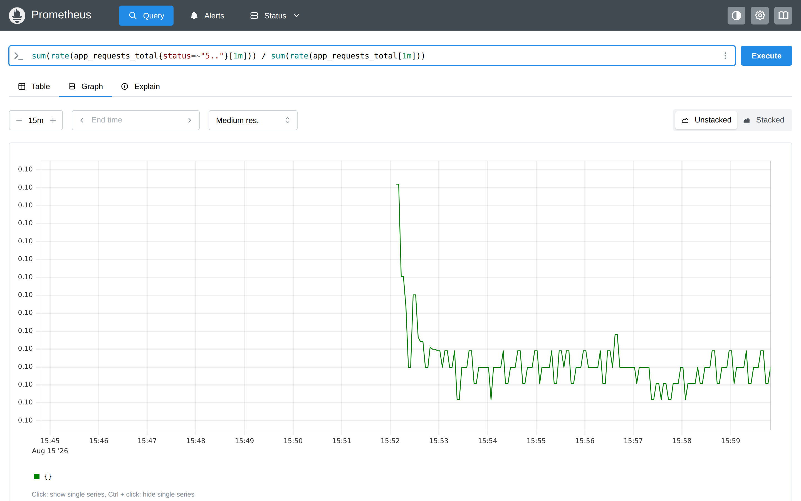

---

## 8. D — Duration: "ช้าแค่ไหน" ด้วย `histogram_quantile`

```bash
pq 'histogram_quantile(0.95, sum by (le) (rate(app_request_duration_seconds_bucket[5m])))'
```

> 📝 **คำอธิบาย:** อ่านจากในออกนอกอีกครั้ง
> 1. `app_request_duration_seconds_bucket` — series ของถังทั้งหมด แต่ละอันมี label `le` (less than or equal)
> 2. `rate(...[5m])` — แปลงถังที่เป็น counter ให้เป็น "อัตราต่อวินาที" ในหน้าต่าง 5 นาที (ใช้ 5 นาทีเพราะ percentile ต้องการตัวอย่างเยอะกว่า rate ธรรมดา ไม่งั้นเส้นจะกระโดด)
> 3. `sum by (le)` — รวมทุก endpoint เข้าด้วยกันแต่ **ต้องเก็บ `le` ไว้** เพราะ `histogram_quantile` อ่านรูปทรงของถังจาก label นี้ (ลืม `by (le)` = ได้ผลว่างหรือ NaN ทันที)
> 4. `histogram_quantile(0.95, ...)` — ประมาณค่าที่ 95% ของ request อยู่ต่ำกว่า
>
> ⚠️ **คำว่า "ประมาณ" สำคัญมาก** — Prometheus ไม่ได้เก็บเวลาของทุก request ไว้ มันเก็บแค่ "จำนวนที่ตกในแต่ละถัง" ดังนั้น `histogram_quantile` ต้อง**เดาเชิงเส้น (linear interpolation) ภายในถังที่ผลลัพธ์ตกอยู่** ค่าที่ได้จึงเป็นค่าประมาณเสมอ และความแม่นขึ้นกับว่าเราเลือกขอบถังดีแค่ไหน · ข้อ 9 จะพิสูจน์ให้เห็นด้วยเลขจริง

✅ **Expected output** — ค่าจะอยู่ราว **1.4-1.6 วินาที** (ค่านี้แกว่งได้เพราะเป็นการประมาณจากขอบถัง):

```text
{} => 1.4988687782805405 @[1786810558.811]
```

เทียบ p50 / p95 / p99 ในชุดเดียว:

```bash
for q in 0.50 0.95 0.99; do
  printf 'p%s = ' "${q#0.}"
  pq "histogram_quantile($q, sum by (le) (rate(app_request_duration_seconds_bucket[5m])))"
done
```

> 📝 **คำอธิบาย:** เปลี่ยนแค่ตัวเลขแรกก็ได้ percentile อื่น · `${q#0.}` เป็นการตัด `0.` ออกจากหน้าตัวแปรใน bash เพื่อพิมพ์เป็น `p50` / `p95` / `p99` สวย ๆ
>
> อ่านผลว่า: ครึ่งหนึ่งของ request เสร็จใน **ราว ๆ** 26 มิลลิวินาที (เร็วมาก) และ 5% ช้ากว่า **ราว ๆ** 1.5 วินาที · **นี่คือรูปทรงของระบบจริงเกือบทุกตัว** — เร็วเป็นส่วนใหญ่ แต่มีหางยาว และหางนั่นแหละคือสิ่งที่ผู้ใช้บ่น
>
> ⚠️ **อย่าอ่าน `p99 = 2.3` ว่า "1% ของ request ช้ากว่า 2.3 วินาที"** — ดูตารางเวลาหน่วงในข้อ 2 จะเห็นว่าค่าที่ช้าที่สุดที่แอปนี้สร้างได้คือ **1.9 วินาที** ไม่มี request ไหนถึง 2.3 เลยสักใบ · เลข 2.3 เกิดจาก `histogram_quantile` **เดาเชิงเส้นอยู่ภายในถัง `(1, 2.5]`** ซึ่งเป็นถังที่ค่าช้าทั้งหมดไปกองรวมกัน · ทุกค่าที่ออกจาก `histogram_quantile` คือ **ค่าประมาณของ quantile ที่ความละเอียดเท่ากับขอบถังที่เราเลือกไว้เอง** ไม่ใช่ค่าที่วัดได้จริงจาก request ใบใดใบหนึ่ง · จะเห็นตัวอย่างที่ชัดกว่านี้อีกในย่อหน้าถัดไปเรื่อง `/api/slow`

✅ **Expected output** (เลขทศนิยมต่างกันได้):

```text
p50 = {} => 0.02591346153846154 @[1786810558.594]
p95 = {} => 1.4988687782805405 @[1786810558.811]
p99 = {} => 2.299773755656107 @[1786810559.022]
```

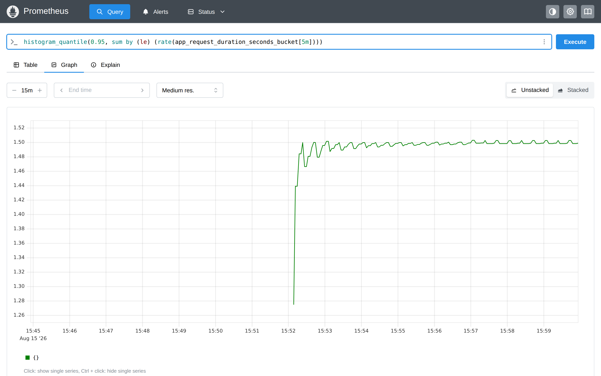

แยก p95 รายทาง:

```bash
pq 'histogram_quantile(0.95, sum by (le, endpoint) (rate(app_request_duration_seconds_bucket[5m])))'
```

> 📝 **คำอธิบาย:** เติม `endpoint` เข้าไปใน `by (...)` เพื่อไม่ยุบมันทิ้ง · `/other` และ `/healthz` ได้ `NaN` เพราะ `rate()` ของทุกถังเป็น 0 (ไม่มี traffic ในหน้าต่างนี้) → หารด้วยศูนย์ · นี่คือพฤติกรรมปกติ ไม่ใช่บั๊ก
>
> **สังเกต `/api/slow` = 2.4 วินาที** ทั้งที่ค่าหน่วงที่ช้าที่สุดในตารางคือ **1.9 วินาที** — เป็นไปไม่ได้ที่ p95 จริงจะเกิน 1.9! สาเหตุคือถังของเรากระโดดจาก `1.0` ไป `2.5` โดยไม่มีอะไรคั่น ค่าจริงทุกค่าของ `/api/slow` ที่เกิน 1 วินาทีจึงกองอยู่ในถัง `(1, 2.5]` ก้อนเดียว แล้ว `histogram_quantile` ก็เดาเชิงเส้นภายในก้อนนั้น ได้ 2.4 ออกมา · **บทเรียน: ถ้าจะวัด SLO ที่ 1.5 วินาที ก็ต้องมีขอบถังใกล้ ๆ 1.5 ไม่งั้นตัวเลขจะเชื่อไม่ได้**

✅ **Expected output** — ลำดับสลับกันได้:

```text
{endpoint="/api/items"} => 0.2124999999999999 @[1786810560.001]
{endpoint="/api/slow"} => 2.4 @[1786810560.001]
{endpoint="/api/error"} => 0.04625634517766497 @[1786810560.001]
{endpoint="/api/items/:id"} => 0.09246598639455783 @[1786810560.001]
{endpoint="/other"} => NaN @[1786810560.001]
{endpoint="/healthz"} => NaN @[1786810560.001]
{endpoint="/"} => 0.0095 @[1786810560.001]
```

---

## 9. ผ่าไส้ histogram — คำนวณ p95 ด้วยมือ และดูค่าเฉลี่ยหลอกตา

### 9.1 ตารางถังสะสม

```bash
pq 'sum by (le) (app_request_duration_seconds_bucket)'
```

> 📝 **คำอธิบาย:** คราวนี้เอา **ค่าดิบ** ไม่ใส่ `rate()` เพื่อเห็นตัวเลขสะสมจริง · ตัวเลขต้อง**ไม่ลดลง**เมื่อ `le` โตขึ้น เพราะเป็นถังสะสม · `le="+Inf"` = จำนวน request ทั้งหมด และต้องเท่ากับ `_count` เสมอ

✅ **Expected output** — เลขจะโตขึ้นเรื่อย ๆ ตามเวลาที่ปล่อยไว้ ให้ดู**รูปทรง** ไม่ใช่ตัวเลขเป๊ะ:

```text
{le="0.01"} => 956 @[1786810559.385]
{le="0.025"} => 1886 @[1786810559.385]
{le="0.05"} => 2560 @[1786810559.385]
{le="0.1"} => 3209 @[1786810559.385]
{le="0.25"} => 3437 @[1786810559.385]
{le="0.5"} => 3437 @[1786810559.385]
{le="1.0"} => 3533 @[1786810559.385]
{le="2.5"} => 3818 @[1786810559.385]
{le="5.0"} => 3818 @[1786810559.385]
{le="+Inf"} => 3818 @[1786810559.385]
```

**คำนวณ p95 ด้วยมือจากตารางนี้:**

- จำนวนทั้งหมด = `+Inf` = **3818**
- อันดับที่ต้องการ = 0.95 × 3818 = **3627.1**
- ถังที่คลุมอันดับนี้: `le="1.0"` มี 3533 (ยังไม่ถึง) → `le="2.5"` มี 3818 (เกินแล้ว) → **คำตอบอยู่ในช่วง (1.0, 2.5]**
- ในถังนั้นมี 3818 − 3533 = 285 request และเราต้องการอันดับที่ 3627.1 − 3533 = 94.1 ของถัง
- เดาเชิงเส้น: 1.0 + (2.5 − 1.0) × 94.1 / 285 = 1.0 + 0.495 = **≈ 1.50 วินาที**

ตรงกับที่ `histogram_quantile` ตอบในข้อ 8 (1.4989) — ต่างกันนิดหน่อยเพราะสูตรของ Prometheus ทำงานบน `rate(...[5m])`
ไม่ใช่ยอดสะสมทั้งชีวิตของ process แต่หลักการคำนวณเป็นตัวเดียวกันเป๊ะ

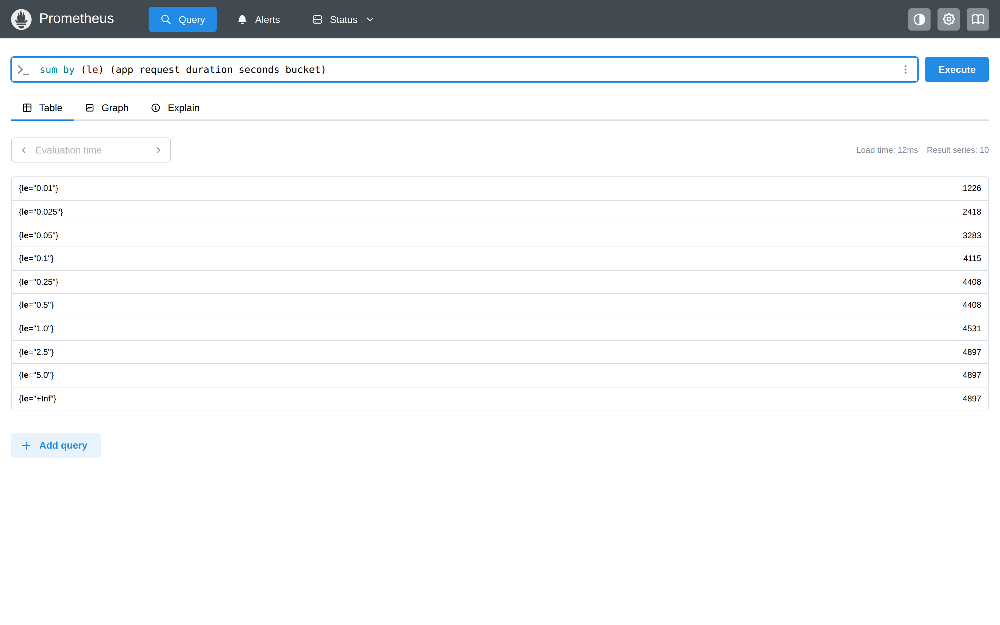

> รูปนี้ถ่ายคนละจังหวะกับผลด้านบน ตัวเลขจึงมากกว่า (รวม 4897) — ลองคำนวณ p95 จากรูปดูเอง:
> 0.95 × 4897 = 4652.15 → อยู่ในถัง (1.0, 2.5] → 1.0 + 1.5 × (4652.15 − 4531) / (4897 − 4531) = **≈ 1.50 วินาที** เท่ากัน
> เพราะ *รูปทรง* ของการกระจายไม่เปลี่ยน ต่อให้จำนวน request จะโตขึ้นเรื่อย ๆ

> **สังเกต `le="0.25"` กับ `le="0.5"` มีค่าเท่ากัน (3437 ทั้งคู่)** = ไม่มี request ไหนเลยที่ใช้เวลาระหว่าง 0.25 ถึง 0.5 วินาที
> ตรงกับตารางในข้อ 2.4 ที่ไม่มีค่าไหนอยู่ในช่วงนี้ · นี่คือวิธีอ่าน "รูปทรงการกระจาย" จาก histogram โดยไม่ต้องมีกราฟ

### 9.2 ค่าเฉลี่ยที่หลอกตา

```bash
pq 'sum(rate(app_request_duration_seconds_sum[5m])) / sum(rate(app_request_duration_seconds_count[5m]))'
```

> 📝 **คำอธิบาย:** `_sum` คือผลรวมของเวลาที่ observe ไปทั้งหมด, `_count` คือจำนวนครั้ง → หารกันได้ค่าเฉลี่ย · ต้อง `rate()` ทั้งคู่ก่อนหาร เพื่อให้ได้ "ค่าเฉลี่ยในช่วง 5 นาทีล่าสุด" ไม่ใช่ค่าเฉลี่ยตลอดอายุ process
>
> **เทียบกัน: avg ≈ 0.16 วินาที · p95 ≈ 1.50 วินาที — ต่างกัน 9 เท่า**
> ถ้า dashboard ของเรามีแต่ค่าเฉลี่ย เราจะรายงานผู้บริหารว่า "ระบบตอบใน 160 มิลลิวินาที เยี่ยมมาก" ทั้งที่ผู้ใช้ 1 ใน 20 คนรอนานกว่า 1.5 วินาทีทุกครั้ง
> ค่าเฉลี่ยถูก "ถ่วง" ด้วย request เร็ว ๆ จำนวนมากจนกลบหางที่ช้าไปหมด — **นี่คือเหตุผลที่ RED ใช้ percentile ไม่ใช่ average**

✅ **Expected output**:

```text
{} => 0.15980244465840202 @[1786810559.198]
```

ตรวจว่ากลไก `_sum/_count` ทำงานถูกจริง โดยเช็คกับตัวเลขที่เรารู้คำตอบอยู่แล้ว:

```bash
pq 'app_request_duration_seconds_sum{endpoint="/api/slow"} / app_request_duration_seconds_count{endpoint="/api/slow"}'
```

> 📝 **คำอธิบาย:** จากตารางในข้อ 2.4 `/api/slow` วนหน่วง 0.7 / 1.1 / 1.5 / 1.9 วินาที ค่าเฉลี่ยทางทฤษฎีจึงเป็น (0.7+1.1+1.5+1.9)/4 = **1.3 วินาที** พอดี · ผลที่วัดได้คือ 1.298 — ห่างจากทฤษฎีแค่ 2 มิลลิวินาที ซึ่งคือ overhead ของ HTTP เอง · **การมีค่าที่รู้คำตอบล่วงหน้าไว้ตรวจ คือวิธีพิสูจน์ว่าเราติดมิเตอร์ถูกจุด**

✅ **Expected output**:

```text
{endpoint="/api/slow", instance="app:8000", job="app"} => 1.2982086743074475 @[1786810559.78]
```

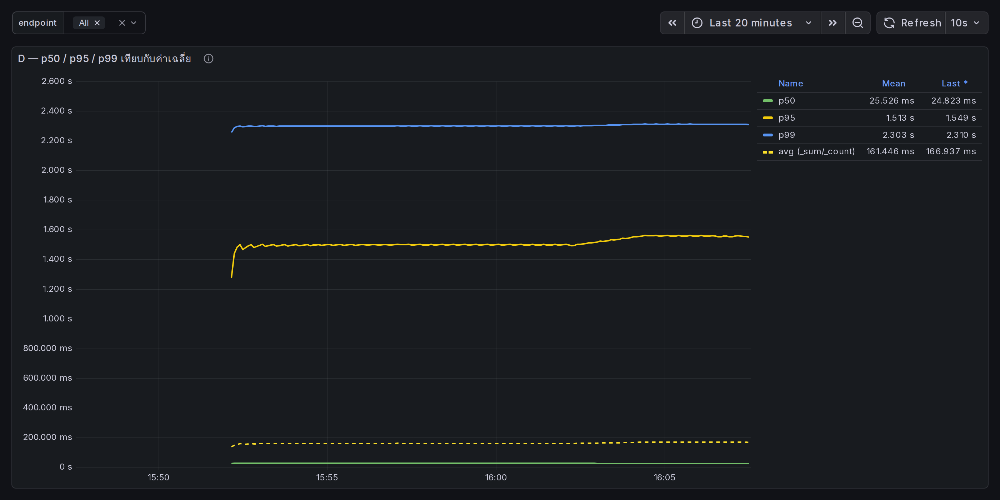

---

## 10. Gauge — งานที่ค้างอยู่ในมือ

```bash
pq 'app_inflight_requests'
pq 'max_over_time(app_inflight_requests[5m])'
```

> 📝 **คำอธิบาย:** gauge ไม่ต้องใช้ `rate()` — อ่านค่าตรง ๆ ได้เลยเพราะมันคือ "ตอนนี้เท่าไร" อยู่แล้ว · `max_over_time(...[5m])` หาค่าสูงสุดในช่วง 5 นาที ซึ่งจำเป็นมากสำหรับ gauge เพราะ Prometheus เห็นมันแค่ทุก 5 วินาที ถ้าค่าพุ่งขึ้นแล้วลงระหว่างสอง scrape เราจะไม่มีวันเห็นเลย
>
> **ทำไมค่าประมาณ 1-2:** `/api/slow` ถูกยิง 1 req/s และแต่ละใบใช้เวลาเฉลี่ย 1.3 วินาที ตามกฎของ Little (inflight = อัตรามาถึง × เวลาที่อยู่ในระบบ) จึงได้ 1 × 1.3 ≈ 1.3 จาก `/api/slow` อย่างเดียว บวก endpoint อื่นอีกเล็กน้อย
>
> **ต่างจาก counter อย่างไร:** counter ตอบว่า "ผ่านมาแล้วกี่ใบ" ส่วน gauge ตัวนี้ตอบว่า "ค้างอยู่กี่ใบ" · ถ้า gauge ไต่ขึ้นเรื่อย ๆ ไม่ยอมลง แปลว่าแอปรับงานเข้าเร็วกว่าที่ทำเสร็จ = กำลังจะล่ม ซึ่ง counter บอกไม่ได้

✅ **Expected output** — ค่าจะแกว่งอยู่ราว 0-3:

```text
app_inflight_requests{instance="app:8000", job="app"} => 1 @[1786810560.227]
{instance="app:8000", job="app"} => 2 @[1786810560.418]
```

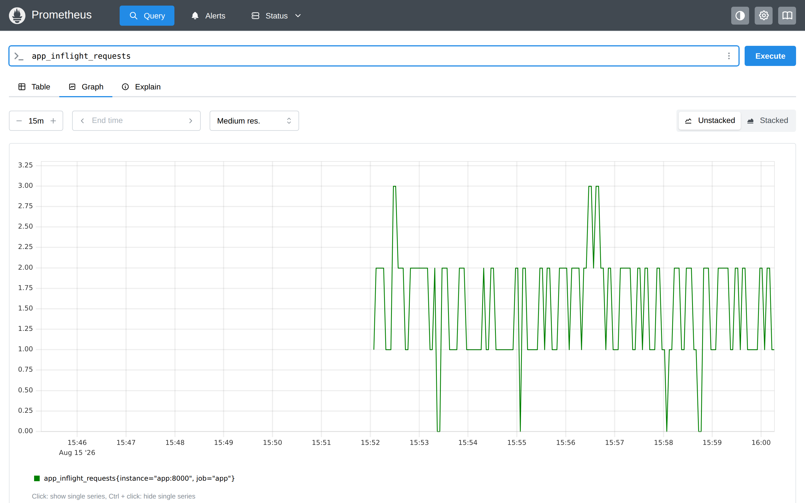

ดู gauge อีกตัวที่ไม่มีวันเปลี่ยน:

```bash
pq 'app_build_info'
```

> 📝 **คำอธิบาย:** ค่าเป็น 1 เสมอ ข้อมูลจริงอยู่ที่ label `version="1.0.0"` · ใช้ตอบคำถามแบบ "ตอน incident เมื่อวานเรารันเวอร์ชันไหนอยู่" หรือทำ query แบบ `sum(rate(app_requests_total[1m])) * on() group_left(version) app_build_info` เพื่อแปะเวอร์ชันเข้ากับ metric อื่น

✅ **Expected output**:

```text
app_build_info{instance="app:8000", job="app", version="1.0.0"} => 1 @[1786810560.646]
```

---

## 11. Grafana — RED dashboard ที่ provision มาให้แล้ว

เปิด `http://localhost:3000` (หลัง forward port แล้ว) → เมนู **Dashboards** → **LAB 4 — RED Method (app instrumentation)**
หรือเข้าตรงที่ `http://localhost:3000/d/monlab4red`

> 📝 **คำอธิบาย:** ไม่ต้อง login ก็ดูได้เพราะเปิด `GF_AUTH_ANONYMOUS_ENABLED=true` ไว้ (ถ้าจะแก้ dashboard ให้ login ด้วย `admin` / `admin`)
> ⚠️ anonymous access เปิดไว้เพราะเป็นห้องเรียนเท่านั้น — **ห้ามทำแบบนี้ใน production เด็ดขาด**
>
> Dashboard ไม่ได้ถูกสร้างด้วยมือ แต่มาจากไฟล์ 3 ไฟล์:
> - `grafana/provisioning/datasources/prometheus.yml` — บอก Grafana ว่ามี Prometheus อยู่ที่ `http://prometheus:9090` และ **fix `uid: monprom`** ไว้ (ต้องใช้ชื่อ service ไม่ใช่ `localhost` เพราะ `localhost` ในมุมของ Grafana คือตัว Grafana เอง) พร้อม `timeInterval: 5s` ให้เท่ากับ `scrape_interval`
> - `grafana/provisioning/dashboards/dashboards.yml` — บอกว่าให้ไปอ่าน dashboard JSON จาก `/var/lib/grafana/dashboards` ซึ่งตรงกับที่ compose mount `./grafana/dashboards` ไว้
> - `grafana/dashboards/red-dashboard.json` — ตัว dashboard เอง ทุก panel อ้าง `"datasource": {"type":"prometheus","uid":"monprom"}` ตรง ๆ
>
> **ถ้า `uid` ในสองไฟล์นี้ไม่ตรงกัน panel จะขึ้น `Datasource ... not found` ทันที** (LAB 3 และ LAB 6 มีช่วงทดลองเรื่องนี้โดยเฉพาะ)

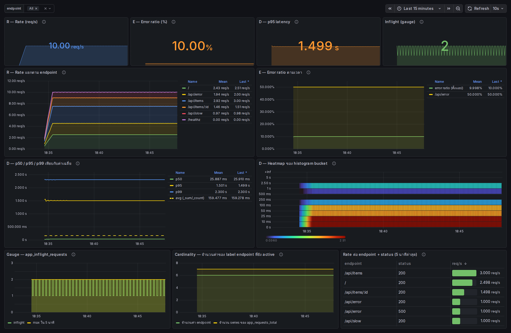

สิ่งที่ควรอ่านให้ออกจากหน้านี้:

| Panel | ตอบคำถามอะไร | จุดสังเกต |
|---|---|---|
| R — Rate (req/s) | ระบบรับงานได้เท่าไร | ต้อง ≈ 10.00 |
| E — Error ratio (%) | พังกี่เปอร์เซ็นต์ | ต้อง ≈ 10.00% และ threshold เปลี่ยนเป็นสีส้มเพราะเกิน 5% |
| D — p95 latency | ช้าแค่ไหนสำหรับคนที่โชคร้าย | ≈ 1.5 วินาที |
| Inflight (gauge) | ค้างอยู่กี่ใบตอนนี้ | แกว่ง 0-3 |
| R — Rate แยกตาม endpoint | traffic มาจากทางไหน | stacked รวมกันได้ 10 พอดี |
| E — Error ratio ตามเวลา | ปัญหากระจุกที่ไหน | เส้น `/api/error` = 50% แต่ภาพรวม = 10% |
| D — p50/p95/p99 vs avg | ค่าเฉลี่ยหลอกตาแค่ไหน | เส้นประ avg อยู่ล่างสุดห่าง p95 เกือบ 10 เท่า |
| D — Heatmap | รูปทรงการกระจายทั้งหมด | เห็นแถบเข้ม 2 กลุ่ม: งานเร็วกับ `/api/slow` แยกกันชัด |
| Cardinality | label เราออกแบบดีไหม | ตอนนี้ราบที่ 7 — ข้อ 12 จะทำให้มันพุ่ง |
| ตาราง endpoint + status | ใครกินแบนด์วิดท์ / ใครพัง | `/api/error` โผล่ 2 แถว (200 กับ 500) แถวละ 1.0 req/s |

> **Heatmap อ่านยังไง:** แกนตั้งคือขอบถังของ histogram แกนนอนคือเวลา สีคือจำนวน request ที่ตกในถังนั้น
> มันคือการเอา `sum by (le) (rate(..._bucket[1m]))` มาวาดทั้งชุด — ให้ข้อมูลมากกว่าเส้น p95 เส้นเดียวมาก
> เพราะเห็น "ทั้งการกระจาย" ไม่ใช่แค่จุดเดียวของมัน

---

## 12. ทำให้พังแล้วแก้ — cardinality ระเบิด

นี่คือความผิดพลาดอันดับหนึ่งของคนเพิ่งเริ่มติด metric: เอา **path ดิบ** มาเป็น label ตรง ๆ

### 12.1 จดตัวเลขตั้งต้นไว้ก่อน

```bash
pq 'count(count by (endpoint) (app_requests_total))'
pq 'scrape_samples_scraped{job="app"}'
pq 'prometheus_tsdb_head_series'
```

> 📝 **คำอธิบาย:** สามตัวชี้วัดคนละมุม
> - `count(count by (endpoint) (app_requests_total))` — อ่านจากในออก: `count by (endpoint)` ยุบให้เหลือ 1 series ต่อ 1 ค่าของ `endpoint` แล้ว `count(...)` นับว่ามีกี่เส้น = **จำนวนค่าของ `endpoint` ที่ยัง “มีชีวิต” อยู่ ณ วินาทีที่เรา query** ไม่ใช่ “เคยมีทั้งหมดกี่ค่า”
>   ⚠️ `app_requests_total` ตรงนี้เป็น **instant selector** — มันมองย้อนหลังแค่ `5m` (`--query.lookback-delta`) และ **ไม่นับ series ที่ถูกใส่ stale marker ไปแล้ว** พอเราแก้ label แล้วแอปรีสตาร์ต series เก่าจะหลุดจากตัวเลขนี้แทบจะทันที ทั้งที่ Prometheus ยังแบกมันไว้ใน RAM อยู่ · อยากรู้ว่า “ในครึ่งชั่วโมงที่ผ่านมาเคยมีกี่ค่า” ต้องถามด้วย range vector เช่น `count(count by (endpoint) (count_over_time(app_requests_total[30m])))`
> - `scrape_samples_scraped{job="app"}` — จำนวนบรรทัดตัวเลขที่ Prometheus ดูดมาได้ต่อ 1 scrape (ตัวนี้ Prometheus สร้างให้เองอัตโนมัติทุก target) = ขนาดของ payload **รอบล่าสุด**
> - `prometheus_tsdb_head_series` — จำนวน series ทั้งหมดที่ Prometheus ถืออยู่ใน head block (อยู่ใน RAM) **นับรวม series ที่ stale ไปแล้วแต่ยังไม่ถูก compact** จึงเป็นตัวเดียวในสามตัวนี้ที่ตอบว่า “ตอนนี้แบกอะไรไว้จริง ๆ” · ยิ่งตัวเลขนี้โต **ความเสี่ยงด้านหน่วยความจำก็ยิ่งสูง** (จะพอหรือไม่พอขึ้นกับ RAM ที่ให้ไว้และงานอื่นที่มันทำอยู่ด้วย) — จับตาตัวนี้ให้ดีตอนข้อ 12.4

✅ **Expected output** — ตัวเลขจะต่างกันเล็กน้อยตามว่าเคยยิง path อะไรไปบ้าง:

```text
{} => 7 @[1786812122.96]
scrape_samples_scraped{instance="app:8000", job="app"} => 110 @[1786812123.076]
prometheus_tsdb_head_series{instance="localhost:9090", job="prometheus"} => 712 @[1786812123.221]
```

### 12.2 เปิดโหมดของเสีย

ไฟล์ `docker-compose.rawpath.yml` เปลี่ยนค่าเดียว:

```yaml
services:
  app:
    environment:
      RAW_PATH_LABEL: "1"
```

```bash
docker compose -f docker-compose.yml -f docker-compose.rawpath.yml up -d app
docker compose logs --tail 3 app
```

> 📝 **คำอธิบาย:** Compose merge สองไฟล์แล้ว recreate เฉพาะ `app` เพราะมีแค่ตัวนั้นที่ config เปลี่ยน · loadgen ไม่ถูกแตะ จึงยิงต่อเนื่องโดยไม่สะดุด และมันเดิน id ของ `/api/items/<id>` แบบเรียงลำดับ 1, 2, 3, ... ไปเรื่อย ๆ ตามที่ตั้ง `ITEM_IDS=200`
>
> **ทำนายก่อนดู:** ที่ RPS 10 มี 3/20 ช่องเป็น `/api/items/<id>` = 1.5 req/s ดังนั้น 200 id จะถูกยิงครบใน 200 ÷ 1.5 ≈ **133 วินาที** — เดี๋ยวเราจะเห็นตัวเลขไต่ขึ้นแล้วตันที่ 204

✅ **Expected output** — log ต้องเปลี่ยนเป็นโหมด RAW PATH:

```text
 Container monlab4-app Recreate
 Container monlab4-app Recreated
 Container monlab4-app Starting
 Container monlab4-app Started
monlab4-app  | monlab4-app v1.0.0 listening on :8000
monlab4-app  |   endpoint label mode = RAW PATH (cardinality demo)
monlab4-app  |   ERROR_RATE = 0.5
```

### 12.3 ดูมันไต่ขึ้น

รันคำสั่งนี้แล้วรอดู ~2.5 นาที:

```bash
for i in 1 2 3 4 5; do
  sleep 30
  printf 't=+%ss  ' "$((i*30))"
  pq 'count(count by (endpoint) (app_requests_total))'
  pq 'scrape_samples_scraped{job="app"}'
  pq 'prometheus_tsdb_head_series'
done
```

> 📝 **คำอธิบาย:** loop มีเพดาน 5 รอบ (~2.5 นาที) จึงไม่วนไม่รู้จบ · จะเห็นทั้งสามตัวเลขไต่ขึ้นพร้อมกัน เพราะมันคือปรากฏการณ์เดียวกันมองจากคนละที่

✅ **Expected output** — ตัวเลขจริงจากการรันทดสอบ (ตัดเฉพาะบรรทัดค่า):

| เวลา | ค่า `endpoint` ที่ต่างกัน | `scrape_samples_scraped` | `prometheus_tsdb_head_series` |
|---|---|---|---|
| ก่อนเปิด | **7** | **110** | **712** |
| +30s | 48 | 734 | 1307 |
| +60s | 100 | 1319 | 1892 |
| +90s | 145 | 1904 | 2477 |
| +120s | 190 | 2489 | 3062 |
| +150s | **204** | **2671** | **3335** |

```text
t=+150s  {} => 204 @[1786812289.63]
scrape_samples_scraped{instance="app:8000", job="app"} => 2671 @[1786812289.758]
prometheus_tsdb_head_series{instance="localhost:9090", job="prometheus"} => 3335 @[1786812289.883]
```

> 📝 **อ่านตัวเลขให้ออก:**
> - **7 → 204** — ตันที่ 204 พอดีเพราะ id มีแค่ 200 ตัว บวก route คงที่อีก 4 (`/`, `/api/items`, `/api/slow`, `/api/error`) · **แต่ในระบบจริง id ไม่มีเพดาน** — user id, order id, session id, UUID ยิ่งใช้งานยิ่งเพิ่มไม่หยุด กราฟนี้จะไม่มีวันราบ
> - **110 → 2671 บรรทัดต่อ scrape (24 เท่า)** — ทุก ๆ 5 วินาที Prometheus ต้องดูด แปลง และเขียน 2671 บรรทัดแทน 110 · ที่โตแรงขนาดนี้เพราะ histogram: id ใหม่ 1 ตัว = counter 1 บรรทัด **บวก histogram อีก 12 บรรทัด** = 13 บรรทัด
> - **712 → 3335 series (4.7 เท่า)** — ทุก series กิน RAM ของ Prometheus ตลอดเวลาที่มันยังอยู่ใน head block ไม่ว่าจะมีคนถามถึงหรือไม่ · **cardinality ที่คุมไม่อยู่คือสาเหตุคลาสสิกที่ทำให้ Prometheus กิน RAM จนเอาไม่อยู่** และเป็นเรื่องแรกที่ควรสงสัยเวลา Prometheus เริ่มบวม (จะถึงขั้นล่มหรือไม่ ขึ้นกับ RAM ที่ให้ไว้ ระยะ retention และ query ที่วิ่งอยู่ด้วย)

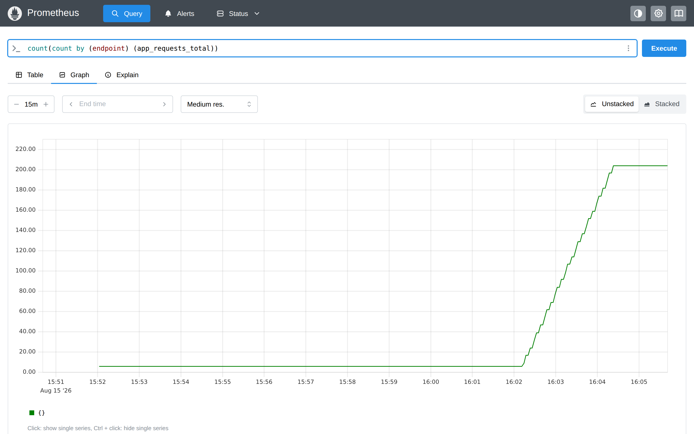

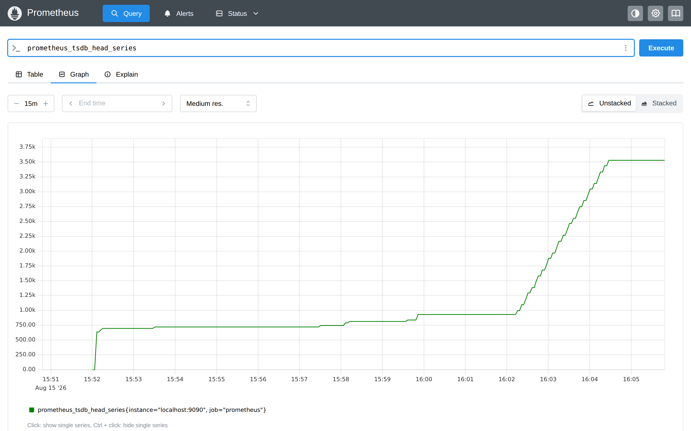

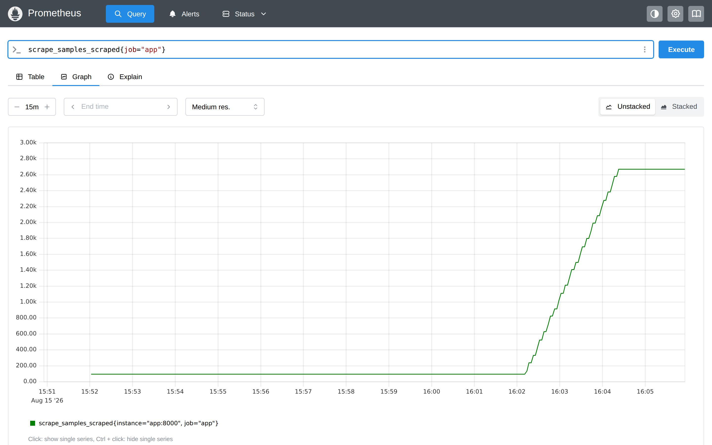

ลองดูหน้า `/metrics` ตอนนี้:

```bash
curl -s http://localhost:8000/metrics | grep '^app_requests_total' | head -8
curl -s http://localhost:8000/metrics | wc -l
```

> 📝 **คำอธิบาย:** เห็นชัดว่าทุก id กลายเป็น series ของตัวเอง · ทั้งหน้าโตจาก 46 บรรทัด (ข้อ 3) เป็นเกือบ 2700 บรรทัด

✅ **Expected output** — id ที่เห็นขึ้นกับว่า loadgen เดินไปถึงไหนแล้ว:

```text
app_requests_total{endpoint="/api/items",method="GET",status="200"} 468.0
app_requests_total{endpoint="/api/error",method="GET",status="200"} 156.0
app_requests_total{endpoint="/api/items/28",method="GET",status="200"} 2.0
app_requests_total{endpoint="/",method="GET",status="200"} 390.0
app_requests_total{endpoint="/api/slow",method="GET",status="200"} 155.0
app_requests_total{endpoint="/api/error",method="GET",status="500"} 156.0
app_requests_total{endpoint="/api/items/29",method="GET",status="200"} 2.0
app_requests_total{endpoint="/api/items/30",method="GET",status="200"} 2.0
2699
```

> ⚠️ **อย่าปล่อยทิ้งไว้นาน** — ในห้องเรียนเรามี id แค่ 200 ตัวจึงจบเร็ว แต่ถ้าเผลอเปิดโหมดนี้ทิ้งไว้กับ id ที่ไม่มีเพดาน
> Prometheus จะกิน RAM เพิ่มเรื่อย ๆ จนถูก OOM killer เก็บ ให้ทำข้อ 12.4 ทันทีที่ดูตัวเลขเสร็จ

### 12.4 แก้กลับ

```bash
docker compose up -d app
docker compose logs --tail 3 app
```

> 📝 **คำอธิบาย:** สั่งด้วยไฟล์หลักไฟล์เดียว override จึงหลุดไป และ `RAW_PATH_LABEL` กลับเป็น `"0"` ตามที่เขียนไว้ใน `docker-compose.yml`

✅ **Expected output**:

```text
 Container monlab4-app Recreate
 Container monlab4-app Recreated
 Container monlab4-app Starting
 Container monlab4-app Started
monlab4-app  | monlab4-app v1.0.0 listening on :8000
monlab4-app  |   endpoint label mode = TEMPLATE (/api/items/:id)
monlab4-app  |   ERROR_RATE = 0.5
```

รอสัก 20 วินาทีให้ Prometheus ขูดรอบใหม่ แล้ววัดซ้ำ:

```bash
pq 'count(count by (endpoint) (app_requests_total))'
pq 'scrape_samples_scraped{job="app"}'
pq 'prometheus_tsdb_head_series'
```

✅ **Expected output** — **สังเกตให้ดีว่ามีตัวหนึ่งไม่ยอมลง:**

```text
{} => 5 @[1786810800.166]
scrape_samples_scraped{instance="app:8000", job="app"} => 84 @[1786810800.375]
prometheus_tsdb_head_series{instance="localhost:9090", job="prometheus"} => 3335 @[1786810800.578]
```

> 📝 **นี่คือบทเรียนที่สำคัญที่สุดของข้อนี้:**
> - `count(count by (endpoint) ...)` ลงมาที่ **5** ทันที (เหลือ 5 เพราะ `/healthz` และ `/other` ถูกยิงตอนข้อ 4 ก่อนแอป restart จึงหายไปด้วย) — เพราะ Prometheus ใส่ *staleness marker* ให้ series ที่หายจาก scrape ทันทีที่ scrape รอบถัดไปไม่มีมันแล้ว
> - `scrape_samples_scraped` ลงมาที่ **84** ทันทีเช่นกัน — payload กลับมาเล็กเหมือนเดิม
> - **แต่ `prometheus_tsdb_head_series` ยังค้างที่ 3335 ไม่ขยับ** — เพราะ series ที่เคยมีอยู่แล้วยังถูกเก็บใน head block (ประมาณ 2 ชั่วโมง) ก่อนจะถูก compact ลงดิสก์ · **RAM ที่เสียไปแล้วไม่ได้คืนมาทันทีที่เราแก้โค้ด**
>
> แปลว่าถ้าเผลอ deploy โค้ดที่ label ระเบิดขึ้น production แล้วรีบ rollback ภายใน 5 นาที Prometheus ก็ยังอาจล่มอยู่ดี
> **ป้องกันตั้งแต่ตอนเขียนโค้ดเท่านั้นถึงจะทันการณ์**

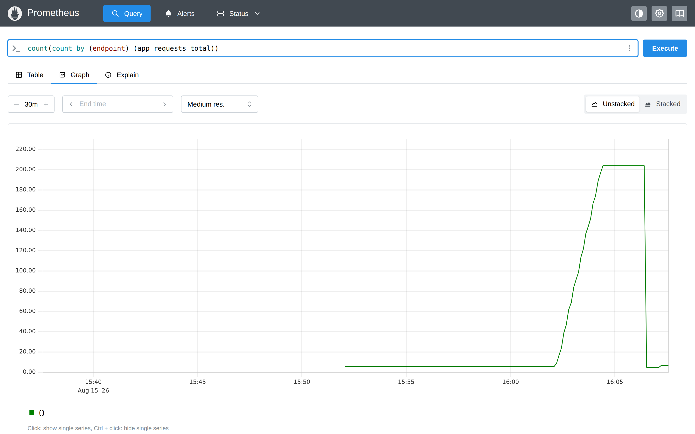

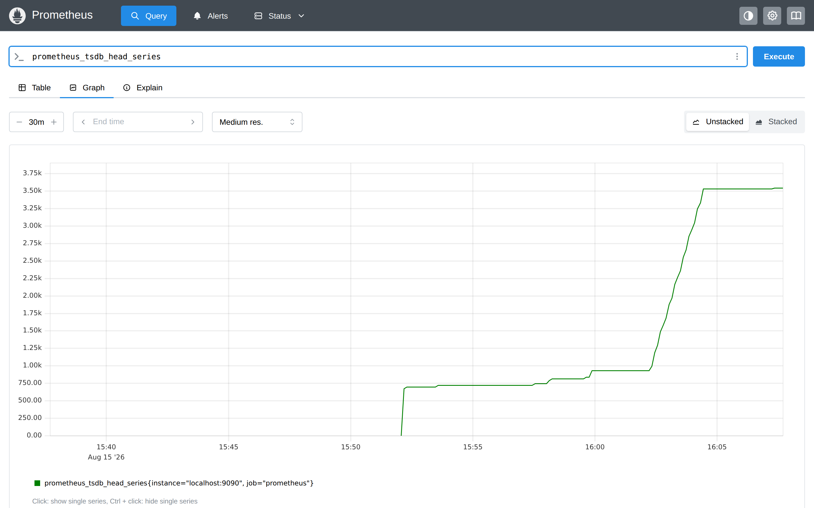

> **กฎง่าย ๆ ที่เอาไปใช้ได้เลย:** ก่อนใส่อะไรเป็น label ให้ถามตัวเองว่า *"ค่านี้มีได้มากที่สุดกี่แบบ ตลอดอายุของระบบ"*
> ถ้าตอบไม่ได้ หรือคำตอบคือ "ขึ้นกับจำนวนผู้ใช้" — **มันไม่ควรเป็น label** ให้เก็บลง log หรือ trace แทน
> ตัวอย่างที่ห้ามเป็น label เด็ดขาด: user id · order id · session id · UUID · email · IP ของ client · full URL พร้อม query string · error message

---

## เกณฑ์ผ่านแล็บ (Acceptance)

ตรวจได้ด้วยคำสั่งเหล่านี้ (ต้องรันหลังปล่อย loadgen ทำงานอย่างน้อย 2 นาที และอยู่ในโหมด template)

```bash
pq 'sum(rate(app_requests_total[1m]))'
pq 'sum(rate(app_requests_total{status=~"5.."}[1m])) / sum(rate(app_requests_total[1m]))'
pq 'histogram_quantile(0.95, sum by (le) (rate(app_request_duration_seconds_bucket[5m])))'
pq 'count(count by (endpoint) (app_requests_total))'
curl -s -o /dev/null -w 'grafana %{http_code}\n' http://localhost:3000/api/health
```

- [ ] **R** — `sum(rate(app_requests_total[1m]))` ≈ **10** req/s
- [ ] **E** — error ratio ≈ **0.10** และอธิบายได้ว่ามาจาก `ERROR_MIX 0.20 × ERROR_RATE 0.5`
- [ ] **D** — p95 อยู่ในช่วง **1.4-1.6 วินาที** และอธิบายได้ว่าทำไมมันเป็นแค่ *ค่าประมาณ*
- [ ] คำนวณ p95 ด้วยมือจากตาราง bucket แล้วได้ใกล้เคียงกับ `histogram_quantile`
- [ ] ชี้ได้ว่า avg (≈0.16 s) ต่ำกว่า p95 (≈1.5 s) เกือบ 10 เท่า และอธิบายได้ว่าทำไม
- [ ] `app_inflight_requests` มีค่า และแยกได้ว่าต่างจาก counter อย่างไร
- [ ] เปิด Grafana dashboard `monlab4red` แล้ว **ทุก panel มีข้อมูล** ไม่มี `No data`
- [ ] แสดงหลักฐาน cardinality ก่อน/หลังได้: `7 → 204` ค่า endpoint และ `110 → 2671` samples ต่อ scrape
- [ ] อธิบายได้ว่าทำไม `prometheus_tsdb_head_series` ไม่ลดลงทันทีหลังแก้ label
- [ ] `count(count by (endpoint) (app_requests_total))` กลับมาเป็นเลขหลักหน่วยหลังแก้

---

## เก็บกวาด (Cleanup) และพิสูจน์ Clean Re-run

ปิดทั้งหมดพร้อมลบ volume แล้วตรวจว่าไม่เหลืออะไร:

```bash
docker compose down -v
docker compose ps -a
```

> 📝 **คำอธิบาย:** `-v` ลบ named volume `monlab4_prom-data` ด้วย จึงทิ้งข้อมูล TSDB ทั้งหมด — ใช้ตอนอยากเริ่มใหม่จากศูนย์จริง ๆ · ถ้าอยากเก็บข้อมูลไว้ให้ใช้ `docker compose down` เฉย ๆ · **ต้อง `down` ก่อนย้ายไป LAB ถัดไปเสมอ** เพราะทุกแล็บในชุดนี้ใช้ port 9090 / 3000 / 8000 ชุดเดียวกัน

✅ **Expected output** — container 4 ตัว + network + volume ถูกลบ เหลือแต่หัวตาราง (ลำดับการหยุดสลับกันได้):

```text
 Container monlab4-grafana Stopping
 Container monlab4-loadgen Stopping
 Container monlab4-grafana Stopped
 Container monlab4-grafana Removing
 Container monlab4-grafana Removed
 Container monlab4-prometheus Stopping
 Container monlab4-prometheus Stopped
 Container monlab4-prometheus Removing
 Container monlab4-prometheus Removed
 Container monlab4-loadgen Stopped
 Container monlab4-loadgen Removing
 Container monlab4-loadgen Removed
 Container monlab4-app Stopping
 Container monlab4-app Stopped
 Container monlab4-app Removing
 Container monlab4-app Removed
 Network monnet Removing
 Volume monlab4_prom-data Removing
 Volume monlab4_prom-data Removed
 Network monnet Removed
NAME      IMAGE     COMMAND   SERVICE   CREATED   STATUS    PORTS
```

เปิดใหม่จากสภาพสะอาดอีกรอบ แล้วรอจนตัวเลข RED กลับมาครบ:

```bash
docker compose up -d
ok=0
for i in $(seq 1 60); do
  curl -fsS http://localhost:9090/api/v1/query?query=up >/dev/null 2>&1 && { ok=1; break; }
  sleep 1
done
[ "$ok" = 1 ] && echo "READY: Prometheus ตอบ query ได้แล้ว (~${i}s)" \
              || echo "TIMEOUT: Prometheus ไม่ตอบใน 60 วินาที — ดู 'docker compose logs prometheus' ก่อนไปต่อ"
sleep 90
pq() { docker compose exec -T prometheus promtool query instant http://localhost:9090 "$1"; }
pq 'sum(rate(app_requests_total[1m]))'
pq 'sum(rate(app_requests_total{status=~"5.."}[1m])) / sum(rate(app_requests_total[1m]))'
```

> 📝 **คำอธิบาย:** readiness loop มีเพดาน 60 รอบ กัน loop ค้างเมื่อระบบผิดจริง · ตัวแปร `ok` ทำให้แยกออกว่า loop จบเพราะ **สำเร็จ** หรือเพราะ **หมดเวลา** — ถ้าไม่แยก บรรทัดถัดไปจะพิมพ์ว่าพร้อมทั้งที่ไม่พร้อม แล้วเราจะไปเสียเวลาไล่ผิดจุด · `sleep 90` หลังจากนั้นเป็นการรอให้ `rate(...[1m])` มีข้อมูลเต็มหน้าต่าง ไม่ใช่รอให้ container ขึ้น · ต้องประกาศ `pq` ใหม่ถ้าเปิด shell ใหม่ · ค่าที่ได้ต้องเท่ากับรอบแรก เพราะทุกอย่างเป็น deterministic

✅ **Expected output** — RED กลับมาเท่าเดิม พิสูจน์ว่าเริ่มจากศูนย์แล้วได้ผลเหมือนกัน (ทศนิยมท้ายต่างกันได้):

```text
{} => 10.000181821487663 @[1786812500.319]
{} => 0.10181818181818182 @[1786812500.441]
```

ปิดท้ายจริงและตรวจซ้ำ:

```bash
docker compose down -v
docker compose ps -a
docker volume ls | grep monlab4 || echo "ไม่เหลือ volume ของ monlab4"
```

> 📝 **คำอธิบาย:** ต้อง `down -v` อีกครั้งเพราะเพิ่งเปิด stack กลับมา · `docker volume ls | grep` ยืนยันว่าไม่มี volume ค้าง · อย่าลืมปิด port forwarding `9090` และ `3000` ใน VS Code หรือออกจาก session `ssh -L` ด้วย

✅ **Expected output**:

```text
NAME      IMAGE     COMMAND   SERVICE   CREATED   STATUS    PORTS
ไม่เหลือ volume ของ monlab4
```

---

## แก้ปัญหาที่พบบ่อย

| อาการ | สาเหตุ | วิธีแก้ |
|---|---|---|
| `pull access denied for monlab4/app` | สั่ง `docker compose pull` เฉย ๆ ทำให้ Compose ไปหา image ที่ต้อง build บน Docker Hub | ระบุชื่อ service: `docker compose pull prometheus grafana` แล้วค่อย `docker compose build` |
| `port is already allocated` ตอน `up` | LAB ก่อนหน้ายังรันค้างอยู่ (ใช้ 9090 / 3000 / 8000 เหมือนกัน) | `cd` เข้าโฟลเดอร์แล็บก่อนหน้าแล้ว `docker compose down` หรือ `docker ps` หาตัวที่จอง port อยู่ |
| `/targets` เห็น job `app` เป็น DOWN | แอปยังไม่ขึ้นตอน Prometheus scrape รอบแรก | รอ 1-2 รอบ scrape (5-10 วินาที) แล้วรีเฟรช; ถ้ายังไม่หายดู `docker compose logs app` |
| ผล query ทุกอันว่างเปล่า | ยังไม่มีข้อมูลในหน้าต่างของ `rate()` เพราะเพิ่ง `up` | รออย่างน้อย 2 นาที ให้ `rate(...[1m])` มีข้อมูลเต็มหน้าต่าง |
| `histogram_quantile` คืน `NaN` หรือค่าว่าง | ลืม `by (le)` ทำให้ label `le` หายไปตอน `sum()` หรือ endpoint นั้นไม่มี traffic ในหน้าต่าง | ใส่ `sum by (le) (...)` เสมอ · ถ้าเป็น endpoint ที่ไม่มี traffic ค่า `NaN` เป็นเรื่องปกติ |
| p95 ได้ค่าที่มากกว่าเวลาช้าที่สุดที่เป็นไปได้ | ขอบ bucket ห่างเกินไปในช่วงนั้น `histogram_quantile` จึงเดาเชิงเส้นออกนอกช่วงจริง | เพิ่มขอบถังให้ถี่ขึ้นรอบ ๆ ค่าที่สนใจ (เช่นเพิ่ม 1.5 และ 2.0) — เป็นการแก้ที่การออกแบบ ไม่ใช่ที่ query |
| Grafana panel ขึ้น `Datasource ... not found` | `uid` ใน dashboard JSON ไม่ตรงกับ `uid` ใน datasource provisioning | ต้องเป็น `monprom` ทั้งสองที่ · แก้แล้วรอ 10 วินาที (`updateIntervalSeconds: 10`) หรือ `docker compose restart grafana` |
| Grafana panel ขึ้น `No data` ทั้งหน้า | datasource ชี้ `localhost:9090` แทน `prometheus:9090` | `localhost` ในมุมของ Grafana คือตัวมันเอง ต้องใช้ชื่อ service ของ compose |
| Dashboard ที่แก้ใน UI แล้วเซฟไม่ได้ | ตั้ง `allowUiUpdates: false` ไว้ใน provisioning (ตั้งใจ) | แก้ที่ไฟล์ JSON แล้ว Grafana จะโหลดใหม่เองใน 10 วินาที — นี่คือหลักการ dashboard as code |
| `prometheus_tsdb_head_series` ไม่ลดหลังแก้ cardinality | series เดิมยังอยู่ใน head block ประมาณ 2 ชั่วโมง | รอให้ compact เอง หรือถ้าอยากคืนทันทีในห้องเรียนให้ `docker compose down -v && docker compose up -d` |
| `pq: command not found` | เปิด terminal ใหม่ shell function หายไป | ประกาศใหม่: `pq() { docker compose exec -T prometheus promtool query instant http://localhost:9090 "$1"; }` |

---

## สรุปคำสั่งของแล็บนี้

| คำสั่ง | ความหมาย |
|---|---|
| `docker compose pull --quiet prometheus grafana` | ดึงเฉพาะ image ที่ไม่ต้อง build |
| `docker compose build` | สร้าง image ของ `app` และ `loadgen` |
| `docker compose up -d app` | เปิดเฉพาะแอป เพื่อดู `/metrics` ตอนยังไม่มี traffic |
| `curl -s http://localhost:8000/metrics \| grep '^# TYPE'` | ดูว่ามี metric ชนิดอะไรบ้าง |
| `docker compose up -d` | เปิด stack เต็ม (app + loadgen + Prometheus + Grafana) |
| `pq 'sum(rate(app_requests_total[1m]))'` | **R** — Rate |
| `pq 'sum(rate(app_requests_total{status=~"5.."}[1m])) / sum(rate(app_requests_total[1m]))'` | **E** — Error ratio |
| `pq 'histogram_quantile(0.95, sum by (le) (rate(app_request_duration_seconds_bucket[5m])))'` | **D** — p95 |
| `pq 'sum by (le) (app_request_duration_seconds_bucket)'` | ดูตารางถังสะสมเพื่อคำนวณ p95 ด้วยมือ |
| `pq 'sum(rate(app_request_duration_seconds_sum[5m])) / sum(rate(app_request_duration_seconds_count[5m]))'` | ค่าเฉลี่ยไว้เทียบกับ p95 |
| `pq 'app_inflight_requests'` | Gauge งานที่ค้างอยู่ |
| `pq 'count(count by (endpoint) (app_requests_total))'` | วัด cardinality ของ label `endpoint` |
| `docker compose -f docker-compose.yml -f docker-compose.rawpath.yml up -d app` | เปิดโหมด path ดิบเพื่อทำ cardinality ระเบิด |
| `docker compose up -d app` | แก้กลับเป็น label แบบ template |
| `docker compose down -v` | ปิด stack พร้อมลบ volume ของ TSDB |

## ✅ เช็กลิสต์ก่อนจบแล็บ

- [ ] อธิบายได้ว่า Counter / Gauge / Histogram ต่างกันอย่างไร และเลือกใช้เมื่อไร
- [ ] ชี้ได้ในโค้ดว่า `.inc()` / `.observe()` / gauge `inc-dec` อยู่ตรงไหนของ request lifecycle และทำไมต้องอยู่ใน `finally`
- [ ] อธิบายได้ว่าทำไม `/metrics` ถึงไม่ควรวัดตัวเอง
- [ ] เห็นด้วยตาว่า 1 การ observe ของ histogram สร้าง 12 บรรทัดใน `/metrics`
- [ ] อธิบายได้ว่าทำไม counter ดิบใช้ไม่ได้ ต้องมี `rate()` เสมอ และทำไม window ต้อง ≥ 4× scrape interval
- [ ] วัด RED ได้ครบสามตัว: ≈10 req/s · ≈0.10 · ≈1.5 s
- [ ] คำนวณ p95 จากตาราง bucket ด้วยมือแล้วได้ใกล้เคียงกับ `histogram_quantile`
- [ ] อธิบายได้ว่าทำไม p95 ของ `/api/slow` ถึงออกมา 2.4 วินาที ทั้งที่ค่าจริงสูงสุดคือ 1.9
- [ ] เปรียบเทียบ avg กับ p95 แล้วอธิบายได้ว่าค่าเฉลี่ยหลอกตาอย่างไร
- [ ] เปิด Grafana dashboard แล้วอ่าน panel ได้ครบทุกอัน โดยไม่มี `No data`
- [ ] ทำ cardinality ระเบิดแล้วแสดงตัวเลขก่อน/หลังได้ทั้ง 3 ตัวชี้วัด
- [ ] อธิบายได้ว่าทำไม `head_series` ไม่ลดทันทีหลังแก้ label
- [ ] ตอบได้ว่าอะไรบ้างที่ **ห้าม** เอามาเป็น label
- [ ] `docker compose down -v` ปิดท้าย และ `docker compose ps -a` เหลือเพียงหัวตาราง

> **จำภาพเดียวให้ได้:** แอปนับเอง → Prometheus ดึงทุก 5 วินาที → `rate()` เปลี่ยน counter เป็นอัตรา →
> `histogram_quantile` เปลี่ยนถังเป็น percentile → **R / E / D** สามบรรทัดนี้ตอบได้ว่าระบบสุขภาพดีหรือไม่
> และทั้งหมดนี้จะพังทันทีถ้า label ตัวเดียวมีค่าไม่จำกัด

*Expected output และ screenshot ในเอกสารนี้มาจากการรันจริงในเครื่องเรียน `tuchsanai/devtools:2569_1`
(Docker 29.6.2 · Compose v5.3.1 · Prometheus v3.7.3 · Grafana 12.3.1 · prometheus_client 0.26.0) เมื่อ 15 ส.ค. 2026*
