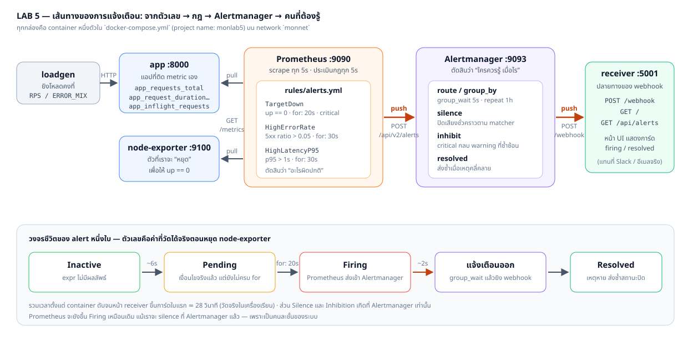
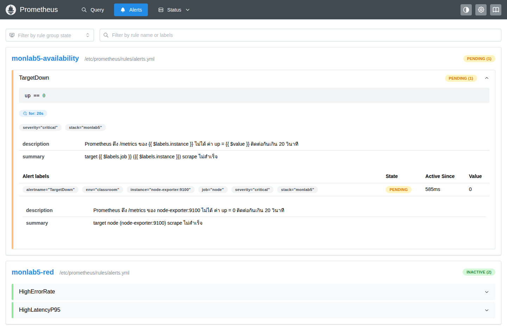
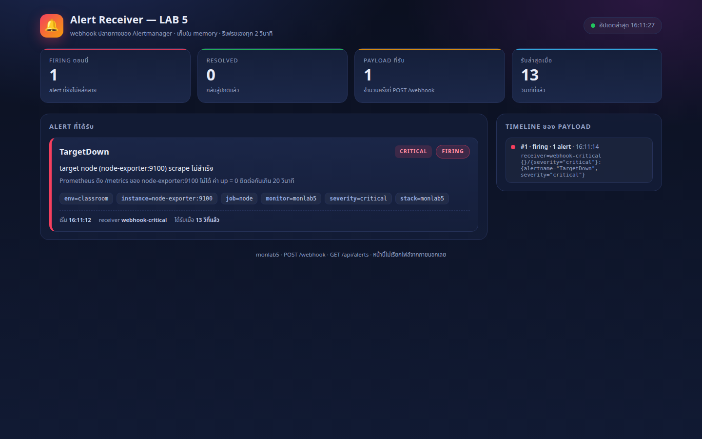
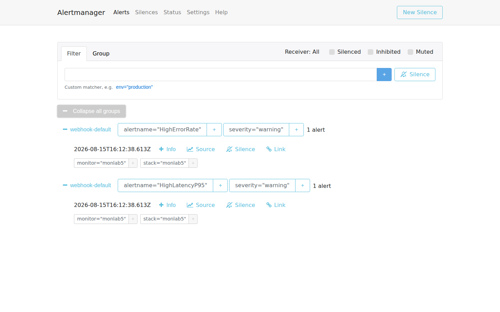
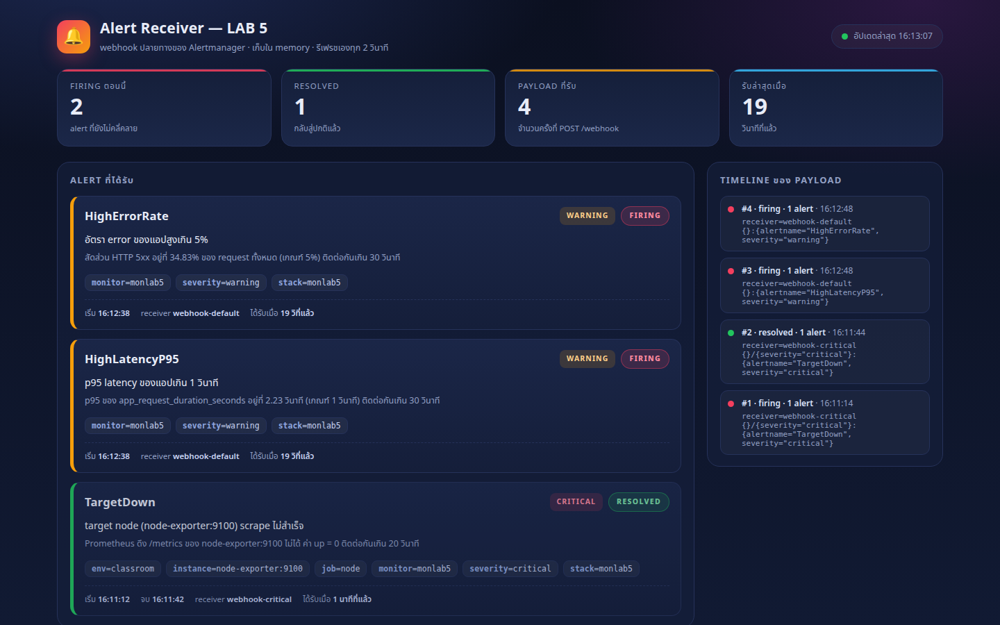
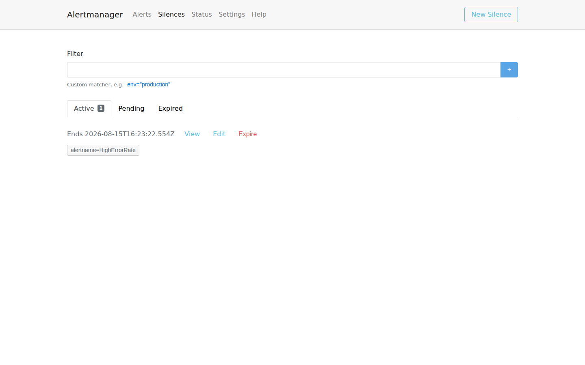
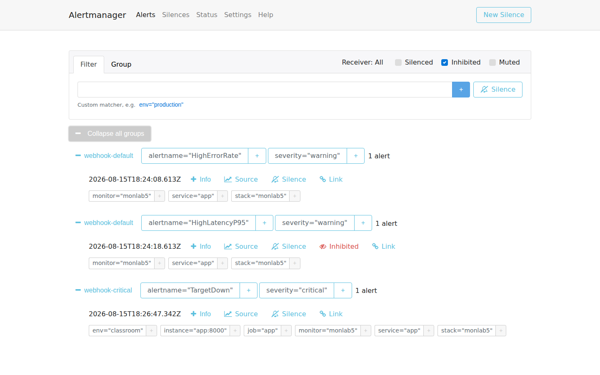
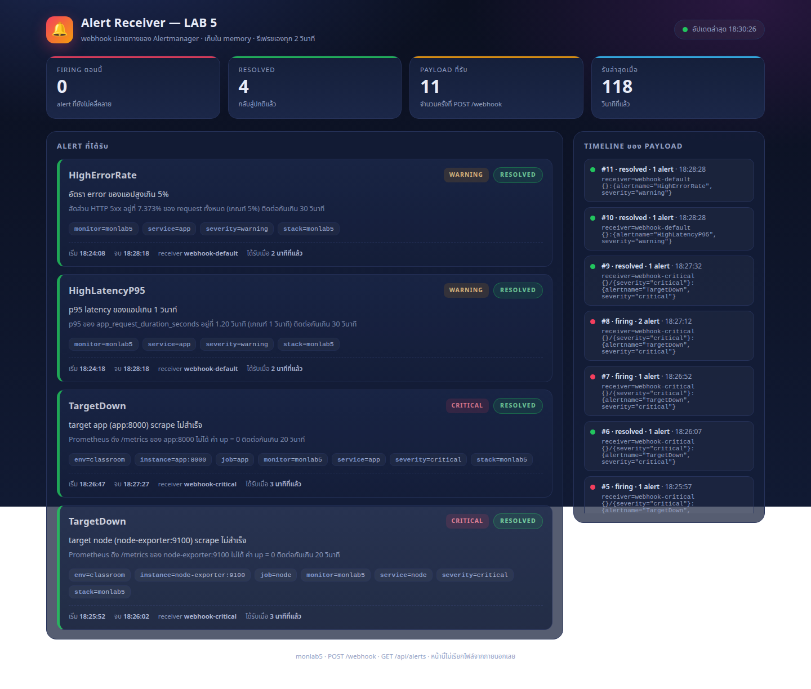

# LAB 5 — Alerting ด้วย Prometheus + Alertmanager: จากตัวเลขไปถึงคนที่ต้องรู้

> โฟลเดอร์ `005_LAB_Alerting_Alertmanager` = **LAB 5** ของชุด Monitoring
> (ไฟล์ของแล็บนี้: `docker-compose.yml` · `prometheus.yml` · `rules/alerts.yml` · `rules/alerts.broken.yml` ·
> `alertmanager/alertmanager.yml` · `alertmanager/alertmanager.broken.yml` ·
> `app/` · `loadgen/` · `receiver/` · `images/`)

## สิ่งที่จะได้เรียนรู้

- เขียน **alert rule** ของ Prometheus เป็น: `expr` (เงื่อนไข) + `for` (ต้องจริงนานแค่ไหน) + `labels` + `annotations`
- เห็นวงจรชีวิตของ alert ด้วยตาตัวเอง พร้อมจับเวลาจริง — และแยกให้ออกว่า **rule state ของ Prometheus มีแค่ 3 สถานะ: Inactive → Pending → Firing** ส่วน **Resolved ไม่ใช่สถานะที่ 4 ของ rule** แต่เป็นสิ่งที่ **Alertmanager** ส่งออกไปทาง webhook (`status: resolved`) เมื่อเงื่อนไขเลิกเป็นจริง ตอนนั้น rule ฝั่ง Prometheus กลับไปเป็น `inactive` เฉย ๆ
- ตรวจไฟล์กฎก่อนใช้งานด้วย `promtool check rules` และรู้ว่า reload พังแล้ว Prometheus ทำอะไรกับกฎชุดเดิม
- แยกให้ออกว่า **Prometheus ตัดสินว่า “อะไรผิดปกติ”** ส่วน **Alertmanager ตัดสินว่า “ใครควรรู้ เมื่อไร”**
- ตั้ง `route` / `group_by` / `group_wait` / `repeat_interval` และเห็นผลของการจัดกลุ่มในหน้า UI จริง
- ส่งแจ้งเตือน “ออกจากระบบ” จริงด้วย **webhook** ไปยัง receiver ที่มีหน้าเว็บของตัวเอง
- ใช้ **Silence** ปิดเสียงชั่วคราว และเข้าใจว่าทำไม Prometheus ยังขึ้น Firing อยู่
- ใช้ **Inhibition** ให้ alert ระดับ critical กลบ warning ที่ซ้ำซ้อน ลดเสียงรบกวน
- ไล่บั๊ก 2 แบบที่เจอบ่อยจริง: ไฟล์กฎ syntax พัง และ route ที่ไม่มีวันตรงกับ label ของ alert

## ภาพรวมของแล็บนี้

1. **เปิด stack ทั้งชุด** — แอปที่ติด metric เอง + loadgen + node-exporter + Prometheus + Alertmanager + receiver
2. **อ่านไฟล์กฎ** และตรวจด้วย `promtool check rules` ก่อนเชื่อว่ามันถูก
3. **หยุด node-exporter** แล้วนั่งดู `TargetDown` เดินจาก Inactive → Pending → Firing (จับเวลา)
4. **ตามรอย alert ต่อ** เข้าไปที่ Alertmanager แล้วออกเป็น webhook ถึงหน้า receiver
5. **เปิด node-exporter กลับ** เพื่อเห็น payload `resolved`
6. **กวนโหลดแอป** ให้ `HighErrorRate` และ `HighLatencyP95` ยิงพร้อมกัน แล้วดูการจัดกลุ่มของ Alertmanager
7. **Silence** ปิดเสียง `HighErrorRate` แล้วพิสูจน์ว่า Prometheus ยัง Firing อยู่
8. **Inhibition** สองรอบ — รอบแรกให้ node-exporter ล่ม (คนละ service → **ไม่กลบ**) รอบสองให้แอปเองล่ม (service เดียวกัน → **กลบ**)
9. **ทำให้พังแล้วแก้ 2 รอบ** — ไฟล์กฎพัง และ route ของ Alertmanager ไม่ตรง label
10. **ตรวจเกณฑ์ผ่านแล็บและเก็บกวาด**



> **คำถามก่อนเริ่ม:** ถ้าเราตั้งกฎว่า “target ล่มให้แจ้งเตือน” แล้วเน็ตกระตุกจน scrape พลาดไปหนึ่งครั้ง
> ระบบควรโทรปลุกคนกลางดึกทันทีเลยไหม? แล้วถ้าเซิร์ฟเวอร์ดับทั้งเครื่องจนทุก service เตือนพร้อมกัน 40 ใบ
> เราอยากได้ข้อความ 40 ฉบับหรือ 1 ฉบับ? แล็บนี้จะพาไปดูว่า `for`, `group_by` และ `inhibit_rules`
> คือคำตอบของสองคำถามนี้อย่างไร

แล็บนี้ใช้ terminal เดียว ทุกคำสั่งตั้งแต่ข้อ 1 เป็นต้นไปให้รัน **ข้างในเครื่องเรียน** ผ่าน VS Code Remote-SSH

---

## 0. เตรียมเครื่องเรียน

ทำบนเครื่องของเราเอง — เปิด classroom container ที่มี Docker พร้อมใช้ แล้ว SSH เข้าไป:

```bash
docker start devtools 2>/dev/null || \
  docker run -dit --name devtools --privileged -p 2222:22 tuchsanai/devtools:2569_1
ssh root@localhost -p 2222        # password : passwd
```

> 📝 **คำอธิบาย:** `docker start ... || docker run ...` ใช้เครื่องเรียนเดิมถ้ามี และสร้างใหม่เฉพาะเมื่อยังไม่มี · `-dit` รันเบื้องหลังพร้อม terminal · `--name devtools` ตั้งชื่อคงที่ · `--privileged` จำเป็นสำหรับรัน Docker ซ้อนข้างใน classroom container · `-p 2222:22` ส่ง port SSH จากเครื่องเราเข้า port 22 ของกล่อง · หลัง SSH แล้ว prompt จะเป็นฝั่งเครื่องเรียน ซึ่งเป็นที่รันคำสั่ง Docker ทั้งหมดของ LAB
>
> ⚠️ `--privileged` ให้สิทธิ์สูงมาก ใช้เฉพาะ disposable classroom container นี้ ห้ามนำรูปแบบนี้ไปใช้กับ production workload

ใน VS Code แนะนำให้ใช้ **Remote-SSH** ต่อ `root@localhost:2222` แล้วเปิดโฟลเดอร์ `~/labwork/DevTools` เพื่อแก้ไฟล์และเปิด terminal ในเครื่องเรียนโดยตรง

ตรวจว่า Docker CLI คุยกับ daemon ชั้นในได้:

```bash
docker --version
docker info --format 'Docker daemon: {{.ServerVersion}}'
```

> 📝 **คำอธิบาย:** บรรทัดแรกดูเวอร์ชัน CLI ส่วน `docker info` ถาม daemon จริง จึงแยกได้ระหว่าง “ติดตั้งคำสั่ง Docker แล้ว” กับ “daemon พร้อมรับคำสั่งแล้ว” · ถ้าพบ `Cannot connect to the Docker daemon` ให้รอสักครู่แล้วลองใหม่ หรือย้อนตรวจว่า SSH เข้ามาในเครื่องเรียนแล้ว

✅ **Expected output** — ต้องมีเลขเวอร์ชันครบสองบรรทัด (เลขเวอร์ชันและ build อาจเปลี่ยนตาม image ห้องเรียน):

```text
Docker version 29.6.2, build dfc4efb
Docker daemon: 29.6.2
```

> ⚠️ **แล็บชุด Monitoring ทุกตัวใช้ port ชุดเดียวกัน** (`9090` Prometheus, `9093` Alertmanager, `9100` node-exporter, `8000` แอป, `5001` receiver)
> ถ้าเพิ่งทำ LAB ก่อนหน้ามา ต้อง `docker compose down` ในโฟลเดอร์แล็บนั้นก่อน ไม่งั้นจะชนกันที่ port

---

## 1. Clone โค้ดแล็บ

```bash
mkdir -p ~/labwork && cd ~/labwork
git clone https://github.com/Tuchsanai/DevTools.git
cd DevTools/03_Application_Docker/03_Monitoring/005_LAB_Alerting_Alertmanager
```

> 📝 **คำอธิบาย:** `mkdir -p` สร้างพื้นที่ทำงานโดยไม่ error ถ้ามีอยู่แล้ว · `git clone` ดึงไฟล์ของหลักสูตร · `cd` เข้า LAB นี้ให้ถูกโฟลเดอร์ก่อนใช้ Compose · ถ้าเคย clone repository ไว้แล้ว ให้ข้าม `git clone` แล้ว `cd` เข้า path เดิมได้เลย

ดึง image ที่ pin เวอร์ชันไว้ แล้ว build image ของแอปเราเอง:

```bash
docker compose pull --ignore-buildable --quiet
docker compose build
```

> 📝 **คำอธิบาย:** แล็บนี้มี service สองแบบปนกัน — แบบที่ `pull` มาจาก registry (`prometheus`, `alertmanager`, `node-exporter`) กับแบบที่ `build` จาก Dockerfile ในโฟลเดอร์นี้ (`app`, `loadgen`, `receiver`) · `--ignore-buildable` บอก Compose ให้ข้าม service ที่ build เองไป ไม่งั้นจะได้ error `pull access denied for monlab5-app` เพราะ image ชื่อนั้นไม่มีอยู่บน Docker Hub · `--quiet` ลดรายละเอียดของขั้น download

✅ **Expected output** — สามตัวถูกข้าม สามตัวถูก pull (ถ้ามี image อยู่แล้วจะจบเร็วกว่านี้):

```text
 Image monlab5-receiver:1.0 Skipped Image can be built
 Image monlab5-app:1.0 Skipped Image can be built
 Image monlab5-loadgen:1.0 Skipped Image can be built
 Image prom/node-exporter:v1.10.2 Pulling
 Image prom/prometheus:v3.7.3 Pulling
 Image prom/alertmanager:v0.29.0 Pulling
 Image prom/node-exporter:v1.10.2 Pulled
 Image prom/alertmanager:v0.29.0 Pulled
 Image prom/prometheus:v3.7.3 Pulled
```

ส่วน `docker compose build` จะพิมพ์ log ของ BuildKit ยาวหลายสิบบรรทัด สิ่งที่ต้องเห็นคือสามบรรทัดสุดท้าย:

```text
 Image monlab5-loadgen:1.0 Built
 Image monlab5-receiver:1.0 Built
 Image monlab5-app:1.0 Built
```

---

## 2. เปิด Stack ทั้งชุดแล้วตรวจว่าครบ

```bash
docker compose up -d
ok=0
for i in $(seq 1 60); do
  curl -fsS http://localhost:9090/-/ready   >/dev/null 2>&1 && \
  curl -fsS http://localhost:9093/-/ready   >/dev/null 2>&1 && \
  curl -fsS http://localhost:5001/healthz   >/dev/null 2>&1 && \
  curl -fsS http://localhost:8000/healthz   >/dev/null 2>&1 && { ok=1; break; }
  sleep 1
done
[ "$ok" = 1 ] && echo "READY: stack พร้อมแล้ว (~${i}s)" \
              || echo "TIMEOUT: ยังมีบริการที่ไม่ตอบใน 60 วินาที — ดู 'docker compose ps' และ 'docker compose logs'"
```

> 📝 **คำอธิบาย:** `up -d` สร้าง network `monnet`, volume สองก้อน และ container หกตัว · readiness loop ถามทั้งสี่ endpoint พร้อมกัน เพราะขั้นถัดไปต้องใช้ทั้ง Prometheus, Alertmanager และ receiver · `curl -f` คืน exit code ไม่เป็นศูนย์เมื่อ HTTP ไม่ใช่ 2xx จึงใช้เป็นเงื่อนไขได้ · เพดาน 60 รอบกัน loop ค้างไม่รู้จบเมื่อระบบพังจริง
>
> ⚠️ **ตัวแปร `ok` ไม่ใช่ของประดับ** — `for` loop ที่ `break` เพราะสำเร็จ กับที่วนจนครบ 60 รอบเพราะล้มเหลว **จบเหมือนกันทุกประการ** ถ้าเขียนแค่ `echo "พร้อมแล้ว"` ต่อท้าย เราจะได้ข้อความว่าพร้อมทั้งที่ระบบยังไม่ขึ้น แล้วไปเจอ error แปลก ๆ ในข้อถัดไปโดยไม่รู้ว่าต้นเหตุอยู่ตรงนี้ · **readiness loop ทุกอันในแล็บนี้จึงแยก READY กับ TIMEOUT เสมอ**

✅ **Expected output** — Compose สร้างครบทุกอย่าง แล้วปิดท้ายด้วยบรรทัด `READY:` (ลำดับ container อาจสลับกัน · ตัวเลขวินาทีต่างกันได้):

```text
 Network monnet Creating
 Network monnet Created
 Volume monlab5_prom-data Creating
 Volume monlab5_prom-data Created
 Volume monlab5_am-data Creating
 Volume monlab5_am-data Created
 Container monlab5-app Creating
 Container monlab5-node-exporter Creating
 Container monlab5-receiver Creating
 Container monlab5-receiver Created
 Container monlab5-alertmanager Creating
 Container monlab5-node-exporter Created
 Container monlab5-app Created
 Container monlab5-loadgen Creating
 Container monlab5-alertmanager Created
 Container monlab5-prometheus Creating
 Container monlab5-loadgen Created
 Container monlab5-prometheus Created
 Container monlab5-node-exporter Starting
 Container monlab5-receiver Starting
 Container monlab5-app Starting
 Container monlab5-receiver Started
 Container monlab5-alertmanager Starting
 Container monlab5-app Started
 Container monlab5-loadgen Starting
 Container monlab5-node-exporter Started
 Container monlab5-alertmanager Started
 Container monlab5-prometheus Starting
 Container monlab5-loadgen Started
 Container monlab5-prometheus Started
READY: stack พร้อมแล้ว (~2s)
```

> ℹ️ **หมายเหตุเรื่องหน้าตาของผลลัพธ์:** เอกสารนี้เขียน output ของ Compose แบบบรรทัดล้วนเพื่อให้คัดลอกและเทียบง่าย
> แต่บน terminal จริงที่มี TTY Compose จะวาดเป็นตารางที่อัปเดตในที่พร้อมเครื่องหมาย `✔` เช่น
> `[+] Running 6/6` แล้วตามด้วย ` ✔ Container monlab5-prometheus  Started  0.4s` — เป็นข้อมูลชุดเดียวกัน คนละรูปแบบการแสดงผลเท่านั้น

ดูรายชื่อ container และ port:

```bash
docker compose ps
```

> 📝 **คำอธิบาย:** `name: monlab5` ที่บรรทัดบนสุดของ `docker-compose.yml` ทำให้ project ชื่อคงที่ · แต่ละ service ยังตั้ง `container_name:` เองอีกชั้น ชื่อจึงสั้นและเดาได้ เช่น `monlab5-prometheus` · สังเกตว่า `loadgen` ไม่มี port เพราะมันเป็นฝ่าย “ยิงออก” ไม่ต้องมีใครเรียกเข้า

✅ **Expected output** — หกแถว มี port เปิดห้าตัว (เวลาและ container id ต่างกันได้):

```text
NAME                    IMAGE                        COMMAND                  SERVICE         CREATED        STATUS                  PORTS
monlab5-alertmanager    prom/alertmanager:v0.29.0    "/bin/alertmanager -…"   alertmanager    1 second ago   Up Less than a second   0.0.0.0:9093->9093/tcp, [::]:9093->9093/tcp
monlab5-app             monlab5-app:1.0              "python app.py"          app             1 second ago   Up Less than a second   0.0.0.0:8000->8000/tcp, [::]:8000->8000/tcp
monlab5-loadgen         monlab5-loadgen:1.0          "python gen.py"          loadgen         1 second ago   Up Less than a second
monlab5-node-exporter   prom/node-exporter:v1.10.2   "/bin/node_exporter …"   node-exporter   1 second ago   Up Less than a second   0.0.0.0:9100->9100/tcp, [::]:9100->9100/tcp
monlab5-prometheus      prom/prometheus:v3.7.3       "/bin/prometheus --c…"   prometheus      1 second ago   Up Less than a second   0.0.0.0:9090->9090/tcp, [::]:9090->9090/tcp
monlab5-receiver        monlab5-receiver:1.0         "python receiver.py"     receiver        1 second ago   Up Less than a second   0.0.0.0:5001->5001/tcp, [::]:5001->5001/tcp
```

ตรวจว่า Prometheus scrape ครบทุก target:

```bash
curl -s http://localhost:9090/api/v1/targets | python3 -c 'import sys, json
for t in json.load(sys.stdin)["data"]["activeTargets"]:
    print(t["labels"]["job"], t["scrapeUrl"], t["health"])'
```

> 📝 **คำอธิบาย:** เราถาม API แทนการเปิดหน้าเว็บ เพราะขั้นนี้ต้องการ “ผลที่ตรวจซ้ำได้” ไม่ใช่ภาพ · `activeTargets` คือ target ที่ Prometheus กำลังตามอยู่จริง · ต้องได้ `up` ทั้งสี่ ถ้ามีตัวไหนเป็น `down` แปลว่า service นั้นยังไม่ขึ้น อย่าเพิ่งไปต่อ

✅ **Expected output** — สี่ job สถานะ `up` ทั้งหมด:

```text
alertmanager http://alertmanager:9093/metrics up
app http://app:8000/metrics up
node http://node-exporter:9100/metrics up
prometheus http://localhost:9090/metrics up
```

ดู metric ที่แอปของเราปล่อยออกมา (ชื่อชุดเดียวกับ LAB 4):

```bash
curl -s http://localhost:8000/metrics | grep -E "^app_(requests_total|inflight|request_duration_seconds_count)"
```

> 📝 **คำอธิบาย:** `app_requests_total` เป็น **Counter** มี label `method`/`endpoint`/`status` — กฎ `HighErrorRate` จะใช้ตัวนี้ · `app_request_duration_seconds` เป็น **Histogram** — กฎ `HighLatencyP95` จะใช้ `_bucket` ของมัน · `app_inflight_requests` เป็น **Gauge** ขึ้นลงตามงานที่ค้างอยู่ · ตอนนี้ยังไม่มีแถว `status="500"` เพราะ loadgen เริ่มต้นด้วยโหมด “ระบบสุขภาพดี”
>
> 📌 **สัญญาของ metric ชุดนี้ — ต้องตรงกับ LAB 4 เป๊ะ ๆ เพราะสองแล็บใช้ชื่อ metric ชุดเดียวกัน:**
> 1. นับ **ทุก request ที่เข้ามา ยกเว้น `/metrics`** — `/healthz` และ path ที่ไม่รู้จักก็นับด้วย (ในผลข้างล่างจึงเห็นแถว `/healthz` โผล่มาจาก readiness loop ในข้อ 2)
> 2. `app_request_duration_seconds` จับเวลาตั้งแต่ก่อนเริ่มงาน **จนเขียน response เสร็จ** ไม่ใช่แค่ส่วนที่เป็น business logic
> 3. `status` ที่บันทึก = status ที่ **ส่งกลับไปให้ client จริง ๆ** (ถ้าโค้ดพังกลางทาง แอปจะตอบ 500 ออกไปจริงก่อน แล้วค่อยนับเป็น 500)
>
> **ทำไมต้องเขียนสัญญานี้ไว้:** ชื่อ metric ที่เหมือนกันแต่ "ประชากร" กับ "ขอบเขตเวลา" ไม่เหมือนกัน คือกับดักที่ทำให้แดชบอร์ดรวมหลาย service เทียบกันไม่ได้เลย และไม่มีใครรู้ตัวเพราะกราฟยังขึ้นสวยอยู่
> ℹ️ หลายทีมใน production เลือก **ไม่นับ health check / probe** เข้า RED เพราะมันดัน "R" ให้สูงเกินจริงและเจือจาง error ratio — **ถูกทั้งสองแบบ ขอแค่ทุก service ในระบบใช้กติกาเดียวกันและเขียนบอกไว้**

✅ **Expected output** — ตัวเลขจะไม่ตรงกับของเราเพราะนับตั้งแต่แอปเริ่มทำงาน แต่หน้าตาต้องเป็นแบบนี้:

```text
app_requests_total{endpoint="/api/items",method="GET",status="200"} 90.0
app_requests_total{endpoint="/",method="GET",status="200"} 78.0
app_requests_total{endpoint="/healthz",method="GET",status="200"} 1.0
app_request_duration_seconds_count{endpoint="/api/items"} 90.0
app_request_duration_seconds_count{endpoint="/"} 78.0
app_request_duration_seconds_count{endpoint="/healthz"} 1.0
app_inflight_requests 0.0
```

> 📝 แถว `/healthz` มาจาก readiness loop ในข้อ 2 ที่เพิ่งยิงไป — ตรงกับข้อ 1 ของสัญญาด้านบน (นับทุกอย่างยกเว้น `/metrics`) · ถ้า readiness loop ของคุณวนหลายรอบกว่าจะผ่าน ตัวเลขนี้ก็จะมากกว่า 1

---

## 3. อ่านไฟล์กฎ แล้วตรวจก่อนเชื่อ

เปิด `rules/alerts.yml` ส่วนสำคัญเป็นแบบนี้:

```yaml
groups:
  - name: monlab5-availability
    interval: 5s
    rules:
      - alert: TargetDown
        expr: up == 0
        for: 20s
        labels:
          severity: critical
          stack: monlab5
          service: '{{ $labels.job }}'
        annotations:
          summary: 'target {{ $labels.job }} ({{ $labels.instance }}) scrape ไม่สำเร็จ'
          description: 'Prometheus ดึง /metrics ของ {{ $labels.instance }} ไม่ได้ ค่า up = {{ $value }} ติดต่อกันเกิน 20 วินาที'

  - name: monlab5-red
    interval: 5s
    rules:
      - alert: HighErrorRate
        expr: |
          sum(rate(app_requests_total{status=~"5[0-9]{2}"}[2m]))
            /
          sum(rate(app_requests_total[2m]))
            > 0.05
        for: 30s
        labels: { severity: warning, stack: monlab5, service: app }

      - alert: HighLatencyP95
        expr: |
          histogram_quantile(
            0.95,
            sum by (le) (rate(app_request_duration_seconds_bucket[2m]))
          ) > 1
        for: 30s
        labels: { severity: warning, stack: monlab5, service: app }
```

> 📝 **คำอธิบาย ทีละบรรทัด:**
> `groups` — ไฟล์กฎแบ่งเป็นกลุ่ม แต่ละกลุ่มถูกประเมิน “เรียงกันในกลุ่ม” และ `interval` คือความถี่ของกลุ่มนั้น
> `alert:` — ชื่อ alert จะกลายเป็น label `alertname` โดยอัตโนมัติ ใช้ทั้งใน routing และ silence
> `expr:` — เงื่อนไขเป็น PromQL ธรรมดา หลักคิดคือ **“มีผลลัพธ์ = เงื่อนไขเป็นจริง”** ไม่ใช่ true/false
> `up == 0` จึงคืน series เฉพาะ target ที่ล่ม ส่วน target ที่ปกติจะถูกกรองทิ้ง กลายเป็นไม่มีผลลัพธ์
> `for:` — หัวใจของการกัน false positive: เงื่อนไขต้องจริง **ติดต่อกัน** นานเท่านี้ก่อนถึงจะ Firing
> ระหว่างนั้นสถานะคือ Pending — เน็ตกระตุกครั้งเดียวจึงไม่ปลุกใคร
> `labels:` — เราแปะเอง ใช้เป็น “ที่อยู่” ให้ Alertmanager ตัดสินใจ · `severity` ใช้ route · `stack` + `service` ใช้จับคู่ inhibit
> **ค่าของ `labels` ใส่ template ได้เหมือน `annotations`** — `service: '{{ $labels.job }}'` ของ `TargetDown` จึงกลายเป็น
> `service="app"` หรือ `service="node"` ตามว่า target ตัวไหนล่ม · ส่วนกฎฝั่ง RED ปัก `service: app` ไว้ตรง ๆ เพราะมันวัดแอปอยู่แล้ว
> จะได้ผลอะไรจากการแยก `service` เดี๋ยวเห็นชัด ๆ ในข้อ 9
> `annotations:` — ข้อความสำหรับคนอ่าน ใช้ Go template ได้: `{{ $labels.x }}` คือ label ของ series ที่ยิง
> และ `{{ $value }}` คือค่าที่ทำให้เงื่อนไขเป็นจริง
>
> **ทำไม `[2m]`:** `rate()` ต้องมีอย่างน้อย 2 จุดในหน้าต่าง แล็บนี้ตั้ง `scrape_interval: 5s` หน้าต่าง 2 นาทีจึงมีถึง 24 จุด
> (กฎที่ปลอดภัยคือ window ≥ 4× scrape_interval — 30 วินาทีก็พอแล้ว แต่เราจงใจเลือกกว้างกว่านั้น)
> เหตุผลที่เลือกกว้าง: **หน้าต่างที่กว้างทำให้กฎยังคำนวณค่าได้อีกพักหนึ่งแม้แอปจะตายไปแล้ว** (ข้อมูลเก่ายังอยู่ในหน้าต่าง)
> — ข้อ 9 จะใช้ช่วงนั้นสาธิต inhibition ให้เห็นกับตา และเป็นตัวอย่างชัด ๆ ว่า “หน้าต่าง = ชุดข้อมูล ไม่ใช่เวลารอ”
> · ค่า default ของ Prometheus คือ scrape ทุก **1 นาที** ถ้าไม่แก้ alert จะไม่มีทางยิงทันในคาบเรียน แต่ใน production ค่า 15s–1m ต่างหากที่เหมาะสม

ตรวจไฟล์กฎด้วย `promtool` ซึ่งติดมากับ image ของ Prometheus อยู่แล้ว:

```bash
docker compose exec prometheus promtool check rules /etc/prometheus/rules/alerts.yml
```

> 📝 **คำอธิบาย:** `docker compose exec prometheus` สั่งงานข้างใน container ที่รันอยู่ · path ต้องเป็น path **ข้างใน container** เพราะ compose mount โฟลเดอร์แล็บไว้ที่ `/etc/prometheus` · `promtool` ตรวจทั้ง YAML, ชนิดของ field, หน่วยเวลา และ syntax ของ PromQL — ควรรันทุกครั้งก่อน commit ไฟล์กฎ ไม่ใช่รอให้ Prometheus บ่นเอง

✅ **Expected output** — สามกฎถูกอ่านได้ครบ:

```text
Checking /etc/prometheus/rules/alerts.yml
  SUCCESS: 3 rules found
```

ดูสถานะปัจจุบันของทั้งสามกฎ:

```bash
curl -s http://localhost:9090/api/v1/rules | python3 -c 'import sys, json
for g in json.load(sys.stdin)["data"]["groups"]:
    for r in g["rules"]:
        print(g["name"], "|", r["name"], "|", r["state"])'
```

> 📝 **คำอธิบาย:** `/api/v1/rules` คือข้อมูลชุดเดียวกับหน้า `/alerts` และ `/rules` บนเว็บ · `state` มีสามค่าเท่านั้น: `inactive`, `pending`, `firing` · ตอนนี้ระบบสุขภาพดีทุกอย่างจึงต้องเป็น `inactive` ครบ

✅ **Expected output**:

```text
monlab5-availability | TargetDown | inactive
monlab5-red | HighErrorRate | inactive
monlab5-red | HighLatencyP95 | inactive
```

### เปิดหน้าเว็บของแล็บนี้ด้วย VS Code Port Forwarding

หน้าเว็บทั้งหมดอยู่ “ข้างในเครื่องเรียน” เครื่องของเราเข้าตรง ๆ ไม่ได้ ต้อง forward port ก่อน:

1. เปิดแท็บ **PORTS** ข้าง TERMINAL
2. กด **Forward a Port** แล้วกรอกทีละตัว: `9090` (Prometheus) · `9093` (Alertmanager) · `5001` (receiver)
3. เปิด `http://localhost:9090/alerts`, `http://localhost:9093`, `http://localhost:5001`

ถ้าไม่ใช้ VS Code ให้เปิด terminal ใหม่บนเครื่องเราแล้วปล่อย session นี้ค้างไว้:

```bash
ssh -L 9090:localhost:9090 -L 9093:localhost:9093 -L 5001:localhost:5001 root@localhost -p 2222
```

> 📝 **คำอธิบาย:** `-L <port เครื่องเรา>:localhost:<port เครื่องเรียน>` สร้าง tunnel หนึ่งเส้นต่อหนึ่ง port · `localhost` ในคำสั่งนี้หมายถึง “localhost ฝั่งเครื่องเรียน” ไม่ใช่เครื่องเรา · `-p 2222` คือ port ของ SSH ไม่เกี่ยวกับ port ที่ forward · ปิด session เมื่อจบเพื่อคืน port

---

## 4. วงจรชีวิตของ alert: Inactive → Pending → Firing

เปิดหน้า `http://localhost:9090/alerts` ค้างไว้ก่อน แล้วค่อยสั่งให้ระบบพัง:

```bash
docker compose stop node-exporter
```

> 📝 **คำอธิบาย:** ใช้ `stop` ไม่ใช่ `down` เพราะเราต้องการให้ container ตัวอื่นทำงานต่อ และเดี๋ยวจะ `start` กลับมาเพื่อดู resolved · เมื่อ node-exporter ตาย Prometheus จะ scrape ไม่สำเร็จ ค่า `up{job="node"}` จะกลายเป็น `0` ทันทีที่ scrape รอบถัดไปมาถึง (ภายใน 5 วินาที) · เงื่อนไข `up == 0` จึงเริ่มเป็นจริง

✅ **Expected output**:

```text
 Container monlab5-node-exporter Stopping
 Container monlab5-node-exporter Stopped
```

ระหว่างนี้ให้กด refresh หน้า `/alerts` เรื่อย ๆ แล้วสังเกตป้ายสถานะ ผลที่วัดได้จริงในเครื่องเรียนเป็นแบบนี้
(ตัวเลขคือวินาทีนับจากคำสั่ง `stop` เสร็จ — รอบของคุณอาจต่างได้ 1–5 วินาทีตามจังหวะ scrape):

```text
   0.5s  docker compose stop node-exporter เสร็จ
   6.0s  TargetDown -> pending
  26.3s  TargetDown -> firing
  28.3s  receiver ได้ payload ใบแรก
```

> 📝 **ตัวเลขชุดนี้มาจากไหน — ไล่เป็น "ลำดับเหตุการณ์" ไม่ใช่ "สูตรบวกเลข":**
>
> 1. **รอ scrape รอบถัดไป** — `up` ยังเป็น `1` อยู่จนกว่า Prometheus จะพยายามขูดแล้วล้มเหลว · แล็บนี้ `scrape_interval: 5s` จึงรอไม่เกิน 5 วินาที
> 2. **รอ evaluation tick ถัดไป** — Prometheus ไม่ได้ประเมินกฎทันทีที่ได้ข้อมูลใหม่ แต่ประเมินตามนาฬิกาของ rule group (`interval: 5s`) · **tick แรกที่ `expr` คืนผลออกมา = เข้าสถานะ Pending** และเริ่มเดินนาฬิกา `Active Since` → นี่คือ 6.0s
> 3. **Firing เกิดที่ evaluation tick แรกที่นาฬิกานั้นเดินครบ `for: 20s`** — ไม่ใช่ตอนครบ 20 วินาทีเป๊ะ แต่เป็น tick ถัดจากนั้น → 26.3s
> 4. **`group_wait` ของ Alertmanager** (2 วินาทีสำหรับสาย critical ในแล็บนี้) ค่อยบวกเข้ามาก่อน webhook จะออก → 28.3s
>
> ⚠️ **สังเกตว่าไม่มีท่อน "หน้าต่างของ `rate()`" อยู่ในลิสต์นี้เลย** เพราะ `TargetDown` ใช้ `expr: up == 0` ซึ่งไม่มี range vector · เดี๋ยวในข้อ 7 จะเจอกฎที่มีหน้าต่าง `[2m]` แล้วเราจะเห็นว่า **หน้าต่างไม่ใช่ "เวลาที่ต้องรอ" แต่เป็น "ชุดข้อมูลที่ใช้คำนวณในแต่ละ tick"** — เป็นคนละเรื่องกัน

**ช่วง Pending** — เงื่อนไขเป็นจริงแล้ว แต่ยังไม่ครบ `for: 20s` ป้ายจะเป็นสีเหลือง และคอลัมน์ `Active Since`
จะเดินขึ้นเรื่อย ๆ



> 📝 **คำอธิบาย:** กดที่ชื่อ `TargetDown` เพื่อกางรายละเอียด จะเห็นครบทั้ง `expr` (`up == 0`), ป้าย `for: 20s`,
> label ที่เราแปะไว้ (`severity="critical"`, `stack="monlab5"`) · ด้านบนเป็น annotations **แบบ template ดิบ**
> ส่วนด้านล่างใต้ตาราง Alert labels เป็น annotations **ที่ render แล้ว** — `{{ $labels.instance }}` กลายเป็น
> `node-exporter:9100` และ `{{ $value }}` กลายเป็น `0` จริง ๆ · คอลัมน์ `Value` คือค่าที่ทำให้เงื่อนไขเป็นจริง
> (ค่า `up` = 0) · กลุ่ม `monlab5-red` ยังเป็น `INACTIVE (2)` เพราะแอปยังปกติดี

**ช่วง Firing** — พอครบ 20 วินาที ป้ายเปลี่ยนเป็นสีแดง และนี่คือจังหวะที่ Prometheus เริ่มยิง alert ไปหา Alertmanager


> 📝 **คำอธิบาย:** สังเกตว่า `Active Since` เดินจาก 5.427s (ตอน Pending) มาเป็น 25.661s (ตอน Firing) — คือนาฬิกาเดิม
> ไม่ได้รีเซ็ต แปลว่า Prometheus นับเวลา “ตั้งแต่เงื่อนไขเริ่มเป็นจริง” ไม่ใช่ “ตั้งแต่ Firing” · **ถ้าเงื่อนไขหลุดเป็นเท็จ
> ระหว่าง Pending นาฬิกาจะรีเซ็ตและกลับเป็น Inactive ทันที** นี่คือกลไกกัน alert หลอน

ยืนยันด้วย API ว่าเปลี่ยนสถานะจริง:

```bash
curl -s http://localhost:9090/api/v1/rules | python3 -c 'import sys, json
for g in json.load(sys.stdin)["data"]["groups"]:
    for r in g["rules"]:
        print(r["name"], "|", r["state"])'
```

✅ **Expected output**:

```text
TargetDown | firing
HighErrorRate | inactive
HighLatencyP95 | inactive
```

---

## 5. ตามรอย Alert ต่อ: Prometheus → Alertmanager → Webhook

`prometheus.yml` มีบล็อกนี้ที่ทำให้ alert เดินทางต่อได้:

```yaml
alerting:
  alertmanagers:
    - static_configs:
        - targets:
            - alertmanager:9093
```

> 📝 **คำอธิบาย:** จุดนี้คือรอยต่อของสองระบบ — Prometheus **push** alert ที่ firing ไปยัง Alertmanager
> ผ่าน `POST /api/v2/alerts` (ตรงข้ามกับตอน scrape metric ที่มันเป็นฝ่าย **pull**) · Prometheus 3 รองรับเฉพาะ API v2
> ถ้าไปเจอตัวอย่างเก่าที่ใส่ `api_version: v1` ให้ลบทิ้ง · ปลายทางเขียนเป็นชื่อ service `alertmanager` ได้
> เพราะทั้งคู่อยู่ network `monnet` เดียวกัน จึงใช้ DNS ภายในของ Docker

ส่วน `alertmanager/alertmanager.yml` คือกฎว่า “ใครควรรู้ เมื่อไร”:

```yaml
route:
  receiver: webhook-default
  group_by: ["alertname", "severity"]
  group_wait: 5s
  group_interval: 10s
  repeat_interval: 1h
  routes:
    - matchers:
        - severity = "critical"
      receiver: webhook-critical
      group_wait: 2s

receivers:
  - name: webhook-default
    webhook_configs:
      - url: http://receiver:5001/webhook
        send_resolved: true
  - name: webhook-critical
    webhook_configs:
      - url: http://receiver:5001/webhook
        send_resolved: true
```

> 📝 **คำอธิบาย ทีละ field:**
> `route` ตัวนอกสุดคือ **route ราก** ทุก alert ต้องผ่านตรงนี้เสมอ และมันจะ “ตกลงมา” หา route ลูกที่ matcher ตรงก่อน
> `group_by` — alert ที่มี label เหล่านี้เหมือนกันจะถูกมัดเป็นก้อนเดียว ส่งเป็นข้อความฉบับเดียว
> ถ้าเซิร์ฟเวอร์ดับพร้อมกัน 40 target แล้ว `group_by: ["alertname"]` จะได้ข้อความ 1 ฉบับที่มี 40 รายการ ไม่ใช่ 40 ฉบับ
> `group_wait` — เจอก้อนใหม่แล้วรออีกนิดเผื่อเพื่อนตามมา จะได้ส่งทีเดียว · ห้องเรียนใช้ 5s (critical 2s) ให้เห็นผลไว
> แต่ **ค่า default คือ 30s และ production มักใช้ 30s ขึ้นไป** เพราะการรอ 30 วินาทีแลกกับข้อความที่ครบถ้วนกว่านั้นคุ้ม
> `group_interval` — ก้อนเดิมมีสมาชิกเปลี่ยน จะรออย่างน้อยเท่านี้ก่อนส่งอัปเดต (default 5m)
> `repeat_interval` — ก้อนเดิมไม่มีอะไรเปลี่ยนเลย จะเตือนซ้ำทุก ๆ เท่านี้ กันคนลืม
> `send_resolved: true` — **ถ้าไม่เปิด จะไม่มีทางเห็นข้อความ “กลับสู่ปกติแล้ว”** ซึ่งสำคัญพอ ๆ กับตอนเตือน
> `url` ต้องเป็นชื่อ service ภายใน (`http://receiver:5001/webhook`) ห้ามใช้ `localhost` หรือ URL ที่ port-forward มา
> เพราะ Alertmanager ยิงจากข้างใน container ของตัวเอง

ดูว่า Alertmanager รับ alert ใบนี้แล้ว:

```bash
docker compose exec alertmanager amtool --alertmanager.url=http://localhost:9093 alert
```

> 📝 **คำอธิบาย:** `amtool` เป็น CLI ที่ติดมากับ image ของ Alertmanager · ต้องใส่ `--alertmanager.url` เพราะ default ของมันคือ `http://localhost:9093` ที่มองจากเครื่องที่รัน amtool — ในที่นี้เรารันข้างใน container ของ Alertmanager เองจึงตรงกันพอดี แต่การใส่ให้ชัดช่วยไม่ให้งงเวลาย้ายไปรันที่อื่น · `State: active` แปลว่า alert นี้ยังมีชีวิตและ **ไม่ได้ถูก silence หรือ inhibit**

✅ **Expected output** — เวลาและข้อความจะตรงกับ annotations ที่เราเขียนไว้:

```text
Alertname   Starts At                Summary                                            State
TargetDown  2026-08-15 16:11:12 UTC  target node (node-exporter:9100) scrape ไม่สำเร็จ  active
```

ดูฝั่งปลายทางว่าได้รับ webhook จริง:

```bash
docker compose logs receiver | tail -2
curl -s http://localhost:5001/api/alerts | python3 -c 'import sys, json
d = json.load(sys.stdin)
print("payloads_received =", d["payloads_received"], "| firing =", d["firing"], "| resolved =", d["resolved"])
for a in d["alerts"]:
    print(a["status"], a["labels"]["alertname"], "->", a["receiver"])
    print("  summary:", a["annotations"]["summary"])'
```

> 📝 **คำอธิบาย:** receiver เก็บ payload ไว้ในหน่วยความจำแล้วเปิดให้อ่านสองทาง — หน้าเว็บสำหรับคน และ `/api/alerts` สำหรับสคริปต์ตรวจ · field `receiver` ในผลลัพธ์คือ **ชื่อ receiver ที่ Alertmanager เลือก** ซึ่งต้องเป็น `webhook-critical` ไม่ใช่ `webhook-default` — นี่คือหลักฐานว่า route ลูกที่ match `severity = "critical"` ทำงานจริง

✅ **Expected output**:

```text
monlab5-receiver  | [receiver] listening on :5001
monlab5-receiver  | [receiver] status=firing receiver=webhook-critical alerts=1 [TargetDown]
payloads_received = 1 | firing = 1 | resolved = 0
firing TargetDown -> webhook-critical
  summary: target node (node-exporter:9100) scrape ไม่สำเร็จ
```

เปิด `http://localhost:5001` จะเห็นการ์ดใบแรก:



> 📝 **คำอธิบาย:** การ์ดใช้แถบสีซ้ายและป้าย `CRITICAL` ตาม label `severity` ที่เราแปะในไฟล์กฎ — ไม่ใช่สิ่งที่ Alertmanager คิดเอง · ช่อง label แสดง label ทั้งหมดที่ติดมากับ alert รวม `monitor=monlab5` ซึ่งมาจาก `external_labels` ใน `prometheus.yml` (บอกว่า alert นี้มาจาก Prometheus ตัวไหน — สำคัญมากเมื่อมีหลายตัวส่งเข้า Alertmanager เดียวกัน) · แผง Timeline ทางขวาเก็บทุก payload พร้อม `groupKey` ให้เห็นว่า Alertmanager มัดก้อนตาม `alertname` + `severity` จริง

---

## 6. Resolved — แจ้งเตือนต้องบอกด้วยว่า “หายแล้ว”

```bash
docker compose start node-exporter
```

> 📝 **คำอธิบาย:** พอ node-exporter กลับมา scrape รอบถัดไปจะสำเร็จ `up` กลับเป็น 1 เงื่อนไข `up == 0` จึงไม่มีผลลัพธ์ · Prometheus จะส่ง alert ใบเดิมไปที่ Alertmanager อีกครั้งโดยใส่ `endsAt` เป็นเวลาปัจจุบัน · Alertmanager เห็น `endsAt` แล้วจึงยิง webhook รอบใหม่ที่ `status: resolved` (ทำได้เพราะเราเปิด `send_resolved: true`)

ผลที่วัดได้จริง (นับจากคำสั่ง `start` เสร็จ):

```text
   0.4s  start node-exporter เสร็จ
   6.5s  TargetDown -> inactive
   8.5s  receiver ได้ resolved (payloads=2 firing=0 resolved=1)
```

> 📝 **สังเกต:** ตอน resolved ใช้เวลาสั้นกว่าตอน firing มาก เพราะ **`for` ใช้กับขาขึ้นเท่านั้น** ไม่มี “for สำหรับขาลง”
> พอเงื่อนไขหยุดเป็นจริง Prometheus ก็เลิก firing ทันทีในรอบประเมินถัดไป

---

## 7. ทำให้ RED เตือน: HighErrorRate + HighLatencyP95 พร้อมกัน

`docker-compose.yml` เขียน env ของ loadgen ให้แทนที่จากภายนอกได้:

```yaml
  loadgen:
    environment:
      RPS: "${RPS:-8}"
      ERROR_MIX: "${ERROR_MIX:-0}"
      SLOW_MIX: "${SLOW_MIX:-0}"
```

> 📝 **คำอธิบาย:** `${ERROR_MIX:-0}` คือ variable substitution ของ Compose — ถ้า shell ไม่ได้ตั้งค่าไว้ให้ใช้ `0` · ค่าเริ่มต้นจึงเป็น “ระบบสุขภาพดี” และเราเปลี่ยนโหมดได้โดยไม่ต้องแก้ไฟล์ · loadgen เลือกปลายทางจากตารางรอบละ 100 ครั้งที่สับด้วย seed คงที่ ไม่ใช่สุ่มทีละครั้ง สัดส่วน error ที่ Prometheus เห็นจึงตรงกับ `ERROR_MIX` แทบเป๊ะ ทำให้ alert ยิงตรงเวลาทุกครั้ง

สั่งให้แอปเริ่มพัง:

```bash
ERROR_MIX=0.35 SLOW_MIX=0.40 docker compose up -d loadgen
```

> 📝 **คำอธิบาย:** ใส่ตัวแปรไว้หน้าคำสั่ง = ตั้ง env เฉพาะคำสั่งนี้ · Compose เห็นว่า config ของ `loadgen` เปลี่ยนจึง recreate เฉพาะตัวมัน service อื่นยัง Running · `ERROR_MIX=0.35` = 35% ของ request วิ่งไป `/api/error` ซึ่งตอบ 500 (`ERROR_RATE=1.0`) → error ratio ≈ 0.35 ซึ่งเกินเกณฑ์ 0.05 อยู่หลายเท่า · `SLOW_MIX=0.40` = 40% วิ่งไป `/api/slow` ที่หน่วง 0.6–2.0 วินาที ดัน p95 ให้ทะลุ 1 วินาที

✅ **Expected output**:

```text
 Container monlab5-app Running
 Container monlab5-loadgen Recreate
 Container monlab5-loadgen Recreated
 Container monlab5-loadgen Starting
 Container monlab5-loadgen Started
```

ผลที่วัดได้จริง (นับจากคำสั่ง `up -d loadgen` เสร็จ):

```text
+24s  HighErrorRate  -> pending
+35s  HighLatencyP95 -> pending
+54s  HighErrorRate  -> firing
+59s  receiver ได้ payload ใบแรก (HighErrorRate)
+64s  HighLatencyP95 -> firing
+70s  receiver ได้ครบทั้งสองใบ (payloads=4 firing=2 resolved=1)
```

> ℹ️ ตัวเลขชุดนี้ **แกว่งได้หลายวินาที** ในแต่ละรอบ เพราะขึ้นกับว่าตอนสั่ง loadgen นั้นหน้าต่าง `[2m]` มีข้อมูล “ช่วงสุขภาพดี” ค้างอยู่มากแค่ไหน · สิ่งที่ต้องเห็นเหมือนกันทุกรอบคือ **ลำดับ** ไม่ใช่ตัวเลขเป๊ะ ๆ: pending มาก่อน → firing ตามมาห่างกันราว ๆ `for: 30s` → payload ถึง receiver ทีหลังอีกไม่กี่วินาทีตาม `group_wait`
>
> 📝 **ทำไม Pending ถึงเกิดที่ราว 20-30 วินาที ไม่ใช่ทันที:** ไม่ใช่เพราะ “ต้องรอให้หน้าต่าง `[2m]` เต็มก่อน” —
> `rate()` คำนวณได้ตั้งแต่มี sample 2 จุด (≈10 วินาทีที่ scrape 5s) · **เหตุผลจริงคือค่าที่คำนวณได้ยังไม่ข้าม threshold ต่างหาก**
> หน้าต่าง 2 นาทีที่ใช้คำนวณยังมีข้อมูลช่วง “สุขภาพดี” (error = 0) ปนอยู่เต็มไปหมด สัดส่วนที่ได้จึงถูกเจือจาง
> แล้วค่อย ๆ ไต่ขึ้นเมื่อข้อมูลเก่าเลื่อนพ้นหน้าต่างไป จน evaluation tick หนึ่งมันข้าม `0.05` → **tick นั้นคือจุดที่เข้า Pending**
> จากนั้นต้องเป็นจริงต่อเนื่องจนถึง tick แรกที่ครบ `for: 30s` ถึงจะ Firing
>
> **สรุปให้ถูก:** range window **ไม่ใช่ท่อนเวลาที่บวกเข้าไปตรง ๆ** แต่มันทำให้ threshold ถูกข้าม **ช้าลง** ได้
> เพราะแต่ละ tick เอาข้อมูลเก่ามาเฉลี่ยรวมด้วย · ยิ่งหน้าต่างกว้าง ค่ายิ่งนิ่งแต่ยิ่งรู้ช้า — นี่คือ trade-off ที่ต้องเลือกเอง

ตรวจตัวเลขที่ทำให้กฎเป็นจริง ด้วย PromQL ชุดเดียวกับใน `expr`:

```bash
curl -sG http://localhost:9090/api/v1/query \
  --data-urlencode 'query=sum(rate(app_requests_total{status=~"5[0-9]{2}"}[2m])) / sum(rate(app_requests_total[2m]))' \
  | python3 -c 'import sys, json; print("error ratio =", json.load(sys.stdin)["data"]["result"][0]["value"][1])'

curl -sG http://localhost:9090/api/v1/query \
  --data-urlencode 'query=histogram_quantile(0.95, sum by (le) (rate(app_request_duration_seconds_bucket[2m])))' \
  | python3 -c 'import sys, json; print("p95 =", json.load(sys.stdin)["data"]["result"][0]["value"][1])'
```

> 📝 **คำอธิบาย:** `-G` + `--data-urlencode` ทำให้ curl ประกอบ query string ให้เอง ไม่ต้อง encode `{`, `}`, `~` ด้วยมือ · `/api/v1/query` คือ instant query ให้ค่าจุดเดียว ณ ตอนนี้ · ค่าที่ได้ต้องสอดคล้องกับ `ERROR_MIX` และช่วงหน่วงของ `/api/slow`

✅ **Expected output** — ตัวเลขทศนิยมจะไม่ตรงเป๊ะ แต่ต้องอยู่ระดับเดียวกัน:

```text
error ratio = 0.33292831287184416
p95 = 2.2020007113649753
```

เปิด `http://localhost:9093` ดูฝั่ง Alertmanager แล้วกด **Expand all groups**:



> 📝 **คำอธิบาย:** เห็นเป็น **สองก้อน** ไม่ใช่สองแถวปน ๆ กัน เพราะ `group_by: ["alertname","severity"]` แยกตาม `alertname` · ชื่อสีฟ้าทางซ้าย (`webhook-default`) คือ receiver ที่ก้อนนั้นจะถูกส่งไป — ต่างจาก TargetDown ที่ไปเข้า `webhook-critical` · ปุ่ม `Silence` ข้างแต่ละ alert คือทางลัดสร้าง silence จาก label ของใบนั้น · ปุ่ม `Source` ลิงก์กลับไปหา query ต้นทางใน Prometheus

เปิด `http://localhost:5001` จะเห็นการ์ดหลายใบพร้อมกัน:



> 📝 **คำอธิบาย:** ตัวนับด้านบนอ่านง่ายที่สุด — firing 2 ใบ, resolved 1 ใบ, รับ payload มาแล้ว 4 ครั้ง · การ์ด `TargetDown` เป็นสีเขียวพร้อมป้าย `RESOLVED` และมีเวลา “จบ” เพิ่มมา ขณะที่สองใบบนยังเป็นสีเหลือง/แดง · ข้อความในการ์ดมาจาก `annotations` ที่ render แล้ว จึงมีตัวเลขจริงอยู่ในประโยค (`34.83%`, `2.23 วินาที`) ซึ่งเป็นเหตุผลที่ควรใส่ `{{ $value }}` ในทุก alert ที่เป็นตัวเลข

---

## 8. Silence — ปิดเสียง แต่ไม่ได้แปลว่าปัญหาหาย

```bash
docker compose exec alertmanager amtool --alertmanager.url=http://localhost:9093 \
  silence add alertname=HighErrorRate --duration=10m --author=instructor \
  --comment="ปิดเสียงระหว่างซ้อมในคาบเรียน"
```

> 📝 **คำอธิบาย:** `silence add` รับ matcher ในรูป `label=value` (ใส่หลายตัวได้ และใช้ `label=~regex` ก็ได้) · `--duration` บังคับให้ silence หมดอายุเอง เป็นนิสัยที่ดีมาก — silence ที่ไม่มีวันหมดอายุคือวิธีทำให้ระบบเงียบถาวรโดยไม่มีใครรู้ · `--author` / `--comment` ไม่ใช่ของประดับ: เวลามีคนมาถามทีหลังว่า “ทำไมไม่มีใครเตือน” สองช่องนี้คือคำตอบ · คำสั่งคืนค่า **silence ID** มาให้เก็บไว้ยกเลิก

✅ **Expected output** — UUID หนึ่งบรรทัด (ของคุณจะเป็นคนละค่า):

```text
6e6b254f-d02b-40a5-ad6a-8a62e0e958f7
```

ดูรายการ silence และผลของมัน:

```bash
docker compose exec alertmanager amtool --alertmanager.url=http://localhost:9093 silence query
docker compose exec alertmanager amtool --alertmanager.url=http://localhost:9093 alert
docker compose exec alertmanager amtool --alertmanager.url=http://localhost:9093 alert --silenced
```

> 📝 **คำอธิบาย:** `amtool alert` เฉย ๆ แสดงเฉพาะ alert ที่ยัง “ส่งเสียง” ได้ · ต้องเติม `--silenced` ถึงจะเห็นใบที่ถูกปิดเสียง และสถานะจะเป็น `suppressed` ไม่ใช่ `active` · จุดที่ต้องเข้าใจคือ alert ใบนั้น **ยังอยู่ในระบบครบถ้วน** แค่ไม่ถูกส่งออกเท่านั้น

✅ **Expected output**:

```text
ID                                    Matchers                   Ends At                  Created By  Comment
6e6b254f-d02b-40a5-ad6a-8a62e0e958f7  alertname="HighErrorRate"  2026-08-15 16:23:22 UTC  instructor  ปิดเสียงระหว่างซ้อมในคาบเรียน

Alertname       Starts At                Summary                          State
HighLatencyP95  2026-08-15 16:12:38 UTC  p95 latency ของแอปเกิน 1 วินาที  active

Alertname      Starts At                Summary                       State
HighErrorRate  2026-08-15 16:12:38 UTC  อัตรา error ของแอปสูงเกิน 5%  suppressed
```

เปิด `http://localhost:9093/#/silences`:



> 📝 **คำอธิบาย:** แท็บแบ่งเป็น Active / Pending / Expired · Pending คือ silence ที่ตั้งเวลาเริ่มไว้ในอนาคต (ใช้ตอนวางแผน maintenance ล่วงหน้า) · ปุ่ม **Expire** คือการยกเลิกก่อนกำหนด · ปุ่ม **New Silence** บนมุมขวาบนสร้างจาก UI ได้เหมือนกัน

**ทีนี้คือประเด็นสำคัญที่สุดของหัวข้อนี้** — กลับไปดู Prometheus:

```bash
curl -s http://localhost:9090/api/v1/rules | python3 -c 'import sys, json
for g in json.load(sys.stdin)["data"]["groups"]:
    for r in g["rules"]:
        print(r["name"], "|", r["state"])'
```

✅ **Expected output** — `HighErrorRate` **ยัง firing อยู่เหมือนเดิม**:

```text
TargetDown | inactive
HighErrorRate | firing
HighLatencyP95 | firing
```

> **บทเรียน:** Silence อยู่ที่ **Alertmanager** ไม่ใช่ Prometheus · Prometheus ไม่รู้จักคำว่า silence เลย
> มันมีหน้าที่เดียวคือบอกว่าเงื่อนไขเป็นจริงหรือไม่ · ดังนั้นการ silence = “ปิดเสียงกริ่ง” ไม่ใช่ “ซ่อมบ้าน”
> ถ้าเข้าใจผิดข้อนี้ จะกลายเป็นทีมที่ silence ทุกอย่างแล้วนึกว่าระบบสุขภาพดี

ยกเลิก silence ก่อนไปข้อถัดไป:

```bash
SID=$(docker compose exec -T alertmanager amtool --alertmanager.url=http://localhost:9093 silence query -q | tr -d '\r')
echo "silence id = $SID"
docker compose exec alertmanager amtool --alertmanager.url=http://localhost:9093 silence expire "$SID"
docker compose exec alertmanager amtool --alertmanager.url=http://localhost:9093 silence query
```

> 📝 **คำอธิบาย:** `-q` ให้ amtool พิมพ์เฉพาะ ID เพื่อเอาไปใส่ตัวแปรได้ · `-T` ของ `compose exec` ปิด TTY ไม่ให้มีอักขระควบคุมปนมา และ `tr -d '\r'` ตัด carriage return ทิ้ง · `silence expire` ทำให้ silence หมดอายุทันที · การ query ซ้ำแล้วเหลือแต่หัวตารางคือหลักฐานว่ายกเลิกสำเร็จ

✅ **Expected output**:

```text
silence id = 6e6b254f-d02b-40a5-ad6a-8a62e0e958f7
ID  Matchers  Ends At  Created By  Comment
```

---

## 9. Inhibition — ให้เหตุใหญ่กลบเหตุเล็ก “ของตัวเอง”

ท้ายไฟล์ `alertmanager/alertmanager.yml` มีบล็อกนี้:

```yaml
inhibit_rules:
  - source_matchers:
      - alertname = "TargetDown"
      - severity = "critical"
    target_matchers:
      - alertname = "HighLatencyP95"
    equal: ["stack", "service"]
```

> 📝 **คำอธิบาย:** `source_matchers` = ใบที่ “มีอำนาจกลบ” · `target_matchers` = ใบที่ “ถูกกลบ” · `equal` = รายชื่อ label ที่ทั้งสองใบต้องมีค่า **เท่ากัน** ถึงจะกลบกันได้
>
> **เหตุผลที่กลบแล้วสมเหตุสมผล:** ถ้าแอปตายจน Prometheus ขูด `/metrics` ไม่ได้แล้ว ค่า p95 ที่กฎยังคำนวณออกมาได้ก็มาจาก **ข้อมูลเก่าที่ค้างอยู่ในหน้าต่าง `[2m]`** ล้วน ๆ · ส่งใบ “แอปช้า” ตามไปอีกใบจึงไม่ได้เพิ่มข้อมูลอะไรให้คนรับสาย เพราะ “แอปตาย” ครอบเรื่อง “แอปช้า” อยู่แล้ว
>
> ⚠️ **`equal` คือจุดที่พลาดกันบ่อยที่สุด และพลาดแล้วอันตราย** — ต้องใส่ label ที่ **ระบุตัว service หรือ instance** เสมอ
> ห้ามใส่แต่ label ที่ทุก alert ในระบบมีค่าเหมือนกันหมด (เช่น `stack: monlab5` ของเรา หรือ `env: prod` ในระบบจริง)
> ถ้าใส่แค่นั้น **“อะไรก็ได้ที่ล่มสักตัวในระบบ” จะไปกลบ alert ของ service อื่นที่ยังทำงานอยู่** = ปิดตาตัวเองในจังหวะที่ต้องการข้อมูลมากที่สุด
>
> เราจะพิสูจน์กันสองรอบ: **รอบแรกให้คนอื่นล่ม รอบสองให้แอปเองล่ม** แล้วดูว่าผลต่างกันไหม

### 9.1 รอบแรก — node-exporter ล่ม (คนละ service กับแอป)

ตอนนี้ `HighErrorRate` และ `HighLatencyP95` ยัง firing อยู่ ให้ทำ `TargetDown` ให้ firing ด้วย:

```bash
docker compose stop node-exporter
seen=0
for i in $(seq 1 90); do
  docker compose exec -T alertmanager amtool --alertmanager.url=http://localhost:9093 alert 2>/dev/null \
    | grep -q TargetDown && { seen=1; break; }
  sleep 1
done
[ "$seen" = 1 ] && echo "OK: TargetDown ถึง Alertmanager แล้ว (~${i}s)" \
                || echo "TIMEOUT: ครบ 90 วินาทีแล้วยังไม่เห็น TargetDown — ดู /alerts ของ Prometheus ก่อนว่า firing จริงไหม"

docker compose exec alertmanager amtool --alertmanager.url=http://localhost:9093 alert
docker compose exec alertmanager amtool --alertmanager.url=http://localhost:9093 alert --inhibited
curl -s "http://localhost:9093/api/v2/alerts?active=true&inhibited=true" | python3 -c 'import sys, json
for a in json.load(sys.stdin):
    print(a["labels"]["alertname"], "| service =", a["labels"].get("service"),
          "| state =", a["status"]["state"], "| inhibitedBy =", a["status"]["inhibitedBy"])'
```

> 📝 **คำอธิบาย:** loop รอจนเห็นผลจริงแทนการ `sleep` ค่าตายตัว และเก็บผลไว้ในตัวแปร `seen` เพื่อไม่ให้พิมพ์ว่าสำเร็จตอนหมดเวลา · `amtool alert` แสดงเฉพาะใบที่ยัง **active** ส่วน `--inhibited` แสดงเฉพาะใบที่ **ถูกกลบ** · `/api/v2/alerts` เป็น API ปัจจุบันของ Alertmanager 0.29 (v1 ถูกถอดไปแล้ว) · field `status.inhibitedBy` เก็บ **fingerprint ของใบที่ไปกลบมัน** ไม่ใช่แค่ธง true/false จึงไล่ได้ว่าใครสั่งเงียบ

✅ **Expected output** — **ไม่มีใบไหนถูกกลบเลย** (`--inhibited` มีแต่หัวตาราง) และทั้งสามใบมี `inhibitedBy = []`:

```text
OK: TargetDown ถึง Alertmanager แล้ว (~29s)
Alertname       Starts At                Summary                                            State
HighErrorRate   2026-08-15 18:24:08 UTC  อัตรา error ของแอปสูงเกิน 5%                       active
HighLatencyP95  2026-08-15 18:24:18 UTC  p95 latency ของแอปเกิน 1 วินาที                    active
TargetDown      2026-08-15 18:25:52 UTC  target node (node-exporter:9100) scrape ไม่สำเร็จ  active

Alertname  Starts At  Summary  State

TargetDown | service = node | state = active | inhibitedBy = []
HighLatencyP95 | service = app | state = active | inhibitedBy = []
HighErrorRate | service = app | state = active | inhibitedBy = []
```

> 📝 **นี่คือพฤติกรรมที่เราต้องการ** — `TargetDown` ใบนี้มี `service="node"` (มาจาก `{{ $labels.job }}` ของ target ที่ล่ม) ส่วน `HighLatencyP95` มี `service="app"` · `equal: ["stack", "service"]` จึงจับคู่ไม่ติด **จงใจ** · node-exporter ล่มไม่ได้แปลว่า “แอปช้า” เป็นข่าวปลอม คนดูแลยังต้องเห็นทั้งสองเรื่อง
>
> ⚠️ **ลองคิดตาม:** ถ้าเขียน `equal: ["stack"]` เฉย ๆ (แบบที่เจอบ่อยในตัวอย่างตามอินเทอร์เน็ต) ทุก alert ในแล็บนี้มี `stack="monlab5"` เหมือนกันหมด รอบนี้ `HighLatencyP95` จะ **ถูกกลบทันที** ทั้งที่แอปยังทำงานปกติดี — เราจะเสียข่าวเรื่องแอปช้าไปเพราะ exporter ตัวที่ไม่เกี่ยวข้องกันเลยล่ม

### 9.2 รอบสอง — แอปเองล่ม (service เดียวกัน)

คืน node-exporter ก่อน รอจน `TargetDown` หายไปจาก Alertmanager แล้วค่อยทำให้ **แอป** ตาย:

```bash
docker compose start node-exporter
until [ -z "$(docker compose exec -T alertmanager amtool --alertmanager.url=http://localhost:9093 alert 2>/dev/null | grep TargetDown)" ]; do sleep 2; done
echo "พร้อมเริ่มรอบสอง (node-exporter กลับมาแล้ว)"

docker compose stop app
inh=0
for i in $(seq 1 90); do
  docker compose exec -T alertmanager amtool --alertmanager.url=http://localhost:9093 alert --inhibited 2>/dev/null \
    | grep -q HighLatencyP95 && { inh=1; break; }
  sleep 1
done
[ "$inh" = 1 ] && echo "OK: HighLatencyP95 ถูก inhibit แล้ว (~${i}s)" \
              || echo "TIMEOUT: ยังไม่ถูก inhibit — ตรวจว่า TargetDown firing แล้วหรือยัง และ label service ตรงกันไหม"

docker compose exec alertmanager amtool --alertmanager.url=http://localhost:9093 alert
docker compose exec alertmanager amtool --alertmanager.url=http://localhost:9093 alert --inhibited
curl -s "http://localhost:9093/api/v2/alerts?active=true&inhibited=true" | python3 -c 'import sys, json
for a in json.load(sys.stdin):
    print(a["labels"]["alertname"], "| service =", a["labels"].get("service"),
          "| state =", a["status"]["state"], "| inhibitedBy =", a["status"]["inhibitedBy"])'
```

✅ **Expected output** — คราวนี้ `HighLatencyP95` ย้ายไปอยู่ฝั่ง `--inhibited` และมี fingerprint ของใบที่กลบมันติดมาด้วย:

```text
พร้อมเริ่มรอบสอง (node-exporter กลับมาแล้ว)
OK: HighLatencyP95 ถูก inhibit แล้ว (~31s)
Alertname      Starts At                Summary                                 State
HighErrorRate  2026-08-15 18:24:08 UTC  อัตรา error ของแอปสูงเกิน 5%            active
TargetDown     2026-08-15 18:26:47 UTC  target app (app:8000) scrape ไม่สำเร็จ  active

Alertname       Starts At                Summary                          State
HighLatencyP95  2026-08-15 18:24:18 UTC  p95 latency ของแอปเกิน 1 วินาที  suppressed

TargetDown | service = app | state = active | inhibitedBy = []
HighLatencyP95 | service = app | state = suppressed | inhibitedBy = ['63e4d83303e41637']
HighErrorRate | service = app | state = active | inhibitedBy = []
```

> 📝 **อ่านผลให้ครบสามชั้น:**
> 1. `TargetDown` คราวนี้มี `service="app"` แล้ว (job ของ target ที่ล่มคือ `app`) จึงจับคู่กับ `HighLatencyP95` ที่ `service="app"` ได้
> 2. `HighLatencyP95` เปลี่ยนเป็น `suppressed` และ `inhibitedBy` ไม่ว่างอีกต่อไป — ค่าในนั้นคือ **fingerprint ของใบ `TargetDown`** ที่ไปกลบมัน (ค่าจะไม่ตรงกับของเราเพราะคำนวณจาก label set + เวลา)
> 3. `HighErrorRate` **ไม่โดนกลบ** เพราะ `target_matchers` ระบุไว้เฉพาะ `HighLatencyP95` เท่านั้น — inhibition กลบเฉพาะสิ่งที่เราสั่งให้กลบ ไม่ได้เหมาไปทั้งกลุ่ม
>
> 🔍 **จุดที่ควรสังเกตที่สุดของทั้งข้อ:** แอปตายไปแล้วเกือบ 30 วินาที แต่ `HighErrorRate` กับ `HighLatencyP95` **ยัง firing อยู่** · ไม่ใช่บั๊ก — เป็นเพราะหน้าต่าง `[2m]` ยังมีข้อมูลเก่าค้างให้ `rate()` คำนวณ · นี่คือภาพจริงของประโยคในข้อ 4 ว่า **หน้าต่างของ `rate()` ไม่ใช่เวลารอ แต่คือชุดข้อมูลที่ใช้คำนวณ** · และมันคือเหตุผลตรง ๆ ว่าทำไม inhibition ถึงมีประโยชน์: ระหว่างนี้ใบ “แอปช้า” เป็นเสียงรบกวนที่มาจากอดีตล้วน ๆ

เปิด `http://localhost:9093` แล้วติ๊กช่อง **Inhibited** ด้านขวาบน จากนั้นกด **Expand all groups**:



> 📝 **คำอธิบาย:** โดยปกติ UI **ซ่อน** alert ที่ถูก inhibit ไว้ ต้องติ๊กเองถึงจะเห็น — ตรงกับพฤติกรรมของ `amtool` ที่ต้องใส่ `--inhibited` · แถวของ `HighLatencyP95` มีป้ายสีแดง `Inhibited` เพิ่มมาหนึ่งอัน ส่วน `HighErrorRate` ไม่มี · ดู label ใต้แต่ละใบให้ดี: ทั้งสามใบมี `service="app"` เหมือนกัน — **นั่นแหละคือสิ่งที่ `equal` ใช้จับคู่** · กลุ่มล่างสุดคือ `TargetDown` ที่ไปเข้า receiver คนละตัว (`webhook-critical`) ยืนยันว่า route ลูกทำงาน และเห็น `instance="app:8000"` ชัด ๆ ว่าคราวนี้คนล่มคือแอป

### 9.3 คืนสภาพให้ระบบกลับมาปกติทั้งหมด

```bash
docker compose start app
docker compose up -d loadgen
```

> 📝 **คำอธิบาย:** คำสั่งที่สองไม่ได้ใส่ `ERROR_MIX`/`SLOW_MIX` ไว้ข้างหน้า ค่าจึงกลับไปใช้ default `0` ตามที่เขียนใน `${ERROR_MIX:-0}` และ Compose จะ recreate `loadgen` ให้ใหม่ · ทั้งสามกฎจะทยอยกลับเป็น `inactive` และ receiver จะได้ payload `resolved` ครบ
>
> ⚠️ ขาลงช้ากว่าที่คิด — กฎฝั่ง RED ใช้หน้าต่าง `[2m]` ข้อมูล “ตอนพัง” จึงยังค้างอยู่ในหน้าต่างอีกพักหนึ่ง · ที่ไม่ต้องรอครบ 2 นาทีเพราะ **แอปถูกสร้าง process ใหม่ counter จึงรีเซ็ตเป็น 0** แล้ว `rate()` ตรวจเจอ reset และคำนวณจากข้อมูลใหม่เป็นหลัก · ถ้าแอปไม่ได้ restart (เช่นแค่แก้ปัญหาที่ต้นทาง) ขาลงจะช้ากว่านี้ · **นี่คือราคาของหน้าต่างกว้าง: นิ่งกว่า แต่ทั้ง “รู้ช้า” และ “เลิกเตือนช้า”**

ผลที่วัดได้จริง (นับจากคำสั่งเสร็จ):

```text
+3s   TargetDown -> inactive  และ receiver ได้ resolved ของ TargetDown
      (แอปกลับมาทันทีที่ start ค่า up จึงเป็น 1 ในรอบ scrape ถัดไป)
+54s  HighErrorRate -> inactive  และ  HighLatencyP95 -> inactive
+59s  receiver ได้ resolved ครบ — payloads=11 firing=0 resolved=4
```



> 📝 **คำอธิบาย:** ตัวนับเปลี่ยนเป็น **firing 0 / resolved 4** — สี่ใบเพราะรอบนี้เรามี `TargetDown` สองครั้ง (`service=node` จากข้อ 9.1 และ `service=app` จากข้อ 9.2) บวก `HighErrorRate` กับ `HighLatencyP95` · การ์ดทุกใบเป็นสีเขียวพร้อมป้าย `RESOLVED` และเวลา “จบ” · Timeline ทางขวาเก็บ payload ครบทุกใบเรียงจากใหม่ไปเก่า ทำให้ย้อนดูได้ว่าเหตุการณ์เดินอย่างไร · ถ้า `send_resolved: false` แผงนี้จะมีแต่จุดสีแดงและไม่มีทางรู้ว่าเรื่องจบแล้วหรือยัง

---

## 10. ทำให้พังแล้วแก้ (1) — ไฟล์กฎ syntax ผิด

ในโฟลเดอร์มีไฟล์ `rules/alerts.broken.yml` ที่จงใจเขียนผิดไว้ ลองตรวจมันก่อน:

```bash
docker compose exec prometheus promtool check rules /etc/prometheus/rules/alerts.broken.yml
```

✅ **Expected output** — exit code ไม่เป็นศูนย์ พร้อมบอกความผิดข้อแรก:

```text
Checking /etc/prometheus/rules/alerts.broken.yml
  FAILED:
/etc/prometheus/rules/alerts.broken.yml: unknown unit "minute" in duration "1minute"
/etc/prometheus/rules/alerts.broken.yml: unknown unit "minute" in duration "1minute"
```

> 📝 **คำอธิบาย:** `for: 1minute` ผิดเพราะหน่วยเวลาของ Prometheus คือ `s` `m` `h` `d` `w` `y` เท่านั้น (ต้องเขียน `1m`) · ข้อความซ้ำสองบรรทัดเพราะ promtool รายงานทั้งตอน parse และตอนตรวจกลุ่ม · **สังเกตว่ามันบอกมาแค่ข้อเดียว** ทั้งที่ไฟล์นี้มีความผิดสามจุด — เพราะ YAML แปลงเป็น struct ไม่สำเร็จตั้งแต่ต้น มันจึงยังไปไม่ถึงชั้นถัดไป

ทีนี้ลองเอาไฟล์พังไปใช้จริง แล้วสั่ง reload:

```bash
cp rules/alerts.yml rules/alerts.yml.bak
cp rules/alerts.broken.yml rules/alerts.yml
curl -s -w "\nHTTP %{http_code}\n" -X POST http://localhost:9090/-/reload
```

> 📝 **คำอธิบาย:** สำรองไฟล์เดิมก่อนเสมอ — เดี๋ยวเราจะใช้มันกู้กลับ · `/-/reload` ใช้ได้เพราะ compose เปิด flag `--web.enable-lifecycle` ให้ Prometheus ไว้แล้ว · การ reload ต่างจาก `docker compose restart` ตรงที่ **ข้อมูลใน TSDB และ uptime ของ container ไม่หาย**

✅ **Expected output** — HTTP 500 พร้อมข้อความบอกสาเหตุ:

```text
failed to reload config: one or more errors occurred while applying the new configuration (--config.file="/etc/prometheus/prometheus.yml")

HTTP 500
```

ดู log ว่าผิดตรงไหน:

```bash
docker compose logs prometheus | tail -4
```

✅ **Expected output** — บรรทัดสุดท้ายคือกุญแจสำคัญ:

```text
monlab5-prometheus  | ... level=ERROR ... msg="loading groups failed" component="rule manager" err="/etc/prometheus/rules/alerts.yml: unknown unit \"minute\" in duration \"1minute\""
monlab5-prometheus  | ... level=ERROR ... msg="loading groups failed" component="rule manager" err="/etc/prometheus/rules/alerts.yml: unknown unit \"minute\" in duration \"1minute\""
monlab5-prometheus  | ... level=ERROR ... msg="Failed to apply configuration" err="error loading rules, previous rule set restored"
monlab5-prometheus  | ... level=ERROR ... msg="Error reloading config" err="one or more errors occurred while applying the new configuration (--config.file=\"/etc/prometheus/prometheus.yml\")"
```

> 📝 **คำอธิบาย:** วลี **`previous rule set restored`** คือข่าวดี — Prometheus ไม่ทิ้งกฎชุดเก่าเมื่อกฎชุดใหม่พัง ระบบเฝ้าระวังจึงไม่ตาบอดระหว่างที่เราแก้ไฟล์ · แต่กับดักคือ ถ้าเราไม่อ่าน HTTP code หรือ log เลย เราจะนึกว่ากฎใหม่ใช้งานได้แล้วทั้งที่ยังเป็นชุดเก่าอยู่ · **จึงต้องตรวจเสมอว่า reload คืน 200** ไม่ใช่แค่สั่งแล้วผ่านไป

ยืนยันว่ากฎที่ทำงานอยู่ยังเป็นชุดเดิม:

```bash
curl -s http://localhost:9090/api/v1/rules | python3 -c 'import sys, json
for g in json.load(sys.stdin)["data"]["groups"]:
    for r in g["rules"]:
        print(r["name"], "|", r["state"])'
```

✅ **Expected output** — ยังมีครบสามกฎ (ชุดเก่าที่ยังดีอยู่):

```text
TargetDown | inactive
HighErrorRate | inactive
HighLatencyP95 | inactive
```

**ไล่ความผิดทีละชั้นด้วย promtool** — แก้ข้อแรกแล้วรันซ้ำ จะเจอข้อถัดไป:

```bash
sed -i 's/for: 1minute/for: 1m/' rules/alerts.yml
docker compose exec prometheus promtool check rules /etc/prometheus/rules/alerts.yml
```

✅ **Expected output** — ความผิดข้อที่สองโผล่มา พร้อมเลขบรรทัด:

```text
Checking /etc/prometheus/rules/alerts.yml
  FAILED:
/etc/prometheus/rules/alerts.yml: yaml: unmarshal errors:
  line 35: field annotaions not found in type rulefmt.Rule
```

```bash
sed -i 's/annotaions:/annotations:/' rules/alerts.yml
docker compose exec prometheus promtool check rules /etc/prometheus/rules/alerts.yml
```

✅ **Expected output** — พอ YAML ถูกต้องแล้ว promtool ถึงจะเริ่มตรวจ **PromQL** และเจอความผิดข้อสุดท้าย:

```text
Checking /etc/prometheus/rules/alerts.yml
  FAILED:
/etc/prometheus/rules/alerts.yml: 26:15: group "monlab5-red", rule 1, "HighErrorRate": could not parse expression: 5:1: parse error: unclosed left parenthesis
```

> 📝 **คำอธิบาย:** `annotaions` สะกดผิดหนึ่งตัวอักษร — Prometheus ไม่ยอมรับ field แปลกปลอม ซึ่งเป็นเรื่องดี เพราะการปล่อยผ่านหมายถึงเราจะได้ alert ที่ไม่มีข้อความอธิบายโดยไม่รู้ตัว · ความผิดข้อสุดท้ายคือวงเล็บของ `sum(` ที่ไม่ปิด · **จุดที่ต้องจำ: promtool ตรวจเป็นชั้น ๆ — YAML ก่อน แล้วค่อย PromQL** ดังนั้น “แก้แล้วรันซ้ำ” จนกว่าจะขึ้น SUCCESS คือขั้นตอนปกติ ไม่ใช่ความผิดพลาด

กู้ไฟล์เดิมกลับแล้ว reload ให้ผ่าน:

```bash
mv rules/alerts.yml.bak rules/alerts.yml
docker compose exec prometheus promtool check rules /etc/prometheus/rules/alerts.yml
curl -s -w "HTTP %{http_code}\n" -X POST http://localhost:9090/-/reload
```

✅ **Expected output** — ตรวจผ่านและ reload คืน 200:

```text
Checking /etc/prometheus/rules/alerts.yml
  SUCCESS: 3 rules found

HTTP 200
```

---

## 11. ทำให้พังแล้วแก้ (2) — route ที่ไม่มีวันตรงกับ label

รอบนี้ยากกว่า เพราะ **ไฟล์ไม่ได้ syntax ผิดเลย** แต่ตรรกะผิด ไฟล์ `alertmanager/alertmanager.broken.yml` เขียนไว้แบบนี้:

```yaml
route:
  receiver: blackhole
  routes:
    - matchers:
        - severity = "page"          # ไม่มี alert ใบไหนในแล็บนี้มี label นี้
      receiver: webhook-default

receivers:
  - name: blackhole                  # ไม่มี webhook_configs = ไม่ส่งอะไรเลย
  - name: webhook-default
    webhook_configs:
      - url: http://receiver:5001/webhook
        send_resolved: true
```

จดจำนวน payload ปัจจุบันไว้ก่อน แล้วสลับไฟล์:

```bash
curl -s http://localhost:5001/api/alerts | python3 -c 'import sys, json; print("payloads_received =", json.load(sys.stdin)["payloads_received"])'
cp alertmanager/alertmanager.yml alertmanager/alertmanager.yml.bak
cp alertmanager/alertmanager.broken.yml alertmanager/alertmanager.yml
docker compose exec alertmanager amtool check-config /etc/alertmanager/alertmanager.yml
curl -s -w "HTTP %{http_code}\n" -X POST http://localhost:9093/-/reload
```

> 📝 **คำอธิบาย:** `amtool check-config` คือคู่หูของ `promtool check rules` แต่ฝั่ง Alertmanager · `/-/reload` ของ Alertmanager ใช้ได้โดยไม่ต้องเปิด flag พิเศษ (ต่างจาก Prometheus) — และ **Alertmanager ไม่มี flag `--web.enable-lifecycle`** ถ้าใส่ container จะไม่ยอมสตาร์ต

✅ **Expected output** — ทุกอย่าง “ผ่าน” หมด ทั้งที่ config ใช้งานไม่ได้จริง:

```text
payloads_received = 11
Checking '/etc/alertmanager/alertmanager.yml'  SUCCESS
Found:
 - global config
 - route
 - 0 inhibit rules
 - 2 receivers
 - 0 templates

HTTP 200
```

> 📝 **คำอธิบาย:** สังเกต `0 inhibit rules` — เป็นเบาะแสว่าไฟล์เปลี่ยนไปแล้วจริง · แต่ `SUCCESS` กับ `HTTP 200` ไม่ได้แปลว่าระบบทำงานถูก มันแปลว่า “ไวยากรณ์ถูก” เท่านั้น **checker ตรวจ syntax ได้ ตรวจเจตนาเราไม่ได้**

ทำให้ alert ยิงอีกครั้ง แล้วดูว่าเกิดอะไรขึ้น:

```bash
docker compose stop node-exporter
seen=0
for i in $(seq 1 90); do
  docker compose exec -T alertmanager amtool --alertmanager.url=http://localhost:9093 alert 2>/dev/null | grep -q TargetDown && { seen=1; break; }
  sleep 1
done
[ "$seen" = 1 ] && echo "OK: Alertmanager เห็น TargetDown แล้ว (ประมาณ ${i} วินาที)" \
                || echo "TIMEOUT: ครบ 90 วินาทีแล้วยังไม่เห็น TargetDown ที่ Alertmanager — ตรวจ /alerts ของ Prometheus ก่อนว่า firing จริงไหม"
docker compose exec alertmanager amtool --alertmanager.url=http://localhost:9093 alert
curl -s http://localhost:5001/api/alerts | python3 -c 'import sys, json; print("payloads_received =", json.load(sys.stdin)["payloads_received"])'
```

✅ **Expected output** — Alertmanager เห็น alert แต่ **จำนวน payload ที่ receiver ไม่ขยับเลย**:

```text
OK: Alertmanager เห็น TargetDown แล้ว (ประมาณ 27 วินาที)
Alertname   Starts At                Summary                                            State
TargetDown  2026-08-15 18:30:47 UTC  target node (node-exporter:9100) scrape ไม่สำเร็จ  active

payloads_received = 11
```

> 📝 **อาการนี้คือกับดักคลาสสิก:** Prometheus ขึ้น Firing สวยงาม, Alertmanager UI ก็เห็น alert เป็น `active`,
> แต่ไม่มีใครได้รับแจ้งเตือน · คนมักไปนั่งไล่ที่ Prometheus ทั้งที่ปัญหาอยู่คนละชั้น
> **เครื่องมือที่ตอบคำถามนี้ตรงที่สุดคือ `amtool config routes`**

```bash
docker compose exec alertmanager amtool --alertmanager.url=http://localhost:9093 config routes show
docker compose exec alertmanager amtool --alertmanager.url=http://localhost:9093 config routes test severity=critical alertname=TargetDown
```

> 📝 **คำอธิบาย:** `routes show` วาดต้นไม้ของ route ที่ Alertmanager **กำลังใช้อยู่จริง** ไม่ใช่ไฟล์ในดิสก์ · `routes test` จำลอง alert ที่มี label ตามที่เราพิมพ์ แล้วบอกว่ามันจะไปโผล่ที่ receiver ไหน — เป็นวิธีที่ถูกที่สุดในการพิสูจน์ว่า matcher ตรงหรือไม่ โดยไม่ต้องรอ alert จริง

✅ **Expected output** — เห็นสาเหตุชัดเจน:

```text
Routing tree:
.
└── default-route  receiver: blackhole
    └── {severity="page"}  receiver: webhook-default

blackhole
```

> 📝 **อ่านผลลัพธ์:** route ราก ส่งทุกอย่างไป `blackhole` ซึ่งไม่มี `webhook_configs` เลย · route ลูกดักด้วย `severity="page"` ซึ่งไม่มี alert ใบไหนของเรามี (ของเราเป็น `critical` กับ `warning`) จึงไม่มีอะไรตกลงไปที่ `webhook-default` · `routes test` ตอบตรง ๆ ว่า `blackhole`

แก้กลับแล้วพิสูจน์:

```bash
mv alertmanager/alertmanager.yml.bak alertmanager/alertmanager.yml
curl -s -w "HTTP %{http_code}\n" -X POST http://localhost:9093/-/reload
docker compose exec alertmanager amtool --alertmanager.url=http://localhost:9093 config routes show
docker compose exec alertmanager amtool --alertmanager.url=http://localhost:9093 config routes test severity=critical alertname=TargetDown
curl -s http://localhost:5001/api/alerts | python3 -c 'import sys, json; print("payloads_received =", json.load(sys.stdin)["payloads_received"])'
```

✅ **Expected output** — route กลับมาถูก และ payload เพิ่มขึ้นทันทีเพราะ alert ยัง firing ค้างอยู่:

```text
HTTP 200
Routing tree:
.
└── default-route  receiver: webhook-default
    └── {severity="critical"}  receiver: webhook-critical

webhook-critical
payloads_received = 12
```

> **บทเรียนจาก break & fix ทั้งสองรอบ:**
> รอบแรก เครื่องมือจับได้ (`promtool` ฟ้อง, reload คืน 500) — ความผิดแบบ “ไวยากรณ์”
> รอบสอง เครื่องมือตรวจ syntax บอกว่าผ่านหมด — ความผิดแบบ “ตรรกะ” ต้องใช้ `amtool config routes test`
> และต้องรู้ว่าจะไปดูที่ชั้นไหน เพราะ **Prometheus กับ Alertmanager เป็นคนละระบบที่คุยกันผ่าน HTTP เท่านั้น**

---

## เกณฑ์ผ่านแล็บ (Acceptance)

คืนสภาพให้ระบบปกติก่อน แล้วรันชุดตรวจ:

```bash
docker compose start node-exporter
sleep 25
echo "1) targets ทั้งหมด up:"
curl -s http://localhost:9090/api/v1/targets | python3 -c 'import sys, json
ts = json.load(sys.stdin)["data"]["activeTargets"]
print("   ", len(ts), "target |", "up ครบ" if all(t["health"]=="up" for t in ts) else "มีตัวที่ยัง down")'

echo "2) กฎ alert โหลดครบ:"
docker compose exec -T prometheus promtool check rules /etc/prometheus/rules/alerts.yml | grep -E "SUCCESS|FAILED"

echo "3) alert เดินทางถึง receiver จริง:"
curl -s http://localhost:5001/api/alerts | python3 -c 'import sys, json
d = json.load(sys.stdin)
print("   payloads =", d["payloads_received"], "| firing =", d["firing"], "| resolved =", d["resolved"])'

echo "4) route ของ severity=critical:"
echo -n "    "
docker compose exec -T alertmanager amtool --alertmanager.url=http://localhost:9093 config routes test severity=critical alertname=TargetDown
```

✅ **Expected output** — จำนวน payload ของคุณอาจมากกว่านี้ถ้าทดลองเพิ่ม แต่ต้อง `resolved` อย่างน้อย 1 และ `firing` เป็น 0:

```text
1) targets ทั้งหมด up:
    4 target | up ครบ
2) กฎ alert โหลดครบ:
  SUCCESS: 3 rules found
3) alert เดินทางถึง receiver จริง:
   payloads = 13 | firing = 0 | resolved = 4
4) route ของ severity=critical:
    webhook-critical
```

## ✅ เช็กลิสต์ก่อนจบแล็บ

- [ ] อธิบายได้ว่า `expr` ของ alert ใช้หลัก “มีผลลัพธ์ = เป็นจริง” ไม่ใช่ true/false
- [ ] เห็น `TargetDown` เดินครบ Inactive → Pending → Firing และรู้ว่าอะไรกำหนดเวลาแต่ละช่วง
- [ ] ตอบได้ว่าทำไม Pending ของ `HighErrorRate` ถึงไม่เกิดทันที (ค่าที่คำนวณได้ยังไม่ข้าม threshold เพราะหน้าต่าง `[2m]` ยังมีข้อมูลช่วงปกติเจือจางอยู่ — ไม่ใช่เพราะต้องรอให้หน้าต่างเต็ม)
- [ ] `promtool check rules` ผ่าน และรู้ว่ามันตรวจเป็นชั้น YAML ก่อน PromQL
- [ ] เห็น payload ถึง receiver จริงทั้งแบบ `firing` และ `resolved`
- [ ] ชี้ได้ว่า `severity=critical` ไปเข้า `webhook-critical` ส่วน warning ไปเข้า `webhook-default`
- [ ] สร้าง silence ได้ และพิสูจน์ได้ว่า Prometheus ยัง Firing อยู่ระหว่าง silence
- [ ] เห็นด้วยตาว่า `TargetDown` ของ **คนละ service** (node) **ไม่กลบ** `HighLatencyP95` ส่วนของ **service เดียวกัน** (app) **กลบได้** และอ่าน `inhibitedBy` ออก
- [ ] อธิบายได้ว่าทำไม `equal:` ของ inhibit rule ต้องมี label ที่ระบุตัว service/instance ห้ามใช้ label ที่ทุก alert มีค่าเหมือนกันหมด
- [ ] reload ด้วยไฟล์กฎพังแล้วได้ HTTP 500 พร้อมข้อความ `previous rule set restored`
- [ ] ใช้ `amtool config routes test` หาเหตุที่ alert ไม่ถึงปลายทางได้
- [ ] `docker compose down -v` แล้วไม่เหลือ container/volume ค้าง

---

## สรุปคำสั่งของแล็บนี้

| คำสั่ง | ความหมาย |
|---|---|
| `docker compose pull --ignore-buildable --quiet` | ดึงเฉพาะ image ที่ไม่ได้ build เอง |
| `docker compose build` | build `app`, `loadgen`, `receiver` จาก Dockerfile ในโฟลเดอร์นี้ |
| `docker compose exec prometheus promtool check rules /etc/prometheus/rules/alerts.yml` | ตรวจไฟล์กฎก่อนใช้งานจริง |
| `curl -X POST http://localhost:9090/-/reload` | โหลด config/กฎใหม่โดยไม่ restart container |
| `docker compose stop node-exporter` | ทำให้ `up == 0` เพื่อกระตุ้น `TargetDown` |
| `ERROR_MIX=0.35 SLOW_MIX=0.40 docker compose up -d loadgen` | เปลี่ยนโหมด loadgen ให้แอปพัง กระตุ้น alert ฝั่ง RED |
| `amtool alert` / `alert --silenced` / `alert --inhibited` | ดู alert ที่ active / ถูกปิดเสียง / ถูกกลบ |
| `amtool silence add ... --duration=10m` | สร้าง silence ที่หมดอายุเอง |
| `amtool silence expire <id>` | ยกเลิก silence ก่อนกำหนด |
| `amtool config routes show` / `routes test <labels>` | ดูต้นไม้ route และทดสอบว่า alert จะไปที่ receiver ไหน |
| `curl http://localhost:5001/api/alerts` | อ่านสถานะ alert ที่ receiver ได้รับจริง (ใช้ตรวจอัตโนมัติ) |
| `docker compose down -v` | ลบ container, network และ volume ของแล็บ |

---

## แก้ปัญหาที่พบบ่อย

| อาการ | สาเหตุ | วิธีแก้ |
|---|---|---|
| `pull access denied for monlab5-app` ตอน `docker compose pull` | สาม service นี้ build เอง ไม่มีบน Docker Hub | ใช้ `docker compose pull --ignore-buildable` แล้วตามด้วย `docker compose build` |
| `alertmanager: error: unknown long flag '--web.enable-lifecycle'` แล้ว container ดับ | Alertmanager ไม่มี flag นี้ (เป็นของ Prometheus) | เอา flag ออก — `/-/reload` ของ Alertmanager เปิดใช้ได้อยู่แล้วโดยไม่ต้องมี flag |
| alert ไม่ยิงสักที รอเป็นนาที | ไม่ได้ตั้ง `scrape_interval` / `evaluation_interval` ค่า default คือ 1 นาที | ตั้ง `5s` ทั้งคู่ใน `global` และให้หน้าต่าง `rate()` ≥ 4 เท่าของ scrape interval |
| `HighErrorRate` ไม่ยิงทั้งที่แอป error เยอะ | `expr` ลืม `rate()` หรือเทียบ counter ดิบกับสัดส่วน | ต้องเป็น `sum(rate(...5xx...)) / sum(rate(...ทั้งหมด...)) > 0.05` |
| `promtool` ฟ้องข้อเดียวทั้งที่ผิดหลายจุด | YAML แปลงเป็น struct ไม่ผ่านตั้งแต่ชั้นแรก | แก้ทีละข้อแล้วรัน `promtool` ซ้ำ จนขึ้น `SUCCESS` |
| `/-/reload` คืน 500 แต่ `/alerts` ยังมีกฎอยู่ครบ | Prometheus คืนกฎชุดเดิมกลับมา (`previous rule set restored`) | อ่าน log เพื่อหาไฟล์/บรรทัดที่ผิด แก้แล้ว reload ใหม่จนได้ 200 |
| Prometheus Firing แต่ receiver ไม่ได้อะไรเลย | route/matcher ของ Alertmanager ไม่ตรง label หรือ receiver ไม่มี `webhook_configs` | `amtool config routes show` และ `routes test <labels>` เพื่อดูปลายทางจริง |
| ไม่เคยเห็นข้อความ resolved | `send_resolved` เป็น false (ค่า default ของ webhook คือ true แต่ตัวอย่างหลายที่ปิดไว้) | ใส่ `send_resolved: true` ใน `webhook_configs` |
| silence แล้ว Prometheus ยังขึ้น Firing | ถูกต้องแล้ว — silence อยู่ที่ Alertmanager | ใช้ `amtool alert --silenced` เพื่อดูว่าใบไหน `suppressed` |
| alert หายไปจาก UI ของ Alertmanager เฉย ๆ | ถูก inhibit อยู่ UI ซ่อนไว้เป็นค่าเริ่มต้น | ติ๊กช่อง **Inhibited** หรือใช้ `amtool alert --inhibited` |
| `curl: (7) Failed to connect` ที่ port 9090/9093/5001 | ยังไม่ `up -d` หรือรันผิดโฟลเดอร์ หรือแล็บอื่นยึด port อยู่ | `docker compose ps` ในโฟลเดอร์นี้ และ `docker compose down` ในโฟลเดอร์แล็บก่อนหน้า |
| เปิด `http://localhost:9090` บนเครื่องเราไม่ได้ | หน้าเว็บอยู่ในเครื่องเรียน ไม่ได้อยู่บนเครื่องเรา | forward port ด้วย VS Code PORTS หรือ `ssh -L 9090:localhost:9090 ...` |

---

## เก็บกวาด (Cleanup)

```bash
docker compose down -v
docker compose ps -a
ls rules alertmanager
```

> 📝 **คำอธิบาย:** `-v` ลบ volume `monlab5_prom-data` และ `monlab5_am-data` ด้วย — ข้อมูล metric ย้อนหลังและ silence ที่สร้างไว้จะหายไปทั้งหมด ซึ่งเป็นสิ่งที่เราต้องการเมื่อจบแล็บ · `ls` ปิดท้ายเพื่อยืนยันว่าไม่มีไฟล์ `.bak` ตกค้างจากช่วงทำให้พัง (ถ้ายังมี ให้ `mv` กลับหรือลบทิ้ง) · การ cleanup สำคัญเพราะแล็บถัดไปใช้ port ชุดเดียวกัน

✅ **Expected output** — ลบครบทั้ง 6 container, 2 volume และ network:

```text
 Container monlab5-prometheus Stopping
 Container monlab5-loadgen Stopping
 Container monlab5-prometheus Stopped
 Container monlab5-prometheus Removing
 Container monlab5-prometheus Removed
 Container monlab5-alertmanager Stopping
 Container monlab5-node-exporter Stopping
 Container monlab5-node-exporter Stopped
 Container monlab5-node-exporter Removing
 Container monlab5-node-exporter Removed
 Container monlab5-alertmanager Stopped
 Container monlab5-alertmanager Removing
 Container monlab5-alertmanager Removed
 Container monlab5-receiver Stopping
 Container monlab5-loadgen Stopped
 Container monlab5-loadgen Removing
 Container monlab5-loadgen Removed
 Container monlab5-app Stopping
 Container monlab5-receiver Stopped
 Container monlab5-receiver Removing
 Container monlab5-receiver Removed
 Container monlab5-app Stopped
 Container monlab5-app Removing
 Container monlab5-app Removed
 Volume monlab5_am-data Removing
 Volume monlab5_prom-data Removing
 Network monnet Removing
 Volume monlab5_am-data Removed
 Volume monlab5_prom-data Removed
 Network monnet Removed
NAME      IMAGE     COMMAND   SERVICE   CREATED   STATUS    PORTS
alertmanager:
alertmanager.broken.yml
alertmanager.yml

rules:
alerts.broken.yml
alerts.yml
```

อย่าลืมปิด port forwarding ของ `9090`, `9093`, `5001` ใน VS Code หรือออกจาก session `ssh -L` ด้วย

---

## สรุปสิ่งที่ได้เรียน

- **alert rule = `expr` + `for`** — `expr` ตอบว่า “ตอนนี้ผิดปกติไหม” ส่วน `for` ตอบว่า “ผิดปกตินานพอจะกวนคนหรือยัง”
- **สามสถานะเท่านั้น** Inactive / Pending / Firing และนาฬิกา `Active Since` นับตั้งแต่เงื่อนไขเริ่มจริง ไม่ใช่ตั้งแต่ Firing
- **เวลาที่ alert ใช้ ไม่ใช่สูตรบวกเลขตายตัว** ให้ไล่เป็นลำดับเหตุการณ์แทน:
  **scrape รอบถัดไป → evaluation tick ถัดไป (= Pending) → tick แรกที่ครบ `for` (= Firing) → `group_wait` ของ Alertmanager → webhook ออก**
  ส่วนหน้าต่างของ `rate()` **ไม่ใช่ท่อนเวลา** แต่กำหนดว่าแต่ละ tick คำนวณจากข้อมูลชุดไหน จึงทำให้ threshold ถูกข้ามช้าลงได้
  ในแล็บนี้วัดได้ ≈ 28 วินาทีจากตอน container ดับจนการ์ดขึ้นบนหน้า receiver
- **สองระบบคนละหน้าที่** Prometheus ตัดสินว่าอะไรผิด · Alertmanager ตัดสินว่าใครควรรู้ เมื่อไร และควรเงียบเมื่อไร
- **group / silence / inhibit คือเครื่องมือลดเสียงรบกวน** ที่ต่างกัน: group รวมข้อความ, silence ปิดชั่วคราวโดยคน,
  inhibit ปิดอัตโนมัติเมื่อมีเหตุใหญ่กว่าครอบอยู่
- **`equal:` ของ inhibit rule ต้องมี label ที่ระบุตัว service/instance** — ถ้าใช้แต่ label ที่ทุก alert มีค่าเหมือนกันหมด
  (`stack`, `env`, `cluster`) เหตุใหญ่ของระบบหนึ่งจะไปกลบข่าวของอีกระบบที่ยังทำงานปกติ = ปิดตาตัวเองตอนคับขัน
- **`send_resolved: true` สำคัญพอ ๆ กับตอนเตือน** เพราะทีมต้องรู้ว่าเรื่องจบแล้ว ไม่ใช่ต้องเดาเอง
- **ตรวจก่อนใช้เสมอ** — `promtool check rules`, `amtool check-config`, `amtool config routes test`
  และอย่าเชื่อแค่ว่า reload คืน 200 โดยไม่ดูว่ากฎที่โหลดจริงเป็นชุดไหน

> **จำภาพเดียวให้ได้:** metric → `expr` เป็นจริง → รอครบ `for` → **Firing** → Prometheus push เข้า Alertmanager
> → route/group/silence/inhibit → webhook ออกไปหาคน → เหตุหาย → **resolved** ส่งซ้ำเพื่อปิดเรื่อง

*Expected output และ screenshot ในเอกสารนี้มาจากการรันจริงในเครื่องเรียน `tuchsanai/devtools:2569_1` (Docker 29.6.2 · Compose v5.3.1) เมื่อ 15 ส.ค. 2026*
