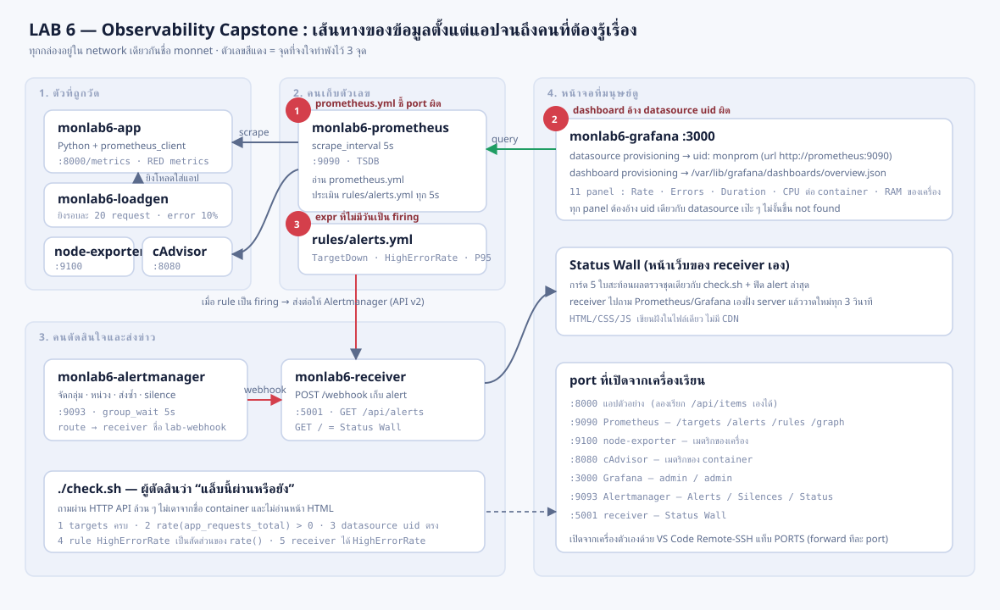
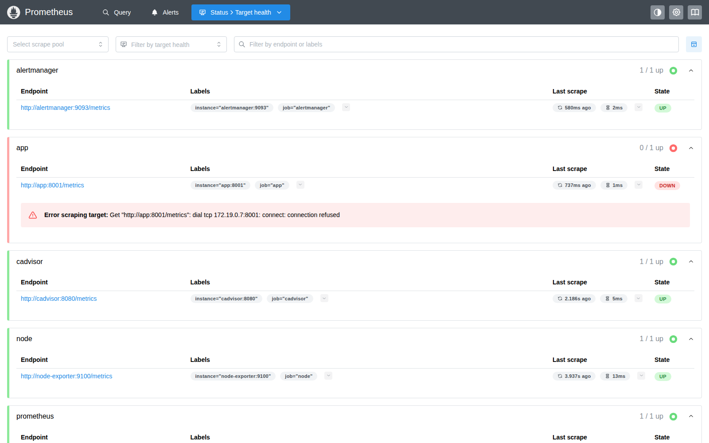
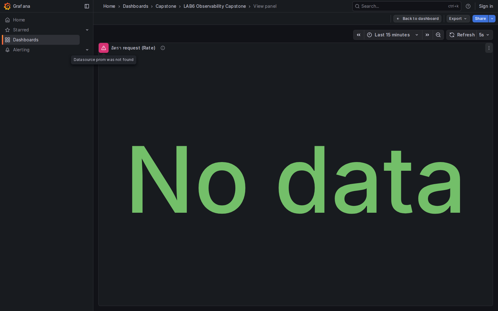
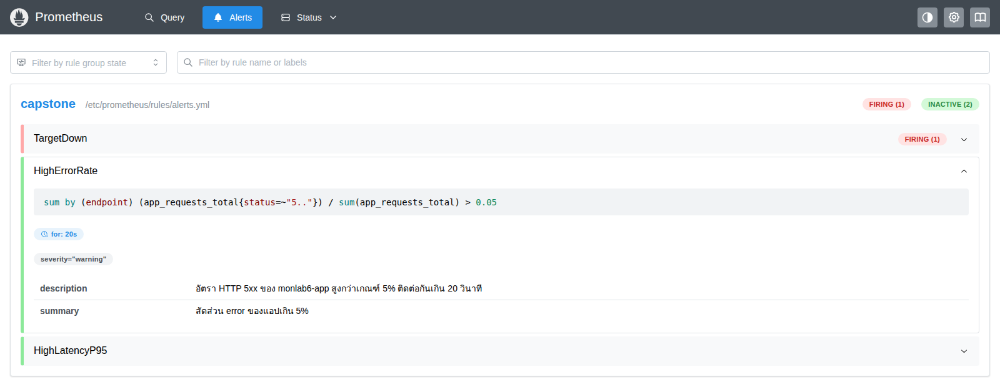
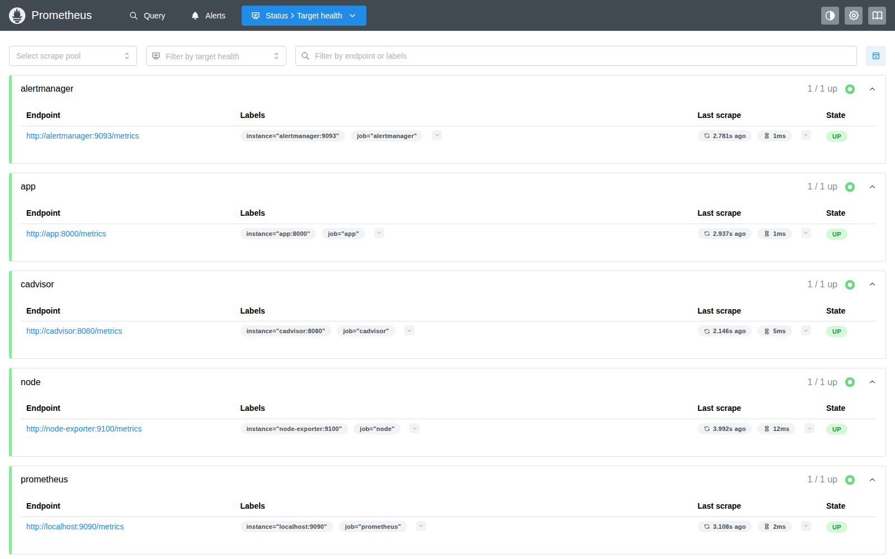
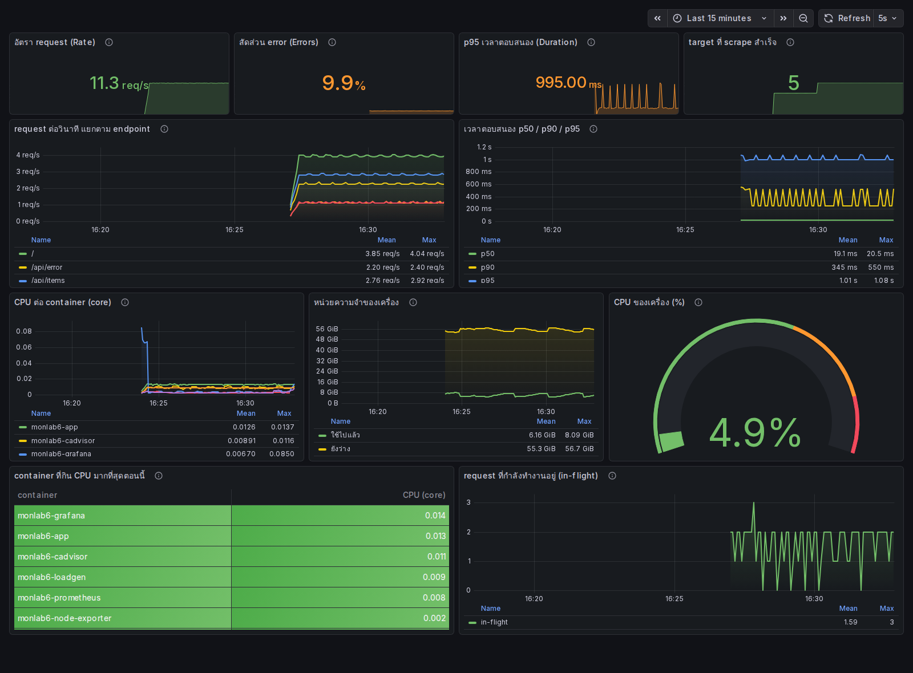
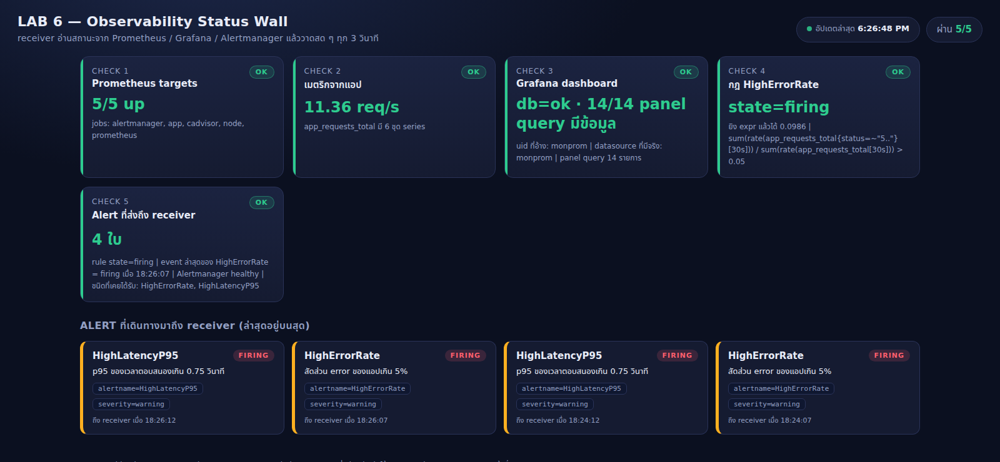
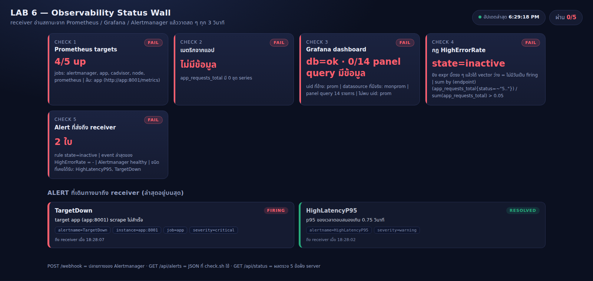
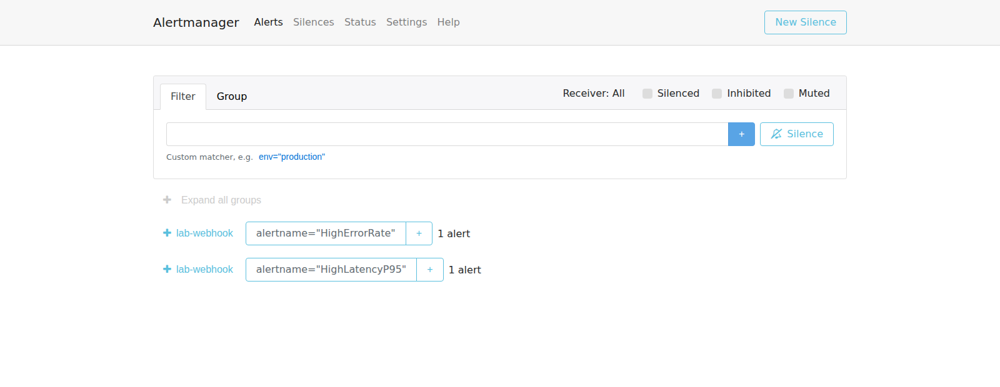

# LAB 6 — Observability Capstone : ประกอบระบบให้ครบ แล้วไล่บั๊ก 3 จุด

> โฟลเดอร์ `006_LAB_Observability_Capstone` = ภารกิจปิดชุด Monitoring
> ไฟล์หลัก: `docker-compose.yml` · `prometheus/prometheus.yml` · `prometheus/rules/alerts.yml` ·
> `alertmanager/alertmanager.yml` · `grafana/` · `app/` · `loadgen/` · `receiver/` · `check.sh` · `SOLUTION.md`

LAB นี้ไม่ใช่ walkthrough ที่จูงมือทีละบรรทัด แต่เป็น **ภารกิจ debug**: เราได้รับระบบ observability ที่ประกอบมาครบทุกชิ้น
(แอปที่ติดเครื่องมือวัด → Prometheus → Grafana → Alertmanager → ตัวรับแจ้งเตือน) แต่ **มีจุดพังจงใจไว้ 3 จุด คนละชั้นกัน**
หน้าที่ของเราคืออ่านอาการ ตั้งสมมติฐาน แก้ทีละจุด และใช้ `./check.sh` เป็นหลักฐานว่าแก้ถูกจริง ไม่ใช่ "รู้สึกว่าน่าจะถูก"

## สิ่งที่จะได้เรียนรู้

- ต่อภาพให้เห็นว่า **เมตริกหนึ่งค่าเดินทางอย่างไร** ตั้งแต่โค้ดในแอป → exposition text → TSDB → panel → alert → คนที่ต้องรู้เรื่อง
- แยกอาการออกเป็นชั้น: "ไม่มีข้อมูล" กับ "มีข้อมูลแต่แสดงไม่ได้" กับ "แสดงได้แต่ไม่แจ้งเตือน" คือคนละปัญหาและคนละไฟล์
- อ่าน `/api/v1/targets`, `/api/v1/rules`, `/api/v1/query` ของ Prometheus และ `/api/health`, `/api/datasources` ของ Grafana เป็น — ตรวจระบบด้วย API ไม่ใช่ด้วยสายตา
- เข้าใจว่า Grafana ผูก panel กับ datasource ด้วย **uid** ไม่ใช่ชื่อ และ dashboard-as-code พังเงียบได้อย่างไร
- เขียน alert expr ที่ "มีวันยิงจริง" — รู้ว่าทำไม counter ดิบใช้ไม่ได้ และทำไม label สองข้างของเครื่องหมายหารต้องเข้าคู่กัน
- เห็น lifecycle ของ alert ครบวง **inactive → pending (`for`) → firing → resolved** ด้วยตาตัวเอง
- ใช้ `promtool` และ `/-/reload` เปลี่ยน config โดยไม่ต้อง restart และไม่ทำข้อมูลเก่าหาย
- เขียน/อ่าน acceptance script ที่ตัดสินระบบจากพฤติกรรมภายนอก และใช้ exit code ต่อกับ CI ได้

## ภาพรวมของแล็บนี้

1. เปิดเครื่องเรียนและยืนยันว่า Docker คุยกับ daemon ได้
2. clone repo แล้วอ่านโจทย์กับเกณฑ์ผ่าน 5 ข้อของ `check.sh`
3. `docker compose up -d --build` เปิดระบบ 8 คอนเทนเนอร์ — ระบบจะขึ้นครบแต่ **ยังพัง**
4. รัน `./check.sh` ให้เห็น baseline `0/5` และอ่าน FAIL ทั้ง 5 บรรทัดเป็นแผนที่ของงาน
5. ไล่บั๊ก #1 (scrape ผิด port) → reload → `2/5`
6. ไล่บั๊ก #2 (datasource uid ไม่ตรง) → `3/5`
7. ไล่บั๊ก #3 (alert expr ที่ไม่มีวันยิง) → reload → `5/5` และ exit code 0
8. เปิด Grafana dashboard และ Status Wall ของ receiver ดูผลงานที่มีข้อมูลจริง
9. ทดลอง lifecycle ของ alert โดยหยุด/เปิด exporter แล้วดู pending → firing → resolved
10. `docker compose down -v` แล้วตรวจว่าไม่เหลืออะไรค้าง



> **คำถามก่อนเริ่ม:** ถ้า Grafana เปิดได้ปกติ คอนเทนเนอร์ทุกตัวขึ้น `Up` และ Prometheus ก็ไม่มี error ใน log
> แต่ panel ทั้งหน้า **ว่างเปล่า** — เราควรเริ่มสงสัยที่ "Grafana แสดงผลไม่ได้" หรือ "ไม่มีข้อมูลให้แสดงตั้งแต่ต้น"?
> แล้วจะพิสูจน์ข้อไหนก่อนด้วยคำสั่งเดียว? ภารกิจนี้จะทำให้ตอบได้จากหลักฐาน ไม่ใช่จากการเดา

### Terminal Map

| หน้าต่าง | หน้าที่ | เปิดเมื่อใด |
|---|---|---|
| **T1** | `docker compose`, `curl`, `./check.sh`, แก้ไฟล์ | ใช้ตลอด LAB |
| **T2** | `docker compose logs -f` ดู loadgen / receiver | ตอนสงสัยว่าใครไม่ทำงาน |
| **Browser** | Prometheus `:9090` · Grafana `:3000` · Alertmanager `:9093` · Status Wall `:5001` | ตั้งแต่ขั้นที่ 4 |

---

## 0. เตรียมเครื่องเรียน

ทำบนเครื่องของเราเอง — เปิด classroom container ที่ติดตั้ง Docker มาให้แล้ว:

```bash
docker start devtools 2>/dev/null || \
  docker run -dit --name devtools --privileged -p 2222:22 tuchsanai/devtools:2569_1
ssh root@localhost -p 2222        # password : passwd
```

> 📝 **คำอธิบาย:** `docker start ... || docker run ...` ใช้กล่องเดิมถ้ามีและสร้างใหม่เมื่อยังไม่มี · `-dit` รันเบื้องหลังพร้อม terminal · `--privileged` จำเป็นเพราะเราจะรัน Docker ซ้อนอยู่ข้างใน · `-p 2222:22` ส่ง SSH จากเครื่องเราเข้าไป · ใน VS Code แนะนำ Remote-SSH ไปที่ `root@localhost:2222` แล้วทำงานในนั้นทั้งหมด

> ⚠️ `--privileged` ให้สิทธิ์สูงมาก ใช้เฉพาะ classroom container ที่ลบทิ้งได้ ห้ามใช้กับงานจริง

ตรวจว่า CLI และ daemon พร้อม:

```bash
docker --version
docker info --format 'Docker daemon: {{.ServerVersion}}'
docker compose version
python3 --version
```

> 📝 **คำอธิบาย:** คำสั่งแรกอ่านเวอร์ชัน CLI ส่วนคำสั่งที่สองต้องติดต่อ daemon ได้จริง จึงแยก "ติดตั้งแล้ว" ออกจาก "พร้อมรัน" · `python3` จำเป็นเพราะ `check.sh` ใช้ python อ่าน JSON (เครื่องเรียนไม่มี `jq`)

✅ **Expected output** — ผลจริงจากเครื่องทดสอบรอบนี้ (เลขเวอร์ชันของแต่ละคนอาจต่าง):

```text
Docker version 29.6.2, build dfc4efb
Docker daemon: 29.6.2
Docker Compose version v5.3.1
Python 3.12.3
```

---

## 1. Clone โค้ดแล็บ

```bash
mkdir -p ~/labwork && cd ~/labwork
git clone https://github.com/Tuchsanai/DevTools.git
cd DevTools/03_Application_Docker/03_Monitoring/006_LAB_Observability_Capstone
chmod +x check.sh
```

> 📝 **คำอธิบาย:** `mkdir -p` ไม่ error ถ้าโฟลเดอร์มีอยู่แล้ว · ถ้า clone ไว้ตั้งแต่แล็บก่อนหน้าให้ข้าม `git clone` แล้ว `cd` เข้า repo เดิมได้เลย · `chmod +x` ทำให้เรียก `./check.sh` ได้โดยตรง

โครงไฟล์ที่ใช้ในภารกิจ:

```text
006_LAB_Observability_Capstone/
├── docker-compose.yml              # stack 8 คอนเทนเนอร์
├── prometheus/
│   ├── prometheus.yml              # ⚠ บั๊กจงใจ #1 ซ่อนอยู่ในไฟล์นี้
│   └── rules/alerts.yml            # ⚠ บั๊กจงใจ #3 ซ่อนอยู่ในไฟล์นี้
├── alertmanager/alertmanager.yml
├── grafana/
│   ├── provisioning/datasources/prometheus.yml
│   ├── provisioning/dashboards/dashboards.yml
│   └── dashboards/overview.json    # ⚠ บั๊กจงใจ #2 ซ่อนอยู่ในไฟล์นี้
├── app/                            # แอปตัวอย่างที่ติดเครื่องมือวัด (Python + prometheus_client)
├── loadgen/                        # ตัวยิงโหลดแบบรอบคงที่
├── receiver/                       # ตัวรับ webhook + หน้า Status Wall
├── check.sh                        # ผู้ตัดสิน 5 ข้อ
└── SOLUTION.md                     # เฉลย (เปิดเมื่อจนจริง ๆ)
```

> 💡 สังเกตว่า config ของ Prometheus อยู่ใน **โฟลเดอร์** `prometheus/` ไม่ใช่ไฟล์เดี่ยวที่ root
> เพราะ compose mount ทั้งโฟลเดอร์ (`./prometheus:/etc/prometheus:ro`) — bind mount ของ *ไฟล์เดี่ยว* ผูกกับ inode
> พอเราแก้ไฟล์ด้วย editor หรือ `sed -i` (ซึ่งสร้างไฟล์ใหม่แล้ว rename ทับ) คอนเทนเนอร์จะยังเห็นเนื้อหาเก่าอยู่ ทั้งที่ไฟล์บนเครื่องเปลี่ยนแล้ว
> นี่เป็นกับดักที่ทำให้หลายคนงงว่า "แก้แล้วทำไมไม่มีอะไรเปลี่ยน"

---

## 2. โจทย์และเกณฑ์ผ่าน

ระบบนี้จำลองบริการหนึ่งตัวที่มีคนใช้งานตลอดเวลา:

| ชิ้นส่วน | หน้าที่ | port |
|---|---|---|
| `monlab6-app` | แอป Python ที่ปล่อยเมตริก RED ของตัวเองที่ `/metrics` | 8000 |
| `monlab6-loadgen` | ยิงทราฟฟิกแบบรอบคงที่ 20 request ต่อรอบ (มี 500 อยู่ 10%) | – |
| `monlab6-prometheus` | ดึงเมตริกทุก 5 วินาที เก็บลง TSDB และประเมิน alert rule | 9090 |
| `monlab6-node-exporter` | เมตริกของเครื่อง (CPU/RAM/disk) | 9100 |
| `monlab6-cadvisor` | เมตริกของแต่ละ container | 8080 |
| `monlab6-grafana` | dashboard ที่ provision มาจากไฟล์ | 3000 |
| `monlab6-alertmanager` | จัดกลุ่ม/หน่วง/ส่งต่อ alert | 9093 |
| `monlab6-receiver` | รับ webhook + หน้า Status Wall | 5001 |

`./check.sh` ตรวจ 5 ข้อ ทุกข้อถามผ่าน HTTP API ล้วน ๆ:

| # | เกณฑ์ผ่าน | หลักฐานที่ใช้ |
|---|---|---|
| **1** | ทุก target health = `up` และ **ชุดชื่อ job ตรงกันเป๊ะ** กับ `alertmanager, app, cadvisor, node, prometheus` (ขาดก็ไม่ผ่าน เกินก็ไม่ผ่าน) | `GET /api/v1/targets` |
| **2** | `app_requests_total` มีข้อมูลจริงและ `rate(...) > 0` | `GET /api/v1/query` |
| **3** | มี dashboard `uid=monlab6` จริง · datasource ที่มันอ้างมีอยู่จริงและเป็น **ชนิด prometheus** · และ **ยิง query ของทุก panel แล้วได้ข้อมูลกลับมาครบ** (ครอบคลุมทั้ง `app_*`, `node_*`, `container_*`) | `/api/health`, `/api/datasources`, `/api/dashboards/uid/monlab6` + `/api/v1/query` |
| **4** | rule `HighErrorRate` ถูกโหลด และ **เอา expr ของมันไปยิงจริง** แล้วได้ผล **ไม่ว่าง** และเป็นสัดส่วนในช่วง (0,1] | `GET /api/v1/rules` + `/api/v1/query` |
| **5** | rule `HighErrorRate` **กำลัง firing อยู่ตอนนี้** และ **event ล่าสุด**ของชื่อนี้ที่ receiver ได้รับเป็น `firing` (ไม่ใช่ `resolved`) | `GET /api/v1/rules` + `GET /api/alerts` ของ receiver |

> ⚠️ สังเกตว่าไม่มีข้อไหนตัดสินด้วย "การนับคำในไฟล์" เลย — checker **ยิง query จริงแล้วดูผล**
> เพราะ expr ที่หน้าตาถูกทุกอย่างแต่คืนค่าว่าง คือบั๊กที่แล็บนี้ตั้งใจสอนพอดี ถ้าตัดสินด้วยหน้าตา ก็จะปล่อยบั๊กนั้นผ่าน
> ในทางกลับกัน expr ที่เขียนคนละรูปแต่ทำงานถูก (เช่นใช้ `increase()` แทน `rate()`) ก็ต้องผ่านได้ด้วย

อ่าน checker ก่อนได้ แต่ยังไม่ต้องเปิด `SOLUTION.md`:

```bash
sed -n '1,60p' check.sh
```

> 📝 **คำอธิบาย:** checker เขียนด้วย bash + `curl` + `python3` เท่านั้น (ไม่ต้องติดตั้ง `jq`) · ทุก request มี timeout 5 วินาทีกันค้าง · **ทุก loop มีจุดจบเป็นเวลาจริงบนนาฬิกา (wall clock)** ไม่ใช่การนับรอบ `sleep` — ตัวเลขงบเวลาจึงเป็นเพดานเวลาที่ใช้จริง ไม่ใช่ "งบ sleep" ที่บวก timeout ของ `curl` เข้าไปอีก · งบเวลาเริ่มต้น: readiness 120 วินาที · ข้อ 1 = 30 · ข้อ 2 = 30 · ข้อ 3 = 25 · ข้อ 4 = 45 · ข้อ 5 = 150 วินาที (ปรับได้ด้วย env `BUDGET_READY`/`BUDGET_TARGETS`/`BUDGET_METRICS`/`BUDGET_GRAFANA`/`BUDGET_RULE`/`BUDGET_ALERT`) · ที่ข้อ 5 ยาวเพราะต้องรอ `for: 20s` + `group_wait: 5s` และเผื่อกรณีแย่สุดคือรอบส่งซ้ำของ Alertmanager (`repeat_interval: 2m`) · ถ้าข้อ 2 หรือข้อ 4 ไม่ผ่าน checker จะย่นงบเวลาของข้อถัดไปเหลือ 5 วินาที เพราะรออีกก็ไม่มีทางเปลี่ยนผล · exit code เป็น 0 เมื่อผ่านครบเท่านั้น จึงเอาไปต่อกับ CI ได้

✅ **Expected output:** เห็นตัวแปร `PROM_URL`/`GRAFANA_URL`/`RECEIVER_URL`, ตัวแปรงบเวลา `BUDGET_*` และคำอธิบายเกณฑ์ทั้ง 5 ข้อ โดยยังไม่ต้องแก้อะไร

---

## 3. เปิดระบบ

```bash
docker compose up -d --build
docker compose ps --format 'table {{.Name}}\t{{.Status}}\t{{.Ports}}'
```

> 📝 **คำอธิบาย:** `--build` สร้าง image ของ `app/`, `loadgen/`, `receiver/` จาก source ในโฟลเดอร์ (ครั้งแรกจะ `pip install prometheus_client` จึงใช้เวลาสักครู่) · service อื่นใช้ image ที่ pin เวอร์ชันไว้แล้วทั้งหมด · `loadgen` มี `depends_on: app: condition: service_healthy` จึงรอจน healthcheck ของแอปผ่านก่อนค่อยเริ่มยิง · ครั้งแรก Docker จะ pull image ทั้งหมด เวลาที่ใช้ขึ้นกับความเร็วเน็ต

✅ **Expected output** — ท้ายผลรันจริง (ลำดับ start สลับกันได้):

```text
 Container monlab6-alertmanager Started 
 Container monlab6-cadvisor Started 
 Container monlab6-prometheus Started 
 Container monlab6-grafana Starting 
 Container monlab6-app Started 
 Container monlab6-app Waiting 
 Container monlab6-receiver Started 
 Container monlab6-node-exporter Started 
 Container monlab6-grafana Started 
 Container monlab6-app Healthy 
 Container monlab6-loadgen Starting 
 Container monlab6-loadgen Started 
NAME                    STATUS                   PORTS
monlab6-alertmanager    Up 6 seconds             0.0.0.0:9093->9093/tcp, [::]:9093->9093/tcp
monlab6-app             Up 6 seconds (healthy)   0.0.0.0:8000->8000/tcp, [::]:8000->8000/tcp
monlab6-cadvisor        Up 6 seconds (healthy)   0.0.0.0:8080->8080/tcp, [::]:8080->8080/tcp
monlab6-grafana         Up 5 seconds             0.0.0.0:3000->3000/tcp, [::]:3000->3000/tcp
monlab6-loadgen         Up Less than a second    
monlab6-node-exporter   Up 6 seconds             0.0.0.0:9100->9100/tcp, [::]:9100->9100/tcp
monlab6-prometheus      Up 6 seconds             0.0.0.0:9090->9090/tcp, [::]:9090->9090/tcp
monlab6-receiver        Up 6 seconds             0.0.0.0:5001->5001/tcp, [::]:5001->5001/tcp
```

**ทุกตัว `Up` — แต่อย่าเพิ่งเชื่อว่าระบบทำงาน** `Up` แปลว่าโปรเซสหลักยังไม่ตาย ไม่ได้แปลว่ามันทำงานถูก
ลองดูของจริงที่ตัวแอปก่อน:

```bash
curl -s http://localhost:8000/api/items; echo
curl -s http://localhost:8000/metrics | grep -E '^app_requests_total'
```

> 📝 **คำอธิบาย:** `/api/items` เป็น endpoint ปกติของแอป · `/metrics` คือหน้าที่ Prometheus จะมาดึง — เป็นข้อความธรรมดา บรรทัดละหนึ่งค่า พร้อม label ในวงเล็บปีกกา · แอปไม่ได้ "ส่ง" ข้อมูลไปไหน มันแค่ "เปิดหน้าให้มาอ่าน" (pull model)

✅ **Expected output** — ผลรันจริงหลังปล่อยให้ loadgen ยิงราว 45 วินาที (ตัวเลขของแต่ละคนต่างกันตามเวลาที่ปล่อยไว้):

```text
{"items":[{"id":1,"name":"cpu"},{"id":2,"name":"ram"},{"id":3,"name":"disk"}]}
app_requests_total{endpoint="/",method="GET",status="200"} 182.0
app_requests_total{endpoint="/api/items",method="GET",status="200"} 131.0
app_requests_total{endpoint="/api/items/:id",method="GET",status="200"} 52.0
app_requests_total{endpoint="/api/error",method="GET",status="200"} 52.0
app_requests_total{endpoint="/api/error",method="GET",status="500"} 51.0
app_requests_total{endpoint="/api/slow",method="GET",status="200"} 50.0
```

> 💡 สัดส่วน **7 : 5 : 2 : 4 : 2** เป๊ะ "ต่อหนึ่งรอบที่ครบ 20 request" เท่านั้น
> ค่าที่อ่านได้ขณะระบบกำลังวิ่ง (อย่างตัวเลขข้างบน) จะ *ใกล้เคียง* แต่ไม่ตรงเป๊ะ เพราะเป็นภาพนิ่งกลางรอบ
> และมี request ที่ยังค้างอยู่ระหว่างทาง (`/api/slow` ใช้เวลา 0.8-1.6 วินาที จึงมักเป็นตัวที่ตามหลังสุด)
> ถ้าอยากเห็นสัดส่วนเป๊ะ ให้เทียบเป็นอัตราส่วนสะสมหลังปล่อยไว้นาน ๆ แทนการเทียบเลขดิบ ณ วินาทีเดียว

> 💡 สังเกต label `endpoint="/api/items/:id"` — เป็น **template** ไม่ใช่ path ดิบที่มี id จริง
> ถ้าใส่ id ลงไปตรง ๆ จำนวน series จะโตไม่มีที่สิ้นสุด (cardinality ระเบิด) และ Prometheus จะกินแรมจนล่ม

---

## 4. Baseline ต้องพัง — รู้ว่าพังตรงไหนก่อนลงมือ

```bash
./check.sh
echo "exit=$?"
```

> 📝 **คำอธิบาย:** checker จะรอระบบพร้อมก่อน แล้วตรวจทีละข้อ · รอบ baseline ใช้เวลาราว 100 วินาที (ข้อ 1 กับ 2 รออย่างละ 30 วินาทีเผื่อ scrape รอบใหม่ ส่วนข้อ 4 กับ 5 ถูกย่นงบเวลาอัตโนมัติเพราะไม่มีเมตริกของแอปให้ประเมิน) · `echo "exit=$?"` อ่าน exit code ของคำสั่งก่อนหน้า — ตอนนี้ต้องได้ `1` ถ้าได้ `0` แปลว่า checker เองมีปัญหา

✅ **Expected output** — baseline จริงของรอบนี้ (ตัดรหัสสีออก):

```text
LAB6 acceptance check
  Prometheus  http://localhost:9090
  Grafana     http://localhost:3000
  Receiver    http://localhost:5001

ระบบพร้อมตรวจแล้ว (ใช้เวลา ~0 วินาที)

FAIL  [1/5] targets: expected job = {alertmanager,app,cadvisor,node,prometheus} และ up ครบทุกตัว, got 4/5 up จาก job {alertmanager,app,cadvisor,node,prometheus}
        job ที่เห็นตอนนี้: alertmanager,app,cadvisor,node,prometheus
        ตัวที่ล้ม: job app -> http://app:8001/metrics : Get "http://app:8001/metrics": dial tcp 172.19.0.7:8001: connect: conn
        ลองซ้ำ 11 ครั้งในเวลา 30 วินาที (นับด้วยนาฬิกาจริง) แล้วยังไม่ผ่าน
FAIL  [2/5] app_requests_total: expected rate > 0, got 'none' (จำนวน series = 0)
        ถ้าเป็น none แปลว่า Prometheus ไม่มีข้อมูลของเมตริกนี้เลย ให้ย้อนไปดูข้อ 1 ก่อน
        ลองซ้ำ 11 ครั้งในเวลา 30 วินาที (นับด้วยนาฬิกาจริง) แล้วยังไม่ผ่าน
FAIL  [3/5] dashboard 'monlab6' อ้าง datasource uid ที่ไม่มีอยู่จริง: prom
        dashboard อ้าง uid : prom
        datasource ที่มีจริง: monprom
        ลองซ้ำ 10 ครั้งในเวลา 27 วินาที (นับด้วยนาฬิกาจริง) แล้วยังไม่ผ่าน
FAIL  [4/5] rule HighErrorRate: expected expr ที่ประเมินแล้วได้ผลจริง, got vector ว่าง (state=inactive)
        expr: sum by (endpoint) (app_requests_total{status=~"5.."}) / sum(app_requests_total) > 0.05
        ยิง expr นี้ตรง ๆ ที่ /api/v1/query แล้วได้ result ว่าง
        expr ที่คืน vector ว่างจะไม่มีวันเปลี่ยนเป็น firing ได้เลย
        ตอนนี้ Prometheus ยังไม่มีเมตริกของแอปให้ประเมินเลย ให้ย้อนไปดูข้อ 1 และ 2 ก่อน
FAIL  [5/5] HighErrorRate: expected rule state=firing, got 'inactive'
        alert ที่ receiver ได้รับทั้งหมด 2 ใบ (ชนิด: TargetDown)
        สถานะ rule ตอนนี้: inactive
        ข้อนี้ต้องการ rule ที่ firing 'อยู่ตอนนี้' ไม่ใช่แค่เคยยิงแล้วหายไป

Result: expected 5/5 OK, got 0/5
exit=1
```

**อ่านผลนี้ให้เป็นแผนที่ ไม่ใช่รายการงาน 5 ชิ้น** — บั๊กมีแค่ 3 จุด แต่ FAIL มี 5 ข้อ เพราะบั๊กหนึ่งจุดลากได้หลายข้อ:

| บั๊ก | ทำให้ตกข้อ | เหตุผล |
|---|---|---|
| #1 scrape ผิด port | 1, 2, 3, 4, 5 | ไม่มีเมตริกของแอปเข้าระบบเลย ทุกอย่างที่อยู่ปลายน้ำจึงไม่มีวัตถุดิบ |
| #2 datasource uid | 3 | Prometheus ปกติทุกอย่าง พังเฉพาะชั้นแสดงผล |
| #3 alert expr | 4, 5 | ข้อมูลครบ แต่กฎประเมินไม่ออกจึงไม่มีวันแจ้งเตือน |

(ตัวเลขนี้ยืนยันด้วยการเปิดบั๊กทีละตัวแล้วรันจริง — ตารางผลเต็มอยู่ใน `SOLUTION.md`)

> **หยุดคิดก่อนอ่านต่อ:** ลองตอบในใจว่า
> (ก) ข้อ 3 บอกว่า Grafana ยังตอบ `health=ok` อยู่ แต่ยัง FAIL — แปลว่าอะไรพัง?
> (ข) ข้อ 4 บอกว่า rule ถูกโหลดแล้วและ `state=inactive` — "โหลดได้" กับ "ทำงานถูก" ต่างกันตรงไหน?
> (ค) ข้อ 5 ได้รับ alert มาแล้ว 2 ใบจริง ๆ แล้วทำไมยังไม่ผ่าน?

---

## 5. ไล่บั๊ก #1 — ไม่มีข้อมูลตั้งแต่ต้นน้ำ

เปิดหน้า Targets ของ Prometheus (วิธี forward port อยู่ในขั้นที่ 8) หรือถาม API ตรง ๆ:

```bash
curl -s 'http://localhost:9090/api/v1/targets?state=any' | python3 -c '
import json,sys
for t in json.load(sys.stdin)["data"]["activeTargets"]:
    print(t["labels"]["job"], t["health"], t["scrapeUrl"], (t.get("lastError") or "")[:60])
'
```

> 📝 **คำอธิบาย:** `state=any` ขอมาทั้ง target ที่ up และ down · เราสนใจ 3 อย่างคือ `job`, `health` และ **`scrapeUrl` ที่ Prometheus ใช้จริง** · `lastError` คือเหตุผลที่ scrape ไม่สำเร็จ ซึ่งมีค่ามากกว่าการเดา

✅ **Expected output** — ผลรันจริง:

```text
alertmanager up http://alertmanager:9093/metrics 
app down http://app:8001/metrics Get "http://app:8001/metrics": dial tcp 172.19.0.7:8001: con
cadvisor up http://cadvisor:8080/metrics 
node up http://node-exporter:9100/metrics 
prometheus up http://localhost:9090/metrics
```



`connection refused` ต่างจาก `no such host` และต่างจาก `context deadline exceeded`:

| ข้อความ error | แปลว่า | ควรสงสัย |
|---|---|---|
| `no such host` | ชื่อ DNS ไม่มีอยู่ใน network นี้ | ชื่อ service สะกดผิด หรืออยู่คนละ network |
| `connection refused` | หา host เจอ แต่ **ไม่มีใครฟัง port นั้น** | port ผิด หรือโปรแกรมยังไม่ start |
| `context deadline exceeded` | ต่อได้แต่ตอบไม่ทัน | ปลายทางช้า/ค้าง |

เราหา host เจอแต่ port ว่าง — ไปดูว่าแอปฟัง port อะไรจริง ๆ:

```bash
grep -n 'APP_PORT' docker-compose.yml
grep -n -A2 'job_name: app' prometheus/prometheus.yml
```

> 📝 **คำอธิบาย:** `-n` แสดงเลขบรรทัดเพื่อให้เปิดไปแก้ได้ตรงจุด · `-A2` แสดงอีก 2 บรรทัดถัดจากที่เจอ เพื่อให้เห็น `targets:` ที่อยู่ใต้ `job_name`

✅ **Expected output** — เห็นความขัดแย้งชัด ๆ ว่าแอปฟัง `8000` แต่ Prometheus ไปเคาะ `8001`:

```text
23:      APP_PORT: "8000"
35:  - job_name: app
36-    static_configs:
37-      - targets: ["app:8001"]
```

**แก้** — เปิด `prometheus/prometheus.yml` แก้ `app:8001` เป็น `app:8000` (หรือใช้คำสั่งนี้) แล้ว **reload โดยไม่ restart**:

```bash
sed -i 's|"app:8001"|"app:8000"|' prometheus/prometheus.yml
curl -sS -X POST http://localhost:9090/-/reload -o /dev/null -w 'reload=%{http_code}\n'
```

> 📝 **คำอธิบาย:** `sed -i` แก้ไฟล์ในที่ · `/-/reload` สั่งให้ Prometheus อ่าน config ใหม่ ใช้ได้เพราะ compose เปิด flag `--web.enable-lifecycle` ไว้ · ข้อดีคือคอนเทนเนอร์ไม่ restart ข้อมูลใน TSDB จึงไม่หายและ uptime ไม่รีเซ็ต · ถ้าได้ `reload=400` แปลว่า config ใหม่ผิดไวยากรณ์ ให้ดู `docker compose logs prometheus` ซึ่งจะบอกบรรทัดที่ผิด · การ scrape ครั้งถัดไปเกิดภายใน 5 วินาที

✅ **Expected output:**

```text
reload=200
```

รัน checker อีกครั้ง:

```bash
./check.sh
```

✅ **Expected output** — ผลจริงหลังแก้บั๊ก #1 (ค่า rate เปลี่ยนได้ตามจังหวะ ยิ่งรอนานยิ่งเข้าใกล้ 11 req/s):

```text
OK    [1/5] targets ทุกตัว health=up : 5/5 target และชุด job ตรงกับที่คาดไว้ครบ
        job: alertmanager,app,cadvisor,node,prometheus
OK    [2/5] app_requests_total มีข้อมูลจริง : rate = 2.96 req/s (6 series)
FAIL  [3/5] dashboard 'monlab6' อ้าง datasource uid ที่ไม่มีอยู่จริง: prom
        dashboard อ้าง uid : prom
        datasource ที่มีจริง: monprom
FAIL  [4/5] rule HighErrorRate: expected expr ที่ประเมินแล้วได้ผลจริง, got vector ว่าง (state=inactive)
        expr: sum by (endpoint) (app_requests_total{status=~"5.."}) / sum(app_requests_total) > 0.05
        ยิง expr นี้ตรง ๆ ที่ /api/v1/query แล้วได้ result ว่าง
        expr ที่คืน vector ว่างจะไม่มีวันเปลี่ยนเป็น firing ได้เลย
        สัดส่วน error จริงของระบบตอนนี้ = 0.0995 — ข้อมูลมีให้ประเมิน แต่ expr ของ rule กลับคืนค่าว่าง
FAIL  [5/5] HighErrorRate: expected rule state=firing, got 'inactive'
        alert ที่ receiver ได้รับทั้งหมด 4 ใบ (ชนิด: HighLatencyP95,TargetDown)
        สถานะ rule ตอนนี้: inactive

Result: expected 5/5 OK, got 2/5
```

> 💡 **สังเกตข้อ 5** ตอนนี้มี `HighLatencyP95` โผล่มาแล้ว แปลว่าเส้นทาง Prometheus → Alertmanager → receiver **ใช้งานได้จริง**
> ดังนั้นถ้า `HighErrorRate` ยังไม่มา ปัญหาไม่ได้อยู่ที่ท่อส่ง แต่อยู่ที่ **ตัวกฎเอง** — นี่คือการตัดตัวเลือกด้วยหลักฐาน ไม่ใช่ด้วยความรู้สึก
>
> 💡 **สังเกตข้อ 4** บรรทัด `สัดส่วน error จริงของระบบตอนนี้ = 0.0995` คือ checker ยิง query ของมันเองเพื่อยืนยันว่า
> "ข้อมูลมีให้ประเมินอยู่แล้ว" — เท่ากับตัดข้อแก้ตัวว่า "ยังไม่มีข้อมูล" ทิ้งไป เหลือทางเดียวคือ expr ผิด

---

## 6. ไล่บั๊ก #2 — มีข้อมูลแต่แสดงไม่ได้

ตอนนี้ Prometheus มีข้อมูลครบแล้ว แต่ dashboard ยังว่าง ลองเปิด Grafana (ขั้นที่ 8 บอกวิธี forward port)
ทุก panel จะมีสามเหลี่ยมแดงมุมซ้ายบน เอาเมาส์ชี้จะเห็นข้อความจริง:



ตรวจจาก API ให้เห็นตัวเลขแทนการเดา:

```bash
curl -s -u admin:admin http://localhost:3000/api/datasources | python3 -c '
import json,sys
print("datasource ที่มีจริง:", [(d["uid"], d["name"], d["type"]) for d in json.load(sys.stdin)])
'
grep -m3 -n '"uid"' grafana/dashboards/overview.json
```

> 📝 **คำอธิบาย:** `-u admin:admin` คือ credential ของห้องเรียน (ตั้งไว้ใน compose) เพราะ `/api/datasources` ต้องสิทธิ์ admin · คำสั่งที่สองดูว่า dashboard JSON อ้าง uid อะไร · Grafana จับคู่ panel กับ datasource ด้วย **uid ตรงตัวอักษร** ไม่ใช่ชื่อและไม่ใช่ประเภท · เราพิมพ์ `type` ออกมาด้วยเพราะ `check.sh` ตรวจถึงชนิดของ datasource ไม่ใช่แค่ว่า uid มีอยู่

✅ **Expected output** — เห็นคนละค่ากันชัด ๆ:

```text
datasource ที่มีจริง: [('monprom', 'Prometheus', 'prometheus')]
17:        "uid": "prom"
60:            "uid": "prom"
77:        "uid": "prom"
```

**แก้** — ทำให้ dashboard อ้าง uid เดียวกับ datasource ที่ provision ไว้:

```bash
sed -i 's|"uid": "prom"|"uid": "monprom"|g' grafana/dashboards/overview.json
sleep 15
```

> 📝 **คำอธิบาย:** `-g` แทนที่ทุกจุดในไฟล์ (มี 25 จุด ทั้งระดับ panel และระดับ query) · **ไม่ต้อง restart Grafana** เพราะ provider ของ dashboard ตั้ง `updateIntervalSeconds: 10` ไว้ มันจะอ่านไฟล์ใหม่เองภายในราว 10-15 วินาที · จะแก้ทางกลับกัน (เปลี่ยน uid ของ datasource ใน `grafana/provisioning/datasources/prometheus.yml` เป็น `prom`) ก็ถูกเหมือนกัน **แต่ทางนั้นต้อง `docker compose restart grafana` ด้วย** เพราะ provisioning ของ datasource ถูกอ่านตอน Grafana เริ่มทำงานเท่านั้น ไม่ได้ poll ไฟล์ซ้ำ · งานจริงนิยมตรึง uid ของ datasource แล้วให้ dashboard ทุกใบอ้างตาม เพราะ dashboard มีเป็นสิบใบแต่ datasource มีไม่กี่ตัว

```bash
./check.sh
```

✅ **Expected output** — ผลจริงหลังแก้บั๊ก #2:

```text
OK    [1/5] targets ทุกตัว health=up : 5/5 target และชุด job ตรงกับที่คาดไว้ครบ
        job: alertmanager,app,cadvisor,node,prometheus
OK    [2/5] app_requests_total มีข้อมูลจริง : rate = 11.32 req/s (6 series)
OK    [3/5] dashboard 'monlab6' ใช้ datasource ชนิด prometheus (monprom) และ query ของ panel ทั้ง 14 รายการได้ข้อมูลจริง
        ครอบคลุม: แอป (app), node-exporter, cAdvisor
FAIL  [4/5] rule HighErrorRate: expected expr ที่ประเมินแล้วได้ผลจริง, got vector ว่าง (state=inactive)
        expr: sum by (endpoint) (app_requests_total{status=~"5.."}) / sum(app_requests_total) > 0.05
        ยิง expr นี้ตรง ๆ ที่ /api/v1/query แล้วได้ result ว่าง
        สัดส่วน error จริงของระบบตอนนี้ = 0.1024 — ข้อมูลมีให้ประเมิน แต่ expr ของ rule กลับคืนค่าว่าง
FAIL  [5/5] HighErrorRate: expected rule state=firing, got 'inactive'
        alert ที่ receiver ได้รับทั้งหมด 5 ใบ (ชนิด: HighLatencyP95,TargetDown)
        สถานะ rule ตอนนี้: inactive

Result: expected 5/5 OK, got 3/5
```

> 💡 ข้อ 3 ที่ผ่านตอนนี้ไม่ได้แปลว่า "uid ตรงกัน" อย่างเดียว — checker ยิง query ของ **ทั้ง 14 รายการ** ในทุก panel
> แล้วได้ข้อมูลกลับมาครบ ทั้งจากแอป (`app_*`) จากเครื่อง (`node_*`) และจาก container (`container_*`)
> ถ้าเผลอพิมพ์ชื่อเมตริกผิดใน panel เดียว ข้อ 3 จะตกทันทีพร้อมบอกชื่อ panel ที่มีปัญหา

---

## 7. ไล่บั๊ก #3 — แสดงผลได้ แต่ไม่มีวันแจ้งเตือน

เปิดหน้า `/alerts` ของ Prometheus จะเห็นว่า `HighErrorRate` เงียบสนิทตลอดกาล ทั้งที่ error จริงอยู่ที่ ~10%:



ตรวจก่อนว่า "error จริงมีเท่าไร" กับ "expr ของ rule ให้ผลอะไร" — สองคำถามคนละคำถาม:

```bash
# ก) ความจริงของระบบ: สัดส่วน error ตอนนี้
curl -s --get --data-urlencode \
  'query=sum(rate(app_requests_total{status=~"5.."}[30s])) / sum(rate(app_requests_total[30s]))' \
  http://localhost:9090/api/v1/query

# ข) expr ที่ rule ใช้อยู่ (ตัด > 0.05 ออกเพื่อดูค่าดิบ)
curl -s --get --data-urlencode \
  'query=sum by (endpoint) (app_requests_total{status=~"5.."}) / sum(app_requests_total)' \
  http://localhost:9090/api/v1/query
```

> 📝 **คำอธิบาย:** `--get --data-urlencode` ให้ `curl` เข้ารหัส query ที่มีอักขระพิเศษ (`{`, `"`, `~`, ช่องว่าง) ให้เอง ปลอดภัยกว่าต่อ string เอง · ข้อ ก) คือรูปที่ถูก ข้อ ข) คือรูปที่อยู่ใน rule ตอนนี้ · ให้ดูที่ `result` ว่ามีสมาชิกไหม

✅ **Expected output** — ผลจริง: ความจริงมีค่า แต่ expr ของ rule **คืน vector ว่าง**

```text
{"status":"success","data":{"resultType":"vector","result":[{"metric":{},"value":[1786817313.303,"0.09893992932862192"]}]}}
{"status":"success","data":{"resultType":"vector","result":[]}}
```

นี่คือหัวใจของบั๊กนี้ — **expr ที่คืนค่าว่างจะไม่มีวันเป็น firing** เพราะไม่มี series ให้ไปเทียบกับ `> 0.05`
สาเหตุซ้อนกันสองชั้น:

1. **ลืม `rate()`** — `app_requests_total` เป็น counter ที่สะสมตั้งแต่แอปเริ่มทำงาน ค่าดิบบอก "รวมทั้งชีวิต" ไม่ได้บอก "ตอนนี้แย่แค่ไหน"
2. **label สองข้างของเครื่องหมายหารไม่เข้าคู่กัน** — ตัวตั้ง `sum by (endpoint) (...)` ยังมี label `endpoint` ติดมา
   ส่วนตัวหาร `sum(...)` ไม่มี label เลย · PromQL จับคู่ series ด้วยชุด label ที่เหมือนกันเป๊ะ เมื่อไม่มีทางตรงกัน ผลลัพธ์จึงว่าง

> ⚠️ `promtool check rules` **ผ่าน** และ Prometheus ก็รายงาน `health: ok`
> เครื่องมือพวกนี้ตรวจได้แค่ว่า "ไวยากรณ์ถูก" ไม่ได้ตรวจว่า "มีความหมายและมีวันเป็นจริง"

**แก้** — เปิด `prometheus/rules/alerts.yml` เปลี่ยน expr ของ `HighErrorRate` เป็นสัดส่วนของ `rate()` ทั้งสองข้าง:

```yaml
      - alert: HighErrorRate
        expr: sum(rate(app_requests_total{status=~"5.."}[30s])) / sum(rate(app_requests_total[30s])) > 0.05
        for: 20s
```

หรือใช้คำสั่งเดียวจบ แล้วตรวจไวยากรณ์ก่อน reload:

```bash
sed -i 's|^        expr: sum(app_requests_total.*|        expr: sum(rate(app_requests_total{status=~"5.."}[30s])) / sum(rate(app_requests_total[30s])) > 0.05|' prometheus/rules/alerts.yml
docker compose exec prometheus promtool check rules /etc/prometheus/rules/alerts.yml
curl -sS -X POST http://localhost:9090/-/reload -o /dev/null -w 'reload=%{http_code}\n'
```

> 📝 **คำอธิบาย:** `promtool` มาพร้อม image ของ Prometheus อยู่แล้ว จึงเรียกผ่าน `docker compose exec` ได้เลย · path ที่ส่งให้เป็น path **ในคอนเทนเนอร์** (`/etc/prometheus/rules/...`) ไม่ใช่ path บนเครื่องเรา · เรื่องขนาดหน้าต่างมีสองระดับที่ต้องแยกกัน: **ข้อกำหนดขั้นต่ำ** คือ `rate()` ต้องมีอย่างน้อย **2 sample** ในหน้าต่าง ไม่งั้นคืนค่าว่าง (ที่ `scrape_interval: 5s` แปลว่าหน้าต่างต้องกว้างกว่า 5 วินาที จึงเป็นเหตุผลที่ `[5s]` ให้ผลว่าง ๆ กระโดด ๆ) ส่วน **"ตั้งหน้าต่างราว 4 เท่าของ scrape interval ขึ้นไป" เป็นแนวปฏิบัติ** ไม่ใช่กฎที่ Prometheus บังคับ มีไว้เผื่อ jitter ของเวลา scrape และเผื่อ scrape หลุดไปหนึ่งรอบ · แล็บนี้ใช้ `[30s]` = 6 เท่า อยู่ในโซนปลอดภัย

✅ **Expected output:**

```text
Checking /etc/prometheus/rules/alerts.yml
  SUCCESS: 3 rules found

reload=200
```

รัน checker รอบสุดท้าย (ข้อ 5 จะรอ alert เดินทางจริงราว 30-60 วินาที: `for: 20s` + `group_wait: 5s`):

```bash
./check.sh
echo "exit=$?"
```

✅ **Expected output** — ผลจริงหลังแก้ครบทั้ง 3 จุด (รอบนี้ใช้เวลา 30 วินาที):

```text
LAB6 acceptance check
  Prometheus  http://localhost:9090
  Grafana     http://localhost:3000
  Receiver    http://localhost:5001

ระบบพร้อมตรวจแล้ว (ใช้เวลา ~0 วินาที)

OK    [1/5] targets ทุกตัว health=up : 5/5 target และชุด job ตรงกับที่คาดไว้ครบ
        job: alertmanager,app,cadvisor,node,prometheus
OK    [2/5] app_requests_total มีข้อมูลจริง : rate = 11.32 req/s (6 series)
OK    [3/5] dashboard 'monlab6' ใช้ datasource ชนิด prometheus (monprom) และ query ของ panel ทั้ง 14 รายการได้ข้อมูลจริง
        ครอบคลุม: แอป (app), node-exporter, cAdvisor
OK    [4/5] rule HighErrorRate ประเมินได้จริง : ยิง expr แล้วได้ค่า 0.0989 (state=inactive)
        expr: sum(rate(app_requests_total{status=~"5.."}[30s])) / sum(rate(app_requests_total[30s])) > 0.05
        เทียบกับความจริง: สัดส่วน error ของระบบตอนนี้ = 0.0995
OK    [5/5] HighErrorRate กำลัง firing และ event ล่าสุดที่ receiver ได้รับเป็น firing (เมื่อ 18:09:02)
        alert ที่ receiver ได้รับทั้งหมด 6 ใบ (ชนิด: HighErrorRate,HighLatencyP95,TargetDown)
        สถานะ rule ตอนนี้: firing

Result: 5/5 OK
exit=0
```

> ค่า `state=` ที่ข้อ 4 รายงานอาจเป็น `inactive` / `pending` / `firing` ก็ได้ ขึ้นกับว่าตรวจตอนไหนของวงจร
> (เพิ่ง reload = ยังไม่ได้ประเมิน → `inactive` · กำลังนับ `for: 20s` → `pending` · ครบแล้ว → `firing`)
> **ข้อ 4 ตัดสินที่ "ยิง expr แล้วได้ผลจริงไหม"** ไม่ใช่ที่สถานะ และไม่ใช่ที่หน้าตาของข้อความ
> ส่วน "ยิงจริงถึงมือคนจริง" ถูกตัดสินในข้อ 5 ซึ่งบังคับสองอย่างพร้อมกัน: rule ต้อง **firing อยู่ตอนนี้**
> และ **event ล่าสุด** ของ `HighErrorRate` ที่ receiver ได้รับต้องเป็น `firing` ไม่ใช่ `resolved`
> (ประวัติเก่าที่เคยยิงแล้วหายไปไม่นับ — ถ้าเผลอทำ rule พังกลับไป ข้อ 5 จะตกทันทีแม้ชื่อนี้จะเคยผ่านมาแล้ว)

> 💡 **ทางแก้ที่ถูกมีมากกว่าหนึ่งรูป** — เพราะข้อ 4 ตัดสินที่พฤติกรรม expr แบบนี้ก็ผ่าน (ทดสอบแล้วได้ `0.0995`):
>
> ```promql
> sum(increase(app_requests_total{status=~"5.."}[1m])) / sum(increase(app_requests_total[1m])) > 0.05
> ```
>
> ส่วนรูปที่ **ไม่ผ่าน** คือรูปที่ยิงแล้วได้ vector ว่าง เช่น
> `sum by (endpoint) (rate(...)) / sum(rate(...))` ซึ่งมี `rate()` ครบสองข้างและมีเครื่องหมายหารครบ
> แต่ label สองข้างไม่เข้าคู่กัน — สวยแต่ไม่มีวันยิง

---

## 8. ดูผลงานบนหน้าจอ

หน้าเว็บทั้งหมดรันอยู่ **ข้างในเครื่องเรียน** ไม่ใช่บนเครื่องเรา ถ้าใช้ VS Code Remote-SSH ให้เปิดแท็บ **PORTS**
แล้วกด Forward ทีละ port จากนั้นค่อยเปิดใน browser ของเราที่ `http://localhost:<port>`

| port ที่ต้อง forward | เปิดที่ | ใช้ดูอะไร |
|---|---|---|
| `9090` | `http://localhost:9090/targets` | สถานะการ scrape |
| `9090` | `http://localhost:9090/alerts` | lifecycle ของ alert |
| `3000` | `http://localhost:3000` | Grafana (admin / admin) |
| `9093` | `http://localhost:9093` | Alertmanager |
| `5001` | `http://localhost:5001` | Status Wall ของ receiver |

> 📝 **คำอธิบาย:** SSH port forwarding ส่งต่อ TCP เฉย ๆ ไม่ได้แก้ HTTP header ให้ · ถ้าเปิดไม่ขึ้นให้ตรวจว่า forward ครบ port และคอนเทนเนอร์ตัวนั้นยัง `Up` · บัญชี `admin`/`admin` และการเปิด anonymous viewer ใน compose เป็นค่าห้องเรียนเท่านั้น ระบบจริงต้องปิดและใช้รหัสผ่านจริง

### Targets ที่สมบูรณ์



### Dashboard ที่มีข้อมูลจริง

เปิด **Dashboards → Capstone → LAB6 Observability Capstone**



ค่าที่เห็นในภาพมาจากการรันจริงรอบนี้ (ตัวเลขของแต่ละคนจะขยับเล็กน้อยตามเครื่อง):

| panel | ค่าที่วัดได้จริง | ตรงกับอะไร |
|---|---|---|
| อัตรา request | 11.32 req/s | loadgen 3 worker × pace 0.12 วินาที |
| สัดส่วน error | 9.89 % | รอบละ 20 request มี 500 อยู่ 2 ใบ = 10% |
| p95 | 995 ms | 10% ของ request คือ `/api/slow` ที่หน่วง 0.8/1.6 วินาที |
| target ที่ scrape สำเร็จ | 5 | `sum(up)` ของทั้ง 5 job |

> 💡 panel "หน่วยความจำของเครื่อง" ใช้ `node_memory_*` จาก node-exporter **ไม่ใช่** `container_memory_*` จาก cAdvisor
> เพราะกล่องเรียนที่ซ้อนคอนเทนเนอร์หลายชั้นมี cgroup v2 controller แค่ `cpuset cpu pids` (ไม่มี `memory`)
> cAdvisor จึงรายงาน `container_memory_working_set_bytes` เป็น 0 ทุกตัว — ดูตาราง Troubleshooting ท้ายเอกสาร

### Status Wall ของ receiver

หน้านี้ receiver เขียนเอง (HTML/CSS/JS ฝังในไฟล์เดียว ไม่มี CDN) มันไปถาม Prometheus/Grafana ฝั่ง server
แล้ววาดการ์ดสถานะชุดเดียวกับ `check.sh` ใหม่ทุก 3 วินาที พร้อมฟีด alert ที่เดินทางมาถึงจริง



เทียบกับตอนระบบยังพัง — การ์ดเดียวกันจะเป็นสีแดงและบอกเหตุผลไว้ในการ์ด:



> 💡 การ์ดใบที่ 3 บอกทั้ง `db=ok` และ `14/14 panel query มีข้อมูล` — ตัวเลขหลังคือหัวใจ เพราะ "Grafana ยังหายใจอยู่"
> ไม่ได้แปลว่า "dashboard ใช้งานได้" · การ์ดใบที่ 5 บอก `event ล่าสุดของ HighErrorRate = firing` ไม่ใช่แค่ "เคยได้รับ"
> ทั้งสองใบใช้เกณฑ์เดียวกับ `check.sh` เป๊ะ ๆ — ถ้าหน้าเว็บกับผู้ตัดสินบอกคนละเรื่อง แปลว่าหน้าเว็บนั้นไม่มีประโยชน์

### Alertmanager



> Alertmanager จัดกลุ่มด้วย `group_by: [alertname]` จึงเห็นเป็นกลุ่มละชนิด · ค่าเวลาทั้งหมด (`group_wait: 5s`,
> `group_interval: 10s`) ตั้งให้สั้นเพื่อให้เห็นผลในคาบเรียน ระบบจริงมักใช้ 30 วินาที ถึงหลายนาที

---

## 9. ทดลอง lifecycle ของ alert ด้วยมือ

หลังระบบผ่านแล้ว ลองทำให้พังแบบควบคุมได้ เพื่อดูสถานะเปลี่ยนครบวง:

```bash
docker compose stop node-exporter
for i in $(seq 1 20); do
  curl -s http://localhost:9090/api/v1/rules | python3 -c '
import json,sys
for g in json.load(sys.stdin)["data"]["groups"]:
    for r in g["rules"]:
        if r["name"]=="TargetDown": print("TargetDown =", r["state"])
'
  sleep 5
done
```

> 📝 **คำอธิบาย:** หยุด exporter หนึ่งตัวทำให้ `up == 0` เป็นจริง · loop มีจุดจบที่ 20 รอบ (100 วินาที) จึงไม่ค้าง · `for: 20s` ในกฎแปลว่าเงื่อนไขต้องจริงติดต่อกัน 20 วินาทีก่อนเปลี่ยนเป็น firing — ช่วงระหว่างนั้นคือ `pending` ซึ่งมีไว้กัน alert กะพริบจากเหตุการณ์ชั่ววูบ

✅ **Expected output** — ผลจริง (จังหวะอาจเลื่อนได้ 5 วินาทีตามรอบ evaluation · ตัดบรรทัด `firing` ที่ซ้ำต่อจากนี้ออก):

```text
TargetDown = inactive
TargetDown = inactive
TargetDown = inactive
TargetDown = pending
TargetDown = pending
TargetDown = pending
TargetDown = pending
TargetDown = firing
```

ดูว่ามันเดินทางถึง receiver จริง แล้วเปิดกลับเพื่อดู `resolved`:

```bash
curl -s http://localhost:5001/api/alerts | python3 -c '
import json,sys
for a in json.load(sys.stdin)["alerts"][-3:]:
    print(a["status"], a["labels"].get("alertname"), a["labels"].get("instance","-"), a["receivedAtHuman"])
'
docker compose start node-exporter
sleep 45
curl -s http://localhost:5001/api/alerts | python3 -c '
import json,sys
for a in json.load(sys.stdin)["alerts"][-3:]:
    print(a["status"], a["labels"].get("alertname"), a["labels"].get("instance","-"), a["receivedAtHuman"])
'
```

✅ **Expected output** — ผลจริง เวลาจะต่างกันไป (บล็อกแรกคือก่อนเปิด exporter กลับ บล็อกที่สองคือหลังเปิด):

```text
resolved TargetDown app:8001 18:10:17
firing TargetDown node-exporter:9100 18:10:17
firing HighLatencyP95 - 18:10:22
...
firing HighErrorRate - 18:11:02
resolved TargetDown app:8001 18:11:17
resolved TargetDown node-exporter:9100 18:11:17
```

> 💡 `resolved` เกิดจาก `send_resolved: true` ใน `alertmanager.yml` — ถ้าไม่เปิดไว้ ทีมจะรู้แค่ตอนพัง แต่ไม่มีใครรู้ว่ามันหายแล้ว
>
> 💡 บรรทัด `firing HighErrorRate` ที่โผล่ซ้ำเรื่อย ๆ ทั้งที่ไม่มีอะไรเปลี่ยน คือ **การส่งซ้ำตาม `repeat_interval: 2m`**
> ของ Alertmanager (ระบบจริงมักตั้ง 4 ชั่วโมง) แล็บนี้ตั้งสั้นด้วยเหตุผลตรงไปตรงมา: receiver เก็บ alert ไว้ในหน่วยความจำ
> ถ้าคอนเทนเนอร์ถูกสร้างใหม่ ประวัติจะหายหมด — ถ้า `repeat_interval` ยาว Alertmanager จะเงียบไปอีกนานทั้งที่ alert ยัง firing
> ทำให้ `check.sh` ข้อ 5 ตกทั้งที่ระบบถูกต้อง (false fail) · ทดสอบแล้ว: `docker compose restart receiver` ทำให้ประวัติว่างเปล่า
> แต่รัน `./check.sh` ต่อทันทียังได้ `5/5` เพราะรอบส่งซ้ำมาถึงภายในงบเวลาของข้อ 5

รัน `./check.sh` ซ้ำ ต้องกลับมาเป็น `5/5 OK` ก่อนไปขั้นต่อไป

---

## เกณฑ์ผ่านแล็บ (Acceptance)

- [ ] `./check.sh` ตอนยังไม่แก้ ได้ `0/5` และ exit code `1`
- [ ] อธิบายได้ว่าบั๊กแต่ละจุดทำให้ตกข้อไหนบ้าง (#1 → 1,2,3,4,5 · #2 → 3 · #3 → 4,5) และทำไมการเริ่มจากบั๊ก #1 ถึงเป็นลำดับที่ *แนะนำ* ไม่ใช่ข้อบังคับ
- [ ] `/api/v1/targets` ขึ้น `up` ครบทั้ง 5 job ตามชื่อที่กำหนด (`alertmanager, app, cadvisor, node, prometheus`)
- [ ] `sum(rate(app_requests_total[30s]))` มีค่ามากกว่า 0
- [ ] ทุก panel ใน Grafana มีข้อมูล ไม่มี `No data` และไม่มีสามเหลี่ยมแดง (checker ยิง query ของทุก panel ให้เอง)
- [ ] `promtool check rules` ผ่าน **และ** ยิง expr ของ `HighErrorRate` เองแล้วได้ค่าจริง (ไม่ใช่ vector ว่าง) **และ** มันเปลี่ยนเป็น firing ได้จริง
- [ ] Status Wall ของ receiver ขึ้น `ผ่าน 5/5` และมีการ์ด `HighErrorRate` แบบ firing (เกณฑ์ชุดเดียวกับ `check.sh`)
- [ ] เห็น lifecycle ครบ inactive → pending → firing → resolved อย่างน้อยหนึ่งรอบ
- [ ] `./check.sh` ได้ `5/5 OK` และ exit code `0`
- [ ] เปิดใหม่จาก state สะอาดแล้วยังผ่าน (ขั้นตอนถัดไป)

---

## 10. Clean re-run — พิสูจน์ว่าไม่ได้ผ่านเพราะฟลุก

```bash
docker compose down -v
docker compose up -d
./check.sh
echo "exit=$?"
```

> 📝 **คำอธิบาย:** `down -v` **ลบ volume ของแล็บทิ้งด้วย** (`prom-data` = ข้อมูลย้อนหลังของ Prometheus, `grafana-data` = ฐานข้อมูลภายในของ Grafana) เท่ากับเริ่มจากศูนย์จริง ๆ · volume เก่าที่ค้างเป็นสาเหตุคลาสสิกของอาการ "เมตริกเก่ายังโผล่" หรือ "silence เก่ายังปิดปาก alert อยู่" · ไม่ต้องใส่ `--build` เพราะ image ถูกสร้างไว้แล้ว · รอบนี้ต้องผ่านตั้งแต่ครั้งแรกเพราะไฟล์ config ที่เราแก้ยังอยู่บนเครื่อง

✅ **Expected output** — clean re-run จริงรอบนี้:

```text
 Volume monlab6_prom-data Removed 
 Volume monlab6_grafana-data Removed 
 Network monnet Removed 
 Container monlab6-grafana Started 
 Container monlab6-app Healthy 
 Container monlab6-loadgen Started 

ระบบพร้อมตรวจแล้ว (ใช้เวลา ~6 วินาที)

OK    [1/5] targets ทุกตัว health=up : 5/5 target และชุด job ตรงกับที่คาดไว้ครบ
        job: alertmanager,app,cadvisor,node,prometheus
OK    [2/5] app_requests_total มีข้อมูลจริง : rate = 3.47 req/s (6 series)
OK    [3/5] dashboard 'monlab6' ใช้ datasource ชนิด prometheus (monprom) และ query ของ panel ทั้ง 14 รายการได้ข้อมูลจริง
        ครอบคลุม: แอป (app), node-exporter, cAdvisor
OK    [4/5] rule HighErrorRate ประเมินได้จริง : ยิง expr แล้วได้ค่า 0.1028 (state=inactive)
        expr: sum(rate(app_requests_total{status=~"5.."}[30s])) / sum(rate(app_requests_total[30s])) > 0.05
        เทียบกับความจริง: สัดส่วน error ของระบบตอนนี้ = 0.1028
OK    [5/5] HighErrorRate กำลัง firing และ event ล่าสุดที่ receiver ได้รับเป็น firing (เมื่อ 18:13:02)
        alert ที่ receiver ได้รับทั้งหมด 2 ใบ (ชนิด: HighErrorRate,HighLatencyP95)
        สถานะ rule ตอนนี้: firing

Result: 5/5 OK
exit=0
```

> ค่า `rate = 3.47 req/s` ต่ำกว่าปกติเพราะ checker ตรวจทันทีที่ระบบพร้อม หน้าต่าง `[30s]` จึงยังมีข้อมูลไม่เต็ม
> รอสักครู่แล้วรันใหม่จะเห็นค่าเข้าใกล้ 11 req/s ตามที่ loadgen ยิงจริง (รอบนี้ใช้เวลาทั้งหมด 36 วินาที รวมเวลารอ alert)

> สังเกตว่ารอบนี้ **ไม่มี `TargetDown`** ในรายการ alert เพราะไม่มี target ไหน down ตั้งแต่แรก — ผลของ checker ขึ้นกับสถานะจริงของระบบ ไม่ใช่ข้อความที่เขียนตายตัวไว้

---

## เก็บกวาด (Cleanup)

```bash
docker compose down -v
docker compose ps
docker volume ls | grep monlab6 || echo "ไม่เหลือ volume ของแล็บนี้"
```

> 📝 **คำอธิบาย:** `down -v` หยุดและลบคอนเทนเนอร์ทั้ง 8 ตัว ลบ network `monnet` และ **ลบ volume ข้อมูลของแล็บทิ้ง** · ต้องทำก่อนย้ายไปแล็บอื่นเสมอ เพราะทุกแล็บในชุดนี้ใช้ port ชุดเดียวกัน (9090/3000/9093/8080/9100/8000/5001) · image ยังอยู่ ทำให้เปิดรอบหน้าเร็ว

✅ **Expected output** — ผลจริงตอน cleanup (ตัดบรรทัด `Stopping`/`Removing` ระหว่างทางออกให้อ่านง่าย ลำดับสลับได้):

```text
 Container monlab6-node-exporter Removed 
 Container monlab6-alertmanager Removed 
 Container monlab6-cadvisor Removed 
 Container monlab6-grafana Removed 
 Container monlab6-prometheus Removed 
 Container monlab6-receiver Removed 
 Container monlab6-loadgen Removed 
 Container monlab6-app Removed 
 Volume monlab6_grafana-data Removed 
 Volume monlab6_prom-data Removed 
 Network monnet Removed 
NAME      IMAGE     COMMAND   SERVICE   CREATED   STATUS    PORTS
ไม่เหลือ volume ของแล็บนี้
```

---

## สรุปสิ่งที่ได้เรียน

| ชั้นของระบบ | คำถามที่ต้องถาม | คำสั่งที่ตอบให้ได้ |
|---|---|---|
| แอปปล่อยเมตริกไหม | หน้า `/metrics` มีเมตริกที่เราต้องการหรือเปล่า | `curl -s localhost:8000/metrics \| grep app_` |
| Prometheus เก็บได้ไหม | target `up` ไหม scrape ไป url อะไร error ว่าอะไร | `GET /api/v1/targets` |
| มีข้อมูลใน TSDB ไหม | query แล้วได้ series กลับมาหรือ vector ว่าง | `GET /api/v1/query` |
| Grafana แสดงได้ไหม | uid ที่ panel อ้าง มี datasource รองรับหรือไม่ และ query ของ panel คืนข้อมูลจริงไหม | `/api/datasources` + `/api/dashboards/uid/monlab6` + ยิง expr ของ panel เอง |
| กฎประเมินถูกไหม | expr คืนค่าอะไรเมื่อยิงตรง ๆ state เปลี่ยนไหม | `GET /api/v1/rules` + query expr เอง |
| ข่าวถึงคนไหม | Alertmanager ได้รับและ route ไปที่ไหน receiver ได้จริงไหม | Alertmanager UI + `/api/alerts` ของ receiver |

บทเรียนที่ควรติดตัวไป:

1. **`Up` ไม่เท่ากับ "ทำงานถูก"** — ต้องพิสูจน์ด้วยพฤติกรรมที่วัดได้จากภายนอกเสมอ
2. **ไล่จากต้นน้ำไปปลายน้ำ** — ไม่มีข้อมูล → มีข้อมูลแต่แสดงไม่ได้ → แสดงได้แต่ไม่แจ้งเตือน คือคนละชั้นคนละไฟล์
3. **counter ดิบตอบคำถาม "ตอนนี้" ไม่ได้** ต้องผ่าน `rate()` — และหน้าต่างต้องกว้างพอให้มีอย่างน้อย **2 sample** (นี่คือข้อกำหนดจริง) ส่วนการตั้งราว **4 เท่าของ scrape interval ขึ้นไป** เป็นแนวปฏิบัติที่เผื่อ jitter และ scrape ที่หลุดไป
4. **PromQL จับคู่ series ด้วยชุด label ที่ตรงกันเป๊ะ** — สองข้างของตัวดำเนินการต้องเข้าคู่กัน ไม่งั้นได้ผลว่างแบบเงียบ ๆ
5. **syntax ผ่าน ไม่ได้แปลว่า logic ถูก** — `promtool` ตรวจไวยากรณ์ ส่วนความจริงต้องยิง query ดูเอง
6. **หลักฐานที่ทำซ้ำได้สำคัญกว่าความรู้สึก** — `check.sh` มี exit code จึงเอาไปต่อกับ CI ได้ทันที
7. **ตัวตรวจรับเองก็ต้องตัดสินที่พฤติกรรม** — ถ้าเกณฑ์ผ่านคือ "มีคำว่า `rate(` สองครั้ง" หรือ "เคยเห็นชื่อ alert นี้ในประวัติ"
   ระบบที่พังจะผ่านได้ และระบบที่ถูกต้องแต่เขียนคนละรูปจะตก · เกณฑ์ที่เชื่อถือได้ต้องยิงของจริงแล้วดูผลของจริง

---

## แก้ปัญหาที่พบบ่อย

| อาการ | สาเหตุที่เป็นไปได้ | วิธีตรวจ/แก้ |
|---|---|---|
| `port is already allocated` ตอน `up` | แล็บ 1-5 ของชุดนี้ยังรันอยู่ (ใช้ port ชุดเดียวกัน) | เข้าโฟลเดอร์แล็บนั้นแล้ว `docker compose down` ก่อน |
| แก้ config แล้วคอนเทนเนอร์ยังเห็นของเก่า | bind mount ของ **ไฟล์เดี่ยว** ผูกกับ inode เดิม ส่วน `sed -i`/editor สร้างไฟล์ใหม่ | แล็บนี้ mount ทั้งโฟลเดอร์แล้วจึงไม่เจอ · ถ้าเจอในงานอื่นให้ `docker compose up -d --force-recreate <service>` |
| `reload=400` | config ใหม่ผิดไวยากรณ์ Prometheus จึงปฏิเสธและ **ใช้ของเดิมต่อ** | `docker compose logs --tail 20 prometheus` จะบอกบรรทัดที่ผิด แล้วแก้ก่อน reload ใหม่ |
| target `app` ขึ้น `connection refused` | port ใน `targets:` ไม่ตรงกับ port ที่โปรแกรมฟังในคอนเทนเนอร์ | ดู `APP_PORT` ใน compose แล้วเทียบกับ `prometheus/prometheus.yml` |
| panel ขึ้น `Datasource ... was not found` | uid ใน dashboard JSON ไม่ตรงกับ uid ของ datasource | `curl -u admin:admin localhost:3000/api/datasources` แล้วแก้ให้ตรงกัน |
| dashboard แก้แล้วยังไม่เปลี่ยน | provider อ่านไฟล์ทุก 10 วินาที | รอ ~15 วินาทีแล้ว refresh · ถ้ายังไม่มา `docker compose restart grafana` |
| แก้ **uid ของ datasource** แล้วไม่มีอะไรเปลี่ยน | provisioning ของ *datasource* อ่านตอน Grafana start เท่านั้น ไม่ poll ไฟล์เหมือน dashboard | `docker compose restart grafana` แล้วเช็กด้วย `curl -u admin:admin localhost:3000/api/datasources` |
| log ของ Grafana ขึ้น `failed to save dashboard ... A dashboard with the same uid already exists` | เคยเปลี่ยนค่า `"uid"` ของ dashboard ในไฟล์ ทำให้ Grafana สร้างใบใหม่และใบเก่ากลายเป็น "ไม่ได้ provision" ค้างอยู่ | `docker compose down -v` แล้ว `up -d` (ล้าง `grafana-data`) หรือลบ dashboard ใบเก่าทิ้งจากหน้าเว็บ |
| `check.sh` ข้อ 3 บอก `panel N/14 ไม่มีข้อมูล` | ชื่อเมตริกใน expr ของ panel นั้นไม่มีอยู่จริง หรือต้นทางของเมตริกยังไม่มา | เอา expr ที่ checker พิมพ์ให้ไปยิงที่ `/api/v1/query` เอง · ถ้าเป็น `app_*` ให้ย้อนไปดูข้อ 1 ก่อน |
| `check.sh` ข้อ 5 ตกทั้งที่ Prometheus ขึ้น firing | ข้อ 5 ต้องการ **event ล่าสุด** ที่ receiver ได้รับเป็น `firing` ด้วย ถ้าใบล่าสุดเป็น `resolved` ถือว่าไม่ผ่าน | ดู `curl -s localhost:5001/api/alerts` บรรทัดท้าย ๆ · รอรอบส่งซ้ำ (`repeat_interval: 2m`) หรือดู log ของ alertmanager |
| `container_memory_*` เป็น 0 ทุกตัว | กล่องเรียนซ้อนหลายชั้น cgroup v2 มี controller แค่ `cpuset cpu pids` ไม่มี `memory` | ใช้ `node_memory_*` จาก node-exporter แทน (dashboard ของแล็บนี้ทำแบบนั้น) · ตรวจได้ด้วย `docker exec monlab6-app cat /sys/fs/cgroup/cgroup.controllers` |
| alert ไม่ยิงทั้งที่ค่าจริงเกินเกณฑ์ | expr คืน vector ว่าง (label สองข้างไม่เข้าคู่) หรือยังอยู่ในช่วง `for` | ยิง expr เข้า `/api/v1/query` ตรง ๆ ถ้า `result: []` คือว่าง · ดู state ใน `/alerts` |
| alert ยิงแล้วแต่ receiver ไม่ได้รับ | route/receiver ใน `alertmanager.yml` ไม่ตรง หรือ url ผิด | เปิด Alertmanager `:9093` ดูว่ามี alert ไหม แล้วดู `docker compose logs receiver` |
| `check.sh` ขึ้น `WARN ... ยังไม่พร้อม` | เรียกเร็วเกินไปหลัง `up -d` (Grafana ใช้เวลา ~15 วินาที) | รอแล้วรันใหม่ · readiness loop รอให้สูงสุด 120 วินาที (นับด้วยนาฬิกาจริง) อยู่แล้ว |
| อยากให้ `check.sh` จบเร็วขึ้นตอนสาธิต | งบเวลาของแต่ละข้อปรับได้ด้วย env | เช่น `BUDGET_ALERT=30 BUDGET_RULE=15 ./check.sh` (ปรับสั้นเกินไปอาจได้ FAIL ทั้งที่ระบบถูก) |
| เปิด `localhost:3000` บนเครื่องตัวเองไม่ขึ้น | หน้าเว็บอยู่ในเครื่องเรียน ไม่ใช่เครื่องเรา | forward port ผ่านแท็บ PORTS ของ VS Code Remote-SSH ตามตารางในขั้นที่ 8 |

---

*Expected output และภาพทั้งหมดในเอกสารนี้มาจากการรันจริงบน `tuchsanai/devtools:2569_1` (Docker 29.6.2 · Compose v5.3.1 · Python 3.12.3) เมื่อ 15 ส.ค. 2026*
*ตัวเลข rate/p95/เวลา และ IP ภายในของแต่ละเครื่องจะต่างกันเล็กน้อยตามจังหวะการรัน แต่สัดส่วน error 10% และผล `5/5 OK` ต้องเหมือนกันทุกครั้ง*
