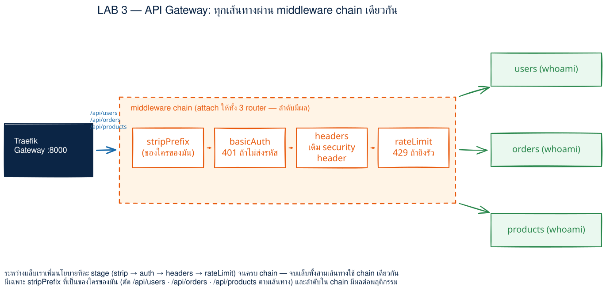
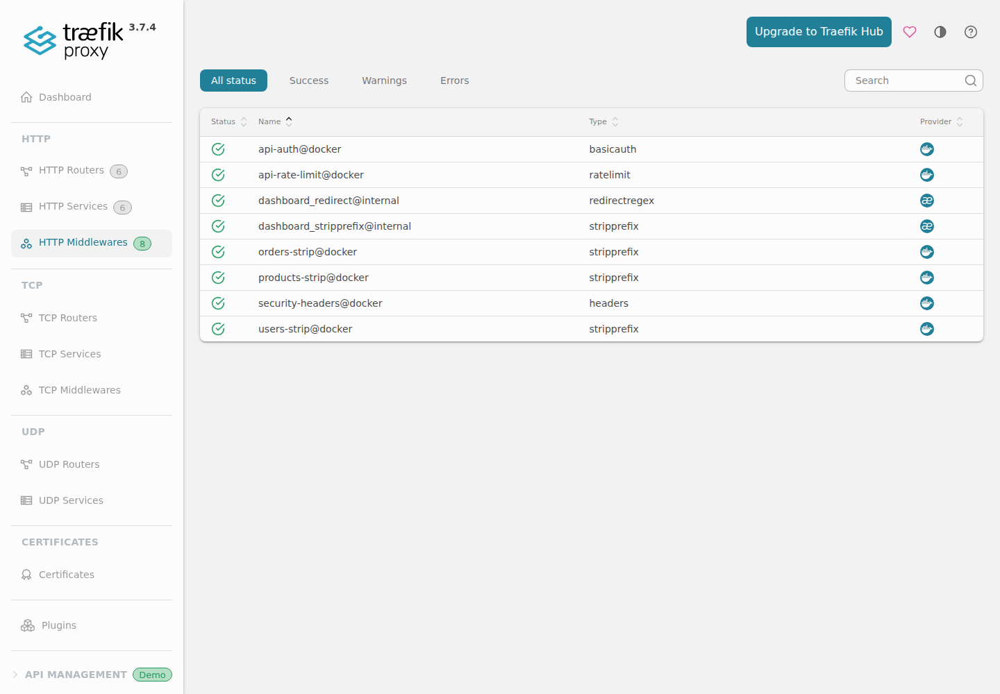
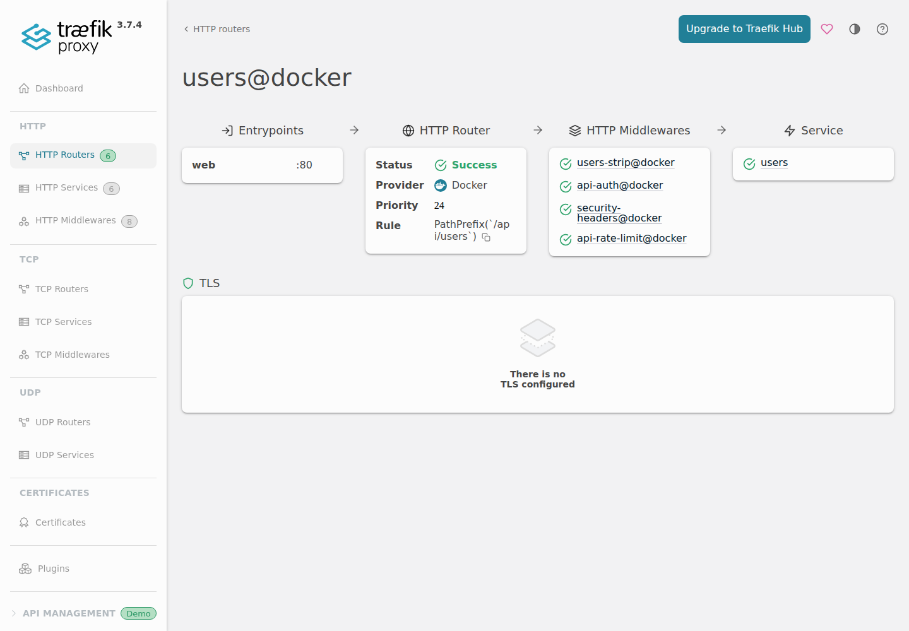

# LAB 3 — สร้าง API Gateway ด้วย Traefik Middlewares

> โฟลเดอร์ `003_LAB_API_Gateway_Middlewares` = **LAB 3** ของชุด Traefik: Reverse Proxy · Load Balancer · API Gateway
> (ไฟล์แล็บ: `docker-compose.yml` · `compose.stage0.yml` · `compose.stage1-strip.yml` · `compose.stage2-auth.yml` · `compose.stage3-headers.yml` · `compose.broken.yml`)

## สิ่งที่จะได้เรียนรู้

- รวม microservices จำลอง `users` · `orders` · `products` ไว้หลัง URL เดียวด้วย `PathPrefix`
- เห็นด้วยตาว่า `stripPrefix` เปลี่ยน path ก่อนส่งเข้า backend อย่างไร
- ป้องกัน API ด้วย `basicAuth` และเข้าใจเหตุผลที่ `$` ใน hash ต้องเขียนเป็น `$$` ใน Compose
- เพิ่ม response/security headers จาก gateway โดยไม่แตะ source code ของ backend
- จำกัดอัตราคำขอด้วย token bucket: `average` · `period` · `burst`
- อ่าน access log เพื่อยืนยันสถานะ `200` · `401` · `429`
- ต่อ middleware หลายตัวเป็น chain และเข้าใจว่า **ลำดับมีผล**
- แยกบทบาท **Reverse Proxy** ออกจาก **API Gateway**: ตัวหลังคือ reverse proxy ที่เพิ่ม policy layer กลาง

## ภาพรวมของแล็บนี้

1. เปิดเครื่องเรียนและตรวจ Docker daemon
2. Clone โค้ด แล้วอ่านโครงสร้าง Compose กับ Basic Auth hash
3. เปิด gateway แบบยังไม่มี middleware — ทั้งสาม API ตอบผ่านและ backend เห็น path เต็ม
4. เพิ่ม `stripPrefix` — backend เห็น path ที่ถูกตัด prefix แล้ว
5. เพิ่ม `basicAuth` — ไม่มี credentials ได้ `401`, ส่งถูกต้องได้ `200`
6. เพิ่ม `headers` — response มี `X-Powered-By` กับ `X-Content-Type-Options`
7. ทดลอง Host rule สั้น ๆ เพื่อแยก Host header ออกจาก TCP port forwarding
8. เพิ่ม `rateLimit` — ยิงพร้อมกัน 10 ครั้ง เห็น `200` สองครั้งและ `429` แปดครั้ง
9. อ่าน access log และเปิด Dashboard ดู middleware chain จริง
10. ทดลองให้พังโดยประกาศ `api-auth` ไว้แต่ลืม attach กับ router
11. ทำ clean re-run และเก็บกวาดด้วย `docker compose down`



> **คำถามก่อนเริ่ม:** ถ้าเราประกาศ Basic Auth middleware สำเร็จแล้ว แต่ไม่ได้ใส่ชื่อมันใน router ผู้ใช้ที่ไม่ส่งรหัสผ่านจะได้ `401` หรือ `200`? ข้อ “ทดลองให้พัง” จะพิสูจน์คำตอบจาก Dashboard API และ HTTP response จริง

### Terminal Map

| หน้าต่าง | หน้าที่ | เปิดเมื่อใด |
|---|---|---|
| **T1** | รัน Compose, `curl`, ดู log และ cleanup | ใช้ตลอด LAB |
| **Browser** | ดู Traefik Dashboard ผ่าน port forwarding | เปิดในข้อ 9 |

ทุกคำสั่งใน T1 รัน **ข้างในเครื่องเรียน `devtools`** หลัง SSH เข้าไปแล้ว

---

## 0. เตรียมเครื่องเรียน

ทำบนเครื่องของเราเอง เปิด classroom container ที่มี Docker พร้อมใช้ แล้ว SSH เข้าไป:

```bash
docker start devtools 2>/dev/null || \
  docker run -dit --name devtools --privileged -p 2222:22 tuchsanai/devtools:2569_1
ssh root@localhost -p 2222        # password : passwd
```

> 📝 **คำอธิบาย:** `docker start ... || docker run ...` เปิดกล่องเดิมก่อน และสร้างใหม่เมื่อยังไม่มีเท่านั้น จึงไม่ทำ clone เดิมหาย · `-dit` รันเบื้องหลังพร้อม terminal · `--privileged` จำเป็นสำหรับ Docker ซ้อน Docker ใน classroom · `-p 2222:22` ส่ง SSH port จากเครื่องเราเข้า port 22 ของกล่อง

> ⚠️ `--privileged` ให้สิทธิ์สูงมาก ใช้เฉพาะ disposable classroom container นี้ ไม่ควรใช้กับ production workload

> ใน VS Code แนะนำใช้ **Remote-SSH** ต่อ `root@localhost:2222` แล้วเปิดโฟลเดอร์แล็บจากข้างในกล่อง

ตรวจว่า Docker CLI คุยกับ daemon ได้จริง:

```bash
docker --version
docker info --format 'Docker daemon: {{.ServerVersion}}'
```

> 📝 **คำอธิบาย:** บรรทัดแรกดูเวอร์ชัน CLI ส่วนบรรทัดที่สองถาม server โดยตรง จึงแยกอาการ “มีคำสั่ง docker แต่ daemon ยังไม่พร้อม” ได้ ถ้าเห็น `Cannot connect to the Docker daemon` ให้รอสักครู่แล้วลองใหม่

✅ **Expected output** — เลขเวอร์ชันของผู้เรียนอาจต่างได้ แต่ต้องมีครบสองบรรทัดและไม่มี error:

```text
Docker version 29.6.2, build dfc4efb
Docker daemon: 29.6.2
```

---

## 1. Clone โค้ดแล็บ

```bash
mkdir -p ~/labwork && cd ~/labwork
git clone https://github.com/Tuchsanai/DevTools.git
cd DevTools/03_Application_Docker/03_Traefik_Reverse_Proxy_Gateway_LB/003_LAB_API_Gateway_Middlewares
```

> 📝 **คำอธิบาย:** `mkdir -p` สร้างพื้นที่ทำงานโดยไม่ error ถ้ามีอยู่แล้ว · `git clone` ดึง public course repository · `cd` เข้า LAB 3 ให้ถูกที่ก่อนใช้ Compose ถ้าเคย clone แล้ว ให้ข้ามบรรทัด clone และ `cd` เข้ามาได้เลย

✅ **Expected output** — รอบทดสอบจริง stdout/stderr ที่จับได้มีบรรทัดนี้; เมื่อรันใน terminal แบบ interactive อาจเห็น progress เพิ่ม:

```text
Cloning into 'DevTools'...
```

ตรวจรายชื่อ service ที่ Compose อ่านได้:

```bash
docker compose config --services
```

> 📝 **คำอธิบาย:** `config` merge และ validate YAML โดยยังไม่สร้าง container · `--services` แสดงเฉพาะชื่อ service ถ้า YAML ผิด indentation หรือ syntax จะหยุดตรงนี้ก่อน pull image

✅ **Expected output** — มี gateway หนึ่งตัวและ backend เชิงธุรกิจสามตัว:

```text
orders
products
traefik
users
```

### อ่าน Compose ก่อนรัน

- `traefik:v3.7.4` เปิด Docker provider, entrypoint `web=:80`, insecure dashboard และ access log
- publish `8000:80` สำหรับ API และ `8080:8080` สำหรับ Dashboard
- ทุก backend ใช้ `traefik/whoami:v1.11`, มี `traefik.enable=true` และระบุ service port `80`
- ทุก service อยู่ user-defined network ชื่อคงที่ `labnet`; ไม่มี `container_name` จึงไม่ปิดทางการ scale
- routing หลักใช้ `PathPrefix(...)` กับ `/api/...`; client เห็น gateway URL เดียว แต่ Traefik ส่งไปคนละ container
- Docker socket mount เป็น `/var/run/docker.sock:/var/run/docker.sock:ro`

> ⚠️ `:ro` ทำให้ไฟล์ socket ถูก mount แบบ read-only แต่ **ไม่ได้ลด Docker API ให้เป็น read-only** ผู้ที่เข้าถึง socket ยังมีสิทธิ์ควบคุม daemon สูงมาก จึงใช้วิธีนี้เฉพาะ LAB งานจริงควรใช้ socket proxy/สิทธิ์ที่จำกัดและแยก trust boundary

> ⚠️ `--api.insecure=true` เปิด Dashboard โดยไม่มี authentication ใช้เพื่อเรียนบนเครื่องส่วนตัวเท่านั้น **ห้ามใช้ใน production**

---

## 2. สร้างและอ่าน Basic Auth hash

สร้าง hash ของบัญชี LAB ด้วย image `httpd` โดยไม่ต้องติดตั้ง `htpasswd` ลงเครื่อง:

```bash
docker run --rm httpd:2.4-alpine htpasswd -nb student student123
```

> 📝 **คำอธิบาย:** `--rm` ลบ helper container เมื่อจบ · `htpasswd -n` พิมพ์ผลทาง stdout แทนการเขียนไฟล์ · `-b` รับรหัสผ่านจาก command lineเพื่อให้ทดลองซ้ำง่าย บัญชี `student`/`student123` เป็นข้อมูลสมมติสำหรับ LAB เท่านั้น งานจริงควรรับ secret แบบไม่โผล่ใน shell history

✅ **Expected output** — salt ถูกสุ่มใหม่ทุกครั้ง ดังนั้น hash ของผู้เรียน **ไม่ตรงเอกสารได้**; รอบทดสอบนี้ได้:

```text
student:$apr1$hJHCQMaA$MuhWGQBh6EhncM1XMCm1M1
```

ดูค่าเดียวกันที่เตรียมไว้ใน Compose:

```bash
grep 'basicauth.users' docker-compose.yml
```

> 📝 **คำอธิบาย:** Compose ใช้ `$` สำหรับ environment-variable interpolation จึงต้อง escape `$` ทุกตัวใน hash เป็น `$$` มิฉะนั้น hash ที่ส่งให้ Traefik จะเสียรูป เมื่อ Compose render config จริง `$$` จะกลับเป็น `$` หนึ่งตัว

✅ **Expected output** — จุดสำคัญคือ `$` ทุกตัวใน hash ถูกเขียนเป็น `$$`:

```text
      traefik.http.middlewares.api-auth.basicauth.users: student:$$apr1$$hJHCQMaA$$MuhWGQBh6EhncM1XMCm1M1
```

---

## 3. Stage 0 — Gateway ที่ยังไม่มี middleware

ดึง image ที่ pin ไว้ แล้วเปิด override `stage0` ซึ่งตั้ง middleware list ของทั้งสาม router เป็นค่าว่าง:

```bash
docker compose pull
docker compose -f docker-compose.yml -f compose.stage0.yml up -d
until curl -sf http://localhost:8080/api/overview >/dev/null; do sleep 1; done
```

> 📝 **คำอธิบาย:** `pull` ดึง image ตาม tag ที่ล็อกไว้ · `-f` เรียงจากไฟล์ฐานไปไฟล์ override ค่าจาก `stage0` จึงชนะเฉพาะ label middleware · `up -d` สร้าง network/container แล้วคืน prompt · ลูป `until` ถาม Dashboard API ทุก 1 วินาทีแทนการเดาเวลาบูต

✅ **Expected output** — ครั้งแรกมีข้อความ pull/create หลายบรรทัด จุดสำคัญคือ image ทั้งคู่ `Pulled` และ container ทั้งสี่ `Started` (layer ID กับลำดับบรรทัดต่างได้):

```text
 Image traefik:v3.7.4 Pulled
 Image traefik/whoami:v1.11 Pulled
 Network labnet Created
 Container 003_lab_api_gateway_middlewares-traefik-1 Started
 Container 003_lab_api_gateway_middlewares-users-1 Started
 Container 003_lab_api_gateway_middlewares-orders-1 Started
 Container 003_lab_api_gateway_middlewares-products-1 Started
```

ตรวจ container และ port:

```bash
docker compose ps
```

> 📝 **คำอธิบาย:** backend เปิดเพียง `80/tcp` ใน network ภายใน ไม่ publish ถึงเครื่องผู้เรียนโดยตรง · Traefik เป็นประตูเดียวที่ publish `8000` และ `8080` จึงเป็น reverse proxy ตั้งแต่ stage แรก

✅ **Expected output** — ID/เวลาอาจต่าง จุดที่ต้องเห็นคือสี่แถวสถานะ `Up` และ port mapping อยู่ที่ `traefik` เท่านั้น:

```text
NAME                                         IMAGE                  COMMAND                  SERVICE    CREATED        STATUS                  PORTS
003_lab_api_gateway_middlewares-orders-1     traefik/whoami:v1.11   "/whoami"                orders     1 second ago   Up Less than a second   80/tcp
003_lab_api_gateway_middlewares-products-1   traefik/whoami:v1.11   "/whoami"                products   1 second ago   Up Less than a second   80/tcp
003_lab_api_gateway_middlewares-traefik-1    traefik:v3.7.4         "/entrypoint.sh --pr…"   traefik    1 second ago   Up Less than a second   0.0.0.0:8080->8080/tcp, [::]:8080->8080/tcp, 0.0.0.0:8000->80/tcp, [::]:8000->80/tcp
003_lab_api_gateway_middlewares-users-1      traefik/whoami:v1.11   "/whoami"                users      1 second ago   Up Less than a second   80/tcp
```

ยิงสาม path ผ่าน gateway:

```bash
for path in users/profile orders/42 products/7; do
  printf '%s -> ' "$path"
  curl -s -o /dev/null -w '%{http_code}\n' "http://localhost:8000/api/$path"
done
curl -s http://localhost:8000/api/users/profile | grep '^GET'
```

> 📝 **คำอธิบาย:** `curl` ทุกครั้งเข้า Traefik port `8000` เหมือนกัน แต่ `PathPrefix` เลือก backend คนละตัว · `-o /dev/null` ทิ้ง body, `-w` พิมพ์ status · บรรทัดสุดท้ายอ่าน request line ที่ whoami ได้รับ ก่อนมี `stripPrefix` จึงยังเห็น `/api/users/profile` เต็ม ๆ

✅ **Expected output:**

```text
users/profile -> 200
orders/42 -> 200
products/7 -> 200
GET /api/users/profile HTTP/1.1
```

ตอนนี้ Traefik ทำหน้าที่ **Reverse Proxy**: รับ request แทน backend และ route ตาม path แต่ยังไม่มี policy layer

---

## 4. Stage 1 — เพิ่ม `stripPrefix`

```bash
docker compose -f docker-compose.yml -f compose.stage1-strip.yml up -d
until curl -sf http://localhost:8000/api/users/profile | grep -q '^GET'; do sleep 1; done
curl -s http://localhost:8000/api/users/profile | grep '^GET'
curl -s http://localhost:8000/api/orders/42 | grep '^GET'
curl -s http://localhost:8000/api/products/7 | grep '^GET'
```

> 📝 **คำอธิบาย:** override นี้ attach `users-strip`, `orders-strip`, `products-strip` ให้ router แต่ละตัว · Traefik match path ภายนอกก่อน แล้ว middleware ตัด prefix เฉพาะส่วนธุรกิจออกก่อน proxy ต่อ · ลูปรอจน Docker provider โหลด labels ชุดใหม่ ช่วยเลี่ยง `404` ชั่วคราวตอน container recreate

✅ **Expected output** — เทียบ stage 0: `/api/users` หาย เหลือ `/profile`; อีกสอง service ก็ถูกตัด prefix ของตัวเอง:

```text
GET /profile HTTP/1.1
GET /42 HTTP/1.1
GET /7 HTTP/1.1
```

นี่คือเหตุผลที่ client ใช้ namespace กลาง `/api/users/...` ได้ โดย backend ไม่จำเป็นต้องรู้ prefix ภายนอก

---

## 5. Stage 2 — เพิ่ม `basicAuth`

```bash
docker compose -f docker-compose.yml -f compose.stage2-auth.yml up -d
until [ "$(curl -s -o /dev/null -w '%{http_code}' http://localhost:8000/api/users/profile)" = 401 ]; do sleep 1; done
printf 'without credentials: '
curl -s -o /dev/null -w '%{http_code}\n' http://localhost:8000/api/users/profile
printf 'with credentials:    '
curl -s -u student:student123 -o /dev/null -w '%{http_code}\n' http://localhost:8000/api/users/profile
```

> 📝 **คำอธิบาย:** chain ตอนนี้คือ `strip → auth` · request แรกไม่มี `Authorization` จึงถูก gateway หยุดด้วย `401` และไม่ถึง backend · `-u` สร้าง Basic Auth header จาก user/password จึงผ่านเป็น `200` ใช้บัญชีนี้เฉพาะ LAB เพราะ Basic Auth ต้องวางหลัง HTTPS ในระบบจริง

✅ **Expected output:**

```text
without credentials: 401
with credentials:    200
```

ตรวจ “ก่อนเพิ่ม headers” ไว้เป็นค่าฐาน:

```bash
printf 'X-Powered-By before headers: '
curl -si -u student:student123 http://localhost:8000/api/users/profile | \
  grep -ci '^X-Powered-By:' || true
```

> 📝 **คำอธิบาย:** `-i` รวม response headers · `grep -c` นับบรรทัดที่ชื่อ `X-Powered-By`; `|| true` ทำให้ count ศูนย์ไม่หยุด shell ค่านี้จะใช้เทียบ stage ถัดไป

✅ **Expected output:**

```text
X-Powered-By before headers: 0
```

---

## 6. Stage 3 — เพิ่ม response/security `headers`

```bash
docker compose -f docker-compose.yml -f compose.stage3-headers.yml up -d
until curl -si -u student:student123 http://localhost:8000/api/users/profile | \
  grep -qi '^X-Powered-By: DevTools-Gateway'; do sleep 1; done
curl -si -u student:student123 http://localhost:8000/api/users/profile | \
  sed -n '1p;/^X-Powered-By:/Ip;/^X-Content-Type-Options:/Ip'
```

> 📝 **คำอธิบาย:** chain เป็น `strip → auth → headers` · `customResponseHeaders` เพิ่มชื่อ gateway เพื่อสาธิต ส่วน `contentTypeNosniff=true` เพิ่ม `X-Content-Type-Options: nosniff` ลด content-type sniffing · policy เกิดที่ gateway จึงใช้กับ backend ทั้งสามโดยไม่แก้ image whoami

✅ **Expected output:**

```text
HTTP/1.1 200 OK
X-Content-Type-Options: nosniff
X-Powered-By: DevTools-Gateway
```

พิสูจน์ค่าฐานก่อนเพิ่ม rate limit ด้วยการยิงพร้อมกัน 10 ครั้ง:

```bash
seq 1 10 | xargs -P10 -I{} \
  curl -s -u student:student123 -o /dev/null -w '%{http_code}\n' \
  http://localhost:8000/api/users/profile | sort | uniq -c
```

> 📝 **คำอธิบาย:** `seq` สร้างงานสิบชิ้น · `xargs -P10` รันพร้อมกันสูงสุดสิบ process · stage นี้ยังไม่มี rate limiter จึงผ่านทั้งหมด · `sort | uniq -c` รวมผลให้อ่านง่าย

✅ **Expected output:**

```text
     10 200
```

---

## 7. ทดลอง Host rule — port forwarding ไม่แก้ Host header

Compose หลักมี router เสริม `users-host` ที่ match กฎ `Host(...)` ด้วยค่า `app.lab` ลอง path ที่ไม่ match router แบบ PathPrefix:

```bash
printf 'default Host: '
curl -s -o /dev/null -w '%{http_code}\n' http://localhost:8000/host-demo
printf 'Host app.lab: '
curl -s -H 'Host: app.lab' -u student:student123 \
  http://localhost:8000/host-demo | grep '^GET'
```

> 📝 **คำอธิบาย:** request แรกส่ง Host ตาม URL (`localhost`) จึงไม่ match และได้ `404` · `-H 'Host: app.lab'` เปลี่ยน HTTP Host header ทำให้ router เสริม match · การ forward TCP port `8000` ส่งเพียง byte stream ไม่รู้จักและไม่แก้ Host header ให้เรา จึงต้องส่ง `-H` เองในการทดลอง local แบบนี้

✅ **Expected output:**

```text
default Host: 404
Host app.lab: GET /host-demo HTTP/1.1
```

Routing หลักของ LAB ยังเป็น PathPrefix เพราะใช้ผ่าน SSH port forwarding ได้ตรงไปตรงมา; Host rule นี้เป็นแบบฝึกสั้นเพื่อแยกแนวคิด layer 4 กับ layer 7

---

## 8. สถานะสุดท้าย — เพิ่ม `rateLimit`

กลับมาใช้ Compose หลักโดยไม่ใส่ stage override แล้ว restart Traefik เพื่อเริ่ม token bucket ใหม่:

```bash
docker compose up -d
docker compose restart traefik
until curl -sf http://localhost:8080/api/overview >/dev/null; do sleep 1; done
sleep 1
```

> 📝 **คำอธิบาย:** Compose หลัก attach chain ครบ `strip → auth → headers → rateLimit` ให้ทั้งสาม API routers · `restart traefik` ล้างสถานะ bucket จาก request ก่อนหน้าเพื่อให้ผลสาธิตอ่านง่าย · readiness loop รอ Dashboard API; `sleep 1` เว้นให้ Docker provider โหลด config หลัง process พร้อมรับ TCP

✅ **Expected output** — backend ถูก recreate เพราะ label chain เปลี่ยน และ Traefik restart สำเร็จ:

```text
Container 003_lab_api_gateway_middlewares-users-1 Recreated
Container 003_lab_api_gateway_middlewares-orders-1 Recreated
Container 003_lab_api_gateway_middlewares-products-1 Recreated
Container 003_lab_api_gateway_middlewares-traefik-1 Restarting
Container 003_lab_api_gateway_middlewares-traefik-1 Started
```

ยิงคำสั่งตามโจทย์พร้อมกัน 10 ครั้ง แล้วนับ status:

```bash
seq 1 10 | xargs -P10 -I{} \
  curl -s -u student:student123 -o /dev/null -w '%{http_code}\n' \
  http://localhost:8000/api/users/profile | tee /tmp/lab3-status.txt
sort /tmp/lab3-status.txt | uniq -c
```

> 📝 **คำอธิบาย:** rate limiter ตั้ง `average=1`, `period=10s`, `burst=2` · token bucket จุได้ 2 token จึงปล่อย burst แรกประมาณสองคำขอ (`200`) แล้วคำขอที่ไม่มี token ถูกตีกลับ `429 Too Many Requests` · `average/period` หมายถึงเติม 1 token ทุก 10 วินาที ไม่ใช่เติมสิบ tokenพร้อมกัน · ลำดับ 200/429 ด้านบนเปลี่ยนได้ตาม scheduling แต่ยอดรวมควรใกล้ 2 กับ 8

✅ **Expected output** — รอบทดสอบจริงได้ status ตามลำดับนี้ และสรุป 2/8:

```text
429
429
429
200
429
429
200
429
429
429
      2 200
      8 429
```

รอหนึ่ง period แล้วลองใหม่:

```bash
sleep 10
curl -s -u student:student123 -o /dev/null -w '%{http_code}\n' \
  http://localhost:8000/api/users/profile
```

> 📝 **คำอธิบาย:** หลัง 10 วินาที bucket ได้ token ใหม่หนึ่งตัว request ถัดไปจึงผ่าน แสดงว่า rate limiter จำกัด “อัตรา” ไม่ใช่ block ผู้ใช้ถาวร

✅ **Expected output:**

```text
200
```

> **ทำไมลำดับ chain มีผล:** วาง `auth` ก่อน `rateLimit` ทำให้ request ที่ login ไม่ผ่านจบด้วย `401` ก่อนกิน token · วาง `headers` ก่อน `rateLimit` ทำให้ response `429` ก็ได้ security headers ด้วย หากสลับลำดับ พฤติกรรมและต้นทุนของแต่ละ request อาจเปลี่ยน

---

## 9. อ่าน access log — หลักฐาน `200` · `401` · `429`

```bash
docker compose logs --no-log-prefix traefik | \
  grep 'GET /api/users/profile' | grep -E ' (200|401|429) ' | tail -12
```

> 📝 **คำอธิบาย:** `--accesslog=true` บันทึกทุก request ที่ Traefik รับ · `--no-log-prefix` เอาชื่อ Compose service ด้านหน้าออกให้อ่านง่าย · field หลัง request line คือ HTTP status · เครื่องหมาย `-` แทน user ที่ยังไม่ authenticate ส่วน `student` ปรากฏเมื่อ Basic Auth สำเร็จ

✅ **Expected output** — IP, เวลา, request counter และ latency ของผู้เรียนต่างได้; รอบนี้เห็นทั้งสาม status จริง:

```text
172.19.0.1 - - [14/Aug/2026:09:00:58 +0000] "GET /api/users/profile HTTP/1.1" 401 17 "-" "-" 21 "users@docker" "-" 0ms
172.19.0.1 - student [14/Aug/2026:09:01:02 +0000] "GET /api/users/profile HTTP/1.1" 429 17 "-" "-" 1 "users@docker" "-" 0ms
172.19.0.1 - student [14/Aug/2026:09:01:02 +0000] "GET /api/users/profile HTTP/1.1" 200 444 "-" "-" 2 "users@docker" "http://172.19.0.5:80" 1ms
        ... (รอบยิงพร้อมกันมี 200 รวม 2 บรรทัด และ 429 รวม 8 บรรทัด) ...
172.19.0.1 - student [14/Aug/2026:09:01:18 +0000] "GET /api/users/profile HTTP/1.1" 200 444 "-" "-" 11 "users@docker" "http://172.19.0.5:80" 0ms
```

สังเกตว่า `401` และ `429` มี upstream เป็น `"-"` เพราะ middleware ตอบกลับก่อนถึง backend ส่วน `200` แสดง URL ของ whoami ปลายทาง

---

## 10. เปิด Traefik Dashboard

Dashboard อยู่ที่ port `8080` ข้างในเครื่องเรียน ให้ VS Code สร้าง SSH port forwarding:

1. เปิดแท็บ **PORTS** ข้าง TERMINAL
2. กด **Forward a Port** แล้วใส่ `8080`
3. ใส่ `8000` เพิ่มด้วยถ้าต้องการเปิด API จาก browser
4. เปิด `http://localhost:8080/dashboard/`

> ⚠️ URL Dashboard ต้องมี trailing slash: `/dashboard/` ไม่ใช่ `/dashboard`

> 📝 **คำอธิบาย:** port forwarding ทำให้ browser บนเครื่องเราเห็น port ที่เปิดอยู่ข้างใน Remote-SSH session · หน้า **HTTP Middlewares** ต้องเห็น middleware จาก Docker provider ทั้งหกตัวของ LAB (`api-auth`, `api-rate-limit`, strip สามตัว, `security-headers`) · หน้า **HTTP Routers → users@docker** แสดง chain ตามลำดับเดียวกับ label





ภาพทั้งสองจับจาก `http://localhost:8080/dashboard/` path เดียวกับที่ผู้เรียนเห็นผ่าน port forwarding (รอบ build ใช้ bridge IP ของ classroom container ตาม test protocol)

---

## 11. ทดลองให้พัง — ประกาศ middleware แต่ลืม attach

ใช้ override ที่ **ไม่ได้ลบ** `api-auth` ออกจาก provider แต่เอาชื่อมันออกจาก middleware list ของ routers:

```bash
docker compose -f docker-compose.yml -f compose.broken.yml up -d
sleep 10
printf 'without credentials: '
curl -s -o /dev/null -w '%{http_code}\n' http://localhost:8000/api/users/profile
```

> 📝 **คำอธิบาย:** `compose.broken.yml` override เฉพาะ `routers.*.middlewares` ให้เหลือ strip, headers, rate limit · `sleep 10` รอ token หนึ่ง period เพื่อไม่ให้ `429` บังผล auth · request ไม่ส่ง `-u` แต่กลับผ่าน เพราะ middleware ที่ไม่ได้ attach จะไม่ถูกรัน

✅ **Expected output** — สิ่งที่ “พัง” คือ policy หลุด จึงได้ `200` แทน `401`:

```text
without credentials: 200
```

ถาม Dashboard API แยกสองคำถาม: middleware ถูกประกาศไหม และ router attach อะไรอยู่:

```bash
printf 'declared: '
curl -s http://localhost:8080/api/http/middlewares | \
  python3 -c 'import json,sys; print(next(x["name"] for x in json.load(sys.stdin) if x["name"] == "api-auth@docker"))'
printf 'attached: '
curl -s http://localhost:8080/api/http/routers/users@docker | \
  python3 -c 'import json,sys; print(", ".join(json.load(sys.stdin)["middlewares"]))'
```

> 📝 **คำอธิบาย:** Python ใช้เฉพาะ stdlib `json` แปลง Dashboard API · ผลบรรทัดแรกยืนยันว่า `api-auth@docker` มีอยู่และสถานะโหลดสำเร็จ · บรรทัดสองพิสูจน์ว่า router ไม่มีชื่อมันอยู่ใน chain การ “ประกาศ” จึงไม่เท่ากับ “ใช้งาน”

✅ **Expected output:**

```text
declared: api-auth@docker
attached: users-strip@docker, security-headers@docker, api-rate-limit@docker
```

แก้โดยกลับมาใช้ Compose หลัก ซึ่ง attach `api-auth@docker` ไว้ใน label:

```bash
docker compose up -d
until [ "$(curl -s -o /dev/null -w '%{http_code}' http://localhost:8000/api/users/profile)" = 401 ]; do sleep 1; done
printf 'without credentials after fix: '
curl -s -o /dev/null -w '%{http_code}\n' http://localhost:8000/api/users/profile
```

> 📝 **คำอธิบาย:** เมื่อไม่ระบุ `compose.broken.yml` ค่า chain จากไฟล์หลักกลับมา · readiness loop ใช้พฤติกรรม security policy (`401`) เป็นตัวตัดสินว่า Docker provider โหลด config ชุดแก้แล้ว

✅ **Expected output:**

```text
without credentials after fix: 401
```

> **บทเรียนจากความพัง:** Dashboard มี middleware สีเขียว ไม่ได้รับประกันว่า router ใช้มัน ต้องเปิด router detail หรือดู `routers/...` API แล้วตรวจ middleware chain เสมอ

---

## 12. พิสูจน์ clean re-run

ลบ stack แล้วเปิดใหม่จากไฟล์เดิม เพื่อยืนยันว่า LAB ไม่พึ่ง state ที่ค้างจาก stage ก่อนหน้า:

```bash
docker compose down
docker compose up -d
until [ "$(curl -s -o /dev/null -w '%{http_code}' http://localhost:8000/api/users/profile)" = 401 ]; do sleep 1; done
docker compose ps --format 'table {{.Service}}\t{{.Image}}\t{{.Status}}\t{{.Ports}}'
printf 'clean re-run without credentials: '
curl -s -o /dev/null -w '%{http_code}\n' http://localhost:8000/api/users/profile
```

> 📝 **คำอธิบาย:** `down` หยุดและลบ containers กับ network ของ project แต่เก็บ images ไว้ · `up -d` จึงสร้างทุกอย่างจาก declaration เดิมแบบสะอาด · ผล `401` ยืนยันว่า chain สุดท้ายกลับมาครบ ไม่ได้อาศัย config จาก override ที่เคยรัน

✅ **Expected output** — ลำดับ stop/remove อาจต่างตาม scheduling; ท้ายสุดต้องเห็นสี่ service และ `401`:

```text
Container 003_lab_api_gateway_middlewares-users-1 Removed
Container 003_lab_api_gateway_middlewares-orders-1 Removed
Container 003_lab_api_gateway_middlewares-products-1 Removed
Container 003_lab_api_gateway_middlewares-traefik-1 Removed
Network labnet Removed
Network labnet Created
Container 003_lab_api_gateway_middlewares-users-1 Started
Container 003_lab_api_gateway_middlewares-orders-1 Started
Container 003_lab_api_gateway_middlewares-products-1 Started
Container 003_lab_api_gateway_middlewares-traefik-1 Started
SERVICE    IMAGE                  STATUS        PORTS
orders     traefik/whoami:v1.11   Up 1 second   80/tcp
products   traefik/whoami:v1.11   Up 1 second   80/tcp
traefik    traefik:v3.7.4         Up 1 second   0.0.0.0:8080->8080/tcp, [::]:8080->8080/tcp, 0.0.0.0:8000->80/tcp, [::]:8000->80/tcp
users      traefik/whoami:v1.11   Up 1 second   80/tcp
clean re-run without credentials: 401
```

---

## Reverse Proxy กับ API Gateway ต่างกันตรงไหนใน LAB นี้

| มุมมอง | Reverse Proxy | API Gateway ใน LAB 3 |
|---|---|---|
| จุดเข้า | รับ request แทน backend | รับ request แทน microservices เช่นกัน |
| Routing | เลือก service ด้วย `PathPrefix` | ใช้ routing เดิม และซ่อน path ภายในด้วย `stripPrefix` |
| Policy กลาง | ไม่จำเป็นต้องมี | รวม auth, headers, rate limit ไว้ก่อน backend |
| Backend | client ไม่ต้องรู้ container address | client เห็น API เดียว แม้หลังบ้านเป็น users/orders/products |
| หลักฐาน | stage 0 route ได้ `200` ทั้งสาม service | stage สุดท้ายบังคับ `401`, เพิ่ม headers และคืน `429` ได้ |

ดังนั้นสองคำนี้ไม่ใช่กล่องคนละชนิดแบบตัดขาด: **Traefik ตัวเดียวกันเป็น Reverse Proxy และกลายเป็น API Gateway เมื่อเราเพิ่ม policy layer ด้วย middleware**

---

## แก้ปัญหาที่พบบ่อย

| อาการ | สาเหตุ | วิธีแก้ |
|---|---|---|
| `404 page not found` ทันทีหลัง `up -d` | Docker provider ยังโหลด labels ใหม่ไม่ครบ หรือ path ไม่ตรง | ใช้ readiness loop ของแต่ละข้อ แล้วตรวจว่า URL เริ่ม `/api/users`, `/api/orders`, `/api/products` |
| ไม่มี credentials แต่ได้ `200` | ประกาศ auth แล้วแต่ไม่ได้ attach หรือยังใช้ `compose.broken.yml` | รัน `docker compose up -d` โดยไม่ใส่ override แล้วตรวจ router detail |
| ส่งรหัสถูกแต่ยัง `401` | hash เสียเพราะ `$` ไม่ได้ escape | ใน Compose ต้องเป็น `$$`; ตรวจด้วย `grep 'basicauth.users' docker-compose.yml` |
| ได้ `429` ระหว่างทดสอบหัวข้ออื่น | token bucket ยังไม่เติม | รอ 10 วินาที หรือ restart Traefik ก่อนเริ่ม rate-limit experiment |
| Dashboard เปิดไม่ขึ้น | ไม่ได้ forward port หรือ URL ขาด slash ท้าย | forward `8080` แล้วเปิด `http://localhost:8080/dashboard/` |
| Traefik ไม่เห็น backend | backend ไม่มี label/port หรืออยู่คนละ network | ตรวจ `traefik.enable=true`, service port `80` และ network `labnet` |
| port `8000`/`8080` ถูกใช้แล้ว | stack LAB อื่นยังไม่ cleanup | เข้า LAB เดิมแล้ว `docker compose down` ก่อนกลับมารัน LAB 3 |

---

## เก็บกวาด (Cleanup)

เมื่อจบแล้วปิด port forwarding ใน VS Code และลบ stack:

```bash
docker compose down
docker compose ps
```

> 📝 **คำอธิบาย:** `down` หยุดและลบ container ทั้งสี่รวมถึง `labnet` ป้องกัน port `8000`/`8080` ชน LAB ถัดไป · image ยังอยู่ใน cache จึงไม่ต้องดาวน์โหลดใหม่ · `docker compose ps` ตรวจซ้ำว่าไม่มี container ของ project ค้าง

✅ **Expected output** — ลำดับ stop อาจต่าง แต่ต้องมี `Removed`, network ถูกลบ และ `docker compose ps` เหลือหัวตาราง:

```text
Container 003_lab_api_gateway_middlewares-users-1 Removed
Container 003_lab_api_gateway_middlewares-orders-1 Removed
Container 003_lab_api_gateway_middlewares-products-1 Removed
Container 003_lab_api_gateway_middlewares-traefik-1 Removed
Network labnet Removed
NAME      IMAGE     COMMAND   SERVICE   CREATED   STATUS    PORTS
```

---

## สรุปคำสั่งของแล็บนี้

| คำสั่ง | ความหมาย |
|---|---|
| `docker compose -f docker-compose.yml -f compose.stageN.yml up -d` | ใช้ไฟล์ฐานแล้ว override เฉพาะ middleware chain เพื่อเทียบก่อน/หลัง |
| `curl -s -o /dev/null -w '%{http_code}\n' ...` | ทิ้ง body แล้วอ่าน HTTP status โดยตรง |
| `curl -u student:student123 ...` | ส่ง Basic Auth credentials ของ LAB |
| `seq 1 10 \| xargs -P10 ...` | ยิงสิบ request พร้อมกันเพื่อเติม token bucket จนเต็ม |
| `docker compose logs traefik` | อ่าน access log และหลักฐาน status จาก gateway |
| `docker compose down` | ลบ stack/network คืน port ให้ LAB ถัดไป |

## ✅ เช็กลิสต์ก่อนจบแล็บ

- [ ] Docker CLI และ daemon ตอบเวอร์ชัน ไม่มี connection error
- [ ] `docker compose config --services` เห็น `traefik`, `users`, `orders`, `products`
- [ ] stage 0 ตอบ `200` ทั้งสาม path และ users backend เห็น `GET /api/users/profile`
- [ ] stage 1 ทำให้ backend เห็น `GET /profile`
- [ ] stage 2 ไม่ส่ง credentials ได้ `401`, ส่ง `student/student123` ได้ `200`
- [ ] stage 3 response มี `X-Powered-By: DevTools-Gateway` และ `X-Content-Type-Options: nosniff`
- [ ] Host exercise ได้ `404` เมื่อ Host ปกติ และ match เมื่อส่ง `Host: app.lab`
- [ ] ก่อน rate limit ยิงสิบครั้งผ่านทั้งหมด; หลังเพิ่มเห็นประมาณ `2×200` กับ `8×429`
- [ ] รอ 10 วินาทีแล้ว request ใหม่กลับมา `200`
- [ ] access log มี `200`, `401`, `429` และอธิบาย upstream `-` ได้
- [ ] Dashboard Middlewares เห็น policy ทั้งหมด และ `users@docker` เห็น chain สี่ตัวตามลำดับ
- [ ] broken override ยังประกาศ `api-auth` แต่ router ไม่ attach จึงหลุดเป็น `200`; fix แล้วกลับ `401`
- [ ] clean re-run ผ่าน และ `docker compose down` แล้วไม่เหลือ container ของ project

*Expected output และ screenshot ในเอกสารนี้มาจากการรันจริงบน `tuchsanai/devtools:2569_1` เมื่อ 14 ส.ค. 2026*
