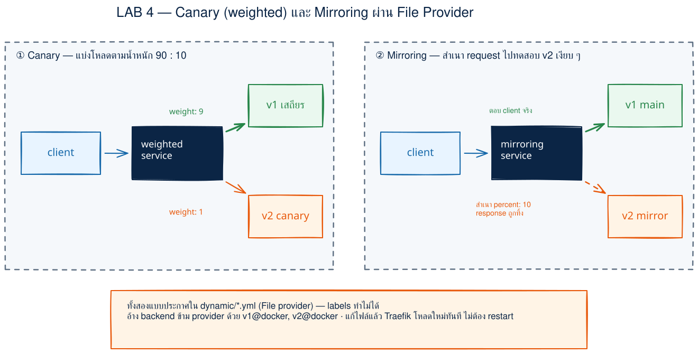
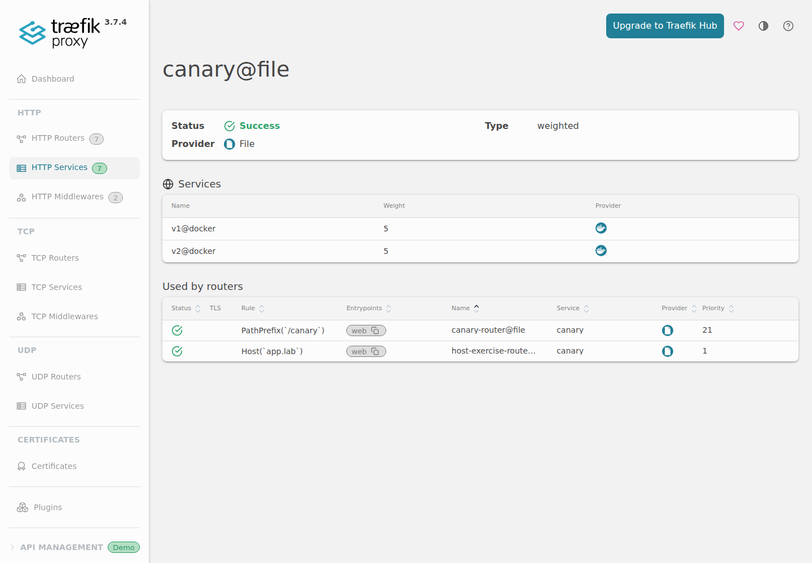
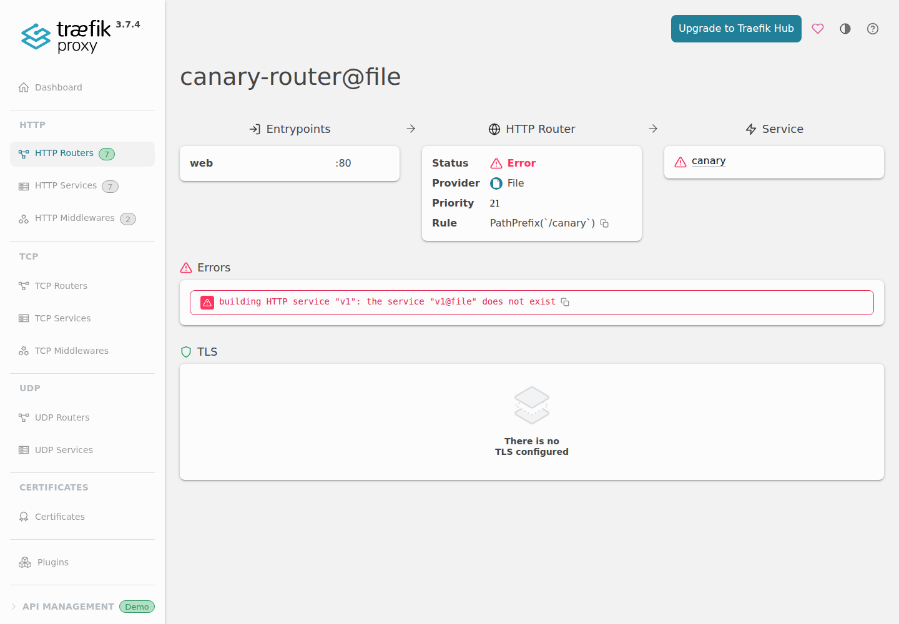

# LAB 4 — Canary Release (Weighted) + Traffic Mirroring ด้วย Traefik

> โฟลเดอร์ `004_LAB_Canary_Mirroring` = LAB สำหรับทดลองปล่อยเวอร์ชันใหม่ทีละน้อย และส่งสำเนา traffic ไปทดสอบแบบที่ผู้ใช้ยังได้รับคำตอบจากเวอร์ชันเสถียร
> (ไฟล์ของแล็บนี้: `docker-compose.yml` · `dynamic/routes.yml` · `images/`)

## สิ่งที่จะได้เรียนรู้

- แยก **static configuration** (วิธีที่ Traefik เริ่มทำงาน) ออกจาก **dynamic configuration** (router/service ที่ reload ระหว่างรันได้)
- ใช้ Docker provider และ file provider พร้อมกัน แล้วอ้าง service ข้าม provider ด้วยชื่อ `v1@docker` / `v2@docker`
- ทำ canary release ด้วย weighted service: เริ่มที่ v1:v2 = 9:1 แล้วเปลี่ยนเป็น 5:5 โดย **ไม่ restart Traefik**
- วัดการกระจายจาก request จริง 200 ครั้ง และเข้าใจว่า weight คือสัดส่วน ไม่ใช่การสร้าง backend เพิ่ม
- ทำ traffic mirroring: ผู้ใช้รับ response จาก v1 เสมอ แต่ v2 ได้สำเนา request ไปทดสอบเบื้องหลัง
- อ่าน dashboard และ log เพื่อ debug dynamic config ที่อ้าง provider ผิด
- เชื่อมบทบาทของ Traefik: รับ request หน้า backend แบบ **Reverse Proxy**, กระจาย canary แบบ **Load Balancer**, และใช้นโยบาย routing/mirroring ที่พบใน **API Gateway**

## ภาพรวมของแล็บนี้

1. เปิดเครื่องเรียนและตรวจว่า inner Docker daemon พร้อม
2. เปิด Traefik, v1 และ v2 บน network เดียวกัน
3. ให้ Docker provider ค้นหา backend ปกติ แต่ให้ file provider สร้าง weighted/mirroring service
4. ยิง `/canary` 200 ครั้งที่ weight 9:1 แล้วนับว่า request ไป v1/v2 เท่าไร
5. แก้ weight เป็น 5:5 และพิสูจน์ว่า file provider reload โดย container Traefik ตัวเดิม
6. เปิด dashboard ดู weighted service และ weight ทั้งสองค่า
7. ยิง `/mirror`: response มาจาก v1 ส่วน log v2 พิสูจน์ว่าได้รับสำเนา
8. ลด mirror จาก 100% เป็น 10% แล้วยิง 100 ครั้งเพื่อนับ log
9. ทดลองทำชื่อ `v1@docker` พังเป็น `v1` แล้วอ่าน router error ก่อนแก้กลับ
10. ทำ clean re-run และเก็บกวาดด้วย `docker compose down`



> **คำถามก่อนเริ่ม:** Canary 10% กับ mirror 10% เหมือนกันหรือไม่? คำตอบสั้น ๆ คือ **ไม่เหมือน** — canary ส่ง request จริงไป v2 และผู้ใช้อาจได้ response จาก v2; mirror ยังส่ง request หลักไป v1 และทิ้ง response ของ v2 ข้อ 4–8 จะพิสูจน์ด้วยผลจริง

### Terminal Map

| หน้าต่าง | หน้าที่ | เปิดเมื่อใด |
|---|---|---|
| **T1** | รัน Docker Compose, curl, ดู log และแก้ config | ใช้ตลอด LAB |
| **Browser** | ดู Traefik Dashboard ผ่าน VS Code port forwarding | เปิดในข้อ 6 และข้อ 10 |

---

## 0. เตรียมเครื่องเรียน

ทำบนเครื่องของเราเอง — เปิด classroom container ที่มี Docker พร้อมสำหรับรัน Docker ซ้อนข้างใน:

```bash
docker start devtools 2>/dev/null || \
  docker run -dit --name devtools --privileged -p 2222:22 tuchsanai/devtools:2569_1
ssh root@localhost -p 2222        # password : passwd
```

> 📝 **คำอธิบาย:** `docker start ... || docker run ...` เปิดกล่องเดิมก่อน และสร้างใหม่เมื่อยังไม่มีเท่านั้น · `-dit` รันเบื้องหลังพร้อม terminal · `--privileged` ให้กล่องนี้เปิด Docker daemon ซ้อนข้างในได้ · `-p 2222:22` ส่ง SSH port ของเครื่องเราเข้า port 22 ของกล่อง · หลัง login แล้ว คำสั่งที่เหลือทั้งหมดให้ทำในกล่อง `devtools`

✅ **Expected output** — คำสั่งแรกจะพิมพ์ `devtools` ถ้าเปิดกล่องเดิม หรือพิมพ์ container ID ถ้าสร้างใหม่; จากนั้น SSH ขอรหัสผ่านและเข้าถึง prompt ของ `root` (ID และข้อความ SSH ครั้งแรกของแต่ละคนไม่ตรงกัน):

```text
devtools
root@localhost's password:
root@devtools:~#
```

> ⚠️ `--privileged` ใช้เฉพาะ disposable classroom container นี้เท่านั้น ไม่ใช้กับ production workload เพราะให้สิทธิ์ระดับสูงมาก

> แนะนำให้ใช้ VS Code **Remote-SSH** ต่อ `root@localhost:2222` แล้วเปิดโฟลเดอร์แล็บจากในกล่อง จะได้แก้ `dynamic/routes.yml` และ forward port ได้สะดวก

ตรวจว่า Docker CLI คุยกับ daemon ข้างในได้จริง:

```bash
docker --version
docker info --format 'Docker daemon: {{.ServerVersion}}'
```

> 📝 **คำอธิบาย:** `docker --version` ตรวจ CLI ส่วน `docker info` ถาม daemon จริง จึงจับกรณีที่มี CLI แต่ daemon ยังไม่พร้อมได้ · ตัวเลขเวอร์ชันไม่จำเป็นต้องตรงเอกสาร แต่ต้องได้ครบสองบรรทัดและไม่มี `Cannot connect to the Docker daemon`

✅ **Expected output** — ผลจากเครื่องทดสอบรอบนี้ (เลขเวอร์ชัน/build ของผู้เรียนอาจต่าง):

```text
Docker version 29.6.2, build dfc4efb
Docker daemon: 29.6.2
```

---

## 1. Clone โค้ดแล็บ

```bash
mkdir -p ~/labwork && cd ~/labwork
git clone https://github.com/Tuchsanai/DevTools.git
cd DevTools/03_Application_Docker/03_Traefik_Reverse_Proxy_Gateway_LB/004_LAB_Canary_Mirroring
```

> 📝 **คำอธิบาย:** `mkdir -p` สร้างพื้นที่ทำงานโดยไม่ error ถ้ามีอยู่แล้ว · `git clone` ดึง public course repository · `cd` บรรทัดสุดท้ายสำคัญ เพราะ path ของ volume `./dynamic` ใน Compose อิงจากโฟลเดอร์นี้ · ถ้า clone ไว้แล้ว ให้ข้าม `git clone` และ `cd` เข้า repo เดิม

✅ **Expected output** — ระหว่าง clone จะเห็น progress และสุดท้าย `cd` สำเร็จโดยไม่พิมพ์อะไร (จำนวน object/ความเร็วเปลี่ยนตาม revision และ network):

```text
Cloning into 'DevTools'...
        ... (Receiving objects และ Resolving deltas) ...
```

---

## 2. อ่าน config ให้เข้าใจ: static กับ dynamic

Traefik ในแล็บนี้รับ config จากสอง provider พร้อมกัน:

- **Static config** อยู่ใน `command:` ของ service `traefik` — เปิด entrypoint `web`, dashboard/API, Docker provider และ file provider ค่านี้กำหนดตอน process เริ่ม จึงต้อง restart/recreate หากแก้
- **Dynamic config จาก Docker provider** อ่าน labels ของ `v1` และ `v2` แล้วสร้าง `v1@docker` / `v2@docker`; ทุก backend มี `traefik.enable=true` และบอก port 80 ชัดเจน
- **Dynamic config จาก file provider** อ่าน `dynamic/routes.yml` แล้วสร้าง router กับ service ชนิด `weighted`/`mirroring` ซึ่ง labels ทำไม่ได้ จึงต้องอ้าง backend ข้าม provider ด้วย suffix `@docker`

ตรวจ syntax ของ Compose ก่อนสร้าง container:

```bash
docker compose config --quiet && echo 'Compose config: valid'
```

> 📝 **คำอธิบาย:** `docker compose config` parse และรวม Compose model ทั้งไฟล์ · `--quiet` ไม่พิมพ์ YAML ยาว ๆ และคืน exit code อย่างเดียว · `&&` ทำให้ข้อความยืนยันพิมพ์เฉพาะเมื่อ config ผ่าน

✅ **Expected output** — ผลรันจริงรอบนี้:

```text
Compose config: valid
```

จุดสำคัญใน `docker-compose.yml`:

```yaml
command:
  - --providers.docker=true
  - --providers.docker.exposedByDefault=false
  - --providers.file.directory=/etc/traefik/dynamic
  - --providers.file.watch=true
volumes:
  - /var/run/docker.sock:/var/run/docker.sock:ro
  - ./dynamic:/etc/traefik/dynamic:ro
```

`exposedByDefault=false` ทำให้ container ที่ไม่ได้ติด `traefik.enable=true` ไม่ถูกเปิดออกมาโดยเผลอ ส่วน `watch=true` ทำให้ Traefik สังเกตไฟล์ที่เปลี่ยนแล้ว reload อัตโนมัติ

> ⚠️ `/var/run/docker.sock:ro` หมายถึง mount filesystem แบบ read-only แต่ **ไม่ได้ทำให้ Docker API เป็น read-only** — ผู้ที่คุยกับ socket ได้อาจสั่ง daemon ซึ่งควบคุม container ทั้งเครื่อง จึงใช้วิธีนี้เฉพาะ LAB; production ควรจำกัดสิทธิ์ผ่าน socket proxy หรือกลไกที่เหมาะกับระบบ

ไฟล์ `dynamic/routes.yml` เริ่มด้วย canary 9:1 และ mirror 100%:

```yaml
services:
  canary:
    weighted:
      services:
        - name: v1@docker
          weight: 9
        - name: v2@docker
          weight: 1
  mirrored:
    mirroring:
      service: v1@docker
      mirrors:
        - name: v2@docker
          percent: 100
```

สังเกตว่า **ไม่มี sticky session** ระหว่างวัดสัดส่วน เพราะ cookie แบบ sticky อาจผูก client เดิมกับ backend เดิมจนผลไม่สะท้อน weight

---

## 3. เปิด Traefik + backend สองเวอร์ชัน

ดึง image ที่ pin เวอร์ชันไว้ก่อน:

```bash
docker compose pull
```

> 📝 **คำอธิบาย:** ดึง `traefik:v3.7.4` และ `traefik/whoami:v1.11` ก่อน `up` เพื่อแยกปัญหา download ออกจากปัญหา config · การ pin tag ทำให้ทั้งห้องทดลอง behavior จากเวอร์ชันเดียวกัน · ถ้า Docker Hub จำกัด anonymous pull ให้ login ด้วยบัญชีของผู้เรียนเอง โดยเก็บ token ใน password manager/secret และอย่าเขียนลงไฟล์ LAB

✅ **Expected output** — progress ของแต่ละ layer ต่างกัน; บรรทัดจบจากรอบนี้คือ:

```text
Image traefik/whoami:v1.11 Pulled
Image traefik:v3.7.4 Pulled
```

เปิดทั้ง stack:

```bash
docker compose up -d
```

> 📝 **คำอธิบาย:** `up` สร้าง network `labnet`, Traefik และ backend · `-d` รันเบื้องหลัง · ทั้งสาม service อยู่ user-defined network ชื่อคงที่ `labnet` เพื่อให้ Traefik ต่อถึง backend ได้ · v1/v2 ไม่มี `container_name` จึงไม่ขวางการ scale ในภายหลัง

✅ **Expected output** — ผลสร้างครั้งแรกจากรอบนี้ (ลำดับบรรทัดอาจสลับกันตาม scheduler):

```text
Network labnet Created
Container 004_lab_canary_mirroring-v1-1 Created
Container 004_lab_canary_mirroring-v2-1 Created
Container 004_lab_canary_mirroring-traefik-1 Created
Container 004_lab_canary_mirroring-v1-1 Started
Container 004_lab_canary_mirroring-v2-1 Started
Container 004_lab_canary_mirroring-traefik-1 Started
```

รอ API พร้อมแล้วดูสถานะ:

```bash
until curl -fsS http://localhost:8080/api/overview >/dev/null 2>&1; do sleep 1; done
echo 'Traefik API: ready'
docker compose ps --format 'table {{.Service}}\t{{.Image}}\t{{.Status}}'
```

> 📝 **คำอธิบาย:** container สถานะ `Up` ยังไม่รับประกันว่า application พร้อม ลูปจึงลอง dashboard API ทุก 1 วินาที · `-f` ให้ HTTP error ถือว่าล้มเหลว · `-sS` ซ่อน progress แต่เก็บ error · หลังพร้อมจึงพิมพ์ตาราง service/image/status

✅ **Expected output** — ต้องเห็นครบสาม service (เวลาของแต่ละคนไม่ตรงกัน):

```text
Traefik API: ready
SERVICE   IMAGE                  STATUS
traefik   traefik:v3.7.4         Up 7 seconds
v1        traefik/whoami:v1.11   Up 7 seconds
v2        traefik/whoami:v1.11   Up 7 seconds
```

> ⚠️ `--api.insecure=true` และ port `8080:8080` เปิด dashboard โดยไม่ยืนยันตัวตนเพื่อการเรียนเท่านั้น ห้ามเปิดบน production หรือ public network

---

## 4. Canary 9:1 — วัดจาก 200 requests

ยิง `/canary` 200 ครั้ง ดึงค่า `Name:` จาก response แล้วรวมจำนวน:

```bash
for i in $(seq 1 200); do
  curl -s http://localhost:8000/canary | awk '/^Name:/ {print $2}'
done | sort | uniq -c
```

> 📝 **คำอธิบาย:** router `PathPrefix(`/canary`)` รับ path นี้แล้วส่งเข้า service `canary@file` · weighted service เลือก `v1@docker` weight 9 หรือ `v2@docker` weight 1 · `awk` เหลือเฉพาะชื่อเวอร์ชัน · `sort | uniq -c` จัดกลุ่มแล้วนับ · เราส่ง 200 ครั้งเพื่อให้เห็นสัดส่วนชัดกว่ายิงไม่กี่ครั้ง

✅ **Expected output** — ผลจริงรอบสะอาดนี้รวม 200 requests:

```text
    180 v1
     20 v2
```

ผลนี้เท่ากับ 90%/10% พอดีในรอบทดสอบ แต่ให้ตีความเป็น **สัดส่วน traffic** ไม่ใช่สัญญาว่าทุกชุดสั้น ๆ ต้องได้เลขเป๊ะ; retry, request ที่ล้มเหลว, การ reload ระหว่างวัด หรือจำนวนตัวอย่างที่ไม่ลงรอบอาจทำให้ผลของผู้เรียนต่างได้

นี่คือ canary release: v1 ยังรับงานส่วนใหญ่ ขณะที่ผู้ใช้จริงบางส่วนได้รับ response จาก v2 จึงต้องใช้กับ v2 ที่พร้อมรับผลกระทบจริงแล้ว

---

## 5. เปลี่ยนเป็น 5:5 — จุดว้าวของ file provider

บันทึก ID ของ Traefik แก้ weight แล้วตรวจว่า ID ยังตัวเดิม:

```bash
before=$(docker compose ps -q traefik)
sed -i 's/weight: 9/weight: 5/; s/weight: 1/weight: 5/' dynamic/routes.yml
sleep 4
after=$(docker compose ps -q traefik)
test "$before" = "$after" && echo 'same Traefik container: file provider reloaded without restart'
```

> 📝 **คำอธิบาย:** `docker compose ps -q traefik` คืน container ID · `sed -i` แก้ไฟล์จริงจาก 9:1 เป็น 5:5 · file provider ตรวจพบและ reload เอง · รอ 4 วินาทีให้พ้น provider debounce ก่อนวัด · `test` เทียบ ID ก่อน/หลัง ถ้าเท่ากันแปลว่าไม่ได้ restart/recreate Traefik

✅ **Expected output** — ผลจริงรอบนี้:

```text
same Traefik container: file provider reloaded without restart
```

ยิง 200 requests ใหม่ด้วยคำสั่งเดิม:

```bash
for i in $(seq 1 200); do
  curl -s http://localhost:8000/canary | awk '/^Name:/ {print $2}'
done | sort | uniq -c
```

> 📝 **คำอธิบาย:** ไม่มี `docker compose restart` ระหว่างสองรอบ สิ่งที่เปลี่ยนมีเพียง dynamic config · การใช้ request ชุดใหม่ทำให้เปรียบเทียบผล 9:1 กับ 5:5 ได้ตรง ๆ

✅ **Expected output** — ผลจริงรอบนี้รวม 200 requests:

```text
    100 v1
    100 v2
```

---

## 6. ดู weighted service บน Dashboard

Dashboard อยู่ที่ port `8080` ข้างในเครื่องเรียน ให้ VS Code สร้าง SSH tunnel:

1. เปิดแท็บ **PORTS** ข้าง TERMINAL
2. กด **Forward a Port** แล้วกรอก `8080`
3. เปิด **`http://localhost:8080/dashboard/`** — ต้องมี trailing slash `/`
4. ไปที่ **HTTP → HTTP Services → canary@file**

หน้า service ต้องขึ้น Type `weighted`, Provider `File` และเห็น `v1@docker = 5`, `v2@docker = 5`:



> 📝 **คำอธิบาย:** URL ใน browser เป็น `localhost` ของเครื่องเรา แต่ VS Code ส่ง connection ผ่าน SSH ไป port 8080 ของเครื่องเรียน · trailing slash สำคัญเพราะ dashboard assets ใช้ path ใต้ `/dashboard/` · suffix `@file` ที่ชื่อ canary บอกผู้สร้าง service ประกอบ ส่วน backend ที่ตารางแสดง suffix `@docker` เพราะค้นพบจาก labels

> Dashboard นี้ไม่มี login เพราะเปิด `api.insecure` สำหรับ LAB เท่านั้น เมื่อดูเสร็จให้ Stop Forwarding Port `8080` ในแท็บ PORTS

---

## 7. Traffic mirroring 100% — response จาก v1 แต่ v2 ได้สำเนา

ยิง path ที่ค้นใน log ได้ง่าย แล้วดู response กับ log v2 คู่กัน:

```bash
echo 'RESPONSE TO CLIENT'
curl -s http://localhost:8000/mirror/proof | sed -n '1,2p'
sleep 1
echo 'V2 LOG'
docker compose logs --no-log-prefix v2 | grep 'GET /mirror/proof' | tail -1
```

> 📝 **คำอธิบาย:** `mirror-router` ส่ง request หลักเข้า `v1@docker` จึงตอบ `Name: v1` · `percent: 100` ส่งสำเนาไป v2 ทุกครั้ง · `--verbose` ของ whoami ทำให้ backend log request · `--no-log-prefix` ตัดชื่อ Compose ด้านหน้าเพื่ออ่านง่าย · `tail -1` เลือก event ล่าสุด · response จาก v2 ถูก Traefik ทิ้ง ผู้ใช้ไม่เห็นและไม่ต้องรอใช้ผลนั้น

✅ **Expected output** — ผลจริงรอบนี้; เวลา, IP และ source port ของผู้เรียนจะต่าง:

```text
RESPONSE TO CLIENT
Name: v1
Hostname: v1
V2 LOG
2026/08/14 09:08:11 172.19.0.4:37776 - - [14/Aug/2026:09:08:11 +0000] "GET /mirror/proof HTTP/1.1" - -
```

Mirroring เหมาะกับ GET/search/scoring หรือ endpoint ที่ **ไม่มี side effect** เพื่อทดสอบระบบใหม่กับ traffic รูปทรงจริง ถ้า mirror ไป endpoint ที่ตัดเงิน ส่งอีเมล หรือเขียนข้อมูล จะเกิดงานซ้ำได้ นอกจากนี้ Traefik buffer request body ไว้โดย default เพื่อส่งสำเนา; body ใหญ่มากจึงใช้ memory มาก ควรกำหนด `maxBodySize` หรือ `mirrorBody: false` ตามการใช้งานจริง

---

## 8. ลด mirror เหลือ 10% แล้วนับ log

แก้ percent, รอ reload, ยิง 100 ครั้ง และนับทั้ง response หลักกับ log v2:

```bash
sed -i 's/percent: 100/percent: 10/' dynamic/routes.yml
sleep 4
echo 'CLIENT RESPONSES'
for i in $(seq -w 1 100); do
  curl -s "http://localhost:8000/mirror/sample10-$i" | awk '/^Name:/ {print $2}'
done | sort | uniq -c
sleep 1
echo 'V2 MIRROR LOG COUNT'
docker compose logs --no-log-prefix v2 | grep -c 'GET /mirror/sample10-'
```

> 📝 **คำอธิบาย:** file provider reload `percent: 10` โดยไม่ restart · รอ 4 วินาทีเพื่อไม่ยิงระหว่าง provider debounce · `seq -w` ทำเลข path ให้ค้น log ง่าย · response หลักทั้ง 100 ต้องเป็น v1 เพราะ mirror ไม่เปลี่ยน main service · `grep -c` นับเฉพาะ path prefix ของชุดนี้ จึงไม่รวม `/mirror/proof` จากข้อก่อน

✅ **Expected output** — ผลจริงรอบนี้:

```text
CLIENT RESPONSES
    100 v1
V2 MIRROR LOG COUNT
10
```

10 คือผลที่ได้จาก 100 requests ในรอบนี้ ให้คิดเป็นสัดส่วนประมาณ 10%; ชุดตัวอย่าง/ช่วง lifecycle อื่นอาจต่างเล็กน้อย ที่สำคัญคือ client ยังได้ v1 ครบ ส่วน v2 รับเพียงสำเนาบางส่วน

> ถ้าไม่ใส่ `percent` ค่า default คือ **0** ไม่ใช่ 100 — ไม่มี request ถูกส่งเข้า mirror จนกว่าจะระบุค่า

---

## 9. Exercise สั้น: Host rule กับ TCP port forwarding

ในไฟล์มี router อีกตัวที่ใช้ `Host(`app.lab`)`; ทดสอบโดยกำหนด Host header เอง:

```bash
curl -s -H 'Host: app.lab' http://localhost:8000/host-demo | sed -n '1,3p'
```

> 📝 **คำอธิบาย:** TCP port forwarding ส่ง byte ไปยัง port ปลายทาง แต่ **ไม่แก้ HTTP Host header** ให้เรา · `-H 'Host: app.lab'` จึงเป็นคนทำให้ Host router match · service ปลายทางยังเป็น canary 5:5 ดังนั้น request ของผู้เรียนอาจตอบ v1 หรือ v2

✅ **Expected output** — request รอบนี้เลือก v1 (IP อาจต่าง):

```text
Name: v1
Hostname: v1
IP: 127.0.0.1
```

เส้นทางหลักของแล็บยังใช้ `PathPrefix` เพราะเรียกผ่าน port forwarding สองชั้นได้ตรงไปตรงมา ส่วน Host rule นี้มีไว้ให้เห็นข้อจำกัดของ forwarding อย่างชัดเจน

---

## 10. ทดลองให้พัง — ลืม `@docker`

สำรองไฟล์ แล้วทำเฉพาะ reference ตัวแรกจาก `v1@docker` เป็น `v1`:

```bash
cp dynamic/routes.yml /tmp/routes.yml.good
sed -i '0,/name: v1@docker/s//name: v1/' dynamic/routes.yml
sleep 4
curl -s -o /dev/null -w 'HTTP %{http_code}\n' http://localhost:8000/canary
docker compose logs --no-log-prefix traefik --since 10s \
  | sed -r 's/\x1B\[[0-9;]*[mK]//g' \
  | grep 'routerName=canary-router@file' | tail -1
```

> 📝 **คำอธิบาย:** `cp` เก็บไฟล์ดีไว้แก้กลับ · `sed` แบบ `0,/pattern/` เปลี่ยนเฉพาะ occurrence แรกใน weighted service · ชื่อ `v1` ไม่มี provider suffix จึงถูกตีความในบริบท file provider เป็น `v1@file` แต่เราไม่ได้ประกาศ service นี้ · `curl -w` แสดง status โดยไม่พิมพ์ body · log pipeline ลบ ANSI color แล้วเลือก error ของ router เป้าหมาย

✅ **Expected output** — ผลจริงรอบนี้; timestamp จะต่าง:

```text
HTTP 404
2026-08-14T09:08:37Z ERR error="building HTTP service \"v1\": the service \"v1@file\" does not exist" entryPointName=web routerName=canary-router@file
```

กลับไปที่ dashboard (forward port 8080 เหมือนข้อ 6) แล้วเปิด **HTTP Routers → canary-router@file** จะเห็น Status `Error` และข้อความเดียวกับ log:



นี่คือวิธี debug dynamic config ที่ใช้ได้จริง: เริ่มจาก router ที่รับ request → ดู service ที่ router ชี้ → ตรวจ suffix provider → เทียบกับหน้า Services/log

แก้กลับด้วยไฟล์สำรองและยืนยันทั้ง response กับสถานะ router:

```bash
cp /tmp/routes.yml.good dynamic/routes.yml
sleep 4
curl -s http://localhost:8000/canary | sed -n '1,2p'
curl -s http://localhost:8080/api/http/routers/canary-router@file \
  | grep -o 'status":"[^"]*"'
```

> 📝 **คำอธิบาย:** restore ไฟล์ดีทั้งไฟล์เพื่อตัดความผิดพลาดจากการพิมพ์แก้ซ้ำ · file provider reload อัตโนมัติ · response กลับมา และ API ต้องรายงาน `enabled` โดยไม่ restart Traefik · เพราะ canary ตอนนี้ 5:5 ชื่อ response ของผู้เรียนอาจเป็น v1 หรือ v2

✅ **Expected output** — รอบนี้ weighted service เลือก v2:

```text
Name: v2
Hostname: v2
status":"enabled"
```

---

## 11. พิสูจน์ clean re-run

ปิดทั้ง stack แล้วเปิดใหม่หนึ่งรอบ:

```bash
docker compose down
docker compose up -d
until curl -fsS http://localhost:8080/api/overview >/dev/null 2>&1; do sleep 1; done
echo 'clean re-run: ready'
```

> 📝 **คำอธิบาย:** `down` ลบ container และ network ของโปรเจกต์เพื่อจำลองการเริ่มใหม่สะอาด · `up -d` สร้างจากไฟล์ปัจจุบันอีกครั้ง · image ยัง cache อยู่จึงไม่ต้อง download · readiness loop ยืนยันว่ารอบใหม่ใช้งานได้จริง ไม่ใช่แค่ container ถูกสร้าง

✅ **Expected output** — ผลรันจริงรอบนี้ (ลำดับ stop/start อาจสลับ):

```text
Container 004_lab_canary_mirroring-v1-1 Removed
Container 004_lab_canary_mirroring-v2-1 Removed
Container 004_lab_canary_mirroring-traefik-1 Removed
Network labnet Removed
Network labnet Created
Container 004_lab_canary_mirroring-v1-1 Created
Container 004_lab_canary_mirroring-v2-1 Created
Container 004_lab_canary_mirroring-traefik-1 Created
Container 004_lab_canary_mirroring-v1-1 Started
Container 004_lab_canary_mirroring-v2-1 Started
Container 004_lab_canary_mirroring-traefik-1 Started
clean re-run: ready
```

---

## แก้ปัญหาที่พบบ่อย

| อาการ | สาเหตุ | วิธีแก้ |
|---|---|---|
| `404 page not found` ทันทีหลัง `up` | Traefik หรือ provider ยังโหลดไม่ครบ | รัน readiness loop ในข้อ 3 แล้วลองใหม่ |
| แก้ weight/percent แล้วผลยังเหมือนเดิม | ยิง request ในช่วง provider debounce | รอ 4 วินาทีตามคำสั่ง แล้วเริ่มชุดวัดใหม่ด้วย path ใหม่ |
| log บอก `v1@file does not exist` | ลืม suffix `@docker` ใน file provider | เปลี่ยนเป็น `v1@docker` / `v2@docker` |
| `service ... does not exist` โผล่ชั่วคราวตอน startup แต่หน้า service กลับเป็น Success | file provider โหลดก่อน Docker provider ค้นพบ backend | รอ readiness; ถ้ายัง error ให้ตรวจ labels, network และ server port |
| หน้า dashboard เปิดไม่ได้ | ไม่ได้ forward port หรือ URL ไม่มี trailing slash | forward `8080` แล้วเปิด `http://localhost:8080/dashboard/` |
| นับ mirror ได้ 0 | ไม่ใส่ `percent`, path ที่ grep ไม่ตรง หรือ v2 ไม่ได้เปิด verbose | ตรวจ `percent`, ใช้ path ในข้อ 8 และตรวจ `command: --verbose` ของ v2 |
| port 8000/8080 ถูกใช้อยู่ | แล็บก่อนหน้ายังไม่ `docker compose down` | กลับไปโฟลเดอร์แล็บนั้นแล้ว `docker compose down` ก่อน |

---

## เก็บกวาด (Cleanup)

ปิด port forwarding ใน VS Code แล้วลบ stack:

```bash
docker compose down
docker compose ps -a
```

> 📝 **คำอธิบาย:** `down` หยุดและลบ container พร้อม network `labnet` เพื่อไม่ให้ port 8000/8080 และชื่อ network ชนกับ LAB ถัดไป · `docker compose ps -a` รวม container ที่หยุดแล้วด้วย จึงควรเหลือเพียงหัวตาราง · image ยังอยู่ใน cache เพื่อใช้ครั้งหน้าได้ ไม่ต้องลบ

✅ **Expected output** — ผลจริงรอบนี้; Compose อาจสลับลำดับการหยุด แต่ท้ายสุดตารางว่าง:

```text
Container 004_lab_canary_mirroring-v1-1 Removed
Container 004_lab_canary_mirroring-v2-1 Removed
Container 004_lab_canary_mirroring-traefik-1 Removed
Network labnet Removed
NAME      IMAGE     COMMAND   SERVICE   CREATED   STATUS    PORTS
```

---

## สรุปคำสั่งของแล็บนี้

| คำสั่ง | ความหมาย |
|---|---|
| `docker compose up -d` | เปิด Traefik + v1 + v2 บน `labnet` |
| `docker compose ps -q traefik` | ดู ID เพื่อพิสูจน์ว่า file reload ไม่ได้ restart container |
| `curl http://localhost:8000/canary` | เข้า weighted canary service |
| `curl http://localhost:8000/mirror/...` | เข้า main v1 พร้อมส่งสำเนาตาม percent ไป v2 |
| `sort \| uniq -c` | รวมและนับ response ของแต่ละเวอร์ชัน |
| `docker compose logs v2` | พิสูจน์ mirror จาก request log ของ v2 |
| `docker compose logs traefik` | อ่าน error จากการประกอบ router/service |
| `docker compose down` | ลบ container/network และคืน port ให้ LAB ถัดไป |

## ✅ เช็กลิสต์ก่อนจบแล็บ

- [ ] อธิบายได้ว่า static config ต่างจาก dynamic config อย่างไร
- [ ] อธิบายได้ว่า Docker provider สร้าง `v1@docker`/`v2@docker` แต่ file provider สร้าง `canary@file`/`mirrored@file`
- [ ] รอบ 9:1 ยิง 200 ครั้งแล้วเห็น v1 มากกว่า v2 ชัดเจน
- [ ] เปลี่ยนเป็น 5:5 แล้ว container ID ของ Traefik ยังเดิม
- [ ] Dashboard แสดง `canary@file` Type weighted และ weight ของ backend ทั้งคู่
- [ ] Mirror 100% ตอบ v1 แต่ log v2 มี request เดียวกัน
- [ ] Mirror 10% ตอบ v1 ครบ 100 และ log v2 ประมาณ 10
- [ ] อธิบายได้ว่าทำไม endpoint ที่มี side effect ไม่ควรถูก mirror ตรง ๆ
- [ ] ทดลองลืม `@docker` แล้วอ่าน `v1@file does not exist` จาก log/dashboard ได้
- [ ] ใช้ `Host: app.lab` เพื่อให้ Host router match และอธิบายได้ว่า TCP forwarding ไม่แก้ Host header
- [ ] clean re-run ผ่าน และ `docker compose down` ท้ายแล็บแล้ว

> **จำภาพเดียวให้ได้:** Canary คือ “ผู้ใช้บางส่วนคุยกับ v2 จริง” ส่วน Mirroring คือ “v2 ได้สำเนาไว้สังเกต แต่ผู้ใช้ยังคุยกับ v1”

*Expected output และภาพ dashboard ทั้งหมดในเอกสารนี้มาจากการรันจริงด้วย `traefik:v3.7.4` และ `traefik/whoami:v1.11` ในเครื่องเรียน `tuchsanai/devtools:2569_1` เมื่อ 14 ส.ค. 2026*
