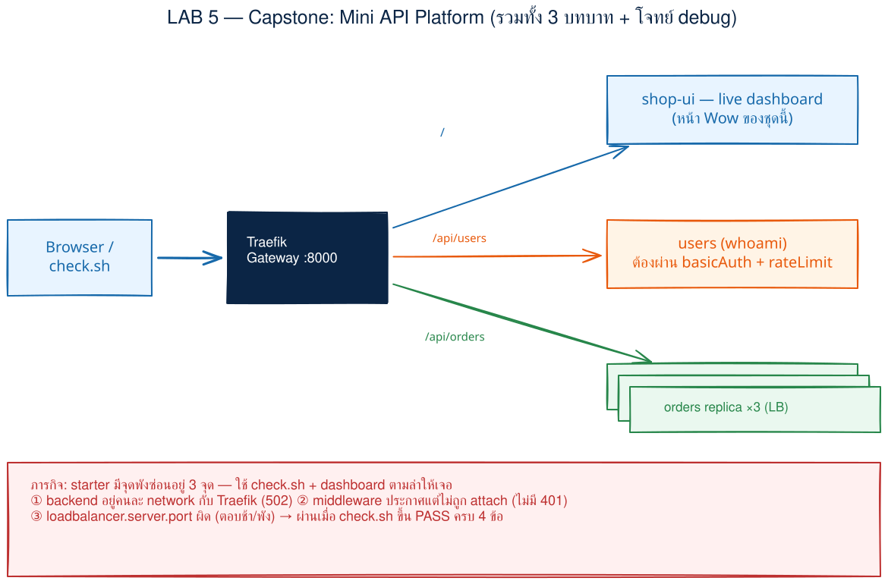
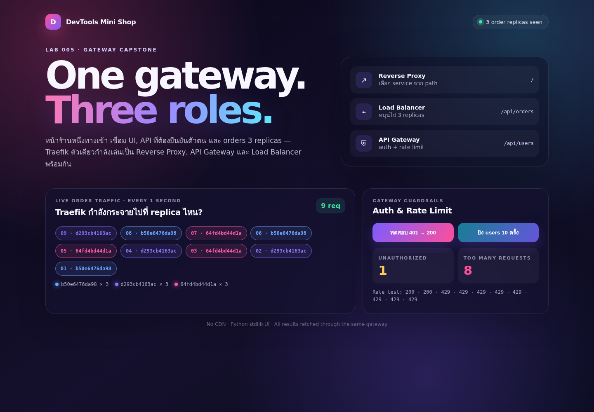
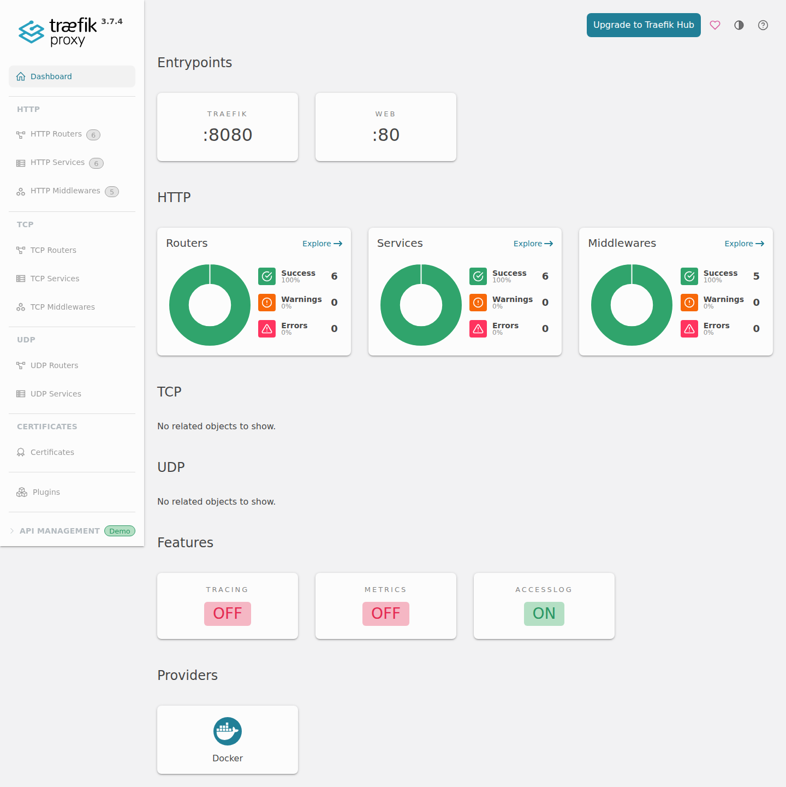

# LAB 5 — Gateway Capstone: DevTools Mini Shop

> โฟลเดอร์ `005_LAB_Gateway_Capstone` = ภารกิจจบชุด Traefik
> ไฟล์หลัก: `starter/docker-compose.yml` · `solution/docker-compose.yml` · `check.sh` · `shop-ui/` · `orders/`

LAB นี้ไม่ใช่ walkthrough ที่บอกว่าต้องแก้บรรทัดไหนตั้งแต่ต้น แต่เป็น **mission debug**: บริษัทจำลอง `Example Commerce` ส่ง mini API platform ที่เปิดไม่สมบูรณ์มาให้ทีมเรา ระบบมีจุดพัง 3 จุดจากสาม LAB ก่อนหน้า หน้าที่ของเราคืออ่านอาการ สร้างสมมติฐาน แก้ทีละจุด และใช้ acceptance test เป็นหลักฐาน

## สิ่งที่จะได้เรียนรู้

- แยกให้ออกว่า **Reverse Proxy, Load Balancer และ API Gateway เป็นบทบาท** ไม่ใช่ผลิตภัณฑ์คนละกล่อง — Traefik ตัวเดียวทำทั้งสามอย่างพร้อมกันได้
- debug เส้นทางจริงตั้งแต่ router → middleware → service → container network/port โดยไม่เดาจากคำว่า container `Up`
- ใช้ acceptance criteria และ `check.sh` ตัดสินพฤติกรรมจากภายนอก แทนการตัดสินว่า compose “ดูเหมือนถูก”
- scale orders เป็น 3 replicas แล้วพิสูจน์การกระจายโหลดจาก hostname ที่ตอบกลับจริง
- เห็น basicAuth, rateLimit และ live traffic ในหน้า shop-ui เดียว

## ภาพรวมของแล็บนี้

1. เปิดเครื่องเรียนและยืนยันว่า Docker CLI คุยกับ daemon ได้
2. clone repo แล้วอ่าน mission brief กับ acceptance criteria 4 ข้อ
3. เปิดระบบใน `starter/` ซึ่งจงใจมีจุดพัง 3 จุด
4. รัน `check.sh` ให้เห็น baseline `0 PASS, 4 FAIL`
5. debug ทีละชั้นด้วยอาการ, compose config, dashboard และความรู้จาก LAB 1–3
6. รัน checker ซ้ำจนผ่าน `4 PASS, 0 FAIL`
7. เปิด shop-ui ดูสามบทบาททำงานสด และสำรวจ router/service/middleware ใน dashboard
8. ทดลอง Host rule และทดลองถอด middleware เพื่อพิสูจน์ว่า “ประกาศ” กับ “attach” คนละเรื่อง
9. `docker compose down` แล้วเปิดใหม่หนึ่งรอบเพื่อพิสูจน์ว่าแล็บรันซ้ำจาก state สะอาดได้



> **คำถามก่อนเริ่ม:** ถ้า dashboard เห็น router เป็นสีเขียว แต่ request ยังได้ `502` เราควรสงสัย “กติกา route” หรือ “ทางเชื่อมจาก Traefik ไป backend” ก่อน? ภารกิจนี้จะทำให้ตอบจากหลักฐานได้

### Terminal Map

| หน้าต่าง | หน้าที่ | เปิดเมื่อใด |
|---|---|---|
| **T1** | compose, `check.sh`, curl และ cleanup | ใช้ตลอด LAB |
| **Browser** | shop-ui ที่ port 8000 และ dashboard ที่ port 8080 | หลัง checker ผ่าน |

---

## 0. เตรียมเครื่องเรียน

ทำบนเครื่องของเราเอง — เปิด classroom container ที่ติดตั้ง Docker มาให้แล้ว:

```bash
docker start devtools 2>/dev/null || \
  docker run -dit --name devtools --privileged -p 2222:22 tuchsanai/devtools:2569_1
ssh root@localhost -p 2222        # password : passwd
```

> 📝 **คำอธิบาย:** `docker start ... || docker run ...` ใช้กล่องเดิมถ้ามีและสร้างใหม่เมื่อยังไม่มี · `-dit` รันเบื้องหลังพร้อม terminal · `--privileged` จำเป็นสำหรับการรัน Docker ซ้อนใน classroom container · `-p 2222:22` ส่ง SSH จากเครื่องเราไป port 22 ในกล่อง · ใน VS Code แนะนำ Remote-SSH ไป `root@localhost:2222`

> ⚠️ `--privileged` ให้สิทธิ์สูงมาก ใช้เฉพาะ disposable classroom container นี้ ไม่ใช้กับ production workload

ตรวจทั้ง CLI และ daemon:

```bash
docker --version
docker info --format 'Docker daemon: {{.ServerVersion}}'
```

> 📝 **คำอธิบาย:** คำสั่งแรกอ่านเวอร์ชัน CLI ส่วนคำสั่งที่สองต้องติดต่อ daemon สำเร็จ จึงแยกอาการ “ติดตั้ง CLI แล้ว” ออกจาก “Docker พร้อมรัน container” · เลขเวอร์ชันของผู้เรียนอาจเปลี่ยนจากเอกสาร

✅ **Expected output** — ผลจริงจากเครื่องทดสอบรอบนี้:

```text
Docker version 29.6.2, build dfc4efb
Docker daemon: 29.6.2
```

---

## 1. Clone โค้ดแล็บ

```bash
mkdir -p ~/labwork && cd ~/labwork
git clone https://github.com/Tuchsanai/DevTools.git
cd DevTools/03_Application_Docker/03_Traefik_Reverse_Proxy_Gateway_LB/005_LAB_Gateway_Capstone
chmod +x check.sh
```

> 📝 **คำอธิบาย:** `mkdir -p` สร้างพื้นที่ทำงานโดยไม่ error ถ้ามีอยู่แล้ว · `git clone` ดึงไฟล์ทั้งชุด · `cd` เข้า LAB005 · `chmod +x` เพิ่มสิทธิ์ execute ให้ checker · ถ้า clone ไว้แล้วให้ข้าม `git clone` และ `cd` เข้า repo เดิม

โครงที่ใช้ในภารกิจ:

```text
005_LAB_Gateway_Capstone/
├── check.sh
├── starter/docker-compose.yml       # มีบั๊ก 3 จุด
├── solution/
│   ├── docker-compose.yml           # ระบบที่แก้ครบ
│   └── README.md                    # เฉลยพร้อมเหตุผล
├── shop-ui/                         # HTML/CSS/JS inline + Python stdlib
└── orders/                          # JSON API + Python stdlib
```

---

## 2. Mission brief และ Definition of Done

`Example Commerce` ต้องการทางเข้าเดียวที่ `http://localhost:8000` โดยมี Traefik รับ request แล้วทำสามบทบาท:

| Path | ปลายทาง | บทบาทเด่น |
|---|---|---|
| `/` | shop-ui | **Reverse Proxy** เลือก backend จาก path และซ่อน topology ด้านใน |
| `/api/orders` | orders × 3 | **Load Balancer** กระจาย request ระหว่าง replicas |
| `/api/users` | whoami | **API Gateway** บังคับ basicAuth และ rateLimit ก่อนถึง service |

Acceptance criteria ที่ `check.sh` ตรวจมี 4 ข้อ:

| AC | เกณฑ์ผ่าน | หลักฐานที่ checker ใช้ |
|---|---|---|
| **AC1** | `GET /` ได้ shop-ui และ HTTP 200 | status + คำว่า `DevTools Mini Shop` ใน body |
| **AC2** | users ต้องล็อก | ไม่ส่ง credential = 401, ส่ง `student:student123` = 200 |
| **AC3** | orders กระจายโหลด | ยิง 12 ครั้งแล้วพบอย่างน้อย 2 hostname |
| **AC4** | users จำกัดความถี่ | ยิงติดกัน 10 ครั้งแล้วพบ 429 อย่างน้อย 1 ครั้ง |

> บัญชี `student`/`student123` เป็น placeholder สำหรับ LAB เท่านั้น งานจริงต้องเก็บ credential เป็น secret และใช้ authentication ที่เหมาะกับระบบ

อ่าน checker ก่อนรันได้ แต่ยังไม่ต้องเปิดเฉลย:

```bash
sed -n '1,240p' check.sh
```

> 📝 **คำอธิบาย:** checker เป็น Bash + `curl` ล้วน แต่ละข้อยิงผ่าน entrypoint เดียวกับผู้ใช้จริง · `BASE_URL` มี default เป็น `http://localhost:8000` · associative array นับ hostname โดยไม่ต้องติดตั้ง `jq` · exit code เป็น 0 เมื่อผ่านครบและเป็น 1 เมื่อมี FAIL จึงใช้ใน CI ได้

✅ **Expected output:** เห็นฟังก์ชัน `pass`/`fail`, การตรวจ AC1–AC4 และบรรทัดสุดท้าย `[[ "$FAIL_COUNT" -eq 0 ]]` โดยไม่มีการแก้ไฟล์

---

## 3. เปิดระบบตั้งต้น — baseline ต้องพัง

```bash
cd starter
docker compose up -d --build --scale orders=3
```

> 📝 **คำอธิบาย:** `up` สร้าง network, build app และเปิดทุก service · `-d` คืน prompt โดยให้ระบบรันเบื้องหลัง · `--build` ทำให้ source ของ shop-ui/orders ล่าสุดอยู่ใน image · `--scale orders=3` ย้ำให้ Compose สร้าง orders สาม instance (compose ก็กำหนด `deploy.replicas: 3` ไว้เป็น default); service นี้จึง **ห้ามมี `container_name`** เพราะชื่อเดียวซ้ำสามกล่องไม่ได้ · ครั้งแรก Docker จะ pull `traefik:v3.7.4`, `traefik/whoami:v1.11` และ `python:3.12-slim`; layer/digest ของแต่ละเครื่องอาจต่างกัน

✅ **Expected output** — ช่วงท้ายจากการรันจริง (ลำดับ start อาจสลับกัน):

```text
Network labnet Created
Network lab005-storefront Created
Container starter-traefik-1 Started
Container starter-shop-ui-1 Started
Container starter-users-1 Started
Container starter-orders-1 Started
Container starter-orders-2 Started
Container starter-orders-3 Started
```

รัน acceptance test:

```bash
../check.sh
echo "exit=$?"
```

> 📝 **คำอธิบาย:** checker ไม่ดูชื่อ container แต่พิสูจน์ behavior ผ่าน HTTP · `echo "$?"` อ่าน exit code ของคำสั่งก่อนหน้า; starter ต้องได้ 1 เพื่อยืนยันว่า checker ตรวจจับของพังได้จริง ไม่ใช่ผ่านตลอด · AC1 แสดง `000` เพราะ checker จำกัดเวลารอ backend ที่เข้าถึงไม่ได้ไว้ 4 วินาที

✅ **Expected output** — baseline จริงของ starter รอบนี้:

```text
LAB005 acceptance check  http://localhost:8000

FAIL  AC1  GET / expected shop-ui HTTP 200, got HTTP 000
FAIL  AC2  /api/users expected 401 -> 200, got 200 -> 200
FAIL  AC3  /api/orders expected >=2 hostnames, found 0
FAIL  AC4  /api/users expected at least one HTTP 429, found 0 of 10

Result: 0 PASS, 4 FAIL
exit=1
```

นี่คือ baseline ที่ถูกต้องของภารกิจ: บั๊กมี 3 จุด แต่ FAIL มี 4 ข้อ เพราะ middleware จุดเดียวกระทบทั้ง auth และ rate limit

---

## 4. Debug แบบมีหลักฐาน — hints เป็นชั้น

เริ่มจากอาการ อย่าเปิด `solution/` ทันที:

| อาการ | ชั้นแรกที่ควรดู | คำถามนำ | LAB ที่เกี่ยว |
|---|---|---|---|
| `/` รอนานแล้วไม่สำเร็จ ทั้งที่ shop-ui `Up` | network | Traefik กับ backend มี network ร่วมกันหรือไม่? label ระบุชื่อไหน? | LAB 1 Reverse Proxy |
| users ไม่ส่ง credential แล้วยัง 200 | router → middleware | middleware ถูกสร้างอย่างเดียว หรือ router อ้างชื่อมันด้วย? | LAB 3 API Gateway |
| rate test ไม่มี 429 | router → middleware + ลำดับ | rateLimit อยู่ใน chain ที่ request วิ่งผ่านจริงหรือไม่? | LAB 3 API Gateway |
| orders เป็น 502/ไม่มี hostname | service port | โปรแกรมฟัง port ใด **ภายใน container**? | LAB 2 Load Balancer |

### Hint 1 — ตรวจ topology ก่อนแก้

```bash
docker compose ps
docker network inspect labnet --format '{{range $id, $c := .Containers}}{{println $c.Name}}{{end}}'
```

> 📝 **คำอธิบาย:** `docker compose ps` พิสูจน์แค่ว่า process หลักยังทำงาน ส่วน `docker network inspect` บอกสมาชิกของ `labnet` จริง · `--format` วนพิมพ์ชื่อ container เพื่อไม่ต้องอ่าน JSON ยาว · ถ้า backend ไม่อยู่ในรายการ Traefik อ่าน labels ผ่าน Docker socket ได้ แต่ต่อ TCP ไป backend ไม่ได้

✅ **Expected output** — ก่อนแก้จะเห็น Traefik, users และ orders แต่ **ไม่มี `starter-shop-ui-1`** ในรายชื่อ `labnet` (ลำดับ/ID อาจต่างกัน):

```text
starter-traefik-1
starter-users-1
starter-orders-1
starter-orders-2
starter-orders-3
```

### Hint 2 — แยก definition ออกจาก attachment

ดูเฉพาะ labels ของ users ใน `starter/docker-compose.yml`: ชื่อที่ขึ้นต้น `traefik.http.middlewares.` คือการ **ประกาศ component** ส่วนเส้นทางที่ใช้งานจริงต้องเริ่มจาก `traefik.http.routers.users...`

### Hint 3 — อย่าสับสน host port กับ container port

ดู `EXPOSE`/ค่า `PORT` ใน `orders/Dockerfile` และ `orders/server.py` แล้วเทียบกับ `traefik.http.services.orders.loadbalancer.server.port` ค่า service port คือปลายทางภายใน `labnet` ไม่ใช่ `8000:80` ของ Traefik

> ถ้าติดเกิน 15 นาที ให้เปิด `../solution/README.md` ซึ่งเฉลยทีละบรรทัดพร้อมเหตุผล ไม่ควร copy ทั้งไฟล์โดยไม่อธิบายสาเหตุได้

---

## 5. แก้ทีละจุดและรัน regression ทุกครั้ง

หลังแก้หนึ่งสมมติฐาน ให้ apply compose และรัน checker เดิม:

```bash
docker compose up -d --build --scale orders=3
../check.sh
```

> 📝 **คำอธิบาย:** `docker compose up` เป็น idempotent — service ที่ config เปลี่ยนจะถูก recreate ส่วนที่ไม่เปลี่ยนใช้ต่อ · checker เดิมทำหน้าที่ regression test ป้องกันไม่ให้การแก้ AC หนึ่งทำอีก AC พัง · ผลด้านล่างอ้างลำดับแก้ network → middleware → service port; ถ้าเลือกคนละลำดับ จำนวน PASS ระหว่างทางย่อมต่างได้

✅ **Expected output หลังแก้เส้นทาง network** — ผลจริงรอบนี้:

```text
PASS  AC1  GET / returns the shop-ui (HTTP 200)
FAIL  AC2  /api/users expected 401 -> 200, got 200 -> 200
FAIL  AC3  /api/orders expected >=2 hostnames, found 0
FAIL  AC4  /api/users expected at least one HTTP 429, found 0 of 10

Result: 1 PASS, 3 FAIL
```

✅ **Expected output หลังทำให้ guardrails อยู่ในเส้นทาง users** — ผลจริงรอบนี้:

```text
PASS  AC1  GET / returns the shop-ui (HTTP 200)
PASS  AC2  /api/users requires basicAuth (401 -> 200)
FAIL  AC3  /api/orders expected >=2 hostnames, found 0
PASS  AC4  /api/users returned HTTP 429 (8 of 10 requests)

Result: 3 PASS, 1 FAIL
```

✅ **Expected output หลังแก้ปลายทาง orders** — container IDs/hostnames จะต่างทุกครั้ง:

```text
PASS  AC1  GET / returns the shop-ui (HTTP 200)
PASS  AC2  /api/users requires basicAuth (401 -> 200)
PASS  AC3  /api/orders reached 3 hostnames in 12 requests: ee96c42bc4f9 26a403db6543 13744ea48eed
PASS  AC4  /api/users returned HTTP 429 (8 of 10 requests)

Result: 4 PASS, 0 FAIL
```

ถ้าต้องการเทียบกับเฉลยโดยไม่ทับงานที่แก้เอง:

```bash
docker compose down --remove-orphans
cd ../solution
docker compose up -d --build --scale orders=3
../check.sh
```

> 📝 **คำอธิบาย:** down starter ก่อน เพราะ starter กับ solution จอง host port `8000`/`8080` และ network ชื่อคงที่ `labnet` ชุดเดียวกัน · จากนั้นเปิด compose เฉลยเป็น project ใหม่และตรวจด้วย checker ตัวเดิม · `--remove-orphans` เก็บ container ที่อาจเหลือจากการเปลี่ยน service

✅ **Expected output:** solution จบด้วย `Result: 4 PASS, 0 FAIL` และ exit code 0 เช่นเดียวกับผลด้านบน

---

## 6. ดูระบบทั้งสามบทบาทจากหน้าเดียว

หน้าเว็บอยู่ **ข้างในเครื่องเรียน** ให้เปิดแท็บ **PORTS** ของ VS Code Remote-SSH แล้ว forward:

1. port `8000` → เปิด `http://localhost:8000/`
2. port `8080` → เปิด `http://localhost:8080/dashboard/`

> ต้องมี `/` ท้าย `dashboard/` เสมอ; `http://localhost:8080/dashboard` ไม่มี trailing slash อาจ redirect/หา asset ผิด path

หน้า “DevTools Mini Shop” จะ fetch `/api/orders` ทุก 1 วินาที badge สีแสดง hostname ที่ตอบ กด **ทดสอบ 401 → 200** เพื่อดู basicAuth และกด **ยิง users 10 ครั้ง** เพื่อเห็นตัวนับ 429:



ภาพจริงรอบนี้เห็น hostname 3 ค่า ค่าละ 3 requests พร้อม `Unauthorized = 1` และ `Too Many Requests = 8`

Dashboard ยืนยันว่า entrypoint `web` ฟัง port 80 ภายใน Traefik และ router/service/middleware ทุกชุดสำเร็จ:



> ⚠️ `--api.insecure=true` เปิด dashboard โดยไม่มี authentication ใช้เฉพาะ LAB นี้ Production ต้องใช้ secure router + authentication/TLS และไม่ publish insecure API ตรง ๆ

> ⚠️ การ mount `/var/run/docker.sock:/var/run/docker.sock:ro` ทำให้ไฟล์ socket mount แบบ read-only แต่ **ไม่ได้ทำให้ Docker API เป็น read-only** ผู้ที่คุยกับ socket ยังแตะ daemon ซึ่งมีสิทธิ์สูงมากได้ งานจริงควรจำกัด provider/socket proxy และสิทธิ์ตาม threat model

---

## 7. Host rule — TCP forward ไม่เปลี่ยน HTTP Host

ระบบหลัก route ด้วย `PathPrefix` เพื่อให้ใช้ผ่าน port forwarding ได้ทันที และมี router สั้น ๆ ``Host(`app.lab`)`` สำหรับพิสูจน์ header:

```bash
curl -sS -o /dev/null -D - -H 'Host: app.lab' http://localhost:8000/ \
  | tr -d '\r' | grep -E '^(HTTP/|X-Lab-Router:)'
```

> 📝 **คำอธิบาย:** `-H 'Host: app.lab'` เปลี่ยน HTTP Host ที่ Traefik ใช้ match rule · `-D -` ส่ง response headers มาที่ stdout และ `-o /dev/null` ไม่พิมพ์ HTML · marker middleware ใส่ `X-Lab-Router` เฉพาะเมื่อ Host router ถูกเลือก · TCP/SSH port forwarding ส่ง byte ต่อ แต่ไม่แก้ Host ให้เรา จึงต้องกำหนด header เอง (หรือเพิ่ม DNS/hosts entry)

✅ **Expected output** — ผลจริงจาก solution:

```text
HTTP/1.1 200 OK
X-Lab-Router: host-rule
```

---

## 8. ทดลองให้พัง — ประกาศ middleware แต่ไม่ attach

หลังระบบผ่านแล้ว ลองพิสูจน์แนวคิดสำคัญจากบั๊กข้อสองอีกครั้ง:

1. สำรองบรรทัด `traefik.http.routers.users.middlewares` แล้ว comment หรือลบบรรทัดนั้นชั่วคราว
2. อย่าลบ definition ที่ขึ้นต้น `traefik.http.middlewares.users-auth` และ `users-rate`
3. apply แล้ว curl โดยไม่ส่ง credential:

```bash
docker compose up -d
curl -sS -o /dev/null -w 'without auth = %{http_code}\n' http://localhost:8000/api/users
```

> 📝 **คำอธิบาย:** การลบ attachment ไม่ได้ลบ middleware definition จึงเห็น component อยู่ใน config/dashboard ได้ แต่ request ของ router ไม่ผ่าน component นั้น · `curl -w` พิมพ์เฉพาะ status เพื่อให้เห็น security regression ชัด ๆ

✅ **Expected output** — ผลจริงเมื่อไม่มี attachment:

```text
without auth = 200
```

คืนบรรทัดเดิมแล้ว apply และทดสอบซ้ำ:

```bash
docker compose up -d
curl -sS -o /dev/null -w 'without auth = %{http_code}\n' http://localhost:8000/api/users
```

> 📝 **คำอธิบาย:** เมื่อ router attach `users-auth@docker` อีกครั้ง request ที่ไม่มี Authorization header จะถูก middleware หยุดก่อนถึง whoami · suffix `@docker` ระบุ provider ให้ชัดเจน

✅ **Expected output** — ระบบกลับมาปลอดภัย:

```text
without auth = 401
```

รัน `../check.sh` ซ้ำ ต้องกลับเป็น `4 PASS, 0 FAIL` ก่อนทำขั้นต่อไป

---

## 9. Clean re-run — ล้างแล้วเปิดใหม่

```bash
docker compose down
docker compose up -d --scale orders=3
sleep 2
../check.sh
```

> 📝 **คำอธิบาย:** `down` หยุดและลบ container/network ของ project แต่เก็บ image ไว้ · `up` รอบใหม่จึงสร้าง topology จาก compose ล้วน ๆ โดยไม่พึ่ง container เก่า · `--scale orders=3` ทำให้จำนวน replica เห็นชัดในคำสั่งและตรงกับ default `deploy.replicas` ใน compose · `sleep 2` เว้นให้ provider รับ Docker events ก่อน checker ยิง

✅ **Expected output** — clean re-run จริงรอบนี้ (ชื่อ hostname และจำนวน 429 เปลี่ยนได้ตาม timing):

```text
Network labnet Removed
Network labnet Created
Container solution-traefik-1 Started
Container solution-shop-ui-1 Started
Container solution-users-1 Started
Container solution-orders-1 Started
Container solution-orders-2 Started
Container solution-orders-3 Started

PASS  AC1  GET / returns the shop-ui (HTTP 200)
PASS  AC2  /api/users requires basicAuth (401 -> 200)
PASS  AC3  /api/orders reached 3 hostnames in 12 requests: 607411fc4aed 6ba85b7a6450 499c0f77eaa5
PASS  AC4  /api/users returned HTTP 429 (7 of 10 requests)

Result: 4 PASS, 0 FAIL
```

---

## แก้ปัญหาที่พบบ่อย

| อาการ | สาเหตุที่เป็นไปได้ | วิธีตรวจ/แก้ |
|---|---|---|
| `port is already allocated` | starter หรือ LAB ก่อนหน้ายังใช้ 8000/8080 | เข้า compose เดิมแล้ว `docker compose down` ก่อน |
| `/` ได้ 502/504 หรือ checker ขึ้น 000 | Traefik ต่อ shop-ui ไม่ได้ | เทียบ `networks` ของทั้งคู่และ label `traefik.docker.network` |
| users ตอบ 200 โดยไม่ถามรหัส | middleware ไม่ได้ attach ที่ router | ดู `traefik.http.routers.users.middlewares` ไม่ใช่ดู definition อย่างเดียว |
| ใส่รหัสถูกแต่ได้ 429 | ยิงถี่เกิน rate limit | รอประมาณ 1 วินาทีแล้วลองใหม่; 429 เป็น behavior ที่ออกแบบไว้ |
| orders ได้ 502 ทุกครั้ง | service port ไม่ตรงกับ app | เทียบ Dockerfile/server กับ `loadbalancer.server.port` |
| AC3 เห็น hostname เดียว | scale ไม่ครบหรือมี instance ยังไม่พร้อม | `docker compose up -d --scale orders=3` แล้วดู `docker compose ps` |
| dashboard เปิดไม่ได้ | ไม่ได้ forward 8080 หรือขาด slash ท้าย | forward port และเปิด `http://localhost:8080/dashboard/` |

---

## เก็บกวาด (Cleanup)

จากโฟลเดอร์ compose ที่กำลังใช้อยู่:

```bash
docker compose down
docker compose ps
```

> 📝 **คำอธิบาย:** `down` ลบ Traefik, shop-ui, users, orders ทั้งสาม replicas และ network `labnet` เพื่อไม่ให้ชนกับ LAB อื่น · `docker compose ps` ตรวจซ้ำว่าตารางว่าง · image ยังอยู่เพื่อให้เปิดรอบหน้าเร็วขึ้น · ปิด port forwarding 8000/8080 ในแท็บ PORTS ด้วย

✅ **Expected output** — ช่วงท้ายจากการ cleanup จริง; ลำดับ container อาจสลับกัน:

```text
Container solution-traefik-1 Removed
Container solution-shop-ui-1 Removed
Container solution-users-1 Removed
Container solution-orders-1 Removed
Container solution-orders-2 Removed
Container solution-orders-3 Removed
Network labnet Removed
NAME      IMAGE     COMMAND   SERVICE   CREATED   STATUS    PORTS
```

---

## สรุปบทบาทในระบบเดียว

| สิ่งที่ Traefik ทำ | กลไกใน LAB | บทบาทที่เราเรียก |
|---|---|---|
| รับ `:80` แล้วเลือก shop/users/orders จาก rule | entrypoint + router `PathPrefix`/`Host` | Reverse Proxy |
| เลือกหนึ่งใน orders 3 endpoints ต่อ request | service load balancer จาก Docker provider | Load Balancer |
| ตรวจ credential และจำกัด request ก่อนถึง users | middleware basicAuth + rateLimit | API Gateway |

ชื่อบทบาทซ้อนกันได้: request เดียวไป `/api/users` ยังผ่าน reverse proxy อยู่ ขณะเดียวกัน gateway policy กำลังทำงาน; request `/api/orders` ก็ผ่าน reverse proxy พร้อม load balancing ใน Traefik process เดียวกัน

## ✅ เช็กลิสต์ก่อนจบ LAB

- [ ] starter ให้ `0 PASS, 4 FAIL` และ exit code 1
- [ ] อธิบายได้ว่าทำไมบั๊ก 3 จุดสร้าง FAIL 4 ข้อ
- [ ] Traefik กับทุก backend อยู่ user-defined network ชื่อ `labnet`
- [ ] ทุก backend มี `traefik.enable=true` และระบุ `loadbalancer.server.port`
- [ ] orders scale 3 โดยไม่มี `container_name`
- [ ] `check.sh` ผ่าน `4 PASS, 0 FAIL` และ exit code 0
- [ ] shop-ui เห็นอย่างน้อย 2 hostname พร้อมตัวนับ 401/429
- [ ] dashboard URL มี trailing slash และ router/service/middleware ไม่มี error
- [ ] Host exercise ได้ `X-Lab-Router: host-rule`
- [ ] ทดลองถอด middleware แล้วเห็น 200 จากนั้นคืนค่าแล้วเห็น 401
- [ ] clean re-run ผ่านครบอีกครั้ง
- [ ] `docker compose down` และ `docker compose ps` ไม่เหลือ workload ของ LAB

*Expected output และภาพทั้งหมดในเอกสารนี้มาจากการรันจริงบน `tuchsanai/devtools:2569_1` เมื่อ 14 ส.ค. 2026; container ID, hostname, เวลา, digest และจำนวน 429 บางรอบอาจต่างกันตามเครื่องและจังหวะยิง*
