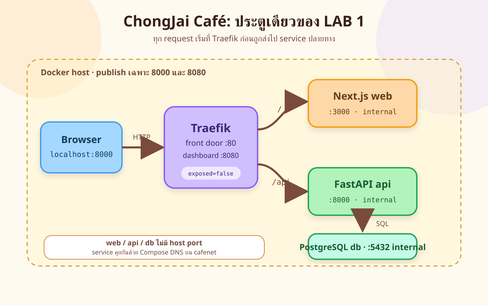
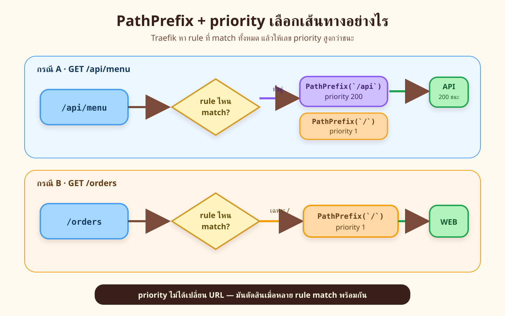
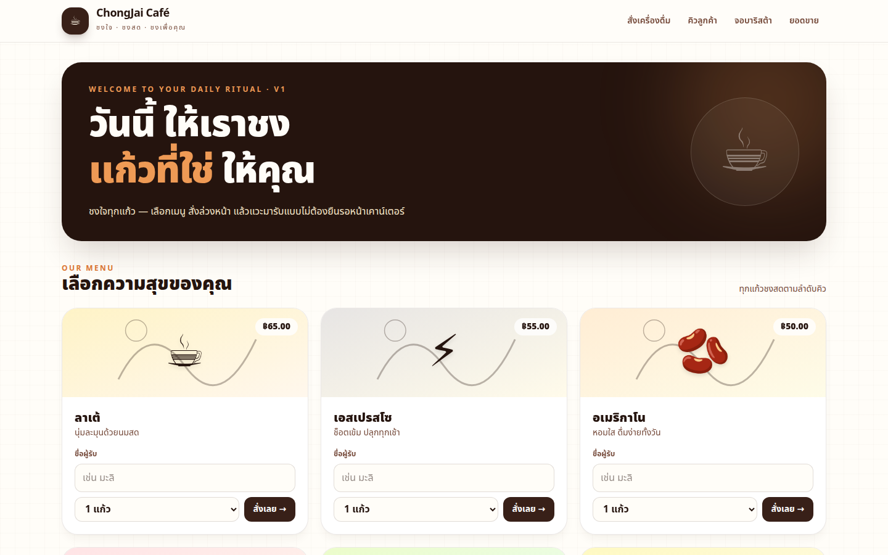
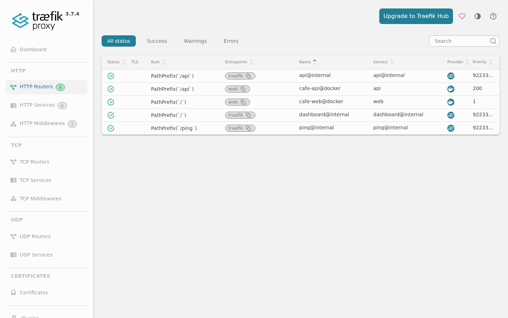
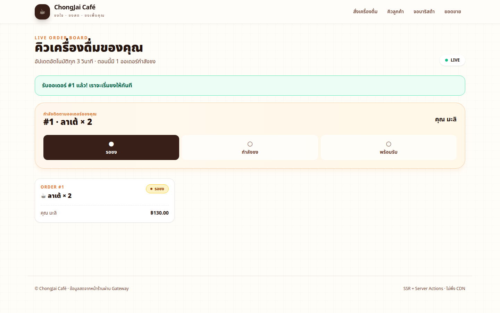

# LAB 1 — Gateway Front Door: ประตูเดียวของ ChongJai Café

> โฟลเดอร์ `001_LAB_Gateway_Front_Door` · ไฟล์หลัก `docker-compose.yml` · `verify.sh` · `sync_manifest.txt` · source ของ `api/`, `web/`, `db/`

### 🎯 แล็บนี้ใน 30 วินาที

| | |
|---|---|
| **คำถามเดียวที่ตอบให้จบ** | ลูกค้าใช้ URL เดียว แล้ว Traefik ส่งหน้าเว็บและ API ไปถูก service ได้อย่างไร |
| **ต้องผ่านอะไรมาก่อน** | Docker `run`, port, volume, network และ Compose ขั้นพื้นฐานจากชุด CampusOps |
| **เวลา** | ~40 นาที · การทดลอง 7 อัน อันละ 4–6 นาที |
| **จบแล้วต้องทำได้เอง** | อ่าน route จาก labels · พิสูจน์ request ผ่าน gateway · แยก application error จาก gateway · ซ่อน backend port |
| **แล็บนี้ยัง *ไม่* สอน** | scale/load balancing, rateLimit/basicAuth, RabbitMQ, Kafka และ canary — จะค่อย ๆ เพิ่มใน LAB 2–5 |

---

## ทฤษฎีก่อนลงมือ

### ประตูเดียว แต่มีหลายห้องด้านหลัง



> 🖼 **วิธีอ่านรูป:** ตามลูกศรจากซ้ายไปขวา ลูกค้าเห็นเพียง `localhost:8000` แต่ Traefik รู้ว่า `/api` ต้องไป `api:8000` ส่วนหน้าอื่นไป `web:3000` และ API คุยกับ `db:5432` บน `cafenet`

| service | หน้าที่ | port ใน container | publish สู่ host |
|---|---|---:|---:|
| `traefik` | รับ request และเลือก route | `80`, `8080` | `8000`, `8080` |
| `web` | Next.js SSR + server actions | `3000` | — |
| `api` | FastAPI + SQL | `8000` | — |
| `db` | PostgreSQL + seed 6 เมนู | `5432` | — |

คำว่า **front door** หมายถึงจุดเข้าที่ผู้ใช้รู้จักเพียงจุดเดียว ไม่ได้แปลว่า backend เหลือ service เดียว ภายใน Compose ทุก service ยังแยก process, healthcheck และหน้าที่ของตัวเอง

### `PathPrefix` บอกขอบเขต ส่วน `priority` ตัดสินผู้ชนะ



> 🖼 **วิธีอ่านรูป:** `/api/menu` match ทั้ง `PathPrefix(/api)` และ catch-all `PathPrefix(/)` จึงใช้ priority `200 > 1` ไป API ส่วน `/orders` ไม่ขึ้นต้นด้วย `/api` จึงเหลือ route เว็บเพียงตัวเดียว

labels สำคัญในแล็บนี้มีสี่ชั้น:

| label | ตอบคำถาม |
|---|---|
| `traefik.enable=true` | service นี้ยอมให้ Docker provider เห็นหรือไม่ |
| `routers.<name>.rule` | URL แบบใด match route นี้ |
| `routers.<name>.priority` | เมื่อหลาย route match ตัวใดชนะ |
| `services.<name>.loadbalancer.server.port` | Traefik ต้องต่อ port ใดใน container |

`--providers.docker.exposedbydefault=false` ทำให้ service ที่ไม่ opt-in ไม่กลายเป็น route เอง ฐานข้อมูลจึงไม่โผล่บน dashboard ในฐานะ HTTP service

### request จากหน้าเว็บก็ผ่านประตู

หน้าเว็บใช้ SSR และ server action โดยตั้ง `API_BASE_URL=http://traefik` ดังนั้นตอนกดสั่งกาแฟ Next.js ไม่ลัดไป `api` โดยตรง เส้นทางจริงคือ browser → Traefik → web → Traefik → API และ access log จะเห็น request API นั้น

LAB 1 ตั้ง `ORDER_TRANSPORT=db-only` และ `EVENTS_ENABLED=0` จึงไม่มี RabbitMQ/Kafka ออเดอร์ใหม่ถูกเขียน DB และค้าง `QUEUED` โดยตั้งใจ นี่คือจุดเชื่อมไป LAB 3 ซึ่งจะเพิ่มบาริสต้าที่รับงานจากคิว

### สิ่งที่มักเข้าใจผิด

- **คิดว่า** `EXPOSE 8000` ใน Dockerfile คือ publish port → **จริง ๆ** ต้องมี `ports:` จึงเปิดสู่ host
- **คิดว่า** 404 ทุกตัวมาจาก gateway → **จริง ๆ** 404 ที่มี `X-Served-By` และ JSON `{detail,code}` มาจาก API
- **คิดว่า** Next.js เรียก API ตรงย่อมเร็วกว่า → **จริง ๆ** ชุดนี้ตั้งใจให้ server action ผ่าน gateway เพื่อให้ policy ในแล็บถัดไปมีผลกับปุ่มจริง
- **คิดว่า** dashboard :8080 พร้อมใช้ใน production → **จริง ๆ** `api.insecure=true` เปิดไว้เพื่อเรียนใน LAB เท่านั้น

---

## เตรียมเครื่องเรียน

### ขั้นที่ 1 — เปิดกล่องเรียน

รันบนเครื่องของเราเอง กล่องนี้เป็น DinD และ publish ออกมาเฉพาะ SSH กับสองประตูของ LAB 1:

<!-- skip-auto คำสั่งนี้รันบน host และจะสร้างกล่องเรียนภายนอก runner -->
```bash
docker rm -f devtools-cafe1 2>/dev/null || true
docker run -dit --name devtools-cafe1 --privileged \
  -p 2226:22 -p 8000:8000 -p 8080:8080 tuchsanai/devtools:2569_1
ssh root@localhost -p 2226
# password: passwd
```

### ขั้นที่ 2 — โหลดโค้ดและคืนพื้นที่จากแล็บอื่น

คำสั่งหลังจากนี้พิมพ์ในกล่องเรียน การ `down` แล็บอื่นเป็นการกันชื่อและพอร์ตชน ไม่ได้ใช้ state ข้ามแล็บ

<!-- skip-auto ต้อง clone repository และขึ้นกับตำแหน่งเครื่องเรียนของผู้เรียน -->
```bash
mkdir -p ~/labwork && cd ~/labwork
git clone https://github.com/Tuchsanai/DevTools.git
cd DevTools/03_Application_Docker/04_Fullstack_Gateway_Broker_App
for lab in 002_LAB_* 003_LAB_* 004_LAB_* 005_LAB_*; do
  [ -d "$lab" ] && docker compose -f "$lab/docker-compose.yml" down -v || true
done
cd 001_LAB_Gateway_Front_Door
docker compose version
```

✅ **สิ่งที่ต้องเห็น** — Compose plugin ตอบเลขเวอร์ชัน และ prompt อยู่ในโฟลเดอร์ `001_LAB_Gateway_Front_Door`

> 📝 แล็บนี้ไม่ย้อนสอน `docker run`, clone หรือ YAML พื้นฐาน หากคำสั่งยังไม่คุ้นให้ทบทวน CampusOps Docker/Compose LAB ก่อน แล้วกลับมาจับประเด็น gateway ที่นี่

---

## การทดลองที่ 1 — ลูกค้าเห็น URL เดียวจริงไหม

**คำถาม:** ระบบ 4 service ขึ้นพร้อมกัน แต่ลูกค้าเปิดเพียง `:8000` ได้หรือไม่

เปิดระบบและรอทุก healthcheck ผ่านใน sanity block เดียว:

<!-- run -->
```bash
docker compose up -d --build
for i in $(seq 1 120); do
  [ "$(docker compose ps --format json | grep -c '"Health":"healthy"')" -eq 4 ] && break
  sleep 1
done
docker compose ps
```

✅ **ผลจริง** — `traefik`, `db`, `api`, `web` เป็น `Up ... (healthy)` ครบ และมี port ฝั่ง host เฉพาะแถว `traefik`

ใช้ Playwright เปิดหน้าแรกและเก็บหลักฐานที่ viewport 1440×900:

<!-- skip-auto Playwright ต้องรันบน host ที่มองเห็นพอร์ตของกล่องเรียน -->
```bash
npx playwright cli -s=lab1 open http://localhost:8000/ --browser=chromium
npx playwright cli -s=lab1 resize 1440 900
npx playwright cli -s=lab1 screenshot --filename=images/web-menu.png
```



> 📝 URL เดียวไม่ได้แปลว่ามี container เดียว หน้า HTML มาจาก `web` ขณะที่เมนูในหน้า SSR มาจาก API ผ่าน Traefik อีกทอดหนึ่ง

<!-- trace: T-LAB1 -->

---

## การทดลองที่ 2 — `/api/menu` ถูกส่งไปไหน

**คำถาม:** จะพิสูจน์อย่างไรว่าคำขอ `/api` ไปถึง application จริง

<!-- run -->
```bash
curl -sS -i http://localhost:8000/api/menu | sed -n '1,12p'
```

✅ **ผลจริง** — ได้ `HTTP/1.1 200 OK`, `x-served-by: <hostname>` และ `x-cafe-api-version: 1` ก่อน JSON ที่มีเมนู 6 รายการ

```text
HTTP/1.1 200 OK
x-cafe-api-version: 1
x-served-by: 5c9c8f4ce36e
content-type: application/json
```

`cafe-api` ใช้ `PathPrefix(`/api`)` priority 200 ส่วน `cafe-web` ใช้ `PathPrefix(`/`)` priority 1 จึงไม่มีการตัด `/api` ออก และ FastAPI ได้ path เดิมตาม contract

> 📝 header สองตัวถูกเติมโดย API ไม่ใช่ Traefik จึงบอกทั้ง replica ที่ตอบและ API version ได้ แล็บถัดไปจะใช้หลักฐานนี้นับการกระจายโหลด

<!-- trace: T-LAB1, contract §4 -->

---

## การทดลองที่ 3 — Dashboard เห็นเฉพาะ service ที่ opt-in ไหม

**คำถาม:** `exposedByDefault=false` เปลี่ยนสิ่งที่ Docker provider เปิดเผยอย่างไร

<!-- run -->
```bash
curl -sS http://localhost:8080/api/http/routers | python3 -c \
  'import json,sys; print("\n".join(sorted(x["name"] for x in json.load(sys.stdin) if x["provider"]=="docker")))'
```

✅ **ผลจริง** — router จาก Docker provider มี `cafe-api@docker` และ `cafe-web@docker`; ไม่มี route ของ `db`

```text
cafe-api@docker
cafe-web@docker
```

ดูภาพเดียวกันใน Traefik dashboard ด้วย Playwright:

<!-- skip-auto Playwright ต้องรันบน host ที่มองเห็น dashboard ของกล่องเรียน -->
```bash
npx playwright cli -s=lab1 goto http://localhost:8080/dashboard/#/http/routers
npx playwright cli -s=lab1 screenshot --filename=images/traefik-dashboard.png
```



> ⚠️ Dashboard นี้เปิดด้วย `--api.insecure=true` โดยไม่มีรหัสผ่านเพื่อการเรียนเท่านั้น ห้ามยก config นี้ไปใช้เป็น production baseline

> 📝 `exposedByDefault=false` คือค่าเริ่มที่ปลอดภัยกว่า แต่ service จะเข้า routing table ได้เมื่อมี `traefik.enable=true` และ labels ที่ครบเท่านั้น

<!-- trace: T-LAB7 STEP3 -->

---

## การทดลองที่ 4 — labels ตรงกับ runtime จริงไหม

**คำถาม:** rule, priority และ server port ที่เขียนใน Compose ปรากฏใน Traefik runtime อย่างไร

ดู labels แล้วถาม raw API ของ Traefik:

<!-- run -->
```bash
grep -nE 'cafe-api\.(rule|priority)|services\.api.*server\.port' docker-compose.yml
curl -sS http://localhost:8080/api/rawdata | python3 -c \
  'import json,sys; d=json.load(sys.stdin); r=d["routers"]["cafe-api@docker"]; s=d["services"]["api@docker"]; print("rule=",r["rule"]); print("priority=",r["priority"]); print("server=",s["loadBalancer"]["servers"][0]["url"])'
```

✅ **ผลจริง** — ทั้งสองฝั่งตรงกัน: rule `PathPrefix(`/api`)`, priority `200` และ server URL ลงท้าย `:8000`

```text
rule= PathPrefix(`/api`)
priority= 200
server= http://172.19.0.4:8000
```

IP เปลี่ยนได้ทุกครั้งที่สร้าง container ใหม่ แต่ service port และ rule ต้องคงตาม contract

> 📝 Compose labels คือ desired configuration ส่วน `/api/rawdata` คือค่าที่ Traefik โหลดจริง การเทียบสองฝั่งช่วยแยก “เขียนถูกแต่ provider ยังไม่โหลด” ออกจาก “เขียน label ผิด”

<!-- trace: T-LAB7 STEP4 -->

---

## การทดลองที่ 5 — ไม่มีบาริสต้าแล้วออเดอร์ไปไหน

**คำถาม:** เมื่อ `ORDER_TRANSPORT=db-only` ออเดอร์จากปุ่มจริงมีสถานะอะไร

ใช้ Playwright กรอกชื่อ เลือก 2 แก้ว และกดสั่งลาเต้ หน้าเว็บจะ redirect ไป `/orders`:

<!-- skip-auto เป็น browser interaction ที่ต้องใช้ Playwright session บน host -->
```bash
npx playwright cli -s=lab1 goto http://localhost:8000/
npx playwright cli -s=lab1 run-code 'async page => { await page.locator("input[data-menu-name=latte]").fill("มะลิ"); await page.locator("article:has(input[data-menu-name=latte]) select[name=qty]").selectOption("2"); await page.locator("button[data-order-menu=latte]").click(); await page.waitForURL(/\/orders/); }'
npx playwright cli -s=lab1 screenshot --filename=images/web-order-queued.png
```



ตรวจคิวผ่านประตูเดิม:

<!-- run -->
```bash
curl -sS http://localhost:8000/api/queue | python3 -m json.tool | sed -n '1,24p'
```

✅ **ผลจริง** — ออเดอร์มี `status: "QUEUED"`, `qty: 2`, `ready_at: null` และอยู่บนจอ `/orders`

> 📝 LAB 1 ไม่มี worker จึงไม่มีใครเปลี่ยน `QUEUED → BREWING → READY` ออเดอร์ค้างคือ teaching hook ไม่ใช่คำอ้างว่าระบบเต็มทำงานแล้ว

<!-- trace: หัวข้อใหม่ของชุดนี้: feature matrix -->

---

## การทดลองที่ 6 — 404 มาจากประตูหรือจาก API

**คำถาม:** response ของ order ที่ไม่มีอยู่บอกต้นทางได้หรือไม่

<!-- run -->
```bash
curl -sS -i http://localhost:8000/api/orders/999 | sed -n '1,14p'
```

✅ **ผลจริง** — ได้ HTTP 404 พร้อม JSON `{"detail":"ไม่พบออเดอร์หมายเลข 999","code":"ORDER_NOT_FOUND"}` และยังมี `X-Served-By` กับ version `1`

```text
HTTP/1.1 404 Not Found
x-cafe-api-version: 1
x-served-by: 5c9c8f4ce36e
content-type: application/json

{"detail":"ไม่พบออเดอร์หมายเลข 999","code":"ORDER_NOT_FOUND"}
```

> 📝 404 นี้ผ่าน gateway แต่ถูกสร้างใน FastAPI จึงใช้ application error contract และมี header คู่ของแอป ใน LAB 2 จะเห็น 401/429 จาก gateway ซึ่งไม่มี header คู่นี้

<!-- trace: contract §3 -->

---

## การทดลองที่ 7 — backend เปิด port สู่ host หรือไม่

**คำถาม:** API และ DB ต้อง publish port เพื่อคุยกันหรือไม่

<!-- run -->
```bash
docker compose ps --format 'table {{.Service}}\t{{.Name}}\t{{.Ports}}'
```

✅ **ผลจริง** — เฉพาะ `traefik` มีลูกศร `8000->80` และ `8080->8080`; `api`, `web`, `db` แสดงเพียง container port ไม่มี `0.0.0.0:...->`

```text
SERVICE    NAME                 PORTS
api        lab001-api-1         8000/tcp
db         lab001-db-1          5432/tcp
traefik    lab001-traefik-1     0.0.0.0:8000->80/tcp, 0.0.0.0:8080->8080/tcp
web        lab001-web-1         3000/tcp
```

หลักการ network และการไม่ publish backend ทบทวนได้ที่ `02_Docker/02_Dockerfile_Build_Run_Compose_Guide/006_LAB_Network_DNS` โดยแล็บนี้เน้นผลต่อสถาปัตยกรรม front door

> 📝 service ภายในเรียกกันด้วยชื่อ `traefik`, `api`, `db` บน `cafenet` จึงไม่ต้องรู้ IP และไม่ต้องเปิด backend port ให้ host

<!-- trace: NFR -->

---

## ตรวจงานด้วย `verify.sh`

สคริปต์ใช้ project ชั่วคราว prefix `vcafe-`, ตรวจ check owner ของ LAB 1 ครบ และเก็บกวาด project ทดสอบเอง:

| check ID | ข้อกำหนดที่ตัดสิน |
|---|---|
| `LAB1-V01` | REQ-01 · front door, access log, backend ไม่ publish |
| `LAB1-V02` | REQ-02 · valid 201/QUEUED, invalid 404/422 |
| `LAB1-V03` | REQ-10 · endpoint/schema/error/header |
| `LAB1-V04` | NFR-02 · published-port allowlist |
| `LAB1-V05` | NFR-03 · `down` คง state, `down -v` reset |
| `LAB1-V06` | NFR-04 · flags ปิดแล้วไม่ import/connect broker |

<!-- run -->
```bash
bash verify.sh
rc=$?
echo "exit code = $rc"
exit "$rc"
```

✅ **ผลจริง** — `[PASS]` ครบหก check ปิดท้ายดังนี้:

```text
CHECK LAB1-V06 PASS: API is healthy and accepts 201 without RabbitMQ/Kafka services, URLs, or imports
ALL CHECKS PASSED
VERIFY_EXIT_CODE=0
exit code = 0
```

> 📝 `verify.sh` จงใจทดสอบ volume lifecycle จึงสร้างข้อมูลและลบ project ชั่วคราวของตัวเอง ไม่ใช้ state จากการทดลองก่อนหน้าเป็น oracle

---

## แก้ปัญหาที่พบบ่อย

| อาการ | สาเหตุ | วิธีแก้ |
|---|---|---|
| `Bind for 0.0.0.0:8000 failed` | กล่องหรือแล็บอื่นยังจับ port 8000 | ตรวจ `docker ps` แล้ว `down` เฉพาะ project ที่เป็นของเรา |
| `web` ค้าง `Created` | กำลังรอ `traefik` หรือ `api` healthy | `docker compose ps` แล้วดู `docker compose logs --tail 30 api db traefik` |
| หน้าแรกขึ้น 502/500 ชั่วคราว | API/DB ยังไม่พร้อมหรือ image เก่า | รอ healthcheck; ถ้าแก้ source ใช้ `docker compose up -d --build` |
| `/api/menu` ไปหน้าเว็บ | rule/priority หรือ backtick ใน label ผิด | เทียบ labels กับ `/api/rawdata` ตามการทดลองที่ 4 |
| dashboard ไม่มี `cafe-api` | ลืม `traefik.enable=true` หรือ socket mount | ตรวจ label และ `/var/run/docker.sock:ro` |
| order ไม่เป็น READY | LAB 1 ไม่มี RabbitMQ/worker โดยตั้งใจ | ค่าที่ถูกต้องคือ `QUEUED`; ไป LAB 3 เพื่อเพิ่ม worker |
| แก้ SQL seed แล้วข้อมูลไม่เปลี่ยน | `pgdata` เดิมยังอยู่ | ใช้ `docker compose down -v` เมื่อยอมลบข้อมูลแล็บได้ |
| Playwright เปิดหน้าไม่ได้ | tunnel/port forwarding ยังไม่ทำงาน | ตรวจ SSH, port 8000/8080 และ `curl` ก่อนเปิด browser |

---

## เก็บกวาด

ในกล่องเรียน ลบ container, network และ volume เฉพาะ namespace `lab001`:

<!-- run -->
```bash
docker compose down -v --remove-orphans
test -z "$(docker ps -aq --filter 'name=^lab001-')"
test -z "$(docker network ls -q --filter 'name=^lab001_')"
test -z "$(docker volume ls -q --filter 'name=^lab001_')"
```

บน host ปิด Playwright แล้วลบกล่องของ LAB 1:

<!-- skip-auto คำสั่งนี้รันบน host และลบเฉพาะกล่องเรียน LAB 1 -->
```bash
npx playwright cli -s=lab1 close
docker rm -f devtools-cafe1
docker ps -a --filter 'name=^devtools-cafe1$'
```

> 📝 `down -v` ลบข้อมูล PostgreSQL ของแล็บนี้ถาวร แต่ไม่แตะ project อื่น ตรวจสาม namespace หลังคำสั่งเพื่อยืนยันว่า re-run จะเริ่มสะอาด

---

## สรุปคำสั่งของแล็บนี้

| คำสั่ง | ความหมาย |
|---|---|
| `docker compose up -d --build` | build และเปิด 4 services ตาม dependency/healthcheck |
| `docker compose ps` | ดู service, health และ published port |
| `curl -i localhost:8000/api/menu` | พิสูจน์ API route และ application headers |
| `curl localhost:8080/api/rawdata` | อ่าน runtime route/service ที่ Traefik โหลดจริง |
| `docker compose logs traefik` | ดู access log ที่ประตู |
| `docker compose down` | ลบ container/network แต่คง `pgdata` |
| `docker compose down -v` | ลบ container/network รวม `pgdata` |
| `bash verify.sh` | รัน `LAB1-V01..V06` ใน namespace `vcafe-` แล้ว cleanup |

> **จำ 4 อย่าง:** ลูกค้าเห็น `:8000` จุดเดียว · `/api` priority 200 ชนะ `/` priority 1 · application header บอกว่า request ถึง API · backend คุยกันได้โดยไม่ publish port

## ✅ เช็กลิสต์ก่อนจบแล็บ

- [ ] เปิด `http://localhost:8000` ด้วย Playwright แล้วเห็นหน้าเมนูครบ 6 รายการ
- [ ] อธิบายเส้นทาง browser → Traefik → web/API → db ได้
- [ ] `curl -i /api/menu` เห็น `X-Served-By` และ `X-Cafe-Api-Version: 1`
- [ ] dashboard มี `cafe-api@docker` และ `cafe-web@docker` แต่ไม่มี route ของ DB
- [ ] เทียบ Compose labels กับ `/api/rawdata` แล้ว rule/priority/server port ตรงกัน
- [ ] สั่งกาแฟผ่านหน้าเว็บจริงแล้วเห็น order ค้าง `QUEUED` บน `/orders`
- [ ] 404 ของ `/api/orders/999` มี `{detail,code}` และ application headers
- [ ] `docker compose ps` ยืนยันว่า API/DB/web ไม่ publish port
- [ ] `bash verify.sh` จบ `ALL CHECKS PASSED` และ exit code 0
- [ ] `down -v` แล้วไม่เหลือ container/network/volume ของ `lab001`

*ผลลัพธ์และภาพหน้าจอทั้งหมดในเอกสารนี้มาจากการรันจริงใน `tuchsanai/devtools:2569_1`; ภาพ UI จับด้วย Playwright ที่ viewport 1440×900*
