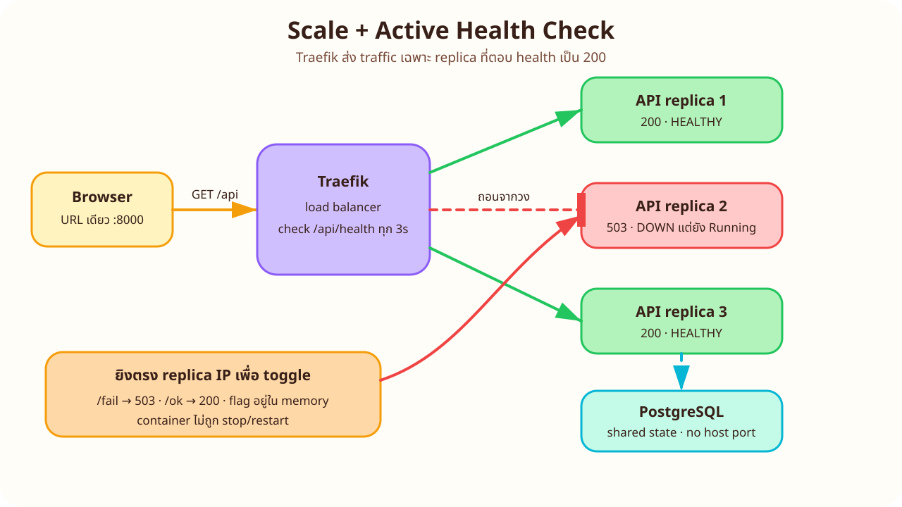
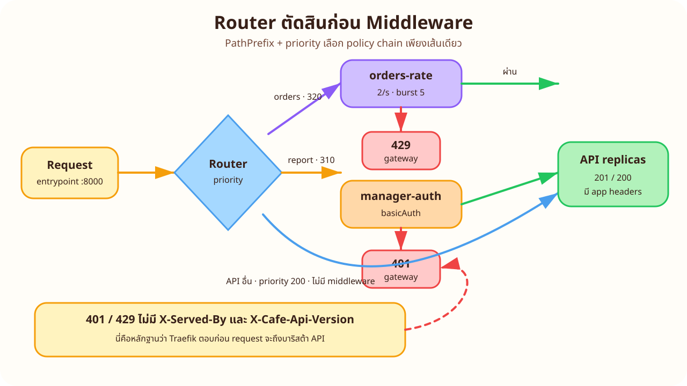
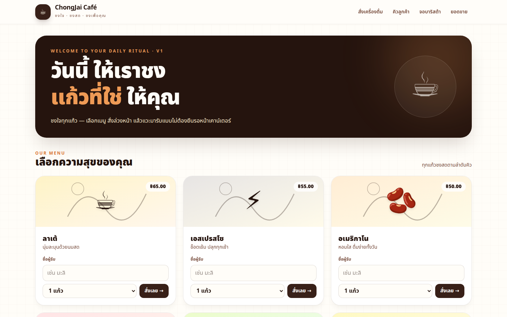
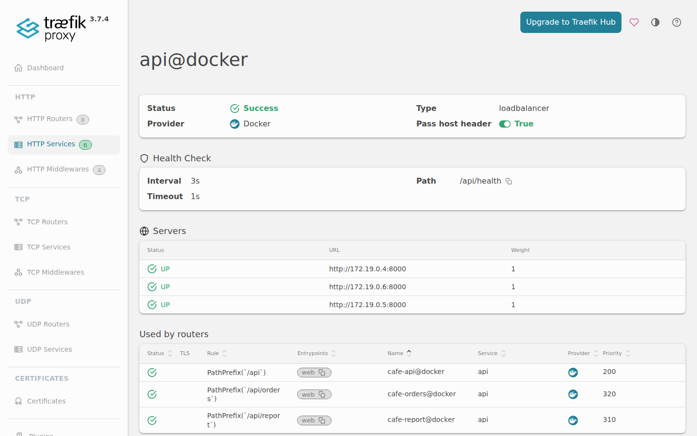
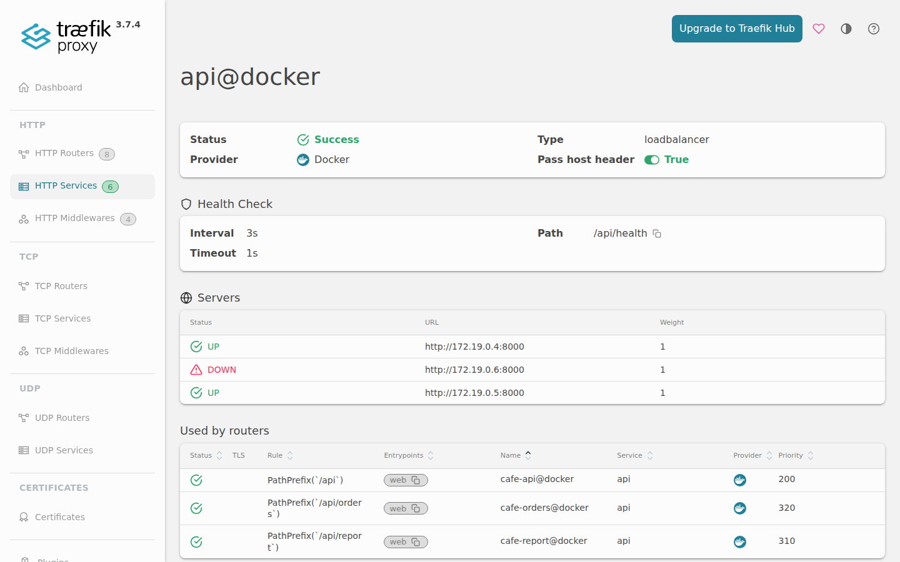
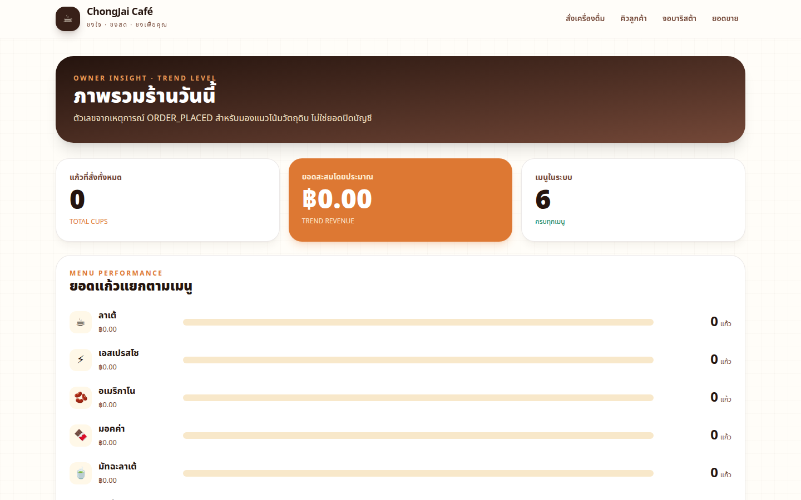

# LAB 2 — Scale รับศึก Rush Hour

> โฟลเดอร์ `002_LAB_Scale_Rush_Hour` · ไฟล์หลัก: `docker-compose.yml` · `verify.sh` · `capture_ui.py` · `sync_manifest.txt` · `api/` · `web/` · `db/`

### 🎯 แล็บนี้ใน 30 วินาที

| | |
|---|---|
| **คำถามเดียวที่ตอบให้จบ** | เมื่อคนสั่งกาแฟพร้อมกัน เราจะเพิ่ม API, ถอน replica ที่ป่วย และวาง policy ที่ประตูโดยลูกค้ายังใช้ URL เดิมได้อย่างไร |
| **ต้องผ่านอะไรมาก่อน** | **LAB 1 — Gateway Front Door** หรือเข้าใจ Traefik router/service และ `PathPrefix` แล้ว |
| **เวลา** | ~50 นาที · การทดลอง **8 อัน** อันละ 4–6 นาที |
| **จบแล้วต้องทำได้เอง** | scale API 1→3 · อ่าน `X-Served-By` · พิสูจน์ active health · แยก rateLimit/basicAuth ด้วย router priority |
| **แล็บนี้ยัง *ไม่* สอน** | RabbitMQ และการเปลี่ยน `QUEUED → READY` เริ่มใน LAB 3 · Kafka analytics เริ่มใน LAB 4 · ไม่ใช่ capacity benchmark หรือ HA ทั้งระบบ |

---

## ทฤษฎีก่อนลงมือ

### URL เดียว แต่มีบาริสต้า API หลายคน



> 🖼 **วิธีอ่านรูป:** มองจากซ้ายไปขวา — ลูกค้าไม่รู้จำนวน replica; `Traefik` เก็บรายชื่อ server จาก Docker provider และยิง `/api/health` ทุก 3 วินาที เส้นแดงคือ server ที่ถูกถอนจากวง ไม่ใช่ container ที่ถูกปิด

source: [`images/scenes/theory-scale-health.excalidraw`](./images/scenes/theory-scale-health.excalidraw)

`docker compose up -d --scale api=3` สร้าง container จาก service definition เดียวกันสามตัว ทุกตัวต่อฐานข้อมูลเดียวกัน แต่ `health/fail|ok` เป็น flag ใน memory จึงเปลี่ยนเฉพาะ replica ที่เรายิงตรง IP

### Router เลือก policy ก่อนส่งต่อ



> 🖼 **วิธีอ่านรูป:** `PathPrefix(/api/orders)` priority 320 ชนะ `/api` 200 จึงผ่าน `orders-rate`; `/api/report` priority 310 ผ่าน `manager-auth`; คำขออื่นลง `cafe-api` โดยไม่ถูกจำกัด

source: [`images/scenes/theory-middleware-chain.excalidraw`](./images/scenes/theory-middleware-chain.excalidraw)

| response มาจาก | status ตัวอย่าง | `X-Served-By` | ความหมาย |
|---|---:|---|---|
| API replica | `200`, `201`, application `404/422/503` | มี hostname | request ถึง API แล้ว |
| Traefik middleware | `401`, `429` | ไม่มี | ประตูตอบก่อนถึง API |

> ⚠️ rate limit นี้เห็น source เป็น web container เมื่อกดฟอร์มผ่าน Next.js server action จึงเป็น policy สำหรับสาธิต ไม่ใช่ per-customer production limit และ Traefik `v3.7.4` ใช้ตามชุด LAB เท่านั้น

---

## เตรียมเครื่องเรียน

### ขั้นที่ 1 — เปิดกล่องของ LAB 2

รันบน **host ของเรา** กล่องนี้เปิดเฉพาะ SSH; หน้าเว็บจะดูผ่าน tunnel ในช่วงท้าย

<!-- skip-auto ต้องสร้างกล่อง DinD และรอ SSH/inner dockerd จาก host -->
```bash
docker rm -f devtools-cafe3 2>/dev/null || true
docker run -dit --name devtools-cafe3 --privileged -p 2228:22 tuchsanai/devtools:2569_1
until sshpass -p passwd ssh -p 2228 -o StrictHostKeyChecking=no -o UserKnownHostsFile=/dev/null root@127.0.0.1 'docker info >/dev/null 2>&1'; do sleep 2; done
```

### ขั้นที่ 2 — โหลดแล็บและคืน namespace จากแล็บอื่น

คำสั่งหลังจากนี้ (จนถึงส่วน Playwright) รัน **ในกล่องเรียน**

<!-- skip-auto ต้อง clone ผ่าน network และ path ของแล็บอื่นอาจยังไม่มีใน checkout ระหว่างประกอบชุด -->
```bash
ssh root@127.0.0.1 -p 2228
mkdir -p ~/labwork && cd ~/labwork && git clone https://github.com/Tuchsanai/DevTools.git
cd DevTools/03_Application_Docker/04_Fullstack_Gateway_Broker_App/002_LAB_Scale_Rush_Hour
for lab in ../001_LAB_* ../003_LAB_* ../004_LAB_* ../005_LAB_*; do [ ! -d "$lab" ] || docker compose -f "$lab/docker-compose.yml" down -v; done
docker compose config --quiet && echo 'Compose config: OK'
```

✅ **สิ่งที่ต้องเห็น:** `Compose config: OK` และ `docker compose version` ใช้งานได้

---

## การทดลองที่ 1 — หนึ่ง service เริ่มด้วย API หนึ่งตัว

**คำถาม:** ก่อน scale คำขอทั้งหมดมาจาก hostname เดียวจริงไหม

<!-- run -->
```bash
docker compose down -v && docker compose up -d --build --scale api=1
until [ "$(docker compose ps --status running -q | wc -l)" -eq 4 ] && [ "$(docker compose ps --format json | grep -c '"Health":"healthy"')" -eq 4 ]; do sleep 2; done
```

<!-- run -->
```bash
for i in $(seq 1 12); do curl -sS -D - -o /dev/null http://localhost:8000/api/menu | awk -F': ' 'tolower($1)=="x-served-by"{gsub("\r","");print $2}'; done | sort | uniq -c
```

✅ **สิ่งที่ต้องเห็น:** มีเพียง hostname เดียว จำนวน 12 ครั้ง เช่น

```text
     12 477acad18e00
```

> 📝 `X-Served-By` ถูกใส่โดย API จาก `socket.gethostname()` จึงเป็นหลักฐานว่า request ถึง replica ไหน โดยไม่ต้อง publish port ของ API ออก host

<!-- trace: T-LAB2 -->

---

## การทดลองที่ 2 — เพิ่มเป็นสาม replicas โดยไม่หยุดประตู

**คำถาม:** เมื่อ scale เป็น 3 แล้ว Traefik ค้นพบ server ใหม่เองไหม

<!-- run -->
```bash
docker compose up -d --scale api=3
until [ "$(docker compose ps api --status running -q | wc -l)" -eq 3 ] && [ "$(docker compose ps api --format json | grep -c '"Health":"healthy"')" -eq 3 ] && [ "$(curl -fsS http://localhost:8080/api/rawdata 2>/dev/null | python3 -c 'import json,sys; print(len(json.load(sys.stdin)["services"]["api@docker"]["loadBalancer"]["servers"]))' 2>/dev/null || echo 0)" -eq 3 ]; do sleep 2; done
```

<!-- run -->
```bash
for i in $(seq 1 12); do curl -sS -D - -o /dev/null http://localhost:8000/api/menu | awk -F': ' 'tolower($1)=="x-served-by"{gsub("\r","");print $2}'; done | sort | uniq -c
```

✅ **สิ่งที่ต้องเห็น:** มี 3 hostnames และกระจายใกล้เคียงกัน

```text
      3 477acad18e00
      4 7eab3c54081c
      5 89fed0c31cf8
```

> 📝 Compose เปลี่ยนจำนวน container; Docker provider ส่ง topology ใหม่ให้ Traefik แบบต่อเนื่อง จึงไม่ต้อง restart gateway และ URL ของลูกค้ายังคง `:8000`

<!-- trace: T-LAB2 -->

---

## การทดลองที่ 3 — Dashboard เห็น server หลัง service เดียว

**คำถาม:** Traefik มอง service `api@docker` เป็น server กี่ตัว

<!-- run -->
```bash
curl -sS http://localhost:8080/api/rawdata | python3 -c 'import json,sys; d=json.load(sys.stdin); s=d["services"]["api@docker"]["loadBalancer"]["servers"]; print("api@docker servers =",len(s)); [print("-",x["url"]) for x in s]'
```

✅ **สิ่งที่ต้องเห็น:** `api@docker servers = 3` ตามด้วย URL ภายในสามค่า; เปิด dashboard จริงที่ `:8080/dashboard/#/http/services/api@docker` จะเห็น service เดียวมี servers สามตัว

> 📝 router ไม่ต้องรู้ IP หรือเลข replica; มันชี้ service logical ชื่อ `api` แล้ว load balancer ของ Traefik ดูแล server set ให้

<!-- trace: T-LAB2 -->

---

## การทดลองที่ 4 — ถอนและคืน replica ที่ health ไม่ผ่าน

**คำถาม:** replica ที่ตอบ `503` หายจากวงได้โดย container ยัง Running หรือไม่

<!-- run -->
```bash
bash -c 'id=$(docker compose ps -q api | head -1); name=$(docker inspect --format "{{.Config.Hostname}}" "$id"); ip=$(docker inspect --format "{{range .NetworkSettings.Networks}}{{.IPAddress}}{{end}}" "$id"); curl -fsS -X POST "http://$ip:8000/api/health/fail"; sleep 5; echo "target=$name running=$(docker inspect --format "{{.State.Running}}" "$id")"; for i in $(seq 1 18); do curl -sS -D - -o /dev/null http://localhost:8000/api/menu | awk -F": " "tolower(\$1)==\"x-served-by\"{gsub(\"\\r\",\"\");print \$2}"; done | sort | uniq -c'
```

<!-- run -->
```bash
bash -c 'id=$(docker compose ps -q api | head -1); name=$(docker inspect --format "{{.Config.Hostname}}" "$id"); ip=$(docker inspect --format "{{range .NetworkSettings.Networks}}{{.IPAddress}}{{end}}" "$id"); curl -fsS -X POST "http://$ip:8000/api/health/ok"; sleep 5; echo "restored=$name"; for i in $(seq 1 18); do curl -sS -D - -o /dev/null http://localhost:8000/api/menu | awk -F": " "tolower(\$1)==\"x-served-by\"{gsub(\"\\r\",\"\");print \$2}"; done | sort | uniq -c'
```

✅ **สิ่งที่ต้องเห็น:** รอบแรก `running=true` แต่เหลือ 2 hostnames (dashboard แสดง server `DOWN` หนึ่งตัว); หลัง `/ok` hostname เดิมกลับมาและครบ 3 ตัว

> 📝 Docker health `/api/ping` ยังผ่าน จึงไม่ restart container; Traefik active health `/api/health` เท่านั้นที่ถอน server นี่คือการแยก “process ยังอยู่” ออกจาก “พร้อมรับงาน”

<!-- trace: T-LAB2 §6 -->

---

## การทดลองที่ 5 — จำกัดเฉพาะเส้นทางสั่งซื้อ

**คำถาม:** ยิง POST พร้อมกันแล้ว Traefik ตอบ `429` ก่อนถึง API ได้จริงไหม

<!-- run -->
```bash
bash -c 'tmp=$(mktemp -d); trap "rm -rf $tmp" EXIT; export tmp; seq 1 15 | xargs -P15 -I{} sh -c '\''curl -sS -D "$tmp/h{}" -o /dev/null -w "%{http_code}\n" -X POST http://localhost:8000/api/orders -H "Content-Type: application/json" -d "{\"menu_code\":\"latte\",\"qty\":1,\"customer_name\":\"rush-{}\"}" > "$tmp/s{}"'\''; sort "$tmp"/s* | uniq -c; h=$(grep -l "^HTTP/.* 429" "$tmp"/h* | head -1); echo "429 headers:"; grep -iE "^HTTP/|^X-" "$h"'
```

✅ **สิ่งที่ต้องเห็น:** มีทั้ง `201` และ `429`; ตัวอย่างจากรอบทดสอบจริง

```text
      5 201
     10 429
429 headers:
HTTP/1.1 429 Too Many Requests
X-Retry-In: 496.400009ms
```

ไม่มี `X-Served-By`/`X-Cafe-Api-Version` ใต้ 429 เพราะ response จบที่ `orders-rate@docker`

> 📝 `average=2`, `period=1s`, `burst=5` เป็น token bucket; จำนวน 201 อาจขยับเล็กน้อยตาม timing แต่ต้องเห็นทั้งสองสถานะ และห้ามตีความเป็น capacity benchmark

<!-- trace: T-LAB3 rateLimit + contract §4 -->

---

## การทดลองที่ 6 — คิวอ่านได้แม้เพิ่งชน limit

**คำถาม:** ทำไม `/api/queue` ยังได้ 200 ทุกครั้งหลัง `/api/orders` ถูกจำกัด

<!-- run -->
```bash
for i in $(seq 1 12); do curl -sS -o /dev/null -w '%{http_code}\n' http://localhost:8000/api/queue; done | sort | uniq -c
```

✅ **สิ่งที่ต้องเห็น:** `12 200` เพราะ `/api/queue` ไม่ match router `PathPrefix(/api/orders)`

```text
     12 200
```

> 📝 priority ทำให้ policy แยกตาม path: create และ order รายตัวอยู่ใต้ `/api/orders`; เมนูและคิวอ่านใช้ router `/api` จึงไม่แชร์ limiter นี้

<!-- trace: contract §8, ledger S-02 -->

---

## การทดลองที่ 7 — รายงานเจ้าของร้านต้องใส่รหัส

**คำถาม:** basicAuth ป้องกันทั้งหน้า `/dashboard` และ API รายงานหรือไม่

<!-- run -->
```bash
for path in /dashboard /api/report/sales; do printf '%-22s anon=%s auth=%s\n' "$path" "$(curl -sS -o /dev/null -w '%{http_code}' http://localhost:8000$path)" "$(curl -sS -u manager:manager123 -o /dev/null -w '%{http_code}' http://localhost:8000$path)"; done
```

✅ **สิ่งที่ต้องเห็น:** ทั้งสอง path เปลี่ยนจาก `401` เป็น `200`

```text
/dashboard             anon=401 auth=200
/api/report/sales      anon=401 auth=200
```

ใช้ Playwright จาก **host** ผ่าน tunnel เพื่อพิสูจน์ browser จริงและเก็บภาพ 1440×900 (script จะ capture หน้าเว็บ, Traefik 3 servers, สถานะ DOWN และ owner dashboard แล้วคืน `/ok`)

<!-- skip-auto ต้องเปิด SSH tunnel และ Playwright Chromium บน host -->
```bash
sshpass -p passwd ssh -N -p 2228 -o StrictHostKeyChecking=no -o UserKnownHostsFile=/dev/null -L 18320:127.0.0.1:8000 -L 18321:127.0.0.1:8080 root@127.0.0.1 &
TUNNEL_PID=$!; sleep 2
LAB_WEB_URL=http://127.0.0.1:18320 LAB_ADMIN_URL=http://127.0.0.1:18321 /opt/venv/bin/python capture_ui.py
kill "$TUNNEL_PID"; wait "$TUNNEL_PID" 2>/dev/null || true
```









> 📝 basicAuth อยู่หน้าทั้ง web router และ report router; Next.js forward `Authorization` ตอน server-side fetch จึงผ่านประตูชั้นที่สองด้วยบัญชีเดียว

<!-- trace: T-LAB3 basicAuth -->

---

## การทดลองที่ 8 — Access log เล่าเส้นทางที่เกิดขึ้น

**คำถาม:** log ของ gateway แยกคำขอปกติ, ปฏิเสธ auth และจำกัด rate ได้ไหม

<!-- run -->
```bash
for code in 200 401 429; do docker compose logs --since 10m traefik | grep -E "\"(GET|POST) /(api|dashboard).*HTTP/[0-9.]+\" $code" | tail -1; done
```

✅ **สิ่งที่ต้องเห็น:** แต่ละบรรทัดมี method/path และ status จริง เช่น

```text
"GET /api/queue HTTP/1.1" 200
"GET /api/report/sales HTTP/1.1" 401
"POST /api/orders HTTP/1.1" 429
```

> 📝 access log คือหลักฐานจากจุดกลางของ request path; ใช้คู่กับ application headers เพื่อแยกว่า response ถึง replica หรือหยุดที่ middleware

<!-- trace: T-LAB3 §9 -->

---

## ตรวจงานด้วย `verify.sh`

สคริปต์ตรวจ manifest ก่อน แล้วตัดสิน `LAB2-V01..V04`: scale/LB, active health, basicAuth และ rateLimit

<!-- run -->
```bash
bash verify.sh; echo "exit code = $?"
```

✅ **สิ่งที่ต้องเห็น:** `[PASS]` ครบ ปิดท้าย

```text
ALL CHECKS PASSED
exit code = 0
```

---

## แก้ปัญหาที่พบบ่อย

| อาการ | สาเหตุ | วิธีแก้ |
|---|---|---|
| `Bind for 0.0.0.0:8000 failed` | LAB อื่นยังจอง front door | `docker compose down -v` ใน LAB นั้นก่อน; ห้ามเปลี่ยน port contract |
| scale แล้วเห็น hostname เดียว | replica ยัง starting หรือ request น้อยเกิน | รอ `healthy` ครบ 3 แล้วเรียก 12 ครั้งด้วย connection ใหม่ |
| ยิง `/health/fail` ผ่าน `:8000` แล้วตัวที่ป่วยไม่แน่นอน | gateway เป็นผู้เลือก replica | หา IP ด้วย `docker inspect` แล้วยิงตรง `http://IP:8000` จาก host ภายในกล่อง |
| `/api/ping` ยัง 200 หลัง `/health/fail` | ถูกต้อง: Docker health แยกจาก active health | ตรวจ `/api/health` ของ IP เดิมจะได้ 503; ใช้ `/ok` คืนวง |
| rate test ได้ 429 ทั้งหมด | token bucket ยังไม่ฟื้นจากรอบก่อน | รอ 2–3 วินาทีแล้วรันใหม่ |
| `/dashboard` ได้ 500 หลังใส่รหัส | Authorization ไม่ถูก forward ใน web | ตรวจว่าใช้สำเนา `web/app/lib/api.ts` ตาม `sync_manifest.txt` |
| ภาพ Traefik ไม่แสดง server | fragment route โหลดก่อน provider sync | รอ 5 วินาทีแล้ว reload `/dashboard/#/http/services/api@docker` |
| `verify.sh` ฟ้อง manifest mismatch | แก้ source copy ในแล็บโดยตรง | คืนไฟล์จาก `app/<path>`; compose/verify/readme ไม่อยู่ใน manifest |

---

## เก็บกวาด

**ในกล่องเรียน:**

<!-- run -->
```bash
docker compose down -v
test -z "$(docker ps -aq --filter label=com.docker.compose.project=lab002)" && test -z "$(docker network ls -q --filter label=com.docker.compose.project=lab002)" && test -z "$(docker volume ls -q --filter label=com.docker.compose.project=lab002)" && echo 'lab002 cleanup: clean'
```

**บน host:** ปิด tunnel (ถ้ายังเปิด) แล้วลบเฉพาะกล่องของแล็บนี้

<!-- skip-auto ลบ outer test box จาก host เท่านั้น -->
```bash
pkill -f 'ssh.*18320:127.0.0.1:8000.*2228' 2>/dev/null || true
docker rm -f devtools-cafe3
docker ps -a --filter 'name=^devtools-cafe3$'
```

✅ **สิ่งที่ต้องเห็น:** `lab002 cleanup: clean` และ filter ของ `devtools-cafe3` ว่าง

> 📝 `down -v` ลบ `lab002_pgdata` จึงคืนฐานข้อมูลสะอาดสำหรับรอบถัดไป; อย่าใช้ filter กว้างจนแตะ container ของแล็บอื่น

---

## สรุปคำสั่งของแล็บนี้

| คำสั่ง | ใช้ตอบคำถามอะไร |
|---|---|
| `docker compose up -d --scale api=3` | เพิ่ม API โดยคง service/URL เดิม |
| `curl -D - ... | grep X-Served-By` | request ถึง replica ไหน |
| `docker inspect ...IPAddress` | ยิง health toggle ให้ replica ที่เลือกแน่นอน |
| `POST /api/health/fail` / `ok` | ถอน/คืน server ใน active load balancer |
| `curl -u manager:manager123` | ผ่าน `manager-auth` สำหรับ LAB |
| `xargs -P15` + POST orders | ทำ concurrent burst เพื่อสังเกต 201/429 |
| `GET :8080/api/rawdata` | อ่าน router/service/server ที่ Traefik เห็น |
| `docker compose logs traefik` | อ่าน access log จาก gateway |
| `docker compose down -v` | ลบระบบพร้อม state ของ LAB2 |

> **จำ 4 อย่าง:** scale เปลี่ยนจำนวน server ไม่เปลี่ยน URL · health `503` ถอน server แต่ไม่จำเป็นต้องหยุด container · 401/429 ที่ gateway ไม่มี app headers · limiter ของ orders ไม่ควรลามไป menu/queue

## ✅ เช็กลิสต์ก่อนจบแล็บ

- [ ] baseline 12 requests มี `X-Served-By` hostname เดียว
- [ ] หลัง `--scale api=3` เห็น 3 hostnames และ dashboard มี 3 servers
- [ ] `/health/fail` ทำให้ hostname เป้าหมายหาย แต่ container ยัง `Running`
- [ ] `/health/ok` ทำให้ hostname เดิมกลับมา
- [ ] burst POST มีทั้ง `201` และ `429`; 429 ไม่มี application headers
- [ ] `/api/queue` รัวแล้วยัง `200` ทุกครั้ง
- [ ] `/dashboard` และ `/api/report` เป็น `401 → 200` ด้วย `manager/manager123`
- [ ] อ่าน access log แล้วแยก `200/201`, `401`, `429` ได้
- [ ] source ทุกไฟล์ใน `sync_manifest.txt` byte-identical กับ `app/`
- [ ] ภาพ PNG ทั้ง 4 มาจาก Playwright จริงผ่าน SSH tunnel และเป็น 1440×900
- [ ] `bash verify.sh` จบ `ALL CHECKS PASSED`, exit 0
- [ ] cleanup แล้วไม่เหลือ container/network/volume ของ `lab002` หรือกล่อง `devtools-cafe3`

*ผลลัพธ์และภาพในเอกสารนี้มาจากการรันจริงใน `tuchsanai/devtools:2569_1` ผ่าน SSH tunnel ตาม protocol ของชุด DevTools*
