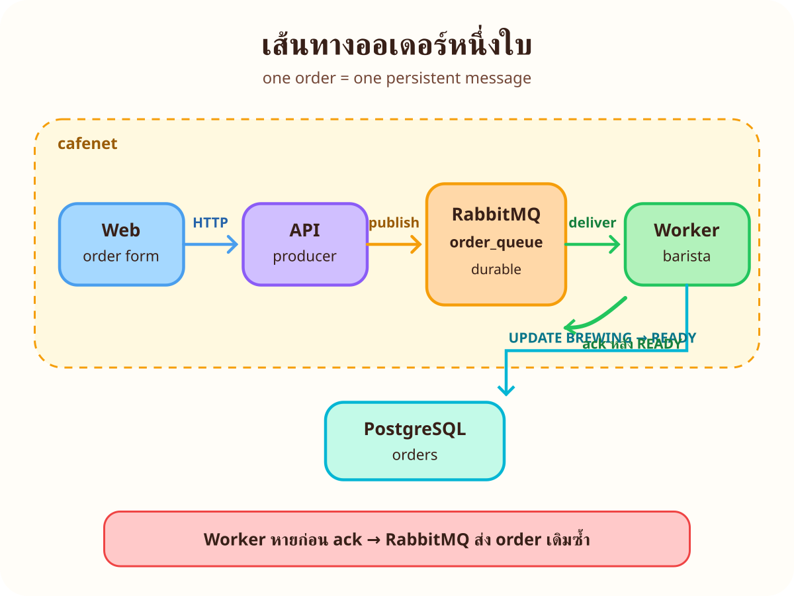
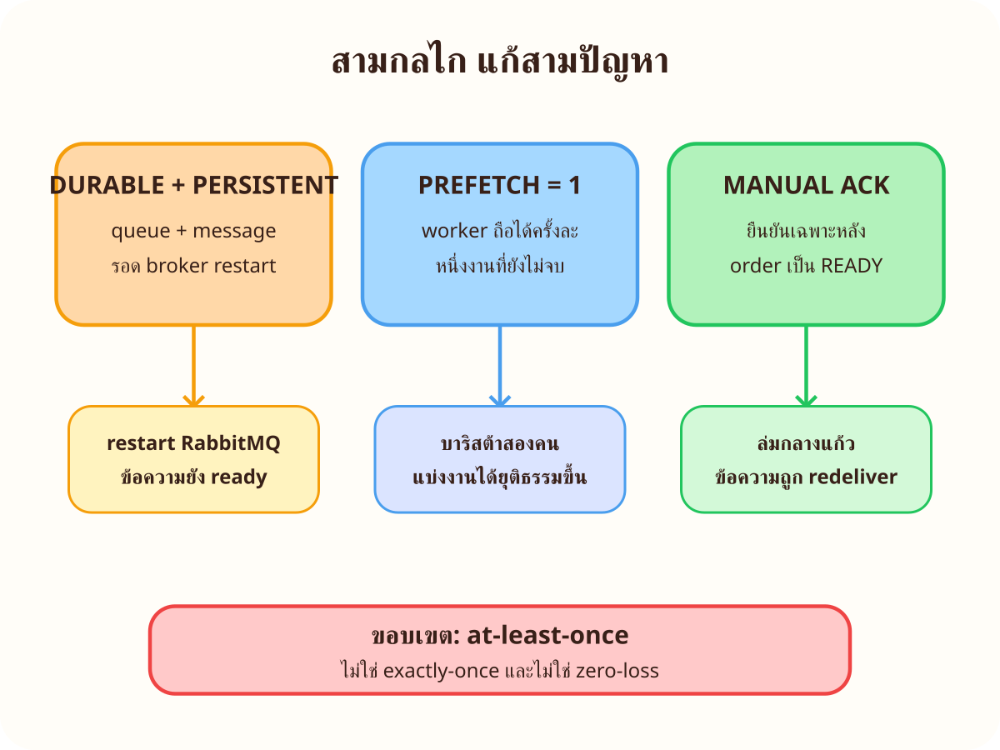
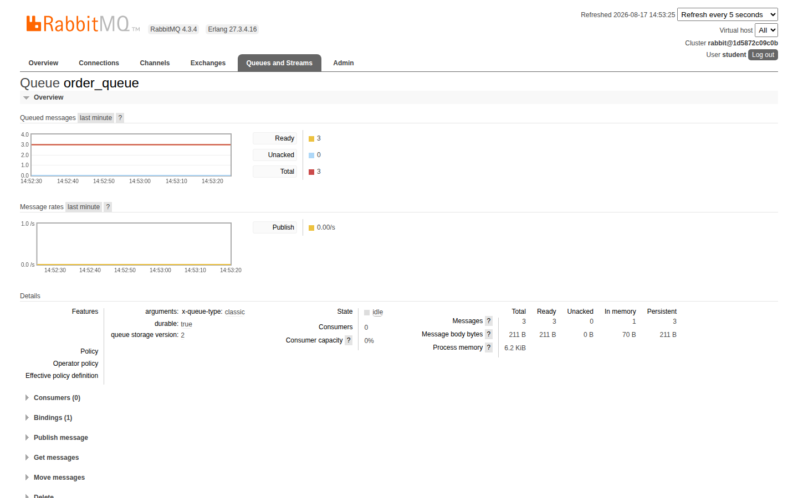
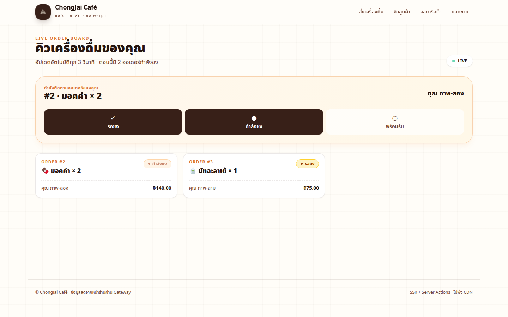
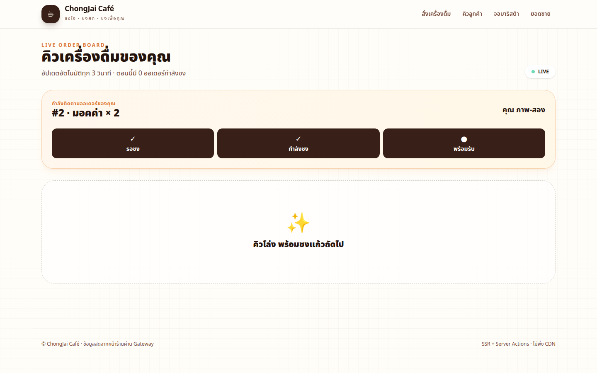

# LAB 3 — ออเดอร์เข้าคิว RabbitMQ

> โฟลเดอร์ `003_LAB_Order_Queue_RabbitMQ` · ระบบย่อย: Traefik, Web, API, PostgreSQL, RabbitMQ และ Worker

### 🎯 แล็บนี้ใน 30 วินาที

| | |
|---|---|
| **คำถามเดียวที่ตอบให้จบ** | ทำอย่างไรให้ออเดอร์ **ไม่ถูกทิ้งก่อนชงเสร็จ** แม้บาริสต้าหยุดกลางแก้ว |
| **ต้องผ่านอะไรมาก่อน** | LAB 1 ประตูหน้า และ LAB 2 การกระจายโหลด · รู้จัก Compose healthcheck |
| **เวลา** | ~55 นาที · การทดลอง 7 ข้อ ข้อละ 5–8 นาที |
| **จบแล้วต้องทำได้เอง** | ตรวจ durable/persistent queue · อธิบาย manual ack/redelivery · scale worker และอ่าน fair dispatch |
| **แล็บนี้ยังไม่สอน** | Kafka/analytics, outbox, publisher confirm และ exactly-once อยู่คนละเรื่อง · LAB นี้รับประกันแบบ **at-least-once** |

---

## ทฤษฎีก่อนลงมือ

### หนึ่งออเดอร์เดินทางอย่างไร



API สร้างแถวสถานะ `QUEUED` แล้ว publish JSON หนึ่งข้อความไป default exchange ด้วย routing key `order_queue` ส่วน worker รับทีละใบ เปลี่ยนเป็น `BREWING`, รอ `3 × qty` วินาที, เปลี่ยนเป็น `READY` และค่อย ack

| จุด | สัญญาที่ใช้ใน LAB นี้ |
|---|---|
| queue | `order_queue`, `durable=True` |
| message | UTF-8 compact JSON, `delivery_mode=Persistent`, 1 message/order |
| consumer | `auto_ack=False`, `prefetch_count=1` |
| state | `QUEUED → BREWING → READY`; `ready_at` มีค่าเมื่อ READY |
| feature flag | `ORDER_TRANSPORT=rabbit`, `EVENTS_ENABLED=0` |

### durable, prefetch และ ack แก้คนละปัญหา



- `durable` รักษานิยาม queue และ persistent message ถูกเก็บให้รอดการ restart ตามขอบเขตของ LAB
- `prefetch=1` ไม่ส่งใบถัดไปให้ worker ที่ยังถือใบเดิม จึงแบ่งงานให้ worker ว่างได้ยุติธรรมขึ้น
- manual ack ทำให้ RabbitMQ ถือว่างานยังไม่จบระหว่าง `BREWING`; connection หายก่อน ack แล้วข้อความกลับเป็น ready เพื่อ redelivery

ขอบเขตสำคัญ: นี่คือ **at-least-once** จึงอาจส่งซ้ำได้ โค้ดตรวจ order ที่ `READY` แล้ว ack โดยไม่ชงซ้ำและใช้ `UPDATE` แบบ idempotent แต่ไม่มี outbox/publisher confirm จึงไม่อ้าง exactly-once หรือ zero-loss

---

## เตรียมเครื่องเรียน

### ขั้นที่ 1 — เปิดกล่องเรียน

รันคำสั่งนี้บน host ใช้กล่องประจำ LAB 3 และ SSH port `2229`:

<!-- skip-auto เป็นคำสั่งบน host และ runner ทำงานอยู่ภายในกล่องเรียน -->
```bash
docker rm -f devtools-cafe4 2>/dev/null || true
docker run -dit --name devtools-cafe4 --privileged -p 2229:22 tuchsanai/devtools:2569_1
ssh root@localhost -p 2229
```

รหัสผ่านคือ `passwd` จากนั้นรอ Docker daemon ภายในกล่องพร้อม

### ขั้นที่ 2 — เข้าโฟลเดอร์แล็บ

คำสั่งที่เหลือรัน **ภายในกล่องเรียน** หลัง clone repository แล้ว:

<!-- skip-auto path ของ repository ขึ้นกับตำแหน่ง clone ของผู้เรียน -->
```bash
cd ~/labwork/DevTools/03_Application_Docker/04_Fullstack_Gateway_Broker_App/003_LAB_Order_Queue_RabbitMQ
docker compose version && docker compose config --quiet
```

✅ **สิ่งที่ต้องเห็น** — Compose แสดงเวอร์ชันและ `config --quiet` จบโดยไม่มี error

> 📝 ก่อนเริ่มให้เก็บกวาด LAB ก่อนหน้า เพราะทุก LAB ใช้พอร์ต `8000/8080` ร่วมกัน แต่ state ของ LAB 3 อยู่ใน project `lab003` และไม่พึ่ง volume ของ LAB อื่น

---

## การทดลองที่ 1 — เปิดระบบโดยยังไม่มีบาริสต้า

<!-- trace: R-LAB1/2 · REQ-03 · LAB3-V01 -->

**คำถาม:** ถ้า API รับออเดอร์ได้ แต่ยังไม่มี worker งานจะไปอยู่ที่ไหน

เปิดระบบโดย scale worker เป็นศูนย์ แล้วรอทุก service ที่เหลือ healthy:

<!-- run -->
```bash
exec </dev/null
docker compose down -v --remove-orphans >/dev/null 2>&1 || true
docker compose up -d --build --wait --wait-timeout 120 --scale worker=0
```

สั่งสามออเดอร์ผ่านประตูเดียว `:8000` แล้วอ่านจำนวนข้อความจาก RabbitMQ:

<!-- run -->
```bash
exec </dev/null
: > .lab-order-ids; for row in 'latte 1 แพร' 'mocha 2 นัท' 'matcha 1 มิน'; do read -r menu qty name <<<"$row"; curl -fsS -X POST http://localhost:8000/api/orders -H 'Content-Type: application/json' -d "{\"menu_code\":\"$menu\",\"qty\":$qty,\"customer_name\":\"$name\"}" | python3 -c 'import json,sys; print(json.load(sys.stdin)["id"])' | tee -a .lab-order-ids; sleep 1; done
docker compose exec -T rabbit rabbitmqctl -q list_queues name messages_ready messages_unacknowledged
```

✅ **ผลจริง** — ได้ id `1`, `2`, `3` และคิวค้างสามใบโดยยังไม่มีใบที่ส่งให้ worker:

```text
1
2
3
name         messages_ready  messages_unacknowledged
order_queue  3               0
```

> 📝 API ยังคืน `201 QUEUED` เพราะหน้าที่ producer คือบันทึกและส่งเข้าคิว ไม่ต้องรอชง เส้นแบ่งนี้ทำให้รับงานได้แม้จำนวน worker เป็นศูนย์

---

## การทดลองที่ 2 — มอง `order_queue` ผ่าน Management UI

<!-- trace: R-LAB1 · REQ-03 -->

**คำถาม:** ค่าที่ CLI เห็นสามใบ ปรากฏบนหน้า RabbitMQ อย่างไร

เปิด `http://localhost:15672` แล้วเข้าสู่ระบบด้วย `student / student123` เลือกแท็บ **Queues and Streams → order_queue**

<!-- skip-auto ต้องเปิด Management UI ด้วย Playwright/เบราว์เซอร์จริงผ่าน SSH tunnel -->
```bash
printf 'เปิด http://localhost:15672 แล้วเลือก Queues and Streams > order_queue\n'
```



✅ **ผลจริง** — หน้า queue แสดง `Durable: true`, Ready `3`, Unacked `0` และ Total `3`

> 📝 Management UI กับ `rabbitmqctl` อ่าน broker ตัวเดียวกัน UI เหมาะกับมองแนวโน้ม ส่วน CLI เหมาะกับตรวจซ้ำและเขียน verify อัตโนมัติ

---

## การทดลองที่ 3 — เปิดบาริสต้าแล้วดูสถานะเดินหน้า

<!-- trace: R-LAB2 work queue · REQ-03 · LAB3-V01 -->

**คำถาม:** เปิด worker หนึ่งตัวแล้วสามออเดอร์เปลี่ยนสถานะตามลำดับใด

<!-- run -->
```bash
exec </dev/null
docker compose up -d --scale worker=1 worker; for i in {1..30}; do ready=$(docker compose exec -T db psql -U student -d cafedb -Atc "SELECT count(*) FROM orders WHERE status='READY'"); [[ $ready == 3 ]] && break; sleep 1; done; [[ $ready == 3 ]]
docker compose exec -T db psql -U student -d cafedb -c 'SELECT id,customer_name,status,ready_at IS NOT NULL AS has_ready_at FROM orders ORDER BY id;'
```

✅ **ผลจริง** — ทุกแถวเดินหน้าและมี `ready_at` หลัง READY:

```text
 id | customer_name | status | has_ready_at
----+---------------+--------+--------------
  1 | แพร           | READY  | t
  2 | นัท           | READY  | t
  3 | มิน           | READY  | t
```

เปิด `/orders?id=2` ระหว่างชงและหลังจบเพื่อเห็น step ของออเดอร์เดียวกัน:

<!-- skip-auto ต้องจับสถานะจากหน้าเว็บจริงด้วย Playwright -->
```bash
printf 'Playwright เปิด http://localhost:8000/orders?id=2 และรอ data-status เปลี่ยน\n'
```





> 📝 `/api/queue` แสดงเฉพาะ QUEUED/BREWING จึงเอา READY ออกจากคิวสด แต่ `/api/orders/{id}` ยังติดตามออเดอร์เดิมได้ครบสามสถานะ

---

## การทดลองที่ 4 — เมื่อบาริสต้าล่มกลางแก้ว งานไม่หาย

<!-- trace: R-LAB2 manual ack · REQ-03 · LAB3-V02 -->

**คำถาม:** ถ้า worker หยุดตอน `BREWING` RabbitMQ จะถือว่างานเสร็จแล้วหรือยัง

สร้างออเดอร์สามแก้ว รอจน worker ถือข้อความไว้ แล้วตรวจ unacknowledged ก่อนหยุด:

<!-- run -->
```bash
exec </dev/null
curl -fsS -X POST http://localhost:8000/api/orders -H 'Content-Type: application/json' -d '{"menu_code":"cocoa","qty":3,"customer_name":"ทดสอบ redelivery"}' | python3 -c 'import json,sys; print(json.load(sys.stdin)["id"])' > .lab-redelivery-id; timeout 12 bash -c 'id=$(cat .lab-redelivery-id); until [[ $(docker compose exec -T db psql -U student -d cafedb -Atc "SELECT status FROM orders WHERE id=$id") == BREWING ]]; do sleep 1; done'; docker compose exec -T rabbit rabbitmqctl -q list_queues name messages_ready messages_unacknowledged
docker compose stop -t 1 worker >/dev/null; docker compose exec -T rabbit rabbitmqctl -q list_queues name messages_ready messages_unacknowledged
```

✅ **ผลจริง** — ระหว่างชงเป็น `0 ready / 1 unacked`; หลัง connection หาย ใบเดิมกลับเป็น `1 ready / 0 unacked`

เปิด worker กลับและรอ order id เดิมเป็น READY:

<!-- run -->
```bash
exec </dev/null
docker compose start worker >/dev/null; timeout 30 bash -c 'id=$(cat .lab-redelivery-id); until [[ $(docker compose exec -T db psql -U student -d cafedb -Atc "SELECT status FROM orders WHERE id=$id") == READY ]]; do sleep 1; done'
id=$(cat .lab-redelivery-id); docker compose exec -T db psql -U student -d cafedb -c "SELECT id,status,ready_at IS NOT NULL AS has_ready_at FROM orders WHERE id=$id"
```

✅ **ผลจริง** — order id เดิมเป็น `READY`; ไม่มีการ INSERT order ใหม่

> 📝 `stop -t 1` ใช้เวลารอสั้นกว่าการชง 9 วินาทีเพื่อจำลอง process หายก่อน ack เมื่อส่งซ้ำ worker ใช้ order id เดิมและ UPDATE แบบ idempotent

---

## การทดลองที่ 5 — บาริสต้าสองคนแบ่งงานกัน

<!-- trace: R-LAB2 fair dispatch · REQ-03 · LAB3-V02 -->

**คำถาม:** `prefetch_count=1` ทำให้ worker สองตัวรับใบงานอย่างไร

<!-- run -->
```bash
exec </dev/null
docker compose up -d --scale worker=2 worker; for n in 1 2 3 4; do curl -fsS -X POST http://localhost:8000/api/orders -H 'Content-Type: application/json' -d "{\"menu_code\":\"espresso\",\"qty\":1,\"customer_name\":\"fair-$n\"}" >/dev/null; sleep 1; done; sleep 8
docker compose exec -T rabbit rabbitmqctl -q list_consumers queue_name prefetch_count; docker compose logs --tail 30 worker | grep -E 'worker-[12].*(กำลังชง|READY)'
```

✅ **ผลจริง** — consumer ทั้งสองมี prefetch `1` และ log มีงานจากทั้ง `worker-1` กับ `worker-2`

```text
order_queue  1
order_queue  1
worker-1 | [worker] กำลังชง ...
worker-2 | [worker] กำลังชง ...
```

> 📝 fair dispatch ในที่นี้หมายถึง worker ที่ยังถือ unacked อยู่ไม่รับใบถัดไป ไม่ใช่คำรับประกันว่าแต่ละคนได้จำนวนเท่ากันทุกจังหวะ

---

## การทดลองที่ 6 — ปิดร้านชั่วคราวแล้ว restart RabbitMQ

<!-- trace: R-LAB2 durability · REQ-03 · LAB3-V01 -->

**คำถาม:** durable queue และ persistent message รักษางานสองใบผ่าน broker restart ได้หรือไม่

<!-- run -->
```bash
exec </dev/null
docker compose stop worker >/dev/null; for n in 1 2; do curl -fsS -X POST http://localhost:8000/api/orders -H 'Content-Type: application/json' -d "{\"menu_code\":\"americano\",\"qty\":1,\"customer_name\":\"durable-$n\"}" >/dev/null; sleep 1; done; docker compose restart rabbit >/dev/null
timeout 120 bash -c 'until [[ $(docker inspect -f "{{.State.Health.Status}}" $(docker compose ps -q rabbit)) == healthy ]]; do sleep 2; done'; docker compose exec -T rabbit rabbitmqctl -q list_queues name durable messages_ready
```

✅ **ผลจริง** — หลัง restart ยังเห็น `order_queue  true  2`

<!-- run -->
```bash
exec </dev/null
docker compose up -d --scale worker=1 worker; for i in {1..30}; do ready=$(docker compose exec -T rabbit rabbitmqctl -q list_queues name messages_ready | awk '$1=="order_queue" {print $2}'); [[ $ready == 0 ]] && break; sleep 1; done; [[ $ready == 0 ]]
docker compose exec -T rabbit rabbitmqctl -q list_queues name messages_ready messages_unacknowledged
```

> 📝 `rabbitdata` ทำให้ broker มี storage ถาวร ส่วน durable/persistent บอก broker ว่า queue และ message ใดต้องเก็บ ทั้งสามส่วนทำงานร่วมกัน

---

## การทดลองที่ 7 — Web ไม่ต้องรู้จัก RabbitMQ

<!-- trace: R-LAB1 architecture · NFR-04 · LAB3-V03 -->

**คำถาม:** service ใดเป็น producer/consumer และ service ใดควรรู้เพียง HTTP

<!-- run -->
```bash
exec </dev/null
docker compose config | grep -nE '^(  api:|  worker:|  web:)|RABBIT_URL|API_BASE_URL|EVENTS_ENABLED'
```

✅ **ผลจริง** — `RABBIT_URL` อยู่เฉพาะ `api` กับ `worker`; `web` มีเพียง `API_BASE_URL=http://traefik`; ทั้ง Python service ตั้ง `EVENTS_ENABLED=0` และ compose ไม่มี Kafka

> 📝 Browser กับ web พูด HTTP ผ่าน Traefik, API เป็น producer, worker เป็น consumer การไม่แจก broker credential ให้ web ลด coupling และทำให้เปลี่ยนวิธีทำงานหลังคิวโดยไม่แก้หน้าเว็บ

---

## ตรวจงานด้วย `verify.sh`

สคริปต์ใช้ project ชั่วคราว prefix `vcafe-`, ตรวจ `LAB3-V01..V03` แล้ว cleanup ของตัวเองเสมอ:

<!-- run -->
```bash
exec </dev/null
docker compose down -v --remove-orphans
bash verify.sh; echo "exit code = $?"
```

✅ **สิ่งที่ต้องเห็น** — ปิดท้ายดังนี้:

```text
[PASS] LAB3-V01 หนึ่ง order ต่อหนึ่ง persistent message และ durable queue รอด restart
[PASS] LAB3-V02 manual ack ทำให้งาน requeue และ order เดิม READY หลัง redelivery
[PASS] LAB3-V03 EVENTS_ENABLED=0 ไม่ import/connect Kafka และ web ไม่ถือ broker credential
ALL CHECKS PASSED (7 checks)
exit code = 0
```

---

## แก้ปัญหาที่พบบ่อย

| อาการ | สาเหตุ | วิธีแก้ |
|---|---|---|
| POST ได้ `503 BROKER_UNAVAILABLE` | RabbitMQ ยังไม่ healthy หรือ credential/URL ผิด | `docker compose ps rabbit` แล้วดู `docker compose logs rabbit api` |
| queue มีข้อความแต่ไม่เดิน | worker scale เป็น 0, unhealthy หรือถูก stop | `docker compose up -d --scale worker=1 worker` แล้วดู ready file/worker log |
| หยุด worker แล้วไม่ทันเห็น redelivery | order qty น้อยหรือ stop timeout ยาวกว่าช่วงชง | ใช้ qty `3`, รอเห็น `BREWING`, แล้ว `docker compose stop -t 1 worker` |
| `messages_unacknowledged` เป็น 0 ก่อน stop | worker ยังไม่รับใบงานหรือชงเสร็จแล้ว | poll DB จนสถานะเป็น `BREWING` แล้วอ่าน queue ทันที |
| scale 2 แต่ log เหมือนมี worker เดียว | งานน้อย/เร็วเกิน หรือดู log สั้นเกิน | สั่งอย่างน้อย 4 ใบและตรวจ `list_consumers ... prefetch_count` |
| Management UI เข้าไม่ได้ | ยังไม่ได้ tunnel `15672` หรือ rabbit ไม่ healthy | เปิด SSH tunnel และตรวจ `docker compose ps rabbit` |
| `order_queue` หายหลัง `down -v` | `-v` ลบ `rabbitdata` โดยตั้งใจ | `up` ใหม่แล้ว API/worker จะ declare queue อีกครั้ง |

---

## เก็บกวาด

**ในกล่องเรียน:** ลบ container/network/volume ของ `lab003` และไฟล์ fixture ชั่วคราว

<!-- run -->
```bash
exec </dev/null
docker compose down -v --remove-orphans
rm -f .lab-order-ids .lab-redelivery-id; docker ps -a --filter name=lab003; docker volume ls --filter name=lab003
```

**บน host หลังออกจาก SSH:**

<!-- skip-auto เป็นคำสั่งบน host และจะลบกล่องเรียน -->
```bash
exit
docker rm -f devtools-cafe4 && docker ps -a --filter name=devtools-cafe4
```

---

## สรุปคำสั่งของแล็บนี้

| คำสั่ง | ใช้ตอบคำถามอะไร |
|---|---|
| `docker compose up -d --scale worker=0` | เปิด producer/broker โดยยังไม่มี consumer |
| `rabbitmqctl list_queues ...` | มี message พร้อมส่งหรือยังไม่ ack กี่ใบ |
| `rabbitmqctl list_consumers ... prefetch_count` | consumer ประกาศ fair-dispatch guard เท่าใด |
| `docker compose stop -t 1 worker` | จำลอง worker หายก่อน ack |
| `docker compose up -d --scale worker=2 worker` | เพิ่ม consumer ใน work queue เดียวกัน |
| `docker compose restart rabbit` | ตรวจ durable queue + persistent message |
| `docker compose logs worker` | ดูว่า worker ใดรับและ ack order ใด |

> **จำ 4 อย่าง:** persistent message อยู่ใน durable queue · prefetch=1 จำกัดงานค้างต่อ worker · ack หลัง READY · redelivery แปลว่า at-least-once ไม่ใช่ exactly-once

## ✅ เช็กลิสต์ก่อนจบแล็บ

- [ ] สั่ง 3 orders ตอน `worker=0` แล้วเห็น `messages_ready=3`
- [ ] Management UI แสดง `order_queue` เป็น durable และตัวเลขตรง CLI
- [ ] เปิด worker แล้วสถานะเดิน `QUEUED → BREWING → READY` ภายใน 30 วินาที
- [ ] หยุด worker กลาง qty=3 แล้วเห็น unacked กลับเป็น ready และ order id เดิมจบ READY
- [ ] scale worker=2 แล้วเห็น prefetch=1 และ log จาก worker ทั้งสอง
- [ ] restart RabbitMQ ตอนมี 2 queued messages แล้วข้อความยังอยู่
- [ ] อธิบายได้ว่าทำไม web ไม่มี `RABBIT_URL` และ LAB3 ไม่มี Kafka
- [ ] `bash verify.sh` ปิดท้าย `ALL CHECKS PASSED` และ exit code `0`
- [ ] `docker compose down -v` แล้วไม่เหลือ resource ชื่อ `lab003`/`vcafe-lab3`

*ผลลัพธ์และภาพ UI ในเอกสารนี้มาจากการรันจริงใน `tuchsanai/devtools:2569_1` ผ่าน SSH tunnel และ Playwright*
