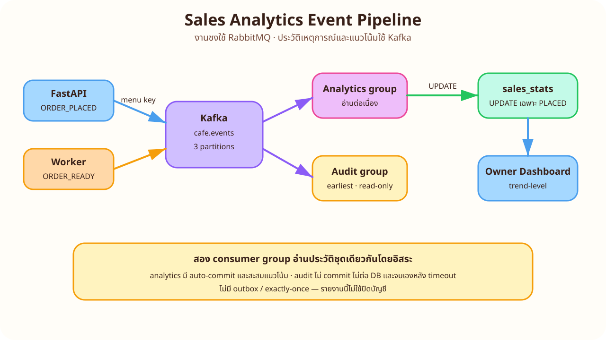
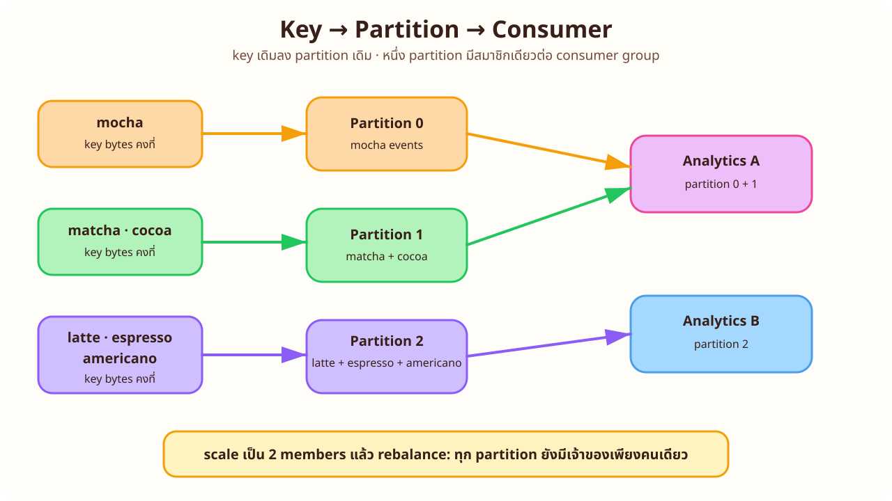
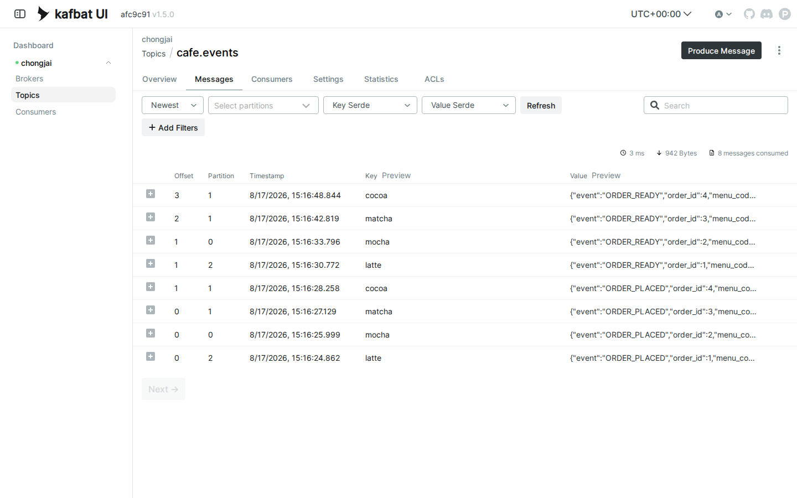
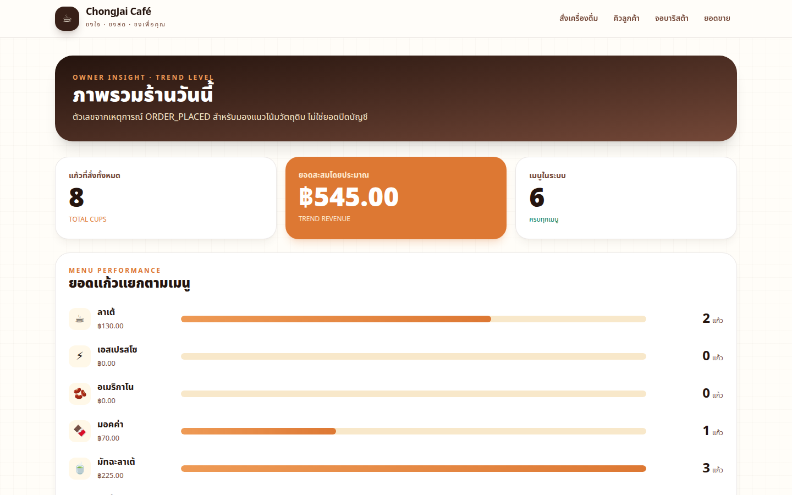
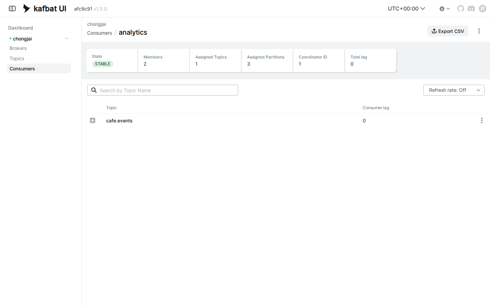
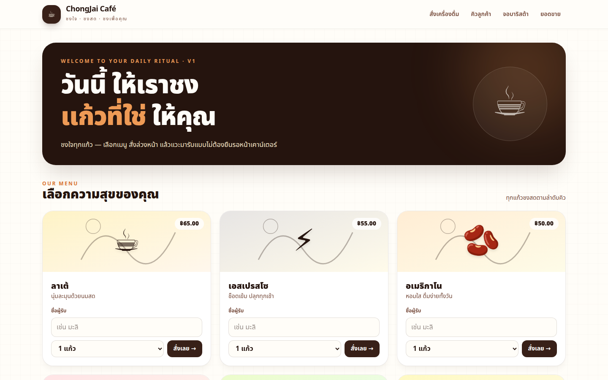
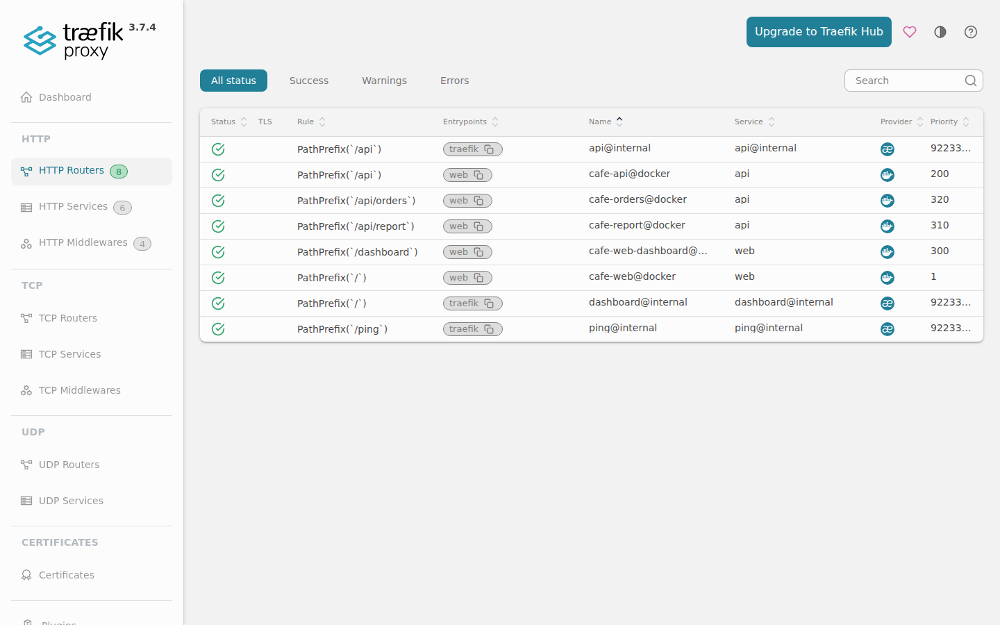

# LAB 4 — Sales Analytics ด้วย Kafka

> โฟลเดอร์ `004_LAB_Sales_Analytics_Kafka` · ไฟล์หลัก: `docker-compose.yml` · `verify.sh` · `capture_ui.py` · `sync_manifest.txt` · source ของ `api/`, `worker/`, `analytics/`, `web/`, `db/`

### 🎯 แล็บนี้ใน 30 วินาที

| | |
|---|---|
| **คำถามเดียวที่ตอบให้จบ** | เหตุการณ์การขายชุดเดียวกันจะอัปเดต dashboard, แบ่งงานตาม key และ replay ภายหลังได้อย่างไร |
| **ต้องผ่านอะไรมาก่อน** | **LAB 3 — Order Queue RabbitMQ** หรือเข้าใจ durable queue, manual ack และ worker แล้ว |
| **เวลา** | ~55 นาที · การทดลอง **8 อัน** อันละ 5–7 นาที |
| **จบแล้วต้องทำได้เอง** | bootstrap topic · อ่าน key/partition · ดู lag/rebalance · แยก consumer group · พิสูจน์ replay แบบ read-only |
| **แล็บนี้ยัง *ไม่* สอน** | canary v1/v2 อยู่ LAB 5 · ไม่มี outbox/exactly-once · รายงานเป็น **trend-level** ไม่ใช้ปิดบัญชี |

---

## ทฤษฎีก่อนลงมือ

### งานที่ต้องทำ กับประวัติที่อยากเก็บ เป็นคนละหน้าที่



> 🖼 **วิธีอ่านรูป:** API ส่ง `ORDER_PLACED` ตอนรับออเดอร์ ส่วน worker ส่ง `ORDER_READY` หลังชง Analytics อ่านทั้งคู่แต่ `UPDATE sales_stats` เฉพาะ `ORDER_PLACED`; audit ใช้ group ใหม่อ่านประวัติแล้วจบโดยไม่แตะ DB

source: [`images/scenes/theory-event-pipeline.excalidraw`](./images/scenes/theory-event-pipeline.excalidraw)

RabbitMQ ในระบบนี้คืองานที่ต้องส่งให้บาริสต้าหนึ่งคนและหายจากคิวหลัง manual ack ส่วน Kafka เก็บ event ตาม retention ให้ consumer หลายกลุ่มอ่านด้วย offset ของตัวเอง ดังนั้นคำว่า “message หายจาก Rabbit” ไม่ได้แปลว่า “ประวัติหายจาก Kafka”

### `menu_code` เดิม ลง partition เดิม



> 🖼 **วิธีอ่านรูป:** `mocha→p0`, `matcha/cocoa→p1`, `latte/espresso/americano→p2` ตาม murmur2 ของ kafka-python เมื่อ scale analytics เป็นสอง members แต่ละ partition ยังมีเจ้าของเพียงคนเดียวใน group

source: [`images/scenes/theory-key-partition.excalidraw`](./images/scenes/theory-key-partition.excalidraw)

| แนวคิด | ค่าในแล็บนี้ | ผลที่สังเกตได้ |
|---|---|---|
| topic | `cafe.events`, 3 partitions, RF=1 | ครบ p0/p1/p2 และไม่ auto-create |
| event key | UTF-8 `menu_code` | เมนูเดิมรักษาลำดับใน partition เดิม |
| group `analytics` | earliest + auto-commit | อ่านต่อเนื่องและมี lag เมื่อหยุด |
| group `audit` | earliest + no commit | replay ประวัติแบบ one-shot ได้ซ้ำ |
| aggregation | `UPDATE sales_stats` เฉพาะ `ORDER_PLACED` | `ORDER_READY` ไม่ทำให้ยอดเพิ่มรอบสอง |

### สิ่งที่มักเข้าใจผิด

- **คิดว่า** Kafka สร้าง topic ให้ producer เสมอ → **จริง ๆ** แล็บนี้ปิด auto-create และ bootstrap topic ก่อนเปิด producer
- **คิดว่า** scale consumer แล้ว event เดียวถูกนับหลายรอบ → **จริง ๆ** members ใน group เดียวแบ่ง partition กัน
- **คิดว่า** `ORDER_READY` ต้องเพิ่มยอดอีกครั้ง → **จริง ๆ** analytics parse เพื่อสังเกต pipeline แต่ไม่นับซ้ำ
- **คิดว่า** replay ต้องย้อน offset ของ analytics → **จริง ๆ** ใช้ group `audit` ใหม่ จึงไม่รบกวนงานหลัก

---

## เตรียมเครื่องเรียน

### ขั้นที่ 1 — เปิดกล่องของ LAB 4

รันบน **host ของเรา** กล่อง DinD เปิดเฉพาะ SSH; หน้าเว็บและ UI ทั้งหมดดูผ่าน tunnel ภายหลัง

<!-- skip-auto ต้องสร้างกล่อง DinD และรอ SSH/inner dockerd จาก host -->
```bash
docker rm -f devtools-cafe2 2>/dev/null || true
docker run -dit --name devtools-cafe2 --privileged -p 2227:22 tuchsanai/devtools:2569_1
until sshpass -p passwd ssh -p 2227 -o StrictHostKeyChecking=no -o UserKnownHostsFile=/dev/null root@127.0.0.1 'docker info >/dev/null 2>&1'; do sleep 2; done
```

### ขั้นที่ 2 — โหลดแล็บและคืน namespace จากแล็บอื่น

คำสั่งหลังจากนี้ (ยกเว้น Playwright) รัน **ในกล่องเรียน** แล็บนี้ไม่ใช้ state จาก LAB ก่อนหน้า

<!-- skip-auto ต้อง clone ผ่าน network และ path ของแล็บอื่นอาจยังไม่มีใน checkout ระหว่างประกอบชุด -->
```bash
ssh root@127.0.0.1 -p 2227
mkdir -p ~/labwork && cd ~/labwork && git clone https://github.com/Tuchsanai/DevTools.git
cd DevTools/03_Application_Docker/04_Fullstack_Gateway_Broker_App/004_LAB_Sales_Analytics_Kafka
for lab in ../001_LAB_* ../002_LAB_* ../003_LAB_* ../005_LAB_*; do [ ! -d "$lab" ] || docker compose -f "$lab/docker-compose.yml" down -v; done
docker compose config --quiet && echo 'Compose config: OK'
```

✅ **สิ่งที่ต้องเห็น:** `Compose config: OK` และ services ครบ `traefik db rabbit kafka api worker analytics web kafka-ui`

> 📝 เราไม่ publish PostgreSQL, AMQP, Kafka, API หรือ web สู่ host จุดเข้ามีเฉพาะ Traefik `8000/8080`, RabbitMQ UI `15672` และ Kafka UI `8085` ตาม contract

---

## การทดลองที่ 1 — ใครต้องสร้าง topic ก่อน producer เริ่ม

**คำถาม:** เมื่อปิด auto-create ระบบจะขึ้นตามลำดับที่ตรวจสอบได้อย่างไร

ลบ state เดิม เปิด Kafka ตัวเดียว รอ healthy แล้วสร้าง/describe topic:

<!-- run -->
```bash
exec </dev/null
bash -c 'docker compose down -v --remove-orphans; docker compose up -d kafka; until [ "$(docker inspect -f "{{.State.Health.Status}}" "$(docker compose ps -q kafka)" 2>/dev/null)" = healthy ]; do sleep 2; done; docker compose exec -T kafka /opt/kafka/bin/kafka-topics.sh --bootstrap-server kafka:9092 --create --topic cafe.events --partitions 3 --replication-factor 1; docker compose exec -T kafka /opt/kafka/bin/kafka-topics.sh --bootstrap-server kafka:9092 --describe --topic cafe.events'
```

เปิด service ที่เหลือและรอ healthcheck ครบเก้าตัว:

<!-- run -->
```bash
exec </dev/null
bash -c 'docker compose up -d --build; until [ "$(docker compose ps --status running -q | wc -l)" -eq 9 ] && [ "$(docker compose ps --format json | grep -c '\''"Health":"healthy"'\'')" -eq 9 ]; do sleep 2; done; docker compose ps'
```

✅ **ผลจริง** — describe แสดง `PartitionCount: 3`, `ReplicationFactor: 1` และ partition `0,1,2`; service ทั้งเก้าเป็น `Up ... (healthy)` ภายใน 120 วินาทีหลัง image พร้อม

> 📝 ลำดับนี้กัน producer แข่งกับ topic creation: Kafka พร้อม → operator สร้าง/ตรวจ topic → จึงเปิด API, worker และ analytics ที่พึ่ง topic นั้น

<!-- trace: K-LAB2 + ledger D-02 -->

---

## การทดลองที่ 2 — หนึ่งออเดอร์กลายเป็นสอง event อย่างไร

**คำถาม:** สั่งลาเต้หนึ่งครั้งแล้วเห็นทั้ง `ORDER_PLACED` และ `ORDER_READY` ได้หรือไม่

<!-- run -->
```bash
exec </dev/null
bash -c 'curl -fsS -X POST http://localhost:8000/api/orders -H "Content-Type: application/json" -d '\''{"menu_code":"latte","qty":1,"customer_name":"event-latte"}'\'' | tee /tmp/lab4-latte.json; id=$(python3 -c '\''import json; print(json.load(open("/tmp/lab4-latte.json"))["id"])'\''); until [ "$(curl -fsS http://localhost:8000/api/orders/$id | python3 -c '\''import json,sys; print(json.load(sys.stdin)["status"])'\'')" = READY ]; do sleep 1; done; echo "order #$id READY"'
```

<!-- run -->
```bash
exec </dev/null
timeout 35 docker compose exec -T kafka /opt/kafka/bin/kafka-console-consumer.sh --bootstrap-server kafka:9092 --topic cafe.events --from-beginning --max-messages 2 --property print.partition=true --property print.key=true
```

✅ **ผลจริง** — สองบรรทัดใช้ key `latte`, อยู่ `Partition:2` และ value เป็น `ORDER_PLACED` ตามด้วย `ORDER_READY`

เปิด Kafka UI ผ่าน tunnel ในขั้น Playwright จะเห็น event เดียวกันใน topic browser:



> 📝 event แรกเกิดเมื่อ API รับออเดอร์ ส่วน event หลังเกิดเมื่อ worker เขียน READY สำเร็จ เวลาอาจห่างราว 3 วินาทีต่อหนึ่งแก้ว

<!-- trace: K-LAB1 -->

---

## การทดลองที่ 3 — key เดิมรักษา partition ได้จริงไหม

**คำถาม:** `mocha` สองออเดอร์อยู่ partition 0 ทั้งคู่หรือไม่

<!-- run -->
```bash
exec </dev/null
bash -c 'sleep 2; for n in 1 2; do curl -fsS -o /tmp/mocha-$n.json -w "mocha-$n HTTP %{http_code}\n" -X POST http://localhost:8000/api/orders -H "Content-Type: application/json" -d "{\"menu_code\":\"mocha\",\"qty\":1,\"customer_name\":\"partition-mocha-$n\"}"; done; until [ "$(docker compose exec -T db psql -U student -d cafedb -Atqc "SELECT count(*) FROM orders WHERE customer_name LIKE '\''partition-mocha-%'\'' AND status='\''READY'\''")" -eq 2 ]; do sleep 1; done'
```

<!-- run -->
```bash
exec </dev/null
docker compose exec -T analytics python audit.py | grep -E 'p0 .* ORDER_(PLACED|READY) .* mocha'
```

✅ **ผลจริง** — mocha ทั้งสอง order มี `ORDER_PLACED` และ `ORDER_READY` บน `p0`; ไม่มี mocha บน p1/p2

> 📝 Kafka hash key bytes ไม่ใช่ชื่อไทยหรือ order id การล็อก `menu_code` เป็น ASCII ตัวพิมพ์เล็กจึงทำให้ mapping ใน contract ทดสอบซ้ำได้

<!-- trace: K-LAB2 keys -->

---

## การทดลองที่ 4 — Event ขยับ dashboard ได้อย่างไร

**คำถาม:** เจ้าของร้านเห็นยอดจาก analytics โดยไม่อ่าน topic เองได้หรือไม่

<!-- run -->
```bash
exec </dev/null
bash -c 'sleep 2; curl -fsS -X POST http://localhost:8000/api/orders -H "Content-Type: application/json" -d '\''{"menu_code":"cocoa","qty":2,"customer_name":"dashboard-cocoa"}'\'' >/dev/null; until curl -fsS -u manager:manager123 http://localhost:8000/api/report/sales | python3 -c '\''import json,sys; d=json.load(sys.stdin); assert d["totals"]=={"cups":5,"revenue":325.0}'\'' 2>/dev/null; do sleep 1; done; curl -fsS -u manager:manager123 http://localhost:8000/api/report/sales | python3 -c '\''import json,sys; d=json.load(sys.stdin); print(d["totals"], d["claim"])'\'''
```

✅ **ผลจริง** — fixture ถึงจุดนี้เป็น `{'cups': 5, 'revenue': 325.0} trend-level` และ report ยังมี menu items ครบหกแถว

เปิด dashboard ด้วย Playwright ผ่าน basicAuth จะเห็น stat tiles และกราฟต่อเมนู:



> 📝 dashboard อ่าน `sales_stats` ผ่าน `/api/report/sales`; มันไม่ใช่ Kafka consumer และต้องผ่าน `manager/manager123` ตัวเลขเป็นแนวโน้มเพราะ consumer ใช้ auto-commit + UPDATE

<!-- trace: K-LAB5 pipeline + ชุดนี้ -->

---

## การทดลองที่ 5 — ติดตั้งจอ audit ทีหลังยังเห็นอดีตไหม

**คำถาม:** group ใหม่อ่าน earliest ได้โดยไม่เปลี่ยนยอดขายหรือไม่

<!-- run -->
```bash
exec </dev/null
bash -c 'before=$(docker compose exec -T db psql -U student -d cafedb -Atqc "SELECT md5(string_agg(menu_code||'\'':'\''||cups||'\'':'\''||revenue, '\'','\'' ORDER BY menu_code)) FROM sales_stats"); docker compose exec -T analytics python audit.py | tee /tmp/lab4-audit.log; after=$(docker compose exec -T db psql -U student -d cafedb -Atqc "SELECT md5(string_agg(menu_code||'\'':'\''||cups||'\'':'\''||revenue, '\'','\'' ORDER BY menu_code)) FROM sales_stats"); echo "sales_stats before=$before after=$after"; test "$before" = "$after"'
```

✅ **ผลจริง** — audit พิมพ์ event เก่าพร้อม partition/offset แล้วจบเอง; hash `before` และ `after` เหมือนกันทุกตัว

> 📝 `audit.py` ใช้ group `audit`, `auto_offset_reset=earliest`, ปิด auto-commit และมี `consumer_timeout_ms` จึงเป็นจอประวัติแบบ one-shot ไม่ใช่ analytics ตัวที่สอง

<!-- trace: K-LAB4 replay -->

---

## การทดลองที่ 6 — LAG บอกงานค้างของ consumer อย่างไร

**คำถาม:** เมื่อ analytics หยุด แต่ producer ยังส่ง event ค่า LAG โตและกลับศูนย์ได้หรือไม่

<!-- run -->
```bash
exec </dev/null
bash -c 'docker compose stop analytics; sleep 2; curl -fsS -X POST http://localhost:8000/api/orders -H "Content-Type: application/json" -d '\''{"menu_code":"espresso","qty":1,"customer_name":"lag-espresso"}'\'' >/dev/null; curl -fsS -X POST http://localhost:8000/api/orders -H "Content-Type: application/json" -d '\''{"menu_code":"americano","qty":2,"customer_name":"lag-americano"}'\'' >/dev/null; sleep 3; docker compose exec -T kafka /opt/kafka/bin/kafka-consumer-groups.sh --bootstrap-server kafka:9092 --describe --group analytics'
```

<!-- run -->
```bash
exec </dev/null
bash -c 'docker compose start analytics; until [ "$(docker compose exec -T kafka /opt/kafka/bin/kafka-consumer-groups.sh --bootstrap-server kafka:9092 --describe --group analytics 2>/dev/null | awk '\''NR>1 && $6 ~ /^[0-9]+$/ {sum+=$6} END {print sum+0}'\'')" -eq 0 ]; do sleep 2; done; docker compose exec -T kafka /opt/kafka/bin/kafka-consumer-groups.sh --bootstrap-server kafka:9092 --describe --group analytics'
```

✅ **ผลจริง** — ตอนหยุดมี LAG อย่างน้อย 2 records; หลัง start analytics อ่านตามทันและทุก partition กลับ `LAG 0`

> 📝 LAG คือระยะระหว่าง log-end offset กับ committed offset ของ group ไม่ใช่จำนวนออเดอร์เสมอ เพราะหนึ่งออเดอร์มีได้ทั้ง PLACED และ READY

<!-- trace: K-LAB3 LAG -->

---

## การทดลองที่ 7 — สอง consumers แบ่งสาม partitions อย่างไร

**คำถาม:** scale analytics เป็นสอง members แล้ว Kafka rebalance งานอย่างไร

<!-- run -->
```bash
exec </dev/null
bash -c 'docker compose up -d --scale analytics=2; until [ "$(docker compose ps analytics --format json | grep -c '\''"Health":"healthy"'\'')" -eq 2 ]; do sleep 2; done; docker compose exec -T kafka /opt/kafka/bin/kafka-consumer-groups.sh --bootstrap-server kafka:9092 --describe --group analytics --members --verbose'
```

<!-- run -->
```bash
exec </dev/null
bash -c 'sleep 2; curl -fsS -X POST http://localhost:8000/api/orders -H "Content-Type: application/json" -d '\''{"menu_code":"matcha","qty":1,"customer_name":"rebalance-matcha"}'\'' >/dev/null; curl -fsS -X POST http://localhost:8000/api/orders -H "Content-Type: application/json" -d '\''{"menu_code":"cocoa","qty":1,"customer_name":"rebalance-cocoa"}'\'' >/dev/null; until [ "$(docker compose exec -T db psql -U student -d cafedb -Atqc "SELECT count(*) FROM sales_stats WHERE (menu_code='\''matcha'\'' AND cups>=1) OR (menu_code='\''cocoa'\'' AND cups>=3)")" -eq 2 ]; do sleep 1; done; docker compose exec -T db psql -U student -d cafedb -c "SELECT menu_code,cups,revenue FROM sales_stats WHERE menu_code IN ('\''matcha'\'','\''cocoa'\'') ORDER BY menu_code"'
```

✅ **ผลจริง** — `MEMBERS=2`, assignments รวม 3 partitions โดย partition ไม่ซ้ำสมาชิก; matcha กับ cocoa อัปเดตคนละแถวใน `sales_stats`



> 📝 จำนวน consumers มากกว่า partitions ไม่เพิ่มงานคู่ขนาน เพราะสมาชิกส่วนเกินจะ idle; แล็บนี้ใช้สองตัวเพื่อเห็นการแบ่ง 2+1 ชัดเจน

<!-- trace: K-LAB3 groups -->

---

## การทดลองที่ 8 — RabbitMQ กับ Kafka จำข้อมูลต่างกันอย่างไร

**คำถาม:** หลังชงเสร็จ งานหายจาก Rabbit แต่ event ยัง replay ได้หรือไม่

<!-- run -->
```bash
exec </dev/null
bash -c 'until docker compose exec -T rabbit rabbitmqctl list_queues name messages_ready messages_unacknowledged 2>/dev/null | awk '\''$1=="order_queue" && $2==0 && $3==0 {ok=1} END {exit !ok}'\''; do sleep 2; done; docker compose exec -T rabbit rabbitmqctl list_queues name messages_ready messages_unacknowledged'
```

<!-- run -->
```bash
exec </dev/null
docker compose exec -T analytics python audit.py | tail -n 5
```

✅ **ผลจริง** — `order_queue 0 0` หลัง ack แต่ audit ยังพิมพ์ event เก่าจาก `cafe.events` และสรุปจำนวนก่อนจบ

> 📝 RabbitMQ ตอบว่า “งานนี้ยังต้องทำไหม” ส่วน Kafka ตอบว่า “เกิดอะไรขึ้นแล้วบ้าง” การใช้ทั้งคู่ไม่ได้ซ้ำซ้อนเมื่อให้หน้าที่ต่างกันชัดเจน

<!-- trace: R vs K comparison (สอนไว้ทั้งสองชุด) -->

---

## เปิด UI และเก็บหลักฐานด้วย Playwright

บน **host** เปิด tunnel เฉพาะ local ports `18300–18302` แล้วรัน script capture; PNG ทุกภาพใช้ viewport 1440×900

<!-- skip-auto ต้องเปิด SSH tunnel และ Playwright Chromium บน host -->
```bash
sshpass -p passwd ssh -N -p 2227 -o StrictHostKeyChecking=no -o UserKnownHostsFile=/dev/null -L 18300:127.0.0.1:8000 -L 18301:127.0.0.1:8080 -L 18302:127.0.0.1:8085 root@127.0.0.1 &
TUNNEL_PID=$!; sleep 2
LAB_WEB_URL=http://127.0.0.1:18300 LAB_ADMIN_URL=http://127.0.0.1:18301 LAB_KAFKA_UI_URL=http://127.0.0.1:18302 /opt/venv/bin/python capture_ui.py
kill "$TUNNEL_PID"; wait "$TUNNEL_PID" 2>/dev/null || true
```





> 📝 tunnel ไม่เปลี่ยน published-port contract ภายในกล่อง มันเพียงส่งพอร์ต host ชั่วคราวจาก `18300–18302` ไปยัง loopback ของกล่องเพื่อให้ Playwright ตรวจ UI จริง

---

## ตรวจงานด้วย `verify.sh`

สคริปต์ตรวจ source manifest, bootstrap topic ใน project prefix `vcafe-`, สร้าง fixture แบบ clean run และตัดสิน check owner ของ LAB 4

| check ID | ข้อกำหนดที่ตัดสิน |
|---|---|
| `LAB4-V01` | REQ-05 · นับเฉพาะ ORDER_PLACED, cups/revenue ตรง fixture และมี 6 seed rows |
| `LAB4-V02` | REQ-06 · audit earliest replay ครบ p0/p1/p2 และ DB hash ไม่เปลี่ยน |

<!-- run -->
```bash
exec </dev/null
bash verify.sh
rc=$?
echo "exit code = $rc"
exit "$rc"
```

✅ **ผลจริง** — `[PASS]` ทั้งสอง check ปิดท้าย

```text
[PASS] LAB4-V01: ORDER_PLACED updated exactly 6 cups / 425.00 across all 6 seeded menu rows
[PASS] LAB4-V02: audit replayed earliest history on partitions 0/1/2 and left the database hash unchanged
ALL CHECKS PASSED
VERIFY_EXIT_CODE=0
exit code = 0
```

> 📝 verify ใช้ fixture ของตัวเองและ cleanup ด้วย trap จึงไม่พึ่งยอดจากการทดลองก่อนหน้า และไม่ทิ้ง project `vcafe-lab004-u5`

---

## แก้ปัญหาที่พบบ่อย

| อาการ | สาเหตุ | วิธีแก้ |
|---|---|---|
| API/analytics restart วนหลังเปิดระบบ | ยังไม่มี `cafe.events` เพราะเปิดทุกตัวก่อน bootstrap | `down -v` แล้วทำการทดลองที่ 1 ตามลำดับ |
| create topic บอก `TopicExistsException` | ใช้ `kafkadata` เดิม | ถ้าต้องการ clean run ใช้ `docker compose down -v`; อย่าสร้างซ้ำบน state เดิม |
| Kafka UI ยังไม่ขึ้น | JVM กำลังเริ่มหรือ Kafka ยังไม่ healthy | ดู `docker compose ps` และ `logs --tail 50 kafka kafka-ui` |
| mocha ไม่อยู่ p0 | เปลี่ยนตัวพิมพ์/encoding ของ key | ใช้ `menu_code` ASCII ตัวพิมพ์เล็กจาก seed เท่านั้น |
| dashboard ยอดยังศูนย์ | analytics ยังไม่พร้อมหรือกำลังตาม lag | ดู `logs analytics` และ consumer group describe |
| audit รอบหลังยังอ่าน event เดิม | ถูกต้อง: group audit ไม่ commit offset | ใช้ output เป็น replay read-only และดู hash DB ประกอบ |
| scale analytics แล้วมีตัวหนึ่ง idle | members มากกว่า partitions หรือ rebalance ยังไม่จบ | แล็บนี้มี 3 partitions; รอ health/member ครบแล้ว describe ใหม่ |
| LAG ไม่เท่าจำนวนออเดอร์ | worker ยังส่ง ORDER_READY เพิ่ม | ตีความเป็นจำนวน records หลัง committed offset ไม่ใช่จำนวน order |
| `/dashboard` ได้ 401 | basicAuth ทำงานตาม contract | ใช้ `manager/manager123`; Next.js จะ forward Authorization ไป report |
| Playwright เปิด UI ไม่ได้ | tunnel ปิดหรือ local port ถูกใช้ | ตรวจ PID และใช้เฉพาะ `18300–18319`; ห้ามเปลี่ยน published ports ใน Compose |

---

## เก็บกวาด

**ในกล่องเรียน:** ลบ container/network/volumes ของ `lab004` และตรวจ namespace เดิม

<!-- run -->
```bash
exec </dev/null
docker compose down -v --remove-orphans
test -z "$(docker ps -aq --filter label=com.docker.compose.project=lab004)" && test -z "$(docker network ls -q --filter label=com.docker.compose.project=lab004)" && test -z "$(docker volume ls -q --filter label=com.docker.compose.project=lab004)" && echo 'lab004 cleanup: clean'
```

**บน host:** ปิด tunnel ที่อาจค้าง แล้วลบเฉพาะกล่อง LAB 4

<!-- skip-auto ลบ outer test box และ tunnel ของ LAB 4 จาก host เท่านั้น -->
```bash
pkill -f 'ssh.*18300:127.0.0.1:8000.*2227' 2>/dev/null || true
docker rm -f devtools-cafe2
docker ps -a --filter 'name=^devtools-cafe2$'
```

✅ **สิ่งที่ต้องเห็น:** `lab004 cleanup: clean` และ filter ของ `devtools-cafe2` ว่าง

> 📝 `down -v` ลบทั้ง PostgreSQL, RabbitMQ และ Kafka state ของแล็บนี้ จึงเริ่ม bootstrap ใหม่ได้โดยไม่มี topic/offset เก่าปะปน

---

## สรุปคำสั่งของแล็บนี้

| คำสั่ง | ใช้ตอบคำถามอะไร |
|---|---|
| `docker compose up -d kafka` | เปิด broker ก่อน producer/consumer |
| `kafka-topics.sh --create/--describe` | สร้างและยืนยัน topic 3 partitions |
| `kafka-console-consumer.sh --property print.partition=true` | เห็น event/key/partition จริง |
| `docker compose exec analytics python audit.py` | replay earliest แบบ read-only และจบเอง |
| `kafka-consumer-groups.sh --describe` | อ่าน current offset, log end และ lag |
| `docker compose stop/start analytics` | สร้าง backlog แล้วดู consumer ตามทัน |
| `docker compose up -d --scale analytics=2` | ทำให้ group rebalance แบ่ง partitions |
| `rabbitmqctl list_queues ...` | ยืนยัน queue ว่างหลัง manual ack |
| `docker compose down -v` | ลบระบบรวม pgdata/rabbitdata/kafkadata |

> **จำ 4 อย่าง:** topic ต้องมี ก่อน producer · key เดิมลง partition เดิม · group เดียวแบ่งงานแต่คนละ group ได้สำเนา · Rabbit ack ลบงานแต่ Kafka retention ยังให้ replay

## ✅ เช็กลิสต์ก่อนจบแล็บ

- [ ] bootstrap `cafe.events` ได้ 3 partitions / replication factor 1 ก่อนเปิดระบบทั้งหมด
- [ ] สั่งหนึ่ง order แล้วเห็น `ORDER_PLACED` และ `ORDER_READY` ใน Kafka UI
- [ ] สั่ง mocha สองครั้งแล้วพิสูจน์ว่าทุก event อยู่ partition 0
- [ ] เปิด `/dashboard` ผ่าน basicAuth แล้วเห็นยอด cups/revenue ขยับครบ 6 เมนู
- [ ] รัน `audit.py` แล้วเห็นประวัติตั้งแต่ earliest โดย hash `sales_stats` ไม่เปลี่ยน
- [ ] หยุด analytics แล้วเห็น LAG โต; start แล้วกลับ 0
- [ ] scale analytics=2 แล้วเห็น 2 members แบ่ง 3 partitions
- [ ] Rabbit queue เป็น `0 0` หลัง ack แต่ audit ยัง replay event ได้
- [ ] source ทุกไฟล์ใน `sync_manifest.txt` byte-identical กับ `app/`
- [ ] PNG ทั้ง 5 มาจาก Playwright จริงผ่าน tunnel และมีขนาด 1440×900
- [ ] `bash verify.sh` จบ `ALL CHECKS PASSED`, exit 0
- [ ] cleanup แล้วไม่เหลือ container/network/volume ของ `lab004`, `vcafe-lab004-u5` หรือกล่อง `devtools-cafe2`

*ผลลัพธ์และภาพในเอกสารนี้มาจากการรันจริงใน `tuchsanai/devtools:2569_1` ผ่าน SSH tunnel ตาม protocol ของชุด DevTools*
