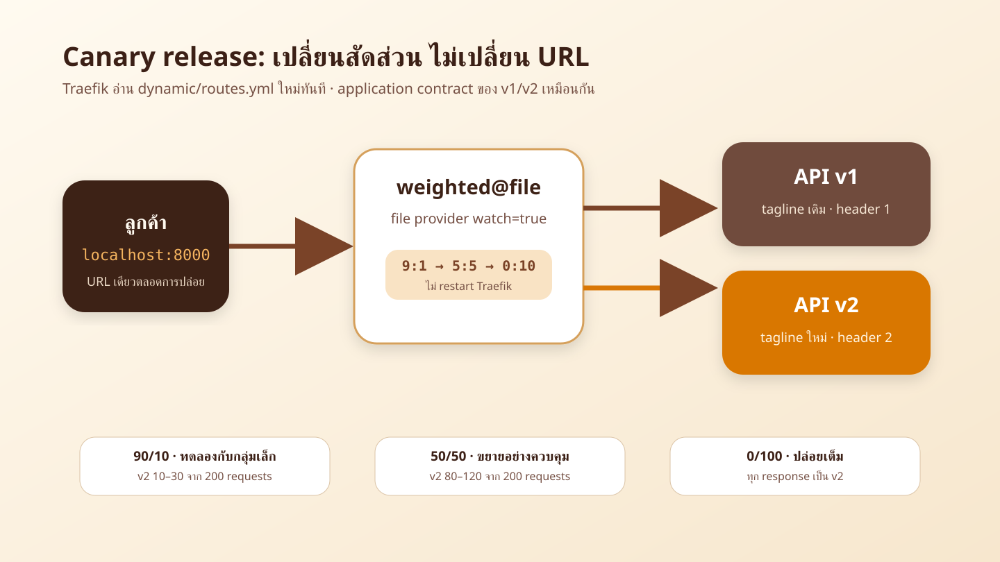
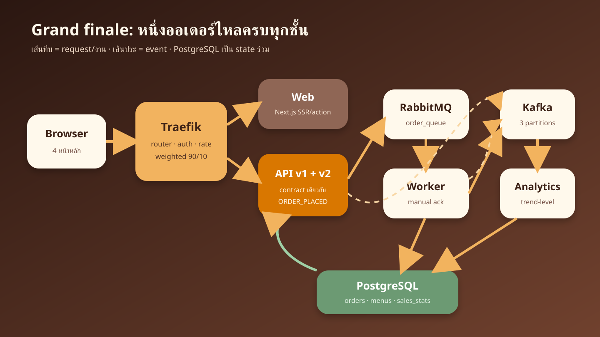
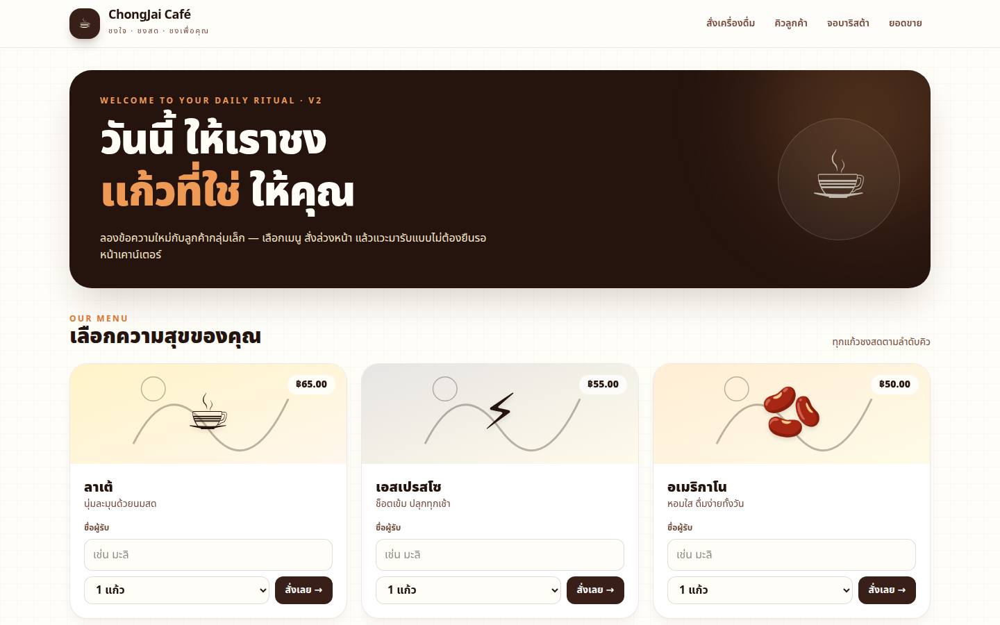
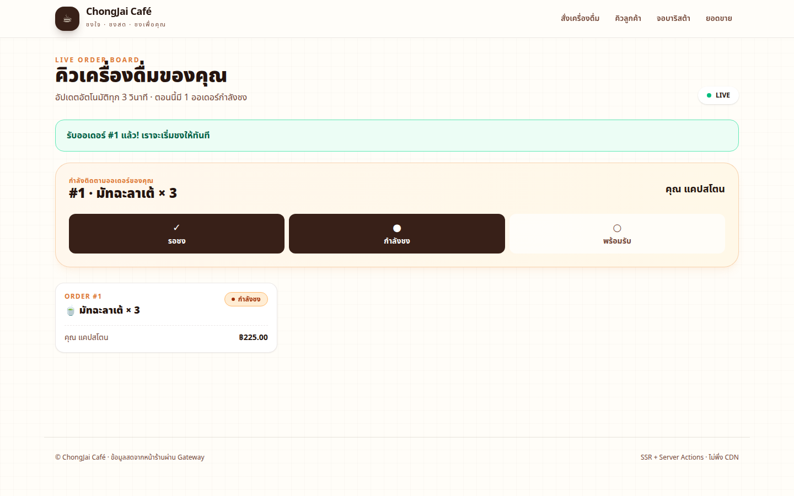
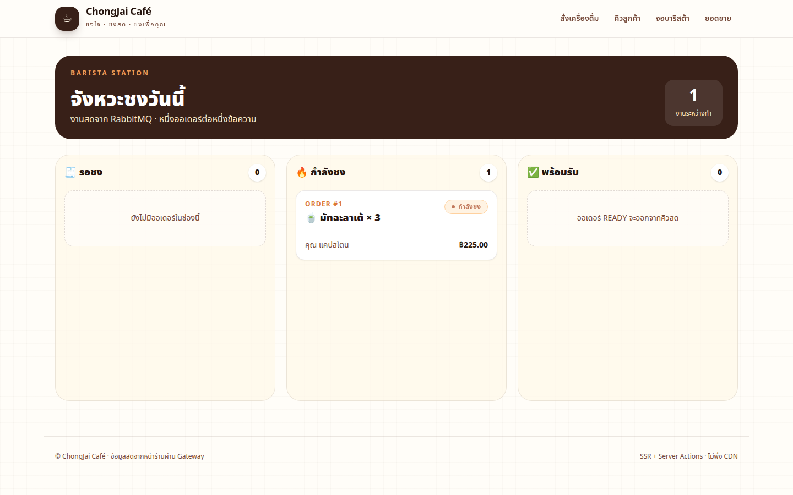
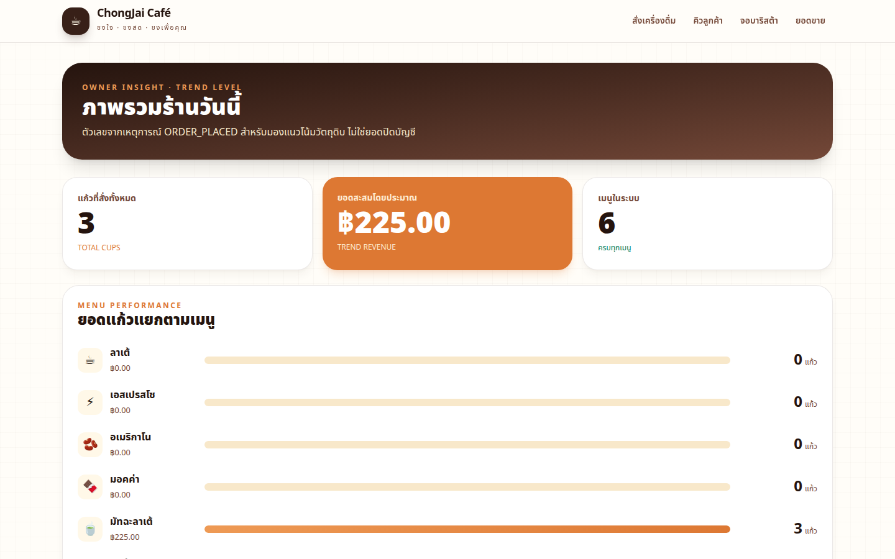

# LAB 5 — Canary Release Capstone

> โฟลเดอร์ `005_LAB_Canary_Release_Capstone` · ไฟล์หลัก: `docker-compose.yml` · `dynamic/routes.yml` · `check.sh` · `capture_ui.py` · `sync_manifest.txt`

### 🎯 แล็บนี้ใน 30 วินาที

| | |
|---|---|
| **คำถามเดียวที่ตอบให้จบ** | เราจะปล่อย API v2 ให้ลูกค้ากลุ่มเล็ก เพิ่มสัดส่วนโดยไม่ restart และยืนยันว่าออเดอร์ยังไหลครบทุกชั้นได้อย่างไร |
| **ต้องผ่านอะไรมาก่อน** | **LAB 1–4** — เข้าใจ gateway, RabbitMQ work queue และ Kafka event pipeline แล้ว |
| **เวลา** | ~50 นาที · การทดลอง **8 อัน** อันละ 4–7 นาที |
| **จบแล้วต้องทำได้เอง** | อ่าน weighted service · วัด 90/10 · hot reload เป็น 50/50 และ 0/100 · ตรวจ contract parity · รัน integration acceptance |
| **แล็บนี้ยัง *ไม่* สอน** | deployment หลายเครื่อง, service mesh, outbox หรือ zero-loss · ตัวเลข analytics เป็น **trend-level** ไม่ใช่ยอดปิดบัญชี |

---

## ทฤษฎีก่อนลงมือ

### เปลี่ยนน้ำหนัก โดยลูกค้ายังใช้ URL เดิม



> 🖼 **วิธีอ่านรูป:** จับตา `weighted@file` ตรงกลาง — router ทั้งสามชี้ service นี้เหมือนเดิม สิ่งที่เปลี่ยนมีเพียง weight ใน `dynamic/routes.yml`; v1/v2 ใช้ schema และเมนูเดียวกัน ต่างเฉพาะ tagline กับ version header

source: [`images/scenes/theory-canary-weights.excalidraw`](./images/scenes/theory-canary-weights.excalidraw)

| ช่วงปล่อย | v1:v2 | เกณฑ์จาก 200 requests | ใช้ตอบคำถาม |
|---|---:|---:|---|
| Canary | 9:1 | v2 `10–30` | ของใหม่ทำงานกับ traffic ส่วนน้อยหรือไม่ |
| Expand | 5:5 | v2 `80–120` | file provider โหลด policy ใหม่โดยไม่ restart หรือไม่ |
| Full release | 0:10 | v2 `200/200` | traffic ใหม่ทั้งหมดผ่าน contract เดิมหรือไม่ |

> ⚠️ ช่วง `10–30` และ `80–120` เป็น acceptance tolerance ไม่ใช่คำรับประกันว่าสุ่มทุกชุดจะได้ 10%/50% เป๊ะ และ `traefik:v3.7.4` ใช้ตามชุด LAB เท่านั้น ไม่ใช่ production baseline

### ออเดอร์หนึ่งใบไหลครบระบบ



> 🖼 **วิธีอ่านรูป:** เส้นทึบคือ request/งานที่ต้องทำให้ order ถึง `READY`; เส้นประคือ event สำหรับ analytics — RabbitMQ message หายหลัง ack แต่ Kafka event ยัง replay ได้ภายใน retention

source: [`images/scenes/theory-full-stack.excalidraw`](./images/scenes/theory-full-stack.excalidraw)

| ชั้น | หน้าที่ใน capstone | สิ่งที่ไม่ควรอ้างเกินจริง |
|---|---|---|
| Traefik | URL เดียว, auth/rate policy, weighted canary | ไม่ได้ทำให้ทั้งระบบ HA |
| RabbitMQ + worker | persistent message, manual ack หลัง `READY` | at-least-once อาจชงซ้ำเมื่อผิดจังหวะ |
| Kafka + analytics | เก็บ event, แบ่ง partition, สรุปยอด | ไม่มี exactly-once; รายงานเป็น trend-level |
| PostgreSQL | เก็บ order state และ `sales_stats` 6 เมนู | LAB ใช้ init script ไม่ใช่ migration production |

---

## เตรียมเครื่องเรียน

### ขั้นที่ 1 — เปิดกล่องของ LAB 5

รันบน **host ของเรา** กล่องนี้เปิดเฉพาะ SSH; ทุกหน้าเว็บใช้ tunnel ในช่วง Playwright

<!-- skip-auto ต้องสร้างกล่อง DinD และรอ SSH/inner dockerd จาก host -->
```bash
docker rm -f devtools-cafe3 2>/dev/null || true
docker run -dit --name devtools-cafe3 --privileged -p 2228:22 tuchsanai/devtools:2569_1
until sshpass -p passwd ssh -p 2228 -o StrictHostKeyChecking=no -o UserKnownHostsFile=/dev/null root@127.0.0.1 'docker info >/dev/null 2>&1'; do sleep 2; done
```

### ขั้นที่ 2 — โหลดแล็บและคืน namespace จากแล็บอื่น

คำสั่งหลังจากนี้ (ยกเว้น Playwright) รัน **ในกล่องเรียน**

<!-- skip-auto ต้อง clone ผ่าน network และ path ของแล็บอื่นอาจยังไม่มีใน checkout ระหว่างประกอบชุด -->
```bash
ssh root@127.0.0.1 -p 2228
mkdir -p ~/labwork && cd ~/labwork && git clone https://github.com/Tuchsanai/DevTools.git
cd DevTools/03_Application_Docker/04_Fullstack_Gateway_Broker_App/005_LAB_Canary_Release_Capstone
for lab in ../001_LAB_* ../002_LAB_* ../003_LAB_* ../004_LAB_*; do [ ! -d "$lab" ] || docker compose -f "$lab/docker-compose.yml" down -v; done
docker compose config --quiet && echo 'Compose config: OK'
```

✅ **สิ่งที่ต้องเห็น:** `Compose config: OK`; project ในไฟล์คือ `lab005` และไม่มี LAB อื่นจองพอร์ต `8000/8080/15672/8085`

---

## การทดลองที่ 1 — เปิดระบบเต็มเป็น grand finale

**คำถาม:** ระบบสิบ services พร้อมทำงานและเปิดทุกจอจาก front door เดียวได้หรือไม่

bootstrap Kafka ตาม LAB 4 แบบย่อ: เปิด broker → รอ healthy → สร้าง topic 3 partitions → เปิด service ที่เหลือ

<!-- run -->
```bash
exec </dev/null  # แยก stdin ของ block ออกจาก manifest ของ runner กลาง
docker compose down -v && docker compose up -d kafka
until [ "$(docker inspect -f '{{.State.Health.Status}}' "$(docker compose ps -q kafka)" 2>/dev/null)" = healthy ]; do sleep 2; done
docker compose exec -T kafka /opt/kafka/bin/kafka-topics.sh --bootstrap-server kafka:9092 --create --if-not-exists --topic cafe.events --partitions 3 --replication-factor 1
docker compose exec -T kafka /opt/kafka/bin/kafka-topics.sh --bootstrap-server kafka:9092 --describe --topic cafe.events
docker compose up -d --build
until [ "$(docker compose ps --status running -q | wc -l)" -eq 10 ] && [ "$(docker compose ps --format json | grep -c '"Health":"healthy"')" -eq 10 ]; do sleep 2; done
docker compose ps --format 'table {{.Service}}\t{{.Status}}\t{{.Ports}}'
```

✅ **ผลจริง:** topic แสดง `PartitionCount: 3`; `traefik db rabbit kafka api-v1 api-v2 worker analytics web kafka-ui` เป็น `healthy` ครบภายใน 120 วินาทีหลัง image พร้อม

ใช้ Playwright จาก **host** เปิด tunnel เฉพาะ `18320–18323`; สคริปต์กดสั่งจริงและตรวจ Traefik/RabbitMQ/Kafka UI ด้วย

<!-- skip-auto ต้องเปิด SSH tunnel และ Playwright Chromium บน host -->
```bash
sshpass -p passwd ssh -N -p 2228 -o StrictHostKeyChecking=no -o UserKnownHostsFile=/dev/null -L 18320:127.0.0.1:8000 -L 18321:127.0.0.1:8080 -L 18322:127.0.0.1:15672 -L 18323:127.0.0.1:8085 root@127.0.0.1 &
TUNNEL_PID=$!; sleep 2
LAB_WEB_URL=http://127.0.0.1:18320 LAB_ADMIN_URL=http://127.0.0.1:18321 LAB_RABBIT_URL=http://127.0.0.1:18322 LAB_KAFKA_UI_URL=http://127.0.0.1:18323 /opt/venv/bin/python capture_ui.py
kill "$TUNNEL_PID"; wait "$TUNNEL_PID" 2>/dev/null || true
```









> 📝 สี่ภาพคือ browser จริง 1440×900 ผ่าน tunnel; web เรียก API ด้วย `API_BASE_URL=http://traefik` จึงไม่มีทางลัดจากหน้าเว็บไป API container

<!-- trace: ชุดนี้ทั้งหมด -->

---

## การทดลองที่ 2 — วัด Canary 90/10

**คำถาม:** weight 9:1 ทำให้ v2 อยู่ในช่วง acceptance ได้จริงไหม

<!-- run -->
```bash
exec </dev/null  # แยก stdin ของ block ออกจาก manifest ของ runner กลาง
bash -c 'v2=0; for i in $(seq 1 200); do version=$(curl -sS -D - -o /dev/null http://localhost:8000/api/version | awk -F": " "tolower(\$1)==\"x-cafe-api-version\"{gsub(\"\\r\",\"\");print \$2}"); [ "$version" = 2 ] && v2=$((v2+1)); done; echo "v2=$v2/200"; [ "$v2" -ge 10 ] && [ "$v2" -le 30 ]'
```

✅ **ผลจริง:** clean run ทั้งสามรอบใน `check.sh` ต้องอยู่ `10–30`; การรันจริงได้ค่าที่บันทึกใน `logs/lab5-check.log`

> 📝 นับจาก response header ไม่ใช่เดาจาก hostname เพราะ v1/v2 ต่างกันตาม `X-Cafe-Api-Version`; 200 requests ลดผลของความผันผวนจาก sample เล็ก

<!-- trace: T-LAB4 weighted -->

---

## การทดลองที่ 3 — ลูกค้ากลุ่มเล็กเห็นข้อความใหม่

**คำถาม:** browser จริงพบ tagline v2 โดยหน้าและฟอร์มเดิมยังใช้งานได้หรือไม่

รัน block Playwright ในการทดลองที่ 1 อีกครั้ง แล้วดูบรรทัดจำนวน load ที่ใช้พบ v2

<!-- skip-auto เป็นการทดสอบ browser ผ่าน SSH tunnel จาก host -->
```bash
sshpass -p passwd ssh -N -p 2228 -o StrictHostKeyChecking=no -o UserKnownHostsFile=/dev/null -L 18320:127.0.0.1:8000 -L 18321:127.0.0.1:8080 -L 18322:127.0.0.1:15672 -L 18323:127.0.0.1:8085 root@127.0.0.1 &
TUNNEL_PID=$!; sleep 2; /opt/venv/bin/python capture_ui.py
kill "$TUNNEL_PID"; wait "$TUNNEL_PID" 2>/dev/null || true
```

✅ **สิ่งที่ต้องเห็น:** `V2 BANNER OBSERVED after N loads` และ `PLAYWRIGHT CAPTURE PASSED`; banner มีข้อความ “ลองข้อความใหม่กับลูกค้ากลุ่มเล็ก”

> 📝 หน้าเดิมเลือก canary ผ่าน server-side `/api/version`; เราวนโหลดเพราะ 90/10 ไม่ได้ผูกผู้ใช้แบบ sticky session และบันทึกจำนวนรอบจริงไว้ใน Playwright log

<!-- trace: T-LAB4 + I-02 -->

---

## การทดลองที่ 4 — Hot reload เป็น 50/50

**คำถาม:** เปลี่ยน weight โดยไม่ restart Traefik แล้วสัดส่วนใหม่มีผลหรือไม่

<!-- run -->
```bash
exec </dev/null  # แยก stdin ของ block ออกจาก manifest ของ runner กลาง
sed -i 's/weight: 9/weight: 5/; s/weight: 1/weight: 5/' dynamic/routes.yml; sleep 3; docker compose ps -q traefik | xargs docker inspect -f 'traefik started={{.State.StartedAt}}'
```

<!-- run -->
```bash
exec </dev/null  # แยก stdin ของ block ออกจาก manifest ของ runner กลาง
bash -c 'v2=0; for i in $(seq 1 200); do version=$(curl -sS -D - -o /dev/null http://localhost:8000/api/version | awk -F": " "tolower(\$1)==\"x-cafe-api-version\"{gsub(\"\\r\",\"\");print \$2}"); [ "$version" = 2 ] && v2=$((v2+1)); done; echo "v2=$v2/200"; [ "$v2" -ge 80 ] && [ "$v2" -le 120 ]'
```

✅ **สิ่งที่ต้องเห็น:** `v2` อยู่ `80–120/200`; `StartedAt` ของ Traefik ไม่เปลี่ยนเพราะ file provider watch โหลด config ใหม่เอง

> 📝 config data แยกจาก container lifecycle จึงปรับ traffic ได้เร็ว แต่ควรตรวจ rawdata และ metric ทุกครั้งก่อนขยายต่อ

<!-- trace: T-LAB4 hot reload -->

---

## การทดลองที่ 5 — ปล่อยเต็มแล้วยังชงครบทุกชั้น

**คำถาม:** เมื่อ v2 รับ 100% ออเดอร์ยังถึง `READY` ภายใน 30 วินาทีหรือไม่

<!-- run -->
```bash
exec </dev/null  # แยก stdin ของ block ออกจาก manifest ของ runner กลาง
sed -i '0,/weight: 5/s//weight: 0/; 0,/weight: 5/s//weight: 10/' dynamic/routes.yml; sleep 3
bash -c 'for i in $(seq 1 60); do [ "$(curl -sS -D - -o /dev/null http://localhost:8000/api/version | awk -F": " "tolower(\$1)==\"x-cafe-api-version\"{gsub(\"\\r\",\"\");print \$2}")" = 2 ] || exit 1; done; echo "v2=60/60"'
```

<!-- run -->
```bash
exec </dev/null  # แยก stdin ของ block ออกจาก manifest ของ runner กลาง
bash -c 'body=$(curl -fsS -X POST http://localhost:8000/api/orders -H "Content-Type: application/json" -d "{\"menu_code\":\"latte\",\"qty\":2,\"customer_name\":\"full-release\"}"); id=$(python3 -c "import json,sys;print(json.load(sys.stdin)[\"id\"])" <<<"$body"); start=$SECONDS; until [ "$(docker compose exec -T db psql -U student -d cafedb -Atqc "SELECT status FROM orders WHERE id=$id")" = READY ]; do [ $((SECONDS-start)) -le 30 ] || exit 1; sleep 1; done; echo "order=$id READY in $((SECONDS-start))s"'
```

✅ **สิ่งที่ต้องเห็น:** `v2=60/60`; order เดิมเดิน `QUEUED → BREWING → READY` ในประมาณ 6–10 วินาที และเกิด analytics event ตาม pipeline

> 📝 v2 เปลี่ยนเฉพาะ tagline/header ไม่เปลี่ยน schema หรือ business flow; ความทนทานยังเป็น at-least-once และไม่มี outbox/publisher confirm

<!-- trace: T-LAB4 + contract §12 -->

---

## การทดลองที่ 6 — อ่าน topology ที่ Traefik ใช้จริง

**คำถาม:** router, middleware และ weighted service เชื่อมกันตรงตาม contract หรือไม่

<!-- run -->
```bash
exec </dev/null  # แยก stdin ของ block ออกจาก manifest ของ runner กลาง
curl -sS http://localhost:8080/api/rawdata | python3 -c 'import json,sys; d=json.load(sys.stdin); w=d["services"]["weighted@file"]["weighted"]["services"]; print("weighted@file =",[(x["name"],x["weight"]) for x in w]); [print(name,"->",d["routers"][name]["service"],d["routers"][name].get("middlewares",[])) for name in ("cafe-orders@docker","cafe-report@docker","cafe-api@docker")]'
```

✅ **สิ่งที่ต้องเห็น:** ตอนนี้ `api-v1@docker=0`, `api-v2@docker=10`; routers `cafe-orders`, `cafe-report`, `cafe-api` ชี้ `weighted@file` และสองตัวแรกมี middleware ตามหน้าที่

> 📝 `/api/rawdata` คือ runtime truth ของ gateway; อ่านคู่กับไฟล์เพื่อจับทั้ง typo และ config ที่ provider ยังโหลดไม่สำเร็จ

<!-- trace: T-LAB7 rawdata -->

---

## การทดลองที่ 7 — ตรวจรับทั้งระบบด้วย `check.sh`

**คำถาม:** acceptance ชุดเล็กตัดสิน contract สำคัญทั้งระบบได้ในรอบเดียวหรือไม่

คืน default 9:1 ให้ไฟล์ byte-identical กับ `app/` ก่อนรัน check

<!-- run -->
```bash
exec </dev/null  # แยก stdin ของ block ออกจาก manifest ของ runner กลาง
sed -i '0,/weight: 0/s//weight: 9/; 0,/weight: 10/s//weight: 1/' dynamic/routes.yml; sleep 3
bash check.sh; echo "exit code = $?"
```

✅ **ผลจริง:** `[PASS]` ครบ `INT-READY-01`, `INT-API-01`, `INT-HEADERS-01`, `INT-CANARY-01` สาม clean runs, `INT-E2E-01`, `INT-CLEAN-01`; ปิดท้าย

```text
ALL CHECKS PASSED
exit code = 0
```

> 📝 check ตัดจาก full smoke ให้เหลือ acceptance ที่นักศึกษาตรวจทัน: readiness, API/auth, headers, canary parity+distribution, end-to-end และ namespace

<!-- trace: T-LAB5 check.sh -->

---

## การทดลองที่ 8 — ลบ state แล้วพิสูจน์ clean re-run

**คำถาม:** ถ้าลบ volume ทั้งหมด ระบบเริ่มใหม่จาก seed แล้วผ่าน acceptance ซ้ำได้หรือไม่

<!-- run -->
```bash
exec </dev/null  # แยก stdin ของ block ออกจาก manifest ของ runner กลาง
docker compose down -v
bash check.sh --clean-only
```

<!-- run -->
```bash
exec </dev/null  # แยก stdin ของ block ออกจาก manifest ของ runner กลาง
docker compose up -d kafka
until [ "$(docker inspect -f '{{.State.Health.Status}}' "$(docker compose ps -q kafka)" 2>/dev/null)" = healthy ]; do sleep 2; done
docker compose exec -T kafka /opt/kafka/bin/kafka-topics.sh --bootstrap-server kafka:9092 --create --if-not-exists --topic cafe.events --partitions 3 --replication-factor 1
docker compose up -d
until [ "$(docker compose ps --status running -q | wc -l)" -eq 10 ] && [ "$(docker compose ps --format json | grep -c '"Health":"healthy"')" -eq 10 ]; do sleep 2; done
bash check.sh
```

✅ **สิ่งที่ต้องเห็น:** clean oracle ผ่านก่อน rerun; PostgreSQL seed กลับมาครบ 6 เมนู, topic ถูกสร้างใหม่ 3 partitions และ acceptance จบ `ALL CHECKS PASSED` อีกครั้ง

> 📝 `down -v` ลบ `pgdata`, `rabbitdata`, `kafkadata` จึงเป็น clean run จริง; Kafka ปิด auto-create จึงต้อง bootstrap topic ใหม่ทุกครั้ง

<!-- trace: ชุดเดิม clean re-run -->

---

## ตรวจงานด้วย `check.sh`

ให้ระบบอยู่ที่ default 9:1 และ healthy ครบก่อนรัน

<!-- run -->
```bash
exec </dev/null  # แยก stdin ของ block ออกจาก manifest ของ runner กลาง
bash check.sh; echo "exit code = $?"
```

✅ **สิ่งที่ต้องเห็น:** `ALL CHECKS PASSED` และ `exit code = 0`; log ตัวอย่างจากรันจริงอยู่ที่ `logs/lab5-check.log`

---

## แก้ปัญหาที่พบบ่อย

| อาการ | สาเหตุ | วิธีแก้ |
|---|---|---|
| `Bind ... port is already allocated` | LAB อื่นยังจอง `8000/8080/15672/8085` | down เฉพาะ project นั้น; ห้ามเปลี่ยน published-port contract |
| API/worker restart วน | topic `cafe.events` ยังไม่มี หรือ broker ยังไม่ healthy | ทำ bootstrap Kafka ตามการทดลองที่ 1 ก่อนเปิด service ที่เหลือ |
| `check.sh` ฟ้อง manifest mismatch | ค้าง weight 50/50 หรือ 0/100 หรือแก้ source copy | คืน `routes.yml` เป็น 9/1 และคัด source จาก `app/` ใหม่ |
| เปลี่ยน weight แล้วผลเดิม | YAML ไม่ถูกหรือ file provider ยังไม่ reload | รอ 3 วินาทีแล้วอ่าน `:8080/api/rawdata`; ดู log Traefik |
| 90/10 หลุด tolerance | sample ไม่ clean หรือค้าง config รอบก่อน | คืน 9/1, รอ reload, ตรวจ rawdata แล้วเริ่ม 200 requests ใหม่ |
| POST ได้ `429` | token bucket ของ orders ยังไม่ฟื้น | รอ 1–2 วินาทีแล้วส่งใหม่; `check.sh` retry แบบมีขอบเขต |
| dashboard ได้ `401` | ไม่ได้ส่ง basicAuth | ใช้ `manager/manager123`; browser context ต้องตั้ง `http_credentials` |
| Playwright ไม่พบ v2 | tunnel ผิดพอร์ตหรือ routes ไม่ใช่ 9/1 | ตรวจ `18320→8000`, rawdata และเพิ่มรอบโหลดโดยไม่แก้ contract |
| order ไม่ READY | worker/RabbitMQ/Kafka ไม่ healthy | ดู `docker compose ps` และ `logs worker`; อย่าลืม topic bootstrap |
| clean-only ฟ้อง dirty | ยังไม่ได้ `down -v` | รัน `docker compose down -v` แล้วตรวจชื่อ project `lab005` |

---

## เก็บกวาด

**ในกล่องเรียน:**

<!-- run -->
```bash
exec </dev/null  # แยก stdin ของ block ออกจาก manifest ของ runner กลาง
docker compose down -v
bash check.sh --clean-only
```

**บน host:** ปิด tunnel ถ้ายังเปิด แล้วลบเฉพาะกล่องนี้

<!-- skip-auto ลบ outer test box จาก host เท่านั้น -->
```bash
pkill -f 'ssh.*1832[0-3]:127.0.0.1.*2228' 2>/dev/null || true
docker rm -f devtools-cafe3
docker ps -a --filter 'name=^devtools-cafe3$'
```

✅ **สิ่งที่ต้องเห็น:** `INT-CLEAN-01` ผ่านและ filter `devtools-cafe3` ว่าง; อย่าใช้ filter กว้างจนแตะกล่องอื่น

---

## สรุปคำสั่งของแล็บนี้

| คำสั่ง | ใช้ตอบคำถามอะไร |
|---|---|
| `docker compose up -d kafka` | เปิด broker ก่อน bootstrap topic |
| `kafka-topics.sh --create ... --partitions 3` | สร้าง `cafe.events` เพราะปิด auto-create |
| `docker compose up -d --build` | เปิดระบบเต็มตาม health dependencies |
| `curl -D - /api/version` | อ่าน version ที่รับ request จาก application header |
| แก้ `dynamic/routes.yml` | ปรับ 9:1 → 5:5 → 0:10 โดยไม่ restart |
| `GET :8080/api/rawdata` | อ่าน topology/runtime config ที่ Traefik ใช้จริง |
| `bash check.sh` | ตัดสิน integration acceptance 6 กลุ่ม |
| `bash check.sh --clean-only` | ยืนยัน namespace หลัง `down -v` |
| `docker compose down -v` | ลบ container/network และ state ของ LAB5 |

> **จำ 4 อย่าง:** v1/v2 contract เดียวกัน · วัดด้วย header และ sample ที่กำหนด · hot reload ต้องตรวจ runtime truth · full release ยังต้องผ่าน end-to-end ไม่ใช่แค่ได้ HTTP 200

## ✅ เช็กลิสต์ก่อนจบแล็บ

- [ ] bootstrap `cafe.events` เป็น 3 partitions ก่อนเปิด producers/consumers
- [ ] services ทั้ง 10 healthy ภายใน 120 วินาทีหลัง image พร้อม
- [ ] default 9:1 ผ่าน 200 requests สาม clean runs โดย v2 อยู่ `10–30`
- [ ] Playwright พบ tagline v2 และภาพ PNG จริงทั้ง 4 เป็น 1440×900
- [ ] เปลี่ยน 50/50 โดย Traefik ไม่ restart และ v2 อยู่ `80–120`
- [ ] เปลี่ยน 0/100 แล้วทุก response เป็น v2
- [ ] ออเดอร์บน v2 ถึง `READY ≤30s` และ analytics ตามทัน
- [ ] rawdata แสดง router → middleware → `weighted@file` ตาม contract
- [ ] source ทุกไฟล์ใน `sync_manifest.txt` byte-identical กับ `app/`
- [ ] `bash check.sh` จบ `ALL CHECKS PASSED`, exit 0
- [ ] clean re-run ผ่านหลัง `down -v` และ bootstrap topic ใหม่
- [ ] cleanup แล้วไม่เหลือ resource `lab005`, `vcafe-*`, tunnel หรือกล่อง `devtools-cafe3`

*ผลลัพธ์และภาพทั้งหมดในเอกสารนี้มาจากการรันจริงใน `tuchsanai/devtools:2569_1` ผ่าน SSH tunnel ตาม protocol ของชุด DevTools*
