# LAB 1 — ติดตั้ง Plane 13 container · god-mode · onboarding · โปรเจกต์แรก

> โฟลเดอร์ `001_LAB_Plane_Setup` = **LAB 1** ในสไลด์ `Plane_Agile_Slides.html` (ตอนที่ 2 · บทบาทของแอปพลิเคชันในงานวิศวกรรมซอฟต์แวร์ — สไลด์ *LAB 1 · Plane Setup*)
> (ไฟล์ของแล็บนี้: `install_plane.sh` · `plane_status.sh` · `wait_ready.sh` · `check_lab01.sh`)
> (เวลาโดยประมาณ : 45 นาที)

## สิ่งที่จะได้เรียนรู้

- ติดตั้ง **Plane** (open-source project management) แบบ self-host ด้วย `docker compose` **คำสั่งเดียว** — ได้แอปจริงที่ประกอบจาก **13 service** (proxy · web · admin · space · live · api · worker · beat-worker · migrator · db · redis · mq · minio)
- อ่าน `plane.env` ให้เป็น: ทำไม `WEB_URL` / `CORS_ALLOWED_ORIGINS` **ต้องมี `:8080`** และ `SECRET_KEY` ต้องไม่ใช่ค่า default
- แยกให้ออกระหว่าง **`Up`** (process ยังไม่ตาย) กับ **`Ready`** (แอปตอบ `200`) — บทเรียนเดียวกับ RabbitMQ แต่คราวนี้มี migration ขวางอยู่ตรงกลาง
- ใช้ helper **`pc`** (= `docker compose ... -p plane`) สำรวจ stack: `pc ps` · `pc logs` · `pc exec` · `pc up -d <service>`
- ทำ **first-run** ของ Plane ครบวงจร: `/god-mode` ตั้ง instance admin → sign-in → onboarding (profile · workspace) → โปรเจกต์ **Plane Lab (`PLAB`)** พร้อมเปิด Cycles · Modules · Views → work item 3 ใบ
- พิสูจน์ทุกอย่างด้วยหลักฐาน 3 ชั้น: **UI** (screenshot) · **HTTP** (`curl /api/instances/`) · **SQL** (`psql` เข้าตาราง `projects` / `issues`) แล้วปิดด้วย `bash check_lab01.sh` → `PASS`

## ทฤษฎีที่เกี่ยวข้อง

- **เว็บแอปสมัยใหม่ไม่ใช่โปรแกรมเดียว** (สไลด์หัวข้อ 2 "กายวิภาคของเว็บแอป") — Plane แยกหน้าที่เป็น *proxy* (Caddy รับทุก request ที่ port เดียว แล้วส่งต่อตาม path) · *web/admin/space* (frontend) · *api* (Django REST) · *worker/beat-worker* (งานเบื้องหลังผ่าน Celery) · *live* (WebSocket ให้แก้เอกสารพร้อมกัน) และ *ชั้นข้อมูล* PostgreSQL · Valkey (Redis) · RabbitMQ · MinIO — LAB 2 จะผ่าดูทีละตัว วันนี้เอาแค่ "รู้ว่ามีใครบ้างและใครต้องพร้อมก่อนใคร"
- **Docker Compose = infrastructure as code ของแอปหลาย container**: ไฟล์ `docker-compose.yml` ประกาศ service · image (pin เวอร์ชัน `v1.4.2`) · network · volume · ลำดับการพึ่งพา (`depends_on`) · ค่าตั้งจาก `--env-file` — คำสั่งเดียว `up -d` สร้างทั้ง 13 container ให้ซ้ำได้เหมือนกันทุกเครื่อง นี่คือเหตุผลที่ทีมซอฟต์แวร์ "ติดตั้งเครื่องมือ" ด้วยไฟล์ ไม่ใช่ด้วยการคลิก
- **Migration ก่อน แล้วค่อยเปิดบริการ**: service `migrator` เป็น *one-shot job* รัน `python manage.py migrate` สร้าง/ปรับ schema ในฐานข้อมูล แล้ว **จบตัวเอง (Exited 0)** — ส่วน `api`/`worker` รอ (`wait_for_migrations`) จนกว่า schema จะพร้อมจึงเริ่มฟัง port นี่คือ *startup ordering contract* ที่ทำให้ `docker compose ps` ขึ้น `Up` ทั้งที่แอปยังตอบ `502`
- **Readiness ≠ Liveness**: `Up` บอกแค่ process หลักยังอยู่ (liveness) — ความ "พร้อมรับงาน" ต้องถามที่ endpoint ของแอปเอง (`GET /api/instances/` → `200`) เหมือนที่ LAB RabbitMQ ใช้ `check_running` แทนการดู `docker ps`
- **ค่าตั้งมี 2 ชั้น**: ชั้น *deployment* อยู่ใน `plane.env` (port · URL · secret · รหัส DB) ถูกอ่านตอน **สร้าง container** เท่านั้น — แก้แล้วต้อง `pc up -d <service>` ให้ compose *recreate* (ไม่ใช่ `restart`) ส่วนชั้น *instance configuration* (เปิด sign-up · SMTP · OAuth) ถูก **seed ลงตาราง `instance_configurations` ครั้งแรกครั้งเดียว** แล้วอ่านจาก DB ตลอด (`SKIP_ENV_VAR=1`) จึงต้องแก้ผ่านหน้า **god-mode** — ทดลอง ค. จะพิสูจน์
- **`WEB_URL` คือที่มาของทุก redirect**: หลัง login / หลังตั้งค่า instance / callback ต่าง ๆ Plane สร้าง URL ปลายทางจาก `WEB_URL` (ฟังก์ชัน `base_host()` ฝั่ง api) ไม่ได้ดูจาก Host ที่เบราว์เซอร์ส่งมา — ถ้า `WEB_URL` ไม่มี `:8080` ผู้ใช้จะถูกเด้งไป port 80 ที่ไม่มีอะไรฟังอยู่ (ทดลอง ง.)
- **ลำดับชั้นของข้อมูลใน Plane** (สไลด์ d08 ER model): *Instance* (1 เครื่อง) → *User* → *Workspace* (`devtools-lab`) → *Project* (`PLAB`) → *Work item* (`PLAB-1…`) — แต่ละชั้นเป็นตารางจริงใน PostgreSQL ที่เราจะ `SELECT` ดูในข้อ 10
- **ข้อมูลอยู่ใน volume ไม่ใช่ใน container**: compose ประกาศ 10 volume (`pgdata` · `uploads` · `rabbitmq_data` · …) — `pc down` ลบ container/network แต่ volume ยังอยู่ จึง login ค้าง โปรเจกต์ครบ (ทดลอง ข.) ส่วน `pc down -v` คือลบทุกอย่างจริง (ใช้ตอนจบ LAB 9 เท่านั้น)

## ภาพรวมของแล็บนี้

1. **เตรียมเครื่องเรียน** — เปิด `devtools` พร้อม `-p 8080:8080` แล้ว ssh เข้าไป
2. **Clone โค้ดแล็บ** — ได้ 4 สคริปต์ของแล็บนี้
3. **`bash install_plane.sh`** — ดาวน์โหลด `docker-compose.yml` + `variables.env` ของ release `v1.4.2` แก้ 6 ค่า สุ่ม secret ติดตั้ง helper `pc` แล้วนับ service ได้ **13**
4. **`pc up -d` (T1) คู่กับ `bash plane_status.sh` (T2)** — ดูตารางสีเปลี่ยนเป็นเขียวทีละช่อง เห็น `migrator → Exited (0)` แล้ว `/api/instances/` เปลี่ยนจาก `502 → 200` ราว 110 วินาที (`wait_ready.sh` พิมพ์ `READY after NNs`)
5. **อ่าน log ของ `api`** — เห็นลำดับ boot: Waiting for migrations → Instance registered → seed config → Bucket → Cache Cleared → Listening
6. **`curl /api/instances/`** — `is_setup_done False` · `enable_signup True` · `is_smtp_configured False` = ยังไม่ตั้งค่า · สมัครเองได้ · ไม่มีอีเมล
7. **เปิดเบราว์เซอร์ → Welcome to Plane → god-mode** — ตั้ง instance admin (`admin@example.com`) ลองรหัสอ่อนก่อนให้โดนปฏิเสธ แล้วดู General · Email · Authentication
8. **Sign in → onboarding** — Create your profile → Create your workspace **DevTools Lab** (`devtools-lab`) → I'll do it later → Home
9. **สร้างโปรเจกต์ Plane Lab (`PLAB`)** — เปิด Cycles · Modules · Views ใน modal "Projects and work items"
10. **Work item 3 ใบ (เรื่อง CampusEats)** → **SQL** ดูแถวใน `projects`/`issues` → **`bash check_lab01.sh` = PASS**

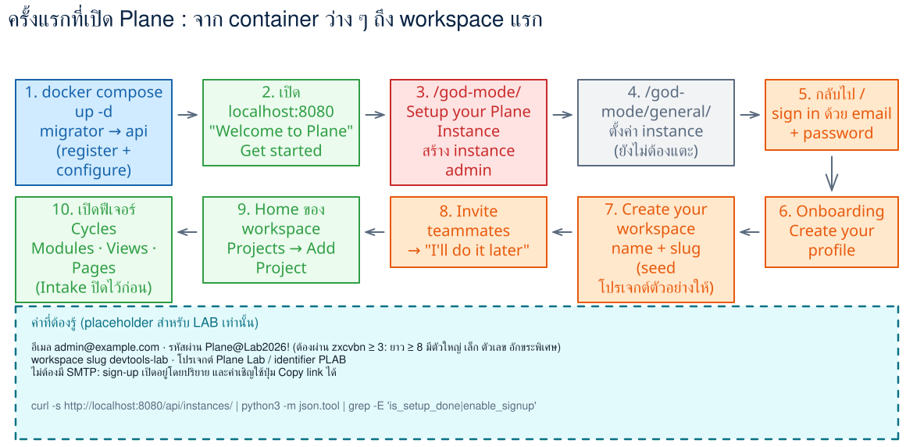

> **คำถามก่อนเริ่ม:** เมื่อ `docker compose ps` ขึ้น `Up` ครบทุก container แล้ว เปิดเว็บได้ทันทีหรือไม่? ถ้าไม่ — ตัวไหนที่ทำให้ต้องรอ และเราจะ "วัดความพร้อม" จากอะไร? ข้อ 4–5 จะตอบด้วยตารางสถานะและ log จริง

### Terminal Map

| หน้าต่าง | หน้าที่ | เปิดเมื่อใด |
|---|---|---|
| **T1** | คำสั่งหลักทั้งหมด (`install_plane.sh` · `pc up -d` · `curl` · `psql`) | ใช้ตั้งแต่เริ่ม LAB |
| **T2** | `bash plane_status.sh` ตารางสถานะที่รีเฟรชทุก 2 วินาที (ปล่อยค้างไว้ดูตอนบูต) | เปิดในข้อ 3 ก่อนสั่ง `pc up -d` |
| **เบราว์เซอร์** | `http://localhost:8080` — Welcome · god-mode · onboarding · โปรเจกต์ | ตั้งแต่ข้อ 6 |

---

## 0. เตรียมเครื่องเรียน

ทำบนเครื่องของเราเอง (ไม่ใช้ cloud) — เปิด container ที่ติดตั้ง Docker มาให้แล้ว **เพิ่ม `-p 8080:8080`** จากชุด RabbitMQ เพื่อให้เบราว์เซอร์เห็น Plane:

```bash
docker start devtools 2>/dev/null || \
  docker run -dit --name devtools --privileged -p 2222:22 -p 8080:8080 -p 9000:9000 -p 8090:8090 tuchsanai/devtools:2569_1
ssh root@localhost -p 2222        # password: passwd
```

> 📝 **คำอธิบาย:** `docker start ... || docker run ...` เปิดเครื่องเรียนเดิมถ้ามี และสร้างใหม่เฉพาะเมื่อยังไม่มี · `-dit` รันเบื้องหลังพร้อม terminal · `--privileged` ให้สิทธิ์รัน **Docker ซ้อนข้างในกล่อง** (Plane ทั้ง 13 container จะรันข้างในเครื่องเรียนอีกที) ·
> `-p 2222:22` = SSH · **`-p 8080:8080`** = ส่ง port 8080 ของเครื่องเราเข้า port 8080 ของกล่อง ซึ่ง Caddy proxy ของ Plane จะฟังอยู่ · `-p 9000:9000` / `-p 8090:8090` เผื่อไว้ให้เว็บแอปของเราใน LAB 8–9 — `docker run` ทำงานเฉพาะครั้งแรก ถ้าเครื่องเรียนถูกสร้างไว้ตั้งแต่ชุด RabbitMQ **โดยไม่มี `-p` เหล่านี้** จะเพิ่มทีหลังไม่ได้ ให้ใช้แท็บ **PORTS** ของ VS Code forward `8080` แทน (ข้อ 6) ·
> ถ้า `docker run` ฟ้อง port `2222` ใช้ไม่ได้ (Windows/WSL2 บางเครื่อง) ให้เปลี่ยนเป็น `-p 2280:22` แล้ว ssh ด้วย `-p 2280`

> ⚠️ `--privileged` ใช้เฉพาะ disposable classroom container นี้ ไม่ใช่ค่าที่ควรใช้กับ production workload

> ใน VS Code ใช้ **Remote-SSH** ต่อไปที่ `root@localhost:2222` แล้วทำแล็บทั้งหมดข้างใน

ตรวจว่าพร้อมใช้งาน — แล็บนี้ต้องมี **Compose v2** ด้วย:

```bash
docker --version
docker compose version
docker info --format 'Docker daemon: {{.ServerVersion}}'
```

> 📝 **คำอธิบาย:** บรรทัดแรกเช็ก Docker CLI · `docker compose version` เช็กว่า plugin Compose (คำสั่ง `docker compose` เว้นวรรค ไม่ใช่ `docker-compose` ขีด) ติดตั้งแล้ว · บรรทัดสุดท้ายถาม daemon โดยตรง ยืนยันว่า Docker-in-Docker ทำงาน · เครื่องเรียนต้องว่างอย่างน้อย **RAM 4 GB + disk 8 GB** สำหรับ Plane

✅ **Expected output** — ขอแค่มีเลขเวอร์ชันครบสามบรรทัด ไม่ใช่ error (เลขของแต่ละคนอาจไม่ตรงกับเอกสารนี้):

```
Docker version 29.6.2, build dfc4efb
Docker Compose version v5.3.1
Docker daemon: 29.6.2
```

---

## 1. Clone โค้ดแล็บ

```bash
mkdir -p ~/labwork && cd ~/labwork
git clone https://github.com/Tuchsanai/DevTools.git
cd DevTools/03_Application_Docker/05_Plane/001_LAB_Plane_Setup
ls
```

> 📝 **คำอธิบาย:** `git clone` ดึงรีโพของวิชาลงมาครั้งเดียว ใช้ได้ทั้ง 9 แล็บของชุด Plane (ถ้าเคย clone แล้ว git จะบอกว่าโฟลเดอร์ไม่ว่าง — ข้ามไป `cd` ได้เลย) · `ls` ต้องเห็น 4 สคริปต์ที่แล็บนี้ใช้: `install_plane.sh` ติดตั้ง · `plane_status.sh` ตารางสถานะ · `wait_ready.sh` รอจนพร้อม · `check_lab01.sh` ตรวจผล

✅ **Expected output** — จบด้วยรายชื่อไฟล์ 4 ไฟล์:

```
Cloning into 'DevTools'...
check_lab01.sh
install_plane.sh
plane_status.sh
wait_ready.sh
```

---

## 2. ติดตั้ง Plane ด้วย `install_plane.sh` — อ่าน `plane.env` ก่อน `up`

ดูสคริปต์ก่อนรัน (ไฟล์อยู่ในโฟลเดอร์แล็บแล้ว) — ใจความมี 3 ส่วน:

```bash
# 1) ดาวน์โหลด compose + env ของ release ที่ pin ไว้
BASE="https://github.com/makeplane/plane/releases/download/$TAG"      # TAG=v1.4.2
curl -sSL -o docker-compose.yml "$BASE/docker-compose.yml"
curl -sSL -o variables.env      "$BASE/variables.env" && mv variables.env plane.env
# 2) แก้ 6 ค่าให้ตรงกับ port ที่เบราว์เซอร์ใช้ + สุ่ม secret 2 ตัว
sed -i "s|^APP_DOMAIN=.*|APP_DOMAIN=localhost:8080|; s|^APP_RELEASE=.*|APP_RELEASE=v1.4.2|; \
        s|^LISTEN_HTTP_PORT=.*|LISTEN_HTTP_PORT=8080|; s|^LISTEN_HTTPS_PORT=.*|LISTEN_HTTPS_PORT=8443|; \
        s|^WEB_URL=.*|WEB_URL=http://localhost:8080|; s|^CORS_ALLOWED_ORIGINS=.*|CORS_ALLOWED_ORIGINS=http://localhost:8080|" plane.env
sed -i "s|^SECRET_KEY=.*|SECRET_KEY=$(openssl rand -hex 32)|; s|^LIVE_SERVER_SECRET_KEY=.*|LIVE_SERVER_SECRET_KEY=$(openssl rand -hex 32)|" plane.env
# 3) helper `pc` = docker compose ที่ชี้ไฟล์และชื่อโปรเจกต์ให้เสมอ
exec docker compose -f "$HOME/plane-selfhost/docker-compose.yml" --env-file "$HOME/plane-selfhost/plane.env" -p plane "$@"
```

> 📝 **คำอธิบาย:** **(1)** ดึงไฟล์ 2 ไฟล์จาก GitHub release `v1.4.2` (ไม่ใช้ `stable` เพราะเป็น tag ลอยที่เปลี่ยนได้ ทั้งห้องต้องได้ผลซ้ำกัน) เก็บไว้ที่ `~/plane-selfhost/` · **(2)** 6 ค่าที่แก้: `APP_DOMAIN`/`WEB_URL`/`CORS_ALLOWED_ORIGINS` **ต้องมี `:8080`** เพราะ api สร้าง redirect หลัง login จาก `WEB_URL` และ Django ใช้ `CORS_ALLOWED_ORIGINS` เป็น `CSRF_TRUSTED_ORIGINS` — origin ต้องตรงทั้ง host และ port · `LISTEN_HTTP_PORT=8080` คือ port ที่ proxy เปิดออกมานอก container (ข้างในยังฟัง `:80` ตาม `SITE_ADDRESS`) · `LISTEN_HTTPS_PORT=8443` เลี่ยง 443 ที่ต้องใช้ root · `APP_RELEASE` เลือก tag ของ image ทุกตัว ·
> `SECRET_KEY` และ `LIVE_SERVER_SECRET_KEY` ใน `variables.env` มาเป็น `change-this-key-on-deployment` — api จะ log ระดับ CRITICAL ถ้าปล่อยไว้ จึงสุ่ม 64 hex ด้วย `openssl rand` (ค่าของแต่ละคนไม่เหมือนกัน และ**ห้าม**คัดลอกลงเอกสาร) · **(3)** `pc` ช่วยให้พิมพ์ `pc ps` จากโฟลเดอร์ไหนก็ได้ โดย `-p plane` ตั้งชื่อ compose project → container ชื่อ `plane-<service>-1` และ volume ชื่อ `plane_<volume>` ทุกแล็บถัดไปใช้ `pc` ตัวนี้ ·
> สคริปต์ **idempotent**: รันซ้ำจะไม่ทับ `plane.env` เดิม (secret เดิมอยู่ครบ) — ถ้าอยากเริ่มใหม่จริง ๆ ให้ลบไฟล์เอง

รัน:

```bash
bash install_plane.sh
```

✅ **Expected output** — สร้าง `plane.env` แล้วพิมพ์ 6 บรรทัดสำคัญกลับมาให้ตรวจ (เลขบรรทัดคือตำแหน่งใน `plane.env`):

```
downloaded docker-compose.yml (v1.4.2)
created /root/plane-selfhost/plane.env (secrets generated)
installed /usr/local/bin/pc
== key lines in plane.env
1:APP_DOMAIN=localhost:8080
2:APP_RELEASE=v1.4.2
12:LISTEN_HTTP_PORT=8080
13:LISTEN_HTTPS_PORT=8443
15:WEB_URL=http://localhost:8080
17:CORS_ALLOWED_ORIGINS=http://localhost:8080
```

ถาม compose ว่าไฟล์นี้ประกาศอะไรบ้าง — ยังไม่สร้างอะไรทั้งนั้น:

```bash
pc config --services
pc config --services | wc -l
pc config --volumes | wc -l
```

> 📝 **คำอธิบาย:** `pc config` อ่านไฟล์ + env แล้ว "แปลผล" ให้ดู (ไม่แตะ daemon) · `--services` ลิสต์ชื่อ service ทั้ง **13** ตัว — สังเกต 4 ตัวที่ใช้ image `plane-backend` เดียวกันแต่ต่างคำสั่ง: `api` · `worker` · `beat-worker` · `migrator` · `--volumes` นับ volume ที่ประกาศได้ **10** (ข้อมูล DB · ไฟล์แนบ · คิว · log ของแต่ละ backend · config ของ proxy) — จำสองเลขนี้ไว้ `check_lab01.sh` จะตรวจ

✅ **Expected output** — 13 ชื่อ service (ลำดับอาจต่างกัน) · `13` · `10`:

```
plane-minio
plane-redis
plane-db
plane-mq
api
worker
web
admin
live
space
proxy
beat-worker
migrator
13
10
```

---

## 3. `pc up -d` แล้วเฝ้าดูตารางสถานะ — `Up` ≠ `Ready`

**เปิด T2** ก่อน (ssh อีก session หรือ terminal ใหม่ใน VS Code) แล้วเปิดตารางสถานะค้างไว้:

```bash
cd ~/labwork/DevTools/03_Application_Docker/05_Plane/001_LAB_Plane_Setup
bash plane_status.sh
```

> 📝 **คำอธิบาย:** สคริปต์วนทุก 2 วินาที: อ่าน `pc ps -a --format json` วาดช่องสี 13 ช่อง (เขียว = running · เหลือง = starting/unhealthy · **น้ำเงิน = job จบด้วย exit 0** · แดง = crash) · ยิง `curl /api/instances/` แล้วพิมพ์ HTTP code · แสดง log บรรทัดล่าสุดของ `api` · ตอนนี้ยังไม่มี container จึงเป็นเทาทั้งหมด — ปล่อยหน้าต่างนี้ค้างไว้ (Ctrl+C เมื่อดูพอแล้ว)

**กลับมา T1** สั่งสร้างทั้ง 13 container:

```bash
pc up -d
```

> 📝 **คำอธิบาย:** `up` = สร้าง network → volume → container ตามลำดับ `depends_on` แล้ว start · `-d` รันเบื้องหลัง คืน prompt ทันทีที่ *start* ครบ — **ไม่ได้รอให้แอปพร้อม** · ครั้งแรกในเครื่องที่ยังไม่มี image Docker จะ pull ก่อน (**10 image รวม ~4.7 GB** ใช้เวลาหลายนาทีตามความเร็วเน็ต — ระหว่างนั้น T2 ยังเทาอยู่ ปกติ) · ระหว่างรอให้**ชำเลืองดู T2**: ช่องเปลี่ยนเป็นเขียวเกือบพร้อมกัน แต่บรรทัด HTTP ยังเป็น **502** และ log ของ api ค้างที่ `Waiting for database migrations to complete...` (บรรทัดนี้จะเป็น `No migrations Pending` ก็ต่อเมื่อ `up` ซ้ำบน volume เดิม — ดูทดลอง ข.)

✅ **Expected output** — ปิดท้ายด้วย `plane-proxy-1 Started` (ตัดท่อนกลาง — รวม 74 บรรทัด Creating/Created/Starting/Started):

```
 Network plane_default  Creating
 Network plane_default  Created
 Volume plane_logs_beat-worker  Creating
        ... (volume 10 ตัว · container 13 ตัว Creating → Created) ...
 Container plane-plane-db-1  Started
 Container plane-migrator-1  Starting
 Container plane-api-1  Starting
 Container plane-api-1  Started
        ... (worker · beat-worker · web · live · admin · space) ...
 Container plane-proxy-1  Starting
 Container plane-proxy-1  Started
```

ภาพจาก T2 ระหว่างบูต — **ทุกช่องเขียว (13/13) แต่ `/api/instances/` ยังตอบ `502`**:

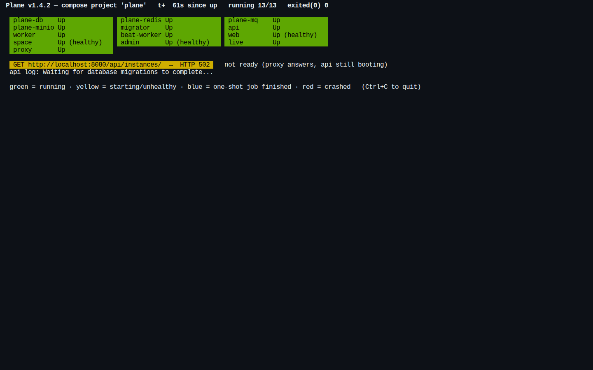

รอจนพร้อมจริงด้วยสคริปต์ readiness (ใน T1):

```bash
bash wait_ready.sh
```

> 📝 **คำอธิบาย:** สคริปต์รอ 2 ด่าน · **ด่าน 1** `migrator` ต้องจบด้วย `Exited (0)` (ถ้า exit ไม่เป็น 0 = migration พัง สคริปต์หยุดพร้อมบอกให้ดู `pc logs migrator`) · **ด่าน 2** `GET /api/instances/` ต้องตอบ `200` — endpoint นี้ไม่ต้อง login และวิ่งผ่าน proxy → api → PostgreSQL ครบสาย จึงเป็นตัววัด "พร้อม" ที่ดีกว่า `pc ps` · พิมพ์ความคืบหน้าทุก 10 วินาที แล้วสรุป `READY after NNs` — ครั้งแรกใช้เวลาราว **110 วินาที** (migration ~90 s + api boot ~20 s)

✅ **Expected output** — `migrator: Exited (0)` แล้วตามด้วย `502` อีกสองสามครั้ง ก่อนจบที่ `READY` (ตัวเลขวินาทีของแต่ละคนจะไม่ตรงกับเอกสารนี้):

```
migrator: running (migrations in progress) … 0s
migrator: running (migrations in progress) … 10s
        ... (ทุก 10 วินาที) ...
migrator: running (migrations in progress) … 90s
migrator: Exited (0) after 92s — migrations applied
api: http://localhost:8080/api/instances/ = 502 (api still booting) … 90s
api: http://localhost:8080/api/instances/ = 502 (api still booting) … 100s
READY after 107s  (http://localhost:8080/api/instances/ = 200)
```

T2 ตอนนี้ต้องเปลี่ยนเป็น **running 12/13 · migrator สีน้ำเงิน `Exited (0)` · HTTP 200 READY**:

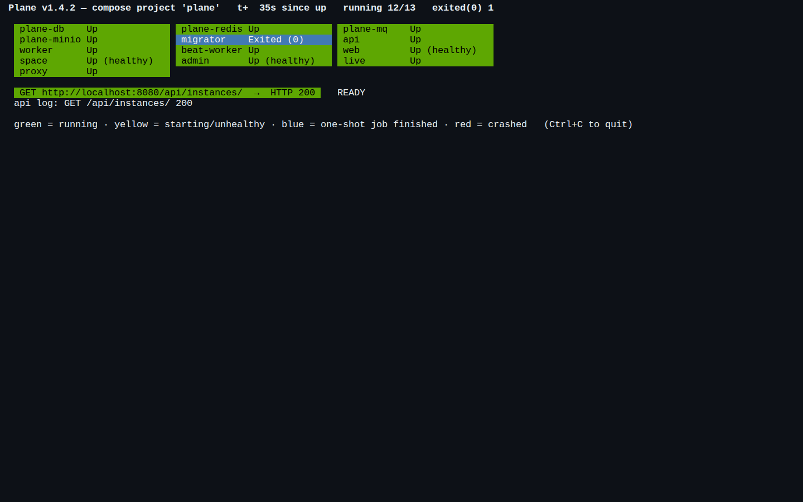

ยืนยันด้วยตารางของ compose เอง:

```bash
pc ps -a --format "table {{.Service}}\t{{.Image}}\t{{.Status}}"
```

> 📝 **คำอธิบาย:** `pc ps` ปกติแสดงเฉพาะที่กำลังรัน — ต้องใส่ **`-a`** จึงเห็น `migrator` ที่จบไปแล้ว · `--format "table ..."` เลือกคอลัมน์ให้อ่านง่าย · จุดที่ต้องดู: **12 บรรทัด `Up`** (3 ตัวมี `(healthy)` เพราะ image ประกาศ healthcheck ไว้ ตัวอื่นไม่มีจึงไม่ใช่ "ไม่ healthy") + **`migrator  Exited (0)`** = ภาพปกติของ Plane ที่พร้อมใช้งาน — ไม่ใช่ container ตาย

✅ **Expected output** — 12 Up + 1 Exited (0) รวม 13 บรรทัด (เวลาของแต่ละคนจะไม่ตรงกับเอกสารนี้):

```
SERVICE       IMAGE                               STATUS
admin         makeplane/plane-admin:v1.4.2        Up 2 minutes (healthy)
api           makeplane/plane-backend:v1.4.2      Up 2 minutes
beat-worker   makeplane/plane-backend:v1.4.2      Up 2 minutes
live          makeplane/plane-live:v1.4.2         Up 2 minutes
migrator      makeplane/plane-backend:v1.4.2      Exited (0) 39 seconds ago
plane-db      postgres:15.7-alpine                Up 2 minutes
plane-minio   minio/minio:latest                  Up 2 minutes
plane-mq      rabbitmq:3.13.6-management-alpine   Up 2 minutes
plane-redis   valkey/valkey:7.2.11-alpine         Up 2 minutes
proxy         makeplane/plane-proxy:v1.4.2        Up 2 minutes
space         makeplane/plane-space:v1.4.2        Up 2 minutes (healthy)
web           makeplane/plane-frontend:v1.4.2     Up 2 minutes (healthy)
worker        makeplane/plane-backend:v1.4.2      Up 2 minutes
```

> **บทเรียนสำคัญ:** ในระบบหลาย service คำว่า "พร้อม" เป็นเรื่องของ**ลำดับ** — db พร้อม → migrator จบ → api เริ่มฟัง → proxy ตอบ 200 · `Up` ทั้ง 13 ตัวเกิดใน 4 วินาที แต่ `Ready` ใช้เวลาเกือบ 2 นาที

---

## 4. อ่านลำดับการบูตจาก log ของ `api`

```bash
pc logs --no-log-prefix api | grep -E 'Waiting for|Instance registered|loaded with value|Bucket|Cache Cleared|Listening at' | uniq -c
```

> 📝 **คำอธิบาย:** `pc logs api` ดึง stdout ของ container `api` (`--no-log-prefix` ตัดชื่อ container หน้าบรรทัด) · `grep -E` เลือกเฉพาะบรรทัด "หมุดหมาย" ของ entrypoint · `uniq -c` ยุบบรรทัดซ้ำพร้อมนับจำนวน · ไล่อ่านจากบนลงล่างจะได้ลำดับเดียวกับสคริปต์ `docker-entrypoint-api.sh` ของ Plane: **`wait_for_db`** → **`wait_for_migrations`** (วนถามทุก 10 วินาที — นับได้ 9 ครั้ง ≈ 90 s ที่ migrator ทำงาน) → **`register_instance`** สร้างแถว instance → **`configure_instance`** seed ค่าตั้ง ~38 ตัวจาก environment ลงตาราง `instance_configurations` (จำบรรทัดนี้ไว้ ทดลอง ค. จะกลับมา) → **`create_bucket`** สร้าง bucket `uploads` ใน MinIO → **`clear_cache`** ล้าง Redis → **gunicorn `Listening at :8000`** = พร้อม

✅ **Expected output** — ลำดับต้องเป็นแบบนี้ (จำนวนครั้งของ `Waiting for database migrations` และเวลาของแต่ละคนจะไม่ตรงกับเอกสารนี้):

```
      1 Waiting for database...
      9 Waiting for database migrations to complete...
      1 Instance registered
      1 ENABLE_SIGNUP loaded with value from environment variable.
      1 ENABLE_EMAIL_PASSWORD loaded with value from environment variable.
      1 ENABLE_MAGIC_LINK_LOGIN loaded with value from environment variable.
        ... (ค่าตั้งอีก ~33 บรรทัด: OAuth · SMTP · LLM · UNSPLASH) ...
      1 UNSPLASH_ACCESS_KEY loaded with value from environment variable.
      1 Bucket 'uploads' does not exist. Creating bucket...
      1 Bucket 'uploads' created successfully.
      1 Cache Cleared
      1 [2026-08-31 09:51:14 +0000] [1] [INFO] Listening at: http://0.0.0.0:8000 (1)
```

ดูหางของ migrator ด้วย — งานที่ทำให้ทุกคนต้องรอ:

```bash
pc logs --no-log-prefix migrator | tail -3
```

✅ **Expected output** — migration ชุดสุดท้ายผ่าน (`OK`) แล้ว container จบตัวเอง:

```
  Applying license.0005_rename_product_instance_edition_and_more... OK
  Applying license.0006_instance_is_current_version_deprecated... OK
  Applying sessions.0001_initial... OK
```

---

## 5. ถามสถานะ instance ด้วย `curl` ก่อนเปิดเบราว์เซอร์

```bash
curl -s localhost:8080/api/instances/ | python3 -c '
import sys, json
d = json.load(sys.stdin)
print("is_setup_done     :", d["instance"]["is_setup_done"])
print("enable_signup     :", d["config"]["enable_signup"])
print("is_smtp_configured:", d["config"]["is_smtp_configured"])
print("instance_name     :", d["instance"]["instance_name"])'
```

> 📝 **คำอธิบาย:** endpoint เดียวกับที่ `wait_ready.sh` ใช้ แต่คราวนี้อ่านเนื้อ JSON · `python3 -c` ดึง 4 ค่า: **`is_setup_done False`** = ยังไม่มี instance admin (หน้าเว็บจะขึ้น Welcome แทน login) · **`enable_signup True`** = ใครก็สมัครเองได้โดยไม่ต้องถูกเชิญ (ค่า default ของ Community Edition — LAB 3 จะใช้) · **`is_smtp_configured False`** = ไม่มีอีเมล ดังนั้น magic-link/OTP ใช้ไม่ได้ ต้องใช้รหัสผ่าน · `instance_name` ยังเป็นค่าโรงงาน — ข้อ 6 จะเปลี่ยนเป็นชื่อบริษัทที่เรากรอก

✅ **Expected output** — `False · True · False` ตามคำถามก่อนเริ่ม:

```
is_setup_done     : False
enable_signup     : True
is_smtp_configured: False
instance_name     : Plane Community Edition
```

---

## 6. เปิดเบราว์เซอร์ → Welcome to Plane → ตั้ง instance admin ใน god-mode

ถ้าข้อ 0 มี `-p 8080:8080` เปิด `http://localhost:8080` ได้เลย · ถ้าไม่มี ให้ VS Code forward port (สร้าง SSH tunnel ให้อัตโนมัติ):

1. เปิดแท็บ **PORTS** (แถวเดียวกับ TERMINAL)
2. กด **Forward a Port** พิมพ์ `8080` แล้ว **Enter**
3. เปิด `http://localhost:8080` ในเบราว์เซอร์

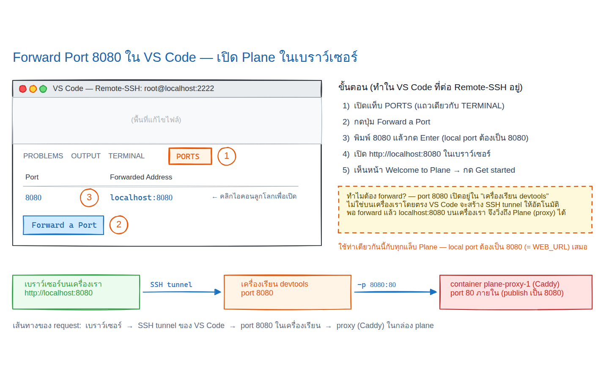

> ⚠️ ต้อง forward เป็น **`8080` เท่านั้น** (local port = remote port) — ถ้า VS Code เสนอเลขอื่นเพราะ 8080 ไม่ว่าง ให้แก้ให้เป็น 8080 · เหตุผลอยู่ในทดลอง ง.: Plane เด้งกลับมาที่ `WEB_URL` = `localhost:8080` เสมอ

หน้าแรกเป็น **Welcome to Plane** เพราะ `is_setup_done` ยังเป็น `False`:

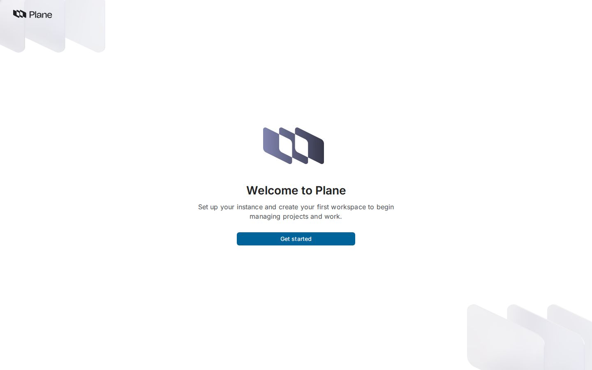

กด **Get started** → ไปที่ `http://localhost:8080/god-mode/` หน้า **Setup your Plane Instance** — ลองกรอกด้วย**รหัสผ่านที่ "ผ่านกฎบนหน้าจอ" แต่เดาง่าย**ก่อน:

| ช่อง | ค่าที่กรอก |
|---|---|
| **First name** | `Lab` |
| **Last name** | `Admin` |
| **Email** | `admin@example.com` |
| **Company name** | `DevTools Lab` |
| **Set a password** / **Confirm password** | `Password123!` (ครั้งแรก — ตั้งใจให้พัง) |
| ☑ Allow Plane to anonymously collect usage events | ปล่อยตาม default ได้ |

กด **Continue**:

> 📝 **คำอธิบาย:** `Password123!` ผ่านกฎ 5 ข้อบนหน้าจอครบ (8 ตัว · ตัวใหญ่ · ตัวเล็ก · เลข · อักขระพิเศษ) ปุ่ม Continue จึงกดได้ แต่ **ฝั่ง server** ตรวจซ้ำด้วยไลบรารี **zxcvbn** (ให้คะแนนความเดายาก 0–4 ต้องได้ ≥ 3) — รหัสนี้ได้ 1 จึงถูกปฏิเสธ: หน้าเด้งกลับมาที่ฟอร์มเดิม ช่องรหัสผ่านและ Company name ว่าง และ **ดูที่ address bar** จะเห็นเหตุผลอยู่ใน query string · บทเรียน: กฎที่ client เป็นแค่ UX ตัวตัดสินอยู่ที่ server เสมอ

✅ **Expected output** — URL ในเบราว์เซอร์กลายเป็น (ตัดให้สั้น):

```
http://localhost:8080/god-mode/?error_code=5021&error_message=PASSWORD_TOO_WEAK&email=admin%40example.com&first_name=Lab&last_name=Admin&company_name=DevTools+Lab
```

กรอกใหม่ด้วยรหัสของแล็บ **`Plane-Lab-2569`** (zxcvbn = 4) ทั้งสองช่อง — ก่อนกด Continue ฟอร์มต้องหน้าตาแบบนี้:

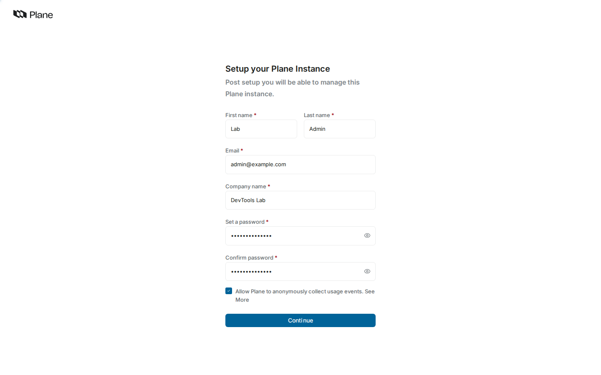

กด **Continue** → เบราว์เซอร์ถูกส่งไป **`http://localhost:8080/god-mode/general/`** พร้อมป๊อปอัป *Create workspace — Instance setup done!*:

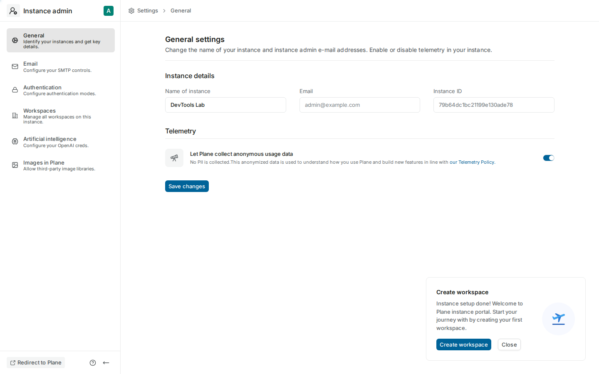

> 📝 **คำอธิบาย:** redirect นี้คือ**หลักฐานว่า `WEB_URL` ถูกต้อง** — api ตอบ 302 ไป `WEB_URL + /god-mode/general/` ถ้า `WEB_URL` ไม่มี `:8080` เราจะไปโผล่ที่ `localhost:80` แล้วเจอหน้าเปล่า · หน้า **General**: *Name of instance* ถูกเติมจาก Company name · *Email* ของ admin แก้ไม่ได้ · *Instance ID* คือรหัสสุ่มประจำเครื่อง · *Telemetry* ปิดได้ที่นี่ · แถบซ้ายคือทุกอย่างที่ instance admin คุมได้: **General · Email · Authentication · Workspaces · Artificial intelligence · Images in Plane** · กด **Close** ที่ป๊อปอัปได้ (เราจะสร้าง workspace ผ่าน onboarding ในข้อ 7 แทน)

เดินดูอีก 2 หน้า — คลิก **Email** ที่แถบซ้าย:

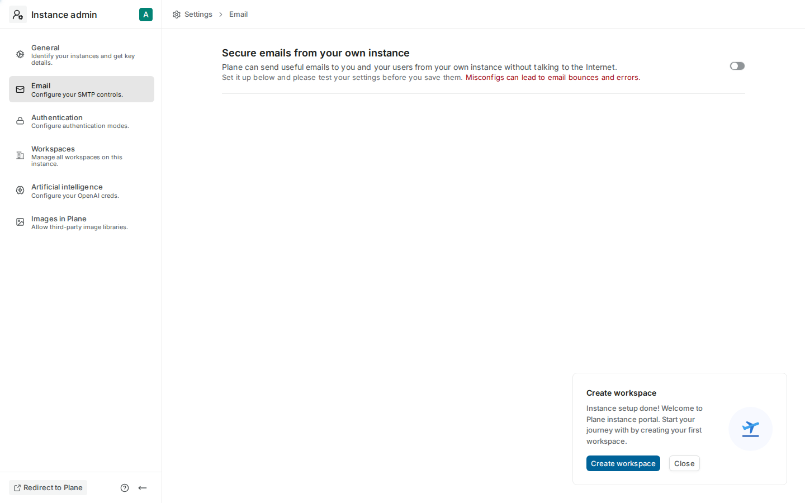

> 📝 **คำอธิบาย:** สวิตช์หัวหน้ายังปิด = ไม่มี SMTP ตรงกับ `is_smtp_configured False` ในข้อ 5 · ผลคือ Plane **ส่งอีเมลไม่ได้เลย** (เชิญเพื่อน · ลืมรหัสผ่าน · OTP) — แล็บนี้ไม่ตั้ง SMTP; LAB 3 จะเชิญสมาชิกด้วยวิธีที่ไม่ต้องใช้อีเมล

คลิก **Authentication**:

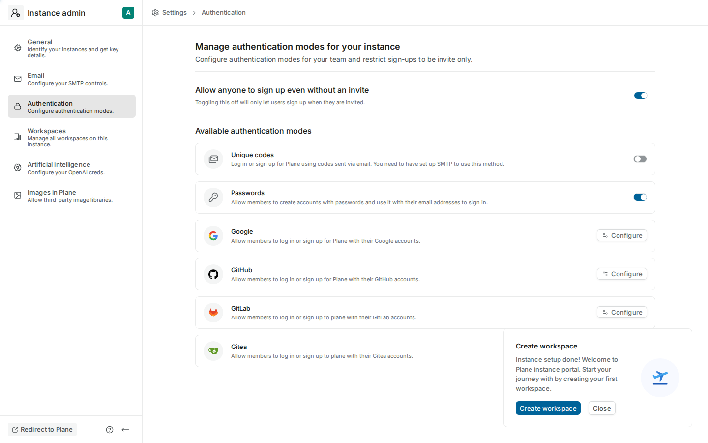

> 📝 **คำอธิบาย:** **Allow anyone to sign up even without an invite** เปิดอยู่ (= `enable_signup True`) · **Passwords** เปิด = login ด้วยรหัสผ่านได้ · **Unique codes** ปิด และบอกชัดว่า *You need to have set up SMTP* · Google/GitHub/GitLab/Gitea ต้อง Configure เอง · สวิตช์เหล่านี้เขียนลงตาราง `instance_configurations` ทันที — ทดลอง ค. จะพิสูจน์ว่านี่คือ "แหล่งความจริง" ไม่ใช่ `plane.env`

กลับไป T1 ถามซ้ำ:

```bash
curl -s localhost:8080/api/instances/ | python3 -c '
import sys, json
d = json.load(sys.stdin)
print("is_setup_done:", d["instance"]["is_setup_done"], "| instance_name:", d["instance"]["instance_name"])'
```

✅ **Expected output** — flag พลิกเป็น `True` และชื่อ instance เปลี่ยนตาม Company name:

```
is_setup_done: True | instance_name: DevTools Lab
```

---

## 7. Sign in → onboarding: profile · workspace

กลับไปที่ `http://localhost:8080/` — ตอนนี้ไม่ใช่ Welcome แล้ว แต่เป็นหน้า **sign-in**: กรอก **Email** `admin@example.com` → **Continue** → **Password** `Plane-Lab-2569` → **Go to workspace**:

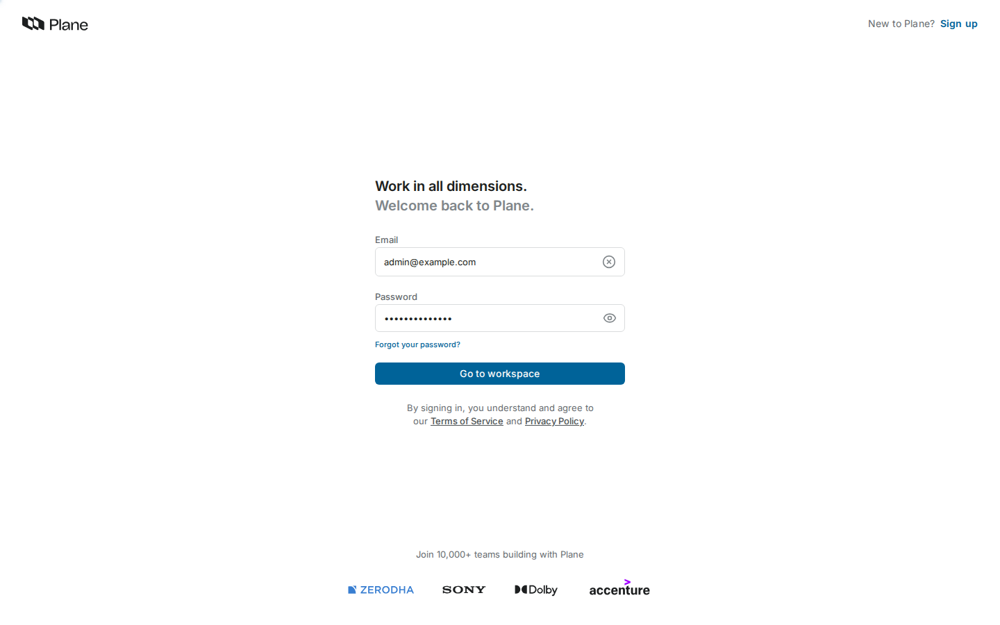

> 📝 **คำอธิบาย:** บัญชี instance admin ที่สร้างใน god-mode คือ user ธรรมดาของแอปด้วย (session คนละชุด: god-mode ใช้คุกกี้ `admin-session-id` อายุ 1 ชั่วโมง ส่วนแอปใช้ `session-id` 7 วัน) · ฟอร์มถาม email ก่อนเพราะต้องไปเช็คว่าบัญชีนี้ login ด้วยรหัสผ่านหรือ OAuth · หลัง login ผู้ใช้ที่ยังไม่ผ่าน onboarding จะถูกส่งไป `/onboarding/`

**ขั้น 1 — Create your profile.** ช่อง **Name** ถูกเติมด้วย `Lab` ไว้แล้ว — **ปล่อยไว้แบบนั้น** แล้วกด **Continue**:

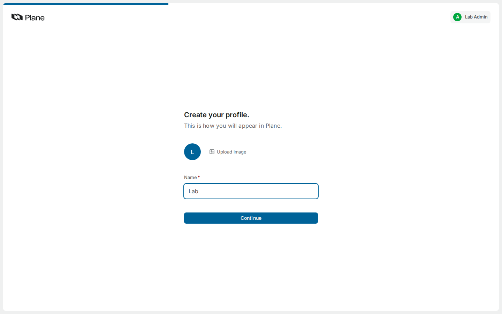

> ⚠️ **กับดักนามสกุล:** ช่อง *Name* นี้เป็น **first name** เท่านั้น — ระบบจะเอา last name (`Admin`) จาก god-mode มาต่อท้ายเอง · ถ้าพิมพ์ `Lab Admin` ลงไป ชื่อที่โชว์ทั่วทั้งแอปจะกลายเป็น **"Lab Admin Admin"** (แก้ทีหลังได้ที่ Settings › Profile)

**ขั้น 2 — Create your workspace.** กรอก **Name your workspace** `DevTools Lab` → ช่อง URL จะเติม slug **`devtools-lab`** ให้อัตโนมัติ (แก้ได้เฉพาะส่วนท้าย) → เลือก **2-10** → **Create workspace**:

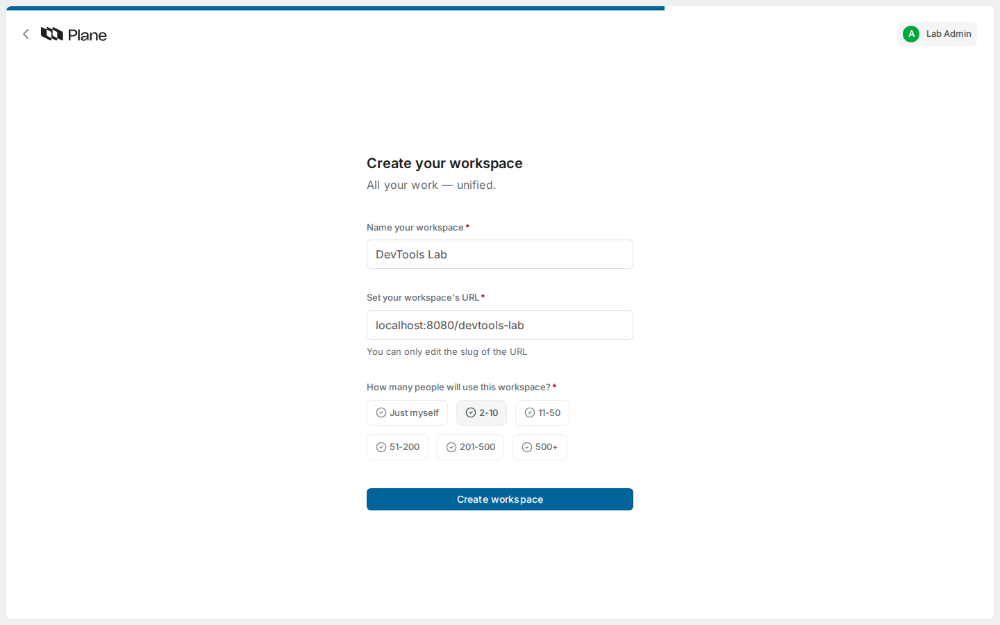

> 📝 **คำอธิบาย:** **workspace** คือหน่วยบนสุดของข้อมูล (บริษัท/ทีม) — ทุก project · member · API token ผูกกับ workspace · **slug** `devtools-lab` จะกลายเป็นส่วนหนึ่งของทุก URL (`/devtools-lab/projects/...`) และของ API (`/api/v1/workspaces/devtools-lab/...`) ตั้งแล้วเปลี่ยนยาก จึงต้องใช้ค่านี้เป๊ะ ๆ ตลอด 9 แล็บ · จำนวนคน (`2-10`) เป็นแค่ metadata (`organization_size`) ไม่จำกัดจำนวนสมาชิกจริง

**ขั้น 3 — Invite your teammates.** ไม่มี SMTP อีเมลเชิญส่งไม่ออกอยู่แล้ว — กด **I'll do it later**:

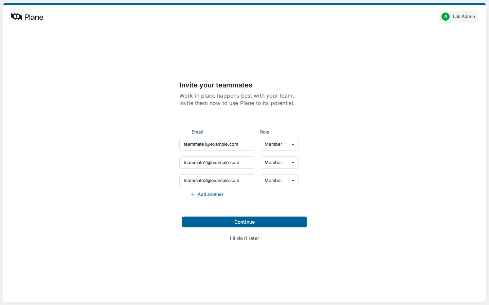

ถึง **Home** ของ workspace (`http://localhost:8080/devtools-lab/`) — ถ้ามีป๊อปอัป *Welcome to Plane* ให้กด **No thanks, I will explore it myself**:

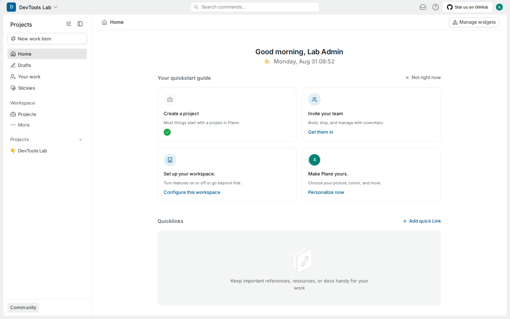

> 📝 **คำอธิบาย:** แถบซ้ายกลุ่ม **Projects** มีโปรเจกต์ชื่อ **DevTools Lab** (identifier `DEVTO`) โผล่มาแล้วทั้งที่เรายังไม่ได้สร้าง — นี่คือ **โปรเจกต์ตัวอย่าง** ที่ task `workspace_seed` สร้างให้ทันทีหลังสร้าง workspace โดยรันบน **`worker`** (ผ่านคิว RabbitMQ) · ถ้า `worker` หยุดอยู่ โปรเจกต์นี้จะไม่โผล่ — LAB 2 ใช้พฤติกรรมนี้เป็นตัวพิสูจน์ว่างานเบื้องหลังวิ่งผ่านคิวจริง · แล็บชุดนี้**ไม่แตะ `DEVTO`** เราจะสร้างโปรเจกต์ของเราเองในข้อ 8

---

## 8. สร้างโปรเจกต์ Plane Lab (`PLAB`) และเปิด Cycles · Modules · Views

แถบซ้าย **Projects** (กลุ่ม Workspace) → หน้า `/devtools-lab/projects/` เห็นการ์ด `DEVTO` ใบเดียว:

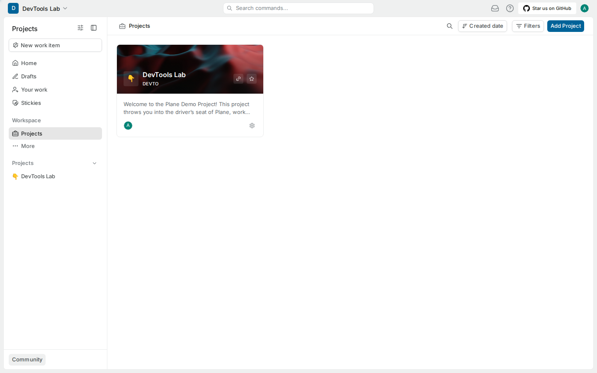

กด **Add Project** (มุมขวาบน) แล้วกรอก:

| ช่อง | ค่าที่กรอก |
|---|---|
| **Project name** | `Plane Lab` |
| **Project ID** | `PLAB` (ระบบเดาให้เป็น `PlaneLab` — **แก้เป็น `PLAB`**) |
| **Description** | `CampusEats — แอปสั่งอาหารในมหาวิทยาลัย (ทีมเรียน DevTools)` |
| Network / Lead | ปล่อย **Public** / ว่าง |

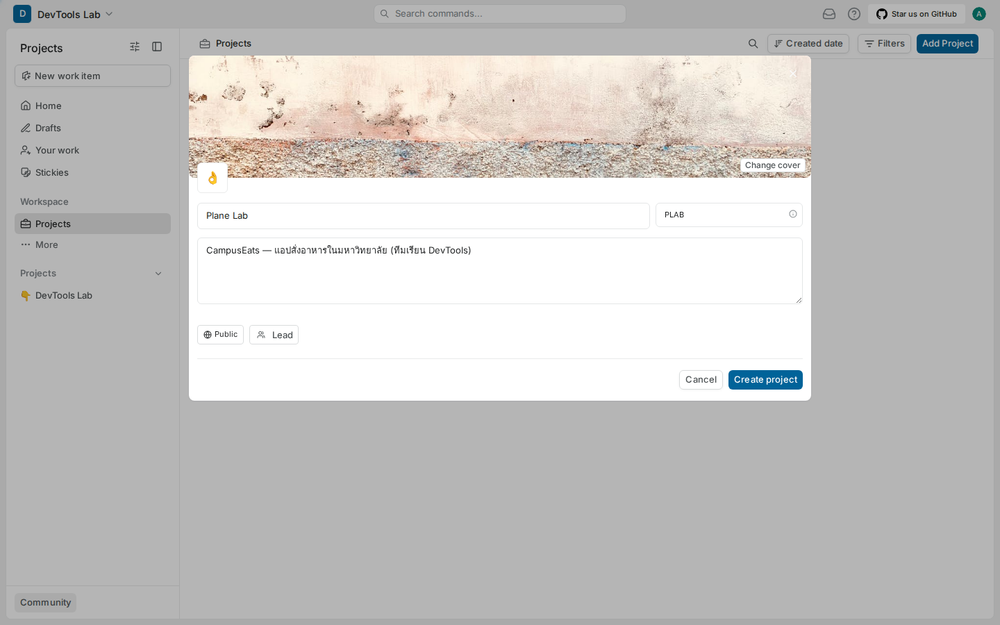

> 📝 **คำอธิบาย:** **Project ID** (identifier) คือคำนำหน้าเลข work item ทุกใบ — `PLAB-1`, `PLAB-2`, … ใช้อ้างอิงในคอมมิต · แชท · API ตลอดชุดแล็บ ต้องเป็น `PLAB` เป๊ะ · เรื่องราวของทีมเราคือแอป **CampusEats** (สั่งอาหารในมหาวิทยาลัย) ทุก work item หลังจากนี้เล่าเรื่องนี้ · **Public** = สมาชิก workspace ทุกคนเห็นและ join ได้ (คนละอย่างกับ "public บนอินเทอร์เน็ต" ซึ่งเป็นเรื่องของ Pages/Views ใน LAB 6)

กด **Create project** → ขึ้น modal **Projects and work items** (*Toggle these on or off this project*) — **เปิดสวิตช์ Cycles · Modules · Views** (Pages เปิดอยู่แล้ว · **Intake ปล่อยปิด** จนถึง LAB 5):

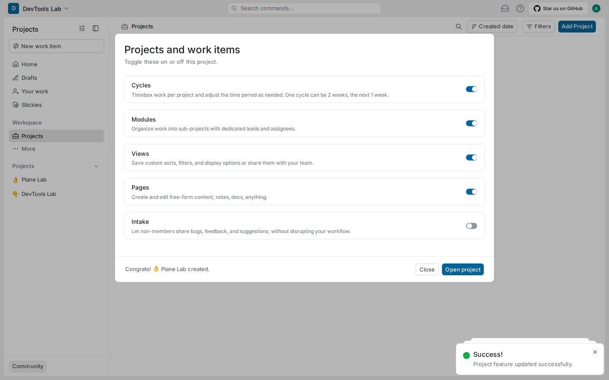

> 📝 **คำอธิบาย:** โปรเจกต์ใหม่ใน v1.4.2 **ปิด** Cycles/Modules/Views/Intake มาเป็นค่าเริ่มต้น — ถ้ากด Open project ไปเลย แถบซ้ายจะไม่มีเมนู Cycles/Modules (LAB 4 ใช้ Cycles = Sprint · LAB 6 ใช้ Modules = Epic) · แต่ละสวิตช์คือ 1 คอลัมน์ boolean ในตาราง `projects` (`cycle_view` · `module_view` · `issue_views_view` · `page_view` · `intake_view`) ที่ข้อ 10 จะ SELECT ดู · เปิดทีหลังได้ที่ Project settings › **Features**

กด **Open project** → หน้า **Work items** ของ Plane Lab (ว่างเปล่า: *Start with your first work item.*) และแถบซ้ายใต้ **Plane Lab** ต้องมี **Work items · Cycles · Modules · Views · Pages** ครบ

---

## 9. สร้าง work item 3 ใบ (เรื่อง CampusEats)

กด **Add work item** (มุมขวาบน) → modal **Create new work item** → พิมพ์ **Title** · คลิกชิป **Backlog** เพื่อเลือก *State* · คลิกชิป **None** เพื่อเลือก *Priority* → **Save** ทำ 3 รอบ:

| # | Title | State | Priority |
|---|---|---|---|
| PLAB-1 | `ตั้งค่า Plane self-host ในเครื่องเรียน` | **In Progress** | **Urgent** |
| PLAB-2 | `เขียน README ของ LAB ให้ผู้เรียน` | **Todo** | **High** |
| PLAB-3 | `ตรวจว่า 13 container ทำงานครบ` | **Todo** | **Medium** |

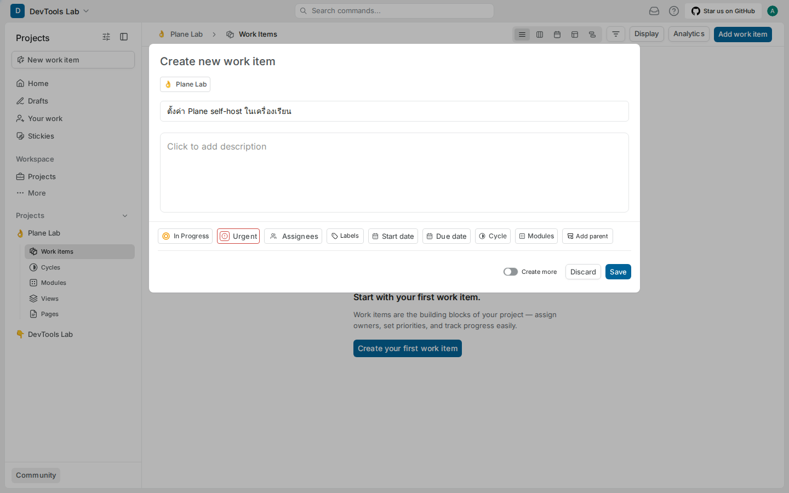

> 📝 **คำอธิบาย:** **work item** (Plane เรียกในหน้าเว็บ แต่ API และตารางยังใช้คำว่า *issue*) คือหน่วยงานพื้นฐาน มี *state* (Backlog · Todo · In Progress · Done · Cancelled — 5 state default ของทุกโปรเจกต์) และ *priority* (Urgent · High · Medium · Low · None) · เลขลำดับ `PLAB-N` ระบบออกให้เองแบบ**ไม่ใช้เลขซ้ำ** แม้ลบใบกลางออก (LAB 2 พิสูจน์จากตาราง `issue_sequences`) · สวิตช์ **Create more** ช่วยให้ modal ไม่ปิดเมื่อสร้างหลายใบติดกัน

หลัง Save ครบ 3 ใบ หน้า **Work Items** (layout List) ต้องโชว์ `PLAB-3` · `PLAB-2` · `PLAB-1` พร้อม state และไอคอน priority:

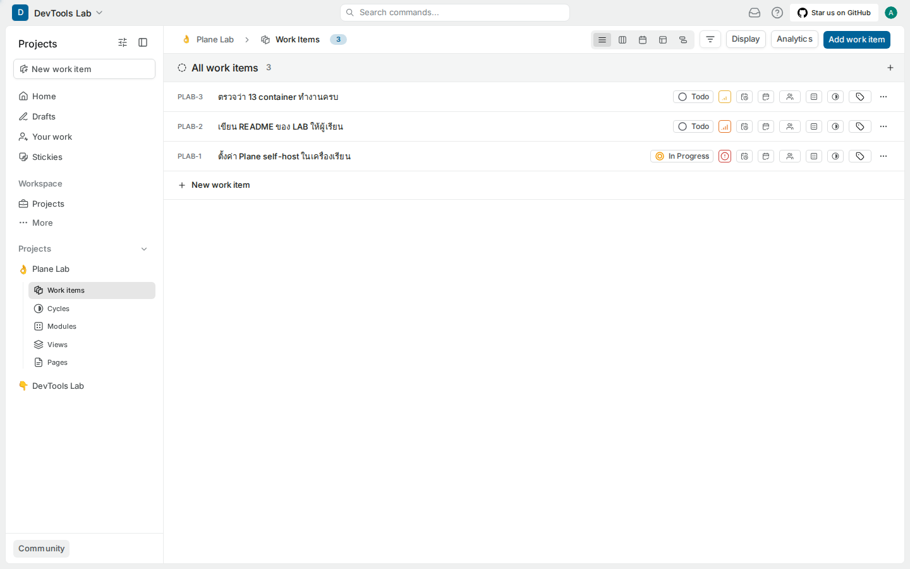

> 📝 **คำอธิบาย:** เรียงใหม่สุดขึ้นก่อน · ปุ่มไอคอน 5 ปุ่มบนหัวตาราง (List · Board · Calendar · Table · Timeline) สลับมุมมองโดย URL ไม่เปลี่ยน — LAB 5 จะใช้ **Board** (Kanban) · เลข **3** ข้าง Work Items คือจำนวนทั้งหมด

---

## 10. พิสูจน์ด้วย SQL แล้วปิดด้วย `check_lab01.sh`

ทุกคลิกในข้อ 6–9 กลายเป็นแถวในฐานข้อมูล — เข้าไปดูตรง ๆ ผ่าน `psql` ใน container `plane-db`:

```bash
pc exec -T -e PGPASSWORD=plane plane-db psql -U plane -d plane -c \
  "select name, identifier, cycle_view, module_view, issue_views_view, page_view, intake_view from projects order by created_at;"
```

> 📝 **คำอธิบาย:** `pc exec -T plane-db <คำสั่ง>` รันคำสั่งข้างใน container ของ PostgreSQL (`-T` ไม่จอง tty เพื่อให้ pipe ได้) · **`-e PGPASSWORD=plane`** จำเป็นเพราะ image ตั้ง `PGHOST=plane-db` ไว้ psql จึงต่อผ่าน TCP ที่ต้องมีรหัส (ค่า `plane/plane` เป็นค่า default ของ upstream สำหรับ LAB เท่านั้น) · `-U plane -d plane` = user และชื่อฐานข้อมูล · `-c "..."` ส่ง SQL หนึ่งคำสั่ง · ตาราง **`projects`** มีทั้ง `DEVTO` (seed) และ `PLAB` ของเรา — 3 คอลัมน์ `cycle_view/module_view/issue_views_view` เป็น `t` เพราะสวิตช์ในข้อ 8 · `intake_view` ยังเป็น `f`

✅ **Expected output** — 2 แถว, `PLAB` มี `t t t t f`:

```
     name     | identifier | cycle_view | module_view | issue_views_view | page_view | intake_view
--------------+------------+------------+-------------+------------------+-----------+-------------
 DevTools Lab | DEVTO      | t          | t           | t                | t         | f
 Plane Lab    | PLAB       | t          | t           | t                | t         | f
(2 rows)
```

ดู work item ทั้ง 3 พร้อม state (ต้อง join เพราะ `issues` เก็บแค่ `state_id`):

```bash
pc exec -T -e PGPASSWORD=plane plane-db psql -U plane -d plane -c \
  "select p.identifier||'-'||i.sequence_id as key, i.name, s.name as state, i.priority
     from issues i join projects p on p.id=i.project_id join states s on s.id=i.state_id
    where p.identifier='PLAB' order by i.sequence_id;"
```

> 📝 **คำอธิบาย:** `PLAB-N` ที่เห็นในหน้าเว็บไม่ได้ถูกเก็บเป็นข้อความ — ประกอบจาก `projects.identifier` + `issues.sequence_id` ตอน query · `state`/`priority` ตรงกับที่เลือกในข้อ 9 (priority เก็บเป็นตัวพิมพ์เล็ก) · นี่คือชั้นข้อมูลที่ LAB 7–9 จะอ่านผ่าน REST API และ SQL เพื่อทำ metric

✅ **Expected output** — 3 แถว ตรงตามตารางในข้อ 9:

```
  key   |               name               |    state    | priority
--------+----------------------------------+-------------+----------
 PLAB-1 | ตั้งค่า Plane self-host ในเครื่องเรียน | In Progress | urgent
 PLAB-2 | เขียน README ของ LAB ให้ผู้เรียน      | Todo        | high
 PLAB-3 | ตรวจว่า 13 container ทำงานครบ     | Todo        | medium
(3 rows)
```

ปิดแล็บด้วย evidence gate:

```bash
bash check_lab01.sh
```

> 📝 **คำอธิบาย:** สคริปต์ตรวจ 7 ข้อจากคนละแหล่ง: compose (`pc config` = 13 service) · runtime (`pc ps` = 12 running + migrator exited 0) · HTTP (`is_setup_done True`) · SQL (workspace `devtools-lab` · โปรเจกต์ `PLAB` เปิด 3 feature · work item ≥ 3) แล้วพิมพ์ **`PASS:` บรรทัดเดียว** — ถ้าข้อไหน `FAIL` จะบอกว่าคาดหวังอะไร ให้ย้อนกลับไปทำข้อนั้น

✅ **Expected output** — `ok` 7 บรรทัดแล้ว `PASS`:

```
  ok   compose declares 13 services
  ok   12 containers running
  ok   migrator Exited (0)
  ok   instance is_setup_done = True
  ok   workspace slug devtools-lab
  ok   project PLAB with Cycles/Modules/Views ON
  ok   3 work items in PLAB
PASS: LAB 1 — 13 services · 12 Up · migrator Exited (0) · setup done · workspace devtools-lab · project PLAB (cycles/modules/views on) · 3 work items
```

---

## ทดลองเพิ่มเติม

### ก. `Up` ≠ `Ready` — restart `api` แล้วจับเวลาช่วง 502

```bash
pc restart api
for i in $(seq 1 30); do
  code=$(curl -s -o /dev/null -w '%{http_code}' --max-time 2 localhost:8080/api/instances/)
  echo "$(date +%T)  api=$(pc ps --format '{{.Service}} {{.Status}}' | grep '^api' | cut -d' ' -f2-)  /api/instances/=$code"
  [ "$code" = 200 ] && break; sleep 3
done
```

> 📝 **คำอธิบาย:** `pc restart api` หยุดแล้วเริ่ม container เดิม (ไม่สร้างใหม่) · loop พิมพ์ทุก 3 วินาที: สถานะจาก `pc ps` คู่กับ HTTP code · จุดที่ต้องดู: `api=Up ...` ตั้งแต่วินาทีแรก แต่ `502` อยู่ราว 15 วินาที เพราะ entrypoint ต้องผ่าน `wait_for_db` → `wait_for_migrations` (ไม่มี migration ค้าง จึงเร็ว) → register/configure/bucket/cache → gunicorn ใหม่ทุกครั้ง

✅ **Expected output** — `Up` ทันที แต่ `200` มาทีหลังราว 15 วินาที (เวลาของแต่ละคนจะไม่ตรงกับเอกสารนี้):

```
16:54:59  api=Up Less than a second  /api/instances/=502
16:55:02  api=Up 3 seconds  /api/instances/=502
16:55:05  api=Up 6 seconds  /api/instances/=502
16:55:08  api=Up 9 seconds  /api/instances/=502
16:55:11  api=Up 12 seconds  /api/instances/=502
16:55:14  api=Up 15 seconds  /api/instances/=200
```

### ข. ข้อมูลอยู่ใน volume — `pc down` แล้ว `up` ใหม่ ทุกอย่างยังอยู่

```bash
pc down
docker volume ls | grep -c plane_
pc up -d && bash wait_ready.sh
bash check_lab01.sh | tail -1
```

> 📝 **คำอธิบาย:** `pc down` (ไม่มี `-v`) ลบ container ทั้ง 13 + network แต่ **volume 10 ตัวยังอยู่** (`grep -c` นับได้ 10) · `pc up -d` สร้าง container ใหม่ต่อ volume เดิม · คราวนี้ `wait_ready.sh` เร็วกว่ามาก (migrator เจอว่า *No migrations Pending* จบใน ~7 s · READY ~25 s) · แล้ว**รีเฟรชเบราว์เซอร์** — ยัง login อยู่ (session อยู่ใน DB) โปรเจกต์ Plane Lab และ PLAB-1…3 ครบ · `check_lab01.sh` ยัง PASS

✅ **Expected output** — volume 10 · READY เร็ว · PASS เหมือนเดิม:

```
 Container plane-plane-mq-1  Removed
 Network plane_default  Removed
10
 Container plane-proxy-1  Started
migrator: running (migrations in progress) … 0s
migrator: Exited (0) after 7s — migrations applied
api: http://localhost:8080/api/instances/ = 502 (api still booting) … 0s
api: http://localhost:8080/api/instances/ = 502 (api still booting) … 10s
api: http://localhost:8080/api/instances/ = 502 (api still booting) … 20s
READY after 26s  (http://localhost:8080/api/instances/ = 200)
PASS: LAB 1 — 13 services · 12 Up · migrator Exited (0) · setup done · workspace devtools-lab · project PLAB (cycles/modules/views on) · 3 work items
```

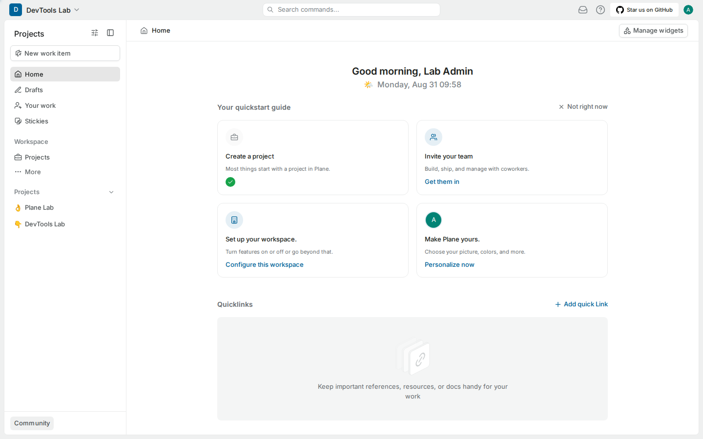

### ค. ค่าตั้งชั้น instance ไม่ได้อยู่ใน `plane.env` — ปิด sign-up ให้ถูกที่

ลองปิด sign-up ด้วยวิธีที่ "น่าจะใช่" ก่อน — เพิ่มตัวแปรใน env แล้วสั่ง compose ปรับ `api`:

```bash
echo "ENABLE_SIGNUP=0" >> ~/plane-selfhost/plane.env
pc up -d api
pc exec -T api env | grep ^ENABLE_SIGNUP || echo "(api container has no ENABLE_SIGNUP)"
curl -s localhost:8080/api/instances/ | python3 -c 'import sys,json; print("enable_signup:", json.load(sys.stdin)["config"]["enable_signup"])'
```

> 📝 **คำอธิบาย:** `pc up -d api` ตอบ `Running` เฉย ๆ — compose **ไม่ recreate** เพราะ `docker-compose.yml` ไม่ได้ส่งตัวแปร `ENABLE_SIGNUP` เข้า container เลย (ดู anchor `x-app-env` ในไฟล์) config ของ container จึงไม่เปลี่ยน · `pc exec api env` ยืนยันว่าข้างในไม่มีตัวแปรนี้ · ผล: `enable_signup` ยัง `True`

✅ **Expected output**:

```
 Container plane-api-1  Running
(api container has no ENABLE_SIGNUP)
enable_signup: True
```

ดันต่อให้สุด — บังคับสร้าง container ใหม่:

```bash
pc up -d --force-recreate api && bash wait_ready.sh | tail -1
pc logs --no-log-prefix api | grep ^ENABLE_SIGNUP
curl -s localhost:8080/api/instances/ | python3 -c 'import sys,json; print("enable_signup:", json.load(sys.stdin)["config"]["enable_signup"])'
sed -i '/^ENABLE_SIGNUP=0$/d' ~/plane-selfhost/plane.env      # เอาบรรทัดทดลองออก
```

> 📝 **คำอธิบาย:** แม้ recreate แล้ว log ของ api บอกว่า **`ENABLE_SIGNUP configuration already exists`** — เทียบกับตอนบูตครั้งแรก (ข้อ 4) ที่เป็น `loaded with value from environment variable`: `configure_instance` **seed ค่าลง DB เฉพาะครั้งที่ยังไม่มีแถว** และเนื่องจาก `SKIP_ENV_VAR=1` เป็นค่า default api จะอ่านค่าจากตาราง `instance_configurations` ตลอด · สรุป: ตัวแปรชั้นนี้ใน env **ไม่มีผลหลังบูตครั้งแรก** ไม่ว่าจะ recreate กี่ครั้ง

✅ **Expected output**:

```
READY after 17s  (http://localhost:8080/api/instances/ = 200)
ENABLE_SIGNUP configuration already exists
enable_signup: True
```

ที่ถูกคือ **god-mode › Authentication**: เปิด `http://localhost:8080/god-mode/authentication/` แล้วปิดสวิตช์ **Allow anyone to sign up even without an invite** → toast *Configuration saved successfully*:

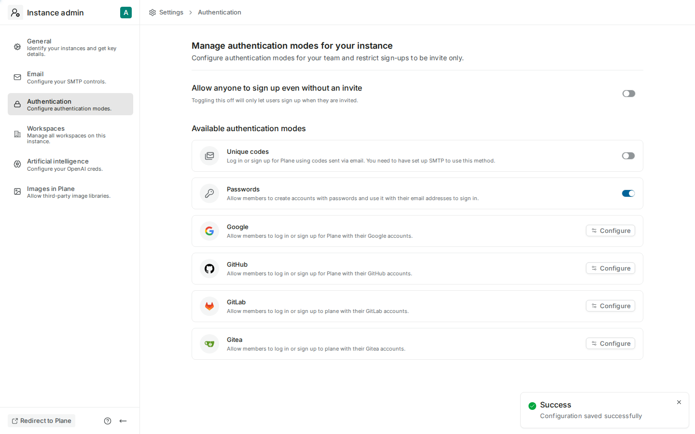

```bash
curl -s localhost:8080/api/instances/ | python3 -c 'import sys,json; print("enable_signup:", json.load(sys.stdin)["config"]["enable_signup"])'
pc exec -T -e PGPASSWORD=plane plane-db psql -U plane -d plane -c "select key, value from instance_configurations where key='ENABLE_SIGNUP';"
```

✅ **Expected output** — เปลี่ยนทันทีทั้งที่ API และในตาราง (ไม่ต้อง restart อะไร):

```
enable_signup: False
      key      | value
---------------+-------
 ENABLE_SIGNUP | 0
(1 row)
```

**เปิดสวิตช์กลับเป็น ON** ก่อนไปต่อ (LAB 3 ต้องใช้ sign-up) แล้ว `curl` ซ้ำต้องได้ `enable_signup: True`

### ง. `WEB_URL` ไม่มี port → login เด้งไป port 80 (ทำถ้ามีเวลา)

```bash
sed -i 's|^WEB_URL=.*|WEB_URL=http://localhost|' ~/plane-selfhost/plane.env
pc up -d api worker proxy && bash wait_ready.sh | tail -1
T=$(curl -s -c /tmp/cj localhost:8080/auth/get-csrf-token/ | python3 -c 'import sys,json; print(json.load(sys.stdin)["csrf_token"])')
curl -s -b /tmp/cj -D - -o /dev/null -X POST -H "X-CSRFToken: $T" \
  -d "csrfmiddlewaretoken=$T&email=admin@example.com&password=wrong-password" localhost:8080/auth/sign-in/ | grep -iE '^HTTP|^location'
```

> 📝 **คำอธิบาย:** แก้ `WEB_URL` ให้ไม่มี `:8080` · คราวนี้ `pc up -d api worker proxy` **recreate จริง** (`Recreate → Recreated`) เพราะ `WEB_URL` เป็นตัวแปรที่ compose ส่งเข้า container — นี่คือเหตุผลที่แก้ env ต้องใช้ `up -d <service>` ไม่ใช่ `restart` · จำลอง login ด้วย `curl`: ขอ CSRF token ก่อน แล้ว POST รหัสผิดใจ ๆ — api ตอบ **302** และ **`Location:` ชี้ไป `http://localhost/`** (port 80) ทั้งที่เรายิงเข้า `:8080` เพราะ redirect สร้างจาก `WEB_URL` ไม่ใช่จาก Host header · ในเบราว์เซอร์อาการคือ "กด Go to workspace แล้วหน้าเปล่า/ต่อไม่ได้"

✅ **Expected output** — `Location` ไม่มี `:8080`:

```
READY after 17s  (http://localhost:8080/api/instances/ = 200)
HTTP/1.1 302 Found
Location: http://localhost/?error_code=5065&error_message=AUTHENTICATION_FAILED_SIGN_IN&email=admin%40example.com
```

แก้กลับแล้ว recreate อีกครั้ง:

```bash
sed -i 's|^WEB_URL=.*|WEB_URL=http://localhost:8080|' ~/plane-selfhost/plane.env
pc up -d api worker proxy && bash wait_ready.sh | tail -1
curl -s -b /tmp/cj -D - -o /dev/null -X POST -H "X-CSRFToken: $T" \
  -d "csrfmiddlewaretoken=$T&email=admin@example.com&password=wrong-password" localhost:8080/auth/sign-in/ | grep -i '^location'
```

✅ **Expected output** — กลับมามี `:8080`:

```
READY after 17s  (http://localhost:8080/api/instances/ = 200)
Location: http://localhost:8080/?error_code=5065&error_message=AUTHENTICATION_FAILED_SIGN_IN&email=admin%40example.com
```

---

## แก้ปัญหาที่พบบ่อย

| อาการ | สาเหตุ | วิธีแก้ |
|---|---|---|
| `pc: command not found` | ยังไม่ได้รัน `install_plane.sh` หรือ shell เก่าไม่เห็น `/usr/local/bin/pc` | `bash install_plane.sh` (ปลอดภัย รันซ้ำได้) แล้ว `hash -r` |
| เปิด `http://localhost:8080` เห็นแต่โลโก้ Plane / `502` | api ยังบูตไม่เสร็จ (migrator ยังทำงาน) | `bash wait_ready.sh` รอจน `READY` · ดู `pc logs -f migrator` |
| `wait_ready.sh` ค้างที่ `migrator: not created yet` | ยังไม่ได้ `pc up -d` หรือ image ยัง pull ไม่เสร็จ | `pc up -d` แล้วดู `pc ps -a` |
| `migrator ... Exited (1)` | ฐานข้อมูลยังไม่พร้อม/volume เสีย/แรมไม่พอ | `pc logs migrator` อ่าน error · ถ้าเป็นการติดตั้งใหม่ล้วน ๆ ใช้ `pc down -v && pc up -d` |
| `docker: Error ... port is already allocated` ตอน `pc up -d` | มีอะไรจอง 8080 ในเครื่องเรียน (เช่น stack เก่า) | `pc ps -a` / `docker ps` หาตัวที่จอง แล้ว `pc down` หรือ `docker rm -f` |
| กด Continue ใน god-mode แล้วเด้งกลับฟอร์มเดิม URL มี `PASSWORD_TOO_WEAK` | รหัสผ่านผ่านกฎบนหน้าจอแต่ zxcvbn < 3 | ใช้ `Plane-Lab-2569` (หรือรหัสยาว ๆ ที่ไม่ใช่คำ/ตัวเลขเรียง) |
| หลัง login/ตั้งค่า เบราว์เซอร์ไปที่ `http://localhost/` แล้วหน้าเปล่า | `WEB_URL` ไม่มี `:8080` หรือ forward port เป็นเลขอื่น | แก้ `WEB_URL`/`CORS_ALLOWED_ORIGINS` ให้เป็น `http://localhost:8080` แล้ว `pc up -d api worker proxy` · forward ให้ local port = 8080 |
| ชื่อผู้ใช้โชว์เป็น `Lab Admin Admin` | พิมพ์นามสกุลลงช่อง Name ใน onboarding | Settings › Profile แก้ First name ให้เหลือ `Lab` |
| แถบซ้ายของ Plane Lab ไม่มี Cycles/Modules | ไม่ได้เปิดสวิตช์ใน modal หลังสร้างโปรเจกต์ | Project settings › **Features** เปิด Cycles · Modules · Views |
| `psql: ... fe_sendauth: no password supplied` | image ตั้ง `PGHOST=plane-db` จึงต่อผ่าน TCP ต้องมีรหัส | ใส่ `-e PGPASSWORD=plane` ใน `pc exec` ตามตัวอย่างข้อ 10 |
| แก้ `plane.env` แล้ว `pc restart <svc>` ไม่เห็นผล | `restart` ใช้ config เดิมของ container | `pc up -d <svc>` ให้ compose recreate (ทดลอง ง.) · ค่าชั้น instance (sign-up · SMTP) ต้องแก้ใน god-mode (ทดลอง ค.) |
| โปรเจกต์ตัวอย่าง `DEVTO` ไม่โผล่หลังสร้าง workspace | `worker` ไม่ได้รัน (seed เป็นงานเบื้องหลัง) | `pc ps` ดู `worker` · `pc up -d worker` — ไม่กระทบแล็บนี้ |

---

## เก็บกวาด (Cleanup)

**Plane ต้องอยู่ต่อ** — LAB 2 ถึง LAB 9 ใช้ instance · workspace · โปรเจกต์ `PLAB` ชุดนี้ต่อเนื่อง จึง**ห้าม `pc down -v`** สิ่งที่ทำตอนจบวัน:

```bash
pc stop
pc ps -a --format "table {{.Service}}\t{{.Status}}" | head -4
```

> 📝 **คำอธิบาย:** `pc stop` หยุดทั้ง 13 container แต่**ไม่ลบ** container/volume (คืนแรม ~4 GB ให้เครื่อง) · วันถัดไปสั่ง `pc start && bash wait_ready.sh` กลับมาที่เดิมภายใน ~30 วินาที (ไม่ต้อง pull ไม่ต้อง migrate) · ถ้าจะปิดเครื่องเรียนทั้งกล่องก็ทำได้ (`docker stop devtools` จากเครื่องเรา) — volume ของ Plane อยู่ในกล่อง ตราบใดที่ไม่ `docker rm devtools` ข้อมูลยังอยู่ ·
> **ปิด tunnel** ถ้าใช้แท็บ PORTS: คลิกขวาที่ `8080` → **Stop Forwarding Port** (ถ้าใช้ `-p 8080:8080` ตั้งแต่ข้อ 0 ไม่ต้องทำ) · ที่**ไม่ต้องลบ**: image 10 ตัว (~4.7 GB · pull ใหม่นาน) · `~/plane-selfhost/` (compose + `plane.env` พร้อม secret ของเรา) · `~/labwork/DevTools` · ไฟล์ทดลอง `/tmp/cj` ลบได้

✅ **Expected output** — ทุกตัวเป็น `Exited`:

```
SERVICE       STATUS
admin         Exited (0) 5 seconds ago
api           Exited (0) 6 seconds ago
beat-worker   Exited (0) 7 seconds ago
```

> 🧹 **เฉพาะเมื่อจะล้าง Plane ทิ้งจริง ๆ** (จบ LAB 9 หรืออยากติดตั้งใหม่ตั้งแต่ต้น): `pc down -v && rm -rf ~/plane-selfhost` — ลบ container · network · **volume ทั้ง 10 (ข้อมูลหายหมด)** และไฟล์ตั้งค่า

---

## สรุปคำสั่งของแล็บนี้

| คำสั่ง | ความหมาย |
|---|---|
| `bash install_plane.sh` | ดาวน์โหลด compose + env ของ `v1.4.2` แก้ 6 ค่า สุ่ม secret ติดตั้ง `pc` (รันซ้ำได้ ไม่ทับ `plane.env`) |
| `pc config --services` / `--volumes` | อ่านไฟล์แล้วนับ service (13) และ volume (10) โดยไม่สร้างอะไร |
| `pc up -d` | สร้าง+เริ่มทั้ง 13 container (คืน prompt ทันที ไม่รอพร้อม) |
| `bash plane_status.sh` | ตารางสีสถานะ 13 service + HTTP code รีเฟรชทุก 2 วินาที (T2) |
| `bash wait_ready.sh` | รอ migrator `Exited (0)` แล้วรอ `/api/instances/` = `200` → `READY after NNs` |
| `pc ps -a` | ดูสถานะทุก container รวมตัวที่จบแล้ว (migrator) |
| `pc logs [--no-log-prefix] <svc>` | อ่าน log ของ service (ลำดับ boot ของ `api` · migration ของ `migrator`) |
| `curl -s localhost:8080/api/instances/` | สถานะ instance: `is_setup_done` · `enable_signup` · `is_smtp_configured` |
| `pc exec -T -e PGPASSWORD=plane plane-db psql -U plane -d plane -c "..."` | รัน SQL ในฐานข้อมูลของ Plane |
| `bash check_lab01.sh` | ตรวจหลักฐาน 7 ข้อ → `PASS:` บรรทัดเดียว |
| `pc restart <svc>` / `pc up -d <svc>` | เริ่มใหม่ด้วย config เดิม / recreate ให้อ่าน `plane.env` ใหม่ |
| `pc stop` / `pc start` | หยุด/เริ่มทั้ง stack โดยเก็บข้อมูลไว้ (ใช้ระหว่างวัน) |
| `pc down` / `pc down -v` | ลบ container+network (volume อยู่) / ลบทุกอย่างรวมข้อมูล (จบ LAB 9 เท่านั้น) |

> **จำสามอย่างให้ขึ้นใจ:** `Up` ≠ `Ready` (ดู `/api/instances/` = 200) · `WEB_URL` ต้องมี `:8080` · ค่าตั้งชั้น instance แก้ที่ **god-mode** ไม่ใช่ `plane.env`

## ✅ เช็กลิสต์ก่อนจบแล็บ

- [ ] `docker compose version` ขึ้นเลขเวอร์ชัน และเครื่องเรียนเปิดด้วย `-p 8080:8080` (หรือ forward 8080 ใน VS Code)
- [ ] `bash install_plane.sh` แล้วเห็น 6 บรรทัด `APP_DOMAIN … CORS_ALLOWED_ORIGINS` ที่มี `localhost:8080` และ `pc config --services | wc -l` = `13`
- [ ] ระหว่าง `pc up -d` เห็นใน `plane_status.sh` ว่า **13/13 เขียวแต่ HTTP 502** แล้วค่อยเป็น **12/13 + migrator น้ำเงิน + 200**
- [ ] `bash wait_ready.sh` พิมพ์ `migrator: Exited (0)` แล้ว `READY after NNs`
- [ ] `pc ps -a` = 12 `Up` + `migrator Exited (0)` และอธิบายได้ว่าทำไม migrator ต้อง exit
- [ ] อ่าน `pc logs api` แล้วเรียงลำดับ boot ได้: wait_for_db → wait_for_migrations → Instance registered → seed config → Bucket → Cache Cleared → Listening
- [ ] `curl /api/instances/` ก่อนตั้งค่า = `False / True / False` และหลัง god-mode `is_setup_done True`
- [ ] เห็น `PASSWORD_TOO_WEAK` ใน URL จาก `Password123!` และตั้ง admin สำเร็จด้วย `Plane-Lab-2569` → เด้งไป `/god-mode/general/`
- [ ] ผ่าน onboarding: profile (Name = `Lab` เท่านั้น) → workspace **DevTools Lab** / `devtools-lab` → I'll do it later → Home มีโปรเจกต์ seed `DEVTO`
- [ ] โปรเจกต์ **Plane Lab / PLAB** เปิด Cycles · Modules · Views (Intake ปิด) และแถบซ้ายมีเมนูครบ
- [ ] work item `PLAB-1` (In Progress/Urgent) · `PLAB-2` (Todo/High) · `PLAB-3` (Todo/Medium) เห็นทั้งใน UI และผล SQL
- [ ] `bash check_lab01.sh` ขึ้น `PASS:` บรรทัดเดียว
- [ ] ทดลอง ก. เห็น `Up` แต่ `502` ราว 15 s · ข. `pc down/up` แล้วยัง login อยู่ volume = 10 · ค. `ENABLE_SIGNUP=0` ใน env ไม่มีผล แต่สวิตช์ใน god-mode มีผลทันที (และเปิดกลับแล้ว)
- [ ] ปิดท้ายด้วย `pc stop` (ไม่ใช่ `down -v`) — Plane และข้อมูลพร้อมใช้ต่อใน LAB 2

*ผลลัพธ์ทั้งหมดในเอกสารนี้มาจากการรันจริงในเครื่องเรียน `tuchsanai/devtools:2569_1` (Plane v1.4.2) เมื่อ 31 ส.ค. 2026*
