# LAB 1 — ติดตั้ง Plane ด้วย Docker Compose (`setup.sh`) และเปิดเว็บผ่าน VS Code

> โฟลเดอร์ `001_LAB_Plane_Setup` = **LAB 1** ใน `Plane_Agile_Slides.html`
> (เวลาโดยประมาณ : 45 นาที)

## สิ่งที่จะได้เรียนรู้

- ติดตั้ง **Plane Community Edition** ตาม[คู่มือ Docker Compose ของ Plane](https://developers.plane.so/self-hosting/methods/docker-compose) ด้วยสคริปต์ `setup.sh`
- ตั้งพอร์ตและ URL ใน `plane.env` ให้ตรงกับเส้นทางที่เบราว์เซอร์ใช้จริงผ่าน **VS Code Remote-SSH → PORTS**
- แยก *Up* (container ทำงาน) ออกจาก *Ready* (เว็บและ API ตอบ `200`) แล้วสร้าง Workspace, Project **Plane Lab (`PLAB`)** และ work items 3 ใบ

**กติกาข้อมูล:** ชื่อ อีเมล และรหัสผ่านในเอกสารเป็น placeholder ของแล็บ (`admin@example.com` / `Plane-Lab-2569`) ห้ามใช้ข้อมูลจริง และปกปิดข้อมูลส่วนตัวก่อนจับภาพส่งงาน

## ทฤษฎีที่เกี่ยวข้อง

- **Plane = 13 container** (proxy · web · admin · space · live · api · worker · beat-worker · migrator · db · redis · mq · minio) `setup.sh` เป็นตัวห่อ `docker compose` ที่ดาวน์โหลด `docker-compose.yaml` + `plane.env` แล้วสั่ง `up -d` / `down` ให้
- **Migration ก่อน แล้วค่อยเปิดบริการ** — `migrator` รันเสร็จแล้วจบตัวเอง `api` จึงเริ่มฟังพอร์ต ระหว่างนั้น `docker ps` เป็น `Up` แต่เว็บตอบ `502`
- **URL ฝั่งเบราว์เซอร์ ≠ พอร์ตฝั่งเครื่องเรียน** — VS Code สร้าง SSH tunnel จาก `localhost:<LOCAL_PORT>` บนเครื่องผู้เรียนไปยัง `8089` ในเครื่องเรียน หลัง login Plane จะ redirect ไปที่ `WEB_URL` ค่านี้จึงต้องเป็น URL ฝั่งเบราว์เซอร์

## ภาพรวมของแล็บนี้

เตรียมเครื่องเรียน → ดาวน์โหลด `setup.sh` → **1 Install** → แก้ `plane.env` → **2 Start** → Forward 8089 → เปิดเว็บ → ตั้งผู้ดูแล → Workspace → Project → Work items → ทดลอง stop/start

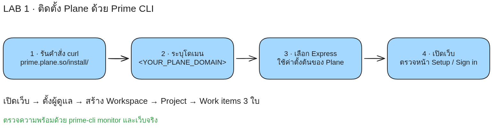

> **คำถามก่อนเริ่ม:** `setup.sh` บอกว่า *Plane Server started successfully* แล้ว — จะพิสูจน์จากเครื่องผู้เรียนได้อย่างไรว่าเว็บใช้งานได้จริง และถ้า login แล้วเบราว์เซอร์เด้งไปพอร์ตที่เปิดไม่ได้ ต้องแก้ค่าไหน?

## 0. เตรียมเครื่องสำหรับเรียน

บนเครื่องผู้เรียน เปิด classroom container เดิม หรือสร้างใหม่หากยังไม่มี:

```bash
docker start devtools 2>/dev/null || \
  docker run -dit --name devtools --privileged -p 2222:22 tuchsanai/devtools:2569_1
```

จากนั้น remote เข้าเครื่องเรียน:

```bash
ssh root@localhost -p 2222   # password: passwd
```

เปิด VS Code → ส่วนขยาย **Remote - SSH** → **Remote-SSH: Connect to Host...** → `ssh root@localhost -p 2222` → เปิดโฟลเดอร์ `/root` **ทุกคำสั่งต่อจากนี้รันใน terminal ของ VS Code ที่อยู่ในเครื่องเรียน** ตรวจว่า Docker พร้อม:

```bash
docker --version && docker compose version
```

✅ **Expected output** — แสดงเวอร์ชันทั้งสอง ไม่มี error เรื่อง Docker daemon (ถ้ามี รอ 10–20 วินาทีแล้วลองใหม่) เครื่องเรียนต้องมีอย่างน้อย 2 CPU / RAM 4 GB และอินเทอร์เน็ต

📝 `-p 2222:22` เปิดเฉพาะ SSH เว็บของ Plane จะเปิดผ่านแท็บ PORTS ในข้อ 4 ไม่ต้องสร้าง container ใหม่

## 1. ดาวน์โหลด `setup.sh`

```bash
mkdir plane-selfhost
cd plane-selfhost
curl -fsSL -o setup.sh https://github.com/makeplane/plane/releases/latest/download/setup.sh
chmod +x setup.sh
```

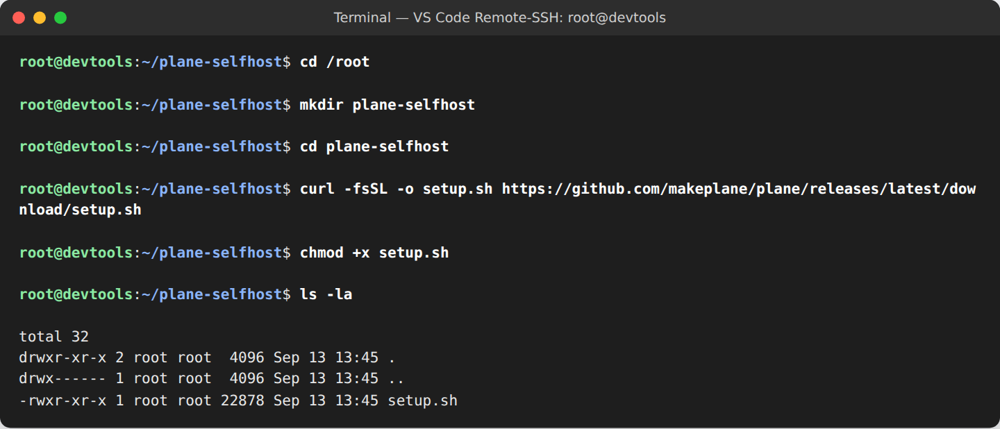

✅ **Expected output** — `ls -la` เห็น `setup.sh` ประมาณ 22 KB สิทธิ์ `-rwxr-xr-x` ทุกคำสั่ง `./setup.sh` ต่อจากนี้รันจากโฟลเดอร์นี้

## 2. `./setup.sh` → **1 Install**

```bash
./setup.sh
```

```
Select a Action you want to perform:
   1) Install
   2) Start
   3) Stop
   4) Restart
   5) Upgrade
   6) View Logs
   7) Backup Data
   8) Exit

Action [2]: 1
```

✅ **Expected output** — `Plane supports amd64` → รายการ `Image ... Pulled` → `Most recent version of Plane is now available` แล้วกลับสู่ prompt ได้โฟลเดอร์ `plane-app/` ที่มี `docker-compose.yaml` และ `plane.env`

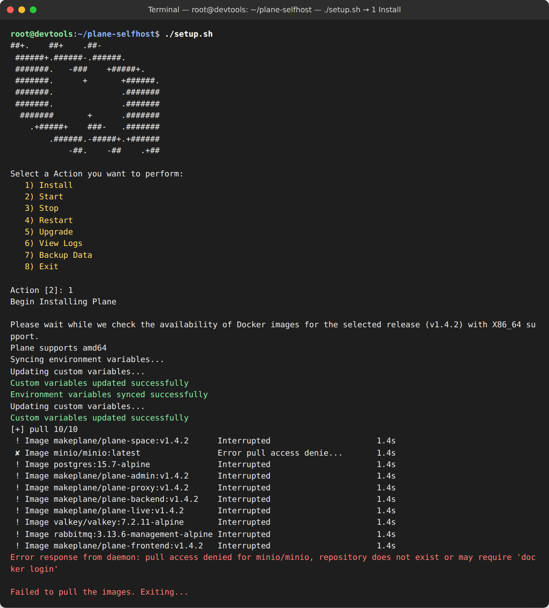

> ⚠️ **ถ้าจบด้วย `pull access denied for minio/minio ... Failed to pull the images`** (ดังภาพ) ไม่ต้อง Install ใหม่ — ไฟล์ทั้งสองถูกสร้างแล้ว เพียงแต่ image MinIO บน Docker Hub ถูกถอดออก ให้ชี้ไป registry ของ MinIO แทน แล้วไปข้อ 3 ต่อ (image ที่เหลือจะถูก pull ตอน Start):
>
> ```bash
> sed -i 's|image: minio/minio:latest|image: quay.io/minio/minio:RELEASE.2025-04-22T22-12-26Z|' plane-app/docker-compose.yaml
> ```

📝 สคริปต์ไม่ใส่ `-p` ชื่อ compose project จึงเป็นชื่อโฟลเดอร์ **`plane-app`** → container `plane-app-<service>-1`, volume `plane-app_<name>`

## 3. ตั้งพอร์ต 8089 ใน `plane.env` แล้ว **2 Start**

| พอร์ต | ต้อง forward? | ใช้ทำอะไร |
| --- | --- | --- |
| **8089** — Plane proxy (HTTP) | **ใช่ พอร์ตเดียว** | หน้าเว็บ, `/api/`, `/god-mode/`, WebSocket และไฟล์แนบ |
| 2222 → 22 — SSH | ไม่ (Remote-SSH ใช้อยู่แล้ว) | ท่อของ PORTS |
| 8443, 5432, 6379, 5672, 9000 | ไม่ | HTTPS และบริการภายใน |

```bash
sed -i 's|^LISTEN_HTTP_PORT=.*|LISTEN_HTTP_PORT=8089|; s|^LISTEN_HTTPS_PORT=.*|LISTEN_HTTPS_PORT=8443|; \
        s|^WEB_URL=.*|WEB_URL=http://localhost:8089|; s|^CORS_ALLOWED_ORIGINS=.*|CORS_ALLOWED_ORIGINS=http://localhost:8089|' plane-app/plane.env
sed -i "s|^SECRET_KEY=.*|SECRET_KEY=$(openssl rand -hex 32)|; s|^LIVE_SERVER_SECRET_KEY=.*|LIVE_SERVER_SECRET_KEY=$(openssl rand -hex 32)|" plane-app/plane.env
grep -nE '^(LISTEN_HTTP_PORT|LISTEN_HTTPS_PORT|WEB_URL|CORS_ALLOWED_ORIGINS)=' plane-app/plane.env
```

✅ **Expected output**

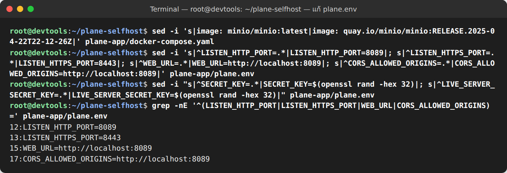

📝 `LISTEN_HTTP_PORT` = พอร์ตที่ proxy ฟังในเครื่องเรียน · `WEB_URL` / `CORS_ALLOWED_ORIGINS` = URL ที่**เบราว์เซอร์**ใช้ (ปกติ VS Code ให้ local port เท่ากับ remote port ถ้าไม่เท่า ดูข้อ 4.3) · `SECRET_KEY` ต้องไม่ใช่ค่า default (ค่าของแต่ละคนต่างกัน ห้ามคัดลอกลงเอกสาร)

```bash
./setup.sh      # เลือก 2 Start (ค่า default)
```

✅ **Expected output** (2–5 นาทีในครั้งแรก)

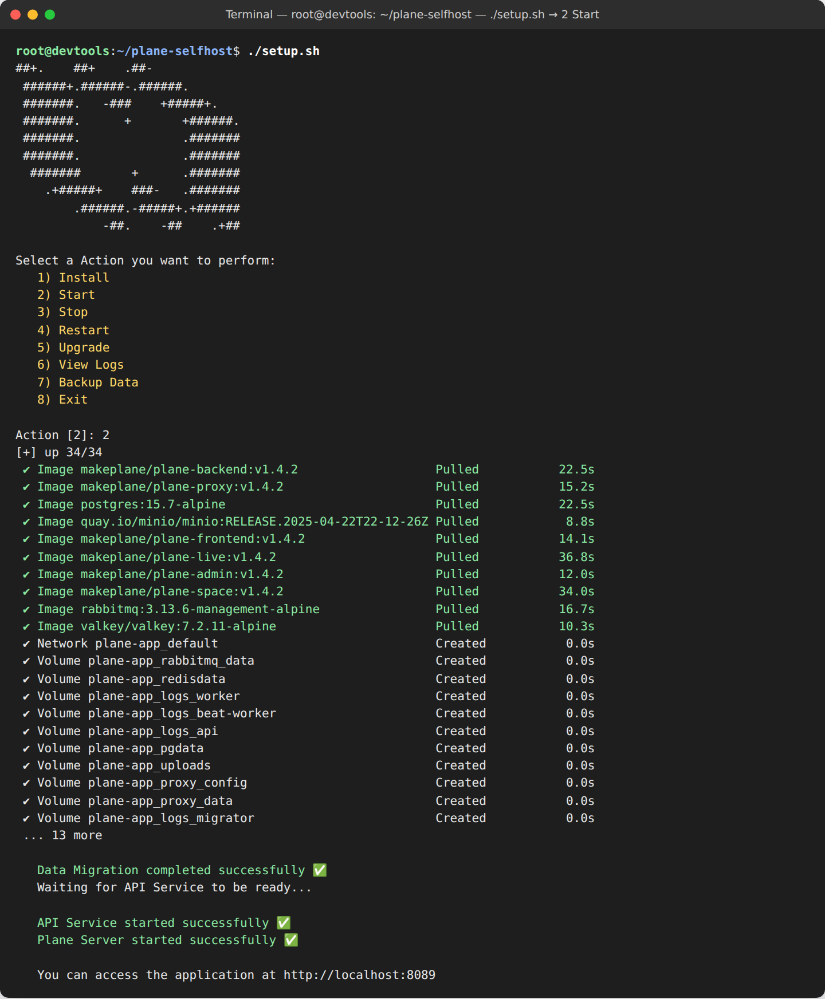

ตรวจในเครื่องเรียน:

```bash
docker ps --format 'table {{.Names}}\t{{.Status}}\t{{.Ports}}'
docker ps -a --format '{{.Names}} {{.Status}}' | grep migrator
curl -s -o /dev/null -w 'api %{http_code}\n' http://localhost:8089/api/instances/
```

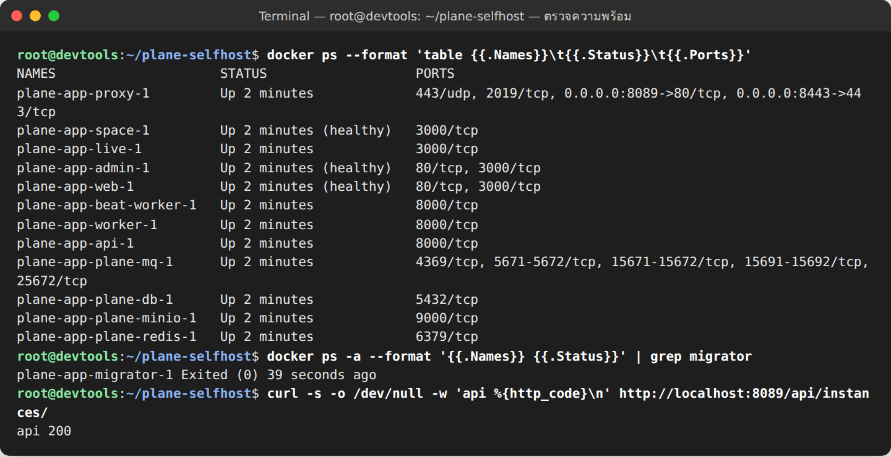

✅ **Expected output** — 12 container `Up`, แถว `plane-app-proxy-1` มี `0.0.0.0:8089->80/tcp`, `plane-app-migrator-1` เป็น `Exited (0)` และ `api 200`

## 4. Forward พอร์ตด้วย VS Code

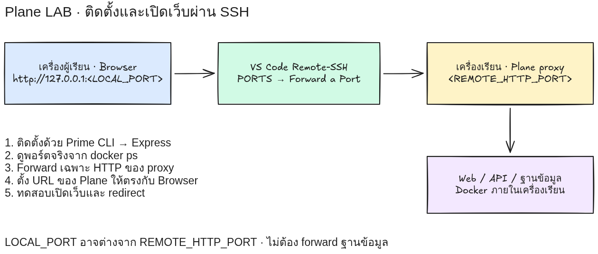

### 4.1 เพิ่มพอร์ต

ภาพต่อไปนี้จับจาก **VS Code Desktop จริง** ที่เชื่อม **Remote-SSH** เข้า classroom container โดยใช้ชื่อ SSH ว่า `devtools-lab` (ดูมุมซ้ายล่าง **SSH: devtools-lab**) การจับภาพทำบนจอเสมือนภายในเครื่อง `5090` ผ่าน SSH ชื่อ SSH ของผู้เรียนอาจต่างจากภาพได้

1. ใน VS Code ที่เชื่อม Remote-SSH อยู่ เปิด panel ด้านล่าง → แท็บ **PORTS** (ถ้าไม่เห็น: Command Palette → **Ports: Focus on Ports View**) ก่อนเพิ่มพอร์ตจะเห็น **No forwarded ports** และปุ่ม **Forward a Port**

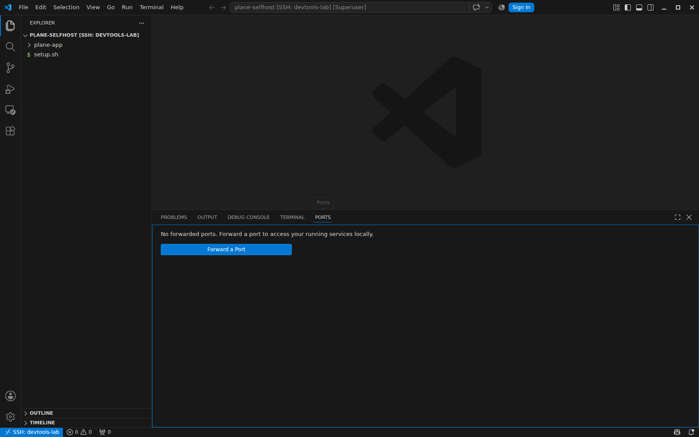

2. กด **Forward a Port** → พิมพ์ `8089` ในช่อง **Port** → Enter

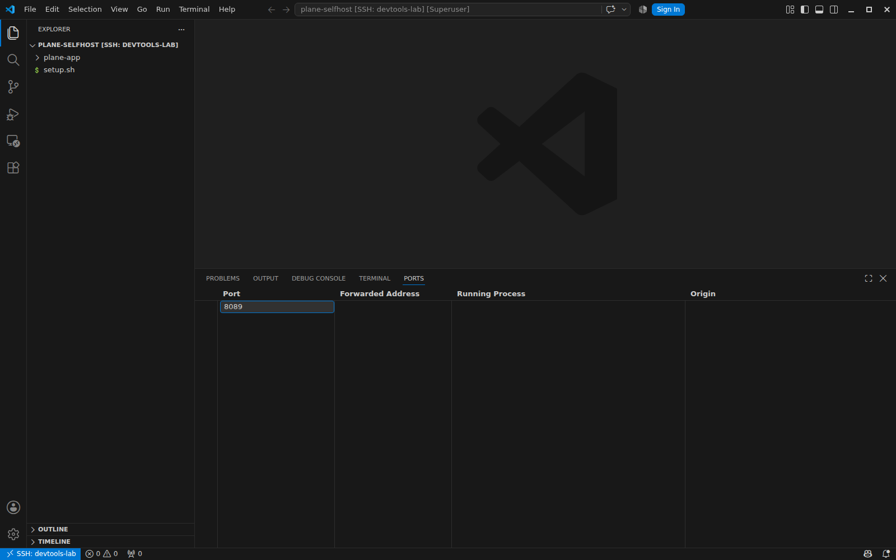

3. ตรวจว่าแถว **Port = 8089** แสดง **Forwarded Address = localhost:8089** และ **Origin = User Forwarded** ถ้า Forwarded Address ได้เลขอื่น ให้ทำตามข้อ 4.3

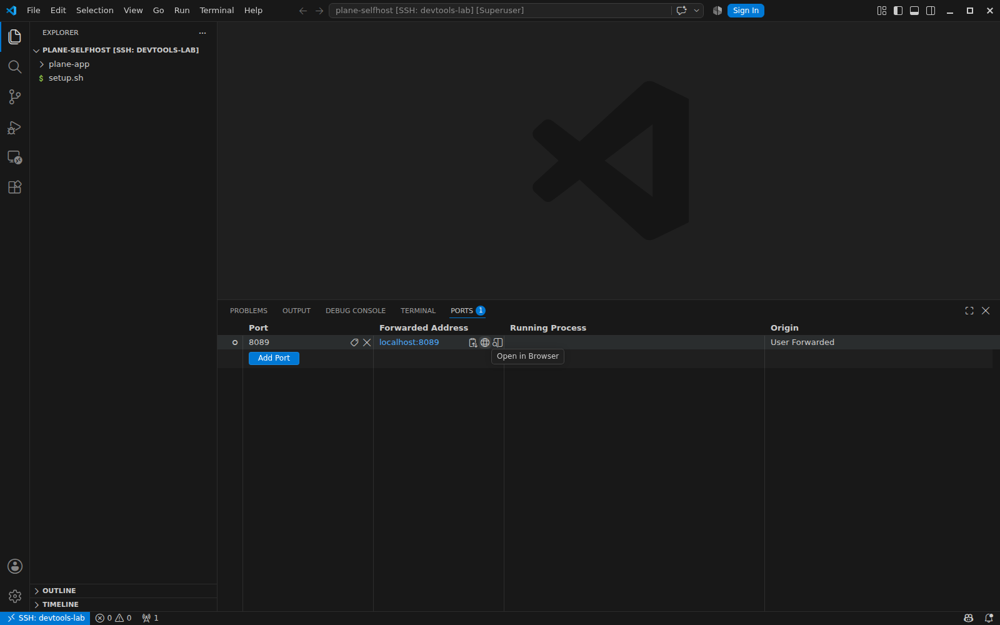

✅ **Expected output** — แท็บ **PORTS** มีรายการพอร์ต `8089` และมี Forwarded Address ให้เปิดได้ การมีแถวพอร์ตยืนยันการตั้ง tunnel ส่วนความพร้อมของ Plane ให้ตรวจ API ตอบ `200` ตามข้อ 3

### 4.2 เปิดเว็บ

เลื่อนเมาส์ไปที่ **Forwarded Address** ของแถว `8089` แล้วคลิกไอคอนลูกโลก **Open in Browser** (ดังภาพด้านบน) หรือเปิด `http://localhost:8089` ในเบราว์เซอร์บนเครื่องผู้เรียน ต้องเห็นหน้า **Welcome to Plane**

📝 `localhost` ในเบราว์เซอร์คือเครื่องผู้เรียน ส่วน `localhost` ใน terminal คือเครื่องเรียน VS Code เชื่อมสองฝั่งด้วย SSH tunnel ผ่านพอร์ต 2222 ที่มีอยู่แล้ว

### 4.3 ถ้าพอร์ตฝั่งผู้เรียนต่างจาก 8089

ถ้า 8089 บนเครื่องผู้เรียนไม่ว่าง VS Code จะเลือกเลขอื่น เช่น Forwarded Address = `localhost:8090` ให้ใช้ **URL ฝั่งผู้เรียน** `http://localhost:8090` ในเบราว์เซอร์ และแก้ `WEB_URL` / `CORS_ALLOWED_ORIGINS` ให้เท่ากัน แล้ว Restart:

```bash
sed -i 's|^WEB_URL=.*|WEB_URL=http://localhost:8090|; s|^CORS_ALLOWED_ORIGINS=.*|CORS_ALLOWED_ORIGINS=http://localhost:8090|' plane-app/plane.env
./setup.sh      # เลือก 4 Restart
```

`LISTEN_HTTP_PORT` และแถวใน PORTS ยังเป็น 8089 เหมือนเดิม เปลี่ยนเฉพาะ URL ฝั่งเบราว์เซอร์

📝 จากการทดสอบ: เปิดเว็บผ่านพอร์ต 18089 ทั้งที่ `WEB_URL=http://localhost:8089` — login ผ่าน แต่เบราว์เซอร์ถูกส่งไป `http://localhost:8089/onboarding/` ถ้าพอร์ตนั้นไม่ได้ forward จะเจอหน้าเปล่า ดังนั้น **URL ในเบราว์เซอร์ = `WEB_URL` = `CORS_ALLOWED_ORIGINS`** เสมอ

## 5. ตั้งผู้ดูแล → Workspace → Project → Work items

### 5.1 Welcome → god-mode

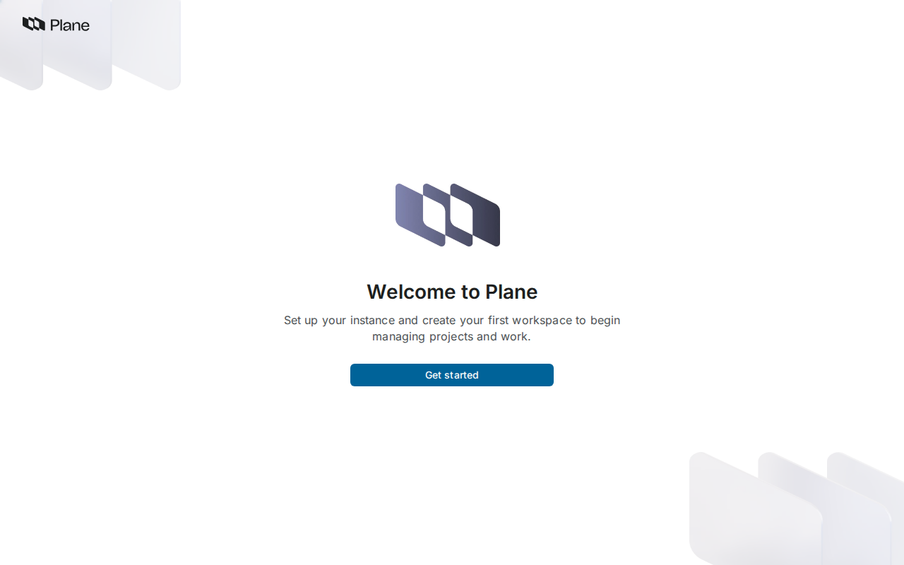

กด **Get started** → หน้า **Setup your Plane Instance** กรอก:

| ช่อง | ค่า |
| --- | --- |
| First name / Last name | `Lab` / `Admin` |
| Email | `admin@example.com` |
| Company name | `DevTools Lab` |
| Set a password / Confirm password | `Plane-Lab-2569` |

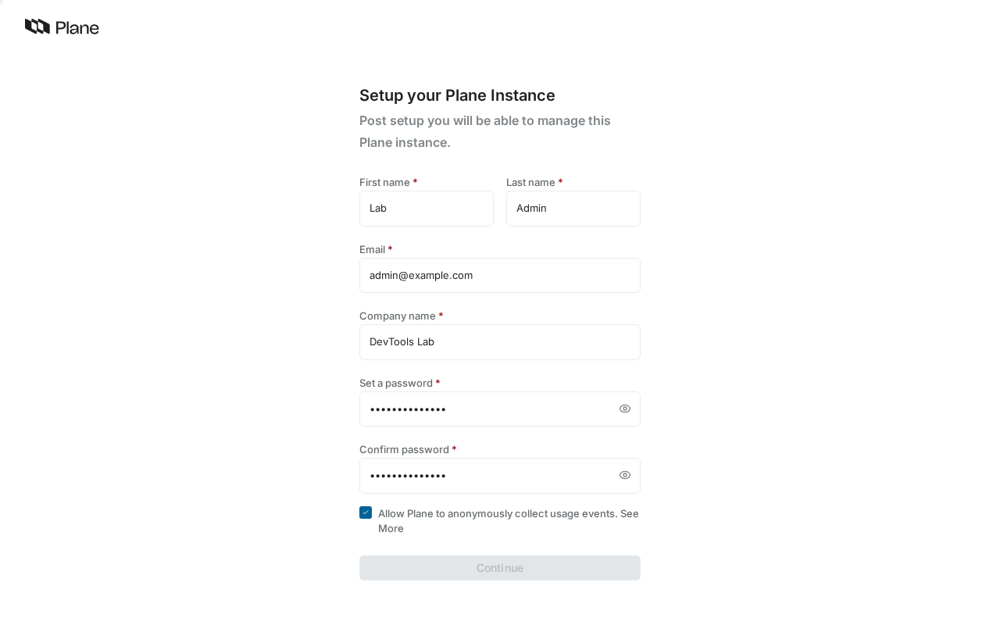

กด **Continue** → เบราว์เซอร์ไปที่ **`http://localhost:8089/god-mode/general/`** (ป๊อปอัป *Create workspace* กด **Close** ได้)

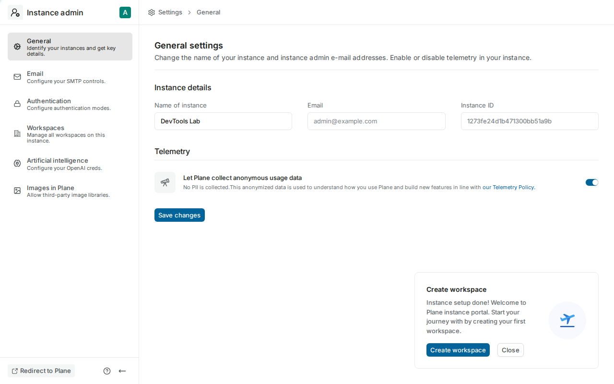

✅ **Expected output** — URL ลงท้าย `/god-mode/general/` บน host และพอร์ตเดียวกับที่เปิดมา (หลักฐานว่า `WEB_URL` ถูกต้อง) และในเครื่องเรียน:

```bash
curl -s http://localhost:8089/api/instances/ | python3 -c 'import sys,json; d=json.load(sys.stdin)["instance"]; print(d["is_setup_done"], d["instance_name"])'
```

```
True DevTools Lab
```

📝 รหัสง่าย ๆ อย่าง `Password123!` จะถูก server ปฏิเสธ (`PASSWORD_TOO_WEAK`) แม้ผ่านกฎบนหน้าจอ · แล็บนี้ไม่มี SMTP จึง login ด้วยรหัสผ่านเท่านั้น

### 5.2 Sign in → onboarding

กลับไปที่ `http://localhost:8089/` → Email `admin@example.com` → **Continue** → Password `Plane-Lab-2569` → **Go to workspace**

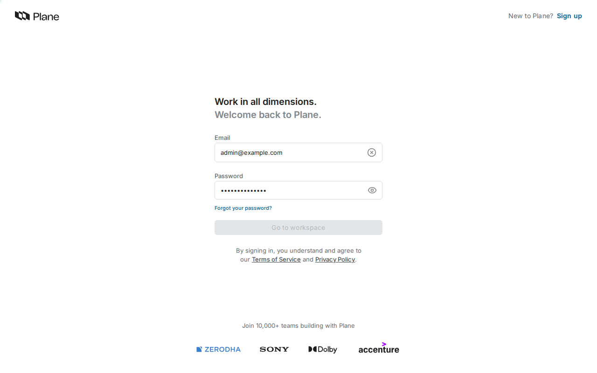

1. **Create your profile** — Name ถูกเติม `Lab` ไว้แล้ว กด **Continue**
2. **Create your workspace** — Name `DevTools Lab` (slug `devtools-lab` อัตโนมัติ) → เลือก **2-10** → **Create workspace**
3. **Invite your teammates** — กด **I'll do it later**
4. ถึง Home `http://localhost:8089/devtools-lab/` ถ้ามีป๊อปอัป Product Tour กด **No thanks, I will explore it myself**

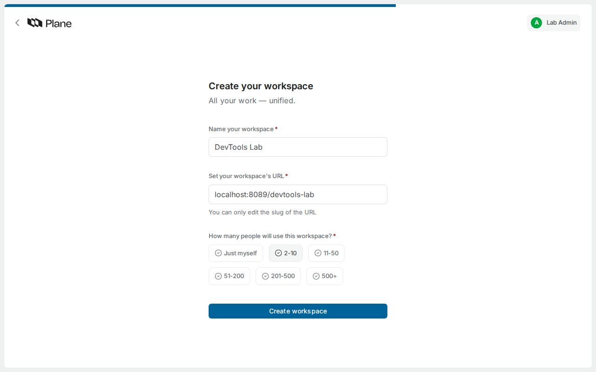

### 5.3 Project `Plane Lab` (`PLAB`) และ work items 3 ใบ

แถบซ้าย **Projects** → **Add Project** → Project name `Plane Lab` → แก้ Project ID เป็น **`PLAB`** → **Create project** → **Open project**

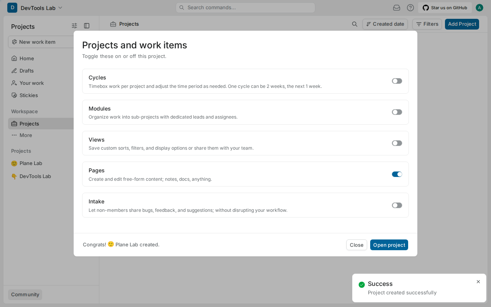

ในหน้า **Work items** กด **New work item** → พิมพ์ Title → **Save** ทำ 3 ครั้ง: `ออกแบบหน้ารายการอาหาร`, `เพิ่มตะกร้าสินค้า`, `แสดงสถานะคำสั่งซื้อ`

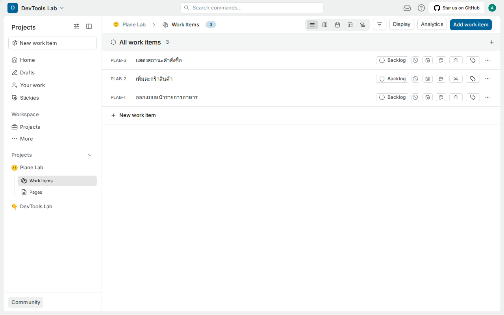

✅ **Expected output** — **All work items 3** สถานะ `Backlog` เลข `PLAB-1`…`PLAB-3` (โปรเจกต์ `DevTools Lab` อีกอันคือตัวอย่างที่ระบบสร้างให้ ไม่ต้องลบ)

## 6. คำสั่งลัด `pc` และตัวตรวจ

สร้าง helper `pc` = `docker compose` ที่ชี้ไฟล์ของ Plane ใช้ได้จากทุกโฟลเดอร์ (LAB 2–9 ใช้ตลอด):

```bash
cat > /usr/local/bin/pc <<'EOF'
#!/bin/bash
exec docker compose -f "$HOME/plane-selfhost/plane-app/docker-compose.yaml" --env-file "$HOME/plane-selfhost/plane-app/plane.env" "$@"
EOF
chmod +x /usr/local/bin/pc
pc ps
```

✅ **Expected output** — 12 service `running`, migrator `exited (0)`

ตัวตรวจของแล็บ (รันในเครื่องเรียนจากโฟลเดอร์ LAB ที่ clone มา):

```bash
bash check_lab01.sh
```

✅ **Expected output** — บรรทัดเดียวขึ้นต้น `PASS:` (ตรวจไฟล์ พอร์ต และ HTTP ไม่ตรวจ workspace/work items)

## ทดลองเพิ่มเติม

**หยุดแล้วเปิดใหม่ — ข้อมูลยังอยู่ไหม?** `./setup.sh` → **3 Stop** แล้ว `docker ps` ต้องไม่เหลือ `plane-app-*` (Stop = `compose down` ลบ container แต่ไม่ลบ volume) จากนั้น `./setup.sh` → **2 Start** รอจนพร้อม แล้วรีเฟรชหน้า Work items


✅ **Expected output** — login ด้วยบัญชีเดิมได้ และ PLAB-1..3 ยังอยู่ครบ (ข้อมูลอยู่ใน volume `plane-app_pgdata` และ `plane-app_uploads`)

## แก้ปัญหาที่พบบ่อย

| อาการ | สิ่งที่ตรวจ |
| --- | --- |
| `Failed to pull the images` / `pull access denied for minio/minio` | รัน `sed` ในข้อ 2 แล้ว **2 Start** ไม่ต้อง Install ใหม่ |
| Install ค้างหรือ curl ล้มเหลว | เครื่องเรียนออกอินเทอร์เน็ตไม่ได้ (`github.com`, `registry-1.docker.io`, `quay.io`) |
| `Bind for 0.0.0.0:8089 failed` | พอร์ตชนกับงานอื่น → เปลี่ยน `LISTEN_HTTP_PORT` เป็นพอร์ตว่างและ forward เลขนั้นแทน อย่าหยุดงานของคนอื่น |
| เปิดเว็บจากเครื่องผู้เรียนไม่ได้ แต่ `curl` ในเครื่องเรียนได้ `200` | ยังไม่ได้ forward ใน PORTS หรือ Forwarded Address เป็นเลขอื่น (ข้อ 4.3) |
| login แล้วเด้งไปพอร์ตอื่น / หน้าเปล่า | `WEB_URL` ไม่ตรง URL ฝั่งเบราว์เซอร์ → แก้แล้ว **4 Restart** |
| เว็บ `502` นาน | migration ยังไม่จบ → `pc logs -f migrator api` |
| แก้ `plane.env` แล้วค่าไม่เปลี่ยน | ค่าอ่านตอนสร้าง container → ต้อง **4 Restart** ไม่ใช่ `docker restart` |

## เก็บกวาด (Cleanup)

ปล่อย Plane รันไว้ใช้ต่อใน LAB 2–9 ถ้าจะพัก `./setup.sh` → **3 Stop** และกลับมา **2 Start**

ลบทั้งชุดรวมข้อมูล (ตอนจบ LAB 9 เท่านั้น):

```bash
pc down -v && rm -rf ~/plane-selfhost
```

## สรุปคำสั่งของแล็บนี้

| งาน | คำสั่ง (ใน `~/plane-selfhost`) |
| --- | --- |
| ติดตั้ง / เริ่ม / หยุด / รีสตาร์ท | `./setup.sh` → `1` / `2` / `3` / `4` |
| ดู log | `./setup.sh` → `6` หรือ `pc logs -f api` |
| ตั้งพอร์ตและ URL | `sed -i ... plane-app/plane.env` แล้ว `./setup.sh` → `4` |
| ตรวจความพร้อม | `docker ps` · `curl http://localhost:8089/api/instances/` · `bash check_lab01.sh` |

## เช็กลิสต์ก่อนจบแล็บ

- [ ] `./setup.sh` → 2 Start จบด้วย *Plane Server started successfully* และ `docker ps` เห็น `8089->80/tcp`
- [ ] Forward 8089 แล้วเปิด `http://localhost:<LOCAL_PORT>` ได้ และ `WEB_URL` ตรงกับ URL นั้น (หลัง setup ไม่เด้งไปพอร์ตอื่น)
- [ ] ตั้งผู้ดูแลสำเร็จ (`is_setup_done True`) และ sign in ได้
- [ ] มี workspace `DevTools Lab`, project `PLAB`, work items PLAB-1..3
- [ ] Stop → Start แล้วข้อมูลยังอยู่ และ `bash check_lab01.sh` ได้ `PASS:`
- [ ] มีคำสั่ง `pc` ใช้ได้ และภาพส่งงานไม่มีข้อมูลจริง

*ผลลัพธ์ทั้งหมดในเอกสารนี้มาจากการรันจริง (Plane v1.4.2) เมื่อ 13-ก.ย.-2569*
