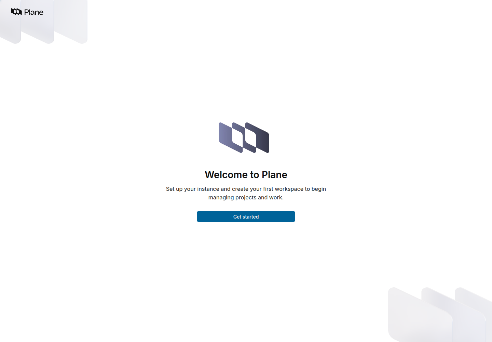
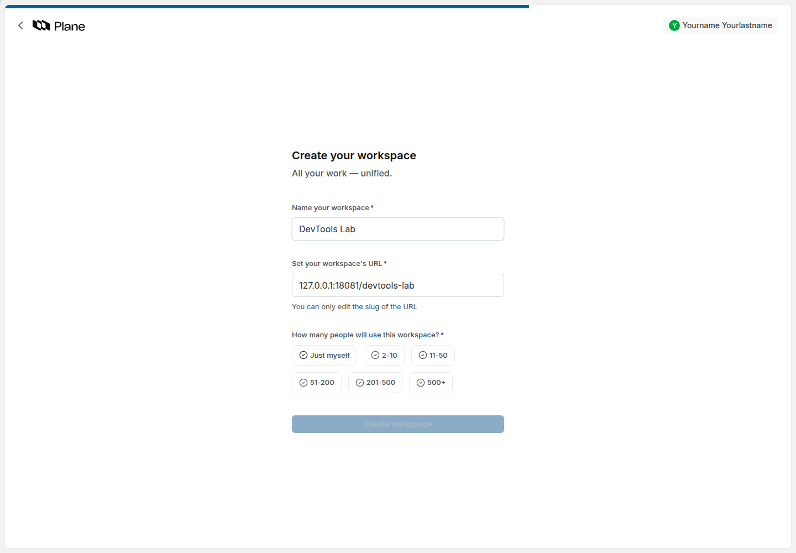
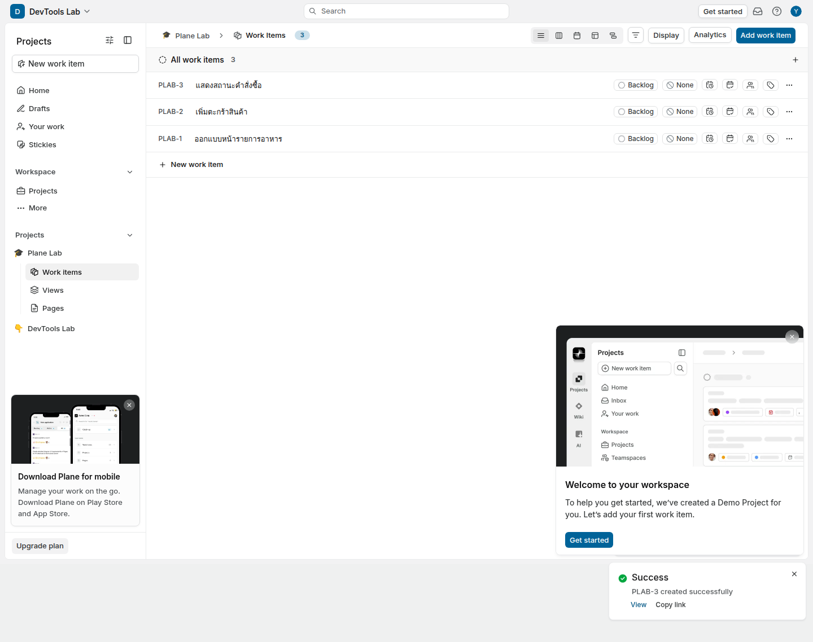
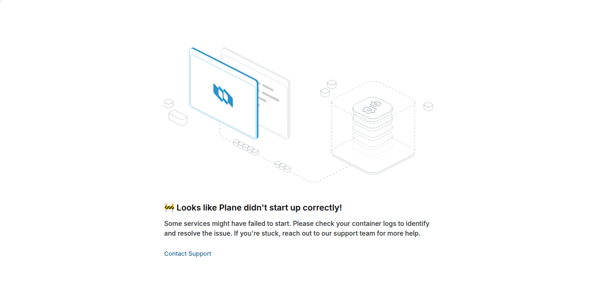
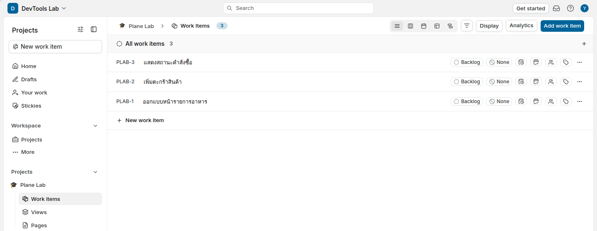

# LAB 1 — ติดตั้ง Plane ง่าย ๆ ด้วย Prime CLI

> โฟลเดอร์ `001_LAB_Plane_Setup` = **LAB 1** ใน `Plane_Agile_Slides.html`
>
> (เวลาโดยประมาณ : 45 นาที)

## สิ่งที่จะได้เรียนรู้

คัดลอกคำสั่งติดตั้ง Plane ตาม [คู่มือ Docker Compose ของ Plane](https://developers.plane.so/self-hosting/methods/docker-compose) เลือก **Express** แล้วเปิดเว็บสร้าง Workspace และ Project แรก

```bash
curl -fsSL https://prime.plane.so/install/ | sh -
```

วิธีนี้ติดตั้ง **Commercial Edition ซึ่งมี Free plan** และใช้ **Prime CLI** จัดการบริการ ไม่ต้อง clone source หรือเขียน Compose เอง; หลังติดตั้งปรับ URL สำหรับการเปิดผ่าน VS Code อีกครั้ง

**กติกาข้อมูล:** ข้อมูลส่วนตัวและบัญชี Plane ในเอกสารและงานส่งใช้ placeholder เท่านั้น เช่น `<YOUR_NAME>`, `<YOUR_EMAIL>`, `<YOUR_USERNAME>`, `<YOUR_PASSWORD>`, `<YOUR_TOKEN>` แทนค่าตอนใช้งานจริงบนเครื่องเรียน และปกปิดข้อมูลเหล่านั้นก่อนจับภาพส่งงาน

## ทฤษฎีที่เกี่ยวข้อง

Prime CLI เตรียมไฟล์และเปิดบริการ Docker ที่ Plane ต้องใช้ให้ทั้งชุด ส่วน **Express** ใช้ค่าตั้งต้น เหมาะกับการเริ่ม LAB ความพร้อมต้องตรวจทั้งสถานะบริการและการเปิดเว็บจริง เพราะ container ที่ทำงานอยู่ยังอาจกำลังเตรียมฐานข้อมูล

## ภาพรวมของแล็บนี้

เปิดเครื่องเรียน → Remote-SSH → ติดตั้งแบบ Express → ดูพอร์ตจริง → Forward พอร์ต → ตั้ง URL → เปิดเว็บ


ในผังนี้ `<REMOTE_HTTP_PORT>` = **8089** ส่วน `<LOCAL_PORT>` ใช้เลขจาก Forwarded Address (ปกติ 8089)

[ไฟล์แก้ไข Excalidraw](images/ports-flow.excalidraw) · [ดาวน์โหลด PNG](images/ports-flow.png)

> **คำถามก่อนเริ่ม:** ตัวติดตั้งบอกว่าสำเร็จแล้ว เราจะพิสูจน์ได้อย่างไรว่าเว็บใช้งานได้จริง?

## 0. เตรียมเครื่องเรียน

ทำบนเครื่องของเราเอง — เปิด classroom container ที่มี Docker เตรียมไว้ให้:

```bash
docker start devtools 2>/dev/null || \
  docker run -dit --name devtools --privileged -p 2222:22 tuchsanai/devtools:2569_1
ssh root@localhost -p 2222        # password : passwd
```

คำสั่งแรกเปิด `devtools` เดิม หากยังไม่มีจะสร้างเครื่องเรียนใหม่ ส่วนคำสั่ง `ssh` ใช้เข้าสู่เครื่องเรียน บัญชี `root` และรหัส `passwd` ข้างต้นเป็นค่าเริ่มต้นของ classroom image ตามที่ผู้สอนกำหนด ไม่ใช่บัญชีผู้ดูแล Plane ที่จะสร้างใน LAB

**จากนี้ให้รันคำสั่งติดตั้ง Plane ภายใน terminal ที่ SSH เข้าเครื่องเรียนแล้ว** ตรวจว่า Docker ภายในพร้อม:

```bash
docker --version
docker compose version
docker info --format '{{.ServerVersion}}'
```

**Expected output:** ทั้งสามคำสั่งแสดงเวอร์ชัน และไม่มี error ว่าติดต่อ Docker daemon ไม่ได้ หาก daemon ยังเริ่มไม่เสร็จให้รอแล้วตรวจซ้ำ

เครื่องของเราต้องมี Docker ทำงานอยู่ และจัดสรรทรัพยากรให้เครื่องเรียนอย่างน้อย **2 CPU cores / RAM 4 GB** พร้อมอินเทอร์เน็ต

📝 `-p 2222:22` เปิดเฉพาะ SSH ส่วนเว็บให้ใช้ **VS Code Remote-SSH → PORTS** เป็นเส้นทางหลัก ไม่ต้องสร้าง classroom container ใหม่เพื่อเพิ่ม web port mapping

เปิด VS Code บนเครื่องผู้เรียน ติดตั้งส่วนขยาย **Remote - SSH** → Command Palette → **Remote-SSH: Connect to Host...** → เลือกหรือเพิ่ม `ssh root@localhost -p 2222` แล้วเปิดโฟลเดอร์ในเครื่องเรียน ให้ terminal ของ VS Code อยู่ใน remote session นี้

## 1. รันคำสั่งติดตั้ง

```bash
curl -fsSL https://prime.plane.so/install/ | sh -
```

ตอบหน้าจอตามลำดับ:

| หน้าจอ | สิ่งที่ทำ |
| --- | --- |
| Welcome / Plane Self Hosted | กด **Enter** |
| Domain / IP Address | ใส่ `127.0.0.1` สำหรับเส้นทาง SSH tunnel ใน LAB นี้ |
| ยืนยัน Domain / IP Address | ใส่ค่าเดิมอีกครั้ง |
| Behind a reverse proxy? | เลือก **No**; VS Code ส่งต่อ TCP ผ่าน SSH ไม่ใช่ HTTP reverse proxy |
| Express / Advanced | เลือก **Express** แล้วกด **Enter** |

กรอก IP โดยไม่ใส่ `http://`, พอร์ต หรือ path; รุ่นที่ทดสอบไม่รับ `localhost:พอร์ต` ในช่องนี้ กด `Tab` เพื่อเปลี่ยนช่องตามหน้าจอ ตัวติดตั้งจะดาวน์โหลดและเปิดบริการให้ รอจนแจ้งว่าติดตั้งสำเร็จ

**Expected output:** ข้อความสำเร็จพร้อม URL สำหรับเปิด Plane ระยะเวลาขึ้นกับความเร็วดาวน์โหลด หากพบ error ให้แก้ตามข้อความก่อน ไม่ถือว่าผ่านเพียงเพราะคำสั่งจบ

## 2. Forward พอร์ตด้วย VS Code และตั้ง URL ให้ตรงกัน

### 2.1 พอร์ตที่กำหนดสำหรับ LAB นี้: 8089

**Plane ใช้ HTTP พอร์ต `8089` ในเครื่องเรียน** โดยคำสั่งในขั้น 2.3 จะตั้ง `LISTEN_HTTP_PORT=8089` ให้เอง และตรวจพอร์ตก่อนเปลี่ยนจากค่าติดตั้งเดิม ไม่หยุดหรือลบบริการของงานอื่น

| พอร์ต/บริการ | ต้อง forward หรือไม่ | ใช้ทำอะไร |
| --- | --- | --- |
| **8089 — Plane HTTP proxy** | **เพิ่ม 8089 ใน PORTS** | หน้าเว็บ, API, หน้าผู้ดูแล และ realtime ผ่าน proxy เดียว |
| SSH — host 2222 → classroom 22 | Remote-SSH เชื่อมต่อไว้แล้ว | ขนส่ง tunnel; ไม่ต้องเพิ่มใน PORTS อีก |
| HTTPS ของ proxy | ไม่ต้องสำหรับ LAB แบบ HTTP นี้ | ใช้เมื่อจัดโดเมนและ TLS เพิ่มต่างหาก |
| PostgreSQL, Redis, RabbitMQ, MinIO และ SMTP | ไม่ต้อง | บริการภายในและอีเมล ไม่จำเป็นต่อการเปิดเว็บของ LAB |

Express อาจเริ่มที่พอร์ต 80 ก่อน ขั้น 2.3 จะเปลี่ยนพอร์ตที่ publish เป็น **8089 → 80**; เลข 80 ด้านขวาคือพอร์ตภายใน proxy container ไม่ใช่เลขที่ต้องใส่ใน PORTS

### 2.2 เพิ่มพอร์ตและอ่าน Forwarded Address

1. ในหน้าต่าง VS Code ที่ Remote-SSH แล้ว เปิด panel ด้านล่าง → **PORTS** (ถ้าไม่เห็น ใช้ Command Palette → **Ports: Focus on Ports View**)
2. กด **Forward a Port** → ใส่ **8089** → Enter
3. ปกติ Forwarded Address จะเป็น `localhost:8089` หากต้องการกำหนด local port เอง ให้คลิกขวาแถวนี้ → **Change Local Address Port** → ใส่ `8089` เมื่อพอร์ตฝั่งผู้เรียนว่าง
4. อ่านคอลัมน์ **Forwarded Address** ของแถวนั้น เลขพอร์ตฝั่งเครื่องผู้เรียนคือ `<LOCAL_PORT>` ซึ่ง VS Code อาจเลือกให้ต่างจากพอร์ตในเครื่องเรียนเมื่อพอร์ตไม่ว่าง
5. ใช้ **Open in Browser** หรือคัดลอก Forwarded Address แล้วเติม `http://` หากยังไม่มี scheme
6. LAB นี้ใช้ host `127.0.0.1` ให้สม่ำเสมอ: ถ้า VS Code แสดง `localhost:<LOCAL_PORT>` ให้ใช้ `http://127.0.0.1:<LOCAL_PORT>` โดยคงเลขพอร์ตเดิม จากนั้นใช้ URL นี้ทุกครั้งและใช้ค่าเดียวกันในขั้นถัดไป

**หากพอร์ตต่างกัน ให้เบราว์เซอร์เปิด `http://127.0.0.1:<LOCAL_PORT>` เสมอ** ส่วนช่อง Port ใน VS Code ยังเป็น **8089** ไม่ต้องแก้ `LISTEN_HTTP_PORT` ให้เท่าพอร์ตฝั่งผู้เรียน และไม่เปิด IP ของ Docker container ในเบราว์เซอร์

ตัวอย่าง: remote **8089** → Forwarded Address `localhost:8088` ให้เปิด **`http://127.0.0.1:8088`** และใช้ค่านี้ตั้ง URL/CORS ส่วน PORTS ยังคง forward **8089**

เพิ่มแถว PORTS ก่อนได้ แม้ Plane ยังไม่ฟังพอร์ต 8089; ให้รันขั้น 2.3 จบก่อนเปิดเว็บ

### 2.3 คัดลอกวางเพื่อตั้งพอร์ตและ URL อัตโนมัติ

วางทั้งก้อนนี้ใน terminal เครื่องเรียน เมื่อถาม **Paste Forwarded Address from VS Code:** ให้วางค่าจากคอลัมน์ Forwarded Address แล้ว Enter คำสั่งจะตั้งพอร์ต HTTP เป็น **8089** และตั้ง `WEB_URL` และ `CORS_ALLOWED_ORIGINS` ให้ตรงกัน พร้อมหยุด/เปิด Plane ให้เอง ไม่ต้องแก้ไฟล์ด้วย editor

```bash
bash <<'BASH'
set -euo pipefail
PLANE_HTTP_PORT=8089
if [[ -z ${PLANE_BROWSER_URL:-} ]]; then
  read -r -p 'Paste Forwarded Address from VS Code: ' PLANE_BROWSER_URL </dev/tty
fi
PLANE_BROWSER_URL=${PLANE_BROWSER_URL%/}
[[ $PLANE_BROWSER_URL == http://* ]] || PLANE_BROWSER_URL="http://$PLANE_BROWSER_URL"
if [[ ! $PLANE_BROWSER_URL =~ ^http://(localhost|127\.0\.0\.1)(:([0-9]{1,5}))?$ ]]; then
  echo 'Use the HTTP localhost or 127.0.0.1 Forwarded Address, without a path.' >&2
  exit 2
fi
LOCAL_PORT=${BASH_REMATCH[3]:-80}
LOCAL_PORT=$((10#$LOCAL_PORT))
(( LOCAL_PORT >= 1 && LOCAL_PORT <= 65535 )) || { echo 'Invalid port' >&2; exit 2; }
PLANE_BROWSER_URL="http://127.0.0.1:$LOCAL_PORT"
test -f /opt/plane/plane.env
CURRENT_HTTP_PORT=$(sed -n 's/^LISTEN_HTTP_PORT=//p' /opt/plane/plane.env)
if [[ $CURRENT_HTTP_PORT != "$PLANE_HTTP_PORT" ]]; then
  python3 - "$PLANE_HTTP_PORT" <<'PYPORT'
import socket, sys
port = int(sys.argv[1])
with socket.socket() as listener:
    try:
        listener.bind(('0.0.0.0', port))
    except OSError:
        sys.exit(f'Port {port} is busy. Choose another LAB port; do not stop other services.')
PYPORT
fi
cp -p /opt/plane/plane.env /opt/plane/plane.env.before-forward
chmod 600 /opt/plane/plane.env.before-forward
prime-cli stop
sed -i -E \
  -e "s|^LISTEN_HTTP_PORT=.*|LISTEN_HTTP_PORT=$PLANE_HTTP_PORT|" \
  -e "s|^WEB_URL=.*|WEB_URL=$PLANE_BROWSER_URL|" \
  -e "s|^CORS_ALLOWED_ORIGINS=.*|CORS_ALLOWED_ORIGINS=$PLANE_BROWSER_URL|" \
  /opt/plane/plane.env
prime-cli start
printf '\nOpen in your browser: %s\n' "$PLANE_BROWSER_URL"
BASH
```

เมื่อ Prime แสดง **Hit Enter or Return** ให้กด Enter เพื่อจบ จากนั้นเปิด URL หลังข้อความ **Open in your browser:** บนเครื่องผู้เรียน โค้ดปรับ `localhost` เป็น `127.0.0.1` และคงเลขพอร์ตจาก VS Code ไว้ ให้ใช้ URL นี้สม่ำเสมอ

`WEB_URL` และ CORS ต้องเป็น URL **ฝั่ง Browser** ทั้ง scheme, host และพอร์ต ส่วน `LISTEN_HTTP_PORT=8089` เป็นพอร์ตรับในเครื่องเรียน และ `SITE_ADDRESS` คงเดิมเพื่อให้ proxy รับ HTTP ภายใน หาก VS Code เปลี่ยน local port ให้รันก้อนนี้ใหม่ด้วย Forwarded Address ใหม่

ตรวจพอร์ตจริงหลังคำสั่งจบ โดยคัดลอกวางในเครื่องเรียน:

```bash
docker ps --format 'table {{.Names}}\t{{.Ports}}'
grep -E '^(LISTEN_HTTP_PORT|WEB_URL|CORS_ALLOWED_ORIGINS)=' /opt/plane/plane.env
```

**Expected output:** แถว proxy มี `8089->80/tcp`, `LISTEN_HTTP_PORT=8089` และ URL/CORS ตรงกับ URL ที่เปิดบนเครื่องผู้เรียน

ถ้าพบ **Port 8089 is busy** คำสั่งจะหยุดก่อนแก้ไฟล์ ให้เลือกพอร์ตว่างอื่นในช่วง 8081–8088 โดยเปลี่ยนบรรทัด `PLANE_HTTP_PORT=8089` ในก้อนคำสั่ง และเพิ่มเลขเดียวกันใน PORTS อย่าหยุดงานอื่นเพื่อแย่งพอร์ต หากมีการแย่งพอร์ตหลังตรวจ Docker จะรายงาน bind error; ตรวจและเลือกใหม่ตามขั้นตอนเดียวกัน

โค้ดเดียวกันมีให้ผู้สอนใน [configure_access.sh](configure_access.sh) แต่การทำ LAB ไม่ต้องดาวน์โหลดไฟล์นี้

> `127.0.0.1` ใน Browser คือเครื่องผู้เรียน ส่วนใน terminal Remote-SSH คือเครื่องเรียน เมื่อพอร์ตต่างกันจึงใช้คนละ URL

## 3. เปิดเว็บและเริ่มใช้งาน

เปิด URL ฝั่งผู้เรียนจากขั้น 2 เลือก **Get started** แล้วทำตามหน้าจอ:





1. ตั้งผู้ดูแล โดยแทน `<YOUR_NAME>`, `<YOUR_EMAIL>` และ `<YOUR_PASSWORD>` ด้วยค่าของตนเองเฉพาะตอนกรอกจริง ไม่พิมพ์ `< >` ลงในฟอร์ม; ช่องชื่อรุ่นที่ทดสอบไม่รับ `_` ให้ใช้ชื่อที่ระบบยอมรับ แล้วปกปิดข้อมูลก่อนส่งภาพ
2. เข้าสู่ระบบและสร้าง Workspace ชื่อ **DevTools Lab** (ข้อมูลสมมติของแบบฝึกหัด)
3. สร้าง Project ชื่อ **Plane Lab**, identifier **`PLAB`**
4. เพิ่ม work item สมมติ 3 ใบ: **ออกแบบหน้ารายการอาหาร**, **เพิ่มตะกร้าสินค้า**, **แสดงสถานะคำสั่งซื้อ**

หากมีขั้นชวนสมาชิกให้ข้ามก่อน LAB นี้ไม่ต้องส่งอีเมลหรือเปิดใช้แผนชำระเงิน ชื่อปุ่มอาจต่างกันตามรุ่น



ภาพจริงด้านบนมาจากรอบทดสอบก่อนกำหนดพอร์ต 8089 (local 18081 → remote 80) ไม่ใช่หลักฐานทดสอบพอร์ตใหม่ ผลการทดสอบด้วย Playwright CLI อยู่ใน [รายงานทดสอบ](TEST_REPORT.md)

## 4. ตรวจสถานะ

```bash
sudo prime-cli monitor
```

ตรวจบริการในหน้าจอ monitor และลองรีเฟรชหน้าเว็บ ถ้าต้องการรายละเอียดคำสั่ง:

```bash
sudo prime-cli --help
sudo prime-cli healthcheck --help
```

คัดลอกวางใน terminal เครื่องเรียนเพื่อตรวจ HTTP โดยอ่านพอร์ตจริงอัตโนมัติ:

```bash
REMOTE_HTTP_PORT=$(sed -n 's/^LISTEN_HTTP_PORT=//p' /opt/plane/plane.env)
curl -fsS -L -o /dev/null -w 'HTTP %{http_code}\n' "http://127.0.0.1:$REMOTE_HTTP_PORT"
```

**Expected output:** หน้าเว็บตอบ `HTTP 200` และเบราว์เซอร์แสดงหน้า Plane หากใช้ HTTPS ให้เปลี่ยน URL ให้ตรงด้วย การตอบ 200 อย่างเดียวยังไม่ยืนยันว่า login หรือการบันทึกข้อมูลผ่าน

ถ้าเห็นข้อความ “Plane didn't start up correctly” ระหว่างติดตั้ง ให้รอจนตัวติดตั้งจบและตรวจ monitor เพราะหน้าเว็บอาจตอบ 200 ขณะที่ API ยังไม่พร้อม:



สำหรับผู้สอน มีตัวตรวจเสริมในโฟลเดอร์ LAB (ไม่จำเป็นต่อการติดตั้ง):

```bash
REMOTE_HTTP_PORT=$(sed -n 's/^LISTEN_HTTP_PORT=//p' /opt/plane/plane.env)
PLANE_URL="http://127.0.0.1:$REMOTE_HTTP_PORT" bash check_lab01.sh
```

ตัวตรวจรอทั้งหน้าเว็บและ `/api/instances/` ตอบ 200 ภายใน 600 วินาที ไม่ตรวจ SQL หรือยืนยันว่าแบบฝึกหัดสร้าง Project ผ่านแล้ว

## ทดลองเพิ่มเติม

หลังสร้าง Project และ work items แล้ว ให้ลองหยุดและเปิดใหม่:

```bash
sudo prime-cli stop
sudo prime-cli start
```

รอเว็บพร้อม รีเฟรชหน้า Project และตรวจว่ารายการเดิมยังอยู่ หากหน้าจอถามให้เลือกบริการ ให้เลือกชุด Plane ที่ติดตั้งใน LAB นี้



## แก้ปัญหาที่พบบ่อย

| อาการ | สิ่งที่ตรวจ |
| --- | --- |
| ไม่มีสิทธิ์ / `sudo` ไม่พร้อม | ใช้บัญชีเครื่องเรียนที่ผู้สอนให้สิทธิ์ติดตั้ง |
| ดาวน์โหลดล้มเหลว | ตรวจอินเทอร์เน็ตไป `prime.plane.so` และ registry แล้วรันคำสั่งติดตั้งใหม่ตามข้อความแนะนำ |
| Domain/IP ไม่ผ่าน | ตรวจว่ากรอกสองช่องตรงกัน และโดเมนชี้ไปยังเครื่องติดตั้ง |
| เปิดเว็บไม่ได้ | ตรวจ Forwarded Address, WEB_URL/CORS, การเชื่อมต่อ Remote-SSH และ `sudo prime-cli monitor` |
| เว็บ 502 หรือบริการกำลังเริ่ม | รอพร้อมตรวจ log ใน monitor หากยังไม่พร้อมให้แก้ error ที่พบ |
| ต้องเปลี่ยนการตั้งค่า | ดู `sudo prime-cli configure --help` แล้วใช้ `sudo prime-cli configure` |

## เก็บกวาด (Cleanup)

ถ้าจะใช้ต่อ ให้หยุดด้วย `sudo prime-cli stop` แล้วเปิดกลับด้วย `sudo prime-cli start`

ถ้าจะถอนการติดตั้ง ใช้ `sudo prime-cli uninstall` และอ่านหน้าจอยืนยันก่อนดำเนินการ คำสั่งนี้เก็บโฟลเดอร์ data/logs ตามคู่มือ ไม่ได้แปลว่าลบข้อมูลทุกอย่างแล้ว

ถ้าใช้ container เครื่องเรียนชั่วคราวและจบการทดลองทั้งหมด ให้ลบเฉพาะของตนเองจากเครื่อง host:

```bash
docker rm -fv '<YOUR_LAB_CONTAINER>'
```

## สรุปคำสั่งของแล็บนี้

| งาน | คำสั่ง |
| --- | --- |
| ติดตั้ง | `curl -fsSL https://prime.plane.so/install/ \| sh -` |
| ตรวจสถานะ | `sudo prime-cli monitor` |
| หยุด / เปิด | `sudo prime-cli stop` / `sudo prime-cli start` |
| ดูคำสั่งทั้งหมด | `sudo prime-cli --help` |

## เช็กลิสต์ก่อนจบแล็บ

- [ ] ติดตั้งด้วยคำสั่ง Prime และเลือก Express สำเร็จ
- [ ] Forward พอร์ต HTTP ของ proxy ตามค่าจริง และเปิด URL ฝั่งผู้เรียนได้
- [ ] WEB_URL/CORS ตรงกับ Browser; redirect ยังอยู่บน host และ local port เดิม
- [ ] ตั้งผู้ดูแลและเข้าใช้งานได้
- [ ] มี Workspace, Project และ work items 3 ใบ
- [ ] หยุด/เปิดใหม่แล้วข้อมูลยังอยู่
- [ ] ภาพส่งงานไม่มีข้อมูลส่วนตัวหรือ credentials จริง

**การใช้ต่อกับเอกสารรุ่นเดิม:** LAB 2–9 และสไลด์เดิมบางส่วนเขียนสำหรับ Community Edition (`pc`, 13 services และ SQL เฉพาะรุ่น) จึงไม่ควรนำคำสั่งเหล่านั้นมารันกับ Prime โดยตรง การปรับปรุงครั้งนี้ครอบคลุมการติดตั้ง LAB 1; ใช้ Prime CLI จัดการ instance ชุดนี้

อ้างอิง: [Docker Compose](https://developers.plane.so/self-hosting/methods/docker-compose) · [Prime CLI](https://developers.plane.so/self-hosting/manage/prime-cli)

*ผลลัพธ์ทั้งหมดในเอกสารนี้แยกขั้นตอนที่คาดหวังออกจากหลักฐานจริงใน TEST_REPORT.md ซึ่งบันทึกเมื่อ 9-ก.ย.-2026*
