# LAB 2 — ผ่า Plane: proxy → api → db / valkey / rabbitmq / minio / live + backpressure

> โฟลเดอร์ `002_LAB_Architecture_Tour` = **LAB 2** ในสไลด์ `Plane_Agile_Slides.html` (ตอนที่ 2 · บทบาทของแอปพลิเคชันในงานวิศวกรรมซอฟต์แวร์ — สไลด์ "ผู้ใช้เห็นหน้าเว็บเดียว แต่เบื้องหลังคือ…", "เส้นทางของ request", "ทำไมต้องมี worker และ queue")
> (ไฟล์ของแล็บนี้ : `trace_request.sh` · `sql_tour.sql` · `valkey_tour.sh` · `queue_watch.sh` · `mq_ui_bridge.sh` · `minio_ui_bridge.sh` · `check_lab02.sh`)
> (เวลาโดยประมาณ : 50 นาที)

## สิ่งที่จะได้เรียนรู้

- อ่าน **แผนที่ 13 container** ของ Plane ให้ออกว่าใครใช้ image เดียวกัน ต่างกันแค่ `command`/entrypoint
- ไล่ **เส้นทางของ request** ผ่าน reverse proxy (Caddy) ด้วย `curl` และพิสูจน์ปลายทางจาก "ลายเซ็น" ของ response — เพราะ proxy ตัวนี้ **ไม่มี access log**
- อ่าน **สัญญาลำดับการบูต** (ordering contract): migrator → api/worker/beat รอ migration → gunicorn เปิด port
- สำรวจ **PostgreSQL** ของ tracker: state 6 ตัว (มี `Triage` ที่ UI ซ่อน), `issue_sequences` ที่ไม่เคยใช้เลขซ้ำ, `completed_at` ที่ burndown ใช้
- แยกบทบาท **Valkey (cache/TTL)** ออกจาก **RabbitMQ (durable task transport)** ด้วยของจริง
- ทดลอง **backpressure**: หยุด worker → UI ยังลื่น → queue `celery` กองสูง → เปิด worker → ระบายหมดในไม่กี่วินาที
- ดู **MinIO** รับไฟล์แนบตรงจากเบราว์เซอร์ผ่าน presigned POST และ **live server** sync ข้อความสองแท็บด้วย WebSocket

## ทฤษฎีที่เกี่ยวข้อง

- **เว็บแอปสมัยใหม่ไม่ใช่โปรเซสเดียว** (สไลด์ "ผู้ใช้เห็นหน้าเว็บเดียว แต่เบื้องหลังคือ 13 container") — Plane แยกเป็น *edge* (proxy), *presentation* (web/admin/space), *application* (api/worker/beat-worker/live), *state* (plane-db/plane-redis/plane-mq/plane-minio) และงานครั้งเดียว (migrator) แต่ละชั้นสเกล/แทนที่ได้อิสระ
- **Reverse proxy** ทำหน้าที่ *route by path prefix*: Caddyfile ของ Plane มี 6 ปลายทาง (`/spaces/*`, `/god-mode/*`, `/live/*`, `/api/*|/auth/*|/static/*`, `/uploads/*`, `/*`) เบราว์เซอร์จึงเห็น origin เดียว (`http://localhost:8080`) และ cookie/CSRF ทำงานง่าย
- **Ordering contract**: container `Up` ≠ พร้อม — `api`/`worker`/`beat-worker` รัน `wait_for_db` แล้ว `wait_for_migrations` (poll ทุก 10 วินาที) จนกว่า `migrator` จะ `Exited (0)` แล้วค่อยเปิดบริการ ถ้ากระบวนการล้มระหว่างรอ compose ใช้ `restart: always` เปิดใหม่ให้ — นี่คือวิธี "รอกันเอง" โดยไม่ต้องมี orchestrator
- **Worker + queue** (สไลด์ "ทำไมต้องมี worker และ queue"): งานที่ *ไม่ต้องตอบทันที* (activity log, notification, webhook, version history) ถูก **enqueue** เข้า RabbitMQ แล้ว **Celery worker** ค่อยทำ ทำให้ request ตอบเร็วและถ้า worker ตาย งานไม่หาย — เรียกว่า **backpressure**: queue ทำหน้าที่ buffer ระหว่าง producer (api) กับ consumer (worker)
- Plane ไม่กำหนด `task_routes` — งานทุกชนิดไปที่ **direct exchange `celery` → queue `celery`** (routing key `celery`) ใน vhost `plane` จึงต้องใส่ `-p plane` ทุกครั้งที่ใช้ `rabbitmqctl` (เทียบกับ LAB RabbitMQ ที่ใช้ vhost `/`)
- **Cache ≠ Queue**: Valkey (Redis-compatible) เก็บของ *สั้น ๆ มี TTL* — response ของ `/api/instances/` (2 ชม.), origin ของ request ที่ `issue_activity` เก็บ 600 วินาที, magic code (`magic_<email>`, ต้องมี SMTP) ถ้า Valkey ล่ม endpoint ที่พึ่ง cache จะตอบ 500 ทันที แต่ข้อมูลไม่หาย
- **Object storage แยกจาก api**: ไฟล์แนบไม่ผ่าน Django — api ออก **presigned POST** (ลายเซ็นชั่วคราว) แล้วเบราว์เซอร์ POST ไฟล์เข้า `/uploads` ซึ่ง proxy ส่งต่อไป MinIO โดยตรง api เก็บแค่ metadata ในตาราง `file_assets`
- **โมเดลข้อมูลของ tracker** (สไลด์ "โมเดลข้อมูลของ tracker"): `states` มี 6 แถวต่อโปรเจกต์รวม `Triage` (group `triage`) ที่ manager ปกติซ่อน; เลข `PLAB-N` มาจากตาราง `issue_sequences` ที่เก็บเป็น ledger — ลบ item แล้วเลขไม่ถูกนำกลับมาใช้ (traceability); `completed_at` ถูกตั้ง/ล้างอัตโนมัติเมื่อ state เข้า/ออก group `completed` และเป็นตัวเลขที่ **burndown** ของ LAB 4 ใช้
- **Realtime collaboration** ใช้ CRDT (Yjs) ผ่าน **Hocuspocus** ใน container `live`: เบราว์เซอร์เปิด WebSocket `ws://…/live/collaboration` (HTTP 101 Switching Protocols) ส่วน live ใช้ Valkey เป็น pub/sub ระหว่าง replica และบันทึกเอกสารกลับผ่าน api (debounce 10 วินาที)
- **Observability ของแอป** (สไลด์ "Observability ของแอป"): เมื่อ proxy ไม่มี log ให้ใช้ *signature* ของ response (status · content-type · body) และ log ของ upstream แทน — ทักษะที่ใช้ได้กับทุกระบบที่ไม่ได้เปิด log ครบ

## ภาพรวมของแล็บนี้

1. **แผนที่ container** — `pc ps` ดู image/สถานะ และ `pc config` เห็นว่า 4 service ใช้ image `plane-backend` เดียวกัน ต่างแค่ entrypoint
2. **ไล่ request ผ่าน proxy** — `bash trace_request.sh` ยิง 6 path แล้วเทียบกับ 6 บรรทัดใน Caddyfile
3. **สัญญาลำดับการบูต** — อ่าน log ของ api/worker/migrator และนับ task ที่ worker ลงทะเบียน (`celery inspect registered`)
4. **PostgreSQL tour** — `sql_tour.sql` + สร้าง/ลบ/ย้าย work item ใน UI แล้วดูว่า DB บันทึกอะไร (`Triage`, `issue_sequences`, `completed_at`)
5. **Valkey** — `valkey_tour.sh` ดู key/TTL ว่าเป็น cache ไม่ใช่ queue
6. **RabbitMQ + backpressure** — `list_queues -p plane`, หยุด worker, แก้ 5 อย่างใน UI, ดู queue โต แล้วเปิด worker ให้ระบาย + Management UI ผ่าน `mq_ui_bridge.sh`
7. **MinIO** — แนบรูปที่ PLAB-1 พร้อมเปิด DevTools → Network เห็น presigned POST → ดูไฟล์ใน volume, ตาราง `file_assets` และ MinIO console
8. **live** — เปิด Page "Live test" สองแท็บ ข้อความ sync ทันที + `curl /live/health`
9. **`bash check_lab02.sh`** — ต้องได้ `PASS:` บรรทัดเดียว

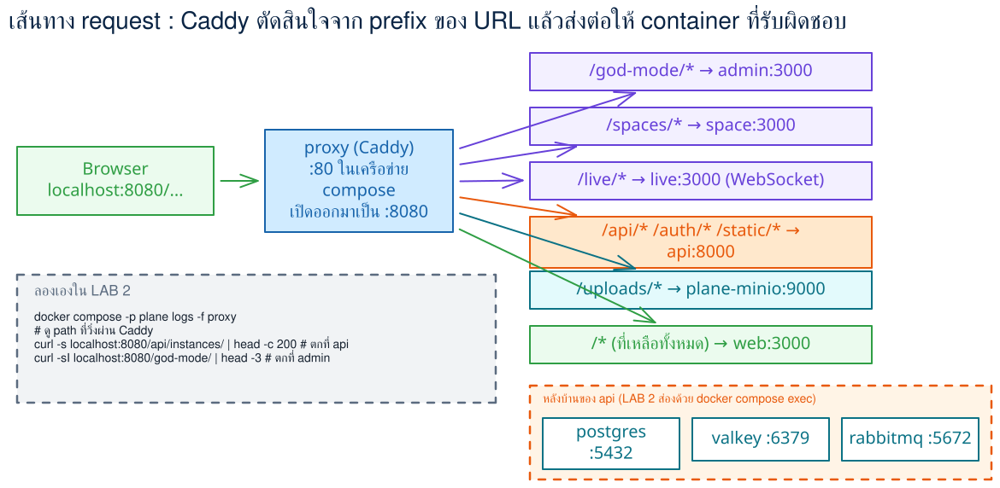

> **คำถามก่อนเริ่ม:** ถ้า `pc stop worker` แล้วไปกดเปลี่ยน state ของ work item ใน UI 5 ครั้ง — หน้าเว็บจะค้าง? จะ error? หรือจะปกติทุกอย่าง? แล้วงาน 5 ชิ้นนั้นไปอยู่ที่ไหน? ข้อ 6 จะให้คำตอบด้วย `rabbitmqctl` และกราฟใน Management UI

### Terminal Map

| หน้าต่าง | หน้าที่ | เปิดเมื่อใด |
|---|---|---|
| **T1** | คำสั่งหลักทุกข้อ (`pc`, `curl`, `psql`) | ใช้ตั้งแต่เริ่ม LAB |
| **T2** | `bash queue_watch.sh` — เฝ้าดู queue `celery` ทุก 2 วินาที | เปิดในข้อ 6 |
| **T3** | `pc logs -f worker` — ดู worker รับงาน | เปิดในข้อ 6 |

คำสั่งใน T2/T3 เป็น blocking (ค้างหน้าต่าง) — ปล่อยไว้แล้วสลับไป T1/เบราว์เซอร์ กด **Ctrl+C** เมื่อจบข้อ 6

---

## 0. เตรียมเครื่องเรียน

ทำบนเครื่องของเราเอง — เปิด container เรียนตัวเดิมจาก LAB 1 (Plane และ clone อยู่ในนั้นแล้ว)

```bash
docker start devtools 2>/dev/null || \
  docker run -dit --name devtools --privileged -p 2222:22 -p 8080:8080 tuchsanai/devtools:2569_1
ssh root@localhost -p 2222        # password : passwd
```

> 📝 **คำอธิบาย:** `docker start ... || docker run ...` เปิดเครื่องเรียนเดิมถ้ามี สร้างใหม่เฉพาะเมื่อยังไม่มี · `--privileged` จำเป็นเพราะ Plane ทั้ง 13 container รันด้วย Docker **ข้างใน** กล่องเรียน (Docker-in-Docker) · `-p 8080:8080` ให้เบราว์เซอร์บนเครื่องเราเห็น proxy ของ Plane ตรง ๆ (หรือใช้แท็บ **PORTS** ของ VS Code forward `8080` ก็ได้ — แต่ **port ต้องเป็น 8080** เพราะ `WEB_URL` ใน `plane.env` ถูกตั้งเป็น `http://localhost:8080` และ Plane สร้าง redirect หลัง login จากค่านี้)

> ⚠️ `--privileged` ใช้เฉพาะ disposable classroom container นี้ ไม่ใช่ค่าที่ควรใช้กับ production workload

> ใน VS Code ใช้ **Remote-SSH** ต่อไปที่ `root@localhost:2222` แล้วทำแล็บทั้งหมดข้างใน

เข้าโฟลเดอร์แล็บและเช็กว่า Plane จาก LAB 1 ยังอยู่ครบ :

```bash
cd ~/labwork/DevTools/03_Application_Docker/Plane/002_LAB_Architecture_Tour
pc ps --format 'table {{.Service}}\t{{.Status}}' | grep -c ' Up'
curl -s -o /dev/null -w '%{http_code}\n' http://localhost:8080/api/instances/
```

> 📝 **คำอธิบาย:** `pc` คือ helper จาก LAB 1 (`docker compose -f ~/plane-selfhost/docker-compose.yml --env-file ~/plane-selfhost/plane.env -p plane "$@"`) ใช้แทนการพิมพ์ compose ยาว ๆ ทุกครั้ง · ถ้าปิดเครื่องไปแล้ว Plane จะไม่ขึ้นเอง ให้ `pc start` แล้วรอ `/api/instances/` ตอบ `200` ก่อน (ราว 1–2 นาที) · ถ้าได้ `12` และ `200` แปลว่าพร้อม

✅ **Expected output** — 12 service `Up` และ readiness probe ตอบ 200:

```
12
200
```

---

## 1. แผนที่ container — ใครคือใคร

```bash
pc ps -a --format 'table {{.Service}}\t{{.Image}}\t{{.Status}}'
```

> 📝 **คำอธิบาย:** `-a` เอา container ที่จบไปแล้วมาด้วย (ไม่งั้น `migrator` จะหายจากตาราง) · `--format table …` เลือกเฉพาะคอลัมน์ที่ต้องอ่าน ·
> จุดที่ต้องดู: **`api` · `worker` · `beat-worker` · `migrator` ใช้ image `plane-backend` ตัวเดียวกัน** — เป็น Django โปรเจกต์เดียว แต่รันคนละ process · `migrator` ต้องเป็น `Exited (0)` (งานครั้งเดียว ทำ migration เสร็จแล้วจบ) · infra 4 ตัวเป็น image ทางการของ PostgreSQL/Valkey/RabbitMQ/MinIO ไม่ใช่ของ Plane

✅ **Expected output** — 12 `Up` + `migrator Exited (0)` (เวลาของแต่ละคนจะไม่ตรงกับเอกสารนี้):

```
SERVICE       IMAGE                               STATUS
admin         makeplane/plane-admin:v1.4.2        Up 2 minutes (healthy)
api           makeplane/plane-backend:v1.4.2      Up 2 minutes
beat-worker   makeplane/plane-backend:v1.4.2      Up 2 minutes
live          makeplane/plane-live:v1.4.2         Up 2 minutes
migrator      makeplane/plane-backend:v1.4.2      Exited (0) 51 seconds ago
plane-db      postgres:15.7-alpine                Up 2 minutes
plane-minio   minio/minio:latest                  Up 2 minutes
plane-mq      rabbitmq:3.13.6-management-alpine   Up 2 minutes
plane-redis   valkey/valkey:7.2.11-alpine         Up 2 minutes
proxy         makeplane/plane-proxy:v1.4.2        Up 2 minutes
space         makeplane/plane-space:v1.4.2        Up 2 minutes (healthy)
web           makeplane/plane-frontend:v1.4.2     Up 2 minutes (healthy)
worker        makeplane/plane-backend:v1.4.2      Up 2 minutes
```

image เดียวกันแต่ทำงานต่างกันได้อย่างไร? — ดูที่ `command` :

```bash
pc config | grep entrypoint
pc config --services | wc -l
pc config --volumes | wc -l
```

> 📝 **คำอธิบาย:** `pc config` ให้ compose พิมพ์ไฟล์ที่ *แปลงตัวแปรแล้ว* (ค่าใน `plane.env` ถูกแทนลงไป) จึงเห็นของจริงที่รัน · `grep entrypoint` ดึง 4 บรรทัด `./bin/docker-entrypoint-{api,beat,migrator,worker}.sh` — สคริปต์ 4 ตัวใน image เดียวกัน ตัวหนึ่งรัน gunicorn ตัวหนึ่งรัน `celery worker` ตัวหนึ่งรัน `celery beat` ตัวหนึ่งรัน `migrate` · `--services` นับได้ **13** และ `--volumes` **10** (pgdata · redisdata · rabbitmq_data · uploads · proxy_config · proxy_data · logs_api/worker/beat-worker/migrator) — ตัวเลขที่ต้องจำสำหรับ LAB นี้

✅ **Expected output**:

```
      - ./bin/docker-entrypoint-api.sh
      - ./bin/docker-entrypoint-beat.sh
      - ./bin/docker-entrypoint-migrator.sh
      - ./bin/docker-entrypoint-worker.sh
13
10
```

---

## 2. ไล่ request ผ่าน proxy — `trace_request.sh`

Caddy ใน container `proxy` ตัดสินใจจาก **path prefix** ว่า request ไปหาใคร แต่ **ไม่มี access log** ให้ดู — เราจึงพิสูจน์ปลายทางจาก "ลายเซ็น" ของ response แทน

```bash
cat trace_request.sh
bash trace_request.sh
```

> 📝 **คำอธิบาย:** สคริปต์ยิง `curl` 6 path แล้วพิมพ์ **status · Content-Type · 60 byte แรกของ body** · วิธีอ่าน: `text/html` + `<!DOCTYPE html>` = SPA จาก `web`/`admin`/`space` (ต่างกันที่ `charset=utf-8` ของ `space` ซึ่งเป็น SSR ด้วย Node) · `application/json` + `{"config":…` = Django `api` · `application/xml` + `<Error><Code>AccessDenied` = **MinIO** ตอบ (S3 ตอบ 403 แทน 404 เมื่อไม่ได้ login แม้ key จะไม่มีจริง) · `{"status":"OK","timestamp":…` = Express ใน `live` ·
> เทียบกับ Caddyfile จริงใน container (`pc exec -T proxy cat /etc/caddy/Caddyfile`) — 6 กลุ่ม route คือ

```
  redir /spaces /spaces/ permanent
  reverse_proxy /spaces/*   space:3000
  redir /god-mode /god-mode/ permanent
  reverse_proxy /god-mode/* admin:3000
  reverse_proxy /live/*     live:3000
  reverse_proxy /api/*      api:8000       # /auth/* และ /static/* ก็ไป api:8000
  reverse_proxy /{$BUCKET_NAME}/*  plane-minio:9000   # BUCKET_NAME=uploads
  reverse_proxy /*          web:3000       # catch-all ต้องอยู่ท้ายสุด
```

✅ **Expected output** — 6 แถว 4 ลายเซ็นต่างกัน (timestamp ของแต่ละคนจะไม่ตรงกับเอกสารนี้):

```
PATH                       CODE  CONTENT-TYPE                     FIRST 60 BYTES
----                       ----  ------------                     --------------
/                          200   text/html                        <!DOCTYPE html><html lang="en"><head><meta charSet="utf-8"/>
/god-mode/                 200   text/html                        <!DOCTYPE html><html lang="en"><head><meta charSet="utf-8"/>
/spaces/                   200   text/html; charset=utf-8         <!DOCTYPE html><html lang="en"><head><meta charSet="utf-8"/>
/api/instances/            200   application/json                 {"config":{"enable_signup":true,"is_workspace_creation_disab
/uploads/does-not-exist    403   application/xml                  <?xml version="1.0" encoding="UTF-8"?> <Error><Code>AccessDe
/live/health               200   application/json; charset=utf-8  {"status":"OK","timestamp":"2026-08-31T09:53:05.105Z","versi
```

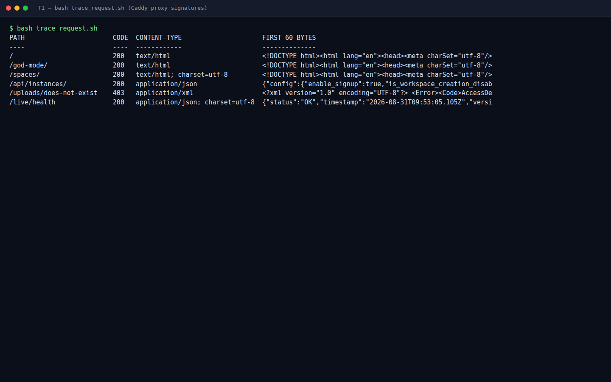

> **บทเรียนสำคัญ :** `/god-mode` (ไม่มี `/` ท้าย) ได้ **301** (`redir … permanent`) ไป `/god-mode/` ก่อน — ลอง `curl -s -o /dev/null -w '%{http_code}\n' localhost:8080/god-mode` ดู · การอ่านลายเซ็นของ response เป็นทักษะ debug ที่ใช้ได้ทุกครั้งที่ proxy ไม่มี log

---

## 3. สัญญาลำดับการบูต (ordering contract)

```bash
pc logs api | grep -E 'Waiting for|Instance registered|Bucket|Cache Cleared|static files|Listening at' | uniq -c
```

> 📝 **คำอธิบาย:** `uniq -c` ยุบบรรทัดซ้ำพร้อมนับ · ลำดับใน log = ลำดับใน `docker-entrypoint-api.sh`: รอ DB → **รอ migration ให้เสร็จ** (poll ทุก 10 วินาที — เห็น `Waiting for database migrations to complete...` 12 ครั้ง ≈ 2 นาที) → `register_instance` → สร้าง bucket `uploads` ใน MinIO → ล้าง cache ใน Valkey → `collectstatic` → **gunicorn `Listening at: http://0.0.0.0:8000`** ซึ่งเป็นจุดที่ `/api/instances/` เปลี่ยนจาก 502 เป็น 200 ใน LAB 1

✅ **Expected output** — จำนวนครั้งของ `Waiting for…` ต่างกันได้ แต่ **ลำดับ** ต้องเหมือนกัน:

```
      2 api-1  | Waiting for database...
     12 api-1  | Waiting for database migrations to complete...
      1 api-1  | Instance registered
      1 api-1  | Bucket 'uploads' does not exist. Creating bucket...
      1 api-1  | Bucket 'uploads' created successfully.
      1 api-1  | Cache Cleared
      1 api-1  | 35 static files copied to '/code/plane/static-assets/collected-static', 71 post-processed.
      1 api-1  | [2026-08-31 09:38:20 +0000] [1] [INFO] Listening at: http://0.0.0.0:8000 (1)
```

worker และ migrator เล่นตามสัญญาเดียวกัน :

```bash
pc logs worker | grep -E 'Waiting for|Database available|psycopg.OperationalError|Connected to' | head -6
pc logs migrator | tail -2
docker inspect -f '{{.Name}} restarts={{.RestartCount}} policy={{.HostConfig.RestartPolicy.Name}}' plane-worker-1 plane-migrator-1
```

> 📝 **คำอธิบาย:** worker พิมพ์ `Database available!` แล้ว **ล้มด้วย `OperationalError: Connection refused`** — เพราะ PostgreSQL image *restart ตัวเองหนึ่งครั้ง* หลัง init DB ครั้งแรก worker ที่ต่อติดพอดีจึงหลุด · แต่ compose ตั้ง `restart: always` ให้ทุก service — `RestartCount=1` คือหลักฐานว่า Docker เปิดใหม่ให้เอง รอบสองจึงเข้าสู่ `Waiting for database migrations to complete...` แล้วต่อ RabbitMQ สำเร็จ (`Connected to amqp://plane:**@plane-mq:5672/plane` — ดูด้วย `pc logs worker | grep 'Connected to'`) · migrator เป็น `on-failure` จบด้วย `Applying sessions.0001_initial... OK` แล้ว `Exited (0)` · นี่คือ "สัญญา" ที่ทำให้ `up -d` ครั้งเดียวเปิดได้ครบโดยไม่ต้องสั่งทีละตัว · หมายเหตุ: `RestartCount` ถูกรีเซ็ตเป็น 0 ทุกครั้งที่เรา `pc stop`/`pc start` เอง — ดูค่านี้ **ก่อน** ทำข้อ 6

✅ **Expected output** (บรรทัด traceback ถูกตัดออก · เลขต่าง ๆ ของแต่ละคนจะไม่ตรงกับเอกสารนี้):

```
worker-1  | Waiting for database...
worker-1  | Database available!
worker-1  | psycopg.OperationalError: connection failed: connection to server at "172.19.0.5", port 5432 failed: Connection refused
worker-1  | Waiting for database...
worker-1  | Database available!
worker-1  | Waiting for database migrations to complete...
migrator-1  |   Applying sessions.0001_initial... OK
/plane-worker-1 restarts=1 policy=always
/plane-migrator-1 restarts=1 policy=on-failure
```

worker พร้อมทำงานอะไรบ้าง? — ถาม Celery ตรง ๆ :

```bash
pc exec -T worker celery -A plane inspect registered | grep -c 'plane\.'
pc exec -T worker celery -A plane inspect registered | grep 'plane\.' | head -5
```

> 📝 **คำอธิบาย:** `inspect registered` ส่งข้อความผ่าน RabbitMQ ไปถาม worker ทุกตัวว่าลงทะเบียน task อะไรไว้ (ต้องมี broker ทำงานจึงตอบได้) · ชื่อ task = path ของฟังก์ชัน Python ใน `plane/bgtasks/` · ตัวเลข **46** คือจำนวนงานเบื้องหลังทั้งหมดที่ Plane รุ่นนี้มี — activity, notification, webhook, export, cleanup ฯลฯ

✅ **Expected output**:

```
46
    * plane.bgtasks.analytic_plot_export.analytic_export_task
    * plane.bgtasks.analytic_plot_export.export_analytics_to_csv_email
    * plane.bgtasks.cleanup_task.delete_api_logs
    * plane.bgtasks.cleanup_task.delete_email_notification_logs
    * plane.bgtasks.cleanup_task.delete_issue_description_versions
```

---

## 4. PostgreSQL tour — `sql_tour.sql`

```bash
cat sql_tour.sql
pc exec -T -e PGPASSWORD=plane plane-db psql -U plane -d plane -f - < sql_tour.sql
```

> 📝 **คำอธิบาย:** `pc exec -T plane-db psql` รัน psql **ข้างใน** container ของ PostgreSQL · ต้องใส่ `-e PGPASSWORD=plane` เพราะ image ตั้ง `PGHOST=plane-db` ไว้ psql จึงต่อผ่าน TCP (ต้องใช้รหัสผ่าน) ไม่ใช่ unix socket และ `-T` ปิด TTY เพื่อให้ `< sql_tour.sql` ป้อนไฟล์เข้า stdin ได้ · สคริปต์มี 5 ตอน — ดูทีละตอน:
> **1)** `information_schema.tables` = 110 ตาราง ที่ migrator สร้าง · **2)** `states` ของ PLAB มี **6 แถว** ทั้งที่หน้า Settings → States แสดง 5 — แถว `Triage` (group `triage`, sequence 65000) ถูก manager ปกติซ่อนไว้ใช้กับ Intake (LAB 5) · **3)** ตอนนี้มี 3 item จาก LAB 1 และ ledger `issue_sequences` 3 แถว — เดี๋ยวจะกลับมาดูหลังแก้ใน UI · **4)** ค่าตั้งค่า instance อยู่ใน **DB** (`instance_configurations`) ไม่ใช่ `plane.env` (`SKIP_ENV_VAR=1`) — `ENABLE_SIGNUP=1`, `EMAIL_HOST` ว่าง = ไม่มี SMTP · **5)** ตาราง `django_celery_beat_periodictask` คือ **ตารางเวลาของ beat-worker** ที่คัดลอกมาจาก `celery.py` — `total_run_count` ยัง 0 เพราะงานประจำวันรันเที่ยงคืน UTC

✅ **Expected output** — ตอน 1, 2, 4 (ตอน 3 และ 5 ยาว ดูในเทอร์มินัลของตนเอง):

```
== 1) how many tables did the migrator create?
 tables
--------
    110
== 2) the 6 states of project PLAB (Triage is hidden from the UI)
    name     |   group   | sequence | default | is_triage
-------------+-----------+----------+---------+-----------
 Backlog     | backlog   |    15000 | t       | f
 Todo        | unstarted |    25000 | f       | f
 In Progress | started   |    35000 | f       | f
 Done        | completed |    45000 | f       | f
 Cancelled   | cancelled |    55000 | f       | f
 Triage      | triage    |    65000 | f       | f
(6 rows)
== 4) instance configuration lives in the DB, not in plane.env (SKIP_ENV_VAR=1)
           key           | value
-------------------------+-------
 EMAIL_HOST              |
 ENABLE_EMAIL_PASSWORD   | 1
 ENABLE_MAGIC_LINK_LOGIN | 0
 ENABLE_SIGNUP           | 1
 ENABLE_SMTP             | 0
```

### เลข PLAB-N ไม่เคยถูกใช้ซ้ำ — ทดลองใน UI

เปิด `http://localhost:8080` → โปรเจกต์ **Plane Lab** → **Work items** แล้วทำตามลำดับ (เรื่องราว CampusEats) :

1. กด **Add work item** → Title `ออกแบบหน้าเมนูร้านอาหาร CampusEats` → **Save** (ได้ **PLAB-4**)
2. **Add work item** → `ทดสอบตะกร้าสั่งอาหาร (cart)` → **Save** (**PLAB-5**)
3. **Add work item** → `ตั้งค่า payment sandbox` → **Save** (**PLAB-6**)
4. เปิด **PLAB-5** → ปุ่ม **⋯** มุมขวาบน → **Delete** → ยืนยัน **Delete** ในกล่อง *"Are you sure you want to delete work item PLAB-5 ?"*
5. **Add work item** อีกครั้ง → `เชื่อม LINE Notify แจ้งเตือนออเดอร์ใหม่` → **Save** — ทายก่อน: จะได้เลข **5** หรือ **7**?

```bash
pc exec -T -e PGPASSWORD=plane plane-db psql -U plane -d plane -f - < sql_tour.sql | sed -n '/== 3)/,/== 4)/p'
```

> 📝 **คำอธิบาย:** `sed -n '/== 3)/,/== 4)/p'` ตัดมาเฉพาะตอน 3 · item ใหม่ได้ **PLAB-7** ไม่ใช่ 5 · แถว 5 ใน `issues` ยังอยู่แต่มี `deleted_at` (**soft delete** — worker ค่อยลบจริงหลัง 60 วันด้วย task `hard_delete`) และใน `issue_sequences` เลข 5 ยังอยู่ใน ledger (`issue_still_linked = f`) · เหตุผลเชิงวิศวกรรม: เลขงานคือ *identifier ที่คนอ้างถึงใน commit/แชต/เอกสาร* ถ้าเอากลับมาใช้ใหม่ traceability พัง — LAB 3 จะย้ำเรื่องนี้

✅ **Expected output** — 7 แถว แถว 5 มี `deleted_at`, ledger มี 7 เลข (ชื่อ item ของแต่ละคนอาจต่างกัน):

```
 PLAB-N |               name                |    state    | completed_at |          deleted_at
--------+-----------------------------------+-------------+--------------+-------------------------------
      1 | ตั้งค่า Plane self-host ในเครื่องเรียน  | In Progress |              |
      2 | เขียน README ของ LAB ให้ผู้เรียน       | Todo        |              |
      3 | ตรวจว่า 13 container ทำงานครบ      | Todo        |              |
      4 | ออกแบบหน้าเมนูร้านอาหาร CampusEats   | Backlog     |              |
      5 | ทดสอบตะกร้าสั่งอาหาร (cart)          | Backlog     |              | 2026-08-31 09:43:45.930304+00
      6 | ตั้งค่า payment sandbox              | Backlog     |              |
      7 | เชื่อม LINE Notify แจ้งเตือนออเดอร์ใหม่ | Backlog     |              |
(7 rows)

 sequence | deleted | issue_still_linked
----------+---------+--------------------
        1 | f       | t
        ... (2–4, 6, 7 = t) ...
        5 | f       | f
(7 rows)
```

### `completed_at` — ตัวเลขที่ burndown ใช้

ในหน้า **Work items** คลิกป้าย state **In Progress** ของ **PLAB-1** → เลือก **Done** แล้วถาม DB :

```bash
pc exec -T -e PGPASSWORD=plane plane-db psql -U plane -d plane -c \
  "SELECT sequence_id AS plab, completed_at FROM issues WHERE sequence_id=1 AND project_id=(SELECT id FROM projects WHERE identifier='PLAB');"
```

> 📝 **คำอธิบาย:** Plane ไม่ได้ให้ผู้ใช้กรอกวันเสร็จ — โมเดล `Issue` ตั้ง `completed_at = now()` อัตโนมัติเมื่อ state ใหม่อยู่ใน group `completed` และ **ล้างเป็น NULL** เมื่อย้ายออก · **burndown ของ Cycle (LAB 4) นับงานที่ `completed_at <= วันนั้น`** ไม่ได้ไล่อ่านประวัติ state ทั้งหมด — จึงเข้าใจได้ว่าทำไมการ "ย้ายกลับ" ทำให้กราฟเด้งขึ้น

✅ **Expected output** — มี timestamp:

```
 plab |         completed_at
------+-------------------------------
    1 | 2026-08-31 09:44:13.839998+00
```

ย้าย **PLAB-1** กลับเป็น **In Progress** แล้วรันคำสั่งเดิม — `completed_at` ต้องกลับเป็นค่าว่าง:

```
 plab | completed_at
------+--------------
    1 |
```

---

## 5. Valkey — cache ไม่ใช่ queue

```bash
bash valkey_tour.sh
```

> 📝 **คำอธิบาย:** สคริปต์เรียก `valkey-cli` ใน container `plane-redis` (ชื่อ service ยังเป็น "redis" แต่ image คือ **Valkey** — fork ของ Redis ที่ license เปิดกว่า) · จุดที่ต้องดู: มี key แค่ **หลักหน่วย** และ **ทุกตัวมี TTL** — `:1:/api/instances/` คือ Django cache ของ readiness endpoint (หมดอายุใน ~2 ชม.) ส่วน key ที่เป็น UUID คือ id ของ work item ที่ `issue_activity` เก็บ **origin ของ request** ไว้ 600 วินาทีเพื่อสร้างลิงก์ในอีเมลแจ้งเตือน (ค่า = `http://localhost:8080`) · `magic_*` = 0 เพราะ magic-code login ต้องมี SMTP · ไม่มี list/stream ยาว ๆ — **งานไม่ได้อยู่ที่นี่** (อยู่ใน RabbitMQ ข้อ 6) · ตัวสคริปต์ใส่ `</dev/null` ทุกครั้งที่เรียก `pc exec -T` เพราะ compose exec จะ "กิน" stdin ทำให้ loop อ่าน key หยุดหลังตัวแรก

✅ **Expected output** — จำนวน key/UUID/TTL ของแต่ละคนจะไม่ตรงกับเอกสารนี้ แต่ต้องมี `:1:/api/instances/` และ `magic_*` = 0:

```
== server
redis_version:7.2.4
valkey_version:7.2.11
uptime_in_seconds:262
== how many keys?
4
== every key: type · TTL (seconds, -1 = never expires) · size
f2753a9e-d4f8-48b9-b27a-7ddd4d2b7320          string  ttl=510    112 bytes
b1d4d34d-f3e8-4983-8207-6259eec0698e          string  ttl=510    112 bytes
:1:/api/instances/                            string  ttl=7101   1344 bytes
56b64b5a-3755-4e97-bdaa-540b4d5aff4c          string  ttl=510    112 bytes
== value of a UUID key (issue_activity stores the request origin for 600 s)
http://localhost:8080
== magic-link codes? (need SMTP → expected 0)
0
```

---

## 6. RabbitMQ + backpressure — หยุด worker แล้วดูงานกอง

### 6.1 ดูโครงสร้างก่อน

```bash
pc exec -T plane-mq rabbitmqctl list_queues -p plane name messages consumers
pc exec -T plane-mq rabbitmqctl list_bindings -p plane | grep -E '^celery\s+exchange'
```

> 📝 **คำอธิบาย:** **`-p plane` บังคับ** — Plane สร้าง vhost ชื่อ `plane` (user/pass `plane` จาก `plane.env`) ถ้าลืม จะได้ `Virtual host '/' does not exist` · queue สำคัญคือ **`celery`** (`messages 0 · consumers 1` = ว่างและมี worker รอรับอยู่ 1 ตัว) · อีกสองตัวชื่อ `celeryev.*` (event) และ `celery@<host>.celery.pidbox` (remote control — `inspect registered` ในข้อ 3 วิ่งทางนี้) เป็น auto-delete จะหายเมื่อ worker หยุด · binding `celery exchange → celery queue` routing key `celery` = direct exchange ตรงตัว เหมือน `send.py` ใน LAB RabbitMQ ที่ใช้ default exchange

✅ **Expected output** (`<container-id>` = 12 ตัวอักษรแรกของ container id ของ worker และ uuid ของ `celeryev.*` — ของแต่ละคนจะไม่ตรงกับเอกสารนี้):

```
Timeout: 60.0 seconds ...
Listing queues for vhost plane ...
name	messages	consumers
celeryev.baefa77b-bce7-4f8f-83b5-477899c47545	0	1
celery@<container-id>.celery.pidbox	0	1
celery	0	1
celery	exchange	celery	queue	celery	[]
```

### 6.2 เปิดหน้าต่างเฝ้าดู แล้วหยุด worker

**T2** — เฝ้าดู queue ทุก 2 วินาที (ค้างไว้):

```bash
cd ~/labwork/DevTools/03_Application_Docker/Plane/002_LAB_Architecture_Tour && bash queue_watch.sh
```

**T3** — ดู worker รับงาน (ค้างไว้):

```bash
pc logs -f --tail 3 worker
```

**T1** — หยุด worker:

```bash
pc stop worker
pc ps -a --format '{{.Service}} {{.Status}}' | grep '^worker'
```

> 📝 **คำอธิบาย:** `pc stop` ส่ง SIGTERM ให้ Celery ทำ *warm shutdown* ถ้าเกิน 10 วินาที compose ส่ง SIGKILL → เห็น `Exited (137)` ซึ่ง **ปกติ** สำหรับการหยุดด้วยมือ · ทันทีที่ worker หาย T2 จะเหลือ queue `celery` ตัวเดียว `consumers 0` (queue อีกสองตัวถูกลบอัตโนมัติ)

✅ **Expected output** (T1):

```
 Container plane-worker-1 Stopping
 Container plane-worker-1 Stopped
worker Exited (137) 5 seconds ago
```

### 6.3 ทำงานใน UI ตามปกติ 5 ครั้ง — สังเกตว่าหน้าเว็บ *ไม่รู้สึกอะไรเลย*

ในหน้า **Work items** (List layout) คลิกป้าย state ของแต่ละแถวแล้วเลือกใหม่ :

| ครั้งที่ | work item | จาก | เป็น |
|---|---|---|---|
| 1 | PLAB-4 | Backlog | **Todo** |
| 2 | PLAB-6 | Backlog | **Todo** |
| 3 | PLAB-7 | Backlog | **In Progress** |
| 4 | PLAB-2 | Todo | **In Progress** |
| 5 | PLAB-3 | Todo | **Done** |

> 📝 **คำอธิบาย:** ทุกครั้ง UI เปลี่ยนสีป้ายทันทีและไม่มี error — เพราะ `PATCH /api/.../issues/<id>/` เขียน `issues` ใน PostgreSQL แล้วตอบกลับเลย ส่วนงานตามหลัง (บันทึก activity · แจ้งเตือน · webhook · version history · recent-visited) ถูก **publish เข้า RabbitMQ** โดยไม่สนว่ามี consumer หรือไม่ · มองที่ T2: `celery` ขยับจาก 0 → **27** (1 ครั้ง ≈ 5 task + การเปิดหน้าอีกไม่กี่ task) · T3 เงียบสนิท

✅ **Expected output** (T2 — ตัวเลขของแต่ละคนจะไม่ตรงกับเอกสารนี้ แต่ต้อง **โตขึ้น** และ `consumers 0`):

```
== 16:46:29  rabbitmqctl list_queues -p plane   (Ctrl+C to stop)
name	messages	consumers
celery	27	0
```

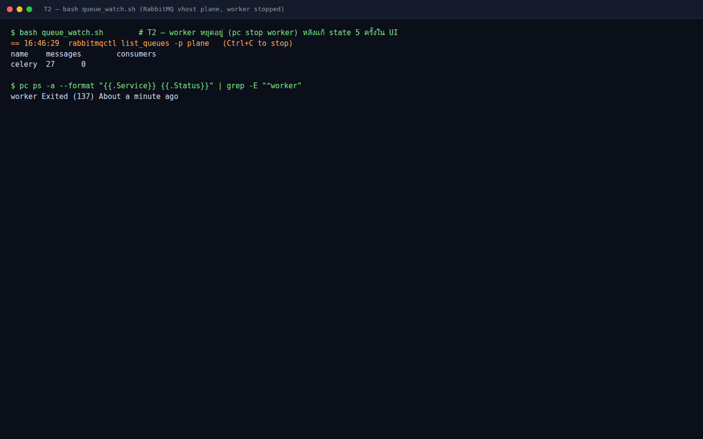

### 6.4 เปิด Management UI ดูกราฟ (bridge port 15672)

Plane **ไม่ได้เปิด port 15672** ของ RabbitMQ ออกมา — เราเปิด "สะพาน" เล็ก ๆ ด้วย `socat` แทน (ไม่แก้ compose ของ Plane):

```bash
cat mq_ui_bridge.sh
bash mq_ui_bridge.sh
```

> 📝 **คำอธิบาย:** `docker run … --network plane_default` เอา container `mq-ui` ไปอยู่ network เดียวกับ Plane จึงเรียกชื่อ `plane-mq` ได้ · `-p 15672:15672` เปิดออกมาที่เครื่องเรียน · `alpine/socat:1.8.0.0 TCP-LISTEN:15672,fork,reuseaddr TCP:plane-mq:15672` = รับทุก connection แล้วส่งต่อ · จากนั้นใน VS Code แท็บ **PORTS** → **Forward a Port** → `15672` → เปิด `http://localhost:15672` login **plane / plane** (ค่า LAB จาก `plane.env`)

✅ **Expected output**:

```
<container id ยาว 64 ตัวอักษร>
mq-ui bridge up → forward 15672 and open http://localhost:15672  (plane / plane)
```

ในเบราว์เซอร์ → แท็บ **Queues and Streams** เห็น `celery` · Ready **27** · State running แต่ไม่มี consumer :

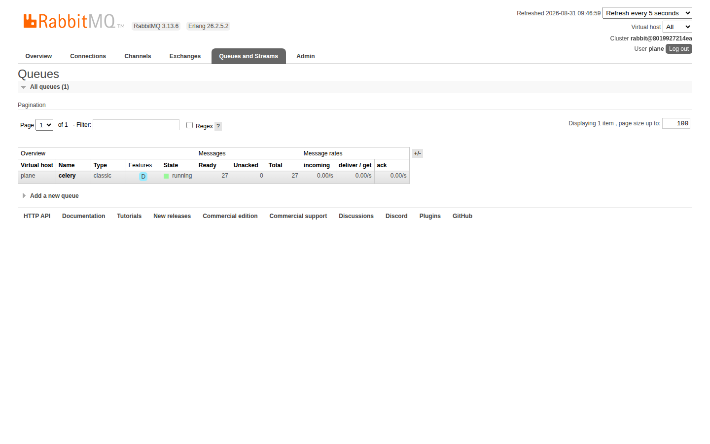

คลิกชื่อ **celery** เข้าไปหน้า *Queue celery* ปล่อยไว้ (refresh ทุก 5 วินาที) แล้วกลับไป T1

### 6.5 เปิด worker — ดู queue ระบาย (WOW)

```bash
pc start worker
```

> 📝 **คำอธิบาย:** worker เปิดใหม่ → `wait_for_db` → `wait_for_migrations` (ผ่านทันทีเพราะไม่มี migration ค้าง) → ต่อ RabbitMQ → **ดูดงานทั้ง 27 ชิ้นภายในวินาทีเดียว** (T3 พิมพ์ `Task … received` รัว ๆ, T2 กลับเป็น `celery 0 1`) · กราฟ *Queued messages* ในหน้า Queue celery เป็นเส้นราบที่ 27 แล้วดิ่งลง 0 ตอนที่ consumer ปรากฏ · ใช้เวลาราว 15 วินาทีหลัง `start` (เป็นเวลาบูตของ Celery ไม่ใช่เวลาทำงาน)

✅ **Expected output** (T3 — ตัดมาบางส่วน):

```
[2026-08-31 09:47:14,304: INFO/MainProcess] Connected to amqp://plane:**@plane-mq:5672/plane
[2026-08-31 09:47:15,357: INFO/MainProcess] Task plane.bgtasks.email_notification_task.stack_email_notification[52e27a4e-…] received
[2026-08-31 09:47:15,358: INFO/MainProcess] Task plane.bgtasks.recent_visited_task.recent_visited_task[17ceb90c-…] received
[2026-08-31 09:47:15,360: INFO/MainProcess] Task plane.bgtasks.issue_activities_task.issue_activity[347918d0-…] received
[2026-08-31 09:47:15,360: INFO/MainProcess] Task plane.bgtasks.webhook_task.model_activity[8ddb7492-…] received
[2026-08-31 09:47:15,361: INFO/MainProcess] Task plane.bgtasks.issue_description_version_task.issue_description_version_task[…] received
        ... (received รวม 27 บรรทัดในวินาทีเดียว) ...
```

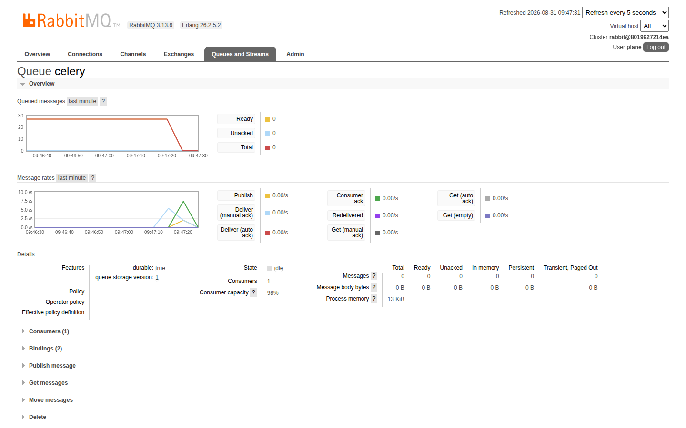

นับให้ชัดว่างานอะไรบ้างที่รอในคิว (ตั้งแต่ worker กลับมา):

```bash
pc logs worker | grep -v levelname | grep -oE 'Task plane\.[a-zA-Z_.]+' | sort | uniq -c | sort -rn | head -6
```

✅ **Expected output** — ทุกการเปลี่ยน state จุด task ~5 ชนิด (ตัวเลขของแต่ละคนจะไม่ตรงกับเอกสารนี้):

```
     17 Task plane.bgtasks.recent_visited_task.recent_visited_task
      6 Task plane.bgtasks.notification_task.notifications
      6 Task plane.bgtasks.issue_activities_task.issue_activity
      5 Task plane.bgtasks.webhook_task.webhook_activity
      5 Task plane.bgtasks.webhook_task.model_activity
      5 Task plane.bgtasks.issue_description_version_task.issue_description_version_task
```

เปิด **PLAB-3** ในเบราว์เซอร์ — ส่วน **Activity** มี *"admin set the state to Done"* ซึ่ง **เพิ่งโผล่ตอนนี้** (ตอน worker หยุด แถวนี้ยังไม่มี แม้ state จะเปลี่ยนไปแล้ว):

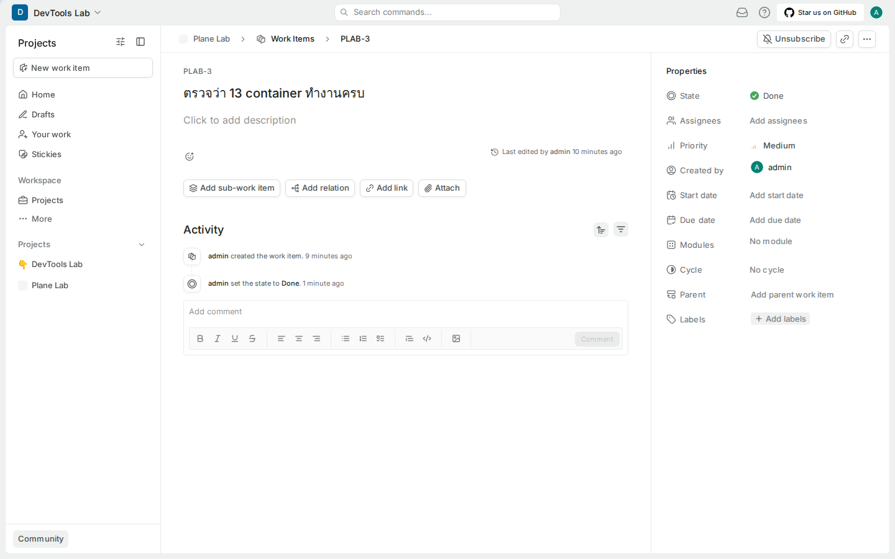

ปิดท้ายด้วยการดู DB อีกมุม — กลับไป **T1** รัน `sql_tour.sql` เฉพาะตอน 2–3 อีกครั้ง :

```bash
pc exec -T -e PGPASSWORD=plane plane-db psql -U plane -d plane -f - < sql_tour.sql | sed -n '/== 2)/,/== 4)/p'
```

> 📝 **คำอธิบาย:** แถวใน `issues` สะท้อนการคลิก 5 ครั้งของข้อ 6.3 ครบ — **PLAB-4/6 = Todo · PLAB-2/7 = In Progress · PLAB-3 = Done พร้อม `completed_at`** — และค่าพวกนี้ถูกเขียน **ตั้งแต่ตอนคลิก** (api เขียน DB โดยตรง) ไม่ใช่ตอน worker ระบายคิว · ส่วนที่ worker เพิ่งทำคือแถวใน `issue_activities` (Activity ด้านบน) · `states` ยัง 6 แถว และ ledger `issue_sequences` ยัง 7 เลข — การเปลี่ยน state ไม่แตะสองตารางนี้

✅ **Expected output** — state ของ PLAB-2/3/4/6/7 ตรงตามตาราง 6.3 และ PLAB-3 มี `completed_at` (timestamp ของแต่ละคนจะไม่ตรงกับเอกสารนี้):

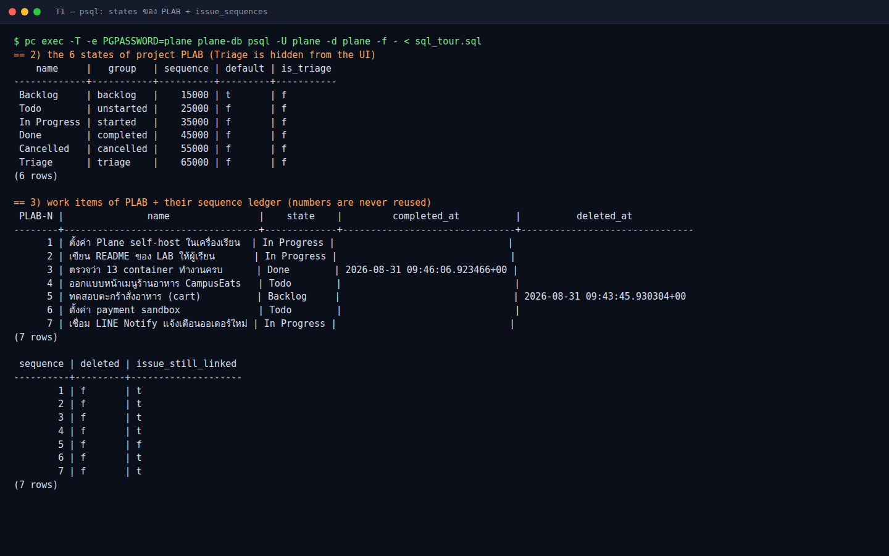

> **สรุปภาพที่เพิ่งเห็น :** api เขียน DB แล้วตอบทันที · งานตามหลังไปกองใน queue · worker ตายไปครึ่งชั่วโมงก็ไม่มีใครรู้จนกว่าจะสังเกตว่า activity/notification ไม่มา · เปิด worker กลับมางานทุกชิ้นถูกทำครบ — นี่คือคุณค่าของ **durable queue** และเป็นเหตุผลที่ระบบจริงต้อง **monitor ความยาว queue**

กด **Ctrl+C** ปิด T2 และ T3 ได้แล้ว

---

## 7. MinIO — ไฟล์แนบไม่ผ่าน api

เปิดเบราว์เซอร์ที่ **PLAB-1** → กด **F12** เปิด DevTools → แท็บ **Network** → กรอง **Fetch/XHR** → กดปุ่ม **Attach** ใต้ชื่องาน → เลือกรูปเล็ก ๆ 1 ไฟล์ (เช่น `campuseats-menu-mockup.png` ขนาดไม่กี่ KB)

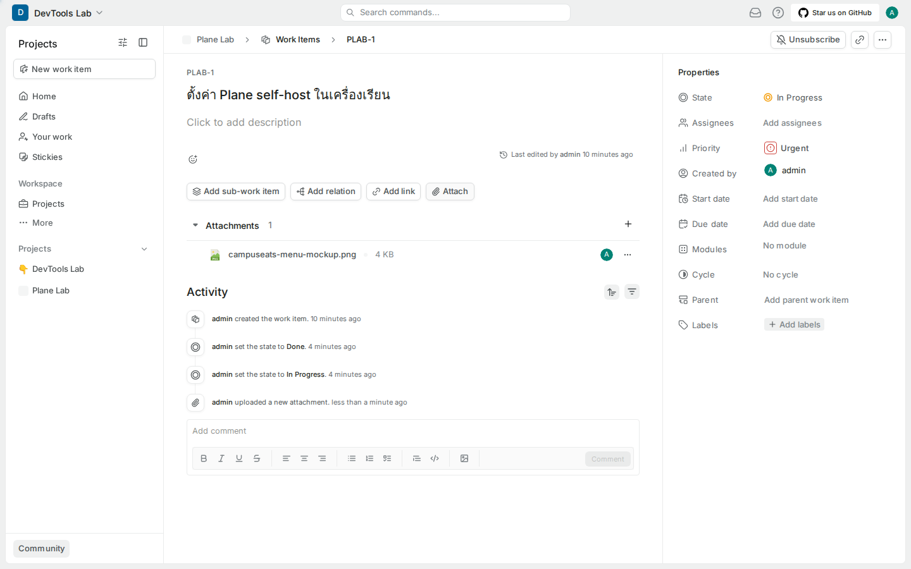

> 📝 **คำอธิบาย:** ใน Network จะเห็น **3 request เรียงกัน**: **(1)** `POST /api/assets/v2/…/attachments/` ส่งแค่ `{"name","size","type"}` → api สร้างแถวใน `file_assets` และตอบ **presigned POST** (URL + ลายเซ็นชั่วคราว) · **(2)** `POST /uploads` **204** — เบราว์เซอร์ส่ง *ตัวไฟล์* ไปที่ `http://localhost:8080/uploads` ซึ่ง Caddy ส่งต่อไป `plane-minio:9000` (route `/{$BUCKET_NAME}/*` ในข้อ 2) — **Django ไม่เคยแตะไฟล์** · **(3)** `PATCH …/attachments/<id>/` บอก api ว่าอัปโหลดเสร็จ (`is_uploaded=true`) แล้ว worker รัน `get_asset_object_metadata` ไป `HEAD` object เก็บ content-type · api สร้าง presigned URL ด้วย host ของ request (`localhost:8080`) นี่คืออีกเหตุผลที่ `WEB_URL`/port ต้องตรงกับที่เบราว์เซอร์ใช้

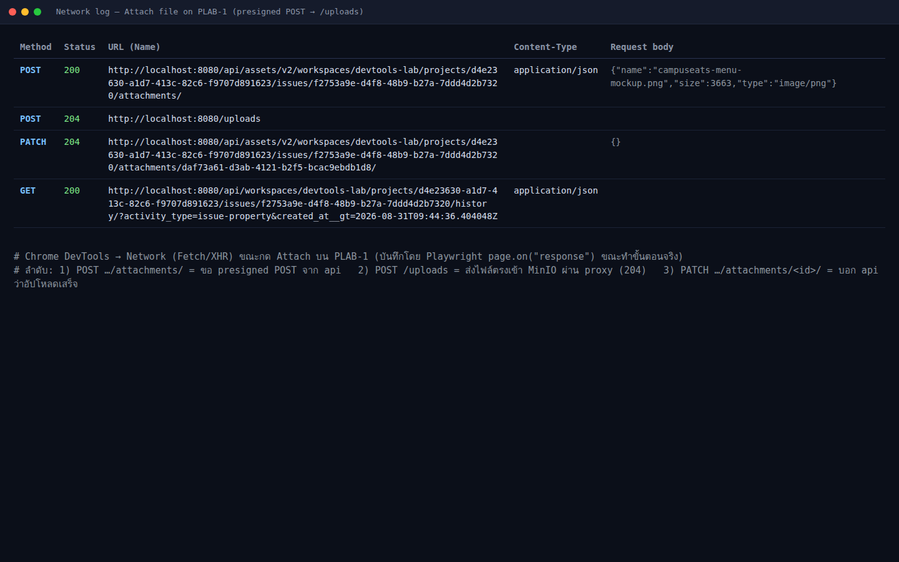

พิสูจน์จากอีกสองมุม — ไฟล์ใน volume และแถวใน DB :

```bash
pc exec -T plane-minio ls -R /export/uploads | head
pc exec -T -e PGPASSWORD=plane plane-db psql -U plane -d plane -c \
  "SELECT entity_type, asset, size, is_uploaded, storage_metadata->>'ContentType' AS content_type FROM file_assets ORDER BY created_at DESC LIMIT 3;"
```

> 📝 **คำอธิบาย:** MinIO เก็บ object ไว้ใน volume `uploads` ที่ path `/export/<bucket>/<workspace_id>/<uuid>-<ชื่อไฟล์>` (ข้างในเป็นโฟลเดอร์ที่มี `xl.meta` — รูปแบบภายในของ MinIO ไม่ใช่ไฟล์ตรง ๆ) · ตาราง `file_assets` เป็นตาราง **polymorphic** — `entity_type` บอกว่าเป็น `ISSUE_ATTACHMENT` / `PAGE_DESCRIPTION` / `USER_AVATAR` ฯลฯ และ `asset` คือ key ใน bucket

✅ **Expected output** (uuid ของแต่ละคนจะไม่ตรงกับเอกสารนี้):

```
/export/uploads:
cc075e0f-df45-4ed4-b00a-38a4a675855e

/export/uploads/cc075e0f-df45-4ed4-b00a-38a4a675855e:
a654f48521604d5bb1fe787e1a507f7c-campuseats-menu-mockup.png

/export/uploads/cc075e0f-df45-4ed4-b00a-38a4a675855e/a654f48521604d5bb1fe787e1a507f7c-campuseats-menu-mockup.png:
xl.meta
   entity_type    |                                              asset                                               | size | is_uploaded | content_type
------------------+--------------------------------------------------------------------------------------------------+------+-------------+--------------
 ISSUE_ATTACHMENT | cc075e0f-df45-4ed4-b00a-38a4a675855e/a654f48521604d5bb1fe787e1a507f7c-campuseats-menu-mockup.png | 3663 | t           | image/png
(1 row)
```

เปิด MinIO console ผ่าน bridge เหมือนข้อ 6.4 :

```bash
bash minio_ui_bridge.sh
```

> 📝 **คำอธิบาย:** MinIO เปิด 2 port — `9000` = S3 API (ที่ proxy ใช้) และ `9090` = console สำหรับคน · bridge นี้ส่ง `9090` ออกมา → แท็บ **PORTS** forward `9090` → เปิด `http://localhost:9090` → login **access-key / secret-key** (ค่า `AWS_ACCESS_KEY_ID`/`AWS_SECRET_ACCESS_KEY` ใน `plane.env` — LAB เท่านั้น งานจริงต้องเปลี่ยน) → กด **Acknowledge** ในหน้าต่าง License → **Object Browser** → bucket **uploads** → คลิกโฟลเดอร์ `<workspace_id>` เห็นไฟล์ที่เพิ่งแนบ

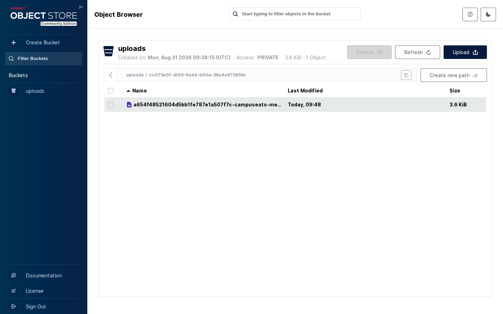

---

## 8. live — Page สองแท็บ sync ทันที

ใน sidebar ของโปรเจกต์ **Plane Lab** → **Pages** → **Add page** → พิมพ์ชื่อ **Live test** → พิมพ์ในเนื้อหา `บรรทัดที่ 1 — พิมพ์ใน tab A ก่อนเปิด tab B` → รอราว 10 วินาที → คัดลอก URL ไปเปิดใน **แท็บที่สอง** (หรือ Ctrl+คลิกชื่อ page ในรายการ) → กลับมาแท็บแรก กด Enter แล้วพิมพ์ `บรรทัดที่ 2 — พิมพ์ตอนที่ tab B เปิดอยู่ …` → มองแท็บที่สอง

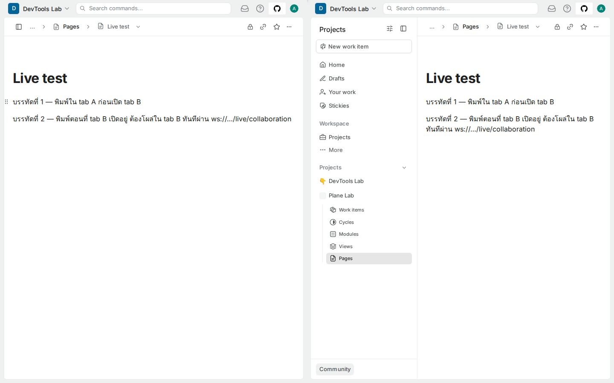

> 📝 **คำอธิบาย:** ใน DevTools → **Network** → กรอง **WS** เห็น `collaboration?documentType=project_page&projectId=…&workspaceSlug=devtools-lab` สถานะ **101 Switching Protocols** — นี่คือ WebSocket ที่ proxy ส่งต่อไป `live:3000` (route `/live/*`) · ทั้งสองแท็บต่อ Hocuspocus ตัวเดียวกัน แก้ไขถูก merge แบบ CRDT (Yjs) จึงไม่มีใครทับใคร · live ไม่เขียน DB เอง แต่เรียก api (`/api/…/pages/<id>/description/`) ทุก ~10 วินาที (debounce) และใช้ Valkey เป็น pub/sub ถ้ามีหลาย replica · ที่ต้องรอ 10 วินาทีก่อนเปิดแท็บสองในการทดลองก็เพื่อให้เอกสารถูกบันทึกรอบแรกก่อน

ยืนยันจาก CLI :

```bash
curl -s localhost:8080/live/health; echo
curl -s -o /dev/null -w '%{http_code}\n' -H 'Connection: Upgrade' -H 'Upgrade: websocket' \
  -H 'Sec-WebSocket-Version: 13' -H 'Sec-WebSocket-Key: dGhlIHNhbXBsZSBub25jZQ==' --max-time 5 \
  http://localhost:8080/live/collaboration
pc logs live --tail 4 | cut -c1-120
```

> 📝 **คำอธิบาย:** `/live/health` เป็น endpoint ของ Express ใน container live · คำสั่งที่สองส่ง header ขอ upgrade เป็น WebSocket ด้วยมือ — proxy ตอบ **101** แปลว่า Caddy ส่งต่อ WebSocket ได้ (reverse_proxy รองรับอัตโนมัติ) · log ของ live แสดง `New connection to "<page_id>"` / `Store "<page_id>"` ตอนที่เราพิมพ์

✅ **Expected output** (timestamp/page id ของแต่ละคนจะไม่ตรงกับเอกสารนี้):

```
{"status":"OK","timestamp":"2026-08-31T09:50:53.506Z","version":"1.0.0"}
101
live-1  | {"level":"info","message":"[a9d99b768b65 2026-08-31T09:50:46.109Z] New connection to \"bbb77e62-b661-4ec5-8875-d3644b93d056\".",…
live-1  | {"level":"info","message":"[a9d99b768b65 2026-08-31T09:50:53.236Z] Store \"bbb77e62-b661-4ec5-8875-d3644b93d056\".",…
```

---

## 9. ตรวจหลักฐานทั้งหมด — `check_lab02.sh`

```bash
bash check_lab02.sh
```

> 📝 **คำอธิบาย:** สคริปต์ตรวจซ้ำทุกข้อในแล็บโดยไม่แก้อะไร: 12 service Up + migrator `Exited (0)` · ลายเซ็นของ `/api/instances/`, `/live/health`, `/uploads/…` (XML ของ S3) · queue `celery` มี consumer (worker ต้องกลับมาแล้ว) · PLAB มี 6 state · `issue_sequences` ≥ 4 แถวและมีเลขที่ถูกลบ · มี `ISSUE_ATTACHMENT` ที่ `is_uploaded` · มี page ชื่อ `Live test` · ถ้าตกข้อไหนจะพิมพ์ `FAIL: …` บอกสาเหตุ

✅ **Expected output** — บรรทัดเดียวขึ้นต้นด้วย `PASS:` (ตัวเลข sequences/attachments ของแต่ละคนอาจต่างกัน):

```
PASS: lab02 — 12 services Up, migrator Exited (0), proxy routes OK, worker consuming 'celery', PLAB states=6, sequences=7 (deleted=1), attachments=1, live page OK
```

---

## ทดลองเพิ่มเติม

### ก. หยุด Valkey — endpoint ที่พึ่ง cache ล้มทันที แต่ข้อมูลไม่หาย

```bash
pc stop plane-redis
curl -s -o /dev/null -w '/api/instances/ → %{http_code}\n' localhost:8080/api/instances/
pc logs api --tail 20 | grep -oE '"message": "[^"]*plane-redis[^"]*"' | tail -2
pc logs live --tail 3 | grep -o 'REDIS_MANAGER[^"]*'
pc start plane-redis && sleep 3 && curl -s -o /dev/null -w '/api/instances/ → %{http_code}\n' localhost:8080/api/instances/
```

> 📝 **คำอธิบาย:** `/api/instances/` ถูกห่อด้วย Django cache — ไม่มี Valkey ก็ **500** ทันที (UI จะขึ้นหน้า error/โหลดไม่ขึ้นเพราะทุกหน้าเรียก endpoint นี้ก่อน) · live พยายาม reconnect ทุก 50–150 ms · เปิดกลับมาก็หายเพราะ cache สร้างใหม่ได้ — นี่คือความต่างจาก DB: **cache ล่ม = ช้า/ล้มชั่วคราว, DB ล่ม = ข้อมูลเข้าไม่ได้**

✅ **Expected output** (บรรทัด `message` อาจมี 1–2 บรรทัดแล้วแต่จังหวะ retry):

```
 Container plane-plane-redis-1 Stopped
/api/instances/ → 500
"message": "Error -2 connecting to plane-redis:6379. Name does not resolve."
"message": "Error -3 connecting to plane-redis:6379. Try again."
REDIS_MANAGER: Redis client connection closed
REDIS_MANAGER: Redis client reconnecting...
 Container plane-plane-redis-1 Started
/api/instances/ → 200
```

### ข. หยุด PostgreSQL — cache ยังหลอกเราได้ แต่ endpoint ที่แตะ DB ตอบ 500

```bash
pc stop plane-db
curl -s -o /dev/null -w '/               → %{http_code}\n' localhost:8080/
curl -s -o /dev/null -w '/api/instances/ → %{http_code}\n' localhost:8080/api/instances/
curl -s -o /dev/null -w '/api/v1/…/projects/ → %{http_code}\n' -H 'X-API-Key: bogus' localhost:8080/api/v1/workspaces/devtools-lab/projects/
pc start plane-db
until [ "$(curl -s -o /dev/null -w '%{http_code}' -H 'X-API-Key: bogus' localhost:8080/api/v1/workspaces/devtools-lab/projects/)" = 403 ]; do sleep 3; done; echo RECOVERED
```

> 📝 **คำอธิบาย:** ทายก่อน: `/api/instances/` จะเป็นอะไร? — คำตอบคือ **200** เพราะยังอยู่ใน cache ของ Valkey (ข้อ ก.) หน้าเว็บ static ก็ยัง 200 เพราะ `web` ไม่แตะ DB · ต้องใช้ endpoint ที่ต้อง *อ่าน DB จริง* เช่น API v1 พร้อม key ปลอม (ปกติตอบ **403** เพราะต้องค้นตาราง `api_tokens`) จึงเห็น **500** และ api log `failed to resolve host 'plane-db'` · เปิด DB กลับมา ~6 วินาทีก็กลับเป็น 403 — บทเรียน: **readiness probe ที่ผ่าน cache ไม่ได้บอกสุขภาพ DB**

✅ **Expected output**:

```
 Container plane-plane-db-1 Stopped
/               → 200
/api/instances/ → 200
/api/v1/…/projects/ → 500
 Container plane-plane-db-1 Started
RECOVERED
```

### ค. สั่งงาน beat ด้วยมือแล้วดู worker รับ

```bash
pc exec -T api python manage.py shell -c "from plane.bgtasks.email_notification_task import stack_email_notification; r = stack_email_notification.delay(); print('queued task id:', r.id)"
sleep 3; pc logs worker --tail 3 | grep -v levelname | grep received | cut -c1-140
```

> 📝 **คำอธิบาย:** `manage.py shell -c` รันโค้ด Python ใน container api พร้อม Django ที่ตั้งค่าแล้ว · `.delay()` คือสิ่งเดียวกับที่ beat-worker ทำทุก 5 นาทีตามตาราง `django_celery_beat_periodictask` (ข้อ 4 ตอน 5) — publish ข้อความเข้า queue `celery` แล้ว worker ที่รออยู่พิมพ์ `received` โดย task id ตรงกัน · ไม่มี SMTP งานจึงจบเงียบ ๆ (ไม่มีอีเมล) แต่พิสูจน์เส้นทาง beat → mq → worker ได้

✅ **Expected output** (task id ของแต่ละคนจะไม่ตรงกับเอกสารนี้):

```
queued task id: 109e2db4-cc71-4412-bc38-2d42a8481ff1
[2026-08-31 09:52:10,811: INFO/MainProcess] Task plane.bgtasks.email_notification_task.stack_email_notification[109e2db4-cc71-4412-bc38-2d42a8481ff1] received
```

### ง. เทียบ exchange กับ LAB RabbitMQ

```bash
pc exec -T plane-mq rabbitmqctl list_exchanges -p plane name type | grep -vE '^amq\.'
```

> 📝 **คำอธิบาย:** นอกจาก exchange มาตรฐาน `amq.*` และ default exchange (ชื่อว่าง) ที่ LAB RabbitMQ ใช้ Celery สร้างเพิ่ม 4 ตัว: **`celery` (direct)** — เส้นทางหลักของงาน, `celery.pidbox` (fanout) และ `reply.celery.pidbox` (direct) — ช่อง remote control ที่ `inspect` ใช้, `celeryev` (topic) — event สำหรับเครื่องมือ monitor เช่น Flower · Plane ใช้แค่ direct exchange เดียว + queue เดียว ไม่มี priority/routing แยก — ข้อจำกัดที่ควรรู้ถ้าจะสเกล worker เป็นกลุ่ม

✅ **Expected output**:

```
Listing exchanges for vhost plane ...
name	type
	direct
reply.celery.pidbox	direct
celery	direct
celeryev	topic
celery.pidbox	fanout
```

---

## แก้ปัญหาที่พบบ่อย

| อาการ | สาเหตุ | วิธีแก้ |
|---|---|---|
| `psql: error: … fe_sendauth: no password supplied` หรือ `password authentication failed` | image ตั้ง `PGHOST=plane-db` psql จึงต่อ TCP และ `-T` ไม่มี TTY ให้ถามรหัส (ถ้าป้อนไฟล์เข้า stdin บรรทัดแรกจะถูกอ่านเป็นรหัสผ่าน) | ใส่ `-e PGPASSWORD=plane` ตามคำสั่งในเอกสาร หรือใช้ `psql -h /var/run/postgresql …` (unix socket) |
| `rabbitmqctl` ฟ้อง `Virtual host '/' does not exist` | ลืม `-p plane` | ใส่ `-p plane` ทุกครั้ง (queue ทั้งหมดอยู่ใน vhost `plane`) |
| `celery inspect registered` ไม่ตอบ / `Error: No nodes replied` | worker ถูก stop อยู่ หรือยังบูตไม่เสร็จ | `pc start worker` แล้วรอ `Connected to amqp` ใน `pc logs worker` |
| `valkey_tour.sh` โชว์ key แค่ตัวเดียวแล้วหยุด | `pc exec -T` กิน stdin ของ loop | ใช้สคริปต์รุ่นนี้ (ทุกคำสั่งมี `</dev/null`) |
| `docker run … --network plane_default` ฟ้อง network not found | compose project ไม่ได้ชื่อ `plane` (ลืม `-p plane` ตอน `up`) | `docker network ls | grep default` ดูชื่อจริง แล้วแก้ในสคริปต์ หรือใช้ `pc` เสมอ |
| เปิด `http://localhost:15672` / `9090` ไม่ขึ้น | ยังไม่ได้ forward port ใน VS Code หรือ bridge ไม่ได้รัน | `docker ps | grep -E 'mq-ui|minio-ui'` แล้ว forward port ในแท็บ PORTS ใหม่ |
| MinIO console login ไม่ผ่าน | ใช้ user/pass ของ Plane แทนของ MinIO | ใช้ `access-key` / `secret-key` (ค่า `AWS_ACCESS_KEY_ID`/`AWS_SECRET_ACCESS_KEY` ใน `plane.env`) |
| แนบไฟล์แล้ว Network เห็น `POST /uploads` เป็น 403/400 | presigned URL ถูกสร้างจาก host ที่ไม่ตรงกับที่เบราว์เซอร์ใช้ (`WEB_URL` ผิด port) | ใช้ `http://localhost:8080` ให้ตรง `WEB_URL` (LAB 1 ข้อ 2) แล้ว `pc up -d api proxy` |
| Page สองแท็บไม่ sync | WebSocket ต่อไม่ติด (`/live/*`) หรือ Valkey ถูกหยุดอยู่ | `curl localhost:8080/live/health` ต้อง OK · `pc ps` ดู `live`/`plane-redis` Up · refresh แท็บ |
| หลัง `pc stop worker` แล้ว UI ค้าง/แจ้งเตือนไม่มา | ตั้งใจแล้ว — งานรออยู่ในคิว | `pc start worker` แล้วดู queue ระบาย (ข้อ 6.5) |
| `check_lab02.sh` ฟ้อง `no consumer on queue celery` | ลืมเปิด worker กลับ | `pc start worker` แล้วรัน check ใหม่ |

---

## เก็บกวาด (Cleanup)

```bash
docker rm -f mq-ui minio-ui
pc start worker
pc ps --format 'table {{.Service}}\t{{.Status}}' | grep -c ' Up'
docker ps --format '{{.Names}}' | grep -vE '^plane-' || echo "no extra containers"
```

> 📝 **คำอธิบาย:** ลบสะพาน `socat` ทั้งสองตัว (ไม่ใช่ส่วนหนึ่งของ Plane) · `pc start worker` เผื่อยังหยุดอยู่ · ตรวจว่ามี 12 service Up และไม่มี container นอกเหนือจาก `plane-*` · แล้วปิด forward port `15672`/`9090` ในแท็บ **PORTS** (คลิกขวา → **Stop Forwarding Port**) · **Plane และข้อมูลใน PLAB (รวม PLAB-4…7, ไฟล์แนบ, page Live test) เก็บไว้ใช้ต่อใน LAB 3** — ไม่ต้อง `pc down`

✅ **Expected output** (`pc start worker` จะเงียบถ้า worker รันอยู่แล้ว):

```
mq-ui
minio-ui
12
no extra containers
```

---

## สรุปคำสั่งของแล็บนี้

| คำสั่ง | ความหมาย |
|---|---|
| `pc ps -a --format 'table {{.Service}}\t{{.Image}}\t{{.Status}}'` | แผนที่ 13 container (12 Up + migrator Exited 0) |
| `pc config \| grep entrypoint` · `pc config --services/--volumes` | ดู compose ที่แปลงตัวแปรแล้ว: 4 entrypoint บน image เดียว · 13 service · 10 volume |
| `bash trace_request.sh` | ยิง 6 path ผ่าน proxy พิมพ์ลายเซ็นของ response |
| `pc logs api \| grep … \| uniq -c` | อ่านลำดับบูตของ api (wait → migrations → register → bucket → cache → gunicorn) |
| `pc exec -T worker celery -A plane inspect registered` | ถาม worker ว่ามี task อะไร (46 ตัว) |
| `pc exec -T -e PGPASSWORD=plane plane-db psql -U plane -d plane -f - < sql_tour.sql` | PostgreSQL tour: tables · states (Triage) · issue_sequences · instance_configurations · beat schedule |
| `bash valkey_tour.sh` | key/TTL ใน Valkey — cache ไม่ใช่ queue |
| `pc exec -T plane-mq rabbitmqctl list_queues -p plane name messages consumers` | ดู queue `celery` (ต้องมี `-p plane`) |
| `pc stop worker` / `pc start worker` | จำลอง backpressure แล้วปล่อยให้ระบาย |
| `bash queue_watch.sh` (T2) · `pc logs -f worker` (T3) | เฝ้าดู queue และ worker |
| `bash mq_ui_bridge.sh` · `bash minio_ui_bridge.sh` | สะพาน socat เปิด Management UI 15672 / MinIO console 9090 |
| `pc exec -T plane-minio ls -R /export/uploads` | ดู object ใน volume ของ MinIO |
| `curl localhost:8080/live/health` | health ของ live server |
| `bash check_lab02.sh` | evidence gate — ต้อง `PASS:` |
| `docker rm -f mq-ui minio-ui` | เก็บกวาดสะพานเมื่อจบแล็บ |

> **จำให้ขึ้นใจ :** `-p plane` สำหรับ `rabbitmqctl` · `-e PGPASSWORD=plane` สำหรับ `psql` · `worker` หยุดได้โดยผู้ใช้ไม่รู้ — ต้อง monitor ความยาว queue

## ✅ เช็กลิสต์ก่อนจบแล็บ

- [ ] `pc ps -a` เห็น 12 `Up` + `migrator Exited (0)` และอธิบายได้ว่า 4 service ใช้ image `plane-backend` เดียวกันต่างกันที่ entrypoint
- [ ] `bash trace_request.sh` ได้ 6 แถว และชี้ได้ว่าแต่ละแถวตอบโดย web / admin / space / api / MinIO / live เพราะลายเซ็นอะไร
- [ ] อ่าน log ของ api เรียงลำดับ `Waiting for … migrations` → `Instance registered` → `Bucket` → `Cache Cleared` → `Listening at` ได้ และเห็น `RestartCount=1` ของ worker
- [ ] `celery inspect registered` นับได้ ≥ 40 task
- [ ] SQL เห็น `states` 6 แถวรวม **Triage** · หลังลบ PLAB-5 item ใหม่ได้ **PLAB-7** และ `issue_sequences` ยังมีเลข 5
- [ ] ย้าย PLAB-1 เป็น Done → `completed_at` มีค่า · ย้ายกลับ → ว่าง
- [ ] `valkey_tour.sh` เห็น key มี TTL ทุกตัว และ `magic_*` = 0
- [ ] `list_queues -p plane` เห็น `celery 0 1` · หลัง `pc stop worker` + แก้ 5 ครั้ง queue โต (UI ยังปกติ) · `pc start worker` ระบายเป็น 0 และ Activity ของ PLAB-3 โผล่
- [ ] เปิด Management UI ผ่าน `mq_ui_bridge.sh` เห็นกราฟ Queued messages ดิ่งลง
- [ ] แนบไฟล์ที่ PLAB-1 เห็น 3 request (presign → `POST /uploads` 204 → PATCH) · `ls -R /export/uploads` และ `file_assets` มี object · MinIO console เห็นไฟล์
- [ ] Page "Live test" สองแท็บ sync กัน · เห็น WS 101 · `/live/health` ตอบ OK
- [ ] `bash check_lab02.sh` ขึ้น `PASS:`
- [ ] ทดลอง ก–ข แล้วอธิบายได้ว่าทำไม `/api/instances/` ยัง 200 ตอน DB หยุด แต่เป็น 500 ตอน Valkey หยุด
- [ ] `docker rm -f mq-ui minio-ui` · worker กลับมา Up · ปิด forward 15672/9090 แล้ว · Plane ยังอยู่ให้ LAB 3

*ผลลัพธ์ทั้งหมดในเอกสารนี้มาจากการรันจริงในเครื่องเรียน `tuchsanai/devtools:2569_1` (Plane v1.4.2) เมื่อ 31 ส.ค. 2026*
