# LAB 4 — Sprint จริงด้วย Cycle: estimates · planning · burndown · review/retro · transfer · velocity

> โฟลเดอร์ `004_LAB_Scrum_Cycles` = **LAB 4** ในสไลด์ `Plane_Agile_Slides.html` (ตอนที่ 3 · เครื่องมือพัฒนาแบบ Agile (Scrum & Kanban) — สไลด์ *Story points* · *Velocity* · *อ่าน burndown ให้เป็น* · *Cycle คือ Sprint ของ Plane* · *Estimates ใน Plane* · *รัน Scrum ทั้งวงจรบน Plane*)
> (ไฟล์ของแล็บนี้ : `planeapi.py` · `backlog.csv` · `seed_backlog.py` · `make_cycle.py` · `sprint_time_machine.sql` · `restore_done.sql` · `cycle_report.py` · `velocity.py` · `retro_template.md` · `check_lab04.sh` · `requirements.txt`)
> (เวลาโดยประมาณ : 60 นาที)

## สิ่งที่จะได้เรียนรู้

- เปิด **Estimates แบบ points (Fibonacci)** ให้โปรเจกต์ แล้วดูว่า Plane เก็บค่า point เป็น **string** ในตาราง `estimate_points`
- ป้อน Product Backlog 10 ใบของ **CampusEats** ผ่าน REST API แบบ **idempotent** ด้วย `external_source` + `external_id` (รันซ้ำ = 409 = ข้าม)
- ทำ **Sprint Planning**: สร้าง **Cycle** ผ่าน API (เพราะ date picker ของ UI ห้ามเลือกวันที่ผ่านมาแล้ว) แล้วดึงงาน ≤ 20 points เข้า sprint
- อ่านแผง **Progress** ให้เป็น: เส้น *Current* vs *Ideal* (เส้นประ) และสลับหน่วย **Work items ↔ Estimates**
- พิสูจน์ว่า burndown ของ Plane คำนวณจากคอลัมน์ **`completed_at` เท่านั้น** — ย้ายงานกลับจาก Done แล้ว `completed_at` กลายเป็น NULL
- ใช้ "เครื่องย้อนเวลา" (SQL) กระจายวันที่ Done ให้เห็นเส้น actual ไต่ลงหลายวัน แล้วคำนวณซ้ำด้วยสูตรเดียวกับ Plane ใน `cycle_report.py`
- ปิด sprint: **Transfer** งานที่ค้างไป Sprint 2 แล้วดู `progress_snapshot` ที่ Plane แช่แข็งสถิติของ sprint เก่าไว้
- คำนวณ **velocity** และพยากรณ์จำนวน sprint ที่เหลือจาก cycle ที่ Completed (`?cycle_view=completed`)

## ทฤษฎีที่เกี่ยวข้อง

- **Sprint** คือ timebox คงที่ (1–4 สัปดาห์) ที่ทีมส่ง increment ที่ใช้ได้จริง; ใน Plane ตรงกับ **Cycle** ซึ่งมีเพียง `start_date`/`end_date` — สถานะ *Yet to start / In progress / Completed* ไม่ใช่คอลัมน์ แต่คำนวณจากวันที่ตอน query (สไลด์ *Cycle คือ Sprint ของ Plane*)
- **Story point** เป็นขนาดสัมพัทธ์ (ความพยายาม + ความซับซ้อน + ความไม่แน่นอน) ไม่ใช่ชั่วโมง; ใช้ลำดับ Fibonacci เพราะของใหญ่เดายากกว่า ทีม Developers เป็นคนประเมิน (Planning Poker) ไม่ใช่ PO
- ใน Plane ต้องเลือกระบบประเมิน **1 ระบบต่อโปรเจกต์** ที่ Settings › Projects › Estimates: *Points* ใช้ทำ burndown แบบ points ได้ ส่วน *Categories* (T-shirt) นับได้แค่จำนวนใบ; *Time* (ชั่วโมง) มีเฉพาะรุ่นเสียเงิน
- **Burndown**: `remaining(day) = total − Σ งานที่ completed_at ≤ day` และ `ideal(i) = total × (1 − i/(n−1))` — วันในอนาคตเป็น `null`; งานที่ทำครึ่งเดียวไม่ทำให้เส้นตก จึงเห็นเป็นขั้นบันได; เส้นกระโดดขึ้น = scope creep
- **Definition of Done** ทำให้คำว่า Done มีความหมายเดียวกันทั้งทีม — ใน Plane คือการย้ายใบไปยัง state ในกลุ่ม `completed` ซึ่งเป็นจังหวะเดียวที่ `completed_at` ถูกเขียน
- **Sprint Review** โชว์ของที่ Done ให้ผู้มีส่วนได้เสีย (stakeholder), **Retrospective** ปรับวิธีทำงาน (Start/Stop/Continue) และ action item ที่ไม่กลายเป็น work item มักไม่เกิดขึ้นจริง
- งานที่ไม่เสร็จเมื่อจบ sprint **กลับเข้า backlog หรือย้ายไป sprint ถัดไป** — ปุ่ม Transfer ของ Plane ทำแบบหลัง และเก็บ `progress_snapshot` ของ sprint เก่าไว้ให้ velocity ยังคำนวณได้
- **Velocity** = Σ points ที่ Done ต่อ sprint (ไม่มี partial credit) ใช้ "พยากรณ์" จำนวน sprint ที่เหลือ ห้ามใช้เป็น KPI ของคน (Goodhart's law) และห้ามเทียบข้ามทีม
- Plane CE ไม่มีกราฟ velocity และ burn-up สำเร็จรูป — วิศวกรเติมเองได้ผ่าน REST API (`/cycles/?cycle_view=completed`, `/cycle-issues/?expand=estimate_point`) ซึ่งเป็นสิ่งที่ `cycle_report.py` และ `velocity.py` ทำ

## ภาพรวมของแล็บนี้

1. **แบ่งบทบาทวันนี้** — admin = Product Owner + Scrum Master · dev1 = Developer เขียนไว้ใน description ของ Cycle
2. **เปิด Estimates แบบ Fibonacci** ที่ Settings → Projects → Plane Lab → Estimates แล้วดูใน SQL ว่า point เก็บเป็น string
3. **ป้อน Product Backlog 10 ใบด้วย `seed_backlog.py`** — รันสองครั้ง: `created 10` แล้ว `skipped 10` (idempotent)
4. **Sprint Planning** — `make_cycle.py` สร้าง **Sprint 1** ที่เริ่มไปแล้ว 4 วัน, ดึงงาน 19 points เข้า sprint ด้วย **Add existing work item**, อ่านแผง Progress
5. **Daily Scrum** — dev1 ย้ายงาน 2 ใบเป็น In Progress, 1 ใบเป็น Done → กราฟตกวันนี้จุดเดียว; ย้ายกลับ → `completed_at` เป็น NULL
6. **เครื่องย้อนเวลา** — `sprint_time_machine.sql` กระจาย `completed_at` ไป 3 วัน → เส้น actual ไต่ลงเทียบ ideal
7. **คำนวณ burndown เอง** — `cycle_report.py` ต้องได้ตัวเลขวันนี้ตรงกับจุดสุดท้ายในกราฟ
8. **Sprint Review & Retrospective** — เขียน Page จาก `retro_template.md` และแปลง action item เป็น work item (label `tech-debt`)
9. **ปิด sprint** — สร้าง Sprint 2, ย้าย end_date ของ Sprint 1 ไปเมื่อวาน → Completed → **Transfer work items** → ดู `progress_snapshot`
10. **Velocity + ด่านหลักฐาน (evidence gate)** — `velocity.py` พยากรณ์จำนวน sprint ที่เหลือ แล้ว `bash check_lab04.sh` ต้องขึ้น `PASS`

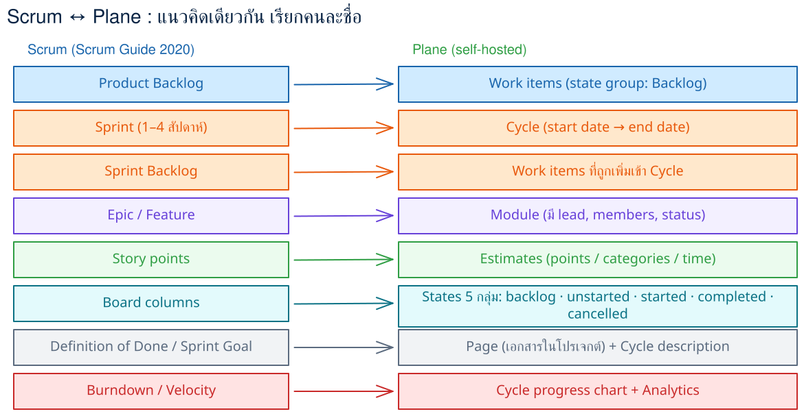

> **คำถามก่อนเริ่ม:** ถ้า dev1 ย้ายงานเป็น **In Progress** 2 ใบ กราฟ burndown จะตกลงไหม? แล้วถ้าย้ายใบที่ Done แล้ว **กลับ** มาเป็น Todo กราฟจะขึ้นกลับไหม? ข้อ 5 จะพิสูจน์ด้วย SQL ว่า Plane ตัดสินจากคอลัมน์เดียวคือ `completed_at`

### Terminal Map

| หน้าต่าง | หน้าที่ | เปิดเมื่อใด |
|---|---|---|
| **T1** | shell ในเครื่องเรียน (`pc`, `python`, `psql`) — บทบาท PO/SM | ใช้ตั้งแต่เริ่ม LAB |
| **B1** | เบราว์เซอร์ปกติ login `admin@example.com` (PO + SM) | ข้อ 2 |
| **B2** | หน้าต่าง private (incognito) login `dev1@example.com` (Developer) | ข้อ 5 |

ต้องผ่าน **LAB 3** มาก่อน: มี label `bug` · `feature` · `docs` · `tech-debt`, มีสมาชิก `dev1@example.com` (Member) และมี token ที่ `~/.plane_token` กับ venv `~/venv-plane`

> ⚠️ **เรื่องเลข `PLAB-n` ในเอกสารนี้:** ภาพหน้าจอและตัวอย่างผลลัพธ์ทั้งหมดจับจาก instance ที่ยังไม่มี work item ใบอื่น PBI ทั้ง 10 จึงได้เลข `PLAB-1…10` — แต่ในเครื่องเรียนของคุณ LAB 1–3 ใช้เลข `PLAB-1…13` ไปแล้ว (รวมใบที่ลบ) และ Plane **ไม่ออกเลขซ้ำ** PBI ของคุณจึงจะเป็น `PLAB-14…23` โดยประมาณ · ทุกขั้นตอนจึงเรียกงานด้วยรหัส **`PBI-xx`** (คอลัมน์ `external_id` ที่ `seed_backlog.py` ใส่ให้) และให้ดูเลขจริงของเครื่องคุณจาก `python seed_backlog.py --map` (ข้อ 3) ก่อนติ๊กหรือย้ายใบใน UI · สคริปต์และ SQL ของแล็บอ้าง `external_id` ไม่อ้างเลขใบ จึงได้ผลเหมือนกันทุกเครื่อง

---

## 0. เตรียมเครื่องเรียน

ทำบนเครื่องของเราเอง (ไม่ใช้ cloud) — เปิด container ที่ติดตั้ง Docker มาให้แล้ว

```bash
docker start devtools 2>/dev/null || \
  docker run -dit --name devtools --privileged -p 2222:22 -p 8080:8080 tuchsanai/devtools:2569_1
ssh root@localhost -p 2222        # password : passwd
```

> 📝 **คำอธิบาย:** `docker start ... || docker run ...` เปิดเครื่องเรียนเดิมถ้ามี และสร้างใหม่เฉพาะเมื่อยังไม่มี จึงไม่ลบ clone/venv/Plane จาก LAB ก่อนหน้า ·
> `--privileged` ให้สิทธิ์รัน **Docker ซ้อนข้างในเครื่องเรียน** (Plane 13 container รันอยู่ในนั้น) · `-p 2222:22` คือ SSH · `-p 8080:8080` ให้เบราว์เซอร์บนเครื่องเราเห็น Plane ตรง ๆ (หรือใช้แท็บ **PORTS** ของ VS Code forward `8080` แทนก็ได้)

> ⚠️ `--privileged` ใช้เฉพาะ disposable classroom container นี้ ไม่ใช่ค่าที่ควรใช้กับ production workload

> ใน VS Code ใช้ **Remote-SSH** ต่อไปที่ `root@localhost:2222` แล้วทำแล็บทั้งหมดข้างใน

Plane จาก LAB 1 ยังอยู่ไหม (ถ้าปิดเครื่องไป ให้ `pc start` ก่อน) :

```bash
pc ps --format 'table {{.Name}}\t{{.Status}}'
until [ "$(curl -s -o /dev/null -w '%{http_code}' http://localhost:8080/api/instances/)" = "200" ]; do sleep 5; done; echo READY
cd ~/labwork/DevTools/03_Application_Docker/Plane/004_LAB_Scrum_Cycles
source ~/venv-plane/bin/activate
python planeapi.py
```

> 📝 **คำอธิบาย:** `pc` คือ helper จาก LAB 1 (= `docker compose -f ~/plane-selfhost/docker-compose.yml --env-file ~/plane-selfhost/plane.env -p plane`) · ลูป `until` รอให้ `/api/instances/` ตอบ `200` เพราะ `Up` ≠ พร้อม ·
> `python planeapi.py` ทดสอบว่า token ใน `~/.plane_token` ยังใช้ได้ — ไฟล์นี้คือ client ที่ทุกสคริปต์ของแล็บ `import` ไปใช้ (อ่าน token, เดิน cursor pagination, รอเมื่อเจอ 429, แปลงชื่อ → UUID)

✅ **Expected output** — 12 container `Up` (+ `plane-migrator-1` Exited (0)) · `READY` · `users/me → 200` และเห็น UUID ของโปรเจกต์ PLAB:

```
NAME                  STATUS
plane-admin-1         Up 3 minutes (healthy)
plane-api-1           Up 2 minutes
        ... (รวม 12 Up) ...
READY
users/me → 200 admin@example.com | API calls: 1 · X-RateLimit-Remaining: 59 · โดน 429 แล้วรอ: 0 ครั้ง
project PLAB: 64fe6ece-0871-4ad9-8eeb-3e5ee87a7252
```

---

## 1. แบ่งบทบาทของวันนี้ (Scrum 3 บทบาท)

Scrum มี 3 บทบาท แต่ห้องเรียนมี 2 บัญชี — วันนี้ **admin** สวมหมวก **Product Owner + Scrum Master** (จัดลำดับ backlog, เปิด/ปิด sprint, พา Review/Retro) และ **dev1** เป็น **Developer** (ประเมิน, ทำงาน, ย้าย work item) · เราจะเขียนข้อตกลงนี้ไว้ใน **description ของ Cycle** ในข้อ 4 พร้อม **Sprint Goal** และ **Definition of Done** เพื่อให้ทุกคนที่เปิด sprint เห็นทันที

> 📝 **คำอธิบาย:** Plane ไม่มีฟิลด์ "role in sprint" — ใช้ description ของ Cycle เป็น working agreement · หลักการคือ *ถ้าไม่อยู่บนบอร์ด ถือว่ายังไม่เกิด* (สไลด์ *สิ่งที่มักพัง* ข้อ 5)

---

## 2. เปิด Estimates แบบ Fibonacci

**B1** (admin) → sidebar **Plane Lab** → ปุ่ม **⋯** ของโปรเจกต์ → **Settings** (หรือเปิด `http://localhost:8080/devtools-lab/settings/projects/<project-id>/estimates/`) → กลุ่ม **Work structure** → **Estimates** → ปุ่ม **Add estimate system**

ใน modal **New estimate system** (Step 1 of 2): เลือก **Points** → เทมเพลต **Fibonacci** (`1, 2, 3, 5, 8, 13`) → Step 2 แสดง 6 ค่า → **Create estimate** → กลับมาที่หน้า Estimates ให้เปิดสวิตช์ **Enable estimates for my project**

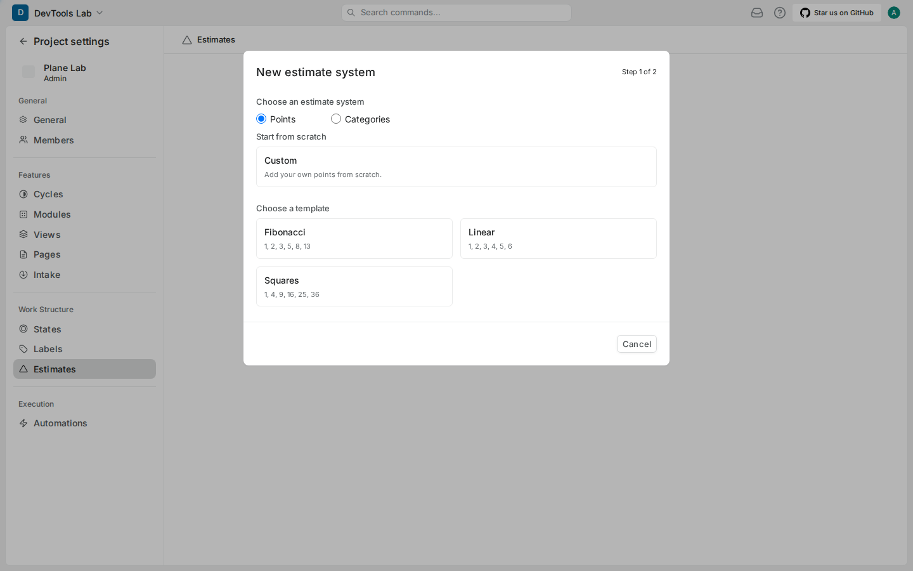

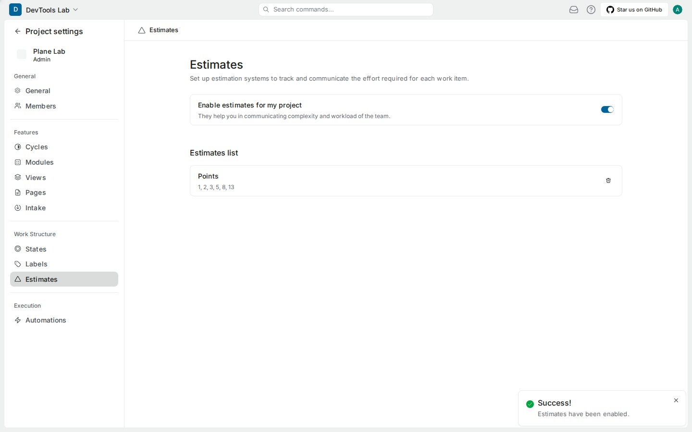

> 📝 **คำอธิบาย:** Plane CE v1.4.2 ให้เลือกได้ 2 ระบบ: **Points** (Fibonacci / Linear / Squares / Custom) กับ **Categories** (T-shirt ฯลฯ) — ระบบ **Time** ที่โค้ดฝั่งเว็บติดป้าย `is_ee` ไม่ถูกแสดงในรุ่น CE นี้เลย · การสร้างระบบยังไม่พอ: สวิตช์ **Enable estimates for my project** คือตัวผูก `projects.estimate_id` เข้ากับระบบที่สร้าง ถ้าลืมเปิด สคริปต์ข้อ 3 จะหา point ไม่เจอ ·
> Fibonacci ถูกเลือกเพราะช่องห่างกว้างขึ้นตามขนาด (ไม่ต้องเถียงว่า 13 หรือ 14) และข้อที่ ≥ 13 ควรแตกให้เล็กก่อนเข้า sprint

ดูว่า DB เก็บอะไร (`-e PGPASSWORD=plane` เพราะ container ของ DB ตั้ง `PGHOST=plane-db` ให้ psql วิ่งผ่าน TCP ที่ต้องใช้รหัสผ่าน) :

```bash
pc exec -T -e PGPASSWORD=plane plane-db psql -U plane -d plane -c "SELECT e.name, e.type, ep.key, ep.value, pg_typeof(ep.value) AS value_type FROM estimates e JOIN estimate_points ep ON ep.estimate_id = e.id ORDER BY ep.key;"
pc exec -T -e PGPASSWORD=plane plane-db psql -U plane -d plane -c "SELECT identifier, estimate_id FROM projects WHERE identifier='PLAB';"
```

> 📝 **คำอธิบาย:** ตาราง `estimates` เก็บชนิด (`points`/`categories`) และ `estimate_points` เก็บค่าแต่ละจุดเป็น **`character varying`** ไม่ใช่ตัวเลข — เพราะระบบเดียวกันต้องเก็บ "XS" ของ T-shirt ได้ด้วย · ตอนคำนวณ burndown แบบ points Plane จะ `cast` เป็น float · `projects.estimate_id` คือผลของสวิตช์ Enable (1 ระบบต่อโปรเจกต์)

✅ **Expected output** — 6 แถว `type = points` และ `value_type = character varying` · โปรเจกต์ PLAB มี `estimate_id`:

```
  name  |  type  | key | value |    value_type
--------+--------+-----+-------+-------------------
 Points | points |   1 | 1     | character varying
 Points | points |   2 | 2     | character varying
 Points | points |   3 | 3     | character varying
 Points | points |   4 | 5     | character varying
 Points | points |   5 | 8     | character varying
 Points | points |   6 | 13    | character varying
(6 rows)

 identifier |             estimate_id
------------+--------------------------------------
 PLAB       | 70c1275f-78b3-434c-8d82-e88a21ee2029
```

---

## 3. ป้อน Product Backlog ของ CampusEats แบบ idempotent

ดู `backlog.csv` ก่อน: 10 PBI (`PBI-01`…`PBI-10`) แต่ละแถวมี `name` · `description_html` (user story + acceptance criteria) · `priority` · `labels` · `points` — และหัวใจของ `seed_backlog.py` :

```python
body = {
    "name": row["name"], "description_html": row["description_html"],
    "priority": row["priority"], "state": states["Backlog"]["id"], "labels": label_ids,
    "external_source": "lab", "external_id": row["external_id"],   # ← กุญแจกันซ้ำ
}
if by_value.get(row["points"]):
    body["estimate_point"] = by_value[row["points"]]                # "5" → UUID ของ EstimatePoint
r = p.post(f"projects/{pid}/work-items/", body)                     # 201 = created · 409 = มีอยู่แล้ว
```

รันสองครั้งติดกัน :

```bash
python seed_backlog.py
python seed_backlog.py
```

> 📝 **คำอธิบาย:** รอบแรก API ตอบ `201` ทั้ง 10 ใบ Plane ออกเลข `PLAB-n` ให้เรียงตามลำดับที่สร้าง · รอบสองทุกใบตอบ **`409`** พร้อม `id` ของใบเดิม เพราะคู่ `external_source`+`external_id` ซ้ำ — สคริปต์จึง "ข้าม" แทนที่จะสร้างซ้ำ นี่คือความหมายของ **idempotent**: รันกี่ครั้งผลลัพธ์เท่าเดิม (LAB 7 จะใช้หลักนี้ย้ายบอร์ด Trello/Jira) ·
> `estimate_point` ต้องส่งเป็น **UUID** ของจุดในระบบประเมินของโปรเจกต์ ไม่ใช่ตัวเลข — `planeapi.estimate_points()` สร้างแผนที่ `"5" → uuid` ให้ (ใน v1.4.2 route `…/estimates/` ของ API v1 ยังไม่ถูก mount แม้ไฟล์จะมีอยู่ในโค้ด สคริปต์จึงถอยไปอ่านตาราง `estimate_points` ผ่าน `pc exec … psql` แทน) · เลขใบของแต่ละคนไม่ตรงกับเอกสาร (LAB 1–3 ใช้เลข `PLAB-1…13` ไปแล้ว เครื่องคุณจะเริ่มราว `PLAB-14`) ให้ยึด `PBI-xx` เป็นหลัก

✅ **Expected output** — รอบแรก `created 10` รอบสอง `skipped 10` และจำนวน API call เท่ากัน (14 = 4 lookup + 10 POST) — เลข `PLAB-n` ด้านล่างเป็นของ instance ว่างที่ใช้จับภาพ:

```
$ python seed_backlog.py
  created  PLAB-1   PBI-01   3 pt  นักศึกษาค้นหาร้านอาหารในมหาวิทยาลัยตามชื่อ
  created  PLAB-2   PBI-02   2 pt  ดูเมนูและราคาของร้านที่เลือก
  created  PLAB-3   PBI-03   3 pt  เพิ่มเมนูลงตะกร้าและแก้จำนวน
  created  PLAB-4   PBI-04   5 pt  สั่งอาหารและรับหมายเลขออเดอร์
  created  PLAB-5   PBI-05   3 pt  ร้านค้ากดยืนยันรับออเดอร์
  created  PLAB-6   PBI-06   5 pt  ไรเดอร์เห็นรายการออเดอร์ที่พร้อมส่ง
  created  PLAB-7   PBI-07   8 pt  นักศึกษาติดตามสถานะออเดอร์แบบ realtime
  created  PLAB-8   PBI-08   8 pt  ชำระเงินด้วย PromptPay QR
  created  PLAB-9   PBI-09   2 pt  เขียนเอกสาร API สำหรับทีมร้านค้า
  created  PLAB-10  PBI-10   1 pt  ย้ายค่า config ออกจากโค้ดไปเป็น environment variable
created 10 / skipped 0 / API calls 14

$ python seed_backlog.py
  skipped  PBI-01 (409 มีอยู่แล้ว id=1ce2c7ac…)
        ... (skipped ครบ 10 บรรทัด) ...
  skipped  PBI-10 (409 มีอยู่แล้ว id=e63d6b94…)
created 0 / skipped 10 / API calls 14
```

พิมพ์ตาราง **PBI → เลขใบของเครื่องคุณ** เก็บไว้ดูตลอดแล็บ (ทุกข้อถัดไปเรียกงานด้วย `PBI-xx`) :

```bash
python seed_backlog.py --map
```

> 📝 **คำอธิบาย:** `--map` ไม่สร้างอะไร — `GET …/work-items/` แล้วกรองใบที่ `external_source = lab` เรียงตาม `external_id` พร้อมแปลง `estimate_point` (UUID) กลับเป็นตัวเลข · จดคอลัมน์ `work item` ไว้: เวลาเอกสารบอก "PBI-01" ให้ติ๊กหรือคลิกใบเลขนั้นในเครื่องคุณ

✅ **Expected output** — 10 แถว เรียง PBI-01…10 (คอลัมน์ `work item` ของเครื่องคุณจะเป็นเลขอื่น เช่น `PLAB-14…23`):

```
PBI     work item pt  name
PBI-01  PLAB-1     3  นักศึกษาค้นหาร้านอาหารในมหาวิทยาลัยตามชื่อ
PBI-02  PLAB-2     2  ดูเมนูและราคาของร้านที่เลือก
PBI-03  PLAB-3     3  เพิ่มเมนูลงตะกร้าและแก้จำนวน
PBI-04  PLAB-4     5  สั่งอาหารและรับหมายเลขออเดอร์
PBI-05  PLAB-5     3  ร้านค้ากดยืนยันรับออเดอร์
PBI-06  PLAB-6     5  ไรเดอร์เห็นรายการออเดอร์ที่พร้อมส่ง
PBI-07  PLAB-7     8  นักศึกษาติดตามสถานะออเดอร์แบบ realtime
PBI-08  PLAB-8     8  ชำระเงินด้วย PromptPay QR
PBI-09  PLAB-9     2  เขียนเอกสาร API สำหรับทีมร้านค้า
PBI-10  PLAB-10    1  ย้ายค่า config ออกจากโค้ดไปเป็น environment variable
10 PBI / API calls 3
```

เปิด **B1** → **Work items** ของ Plane Lab — ทุกใบมีตัวเลข point (คอลัมน์ Estimate) และ label ตาม CSV (ของคุณจะมีใบจาก LAB 1–3 ปนอยู่ด้วย) :

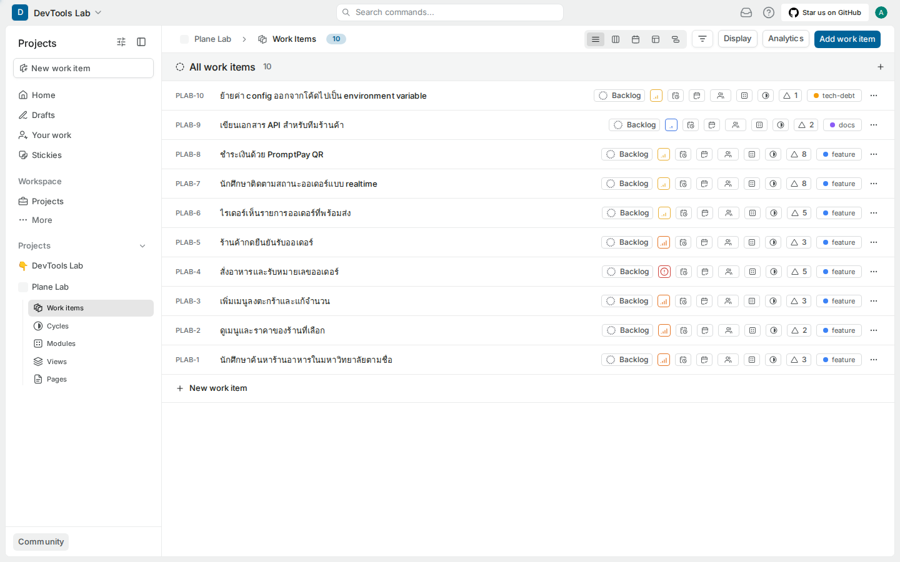

---

## 4. Sprint Planning — สร้าง Sprint 1 และดึงงาน ≤ 20 points

สมมติว่า sprint 2 สัปดาห์นี้ **เริ่มไปแล้ว 4 วัน** (จะได้มีอดีตให้ burndown วาด) — UI สร้างไม่ได้เพราะ date picker ปิดวันที่ผ่านมาแล้ว จึงสร้างผ่าน API :

```bash
python make_cycle.py --name "Sprint 1" --start -4 --end +9 --description "Sprint Goal: นักศึกษาค้นหาร้าน ดูเมนู ใส่ตะกร้า และสั่งอาหารได้ครบวงจร · PO+SM: Lab Admin (admin@example.com) · Developer: dev1@example.com · DoD: ผ่าน AC ทุกข้อ + code review + ไม่มี secret ในโค้ด"
```

> 📝 **คำอธิบาย:** `--start -4 --end +9` = วันนี้ − 4 ถึงวันนี้ + 9 (รวม 14 วัน) สคริปต์แปลงเป็น `YYYY-MM-DD` แล้ว `POST …/cycles/` · API ต้องได้ทั้ง `start_date` และ `end_date` พร้อมกัน (หรือไม่ส่งเลย = draft) แล้ว Plane ปรับเป็น **00:00:01** และ **23:59:00** ตาม timezone ของโปรเจกต์ก่อนเก็บเป็น UTC ·
> ถ้ามี cycle ชื่อนี้อยู่แล้วสคริปต์จะ **PATCH** แทน (ข้อ 9 ใช้ท่านี้ปิด sprint) · description คือ working agreement จากข้อ 1 · หลักการ: *สร้างข้อมูลย้อนหลัง = งานของ API ไม่ใช่ UI*

✅ **Expected output** — `created` พร้อม `start_date` ที่เป็นอดีต และสถานะ `In progress`:

```
created cycle 'Sprint 1' id=d1a8db09-93b9-41a6-926e-3cfd35ed5d33
  start_date=2026-08-27T00:00:01Z  end_date=2026-09-09T23:59:00Z  → status now: In progress
  sent: {"start_date": "2026-08-27", "end_date": "2026-09-09", "description": "Sprint Goal: ...", "name": "Sprint 1"}
```

**B1** → sidebar **Cycles** → คลิก **Sprint 1** → ปุ่ม **Add existing work item** → ติ๊ก 7 ใบของ **PBI-01 … PBI-05, PBI-09, PBI-10** (ดูเลข `PLAB-n` ของเครื่องคุณจากตาราง `--map`; ค้นด้วยชื่อใบได้ในช่อง Search) รวม 3+2+3+5+3+2+1 = **19 points** → **Add selected work items**

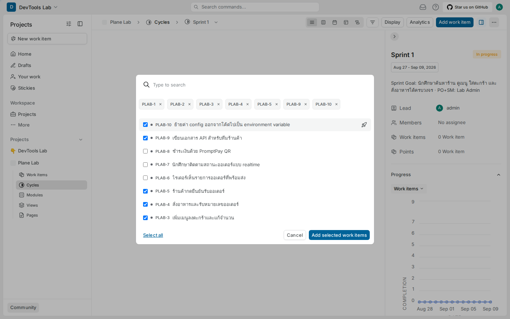

> 📝 **คำอธิบาย:** งบของ sprint นี้คือ ≤ 20 points (sprint แรกยังไม่มี velocity ให้อ้าง จึงตกลงกันเป็นตัวเลขกลม ๆ) · เลือกตามลำดับความสำคัญของ PO (PBI-01…05 คือ flow หลัก) แล้วเติมของเล็ก (PBI-09 docs, PBI-10 tech-debt) ให้เต็มงบ · PBI-06…08 (5+8+8) ใหญ่เกินจึงรออยู่ใน backlog · toast `Work items added to the cycle successfully.`

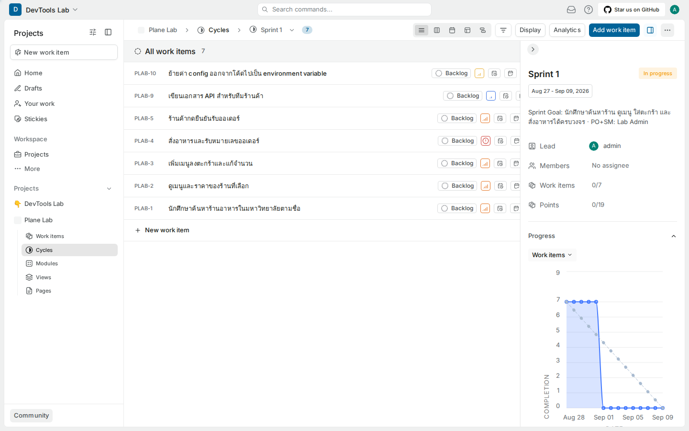

ในแผง **Progress** ทางขวา คลิก dropdown **Work items** → **Estimates** :

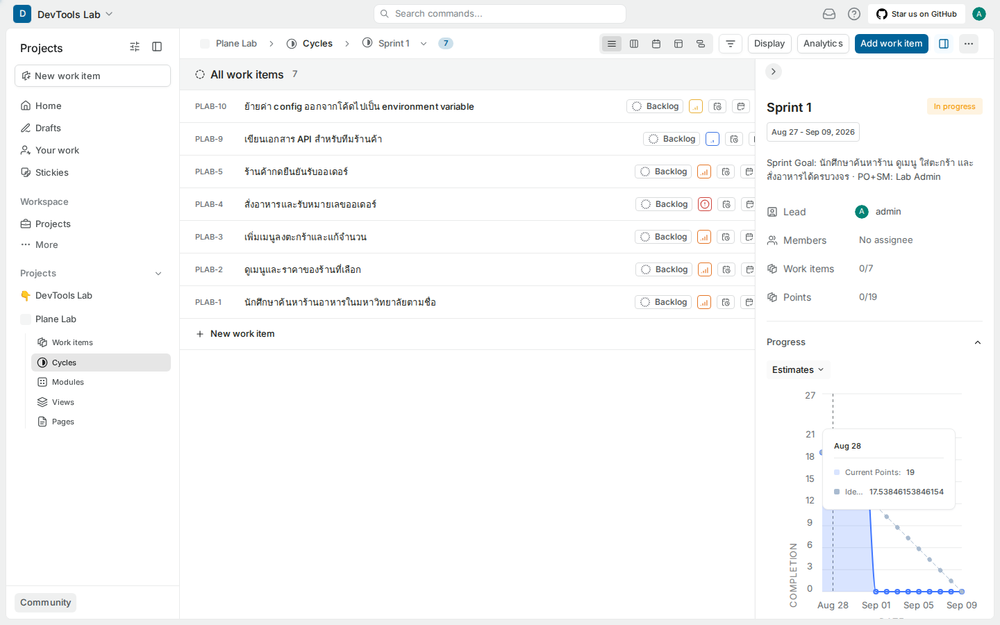

> 📝 **คำอธิบาย:** dropdown นี้มีเพราะโปรเจกต์ใช้ Estimates แบบ points (ทดลองเพิ่มเติม ข จะปิดแล้วดูว่ามันหายไป) · เส้น **Ideal** (ประ) = `total × (1 − i/(n−1))`: วันที่ 2 ของ 14 วัน → `19 × (1 − 1/13) = 17.538` ตรงกับ tooltip · เส้น **Current** ยังราบที่ 19 เพราะยังไม่มีใบไหน Done ·
> จุดสังเกต: วันในอนาคต API ตอบ `null` แต่กราฟของ CE วาดเป็น 0 จึงเห็นเส้นดิ่งลงหลังวันนี้ — ไม่ใช่งานเสร็จ

---

## 5. Daily Scrum — dev1 ย้าย work item แล้วดูว่า burndown ขยับเมื่อไร

**B2** (หน้าต่าง private (incognito), login `dev1@example.com` / `Member-Lab-2569`) → **Plane Lab → Cycles → Sprint 1** → คลิกป้ายสถานะ **Backlog** ท้ายแถว: **PBI-01** (ค้นหาร้าน) → **In Progress**, **PBI-02** (ดูเมนู) → **In Progress**, **PBI-10** (ย้าย config) → **Done** — ในภาพคือ `PLAB-1`, `PLAB-2`, `PLAB-10`

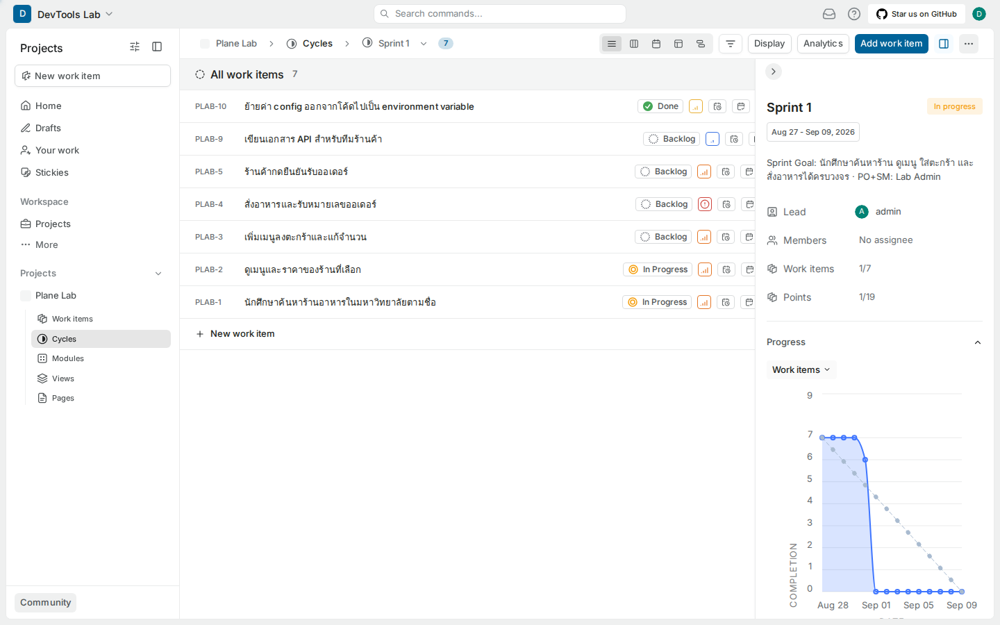

> 📝 **คำอธิบาย:** งาน 2 ใบที่ **In Progress ไม่ทำให้เส้นตก** — ตกเพียง 1 หน่วยจาก PBI-10 ที่ Done · Daily Scrum ที่ดีเดินจากคอลัมน์ขวาไปซ้ายถามว่า "อะไรขวางไม่ให้ใบนี้ Done" · ตัวเลข Points `1/19` = PBI-10 มี 1 point

ดูใน DB ว่า Plane จำอะไร (**T1**) — ค้นด้วย `external_id` ไม่ใช่เลขใบ จึงใช้ได้ทุกเครื่อง :

```bash
pc exec -T -e PGPASSWORD=plane plane-db psql -U plane -d plane -c "SELECT i.external_id AS pbi, 'PLAB-' || i.sequence_id AS item, s.name AS state, s.\"group\", i.completed_at FROM issues i JOIN projects p ON p.id=i.project_id JOIN states s ON s.id=i.state_id WHERE p.identifier='PLAB' AND i.external_id IN ('PBI-01','PBI-02','PBI-10') AND i.deleted_at IS NULL ORDER BY i.external_id;"
```

✅ **Expected output** — เฉพาะใบใน state กลุ่ม `completed` มี `completed_at` (คอลัมน์ `item` ของเครื่องคุณเป็นเลขอื่น):

```
  pbi   |  item   |    state    |   group   |         completed_at
--------+---------+-------------+-----------+-------------------------------
 PBI-01 | PLAB-1  | In Progress | started   |
 PBI-02 | PLAB-2  | In Progress | started   |
 PBI-10 | PLAB-10 | Done        | completed | 2026-08-31 13:34:05.541372+00
```

**ทดลองให้พัง:** ใน **B2** ย้าย **PBI-10** **Done → Todo** แล้วรัน SQL เดิมอีกครั้ง

✅ **Expected output** — `completed_at` ของ PBI-10 กลับเป็น **NULL** (ว่าง) — Plane ไม่เก็บว่า "เคย Done":

```
  pbi   |  item   |    state    |   group   | completed_at
--------+---------+-------------+-----------+--------------
 PBI-01 | PLAB-1  | In Progress | started   |
 PBI-02 | PLAB-2  | In Progress | started   |
 PBI-10 | PLAB-10 | Todo        | unstarted |
```

> 📝 **คำอธิบาย:** burndown ของ Plane ไม่ได้อ่านประวัติ state (ตาราง `issue_activities`) แต่อ่านคอลัมน์ **`completed_at`** ที่ถูกเขียนเมื่อเข้า state กลุ่ม `completed` และถูก **ล้าง** เมื่อออกจากกลุ่มนั้น — ตอบคำถามก่อนเริ่ม: ย้ายกลับ = กราฟกลับขึ้น · ผลข้างเคียงคือถ้าย้ายใบไป Done "แก้กลับ" แล้ว Done ใหม่ วันที่จะเป็นวันล่าสุดเสมอ

**แก้กลับ** แล้วทำงานให้จบอีก 2 ใบเพื่อเตรียมข้อ 6: **B2** ย้าย **PBI-10** → **Done**, **PBI-01** → **Done**, **PBI-02** → **Done** แล้วรัน SQL เดิม

✅ **Expected output** — ทั้ง 3 ใบ Done และ `completed_at` เป็น **วันนี้ทั้งหมด** (ห่างกันไม่กี่วินาที):

```
  pbi   |  item   | state |   group   |         completed_at
--------+---------+-------+-----------+-------------------------------
 PBI-01 | PLAB-1  | Done  | completed | 2026-08-31 13:34:06.37341+00
 PBI-02 | PLAB-2  | Done  | completed | 2026-08-31 13:34:06.42157+00
 PBI-10 | PLAB-10 | Done  | completed | 2026-08-31 13:34:06.325948+00
```

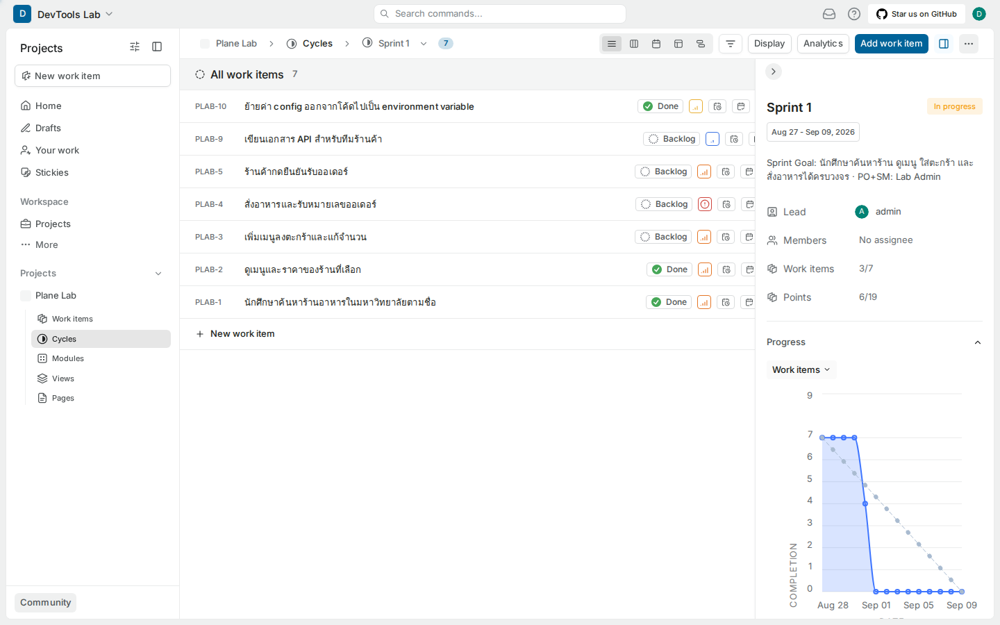

> 📝 **คำอธิบาย:** ในห้องเรียนเราทำงาน 3 วันเสร็จใน 3 นาที กราฟจึงตกทีเดียว 3 หน่วยที่วันนี้ — ของจริงจะเป็นขั้นบันไดคนละวัน ข้อ 6 จะ "ย้อนเวลา" ให้เห็นภาพนั้น

---

## 6. WOW: เครื่องย้อนเวลา — กระจาย `completed_at` ไป 3 วัน

ดูสคริปต์ก่อน: `sprint_time_machine.sql` สำรองค่าเดิมลงตาราง `lab4_completed_backup` แล้ว `UPDATE` เฉพาะ **PBI ที่ Done** (`external_source = 'lab'` — ไม่แตะใบ Done จาก LAB 1–3) ให้ `completed_at` เป็น *3 วันก่อน / 2 วันก่อน / เมื่อวาน* เรียงตามเลขใบ ทั้งหมดใน `BEGIN … COMMIT` เดียว

```bash
pc exec -T -e PGPASSWORD=plane plane-db psql -U plane -d plane -f - < sprint_time_machine.sql
```

> 📝 **คำอธิบาย:** `-f -` อ่าน SQL จาก stdin และ `<` ส่งไฟล์เข้าไป (ผ่าน `-T` ของ compose เพื่อไม่จอง TTY) · `ROW_NUMBER() OVER (ORDER BY sequence_id)` ให้ลำดับ 1..3 แล้ว `now() - make_interval(days => 4 - rn)` = −3/−2/−1 วัน · เราแก้ DB ตรง ๆ เพราะ API ไม่ยอมให้ตั้ง `completed_at` เอง (read-only) — ทำได้ในห้องเรียนเท่านั้น ของจริงห้าม · ถ้าอยากย้อนกลับใช้ `restore_done.sql`

✅ **Expected output** — ตาราง `BEFORE` เป็นวันนี้ทั้งหมด → `UPDATE 3` (นับเฉพาะ PBI — ใบ Done จาก LAB 3 ไม่ถูกแตะ) → `AFTER` ห่างกัน 3/2/1 วัน:

```
BEGIN
SELECT 3
--- BEFORE
  pbi   |  item   | state |         completed_at
--------+---------+-------+-------------------------------
 PBI-01 | PLAB-1  | Done  | 2026-08-31 13:34:06.37341+00
 PBI-02 | PLAB-2  | Done  | 2026-08-31 13:34:06.42157+00
 PBI-10 | PLAB-10 | Done  | 2026-08-31 13:34:06.325948+00
(3 rows)

UPDATE 3
--- AFTER
  pbi   |  item   | state |         completed_at          | days_ago
--------+---------+-------+-------------------------------+----------
 PBI-01 | PLAB-1  | Done  | 2026-08-28 13:34:06.685553+00 |        3
 PBI-02 | PLAB-2  | Done  | 2026-08-29 13:34:06.685553+00 |        2
 PBI-10 | PLAB-10 | Done  | 2026-08-30 13:34:06.685553+00 |        1
(3 rows)

COMMIT
```

กลับไป **B1** → **Cycles → Sprint 1** แล้ว reload (F5) :

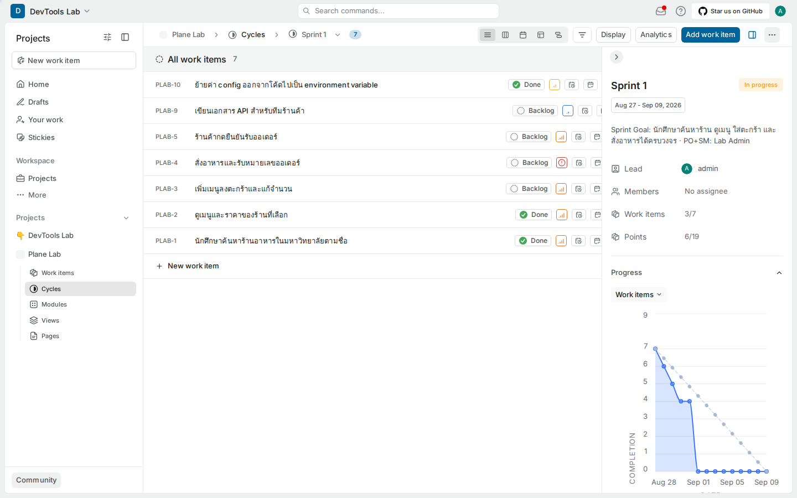

> 📝 **คำอธิบาย:** ตอนนี้เส้น actual ไต่ลงทีละวันและ **อยู่ใต้เส้น ideal** = ทีมทำได้เร็วกว่าแผน · แผง Progress ถูกคำนวณสดทุกครั้งที่โหลด (endpoint `…/cycles/<id>/analytics/`) ถ้าเห็นค่าเดิมค้างให้ reload; ถ้ายังไม่เปลี่ยน `pc exec api python manage.py clear_cache` แล้ว reload อีกครั้ง

หน้า **Cycles** (รายการ) ก็เห็น sprint ที่กำลังดำเนินอยู่ในแผง **Active cycle** พร้อม Progress bar และ **Work item burndown** :

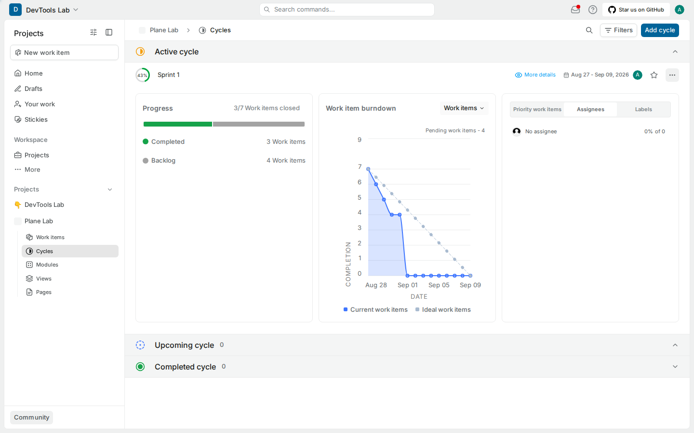

---

## 7. คำนวณ burndown เองด้วยสูตรของ Plane — `cycle_report.py`

```bash
python cycle_report.py
```

> 📝 **คำอธิบาย:** สคริปต์ (1) หา cycle ปัจจุบันด้วย `GET …/cycles/?cycle_view=current` (2) เดินทุกหน้าของ `…/cycle-issues/?expand=estimate_point` — `expand` ทำให้ API แนบ object ของ EstimatePoint (มี `value` เป็น string) มากับแต่ละใบ (3) ต่อวัน: `remaining = total − Σ ใบที่ completed_at::date ≤ วันนั้น` และ `ideal(i) = total × (1 − i/(n−1))` ทั้งหน่วย items และ points ·
> ตัวเลข `◀ today` ต้องตรงกับจุดสุดท้ายของเส้น Current ในข้อ 6 (4 items) และ Points `6/19` ในแถบข้าง (เหลือ 13) · คอลัมน์ขวาสุดพิมพ์เลขใบที่ Done ในวันนั้น (ของคุณเป็นเลขของ PBI-01/02/10 ในเครื่องคุณ)

✅ **Expected output** — ตารางไต่ลง 7→6→5→4 items / 19→16→14→13 points ตรงกับกราฟ วันหลังจากนี้เป็น `(future)`:

```
Cycle: Sprint 1  2026-08-27 → 2026-09-09  (14 วัน)   items=7  points=19
day  date         ideal   done  remain   ideal  remain
                  items  items   items  points  points
  0  2026-08-27     7.0      0       7    19.0    19.0
  1  2026-08-28     6.5      1       6    17.5    16.0    PLAB-1
  2  2026-08-29     5.9      2       5    16.1    14.0    PLAB-2
  3  2026-08-30     5.4      3       4    14.6    13.0    PLAB-10
  4  2026-08-31     4.8      3       4    13.2    13.0   ◀ today
  5  2026-09-01     4.3      -       -    11.7       -   (future)
        ... (future จนถึง day 13) ...
 13  2026-09-09     0.0      -       -     0.0       -   (future)

วันนี้เหลือ 4 items / 13 points  → ต้องตรงกับจุดสุดท้ายของเส้น Current ในแผง Progress
API calls: 3
```

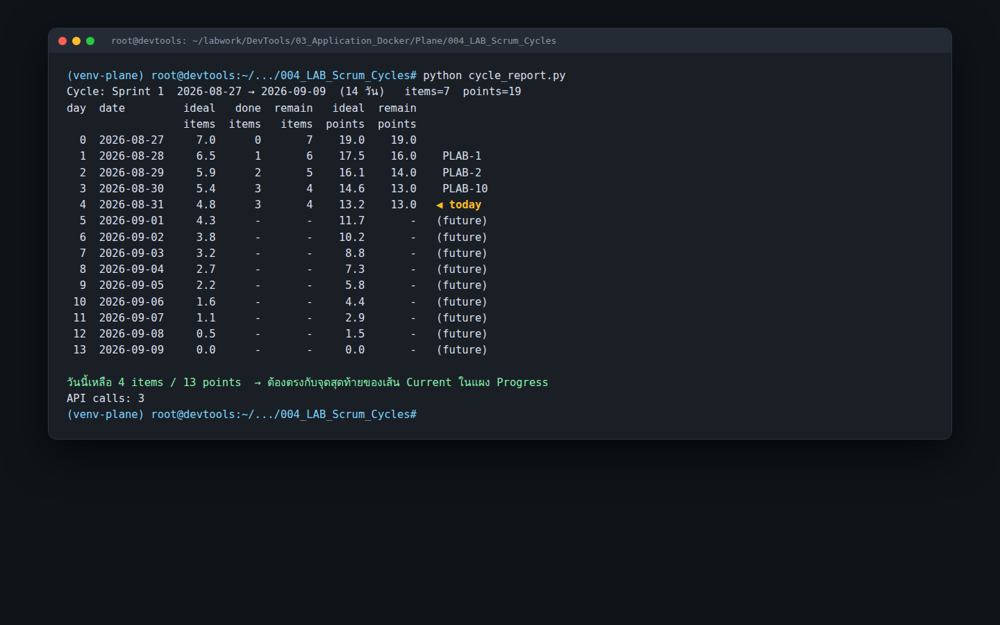

---

## 8. Sprint Review & Retrospective บน Page

**B1** → sidebar **Pages** ของ Plane Lab → **Add page** → Plane เปิดหน้าใหม่ชื่อ *Untitled* → พิมพ์ชื่อ `Sprint 1 — Review & Retro (CampusEats)` แล้วพิมพ์เนื้อหาตามโครง `retro_template.md` (พิมพ์ `## ` นำหน้าได้หัวข้อ, `- ` ได้ bullet — editor แปลง markdown shortcut ให้) ใส่ตัวเลขจริงจากข้อ 7: committed 19 · done 6 · เหลือโอน 4 ใบ

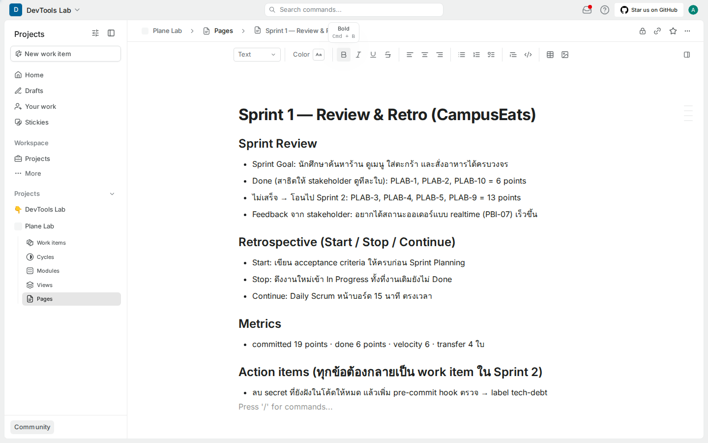

> 📝 **คำอธิบาย:** Page เป็น rich-text ที่บันทึกอัตโนมัติผ่าน **live server** (container `plane-live-1`) — ไม่มีปุ่ม Save · CE ไม่มีระบบเทมเพลต ทีมจึงเก็บหน้าต้นแบบไว้แล้ว **Make a copy** ทุก sprint · Review = โชว์ของที่ **Done** (PBI-01, 02, 10) ไม่ใช่ของที่ "เกือบเสร็จ" · Retro จบด้วย **action item** อย่างน้อยหนึ่งข้อ (สไลด์ *Zombie Scrum*)

action item ที่ไม่กลายเป็น work item มักไม่เกิดขึ้นจริง — แปลงมันเลย: **B1** → **Cycles → Sprint 1** → ปุ่ม **Add work item** → Title `ลบ secret ที่ฝังในโค้ดและเพิ่ม pre-commit hook (action item จาก Retro Sprint 1)` → ปุ่ม **Labels** → `tech-debt` → ปุ่ม **Estimate** → `2` → **Save**

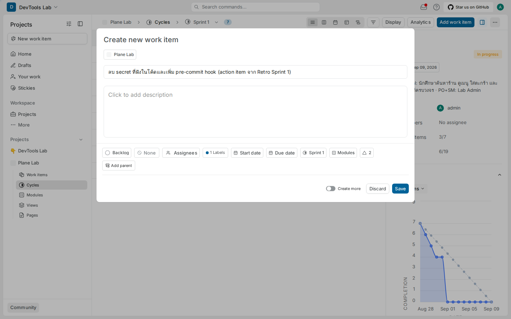

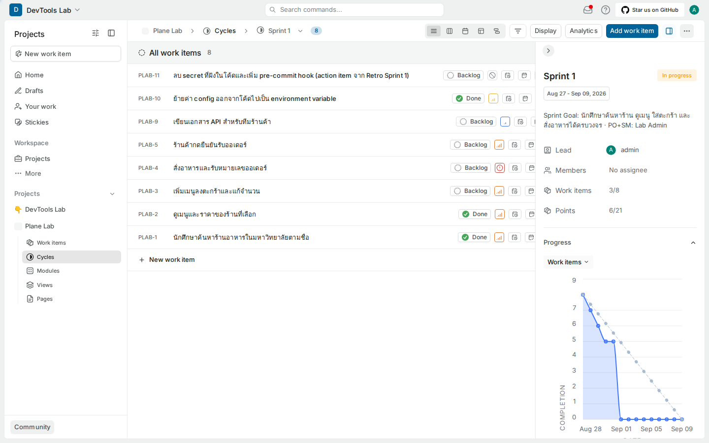

> 📝 **คำอธิบาย:** สร้างจากหน้า cycle ทำให้ใบใหม่ (`PLAB-11` ในภาพ — ของคุณคือเลขถัดไปของโปรเจกต์) ถูกผูกกับ Sprint 1 ทันที — จงใจ เพราะข้อ 9 จะ **Transfer** ของค้างทั้งหมด (รวมใบนี้) ไป Sprint 2 · สังเกตกราฟ: total เพิ่มเป็น 8/21 = **scope creep** กลาง sprint ที่สไลด์ *อ่าน burndown ให้เป็น* บอกว่า "เส้นกระโดดขึ้น" — ในของจริง action item ควรเข้า sprint ถัดไป ไม่ใช่ sprint ที่กำลังจะปิด

---

## 9. ปิด Sprint 1 → Transfer งานที่ค้างไป Sprint 2

สร้าง Sprint 2 ล่วงหน้า (เริ่มพรุ่งนี้ 14 วัน) — ครั้งนี้ใช้ UI ก็ได้ (**Add cycle** → Title `Sprint 2` → เลือกวันพรุ่งนี้ถึง +14) แต่เราใช้สคริปต์เดิมเพื่อความเร็ว :

```bash
python make_cycle.py --name "Sprint 2" --start +1 --end +14 --description "Sprint Goal: ร้านค้ารับออเดอร์และไรเดอร์เห็นงานที่พร้อมส่ง · PO+SM: Lab Admin · Developer: dev1@example.com"
```

✅ **Expected output** — สถานะ `Yet to start` (start_date ยังไม่ถึง):

```
created cycle 'Sprint 2' id=1e5147eb-bfd4-45b2-83b1-3d8ca88968b3
  start_date=2026-09-01T00:00:01Z  end_date=2026-09-14T23:59:00Z  → status now: Yet to start
```

Sprint 1 ยังเหลืออีก 9 วัน — ห้องเรียนรอไม่ได้ จึง **ย้ายวันจบไปเมื่อวาน** ผ่าน API (UI แก้วันย้อนหลังไม่ได้) :

```bash
python make_cycle.py --name "Sprint 1" --end -1
```

> 📝 **คำอธิบาย:** สคริปต์เจอชื่อซ้ำจึง `PATCH …/cycles/<id>/` โดยแนบ `start_date` เดิมไปด้วย (validator ต้องเห็นทั้งคู่จึงจะแปลง timezone) · `end_date = เมื่อวาน 23:59` < now → Plane ถือว่า **Completed** ทันที · หลังจากนี้ cycle นี้แก้ไขไม่ได้อีก (API ตอบ `The Cycle has already been completed so it cannot be edited` ยกเว้น `sort_order`)

✅ **Expected output** — `updated` และสถานะกลายเป็น `Completed`:

```
updated cycle 'Sprint 1' id=d1a8db09-93b9-41a6-926e-3cfd35ed5d33
  start_date=2026-08-27T00:00:01Z  end_date=2026-08-30T23:59:00Z  → status now: Completed
  sent: {"end_date": "2026-08-30", "start_date": "2026-08-27"}
```

**B1** → reload หน้า **Sprint 1**: ป้ายเป็น **Completed**, วันที่ `Aug 27 - 30, 2026`, มีแถบ *Completed cycles are not editable.* และปุ่ม **Transfer work items** โผล่ในแถบข้าง (ปุ่มนี้มีเฉพาะ cycle ที่ Completed) → คลิก → modal **Transfer work items** → เลือก **Sprint 2** (ป้าย *Upcoming*)

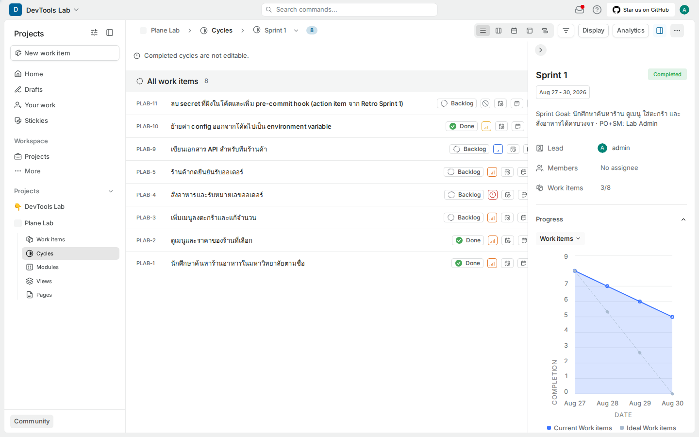

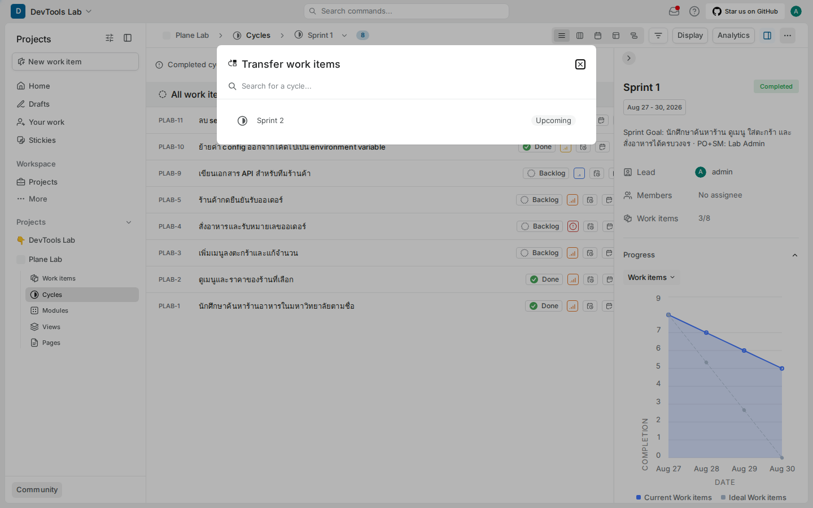

> 📝 **คำอธิบาย:** Transfer ย้ายเฉพาะใบใน state กลุ่ม `backlog / unstarted / started` (5 ใบ: PBI-03, 04, 05, 09 และ action item) ใบที่ Done/Cancelled อยู่กับ sprint เก่า · ก่อนย้าย Plane **เขียนสถิติของ Sprint 1 ลง `progress_snapshot`** (จำนวนใบต่อกลุ่ม, distribution, completion_chart ทั้งแบบ items และ points) แล้วหน้า Sprint 1 จะแสดงจาก snapshot ตลอดไป — ไม่งั้นพอย้ายใบออก Sprint 1 จะเหลือ 3/3 = 100% ซึ่งโกหก

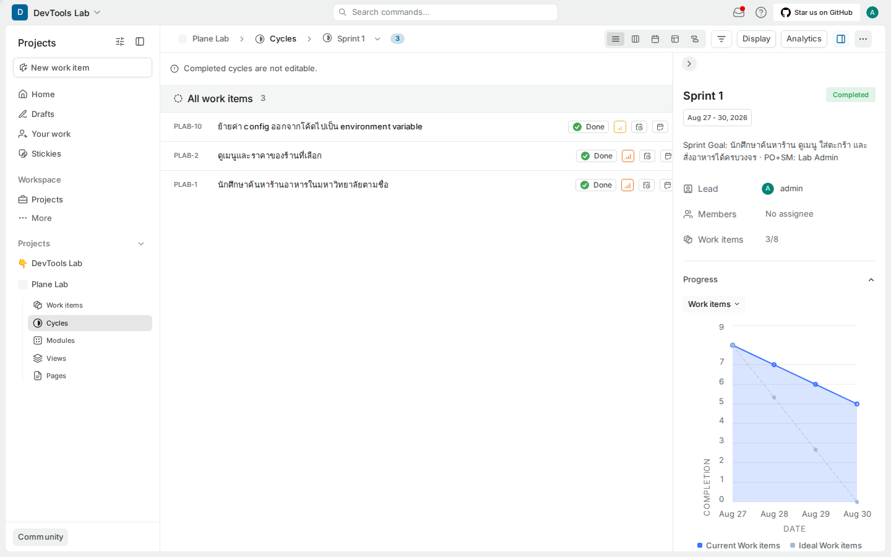

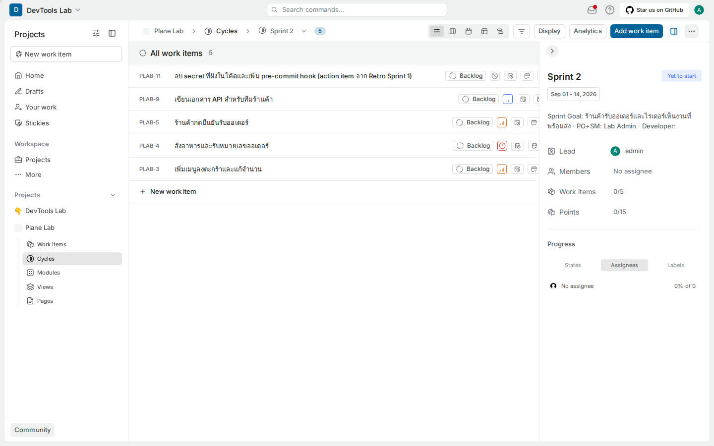

พิสูจน์ใน DB (**T1**) :

```bash
pc exec -T -e PGPASSWORD=plane plane-db psql -U plane -d plane -c "SELECT c.name, c.end_date < now() AS completed, count(ci.id) AS items_now, c.progress_snapshot->>'total_issues' AS snap_total, c.progress_snapshot->>'completed_issues' AS snap_done FROM cycles c JOIN projects p ON p.id=c.project_id LEFT JOIN cycle_issues ci ON ci.cycle_id=c.id AND ci.deleted_at IS NULL WHERE p.identifier='PLAB' GROUP BY c.id ORDER BY c.start_date;"
pc exec -T -e PGPASSWORD=plane plane-db psql -U plane -d plane -c "SELECT jsonb_pretty(progress_snapshot->'estimate_distribution'->'completion_chart') AS frozen_points_chart FROM cycles WHERE name='Sprint 1';"
```

✅ **Expected output** — Sprint 1: `completed = t`, เหลือ 3 ใบจริง แต่ snapshot จำ 8/3 · Sprint 2 มี 5 ใบ · completion_chart แบบ points ถูกแช่แข็งไว้ 4 วัน (21 → 18 → 16 → 15):

```
   name   | completed | items_now | snap_total | snap_done
----------+-----------+-----------+------------+-----------
 Sprint 1 | t         |         3 | 8          | 3
 Sprint 2 | f         |         5 |            |
(2 rows)

   frozen_points_chart
-------------------------
 {                      +
     "2026-08-27": 21.0,+
     "2026-08-28": 18.0,+
     "2026-08-29": 16.0,+
     "2026-08-30": 15.0 +
 }
```

---

## 10. Velocity + พยากรณ์ และด่านหลักฐาน

```bash
python velocity.py
```

> 📝 **คำอธิบาย:** ดึง cycle ที่จบแล้วด้วย `?cycle_view=completed` แล้วสำหรับแต่ละ cycle: **done** = Σ points ของใบใน cycle ที่มี `completed_at` (ใบครึ่ง ๆ = 0) · **committed** = จุดสูงสุดของ `completion_chart` ใน `progress_snapshot` (= 21 หลัง scope creep) เพราะหลัง Transfer ใบที่ค้างย้ายออกไปแล้ว นับสดไม่ได้ · velocity เฉลี่ยใช้ ≤ 3 sprint ล่าสุด · **forecast** = points ที่ยังไม่ Done ทั้งโปรเจกต์ ÷ velocity — ตอบ "เมื่อไรจะเสร็จ" เป็นช่วง ไม่ใช่วันเดียว และห้ามเอาไปตั้งเป้าให้ทีม

✅ **Expected output** — Sprint 1: committed 21 · done 6 · velocity 6 · เหลือ 36 points → ≈ 6 sprint:

```
cycle      period                  committed  done  velocity  snapshot
Sprint 1   2026-08-27 → 2026-08-30        21     6         6  yes

velocity เฉลี่ย (≤3 sprint ล่าสุด) = 6 points/sprint
งานที่ยังไม่ Done ทั้งโปรเจกต์ = 36 points
forecast: เหลืออีก ≈ 6.0 sprint → ปัดขึ้น 6 sprint (sprint ละ 2 สัปดาห์ ≈ 12 สัปดาห์)
API calls: 4
```

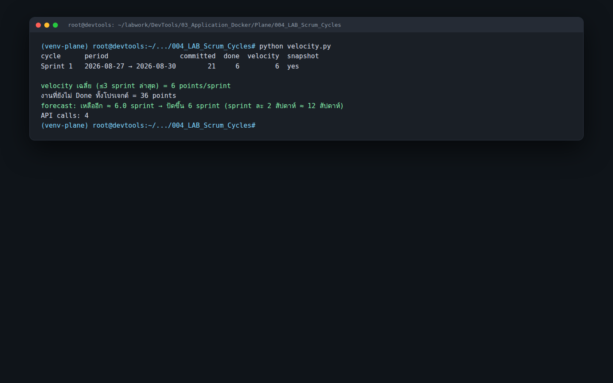

ปิดท้ายด้วยด่านหลักฐานของแล็บ :

```bash
bash check_lab04.sh
```

> 📝 **คำอธิบาย:** สคริปต์ตรวจสภาพจริง 9 ข้อผ่าน SQL + API (estimates เป็น points 6 ค่า, seed ครบ 10 ใบและมี point ทุกใบ, Sprint 1 Completed + snapshot, Sprint 2 รับโอน ≥ 1, `completed_at` กระจาย ≥ 3 วัน, Page ชื่อมี Retro, work item ใหม่ label tech-debt, `velocity.py` รันผ่าน) แล้วพิมพ์ `PASS:` บรรทัดเดียว — ถ้าข้อไหน ✘ ให้ย้อนไปทำข้อนั้น

✅ **Expected output**:

```
== LAB 4 checks (project PLAB)
  ✔ Estimates = points (6 ค่า Fibonacci)
  ✔ backlog seeded: 10 ใบ (external_source=lab)
  ✔ ทุกใบที่ seed มี estimate point
  ✔ Sprint 1 Completed และมี progress_snapshot (ผ่านการ Transfer แล้ว)
  ✔ Sprint 2 มีงานที่โอนมา 5 ใบ
  ✔ งาน Done กระจายอยู่ 3 วัน (time machine ทำงาน)
  ✔ มี Page Review & Retro
  ✔ action item จาก retro เป็น work item (label tech-debt) แล้ว
  ✔ velocity.py รันผ่าน
PASS: LAB 4 — estimates=points · backlog 10 ใบ · Sprint 1 completed+snapshot · Sprint 2 รับโอน 5 ใบ · burndown 3 วัน · retro page + action item
```

---

## ทดลองเพิ่มเติม

### ก. ยัดงานเข้า sprint ที่ปิดแล้ว → `CYCLE_COMPLETED`

```bash
python - <<'EOF'
from planeapi import Plane
p = Plane(); pid = p.project()["id"]
s1 = p.cycle_by_name(pid, "Sprint 1")
item = p.get(f"projects/{pid}/work-items/", external_source="lab", external_id="PBI-08").json()
print("Sprint 1 end_date:", s1["end_date"])
r = p.post(f"projects/{pid}/cycles/{s1['id']}/cycle-issues/", {"issues": [item["id"]]})
print("POST cycle-issues →", r.status_code, r.text)
EOF
```

> 📝 **คำอธิบาย:** `?external_source=&external_id=` ทำให้ `GET …/work-items/` ตอบใบเดียว (ไม่ใช่ envelope) · API ตรวจ `end_date < now()` ก่อนเพิ่มงาน — sprint ที่ปิดแล้วเป็น **ประวัติ** ไม่ใช่ที่ทำงาน

✅ **Expected output** — `400` พร้อมโค้ด `CYCLE_COMPLETED`:

```
Sprint 1 end_date: 2026-08-30T23:59:00Z
POST cycle-issues → 400 {"code":"CYCLE_COMPLETED","message":"The Cycle has already been completed so no new issues can be added"}
```

### ข. ปิด Estimates ชั่วคราว → dropdown Estimates หายไป → เปิดกลับ

**B1** → Settings → Projects → Plane Lab → **Estimates** → ปิดสวิตช์ **Enable estimates for my project** → เปิดหน้า **Sprint 2**: แถว **Points** ในแถบข้างหายไป (เหลือ Work items 0/5) และหน้า cycle ที่กำลังดำเนินอยู่จะไม่มี dropdown Work items/Estimates → กลับไปเปิดสวิตช์ → แถว Points `0/15` กลับมา

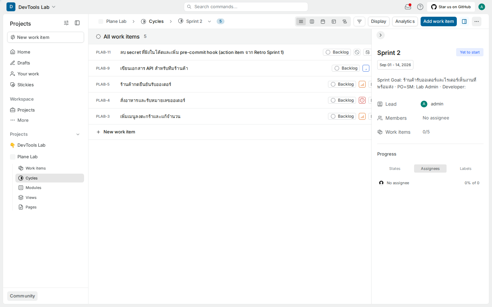

```bash
pc exec -T -e PGPASSWORD=plane plane-db psql -U plane -d plane -c "SELECT identifier, estimate_id FROM projects WHERE identifier='PLAB';" -c "SELECT count(*) AS items_with_points FROM issues i JOIN projects p ON p.id=i.project_id WHERE p.identifier='PLAB' AND i.estimate_point_id IS NOT NULL AND i.deleted_at IS NULL;"
```

✅ **Expected output** — ขณะปิด: `estimate_id` ว่าง แต่ work item ยังมี point ครบ 11 ใบ (สวิตช์แค่ **ถอดสาย** ไม่ได้ลบข้อมูล) — เปิดกลับแล้ว `estimate_id` กลับมาเป็นค่าเดิม:

```
 identifier | estimate_id
------------+-------------
 PLAB       |

 items_with_points
-------------------
                11
```

> 📝 **คำอธิบาย:** ถ้าอยาก "เปลี่ยนเป็น Categories" ต้องกดถังขยะลบระบบ Points แล้วสร้างใหม่ — การลบระบบจะ **ล้าง point ของทุกใบ** (`estimate_point` SET NULL) และ burndown แบบ points จะทำไม่ได้กับ categories (สไลด์ *Estimates ใน Plane*) — จึงทดลองแค่ปิดสวิตช์พอ

### ค. ลบ PBI-03 แล้ว seed ใหม่ → `created 1` และเลขไม่ถูกใช้ซ้ำ

**B1** → เปิดใบของ **PBI-03** "เพิ่มเมนูลงตะกร้าและแก้จำนวน" (ดูเลขจาก `--map`; ในภาพคือ `PLAB-3` — ตอนนี้อยู่ใน Sprint 2) → ปุ่ม **⋯** มุมขวาบน → **Delete** → ยืนยัน **Delete** ใน dialog *Delete Work item* → แล้วรัน :

```bash
python seed_backlog.py
pc exec -T -e PGPASSWORD=plane plane-db psql -U plane -d plane -c "SELECT 'PLAB-' || sequence_id AS item, external_id, deleted_at IS NOT NULL AS soft_deleted FROM issues WHERE external_id='PBI-03' ORDER BY sequence_id;" -c "SELECT max(sequence) AS last_sequence, count(*) AS rows FROM issue_sequences s JOIN projects p ON p.id=s.project_id WHERE p.identifier='PLAB';"
```

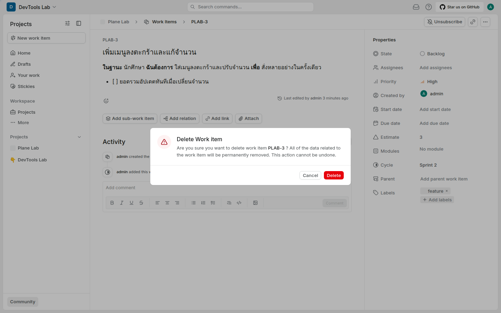

✅ **Expected output** — seed สร้างเฉพาะใบที่หาย (`created 1 / skipped 9`) เป็น **เลขใหม่** (ในภาพ `PLAB-12`; ของคุณคือ `max(sequence)+1` ของโปรเจกต์) ใบเก่าเป็น soft-delete และ `issue_sequences` ไม่ปล่อยเลขเดิมกลับมา — `last_sequence`/`rows` ของคุณจะมากกว่านี้เพราะรวมใบจาก LAB 1–3:

```
  skipped  PBI-02 (409 มีอยู่แล้ว id=914281cd…)
  created  PLAB-12  PBI-03   3 pt  เพิ่มเมนูลงตะกร้าและแก้จำนวน
  skipped  PBI-04 (409 มีอยู่แล้ว id=e72f11e2…)
        ...
created 1 / skipped 9 / API calls 14
  item   | external_id | soft_deleted
---------+-------------+--------------
 PLAB-3  | PBI-03      | t
 PLAB-12 | PBI-03      | f

 last_sequence | rows
---------------+------
            12 |   12
```

> 📝 **คำอธิบาย:** นี่คือคุณค่าของ idempotent seed: กู้ backlog ที่หายได้โดยไม่สร้างของซ้ำ · แต่ใบใหม่อยู่ใน **Backlog** ไม่ได้อยู่ใน Sprint 2 (ความสัมพันธ์กับ cycle ไม่ได้อยู่ใน CSV) · Plane ลบแบบ soft (`deleted_at`) แต่ UI มองไม่เห็นแล้ว และเลข `PLAB-n` **ไม่ถูกนำกลับมาใช้** (LAB 3 ทดลองเรื่องนี้แล้ว)

### ง. `?cycle_view=current` ตอบ list เปล่า ๆ แต่ view อื่นตอบ envelope (docs vs code)

```bash
T=$(cat ~/.plane_token); PID=$(python -c 'from planeapi import Plane; print(Plane().project("PLAB")["id"])')
B=http://localhost:8080/api/v1/workspaces/devtools-lab/projects/$PID; echo "$B"
for v in current upcoming completed; do echo "== ?cycle_view=$v"; curl -s -H "X-API-Key: $T" "$B/cycles/?cycle_view=$v" | python3 -c "
import sys,json; d=json.load(sys.stdin)
if isinstance(d, list): print('→ JSON list (bare) · len', len(d), [c['name'] for c in d])
else: print('→ JSON object (envelope) · keys', [k for k in d if k in ('results','next_cursor','next_page_results','total_results')], 'total_results', d['total_results'], [(c['name'], c['total_issues'], c['completed_issues']) for c in d['results']])"; done
```

> 📝 **คำอธิบาย:** `PID` คือ UUID ของโปรเจกต์ (ค่าเดียวกับบรรทัด `project:` ของ `python planeapi.py` ในข้อ 0 — รันจากโฟลเดอร์แล็บที่ venv เปิดอยู่) · ในโค้ด `views/cycle.py` เฉพาะ `current` `return Response(data)` ตรง ๆ ส่วน view อื่นผ่าน `self.paginate(...)` — client จึงต้องรับได้ทั้งสองแบบ (`planeapi.paginate()` ทำไว้แล้ว: ถ้าเป็น list ก็ `yield` ทั้งก้อน) · ตอนนี้ `current` ว่างเพราะ Sprint 1 ปิดไปแล้วและ Sprint 2 เริ่มพรุ่งนี้

✅ **Expected output** — บรรทัดแรกคือ URL ที่ประกอบได้ (UUID ของคุณต่างจากนี้):

```
http://localhost:8080/api/v1/workspaces/devtools-lab/projects/64fe6ece-0871-4ad9-8eeb-3e5ee87a7252
== ?cycle_view=current
→ JSON list (bare) · len 0 []
== ?cycle_view=upcoming
→ JSON object (envelope) · keys ['next_cursor', 'next_page_results', 'total_results', 'results'] total_results 1 [('Sprint 2', 5, 0)]
== ?cycle_view=completed
→ JSON object (envelope) · keys ['next_cursor', 'next_page_results', 'total_results', 'results'] total_results 1 [('Sprint 1', 3, 3)]
```

---

## แก้ปัญหาที่พบบ่อย

| อาการ | สาเหตุ | วิธีแก้ |
|---|---|---|
| `psql: error: ... fe_sendauth: no password supplied` | container `plane-db` ตั้ง `PGHOST=plane-db` ทำให้ psql ต่อผ่าน TCP ที่ต้องใช้รหัสผ่าน | ใส่ `-e PGPASSWORD=plane` หลัง `pc exec -T` ตามที่เอกสารใช้ทุกคำสั่ง |
| `seed_backlog.py` เตือน *โปรเจกต์ยังไม่มี Estimates แบบ points* และใบไม่มี point | สร้างระบบ Points แล้วแต่ยังไม่เปิดสวิตช์ **Enable estimates for my project** (`projects.estimate_id` ว่าง) | เปิดสวิตช์ในข้อ 2 แล้วลบใบที่ไม่มี point (หรือใส่ point ใน UI) ก่อน seed ใหม่ |
| `curl … users/me/` ตอบ **401** | ไม่ได้ส่ง header `X-API-Key` (ชื่อ header ผิด/ค่าว่าง) หรือยังไม่มี `~/.plane_token` จาก LAB 3 | ใช้ `-H "X-API-Key: $(cat ~/.plane_token)"` และตรวจว่าไฟล์ไม่ว่าง |
| `curl … users/me/` ตอบ **403** `Given API token is not valid` | token พิมพ์ผิด/หมดอายุ/ถูกปิด | สร้าง token ใหม่ที่ avatar → Settings → Developer → Personal Access Tokens แล้ว `echo '<YOUR_API_TOKEN>' > ~/.plane_token && chmod 600 ~/.plane_token` |
| `make_cycle.py` ตอบ `Cycles are not enabled for this project` | โปรเจกต์ปิด feature Cycles | Settings → Projects → Plane Lab → Features → เปิด **Cycles** (โปรเจกต์ที่สร้างจาก UI ปิดไว้ทั้งหมด) |
| `make_cycle.py --end -1` ตอบ `The Cycle has already been completed so it cannot be edited` | cycle นั้น Completed ไปแล้ว (end_date < now) — แก้อีกไม่ได้ | ถูกต้องตามออกแบบ; ถ้าต้องการ sprint ใหม่ให้สร้างชื่อใหม่ |
| ปุ่ม **Transfer work items** ไม่ขึ้น | cycle ยังไม่ Completed (end_date ยังไม่ผ่าน) | ทำข้อ 9 (`--end -1`) แล้ว reload |
| กราฟ burndown ไม่เปลี่ยนหลังรัน time machine | เบราว์เซอร์ใช้ข้อมูลเดิม (SWR) หรือ cache ฝั่ง api | reload หน้า (F5); ถ้ายังเดิม `pc exec api python manage.py clear_cache` แล้ว reload |
| dev1 ย้าย state ไม่ได้ / ไม่เห็นโปรเจกต์ | dev1 ยังไม่เป็นสมาชิกโปรเจกต์ | B1: Settings → Projects → Plane Lab → Members → **Add member** dev1 (Member) หรือให้ dev1 กด Join ในหน้า Projects |
| `⏳ 429 Too Many Requests — client รอ Ns` โผล่ระหว่างรันสคริปต์ | เกิน 60 request/นาที ของ token | ปกติ — `planeapi.py` รอตาม `Retry-After` / `X-RateLimit-Reset` แล้วส่งต่อเอง |

---

## เก็บกวาด (Cleanup)

แล็บนี้ **ไม่ลบ Plane** — LAB 5 ใช้ project, labels, cycles และ backlog ชุดนี้ต่อ (บอร์ด Kanban ต้องมีงานให้ไหล) · ปิดหน้าต่าง private (incognito) ของ dev1 (**B2**) และ `deactivate` venv ได้เลย

ถ้าอยากคืนวันที่ Done ให้เป็นค่าจริง (ไม่จำเป็น) ใช้คู่ของเครื่องย้อนเวลา :

```bash
pc exec -T -e PGPASSWORD=plane plane-db psql -U plane -d plane -f - < restore_done.sql
```

> 📝 **คำอธิบาย:** `restore_done.sql` คืนค่า `completed_at` จาก `lab4_completed_backup` แล้ว `DROP` ตารางสำรอง · ทำแล้วกราฟ Sprint 1 ในหน้า UI **ไม่เปลี่ยน** เพราะอ่านจาก `progress_snapshot` ที่แช่แข็งตอน Transfer — แต่ `cycle_report.py --cycle "Sprint 1"` จะเห็นทุกใบ Done วันเดียวกัน ·
> ถ้าจะปิดเครื่องเรียน: `pc stop` (ข้อมูลอยู่ใน volume) และเปิดคืนด้วย `pc start` ก่อน LAB 5 · **ห้าม** `pc down -v` จนกว่าจะจบ LAB 9

✅ **Expected output** (ถ้ารัน restore) — 3 แถวถูกคืนค่าเป็นวันนี้ แล้ว `DROP TABLE`:

```
BEGIN
--- restoring from lab4_completed_backup
UPDATE 3
  pbi   |  item   |         completed_at
--------+---------+-------------------------------
 PBI-01 | PLAB-1  | 2026-08-31 13:34:06.37341+00
 PBI-02 | PLAB-2  | 2026-08-31 13:34:06.42157+00
 PBI-10 | PLAB-10 | 2026-08-31 13:34:06.325948+00
(3 rows)

DROP TABLE
COMMIT
```

---

## สรุปคำสั่งของแล็บนี้

| คำสั่ง | ความหมาย |
|---|---|
| `python planeapi.py` | ทดสอบ token + หา UUID ของ PLAB (client ที่ทุกสคริปต์ import) |
| `python seed_backlog.py` | ป้อน `backlog.csv` แบบ idempotent (`external_source=lab`, `external_id=PBI-xx`) พร้อม estimate_point |
| `python make_cycle.py --name "Sprint 1" --start -4 --end +9 --description "..."` | สร้าง Cycle ด้วยวันที่สัมพัทธ์ (อดีตได้ — UI ทำไม่ได้) |
| `python make_cycle.py --name "Sprint 1" --end -1` | PATCH end_date เป็นเมื่อวาน → Completed → ปุ่ม Transfer โผล่ |
| `pc exec -T -e PGPASSWORD=plane plane-db psql -U plane -d plane -f - < sprint_time_machine.sql` | กระจาย `completed_at` ของงาน Done ไป −3/−2/−1 วัน (สำรองไว้ใน `lab4_completed_backup`) |
| `... -f - < restore_done.sql` | คืนค่า `completed_at` เดิม |
| `python cycle_report.py [--cycle "Sprint 1"]` | คำนวณ burndown (items + points) ด้วยสูตรเดียวกับ Plane |
| `python velocity.py` | velocity ต่อ cycle ที่ Completed + forecast จำนวน sprint ที่เหลือ |
| `bash check_lab04.sh` | ด่านหลักฐาน — ต้องได้ `PASS:` |
| `GET …/cycles/?cycle_view=current` · `…/cycle-issues/?expand=estimate_point` | endpoint หลักของแล็บ: cycle ปัจจุบัน (list เปล่า) และ work item พร้อม object ของ estimate point |

> **จำให้ขึ้นใจ:** burndown ของ Plane = `completed_at` อย่างเดียว · point เก็บเป็น string · cycle ที่ Completed แก้ไม่ได้ · Transfer แช่แข็ง `progress_snapshot`

## ✅ เช็กลิสต์ก่อนจบแล็บ

- [ ] หน้า Estimates มีระบบ **Points 1, 2, 3, 5, 8, 13** และสวิตช์ Enable เปิดอยู่ · SQL เห็น `value_type = character varying`
- [ ] `seed_backlog.py` รอบแรก `created 10` รอบสอง `skipped 10` · `--map` แสดงเลข `PLAB-n` ของ PBI-01…10 ในเครื่องคุณ และ Work items ทุกใบมี point
- [ ] `make_cycle.py` สร้าง Sprint 1 ที่ `start_date` เป็นอดีต สถานะ `In progress` และอธิบายได้ว่าทำไมต้องใช้ API
- [ ] เพิ่มงาน 7 ใบ = 19 points ด้วย Add existing work item และเห็น dropdown **Work items → Estimates** ในแผง Progress
- [ ] dev1 ย้าย 2 ใบเป็น In Progress แล้วกราฟ **ไม่ตก**; ย้าย Done → `completed_at` มีค่า; ย้ายกลับ → NULL
- [ ] รัน `sprint_time_machine.sql` แล้วกราฟไต่ลง 7 → 6 → 5 → 4 ใน 4 วัน เทียบเส้น Ideal
- [ ] `cycle_report.py` ได้ `วันนี้เหลือ 4 items / 13 points` ตรงกับกราฟ
- [ ] มี Page **Sprint 1 — Review & Retro** และ action item กลายเป็น work item label `tech-debt` (เห็น scope creep บนกราฟ)
- [ ] Sprint 1 เป็น **Completed**, Transfer 5 ใบ (PBI-03/04/05/09 + action item) ไป Sprint 2, SQL เห็น `progress_snapshot` (snap_total 8 / snap_done 3)
- [ ] `velocity.py` ได้ velocity 6 และ forecast ≈ 6 sprint · `bash check_lab04.sh` ขึ้น `PASS:`
- [ ] ทดลอง ก–ง: `CYCLE_COMPLETED` · ปิด/เปิด Estimates · seed หลังลบได้ `created 1` เป็นเลขใหม่ (ไม่ใช้เลขเดิมซ้ำ) · `current` เป็น list แต่ `completed` เป็น envelope
- [ ] ปิดหน้าต่าง B2 แล้ว **ไม่ได้** `pc down -v` — Plane ยังรันอยู่รอ LAB 5

*ผลลัพธ์ทั้งหมดในเอกสารนี้มาจากการรันจริงในเครื่องเรียน `tuchsanai/devtools:2569_1` (Plane v1.4.2) เมื่อ 31 ส.ค. 2026*
