# LAB 5 — Kanban บน Plane: states/groups · Board + swimlanes · WIP policy + guard · Views · Intake · flow metrics

> โฟลเดอร์ `005_LAB_Kanban_Flow` = **LAB 5** ในสไลด์ `Plane_Agile_Slides.html` (ตอนที่ 3 · เครื่องมือพัฒนาแบบ Agile (Scrum & Kanban) — Kanban · WIP · flow metrics)
> (ไฟล์ของแล็บนี้ : `wip_policy.json` · `wip_guard.py` · `flow_metrics.py` · `flow_time_machine.sql` · `kanban_policy.md` · `planeapi.py` · `check_lab05.sh` · `requirements.txt`)
> (เวลาโดยประมาณ : 55 นาที)

## สิ่งที่จะได้เรียนรู้

- ออกแบบ workflow ของทีมด้วย **state + group** (backlog · unstarted · started · completed · cancelled) และเข้าใจว่า group คือสิ่งที่ metric ทุกตัวอ่าน
- ใช้ **Board layout**: Group by State · **Sub-group by** Assignees = swimlanes · Display properties · ลากการ์ดแล้วดู activity
- ประกาศ **explicit policies** (DoR · DoD · WIP limit) ใน Page และ **บังคับ WIP ด้วยสคริปต์** เพราะ Plane CE ไม่มี WIP limit ในบอร์ด
- บันทึก **Views** (filter + layout) ให้ทั้งทีมใช้ซ้ำ และใช้ **Intake** เป็นด่าน triage (Pending → Accepted / Declined / Snoozed)
- คำนวณ **lead time · cycle time · throughput · WIP** จาก activity log ของจริง แล้วตรวจ **Little's Law**

## ทฤษฎีที่เกี่ยวข้อง

- **Kanban 6 practices** (Anderson 2010): visualize · limit WIP · manage flow · make policies explicit · feedback loops · improve collaboratively — แล็บนี้แตะครบทั้ง 6 (บอร์ด · `wip_guard.py` · flow metrics · `kanban_policy.md` · retro ใน Page · ปรับ limit)
- **Lead time vs cycle time**: lead = ตั้งแต่ "ขอ" (created) จนเสร็จ (completed_at) — มุมลูกค้า; cycle = ตั้งแต่ "ลงมือ" (เข้า state กลุ่ม started ครั้งแรก) จนเสร็จ — มุมทีม; throughput = จำนวนใบที่เสร็จต่อวัน
- **Little's Law**: WIP ≈ throughput × cycle time → อยากให้งานออกเร็วขึ้น ให้ **ลด WIP** ก่อนเพิ่มคน ("stop starting, start finishing")
- **Cumulative Flow Diagram**: ความสูงของแถบ started = WIP · ความกว้างแนวนอน = lead time · แถบ Done ที่ชันขึ้น = throughput ดี
- **Plane CE ไม่มี WIP limit และ workflow rule** (ลากการ์ดเข้าคอลัมน์ไหนก็ได้) — นโยบายจึงต้องอยู่ที่คน + สคริปต์ ต่างจาก Jira ที่ตั้ง column limit และ transition rule ในเครื่องมือ
- **Intake = triage**: งานที่ส่งเข้าอยู่ใน state ซ่อน `Triage` จนกว่าจะ Accept — บอร์ดจึงมีแต่งานที่ทีมรับแล้ว (Jira Service Management / Trello inbox ทำหน้าที่เดียวกัน)

## ภาพรวมของแล็บนี้

1. **เพิ่ม state** `Ready` (Unstarted) และ `In Review` (Started) → บอร์ด 7 คอลัมน์
2. **Board**: Group by State · Show empty groups · ลากการ์ด → Activity
3. **Swimlanes**: Sub-group by Assignees แล้วพิสูจน์ว่า Group by None ทำให้ Sub-group หายไป
4. **นโยบาย WIP**: Page "Kanban Policies" + `wip_guard.py` (OK → VIOLATION → OK · โหมด `--watch` · `--comment`)
5. **Views**: "Expedite lane" (Urgent/High) และ "My open items"
6. **Intake**: เปิดฟีเจอร์ → dev1 ส่ง 3 เรื่อง → admin Accept / Decline / Snooze → SQL `intake_issues.status`
7. **Calendar · Timeline · Table** layouts
8. **time machine + `flow_metrics.py`**: lead/cycle time · throughput · WIP · Little's Law · ASCII CFD
9. **`check_lab05.sh`** พิมพ์ `PASS`

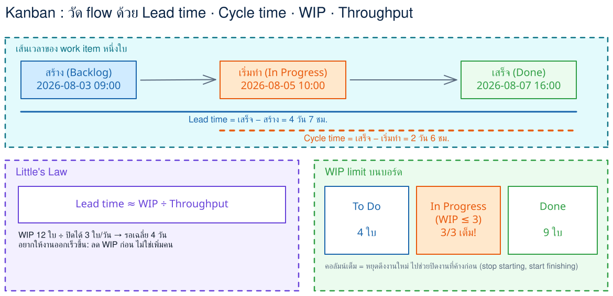

> **คำถามก่อนเริ่ม:** Plane CE ไม่มี WIP limit ในบอร์ด — ทีมจะบังคับนโยบายอย่างไร? และถ้า WIP 2 ใบ ปิดได้ 1.29 ใบ/วัน งานใบใหม่จะรอกี่วัน? (เฉลยอยู่ในข้อ 4 และข้อ 8)

### Terminal Map

| หน้าต่าง | หน้าที่ | เปิดเมื่อใด |
|---|---|---|
| **T1** | SQL · สคริปต์ Python | ตั้งแต่เริ่ม |
| **T2** | `python wip_guard.py --watch 15` (ค้างไว้) | ข้อ 4 |
| **B1 / B2** | เบราว์เซอร์ admin / private window ของ dev1 | ตั้งแต่เริ่ม / ข้อ 6 |

> ภาพหน้าจอในเอกสารนี้จับจากเครื่องทดสอบซึ่งอาจแสดง port อื่น (เช่น `localhost:8085`) — ของผู้เรียนคือ `localhost:8080`

---

## 0. เตรียมเครื่องเรียน

ต้องผ่าน LAB 3–4 (token ใน `~/.plane_token`, venv `~/venv-plane`, dev1 เป็น Member, PBI 10 ใบจาก `seed_backlog.py`):

```bash
docker start devtools 2>/dev/null || \
  docker run -dit --name devtools --privileged -p 2222:22 -p 8080:8080 tuchsanai/devtools:2569_1
ssh root@localhost -p 2222        # password : passwd
cd ~/labwork/DevTools/03_Application_Docker/Plane/005_LAB_Kanban_Flow
source ~/venv-plane/bin/activate && pip install -r requirements.txt -q
curl -s -o /dev/null -w '%{http_code}\n' -H "X-API-Key: $(cat ~/.plane_token)" http://localhost:8080/api/v1/users/me/
```

✅ **Expected output** — `200` (Plane พร้อมและ token ใช้ได้)

---

## 1. ออกแบบคอลัมน์ด้วย state + group

B1: **Settings → Projects → Plane Lab → States** → ในกลุ่ม **Unstarted** กด **+** เพิ่ม `Ready` · ในกลุ่ม **Started** เพิ่ม `In Review` (เลือกสีให้ต่างจากเดิม) → ลากเรียงให้เป็น Backlog · Todo · Ready · In Progress · In Review · Done · Cancelled

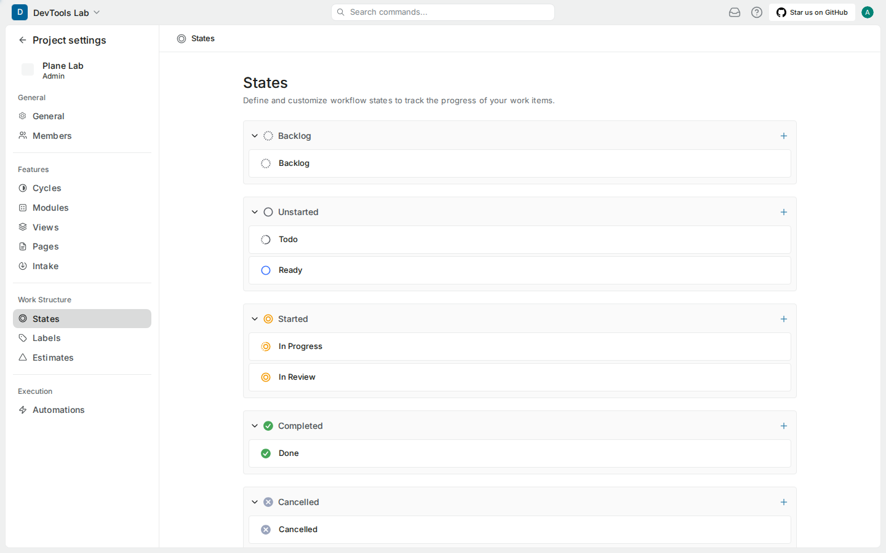

> 📝 **คำอธิบาย:** **ชื่อ** state ตั้งได้อิสระ แต่ **group** มี 5 ค่าตายตัว — Plane ใช้ group ตัดสินว่างาน "เริ่มแล้ว" (started) หรือ "เสร็จ" (completed) ทั้งใน burndown, analytics และ `completed_at` · state ที่เป็น **Default** (Backlog) ลบไม่ได้ และลบ state ที่ยังมีงานอยู่ไม่ได้ (ทดลองเพิ่มเติม ข.)

```bash
pc exec -T -e PGPASSWORD=plane plane-db psql -U plane -d plane -c \
 "select name, \"group\", sequence, \"default\" from states where project_id=(select id from projects where identifier='PLAB') and deleted_at is null order by sequence;"
```

> 📝 **คำอธิบาย:** ตาราง `states` เก็บ `name` (ที่ผู้ใช้ตั้ง) แยกจาก `"group"` (5 ค่าตายตัว + `triage`) และ `sequence` (ลำดับคอลัมน์) — คำสั่งนี้กรองเฉพาะโปรเจกต์ `PLAB` และตัดแถวที่ถูกลบ (`deleted_at is null`)

✅ **Expected output** — 8 แถว (รวม `Triage` ที่ UI ซ่อน) และ state ใหม่ได้ `sequence` ต่อท้าย (max + 15000):

```
    name     |   group   | sequence | default
-------------+-----------+----------+---------
 Backlog     | backlog   |    15000 | t
 Todo        | unstarted |    25000 | f
 In Progress | started   |    35000 | f
 Done        | completed |    45000 | f
 Cancelled   | cancelled |    55000 | f
 Triage      | triage    |    65000 | f
 Ready       | unstarted |    70000 | f
 In Review   | started   |    85000 | f
(8 rows)
```

---

## 2. Board layout — 7 คอลัมน์

B1: **Work items** → ไอคอน layout ตัวที่ 2 (**Board**) → **Display** → Group by **State** · Sub-group by **None** · Order by **Manual** · **Show empty groups** (v1.4.2 เปิดอยู่แล้วโดยปริยาย — คอลัมน์ว่างอย่าง Ready/In Review/Cancelled จึงโผล่ทันที) · คอลัมน์กว้าง 350 px จึงเห็นได้ราว 5 คอลัมน์บนจอ 1440 px — กดไอคอนย่อ sidebar (มุมซ้ายบน) และปุ่ม **⤢** ที่หัวคอลัมน์ Done/Cancelled เพื่อย่อให้เห็นครบ 7 คอลัมน์

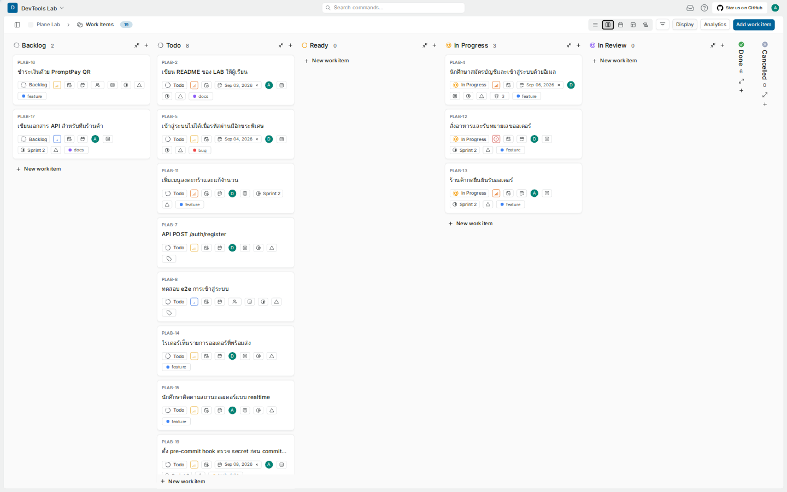

ลากการ์ด PBI จาก LAB 4 ตามชื่อ (เลข PLAB-N ของแต่ละเครื่องต่างกัน): `ไรเดอร์เห็นรายการออเดอร์ที่พร้อมส่ง` (PBI-06) และ `นักศึกษาติดตามสถานะออเดอร์แบบ realtime` (PBI-07) จาก Backlog/Todo → **Ready** · `สั่งอาหารและรับหมายเลขออเดอร์` (PBI-04 ที่กำลังทำอยู่) จาก In Progress → **In Review**

> 📝 **คำอธิบาย:** การลากคือการเปลี่ยน `state` — Plane บันทึก activity `state: Todo → Ready` ให้ทุกครั้ง (หลักฐานที่ `flow_metrics.py` ใช้ในข้อ 8) · ลำดับคอลัมน์ตามค่า `sequence` ของ state

✅ **Expected output** — คอลัมน์ Ready มี 2 ใบ · In Review 1 ใบ · In Progress เหลือ 2 ใบ และ Activity ของการ์ดมีบรรทัด `changed state from Todo to Ready`

---

## 3. Swimlanes ด้วย Sub-group by

**Display → Sub-group by → Assignees**

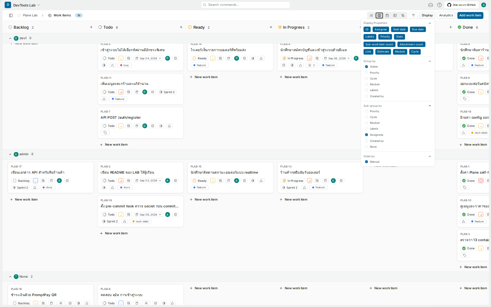

> 📝 **คำอธิบาย:** swimlane = แถวแนวนอนที่ตัดบอร์ดด้วยมิติที่สอง — ตอบคำถาม "ใครถืองานเยอะ" ในพริบตา · ลอง Group by **None**: ตัวเลือก Sub-group by **หายไป** เพราะ swimlane ต้องมีคอลัมน์ให้ตัด · ตั้งกลับเป็น State × Assignees ก่อนไปข้อถัดไป

✅ **Expected output** — แถว `admin` · `dev1` · `No assignee` และการ์ดอยู่ในช่องตัดของ (state, assignee)

---

## 4. นโยบาย WIP — เขียนให้เห็น แล้วบังคับด้วยสคริปต์

B1: **Pages → New page** ชื่อ `Kanban Policies` วางเนื้อหาจาก `kanban_policy.md` (คอลัมน์และความหมาย · DoR · DoD · WIP limit In Progress ≤ 3, In Review ≤ 2)

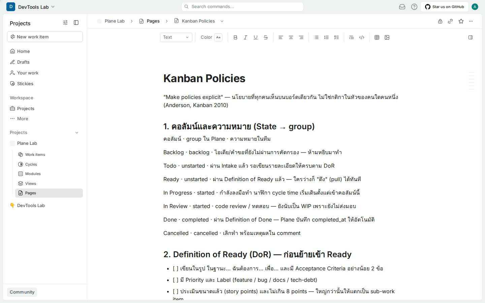

T1: อ่านนโยบายเป็นโค้ดใน `wip_policy.json` แล้วตรวจครั้งเดียว

```bash
cat wip_policy.json
python wip_guard.py; echo "exit=$?"
```

> 📝 **คำอธิบาย:** `wip_guard.py` นับการ์ดจริงในแต่ละ state ผ่าน REST API (3 request ตอนเริ่ม + 1 request ต่อรอบ) เทียบกับ limit ในไฟล์ · **exit code 1 เมื่อเกิน** จึงใช้เป็นด่านใน CI ได้ · นี่คือสิ่งที่ Jira ทำให้ในตัว (column limit) แต่ CE ต้องเสริมเอง

✅ **Expected output**

```
{
  "In Progress": 3,
  "In Review": 2
}
state         wip  limit  status
In Progress     2      3  OK
In Review       1      2  OK

✓ ทุกคอลัมน์อยู่ในนโยบาย
requests used: 3 · X-RateLimit-Remaining: 55
exit=0
```

T2: เปิดโหมดเฝ้าดู แล้วใน B1 ลากการ์ด 2 ใบจาก Ready (PBI-06, PBI-07) เข้า **In Progress** → คอลัมน์มี 4 ใบ (เกิน 3)

```bash
python wip_guard.py --watch 15
```

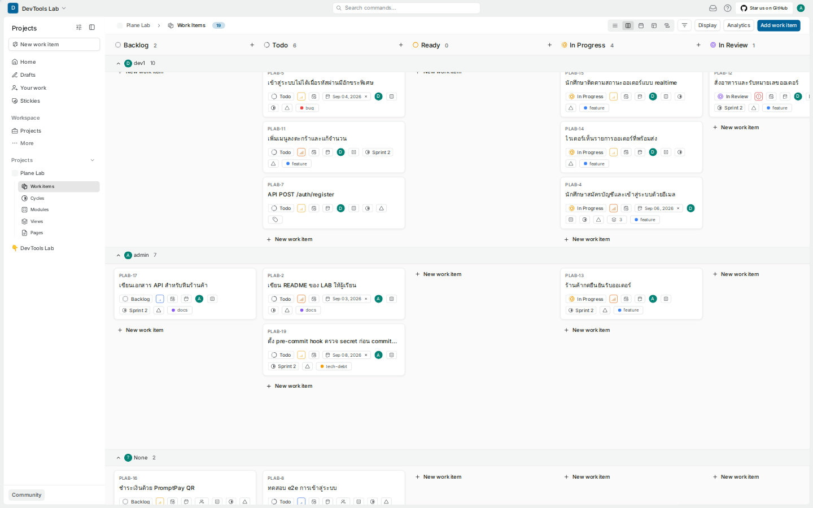
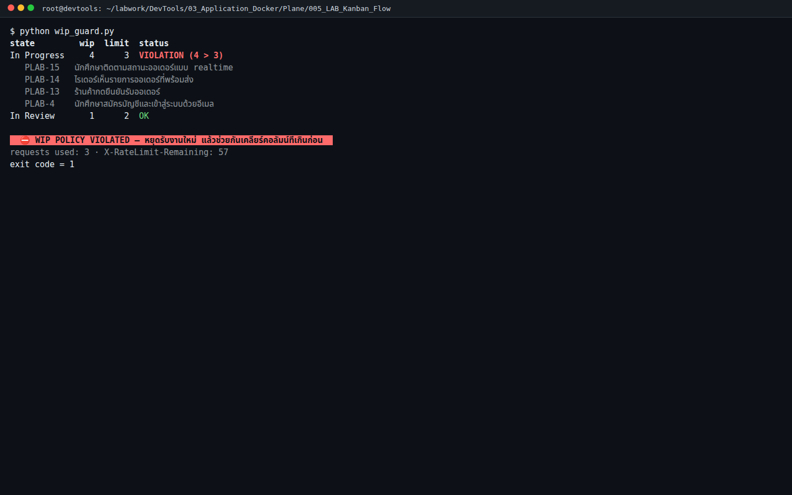
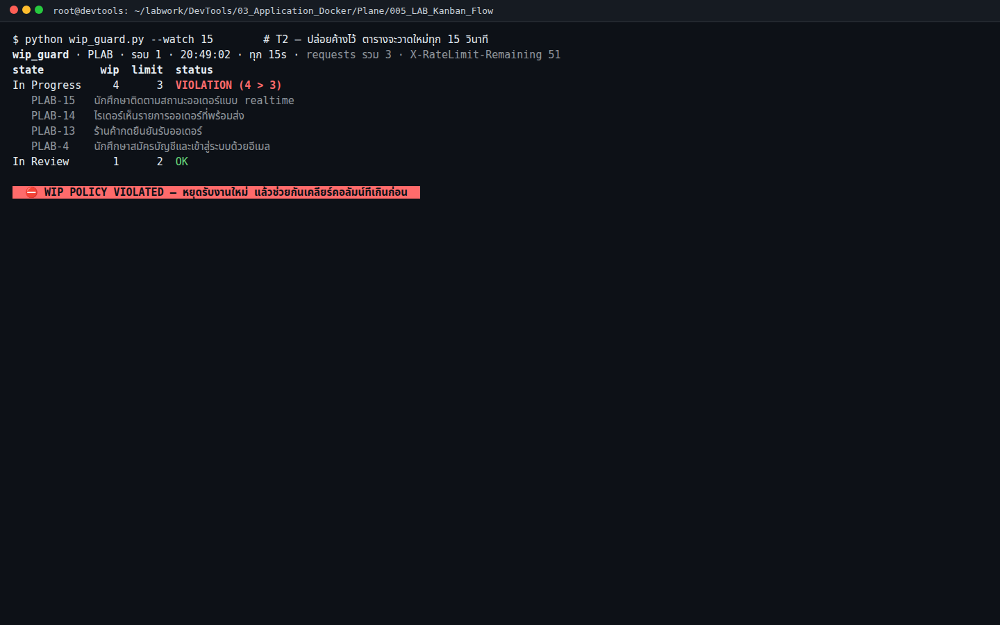

✅ **Expected output** — แถว `In Progress 4 3 VIOLATION (4 > 3)` สีแดง ภายใน 15 วินาที · ลากการ์ด 2 ใบกลับไป Ready → `OK` · กด Ctrl+C หยุด

> 📝 **คำอธิบาย:** `--watch 15` ใช้ 4 request/นาที จากโควตา 60 ของ token — ออกแบบให้อยู่ในงบเสมอ (ดู `X-RateLimit-Remaining` ท้ายตาราง) · ตัวเลือก `--comment` จะโพสต์คำเตือนลงการ์ดใบล่าสุดของคอลัมน์ที่เกิน (1 ครั้งต่อการละเมิด) — ลองแล้วดูใน Activity ของการ์ด

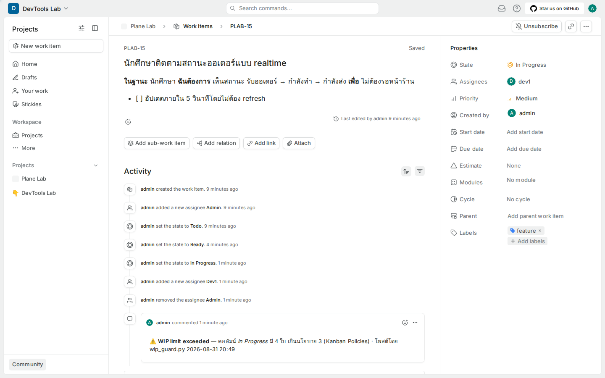

---

## 5. Views — filter ที่ทั้งทีมใช้ซ้ำ

B1: **Work items** → **Filters** Priority = Urgent, High → layout Board → **Views → Add view** ชื่อ `Expedite lane` (Public) → บันทึก · สร้างอีก view `My open items` (Assignee = ฉัน, State group ≠ Done)

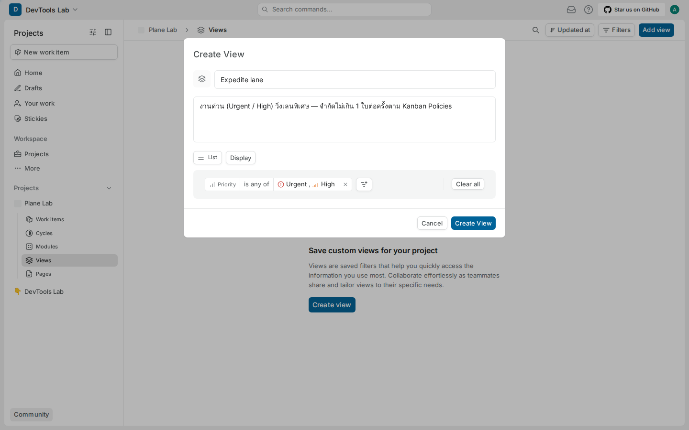
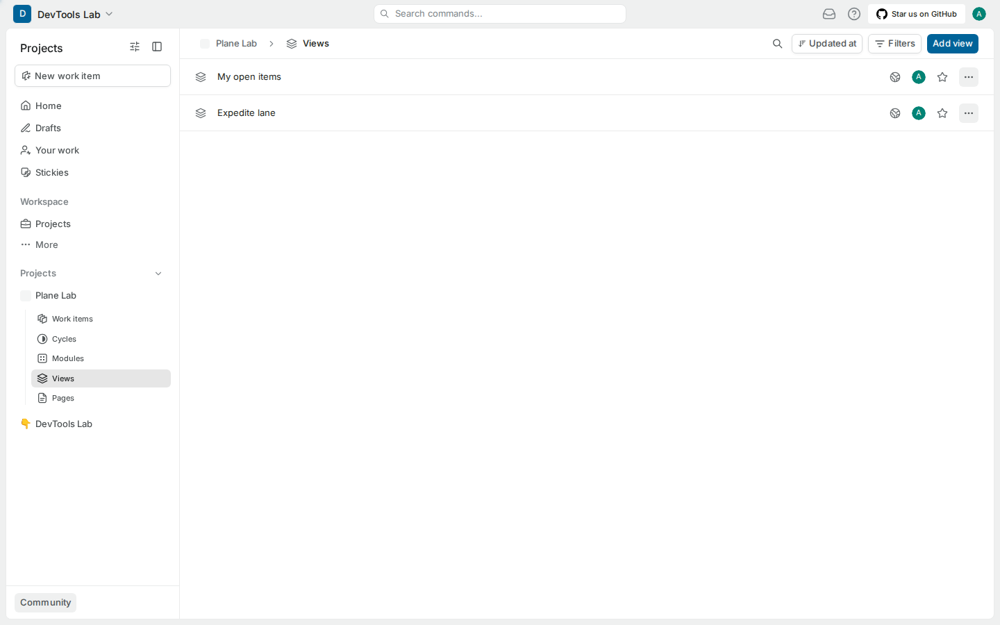

```bash
pc exec -T -e PGPASSWORD=plane plane-db psql -U plane -d plane -c \
 "select name, access from issue_views where project_id=(select id from projects where identifier='PLAB') and deleted_at is null;"
```

> 📝 **คำอธิบาย:** view = filter + layout + display ที่มีชื่อ เก็บในตาราง `issue_views` — เทียบได้กับ **saved filter / JQL** ของ Jira · "Expedite lane" คือ class of service ของ Kanban: งานด่วนวิ่งเลนพิเศษแต่ต้อง **จำกัดจำนวน** (ใส่ไว้ในนโยบายข้อ 4)

✅ **Expected output** — 2 แถวของเรา (`access = 1` คือ Public):

```
      name      | access
----------------+--------
 Expedite lane  |      1
 My open items  |      1
(2 rows)
```

---

## 6. Intake — รับเรื่องเข้าแล้วคัดกรองก่อน

B1: **Settings → Projects → Plane Lab → Features → Intake** เปิดสวิตช์ → sidebar มีแท็บ **Intake**

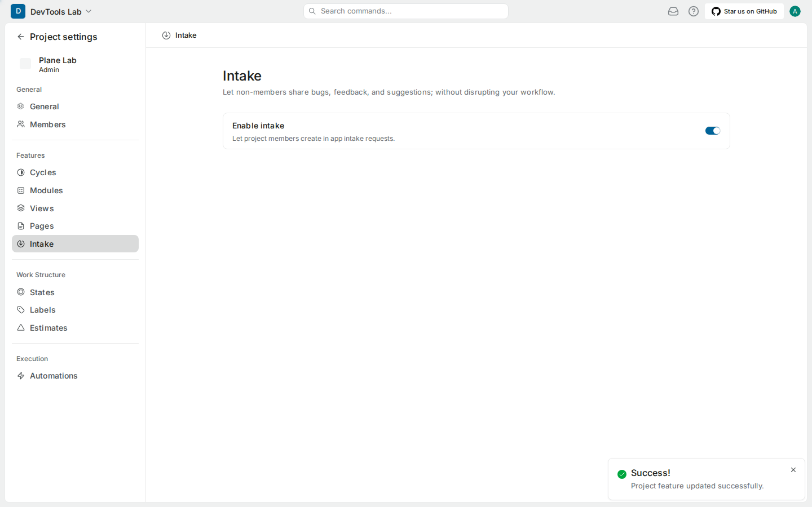

B2 (dev1): **Intake → Add work item** ส่ง 3 เรื่อง: `แอปเด้งออกตอนกดจ่ายเงินด้วย QR บน Android` · `ขอเพิ่มตัวกรองร้านค้าที่เปิดอยู่ตอนนี้` · `เปลี่ยนสีปุ่มสั่งอาหารเป็นสีม่วง`

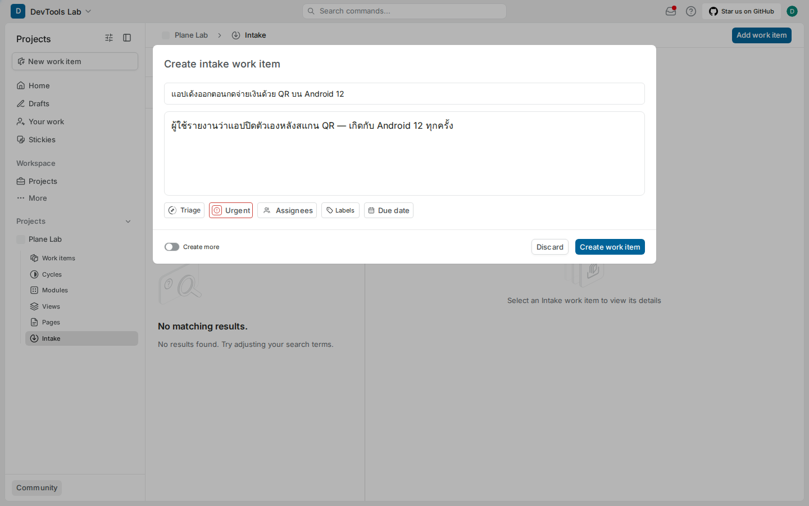
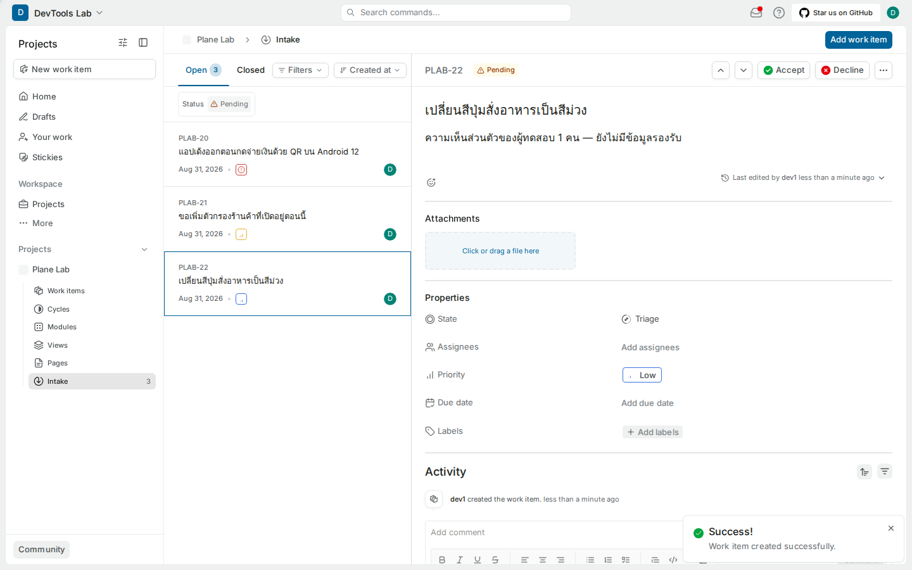

B1 (admin): เปิดแท็บ **Intake** → เรื่องที่ 1 **Accept** · เรื่องที่ 3 **Decline** · เรื่องที่ 2 **Snooze**

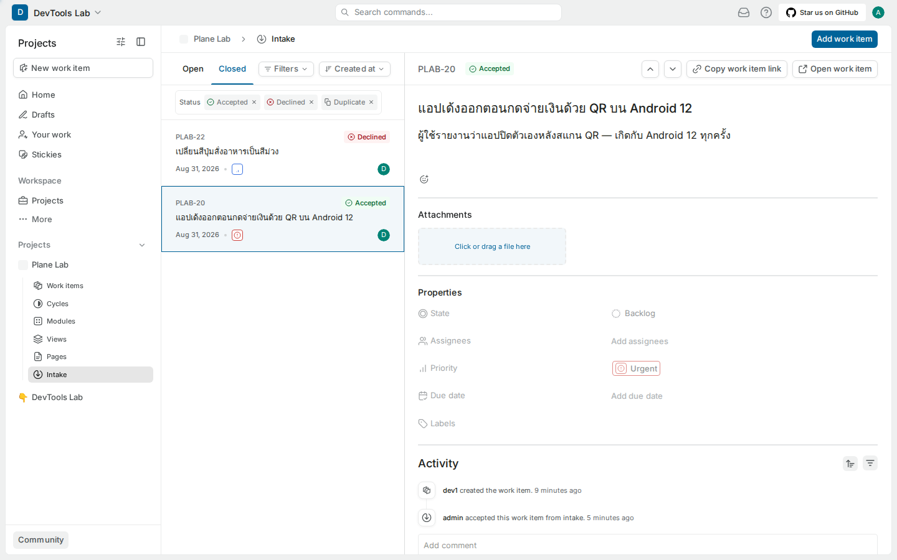
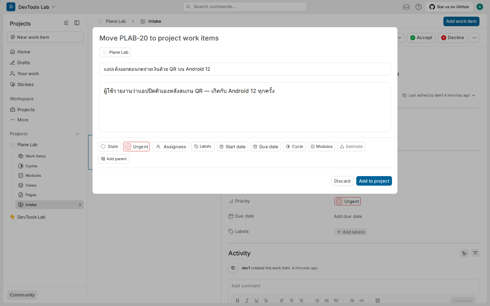
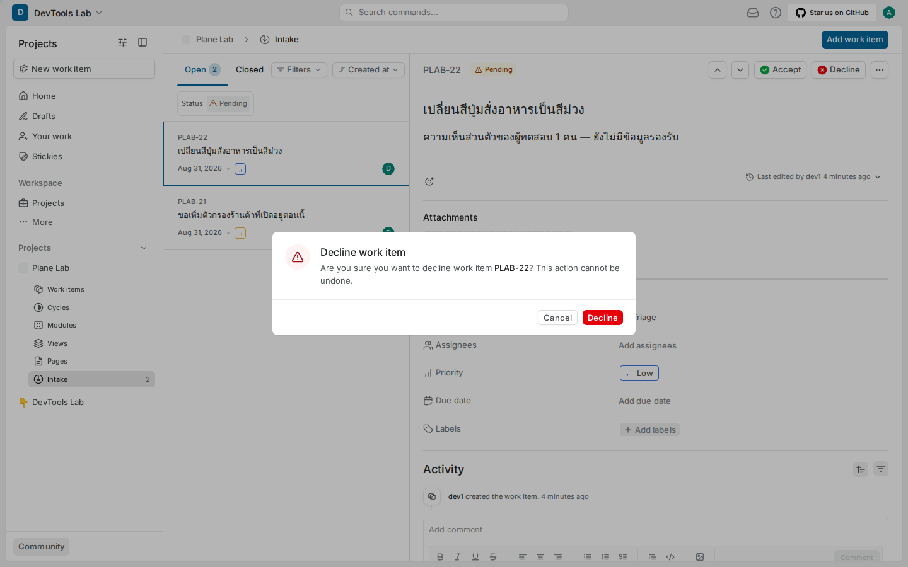
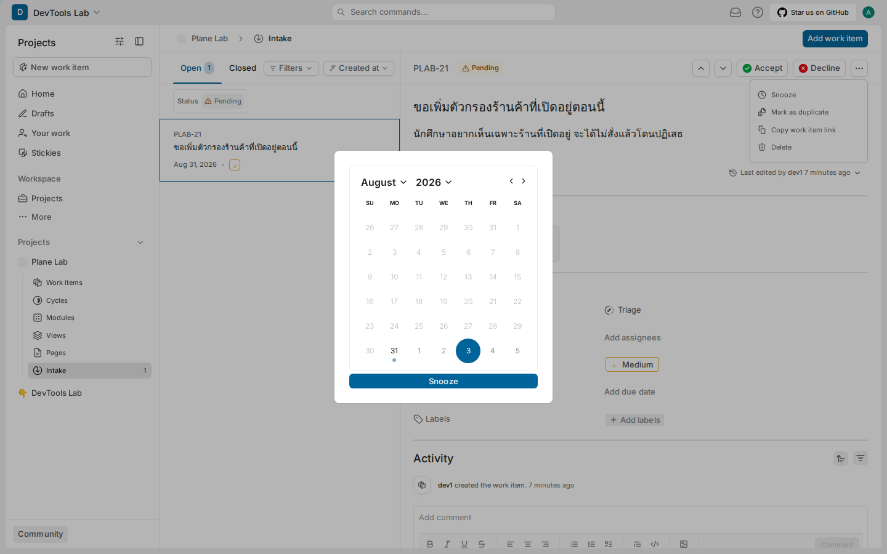
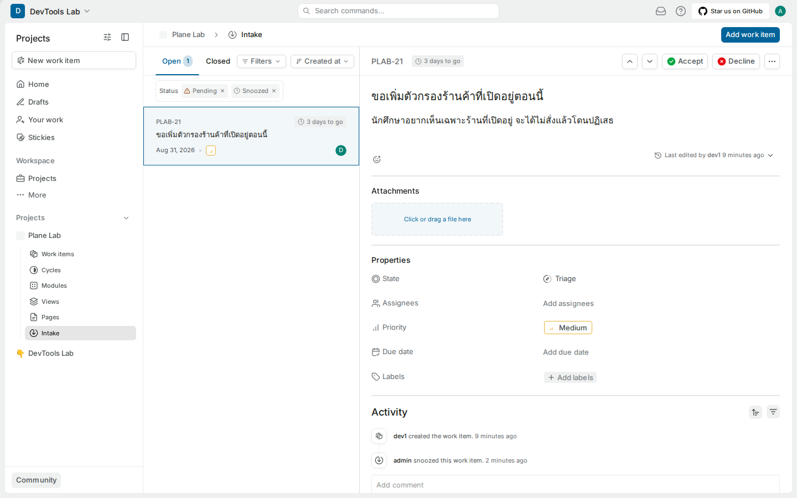

```bash
pc exec -T -e PGPASSWORD=plane plane-db psql -U plane -d plane -c \
 "select ii.status, left(i.name,40) from intake_issues ii join issues i on i.id=ii.issue_id where ii.deleted_at is null order by ii.created_at;"
```

> 📝 **คำอธิบาย:** ตาราง `intake_issues` เก็บผลการ triage ไว้ในคอลัมน์ `status` ตัวเดียว · งานที่ส่งเข้าอยู่ใน state **Triage** (ซ่อนจากบอร์ดและ list) จนกว่า admin/member ของโปรเจกต์จะ Accept → ย้ายไป Backlog · Decline = ไม่ทำ (บันทึกเหตุผล) · Snooze = กลับมาดูวันที่กำหนด · การเปิดฟีเจอร์สร้างแถว `intakes` ให้อัตโนมัติ

✅ **Expected output** — `1` Accepted · `0` Snoozed · `-1` Declined (Pending = -2, Duplicate = 2):

```
 status |                 left
--------+--------------------------------------
      1 | แอปเด้งออกตอนกดจ่ายเงินด้วย QR บน Androi
      0 | ขอเพิ่มตัวกรองร้านค้าที่เปิดอยู่ตอนนี้
     -1 | เปลี่ยนสีปุ่มสั่งอาหารเป็นสีม่วง
(3 rows)
```

---

## 7. Calendar · Timeline · Table

ใส่ **Start date / Due date** ให้การ์ด 4 ใบ (PBI-04 · PBI-05 · PBI-06 · PBI-07 — คลิกไอคอนปฏิทินบนการ์ด) แล้วสลับ layout ด้วยไอคอนแถวบน: **Calendar** (ไอคอนที่ 3 · **Options → Month/Week layout · Show weekends** — เสาร์-อาทิตย์ซ่อนอยู่โดยปริยาย เปิดเพื่อเห็น Due ที่ตกวันหยุด · กด › ไปเดือนถัดไป) · **Timeline** (ไอคอนที่ 5 · zoom week/month/quarter · ลากยืดวันที่ได้) · **Table** (ไอคอนที่ 4 · แก้ priority หลายแถวเร็ว ๆ)

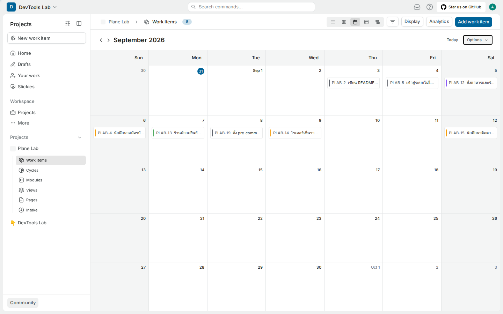
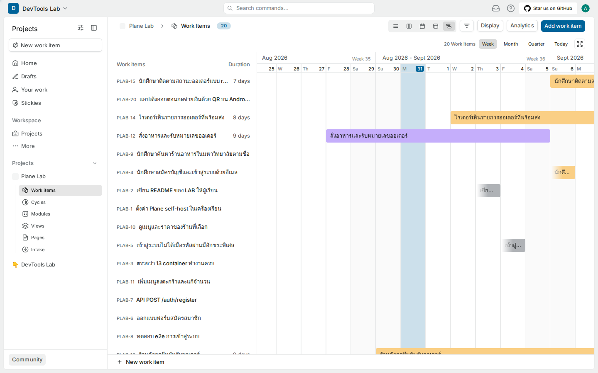
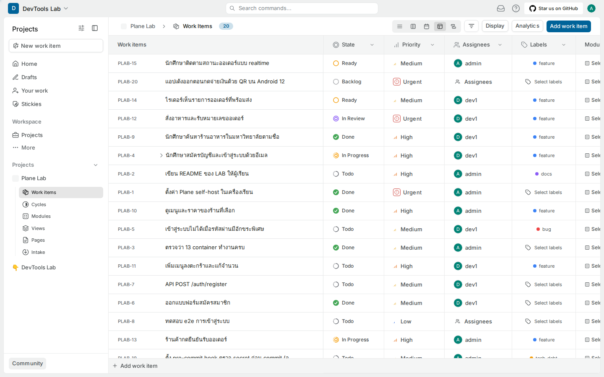

> 📝 **คำอธิบาย:** ทั้งสาม layout อ่านข้อมูลชุดเดียวกับ Board (ตาราง `issues`) ต่างกันแค่มิติที่ใช้วาง: Calendar ใช้ `target_date` · Timeline ใช้ `start_date → target_date` · Table ไม่ใช้วันที่จึงเห็นทุกใบ · Timeline ใน CE ไม่มีลูกศร dependency (feature ของ EE) — ใช้ relation **Blocked by** ใน work item แทน (LAB 3) · Table เหมาะกับการ "ทำความสะอาด" backlog หลายใบพร้อมกัน

✅ **Expected output** — การ์ด 4 ใบที่มีวันที่ปรากฏบน Calendar (ในช่องวัน Due) และเป็นแท่งบน Timeline; การ์ดที่ไม่มีวันที่จะไม่แสดงในสอง layout นี้แต่ยังอยู่ครบใน Table

---

## 8. Flow metrics จาก activity log

แล็บใช้เวลาราว 55 นาที แต่ metric ต้องการประวัติหลายวัน — ใช้ "เครื่องย้อนเวลา" กับ PBI 6 ใบของ CampusEats — เลือกด้วย `external_id` ที่ `seed_backlog.py` (LAB 4) ใส่ไว้ ไม่ใช่เลข PLAB-N (ซึ่งต่างกันในแต่ละเครื่อง): PBI-01 · PBI-02 · PBI-10 (Done ตั้งแต่ Sprint 1) และ PBI-03 · PBI-05 · PBI-09 (จาก Sprint 2) ถูกตั้ง state = **Done** พร้อม `created_at` / `completed_at` และ activity `Backlog → Todo → In Progress → Done` กระจายใน 7 วัน ส่วนใบที่อยู่ในกลุ่ม started ตอนนี้ (สูงสุด 3 ใบ) ได้ activity "เริ่มทำ" ย้อนหลัง 5 / 3 / 1 วัน (สำรองแถวเดิมไว้ในตาราง `lab5_backup_*`):

```bash
pc exec -T -e PGPASSWORD=plane plane-db psql -U plane -d plane -f - < flow_time_machine.sql | tail -5
python flow_metrics.py --days 7
```

> 📝 **คำอธิบาย:** `flow_metrics.py` ดึง work items 1 หน้า + activities ของแต่ละใบ (พิมพ์ยอด request ที่ใช้) · lead = `completed_at − created_at` · cycle = `completed_at −` เวลาที่เข้า state กลุ่ม **started** ครั้งแรก · throughput = ใบที่เสร็จใน 7 วัน ÷ 7 · WIP = ใบในกลุ่ม started ตอนนี้ · p50/p85 คือเปอร์เซ็นไทล์ (85% ของงานเสร็จภายใน…) ที่ใช้พยากรณ์ได้ดีกว่าค่าเฉลี่ย

✅ **Expected output** — `tail -5` ของ time machine แสดง 2 แถวท้ายของตาราง AFTER (state = Done, `lead_h` ไม่ใช่ศูนย์) แล้วตามด้วย `COMMIT`:

```
 PLAB-17 | PBI-09 | Done        | 2026-08-28 13:52:28.054077+00 | 2026-08-31 01:52:28.054077+00 |     60 |                3
 PLAB-18 | PBI-10 | Done        | 2026-08-26 13:52:28.054077+00 | 2026-08-29 13:52:28.054077+00 |     72 |                3
(8 rows)

COMMIT
```

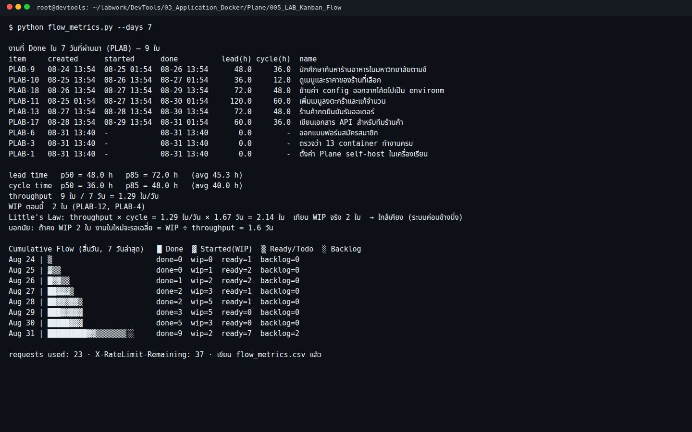

ผลของ `flow_metrics.py` (ตัวเลขของแต่ละคนต่างกันตามเวลาที่ลากการ์ดและจำนวนใบที่ Done มาจากแล็บก่อน):

```
งานที่ Done ใน 7 วันที่ผ่านมา (PLAB) — 9 ใบ
item     created      started      done          lead(h) cycle(h)  name
PLAB-9   08-24 13:52  08-25 01:52  08-26 13:52      48.0     36.0  นักศึกษาค้นหาร้านอาหารในมหาวิทยาลัยตามชื
PLAB-10  08-25 13:52  08-26 13:52  08-27 01:52      36.0     12.0  ดูเมนูและราคาของร้านที่เลือก
PLAB-18  08-26 13:52  08-27 13:52  08-29 13:52      72.0     48.0  ย้ายค่า config ออกจากโค้ดไปเป็น environm
PLAB-11  08-25 01:52  08-27 13:52  08-30 01:52     120.0     60.0  เพิ่มเมนูลงตะกร้าและแก้จำนวน
PLAB-13  08-27 13:52  08-28 13:52  08-30 13:52      72.0     48.0  ร้านค้ากดยืนยันรับออเดอร์
PLAB-17  08-28 13:52  08-29 13:52  08-31 01:52      60.0     36.0  เขียนเอกสาร API สำหรับทีมร้านค้า
PLAB-6   08-31 13:40  -            08-31 13:40       0.0        -  ออกแบบฟอร์มสมัครสมาชิก
PLAB-3   08-31 13:40  -            08-31 13:40       0.0        -  ตรวจว่า 13 container ทำงานครบ
PLAB-1   08-31 13:40  -            08-31 13:40       0.0        -  ตั้งค่า Plane self-host ในเครื่องเรียน

lead time   p50 = 48.0 h   p85 = 72.0 h   (avg 45.3 h)
cycle time  p50 = 36.0 h   p85 = 48.0 h   (avg 40.0 h)
throughput  9 ใบ / 7 วัน = 1.29 ใบ/วัน
WIP ตอนนี้  2 ใบ (PLAB-12, PLAB-4)
Little's Law: throughput × cycle = 1.29 ใบ/วัน × 1.67 วัน = 2.14 ใบ  เทียบ WIP จริง 2 ใบ  → ใกล้เคียง (ระบบค่อนข้างนิ่ง)
บอกนัย: ถ้าคง WIP 2 ใบ งานใบใหม่จะรอเฉลี่ย ≈ WIP ÷ throughput = 1.6 วัน

Cumulative Flow (สิ้นวัน, 7 วันล่าสุด)   █ Done  ▓ Started(WIP)  ▒ Ready/Todo  ░ Backlog
Aug 24 | ▒                        done=0  wip=0  ready=1  backlog=0
Aug 25 | ▓▒▒                      done=0  wip=1  ready=2  backlog=0
Aug 26 | █▓▓▒▒                    done=1  wip=2  ready=2  backlog=0
Aug 27 | ██▓▓▓▒                   done=2  wip=3  ready=1  backlog=0
Aug 28 | ██▓▓▓▓▓▒                 done=2  wip=5  ready=1  backlog=0
Aug 29 | ███▓▓▓▓▓                 done=3  wip=5  ready=0  backlog=0
Aug 30 | █████▓▓▓                 done=5  wip=3  ready=0  backlog=0
Aug 31 | █████████▓▓▒▒▒▒▒▒▒░░     done=9  wip=2  ready=7  backlog=2

requests used: 23 · X-RateLimit-Remaining: 22 · เขียน flow_metrics.csv แล้ว
```

> **อ่านผล:** 6 ใบจาก time machine มี lead 36–120 h · อีก 3 ใบ (`PLAB-1/3/6` จาก LAB 1–3) ถูกสร้างและปิดในชั่วโมงเดียวกันจึงมี lead ≈ 0 และไม่มี cycle (ไม่เคยผ่าน state กลุ่ม started) — ใบแบบนี้ดึง p50 ลง (48 h แทน 66 h ถ้าตัดออก) นี่คือเหตุผลที่ทีมจริงต้องดู **การกระจาย** ไม่ใช่ค่าเฉลี่ย · Little's Law: 1.29 ใบ/วัน × 1.67 วัน ≈ 2.1 ใบ ใกล้ WIP จริง 2 ใบ → ระบบค่อนข้างนิ่ง งานใบใหม่รอราว 1.6 วัน · แต่ CFD วันที่ 28–29 ส.ค. แถบ ▓ กว้างถึง 5 = ช่วงที่ทีม "เริ่ม" เร็วกว่า "ปิด" — ถ้าปล่อยให้ WIP ค้างแบบนั้น เวลารอจะยืดเป็น 5 ÷ 1.29 ≈ 4 วัน → นี่คือเหตุผลของ WIP limit ในข้อ 4

---

## 9. ปิดด้วย `check_lab05.sh`

```bash
bash check_lab05.sh
```

> 📝 **คำอธิบาย:** สคริปต์ตรวจหลักฐาน 8 ข้อจาก DB และ API: (1) states `Ready`/`In Review` อยู่ถูก group · (2) activity ลากการ์ดเข้า Ready/In Review ≥ 2 (นับรวมแถวที่ time machine สำรองไว้) · (3) view `Expedite lane` · (4) page `Kanban Policies` · (5) `intake_issues` มีครบ −1/0/1 · (6) งานที่ `completed_at` ใน 7 วัน ≥ 6 (time machine) · (7) `flow_metrics.csv` ≥ 6 แถว · (8) `wip_guard.py` exit 0 — ผ่านครบจึงพิมพ์ `PASS` บรรทัดเดียว

✅ **Expected output**

```
  ✓ states Ready(unstarted) + In Review(started)
  ✓ activity ย้ายการ์ดเข้า Ready/In Review ≥ 2 (พบ 6)
  ✓ view 'Expedite lane'
  ✓ page 'Kanban Policies'
  ✓ intake_issues มีสถานะ Declined(-1) / Snoozed(0) / Accepted(1) (พบ -1,0,1)
  ✓ งานเสร็จใน 7 วัน ≥ 6 ใบ (พบ 9) — time machine ทำงานแล้ว
  ✓ flow_metrics.csv มี 9 แถว
  ✓ wip_guard.py exit 0 — ทุกคอลัมน์อยู่ในนโยบาย
PASS: LAB 5 Kanban Flow — states · board activity · view · policy page · intake triage · flow metrics · WIP ok
```

---

## ทดลองเพิ่มเติม

### ก. Automations — ปิดงานเก่าอัตโนมัติ

**Settings → Projects → Plane Lab → Automations** → Auto-close 1 เดือน → Cancelled

```bash
pc exec -T -e PGPASSWORD=plane plane-db psql -U plane -d plane -c "select archive_in, close_in from projects where identifier='PLAB';"
```

✅ **Expected output** — `close_in = 1` (งานจริงถูกปิดโดย beat task เวลา 01:00 UTC ทุกคืน — ดู LAB 2 ตาราง `django_celery_beat_periodictask`)

### ข. ลบ state ที่ยังมีงาน

**States** → ลบ `In Review` ขณะที่ยังมีการ์ดอยู่ → ✅ ถูกปฏิเสธ (ต้องย้ายการ์ดออกก่อน) · ปุ่มลบของ **Default** เป็นสีเทาเสมอ

### ค. WIP limit เข้ม

แก้ `wip_policy.json` ให้ limit ต่ำกว่าจำนวนใบจริง เช่น `{"In Progress": 0, "In Review": 0}` → `python wip_guard.py; echo $?` → ✅ ทั้งสองแถวเป็น `VIOLATION (1 > 0)` และ `exit 1` — ใช้เป็นด่านใน CI ที่ล้มเมื่อทีมเปิดงานเกินได้ · แก้กลับเป็น 3/2

### ง. Group by Priority × Sub-group by State

ตั้ง Display แบบนี้ → เห็นว่างาน Urgent กระจายอยู่คอลัมน์ไหน — มุมมองสำหรับ PO ตอน daily

---

## แก้ปัญหาที่พบบ่อย

| อาการ | สาเหตุ | วิธีแก้ |
|---|---|---|
| ไม่มีตัวเลือก Sub-group by | ไม่ใช่ Board layout หรือ Group by = None | เลือกไอคอน Board และ Group by State |
| ไม่มีแท็บ Intake | ฟีเจอร์ยังปิด | Settings → Projects → Plane Lab → Features → Intake |
| `wip_guard.py` 404 | slug/identifier ผิด | ตรวจ `--project PLAB` และ workspace `devtools-lab` ใน `planeapi.py` |
| state ในนโยบายไม่ตรง | ชื่อใน `wip_policy.json` ต้องตรงตัวพิมพ์กับชื่อ state | แก้ให้ตรง เช่น `In Review` |
| `flow_metrics.py` ตัวเลขเป็น 0 ทั้งหมด | ยังไม่รัน `flow_time_machine.sql` หรือยังไม่มีงาน Done | รัน SQL แล้วรันสคริปต์ใหม่ |
| 429 ระหว่างรันสคริปต์ | เกิน 60 request/นาที ของ token | `planeapi.py` รอถึง `X-RateLimit-Reset` ให้เอง; ลด `--watch` ให้ ≥ 15 วินาที |
| `psql: fe_sendauth` | ลืม `-e PGPASSWORD=plane` | ใช้คำสั่งตามเอกสาร |

---

## เก็บกวาด (Cleanup)

หยุด `--watch` (Ctrl+C) · **เก็บ** states, views, page, intake และประวัติจาก time machine ไว้ — LAB 6 และ LAB 9 ใช้ต่อ · ถ้าต้องการย้อนประวัติจริง ๆ ให้รัน SQL ในบล็อก RESTORE ท้าย `flow_time_machine.sql`

```bash
pgrep -fa 'wip_guard.py --watch' || echo "no watcher"
```

✅ **Expected output** — `no watcher`

---

## สรุปคำสั่งของแล็บนี้

| คำสั่ง | ความหมาย |
|---|---|
| `python wip_guard.py [--watch 15] [--comment]` | ตรวจ WIP เทียบ `wip_policy.json` · exit 1 เมื่อเกิน |
| `pc exec -T -e PGPASSWORD=plane plane-db psql … -f - < flow_time_machine.sql` | ตั้ง state = Done + เวลา + activity 7 วันให้ PBI 6 ใบ (เลือกด้วย `external_id`) และให้อายุแก่ใบที่กำลังทำ (สำรองแถวเดิมไว้) |
| `python flow_metrics.py --days 7` | lead/cycle time · throughput · WIP · Little's Law · CFD · `flow_metrics.csv` |
| SQL `states` / `issue_views` / `intake_issues` | หลักฐานว่า state, view และ triage ถูกบันทึกจริง |
| `bash check_lab05.sh` | ด่านหลักฐานของแล็บ — ต้องได้ `PASS` |

> **จำให้ขึ้นใจ:** group กำหนดความหมายให้ metric · WIP limit คือนโยบาย + สคริปต์ (CE ไม่มีให้) · Little's Law: ลด WIP ก่อนเพิ่มคน

## ✅ เช็กลิสต์ก่อนจบแล็บ

- [ ] states 8 แถวใน SQL (Ready = unstarted, In Review = started) และบอร์ด 7 คอลัมน์
- [ ] swimlanes ตาม Assignees และหายเมื่อ Group by None
- [ ] Page "Kanban Policies" มี DoR · DoD · WIP limit
- [ ] `wip_guard.py` OK → VIOLATION (exit 1) → OK และโหมด `--watch` กะพริบแดง
- [ ] Views "Expedite lane" และ "My open items" เป็น Public
- [ ] Intake: Accepted (1) · Snoozed (0) · Declined (−1) ใน `intake_issues`
- [ ] ดู Calendar / Timeline / Table แล้ว
- [ ] `flow_metrics.py` ให้ p50/p85 · throughput · WIP · Little's Law · CFD และเขียน `flow_metrics.csv`
- [ ] อ่าน Little's Law เทียบ WIP จริงได้ และอธิบายได้ว่าใบที่ lead ≈ 0 ในตารางมาจากไหน
- [ ] `bash check_lab05.sh` ได้ `PASS`

*ผลลัพธ์ทั้งหมดในเอกสารนี้มาจากการรันจริงในเครื่องเรียน `tuchsanai/devtools:2569_1` (Plane v1.4.2) เมื่อ 31 ส.ค. 2026*
