# LAB 6 — Roadmap ด้วย Modules · PRD บน Pages · Analytics · Exports · บอร์ดสาธารณะ (Sites)

> โฟลเดอร์ `006_LAB_Modules_Pages_Analytics` = **LAB 6** ในสไลด์ `Plane_Agile_Slides.html` (ตอนที่ 4 · การติดตามการพัฒนาผลิตภัณฑ์ — Modules · Pages · Analytics · Exports)
> (ไฟล์ของแล็บนี้ : `roadmap.csv` · `seed_modules.py` · `prd_template.md` · `export_inspect.py` · `compare_export_api.py` · `jira_columns.txt` · `trello_columns.txt` · `minio_ui_bridge.sh` · `planeapi.py` · `check_lab06.sh` · `requirements.txt`)
> (เวลาโดยประมาณ : 55 นาที)

## สิ่งที่จะได้เรียนรู้

- จัดงานเป็น **Modules** (= Epic/roadmap item) ที่มี status · lead · members · วันที่ แล้วดูเป็น Gallery และ **Timeline**
- เขียน **PRD** บน Pages ให้อยู่ที่เดียวกับงาน (อ้าง work item ด้วย `#`), ล็อกหน้า, ตั้ง public/private
- อ่าน **Analytics** ของ Plane (Overview · Work items · Customized insights) และรู้ว่า CE ไม่มี velocity/CFD/lead time (→ LAB 9)
- ใช้ **Exports** CSV/XLSX/JSON แล้วตามไฟล์ไปดูใน MinIO และตาราง `exporters` · ดาวน์โหลด zip ผ่าน **presigned URL** เหมือนที่ปุ่ม Download ทำ · พิสูจน์ว่า CE **ไม่มี importer** (→ LAB 7)
- เผยแพร่บอร์ดเป็น **Sites** ให้ผู้มีส่วนได้เสียดูโดยไม่ต้องเป็นสมาชิก

## ทฤษฎีที่เกี่ยวข้อง

- **Roadmap ≠ backlog**: roadmap ตอบ "ทำอะไรก่อน–หลังและทำไม" ในระดับผลิตภัณฑ์ (Jira Epic/Version · Trello timeline · Plane Module) ส่วน backlog คือรายการงานย่อยที่ทำได้ทันที
- **Product tracking loop**: plan → do → measure → adapt — Modules คือ plan, Board/Cycles คือ do, Analytics/Exports คือ measure, PRD ที่ปรับปรุงคือ adapt
- **เอกสารอยู่กับงาน** (single source of truth): PRD ที่ลิงก์ถึง work item ตรง ๆ ลดการตีความคนละแบบ — ต่างจากเอกสารใน drive ที่ไม่มีใครรู้ว่าฉบับไหนล่าสุด
- **Export/Import** คือทางออก–ทางเข้าของข้อมูล: การมี export ครบ (CSV/XLSX/JSON) คือการไม่ถูกผูกติดกับเครื่องมือ (no vendor lock-in); การไม่มี importer ใน CE ทำให้ต้องเขียนสคริปต์ผ่าน REST API (LAB 7)
- **ความโปร่งใสต่อผู้มีส่วนได้เสีย**: บอร์ดสาธารณะ (Plane Sites · Trello public board) ให้ลูกค้าเห็นความคืบหน้าและโหวต โดยไม่ต้องให้สิทธิ์แก้ไข (least privilege — ตอนที่ 1)

## ภาพรวมของแล็บนี้

1. **`seed_modules.py`** สร้าง 3 modules (Ordering · Payments · Notifications) แบบ idempotent แล้วผูก work items ตามคำสำคัญ
2. **Modules**: Gallery · Timeline · หน้า detail (progress · lead · status)
3. **Pages**: PRD — CampusEats Ordering (จากแม่แบบ) + หน้า "Ordering — API design" · Lock · Public/Private
4. **Analytics**: Overview → Work items → Customized insights (นับ work item ต่อ assignee แยกตาม state group) → Export CSV
5. **Exports**: CSV · XLSX · JSON → ตาม zip ไปใน MinIO (`ls -R` + console) → ดาวน์โหลดผ่าน presigned URL ใน `exporters.url` → `export_inspect.py` นับแถว/คอลัมน์ → เทียบกับ Jira/Trello columns
6. **ไม่มี importer ใน CE** — พิสูจน์จาก Workspace settings และหน้า Billing
7. **Sites**: Publish → เปิดในหน้าต่าง private → บอร์ดสาธารณะ
8. **`check_lab06.sh`** พิมพ์ `PASS`

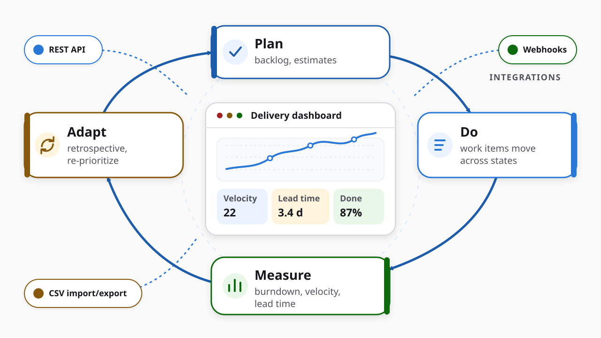

> **คำถามก่อนเริ่ม:** Plane CE ส่งออกข้อมูลได้ครบ 3 รูปแบบ แต่ "นำเข้า" จาก Jira/Trello ได้ไหม? และบอร์ดสาธารณะให้คนภายนอกโหวตได้โดยไม่ล็อกอินหรือไม่? (เฉลยในข้อ 6 และข้อ 7)

### Terminal Map

| หน้าต่าง | หน้าที่ | เปิดเมื่อใด |
|---|---|---|
| **T1** | สคริปต์ Python · SQL · curl | ตั้งแต่เริ่ม |
| **B1** | เบราว์เซอร์ admin | ตั้งแต่เริ่ม |
| **B2** | หน้าต่าง private (คนนอก) | ข้อ 7 |

> ภาพหน้าจอในเอกสารนี้จับจากเครื่องทดสอบซึ่งอาจแสดง port อื่น (เช่น `localhost:8086`) — ของผู้เรียนคือ `localhost:8080`

---

## 0. เตรียมเครื่องเรียน

ต้องผ่าน LAB 5 (มี states/PBI/token/venv) — Plane รันอยู่และ `pc` ใช้ได้:

```bash
docker start devtools 2>/dev/null || \
  docker run -dit --name devtools --privileged -p 2222:22 -p 8080:8080 tuchsanai/devtools:2569_1
ssh root@localhost -p 2222        # password : passwd
cd ~/labwork/DevTools/03_Application_Docker/05_Plane/006_LAB_Modules_Pages_Analytics
source ~/venv-plane/bin/activate && pip install -r requirements.txt -q
curl -s -o /dev/null -w '%{http_code}\n' -H "X-API-Key: $(cat ~/.plane_token)" http://localhost:8080/api/v1/users/me/
```

✅ **Expected output** — `200`

---

## 1. Roadmap เป็น Modules ด้วยสคริปต์ idempotent

ดู `roadmap.csv` ก่อน: ชื่อ · คำอธิบาย · status · วันเริ่ม/จบเป็น **offset จากวันนี้** · lead (อีเมล) · คำสำคัญสำหรับผูกงาน

```bash
cat roadmap.csv
python seed_modules.py
python seed_modules.py     # รันซ้ำ
```

> 📝 **คำอธิบาย:** สคริปต์ตรวจก่อนว่า module ชื่อนี้มีแล้วหรือยัง (Plane บังคับชื่อไม่ซ้ำในโปรเจกต์) จึง **รันซ้ำได้โดยไม่สร้างซ้ำ** · วันที่เป็น offset → Timeline ของทุกคนมีแท่งอยู่รอบวันนี้ไม่ว่าจะรันวันไหน · ผูกงานด้วย `POST …/modules/<id>/module-issues/` เฉพาะใบที่ยังไม่อยู่ใน module

✅ **Expected output** — ครั้งแรก `created 3` ครั้งที่สอง `created 0 / existing 3 / linked 0`:

```
  exists   Ordering       status=in-progress
           linked 0 (มีอยู่แล้ว 7 ใบ)
  exists   Payments       status=planned
           linked 0 (มีอยู่แล้ว 1 ใบ)
  exists   Notifications  status=backlog
           linked 0 (มีอยู่แล้ว 2 ใบ)
created 0 / existing 3 / linked 0 / API calls 7
```

---

## 2. Modules — Gallery · Timeline · detail

B1: sidebar **Plane Lab → Modules** → ไอคอน layout **Gallery** แล้ว **Timeline**

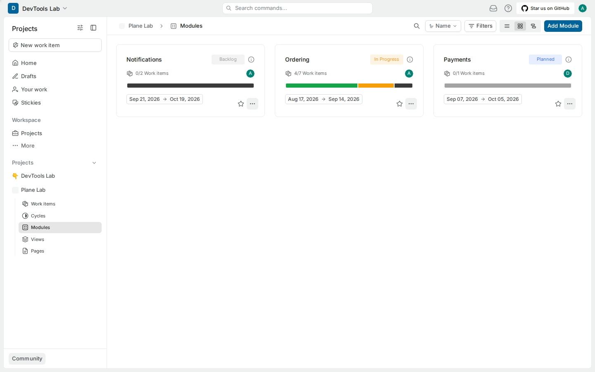
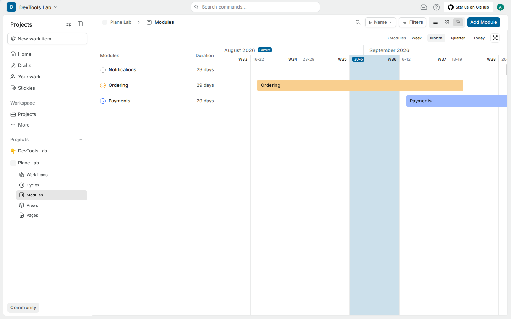

เปิด **Ordering** → sidebar ขวา: Lead · Members · Status · Start/Target date · **Progress** (burndown ตามจำนวนใบ)

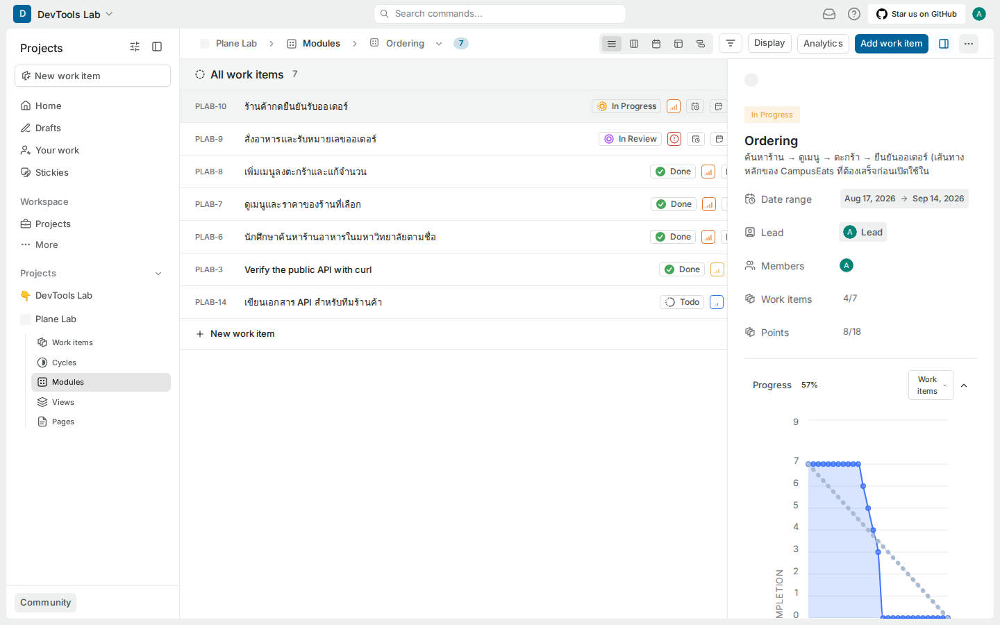

> 📝 **คำอธิบาย:** module = กล่องรวมงานที่มี **เจ้าของ (lead)**, **สถานะ** (backlog · planned · in-progress · paused · completed · cancelled) และ **ช่วงเวลา** — เทียบเท่า Epic ของ Jira + แถบ roadmap · burndown ของ module ใช้สูตรเดียวกับ cycle (LAB 4) · งานหนึ่งใบอยู่ได้หลาย module

```bash
pc exec -T -e PGPASSWORD=plane plane-db psql -U plane -d plane -c \
 "select m.name, m.status, m.start_date, m.target_date, (select count(*) from module_issues mi where mi.module_id=m.id and mi.deleted_at is null) as items from modules m where m.project_id=(select id from projects where identifier='PLAB') and m.deleted_at is null order by m.start_date;"
```

✅ **Expected output** — 3 modules ของ roadmap (วันที่ของแต่ละคนต่างกันตามวันที่รัน):

```
     name      |   status    | start_date | target_date | items
---------------+-------------+------------+-------------+-------
 Ordering      | in-progress | 2026-08-17 | 2026-09-14  |     7
 Payments      | planned     | 2026-09-07 | 2026-10-05  |     1
 Notifications | backlog     | 2026-09-21 | 2026-10-19  |     2
(3 rows)
```

---

## 3. PRD บน Pages — เอกสารอยู่ที่เดียวกับงาน

B1: **Pages → New page** ชื่อ `PRD — CampusEats Ordering` วางจาก `prd_template.md` (Problem · Goals · Non-goals · User stories · Metrics · References) · พิมพ์ `#` แล้วเลือก work item เพื่อฝังลิงก์ · สร้างอีกหน้า `Ordering — API design` · ที่หน้า PRD กดเมนู ⋯ → **Lock**

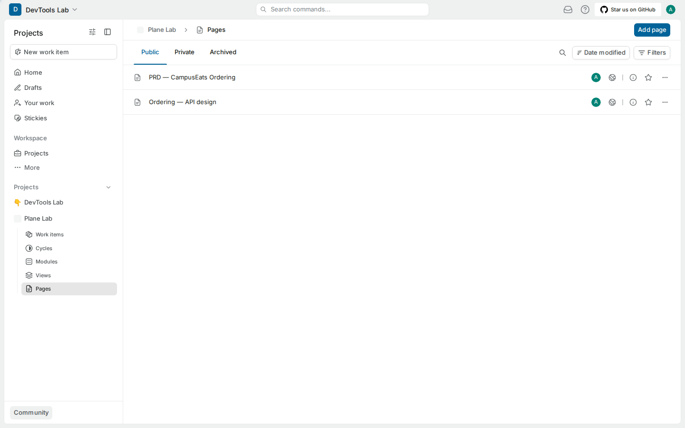
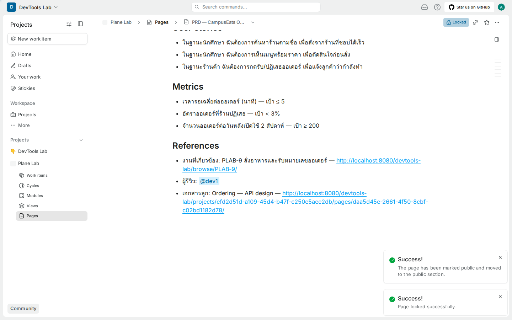

```bash
pc exec -T -e PGPASSWORD=plane plane-db psql -U plane -d plane -c \
 "select pg.name, pg.access, pg.is_locked from pages pg join project_pages pp on pp.page_id=pg.id where pp.project_id=(select id from projects where identifier='PLAB') and pg.deleted_at is null order by pg.created_at;"
```

✅ **Expected output** — PRD `is_locked = t` (ค่า `access` 0 = Public ในตาราง pages):

```
           name            | access | is_locked
---------------------------+--------+-----------
 PRD — CampusEats Ordering |      0 | t
 Ordering — API design     |      0 | f
```

> 📝 **คำอธิบาย:** Lock = อ่านอย่างเดียวสำหรับทุกคน (แม้ Admin ต้อง Unlock ก่อน) — ใช้กับเอกสารที่ "ตกลงกันแล้ว" · Private = เจ้าของเห็นคนเดียว (ร่าง) · Pages แก้พร้อมกันได้ผ่าน live server (LAB 2/3) จึงใช้เป็น PRD ที่ทั้งทีมเขียนได้จริง

---

## 4. Analytics ของ Plane

B1: sidebar **Analytics** (หรือปุ่ม **Analytics** ในหน้า Work items) → แท็บ **Overview**

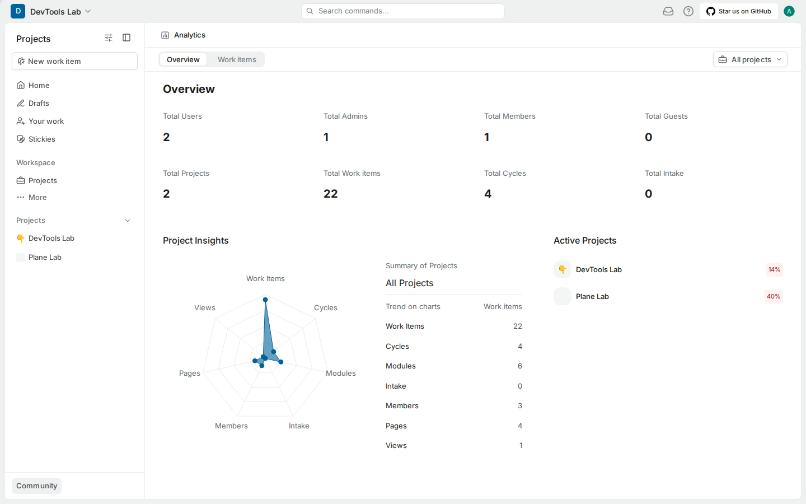

แท็บ **Work items** → เลือกโปรเจกต์ **Plane Lab** ที่มุมขวาบน → **Created vs Resolved** → **Customized insights**: ปุ่มแรก (แกน Y) มีให้เลือกแค่ **Work item** = นับจำนวนใบ (CE รุ่นนี้ไม่มี Estimate ให้ใช้เป็นแกน Y) · ปุ่มที่สอง (แกน X) เลือก **Assignee** · **Add Property** (group by) เลือก **State group** → ตารางด้านล่าง → **Export as csv**

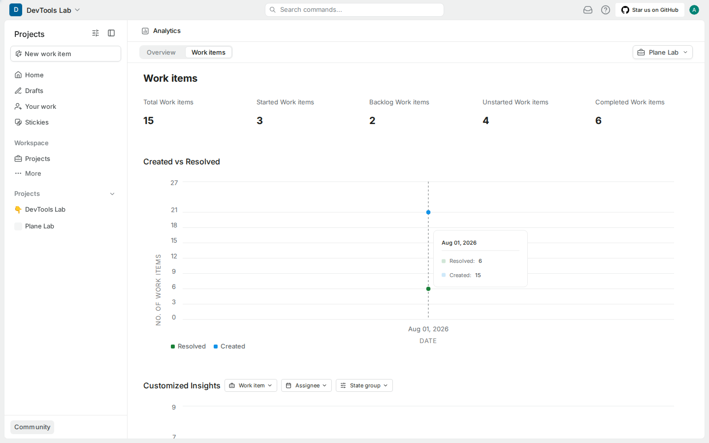
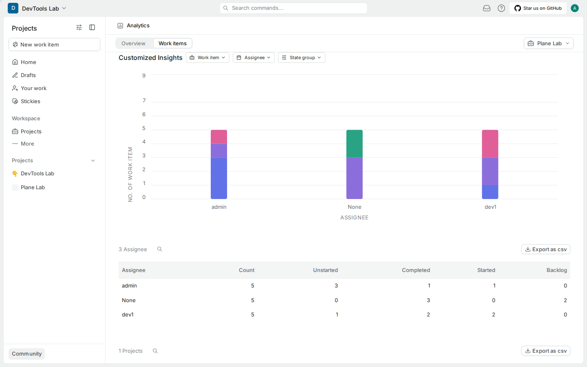
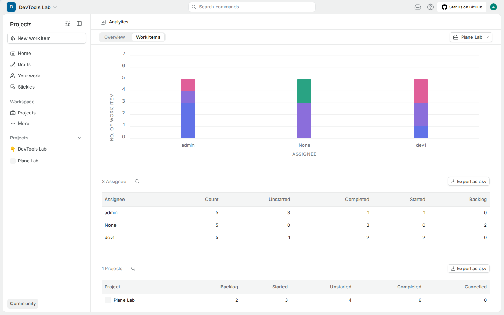

> 📝 **คำอธิบาย:** Analytics ของ CE ตอบ "งานเข้า–ออกเท่าไร" และ "กระจายตามคน/สถานะ/priority อย่างไร" แต่ **ไม่มี velocity, CFD, lead/cycle time** — LAB 5 คำนวณจาก activity และ LAB 9 จะทำเป็น dashboard สด · Member (dev1) เห็น Analytics ได้เหมือน admin:

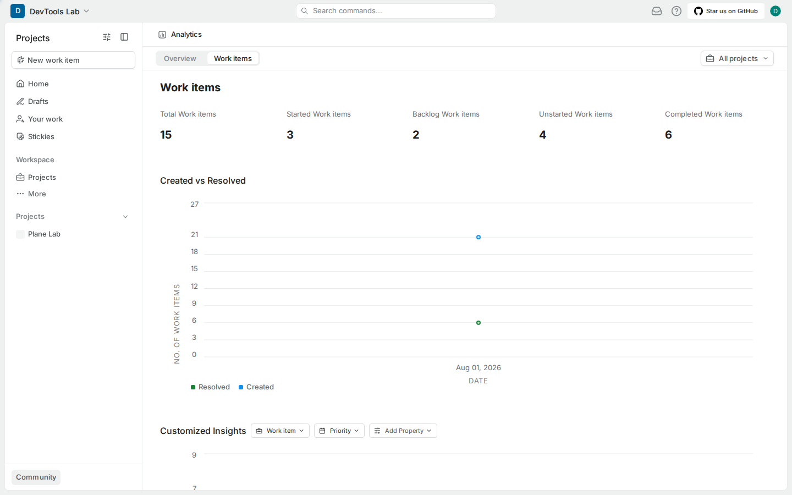

✅ **Expected output** — tiles Users/Projects/Work items/Cycles, กราฟ Created vs Resolved และไฟล์ CSV ที่เปิดดูหัวคอลัมน์ได้

---

## 5. Exports — CSV · XLSX · JSON แล้วตามไฟล์ไปดูใน MinIO

B1: **Workspace settings → Exports** → **Exporting project** เลือก **Plane Lab** → **Format** `CSV` → **Export** แล้วมองตาราง **Previous exports** ทันที · ทำซ้ำด้วย **Excel** และ **JSON** → กด **Refresh status** จนครบ 3 แถว **Completed**

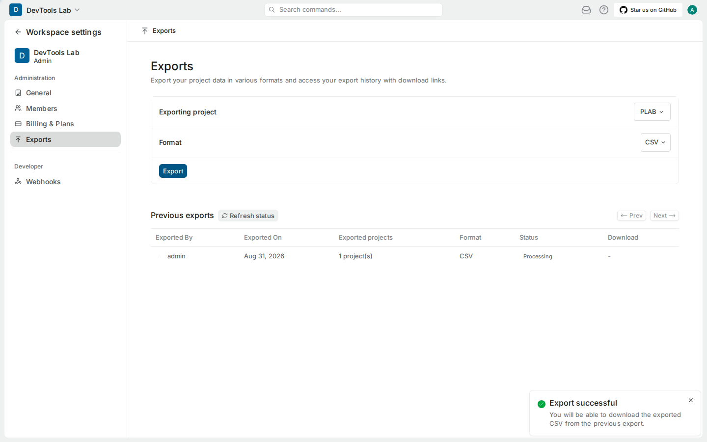
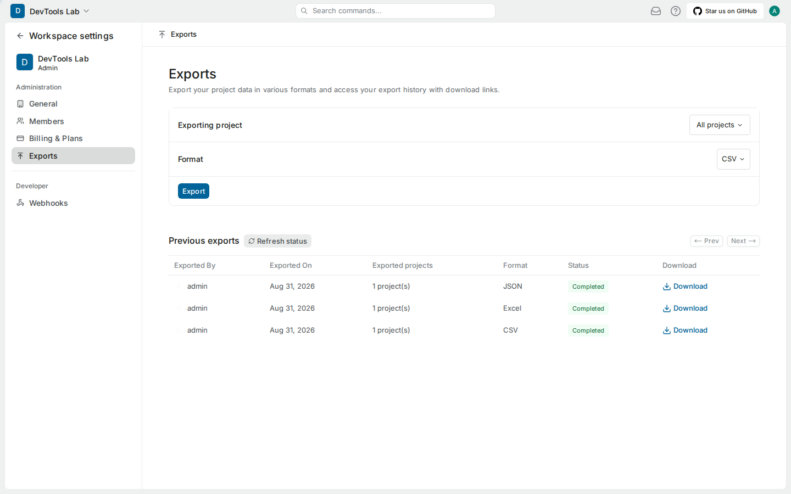

> 📝 **คำอธิบาย:** ปุ่ม Export ไม่ได้สร้างไฟล์ทันที — api ส่ง task `issue_export_task` เข้าคิว `celery`, **worker** สร้าง zip แล้วอัปโหลดเข้า MinIO (bucket `uploads`) และเก็บ URL แบบ presigned 7 วันไว้ในคอลัมน์ `exporters.url` (ทดลองเพิ่มเติม ก.: หยุด worker แล้ว export จะค้าง)

ตามไฟล์ไปดู (T1):

```bash
pc exec -T -e PGPASSWORD=plane plane-db psql -U plane -d plane -c \
 "select provider, status, key, url is not null as has_url from exporters order by created_at;"
pc exec -T plane-minio ls -R /export/uploads
```

✅ **Expected output** — key ขึ้นต้นด้วย `<workspace_id>/export-devtools-lab-<6 ตัว>-<วันที่>.zip` · บนดิสก์ของ MinIO แต่ละ object เป็น **โฟลเดอร์** ที่มี `xl.meta` (รูปแบบภายในของ MinIO — เห็นแบบเดียวกันตอนแนบไฟล์ใน LAB 2) ไม่ใช่ไฟล์ zip ตรง ๆ:

```
 provider |  status   |                                      key                                       | has_url
----------+-----------+--------------------------------------------------------------------------------+---------
 csv      | completed | aa69cd8b-9397-4ebd-b908-4e56242849af/export-devtools-lab-974555-2026-08-31.zip | t
 xlsx     | completed | aa69cd8b-9397-4ebd-b908-4e56242849af/export-devtools-lab-6cd967-2026-08-31.zip | t
 json     | completed | aa69cd8b-9397-4ebd-b908-4e56242849af/export-devtools-lab-101741-2026-08-31.zip | t
(3 rows)

/export/uploads:
aa69cd8b-9397-4ebd-b908-4e56242849af

/export/uploads/aa69cd8b-9397-4ebd-b908-4e56242849af:
export-devtools-lab-101741-2026-08-31.zip
export-devtools-lab-6cd967-2026-08-31.zip
export-devtools-lab-974555-2026-08-31.zip

/export/uploads/aa69cd8b-9397-4ebd-b908-4e56242849af/export-devtools-lab-101741-2026-08-31.zip:
xl.meta
...
```

ดูด้วยตาผ่าน MinIO console (สะพาน `socat` ตัวเดียวกับ LAB 2):

```bash
bash minio_ui_bridge.sh
```

แท็บ **PORTS** forward `9090` → เปิด `http://localhost:9090` → login **access-key / secret-key** → **Object Browser** → bucket **uploads** → โฟลเดอร์ `<workspace_id>`

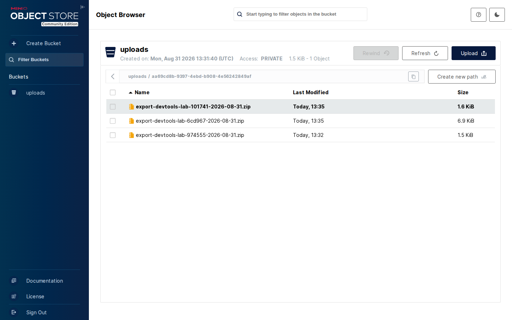

> 📝 **คำอธิบาย:** จะ `docker cp` zip ออกจาก container ของ MinIO ตรง ๆ **ไม่ได้** — สิ่งที่อยู่บนดิสก์คือโฟลเดอร์ `xl.meta` (metadata + เนื้อไฟล์ในรูปแบบของ MinIO เอง) ได้โฟลเดอร์ชื่อ `.zip` มาแล้ว `export_inspect.py` จะฟ้อง `IsADirectoryError` · ทางที่ถูกคือดึงผ่าน **S3 API** เหมือนที่ปุ่ม Download ทำ: presigned URL ใน `exporters.url` ชี้ที่ `http://localhost:8080/uploads/<key>?X-Amz-…` ซึ่ง proxy ส่งต่อไป `plane-minio:9000` (route `/uploads/*` — LAB 2) และลายเซ็นในท้าย URL คือสิทธิ์ชั่วคราว 7 วัน

ดาวน์โหลด zip ทั้ง 3 ด้วย URL นั้น (ต้องใส่ `"$URL"` ในเครื่องหมายคำพูดเพราะมี `&`) แล้วแกะดู:

```bash
for f in csv json xlsx; do
  URL=$(pc exec -T -e PGPASSWORD=plane plane-db psql -U plane -d plane -tA -c "select url from exporters where provider='$f' and status='completed' and deleted_at is null order by created_at desc limit 1")
  curl -sSL -o out-$f.zip "$URL" && ls -l out-$f.zip
done
python export_inspect.py out-csv.zip --compare PLAB
```

> 📝 **คำอธิบาย:** `psql -tA` คืนค่า URL ล้วน ๆ (ไม่มีหัวตาราง) · `export_inspect.py` นับแถวและอ่านหัวคอลัมน์ของ CSV/JSON/XLSX (xlsx คือ zip ของ XML — สคริปต์อ่านเองไม่ต้องติดตั้งไลบรารี) · `--compare` เทียบจำนวนแถวกับ `total_results` จาก API v1 ต้องเท่ากัน

✅ **Expected output** — ได้ zip 3 ไฟล์ และจำนวนแถว = จำนวน work item ของแต่ละคน:

```
-rw-r--r-- 1 root root 1491 Aug 31 20:36 out-csv.zip
-rw-r--r-- 1 root root 1672 Aug 31 20:36 out-json.zip
-rw-r--r-- 1 root root 7115 Aug 31 20:36 out-xlsx.zip
== devtools-lab-aa69cd8b-9397-4ebd-b908-4e56242849af.csv  (4,550 bytes)
   rows    : 15
   columns : 25 → Project Name, Project Identifier, Parent, Identifier, Sequence Id, Name, State Name, Priority, Assignees, Subscribers, Created By Name, Start Date, Target Date, Completed At, Created At, Updated At, Archived At, Estimate, Labels, Cycles, Modules, Links, Relations, Comments, Is Draft
== API  GET /work-items/ ของ PLAB → total_results = 15
   devtools-lab-aa69cd8b-9397-4ebd-b908-4e56242849af.csv: 15 แถว ✔ เท่ากัน
```

เทียบคอลัมน์กับสิ่งที่ Jira และ Trello ส่งออก (เตรียม LAB 7) แล้วเทียบ 1 ใบระหว่าง JSON export กับ API:

```bash
cat jira_columns.txt trello_columns.txt
python compare_export_api.py out-json.zip --key PLAB-9
```

> 📝 **คำอธิบาย:** export ให้ **ชื่อ** (state_name, ชื่อคน, ชื่อ module/cycle) แต่ API ให้ **UUID** (ต้อง `?expand=state,assignees` จึงได้ชื่อ และ estimate/labels ก็ยังเป็น UUID) — สคริปต์นำเข้าใน LAB 7 ต้องแปลงชื่อ ↔ UUID เอง

✅ **Expected output**

```
export 15 rows · API 15 rows

== PLAB-9 จาก export (JSON)
   state_name   : 'In Review'
   priority     : 'urgent'
   assignees    : ['Dev One']
   estimate     : '5'
   labels       : ['feature']
   modules      : ['Ordering']
   cycles       : ['Sprint 2']
   completed_at : None

== PLAB-9 จาก API v1 (?expand=state,assignees)
   state        : 'In Review'  (group='started', id=fd65ba8a…)
   assignees    : ['dev1']
   estimate_point: '860465dc-b0f0-4dce-9907-89252a324bf8'  ← ยังเป็น UUID (ไม่มี expand สำหรับ estimate)
   labels       : ['400b39d4-b482-48b1-9ada-db4abdc0695b']  ← UUID เช่นกัน
   completed_at : None

API calls ที่ใช้: 2
```

---

## 6. CE ไม่มี importer — พิสูจน์ก่อนเขียนสคริปต์เอง

B1: เปิด **Workspace settings** ทุกเมนู (General · Members · Billing & Plans · Exports · Webhooks) — ไม่มี **Import** · เปิด **Billing & Plans**: การ์ด **Community** (รุ่นที่เราใช้) อยู่แยกด้านบน ส่วนตารางเปรียบเทียบใต้ **All plans** มีแค่ 3 คอลัมน์ **Pro · Business · Enterprise** (รุ่นเสียเงิน/cloud) → กด **Compare all features** แล้วเลื่อนลงไปหัวข้อ **Importers**: แถว **Jira** และ **GitHub** อยู่ในตารางของรุ่นเสียเงินเท่านั้น

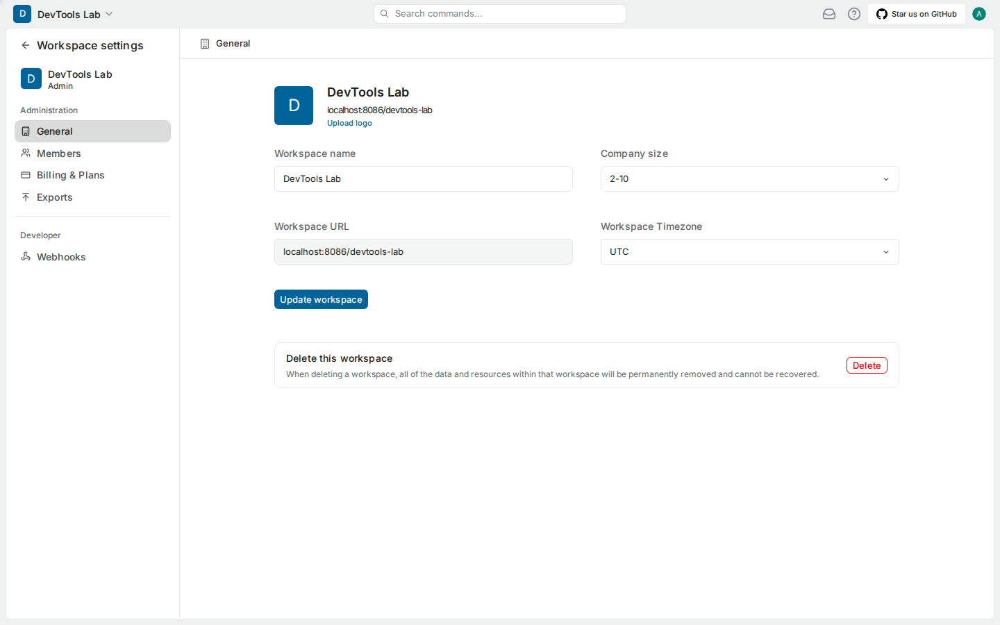
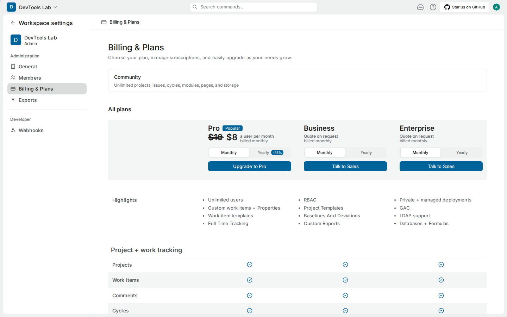
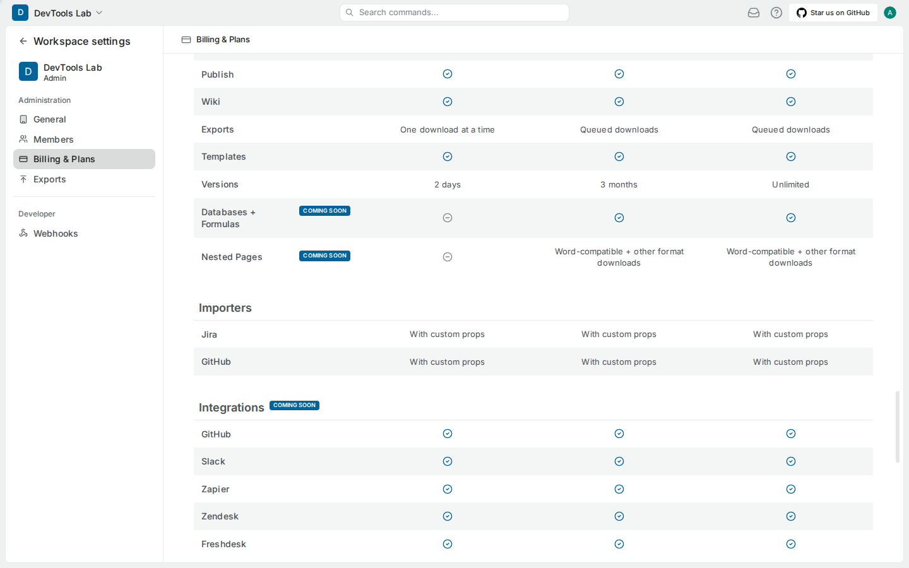

✅ **Expected output** — ไม่มีทางนำเข้าจาก UI ใน CE → LAB 7 จะนำเข้า Trello JSON และ Jira CSV ผ่าน REST API

---

## 7. Sites — บอร์ดสาธารณะ

B1: sidebar **Plane Lab** → ⋯ → **Publish** → เปิด **List** + **Kanban**, เปิด Comments / Reactions / Votes → **Publish** → คัดลอกลิงก์ `http://localhost:8080/spaces/issues/<anchor>`

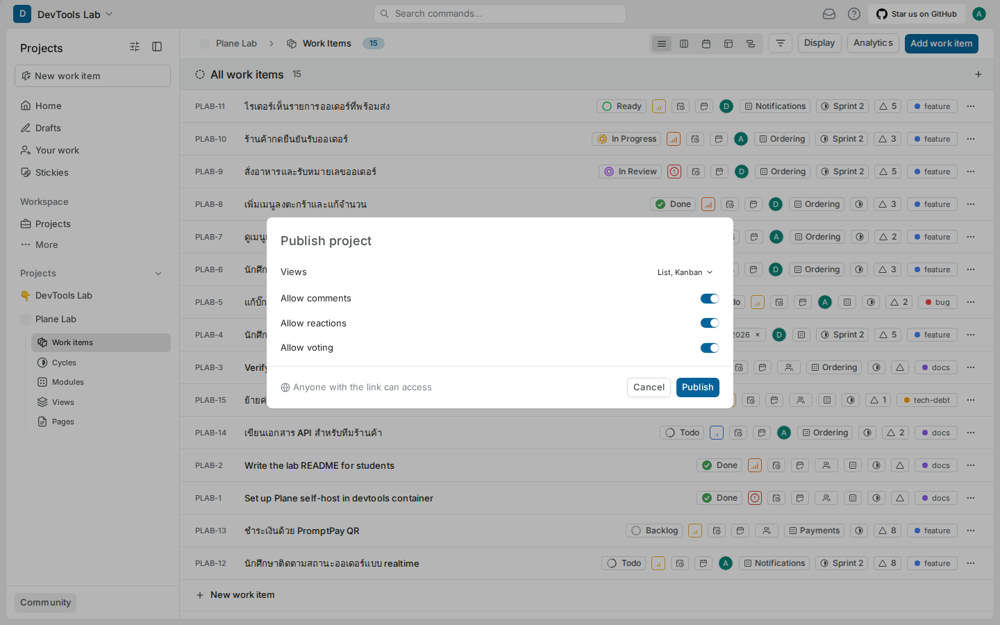
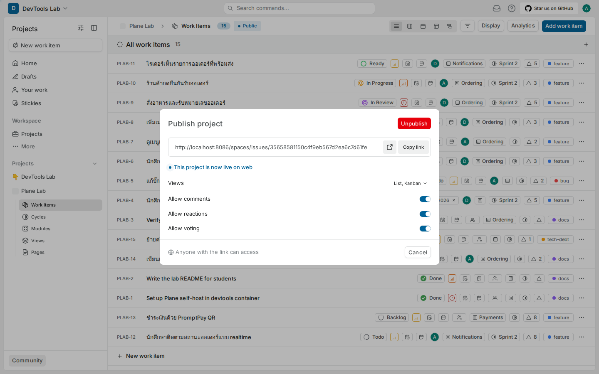

B2 (private window) เปิดลิงก์:

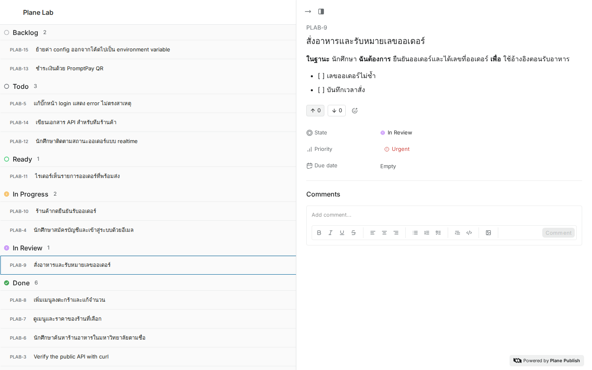
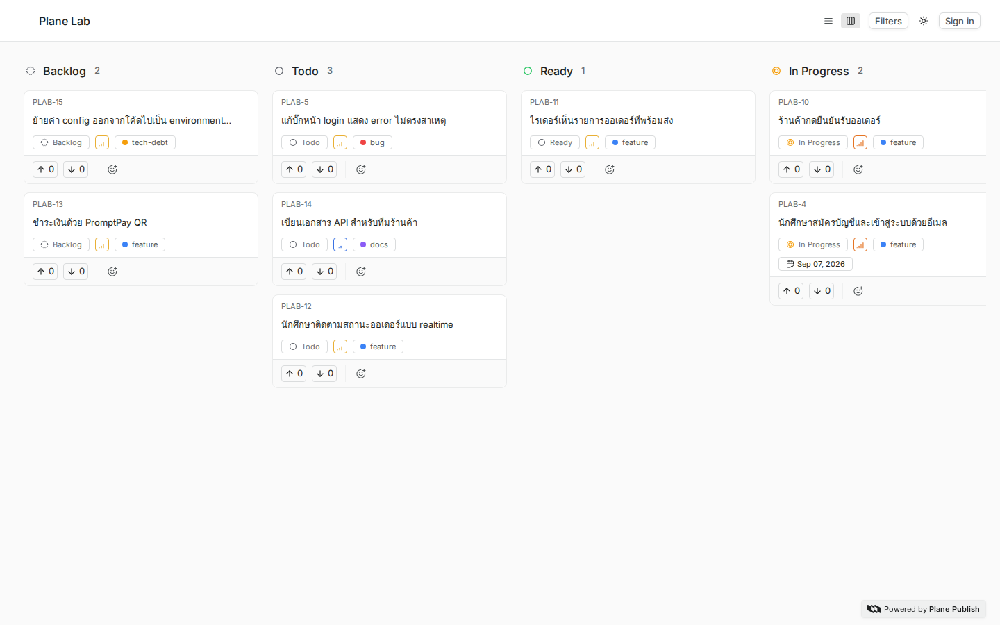
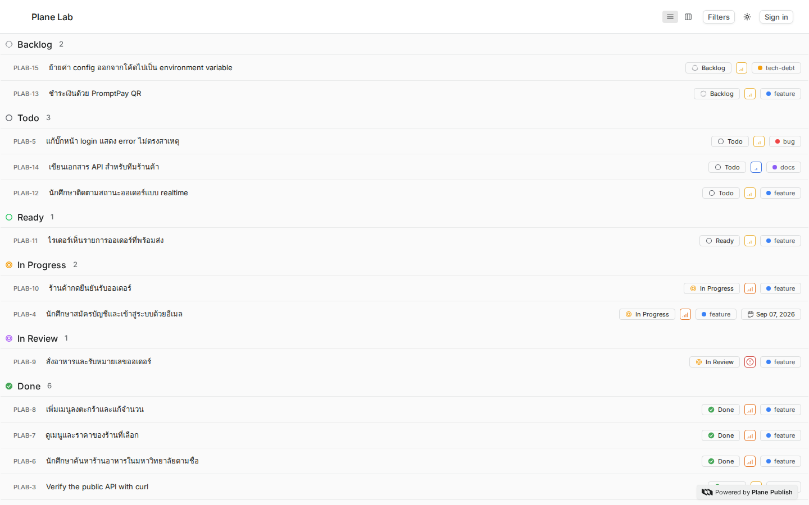

กดโหวตหรือ comment จากหน้าต่าง private:

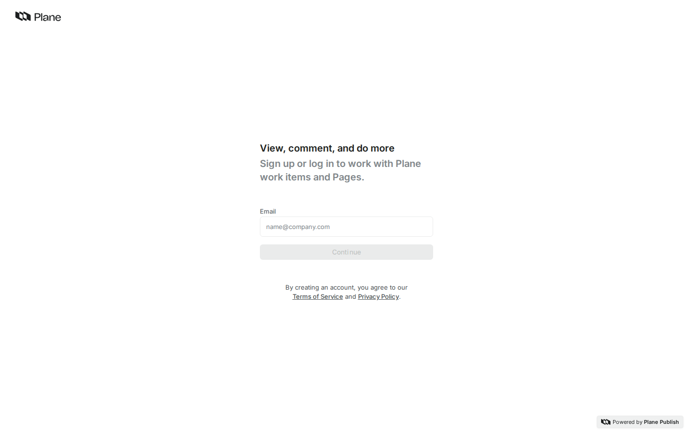

> 📝 **คำอธิบาย:** **ดู** ได้โดยไม่ล็อกอิน แต่ **โหวต/comment/reaction** ต้อง sign in เข้า Sites (บัญชี Plane ใดก็ได้ — สมัครใหม่ผ่านหน้า sign-up ของ Sites) เพื่อกันสแปมและให้ทุกเสียงมีเจ้าของ (accountability) · ต่างจาก Trello public board ที่คนนอกอ่านได้อย่างเดียว

```bash
pc exec -T -e PGPASSWORD=plane plane-db psql -U plane -d plane -c \
 "select entity_name, anchor, is_votes_enabled, is_comments_enabled from deploy_boards where deleted_at is null;"
```

✅ **Expected output**

```
 entity_name |              anchor              | is_votes_enabled | is_comments_enabled
-------------+----------------------------------+------------------+---------------------
 project     | 35658581150c4f9eb567d2ea6c7d61fe | t                | t
(1 row)
```

---

## 8. ปิดด้วย `check_lab06.sh`

```bash
bash check_lab06.sh
```

✅ **Expected output**

```
== LAB 6 checks (project PLAB)
  ✔ modules: 4 (Ordering / Payments / Notifications)
  ✔ module_issues: 10 ใบถูกผูกเข้า module
  ✔ Page PRD มีอยู่และถูก Lock แล้ว
  ✔ มี page ออกแบบ API ประกอบ PRD: 1 หน้า
  ✔ exporters: completed ครบ csv, json, xlsx
  ✔ deploy_boards: โปรเจกต์ถูก Publish เป็น Sites แล้ว
  · ยังไม่มีโหวตจาก Sites (ทางเลือก — ต้อง sign in ใน Sites ก่อนโหวต)
PASS: LAB 6 — modules 4 · module_issues 10 · PRD locked + API-design page 1 · exports csv,json,xlsx · Sites published · votes 0
```

> 📝 **คำอธิบาย:** `modules: 4` เพราะทดลองเพิ่มเติม ข. สร้าง module "Legacy Onboarding" ไว้ archive — ถ้าไม่ทำจะเป็น 3

---

## ทดลองเพิ่มเติม

### ก. หยุด worker แล้ว export

```bash
pc stop worker
```

กด Export CSV อีกครั้ง → ✅ ค้างที่ **processing** · `pc start worker` → เสร็จภายในไม่กี่วินาที (บทเรียน LAB 2: งานหลังบ้านทั้งหมดผ่าน worker)

### ข. Archive module

สร้าง module `Legacy Onboarding` (status Completed, วันที่ในอดีต) → ⋯ → **Archive** → ✅ หายจากรายการ ไปอยู่ที่ **Archives** และยังอยู่ในตาราง `modules` (มี `archived_at`)

### ค. ตัดลายเซ็นท้าย presigned URL ทิ้ง

```bash
URL=$(pc exec -T -e PGPASSWORD=plane plane-db psql -U plane -d plane -tA -c "select url from exporters where provider='csv' order by created_at desc limit 1")
curl -s -o /dev/null -w '%{http_code}\n' "${URL%%\?*}"
curl -s "${URL%%\?*}"; echo
```

✅ **Expected output** — `403` และ XML `<Code>AccessDenied</Code>` : URL เดียวกันแต่ไม่มี `X-Amz-Signature` = ไม่มีสิทธิ์ — bucket `uploads` เป็น private (ดูคำว่า **Access: PRIVATE** ใน MinIO console) สิทธิ์อยู่ที่ลายเซ็นชั่วคราว ไม่ใช่ที่ path · ลองแบบเดิมอีกทาง: `docker cp plane-plane-minio-1:/export/uploads/<key> bad.zip` แล้ว `ls -la bad.zip` → ได้ **โฟลเดอร์** ที่มี `xl.meta` ไม่ใช่ zip

### ง. Guest กับ Analytics

เชิญบัญชี Guest (LAB 3) แล้วล็อกอิน → sidebar ไม่มี Analytics/Archives — สิทธิ์เท่าที่หน้าที่ต้องการ

---

## แก้ปัญหาที่พบบ่อย

| อาการ | สาเหตุ | วิธีแก้ |
|---|---|---|
| Export ค้าง processing | worker หยุด | `pc ps worker` → `pc start worker` |
| ลิงก์ดาวน์โหลด export เปิดไม่ได้ | presigned URL หมดอายุ (7 วัน) หรือ WEB_URL ไม่ตรง origin | export ใหม่ / ตรวจ `plane.env` (LAB 1) |
| `seed_modules.py` ฟ้อง "Modules are not enabled" | ฟีเจอร์ Modules ปิด | Settings → Projects → Plane Lab → Features → Modules |
| ลิงก์ Sites เปิดแล้ว 404 | container `space` ไม่ Up หรือ Unpublish แล้ว | `pc ps space`; Publish ใหม่ |
| Page บันทึกไม่ได้/ไม่ sync | live หรือ redis มีปัญหา | `pc ps live plane-redis`; `pc logs live --tail 20` |
| ไม่มี **Publish** ในเมนู | ไม่ใช่ Admin ของโปรเจกต์ | ใช้บัญชี admin@example.com |
| `docker cp …zip` ได้โฟลเดอร์ `xl.meta` / `IsADirectoryError` | MinIO เก็บ object ในรูปแบบภายใน ไม่ใช่ไฟล์ตรง ๆ | ดาวน์โหลดผ่าน presigned URL ใน `exporters.url` ด้วย `curl` (ข้อ 5) |
| `curl` ได้ XML `AccessDenied` / `SignatureDoesNotMatch` หรือไฟล์เล็กผิดปกติ | URL ถูกตัดที่ `&` (ลืม `"$URL"`) หรือลิงก์หมดอายุ 7 วัน | ใส่เครื่องหมายคำพูดครอบ URL / export ใหม่แล้วดึง URL ล่าสุด |
| เปิด `http://localhost:9090` ไม่ขึ้น | ยังไม่ได้ forward port หรือ `minio-ui` ไม่ได้รัน | `docker ps \| grep minio-ui`; `bash minio_ui_bridge.sh` แล้ว forward 9090 ใหม่ |

---

## เก็บกวาด (Cleanup)

- ลบ zip ที่ดาวน์โหลดมา: `rm -f out-*.zip` · ลบสะพาน MinIO console: `docker rm -f minio-ui` และปิด forward `9090` ในแท็บ **PORTS**
- **Unpublish** ได้ถ้าไม่ต้องการบอร์ดสาธารณะ (⋯ → Unpublish) — หรือคงไว้ใช้ demo
- **เก็บ** modules, pages, exports ไว้ — LAB 7 ใช้ตารางคอลัมน์ และ LAB 9 ใช้ module/cycle history

```bash
rm -f out-*.zip; docker rm -f minio-ui
ls *.zip 2>/dev/null || echo "no zip left"
```

✅ **Expected output** — `minio-ui` แล้ว `no zip left`

---

## สรุปคำสั่งของแล็บนี้

| คำสั่ง | ความหมาย |
|---|---|
| `python seed_modules.py` | สร้าง/ผูก modules จาก `roadmap.csv` แบบรันซ้ำได้ |
| SQL `modules` / `pages` / `exporters` / `deploy_boards` | หลักฐานว่า roadmap, PRD, export และ Sites ถูกบันทึกจริง |
| `pc exec -T plane-minio ls -R /export/uploads` · `bash minio_ui_bridge.sh` | ดู object ของ export ใน MinIO (บนดิสก์เป็นโฟลเดอร์ `xl.meta` / ใน console เป็น zip) |
| `URL=$(pc exec -T -e PGPASSWORD=plane plane-db psql … -tA -c "select url from exporters …")` + `curl -sSL -o out-csv.zip "$URL"` | ดาวน์โหลด zip ผ่าน presigned URL (ทางเดียวกับปุ่ม Download) |
| `python export_inspect.py out-csv.zip --compare PLAB` | แกะ zip นับแถว/คอลัมน์ และเทียบกับ API |
| `python compare_export_api.py out-json.zip --key PLAB-9` | เทียบ export (ชื่อ) กับ API (UUID) |
| `bash check_lab06.sh` | ด่านหลักฐานของแล็บ — ต้องได้ `PASS` |

> **จำให้ขึ้นใจ:** Module = roadmap item ที่มีเจ้าของ · PRD อยู่กับงาน · Export ครบ = ไม่ถูกผูกติดเครื่องมือ (no vendor lock-in) · CE ไม่มี importer → API

## ✅ เช็กลิสต์ก่อนจบแล็บ

- [ ] `seed_modules.py` รันซ้ำแล้ว `created 0`
- [ ] Modules แสดงเป็น Gallery และ Timeline; module Ordering มี lead/status/progress
- [ ] PRD ถูก Lock และมีหน้า "Ordering — API design"
- [ ] Analytics Overview + Work items + Customized insights และดาวน์โหลด CSV แล้ว
- [ ] Exports CSV/XLSX/JSON `completed` ทั้ง 3 · เห็น zip ใน MinIO console · `curl` ผ่าน presigned URL ได้ zip 3 ไฟล์ · `export_inspect.py` นับแถวตรงกับ API
- [ ] อธิบายได้ว่า CE ไม่มี importer และเห็นในหน้า Billing ว่า Importers อยู่ในตารางของ Pro/Business/Enterprise เท่านั้น
- [ ] Publish แล้วเปิดบอร์ดใน private window ได้ และรู้ว่าโหวตต้อง sign in
- [ ] `bash check_lab06.sh` ได้ `PASS`

*ผลลัพธ์ทั้งหมดในเอกสารนี้มาจากการรันจริงในเครื่องเรียน `tuchsanai/devtools:2569_1` (Plane v1.4.2) เมื่อ 31 ส.ค. 2026*
