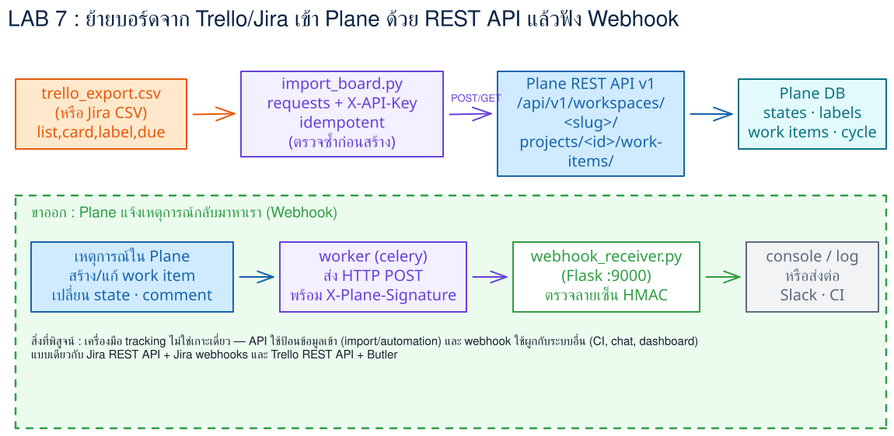
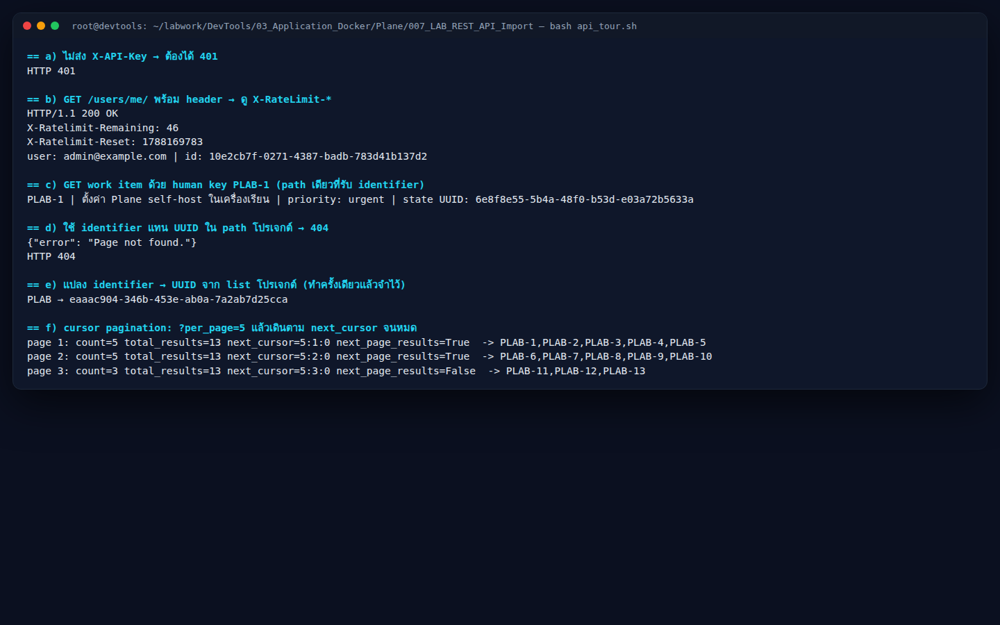
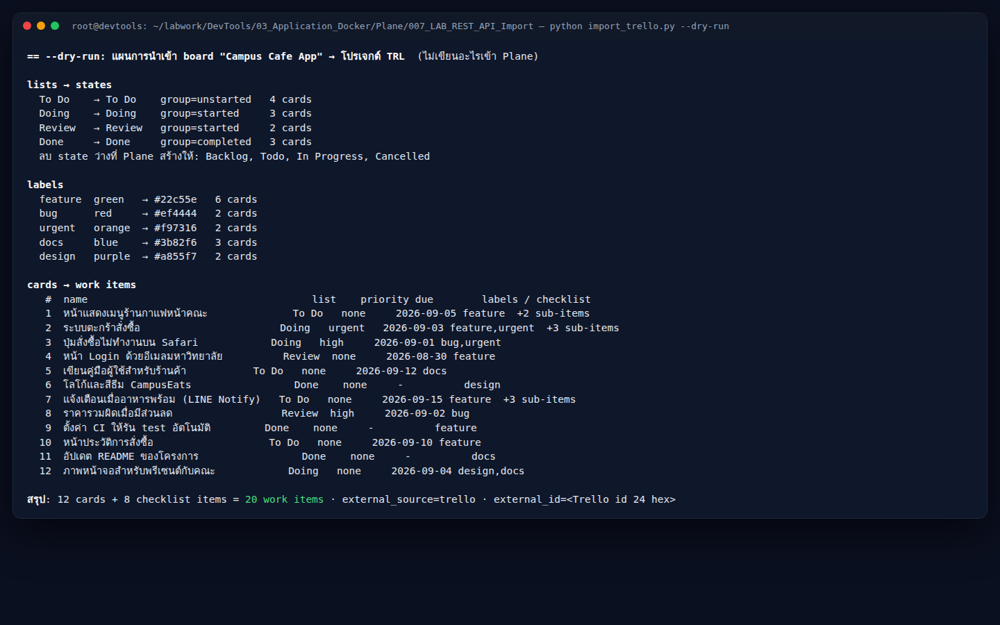
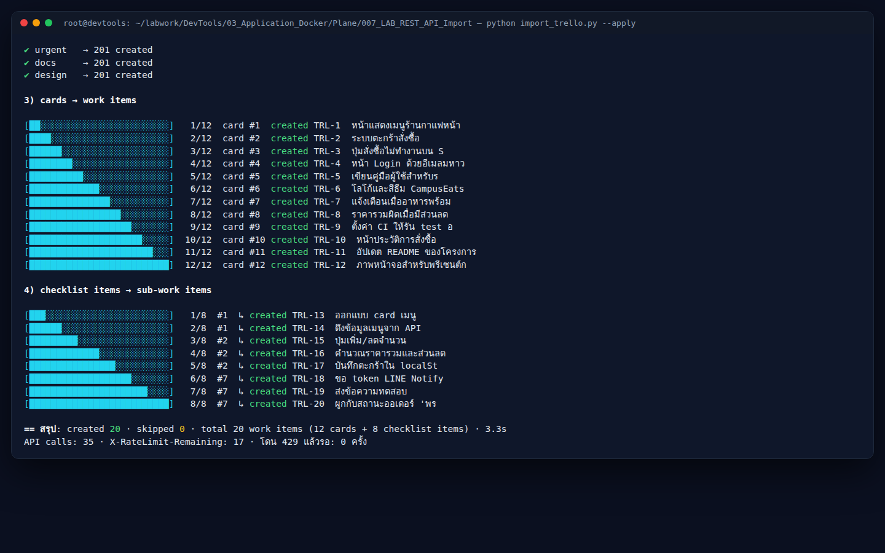
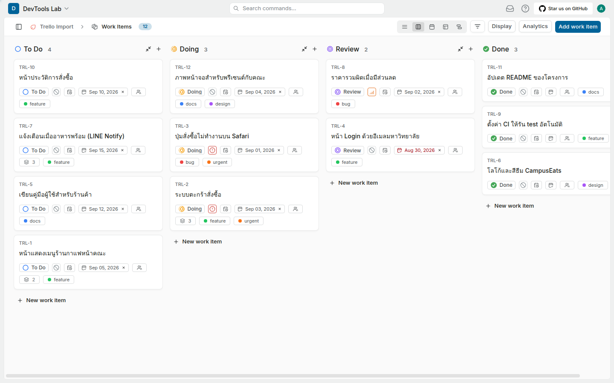
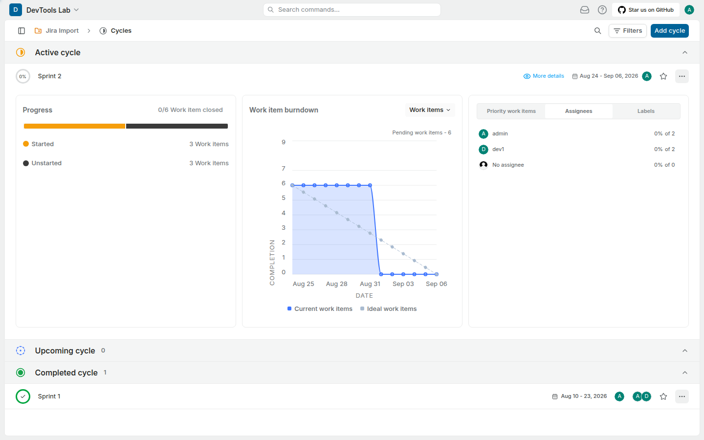
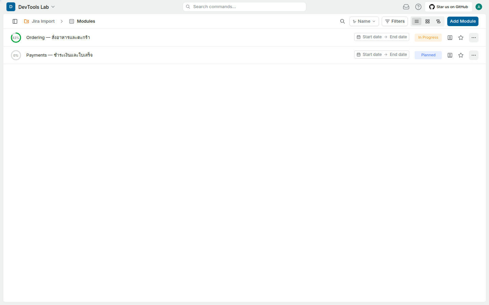
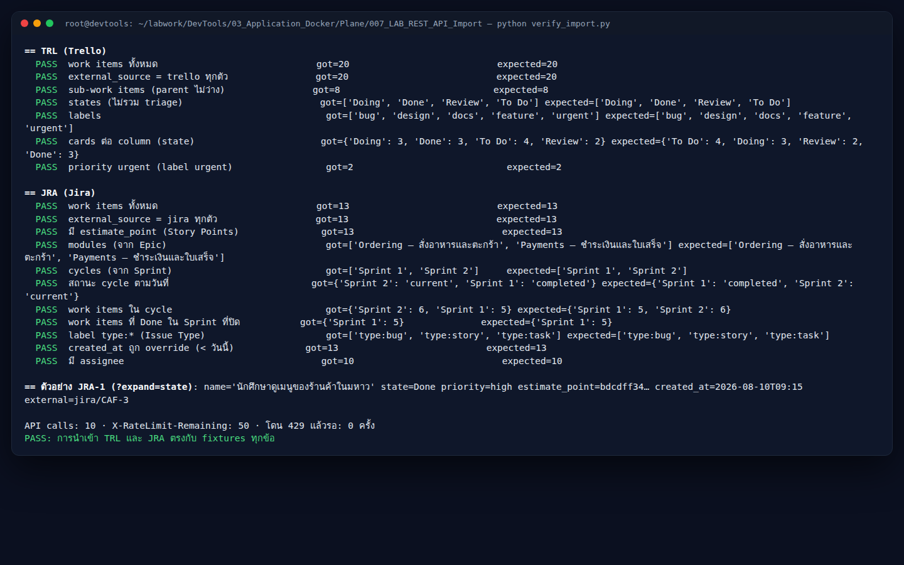
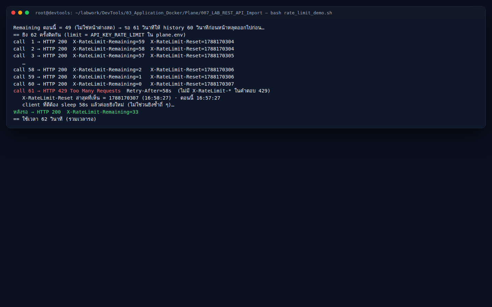

# LAB 7 — REST API v1 · นำเข้า Trello / Jira แบบ idempotent · rate limit

> โฟลเดอร์ `007_LAB_REST_API_Import` = **LAB 7** ในสไลด์ `Plane_Agile_Slides.html` (ตอนที่ 4 · การติดตามการพัฒนาผลิตภัณฑ์ — API/import)
> (ไฟล์ของแล็บนี้ : `planeapi.py` · `api_tour.sh` · `trello_board.json` · `mapping_trello.json` · `import_trello.py` · `jira_export.csv` · `jira_sprints.csv` · `mapping_jira.json` · `import_jira.py` · `verify_import.py` · `rate_limit_demo.sh` · `check_lab07.sh` · `requirements.txt`)
> (เวลาโดยประมาณ : 60 นาที)

## สิ่งที่จะได้เรียนรู้

- คุยกับ Plane ผ่าน **REST API v1** ด้วย header `X-API-Key` และอ่าน **`X-RateLimit-Remaining` / `X-RateLimit-Reset`** ทุกครั้งที่ตอบกลับ
- เข้าใจว่า path `/projects/<id>/` รับเฉพาะ **UUID** ส่วน `PLAB` เป็นแค่ **identifier** ที่ใช้ได้เฉพาะ `/work-items/PLAB-1/` — และวิธี "แปลง identifier → UUID"
- เดินผลลัพธ์หลายหน้าด้วย **cursor pagination** (`next_cursor` · `next_page_results`) ไม่ใช่เลขหน้า
- เขียนตัวนำเข้าที่ **รันซ้ำได้ (idempotent)** ด้วย `external_source` + `external_id` → รอบสองได้ **409** แทนข้อมูลซ้ำ
- map แนวคิด **Trello** (list · card · label · checklist) และ **Jira** (Epic · Sprint · Story Points · Issue Type) ลงบน state · module · cycle · estimate · label ของ Plane
- โดน **429 Too Many Requests** ให้เป็น แล้วเขียน client ที่ **รอตาม `Retry-After`** — และปรับ `API_KEY_RATE_LIMIT` ใน `plane.env`
- อ่านตาราง **`api_activity_logs`** เพื่อดูว่า Plane บันทึกทุกคำขอที่มาทาง token ไว้อย่างไร (โดยไม่เก็บ token ดิบ)

## ทฤษฎีที่เกี่ยวข้อง

**REST API คือ "ประตูหลัง" ของ Plane** — ทุกอย่างที่คลิกได้ใน UI มี endpoint ให้โปรแกรมเรียก แต่ UI ใช้ *session cookie* ส่วนโปรแกรมภายนอกใช้ **Personal Access Token** (`plane_api_…` จาก LAB 3) ส่งใน header `X-API-Key` (สไลด์ตอน 4 "API surface"). Token ทำงานแทนตัวเรา — สิทธิ์เท่าเรา ไม่มี scope ให้เลือก จึงต้องเก็บใน `~/.plane_token` (chmod 600) ไม่ใช่ในโค้ด

**UUID vs identifier** — ฐานข้อมูลของ Plane ใช้ UUID เป็น primary key ทุกตาราง (สไลด์ "ER model") path ของ API จึงเป็น `/workspaces/<slug>/projects/<uuid>/...` ส่วน `PLAB-1` เป็นแค่ *display key* (`identifier` + `sequence_id`) มี route เดียวที่รับมัน คือ `GET /workspaces/<slug>/work-items/PLAB-1/` ดังนั้นสคริปต์ทุกตัวต้องเริ่มด้วย "list โปรเจกต์ → หา identifier → จำ UUID"

**Cursor pagination** — API ไม่ให้ `?page=2` แต่ให้ `next_cursor` (รูป `per_page:page:is_prev`) และ `next_page_results` (จริง/เท็จ) ผู้เรียกวนจนกว่าจะเป็น `false` ข้อดีคือผลไม่เลื่อนเมื่อมีข้อมูลใหม่แทรกระหว่างหน้า

**Idempotency** — งาน integration มักถูกรันซ้ำ (สคริปต์พัง กลางทาง, cron ยิงซ้ำ) ถ้า `POST` สร้างของใหม่ทุกครั้ง ข้อมูลจะซ้ำซ้อน Plane จึงให้ส่ง `external_source` + `external_id` ติดไปกับ work item / module / cycle / state / label — ถ้ามีคู่นี้อยู่แล้วตอบ **409 Conflict** พร้อม `id` ของตัวเดิม ตัวนำเข้าที่ดีจึง "สร้าง → 201, ซ้ำ → 409 → skip" และรอบสองต้องได้ `created 0`

**Mapping ข้ามเครื่องมือ** (สไลด์ "Jira · Trello · Plane terms") — Trello *list* = ขั้นตอนของงาน → **state** (พร้อม `group` backlog/unstarted/started/completed/cancelled ที่ Plane ใช้คำนวณ progress) · *card* → **work item** · *checklist item* → **sub-work item** (`parent`) · Jira *Epic* → **Module** · *Sprint* → **Cycle** · *Story Points* → **estimate_point** (ต้องมี Estimate ระบบ Points ก่อน) · *Issue Type* ไม่มีใน Plane CE → เก็บเป็น **label `type:<x>`** · *Created* → `created_at` (API v1 ยอมให้ override ตอน POST เพื่อรักษาประวัติ)

**Rate limit** — ทุก token ได้ **60 คำขอ / 60 วินาที** (`API_KEY_RATE_LIMIT`) แบบ *sliding window*: คำขอที่ 61 ในหน้าต่างเดียวกันได้ **429** พร้อม `Retry-After` (วินาที) client ที่ดีต้อง *หยุดรอ* ไม่ใช่ส่งคำขอซ้ำถี่ ๆ (ทุกคำขอที่ส่งซ้ำถูกนับใหม่) — และทุกคำขอที่มาทาง token ถูกบันทึกลง `api_activity_logs` โดยเก็บ `token_identifier` = HMAC ของ token (ไม่ใช่ token ดิบ) เก็บ 14 วัน (สไลด์ "background jobs")

**"เอกสาร vs โค้ด"** — API ที่รันอยู่คือ *release* v1.4.2 ไม่ใช่ source ล่าสุด แล็บนี้จะเจอตัวอย่างจริง: route `/estimates/` มีไฟล์ใน image แต่ **ยังไม่ถูก include** ใน `urls/__init__.py` → 404 ต้องหาทางอ้อม (SQL) และ key `description` ในตัวอย่าง OpenAPI ถูก **ละเว้น (ignored)** ต้องส่ง `description_html`

## ภาพรวมของแล็บนี้

1. **`bash api_tour.sh`** — 6 จุดใน 1 นาที: 401 ไม่มี key · headers rate limit · `PLAB-1` ด้วย human key · `/projects/PLAB/` → 404 · แปลง identifier → UUID · เดิน cursor `?per_page=5`
2. **`--init` สองโปรเจกต์** `TRL` (Trello Import) และ `JRA` (Jira Import) — POST project · รันซ้ำ → 409 · PATCH `cycle_view`/`module_view` · Estimate ผ่าน SQL เพราะ v1.4.2 ยังไม่มี route
3. **นำเข้า Trello** — `--dry-run` ดูแผน → `--apply` (progress bar) → **Board** ใน UI เห็นคอลัมน์ To Do / Doing / Review / Done เหมือน Trello → รันซ้ำ → `created 0 · skipped 20`
4. **นำเข้า Jira** — Epic → Modules · Sprint → Cycles (Sprint 1 Completed · Sprint 2 Active) · Story Points → estimate · `created_at` ย้อนหลัง
5. **ตรวจผล** — `python verify_import.py` (เทียบกับ fixtures) + SQL นับ `external_source` → `jira 13 · lab 10 · trello 20`
6. **`bash rate_limit_demo.sh`** — 60 × 200 แล้ว **429** ที่ครั้งที่ 61 · `Retry-After` · client รอแล้วกลับมา 200
7. **API logs** — SQL `api_activity_logs` (path · method · response_code · token_identifier) แล้ว `bash check_lab07.sh` → `PASS`



> **คำถามก่อนเริ่ม:** ถ้ารัน `python import_trello.py --apply` สองรอบติดกัน จะได้ work item 20 หรือ 40 ใบ? และคำขอที่ 61 ใน 1 นาทีจะได้อะไรกลับมา — ข้อ 3 และข้อ 6 จะพิสูจน์ด้วยผลจริง

### Terminal Map

| หน้าต่าง | หน้าที่ | เปิดเมื่อใด |
|---|---|---|
| **T1** | สคริปต์ Python · curl · SQL (`pc exec`) | ตั้งแต่เริ่ม |
| **B1** | เบราว์เซอร์ admin — Plane `localhost:8080` (forward ไว้ตั้งแต่ LAB 1) ดู Board / Modules / Cycles ที่นำเข้า | ข้อ 3 |

> ภาพหน้าจอในเอกสารนี้จับจากเครื่องทดสอบซึ่งอาจแสดง port อื่น (เช่น `localhost:8087`) — ของผู้เรียนคือ `localhost:8080`

---

## 0. เตรียมเครื่องเรียน

ทำบนเครื่องของเราเอง (ไม่ใช้ cloud) — เปิด container ที่ติดตั้ง Docker มาให้แล้ว

```bash
docker start devtools 2>/dev/null || \
  docker run -dit --name devtools --privileged -p 2222:22 -p 8080:8080 tuchsanai/devtools:2569_1
ssh root@localhost -p 2222        # password : passwd
```

> 📝 **คำอธิบาย:** `docker start ... || docker run ...` เปิดเครื่องเรียนเดิมถ้ามี (Plane · volume · token ของ LAB 1–6 ยังอยู่ครบ) และสร้างใหม่เฉพาะเมื่อยังไม่มี · `-p 8080:8080` คือ port ที่เบราว์เซอร์ใช้เปิด Plane — ต้องตรงกับ `WEB_URL` ใน `plane.env` ·
> `--privileged` จำเป็นเพราะ Plane 13 container รัน **Docker ซ้อนข้างในกล่อง** · ใน VS Code ใช้ **Remote-SSH** ต่อไปที่ `root@localhost:2222` แล้วทำแล็บทั้งหมดข้างใน

ตรวจว่า Plane ยังขึ้นครบ แล้วเข้าโฟลเดอร์แล็บพร้อม venv และ token จาก LAB 3 :

```bash
pc ps --format 'table {{.Name}}\t{{.Status}}' | head -4
cd ~/labwork/DevTools/03_Application_Docker/05_Plane/007_LAB_REST_API_Import
source ~/venv-plane/bin/activate
python planeapi.py
```

> 📝 **คำอธิบาย:** `pc` คือ alias ของ `docker compose -p plane` ที่ LAB 1 ติดตั้งไว้ — ถ้า `pc ps` ว่างให้ `pc up -d` แล้วรอ `~110 s` ก่อน · `source ~/venv-plane/bin/activate` เปิด venv ที่มี `requests` (ถ้ายังไม่มีให้ `python3 -m venv ~/venv-plane && pip install -r requirements.txt`) ·
> `python planeapi.py` คือ smoke test ของ client กลาง: อ่าน `~/.plane_token` → ยิง `GET /users/me/` → พิมพ์สถานะ อีเมล และ `X-RateLimit-Remaining` แล้วแปลง `PLAB` → UUID — **ห้าม `cat ~/.plane_token`** ลงหน้าจอที่จะถูกบันทึก

✅ **Expected output** — 3 บรรทัดแรกของ `pc ps` เป็น `Up` และ `planeapi.py` ตอบ `users/me → 200 admin@example.com` พร้อม UUID ของ PLAB (Remaining และ UUID ของแต่ละคนไม่ตรงกับเอกสารนี้):

```
NAME                  STATUS
plane-admin-1         Up 2 minutes (healthy)
plane-api-1           Up 2 minutes
users/me → 200 admin@example.com | API calls: 1 · X-RateLimit-Remaining: 59 · โดน 429 แล้วรอ: 0 ครั้ง
project PLAB: 64fe6ece-0871-4ad9-8eeb-3e5ee87a7252
```

---

## 1. ทัวร์ API 6 จุด — `api_tour.sh`

```bash
bash api_tour.sh
```

> 📝 **คำอธิบาย:** สคริปต์ใช้แค่ `curl` + `python3 -c` (เครื่องเรียนไม่มี `jq`) ไล่ 6 จุดที่ต้องรู้ก่อนเขียน integration ·
> **a)** ยิงโดยไม่ส่ง header → `401` (API ไม่เปิดให้ใครก็ได้) · **b)** `curl -si` พิมพ์ header กลับมาด้วย — `X-RateLimit-Remaining` ลดลงทุกครั้ง และ `X-RateLimit-Reset` เป็น unix timestamp ·
> **c)** `GET /workspaces/devtools-lab/work-items/PLAB-1/` คือ **path เดียว** ที่รับ human key — สังเกตว่า `state` ในคำตอบเป็น UUID ไม่ใช่ชื่อ · **d)** เอา `PLAB` ไปแทน UUID ใน `/projects/PLAB/work-items/` → `404 Page not found` เพราะ Django route ประกาศไว้ว่า `<uuid:project_id>` ·
> **e)** วิธีที่ถูกคือ list โปรเจกต์แล้วเลือกตัวที่ `identifier == "PLAB"` เก็บ `id` ไว้ใช้ทุกคำสั่งถัดไป · **f)** `?per_page=5` บังคับให้ผล 13 ตัวแบ่ง 3 หน้า — ลูป `while` อ่าน `next_cursor` ไปยิงหน้าถัดไปจน `next_page_results` เป็น `False`

✅ **Expected output** — a) `401` · b) `200` พร้อม `X-Ratelimit-*` · d) `404` · f) 3 หน้า (5+5+3) และหน้าสุดท้าย `next_page_results=False` (UUID · timestamp · Remaining ของแต่ละคนจะไม่ตรงกับเอกสารนี้):

```
== a) ไม่ส่ง X-API-Key → ต้องได้ 401
HTTP 401

== b) GET /users/me/ พร้อม header → ดู X-RateLimit-*
HTTP/1.1 200 OK
X-Ratelimit-Remaining: 58
X-Ratelimit-Reset: 1788169766
user: admin@example.com | id: 10e2cb7f-0271-4387-badb-783d41b137d2

== c) GET work item ด้วย human key PLAB-1 (path เดียวที่รับ identifier)
PLAB-1 | ตั้งค่า Plane self-host ในเครื่องเรียน | priority: urgent | state UUID: 6e8f8e55-5b4a-48f0-b53d-e03a72b5633a

== d) ใช้ identifier แทน UUID ใน path โปรเจกต์ → 404
{"error": "Page not found."}
HTTP 404

== e) แปลง identifier → UUID จาก list โปรเจกต์ (ทำครั้งเดียวแล้วจำไว้)
PLAB → eaaac904-346b-453e-ab0a-7a2ab7d25cca

== f) cursor pagination: ?per_page=5 แล้วเดินตาม next_cursor จนหมด
page 1: count=5 total_results=13 next_cursor=5:1:0 next_page_results=True  -> PLAB-1,PLAB-2,PLAB-3,PLAB-4,PLAB-5
page 2: count=5 total_results=13 next_cursor=5:2:0 next_page_results=True  -> PLAB-6,PLAB-7,PLAB-8,PLAB-9,PLAB-10
page 3: count=3 total_results=13 next_cursor=5:3:0 next_page_results=False  -> PLAB-11,PLAB-12,PLAB-13
```



> **ตัวเลข 13** คือ PLAB-1…3 จาก LAB 1 + PBI 10 ใบที่ `seed_backlog.py` ของ LAB 4 สร้าง (ถ้าของเราไม่ใช่ 13 ก็ไม่เป็นไร — ดูที่รูปแบบ cursor เป็นหลัก) · `next_cursor=5:3:0` อ่านว่า *per_page 5 · หน้า 3 · ไม่ใช่ย้อนกลับ*

---

## 2. เตรียมโปรเจกต์ปลายทาง — `--init`

ดู client กลางก่อน — `planeapi.py` เป็น **ไฟล์เดียวกัน** กับที่ LAB 3–6 ใช้ (สำเนาเหมือนกันทุกโฟลเดอร์) ทุกสคริปต์ของแล็บนี้ import จากตรงนี้ :

```python
class Plane:
    def req(self, method, path, **kw):
        url = self.url(path)                                             # "projects/" → /api/v1/workspaces/devtools-lab/projects/
        while True:
            r = self.s.request(method, url, timeout=30, **kw)
            if r.headers.get("X-RateLimit-Remaining") is not None:      # เก็บ header ล่าสุดไว้ดู
                self.remaining = int(r.headers["X-RateLimit-Remaining"])
            if r.status_code != 429:
                return r
            wait = int(r.headers.get("Retry-After") or 0)               # โดน 429 → รอตามที่ server บอก
            time.sleep(wait + 1)                                        # แล้ววนส่งซ้ำเอง

    def paginate(self, path, per_page=100, **params):                    # เดิน cursor จนหมด
        cursor = None
        while True:
            page = self.get(path, params={**params, "per_page": per_page, **({"cursor": cursor} if cursor else {})}).json()
            yield from page["results"]
            if not page.get("next_page_results"):
                break
            cursor = page["next_cursor"]

    def project(self, identifier="PLAB", required=True):                 # identifier → UUID
        for p in self.paginate("projects/"):
            if p["identifier"].upper() == identifier.upper():
                return p
```

> 📝 **คำอธิบาย:** สามอย่างที่ integration ทุกตัวต้องทำซ้ำ ๆ ถูกรวมไว้ที่เดียว: **429 → รอ → ยิงซ้ำ** (ข้อ 6 จะเห็นมันทำงานเอง) · **cursor** · **identifier → UUID** · token อ่านจาก `~/.plane_token` ตอนสร้าง object — โค้ดไม่มี token ฝังอยู่เลย

สร้างโปรเจกต์ `TRL` แล้วรันซ้ำอีกครั้งทันที :

```bash
python import_trello.py --init
python import_trello.py --init
```

> 📝 **คำอธิบาย:** `--init` ทำ 2 อย่าง: `POST /projects/` ด้วย `name` + `identifier` จาก `mapping_trello.json` แล้ว `PATCH /projects/{id}/` เปิด features ·
> โปรเจกต์ใหม่จาก API ก็เหมือนจาก UI: **`cycle_view` · `module_view` · `issue_views_view` เป็น `False`** ทั้งหมด (LAB 1 ต้องกดเปิดใน modal) — บอร์ด Trello ไม่มี sprint จึงเปิดแค่ Views · รอบสอง `POST` ได้ **409 `The project name is already taken`** สคริปต์จับแล้วไปหา UUID ของตัวเดิมมาใช้ต่อ — นี่คือ idempotent ระดับโปรเจกต์

✅ **Expected output** — รอบแรก `201 created` รอบสอง `409` แล้ว PATCH สำเร็จทั้งคู่ (UUID ของแต่ละคนไม่ตรงกับเอกสารนี้):

```
== --init: โปรเจกต์ TRL (Trello Import)
✔ POST /projects/ → 201 created  id=44286578-f9a0-44b2-bfc8-0e1175c6e3c4
· features ก่อน PATCH: cycle_view=False module_view=False issue_views_view=False page_view=True
✔ PATCH /projects/{id}/ {"issue_views_view": true, "page_view": true} → 200
· features หลัง PATCH: cycle_view=False module_view=False issue_views_view=True page_view=True  (บอร์ด Trello ไม่มี sprint → ไม่เปิด Cycles)
API calls: 2 · X-RateLimit-Remaining: 55 · โดน 429 แล้วรอ: 0 ครั้ง
== --init: โปรเจกต์ TRL (Trello Import)
! POST /projects/ → 409 {'name': 'The project name is already taken'}  → มีอยู่แล้ว ใช้ของเดิม
· features ก่อน PATCH: cycle_view=False module_view=False issue_views_view=True page_view=True
✔ PATCH /projects/{id}/ {"issue_views_view": true, "page_view": true} → 200
· features หลัง PATCH: cycle_view=False module_view=False issue_views_view=True page_view=True  (บอร์ด Trello ไม่มี sprint → ไม่เปิด Cycles)
API calls: 3 · X-RateLimit-Remaining: 52 · โดน 429 แล้วรอ: 0 ครั้ง
```

ต่อด้วยโปรเจกต์ `JRA` ซึ่งต้องการมากกว่านั้น :

```bash
python import_jira.py --init
```

> 📝 **คำอธิบาย:** Jira มี Sprint และ Epic → ต้อง `PATCH {"cycle_view": true, "module_view": true}` ไม่งั้น `POST /cycles/` จะได้ 400 (ทดลอง ข.) · Story Points ต้องมี **Estimate ระบบ Points** ในโปรเจกต์ก่อน (LAB 4 ทำผ่าน UI) ·
> สคริปต์ลอง `GET /projects/{id}/estimates/` ก่อน — ได้ **404 `Page not found`** เพราะใน v1.4.2 ไฟล์ `plane/api/urls/estimate.py` มีอยู่ใน image แต่ `urls/__init__.py` ยังไม่ include (source ล่าสุดบน GitHub include แล้ว — *เอกสาร vs โค้ดที่รันจริง*) · ทางอ้อมคือ SQL `INSERT … WHERE NOT EXISTS` ลงตาราง `estimates` + `estimate_points` (1/2/3/5/8/13) ผ่าน `pc exec plane-db psql` แล้ว **เปิดใช้ด้วย API** `PATCH {"estimate": <id>}` ซึ่ง v1 รองรับ · รันซ้ำได้: SQL ไม่แทรกซ้ำ PATCH ได้ค่าเดิม

✅ **Expected output** — `201` · PATCH features · GET estimates `404` · SQL 1 + 6 แถว · PATCH estimate `200`:

```
== --init: โปรเจกต์ JRA (Jira Import)
✔ POST /projects/ → 201 created  id=2a3f4c1a-86cc-45d3-a237-b5e343fa18bd
· ก่อน PATCH: cycle_view=False module_view=False estimate=None
✔ PATCH /projects/{id}/ {"cycle_view": true, "module_view": true, "issue_views_view": true} → 200  (Jira มี Sprint/Epic → ต้องเปิด Cycles + Modules)

== Estimate Points (points) 1/2/3/5/8/13
· GET /projects/{id}/estimates/ → 404 {"error": "Page not found."}
! v1.4.2: ไฟล์ route estimate.py มีใน image แต่ไม่ถูก include ใน plane/api/urls/__init__.py → ใช้ SQL แทน
✔ SQL: estimates 1 แถว (id=4862ac08…) · estimate_points 6 แถว (INSERT … WHERE NOT EXISTS = idempotent)
✔ PATCH /projects/{id}/ {"estimate": …} → 200  project.estimate=4862ac08… (= เปิดใช้ Estimates ในโปรเจกต์)
API calls: 5 · X-RateLimit-Remaining: 25 · โดน 429 แล้วรอ: 0 ครั้ง
```

> พิสูจน์เรื่อง route ด้วยตาตัวเอง: `pc exec -T api sh -c 'ls plane/api/urls/; grep -c estimate plane/api/urls/__init__.py'` → มี `estimate.py` ในรายการ แต่ `grep` นับได้ `0`

---

## 3. นำเข้า Trello — dry-run → apply → Board

ดูโครงของไฟล์ที่จะนำเข้า — `trello_board.json` คือรูปแบบเดียวกับที่ Trello ให้ดาวน์โหลด (Menu → Print and export → Export as JSON) ตัดให้เหลือส่วนที่ใช้ :

```json
{ "name": "Campus Cafe App",
  "lists":  [{"id": "…d001", "name": "To Do"}, {"id": "…d002", "name": "Doing"}, {"id": "…d003", "name": "Review"}, {"id": "…d004", "name": "Done"}],
  "labels": [{"id": "…e001", "name": "feature", "color": "green"}, …],
  "cards":  [{"id": "6650a1b2c3d4e5f6a7b8c002", "idShort": 2, "name": "ระบบตะกร้าสั่งซื้อ", "idList": "…d002",
              "labels": [{"name": "feature"}, {"name": "urgent"}], "due": "2026-09-03T10:00:00.000Z", "idChecklists": ["…f002"]}, …],
  "checklists": [{"id": "…f002", "idCard": "…c002", "checkItems": [{"id": "…9003", "name": "ปุ่มเพิ่ม/ลดจำนวน", "state": "complete"}, …]}] }
```

> 📝 **คำอธิบาย:** Trello อ้างอิงกันด้วย **id 24 hex** (card → `idList`, checklist → `idCard`) ไม่ใช่ชื่อ — ตัวนำเข้าต้องสร้าง dict `id → ชื่อ list` ก่อน · `idShort` คือเลขที่คนเห็น (#1, #2) แต่เราใช้ `id` ยาวเป็น `external_id` เพราะไม่ซ้ำแน่นอน · `mapping_trello.json` บอกว่า list ไหน → state ชื่ออะไร group อะไร, สี label, และ label ไหนแปลงเป็น priority (`urgent` → urgent, `bug` → high)

```bash
python import_trello.py --dry-run
```

> 📝 **คำอธิบาย:** `--dry-run` อ่านไฟล์ + mapping แล้วพิมพ์ **แผน** ทั้งหมดโดยไม่ยิง API เขียนเลย — นิสัยที่ดีก่อนนำเข้าข้อมูลจริง: เห็นว่า 4 list จะกลายเป็น state อะไร, label 5 ตัวสีอะไร, การ์ดแต่ละใบไปคอลัมน์ไหน priority อะไร และ **12 cards + 8 checklist items = 20 work items**

✅ **Expected output** — ตารางแผน 3 ส่วนและบรรทัดสรุป `20 work items`:

```
== --dry-run: แผนการนำเข้า board "Campus Cafe App" → โปรเจกต์ TRL  (ไม่เขียนอะไรเข้า Plane)

lists → states
  To Do    → To Do    group=unstarted   4 cards
  Doing    → Doing    group=started     3 cards
  Review   → Review   group=started     2 cards
  Done     → Done     group=completed   3 cards
  ลบ state ว่างที่ Plane สร้างให้: Backlog, Todo, In Progress, Cancelled

labels
  feature  green   → #22c55e   6 cards
  bug      red     → #ef4444   2 cards
  urgent   orange  → #f97316   2 cards
  docs     blue    → #3b82f6   3 cards
  design   purple  → #a855f7   2 cards

cards → work items
   #  name                                     list    priority due        labels / checklist
   1  หน้าแสดงเมนูร้านกาแฟหน้าคณะ              To Do   none     2026-09-05 feature  +2 sub-items
   2  ระบบตะกร้าสั่งซื้อ                       Doing   urgent   2026-09-03 feature,urgent  +3 sub-items
   3  ปุ่มสั่งซื้อไม่ทำงานบน Safari            Doing   urgent   2026-09-01 bug,urgent
        ... (การ์ด #4–#12) ...
สรุป: 12 cards + 8 checklist items = 20 work items · external_source=trello · external_id=<Trello id 24 hex>
```



นำเข้าจริง :

```bash
python import_trello.py --apply
```

> 📝 **คำอธิบาย:** ลำดับสำคัญ — **(1) states** `POST /states/` ทีละตัว: Plane ตอบ **200** (ไม่ใช่ 201) เมื่อสร้างสำเร็จ และ `Done` ได้ **409** เพราะโปรเจกต์ใหม่มี Done อยู่แล้ว → ใช้ `id` จาก body ของ 409 · `To Do` ถูกส่ง `"default": true` ให้เป็น state ตั้งต้นแทน Backlog จากนั้น `DELETE` state ว่าง 4 ตัวที่ Plane สร้างให้ (ลบได้เฉพาะที่ *ว่างและไม่ใช่ default*) บอร์ดจะได้มีแค่คอลัมน์ของ Trello ·
> **(2) labels** `POST /labels/` → 201 · **(3) cards** `POST /work-items/` พร้อม `state` (UUID) · `labels` (list ของ UUID) · `priority` · `target_date` จาก `due` · `description_html` (ส่งเฉพาะการ์ดที่มี desc — ส่ง `""` จะได้ `400 Invalid HTML passed`) · `external_source="trello"` `external_id=<card id>` ·
> **(4) checklist** ยิงต่อโดยใส่ `parent` = UUID ของ work item ที่การ์ดนั้นเพิ่งได้ → กลายเป็น sub-work item; item ที่ `complete` ไป Done, ที่เหลือไป To Do · progress bar เขียนทับบรรทัดเดิมด้วย `\r`

✅ **Expected output** — states 3 created + 1 reuse, ลบ 4, labels 5, แล้ว `created 20 · skipped 0` ใน ~3 วินาที 35 คำขอ:

```
== --apply: Campus Cafe App → TRL (44286578-f9a0-44b2-bfc8-0e1175c6e3c4)

1) states
✔ To Do    → POST /states/ → 200 created
✔ Doing    → POST /states/ → 200 created
✔ Review   → POST /states/ → 200 created
! Done     → POST /states/ → 409 already exists → reuse id=2eec6a7c…
✔ DELETE state 'Backlog' (ว่างและไม่ใช่ default) → 204
✔ DELETE state 'Todo' (ว่างและไม่ใช่ default) → 204
✔ DELETE state 'In Progress' (ว่างและไม่ใช่ default) → 204
✔ DELETE state 'Cancelled' (ว่างและไม่ใช่ default) → 204

2) labels
✔ feature  → 201 created
        ... (bug · urgent · docs · design → 201) ...

3) cards → work items
[██████████████████████████]  12/12  card #12 created TRL-12  ภาพหน้าจอสำหรับพรีเซนต์ก

4) checklist items → sub-work items
[██████████████████████████]   8/8  #7  ↳ created TRL-20  ผูกกับสถานะออเดอร์ 'พร

== สรุป: created 20 · skipped 0 · total 20 work items (12 cards + 8 checklist items) · 3.3s
API calls: 35 · X-RateLimit-Remaining: 17 · โดน 429 แล้วรอ: 0 ครั้ง
```



เปิดเบราว์เซอร์ดูผล — sidebar **Trello Import → Work items** แล้วกดไอคอน **Board** (ไอคอนที่ 2 ในแถว List | Board | Calendar | Table | Timeline) · กด **Display** แล้วปิดสวิตช์ **Show sub-work items** (ให้เห็นเฉพาะการ์ด) · ไอคอนซ้ายสุดของแถบบนพับ sidebar ให้ 4 คอลัมน์พอดีจอ :



> 📝 **คำอธิบาย:** คอลัมน์คือ **state** ที่เราสร้าง — ไม่มี Backlog/Todo/In Progress/Cancelled ของ Plane เหลืออยู่ · การ์ด TRL-3 มีทั้ง `bug` และ `urgent` จึงได้ priority **urgent** (ไอคอนสีแดง) ตามลำดับใน mapping · การ์ด TRL-2 และ TRL-7 มีตัวนับ **3** และ TRL-1 มี **2** = sub-work items จาก checklist · วันที่ `Aug 30, 2026` ของ TRL-4 ขึ้นสีแดงเพราะเลย due แล้ว — ข้อมูลทั้งหมดนี้มาจาก JSON ไม่ได้คลิกสร้างเองสักใบ

รันซ้ำเพื่อพิสูจน์ idempotency :

```bash
python import_trello.py --apply
```

✅ **Expected output** — ทุกอย่างเป็น `409 → reuse` / `skipped` และสรุป **`created 0 · skipped 20`**:

```
1) states
! To Do    → POST /states/ → 409 already exists → reuse id=eaf0b27d…
        ... (Doing · Review · Done → 409) ...
· state 'Backlog' ไม่มีแล้ว (ลบไปในรอบก่อน)
        ...
2) labels
! feature  → 409 already exists → reuse
        ...
3) cards → work items
[██████████████████████████]  12/12  card #12 skipped (409 duplicate external_id)  ภาพหน้าจอสำหรับพรีเซนต์ก

4) checklist items → sub-work items
[██████████████████████████]   8/8  #7  ↳ skipped (409)  ผูกกับสถานะออเดอร์ 'พร

== สรุป: created 0 · skipped 20 · total 20 work items (12 cards + 8 checklist items) · 2.1s
API calls: 31 · X-RateLimit-Remaining: 29 · โดน 429 แล้วรอ: 0 ครั้ง
```

> **คำตอบของคำถามก่อนเริ่ม (ครึ่งแรก):** 20 ไม่ใช่ 40 — เพราะ `external_source` + `external_id` ทำให้ Plane ปฏิเสธด้วย 409 และสคริปต์ถือว่า 409 คือ "มีแล้ว ข้าม" · สังเกตว่ารอบสองยัง **ใช้ 31 คำขอ** — idempotent ไม่ได้แปลว่าฟรี งานจริงควรเช็กก่อนด้วย `GET ?external_source=&external_id=`

---

## 4. นำเข้า Jira — Epic → Module · Sprint → Cycle · Story Points → Estimate

ดูไฟล์ CSV (Jira → Issues → Export → CSV all fields ตัดคอลัมน์ให้เหลือที่ใช้) — `head -c 3 | od -c` โชว์ **BOM** 3 ไบต์ที่ Jira ใส่หน้าไฟล์ :

```bash
head -c 3 jira_export.csv | od -c | head -1
head -3 jira_export.csv
cat jira_sprints.csv
```

✅ **Expected output** — `357 273 277` = `EF BB BF` (UTF-8 BOM) แล้วตามด้วยหัวคอลัมน์และ Epic 2 แถวแรก:

```
0000000 357 273 277
Issue key,Summary,Issue Type,Status,Priority,Assignee,Story Points,Sprint,Labels,Created,Description,Parent
CAF-1,Ordering — สั่งอาหารและตะกร้า,Epic,In Progress,High,lab.admin,,,,05/Aug/26 9:00 AM,Epic รวมงานสั่งอาหารตั้งแต่ดูเมนูจนได้หมายเลขคิว,
CAF-2,Payments — ชำระเงินและใบเสร็จ,Epic,To Do,Medium,lab.admin,,,,05/Aug/26 9:05 AM,Epic รวมงานชำระเงิน PromptPay และใบเสร็จ,
Sprint,Goal,State,Start date,End date
Sprint 1,สั่งอาหารได้ครบวงจร (ดูเมนู → ตะกร้า → หมายเลขคิว),closed,2026-08-10,2026-08-23
Sprint 2,ชำระเงินผ่าน PromptPay และแจ้งเตือน,active,2026-08-24,2026-09-06
```

> 📝 **คำอธิบาย:** ถ้าเปิดด้วย `open(..., encoding="utf-8")` ธรรมดา คอลัมน์แรกจะชื่อ `'Issue key'` แล้ว `row["Issue key"]` พัง — สคริปต์ใช้ `encoding="utf-8-sig"` ให้ Python ตัด BOM ทิ้ง · `Created` เป็นรูปแบบ Jira `10/Aug/26 9:15 AM` แปลงด้วย `strptime("%d/%b/%y %I:%M %p")` · `Parent` ชี้ไป Epic · `jira_sprints.csv` ให้วันที่ sprint (Jira export ไม่ใส่มาให้) — Sprint 1 จบไปแล้ว (23 ส.ค.) Sprint 2 ครอบวันนี้

```bash
python import_jira.py --dry-run
```

✅ **Expected output** — 2 Epics → Modules · 2 Sprints → Cycles (Sprint 1 มีหมายเหตุพิเศษ) · ตาราง 13 แถว:

```
Epics → Modules
  CAF-1  Ordering — สั่งอาหารและตะกร้า              status=in-progress  6 work items
  CAF-2  Payments — ชำระเงินและใบเสร็จ              status=planned      7 work items

Sprints → Cycles
  Sprint 1  2026-08-10 → 2026-08-23  closed  5 work items  · end_date ผ่านมาแล้ว → สร้างเป็น active ก่อน ใส่ work items แล้วค่อย PATCH end_date ให้ Completed
  Sprint 2  2026-08-24 → 2026-09-06  active  6 work items  · ครอบวันนี้ → Active cycle

rows → work items
  key    type  state       prio    pts sprint   assignee            created_at           labels
  CAF-3  Story Done        high    3   Sprint 1 admin@example.com   2026-08-10T09:15:00Z type:story,ui
  CAF-4  Story Done        high    5   Sprint 1 dev1@example.com    2026-08-10T09:20:00Z type:story,ui
        ... (CAF-5 … CAF-15) ...
สรุป: 2 Epics → Modules · 2 Sprints → Cycles · 13 work items (external_source=jira, external_id=<Issue key>) · Story Points → estimate_point · Created → created_at
```

> 📝 **คำอธิบาย:** หมายเหตุของ Sprint 1 คือกับดักสำคัญ: cycle ที่ `end_date` ผ่านไปแล้วนับเป็น **Completed** และ `POST /cycle-issues/` จะได้ **400 `CYCLE_COMPLETED`** (LAB 4 ทดลอง ก.) — ตัวนำเข้าจึงสร้าง Sprint 1 ด้วย `end_date` = พรุ่งนี้ก่อน ใส่ work items แล้วค่อย `PATCH end_date` กลับเป็น 23 ส.ค. (PATCH ทำได้ตราบที่ cycle ยังไม่จบ)

```bash
python import_jira.py --apply
```

> 📝 **คำอธิบาย:** 8 ขั้นตามลำดับ dependency — **states** (Todo/In Progress/Done มีอยู่แล้ว → 409 reuse, `In Review` ใหม่ → 200) · **labels** (`type:story` `type:task` `type:bug` + `ui` `frontend`) · **estimate points** อ่าน `value → UUID` จาก SQL (API v1.4.2 อ่านไม่ได้เช่นกัน) · **members**: assignee ต้องเป็น *project member* role ≥ 15 ไม่งั้น API จะ **ตัด assignee ทิ้งเงียบ ๆ** — `POST /members/` ให้ dev1 (201) ส่วน admin เป็นสมาชิกอยู่แล้ว (400) ·
> **modules** จาก Epic (`external_id=CAF-1`) · **cycles** จาก sprints · **work items** 13 ใบพร้อม `estimate_point` · `assignees` · `created_at` ย้อนหลัง · **link** `POST /module-issues/` และ `/cycle-issues/` ด้วย `{"issues": [uuid, …]}` แล้วปิด Sprint 1 ด้วย PATCH ·
> ระหว่างทางเราโดน **429 หนึ่งครั้ง** (เพราะ init/dry-run/apply ยิงติดกันภายใน 1 นาที) — บรรทัดสีเหลือง `⏳ 429 … client รอ 11s` มาจาก `planeapi.py` ที่รอแล้วยิงต่อให้เอง งานจบครบ 13 ใบโดยเราไม่ต้องทำอะไร

✅ **Expected output** — ครบ 8 ขั้น สรุป `created 13 · 2 modules · 2 cycles` (ถ้าไม่ได้ยิงติดกันจะไม่เห็นบรรทัด 429 และเวลาสั้นกว่านี้):

```
== --apply: jira_export.csv → JRA (2a3f4c1a-86cc-45d3-a237-b5e343fa18bd)

1) states
! To Do        → POST /states/ → 409 already exists → reuse 'Todo'
! In Progress  → POST /states/ → 409 already exists → reuse 'In Progress'
✔ In Review    → POST /states/ → 200 created 'In Review'
! Done         → POST /states/ → 409 already exists → reuse 'Done'

2) labels
✔ frontend     → 201 created
        ... (type:bug · type:story · type:task · ui → 201) ...

3) estimate points
· GET /estimates/ → 404 → อ่านจาก SQL แทน
✔ value → UUID: 1=2e1cba39…  2=9e0c86f4…  3=bdcdff34…  5=10189b87…  8=836e726d…  13=533e4805…

4) members
! admin@example.com    → POST /members/ → 400 {"error":"The payload is not valid"} (เป็นสมาชิกอยู่แล้ว)
✔ dev1@example.com     → POST /members/ role=15 → 201 added

5) Epics → Modules
✔ CAF-1  → POST /modules/ → 201 created 'Ordering — สั่งอาหารและตะกร้า'
✔ CAF-2  → POST /modules/ → 201 created 'Payments — ชำระเงินและใบเสร็จ'

6) Sprints → Cycles
✔ Sprint 1  → POST /cycles/ 2026-08-10 → 2026-09-01 → 201 created  (ของจริงจบ 2026-08-23 — จะ PATCH ทีหลัง)
✔ Sprint 2  → POST /cycles/ 2026-08-24 → 2026-09-06 → 201 created

7) rows → work items
[████░░░░░░░░░░░░░░░░░░░░░░]   2/13  CAF-4  created JRA-2  เพิ่มเมนูลงตะกร้าและแก     ⏳ 429 Too Many Requests — client รอ 11s (Retry-After) แล้วยิงซ้ำเอง
[██████████████████████████]  13/13  CAF-15 created JRA-13  คืนเงินเมื่อร้านยกเลิก

8) link module-issues / cycle-issues
✔ CAF-1     ← 6 work items → POST /module-issues/ → 200
✔ CAF-2     ← 7 work items → POST /module-issues/ → 200
✔ Sprint 1  ← 5 work items → POST /cycle-issues/ → 200
✔ Sprint 2  ← 6 work items → POST /cycle-issues/ → 200
✔ Sprint 1  PATCH end_date=2026-08-23 → 200 → cycle กลายเป็น Completed

== สรุป: created 13 · skipped 0 · total 13 work items · 2 modules · 2 cycles · 14.6s
API calls: 38 · X-RateLimit-Remaining: 23 · โดน 429 แล้วรอ: 1 ครั้ง
```

เปิด **Jira Import → Cycles** ในเบราว์เซอร์ แล้วคลิกแถบ **Completed cycle** ด้านล่างให้กางออก :



> 📝 **คำอธิบาย:** Plane ไม่มีคอลัมน์ "สถานะ" ของ cycle — Active/Upcoming/Completed คำนวณจากวันที่ตอน query (LAB 4) Sprint 1 จึงไปอยู่ **Completed** ทันทีที่ PATCH `end_date` เป็นอดีต · Sprint 2 แสดง **Assignees admin 2 · dev1 2** = assignee จาก CSV ถูก map ผ่านอีเมลสำเร็จ · burndown ของ Sprint 2 ยังไม่ลดเพราะ `completed_at` ของ work item ที่ Done ถูกตั้งเป็น *เวลาที่นำเข้า* ไม่ใช่วันที่ใน Jira (API ให้ override ได้แค่ `created_at`) — LAB 9 จะใช้ Sprint 1 ที่ปิดแล้วคำนวณ velocity

ต่อด้วย **Jira Import → Modules** :



> 📝 **คำอธิบาย:** Ordering ได้ **83%** = 5 ใน 6 work items ของ Epic นี้เป็น Done (CAF-3…7) ส่วน Payments 0/7 · สถานะ In Progress / Planned มาจาก `epic_module_status` ใน mapping (Jira Status ของ Epic → module status) · เปิด module ใดก็ได้แล้วกด work item หนึ่งตัว จะเห็น **Estimate** เป็นตัวเลข Fibonacci และ label `type:story` — ทั้งที่โปรเจกต์นี้ไม่มีใครเข้าไปตั้ง Estimates ในหน้า Settings เลย

รันซ้ำอีกรอบ (หลังรอ ~1 นาทีให้หน้าต่าง rate limit ว่าง) — ผลต้อง `created 0 · skipped 13` และ Sprint 1 ถูกข้ามด้วยเหตุผลว่า *Completed แล้ว*:

```
6) Sprints → Cycles
! Sprint 1  มีอยู่แล้ว (2026-08-10 → 2026-08-23) → reuse · Completed แล้ว (เพิ่ม work items ไม่ได้อีก)
! Sprint 2  มีอยู่แล้ว (2026-08-24 → 2026-09-06) → reuse
        ...
== สรุป: created 0 · skipped 13 · total 13 work items · 2 modules · 2 cycles · 1.8s
```

---

## 5. ตรวจผลด้วย API และ SQL

```bash
python verify_import.py
```

> 📝 **คำอธิบาย:** ตัวตรวจ **ไม่ hard-code ตัวเลข** — มันอ่าน `trello_board.json` / `jira_export.csv` / `jira_sprints.csv` แล้วคำนวณค่าที่ *ควรจะเป็น* (20 = 12 + 8, Done ใน Sprint 1 = 5 …) เทียบกับสิ่งที่ API ตอบผ่าน `paginate()` + `?expand=state` — ถ้าใครแก้ fixtures ตัวตรวจก็ปรับตาม · ทั้งหมดใช้ 10 คำขอ

✅ **Expected output** — PASS ครบ 7 ข้อของ TRL และ 11 ข้อของ JRA แล้วปิดท้ายด้วย `PASS: การนำเข้า TRL และ JRA ตรงกับ fixtures ทุกข้อ`:

```
== TRL (Trello)
  PASS  work items ทั้งหมด                             got=20                           expected=20
  PASS  external_source = trello ทุกตัว                got=20                           expected=20
  PASS  sub-work items (parent ไม่ว่าง)                got=8                            expected=8
  PASS  states (ไม่รวม triage)                         got=['Doing', 'Done', 'Review', 'To Do'] expected=['Doing', 'Done', 'Review', 'To Do']
  PASS  labels                                         got=['bug', 'design', 'docs', 'feature', 'urgent'] expected=[...]
  PASS  cards ต่อ column (state)                       got={'Doing': 3, 'Done': 3, 'To Do': 4, 'Review': 2} expected={...}
  PASS  priority urgent (label urgent)                 got=2                            expected=2

== JRA (Jira)
  PASS  work items ทั้งหมด                             got=13                           expected=13
  PASS  มี estimate_point (Story Points)               got=13                           expected=13
  PASS  modules (จาก Epic)                             got=['Ordering — …', 'Payments — …'] expected=[...]
  PASS  cycles (จาก Sprint)                            got=['Sprint 1', 'Sprint 2']     expected=['Sprint 1', 'Sprint 2']
  PASS  สถานะ cycle ตามวันที่                          got={'Sprint 2': 'current', 'Sprint 1': 'completed'} expected={...}
  PASS  work items ใน cycle                            got={'Sprint 2': 6, 'Sprint 1': 5} expected={...}
  PASS  work items ที่ Done ใน Sprint ที่ปิด           got={'Sprint 1': 5}              expected={'Sprint 1': 5}
  PASS  label type:* (Issue Type)                      got=['type:bug', 'type:story', 'type:task'] expected=[...]
  PASS  created_at ถูก override (< วันนี้)             got=13                           expected=13
  PASS  มี assignee                                    got=10                           expected=10

== ตัวอย่าง JRA-1 (?expand=state): name='นักศึกษาดูเมนูของร้านค้าในมหาว' state=Done priority=high estimate_point=bdcdff34… created_at=2026-08-10T09:15 external=jira/CAF-3

API calls: 10 · X-RateLimit-Remaining: 50 · โดน 429 แล้วรอ: 0 ครั้ง
PASS: การนำเข้า TRL และ JRA ตรงกับ fixtures ทุกข้อ
```



นับจากฐานข้อมูลตรง ๆ :

```bash
pc exec -T -e PGPASSWORD=plane plane-db psql -U plane -d plane -c \
  "select external_source, count(*) from issues where external_source is not null and deleted_at is null group by external_source order by external_source;"
```

> 📝 **คำอธิบาย:** `pc exec -T plane-db psql` คือ psql *ข้างใน* container ฐานข้อมูล · ต้องส่ง `-e PGPASSWORD=plane` เพราะ container ตั้ง `PGHOST=plane-db` ไว้ psql จึงต่อผ่าน TCP ที่ต้องใช้รหัส (ค่า LAB-only จาก `plane.env`) · คอลัมน์ `external_source` คือรอยประทับที่บอกว่า work item แต่ละใบ "มาจากไหน" — `lab` 10 ใบคือ PBI จาก `seed_backlog.py` ของ LAB 4, PLAB-1…3 ที่สร้างจาก UI ไม่มีค่านี้ (`NULL`) จึงไม่ถูกนับ

✅ **Expected output** — 3 แถว `jira 13 · lab 10 · trello 20`:

```
 external_source | count 
-----------------+-------
 jira            |    13
 lab             |    10
 trello          |    20
(3 rows)
```

---

## 6. ชน rate limit ให้เป็น — `rate_limit_demo.sh`

```bash
bash rate_limit_demo.sh
```

> 📝 **คำอธิบาย:** สคริปต์ยิง `GET /users/me/` **62 ครั้งติดกัน** ด้วย `curl -D -` (พิมพ์เฉพาะ response header) · ก่อนเริ่มมันตรวจ `X-RateLimit-Remaining` ถ้าไม่ใช่ 59 (มีคำขอเก่าค้างในหน้าต่าง 60 วินาที) จะรอ 61 วินาทีให้ history หลุดก่อน — limit เป็น *sliding window* ไม่ใช่ "รีเซ็ตทุกนาทีตรง" ·
> พิมพ์ครั้งที่ 1–3 และ 58–60 ให้เห็น Remaining ไหลลง 59 → 0 · ครั้งที่ **61** ได้ **429** — สังเกตว่าคำตอบ 429 **ไม่มี** `X-RateLimit-*` (Plane ใส่ header เฉพาะคำขอที่ผ่าน) แต่ DRF ใส่ **`Retry-After`** มาให้ · สคริปต์ทำสิ่งที่ client ที่ดีต้องทำ: `sleep` ตามนั้นแล้วยิงใหม่ → 200

✅ **Expected output** — 60 × `200` · ครั้งที่ 61 `429` พร้อม `Retry-After` · หลังรอ `200` (timestamp · เวลารอของแต่ละคนไม่ตรงกับเอกสารนี้):

```
== ยิง 62 ครั้งติดกัน (limit = API_KEY_RATE_LIMIT ใน plane.env)
call  1 → HTTP 200  X-RateLimit-Remaining=59  X-RateLimit-Reset=1788170304
call  2 → HTTP 200  X-RateLimit-Remaining=58  X-RateLimit-Reset=1788170304
call  3 → HTTP 200  X-RateLimit-Remaining=57  X-RateLimit-Reset=1788170305
   …
call 58 → HTTP 200  X-RateLimit-Remaining=2   X-RateLimit-Reset=1788170306
call 59 → HTTP 200  X-RateLimit-Remaining=1   X-RateLimit-Reset=1788170306
call 60 → HTTP 200  X-RateLimit-Remaining=0   X-RateLimit-Reset=1788170307
call 61 → HTTP 429 Too Many Requests  Retry-After=58s  (ไม่มี X-RateLimit-* ในคำตอบ 429)
   X-RateLimit-Reset ล่าสุดที่เห็น = 1788170307 (16:58:27) · ตอนนี้ 16:57:27
   client ที่ดีต้อง sleep 58s แล้วค่อยยิงใหม่ (ไม่ใช่วนยิงซ้ำถี่ ๆ)…
หลังรอ → HTTP 200  X-RateLimit-Remaining=33
== ใช้เวลา 62 วินาที (รวมเวลารอ)
```



> **คำตอบของคำถามก่อนเริ่ม (ครึ่งหลัง):** 429 · สังเกต `X-RateLimit-Reset` ที่ขยับทีละวินาทีตามเวลาที่ยิง (มันคือ `now + 60` ไม่ใช่เวลาที่หน้าต่างจะว่างจริง) — ค่าที่เชื่อถือได้กว่าคือ `Retry-After` ในคำตอบ 429 · หลังรอได้ Remaining **33** ไม่ใช่ 59 เพราะ sliding window: 60 วินาทีหลังคำขอที่ 1 มีเพียงคำขอช่วงต้น ๆ ที่หลุดจากหน้าต่าง

---

## 7. ร่องรอยของทุกคำขอ — `api_activity_logs` แล้วปิดแล็บด้วย `check_lab07.sh`

```bash
pc exec -T -e PGPASSWORD=plane plane-db psql -U plane -d plane \
  -c "select to_char(created_at,'HH24:MI:SS') as time, method, path, response_code, left(token_identifier,12) as token_identifier from api_activity_logs order by created_at desc limit 8;" \
  -c "select response_code, count(*) from api_activity_logs group by 1 order by 1;"
```

> 📝 **คำอธิบาย:** middleware `APITokenLogMiddleware` ดักทุกคำขอที่มี header `X-Api-Key` แล้วส่งงาน `process_logs` ให้ **worker** (Celery) เขียนลงตารางนี้ — UI ที่ใช้ session ไม่ถูกบันทึกที่นี่ · `token_identifier` คือ **HMAC-SHA256(SECRET_KEY, token)** ทุกแถวของ token เดียวกันได้ค่าเดียวกัน แต่ย้อนกลับเป็น token ไม่ได้ (header `x-api-key` ในคอลัมน์ `headers` ก็ถูกแทนด้วย `[REDACTED]`) · `created_at` เก็บเป็น **UTC** (`09:57`) ขณะที่ `date` ในเครื่องเรียนบอก `16:57` · แถว `429` ก็ถูกบันทึกด้วย — audit trail ครบทั้งที่สำเร็จและถูกปฏิเสธ · worker ลบแถวที่เก่ากว่า 14 วันทุกคืน (`API_ACTIVITY_LOG_RETENTION_DAYS`)

✅ **Expected output** — 8 แถวล่าสุดเป็น `/api/v1/users/me/` จากข้อ 6 (มี `429` หนึ่งแถวคั่น) และตารางนับตามรหัส (จำนวนของแต่ละคนต่างกันได้ แต่ต้องมี `429`):

```
   time   | method |       path        | response_code | token_identifier 
----------+--------+-------------------+---------------+------------------
 09:58:26 | GET    | /api/v1/users/me/ |           200 | c276b8019cfa
 09:57:27 | GET    | /api/v1/users/me/ |           429 | c276b8019cfa
 09:57:27 | GET    | /api/v1/users/me/ |           200 | c276b8019cfa
        ... (อีก 5 แถว 200) ...
(8 rows)

 response_code | count 
---------------+-------
           200 |   139
           201 |    84
           204 |    11
           400 |     6
           404 |    10
           409 |    82
           429 |     2
(7 rows)
```

> ลองอ่านตารางนับ: `201` 84 ครั้ง = ของที่สร้างจริง (project · label · module · cycle · work item) · `409` 82 ครั้ง = รอบที่รันซ้ำทั้งหมด · `404` 10 = `/projects/PLAB/` และ `/estimates/` · `204` = DELETE state — ประวัติทั้งแล็บอยู่ในตารางเดียว

```bash
bash check_lab07.sh
```

> 📝 **คำอธิบาย:** evidence gate อ่านจาก DB ล้วน ๆ (ไม่กิน rate limit): นับ `trello=20 / jira=13` · sub-work items 8 · states ของ TRL เหลือ 4 ตัวของ Trello · JRA มี 2 modules 2 cycles 6 estimate points และ 13 work items ที่มี estimate · Sprint 1 ปิดพร้อม Done 5 · มี `429` ใน log · และ `API_KEY_RATE_LIMIT` ใน `plane.env` ยังเป็น `60/minute` (กันคนลืม restore หลังทดลอง ง.)

✅ **Expected output** — บรรทัดเดียว:

```
PASS: LAB 7 — TRL 20 (12 cards + 8 checklist) · JRA 13 (2 modules · 2 cycles · 6 estimate points · Sprint 1 done 5) · 429 logged 2× · rate limit 60/minute
```

---

## ทดลองเพิ่มเติม

ทุกข้อใช้ตัวแปรร่วมกัน (พิมพ์ครั้งเดียวใน terminal นี้):

```bash
BASE=http://localhost:8080/api/v1; WS=devtools-lab; H="X-API-Key: $(cat ~/.plane_token)"
PID=$(curl -s -H "$H" $BASE/workspaces/$WS/projects/ | python3 -c 'import sys,json; print(next(p["id"] for p in json.load(sys.stdin)["results"] if p["identifier"]=="TRL"))')
```

### ก. ส่ง `description` ตามตัวอย่างในเอกสาร → ถูกละเว้น (ignored)

```bash
ID=$(curl -s -X POST -H "$H" -H 'Content-Type: application/json' \
  -d '{"name":"ทดลองส่ง description","description":"ข้อความนี้จะหายไป","external_source":"lab7-exp","external_id":"desc-1"}' \
  $BASE/workspaces/$WS/projects/$PID/work-items/ | python3 -c 'import sys,json; d=json.load(sys.stdin); print(d["id"]); print("created", "TRL-%d" % d["sequence_id"], file=sys.stderr)')
curl -s -H "$H" $BASE/workspaces/$WS/projects/$PID/work-items/$ID/ | python3 -c 'import sys,json; d=json.load(sys.stdin); print("description_html:", repr(d["description_html"]), "| description_stripped:", repr(d.get("description_stripped")))'
curl -s -X PATCH -H "$H" -H 'Content-Type: application/json' -d '{"description_html":"<p>ต้องส่งเป็น description_html</p>"}' \
  $BASE/workspaces/$WS/projects/$PID/work-items/$ID/ | python3 -c 'import sys,json; d=json.load(sys.stdin); print("after PATCH description_html:", repr(d["description_html"]))'
curl -s -o /dev/null -w 'DELETE → HTTP %{http_code}\n' -X DELETE -H "$H" $BASE/workspaces/$WS/projects/$PID/work-items/$ID/
```

✅ **Expected output** — POST สำเร็จ (201) แต่ `description_html` ว่าง `<p></p>`; ส่ง `description_html` ด้วย PATCH จึงติด; ลบทิ้ง 204:

```
created TRL-21
description_html: '<p></p>' | description_stripped: None
after PATCH description_html: '<p>ต้องส่งเป็น description_html</p>'
DELETE → HTTP 204
```

> 📝 **คำอธิบาย:** model `Issue` มีแค่ `description_html / description_json / description_binary` — key `description` ไม่ใช่ field, serializer จึงทิ้งเงียบ ๆ โดยไม่ error (อันตรายกว่าการ error: ข้อมูลหายโดยไม่มีใครบอก) · ส่ง `description_html` **ว่าง** ก็ไม่ได้: ได้ `400 Invalid HTML passed` (ตัวนำเข้าจึงส่ง key นี้เฉพาะเมื่อมีข้อความ) · สังเกตว่าเราได้ **TRL-21** และหลังลบเลขนี้จะไม่ถูกใช้ซ้ำ (LAB 3 ทดลอง ข.)

### ข. POST cycle ก่อนเปิด `cycle_view` → 400

```bash
curl -s -w '\nHTTP %{http_code}\n' -X POST -H "$H" -H 'Content-Type: application/json' \
  -d '{"name":"Sprint X","start_date":"2026-09-07","end_date":"2026-09-20"}' $BASE/workspaces/$WS/projects/$PID/cycles/
curl -s -X PATCH -H "$H" -H 'Content-Type: application/json' -d '{"cycle_view":true}' $BASE/workspaces/$WS/projects/$PID/ | python3 -c 'import sys,json; print("PATCH cycle_view →", json.load(sys.stdin)["cycle_view"])'
CID=$(curl -s -X POST -H "$H" -H 'Content-Type: application/json' -d '{"name":"Sprint X","start_date":"2026-09-07","end_date":"2026-09-20"}' \
  $BASE/workspaces/$WS/projects/$PID/cycles/ | python3 -c 'import sys,json; d=json.load(sys.stdin); print(d["id"]); print("POST cycle → 201 id", d["id"][:8], file=sys.stderr)')
curl -s -o /dev/null -w 'DELETE cycle → HTTP %{http_code}\n' -X DELETE -H "$H" $BASE/workspaces/$WS/projects/$PID/cycles/$CID/
curl -s -X PATCH -H "$H" -H 'Content-Type: application/json' -d '{"cycle_view":false}' $BASE/workspaces/$WS/projects/$PID/ | python3 -c 'import sys,json; print("PATCH cycle_view →", json.load(sys.stdin)["cycle_view"], "(คืนค่าเดิม)")'
```

✅ **Expected output** — 400 พร้อมข้อความชัดเจน → เปิด feature → 201 → เก็บกวาดคืนค่าเดิม:

```
{"non_field_errors":["Cycles are not enabled for this project"]}
HTTP 400
PATCH cycle_view → True
POST cycle → 201 id 758baab1
DELETE cycle → HTTP 204
PATCH cycle_view → False (คืนค่าเดิม)
```

> 📝 **คำอธิบาย:** ข้อความ error มาจาก `CycleCreateSerializer` ที่เช็ก `project.cycle_view` — เหตุผลเดียวกับที่ `import_jira.py --init` ต้อง PATCH ก่อน · `intake_view` / `module_view` ทำงานแบบเดียวกัน (`Modules are not enabled …`) · `cycle_view` เป็น per-project ไม่ใช่ per-workspace

### ค. `?expand=` — ให้ server แปลง UUID เป็น object ให้

```bash
echo '# ไม่ expand'; curl -s -H "$H" $BASE/workspaces/$WS/work-items/JRA-1/ | python3 -c 'import sys,json; d=json.load(sys.stdin); print(json.dumps({k:d[k] for k in ("name","state","assignees","labels","estimate_point")}, ensure_ascii=False, indent=1))'
echo '# ?expand=state,assignees,labels'; curl -s -H "$H" "$BASE/workspaces/$WS/work-items/JRA-1/?expand=state,assignees,labels" | python3 -c 'import sys,json; d=json.load(sys.stdin); print(json.dumps({"state":{k:d["state"][k] for k in ("name","group")},"assignees":[{k:a[k] for k in ("display_name","email")} for a in d["assignees"]],"labels":[l["name"] for l in d["labels"]]}, ensure_ascii=False, indent=1))'
```

✅ **Expected output** — แบบแรกได้ UUID ล้วน แบบหลังได้ชื่อ/อีเมล/กลุ่มมาเลย:

```
# ไม่ expand
{
 "name": "นักศึกษาดูเมนูของร้านค้าในมหาวิทยาลัย",
 "state": "127dc965-6436-40f7-8234-c0f4123bc487",
 "assignees": ["10e2cb7f-0271-4387-badb-783d41b137d2"],
 "labels": ["0eee6257-8e76-4beb-ab37-57e260ffb46e", "70db907e-ef0d-4139-9ac6-b00a431038b3"],
 "estimate_point": "bdcdff34-e153-4658-ac76-af25746a7cd5"
}
# ?expand=state,assignees,labels
{
 "state": {"name": "Done", "group": "completed"},
 "assignees": [{"display_name": "admin", "email": "admin@example.com"}],
 "labels": ["ui", "type:story"]
}
```

> 📝 **คำอธิบาย:** `expand` ใช้ได้ทุก endpoint (รายการที่รองรับ: `state, assignees, labels, project, parent, estimate_point, created_by, …`) — ประหยัดคำขอได้มาก: ไม่ต้อง GET states/labels/members มาทำ dict เอง แต่ payload ใหญ่ขึ้น · `verify_import.py` ใช้ `?expand=state` เพื่ออ่านชื่อ state โดยตรง · คู่กันคือ `?fields=name,state` ที่ตัด field ให้เหลือเท่าที่ต้องการ

### ง. ลด `API_KEY_RATE_LIMIT` เหลือ 5/minute — แล้ว **restore กลับเสมอ**

```bash
cd ~/plane-selfhost
sed -i "s|^API_KEY_RATE_LIMIT=.*|API_KEY_RATE_LIMIT=5/minute|" plane.env && grep -n '^API_KEY_RATE_LIMIT=' plane.env
pc up -d api
until [ "$(curl -s -o /dev/null -w '%{http_code}' http://localhost:8080/api/instances/)" = "200" ]; do sleep 3; done; echo "api READY"
for i in 1 2 3 4 5 6 7; do
  printf "call %d → " $i; curl -s -o /dev/null -D - -H "$H" http://localhost:8080/api/v1/users/me/ | tr -d '\r' | awk 'NR==1{c=$2} tolower($1)=="x-ratelimit-remaining:"{r=$2} tolower($1)=="retry-after:"{ra=$2} END{print "HTTP " c "  remaining=" r "  retry-after=" ra}'
done
sed -i "s|^API_KEY_RATE_LIMIT=.*|API_KEY_RATE_LIMIT=60/minute|" plane.env && grep -n '^API_KEY_RATE_LIMIT=' plane.env
pc up -d api
until [ "$(curl -s -o /dev/null -w '%{http_code}' http://localhost:8080/api/instances/)" = "200" ]; do sleep 3; done; echo "api READY"
curl -si -H "$H" http://localhost:8080/api/v1/users/me/ | grep -iE '^HTTP|x-ratelimit-remaining'
cd ~/labwork/DevTools/03_Application_Docker/05_Plane/007_LAB_REST_API_Import
```

✅ **Expected output** — หลัง recreate: 5 × 200 (remaining 4→0) แล้ว 429 `retry-after=60` สองครั้ง; restore แล้ว Remaining กลับเป็น 59:

```
80:API_KEY_RATE_LIMIT=5/minute
 Container plane-api-1 Starting 
 Container plane-api-1 Started 
api READY
call 1 → HTTP 200  remaining=4  retry-after=
call 2 → HTTP 200  remaining=3  retry-after=
call 3 → HTTP 200  remaining=2  retry-after=
call 4 → HTTP 200  remaining=1  retry-after=
call 5 → HTTP 200  remaining=0  retry-after=
call 6 → HTTP 429  remaining=  retry-after=60
call 7 → HTTP 429  remaining=  retry-after=60
80:API_KEY_RATE_LIMIT=60/minute
 Container plane-api-1 Started 
api READY
HTTP/1.1 200 OK
X-Ratelimit-Remaining: 59
```

> 📝 **คำอธิบาย:** ค่า env ถูกอ่านตอน process เริ่ม → ต้อง **`pc up -d api`** (recreate container) ไม่ใช่ `pc restart` (LAB 1) · ระหว่าง recreate `/api/instances/` ตอบ 502 ~20 วินาที ลูป `until` รอให้ · หลัง restore Remaining เป็น **59 ทันที** ทั้งที่เพิ่งยิงไป 8 ครั้ง — เพราะ entrypoint ของ api รัน `clear_cache` ตอน boot (LAB 1 ข้อ 4) history ของ throttle ที่อยู่ใน Redis จึงถูกล้างไปด้วย · **อย่าลืม restore** — `check_lab07.sh` และ LAB 8–9 ต้องการ 60/minute

---

## แก้ปัญหาที่พบบ่อย

| อาการ | สาเหตุ | วิธีแก้ |
|---|---|---|
| `ไม่พบ ~/.plane_token` หรือทุกคำขอได้ `401` | ยังไม่ได้สร้าง Personal Access Token (LAB 3 ข้อ 8) หรือไฟล์มีช่องว่าง/บรรทัดเกิน | avatar → **Settings** → **Personal Access Tokens** → **Add access token** แล้ว `echo '<YOUR_API_TOKEN>' > ~/.plane_token && chmod 600 ~/.plane_token` |
| `{"error": "Page not found."}` HTTP 404 ทั้งที่ path ดูถูก | ใส่ identifier (`PLAB`) แทน UUID ใน `/projects/<id>/` — หรือเรียก `/estimates/` ที่ v1.4.2 ยังไม่ mount | แปลง identifier → UUID ด้วย `api.project("PLAB")` · estimates ใช้ SQL ตามข้อ 2 |
| `ModuleNotFoundError: No module named 'requests'` | ลืม `source ~/venv-plane/bin/activate` | activate แล้วดู prompt `(venv-plane)`; ถ้ายังไม่มี venv: `python3 -m venv ~/venv-plane && pip install -r requirements.txt` |
| `--apply` ฟ้อง `ยังไม่มีโปรเจกต์ TRL` | ข้าม `--init` | `python import_trello.py --init` (รันซ้ำได้) |
| `⏳ 429 Too Many Requests — client รอ …` ขึ้นบ่อย | ยิงหลายสคริปต์ติดกันใน 1 นาที (init + dry-run + apply ≈ 45 คำขอ) | ปล่อยให้ client รอเอง หรือเว้น 60 วินาทีระหว่างสคริปต์ — และเช็กว่าไม่ได้ทิ้ง `API_KEY_RATE_LIMIT=5/minute` ไว้จากทดลอง ง. |
| `400 {"non_field_errors":["Invalid HTML passed"]}` | ส่ง `description_html` เป็นสตริงว่าง | ไม่ส่ง key นี้เมื่อไม่มีข้อความ (หรือส่ง `<p>…</p>` ที่มีเนื้อหา) |
| `400 CYCLE_COMPLETED` ตอน `POST /cycle-issues/` | cycle ที่ `end_date` ผ่านไปแล้ว | สร้าง cycle ให้ยังไม่จบ → ใส่ work items → `PATCH end_date` ทีหลัง (ข้อ 4) |
| assignee หายทั้งที่ส่ง `assignees` ไป | ผู้ใช้ไม่ใช่ project member role ≥ 15 — API ตัดทิ้งเงียบ ๆ | `POST /projects/<id>/members/ {"member": <uid>, "role": 15}` ก่อน (ข้อ 4 ขั้น 4) |
| `psql: … fe_sendauth: no password supplied` | container ตั้ง `PGHOST=plane-db` psql จึงต่อ TCP | ใส่ `-e PGPASSWORD=plane` หลัง `pc exec -T` (หรือ `-h /var/run/postgresql`) |
| `verify_import.py` FAIL ข้อ `priority urgent` | แก้ `mapping_trello.json` แล้วลำดับ key เปลี่ยน | ใน `priority_from_labels` วาง priority สูงไว้ก่อน (urgent ก่อน bug) แล้ว `--apply` ใหม่หลังลบโปรเจกต์ |
| Board ไม่แสดงคอลัมน์ / เห็นเป็น List | layout เป็นค่าต่อผู้ใช้ต่อโปรเจกต์ | กดไอคอน **Board** ในแถวไอคอน layout (ที่ 2 จากซ้าย) และ **Display → Show sub-work items** ปิดถ้าไม่อยากเห็น checklist |

---

## เก็บกวาด (Cleanup)

```bash
grep -n '^API_KEY_RATE_LIMIT=' ~/plane-selfhost/plane.env
pc ps --format 'table {{.Name}}\t{{.Status}}' | grep -c Up
```

> 📝 **คำอธิบาย:** แล็บนี้ **ไม่ลบอะไร** — โปรเจกต์ `TRL` และ `JRA` ต้องอยู่ต่อ (LAB 9 ใช้ Sprint 1 ของ JRA คำนวณ velocity) · Plane ยังขึ้นครบ 12 container (migrator Exited (0) ตามปกติ) · สิ่งเดียวที่ต้องแน่ใจคือ `API_KEY_RATE_LIMIT=60/minute` ถูก restore แล้วจากทดลอง ง. (ถ้าไม่ใช่ ให้ `sed` กลับแล้ว `pc up -d api`) · work item ทดลอง TRL-21 และ cycle Sprint X ถูกลบไปในทดลอง ก./ข. แล้ว · ถ้าจบวันแล้วอยากพัก: `pc stop` แล้ววันหน้า `pc start` — ห้าม `pc down -v` จนกว่าจะจบ LAB 9

✅ **Expected output** — rate limit 60/minute และ `12` container Up:

```
80:API_KEY_RATE_LIMIT=60/minute
12
```

---

## สรุปคำสั่งของแล็บนี้

| คำสั่ง | ความหมาย |
|---|---|
| `curl -si -H "X-API-Key: $(cat ~/.plane_token)" …/api/v1/users/me/` | ยิง API พร้อม token และดู `X-RateLimit-Remaining / Reset` |
| `GET /workspaces/<slug>/work-items/PLAB-1/` | path เดียวใน v1 ที่รับ human key — ที่เหลือใช้ UUID |
| `?per_page=5&cursor=<next_cursor>` | เดินหน้าถัดไปจน `next_page_results` เป็น `false` |
| `python import_trello.py --init / --dry-run / --apply` | สร้าง TRL · ดูแผน · นำเข้า Trello (รันซ้ำได้) |
| `python import_jira.py --init / --dry-run / --apply` | สร้าง JRA + estimate · ดูแผน · นำเข้า Jira (Epic→Module · Sprint→Cycle) |
| `POST … {"external_source": "trello", "external_id": "<id>"}` | กุญแจ idempotency — ซ้ำได้ 409 พร้อม `id` เดิม |
| `PATCH /projects/<id>/ {"cycle_view": true, "module_view": true, "estimate": "<id>"}` | เปิด Cycles/Modules และผูก Estimate ให้โปรเจกต์ |
| `python verify_import.py` | ตรวจผลนำเข้าเทียบ fixtures ผ่าน API (`?expand=state`) |
| `bash rate_limit_demo.sh` | 60 × 200 → 429 + `Retry-After` → รอ → 200 |
| `pc exec -T -e PGPASSWORD=plane plane-db psql -U plane -d plane -c "…"` | SQL ตรงเข้าฐานข้อมูล (นับ `external_source` · อ่าน `api_activity_logs`) |
| `sed -i 's/^API_KEY_RATE_LIMIT=.*/…/' plane.env && pc up -d api` | เปลี่ยน rate limit (ต้อง recreate api ไม่ใช่ restart) |
| `bash check_lab07.sh` | evidence gate ของแล็บ → `PASS: LAB 7 — …` |

> **จำสามอย่าง :** path ใช้ **UUID** · รันซ้ำต้องได้ **409 ไม่ใช่ข้อมูลซ้ำซ้อน** · โดน **429 ให้รอตาม Retry-After**

## ✅ เช็กลิสต์ก่อนจบแล็บ

- [ ] `bash api_tour.sh` เห็น `401` · header `X-Ratelimit-*` · `PLAB-1` · `404` ของ `/projects/PLAB/` · และ cursor 3 หน้าที่หน้าสุดท้าย `next_page_results=False`
- [ ] `--init` รอบสองได้ `409 The project name is already taken` และ PATCH features ยังผ่าน
- [ ] `import_jira.py --init` แสดง `GET /estimates/ → 404` แล้ว SQL สร้าง estimate 1 + points 6 และ `PATCH {"estimate"}` → 200
- [ ] `import_trello.py --apply` รอบแรก `created 20 · skipped 0` รอบสอง `created 0 · skipped 20`
- [ ] Board ของ Trello Import มีคอลัมน์ **To Do 4 · Doing 3 · Review 2 · Done 3** และ TRL-2/TRL-7 มีตัวนับ sub-work items 3
- [ ] `import_jira.py --apply` ได้ `created 13 · 2 modules · 2 cycles` และ Sprint 1 ถูก PATCH เป็น Completed
- [ ] หน้า Cycles: Sprint 2 อยู่ **Active cycle** · Sprint 1 อยู่ **Completed cycle** · หน้า Modules: Ordering 83% · Payments 0%
- [ ] `python verify_import.py` → `PASS` ทุกข้อ และ SQL นับได้ `jira 13 · lab 10 · trello 20`
- [ ] `bash rate_limit_demo.sh` → 60 × 200 แล้ว `429` ที่ครั้งที่ 61 พร้อม `Retry-After` และกลับมา 200 หลังรอ
- [ ] `api_activity_logs` มีแถว `429` และ `token_identifier` เป็น hash ไม่ใช่ `plane_api_…`
- [ ] ทดลอง ก.–ง. : `description` ถูกละเว้น · `Cycles are not enabled` · `?expand` ได้ object · 5/minute → 429 หลัง 5 ครั้ง แล้ว **restore 60/minute**
- [ ] `bash check_lab07.sh` พิมพ์ `PASS: LAB 7 — …`
- [ ] Plane ยังขึ้นครบ TRL/JRA ยังอยู่ (LAB 9 ใช้) · ไม่มี token หรือรหัสผ่านอยู่ในไฟล์/ภาพใด ๆ

*ผลลัพธ์ทั้งหมดในเอกสารนี้มาจากการรันจริงในเครื่องเรียน `tuchsanai/devtools:2569_1` (Plane v1.4.2) เมื่อ 31 ส.ค. 2026*
