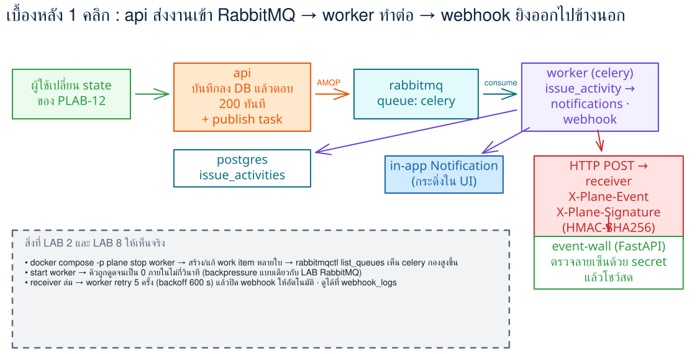
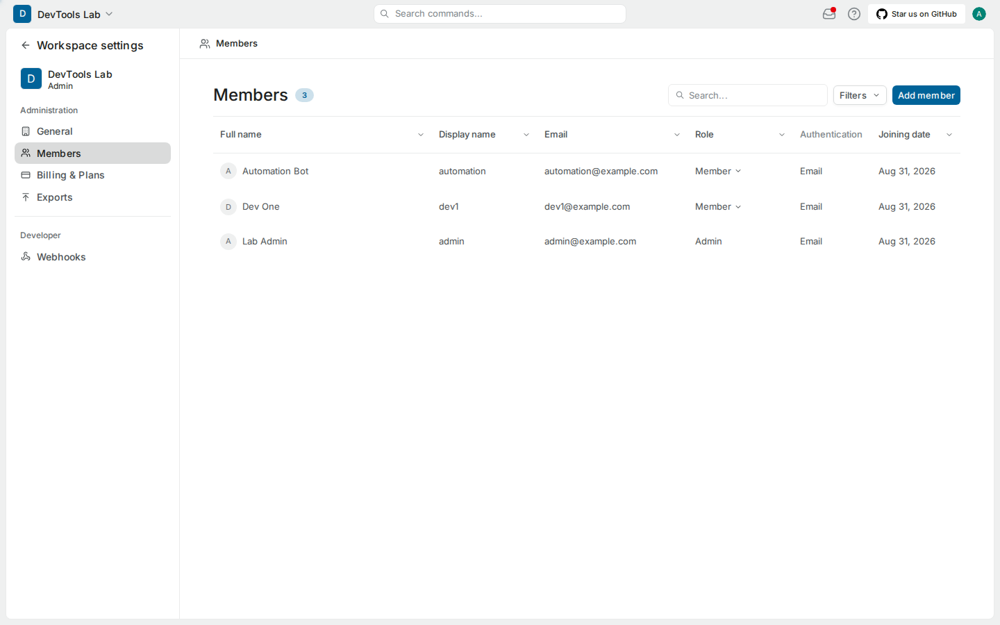
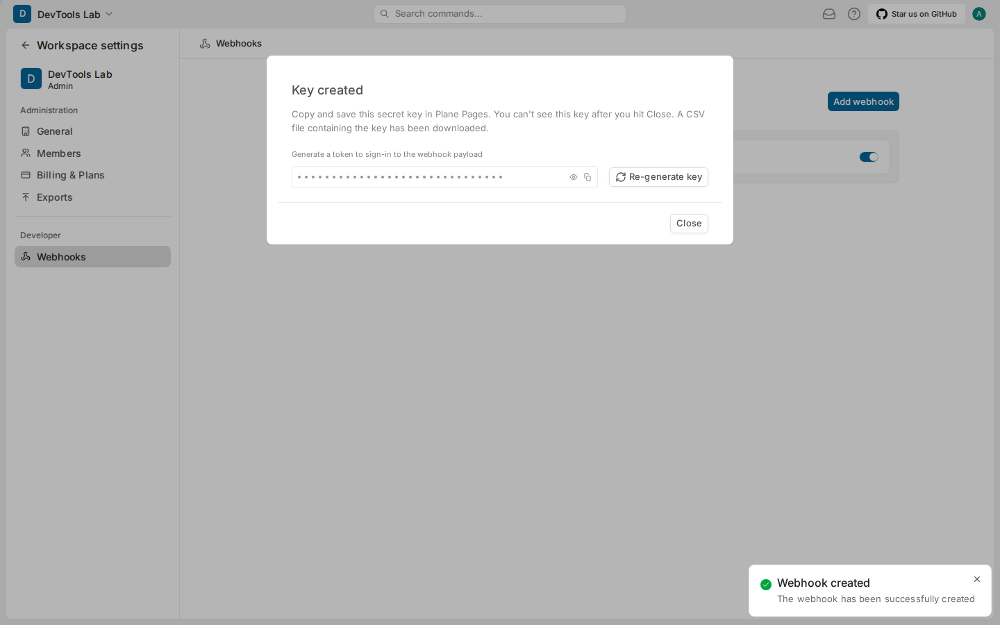
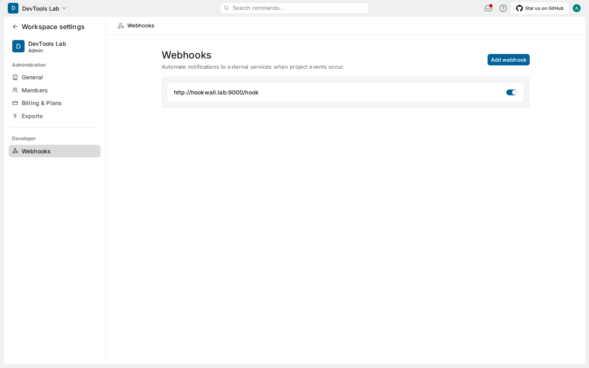
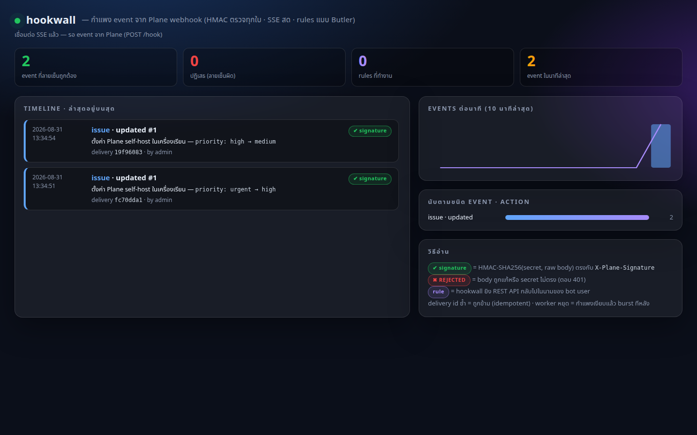
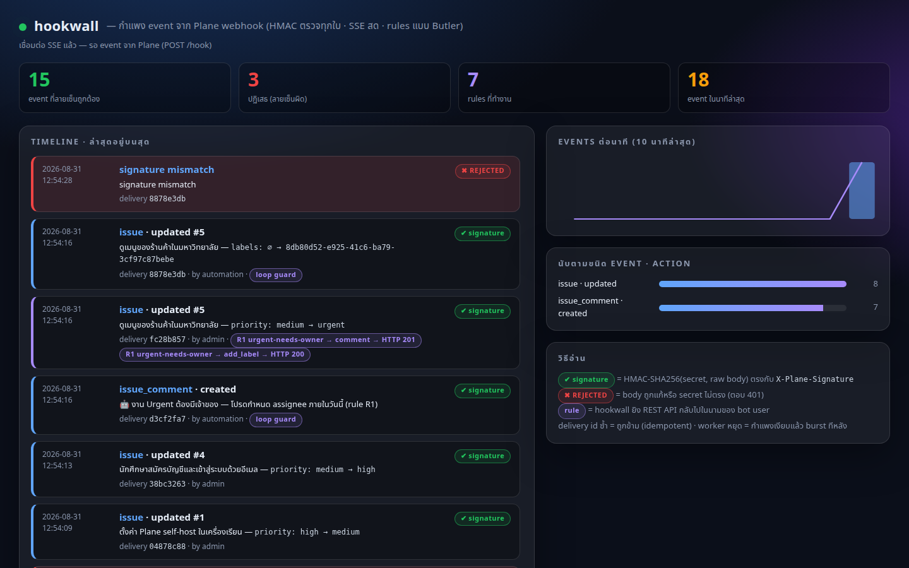
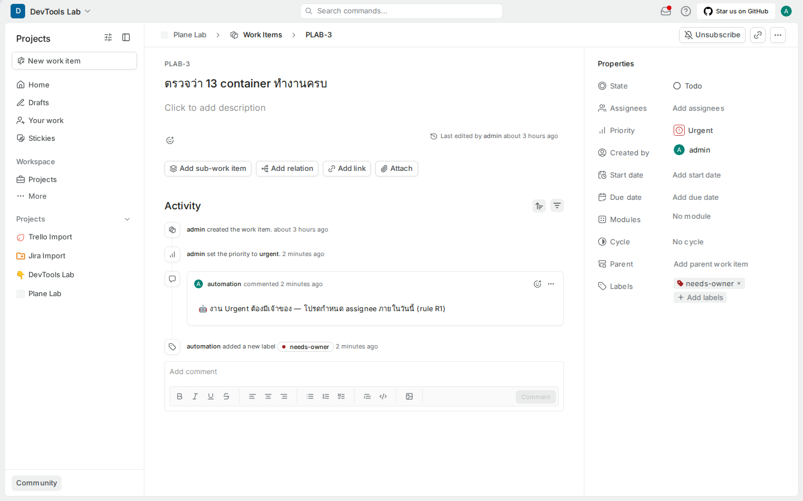
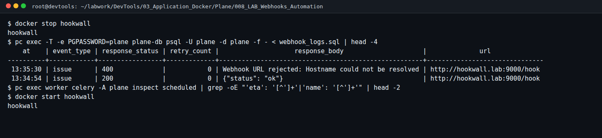
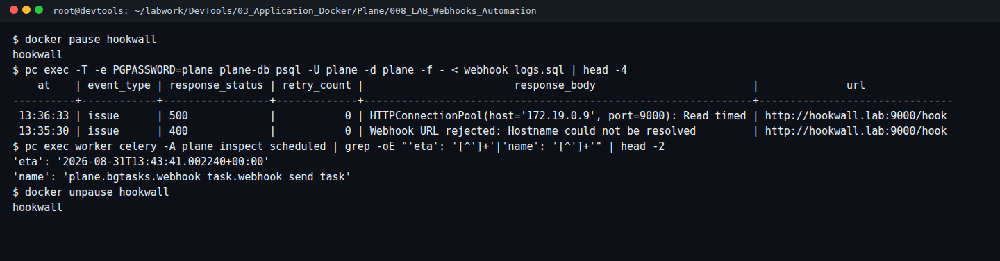

# LAB 8 — Automation Wall: webhook · HMAC · SSRF allowlist · rules แบบ Butler · retry/backpressure · bot user

> โฟลเดอร์ `008_LAB_Webhooks_Automation` = **LAB 8** ในสไลด์ `Plane_Agile_Slides.html` (ตอนที่ 4 · การติดตามการพัฒนาผลิตภัณฑ์ — webhooks/automation)
> (ไฟล์ของแล็บนี้ : `hookwall/` (`Dockerfile` · `app.py` · `rules.json` · `static/index.html`) · `run_hookwall.sh` · `verify_signature.py` · `replay_event.sh` · `webhook_logs.sql` · `check_lab08.sh`)
> (เวลาโดยประมาณ : 55 นาที)

## สิ่งที่จะได้เรียนรู้

- ตั้ง **webhook** ใน Plane และเข้าใจว่า SSRF guard ปฏิเสธ URL ที่ชี้เข้าเครือข่ายภายใน จนกว่าจะประกาศ `WEBHOOK_ALLOWED_HOSTS` และ **recreate** api/worker
- รัน **receiver** ของเราเอง (hookwall — Python stdlib ล้วน) ในเครือข่าย `plane_default` และดู event **สด** บนกำแพงแบบ dark-glass (SSE + inline SVG)
- ตรวจ **X-Plane-Signature** (HMAC-SHA256 ของ raw body) และพิสูจน์ด้วยการ replay แบบแก้ body 1 ตัวอักษร → **REJECTED**; delivery id ซ้ำ → **duplicate ignored**
- เขียน **rules แบบ Butler** (Trello) / automation rule (Jira) ที่ตอบกลับผ่าน REST API ในนามของ **bot user** ที่มี token ของตัวเอง (accountability + loop guard)
- สังเกต **retry/backoff** เมื่อ receiver ไม่ตอบ และ **backpressure** เมื่อ worker หยุด (ต่อยอด LAB 2)

## ทฤษฎีที่เกี่ยวข้อง

- **Webhook = push, API = pull**: API ให้เรา "ไปถาม" ส่วน webhook ให้ระบบ "มาบอก" เมื่อเกิดเหตุการณ์ — Jira webhooks, Trello webhooks และ Plane webhooks ใช้แนวคิดเดียวกัน: URL ปลายทาง + ชนิด event + secret
- **HMAC signature**: ผู้ส่งคำนวณ `HMAC-SHA256(secret, raw body)` แนบมาใน header; ผู้รับคำนวณซ้ำจาก **ไบต์เดิม** แล้วเทียบแบบ constant-time — secret ไม่เคยเดินทางบนสาย จึงพิสูจน์ได้ทั้ง "มาจาก Plane จริง" และ "body ไม่ถูกแก้"
- **SSRF (Server-Side Request Forgery)**: ถ้า Plane ยอมยิง request ไปทุก URL ที่ผู้ใช้กรอก จะถูกใช้เป็นเครื่องมือโจมตีเครือข่ายภายในได้ — Plane จึงปฏิเสธ `localhost`/private IP เว้นแต่ hostname อยู่ใน allowlist
- **Idempotency & at-least-once**: ระบบส่งซ้ำได้ (retry) ผู้รับจึงต้องกันซ้ำด้วย delivery id — หลักเดียวกับ message queue ใน LAB RabbitMQ
- **Automation ที่ตรวจสอบย้อนหลังได้**: การกระทำอัตโนมัติควรทำในนาม **บัญชีบอต** แยกจากคน (Activity บอกได้ว่า "บอตทำ") และต้องมี **loop guard** ไม่ให้บอตตอบสนอง event ของตัวเองวนไม่รู้จบ (จรรยาบรรณ: Judgment 4.01 · Management 5.05)

## ภาพรวมของแล็บนี้

1. **bot user**: สมัคร `automation@example.com` → admin เชิญเป็น Member → เข้าโปรเจกต์ → สร้าง Personal Access Token ของบอต
2. **ลองสร้าง webhook** ชี้ `http://hookwall.lab:9000/hook` → ถูกปฏิเสธ (SSRF guard)
3. **allowlist**: `WEBHOOK_ALLOWED_HOSTS=hookwall.lab,dashboard.lab` → `pc up -d api worker beat-worker`
4. **รัน hookwall** ใน `plane_default` (alias `hookwall.lab`) → สร้าง webhook สำเร็จ → เก็บ secret
5. **ดู event สดบนกำแพง hookwall**: แก้ work item แล้วดูการ์ดพร้อม ✔ signature ภายใน 2 วินาที; `webhook_logs` = 200
6. **ลายเซ็น**: `verify_signature.py` → MATCH ทุกใบ · `replay_event.sh --tamper` → 401 REJECTED · replay เดิม → duplicate ignored
7. **rules**: R1 urgent ไม่มีเจ้าของ → comment + label · R2 Done → ขอ demo link · R3 `/eta` → ตั้ง due date — ทำโดยบอต, loop guard กันวน
8. **retry**: `docker stop hookwall` → `400` ไม่ retry · `docker pause hookwall` → `500` timeout → `celery inspect scheduled` เห็น ETA → `unpause`
9. **backpressure**: `pc stop worker` → คิว `celery` โต → `pc start worker` → burst
10. **`check_lab08.sh`** พิมพ์ `PASS`



> **คำถามก่อนเริ่ม:** ถ้า receiver ล่ม Plane จะทิ้ง event หรือส่งซ้ำ และกี่ครั้ง? และทำไม `http://localhost:9000/hook` จึงใช้เป็น URL ของ webhook ไม่ได้ทั้งที่รันอยู่บนเครื่องเดียวกัน (เฉลยในข้อ 2 และข้อ 8)

### Terminal Map

| หน้าต่าง | หน้าที่ | เปิดเมื่อใด |
|---|---|---|
| **T1** | คำสั่งหลัก (docker, pc, สคริปต์) | ตั้งแต่เริ่ม |
| **T2** | `docker logs -f hookwall` | ข้อ 5 |
| **B1** | เบราว์เซอร์ admin (Plane) | ตั้งแต่เริ่ม |
| **B2** | private window — สมัคร bot user (ข้อ 1) และเปิดกำแพง `http://localhost:9000` (ข้อ 5) | ข้อ 1 |

> ภาพหน้าจอในเอกสารนี้จับจากเครื่องทดสอบซึ่งอาจแสดง port อื่น (เช่น `localhost:8087`) — ของผู้เรียนคือ `localhost:8080` (Plane) และ `localhost:9000` (hookwall)

---

## 0. เตรียมเครื่องเรียน

ต้องผ่าน LAB 7 (มี `~/.plane_token` และ venv); Plane รันอยู่:

```bash
docker start devtools 2>/dev/null || \
  docker run -dit --name devtools --privileged -p 2222:22 -p 8080:8080 -p 9000:9000 -p 8090:8090 tuchsanai/devtools:2569_1
ssh root@localhost -p 2222        # password : passwd
cd ~/labwork/DevTools/03_Application_Docker/Plane/008_LAB_Webhooks_Automation
source ~/venv-plane/bin/activate
pc ps --format 'table {{.Name}}\t{{.Status}}' | grep -E 'api|worker|proxy'
```

> 📝 **คำอธิบาย:** แล็บนี้ใช้ port **9000** ของเครื่องเรียน — `docker run` ทำงานเฉพาะครั้งแรก ถ้า `devtools` ถูกสร้างไว้แล้ว**โดยไม่มี `-p 9000:9000`** ให้ใช้แท็บ **PORTS** ของ VS Code forward `9000` แทน · hookwall ไม่ต้องติดตั้งไลบรารี เพราะเขียนด้วย `http.server` ของ Python เพื่อให้อ่านโค้ดทั้งหมดได้ในไฟล์เดียว

✅ **Expected output** — `plane-api-1`, `plane-worker-1`, `plane-proxy-1` เป็น `Up`

---

## 1. bot user — automation ที่ตรวจสอบย้อนหลังได้

B2 (private window): `http://localhost:8080/sign-up` → อีเมล `automation@example.com` รหัสผ่าน `Bot-Lab-2569` → onboarding ชื่อ `Automation` → (ยังไม่มี workspace ให้เข้า)
B1 (admin): **Workspace settings → Members → Add member** `automation@example.com` role **Member** → **Send invitations** → **Pending invites → Copy link** → ส่งให้ B2 เปิดแล้วรับคำเชิญ (วิธีเดียวกับ LAB 3)
B1: **Project settings → Members → Add member** เพิ่ม automation เป็น Member ของ Plane Lab
B2: avatar → **Settings → Developer → Personal Access Tokens → Add access token** (`hookwall-bot`, Never expires) → คัดลอก



```bash
echo '<YOUR_BOT_TOKEN>' > ~/.plane_bot_token && chmod 600 ~/.plane_bot_token
curl -s http://localhost:8080/api/v1/users/me/ -H "X-API-Key: $(cat ~/.plane_bot_token)" | python3 -c 'import sys,json; print(json.load(sys.stdin)["email"])'
```

> 📝 **คำอธิบาย:** ทุกอย่างที่ rules ทำจะถูกบันทึกใน Activity ว่า **automation** เป็นคนทำ ไม่ปนกับคน · token ของบอตเพิกถอนได้โดยไม่กระทบ token ของเรา (least privilege) · บอตต้องเป็นสมาชิก **โปรเจกต์** จึงจะ comment/แก้ label ได้

✅ **Expected output** — `automation@example.com`

---

## 2. ลองสร้าง webhook — SSRF guard ทำงาน

B1: **Workspace settings → Webhooks → Add webhook** → Payload URL `http://hookwall.lab:9000/hook` → เลือก event **Work items · Work item comments · Cycles · Modules** → **Create**

✅ **Expected output** — ถูกปฏิเสธ: **Invalid or disallowed webhook URL** (ลอง `http://localhost:9000/hook` ก็ถูกปฏิเสธเช่นกัน)

> 📝 **คำอธิบาย:** Plane resolve hostname ตอนบันทึก: `localhost` และ private IP (172.x/10.x/192.168.x) ถูกบล็อกเพื่อกัน SSRF · hostname ต้องมี **จุด** ด้วย (URL validator ของ Django ไม่รับ `hookwall` คำเดียว) เราจึงตั้งชื่อ `hookwall.lab` · ทางออกที่ถูกต้องคือประกาศ hostname ที่ **เรารับผิดชอบ** ใน allowlist ไม่ใช่ปิด guard

---

## 3. allowlist แล้ว recreate

```bash
sed -i 's|^WEBHOOK_ALLOWED_HOSTS=.*|WEBHOOK_ALLOWED_HOSTS=hookwall.lab,dashboard.lab|' ~/plane-selfhost/plane.env
grep -n WEBHOOK_ALLOWED_HOSTS ~/plane-selfhost/plane.env
pc up -d api worker beat-worker
until [ "$(curl -s -o /dev/null -w '%{http_code}' http://localhost:8080/api/instances/)" = "200" ]; do sleep 5; done; echo READY
pc exec worker env | grep WEBHOOK_ALLOWED_HOSTS
```

> 📝 **คำอธิบาย:** ใส่ `dashboard.lab` ไว้ล่วงหน้าให้ LAB 9 จะได้ไม่ต้อง recreate อีก · **`pc up -d`** สร้าง container ใหม่ด้วย env ใหม่ — `pc restart` ไม่อ่าน env ใหม่ (บทเรียน LAB 1) · ทั้ง api (ตรวจตอนบันทึก) และ worker (ตรวจตอนส่ง) ต้องเห็นค่านี้

✅ **Expected output**

```
98:WEBHOOK_ALLOWED_HOSTS=hookwall.lab,dashboard.lab
 Container plane-worker-1 Started
 Container plane-beat-worker-1 Started
READY
WEBHOOK_ALLOWED_HOSTS=hookwall.lab,dashboard.lab
```

---

## 4. รัน hookwall แล้วสร้าง webhook

ยังไม่มี secret (ได้หลังสร้าง webhook) แต่ Plane ต้อง resolve `hookwall.lab` ได้ตอนบันทึก — จึงรัน hookwall ก่อนด้วย secret ชั่วคราว:

```bash
echo placeholder > ~/.plane_wh_secret
bash run_hookwall.sh
```

> 📝 **คำอธิบาย:** `run_hookwall.sh` build image `hookwall:lab` (python:3.12-alpine) แล้ว `docker run --network plane_default --network-alias hookwall.lab -p 9000:9000` พร้อม env `PLANE_WEBHOOK_SECRET`, `PLANE_API_TOKEN` (ของบอต), `PLANE_BASE=http://proxy` — receiver จึงอยู่ใน "เครือข่ายเดียวกับ Plane" และเรียก API กลับผ่าน proxy ได้

✅ **Expected output**

```
image hookwall:lab พร้อม
{"status": "ok", "uptime_s": 1, "events": 0, "rejected": 0, "duplicates": 0, "rules_fired": 0, "bot": "automation@example.com", "secret_set": true}
เปิด http://localhost:9000 (forward port 9000) · log: docker logs -f hookwall
```

B1: **Add webhook** อีกครั้ง URL `http://hookwall.lab:9000/hook` → **Select individual events** → ติ๊ก **Projects** ออก ให้เหลือ 4 ชนิด (Cycles · Work items · Modules · Work item comments) → **Create** → modal **Key created** แสดง secret แบบซ่อน (จุด) → กดไอคอน copy หรือรูปตา เพื่อคัดลอก `plane_wh_…` (เห็นได้ **ครั้งเดียว** — ปิด modal แล้วดูไม่ได้อีก ต้อง **Re-generate key**)



> 📝 **คำอธิบาย:** Plane ตอบ secret ให้ครั้งเดียวตอนสร้าง (หลักเดียวกับ Personal Access Token ใน LAB 3) — เก็บใน `~/.plane_wh_secret` (chmod 600) ห้ามวางลงใน readme/สคริปต์ · UI ยังดาวน์โหลดไฟล์ CSV ที่มี key ให้ด้วย ถ้าไม่ต้องการให้ลบทิ้ง



```bash
echo '<YOUR_WEBHOOK_SECRET>' > ~/.plane_wh_secret && chmod 600 ~/.plane_wh_secret
bash run_hookwall.sh        # รันใหม่ด้วย secret จริง
pc exec -T -e PGPASSWORD=plane plane-db psql -U plane -d plane -c "select url, is_active, issue, issue_comment, cycle, module from webhooks where deleted_at is null;"
```

✅ **Expected output** — `http://hookwall.lab:9000/hook | t | t | t | t | t` และ health `secret_set: true`

---

## 5. ดู event สดบนกำแพง (hookwall)

T2: `docker logs -f hookwall` · B2: เปิด `http://localhost:9000` (forward 9000) · B1: เปิด work item PLAB-1 เปลี่ยน priority 2 ครั้ง แล้วดูกำแพง



```bash
pc exec -T -e PGPASSWORD=plane plane-db psql -U plane -d plane -f - < webhook_logs.sql
```

> 📝 **คำอธิบาย:** ลำดับเหตุการณ์: UI → api บันทึก → task `webhook_send_task` เข้าคิว `celery` → **worker** POST ไป hookwall พร้อม header `X-Plane-Event`, `X-Plane-Delivery`, `X-Plane-Signature` → hookwall ตอบ 200 ก่อนแล้วค่อยรัน rules (กัน timeout 30 วินาที) · `webhook_logs` เก็บทุกครั้งที่ส่ง

✅ **Expected output** — การ์ด `issue · updated #1 — priority: urgent → high` และ `priority: high → medium` พร้อม ✔ signature ภายใน ~2 วินาที (ตัวนับ **2** event · **0** ปฏิเสธ · **0** rules) และตาราง:

```
    at    | event_type | response_status | retry_count |  response_body   |              url
----------+------------+-----------------+-------------+------------------+-------------------------------
 13:34:54 | issue      | 200             |           0 | {"status": "ok"} | http://hookwall.lab:9000/hook
 13:34:51 | issue      | 200             |           0 | {"status": "ok"} | http://hookwall.lab:9000/hook
```

---

## 6. ลายเซ็น — ตรวจเอง แล้วลองปลอม

```bash
python verify_signature.py hookwall/data/events.jsonl | tail -3
bash replay_event.sh
bash replay_event.sh --tamper
```

> 📝 **คำอธิบาย:** hookwall เก็บ **raw body** (base64) และ header ของทุก event ไว้ใน `events.jsonl` · `verify_signature.py` คำนวณ `hmac.new(secret, raw_body, sha256).hexdigest()` ใหม่ทุกใบ · `replay_event.sh` ส่ง event ล่าสุดกลับเข้า hookwall: delivery id เดิม → ถูกข้าม; `--tamper` แก้ body 1 ตัวอักษรแต่ใช้ลายเซ็นเดิม → ไม่ตรง → 401

✅ **Expected output**

```
MATCH     issue.updated  #2  delivery 2a4c9235  sig 4bf9a468dd57…
10 match · 0 mismatch  (สูตร: hmac.new(secret, raw_body, sha256).hexdigest())
HTTP 200 {"status": "duplicate ignored"}
HTTP 401 {"error": "signature mismatch"}
```



---

## 7. rules แบบ Butler — บอตตอบกลับผ่าน API

เปิด `hookwall/rules.json` — 3 กติกา:

| rule | when | then |
|---|---|---|
| **R1** urgent-needs-owner | work item priority = urgent และไม่มี assignee | comment "🤖 งาน Urgent ต้องมีเจ้าของ…" + label `needs-owner` |
| **R2** done-needs-demo | state เปลี่ยนเป็นกลุ่ม completed | comment ขอ demo/PR link |
| **R3** eta-command | comment มี `/eta` | ตั้ง Due date +3 วัน + comment ยืนยัน |

B1: เปิด PLAB-3 → Priority **Urgent** (ไม่มี assignee) → ภายใน ~3 วินาที:



> 📝 **คำอธิบาย:** Activity ระบุว่า **automation** เป็นคน comment และเพิ่ม label — ตรวจสอบย้อนหลังได้ว่าเป็นบอต · comment ของบอตทำให้เกิด event `issue_comment` ใหม่ ซึ่ง hookwall **ข้าม** เพราะ actor = bot (loop guard) — ดูใน T2: `skipped: loop guard (actor = bot)`

ต่อ: comment `ขอเลื่อนส่ง /eta 3 วันนะ` บน PLAB-2 → R3 ตั้ง Due date · ย้าย PLAB-2 เป็น Done → R2

✅ **Expected output** (T2)

```
12:52:44 OK issue_comment created   | rules: [{'rule': 'R3 eta-command', 'result': 'set_target_date → HTTP 200'}, {'rule': 'R3 eta-command', 'result': 'comment → HTTP 201'}]
12:52:44 OK issue_comment created   | rules: [{'rule': '-', 'result': 'skipped: loop guard (actor = bot)'}]
12:52:51 OK issue updated #2 state: Todo → Done | rules: [{'rule': 'R2 done-needs-demo', 'result': 'comment → HTTP 201'}]
```

```bash
pc exec -T -e PGPASSWORD=plane plane-db psql -U plane -d plane -c \
 "select i.sequence_id, left(c.comment_stripped,60) from issue_comments c join users u on u.id=c.actor_id join issues i on i.id=c.issue_id where u.email='automation@example.com' and c.deleted_at is null order by c.created_at;"
```

✅ **Expected output** — comment ของบอตบน PLAB-3 (R1), PLAB-2 (R3, R2)

---

## 8. retry — receiver ไม่ตอบ

### 8.1 stop = ชื่อหายจาก DNS → `400` ไม่ retry

```bash
docker stop hookwall
```

> 📝 **คำอธิบาย:** container ที่ **stop** ถูกถอดจากเครือข่าย `plane_default` → ชื่อ `hookwall.lab` resolve ไม่ได้ · worker ถือว่า **URL ถูกปฏิเสธ** (SSRF guard ขั้นแรก) ไม่ใช่ปลายทางล่ม จึงบันทึก `400` และ **ไม่นัดส่งใหม่**

✅ **Expected output** — `hookwall`

B1: แก้ priority ของ PLAB-1 อีกครั้ง → รอ ~10 วินาที

```bash
pc exec -T -e PGPASSWORD=plane plane-db psql -U plane -d plane -f - < webhook_logs.sql | head -4
pc exec worker celery -A plane inspect scheduled | grep -oE "'eta': '[^']+'|'name': '[^']+'" | head -2
docker start hookwall
```

✅ **Expected output** — แถว `400 | 0 | Webhook URL rejected: Hostname could not be resolved` และ `inspect scheduled` ว่างเปล่า (ไม่มี retry):

```
    at    | event_type | response_status | retry_count |                    response_body                     |              url
----------+------------+-----------------+-------------+------------------------------------------------------+-------------------------------
 13:35:30 | issue      | 400             |           0 | Webhook URL rejected: Hostname could not be resolved | http://hookwall.lab:9000/hook
 13:34:54 | issue      | 200             |           0 | {"status": "ok"}                                     | http://hookwall.lab:9000/hook
hookwall
```



### 8.2 pause = ยังอยู่แต่ไม่ตอบ → `500` timeout + นัดส่งใหม่

```bash
docker pause hookwall
```

> 📝 **คำอธิบาย:** `pause` แช่แข็ง process แต่ container ยังอยู่ในเครือข่าย (DNS resolve ได้, TCP connect ได้) → worker รอ **30 วินาที** แล้วบันทึก `500 Read timed out` และ **นัดส่งใหม่**: `retry_backoff=600` + jitter → ETA สุ่มไม่เกิน 10 นาที, สูงสุด 5 ครั้ง แล้วปิด webhook ให้อัตโนมัติ (ต้องเปิดสวิตช์ใน UI เอง)

✅ **Expected output** — `hookwall`

B1: แก้ priority ของ PLAB-1 อีกครั้ง → รอ ~40 วินาที

```bash
pc exec -T -e PGPASSWORD=plane plane-db psql -U plane -d plane -f - < webhook_logs.sql | head -4
pc exec worker celery -A plane inspect scheduled | grep -oE "'eta': '[^']+'|'name': '[^']+'" | head -2
docker unpause hookwall
```

✅ **Expected output** — แถว `500` และ task `webhook_send_task` ที่มี `eta` ล่วงหน้าไม่เกิน 10 นาที:

```
    at    | event_type | response_status | retry_count |                        response_body                         |              url
----------+------------+-----------------+-------------+--------------------------------------------------------------+-------------------------------
 13:36:33 | issue      | 500             |           0 | HTTPConnectionPool(host='172.x.x.x', port=9000): Read timed  | http://hookwall.lab:9000/hook
 13:35:30 | issue      | 400             |           0 | Webhook URL rejected: Hostname could not be resolved         | http://hookwall.lab:9000/hook
'eta': '2026-08-31T13:43:41.002240+00:00'
'name': 'plane.bgtasks.webhook_task.webhook_send_task'
hookwall
```



หลัง `unpause` เมื่อถึง ETA (ในตัวอย่าง ~7 นาที) event เดิมจะมาถึงกำแพง และ `webhook_logs` มีแถวใหม่ที่ `retry_count = 1` — ระหว่างรอไปทำข้อ 9 ก่อนได้ แล้วค่อยกลับมารัน `webhook_logs.sql` อีกครั้ง:

```
 13:43:41 | issue      | 200             |           1 | {"status": "ok"}                                             | http://hookwall.lab:9000/hook
 13:36:33 | issue      | 500             |           0 | HTTPConnectionPool(host='172.x.x.x', port=9000): Read timed  | http://hookwall.lab:9000/hook
```

(T2 จะเห็น `13:43:41 OK issue updated #1 priority: high → medium` ตรงเวลา ETA พอดี — event ไม่หาย แค่มาช้า)

---

## 9. backpressure — worker หยุด (ต่อยอด LAB 2)

```bash
pc stop worker
```

> 📝 **คำอธิบาย:** api ยังรับการแก้ไขและส่ง task เข้าคิว `celery` ตามปกติ แต่ไม่มี consumer มาหยิบ — event จึงค้างในคิว (ไม่หาย) จนกว่า worker จะกลับมา

✅ **Expected output** — `Container plane-worker-1 Stopped`

B1: แก้ work item 3 ครั้ง → กำแพง hookwall ไม่มี event ใหม่

```bash
pc exec plane-mq rabbitmqctl list_queues -p plane name messages consumers | grep -E '^celery'
pc start worker && sleep 15
pc exec plane-mq rabbitmqctl list_queues -p plane name messages consumers | grep -E '^celery'
```

✅ **Expected output** — คิวโตแล้วระบาย และการ์ด event โผล่บนกำแพง hookwall เป็นชุด:

```
celery	12	0
celery	0	1
```

---

## 10. ปิดด้วย `check_lab08.sh`

```bash
bash check_lab08.sh
```

✅ **Expected output**

```
  ✓ webhook ชี้ไป hookwall.lab และ active
  ✓ WEBHOOK_ALLOWED_HOSTS มี hookwall.lab
  ✓ worker อ่าน allowlist แล้ว (recreate ผ่าน pc up -d)
  ✓ webhook_logs ส่งสำเร็จ (200) 12 ครั้ง
  ✓ hookwall รับ event ลายเซ็นถูกต้อง 17 ใบ
  ✓ มีการ์ด REJECTED 3 ใบ (replay --tamper)
  ✓ rule R1 เคยทำงาน
  ✓ comment จาก bot user ปรากฏใน Plane 5 รายการ
PASS: LAB 8 — webhook active · allowlist in env+worker · signed events · rejected tamper · rule fired · bot comment
```

---

## ทดลองเพิ่มเติม

### ก. Regenerate secret โดยไม่บอก hookwall

Webhooks → เปิด webhook → **Regenerate** → แก้ work item → ✅ กำแพงแสดง **REJECTED** ทุกใบ จนกว่าจะอัปเดต `~/.plane_wh_secret` แล้ว `bash run_hookwall.sh`

### ข. ปิด event บางชนิด

แก้ webhook ให้ไม่ติ๊ก **Cycles** → เพิ่มงานเข้า cycle → ✅ ไม่มี event (`webhook_logs` ไม่มีแถวใหม่)

### ค. ลบ work item

ลบ work item → ✅ payload `data` มีเฉพาะ `{"id": …}` — ผู้รับต้องไม่ถือว่ามี field ครบเสมอ

### ง. CIDR แทน hostname

`WEBHOOK_ALLOWED_IPS=172.16.0.0/12` (แทน HOSTS) แล้ว `pc up -d api worker beat-worker` → ✅ ผลเหมือนกัน — เลือกแบบที่แคบที่สุดที่ยังทำงาน

### จ. เพิ่ม rule ของตัวเอง

เพิ่มใน `rules.json` เช่น "label `bug` + priority urgent → comment เตือน SLA" → `bash run_hookwall.sh` (image เดิม rebuild เร็ว) → ทดสอบ

---

## แก้ปัญหาที่พบบ่อย

| อาการ | สาเหตุ | วิธีแก้ |
|---|---|---|
| สร้าง webhook แล้ว "Invalid or disallowed webhook URL" | hostname ไม่มีจุด / resolve เป็น private IP โดยไม่มี allowlist / hookwall ยังไม่รัน (resolve ไม่ได้) | ใช้ `hookwall.lab`, ใส่ `WEBHOOK_ALLOWED_HOSTS` แล้ว `pc up -d api worker beat-worker`, รัน hookwall ก่อนสร้าง |
| กำแพง hookwall ไม่มี event ใหม่ | worker หยุด · webhook ถูกปิด (retry ครบ 5) · env ยังไม่ถูกอ่าน | `pc ps worker`; เปิดสวิตช์ webhook ใน UI; `pc exec worker env \| grep WEBHOOK` |
| ทุกใบ REJECTED | secret ใน hookwall ไม่ตรง (regenerate แล้ว) | อัปเดต `~/.plane_wh_secret` แล้ว `bash run_hookwall.sh` |
| `webhook_logs` = `400 Hostname could not be resolved` | hookwall ไม่ได้รัน/ไม่ได้อยู่ใน `plane_default` | `docker ps`; `bash run_hookwall.sh` |
| rules ไม่ทำงาน (`HTTP 403/404`) | บอตไม่ได้เป็นสมาชิกโปรเจกต์ / token ผิด | Project settings → Members เพิ่ม automation; ตรวจ `~/.plane_bot_token` |
| `rules_fired` แต่ไม่เห็น comment | ดูใน T2 ว่า result เป็น HTTP อะไร | 429 = เกิน rate limit ของ token บอต — รอ reset |
| port 9000 ชน | มี process อื่นใช้ | เปลี่ยน `-p 9100:9000` ใน `run_hookwall.sh` แล้ว forward 9100 |

---

## เก็บกวาด (Cleanup)

คง `hookwall` ไว้ถึง LAB 9 (ใช้ทดสอบ trigger) · จบชุดจึง `docker rm -f hookwall` และ `docker rmi hookwall:lab` · ปิด webhook ใน Workspace settings ถ้าไม่ใช้ · **ห้าม** ลบ `WEBHOOK_ALLOWED_HOSTS` (LAB 9 ใช้ `dashboard.lab`)

```bash
docker ps --format '{{.Names}}\t{{.Status}}' | grep hookwall
```

✅ **Expected output** — `hookwall  Up …`

---

## สรุปคำสั่งของแล็บนี้

| คำสั่ง | ความหมาย |
|---|---|
| `bash run_hookwall.sh` | build + รัน receiver ใน `plane_default` (alias `hookwall.lab`) พร้อม secret และ token ของบอต |
| `pc up -d api worker beat-worker` | recreate ให้ env ใหม่ (`WEBHOOK_ALLOWED_HOSTS`) มีผล |
| `pc exec -T -e PGPASSWORD=plane plane-db psql … -f - < webhook_logs.sql` | ประวัติการส่ง webhook (status · retry_count · body) |
| `python verify_signature.py hookwall/data/events.jsonl` | ตรวจ HMAC ของทุก event ที่เก็บไว้ |
| `bash replay_event.sh [--tamper]` | replay เดิม (duplicate) / แก้ body (REJECTED) |
| `docker stop/start` · `docker pause/unpause hookwall` | จำลอง receiver หาย (400 ไม่ retry) / ไม่ตอบ (500 + retry) |
| `pc exec worker celery -A plane inspect scheduled` | ดู task ที่นัดส่งใหม่ (ETA) |
| `bash check_lab08.sh` | ด่านหลักฐานของแล็บ — ต้องได้ `PASS` |

> **จำให้ขึ้นใจ:** ลายเซ็นตรวจจาก raw body · delivery id กันซ้ำ · allowlist ไม่ใช่ปิด guard · บอตต้องมีบัญชีและ loop guard

## ✅ เช็กลิสต์ก่อนจบแล็บ

- [ ] bot user เป็น Member ของ workspace และโปรเจกต์ และมี token ของตัวเอง
- [ ] เห็น "Invalid or disallowed webhook URL" ก่อนใส่ allowlist
- [ ] `pc exec worker env` มี `WEBHOOK_ALLOWED_HOSTS=hookwall.lab,dashboard.lab`
- [ ] webhook active และ `webhook_logs` = 200
- [ ] กำแพงแสดง event สดพร้อม ✔ signature
- [ ] `verify_signature.py` MATCH ทุกใบ · replay ซ้ำ = duplicate · `--tamper` = 401 + การ์ดแดง
- [ ] R1/R2/R3 ทำงาน และ Activity ระบุ actor = automation · เห็น loop guard ใน log
- [ ] เห็น `400 … could not be resolved` (ไม่ retry) เมื่อ stop และ `500 Read timed out` + ETA ใน `inspect scheduled` เมื่อ pause receiver
- [ ] คิว `celery` โตเมื่อ worker หยุด และระบายเมื่อ start
- [ ] `bash check_lab08.sh` ได้ `PASS`

*ผลลัพธ์ทั้งหมดในเอกสารนี้มาจากการรันจริงในเครื่องเรียน `tuchsanai/devtools:2569_1` (Plane v1.4.2) เมื่อ 31 ส.ค. 2026*
