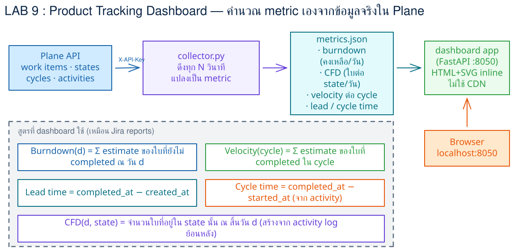
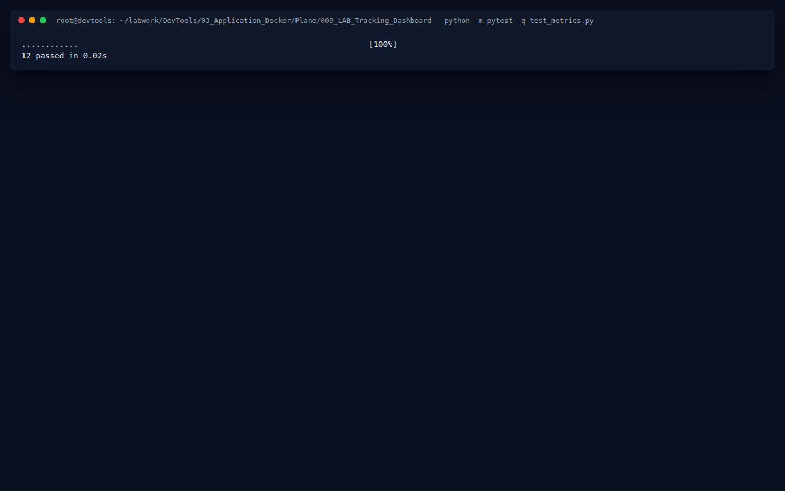
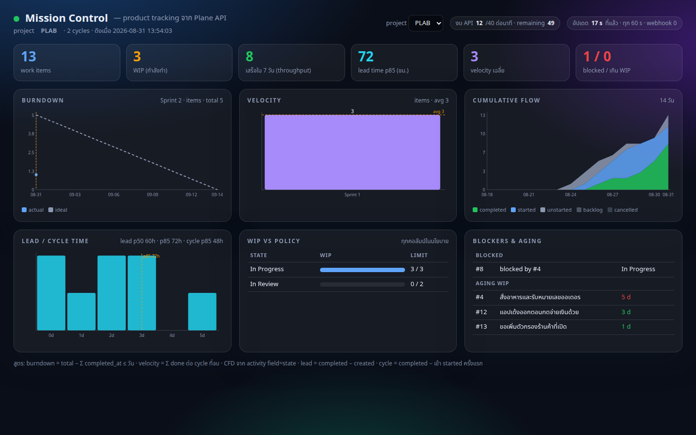
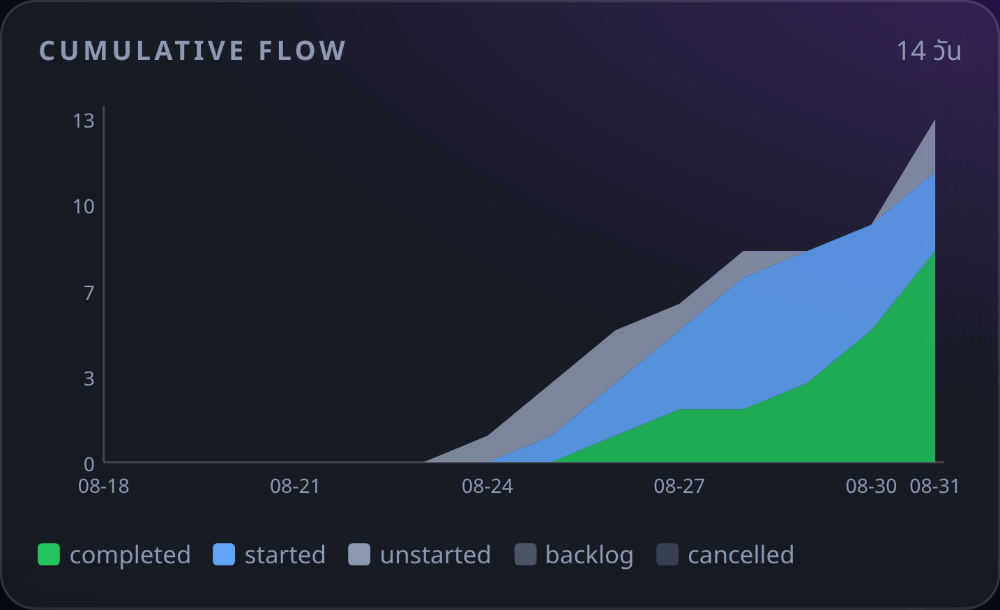
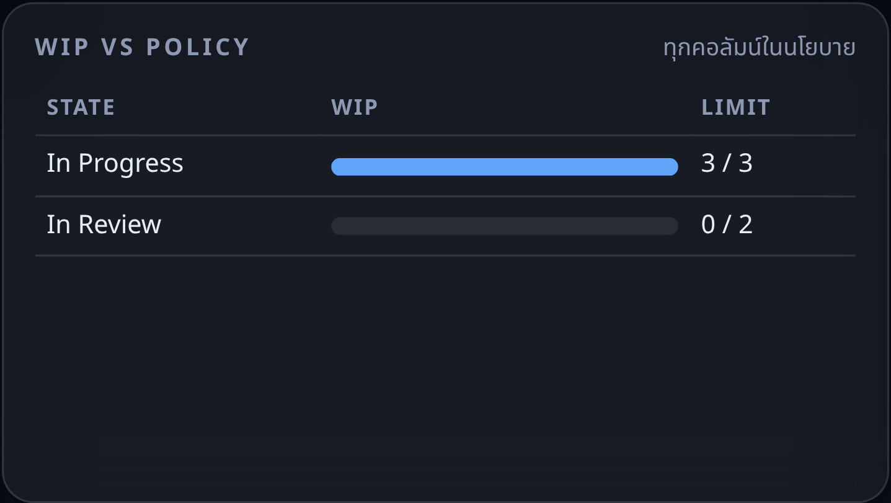
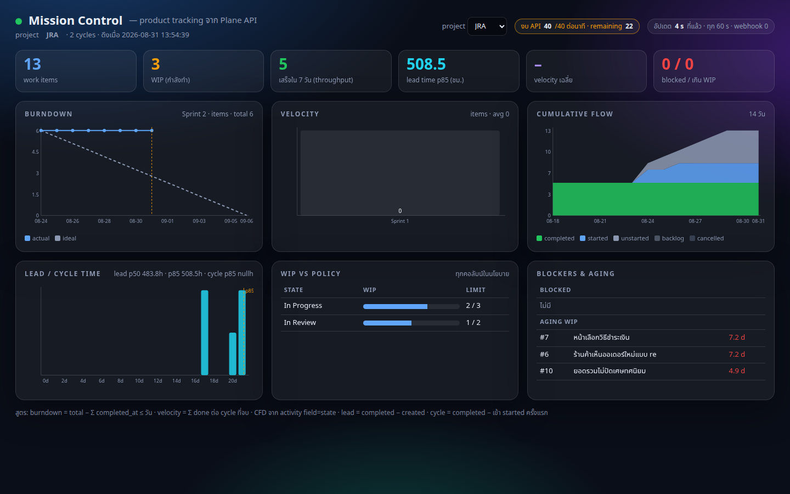
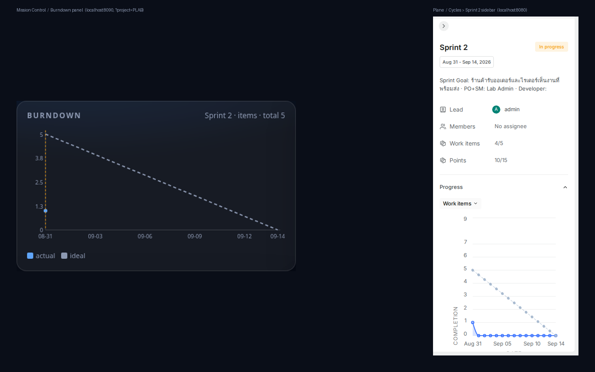
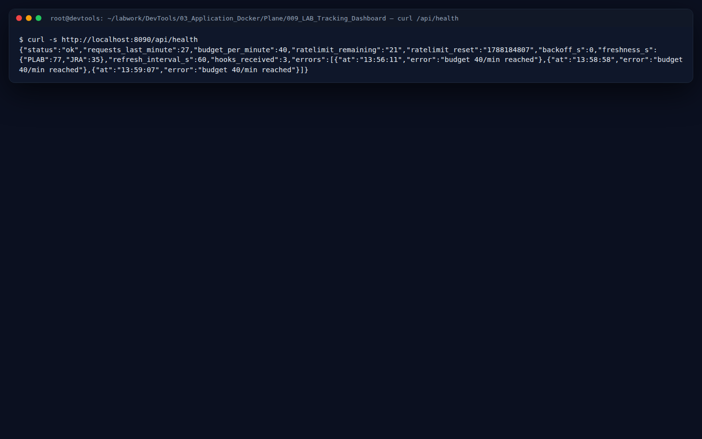
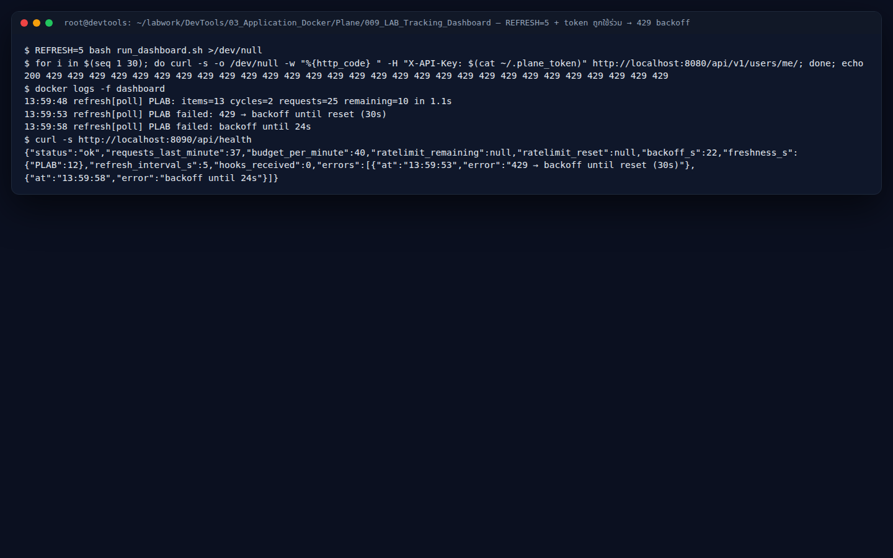

# LAB 9 — Mission Control: dashboard ติดตามผลิตภัณฑ์จากข้อมูลจริงใน Plane (FastAPI + inline SVG · dark glass · live)

> โฟลเดอร์ `009_LAB_Tracking_Dashboard` = **LAB 9** ในสไลด์ `Plane_Agile_Slides.html` (ตอนที่ 4 · การติดตามการพัฒนาผลิตภัณฑ์ — metrics & dashboards)
> (ไฟล์ของแล็บนี้ : `dashboard/` (`app.py` · `metrics.py` · `test_metrics.py` · `fixtures/snapshot_small.json` · `static/index.html` · `wip_policy.json` · `Dockerfile` · `requirements.txt`) · `run_dashboard.sh` · `check_lab09.sh`)
> (เวลาโดยประมาณ : 60 นาที)

## สิ่งที่จะได้เรียนรู้

- นิยามและ **คำนวณเอง**: burndown · velocity · cumulative flow (CFD) · lead/cycle time (p50/p85) · WIP เทียบนโยบาย · blockers/aging — สิ่งที่ Analytics ของ Plane CE ไม่มีให้ (LAB 6)
- แยก **สูตร** (pure function ทดสอบด้วย pytest) ออกจาก **การดึงข้อมูล** (poller ที่เคารพ rate limit 60/นาที) และ **การแสดงผล** (HTML ไฟล์เดียว inline SVG ไม่มี CDN)
- ออกแบบ **polling budget + backoff** และรับ **webhook** จาก Plane เพื่อ refresh ทันที (ต่อยอด LAB 8)
- **ตรวจตัวเลขกับความจริง**: burndown ตรงกับ `cycle_report.py` (LAB 4), WIP ตรงกับ `wip_guard.py` (LAB 5), lead/cycle time ตรงกับ `flow_metrics.py`
- เทียบกับ Jira (Velocity chart · CFD · Control chart) และ Trello (Dashboard Power-Up) แล้วสะท้อนคิดว่า metric ใด "ห้าม" ใช้ตัดสินคน

## ทฤษฎีที่เกี่ยวข้อง

- **Leading vs lagging indicators**: burndown/WIP/aging บอกล่วงหน้าว่าจะไม่ทัน (leading) ส่วน velocity/throughput บอกสิ่งที่เกิดแล้ว (lagging) — dashboard ที่ดีวางทั้งสองแบบให้ตอบคนละคำถาม
- **สูตรที่ใช้** (สไลด์ตอนที่ 4): `burndown(d) = total − Σ งานที่ completed_at ≤ d` · `velocity(cycle) = Σ งานที่เสร็จภายใน end_date ของ cycle` · `CFD(d, group) = จำนวนงานใน group ณ สิ้นวัน d` (สร้างจาก activity `field=state` ย้อนหลัง) · `lead = completed − created` · `cycle = completed − เข้า started ครั้งแรก` · **Little's Law** `WIP ≈ throughput × cycle time`
- **Percentile แทนค่าเฉลี่ย**: "85% ของงานเสร็จภายใน X ชั่วโมง" ใช้ทำ SLA/พยากรณ์ได้ดีกว่าค่าเฉลี่ยที่ถูกงานใหญ่ดึง
- **สถาปัตยกรรมแอปเล็ก ๆ** (ตอนที่ 2): collector → metrics → API → UI เป็นชั้น; ทดสอบชั้นสูตรด้วย fixture ก่อนต่อระบบจริง; ทุก request ถูกนับเพื่ออยู่ในงบ (token ละ 60/นาที — แชร์กับสคริปต์อื่นที่ใช้ token เดียวกัน)
- **Push + pull**: polling ทุก 60 วินาทีเป็น baseline ที่ทนต่อ webhook หาย; webhook ทำให้ "สด" ภายใน 2 วินาที — สองช่องทางเสริมกัน (LAB 8)

## ภาพรวมของแล็บนี้

1. **pytest** สูตรทั้ง 6 กับ fixture ที่รู้คำตอบ (12 tests)
2. **รัน dashboard** ใน `plane_default` (alias `dashboard.lab`) → เปิด `http://localhost:8090`
3. **อ่านหน้าจอ**: KPI 6 ช่อง · burndown · velocity · CFD · lead/cycle histogram · WIP vs policy · blockers/aging · freshness · งบ API
4. **ตรวจกับความจริง**: burndown vs Plane และ `cycle_report.py` · WIP vs `wip_guard.py` · lead/cycle vs `flow_metrics.py` · สลับไป project `JRA` (ข้อมูลจาก LAB 7)
5. **live**: webhook ตัวที่ 2 ไป `http://dashboard.lab:8090/hook` → ลากการ์ดใบที่ 4 เข้า In Progress → refresh ทันที + WIP แดง
6. **งบ API**: `/api/health` · `REFRESH=5` + token ที่ถูกใช้ร่วม → 429 → backoff → คืนค่า
7. **สะท้อนคิด** ใน Page "Sprint 2 Review — metrics"
8. **`check_lab09.sh`** พิมพ์ `PASS` · เก็บกวาดจบชุด



> **คำถามก่อนเริ่ม:** Plane CE ไม่มี velocity/CFD/lead time — จะได้ตัวเลขเหล่านี้จากข้อมูลไหน และถ้าดึงทุก 10 วินาทีจะเกิดอะไรกับ token ที่มีโควตา 60 ครั้ง/นาที (เฉลยในข้อ 1 และข้อ 6)

### Terminal Map

| หน้าต่าง | หน้าที่ | เปิดเมื่อใด |
|---|---|---|
| **T1** | pytest · build/run · curl | ตั้งแต่เริ่ม |
| **T2** | `docker logs -f dashboard` | ข้อ 2 |
| **B1** | Plane (`localhost:8080`) · dashboard (`localhost:8090`) | ข้อ 2 |

> ภาพหน้าจอในเอกสารนี้จับจากเครื่องทดสอบซึ่งอาจแสดง port อื่น (เช่น `localhost:8087`) — ของผู้เรียนคือ `localhost:8080` (Plane) และ `localhost:8090` (dashboard)

---

## 0. เตรียมเครื่องเรียน

ต้องผ่าน LAB 4–8 (Sprint 1/2 ใน PLAB · states/policy จาก LAB 5 · JRA จาก LAB 7 · `WEBHOOK_ALLOWED_HOSTS` มี `dashboard.lab` จาก LAB 8):

```bash
docker start devtools 2>/dev/null || \
  docker run -dit --name devtools --privileged -p 2222:22 -p 8080:8080 -p 8090:8090 tuchsanai/devtools:2569_1
ssh root@localhost -p 2222        # password : passwd
cd ~/labwork/DevTools/03_Application_Docker/Plane/009_LAB_Tracking_Dashboard
source ~/venv-plane/bin/activate && pip install -q pytest
grep WEBHOOK_ALLOWED_HOSTS ~/plane-selfhost/plane.env
```

✅ **Expected output** — `WEBHOOK_ALLOWED_HOSTS=hookwall.lab,dashboard.lab`

Dashboard วาด burndown ของ **cycle ที่กำลังดำเนินอยู่** — LAB 4 สร้าง Sprint 2 ให้ "เริ่มพรุ่งนี้" ถ้าวันนี้ยังไม่ถึงวันเริ่ม ให้เลื่อนวันเริ่มเป็นวันนี้ด้วยสคริปต์เดิมของ LAB 4 (PATCH เฉพาะ `start_date`; ถ้า Sprint 2 เริ่มไปแล้วสคริปต์จะตอบ `updated` โดยไม่เปลี่ยนอะไร):

```bash
python ../004_LAB_Scrum_Cycles/make_cycle.py --name "Sprint 2" --start 0
```

✅ **Expected output** — `status now: In progress`:

```
updated cycle 'Sprint 2' id=6b12c988-202f-496d-bfcb-81d436db6471
  start_date=2026-08-31T13:48:01.659757Z  end_date=2026-09-14T23:59:00Z  → status now: In progress
  sent: {"start_date": "2026-08-31", "end_date": "2026-09-14"}
```

---

## 1. ทดสอบสูตรก่อนต่อข้อมูลจริง

```bash
cd dashboard && python -m pytest -q test_metrics.py; cd ..
```

> 📝 **คำอธิบาย:** `metrics.py` เป็น pure function ทั้งหมด — รับ list/dict เข้าแล้วคืนตัวเลข ไม่แตะ network · `fixtures/snapshot_small.json` มี 6 work items, 2 cycles, activity 6 บรรทัด ที่ **รู้คำตอบล่วงหน้า** (เช่น A-1 lead 48 ชม. cycle 24 ชม.; Sprint 1 burndown `[4,4,3,3,2,2,2]`) · ถ้าสูตรผิด จะรู้ตั้งแต่ตรงนี้ ไม่ใช่ตอนตัวเลขบน dashboard "ดูแปลก"

✅ **Expected output**

```
............                                                             [100%]
12 passed in 0.02s
```



---

## 2. รัน dashboard

```bash
bash run_dashboard.sh
```

> 📝 **คำอธิบาย:** build image `dashboard:lab` (python:3.12-alpine + fastapi/uvicorn/requests pin เวอร์ชัน) แล้ว `docker run --network plane_default --network-alias dashboard.lab -p 8090:8090` พร้อม env `PLANE_BASE=http://proxy`, token จาก `~/.plane_token`, `PROJECT=PLAB`, `REFRESH=60` · poller ดึงทุก 60 วินาทีภายใต้งบ 40 request/นาที (เหลือที่ให้สคริปต์อื่น) และเมื่อโดน 429 จะ backoff จนถึง `X-RateLimit-Reset` · รอบแรกของ PLAB ใช้ 25 request = projects/states/work-items/cycles/cycle-issues (7) + activities ของทุกใบ (13) + relations ของใบที่ยังไม่เสร็จ (5) — รอบถัดไปดึง activities เฉพาะใบที่ `updated_at` เปลี่ยน จึงเหลือราว 12

✅ **Expected output** (`requests_last_minute` ตอนตอบอาจยังไม่ครบ 25 เพราะ poller กำลังดึงอยู่)

```
image dashboard:lab พร้อม
{"status":"ok","requests_last_minute":17,"budget_per_minute":40,"ratelimit_remaining":"20","ratelimit_reset":"1788184442","backoff_s":0,"freshness_s":{},"refresh_interval_s":60,"hooks_received":0,"errors":[]}
เปิด http://localhost:8090 (forward port 8090) · log: docker logs -f dashboard
```

T2: `docker logs -f dashboard` → บรรทัดแรก ๆ:

```
13:53:02 refresh[poll] PLAB: items=13 cycles=2 requests=25 remaining=12 in 0.9s
```

---

## 3. อ่านหน้าจอ Mission Control

B1: forward 8090 → เปิด `http://localhost:8090`



> 📝 **คำอธิบาย:** แถวบน = KPI (work items · WIP · throughput 7 วัน · lead p85 · velocity เฉลี่ย · blocked/เกิน WIP) · **Burndown** ของ cycle ที่กำลังทำ (Sprint 2: เส้นประ = ideal 5 → 0, จุดน้ำเงิน = actual วันนี้ **1** เพราะ 4 ใน 5 ใบ Done แล้ว, เส้นเหลือง = วันนี้) · **Velocity** ต่อ cycle ที่จบแล้ว (Sprint 1: แท่งจาง = committed 3, แท่งเข้ม = done 3 — นับ **ใบที่ยังอยู่ใน cycle** หลัง Transfer ของ LAB 4 ไม่ใช่ snapshot 8/3) · **CFD** 14 วัน (สีเขียว Done · น้ำเงิน started · เทา unstarted) จากประวัติที่ `flow_time_machine.sql` ของ LAB 5 สร้างไว้ · **Lead/cycle** histogram ต่อวัน + เส้น p85 · **WIP vs policy** จาก `wip_policy.json` (แดงเมื่อเกิน) · **Blockers & aging** = relation `blocked_by` ที่ทั้งสองใบยังไม่เสร็จ (PLAB-8 รอ PLAB-4) และงานที่ค้างนานสุดอยู่บน · มุมขวาบน: งบ API (12/40) และ freshness · ทุก panel "pulse" (ขอบสว่าง) เมื่อข้อมูลใหม่มา

✅ **Expected output** — ทุก panel มีข้อมูล · freshness < 60 s · ชิปงบ API เป็นสีปกติ (< 32/40)

ดู 2 panel ใกล้ ๆ:





สลับ project เป็น **JRA** (ข้อมูลที่นำเข้าจาก Jira ใน LAB 7):



> 📝 **คำอธิบาย:** JRA มี Sprint 1 (จบแล้ว) และ Sprint 2 (กำลังทำ) จาก `jira_sprints.csv` — velocity ของ Sprint 1 เป็น **0** และ burndown Sprint 2 ราบที่ 6 เพราะงานที่ Done ถูกนำเข้าเมื่อ "วันนี้" (`completed_at` = เวลานำเข้า ไม่ใช่วันที่ใน Jira) — dashboard นับตามความจริงในฐานข้อมูล ไม่ใช่ตามสถานะปัจจุบัน (เหมือน Plane และ Jira) · lead time 500+ ชม. เพราะ `created_at` ถูก override จาก CSV (LAB 7) แต่ `completed_at` เป็นวันนี้ · การสลับ project ครั้งแรกดึงข้อมูลชุดใหม่ ~28 request จึงเห็นชิปงบ API ขึ้น **40/40 สีเหลือง** ชั่วครู่ และหลังจากนี้ poller จะดึงทั้งสอง project ทุกรอบ (ราว 27 request/นาที)

---

## 4. ตรวจกับความจริง — ตัวเลขต้องตรงกับสคริปต์ของแล็บก่อน

```bash
curl -s "http://localhost:8090/api/metrics?project=PLAB" | python3 -c '
import sys,json; m=json.load(sys.stdin); b=m["burndown"]
print("burndown", b["cycle"], b["items"]["actual"])
print("WIP", m["wip"]["total_wip"], "| lead p85", m["lead_cycle"]["lead_p85"], "h | cycle p85", m["lead_cycle"]["cycle_p85"], "h")
print("velocity", m["velocity"]["rows"])'
cd ../004_LAB_Scrum_Cycles && python cycle_report.py | head -4; cd -
cd ../005_LAB_Kanban_Flow && python wip_guard.py | head -4; cd -
```

✅ **Expected output** — WIP และ velocity ตรงกัน; burndown ของ dashboard ตรงกับ **Plane** (Progress ของ Sprint 2 = 4/5 → เหลือ 1) แต่ `cycle_report.py` บอก 3 (ตัวเลขของแต่ละคนต่างกันตามวันที่ทำแล็บ):

```
burndown Sprint 2 [1, None, None, None, None, None, None, None, None, None, None, None, None, None, None]
WIP 3 | lead p85 72.0 h | cycle p85 48.0 h
velocity [{'cycle': 'Sprint 1', 'committed': 3, 'done': 3, 'end_date': '2026-08-30T23:59:00Z'}]
Cycle: Sprint 2  2026-08-31 → 2026-09-14  (15 วัน)   items=5  points=15
day  date         ideal   done  remain   ideal  remain
                  items  items   items  points  points
  0  2026-08-31     5.0      2       3    15.0    11.0   ◀ today PLAB-9,PLAB-11
state         wip  limit  status
In Progress     3      3  OK
In Review       0      2  OK
```

B1: **Plane → Plane Lab → Cycles → Sprint 2** แล้วดูแถบข้าง **Progress** เทียบกับ panel Burndown:



> 📝 **คำอธิบาย:** dashboard ใช้สูตรเดียวกับ `burndown_plot` ของ Plane: `remaining(d) = total − Σ ใบที่ completed_at ≤ d` — PLAB-3 และ PLAB-5 ที่ Done **ก่อน** Sprint 2 เริ่ม (LAB 5 ย้อนเวลาให้) จึงถูกหักตั้งแต่วันแรก → Plane และ dashboard ตอบ **1** เท่ากัน · `cycle_report.py` ของ LAB 4 นับเฉพาะใบที่เสร็จ *ภายในช่วงวันของ cycle* (`done_days` เริ่มที่ `start`) จึงเห็นแค่ PLAB-9, 11 = 2 ใบ เหลือ 3 — สองสูตรเท่ากันเมื่อทุกใบเสร็จหลัง cycle เริ่ม (สถานการณ์ปกติของ LAB 4) และต่างกันเมื่อมีงาน "เสร็จก่อนเข้า sprint" — นี่คือเหตุผลที่ต้องเทียบตัวเลขกับ **ต้นทาง** (Plane) ไม่ใช่เชื่อสคริปต์ใดสคริปต์หนึ่ง · ถ้าตัวเลขต่างกันแบบอื่น ให้ดูว่าใครดึงข้อมูลเก่ากว่า (freshness) · burndown แบบ **points** จะขึ้นเมื่อ API เปิด endpoint estimates (ใน v1.4.2 route `/estimates/` ยังไม่ mount → dashboard แสดงหน่วย items)

---

## 5. live — webhook ทำให้ refresh ทันที

B1: **Workspace settings → Webhooks → Add webhook** URL `http://dashboard.lab:8090/hook` เลือก **Work items** และ **Cycles** → Create (secret ไม่ต้องใช้ — dashboard ใช้ webhook เป็นสัญญาณ refresh เท่านั้น แล้วดึงข้อมูลใหม่ผ่าน API ที่ยืนยันตัวด้วย token)

B1: บอร์ด PLAB → ลากการ์ด `PLAB-7` จาก **Ready → In Progress** (ใบที่ 4 ของคอลัมน์ที่ limit = 3) แล้วดู dashboard

✅ **Expected output** — T2 มี `webhook: issue updated → refresh now` และ `refresh[webhook] PLAB: …` ภายใน ~2 วินาที; panel กะพริบ (pulse); KPI WIP เป็น **4**, แถว In Progress **4 / 3 สีแดง**, blocked/เกิน WIP = `1 / 1`; `hooks_received` ใน `/api/health` เพิ่ม:

```
13:58:24 webhook: issue updated → refresh now
13:58:25 refresh[webhook] PLAB: items=13 cycles=2 requests=13 remaining=22 in 0.5s
```


ดูหลักฐานฝั่ง Plane (T1):

```bash
pc exec -T -e PGPASSWORD=plane plane-db psql -U plane -d plane -c "select event_type, response_status, retry_count, created_at from webhook_logs order by created_at desc limit 3"
```

✅ **Expected output** — `response_status = 200` (dashboard ตอบ `{"status":"ok"}`) และ `retry_count = 0`:

```
 event_type | response_status | retry_count |          created_at
------------+-----------------+-------------+-------------------------------
 issue      | 200             |           0 | 2026-08-31 13:58:24.957148+00
 issue      | 200             |           0 | 2026-08-31 13:56:11.273625+00
(2 rows)
```

**แก้กลับ:** ลาก `PLAB-7` กลับไป **Ready** → dashboard กะพริบอีกครั้ง แถว In Progress กลับเป็น `3 / 3`

> 📝 **คำอธิบาย:** dashboard ไม่ตรวจลายเซ็น (ต่างจาก hookwall) เพราะไม่เชื่อ payload — ใช้แค่เป็น "ปลุก" แล้วดึงข้อมูลจริงเอง (13 request เพราะ activities ดึงเฉพาะใบที่เปลี่ยน) · webhook ตัวนี้ยิงเฉพาะ `PROJECT` หลัก (PLAB) ส่วน project อื่นรอ poll · ถ้า worker หยุด webhook ไม่มา แต่ polling ทุก 60 วินาทียังทำงาน (ทดลองเพิ่มเติม ค.)

---

## 6. งบ API — ทำไมต้องมี backoff

```bash
curl -s http://localhost:8090/api/health
```

✅ **Expected output** — `requests_last_minute` ต่ำกว่างบ 40 · `hooks_received` = จำนวน webhook ที่รับ (3 = สร้าง webhook + ลากไป/กลับ) · `errors` เก็บ 3 ครั้งล่าสุดที่ poller ชนงบเอง (`budget 40/min reached`) ตอนดู 2 project พร้อมกัน — เป็นการกันตัวเองไม่ให้โดน 429 ไม่ใช่ความผิดพลาด:

```
{"status":"ok","requests_last_minute":27,"budget_per_minute":40,"ratelimit_remaining":"21","ratelimit_reset":"1788184807","backoff_s":0,"freshness_s":{"PLAB":77,"JRA":35},"refresh_interval_s":60,"hooks_received":3,"errors":[{"at":"13:56:11","error":"budget 40/min reached"},{"at":"13:58:58","error":"budget 40/min reached"},{"at":"13:59:07","error":"budget 40/min reached"}]}
```



ลองให้ชน 429: รันใหม่ด้วย `REFRESH=5` แล้ว **ใช้ token เดียวกัน** จาก T1 ยิง 30 request รัว ๆ (จำลอง `wip_guard --watch` หรือ `flow_metrics.py` ที่แชร์ token กับ dashboard) แล้วดู T2

```bash
REFRESH=5 bash run_dashboard.sh >/dev/null
for i in $(seq 1 30); do curl -s -o /dev/null -w "%{http_code} " -H "X-API-Key: $(cat ~/.plane_token)" http://localhost:8080/api/v1/users/me/; done; echo
docker logs -f dashboard
```

✅ **Expected output** — loop ใน T1 ได้ `429` ตั้งแต่คำขอที่ 2 (dashboard ใช้โควตาไปแล้ว 25) · T2: `refresh[poll] PLAB failed: 429 → backoff until reset (30s)` แล้วรอบถัด ๆ ไป `backoff until 24s …` · ชิป "งบ API" บน dashboard เป็นสีแดงพร้อม `backoff` และ `/api/health` มี `backoff_s` > 0:

```
200 429 429 429 429 429 429 429 429 429 429 429 429 429 429 429 429 429 429 429 429 429 429 429 429 429 429 429 429 429
13:59:48 refresh[poll] PLAB: items=13 cycles=2 requests=25 remaining=10 in 1.1s
13:59:53 refresh[poll] PLAB failed: 429 → backoff until reset (30s)
13:59:58 refresh[poll] PLAB failed: backoff until 24s
```



คืนค่า: `bash run_dashboard.sh` (REFRESH=60)

> 📝 **คำอธิบาย:** โควตา 60/นาทีคิด **ต่อ token** — dashboard, `wip_guard --watch`, `flow_metrics.py` และ hookwall (ถ้าใช้ token เดียวกัน) แย่งงบกัน · `ratelimit_remaining` เป็น `null` ระหว่าง backoff เพราะคำตอบ 429 ของ Plane ไม่แนบ header · แนวปฏิบัติ: token ต่อเครื่องมือ (LAB 3 สร้างเพิ่มได้) + budget ในแอป + เคารพ `X-RateLimit-Reset`

---

## 7. สะท้อนคิด — metric ใดใช้ตัดสินใจอะไร

B1: Pages → New page `Sprint 2 Review — metrics` ตอบ 3 ข้อ: (1) metric ใดทำให้ทีม **เปลี่ยนแผน** ใน sprint นี้ (2) metric ใดใช้ **ตัดสินใจระดับผลิตภัณฑ์** (3) metric ใด **ห้าม** ใช้ประเมินรายบุคคล และทำไม (เชื่อมกับตอนที่ 1: Management 5.05 · Colleagues 7)

> 📝 **คำอธิบาย:** velocity/throughput เป็นของ **ทีม** และเปลี่ยนตามการประเมิน — ใช้เทียบคนหรือทีมข้ามกันไม่ได้ · dashboard คือ "คำถาม" ที่ทีมถามตัวเอง ไม่ใช่เครื่องมือจับผิด

---

## 8. ปิดด้วย `check_lab09.sh`

```bash
bash check_lab09.sh
```

✅ **Expected output**

```
  ✓ pytest: 12 passed
  ✓ /api/metrics มี burndown
  ✓ /api/metrics มี velocity
  ✓ /api/metrics มี cfd
  ✓ /api/metrics มี lead_cycle
  ✓ /api/metrics มี wip
  ✓ /api/metrics มี blockers
  ✓ /api/metrics มี aging
  ✓ งบ API: 12/40 request ต่อนาที
  ✓ webhook ตัวที่ 2 ชี้ไป dashboard.lab
PASS: LAB 9 — pytest · metrics 7 ชุด · budget ok
```

---

## ทดลองเพิ่มเติม

### ก. เพิ่ม panel ของตัวเอง

เพิ่มฟังก์ชันใน `metrics.py` (เช่น "cumulative points" หรือ "งานที่ไม่มี assignee") + test ใน `test_metrics.py` + panel ใน `index.html` → `bash run_dashboard.sh`

### ข. project อื่น

`PROJECT=TRL bash run_dashboard.sh` หรือเลือกใน dropdown — บอร์ดที่ย้ายมาจาก Trello (LAB 7) ไม่มี cycle จึงไม่มี burndown แต่ CFD/lead time ยังมี

### ค. worker หยุด

`pc stop worker` → ย้ายการ์ด → webhook ไม่มา แต่ dashboard ยังอัปเดตภายใน 60 วินาที (polling) และ **CFD ไม่ขยับ** เพราะ activity เขียนโดย worker → `pc start worker`

### ง. token หมดอายุ/ผิด

รันด้วย token ผิด → T2 `401` และ `/api/health.errors` มีข้อความ · UI แสดง ⚠ ที่มุมล่าง

### จ. เทียบเครื่องมือ

Jira: Velocity chart · Burndown · Cumulative Flow · Control chart (cycle time percentile) — ค่าเดียวกับที่เราคำนวณ; Trello: Dashboard Power-Up (cards per list/member) — ไม่มี lead time; Plane CE: Analytics + API → เราต่อเอง

---

## แก้ปัญหาที่พบบ่อย

| อาการ | สาเหตุ | วิธีแก้ |
|---|---|---|
| Burndown "ไม่มี cycle ที่กำลังทำ" หรือขึ้น Sprint 2 แต่ไม่มีจุด actual | Sprint 2 ของ LAB 4 ยังไม่ถึงวันเริ่ม (เริ่มพรุ่งนี้) | ข้อ 0: `python ../004_LAB_Scrum_Cycles/make_cycle.py --name "Sprint 2" --start 0` |
| Velocity ว่าง | ยังไม่มี cycle ที่จบ | ปิด cycle ด้วย `make_cycle.py --name "…" --end -1` หรือรอ Sprint จบ |
| CFD/lead time เป็นศูนย์ | ไม่มี activity `state` หรือไม่มี `completed_at` | ทำ LAB 5 (`flow_time_machine.sql`) และย้ายการ์ดจริง |
| `429 → backoff` บ่อย | token ถูกใช้ร่วมกับสคริปต์อื่น / REFRESH ต่ำ | REFRESH ≥ 60; สร้าง token แยกให้ dashboard |
| `errors` ใน `/api/health` มี `budget 40/min reached` | ดู 2 project พร้อมกัน (PLAB + JRA) รอบแรกดึงเกินงบ | ไม่ต้องแก้ — poller ข้ามรอบนั้นแล้วดึงรอบถัดไป; ถ้าไม่อยากเห็นให้รันใหม่ `bash run_dashboard.sh` |
| Blockers ว่างทั้งที่มี relation | ใบที่ถูก block หรือใบที่ block เสร็จแล้ว | dashboard แสดงเฉพาะคู่ที่ **ทั้งสองใบยังไม่เสร็จ** (blocker ของงานที่ Done ไม่มีความหมาย) |
| webhook ไม่มา | `dashboard.lab` ไม่อยู่ใน `WEBHOOK_ALLOWED_HOSTS` หรือ worker หยุด | LAB 8 ข้อ 3; `pc ps worker` |
| `No reachable address` / 401 ใน log | container ไม่อยู่ใน `plane_default` / token ผิด | `run_dashboard.sh` ใช้ `--network plane_default`; ตรวจ `~/.plane_token` |
| port 8090 ชน | มี process อื่น | เปลี่ยน `-p 8091:8090` แล้ว forward 8091 |

---

## เก็บกวาด (Cleanup) — จบชุด LAB

```bash
docker rm -f dashboard hookwall mq-ui minio-ui 2>/dev/null
docker rmi dashboard:lab hookwall:lab 2>/dev/null
pc down            # หยุด Plane แต่เก็บ volume (กลับมาเรียนต่อได้)
# pc down -v       # ลบข้อมูล Plane ทั้งหมด — ทำเมื่อไม่ต้องการแล้วเท่านั้น
docker ps -a --format 'table {{.Names}}\t{{.Status}}'
```

> 📝 **คำอธิบาย:** `pc down` เก็บ volume 10 ตัว (pgdata, uploads, …) ไว้ — `pc up -d` แล้วข้อมูลกลับมาครบ · `pc down -v` ลบทั้งหมด **ย้อนกลับไม่ได้** · Unpublish Sites (LAB 6) ถ้าไม่ต้องการ · Stop Forwarding ทุก port (8080/9000/8090/15672/9090) · `~/.plane_token`, `~/.plane_bot_token`, `~/.plane_wh_secret` ลบเมื่อไม่ใช้ · **ห้ามลบ `devtools`** ถ้ายังจะกลับมาเรียน

✅ **Expected output** — ไม่มี `dashboard`/`hookwall`/`mq-ui`/`minio-ui` และ (หลัง `pc down`) ไม่มี `plane-*`

---

## สรุปคำสั่งของแล็บนี้

| คำสั่ง | ความหมาย |
|---|---|
| `python ../004_LAB_Scrum_Cycles/make_cycle.py --name "Sprint 2" --start 0` | เลื่อนวันเริ่ม Sprint 2 เป็นวันนี้ (ถ้ายังไม่เริ่ม) ให้ burndown มี cycle |
| `python -m pytest -q dashboard/test_metrics.py` | ทดสอบสูตรทั้ง 6 กับ fixture |
| `bash run_dashboard.sh` (`PROJECT=…`, `REFRESH=…`) | build + รัน dashboard ใน `plane_default` (alias `dashboard.lab`) |
| `curl localhost:8090/api/metrics?project=PLAB` | metric ทั้งหมดเป็น JSON |
| `curl localhost:8090/api/health` | งบ API, remaining, backoff, freshness, webhook ที่รับ |
| `curl localhost:8090/api/raw` | snapshot ดิบสำหรับทำรายงานเอง |
| `bash check_lab09.sh` | ด่านหลักฐานของแล็บ — ต้องได้ `PASS` |

> **จำให้ขึ้นใจ:** ทดสอบสูตรก่อนต่อข้อมูลจริง · ทุก request มีงบ · push (webhook) + pull (poll) เสริมกัน · metric ของทีมไม่ใช่เกรดของคน

## ✅ เช็กลิสต์ก่อนจบแล็บ

- [ ] `12 passed`
- [ ] dashboard ขึ้นที่ `localhost:8090` ครบ 6 panel และ KPI 6 ช่อง
- [ ] burndown วันนี้ตรงกับ Progress ของ Sprint 2 ใน Plane · WIP ตรงกับ `wip_guard.py` · อธิบายได้ว่าทำไม `cycle_report.py` ต่างเมื่อมีงานเสร็จก่อน sprint เริ่ม
- [ ] สลับ project JRA ได้และอธิบายได้ว่าทำไม velocity ของ Sprint 1 เป็น 0
- [ ] webhook ไป `dashboard.lab` ทำให้ refresh ภายใน ~2 วินาที (`hooks_received` เพิ่ม, `webhook_logs` = 200) และเห็น WIP 4/3 สีแดงแล้วแก้กลับ
- [ ] เห็น `429 → backoff` เมื่อ `REFRESH=5` + token ถูกใช้ร่วม และคืนค่าแล้ว
- [ ] Page สะท้อนคิดตอบครบ 3 ข้อ
- [ ] `bash check_lab09.sh` ได้ `PASS`
- [ ] เก็บกวาดจบชุดแล้ว `docker ps -a` เหลือเฉพาะที่ตั้งใจ

*ผลลัพธ์ทั้งหมดในเอกสารนี้มาจากการรันจริงในเครื่องเรียน `tuchsanai/devtools:2569_1` (Plane v1.4.2) เมื่อ 31 ส.ค. 2026*
