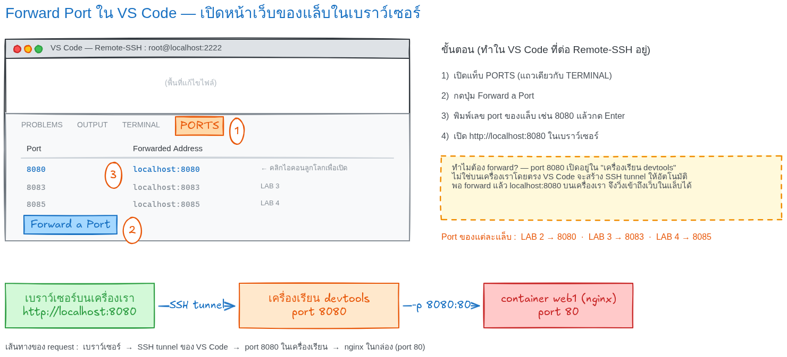

# LAB 2 — Nginx + Port Mapping

> โฟลเดอร์ `002_LAB_Nginx_Port_Mapping` = **LAB 2** ในสไลด์ `Docker_Week08_Slides.html`
> (LAB 1 เป็นคำสั่ง `docker run` พื้นฐาน อยู่ในโฟลเดอร์ `001_LAB_Docker_Run` — เอกสารล้วน ไม่มีไฟล์โค้ด)

## สิ่งที่จะได้เรียนรู้

- เปิดเว็บเซิร์ฟเวอร์ Nginx ด้วยคำสั่งเดียว โดยไม่ต้องติดตั้งอะไรเลย
- `-p HOST_PORT:CONTAINER_PORT` ทำงานอย่างไร
- **กฎเหล็ก** : host port ห้ามซ้ำ · container port ซ้ำได้

---

## 0. เตรียมเครื่องเรียน

ทำบนเครื่องของเราเอง (ไม่ใช้ cloud) — เปิด container ที่ติดตั้ง Docker มาให้แล้ว

```bash
docker rm -f devtools
docker run -dit --name devtools --privileged -p 2222:22 tuchsanai/devtools:2569_1
ssh root@localhost -p 2222        # password : passwd
```

> ใน VS Code ใช้ **Remote-SSH** ต่อไปที่ `root@localhost:2222` แล้วทำแล็บทั้งหมดข้างใน

ตรวจว่าพร้อมใช้งาน :

```bash
docker --version
docker compose version
```

```
Docker version 29.6.2, build dfc4efb
Docker Compose version v5.3.1
```

---

## 1. Clone โค้ดแล็บ

```bash
mkdir -p ~/labwork
cd ~/labwork
git clone https://github.com/Tuchsanai/DevTools.git
cd DevTools/03_Docker/01_Docker/002_LAB_Nginx_Port_Mapping
```

---

## 2. รัน Nginx พร้อม Port Mapping

```bash
docker run -p 8080:80 nginx
```

ครั้งแรกจะไม่มี image ในเครื่อง Docker จึง **pull ให้อัตโนมัติ** แล้วค่อยรัน :

```
Unable to find image 'nginx:latest' locally
latest: Pulling from library/nginx
5a4222b844e8: Pulling fs layer
        ... (รวม 7 layer) ...
Digest: sha256:8541484afbc9c8a5a8a99b379568ebbc957f658583ec9448fc43104229c03cf8
Status: Downloaded newer image for nginx:latest
/docker-entrypoint.sh: Configuration complete; ready for start up
2026/08/10 16:15:37 [notice] 1#1: nginx/1.31.3
2026/08/10 16:15:37 [notice] 1#1: start worker processes
2026/08/10 16:15:37 [notice] 1#1: start worker process 29
        ... (worker process 30–60 ตามจำนวน CPU) ...
        ^ ค้างอยู่ตรงนี้ — container ยังทำงาน กด Ctrl+C เพื่อหยุด
^C2026/08/10 16:15:44 [notice] 1#1: signal 2 (SIGINT) received, exiting
        ... (worker ทุกตัว exiting → exit) ...
2026/08/10 16:15:44 [notice] 1#1: exit
```

รันแบบนี้เป็น **foreground** — terminal จะค้าง และเมื่อกด `Ctrl+C` nginx จะรับ **SIGINT** ปิด worker ทุกตัวอย่างเรียบร้อยก่อนจบ

container ที่หยุดแล้วยังค้างอยู่ในเครื่อง — เก็บกวาดก่อนรันรอบใหม่ :

```bash
docker rm -f $(docker ps -aq) 2>/dev/null
```

```
076779a1b4d7
```

ถ้าอยากได้ prompt คืนตั้งแต่แรก ให้เติม `-d` (detached) :

```bash
docker run -d -p 8080:80 --name web1 nginx
```

```
f51b32b42d5095604e974b35877933b889ecfee7e9b27f129ab400648722c584
```

```bash
docker ps
```

```
CONTAINER ID   IMAGE     COMMAND                  CREATED         STATUS         PORTS                                     NAMES
f51b32b42d50   nginx     "/docker-entrypoint.…"   5 seconds ago   Up 4 seconds   0.0.0.0:8080->80/tcp, [::]:8080->80/tcp   web1
```

---

## 3. ทดสอบ

```bash
curl -I http://localhost:8080
```

```
HTTP/1.1 200 OK
Server: nginx/1.31.3
Date: Mon, 10 Aug 2026 16:16:06 GMT
Content-Type: text/html
Content-Length: 896
```

```bash
curl http://localhost:8080
```

```html
<title>Welcome to nginx!</title>
<h1>Welcome to nginx!</h1>
<p>If you see this page, nginx is successfully installed and working. ...
```

ดู access log ที่เกิดจาก `curl` เมื่อกี้ :

```bash
docker logs web1
```

```
172.18.0.1 - - [10/Aug/2026:16:16:06 +0000] "HEAD / HTTP/1.1" 200 0 "-" "curl/8.5.0" "-"
172.18.0.1 - - [10/Aug/2026:16:16:10 +0000] "GET / HTTP/1.1" 200 896 "-" "curl/8.5.0" "-"
```

### เปิดดูในเบราว์เซอร์ — Forward Port ใน VS Code

port `8080` เปิดอยู่ **ข้างในเครื่องเรียน** ไม่ใช่บนเครื่องเราโดยตรง — ต้องให้ VS Code
forward port ออกมาก่อน (VS Code จะสร้าง **SSH tunnel** ให้อัตโนมัติ) :

1. เปิดแท็บ **PORTS** (แถวเดียวกับ TERMINAL)
2. กดปุ่ม **Forward a Port**
3. พิมพ์ `8080` แล้วกด **Enter**
4. เปิด `http://localhost:8080` ในเบราว์เซอร์ (หรือคลิกไอคอนลูกโลกในแถวของ port)



ผลที่ได้ในเบราว์เซอร์ :


#### ทางเลือก : forward ด้วยคำสั่ง `ssh -L` (ไม่ใช้ VS Code)

เปิด terminal ใหม่บนเครื่องเรา แล้ว **ssh เข้าไปยัง port ภายในเครื่องเรียน** โดยตรง :

```bash
ssh -L 8080:localhost:8080 root@localhost -p 2222        # password : passwd
```

| ส่วนของคำสั่ง | ความหมาย |
|---|---|
| `-L 8080:localhost:8080` | ผูก port `8080` บนเครื่องเรา เข้ากับ port `8080` **ภายในเครื่องเรียน** (SSH tunnel) |
| `root@localhost -p 2222` | ssh เข้าเครื่องเรียน `devtools` ตามปกติ |

ตราบใดที่ ssh session นี้ยังเปิดอยู่ เปิด `http://localhost:8080` ในเบราว์เซอร์ได้ทันที

#### ทดลองเสร็จแล้ว — ลบ tunnel ทุกครั้ง

- แบบ `ssh -L` : พิมพ์ `exit` (หรือกด `Ctrl+D`) ใน session นั้น — tunnel ปิดทันที
- แบบ VS Code : แท็บ **PORTS** → คลิกขวาที่ port → **Stop Forwarding Port**

---

## 4. กฎเหล็กของ Port Mapping

รัน 3 container จาก image เดียวกัน โดยใช้ **host port ต่างกัน** :

```bash
docker run -d -p 8000:80 --name web2 nginx
docker run -d -p 8001:80 --name web3 nginx
docker ps
```

```
CONTAINER ID   IMAGE     COMMAND                  CREATED         STATUS         PORTS                                     NAMES
ffaff645adcc   nginx     "/docker-entrypoint.…"   3 seconds ago   Up 3 seconds   0.0.0.0:8001->80/tcp, [::]:8001->80/tcp   web3
61d58a7e5fff   nginx     "/docker-entrypoint.…"   6 seconds ago   Up 6 seconds   0.0.0.0:8000->80/tcp, [::]:8000->80/tcp   web2
f51b32b42d50   nginx     "/docker-entrypoint.…"   2 minutes ago   Up 2 minutes   0.0.0.0:8080->80/tcp, [::]:8080->80/tcp   web1
```

ทั้ง 3 ตัวใช้ **container port 80 เหมือนกันหมด** แต่ไม่ชนกัน เพราะแต่ละ container มี **network stack และ IP ของตัวเอง** — port 80 ของกล่องหนึ่ง ไม่ใช่ port 80 ของอีกกล่อง :

```bash
docker exec web1 hostname -i     # 172.18.0.2
docker exec web2 hostname -i     # 172.18.0.3
docker exec web3 hostname -i     # 172.18.0.4
```

> IP `172.18.0.x` นี้ **เข้าถึงได้เฉพาะจาก Docker Host** เท่านั้น — เครื่องอื่นมองไม่เห็น
> จึงต้องทำ port mapping เพื่อให้โลกภายนอกเข้าถึงได้

ทดสอบว่าทั้ง 3 host port ตอบจริง :

```bash
curl -I http://localhost:8080    # HTTP/1.1 200 OK
curl -I http://localhost:8000    # HTTP/1.1 200 OK
curl -I http://localhost:8001    # HTTP/1.1 200 OK
```

### ถ้าใช้ host port ซ้ำ

```bash
docker run -d -p 8000:80 --name web4 nginx
```

```
cc1497160aa8e67b8e45ae80dcd76102f74ea2b97210bc6d2f5883c2311c1c23
docker: Error response from daemon: failed to set up container networking: driver failed programming external connectivity on endpoint web4 (3034aed54de2...): Bind for 0.0.0.0:8000 failed: port is already allocated

Run 'docker run --help' for more information
```

```bash
echo $?
```

```
125
```

exit code = **125** และ `web4` ไม่หายไปเอง — container ถูกสร้างค้างไว้ในสถานะ `Created` (รันไม่สำเร็จเพราะ host port 8000 ถูก `web2` ใช้อยู่) :

```bash
docker ps -a
```

```
CONTAINER ID   IMAGE     COMMAND                  CREATED          STATUS          PORTS                                     NAMES
cc1497160aa8   nginx     "/docker-entrypoint.…"   4 seconds ago    Created                                                   web4
ffaff645adcc   nginx     "/docker-entrypoint.…"   19 seconds ago   Up 19 seconds   0.0.0.0:8001->80/tcp, [::]:8001->80/tcp   web3
61d58a7e5fff   nginx     "/docker-entrypoint.…"   22 seconds ago   Up 22 seconds   0.0.0.0:8000->80/tcp, [::]:8000->80/tcp   web2
f51b32b42d50   nginx     "/docker-entrypoint.…"   2 minutes ago    Up 2 minutes    0.0.0.0:8080->80/tcp, [::]:8080->80/tcp   web1
```

ต้องลบทิ้งเอง :

```bash
docker rm web4
```

```
web4
```

---

## 5. เก็บกวาด

```bash
docker rm -f web1 web2 web3
```

```
web1
web2
web3
```

```bash
docker ps -a
```

```
CONTAINER ID   IMAGE     COMMAND   CREATED   STATUS    PORTS     NAMES
```

---

## สรุปคำสั่งของแล็บนี้

| คำสั่ง | ความหมาย |
|---|---|
| `docker run -p 8080:80 nginx` | เปิด port 8080 ของเครื่องเรา ส่งต่อไป port 80 ในกล่อง |
| `docker run -d ...` | รันเบื้องหลัง ไม่ค้าง terminal |
| `docker ps` / `docker ps -a` | ดู container ที่ทำงานอยู่ / ทั้งหมด |
| `docker logs <name>` | ดู log ของ container |
| `docker rm -f <name>` | ลบ container ทิ้ง |

> เลข **ซ้าย = ของเรา** (พิมพ์ในเบราว์เซอร์) · เลข **ขวา = ของกล่อง** (แอปข้างในฟังอยู่)

*ผลลัพธ์ทั้งหมดในเอกสารนี้มาจากการรันจริงในเครื่องเรียน `tuchsanai/devtools:2569_1` เมื่อ 10 ส.ค. 2026*
