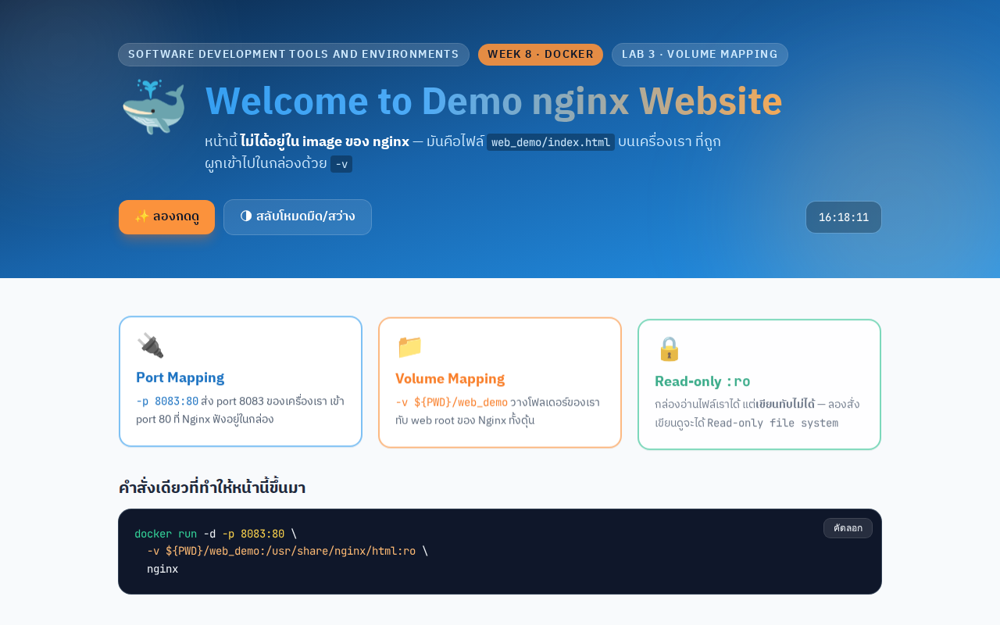
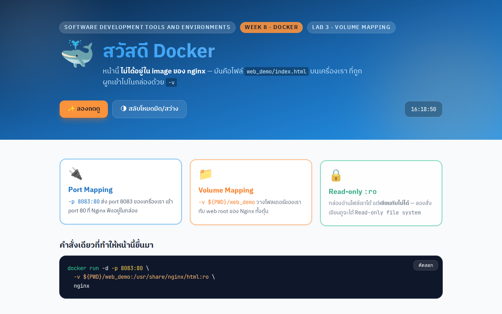

# LAB 3 — Nginx + Volume Mapping + Port Mapping

> โฟลเดอร์ `003_LAB_Nginx_Volume_Port_Mapping` = **LAB 3** ในสไลด์ `Docker_Week08_Slides.html`

## สิ่งที่จะได้เรียนรู้

- เห็นปัญหาจริงก่อน : **ลบ container = ข้อมูลข้างในหายทั้งหมด**
- `-v HOST_PATH:CONTAINER_PATH` เอาโฟลเดอร์บนเครื่องเราไปวางในกล่อง
- แก้ไฟล์บนเครื่อง → เว็บในกล่องเปลี่ยนทันที **โดยไม่ต้อง restart**
- `:ro` (read-only) ป้องกัน container เขียนทับไฟล์ของเรา
- ลบ container แล้ว **ข้อมูลไม่หาย** เพราะไฟล์อยู่บนดิสก์ของเราตลอด

## ภาพรวมของแล็บนี้

1. **สร้างปัญหาให้เห็นกับตา** — เขียนไฟล์ลงในกล่องธรรมดา แล้วลบกล่องทิ้ง สร้างใหม่จาก image เดิม
   ไฟล์หายไป → พิสูจน์ว่าข้อมูลที่เขียนลงใน container ไม่ถาวร
2. **เตรียมของจริงบนดิสก์** — clone รีโพแล้วเข้าโฟลเดอร์แล็บ ให้มี `web_demo/index.html`
   วางอยู่บนดิสก์ของเครื่องเรียน (ไม่ได้อยู่ในกล่อง)
3. **รัน Nginx พร้อม volume + port mapping** — เอาโฟลเดอร์ `web_demo` ไปวางแทน web root ของ Nginx
   แล้วเปิด port 8083 → พิสูจน์ว่า path ในกล่องถูกแทนที่ด้วยโฟลเดอร์ของเราจริง
4. **แก้ไฟล์บนเครื่อง แล้ว `curl` ซ้ำ** — หน้าเว็บเปลี่ยนทันทีทั้งที่ไม่ได้ restart หรือ build อะไรเลย
   → พิสูจน์ว่า volume ไม่ใช่การ "คัดลอกไฟล์เข้าไป" แต่เป็นการมองเข้าไปที่ไฟล์เดียวกัน
5. **ให้ container ลองเขียนทับไฟล์** — โดนปฏิเสธด้วย `Read-only file system`
   → พิสูจน์ว่า `:ro` ปกป้องไฟล์ต้นฉบับของเราได้จริง
6. **ลบ container ทิ้ง แล้วดูไฟล์บนเครื่อง** — ไฟล์และข้อความที่แก้ยังอยู่ครบ
   → พิสูจน์ข้อสรุปหลักของแล็บ : ข้อมูลอยู่บนดิสก์ของ host ไม่ได้อยู่ในกล่อง

---

## 0. เตรียมเครื่องเรียน

```bash
docker rm -f devtools
docker run -dit --name devtools --privileged -p 2222:22 tuchsanai/devtools:2569_1
ssh root@localhost -p 2222        # password : passwd
```

> 📝 **คำอธิบาย:** สามคำสั่งนี้เตรียม "เครื่องเรียน" ที่มี Docker ติดตั้งมาให้แล้ว เพื่อให้ทุกคนทำแล็บบนสภาพแวดล้อมเดียวกัน ·
> `docker rm -f devtools` ลบเครื่องเรียนตัวเก่าทิ้งก่อน (`-f` = force คือหยุดแล้วลบในคำสั่งเดียว ถ้ายังไม่เคยสร้างจะขึ้น error ว่าไม่พบ ปล่อยผ่านได้) ·
> `-dit` = `-d` รันเบื้องหลัง + `-i` เปิด stdin ค้างไว้ + `-t` ให้มี terminal รวมกันแล้วกล่องจะไม่ดับทันที ·
> `--privileged` ให้สิทธิ์เต็มเพื่อให้รัน Docker ซ้อนข้างในกล่องได้ (Docker-in-Docker) ซึ่งจำเป็นกับแล็บนี้ ·
> `-p 2222:22` ส่ง port 2222 ของเครื่องเรา เข้า port 22 (SSH) ของกล่อง สิ่งที่ต้องดูคือคำสั่งที่ 2 ต้องคืน container ID ยาว ๆ กลับมา
> ถ้าขึ้น `port is already allocated` แปลว่ามีของเก่าค้างอยู่ ให้ลบทิ้งก่อน

> ใน VS Code ใช้ **Remote-SSH** ต่อไปที่ `root@localhost:2222` แล้วทำแล็บทั้งหมดข้างใน

ตรวจว่า Docker ในเครื่องเรียนพร้อมใช้ :

```bash
docker --version
docker compose version
```

> 📝 **คำอธิบาย:** เช็กว่าในเครื่องเรียนมี Docker engine และ Docker Compose ให้ใช้จริง ทำก่อนเริ่มแล็บเพื่อไม่ให้ไปเจอปัญหาตอนกลางทาง ·
> สังเกตว่าเป็น `docker compose` (เว้นวรรค) ไม่ใช่ `docker-compose` (ขีดกลาง) แบบขีดกลางคือรุ่นเก่าที่เลิกใช้แล้ว
> ถ้าคำสั่งใดขึ้น `command not found` แปลว่ายังไม่ได้อยู่ในเครื่องเรียน ให้ย้อนกลับไป `ssh` เข้าไปใหม่

✅ **Expected output** — ขอแค่ขึ้น "เลขเวอร์ชัน" ทั้งสองบรรทัดก็ถือว่าพร้อม (เลขเวอร์ชันของแต่ละคนอาจไม่ตรงกับเอกสารนี้):

```
Docker version 29.6.2, build dfc4efb
Docker Compose version v5.3.1
```

---

## 1. ปัญหา : ลบ container = ข้อมูลหาย

ก่อนจะรู้จัก volume มาดูปัญหากันก่อน — เขียนไฟล์ลงใน container แล้วลบ container ทิ้ง
ดูว่าเกิดอะไรขึ้น

### 1.1 สร้างกล่อง แล้วเขียนไฟล์ลงไปข้างใน

```bash
docker run -d --name box1 nginx
```

> 📝 **คำอธิบาย:** สร้าง container ชื่อ `box1` จาก image `nginx` ไว้เป็น "หนูทดลอง" สำหรับพิสูจน์ปัญหาข้อมูลหาย ·
> `-d` (detached) รันเบื้องหลังแล้วคืน prompt ทันที · `--name box1` ตั้งชื่อไว้เรียกง่าย จะได้ไม่ต้องจำ container ID ·
> ถ้าเครื่องยังไม่มี image `nginx` Docker จะ pull ให้อัตโนมัติก่อน แล้วค่อยสร้างกล่อง
> สิ่งที่ต้องดูคือบรรทัดสุดท้ายต้องเป็น container ID ไม่ใช่ error

✅ **Expected output** — ดูบรรทัดสุดท้าย ต้องเป็น container ID 64 ตัวอักษร (digest กับ container ID ของแต่ละคนจะไม่ตรงกับเอกสารนี้ และถ้าเคยมี image อยู่แล้วจะไม่เห็นบรรทัด pull):

```
Unable to find image 'nginx:latest' locally
latest: Pulling from library/nginx
26c307b5e35a: Pull complete
        ... (รวม 7 layer) ...
Digest: sha256:8541484afbc9c8a5a8a99b379568ebbc957f658583ec9448fc43104229c03cf8
Status: Downloaded newer image for nginx:latest
17ed126bec8fd0ad3128d1e4d10d4138bebab01bceec68eb07135c36b73699fc
```

(ครั้งแรก Docker จะ pull image `nginx` ให้อัตโนมัติ — รันครั้งต่อไปจะไม่เห็นบรรทัด pull อีก)

แต่ละบรรทัด `Pull complete` คือ **1 layer** ของ image ที่ถูกดาวน์โหลดมาเก็บไว้บนเครื่อง
รอบต่อไปที่ใช้ `nginx` layer เหล่านี้ถูกใช้ซ้ำจาก cache จึงไม่มีบรรทัด pull ให้เห็นอีก

```bash
docker exec box1 sh -c "echo ข้อมูลสำคัญของเรา > /note.txt"
docker exec box1 cat /note.txt
```

> 📝 **คำอธิบาย:** `docker exec <ชื่อกล่อง> <คำสั่ง>` คือการสั่งให้คำสั่งไปทำงาน **ข้างใน** กล่องที่รันอยู่ ·
> คำสั่งแรกเขียนไฟล์ `/note.txt` ลงในกล่อง คำสั่งที่สองอ่านกลับออกมาเพื่อยืนยันว่าเขียนสำเร็จ ·
> ต้องห่อด้วย `sh -c "..."` เพราะเครื่องหมาย `>` (redirect) เป็นงานของ shell ถ้าไม่ห่อ shell ของเครื่องเราจะกิน `>` ไปเอง แล้วเขียนไฟล์ลงบนเครื่องเรา ไม่ได้เขียนลงในกล่อง
> ตอนนี้ทุกอย่างยังปกติ — จุดสำคัญคือจำไว้ว่าไฟล์นี้ถูกเขียนลงใน **ชั้นของกล่อง** ไม่ใช่ดิสก์ของเรา

✅ **Expected output** — ต้องเห็นข้อความที่เพิ่งเขียนกลับออกมาครบ ไม่มี error (ยืนยันว่าตอนนี้ไฟล์ยังอยู่):

```
ข้อมูลสำคัญของเรา
```

ไฟล์อยู่ครบ — เขียนได้ อ่านได้ ปกติทุกอย่าง

### 1.2 ลบกล่องทิ้ง แล้วสร้างกล่องใหม่จาก image เดิม

```bash
docker rm -f box1
docker run -d --name box2 nginx
docker exec box2 cat /note.txt
```

> 📝 **คำอธิบาย:** นี่คือหัวใจของการทดลอง — ลบกล่องเดิมทิ้ง แล้วสร้างกล่องใหม่จาก **image เดียวกัน** เพื่อดูว่าไฟล์ตามมาด้วยไหม ·
> `docker rm -f box1` หยุดและลบกล่องพร้อมชั้นข้อมูลของมันทิ้ง (`-f` = force ไม่ต้อง `docker stop` ก่อน) ·
> `box2` เกิดจาก image ตัวเดิมเป๊ะ ๆ แต่ image เก็บเฉพาะสิ่งที่ถูก build ไว้ ไม่ได้เก็บสิ่งที่ `box1` เขียนเพิ่มตอนรัน
> สิ่งที่ต้องดูคือคำสั่งสุดท้ายจะ **หาไฟล์ไม่เจอ**

✅ **Expected output** — ดูที่คำว่า `No such file or directory` นี่คือผลที่ "ถูกต้อง" ของขั้นตอนนี้ ไม่ใช่ความผิดพลาดของเรา:

```
cat: /note.txt: No such file or directory
```

exit code = **1** — ไฟล์หายไปพร้อมกับ `box1` แม้ `box2` จะสร้างจาก image เดียวกันก็ตาม

(ดู exit code ได้ด้วยการพิมพ์ `echo $?` ต่อท้ายทันที — ได้ `0` คือสำเร็จ ถ้าได้ค่าอื่นที่ไม่ใช่ `0` แปลว่ามีบางอย่างล้มเหลว)

| เกิดอะไรขึ้น | ทางแก้ : Volume Mapping |
|---|---|
| ทุกอย่างที่เขียนลงไป**ในกล่อง** อยู่บนชั้นชั่วคราวของกล่องนั้น — **ลบกล่อง = ลบข้อมูล** ถ้าเป็นฐานข้อมูล ก็คือข้อมูลลูกค้าหายทั้งหมด | ผูกโฟลเดอร์จริง**บนเครื่องเรา**เข้ากับ path ในกล่อง → ข้อมูลถูกเขียนลงดิสก์ของเรา ไม่ได้อยู่ในกล่อง **ลบกล่องกี่รอบก็ไม่หาย** |

เก็บกวาดก่อนไปต่อ :

```bash
docker rm -f box2
```

> 📝 **คำอธิบาย:** ลบกล่องทดลองตัวสุดท้ายทิ้ง เพื่อไม่ให้มีของค้างแย่ง port หรือแย่งชื่อในขั้นตอนถัดไป ·
> คำสั่งนี้พิมพ์กลับมาแค่ **ชื่อกล่องที่ถูกลบ** (`box2`) บรรทัดเดียว ไม่มีข้อความอื่น
> ถ้าอยากเช็กให้ชัวร์ว่าไม่มีอะไรค้าง ใช้ `docker ps` แล้วต้องไม่เห็น `box1` / `box2` อีก

---

## 2. เข้าโฟลเดอร์ของแล็บ

ถ้ายังไม่เคย clone รีโพ ให้ clone ก่อน (ทำครั้งเดียว ใช้ได้ทุกแล็บ) :

```bash
mkdir -p ~/labwork ; cd ~/labwork
git clone https://github.com/Tuchsanai/DevTools.git
cd DevTools/03_Docker/01_Docker/003_LAB_Nginx_Volume_Port_Mapping
ls -l web_demo
```

> 📝 **คำอธิบาย:** ดึงไฟล์ของวิชาลงมาไว้บนดิสก์ของเครื่องเรียน แล้วเข้าไปยืนในโฟลเดอร์ของแล็บนี้ ·
> `mkdir -p ~/labwork` สร้างโฟลเดอร์ทำงาน (`-p` = ถ้ามีอยู่แล้วก็ไม่ต้อง error) · `git clone` ดาวน์โหลดรีโพทั้งก้อน (ถ้าเคย clone แล้วให้ข้ามบรรทัดนี้) ·
> `ls -l web_demo` แสดงรายละเอียดไฟล์เพื่อยืนยันว่ามี `index.html` อยู่จริง
> **ต้องยืนอยู่ในโฟลเดอร์นี้ตอนรันข้อ 3** เพราะคำสั่งข้างหน้าใช้ `${PWD}` อ้างถึงตำแหน่งปัจจุบัน

✅ **Expected output** — ขอให้เห็นบรรทัดของ `index.html` เพียงไฟล์เดียวก็พอ (ขนาด วันเวลา และสิทธิ์ของแต่ละคนอาจต่างจากเอกสารนี้):

```
total 16
-rwxr-xr-x 1 root root 12316 Aug 10 23:12 index.html
```

`web_demo/index.html` คือหน้าเว็บของเราเอง (ใช้ **Tailwind CSS** ผ่าน CDN + มีนาฬิกา ปุ่มสลับโหมดมืด
และเอฟเฟกต์เล็ก ๆ) ที่จะเอาไปวางแทนหน้า default ของ Nginx

---

## 3. รัน Nginx พร้อม Volume + Port Mapping

```bash
docker run -d -p 8083:80 -v ${PWD}/web_demo:/usr/share/nginx/html:ro nginx
```

> 📝 **คำอธิบาย:** คำสั่งเดียวนี้รวมสองเรื่องหลักของแล็บเข้าด้วยกัน — เปิดทางเข้าเว็บ (port mapping) และยัดโฟลเดอร์ของเราเข้าไปในกล่อง (volume mapping) ·
> `-p 8083:80` เปิด port 8083 ของเครื่องเรียน ส่งต่อเข้า port 80 ที่ Nginx ฟังอยู่ในกล่อง ·
> `-v ${PWD}/web_demo:/usr/share/nginx/html` เอาโฟลเดอร์ `web_demo` ในตำแหน่งปัจจุบันไปวางแทน web root ของ Nginx (`${PWD}` คือ absolute path ของโฟลเดอร์ที่เรายืนอยู่) ·
> `:ro` ต่อท้ายทำให้ฝั่ง container **อ่านได้อย่างเดียว**
> ถ้าขึ้น error ว่า port ถูกใช้แล้ว ให้เช็ก `docker ps` แล้วลบกล่องเก่าที่จอง 8083 อยู่ก่อน

✅ **Expected output** — ได้ container ID ยาว ๆ กลับมาบรรทัดเดียว แล้วได้ prompt คืนทันที (ID ของแต่ละคนจะไม่ซ้ำกัน):

```
36a238b74a8aed07eab7036d7078186ba064f710556c37cb8a01a3667dcc714e
```

| ส่วนของคำสั่ง | ความหมาย |
|---|---|
| `-d` | รันเบื้องหลัง คืน prompt ให้ทันที |
| `-p 8083:80` | port 8083 ของเครื่องเรา → port 80 ในกล่อง |
| `-v ${PWD}/web_demo:/usr/share/nginx/html` | เอาโฟลเดอร์ `web_demo` ไปวางแทน web root ของ Nginx |
| `:ro` | กล่อง **อ่านได้อย่างเดียว เขียนไม่ได้** |

รูปแบบเต็มของ `-v` คือ `-v <HOST_PATH>:<CONTAINER_PATH>[:ro]` — `HOST_PATH` ต้องเป็น
absolute path (ใช้ `${PWD}` ช่วยได้) และของเดิมใน `CONTAINER_PATH` จะถูก **บังทับ**
ด้วยโฟลเดอร์จาก host ทั้งหมด ไม่ใช่การรวมกัน

ในขั้นตอนถัด ๆ ไป ให้แทน `<container>` ด้วย container ID ที่ได้จากคำสั่งนี้
(ใช้ตัวย่อได้ เช่น `36a238b74a8a` หรือดูจาก `docker ps`)

---

## 4. ทดสอบว่าได้หน้าเว็บของเรา ไม่ใช่หน้า default

```bash
curl -s http://localhost:8083 | grep -o "Welcome to Demo nginx Website"
```

> 📝 **คำอธิบาย:** ยิง HTTP เข้าไปที่ port 8083 บนเครื่องเรียน ซึ่งจะถูกส่งต่อเข้า Nginx ในกล่อง แล้วกรองดูว่ามีข้อความของหน้าเว็บเราอยู่จริงไหม ·
> `-s` (silent) ปิดแถบแสดงความคืบหน้าของ `curl` ให้เหลือแต่เนื้อหา · `grep -o` พิมพ์เฉพาะ "ส่วนที่ตรงกับคำค้น" แทนที่จะพิมพ์ทั้งบรรทัด HTML ยาว ๆ
> สิ่งที่ต้องดูคือมีข้อความออกมาหรือไม่ — ถ้าไม่มีอะไรออกมาเลย แปลว่า Nginx ยังเสิร์ฟหน้า default อยู่ (volume ไม่ติด)

✅ **Expected output** — ต้องเห็นข้อความนี้ออกมา 1 บรรทัด แปลว่ากล่องกำลังเสิร์ฟไฟล์ของเราแล้ว:

```
Welcome to Demo nginx Website
```

เปิดดูในเบราว์เซอร์ — ให้ VS Code forward port ของแล็บนี้ออกมาก่อน :
แท็บ **PORTS** → **Forward a Port** → พิมพ์ `8083` → เปิด `http://localhost:8083`
(ขั้นตอนเหมือนภาพด้านล่าง — แล็บนี้ใช้เลข **8083**)


ทางเลือก : forward ด้วยคำสั่ง `ssh -L` จาก terminal บนเครื่องเรา — **ssh เข้าไปยัง port ภายในเครื่องเรียน** โดยตรง :

```bash
ssh -L 8083:localhost:8083 root@localhost -p 2222        # password : passwd
```

> 📝 **คำอธิบาย:** พิมพ์บน terminal ของ **เครื่องเราเอง** (ไม่ใช่ในเครื่องเรียน) เพื่อเจาะอุโมงค์ให้เบราว์เซอร์บนเครื่องเราเข้าถึงเว็บที่รันอยู่ในเครื่องเรียนได้ ·
> `-L 8083:localhost:8083` = เปิด port 8083 บนเครื่องเรา แล้วส่งต่อไปยัง `localhost:8083` ของฝั่งที่ ssh เข้าไป · `-p 2222` คือ port ของ SSH เครื่องเรียนที่เปิดไว้ในข้อ 0
> คำสั่งนี้จะ **ค้างเป็น session ไว้** (ได้ prompt ของเครื่องเรียน) ตราบใดที่ยังไม่ปิด อุโมงค์ก็ยังใช้ได้ ระหว่างนี้ให้เปิดเบราว์เซอร์ที่ `http://localhost:8083`

> **ทดลองเสร็จแล้ว ลบ tunnel ทุกครั้ง** — แบบ `ssh -L` พิมพ์ `exit` / กด `Ctrl+D` ·
> แบบ VS Code คลิกขวาที่ port ในแท็บ **PORTS** → **Stop Forwarding Port**



*ก่อนแก้ : หัวข้อยังเป็น "Welcome to Demo nginx Website" — เป็นหน้าเว็บของเราเอง ไม่ใช่หน้า "Welcome to nginx!" ของ image*

### พิสูจน์ว่า web root ถูกแทนที่จริง

```bash
docker exec <container> ls -l /usr/share/nginx/html
```

> 📝 **คำอธิบาย:** เข้าไปส่องด้วยตาว่า path `/usr/share/nginx/html` **ข้างในกล่อง** ตอนนี้มีไฟล์อะไรอยู่บ้าง ·
> อย่าลืมแทน `<container>` ด้วย container ID ที่ได้จากข้อ 3 (พิมพ์แค่ 12 ตัวแรกก็พอ) ·
> สิ่งที่ต้องดูคือ **ต้องเหลือแค่ `index.html` ของเรา** และไฟล์ `50x.html` ที่ image ของ nginx ติดมาต้องหายไป
> เพราะการ mount คือการเอาโฟลเดอร์ host ไป "บัง" ทับของเดิมทั้งชั้น ไม่ใช่การเอาไฟล์มารวมกัน

✅ **Expected output** — ดูจำนวนไฟล์ ต้องมีแค่ `index.html` บรรทัดเดียว (ขนาดและเวลาของแต่ละคนจะต่างกัน และเวลาที่เห็นในกล่องอาจคนละ timezone กับบนเครื่อง):

```
total 16
-rwxr-xr-x 1 root root 12316 Aug 10 16:12 index.html
```

เทียบกับ nginx ที่ **ไม่ได้** ผูก volume :

```bash
docker run --rm nginx ls -l /usr/share/nginx/html
```

> 📝 **คำอธิบาย:** รัน nginx อีกกล่องแบบ "ไม่ผูก volume" เพื่อเป็นตัวเปรียบเทียบ ว่าของเดิมใน image มีอะไรบ้าง ·
> `--rm` สั่งให้ Docker ลบกล่องนี้ทิ้งอัตโนมัติทันทีที่คำสั่งจบ เหมาะกับการรันดูผลแป๊บเดียวแบบนี้ จะได้ไม่มีขยะค้างในระบบ ·
> ต่อท้ายด้วย `ls -l ...` เป็นการ **แทนที่คำสั่งเริ่มต้น** ของ image (ปกติคือสตาร์ท Nginx) ให้รัน `ls` แทนแล้วจบเลย
> สิ่งที่ต้องดูคือกล่องนี้ **มี `50x.html`** ซึ่งกล่องที่ผูก volume ไม่มี

✅ **Expected output** — สังเกตว่ามี 2 ไฟล์ รวมถึง `50x.html` ที่หายไปในกล่องที่ผูก volume:

```
total 8
-rw-r--r-- 1 root root 497 Jul 15 16:03 50x.html
-rw-r--r-- 1 root root 896 Jul 15 16:03 index.html
```

ของเดิมใน `CONTAINER_PATH` ถูก **บังทับทั้งหมด** ไม่ใช่การรวมกัน — ไม่มี `50x.html`
ของ nginx เหลืออยู่ เหลือแค่ไฟล์ของเรา

---

## 5. แก้ไฟล์บนเครื่อง → เห็นผลทันที

แก้หัวข้อในไฟล์บนเครื่องเรียน (ไม่แตะ container เลย) :

```bash
sed -i "s|Welcome to Demo nginx Website|สวัสดี Docker|" web_demo/index.html
curl -s http://localhost:8083 | grep -o "สวัสดี Docker"
```

> 📝 **คำอธิบาย:** แก้ข้อความในไฟล์ต้นฉบับบนดิสก์ แล้วยิง `curl` ซ้ำทันทีเพื่อดูว่าเว็บในกล่องเปลี่ยนตามไหม ·
> `sed -i` แก้ไฟล์ทับของเดิมในที่ (`-i` = in-place ไม่ต้องเปลี่ยนทางออกไปไฟล์ใหม่) · รูปแบบคือ `s|ข้อความเดิม|ข้อความใหม่|` (ใช้ `|` เป็นตัวคั่นแทน `/` จะได้ไม่ชนกับ path)
> จุดสำคัญคือเราไม่ได้แตะ container เลย — Nginx อ่านไฟล์จากดิสก์ของ host ทุกครั้งที่มี request จึงเห็นของใหม่ทันที

✅ **Expected output** — ต้องได้ข้อความภาษาไทยกลับมา ซึ่งแปลว่าเว็บอัปเดตแล้วทั้งที่ไม่ได้ restart อะไรเลย:

```
สวัสดี Docker
```

**ไม่ได้ restart container เลยสักครั้ง** — นี่คือประโยชน์หลักของ volume ในงาน development

ถ้าไม่มี volume เราต้อง `docker build` image ใหม่แล้วสร้างกล่องใหม่ทุกครั้งที่แก้โค้ดหนึ่งบรรทัด

รีเฟรชเบราว์เซอร์ :



*หลังแก้ : หัวข้อด้านบนเปลี่ยนเป็น "สวัสดี Docker" ทันทีที่รีเฟรช — แก้โค้ดบนเครื่อง เห็นผลในกล่องทันที ไม่ต้อง build ใหม่*

---

## 6. พิสูจน์ `:ro`

```bash
docker exec <container> sh -c "echo test >> /usr/share/nginx/html/index.html"
```

> 📝 **คำอธิบาย:** จงใจให้ container ลองเขียนต่อท้ายไฟล์ของเรา เพื่อทดสอบว่า `:ro` ที่ใส่ไว้ตอน `docker run` กันได้จริงหรือไม่ ·
> `>>` คือการเขียนต่อท้ายไฟล์เดิม (ต่างจาก `>` ที่เขียนทับทั้งไฟล์) และต้องห่อด้วย `sh -c "..."` เพราะ redirect เป็นงานของ shell ในกล่อง ·
> **คำสั่งนี้ต้องล้มเหลว** — การขึ้น error คือผลลัพธ์ที่ถูกต้อง ไม่ใช่ว่าเราทำผิด
> ระบบไฟล์ที่ mount แบบ read-only จะถูกปฏิเสธตั้งแต่ชั้น kernel เลย ไม่ว่าจะรันในกล่องด้วยสิทธิ์ root ก็ตาม

✅ **Expected output** — ให้ดูคำว่า `Read-only file system` ท้ายบรรทัด นี่คือหลักฐานว่า `:ro` ทำงาน:

```
sh: 1: cannot create /usr/share/nginx/html/index.html: Read-only file system
```

exit code = **2** — container เขียนทับไฟล์ต้นฉบับของเราไม่ได้จริง
ถ้าแอปในกล่องถูกเจาะ หรือเขียนไฟล์มั่ว ก็แก้ไฟล์ต้นฉบับบนเครื่องเราไม่ได้

สังเกตว่าเรายังแก้ไฟล์จากฝั่ง **host** ได้ตามปกติ (เหมือนที่ทำในข้อ 5) — `:ro` จำกัดเฉพาะฝั่ง container เท่านั้น

---

## 7. พิสูจน์ว่าข้อมูลอยู่รอด

```bash
docker rm -f <container>
ls -l web_demo/index.html
grep -o "สวัสดี Docker" web_demo/index.html
```

> 📝 **คำอธิบาย:** ทำซ้ำการทดลองของข้อ 1 อีกครั้ง แต่คราวนี้ข้อมูลอยู่บน volume — ลบกล่องทิ้งแล้วกลับมาดูไฟล์บนดิสก์ของเครื่องเรียน ·
> `docker rm -f <container>` หยุดและลบกล่องที่เสิร์ฟเว็บอยู่ · `ls -l` เช็กว่าไฟล์ยังอยู่ · `grep -o` เช็กว่า **เนื้อหาที่เราแก้ในข้อ 5** ยังอยู่ครบไม่ได้ถูกย้อนกลับ
> สิ่งที่ต้องดูคือทั้งสองคำสั่งหลังต้องยังมีผลลัพธ์ออกมา ต่างจาก `box2` ในข้อ 1 ที่หาไฟล์ไม่เจอ
> หลังจากนี้เว็บที่ port 8083 จะเข้าไม่ได้แล้ว (กล่องถูกลบ) แต่ไฟล์ยังอยู่

✅ **Expected output** — สามบรรทัด : container ID ที่ถูกลบ · ไฟล์ที่ยังอยู่ · ข้อความที่แก้ไว้ยังอยู่ (container ID ขนาดไฟล์ และเวลาของแต่ละคนจะไม่ตรงกับเอกสารนี้):

```
36a238b74a8a
-rwxr-xr-x 1 root root 12312 Aug 10 23:18 web_demo/index.html
สวัสดี Docker
```

ลบกล่องกี่รอบ ไฟล์ก็ยังอยู่ครบ (ข้อความที่แก้เป็น "สวัสดี Docker" ก็ยังอยู่)
เพราะไฟล์อยู่บน **ดิสก์ของเครื่องเรา** ตลอด กล่องแค่ "มอง" เข้าไป —
ต่างจาก `box1` ในข้อ 1 ที่เขียนไฟล์ลงในกล่องแล้วหายไปพร้อมกล่อง

---

## สรุป

| ใช้ทำอะไร | ตัวอย่าง |
|---|---|
| เก็บข้อมูลถาวร | ฐานข้อมูล — ลบ container แล้วข้อมูลไม่หาย |
| ใส่ไฟล์เข้าไปในกล่อง | โค้ด / หน้าเว็บ ตอนพัฒนา — แก้แล้วเห็นผลทันที |

## ✅ เช็กลิสต์ก่อนจบแล็บ

- [ ] `docker --version` และ `docker compose version` ขึ้นเลขเวอร์ชันทั้งคู่
- [ ] `docker exec box1 cat /note.txt` เคยอ่านไฟล์ได้ (เห็นข้อความ `ข้อมูลสำคัญของเรา`)
- [ ] `docker exec box2 cat /note.txt` ขึ้น `No such file or directory` — เห็นปัญหาข้อมูลหายกับตา
- [ ] ลบ `box1` และ `box2` ทิ้งแล้ว (`docker ps` ไม่เหลือทั้งสองตัว)
- [ ] `ls -l web_demo` เห็น `index.html` อยู่บนดิสก์ของเครื่องเรียนก่อนรัน container
- [ ] `docker run -d -p 8083:80 -v ...:ro nginx` คืน container ID ยาว ๆ กลับมา ไม่มี error เรื่อง port
- [ ] `curl` ได้ข้อความ `Welcome to Demo nginx Website` (ไม่ใช่หน้า `Welcome to nginx!` ของ image)
- [ ] `docker exec <container> ls -l /usr/share/nginx/html` เหลือแค่ `index.html` — ไม่มี `50x.html`
- [ ] `docker run --rm nginx ls -l /usr/share/nginx/html` มี 2 ไฟล์ ใช้เทียบให้เห็นความต่าง
- [ ] เปิดเว็บผ่าน forwarded port `8083` ในเบราว์เซอร์ได้ และ **ปิด tunnel เรียบร้อยแล้ว**
- [ ] หลัง `sed` แล้ว `curl` ได้ `สวัสดี Docker` โดยไม่ได้ restart container เลยสักครั้ง
- [ ] `docker exec ... "echo test >> ..."` ขึ้น `Read-only file system` (exit code = 2)
- [ ] หลัง `docker rm -f <container>` แล้ว `grep -o "สวัสดี Docker" web_demo/index.html` ยังเจอข้อความ

*ผลลัพธ์ทั้งหมดในเอกสารนี้มาจากการรันจริงในเครื่องเรียน `tuchsanai/devtools:2569_1` เมื่อ 10 ส.ค. 2026*
