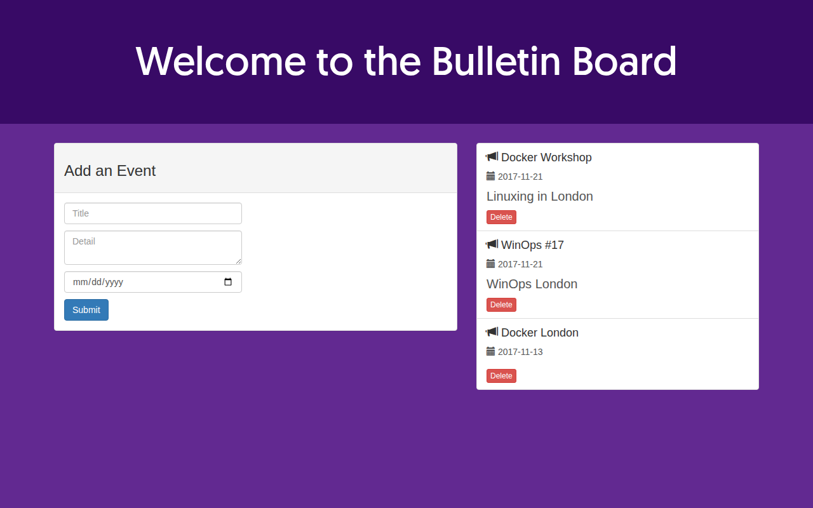

# LAB 4 — Build Docker Image เอง (Node.js Bulletin Board)

> โฟลเดอร์ `004_LAB_Node_Bulletin_Board` = **LAB 4** ในสไลด์ `Docker_Week08_Slides.html`

## สิ่งที่จะได้เรียนรู้

- อ่าน `Dockerfile` ทีละบรรทัด
- `docker build` สร้าง image ของตัวเองจากซอร์สโค้ด
- **Layer cache** — ทำไมต้อง `COPY package.json` ก่อน `COPY . .`

## ภาพรวมของแล็บนี้

1. **เตรียมเครื่องเรียนแล้วเช็ก Docker** — เข้าไปทำงานในเครื่องเรียน `devtools` และยืนยันว่า `docker` ใช้งานได้ พิสูจน์ว่าเราพร้อม build จริง
2. **เข้าโฟลเดอร์แอปแล้วอ่าน `Dockerfile`** — เห็นว่าไฟล์สูตร 7 บรรทัดนี้บอก Docker ว่าต้องประกอบ image อย่างไร
3. **`docker build` รอบแรก** — ดูขั้นตอน `[1/5]` … `[5/5]` วิ่งทีละ layer และจับเวลารวมไว้ พิสูจน์ว่า image เกิดจากคำสั่งใน Dockerfile ตรง ๆ
4. **`docker run` image ของเราเอง** — ได้ container ชื่อ `bb` ที่ map port 8085 → 8080 พิสูจน์ว่า image ที่เรา build รันได้จริง ไม่ต้องพึ่ง image สำเร็จรูปของแอปจาก Docker Hub (ส่วน base image `node:current-slim` ยังต้องดึงจาก Docker Hub ตอน build)
5. **ทดสอบแอปด้วย `curl` และส่องข้างในกล่องด้วย `docker exec`** — เห็นว่า `node_modules` เกิดขึ้นในกล่อง ไม่ได้ก๊อปมาจากเครื่องเรา
6. **แก้ `index.html` แล้ว build รอบสอง** — เห็นคำว่า `CACHED` และเวลาที่ลดลงเหลือไม่ถึง 2 วินาที พิสูจน์เรื่อง layer cache ด้วยตาตัวเอง

---

## 0. เตรียมเครื่องเรียน

```bash
docker rm -f devtools
docker run -dit --name devtools --privileged -p 2222:22 tuchsanai/devtools:2569_1
ssh root@localhost -p 2222        # password : passwd
```

> 📝 **คำอธิบาย:** สามบรรทัดนี้คือการ "สร้างห้องแล็บ" ขึ้นมาใหม่ให้สะอาดก่อนเริ่มงาน · `docker rm -f devtools`
> ลบเครื่องเรียนตัวเก่าทิ้ง (`-f` = force ลบทั้งที่ยังรันอยู่) ถ้ายังไม่เคยสร้างจะขึ้นข้อความว่าหาไม่เจอ ซึ่งไม่เป็นไร ·
> `-dit` = `-d` รันเบื้องหลัง + `-i` เปิด stdin ค้างไว้ + `-t` ให้มี terminal กล่องจึงไม่ดับทันที ·
> `--privileged` ให้สิทธิ์เต็มเพื่อให้ **รัน Docker ซ้อนข้างในกล่อง** ได้ (Docker-in-Docker) ซึ่งแล็บนี้จำเป็นต้องใช้ตอน `docker build` ·
> `-p 2222:22` ส่ง port 2222 ของเครื่องเรา เข้า port 22 (SSH) ของกล่อง เราจึง `ssh` เข้าไปได้ สิ่งที่ต้องดูคือหลัง `ssh` แล้ว
> prompt ต้องเปลี่ยนเป็นของเครื่องเรียน ไม่ใช่เครื่องเรา

> ใน VS Code ใช้ **Remote-SSH** ต่อไปที่ `root@localhost:2222` แล้วทำแล็บทั้งหมดข้างใน

เช็กว่า Docker ในเครื่องเรียนพร้อมใช้งาน :

```bash
docker --version
```

> 📝 **คำอธิบาย:** ถามเวอร์ชันของ Docker client ที่อยู่ **ในเครื่องเรียน** เรารันก่อนทุกครั้งเพราะทั้งแล็บนี้ยืนอยู่บนคำสั่ง
> `docker build` ถ้าคำสั่งนี้ไม่ผ่าน คำสั่งอื่นก็ไม่ต้องลอง สิ่งที่ต้องดูคือมีเลขเวอร์ชันขึ้นมา ไม่ใช่ `command not found`

✅ **Expected output** — ขอแค่มีคำว่า `Docker version` ตามด้วยตัวเลข ก็ถือว่าพร้อม (เลขเวอร์ชันและ build id อาจไม่ตรงกับเอกสารนี้):

```
Docker version 29.6.2, build dfc4efb
```

---

## 1. เข้าโฟลเดอร์แอป

ถ้ายังไม่เคย clone รีโพ ให้ clone ก่อน (ทำครั้งเดียว ใช้ได้ทุกแล็บ) :

```bash
mkdir -p ~/labwork ; cd ~/labwork
git clone https://github.com/Tuchsanai/DevTools.git
```

> 📝 **คำอธิบาย:** ดึงซอร์สโค้ดของทุกแล็บลงมาไว้ในเครื่องเรียน · `mkdir -p` สร้างโฟลเดอร์ให้ถ้ายังไม่มี และ**ไม่ error**
> ถ้ามีอยู่แล้ว · เครื่องหมาย `;` คือรันคำสั่งแรกจบแล้วรันคำสั่งถัดไปต่อ ทำครั้งเดียวพอ ถ้าเคย clone ไว้แล้วจะขึ้นว่า
> โฟลเดอร์ปลายทางมีอยู่แล้ว ให้ข้ามไปขั้นถัดไปได้เลย

```bash
cd ~/labwork
cd DevTools/03_Docker/01_Docker/004_LAB_Node_Bulletin_Board/bulletin-board-app
ls
```

> 📝 **คำอธิบาย:** ย้ายตัวเองเข้าไปยืนในโฟลเดอร์ที่มีซอร์สโค้ดของแอป แล้วดูรายชื่อไฟล์ · เราต้องยืนตรงนี้เท่านั้น
> เพราะขั้นต่อไปจะสั่ง `docker build ... .` ซึ่งจุด `.` หมายถึง "ใช้โฟลเดอร์ปัจจุบันเป็น build context" ถ้ายืนผิดที่
> Docker จะหา `Dockerfile` ไม่เจอ สิ่งที่ต้องดูคือในผลลัพธ์ต้องมีคำว่า `Dockerfile` อยู่ด้วย

✅ **Expected output** — ดูให้แน่ใจว่ามีคำว่า `Dockerfile` และ `package.json` อยู่ในรายชื่อ (ถ้าไม่มี แปลว่ายืนผิดโฟลเดอร์):

```
Dockerfile  LICENSE  app.js  backend  fonts  index.html  package.json  server.js  site.css
```

---

## 2. อ่าน Dockerfile

```dockerfile
FROM node:current-slim          # 1. เลือก base image (Node.js รุ่นเล็ก)

WORKDIR /usr/src/app            # 2. กำหนด working directory ในกล่อง
COPY package.json .             # 3. คัดลอกเฉพาะ package.json เข้ามาก่อน
RUN npm install                 # 4. ติดตั้ง dependencies

EXPOSE 8080                     # 5. ประกาศว่า container ฟังที่ port 8080
CMD [ "npm", "start" ]          # 6. คำสั่งที่รันเมื่อ container เริ่มทำงาน

COPY . .                        # 7. คัดลอกซอร์สโค้ดที่เหลือทั้งหมด
```

> 📝 **คำอธิบาย:** `Dockerfile` คือ "สูตรอาหาร" ที่บอก Docker ว่าจะประกอบ image ของเราขึ้นมาอย่างไรทีละขั้น ·
> `FROM` เลือกฐานตั้งต้น (`current-slim` = รุ่นที่ตัดของไม่จำเป็นออก image จึงเล็ก) · `WORKDIR` เหมือน `cd` ค้างไว้
> ให้คำสั่งถัด ๆ ไปทำงานในโฟลเดอร์นี้ · `COPY <ต้นทางบนเครื่องเรา> <ปลายทางในกล่อง>` โดยจุด `.` ตัวหลังคือ `WORKDIR` ·
> `RUN` สั่งรันคำสั่ง **ตอน build** แล้วเก็บผลไว้ในกล่อง สิ่งที่ต้องสังเกตคือลำดับ : `COPY package.json` แยกมาก่อน
> `COPY . .` โดยตั้งใจ เดี๋ยวข้อ 6 จะพิสูจน์ให้ดูว่าทำไม

> **EXPOSE ไม่ได้เปิด port ให้จริง** — เป็นเพียงการประกาศเจตนา การเปิดจริงต้องใช้ `-p` ตอน `docker run`

> **ข้อสังเกต :** ไฟล์นี้วาง `COPY . .` ไว้หลัง `CMD` ซึ่งยังทำงานได้ปกติ (เพราะ `CMD` เป็นแค่การประกาศ ไม่ใช่การรันตอน build) แต่ตามธรรมเนียมที่ดีควรวางไว้ก่อน `EXPOSE`/`CMD`

---

## 3. Build image

```bash
docker build -t bulletinboard:1.0 .
```

> 📝 **คำอธิบาย:** สั่ง Docker อ่าน `Dockerfile` แล้วประกอบเป็น image ของเราเอง · `-t bulletinboard:1.0` ตั้งชื่อ (tag)
> ให้ image เป็นชื่อ `bulletinboard` เวอร์ชัน `1.0` ถ้าไม่ตั้งจะได้แค่ ID ยาว ๆ เรียกใช้ยาก · จุด `.` ท้ายคำสั่งคือ
> **build context** = โฟลเดอร์ปัจจุบัน Docker จะส่งไฟล์ในโฟลเดอร์นี้ให้ engine ไปใช้ตอน `COPY` (สังเกตบรรทัด
> `load build context` ในผลลัพธ์) ครั้งแรกจะช้าเพราะต้องโหลด base image จากอินเทอร์เน็ต ให้รอจนขึ้นบรรทัด `naming to ...`

✅ **Expected output** — ผลรันจริง (ย่อ) สิ่งที่ต้องดูคือขั้น `[1/5]` … `[5/5]` วิ่งครบทุกขั้นและ **ไม่มีคำว่า CACHED เลย** เพราะเป็น build ครั้งแรก (เวลาแต่ละขั้น เลข sha256 และเวลารวมของแต่ละเครื่องจะไม่ตรงกับเอกสารนี้):

```
#1 [internal] load build definition from Dockerfile   transferring dockerfile: 164B   DONE 0.1s
#2 [internal] load metadata for docker.io/library/node:current-slim                   DONE 2.4s
#4 [internal] load .dockerignore                                                      DONE 0.0s
#5 [internal] load build context      transferring context: 31.91kB                   DONE 0.1s
#6 [1/5] FROM docker.io/library/node:current-slim@sha256:4ebb5ace66f1...              DONE 24.2s
#7 [2/5] WORKDIR /usr/src/app                                                         DONE 0.1s
#8 [3/5] COPY package.json .                                                          DONE 0.1s
#9 [4/5] RUN npm install
#9 6.700 added 115 packages, and audited 116 packages in 6s                           DONE 6.8s
#10 [5/5] COPY . .                                                                    DONE 0.1s
#11 naming to docker.io/library/bulletinboard:1.0 done                                DONE 1.3s

real    0m35.518s
```

`[1/5]` … `[5/5]` คือคำสั่งใน Dockerfile ที่ **สร้าง layer** — `EXPOSE` และ `CMD` ไม่นับ เพราะเป็นแค่ metadata

ขั้นที่กินเวลาที่สุดคือ `FROM` ที่ต้องโหลด base image (**24.2 วินาที**) และ `RUN npm install` (**6.8 วินาที**) — รวมทั้ง build **35.5 วินาที** จำตัวเลขนี้ไว้ แล้วดูข้อ 6

---

## 4. รัน container จาก image ที่เพิ่ง build

```bash
docker run -p 8085:8080 -d --name bb bulletinboard:1.0
```

> 📝 **คำอธิบาย:** เอา image ที่เพิ่ง build มาเปิดเป็น container จริง ๆ · `-p 8085:8080` เปิด port 8085 ของเครื่องเรียน
> ส่งต่อเข้า port 8080 ในกล่อง (เลข 8080 มาจาก `EXPOSE` และจากที่แอป Node.js ฟังอยู่ที่ 8080) · `-d` รันเบื้องหลังแล้ว
> คืน prompt ทันที · `--name bb` ตั้งชื่อไว้เรียกสั้น ๆ ในคำสั่งถัด ๆ ไป สิ่งที่ Docker พิมพ์กลับมาคือ **container ID
> เต็ม 64 ตัวอักษร** ไม่ใช่ error

✅ **Expected output** — ได้ container ID ยาว ๆ กลับมาบรรทัดเดียวแล้วได้ prompt คืน (CONTAINER ID ของแต่ละคนจะไม่ตรงกับเอกสารนี้):

```
b683cbce27c3b5166875f3d11443c35d7d8a029177e52b7cd8b0d7abbd62f90e
```

```bash
docker images
```

> 📝 **คำอธิบาย:** แสดงรายการ image ที่มีอยู่ในเครื่อง เพื่อยืนยันว่า `bulletinboard:1.0` ที่เรา build เองถูกเก็บไว้จริง
> ไม่ได้หายไปไหน ขนาดที่เห็นเป็นผลรวมของทุก layer ตั้งแต่ base image จนถึง `COPY . .` จึงใหญ่กว่าซอร์สโค้ดของเรามาก

✅ **Expected output** — โฟกัสที่บรรทัด `bulletinboard:1.0` ต้องมีอยู่ในรายการ (IMAGE ID และตัวเลขขนาดของแต่ละคนจะต่างกัน):

```
IMAGE               ID             DISK USAGE   CONTENT SIZE   EXTRA
bulletinboard:1.0   8aea598d47d9        399MB           94MB   U
```

```bash
docker ps
```

> 📝 **คำอธิบาย:** แสดงเฉพาะ container ที่ **กำลังรันอยู่** เรารันตรงนี้เพื่อเช็กสองอย่างพร้อมกัน คือกล่องยังไม่ดับ
> และ port mapping ถูกผูกไว้จริง ถ้าไม่เห็นแถวของ `bb` เลย แปลว่ากล่องดับไปแล้ว ให้ไปดู `docker logs bb` ต่อ

✅ **Expected output** — ดูช่อง `STATUS` ต้องขึ้นต้นด้วยคำว่า `Up` และช่อง `PORTS` ต้องมี `8085->8080/tcp` (CONTAINER ID และเวลาใน CREATED/STATUS ของแต่ละคนจะต่างกัน):

```
CONTAINER ID   IMAGE               COMMAND                  CREATED         STATUS         PORTS                                         NAMES
b683cbce27c3   bulletinboard:1.0   "docker-entrypoint.s…"   9 seconds ago   Up 8 seconds   0.0.0.0:8085->8080/tcp, [::]:8085->8080/tcp   bb
```

```bash
docker logs bb
```

> 📝 **คำอธิบาย:** ดึงข้อความที่แอปพิมพ์ออกทางหน้าจอ**ข้างในกล่อง** ออกมาให้เราอ่าน เพราะรันด้วย `-d` เราจึงไม่เห็น
> ข้อความเหล่านี้ตอนสั่งรัน · ตามด้วยชื่อ container (`bb`) ที่เราตั้งไว้ นี่คือคำสั่งแรกที่ต้องใช้เสมอเวลาแอปไม่ขึ้น
> เพราะมันบอกว่าแอปสตาร์ตสำเร็จหรือ crash ตั้งแต่วินาทีแรก

✅ **Expected output** — บรรทัดที่ต้องเห็นคือ `Magic happens on port 8080...` = แอปในกล่องขึ้นแล้ว:

```
> vue-event-bulletin@1.0.0 start
> node server.js

Magic happens on port 8080...
```

> หน้าเว็บไม่ขึ้น? ดู `docker logs bb` ก่อนเสมอ

---

## 5. ทดสอบแอป

```bash
curl -s http://localhost:8085 | head -30
```

> 📝 **คำอธิบาย:** ยิง HTTP request ไปที่ port 8085 ของเครื่องเรียน ซึ่งถูก map ต่อเข้า port 8080 ในกล่อง เป็นการทดสอบ
> เส้นทาง port mapping กับตัวแอปพร้อมกันในคำสั่งเดียว · `-s` (silent) ปิดแถบแสดงความคืบหน้าให้เหลือแต่เนื้อหา ·
> `| head -30` ตัดมาแค่ 30 บรรทัดแรก เพราะ HTML ทั้งหน้ายาวเกินไป

✅ **Expected output** — ขอแค่เห็นบรรทัด `<h1>Welcome to the Bulletin Board</h1>` ก็แปลว่าแอปตอบกลับจริง (ตัวอย่างนี้ตัดมาเฉพาะบรรทัดสำคัญ ของจริงจะมี HTML บรรทัดอื่นปนมาด้วย):

```html
<title>Bulletin Board</title>
<h1>Welcome to the Bulletin Board</h1>
```

```bash
curl -s http://localhost:8085/api/events
```

> 📝 **คำอธิบาย:** เรียก API ของแอป (ไม่ใช่หน้าเว็บ) เพื่อพิสูจน์ว่าโค้ดฝั่ง backend ที่ `COPY . .` คัดลอกเข้าไป
> ทำงานได้ ไม่ได้มีแค่ไฟล์ HTML นิ่ง ๆ สิ่งที่ต้องดูคือได้ข้อมูลเป็น JSON กลับมา ไม่ใช่หน้า error หรือค่าว่าง

✅ **Expected output** — ต้องได้ JSON เป็น array ของ event 3 รายการ ให้สังเกตว่าขึ้นต้นด้วย `[{` (ของจริงจะพิมพ์ติดกันบรรทัดเดียว เอกสารนี้ตัดขึ้นบรรทัดใหม่ให้อ่านง่าย):

```json
[{"id":1,"title":"Docker Workshop","detail":"Linuxing in London ","date":"2017-11-21"},
 {"id":2,"title":"WinOps #17","detail":"WinOps London","date":"2017-11-21"},
 {"id":3,"title":"Docker London","date":"2017-11-13"}]
```

```bash
docker exec bb sh -c "node -v; pwd; ls"
```

> 📝 **คำอธิบาย:** `docker exec` สั่งรันคำสั่งเพิ่มใน container ที่กำลังรันอยู่ เราใช้ส่องเข้าไปดูว่าข้างในกล่องหน้าตา
> เป็นอย่างไรจริง ๆ · `sh -c "..."` คือให้ shell ในกล่องรันหลายคำสั่งรวดเดียว (`node -v` เวอร์ชัน Node · `pwd`
> โฟลเดอร์ปัจจุบัน · `ls` รายชื่อไฟล์) สิ่งที่ต้องดูคือ `pwd` ต้องได้ `/usr/src/app` ตรงกับ `WORKDIR` ใน Dockerfile
> และต้องมีโฟลเดอร์ `node_modules` โผล่มา ทั้งที่บนเครื่องเราไม่มี

✅ **Expected output** — สิ่งที่ต้องมองคือคำว่า `node_modules` ในรายชื่อไฟล์ (เวอร์ชัน Node ของแต่ละคนอาจไม่ตรงกับเอกสารนี้ เพราะ tag `current-slim` เปลี่ยนตามเวลา):

```
v26.7.0
/usr/src/app
Dockerfile  LICENSE  app.js  backend  fonts  index.html
node_modules  package-lock.json  package.json  server.js  site.css
```

`node_modules` ถูกสร้างขึ้น **ในกล่อง** ตอน `RUN npm install` — ไม่ได้ก๊อปมาจากเครื่องเรา

เปิดดูในเบราว์เซอร์ — ให้ VS Code forward port ของแล็บนี้ออกมาก่อน :
แท็บ **PORTS** → **Forward a Port** → พิมพ์ `8085` → เปิด `http://localhost:8085`
(ขั้นตอนเหมือนภาพด้านล่าง — แล็บนี้ใช้เลข **8085**)


ทางเลือก : forward ด้วยคำสั่ง `ssh -L` จาก terminal บนเครื่องเรา — **ssh เข้าไปยัง port ภายในเครื่องเรียน** โดยตรง :

```bash
ssh -L 8085:localhost:8085 root@localhost -p 2222        # password : passwd
```

> 📝 **คำอธิบาย:** เปิดอุโมงค์ (tunnel) จากเบราว์เซอร์บนเครื่องเราไปยัง port ของแอปที่อยู่ในเครื่องเรียน ·
> `-L 8085:localhost:8085` อ่านว่า "port 8085 ของเครื่องเรา → ส่งต่อผ่าน ssh ไปที่ `localhost:8085` ฝั่งเครื่องเรียน" ·
> `-p 2222` คือ port ของ SSH เครื่องเรียน คนละเลขกับ port ของแอป หน้าต่างนี้ต้องเปิดค้างไว้ตลอดที่ยังใช้งาน
> ถ้าปิดไป tunnel จะหายทันที

> **ทดลองเสร็จแล้ว ลบ tunnel ทุกครั้ง** — แบบ `ssh -L` พิมพ์ `exit` / กด `Ctrl+D` ·
> แบบ VS Code คลิกขวาที่ port ในแท็บ **PORTS** → **Stop Forwarding Port**



---

## 6. พิสูจน์ Layer Cache

แก้เฉพาะซอร์สโค้ด **ไม่แตะ `package.json`** แล้ว build ใหม่ :

```bash
sed -i 's/Welcome to the Bulletin Board/Welcome to the Bulletin Board v1.1/' index.html
docker build -t bulletinboard:1.1 .
```

> 📝 **คำอธิบาย:** ทดลองแบบ "เปลี่ยนทีละอย่าง" เพื่อดูว่า cache ทำงานยังไง · `sed -i 's/ข้อความเดิม/ข้อความใหม่/' index.html`
> แก้ข้อความในไฟล์ทันที (`-i` = แก้ไฟล์ในที่ ไม่ต้องพิมพ์ผลออกจอ) ทำให้ `index.html` เปลี่ยนแต่ `package.json` เหมือนเดิม
> เป๊ะ ๆ · แล้ว build ใหม่โดยเปลี่ยน tag เป็น `1.1` เพื่อไม่ทับของเดิม สิ่งที่ต้องจ้องคือคำว่า `CACHED` และเวลารวมท้ายสุด
> เทียบกับ **35.518 วินาที** ของรอบแรก

✅ **Expected output** — ให้มองคำว่า `CACHED` ตรงบรรทัด `RUN npm install` เป็นหลัก แปลว่า Docker ไม่ได้ลง dependencies ใหม่เลย (เวลาที่แสดงของแต่ละเครื่องจะไม่ตรงกับเอกสารนี้):

```
#5 [1/5] FROM docker.io/library/node:current-slim@sha256:4ebb5ace...   DONE 0.0s
#6 [2/5] WORKDIR /usr/src/app       CACHED
#7 [3/5] COPY package.json .        CACHED
#8 [4/5] RUN npm install            CACHED      <- ประหยัดไป 6.8 วินาที
#9 [5/5] COPY . .                                            DONE 0.1s
#10 naming to docker.io/library/bulletinboard:1.1 done       DONE 0.3s

real    0m1.730s
```

build รอบแรกใช้เวลา **35.518 วินาที** (ต้องโหลด base image + `npm install`)
build รอบสองเหลือ **1.730 วินาที** (เร็วขึ้น ~20 เท่า) — มีแค่ `COPY . .` ที่รันใหม่ เพราะ `index.html` เปลี่ยน

กลไกเบื้องหลัง : Docker เก็บผลของคำสั่งที่ **สร้าง layer** แต่ละบรรทัดใน Dockerfile ไว้ (บรรทัดที่เป็นแค่ metadata อย่าง `EXPOSE`/`CMD` ไม่สร้าง layer) และไล่เทียบจากบนลงล่าง ถ้าอินพุตของ layer นั้นเหมือนเดิมทุกอย่าง ก็หยิบของเก่ามาใช้แล้วพิมพ์ `CACHED` แต่ **เมื่อไหร่ที่มี layer หนึ่งหลุด cache layer ที่อยู่ใต้ลงไปทั้งหมดจะหลุดตามทันที** — รอบนี้ `index.html` เปลี่ยนจึงกระทบแค่ `COPY . .` ซึ่งเป็นบรรทัดล่างสุด

| เขียนแบบ | ผลที่ได้ |
|---|---|
| `COPY . .` ก่อน `RUN npm install` | แก้โค้ดตัวอักษรเดียว → cache หลุดหมด → `npm install` รันใหม่ทุกครั้ง |
| `COPY package.json` ก่อน (แบบนี้) | `package.json` ไม่เปลี่ยน → `npm install` **CACHED** ตลอด |

> **กฎง่าย ๆ :** สิ่งที่เปลี่ยนน้อยที่สุดไว้บนสุดของ Dockerfile · สิ่งที่เปลี่ยนบ่อยที่สุดไว้ล่างสุด

---

## 7. คำสั่งที่ใช้บ่อยหลัง build

```bash
docker logs -f bb                 # ตามดู log สด ๆ
docker exec -it bb sh             # เข้าไปใน shell ของกล่อง
docker stop bb                    # หยุด
docker rm bb                      # ลบ container
docker rmi bulletinboard:1.0      # ลบ image
```

> 📝 **คำอธิบาย:** ชุดคำสั่งประจำวันหลัง build เสร็จ ไว้ใช้ตอนดีบักและเก็บกวาด · `-f` ใน `docker logs -f` (follow)
> ค้างหน้าจอไว้ให้ log ไหลมาเรื่อย ๆ ออกด้วย `Ctrl+C` · `-it` ใน `docker exec -it bb sh` ทำให้พิมพ์โต้ตอบกับ shell
> ในกล่องได้ ออกด้วย `exit` · ลำดับสำคัญ : ต้อง `rm` container ที่ใช้ image นั้นก่อน ถึงจะ `rmi` ลบ image ได้

เก็บกวาดท้ายแล็บ :

```bash
docker rm -f bb
```

> 📝 **คำอธิบาย:** ลบ container `bb` ทิ้งในคำสั่งเดียว · `-f` (force) สั่งหยุดแล้วลบให้เลย ไม่ต้อง `docker stop` ก่อน
> เราลบทุกครั้งที่จบแล็บเพื่อคืน port 8085 และไม่ให้ชื่อ `bb` ไปชนกับรอบหน้า สังเกตว่า image `bulletinboard:1.0`
> ยังอยู่ การลบ container ไม่ได้ลบ image

✅ **Expected output** — Docker พิมพ์ชื่อสิ่งที่ลบสำเร็จกลับมาบรรทัดเดียวคือ `bb` (ถ้าลบซ้ำอีกครั้งจะขึ้น error ว่าหา container ไม่เจอ ซึ่งแปลว่าลบไปแล้ว):

```
bb
```

---

## ✅ เช็กลิสต์ก่อนจบแล็บ

- [ ] `docker --version` ขึ้นเลขเวอร์ชันในเครื่องเรียน (ไม่ใช่ `command not found`)
- [ ] `ls` ในโฟลเดอร์ `bulletin-board-app` เห็นทั้ง `Dockerfile` และ `package.json`
- [ ] อ่าน Dockerfile แล้วบอกได้ว่าบรรทัดไหนสร้าง layer และบรรทัดไหนเป็นแค่ metadata (`EXPOSE`, `CMD`)
- [ ] `docker build -t bulletinboard:1.0 .` รอบแรกวิ่งครบ `[1/5]` ถึง `[5/5]` และ**ไม่มี** `CACHED` เลย
- [ ] จดเวลารวมของ build รอบแรกไว้แล้ว (ของเอกสารนี้คือ `real 0m35.518s`)
- [ ] `docker run -p 8085:8080 -d --name bb bulletinboard:1.0` คืน container ID ยาว 64 ตัวอักษร
- [ ] `docker images` เห็นบรรทัด `bulletinboard:1.0`
- [ ] `docker ps` เห็น `bb` สถานะ `Up` และ PORTS มี `8085->8080/tcp`
- [ ] `docker logs bb` เห็นบรรทัด `Magic happens on port 8080...`
- [ ] `curl -s http://localhost:8085 | head -30` เห็น `<h1>Welcome to the Bulletin Board</h1>`
- [ ] `curl -s http://localhost:8085/api/events` ได้ JSON กลับมา
- [ ] `docker exec bb sh -c "node -v; pwd; ls"` เห็น `/usr/src/app` และโฟลเดอร์ `node_modules`
- [ ] เปิดหน้าเว็บที่ `http://localhost:8085` ได้ (ผ่านแท็บ PORTS หรือ `ssh -L`) และ **ปิด tunnel ทิ้งแล้ว**
- [ ] build รอบสอง (`bulletinboard:1.1`) เห็นคำว่า `CACHED` ที่บรรทัด `RUN npm install`
- [ ] เวลาของ build รอบสองน้อยกว่ารอบแรกอย่างชัดเจน (ของเอกสารนี้คือ `real 0m1.730s`)
- [ ] `docker rm -f bb` คืนคำว่า `bb` และ `docker ps` ไม่เหลือ container ของแล็บนี้แล้ว

---

*ผลลัพธ์ทั้งหมดในเอกสารนี้มาจากการรันจริงในเครื่องเรียน `tuchsanai/devtools:2569_1` เมื่อ 10 ส.ค. 2026*
