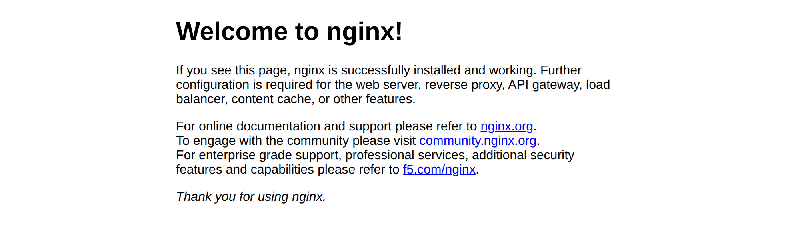

# LAB 2 — Nginx + Port Mapping

> โฟลเดอร์ `01_LAB_Nginx_Port_Mapping` = **LAB 2** ในสไลด์
> (LAB 1 เป็นคำสั่ง `docker run` พื้นฐาน จึงไม่มีโฟลเดอร์โค้ดของตัวเอง)

## สิ่งที่จะได้เรียนรู้

- เปิดเว็บเซิร์ฟเวอร์ Nginx ด้วยคำสั่งเดียว โดยไม่ต้องติดตั้งอะไรเลย
- `-p HOST_PORT:CONTAINER_PORT` ทำงานอย่างไร
- **กฎเหล็ก** : host port ห้ามซ้ำ · container port ซ้ำได้

---

## 0. เตรียมเครื่องเรียน

ทำบนเครื่องของเราเอง (ไม่ใช้ cloud) — เปิด container ที่ติดตั้ง Docker มาให้แล้ว

```bash
docker rm -f devtools
docker run -dit --name devtools --privileged -p 2222:22 tuchsanai/devtools:2569_1
ssh root@localhost -p 2222        # password : passwd
```

> ใน VS Code ใช้ **Remote-SSH** ต่อไปที่ `root@localhost:2222` แล้วทำแล็บทั้งหมดข้างใน

ตรวจว่าพร้อมใช้งาน :

```bash
docker --version
docker compose version
```

```
Docker version 29.6.2, build dfc4efb
Docker Compose version v5.3.1
```

---

## 1. Clone โค้ดแล็บ

```bash
mkdir -p ~/labwork
cd ~/labwork
git clone https://github.com/Tuchsanai/DevTools.git
cd DevTools/03_Docker/01_Docker/01_LAB_Nginx_Port_Mapping
```

---

## 2. รัน Nginx พร้อม Port Mapping

```bash
docker run -p 8080:80 nginx
```

ครั้งแรกจะไม่มี image ในเครื่อง Docker จึง **pull ให้อัตโนมัติ** แล้วค่อยรัน :

```
Unable to find image 'nginx:latest' locally
latest: Pulling from library/nginx
5a4222b844e8: Pulling fs layer
c0df8d325117: Pulling fs layer
        ... (รวม 7 layer) ...
26c307b5e35a: Pull complete
5a4222b844e8: Pull complete
Digest: sha256:8541484afbc9c8a5a8a99b379568ebbc957f658583ec9448fc43104229c03cf8
Status: Downloaded newer image for nginx:latest
/docker-entrypoint.sh: Configuration complete; ready for start up
2026/08/10 15:02:34 [notice] 1#1: nginx/1.31.3
2026/08/10 15:02:34 [notice] 1#1: start worker processes
        ^ ค้างอยู่ตรงนี้ — container ยังทำงาน กด Ctrl+C เพื่อหยุด
```

รันแบบนี้เป็น **foreground** — terminal จะค้าง ถ้าอยากได้ prompt คืนให้เติม `-d` :

```bash
docker run -d -p 8080:80 --name web1 nginx
```

```bash
docker ps
```

```
CONTAINER ID   IMAGE     COMMAND                  CREATED        STATUS                  PORTS                                     NAMES
765b603bbb1a   nginx     "/docker-entrypoint.…"   1 second ago   Up Less than a second   0.0.0.0:8080->80/tcp, [::]:8080->80/tcp   web1
```

---

## 3. ทดสอบ

```bash
curl -I http://localhost:8080
```

```
HTTP/1.1 200 OK
Server: nginx/1.31.3
Content-Type: text/html
Content-Length: 896
```

```bash
curl http://localhost:8080
```

```html
<title>Welcome to nginx!</title>
<h1>Welcome to nginx!</h1>
<p>If you see this page, nginx is successfully installed and working. ...
```

ดู access log ที่เกิดจาก `curl` เมื่อกี้ :

```bash
docker logs web1
```

```
172.18.0.1 - - [10/Aug/2026:15:01:13 +0000] "GET / HTTP/1.1" 200 896 "-" "curl/8.5.0" "-"
```

### เปิดดูในเบราว์เซอร์

port `8080` อยู่ข้างในเครื่องเรียน — ให้ forward ออกมาก่อนด้วย VS Code
แท็บ **PORTS → Forward a Port → 8080** แล้วเปิด `http://localhost:8080`



---

## 4. กฎเหล็กของ Port Mapping

รัน 3 container จาก image เดียวกัน โดยใช้ **host port ต่างกัน** :

```bash
docker run -d -p 8000:80 --name web2 nginx
docker run -d -p 8001:80 --name web3 nginx
docker ps
```

```
CONTAINER ID   IMAGE     COMMAND                  CREATED         STATUS                  PORTS                                     NAMES
2eddc160a563   nginx     "/docker-entrypoint.…"   1 second ago    Up Less than a second   0.0.0.0:8001->80/tcp, [::]:8001->80/tcp   web3
05d055ec3f8f   nginx     "/docker-entrypoint.…"   1 second ago    Up Less than a second   0.0.0.0:8000->80/tcp, [::]:8000->80/tcp   web2
765b603bbb1a   nginx     "/docker-entrypoint.…"   2 seconds ago   Up 1 second             0.0.0.0:8080->80/tcp, [::]:8080->80/tcp   web1
```

ทั้ง 3 ตัวใช้ **container port 80 เหมือนกันหมด** แต่ไม่ชนกัน เพราะแต่ละตัวมี IP ของตัวเอง :

```bash
docker exec web1 hostname -i     # 172.18.0.2
docker exec web2 hostname -i     # 172.18.0.3
docker exec web3 hostname -i     # 172.18.0.4
```

### ถ้าใช้ host port ซ้ำ

```bash
docker run -d -p 8000:80 --name web4 nginx
```

```
docker: Error response from daemon: failed to set up container networking: driver failed
programming external connectivity on endpoint web4 (d443e76eed0a...):
Bind for 0.0.0.0:8000 failed: port is already allocated
```

exit code = **125** และ container `web4` จะถูกสร้างค้างไว้ในสถานะ `Created` (เห็นได้จาก `docker ps -a`)
ต้องลบทิ้งเอง : `docker rm web4`

---

## 5. เก็บกวาด

```bash
docker rm -f web1 web2 web3
docker ps -a
```

---

## สรุปคำสั่งของแล็บนี้

| คำสั่ง | ความหมาย |
|---|---|
| `docker run -p 8080:80 nginx` | เปิด port 8080 ของเครื่องเรา ส่งต่อไป port 80 ในกล่อง |
| `docker run -d ...` | รันเบื้องหลัง ไม่ค้าง terminal |
| `docker ps` / `docker ps -a` | ดู container ที่ทำงานอยู่ / ทั้งหมด |
| `docker logs <name>` | ดู log ของ container |
| `docker rm -f <name>` | ลบ container ทิ้ง |

> เลข **ซ้าย = ของเรา** (พิมพ์ในเบราว์เซอร์) · เลข **ขวา = ของกล่อง** (แอปข้างในฟังอยู่)

*ผลลัพธ์ทั้งหมดในเอกสารนี้มาจากการรันจริงในเครื่องเรียน `tuchsanai/devtools:2569_1` เมื่อ 10 ส.ค. 2026*
