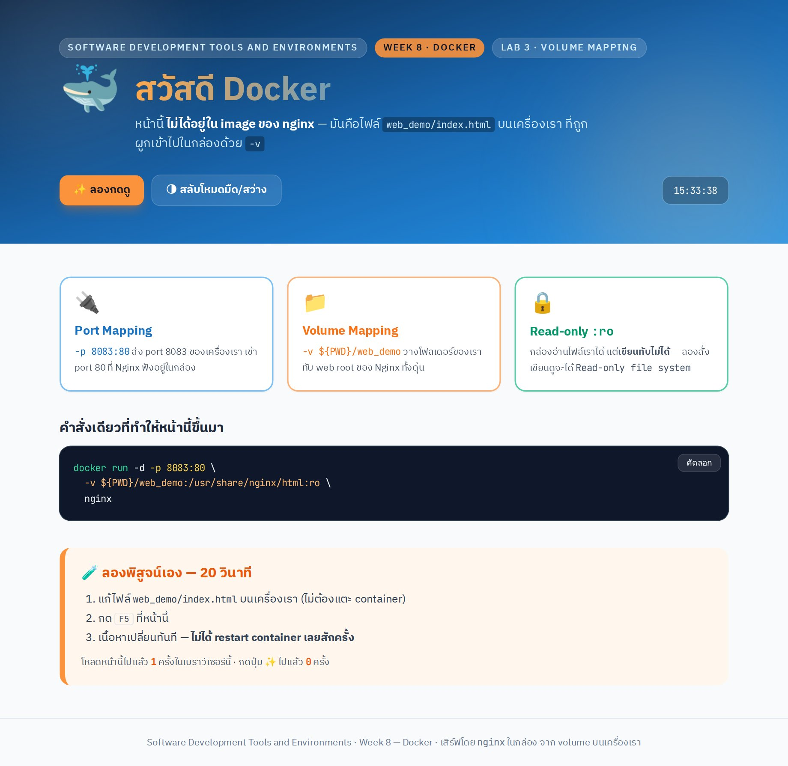

# LAB 3 — Nginx + Volume Mapping + Port Mapping

> โฟลเดอร์ `02_LAB_Nginx_Volume_Port_Mapping` = **LAB 3** ในสไลด์

## สิ่งที่จะได้เรียนรู้

- `-v HOST_PATH:CONTAINER_PATH` เอาโฟลเดอร์บนเครื่องเราไปวางในกล่อง
- แก้ไฟล์บนเครื่อง → เว็บในกล่องเปลี่ยนทันที **โดยไม่ต้อง restart**
- `:ro` (read-only) ป้องกัน container เขียนทับไฟล์ของเรา
- ลบ container แล้ว **ข้อมูลไม่หาย** เพราะไฟล์อยู่บนดิสก์ของเราตลอด

---

## 0. เตรียมเครื่องเรียน

```bash
docker run -dit --name devtools --privileged -p 2222:22 tuchsanai/devtools:2569_1
ssh root@localhost -p 2222        # password : passwd
```

---

## 1. เข้าโฟลเดอร์ของแล็บ

```bash
cd ~/labwork/DevTools/03_Docker/01_Docker/02_LAB_Nginx_Volume_Port_Mapping
ls -l web_demo
```

```
total 16
-rwxr-xr-x 1 root root 12316 Aug 10 22:25 index.html
```

`web_demo/index.html` คือหน้าเว็บของเราเอง (ใช้ **Tailwind CSS** ผ่าน CDN + มีนาฬิกา ปุ่มสลับโหมดมืด
และเอฟเฟกต์เล็ก ๆ) ที่จะเอาไปวางแทนหน้า default ของ Nginx

---

## 2. รัน Nginx พร้อม Volume + Port Mapping

```bash
docker run -d -p 8083:80 -v ${PWD}/web_demo:/usr/share/nginx/html:ro nginx
```

```
0bd67b47e51f96edbf3613aa8774626b5e441f466efa2ded532eaed3bbebc8f2
```

| ส่วนของคำสั่ง | ความหมาย |
|---|---|
| `-d` | รันเบื้องหลัง คืน prompt ให้ทันที |
| `-p 8083:80` | port 8083 ของเครื่องเรา → port 80 ในกล่อง |
| `-v ${PWD}/web_demo:/usr/share/nginx/html` | เอาโฟลเดอร์ `web_demo` ไปวางแทน web root ของ Nginx |
| `:ro` | กล่อง **อ่านได้อย่างเดียว เขียนไม่ได้** |

---

## 3. ทดสอบว่าได้หน้าเว็บของเรา ไม่ใช่หน้า default

```bash
curl -s http://localhost:8083 | grep -o "Welcome to Demo nginx Website"
```

```
Welcome to Demo nginx Website
```

### พิสูจน์ว่า web root ถูกแทนที่จริง

```bash
docker exec <container> ls -l /usr/share/nginx/html
```

```
total 16
-rwxr-xr-x 1 root root 12316 Aug 10 15:25 index.html
```

เทียบกับ nginx ที่ **ไม่ได้** ผูก volume :

```bash
docker run --rm nginx ls -l /usr/share/nginx/html
```

```
total 8
-rw-r--r-- 1 root root 497 Jul 15 16:03 50x.html
-rw-r--r-- 1 root root 896 Jul 15 16:03 index.html
```

ของเดิมใน `CONTAINER_PATH` ถูก **บังทับทั้งหมด** ไม่ใช่การรวมกัน

---

## 4. แก้ไฟล์บนเครื่อง → เห็นผลทันที

แก้หัวข้อในไฟล์บนเครื่องเรียน (ไม่แตะ container เลย) :

```bash
sed -i 's|Welcome to Demo nginx Website|สวัสดี Docker|' web_demo/index.html
curl -s http://localhost:8083 | grep -o "สวัสดี Docker"
```

```
สวัสดี Docker
```

**ไม่ได้ restart container เลยสักครั้ง** — นี่คือประโยชน์หลักของ volume ในงาน development

เปิดดูในเบราว์เซอร์ (VS Code → แท็บ **PORTS** → Forward a Port → `8083`) :



---

## 5. พิสูจน์ `:ro`

```bash
docker exec <container> sh -c "echo test >> /usr/share/nginx/html/index.html"
```

```
sh: 1: cannot create /usr/share/nginx/html/index.html: Read-only file system
```

exit code = **2** — container เขียนทับไฟล์ต้นฉบับของเราไม่ได้จริง

---

## 6. พิสูจน์ว่าข้อมูลอยู่รอด

```bash
docker rm -f <container>
ls -l web_demo/index.html
grep -o "สวัสดี Docker" web_demo/index.html
```

```
-rwxr-xr-x 1 root root 12312 Aug 10 22:31 web_demo/index.html
สวัสดี Docker
```

ลบกล่องกี่รอบ ไฟล์ก็ยังอยู่ครบ เพราะไฟล์อยู่บน **ดิสก์ของเครื่องเรา** ตลอด กล่องแค่ "มอง" เข้าไป

---

## สรุป

| ใช้ทำอะไร | ตัวอย่าง |
|---|---|
| เก็บข้อมูลถาวร | ฐานข้อมูล — ลบ container แล้วข้อมูลไม่หาย |
| ใส่ไฟล์เข้าไปในกล่อง | โค้ด / หน้าเว็บ ตอนพัฒนา — แก้แล้วเห็นผลทันที |

*ผลลัพธ์ทั้งหมดในเอกสารนี้มาจากการรันจริงในเครื่องเรียน `tuchsanai/devtools:2569_1` เมื่อ 10 ส.ค. 2026*
