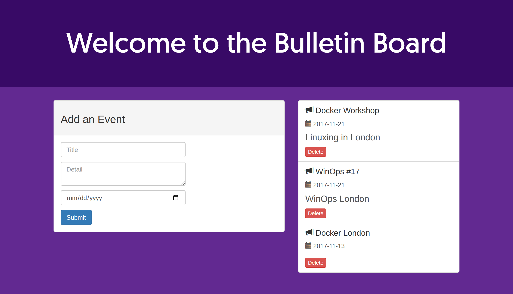

# LAB 4 — Build Docker Image เอง (Node.js Bulletin Board)

> โฟลเดอร์ `03_LAB_Node_Bulletin_Board` = **LAB 4** ในสไลด์

## สิ่งที่จะได้เรียนรู้

- อ่าน `Dockerfile` ทีละบรรทัด
- `docker build` สร้าง image ของตัวเองจากซอร์สโค้ด
- **Layer cache** — ทำไมต้อง `COPY package.json` ก่อน `COPY . .`

---

## 0. เตรียมเครื่องเรียน

```bash
docker run -dit --name devtools --privileged -p 2222:22 tuchsanai/devtools:2569_1
ssh root@localhost -p 2222        # password : passwd
```

---

## 1. เข้าโฟลเดอร์แอป

```bash
cd ~/labwork/DevTools/03_Docker/01_Docker/03_LAB_Node_Bulletin_Board/bulletin-board-app
ls
```

```
Dockerfile  LICENSE  app.js  backend  fonts  index.html  package.json  server.js  site.css
```

---

## 2. อ่าน Dockerfile

```dockerfile
FROM node:current-slim          # 1. เลือก base image (Node.js รุ่นเล็ก)

WORKDIR /usr/src/app            # 2. กำหนด working directory ในกล่อง
COPY package.json .             # 3. คัดลอกเฉพาะ package.json เข้ามาก่อน
RUN npm install                 # 4. ติดตั้ง dependencies

EXPOSE 8080                     # 5. ประกาศว่า container ฟังที่ port 8080
CMD [ "npm", "start" ]          # 6. คำสั่งที่รันเมื่อ container เริ่มทำงาน

COPY . .                        # 7. คัดลอกซอร์สโค้ดที่เหลือทั้งหมด
```

> **EXPOSE ไม่ได้เปิด port ให้จริง** — เป็นเพียงการประกาศเจตนา การเปิดจริงต้องใช้ `-p` ตอน `docker run`

---

## 3. Build image

```bash
docker build -t bulletinboard:1.0 .
```

ผลรันจริง (ย่อ) :

```
#1 [internal] load build definition from Dockerfile                    DONE 0.1s
#2 [internal] load metadata for docker.io/library/node:current-slim    DONE 2.4s
#3 [internal] load .dockerignore     DONE 0.0s
#4 [internal] load build context     transferring context: 38.10kB     DONE 0.1s
#5 [1/5] FROM docker.io/library/node:current-slim@sha256:4ebb5ace66f1...   DONE 14.6s
#6 [2/5] WORKDIR /usr/src/app                                          DONE 0.1s
#7 [3/5] COPY package.json .                                           DONE 0.1s
#8 [4/5] RUN npm install
#8 8.277 added 115 packages, and audited 116 packages in 8s            DONE 8.4s
#9 [5/5] COPY . .                                                      DONE 0.1s
#10 naming to docker.io/library/bulletinboard:1.0 done                  DONE 1.5s
```

`[1/5]` … `[5/5]` คือคำสั่งใน Dockerfile ที่ **สร้าง layer** — `EXPOSE` และ `CMD` ไม่นับ เพราะเป็นแค่ metadata

---

## 4. รัน container จาก image ที่เพิ่ง build

```bash
docker run -p 8085:8080 -d --name bb bulletinboard:1.0
```

```
fb1694ca74a7f3b7e486fce2e1e6efea8583be626369dee34912409280575f78
```

```bash
docker images
```

```
IMAGE               ID             DISK USAGE   CONTENT SIZE   EXTRA
bulletinboard:1.0   0924eadc8511        399MB           94MB   U
```

```bash
docker ps
```

```
CONTAINER ID   IMAGE               COMMAND                  CREATED         STATUS         PORTS                                         NAMES
fb1694ca74a7   bulletinboard:1.0   "docker-entrypoint.s…"   7 seconds ago   Up 7 seconds   0.0.0.0:8085->8080/tcp, [::]:8085->8080/tcp   bb
```

```bash
docker logs bb
```

```
> vue-event-bulletin@1.0.0 start
> node server.js

Magic happens on port 8080...
```

> หน้าเว็บไม่ขึ้น? ดู `docker logs bb` ก่อนเสมอ

---

## 5. ทดสอบแอป

```bash
curl -s http://localhost:8085 | head -30
```

```html
<title>Bulletin Board</title>
<h1>Welcome to the Bulletin Board</h1>
```

```bash
curl -s http://localhost:8085/api/events
```

```json
[{"id":1,"title":"Docker Workshop","detail":"Linuxing in London ","date":"2017-11-21"},
 {"id":2,"title":"WinOps #17","detail":"WinOps London","date":"2017-11-21"},
 {"id":3,"title":"Docker London","date":"2017-11-13"}]
```

```bash
docker exec bb sh -c "node -v; pwd; ls"
```

```
v26.7.0
/usr/src/app
Dockerfile  LICENSE  app.js  backend  fonts  index.html
node_modules  package-lock.json  package.json  server.js  site.css
```

`node_modules` ถูกสร้างขึ้น **ในกล่อง** ตอน `RUN npm install` — ไม่ได้ก๊อปมาจากเครื่องเรา

เปิดดูในเบราว์เซอร์ (VS Code → แท็บ **PORTS** → Forward a Port → `8085`) :



---

## 6. พิสูจน์ Layer Cache

แก้เฉพาะซอร์สโค้ด **ไม่แตะ `package.json`** แล้ว build ใหม่ :

```bash
sed -i 's/Welcome to the Bulletin Board/Welcome to the Bulletin Board v1.1/' index.html
docker build -t bulletinboard:1.1 .
```

```
#5 [1/5] FROM docker.io/library/node:current-slim@sha256:4ebb5ace...   DONE 0.0s
#6 [3/5] COPY package.json .        CACHED
#7 [2/5] WORKDIR /usr/src/app       CACHED
#8 [4/5] RUN npm install            CACHED      <- ประหยัดไป 8 วินาที
#9 [5/5] COPY . .                                            DONE 0.0s
#10 naming to docker.io/library/bulletinboard:1.1 done       DONE 0.3s
```

build รอบแรกใช้เวลา ~25 วินาที (ต้องโหลด base image + `npm install`)
build รอบสองเหลือ **ไม่ถึง 2 วินาที**

| เขียนแบบ | ผลที่ได้ |
|---|---|
| `COPY . .` ก่อน `RUN npm install` | แก้โค้ดตัวอักษรเดียว → cache หลุดหมด → `npm install` รันใหม่ทุกครั้ง |
| `COPY package.json` ก่อน (แบบนี้) | `package.json` ไม่เปลี่ยน → `npm install` **CACHED** ตลอด |

> **กฎง่าย ๆ :** สิ่งที่เปลี่ยนน้อยที่สุดไว้บนสุดของ Dockerfile · สิ่งที่เปลี่ยนบ่อยที่สุดไว้ล่างสุด

---

## 7. คำสั่งที่ใช้บ่อยหลัง build

```bash
docker logs -f bb                 # ตามดู log สด ๆ
docker exec -it bb sh             # เข้าไปใน shell ของกล่อง
docker stop bb                    # หยุด
docker rm bb                      # ลบ container
docker rmi bulletinboard:1.0      # ลบ image
```

*ผลลัพธ์ทั้งหมดในเอกสารนี้มาจากการรันจริงในเครื่องเรียน `tuchsanai/devtools:2569_1` เมื่อ 10 ส.ค. 2026*
