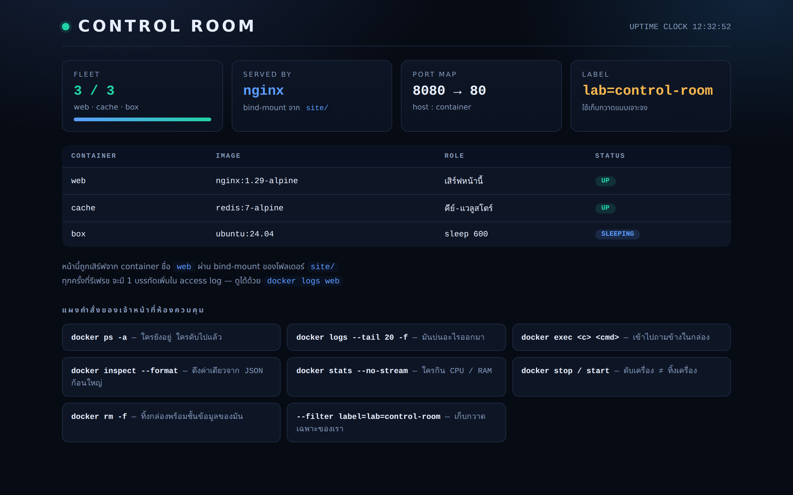

# LAB 1 — ห้องควบคุม container

> โฟลเดอร์ `001_LAB_Container_Control_Room` = **LAB 1** ในสไลด์ `Docker_Week09_Slides.html`

วันนี้เราไม่ได้เป็นคนสร้าง container อย่างเดียว — เราเป็น **เจ้าหน้าที่ห้องควบคุม**
มีกองเรือ 3 ลำอยู่ในมือ และต้องตอบคำถามว่า "ตอนนี้ใครยังอยู่ · ใครดับ · ใครกินทรัพยากร ·
ข้างในมันเป็นยังไง" ให้ได้ **ด้วยหลักฐานจาก CLI เท่านั้น** ห้ามเดา

## สิ่งที่จะได้เรียนรู้

- อ่านกระดานสถานะให้เป็น : `docker ps` vs `docker ps -a` และความหมายของ **ทุกคอลัมน์**
- จัดหน้าจอเองด้วย `--format` และคัดเฉพาะที่ต้องการด้วย `--filter` (โดยเฉพาะ `--filter label=...`)
- **3 โหมดของ `docker run`** : foreground (ยึด terminal) · `-it` (เข้าไปพิมพ์เอง) · `-d` (ปล่อยไว้เบื้องหลัง)
- **tag ไม่ใช่ของประดับ** — `redis` กับ `redis:7-alpine` คนละเวอร์ชันกันจริง ๆ และ `latest` ≠ "ใหม่ที่สุด"
- เครื่องมือสืบสวน 4 ชิ้น : `docker logs` · `docker exec` · `docker inspect --format` · `docker stats` / `docker top`
- **`stop` ≠ `rm`** — พิสูจน์ด้วย container ID และข้อมูลที่ยังอยู่หลัง start ใหม่
- เก็บกวาดแบบมืออาชีพ : ลบ **เฉพาะของแล็บนี้ด้วย label** แทนการกวาดทั้งเครื่อง และรู้จัก `rmi` / `container prune` / `image prune`

## ภาพรวมของแล็บนี้

1. **เปิดกองเรือ 3 ลำ** — `web` (nginx เสิร์ฟหน้า CONTROL ROOM ของเรา), `cache` (redis), `box` (ubuntu ที่แค่ `sleep`)
   ทั้งสามลำติด `--label lab=control-room` ไว้ เพื่อให้ตอนเก็บกวาดเราหยิบเฉพาะของเราได้
2. **อ่านกระดานสถานะ** — `docker ps` เห็นแค่ลำที่ยังวิ่ง ส่วน `docker ps -a` เห็นซากที่ดับไปแล้วด้วย
   แล้วบีบให้เหลือเฉพาะคอลัมน์ที่อยากดูด้วย `--format`
3. **แยกให้ออกว่า `run` มีกี่โหมด** — โหมดไหนยึด terminal โหมดไหนคืน prompt ให้ทันที และ `--rm` ช่วยอะไร
4. **เรื่อง tag** — ดึง `redis` (ไม่ระบุ tag) มาเทียบกับ `redis:7-alpine` แล้วถามเวอร์ชันจากตัวมันเอง
5. **สืบสวน** — อ่าน log ของเว็บที่เราเพิ่งยิง request เข้าไป, สั่งงานข้างในกล่องด้วย `exec`,
   ดึงค่าเดี่ยว ๆ ออกจาก JSON ก้อนใหญ่ด้วย `inspect --format` และดูภาระงานด้วย `stats` / `top`
6. **ทดลอง `stop` แล้ว `start` ใหม่** — จดเลข ID ก่อนและหลัง แล้วดูว่าเป็นกล่องเดิมหรือกล่องใหม่
7. **เก็บกวาด** — ลบด้วย label · เทียบกับคำสั่งกวาดทั้งเครื่องแบบในสไลด์ (พร้อมคำเตือน) · แล้วจัดการ image ต่อ

## Terminal Map

แล็บนี้ใช้ 2 terminal ในข้อ 5.4 (`docker logs -f`) ที่เหลือใช้ terminal เดียวพอ

| Terminal | ใช้ทำอะไร |
|---|---|
| **T1** | terminal หลัก — พิมพ์คำสั่ง `docker` ทั้งหมด |
| **T2** | เปิดค้างไว้ตอนข้อ 5.4 เพื่อรัน `docker logs -f web` แล้วดู log ไหลแบบ real time ขณะที่ T1 ยิง `curl` |

> ทั้งสอง terminal คือการ `ssh root@localhost -p 2222` เข้าเครื่องเรียน **ตัวเดียวกัน** ไม่ใช่คนละเครื่อง

---

## 0. เตรียมเครื่องเรียน

```bash
docker rm -f devtools-lab001
docker run -dit --name devtools-lab001 --privileged -p 2222:22 -p 18081:8080 tuchsanai/devtools:2569_1
ssh root@localhost -p 2222        # password : passwd
```

> 📝 **คำอธิบาย:** สามคำสั่งนี้เตรียม "เครื่องเรียน" ที่มี Docker ติดตั้งมาให้แล้ว ทุกคนจึงทำแล็บบนสภาพแวดล้อมเดียวกัน ·
> `docker rm -f devtools-lab001` ลบเครื่องเรียนตัวเก่าทิ้งก่อน (`-f` = force คือหยุดแล้วลบในคำสั่งเดียว ถ้ายังไม่เคยสร้างจะขึ้น error ว่าไม่พบ ปล่อยผ่านได้) ·
> `-dit` = `-d` รันเบื้องหลัง + `-i` เปิด stdin ค้างไว้ + `-t` ให้มี terminal รวมกันแล้วกล่องจะไม่ดับทันที ·
> `--privileged` ให้สิทธิ์เต็มเพื่อให้รัน Docker ซ้อนข้างในกล่องได้ (Docker-in-Docker) ซึ่งจำเป็นกับทุกแล็บของสัปดาห์นี้ ·
> `-p 2222:22` = ทางเข้า SSH · `-p 18081:8080` = ทางเข้าเว็บของแล็บนี้ **ห้ามเปลี่ยนเลข** เพราะแล็บอื่นในสัปดาห์นี้จองเลขอื่นไว้แล้ว
> สิ่งที่ต้องดูคือคำสั่งที่ 2 ต้องคืน container ID ยาว ๆ กลับมา ถ้าขึ้น `port is already allocated` แปลว่ามีของเก่าค้างอยู่ ให้ลบทิ้งก่อน

> ใน VS Code ใช้ **Remote-SSH** ต่อไปที่ `root@localhost:2222` แล้วทำแล็บทั้งหมดข้างใน

**ทางเดินของ port ในแล็บนี้มี 2 ทอด** ต้องเห็นภาพก่อน ไม่งั้นจะงงตอนเปิดเบราว์เซอร์ :

```
เบราว์เซอร์บนเครื่องเรา  →  :18081  →  [ devtools-lab001 ]  :8080  →  [ container web ]  :80
        (host)                              (เครื่องเรียน)                    (nginx)
```

- `-p 18081:8080` ตอนสร้างเครื่องเรียน = ทอดแรก
- `-p 8080:80` ตอนสร้าง container `web` ในข้อ 1 = ทอดที่สอง
- ในเครื่องเรียนเราจะ `curl http://localhost:8080` ส่วนบนเบราว์เซอร์ของเราเปิด `http://localhost:18081`

ตรวจว่า Docker ในเครื่องเรียนพร้อมใช้ :

```bash
docker --version
docker compose version
```

> 📝 **คำอธิบาย:** เช็กว่าในเครื่องเรียนมี Docker engine ให้ใช้จริงก่อนเริ่ม จะได้ไม่ไปเจอปัญหากลางทาง ·
> สังเกตว่าเป็น `docker compose` (เว้นวรรค) ไม่ใช่ `docker-compose` (ขีดกลาง) แบบขีดกลางคือรุ่นเก่าที่เลิกใช้แล้ว
> ถ้าคำสั่งใดขึ้น `command not found` แปลว่ายังไม่ได้อยู่ในเครื่องเรียน ให้ย้อนกลับไป `ssh` เข้าไปใหม่

✅ **Expected output** — ขอแค่ขึ้น "เลขเวอร์ชัน" ทั้งสองบรรทัดก็ถือว่าพร้อม (เลขเวอร์ชันของแต่ละคนอาจไม่ตรงกับเอกสารนี้):

```
Docker version 29.6.2, build dfc4efb
Docker Compose version v5.3.1
```

เข้าโฟลเดอร์ของแล็บ (ถ้ายังไม่เคย clone ให้ clone ก่อน ทำครั้งเดียวใช้ได้ทุกแล็บ) :

```bash
mkdir -p ~/labwork ; cd ~/labwork
git clone https://github.com/Tuchsanai/DevTools.git
cd DevTools/03_Docker/02_Docker/001_LAB_Container_Control_Room
ls site
```

> 📝 **คำอธิบาย:** ดึงไฟล์ของวิชาลงมาไว้บนดิสก์ของเครื่องเรียน แล้วเข้าไปยืนในโฟลเดอร์ของแล็บนี้ ·
> ต้องเห็นไฟล์ `index.html` ในโฟลเดอร์ `site/` เพราะข้อ 1 จะเอาโฟลเดอร์นี้ไป bind-mount เข้า nginx
> **ต้องยืนอยู่ในโฟลเดอร์นี้ตลอดแล็บ** เพราะคำสั่งข้างหน้าใช้ `${PWD}` อ้างถึงตำแหน่งปัจจุบัน

> ⚠️ **คำถามก่อนเริ่ม (จดคำตอบไว้ก่อนอ่านต่อ)**
> ถ้าเรา `docker stop` container ตัวหนึ่ง แล้ว `docker start` มันขึ้นมาใหม่ —
> เราได้ **container ตัวเดิม** หรือ **ตัวใหม่ที่หน้าตาเหมือนกัน** ? แล้วข้อมูลที่เขียนไว้ข้างในยังอยู่ไหม ?
> ข้อ 9 จะพิสูจน์ด้วยหลักฐาน 2 ชิ้น

---

## 1. เปิดกองเรือ 3 ลำ

### 1.1 `web` — nginx ที่เสิร์ฟหน้า CONTROL ROOM ของเรา

```bash
docker run -d --name web --label lab=control-room \
  -p 8080:80 -v ${PWD}/site:/usr/share/nginx/html:ro nginx:1.29-alpine
```

> 📝 **คำอธิบาย:** ลำแรกของกองเรือ — nginx ที่เอาโฟลเดอร์ `site/` ของเราไปวางแทน web root ·
> `-d` รันเบื้องหลังแล้วคืน prompt ทันที · `--name web` ตั้งชื่อไว้เรียกง่าย ไม่ต้องจำ ID ·
> `--label lab=control-room` **ติดป้ายกำกับ** ไว้ที่ container ป้ายนี้ยังไม่ทำอะไรตอนนี้ แต่ข้อ 10 จะใช้มันเก็บกวาดแบบเจาะจง ·
> `-p 8080:80` port 8080 ของเครื่องเรียน → port 80 ในกล่อง · `-v ${PWD}/site:...:ro` เอาหน้าเว็บของเราเข้าไปแบบอ่านอย่างเดียว ·
> `nginx:1.29-alpine` **ระบุ tag ชัดเจนเสมอ** (เหตุผลอยู่ในข้อ 4)
> ครั้งแรกจะเห็น Docker ดาวน์โหลด image ทีละ layer สิ่งที่ต้องดูคือบรรทัดสุดท้ายต้องเป็น container ID ไม่ใช่ error

✅ **Expected output** — บรรทัดสุดท้ายต้องเป็น container ID 64 ตัวอักษร (จำนวน layer, digest และ ID ของแต่ละคนจะไม่ตรงกับเอกสารนี้ · ถ้าเคยมี image อยู่แล้วจะไม่เห็นบรรทัด pull เลย):

```
Unable to find image 'nginx:1.29-alpine' locally
1.29-alpine: Pulling from library/nginx
612c0c1df4c5: Pulling fs layer
6a0ac1617861: Pulling fs layer
        ... (รวม 8 layer) ...
6a0ac1617861: Pull complete
612c0c1df4c5: Pull complete
Digest: sha256:5616878291a2eed594aee8db4dade5878cf7edcb475e59193904b198d9b830de
Status: Downloaded newer image for nginx:1.29-alpine
e24cad7406f77e2ffa5c68f3ed48eb31a33e19a10dfd57260bcc73e195a6d4d4
```

> 📝 เอกสารนี้บันทึกจากเครื่องที่วางไฟล์แล็บไว้ที่ `/workspace/lab` — ค่า `${PWD}` ในเอกสารจึงเท่ากับ `/workspace/lab`
> ของนักเรียนจะเป็น path ที่ตัวเองยืนอยู่ (เช่น `~/labwork/DevTools/03_Docker/02_Docker/001_LAB_Container_Control_Room`)

### 1.2 `cache` และ `box`

```bash
docker run -d --name cache --label lab=control-room redis:7-alpine
docker run -d --name box --label lab=control-room ubuntu:24.04 sleep 600
```

> 📝 **คำอธิบาย:** เติมกองเรืออีก 2 ลำที่มี "บุคลิก" ต่างกัน เพื่อให้มีของให้สืบสวนหลายแบบ ·
> `cache` = redis ซึ่งเป็น service ที่รันค้างเองอยู่แล้ว จึงไม่ต้องสั่งอะไรต่อท้าย ·
> `box` = ubuntu ซึ่ง **ไม่มี service อะไรรันเอง** ถ้าไม่สั่งอะไรมันจะดับทันที เราจึงต่อท้ายด้วย `sleep 600`
> เพื่อให้มันมีงานทำ 10 นาที (นี่คือเหตุผลที่ container ubuntu เปล่า ๆ มัก "ดับทันทีที่เกิด")
> สิ่งที่ต้องดูคือทั้งสองคำสั่งคืน container ID กลับมา

✅ **Expected output** — ดู 4 บรรทัดท้ายของแต่ละคำสั่ง (เอกสารนี้ตัดบรรทัด pull ออกด้วย `| tail -4` เพื่อความสั้น):

```
cac39341ecaa: Download complete
Digest: sha256:e7723ff73d963f5cc6d9c4643ea3d989527a402a319239054e9472a7fb9219a2
Status: Downloaded newer image for redis:7-alpine
ca4d825406e6be47ab1ce71a8f851a32b301d1552b877904d14a0a8e319c717a
```

```
966c395d29cb: Pull complete
Digest: sha256:561618e2c15bf2397621dd04f96926663a3b5616c189cf7e38db7e82f5c538ea
Status: Downloaded newer image for ubuntu:24.04
375dad3ca9b397e806451778454241a5c0641a9ee4c0f20fe13fad2a755ee739
```

---

## 2. อ่านกระดานสถานะ : `ps` vs `ps -a`

### 2.1 `docker ps` — เห็นเฉพาะลำที่ยังวิ่ง

```bash
docker ps
```

> 📝 **คำอธิบาย:** คำสั่งที่เจ้าหน้าที่ห้องควบคุมพิมพ์บ่อยที่สุด — แสดง container ที่ **กำลังรันอยู่เท่านั้น** ·
> ถ้าไม่เห็นสิ่งที่คาดว่าจะเห็น อย่าเพิ่งสรุปว่า "ไม่ได้สร้าง" ให้ไปดู `docker ps -a` ต่อในข้อ 2.2
> สิ่งที่ต้องดูคือต้องมีครบ 3 แถว และแถวของ `web` ต้องมีเลข port อยู่ในคอลัมน์ PORTS

✅ **Expected output** — 3 แถว (ID, เวลา และความกว้างคอลัมน์ของแต่ละคนจะต่างจากเอกสารนี้):

```
CONTAINER ID   IMAGE               COMMAND                  CREATED                  STATUS                  PORTS                                     NAMES
375dad3ca9b3   ubuntu:24.04        "sleep 600"              Less than a second ago   Up Less than a second                                             box
ca4d825406e6   redis:7-alpine      "docker-entrypoint.s…"   7 seconds ago            Up 7 seconds            6379/tcp                                  cache
e24cad7406f7   nginx:1.29-alpine   "/docker-entrypoint.…"   21 seconds ago           Up 21 seconds           0.0.0.0:8080->80/tcp, [::]:8080->80/tcp   web
```

**อ่านทีละคอลัมน์** — ข้อสอบชอบออกตรงนี้ :

| คอลัมน์ | อ่านว่าอะไร | จุดที่ต้องระวัง |
|---|---|---|
| `CONTAINER ID` | ชื่อจริงของกล่อง (ตัวย่อ 12 ตัวจาก ID เต็ม 64 ตัว) | ใช้ตัวย่อแทนชื่อได้ทุกคำสั่ง |
| `IMAGE` | สร้างมาจาก image + tag ไหน | ถ้าไม่เห็น tag แปลว่าเป็น `latest` |
| `COMMAND` | คำสั่งที่เป็น **process หมายเลข 1** ในกล่อง | ถูกตัดท้ายด้วย `…` — ดูเต็ม ๆ ได้ที่ข้อ 7 |
| `CREATED` | สร้างเมื่อไหร่ | **ไม่ใช่** เวลาที่เริ่มรัน |
| `STATUS` | `Up …` = ยังวิ่ง · `Exited (N) …` = ดับแล้วพร้อม exit code | `Exited (0)` = จบงานปกติ · ตัวเลขอื่น = มีปัญหา |
| `PORTS` | การ map port จริง ๆ | `0.0.0.0:8080->80/tcp` = มีทางเข้าจากข้างนอก · `6379/tcp` เฉย ๆ = เปิดแค่ในเครือข่ายของ Docker |
| `NAMES` | ชื่อที่เราตั้ง (ถ้าไม่ตั้ง Docker สุ่มให้ เช่น `silly_sammet`) | ชื่อห้ามซ้ำในเครื่องเดียวกัน |

สังเกตความต่างของคอลัมน์ PORTS : `web` มี `0.0.0.0:8080->80/tcp` เพราะเราสั่ง `-p`
ส่วน `cache` มีแค่ `6379/tcp` — redis เปิด port ไว้จริงแต่ **ไม่มีทางเข้าจากนอกเครื่องเรียน** ส่วน `box` ว่างเปล่าเพราะ `sleep` ไม่ได้เปิด port อะไรเลย

### 2.2 ทำให้มี "ซาก" แล้วเทียบกับ `docker ps -a`

ตอนนี้ทั้ง 3 ลำยังวิ่งอยู่ `ps` กับ `ps -a` จึงให้ผลเหมือนกัน — ต้องมีตัวที่ดับก่อนถึงจะเห็นความต่าง

```bash
docker run --name probe --label lab=control-room alpine:3.21 echo "probe ok"
docker ps
docker ps -a
```

> 📝 **คำอธิบาย:** สร้าง container ที่ "เกิดมาเพื่อทำงานเดียวแล้วตาย" — พิมพ์ข้อความแล้วจบ ·
> คำสั่งแรกไม่มี `-d` จึงรันแบบ foreground : เราเห็นผลลัพธ์ `probe ok` แล้ว container ก็ดับทันทีที่คำสั่งจบ ·
> `docker ps` จะ **ไม่เห็น** `probe` แล้ว แต่ `docker ps -a` (a = all) จะเห็นเป็น `Exited (0)`
> จุดสำคัญ : container ที่ดับแล้ว **ยังกินพื้นที่ดิสก์อยู่** จนกว่าจะ `docker rm` — มันไม่ได้หายไปเอง

✅ **Expected output** — คำสั่งแรกพ่นข้อความออกมาแล้วจบ (เอกสารนี้ตัดบรรทัด pull ของ `alpine:3.21` ออก · ถ้าเครื่องมี image อยู่แล้วจะไม่มีบรรทัด pull เลย):

```
probe ok
```

จากนั้น `docker ps` ยังเห็น 3 แถวเท่าเดิม แต่ `docker ps -a` เห็น 4 แถว โดยแถวบนสุดคือ `probe` ที่ `Exited (0)`:

```
CONTAINER ID   IMAGE               COMMAND                  CREATED          STATUS                              PORTS                                     NAMES
f85ce59724c0   alpine:3.21         "echo 'probe ok'"        1 second ago     Exited (0) Less than a second ago                                             probe
375dad3ca9b3   ubuntu:24.04        "sleep 600"              14 seconds ago   Up 13 seconds                                                                 box
ca4d825406e6   redis:7-alpine      "docker-entrypoint.s…"   21 seconds ago   Up 20 seconds                       6379/tcp                                  cache
e24cad7406f7   nginx:1.29-alpine   "/docker-entrypoint.…"   35 seconds ago   Up 34 seconds                       0.0.0.0:8080->80/tcp, [::]:8080->80/tcp   web
```

| คำสั่ง | เห็นอะไร | ใช้ตอนไหน |
|---|---|---|
| `docker ps` | เฉพาะที่ **กำลังรัน** | "ตอนนี้อะไรทำงานอยู่บ้าง" |
| `docker ps -a` | **ทั้งหมด** รวมที่ดับแล้ว | "ทำไมของฉันหาย" / "มีขยะค้างไหม" |

### 2.3 จัดหน้าจอเองด้วย `--format` และคัดด้วย `--filter`

```bash
docker ps -a --format "table {{.Names}}\t{{.Image}}\t{{.Status}}\t{{.Ports}}"
docker ps --filter label=lab=control-room --format "{{.Names}}"
docker ps -a --filter status=exited --format "table {{.Names}}\t{{.Status}}"
```

> 📝 **คำอธิบาย:** ผลลัพธ์ดิบของ `docker ps` กว้างเกินจอเสมอ — `--format` ให้เราเลือกเฉพาะคอลัมน์ที่อยากดู ·
> รูปแบบคือ Go template : ขึ้นต้นด้วยคำว่า `table` เพื่อให้มีหัวตาราง แล้วคั่นแต่ละคอลัมน์ด้วย `\t` ·
> `--filter` คัดแถว — `label=lab=control-room` เอาเฉพาะที่เราติดป้ายไว้ในข้อ 1 · `status=exited` เอาเฉพาะที่ดับแล้ว ·
> สองอย่างนี้รวมกันคือหัวใจของการเก็บกวาดแบบปลอดภัยในข้อ 10 (เลือกให้ถูกตัวก่อนค่อยลบ)

✅ **Expected output** — ตารางแคบลงเหลือเฉพาะที่สั่ง · แล้วได้รายชื่อ 3 ลำของเรา · แล้วเหลือเฉพาะตัวที่ดับ:

```
NAMES     IMAGE               STATUS                     PORTS
probe     alpine:3.21         Exited (0) 6 seconds ago   
box       ubuntu:24.04        Up 19 seconds              
cache     redis:7-alpine      Up 27 seconds              6379/tcp
web       nginx:1.29-alpine   Up 40 seconds              0.0.0.0:8080->80/tcp, [::]:8080->80/tcp
```

```
box
cache
web
```

```
NAMES     STATUS
probe     Exited (0) 7 seconds ago
```

> `--filter label=lab=control-room` คืนมาแค่ 3 ลำของเรา — ถึงในเครื่องจะมี container ของคนอื่นอีกกี่ตัวก็ไม่ติดมา
> **นี่คือเหตุผลที่เราติด label ตั้งแต่ตอน `run`**

---

## 3. สามโหมดของ `docker run`

คำสั่งเดียวกันแต่ใส่ flag ต่างกัน ให้พฤติกรรมคนละแบบ — เข้าใจ 3 โหมดนี้แล้วจะเลิกงงว่า "ทำไม terminal ค้าง"

### 3.1 โหมด foreground — รันแล้วจบ

```bash
docker run --rm alpine:3.21 echo "hello from a container"
docker ps -a --format "table {{.Names}}\t{{.Image}}\t{{.Status}}"
```

> 📝 **คำอธิบาย:** โหมดพื้นฐานที่สุด — Docker สร้างกล่อง รันคำสั่ง พ่นผลลัพธ์ออกมาที่ terminal ของเรา แล้วกล่องก็ดับ ·
> `--rm` สั่งให้ **ลบกล่องทิ้งอัตโนมัติทันทีที่จบ** ต่างจาก `probe` ในข้อ 2.2 ที่ไม่ได้ใส่ `--rm` เลยมีซากค้างใน `ps -a` ·
> ใช้โหมดนี้กับงานยิงครั้งเดียวจบ เช่น เช็กเวอร์ชัน แปลงไฟล์ รันสคริปต์สั้น ๆ
> สิ่งที่ต้องดูคือคำสั่งที่สอง **ต้องไม่มีแถวของ alpine ตัวใหม่โผล่มา** (มีแต่ `probe` ตัวเดิม)

✅ **Expected output** — ข้อความออกมาแล้วกล่องหายไปเอง ไม่ทิ้งซาก:

```
hello from a container
```

```
NAMES     IMAGE               STATUS
probe     alpine:3.21         Exited (0) 16 seconds ago
box       ubuntu:24.04        Up 29 seconds
cache     redis:7-alpine      Up 36 seconds
web       nginx:1.29-alpine   Up 50 seconds
```

### 3.2 โหมด `-it` — เข้าไปนั่งพิมพ์ข้างในเอง

```bash
docker run -it --rm ubuntu:24.04 sh
```

แล้วพิมพ์ข้างในกล่องทีละบรรทัด :

```bash
whoami
cat /etc/os-release | head -2
exit
```

> 📝 **คำอธิบาย:** นี่คือ "Run – stdin" ในสไลด์ — `-i` (interactive) เปิดช่องรับสิ่งที่เราพิมพ์ค้างไว้
> และ `-t` (tty) จำลอง terminal ให้มี prompt สวย ๆ · สองตัวนี้มักมาคู่กันเป็น `-it` ·
> ต่อท้ายด้วย `sh` เพื่อ **แทนที่คำสั่งเริ่มต้นของ image** ด้วย shell เราจึงได้เข้าไปพิมพ์เอง ·
> พิมพ์ `exit` (หรือกด `Ctrl+D`) เพื่อออก — พอ shell จบ **container ก็ดับทันที** เพราะ shell คือ process หมายเลข 1 ของมัน
> ระวัง : ถ้าลืม `--rm` จะมีซากค้างทุกครั้งที่ทดลอง

✅ **Expected output** — prompt เปลี่ยนเป็น `#` ของกล่อง แล้วคำสั่งที่พิมพ์ทำงานข้างใน ubuntu ไม่ใช่บนเครื่องเรียน:

```
# whoami
root
# cat /etc/os-release | head -2
PRETTY_NAME="Ubuntu 24.04.4 LTS"
NAME="Ubuntu"
# exit
```

### 3.3 attach vs detach — ใครยึด terminal

```bash
docker run --name fg-web --label lab=control-room nginx:1.29-alpine
```

> 📝 **คำอธิบาย:** รัน nginx แบบ **ไม่ใส่ `-d`** — Docker จะ "attach" terminal ของเราเข้ากับ container
> ทำให้ log ของ nginx ไหลออกมาที่หน้าจอ และ **prompt ไม่คืนกลับมา** จนกว่าจะกด `Ctrl+C` ·
> นี่คือหน้าตาเดียวกับสไลด์ "Run – attach and detach" · กด `Ctrl+C` เพื่อออก (container จะดับตามไปด้วย)
> ข้อควรระวัง : `Ctrl+C` ส่งสัญญาณหยุดเข้าไปในกล่องจริง ๆ ไม่ใช่แค่ "ปิดหน้าต่างดู log"

✅ **Expected output** — log ไหลออกมาเรื่อย ๆ แล้วค้างอยู่แบบนั้น (เอกสารนี้แสดง 12 บรรทัดแรก · วันเวลาและเลข worker ของแต่ละคนจะต่างกัน):

```
/docker-entrypoint.sh: /docker-entrypoint.d/ is not empty, will attempt to perform configuration
/docker-entrypoint.sh: Looking for shell scripts in /docker-entrypoint.d/
/docker-entrypoint.sh: Launching /docker-entrypoint.d/10-listen-on-ipv6-by-default.sh
10-listen-on-ipv6-by-default.sh: info: Getting the checksum of /etc/nginx/conf.d/default.conf
10-listen-on-ipv6-by-default.sh: info: Enabled listen on IPv6 in /etc/nginx/conf.d/default.conf
/docker-entrypoint.sh: Sourcing /docker-entrypoint.d/15-local-resolvers.envsh
/docker-entrypoint.sh: Launching /docker-entrypoint.d/20-envsubst-on-templates.sh
/docker-entrypoint.sh: Launching /docker-entrypoint.d/30-tune-worker-processes.sh
/docker-entrypoint.sh: Configuration complete; ready for start up
2026/08/12 12:32:05 [notice] 1#1: using the "epoll" event method
2026/08/12 12:32:05 [notice] 1#1: nginx/1.29.8
2026/08/12 12:32:05 [notice] 1#1: built by gcc 15.2.0 (Alpine 15.2.0) 
[... log ยังไหลต่อไปเรื่อย ๆ terminal ไม่คืน prompt จนกว่าจะกด Ctrl+C ...]
```

กด `Ctrl+C` แล้วเก็บกวาด จากนั้นลองแบบ `-d` เทียบ :

```bash
docker rm -f fg-web
docker run -d --name detached-demo --label lab=control-room nginx:1.29-alpine
docker ps --filter name=detached-demo --format "table {{.Names}}\t{{.Image}}\t{{.Status}}"
docker rm -f detached-demo
```

> 📝 **คำอธิบาย:** image เดียวกัน คำสั่งเกือบเหมือนกัน ต่างกันแค่ `-d` (detached) ·
> คราวนี้ Docker คืน **container ID** กลับมาทันทีแล้วปล่อยให้ nginx ทำงานเบื้องหลัง เราได้ prompt คืนไปทำอย่างอื่นต่อ ·
> log ไม่หายไปไหน — มันถูกเก็บไว้ให้เราไปอ่านทีหลังด้วย `docker logs` (ข้อ 5)
> สรุปสั้น ๆ : **`-d` ไม่ได้ทำให้เงียบ แค่ย้าย log ไปเก็บไว้แทนที่จะพ่นใส่หน้าเรา**

✅ **Expected output** — ได้ ID ยาว ๆ กลับมาทันที แล้ว `docker ps` ยืนยันว่ามันวิ่งอยู่จริง:

```
908989a16b8ef767668667086d1894543e7c1c6f6f02e3ae985ed5e144a4eb5b
```

```
NAMES           IMAGE               STATUS
detached-demo   nginx:1.29-alpine   Up Less than a second
```

| โหมด | flag | terminal | เหมาะกับ |
|---|---|---|---|
| foreground | (ไม่มี) | ถูกยึดจนคำสั่งจบ / กด `Ctrl+C` | งานสั้น ๆ · ดู log ตอน debug |
| interactive | `-it` | ถูกยึด แต่เราพิมพ์โต้ตอบได้ | เข้าไปสำรวจข้างใน image |
| detached | `-d` | คืน prompt ทันที | service ที่ต้องรันยาว (เว็บ, ฐานข้อมูล) |

---

## 4. tag — `latest` ไม่ได้แปลว่า "ใหม่ที่สุด"

```bash
docker pull redis
docker images
```

> 📝 **คำอธิบาย:** จงใจ pull โดย **ไม่ระบุ tag** เพื่อดูว่า Docker เติมอะไรให้เรา ·
> บรรทัดแรกของผลลัพธ์จะบอกเองว่า `Using default tag: latest` — คือถ้าเราไม่เลือก Docker เลือก `latest` ให้ ·
> จากนั้น `docker images` จะเห็น **redis สองบรรทัด** คือ `redis:7-alpine` (ที่ได้มาจากข้อ 1) และ `redis:latest`
> สิ่งที่ต้องดูคือขนาดที่ต่างกันมาก — คนละ image กันจริง ๆ ไม่ใช่ชื่อเล่นของกันและกัน

✅ **Expected output** — 5 บรรทัดท้ายของการ pull แล้วตามด้วยตาราง image (เอกสารนี้ตัดมาแสดงเฉพาะท้าย ๆ บรรทัด `Using default tag: latest` จึงอยู่เหนือขึ้นไปและไม่ปรากฏในบล็อกนี้ · IMAGE ID และขนาดของแต่ละคนอาจต่างกันตามวันที่ pull):

```
65405b53eed3: Pull complete
514dfa5816db: Pull complete
Digest: sha256:344e3945a0b431c8ff1eecd58c5573538126bd756f02fc7e218ddf1fc2546366
Status: Downloaded newer image for redis:latest
docker.io/library/redis:latest
```

```
IMAGE               ID             DISK USAGE   CONTENT SIZE   EXTRA
alpine:3.21         48b0309ca019       12.2MB         3.73MB   U    
nginx:1.29-alpine   5616878291a2       93.5MB         26.9MB   U    
redis:7-alpine      e7723ff73d96       57.8MB         16.8MB   U    
redis:latest        344e3945a0b4        212MB         57.4MB        
ubuntu:24.04        561618e2c15b        119MB         31.7MB   U    
```

> 📝 **หมายเหตุสำหรับคนที่เปิดสไลด์เทียบ:** Docker รุ่นใหม่ (29.x) เปลี่ยนหน้าตาของ `docker images` ไปจากในสไลด์แล้ว
> จากเดิม `REPOSITORY / TAG / IMAGE ID / CREATED / SIZE` มาเป็น `IMAGE / ID / DISK USAGE / CONTENT SIZE / EXTRA` ·
> `DISK USAGE` = พื้นที่จริงบนดิสก์ · `CONTENT SIZE` = ขนาดที่ต้องดาวน์โหลด (บีบอัดแล้ว) ·
> `EXTRA` เป็น `U` แปลว่า **U**sed คือมี container ใช้ image นั้นอยู่ — สังเกตว่า `redis:latest` ไม่มี `U` เพราะเราแค่ pull มาเฉย ๆ
> อยากได้ตารางหน้าตาเดิมแบบในสไลด์ ใช้ `--format` สั่งเองได้

```bash
docker images --format "table {{.Repository}}\t{{.Tag}}\t{{.ID}}\t{{.Size}}"
```

> 📝 **คำอธิบาย:** `--format` ใช้ได้กับ `docker images` เหมือนกับที่ใช้กับ `docker ps` ในข้อ 2.3 — เขียนคอลัมน์ที่อยากได้เอง ·
> `{{.Repository}}` = ชื่อ image (ไม่รวม tag) · `{{.Tag}}` = tag · `{{.ID}}` = IMAGE ID · `{{.Size}}` = ขนาด ·
> ประโยชน์จริงคือทำให้เอกสาร/สคริปต์ของเราไม่พังเวลา Docker เปลี่ยนหน้าตาตารางเริ่มต้น เพราะเราสั่งคอลัมน์เองแล้ว
> สิ่งที่ต้องดูคือ `redis` โผล่มา **2 แถว** ที่มี `IMAGE ID` คนละค่า — ยืนยันว่าเป็นคนละ image กันจริง

✅ **Expected output** — ได้คอลัมน์แบบที่คุ้นเคยจากสไลด์กลับมา:

```
REPOSITORY   TAG           IMAGE ID       SIZE
redis        latest        344e3945a0b4   212MB
ubuntu       24.04         561618e2c15b   119MB
redis        7-alpine      e7723ff73d96   57.8MB
alpine       3.21          48b0309ca019   12.2MB
nginx        1.29-alpine   5616878291a2   93.5MB
```

**ถามตัว redis เองว่าเป็นเวอร์ชันอะไร** — นี่คือหลักฐานชิ้นสำคัญ :

```bash
docker run --rm redis:7-alpine redis-server --version
docker run --rm redis redis-server --version
```

> 📝 **คำอธิบาย:** สั่งให้ container พิมพ์เวอร์ชันของ redis ที่อยู่ข้างในตัวมันเองออกมา แทนที่จะเดาจากชื่อ tag ·
> ใช้ `--rm` เพราะเป็นการถามครั้งเดียวจบ ไม่ต้องเก็บกล่องไว้
> สิ่งที่ต้องดูคือเลขเวอร์ชันสองบรรทัดนี้ **ต่างกันคนละ major version**

✅ **Expected output** — คนละเวอร์ชันกันจริง ๆ (เลขที่นักเรียนเห็นอาจใหม่กว่านี้ เพราะ `latest` ขยับตลอดเวลา):

```
Redis server v=7.4.10 sha=00000000:0 malloc=jemalloc-5.3.0 bits=64 build=d70b7db78d693e15
```

```
Starting Redis Server
Redis server v=8.10.0 sha=00000000:1 malloc=jemalloc-5.3.0 bits=64 build=1e8a7369582ecb6d
```

| ประเด็น | สรุป |
|---|---|
| `latest` คืออะไร | แค่ **ชื่อ tag หนึ่ง** ที่เป็นค่าเริ่มต้น ไม่ได้แปลว่าเวอร์ชันใหม่สุดหรือเสถียรสุด |
| ทำไมต้องระบุ tag | วันนี้ `redis` = 8.10.0 · เดือนหน้าอาจเป็น 9.x แล้วแอปเราพังโดยที่ไม่ได้แก้โค้ดสักบรรทัด |
| ควรเขียนยังไง | `redis:7-alpine`, `nginx:1.29-alpine`, `python:3.12-slim` — **ระบุเสมอ** ทั้งใน `run` และใน `Dockerfile` |

---

## 5. `docker logs` — ฟังเสียงบ่นของ container

### 5.1 สร้าง traffic ให้มี log จริงก่อน

```bash
curl -s -o /dev/null -w "HTTP %{http_code}  %{size_download} bytes\n" http://localhost:8080/
for i in 1 2 3; do curl -s -o /dev/null http://localhost:8080/; done
curl -s -o /dev/null http://localhost:8080/missing.html
```

> 📝 **คำอธิบาย:** ยิง request เข้าเว็บของเราเองเพื่อให้ access log มีบรรทัดจริง ๆ ให้อ่าน ·
> `-s` เงียบ ไม่ต้องแสดงแถบความคืบหน้า · `-o /dev/null` ทิ้งเนื้อหา HTML ไป เราสนใจแค่สถานะ ·
> `-w` สั่งพิมพ์เฉพาะค่าที่อยากรู้ (`%{http_code}` = รหัสตอบกลับ, `%{size_download}` = ขนาดที่ได้มา) ·
> บรรทัดสุดท้ายจงใจขอไฟล์ที่ไม่มีจริง เพื่อให้เกิด log ฝั่ง **error** ไว้เทียบกับฝั่ง access
> สิ่งที่ต้องดูคือ `HTTP 200` — ถ้าได้ `000` แปลว่า container `web` ไม่ได้รันอยู่

✅ **Expected output** — ต้องได้ 200 และขนาดไฟล์หน้าเว็บของเรา:

```
HTTP 200  6308 bytes
```

### 5.2 อ่าน log — `docker logs` และ `--tail`

```bash
docker logs web 2>&1 | wc -l
docker logs web --tail 6
```

> 📝 **คำอธิบาย:** `docker logs <ชื่อกล่อง>` ดึงทุกอย่างที่ container เคยพิมพ์ออกทาง stdout/stderr ตั้งแต่เกิดจนถึงตอนนี้ ·
> `wc -l` นับบรรทัดให้ดูก่อนว่ามันยาวแค่ไหน (ของจริงในระบบ production ยาวเป็นแสนบรรทัด) ·
> ต้องมี `2>&1` ด้วย เพราะ `docker logs` ส่ง log ฝั่ง stderr ของ container ออกทาง stderr จริง ๆ ถ้าไม่รวมสองทางเข้าด้วยกันก่อน `wc` จะนับไม่ครบ ·
> `--tail N` จึงสำคัญมาก — เอาแค่ N บรรทัดท้ายสุด ซึ่งคือส่วนที่เพิ่งเกิดขึ้น
> สิ่งที่ต้องดูคือบรรทัด `"GET / HTTP/1.1" 200 6308` = request ที่เราเพิ่งยิงไปเมื่อกี้

✅ **Expected output** — จำนวนบรรทัดทั้งหมด แล้วตามด้วย 6 บรรทัดท้าย (จำนวนบรรทัดของแต่ละคนจะไม่เท่ากัน ขึ้นกับจำนวน worker process และจำนวน request ที่ยิง):

```
53
```

```
2026/08/12 12:32:31 [error] 34#34: *5 open() "/usr/share/nginx/html/missing.html" failed (2: No such file or directory), client: 172.18.0.1, server: localhost, request: "GET /missing.html HTTP/1.1", host: "localhost:8080"
172.18.0.1 - - [12/Aug/2026:12:32:31 +0000] "GET / HTTP/1.1" 200 6308 "-" "curl/8.5.0" "-"
172.18.0.1 - - [12/Aug/2026:12:32:31 +0000] "GET / HTTP/1.1" 200 6308 "-" "curl/8.5.0" "-"
172.18.0.1 - - [12/Aug/2026:12:32:31 +0000] "GET / HTTP/1.1" 200 6308 "-" "curl/8.5.0" "-"
172.18.0.1 - - [12/Aug/2026:12:32:31 +0000] "GET / HTTP/1.1" 200 6308 "-" "curl/8.5.0" "-"
172.18.0.1 - - [12/Aug/2026:12:32:31 +0000] "GET /missing.html HTTP/1.1" 404 153 "-" "curl/8.5.0" "-"
```

เห็นครบทั้งสองฝั่ง : บรรทัด `404` คือไฟล์ที่ไม่มีจริง และบรรทัด `[error] ... No such file or directory`
คือ error log ของ nginx เอง — **`docker logs` รวม stdout กับ stderr มาให้ในที่เดียว**

### 5.3 เติมเวลาให้แต่ละบรรทัดด้วย `-t`

```bash
docker logs -t web --tail 2
```

> 📝 **คำอธิบาย:** `-t` (timestamps) เติมเวลาที่ Docker บันทึกไว้ไว้หน้าทุกบรรทัด ·
> มีประโยชน์มากตอนไล่เหตุการณ์ข้าม service เพราะ log ของแต่ละแอปใช้รูปแบบเวลาไม่เหมือนกัน แต่เวลาที่ `-t` เติมให้เป็นมาตรฐานเดียวกันหมด (UTC)
> สังเกตว่าจะได้ **2 เวลา** ต่อบรรทัด : เวลาของ Docker (หน้าสุด) กับเวลาที่ตัว nginx เขียนเอง

✅ **Expected output** — มี timestamp รูปแบบ `2026-08-12T12:32:31.384380097Z` เติมมาข้างหน้า:

```
2026-08-12T12:32:31.384380097Z 172.18.0.1 - - [12/Aug/2026:12:32:31 +0000] "GET /missing.html HTTP/1.1" 404 153 "-" "curl/8.5.0" "-"
2026-08-12T12:32:31.384465822Z 2026/08/12 12:32:31 [error] 34#34: *5 open() "/usr/share/nginx/html/missing.html" failed (2: No such file or directory), client: 172.18.0.1, server: localhost, request: "GET /missing.html HTTP/1.1", host: "localhost:8080"
```

### 5.4 ดู log ไหลสด ๆ ด้วย `-f` (ใช้ 2 terminal)

**T2** (เปิดค้างไว้) :

```bash
docker logs -f web --tail 1
```

**T1** (ยิง request ระหว่างที่ T2 ยังเปิดอยู่) :

```bash
curl -s -o /dev/null http://localhost:8080/
curl -s -o /dev/null http://localhost:8080/
```

> 📝 **คำอธิบาย:** `-f` (follow) ทำให้คำสั่งไม่จบ แต่ค้างรอ log บรรทัดใหม่แล้วพิมพ์ทันทีที่มันเกิด — เหมือน `tail -f` ·
> ใส่ `--tail 1` ไปด้วยเพื่อไม่ต้องเห็น log เก่าทั้งหมดก่อน · นี่คือท่ามาตรฐานตอนไล่บั๊กแบบสด ๆ ·
> กด `Ctrl+C` ที่ T2 เพื่อหยุดดู — **container ไม่ได้ดับตาม** เพราะเราแค่ "ดู" ไม่ได้ attach เข้าไปเป็นเจ้าของ process
> (ต่างจากข้อ 3.3 ที่ `Ctrl+C` ทำให้ container ดับจริง)

✅ **Expected output** (ที่ T2) — บรรทัดใหม่ 2 บรรทัดโผล่มาเองทันทีที่ T1 ยิง `curl`:

```
2026/08/12 12:32:31 [error] 34#34: *5 open() "/usr/share/nginx/html/missing.html" failed (2: No such file or directory), client: 172.18.0.1, server: localhost, request: "GET /missing.html HTTP/1.1", host: "localhost:8080"
172.18.0.1 - - [12/Aug/2026:12:32:40 +0000] "GET / HTTP/1.1" 200 6308 "-" "curl/8.5.0" "-"
172.18.0.1 - - [12/Aug/2026:12:32:40 +0000] "GET / HTTP/1.1" 200 6308 "-" "curl/8.5.0" "-"
```

### 5.5 เปิดหน้าเว็บของเราในเบราว์เซอร์

หน้านี้เสิร์ฟจาก container `web` เปิดที่ **`http://localhost:18081`** บนเบราว์เซอร์ของเครื่องเราเอง
(ถ้าใช้ VS Code ให้ไปแท็บ **PORTS** → **Forward a Port** → พิมพ์ `18081` ก่อน)



*หน้า CONTROL ROOM ที่ `web` เสิร์ฟจากโฟลเดอร์ `site/` ผ่าน bind-mount — เปิดที่ port 18081 ของเครื่องเรา*

รีเฟรชหน้าเว็บ 1 ครั้ง แล้วกลับมาดู log :

```bash
docker logs web --tail 2
```

> 📝 **คำอธิบาย:** พิสูจน์ว่า log ผูกกับ **สิ่งที่เกิดขึ้นจริง** ไม่ใช่ของตกแต่ง — ทุกครั้งที่รีเฟรชจะมี 1 บรรทัดเพิ่ม ·
> ให้ดูที่ท้ายบรรทัด : ของ `curl` จะเขียนว่า `curl/8.5.0` ส่วนของเบราว์เซอร์จะเป็นชื่อเบราว์เซอร์ยาว ๆ (User-Agent)
> และสังเกต IP ต้นทางที่ต่างกันด้วย — คนละเส้นทางเข้ามา

✅ **Expected output** — บรรทัดล่างสุดคือ request จากเบราว์เซอร์ (User-Agent ของนักเรียนจะเป็นเบราว์เซอร์ที่ตัวเองใช้ ไม่ใช่ `HeadlessChrome` แบบเอกสารนี้ซึ่งถ่ายภาพด้วยเบราว์เซอร์อัตโนมัติ):

```
172.18.0.1 - - [12/Aug/2026:12:32:40 +0000] "GET / HTTP/1.1" 200 6308 "-" "curl/8.5.0" "-"
172.17.0.1 - - [12/Aug/2026:12:32:51 +0000] "GET / HTTP/1.1" 200 6308 "-" "Mozilla/5.0 (X11; Linux x86_64) AppleWebKit/537.36 (KHTML, like Gecko) HeadlessChrome/151.0.7922.34 Safari/537.36" "-"
```

---

## 6. `docker exec` — เข้าไปถามข้างในกล่อง

### 6.1 สั่งคำสั่งเดียวแล้วออก

```bash
docker exec web nginx -v
docker exec box cat /etc/hosts
docker exec cache redis-cli PING
docker exec cache redis-cli SET fleet 3
docker exec cache redis-cli GET fleet
```

> 📝 **คำอธิบาย:** `docker exec <ชื่อกล่อง> <คำสั่ง>` = ส่งคำสั่งเข้าไปทำงาน **ข้างใน** container ที่กำลังรันอยู่ ·
> ประโยชน์คือเราไม่ต้องติดตั้งอะไรบนเครื่องเรียนเลย — `nginx`, `redis-cli` อยู่ในกล่องอยู่แล้ว ·
> `docker exec box cat /etc/hosts` คือคำสั่งเดียวกับในสไลด์ ให้ดูบรรทัดสุดท้ายที่เป็น **IP ในเครือข่ายของ Docker คู่กับ container ID** ·
> ส่วน `redis-cli SET/GET` เขียนค่าลง redis ไว้ — เราจะกลับมาใช้ค่านี้เป็นหลักฐานในข้อ 9
> จำไว้ : `exec` ใช้ได้เฉพาะกับ container ที่ **กำลังรัน** เท่านั้น (ข้อ 6.3 จะพิสูจน์)

✅ **Expected output** — เวอร์ชัน nginx · ตาราง hosts ของ `box` · แล้ว redis ตอบ `PONG` / `OK` / `3` (IP และ hostname ในบรรทัดสุดท้ายของ `/etc/hosts` จะไม่ตรงกับเอกสารนี้ เพราะเป็น ID ของกล่องนักเรียนเอง):

```
nginx version: nginx/1.29.8
```

```
127.0.0.1	localhost
::1	localhost ip6-localhost ip6-loopback
fe00::	ip6-localnet
ff00::	ip6-mcastprefix
ff02::1	ip6-allnodes
ff02::2	ip6-allrouters
172.18.0.4	375dad3ca9b3
```

```
PONG
OK
3
```

### 6.2 เข้าไปนั่งข้างในด้วย `-it`

```bash
docker exec -it web sh
```

แล้วพิมพ์ข้างในกล่อง :

```bash
hostname
ls /usr/share/nginx/html
exit
```

> 📝 **คำอธิบาย:** `-it` ทำให้ `exec` กลายเป็นการเปิด shell ค้างไว้ในกล่องที่วิ่งอยู่ เหมาะกับตอนสำรวจว่าไฟล์อยู่ครบไหม ·
> `hostname` ของ container จะเท่ากับ **container ID ตัวย่อ** เสมอ (ถ้าไม่ได้ตั้ง `--hostname` เอง) — ใช้ยืนยันว่าเราอยู่ในกล่องที่ถูกตัวจริง ·
> `ls /usr/share/nginx/html` จะเห็นแค่ `index.html` ของเรา เพราะ bind-mount บังของเดิมใน image ไว้หมด ·
> พิมพ์ `exit` เพื่อออก — **container ไม่ดับ** ต่างจากข้อ 3.2 เพราะ shell ตัวนี้เป็นแค่ process ลูกที่แถมเข้าไป ไม่ใช่ process หมายเลข 1
> ระวัง : alpine ไม่มี `bash` ต้องใช้ `sh` (ถ้าเจอ `executable file not found` ให้เปลี่ยนเป็น `sh`)

✅ **Expected output** — prompt เป็น `/ #` แล้วเห็น hostname เท่ากับ ID ตัวย่อของ `web` (ของนักเรียนจะเป็น ID ของตัวเอง):

```
/ # hostname
e24cad7406f7
/ # ls /usr/share/nginx/html
index.html
/ # exit
```

### 6.3 `exec` ใช้กับกล่องที่ดับแล้วไม่ได้

```bash
docker exec probe ls /
```

> 📝 **คำอธิบาย:** `probe` ดับไปตั้งแต่ข้อ 2.2 แล้ว ลองสั่ง `exec` ใส่มันดู · **คำสั่งนี้ต้องล้มเหลว** — การขึ้น error คือผลที่ถูกต้อง ·
> เหตุผล : `exec` คือการ "แถม process เข้าไปในกล่องที่กำลังทำงาน" ถ้าไม่มีอะไรทำงานอยู่ ก็ไม่มีที่ให้แถม
> ถ้าอยากได้กล่องที่ดับแล้วกลับมา ต้อง `docker start` ก่อน (ข้อ 9)

✅ **Expected output** — error ชัดเจนว่า `is not running` (container ID ในข้อความจะเป็นของนักเรียนเอง):

```
Error response from daemon: container f85ce59724c0812f068b1199ab77fe36dccc789d0cf66fa5f5fcc064974d7bc3 is not running
```

| `docker exec` | `ssh` |
|---|---|
| ไม่ต้องมี SSH server ในกล่อง ไม่ต้องมีรหัสผ่าน | ต้องติดตั้งและเปิด service ไว้ก่อน |
| คุยผ่าน Docker daemon บนเครื่องเดียวกัน | คุยผ่านเครือข่าย |
| ใช้ได้เฉพาะกับกล่องที่ **กำลังรัน** | ใช้ได้กับเครื่องที่เปิดอยู่ |

> อย่าใส่ SSH server ลงไปใน image เพื่อจะได้ `ssh` เข้า container — มี `docker exec` แล้ว และการเพิ่ม SSH เข้าไปทำให้ image ใหญ่ขึ้นและเสี่ยงขึ้นโดยไม่จำเป็น

---

## 7. `docker inspect` — เปิดแฟ้มประวัติของ container

```bash
docker inspect web | wc -l
```

> 📝 **คำอธิบาย:** `docker inspect` คืน JSON ที่มีทุกอย่างเกี่ยวกับ container ตัวนั้น — นับบรรทัดดูก่อนว่าเยอะแค่ไหน ·
> นี่คือเหตุผลที่เราแทบไม่เคยอ่าน `docker inspect` ดิบ ๆ แต่ใช้ `--format` ดึงมาเฉพาะค่าที่ต้องการแทน
> สิ่งที่ต้องดูคือ "ตัวเลขมันเยอะเกินกว่าจะกวาดตาอ่าน"

✅ **Expected output** — ตัวเลขระดับหลักร้อยบรรทัด (ของแต่ละคนจะต่างกันตาม flag ที่ใส่ตอน `run`):

```
250
```

**ชุด `--format` ที่ควรจำ** — 5 สูตรนี้ใช้ตอบคำถามได้เกือบทุกเรื่องในห้องควบคุม :

```bash
docker inspect --format "{{.State.Status}}" web cache box probe
docker inspect --format "{{range .NetworkSettings.Networks}}{{.IPAddress}}{{end}}" web cache box
docker inspect --format "{{json .Config.Cmd}}" web box
docker inspect --format "{{.State.StartedAt}}" web
docker inspect --format "{{range .Mounts}}{{.Source}} -> {{.Destination}} (RW={{.RW}}){{end}}" web
```

> 📝 **คำอธิบาย:** `--format` ใช้ Go template — เขียน path ของค่าที่ต้องการไว้ในวงเล็บปีกกาคู่ ·
> `{{.State.Status}}` = สถานะ (`running` / `exited`) · ใส่หลายชื่อต่อท้ายได้ จะตอบมาบรรทัดละตัวตามลำดับ ·
> `{{range ...}}...{{end}}` ใช้วนค่าที่เป็นรายการ เช่น เครือข่าย (container หนึ่งตัวอยู่ได้หลายเครือข่าย) และ mount ·
> `{{json ...}}` บังคับให้พิมพ์ออกมาเป็น JSON — เหมาะกับค่าที่เป็น array อย่าง `Cmd` ·
> `{{.State.StartedAt}}` = เวลาที่ **เริ่มรันครั้งล่าสุด** (ต่างจากคอลัมน์ `CREATED` ใน `docker ps` ที่เป็นเวลาสร้าง)

✅ **Expected output** — ทีละสูตร (ค่า IP, เวลา และ path ของแต่ละคนจะต่างจากเอกสารนี้):

```
running
running
running
exited
```

```
172.18.0.2
172.18.0.3
172.18.0.4
```

```
["nginx","-g","daemon off;"]
["sleep","600"]
```

```
2026-08-12T12:31:02.372179975Z
```

```
/workspace/lab/site -> /usr/share/nginx/html (RW=false)
```

บรรทัด `Mounts` คือหลักฐานว่า bind-mount ในข้อ 1 ติดจริง และ `RW=false` คือผลของ `:ro` ที่เราใส่ไว้

สำหรับเรื่อง port มีคำสั่งลัดที่สั้นกว่า `inspect` :

```bash
docker port web
```

> 📝 **คำอธิบาย:** ตอบคำถาม "ตกลง port ในกล่องออกมาโผล่ที่ไหนของเครื่องเรียน" ในบรรทัดเดียว ·
> อ่านว่า port 80 ในกล่อง → เปิดที่ 8080 ของเครื่องเรียน ทั้ง IPv4 (`0.0.0.0`) และ IPv6 (`[::]`)
> ถ้าคำสั่งนี้ **ไม่คืนอะไรเลย** แปลว่าตอน `run` ลืมใส่ `-p` — เป็นสาเหตุอันดับต้น ๆ ของ "container ขึ้นแล้วแต่เปิดเว็บไม่ได้"

✅ **Expected output**:

```
80/tcp -> 0.0.0.0:8080
80/tcp -> [::]:8080
```

---

## 8. `docker stats` / `docker top` — ใครกินทรัพยากร

```bash
docker stats --no-stream
```

> 📝 **คำอธิบาย:** `docker stats` คือ "task manager ของ container" · ปกติมันจะรีเฟรชค้างไว้เรื่อย ๆ
> ใส่ `--no-stream` เพื่อขอ **ภาพนิ่งครั้งเดียวแล้วจบ** เหมาะกับการเก็บหลักฐานหรือใส่ในสคริปต์ ·
> คอลัมน์ที่ใช้บ่อยคือ `CPU %`, `MEM USAGE / LIMIT` และ `PIDS` (จำนวน process ในกล่อง)
> สิ่งที่ต้องดูคือ `PIDS` ของ `web` เยอะกว่าคนอื่นมาก เพราะ nginx สร้าง worker process ตามจำนวน CPU ของเครื่อง

✅ **Expected output** — 3 แถวตามจำนวนกล่องที่รันอยู่ (ตัวเลขของแต่ละคนจะไม่ตรงกับเอกสารนี้แน่นอน):

```
CONTAINER ID   NAME      CPU %     MEM USAGE / LIMIT   MEM %     NET I/O         BLOCK I/O   PIDS
375dad3ca9b3   box       0.00%     0B / 0B             0.00%     1.22kB / 126B   0B / 0B     1
ca4d825406e6   cache     0.22%     0B / 0B             0.00%     1.41kB / 126B   0B / 0B     6
e24cad7406f7   web       0.00%     0B / 0B             0.00%     6.4kB / 49kB    0B / 0B     33
```

> ⚠️ **ข้อจำกัดของเครื่องเรียน** — คอลัมน์ `MEM USAGE / LIMIT` ขึ้น `0B / 0B` เพราะแล็บนี้รัน Docker **ซ้อนอยู่ในอีก container**
> (Docker-in-Docker) ทำให้ตัวนับหน่วยความจำของ cgroup ไม่ถูกส่งต่อเข้ามา · บนเครื่องจริงที่ลง Docker ตรง ๆ
> ตัวเลข RAM จะขึ้นปกติ · คอลัมน์ `CPU %`, `NET I/O` และ `PIDS` ยังใช้งานได้ตามปกติในเครื่องเรียน

อยากรู้ว่าในกล่องมี process อะไรบ้าง ใช้ `docker top` :

```bash
docker top box
docker top web | head -4
```

> 📝 **คำอธิบาย:** `docker top` = `ps` ของฝั่ง container แต่สั่งจากข้างนอก (ไม่ต้อง `exec` เข้าไป และไม่ต้องมี `ps` ในกล่อง) ·
> `box` จะมีแค่ **1 process** คือ `sleep 600` — นั่นคือ process หมายเลข 1 ของมัน ถ้า process นี้จบเมื่อไหร่ container ดับทันที ·
> `web` จะมี `nginx: master process` 1 ตัวและ worker อีกเป็นสิบ (ตัดมาแสดง 4 บรรทัดแรกด้วย `head -4`)
> สิ่งที่ต้องดูคือแนวคิด **"1 container = 1 หน้าที่"** — ไม่ใช่ 1 container = 1 process เสมอไป

> 📝 **อ่านผลลัพธ์ของ `docker top` ให้ถูก** — คำสั่งนี้ถาม process จาก **มุมของเครื่องเรียน** ไม่ใช่จากในกล่อง จึงมี 2 จุดที่คนมักงง :
> คอลัมน์ `UID` แปลเลข user id เป็นชื่อตาม **ฐานข้อมูลผู้ใช้ของเครื่องเรียน** — worker ของ nginx เป็น user `nginx` เมื่อมองจากในกล่อง
> แต่เลข id เดียวกันนั้นตรงกับผู้ใช้ชื่ออื่นบนเครื่องเรียน จึงขึ้นเป็นชื่ออื่น (ในเอกสารนี้ขึ้นว่า `sshd`) — **ไม่ได้แปลว่า nginx รันด้วย SSH** ·
> ส่วนคอลัมน์ `STIME` ใช้ **เขตเวลาของเครื่องเรียน** จึงไม่ตรงกับเวลาใน `docker logs` ที่เป็น UTC — เวลาต่างกันเป็นชั่วโมงถือว่าปกติ

✅ **Expected output** — PID และเวลาของแต่ละคนจะต่างกัน:

```
UID                 PID                 PPID                C                   STIME               TTY                 TIME                CMD
root                3973                3949                0                   19:31               ?                   00:00:00            sleep 600
```

```
UID                 PID                 PPID                C                   STIME               TTY                 TIME                CMD
root                3744                3721                0                   19:31               ?                   00:00:00            nginx: master process nginx -g daemon off;
sshd                3804                3744                0                   19:31               ?                   00:00:00            nginx: worker process
sshd                3805                3744                0                   19:31               ?                   00:00:00            nginx: worker process
```

---

## 9. `stop` ≠ `rm` — พิสูจน์ด้วยหลักฐาน

ถึงเวลาเฉลย **คำถามก่อนเริ่ม** จากข้อ 0 แล้ว

### 9.1 จด ID ไว้ก่อน แล้ว `stop`

```bash
docker inspect --format "{{.Id}}" cache
docker stop cache
docker ps -a --format "table {{.Names}}\t{{.Status}}"
```

> 📝 **คำอธิบาย:** จด ID เต็ม 64 ตัวของ `cache` ไว้เป็น "ลายนิ้วมือ" ก่อน แล้วค่อยสั่งหยุด ·
> `docker stop` ส่งสัญญาณ SIGTERM เข้าไปให้ process หมายเลข 1 ปิดตัวเองอย่างสุภาพ (ถ้าไม่ยอมปิดใน 10 วินาที Docker จะ SIGKILL ให้) ·
> `docker stop` คืน **ชื่อกล่อง** กลับมา 1 บรรทัดเป็นการยืนยัน
> สิ่งที่ต้องดูคือ `cache` ยังอยู่ใน `docker ps -a` แต่สถานะเปลี่ยนเป็น `Exited (0)` — **ยังไม่ถูกลบ**

✅ **Expected output** — ID เต็ม · ชื่อกล่อง · แล้วตารางที่ `cache` กลายเป็น `Exited (0)` (ID ของนักเรียนจะเป็นคนละค่า):

```
ca4d825406e6be47ab1ce71a8f851a32b301d1552b877904d14a0a8e319c717a
```

```
cache
```

```
NAMES     STATUS
probe     Exited (0) About a minute ago
box       Up 2 minutes
cache     Exited (0) Less than a second ago
web       Up 2 minutes
```

### 9.2 `start` กลับมา แล้วเทียบ ID + ข้อมูล

```bash
docker start cache
docker inspect --format "{{.Id}}" cache
docker exec cache redis-cli GET fleet
```

> 📝 **คำอธิบาย:** ปลุกกล่องเดิมขึ้นมาใหม่ **ไม่ได้สร้างใหม่** — `docker start` ใช้กับกล่องที่มีอยู่แล้วเท่านั้น (ไม่ต้องใส่ image, ไม่ต้องใส่ `-p` ซ้ำ เพราะ flag เดิมถูกจำไว้ตั้งแต่ตอน `run`) ·
> แล้วเทียบ ID กับที่จดไว้ในข้อ 9.1 · และลองอ่านค่า `fleet` ที่เราเขียนลง redis ไว้ตั้งแต่ข้อ 6.1
> สิ่งที่ต้องดูคือ **ID ต้องเหมือนเดิมเป๊ะทั้ง 64 ตัว** และค่าใน redis ต้องยังอยู่

✅ **Expected output** — ID ตรงกับข้อ 9.1 ทุกตัวอักษร และค่าที่เขียนไว้ก่อน `stop` ยังอยู่:

```
cache
```

```
ca4d825406e6be47ab1ce71a8f851a32b301d1552b877904d14a0a8e319c717a
```

```
3
```

**เฉลยคำถามก่อนเริ่ม** : `stop` แล้ว `start` ได้ **container ตัวเดิม** — ID เดิม ชั้นข้อมูลเดิม การตั้งค่าเดิม
`stop` เป็นแค่การ "ดับเครื่อง" เท่านั้น กล่องยังจอดอยู่ที่เดิมพร้อมของข้างในครบ

### 9.3 `rm` — คราวนี้หายจริง

```bash
docker rm probe
docker rm cache
docker rm -f cache
docker ps -a --format "table {{.Names}}\t{{.Status}}"
```

> 📝 **คำอธิบาย:** ไล่ดูทีละกรณี — `probe` ดับอยู่แล้วจึงลบได้เลย · `cache` กำลังรันอยู่ `docker rm` เฉย ๆ จะ **ถูกปฏิเสธ** ·
> การขึ้น error ตรงกลางคือผลที่ถูกต้องของขั้นตอนนี้ ไม่ใช่ความผิดพลาดของเรา — Docker กันไม่ให้เราลบของที่ยังทำงานอยู่โดยไม่ตั้งใจ ·
> `-f` (force) = `stop` แล้ว `rm` ในคำสั่งเดียว ใช้เมื่อเรารู้ตัวว่าต้องการลบจริง ๆ
> จำไว้ : `rm` ลบทั้งกล่อง **พร้อมชั้นข้อมูลที่เขียนไว้ข้างใน** — ค่า `fleet` ใน redis หายไปพร้อมกล่องนี้ ต่างจาก `stop` โดยสิ้นเชิง

✅ **Expected output** — ชื่อกล่องที่ถูกลบ · error ตอนลบตัวที่ยังรัน · แล้วลบสำเร็จด้วย `-f` เหลือ 2 แถว:

```
probe
```

```
Error response from daemon: cannot remove container "cache": container is running: stop the container before removing or force remove
```

```
cache
```

```
NAMES     STATUS
box       Up 2 minutes
web       Up 2 minutes
```

| คำสั่ง | กล่องยังอยู่ไหม | ข้อมูลข้างในยังอยู่ไหม | ใช้ตอนไหน |
|---|---|---|---|
| `docker stop` | อยู่ (`Exited`) | อยู่ครบ | พักงานชั่วคราว · `start` กลับมาได้เหมือนเดิม |
| `docker rm` | หาย | หายไปด้วย | เลิกใช้แล้วจริง ๆ |
| `docker rm -f` | หาย | หายไปด้วย | เลิกใช้ และขี้เกียจ `stop` ก่อน |

---

## 10. เก็บกวาด : แบบเจาะจง vs แบบกวาดทั้งเครื่อง

### 10.1 ลองลบ image ที่ยังมีคนใช้อยู่ก่อน

```bash
docker rmi nginx:1.29-alpine
```

> 📝 **คำอธิบาย:** container `web` ยังรันอยู่และใช้ image ตัวนี้อยู่ — **คำสั่งนี้ต้องล้มเหลว** ·
> นี่คือประโยคที่สไลด์เขียนไว้ว่า *"Delete all dependent containers to remove image"* ·
> ลำดับที่ถูกต้องคือ **ลบ container ก่อน แล้วค่อยลบ image** เสมอ

✅ **Expected output** — error บอกชัดว่า container ตัวไหนขวางอยู่ (ID ของนักเรียนจะต่างออกไป):

```
Error response from daemon: conflict: unable to delete nginx:1.29-alpine (must be forced) - container e24cad7406f7 is using its referenced image 5616878291a2
```

### 10.2 วิธีที่ปลอดภัย : ลบเฉพาะของแล็บนี้ด้วย label

```bash
docker ps -aq --filter label=lab=control-room
docker rm -f $(docker ps -aq --filter label=lab=control-room)
docker ps -a
```

> 📝 **คำอธิบาย:** ท่ามาตรฐานคือ **"ดูก่อนว่าจะโดนใครบ้าง แล้วค่อยลบ"** ·
> คำสั่งแรกแสดงรายการ ID ที่จะโดน (`-q` = quiet คือเอาแค่ ID) — ถ้ารายการหน้าตาถูกต้องค่อยรันคำสั่งที่สอง ·
> `$(...)` คือการเอาผลลัพธ์ของคำสั่งข้างในมาเป็น argument ของคำสั่งข้างนอก ·
> เพราะเราติด `--label lab=control-room` ไว้ตั้งแต่ตอน `run` container ของแล็บอื่นหรือของงานอื่นในเครื่องจึงไม่โดนหางเลข
> สิ่งที่ต้องดูคือคำสั่งสุดท้ายต้องเหลือแค่หัวตาราง ไม่มีแถวเหลือ

✅ **Expected output** — ID ที่จะโดน 2 ตัว · ถูกลบทั้งคู่ · แล้วตารางว่าง:

```
375dad3ca9b3
e24cad7406f7
```

```
375dad3ca9b3
e24cad7406f7
```

```
CONTAINER ID   IMAGE     COMMAND   CREATED   STATUS    PORTS     NAMES
```

### 10.3 ท่ากวาดทั้งเครื่องแบบในสไลด์ — รู้ไว้ แต่ใช้ให้เป็น

> ⚠️ **คำเตือน อ่านก่อนพิมพ์**
> สามคำสั่งด้านล่างนี้ **ไม่เลือกหน้า** — มันจัดการ container **ทุกตัวในเครื่องนั้น** รวมของเพื่อน ของงานอื่น
> และของ service ที่กำลังให้บริการอยู่ · ในเครื่องเรียนที่มีแต่ของเราเองใช้ได้สบาย
> แต่ **ห้ามพิมพ์บนเครื่อง server ที่ใช้งานจริงเด็ดขาด** · ท่าที่ปลอดภัยคือข้อ 10.2

ลองของจริงในเครื่องเรียน โดยสร้างของทิ้ง ๆ ขึ้นมาก่อน 2 ตัว :

```bash
docker run -d --name t1 alpine:3.21 sleep 300
docker run --name t2 alpine:3.21 echo hi
docker stop $(docker ps -aq)
docker ps -a --format "table {{.Names}}\t{{.Status}}"
docker container prune -f
docker ps -a
```

> 📝 **คำอธิบาย:** `docker ps -aq` คืน ID ของ container **ทุกตัว** ทั้งที่รันและที่ดับแล้ว แล้วส่งต่อให้ `docker stop` ·
> `docker container prune -f` ลบ container ที่ **หยุดแล้วทั้งหมด** ในทีเดียว (`-f` = ข้ามคำถามยืนยัน) ·
> สังเกต `t1` ที่ได้ `Exited (137)` — เลข 137 แปลว่าถูก SIGKILL เพราะ `sleep` ไม่ยอมตอบสนอง SIGTERM ภายใน 10 วินาที
> ส่วน `t2` ได้ `Exited (0)` เพราะมันจบงานเองอย่างสงบตั้งแต่แรก

✅ **Expected output** — ID ที่ถูกหยุด · ตารางที่ทุกตัว `Exited` · prune เก็บกวาดพร้อมบอกพื้นที่ที่คืนมา · แล้ว `docker ps -a` เหลือแค่หัวตาราง
(เอกสารนี้ไม่ได้แสดงผลของสองคำสั่ง `docker run` แรก ซึ่งจะพ่น container ID ของ `t1` และคำว่า `hi` ของ `t2` ออกมา · ID และตัวเลขพื้นที่ของแต่ละคนจะต่างกัน):

```
436169922cc9
eae3b3b06303
```

```
NAMES     STATUS
t2        Exited (0) 10 seconds ago
t1        Exited (137) Less than a second ago
```

```
Deleted Containers:
436169922cc9a86b002cbc58652f618d2abee1c10c5c817acc510a61583d69ba
eae3b3b063039907c9634a87eeb9dab15587ed40fb7eded9eb00f38705184a95

Total reclaimed space: 8.192kB
```

```
CONTAINER ID   IMAGE     COMMAND   CREATED   STATUS    PORTS     NAMES
```

| คำสั่ง | ขอบเขต | ความเสี่ยง |
|---|---|---|
| `docker rm -f $(docker ps -aq --filter label=...)` | เฉพาะที่ติดป้ายของเรา | ต่ำ — **ใช้ท่านี้เป็นหลัก** |
| `docker stop $(docker ps -aq)` | ทุก container ในเครื่อง | สูง |
| `docker rm $(docker ps -aq)` | ทุก container ในเครื่อง | สูง |
| `docker container prune -f` | ทุก container ที่หยุดแล้ว | ปานกลาง — ของที่แค่ `stop` ไว้ก็หายด้วย |

### 10.4 จัดการ image ต่อ

```bash
docker images
docker rmi nginx:1.29-alpine
docker rmi redis:7-alpine redis:latest ubuntu:24.04 alpine:3.21
docker image prune -f
docker images
```

> 📝 **คำอธิบาย:** ตอนนี้ไม่มี container เหลือแล้ว คำสั่งที่เคยล้มเหลวในข้อ 10.1 จึงทำงานได้ ·
> ผลลัพธ์ของ `rmi` มี 2 แบบ : `Untagged:` = เอาชื่อ/tag ออกจาก image · `Deleted:` = ลบ layer ทิ้งจริง
> (image เดียวอาจมีหลาย tag ชี้อยู่ ตราบใดที่ยังมี tag อื่นเหลือ layer จะยังไม่ถูกลบ) ·
> `docker image prune -f` เก็บกวาด image ที่ไม่มีใครใช้และไม่มี tag (dangling) — คราวนี้ได้ `0B` เพราะเราลบครบไปแล้ว
> สังเกตในตาราง `docker images` ก่อนลบ : คอลัมน์ `EXTRA` ไม่มีตัว `U` แล้ว เพราะไม่มี container ใช้ image เหล่านี้อยู่

✅ **Expected output** — ตารางก่อนลบ · ผลของ `rmi` · แล้วตารางว่างเปล่า (ค่า sha256 ของแต่ละคนจะต่างกัน · ผลของ `rmi` ชุดที่สองในเอกสารนี้กรองมาแสดงเฉพาะบรรทัดที่ขึ้นต้นด้วย `Untagged:`/`Deleted:` 8 บรรทัดแรก):

```
IMAGE               ID             DISK USAGE   CONTENT SIZE   EXTRA
alpine:3.21         48b0309ca019       12.2MB         3.73MB        
nginx:1.29-alpine   5616878291a2       93.5MB         26.9MB        
redis:7-alpine      e7723ff73d96       57.8MB         16.8MB        
redis:latest        344e3945a0b4        212MB         57.4MB        
ubuntu:24.04        561618e2c15b        119MB         31.7MB        
```

```
Untagged: nginx:1.29-alpine
Deleted: sha256:5616878291a2eed594aee8db4dade5878cf7edcb475e59193904b198d9b830de
```

```
Untagged: redis:7-alpine
Deleted: sha256:e7723ff73d963f5cc6d9c4643ea3d989527a402a319239054e9472a7fb9219a2
Untagged: redis:latest
Deleted: sha256:344e3945a0b431c8ff1eecd58c5573538126bd756f02fc7e218ddf1fc2546366
Untagged: ubuntu:24.04
Deleted: sha256:561618e2c15bf2397621dd04f96926663a3b5616c189cf7e38db7e82f5c538ea
Untagged: alpine:3.21
Deleted: sha256:48b0309ca019d89d40f670aa1bc06e426dc0931948452e8491e3d65087abc07d
```

```
Total reclaimed space: 0B
```

```
IMAGE   ID             DISK USAGE   CONTENT SIZE   EXTRA
```

> ⚠️ สไลด์มีท่า `docker rmi -f $(docker images -aq)` = **ลบ image ทุกตัวในเครื่อง** ·
> ผลคือรอบหน้าต้องดาวน์โหลดใหม่หมด และถ้ามีคนอื่นใช้เครื่องอยู่ก็พังตามไปด้วย · ใช้เมื่อจงใจล้างเครื่องเท่านั้น

---

## สรุป

| อยากรู้ว่า... | พิมพ์ |
|---|---|
| ตอนนี้อะไรรันอยู่ | `docker ps` |
| ทำไมของฉันหาย / มีขยะค้างไหม | `docker ps -a` |
| อยากได้ตารางแคบ ๆ เฉพาะที่ดู | `docker ps -a --format "table {{.Names}}\t{{.Status}}"` |
| เอาเฉพาะของแล็บนี้ | `docker ps -aq --filter label=lab=control-room` |
| มันบ่นอะไรออกมา | `docker logs --tail 20 <c>` · ตามสด ๆ ด้วย `-f` |
| ข้างในกล่องเป็นยังไง | `docker exec <c> <cmd>` · เข้าไปเดินเองด้วย `docker exec -it <c> sh` |
| ค่าตั้งค่าจริง ๆ คืออะไร | `docker inspect --format "{{.State.Status}}" <c>` |
| port ออกที่ไหน | `docker port <c>` |
| ใครกินทรัพยากร | `docker stats --no-stream` · `docker top <c>` |
| พักไว้ก่อน / เลิกใช้แล้ว | `docker stop <c>` / `docker rm <c>` (`-f` ถ้ายังรันอยู่) |
| เก็บกวาดให้ปลอดภัย | `docker rm -f $(docker ps -aq --filter label=...)` |

**3 ประโยคที่ต้องจำออกจากห้องนี้**

1. `docker ps` ไม่เห็น ≠ ไม่มี — ต้องดู `docker ps -a` ก่อนสรุปเสมอ
2. `stop` คือดับเครื่อง · `rm` คือทิ้งเครื่อง — ID เดิมกับข้อมูลเดิมยังอยู่ตราบใดที่ยังไม่ `rm`
3. ระบุ tag เสมอ — `latest` แปลว่า "ค่าเริ่มต้น" ไม่ได้แปลว่า "ใหม่ที่สุด" หรือ "ปลอดภัยที่สุด"

## ✅ เช็กลิสต์ก่อนจบแล็บ

- [ ] `docker ps` เห็นครบ 3 แถว (`web`, `cache`, `box`) และแถว `web` มี `0.0.0.0:8080->80/tcp`
- [ ] อธิบายได้ครบทั้ง 7 คอลัมน์ของ `docker ps`
- [ ] `docker ps -a` เห็น `probe` เป็น `Exited (0)` ในขณะที่ `docker ps` ไม่เห็น
- [ ] `docker ps --filter label=lab=control-room --format "{{.Names}}"` คืนมาแค่ 3 ชื่อ
- [ ] แยกออกว่าโหมดไหนของ `run` ยึด terminal และ `--rm` ช่วยอะไร
- [ ] `docker run --rm redis:7-alpine redis-server --version` กับ `redis` ให้เลขเวอร์ชัน **คนละ major**
- [ ] `docker logs web --tail 6` เห็นบรรทัด `"GET / HTTP/1.1" 200` ที่เกิดจาก `curl` ของเราเอง
- [ ] เปิด `http://localhost:18081` ในเบราว์เซอร์เห็นหน้า CONTROL ROOM และรีเฟรชแล้วมี log เพิ่ม 1 บรรทัด
- [ ] `docker exec -it web sh` เข้าไปได้ และ `hostname` เท่ากับ container ID ตัวย่อ
- [ ] `docker exec probe ls /` ขึ้น `is not running` — เข้าใจว่า `exec` ต้องใช้กับกล่องที่รันอยู่
- [ ] ใช้ `docker inspect --format` ดึง `State.Status`, IP, `Config.Cmd`, `Mounts` ได้
- [ ] `docker stop cache` แล้ว `docker start cache` ได้ **ID เดิมเป๊ะ** และ `redis-cli GET fleet` ยังได้ `3`
- [ ] `docker rm cache` ตอนที่ยังรันอยู่ขึ้น error และ `docker rm -f cache` ผ่าน
- [ ] `docker rmi nginx:1.29-alpine` ตอนที่ `web` ยังอยู่ขึ้น `conflict` — เข้าใจลำดับ container ก่อน image
- [ ] เก็บกวาดด้วย label ได้ และอธิบายได้ว่าทำไม `docker rm $(docker ps -aq)` อันตรายกว่า

---

## Cleanup (บังคับ)

**ในเครื่องเรียน** — ถ้าทำข้อ 10 ครบแล้วจะไม่เหลืออะไร แต่ให้ตรวจซ้ำอีกครั้ง :

```bash
docker rm -f $(docker ps -aq --filter label=lab=control-room) 2>/dev/null
docker images
docker ps -a
```

> 📝 **คำอธิบาย:** กวาดของที่อาจหลงเหลือจากการทดลองซ้ำ · `2>/dev/null` ซ่อน error กรณีไม่มีอะไรให้ลบแล้ว
> สิ่งที่ต้องดูคือสองคำสั่งท้ายต้องเหลือแค่หัวตาราง ไม่มีแถวใด ๆ

✅ **Expected output** — หัวตารางเปล่า ๆ ทั้งสองคำสั่ง:

```
IMAGE   ID             DISK USAGE   CONTENT SIZE   EXTRA
```

```
CONTAINER ID   IMAGE     COMMAND   CREATED   STATUS    PORTS     NAMES
```

**ออกจากเครื่องเรียน แล้วลบเครื่องเรียนทิ้ง** (พิมพ์บน terminal ของเครื่องเราเอง ไม่ใช่ในเครื่องเรียน) :

```bash
exit
docker rm -f devtools-lab001
docker ps -a --filter "name=^devtools-lab001"
```

> 📝 **คำอธิบาย:** `exit` ออกจาก SSH ก่อน · `docker rm -f devtools-lab001` ลบเครื่องเรียนของแล็บนี้ทิ้ง
> ซึ่งลบ container ทั้งหมดที่อยู่ข้างในไปพร้อมกัน และคืน port 2222 กับ 18081 ให้เครื่องเรา ·
> คำสั่งสุดท้ายคือการยืนยันว่าเครื่องเรียนของแล็บนี้ไม่เหลือแล้วจริง ๆ — **ต้องเหลือแค่หัวตาราง**
> ตอนเลิกเรียนให้เช็กด้วย `docker ps -a --filter "name=^devtools-"` อีกรอบ ว่าไม่มีเครื่องเรียนของแล็บอื่น (`devtools-lab002` … `devtools-lab005`) ค้างอยู่

✅ **Expected output** — ชื่อเครื่องเรียนที่ถูกลบ แล้วตารางว่าง:

```
devtools-lab001
```

```
CONTAINER ID   IMAGE     COMMAND   CREATED   STATUS    PORTS     NAMES
```

---

## ตรวจความเข้าใจ

**1.** เพื่อนบอกว่า "สร้าง container ไปแล้ว แต่ `docker ps` ไม่เห็นเลย มันหายไปไหน"
คุณจะให้เขาพิมพ์คำสั่งอะไรเป็นอย่างแรก และคาดว่าจะเห็นอะไร ?

<details>
<summary>เฉลย</summary>

พิมพ์ `docker ps -a` ก่อนเสมอ · ถ้าเห็นแถวนั้นอยู่ในสถานะ `Exited (N)` แปลว่า container เกิดจริงแต่ดับไปแล้ว
ให้ดูเลข exit code ต่อ (`0` = จบงานปกติ เช่นกรณี `probe` ที่ `echo` เสร็จแล้วจบ · ไม่ใช่ `0` = มีปัญหา)
แล้วอ่านสาเหตุด้วย `docker logs <ชื่อ>` · สาเหตุยอดฮิตคือ image อย่าง `ubuntu` ไม่มี service รันค้าง
ถ้าไม่สั่งอะไรต่อท้าย (เช่น `sleep 600`) มันจะดับทันทีที่เกิด
</details>

**2.** `docker stop web` กับ `docker rm -f web` ต่างกันตรงไหน และถ้าอยากได้ container ตัวเดิมกลับมาต้องทำอย่างไรในแต่ละกรณี ?

<details>
<summary>เฉลย</summary>

`stop` = ดับเครื่องแต่กล่องยังจอดอยู่ ยังเห็นใน `docker ps -a` เป็น `Exited` · ปลุกกลับด้วย `docker start web`
ได้ **container ID เดิมและข้อมูลข้างในเดิมครบ** (ในแล็บนี้พิสูจน์แล้วว่า `redis-cli GET fleet` ยังได้ `3`)

`rm -f` = ทิ้งกล่องพร้อมชั้นข้อมูล ไม่มีอะไรให้ `start` อีก · ต้อง `docker run ...` ใหม่ทั้งชุด
ซึ่งจะได้ **ID ใหม่** และข้อมูลที่เคยเขียนไว้ข้างในหายหมด (ยกเว้นส่วนที่อยู่บน volume/bind-mount ซึ่งอยู่บนดิสก์ของ host)
</details>

**3.** ทำไมการเขียน `FROM redis` หรือ `docker run redis` ในงานจริงถึงอันตราย ทั้งที่มันก็รันได้ปกติ ?

<details>
<summary>เฉลย</summary>

เพราะไม่ระบุ tag = Docker เติม `latest` ให้ และ `latest` เป็นเพียง **ชื่อ tag เริ่มต้น** ที่เจ้าของ image
ย้ายไปชี้ image ตัวใหม่เมื่อไหร่ก็ได้ · ในแล็บนี้ `redis:7-alpine` ให้ `v=7.4.10` แต่ `redis` (คือ `redis:latest`)
ให้ `v=8.10.0` — คนละ major version · ผลคือวันหนึ่งเครื่องใหม่ pull แล้วได้คนละเวอร์ชันกับเครื่องเรา
แอปพังโดยที่โค้ดไม่ได้แก้สักบรรทัด และไล่หาสาเหตุยากมาก · ทางแก้คือระบุ tag ให้ชัดเสมอ
</details>

**4.** เพื่อนกำลังจะพิมพ์ `docker rm -f $(docker ps -aq)` บนเครื่อง server ที่มีทีมอื่นใช้อยู่ด้วย
คุณควรเตือนอะไร และควรเสนอคำสั่งอะไรแทน ?

<details>
<summary>เฉลย</summary>

`docker ps -aq` คืน ID ของ container **ทุกตัวในเครื่อง** ไม่ได้เลือกเฉพาะของเรา — คำสั่งนั้นจะลบของทีมอื่น
และ service ที่กำลังให้บริการอยู่ไปด้วยทั้งหมด กู้คืนไม่ได้

ควรใช้ `docker rm -f $(docker ps -aq --filter label=lab=control-room)` แทน (หรือ filter ด้วยชื่อ/label ของโปรเจกต์นั้น)
และก่อนลบทุกครั้งให้รัน `docker ps -aq --filter ...` ดูรายการที่จะโดนก่อนเสมอ
</details>

**5.** อยากรู้ว่า container `web` เปิด port อะไรออกมาที่เครื่องเรา และ mount โฟลเดอร์ไหนเข้าไปบ้าง
มีคำสั่งอะไรให้ใช้ได้บ้าง และคำสั่งไหนสั้นที่สุด ?

<details>
<summary>เฉลย</summary>

เรื่อง port : `docker ps` ดูคอลัมน์ `PORTS` ได้ · `docker inspect --format "{{json .NetworkSettings.Ports}}" web` ก็ได้ ·
แต่สั้นที่สุดคือ **`docker port web`** ซึ่งตอบมาเป็น `80/tcp -> 0.0.0.0:8080`

เรื่อง mount : `docker inspect --format "{{range .Mounts}}{{.Source}} -> {{.Destination}} (RW={{.RW}}){{end}}" web`
ซึ่งจะบอกทั้งโฟลเดอร์ต้นทางบน host, path ปลายทางในกล่อง และ `RW=false` ถ้าเรา mount ไว้แบบ `:ro`
</details>

---

*ผลลัพธ์ทุกบล็อกในเอกสารนี้มาจากการรันจริงในเครื่องเรียน `tuchsanai/devtools:2569_1` เมื่อ 12 ส.ค. 2026 —
ดูคำสั่งกับผลลัพธ์ดิบทั้งหมดได้ที่ [`evidence/transcript.md`](./evidence/transcript.md)*
