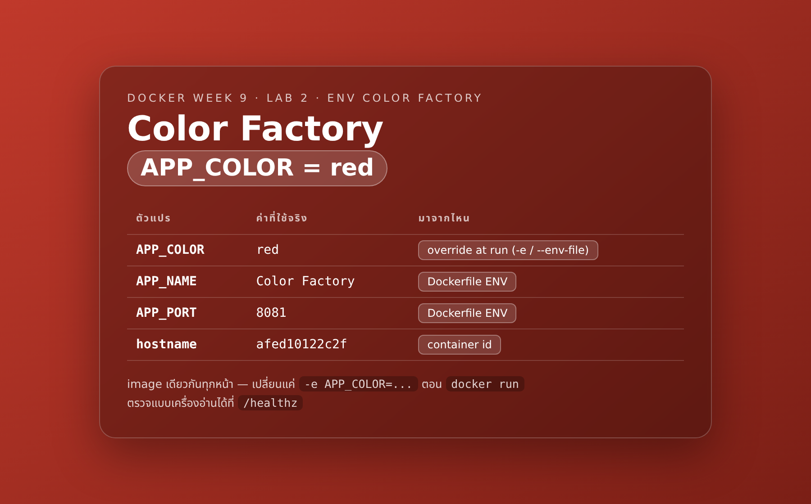
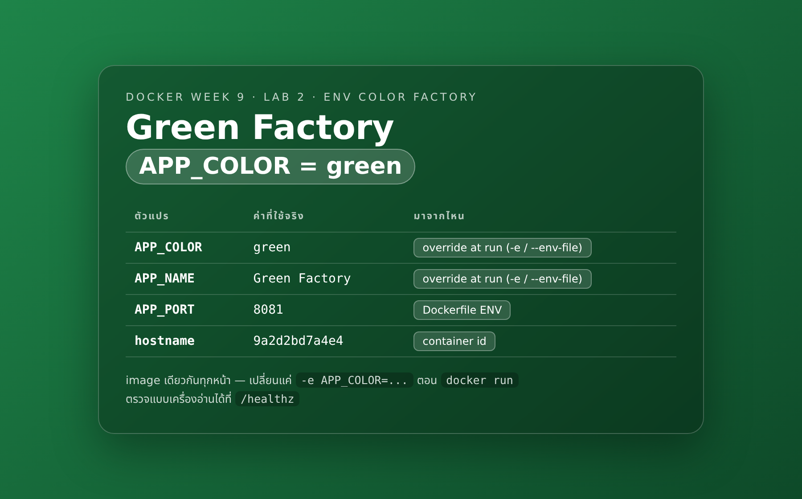
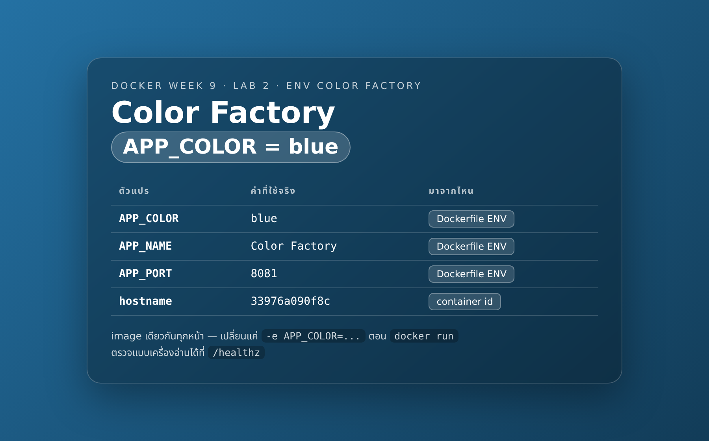

# LAB 2 — โรงงานสี : image เดียว หลายบุคลิก

> โฟลเดอร์ `002_LAB_Env_Color_Factory` = **LAB 2** ในสไลด์ `Docker_Week09_Slides.html`

## สิ่งที่จะได้เรียนรู้

- `docker build -t <ชื่อ>:<tag> <โฟลเดอร์>` สร้าง image จาก Dockerfile แล้วตั้งชื่อ + tag ให้เรียกใช้ง่าย
- **image เดียว รันได้หลายบุคลิก** — เปลี่ยนพฤติกรรมด้วย `-e KEY=VALUE` โดยไม่ต้อง build ใหม่
- `ENV` ใน Dockerfile = ค่า default ของ image · `--env-file` = ยกชุดจากไฟล์ · `-e` = สั่งทับรายตัว
- **ลำดับความสำคัญ** ของ ENV ทั้ง 3 ชั้น และวิธี*พิสูจน์*ด้วย `docker inspect` ไม่ใช่แค่ท่องจำ
- อ่านค่า ENV ที่กล่องได้รับจริงด้วย `docker exec <กล่อง> env` และ `docker inspect --format`
- `docker image inspect` — อ่าน `Config.Env` / `Config.Cmd` / `Config.ExposedPorts` / `Architecture` / `Size` ของ **image**
- ⚠️ ENV และ `ARG` **ไม่ใช่ที่เก็บความลับ** — ใครก็ตามที่มี image อ่านได้หมดด้วย `docker inspect` / `docker history`

## ภาพรวมของแล็บนี้

1. **ตั้งคำถามก่อน** — อยากได้เว็บ 3 สี ต้อง build 3 image ไหม? จดคำตอบไว้ในใจก่อนลงมือ
2. **อ่านโค้ด** — แอป Flask อ่านสีจาก `os.environ` ไม่ได้ hard-code สีไว้ในโค้ด
   ทำให้ "โค้ดชุดเดียว" เปลี่ยนบุคลิกได้จากข้างนอก
3. **build หนึ่งครั้ง** — ได้ `color-app:1.0` หนึ่ง image เก็บไว้บนเครื่อง
4. **รัน 3 กล่องจาก image เดียวกัน** — แดง / เขียว / น้ำเงิน ต่างกันแค่ `-e APP_COLOR=...` และเลข port
   แล้วพิสูจน์ด้วย `docker inspect` ว่าทั้ง 3 กล่องชี้ไปที่ image ID เดียวกันเป๊ะ
5. **เปิดดูจริงในเบราว์เซอร์ 3 หน้า** — หน้าเว็บบอกด้วยว่าค่าที่ใช้อยู่ "มาจากไหน" (โค้ด / Dockerfile / ตอน run)
6. **ส่องเข้าไปในกล่อง** — `docker exec ... env` และ `docker inspect --format '{{json .Config.Env}}'`
   เห็นรายการ ENV ที่กล่องได้รับจริง ๆ
7. **ยกชุดด้วย `--env-file`** — ย้าย config ออกจากบรรทัดคำสั่งไปไว้ในไฟล์ `.env`
8. **แข่งกันสามชั้น** — กล่องเดียวที่มีทั้ง `ENV` ใน Dockerfile + `--env-file` + `-e` ใครชนะ พิสูจน์ให้เห็น
9. **inspect ที่ตัว image** — ดูว่า image พก ENV/CMD/EXPOSE อะไรติดตัวมาบ้าง ก่อนจะรันด้วยซ้ำ
10. **บทเรียนความปลอดภัย** — สร้าง image ที่ "ทำผิด" แล้วงัดความลับออกมาจาก `docker history` ให้ดูกับตา
11. **เก็บกวาด** — ลบกล่อง ลบ image ลบเครื่องเรียน

---

## 0. เตรียมเครื่องเรียน

```bash
docker rm -f devtools-lab002
docker run -dit --name devtools-lab002 --privileged \
  -p 2223:22 -p 18021:8081 -p 18022:8082 -p 18023:8083 \
  tuchsanai/devtools:2569_1
ssh root@localhost -p 2223        # password : passwd
```

> 📝 **คำอธิบาย:** สร้าง "เครื่องเรียน" ที่มี Docker ติดตั้งไว้แล้ว เพื่อให้ทุกคนทำแล็บบนสภาพแวดล้อมเดียวกัน ·
> `docker rm -f devtools-lab002` ลบเครื่องเรียนตัวเก่าทิ้งก่อน (`-f` = force คือหยุดแล้วลบในคำสั่งเดียว ถ้ายังไม่เคยสร้างจะขึ้น error ว่าไม่พบ ปล่อยผ่านได้) ·
> `-dit` = รันเบื้องหลัง + เปิด stdin ค้างไว้ + มี terminal · `--privileged` ให้สิทธิ์พอที่จะรัน Docker ซ้อนข้างในได้ (Docker-in-Docker) ·
> `-p 2223:22` คือทางเข้า SSH · อีก **3 บรรทัด `-p`** คือทางออกของเว็บ 3 สีที่เราจะสร้างในแล็บนี้
> สิ่งที่ต้องดูคือคำสั่งที่ 2 ต้องคืน container ID ยาว ๆ กลับมา ถ้าขึ้น `port is already allocated` แปลว่ามีของเก่าค้างอยู่ ให้ลบทิ้งก่อน

> **แล็บนี้ใช้ port ของตัวเองเท่านั้น** — `2223` และ `18021/18022/18023`
> ห้ามใช้เลขของแล็บอื่น (LAB 1 ใช้ 2222/18081) มิฉะนั้นจะชนกันเวลาเปิดหลายแล็บพร้อมกัน

port ในแล็บนี้เดินทาง **2 ทอด** ให้เห็นภาพก่อน จะได้ไม่งงตอนเปิดเบราว์เซอร์ :

| เครื่องเรา | → เครื่องเรียน (`devtools-lab002`) | → ในกล่องแอป | หน้าเว็บ |
|---|---|---|---|
| `18021` | `8081` | `8081` | สีแดง (`color-red`) |
| `18022` | `8082` | `8081` | สีเขียว (`color-green`) |
| `18023` | `8083` | `8081` | สีน้ำเงิน (`color-blue`) |

สังเกตว่าฝั่งขวาสุดเป็น **`8081` เหมือนกันทั้งสามกล่อง** — เพราะเป็น image เดียวกัน แอปข้างในจึงฟัง port เดิมเสมอ
สิ่งที่ต่างกันคือเลข port ฝั่งเครื่องเรียนที่เราเลือกแมปเข้าไป

ตรวจว่า Docker ในเครื่องเรียนพร้อมใช้ :

```bash
docker --version
docker compose version
```

> 📝 **คำอธิบาย:** เช็กว่าในเครื่องเรียนมี Docker engine ให้ใช้จริงก่อนเริ่มแล็บ จะได้ไม่ไปเจอปัญหากลางทาง ·
> สังเกตว่าเป็น `docker compose` (เว้นวรรค) ไม่ใช่ `docker-compose` (ขีดกลาง) แบบขีดกลางคือรุ่นเก่าที่เลิกใช้แล้ว
> ถ้าคำสั่งใดขึ้น `command not found` แปลว่ายังไม่ได้อยู่ในเครื่องเรียน ให้ย้อนกลับไป `ssh` เข้าไปใหม่

✅ **Expected output** — ขอแค่ขึ้น "เลขเวอร์ชัน" ทั้งสองบรรทัดก็ถือว่าพร้อม (เลขเวอร์ชันของแต่ละคนอาจไม่ตรงกับเอกสารนี้):

```
Docker version 29.6.2, build dfc4efb
Docker Compose version v5.3.1
```

เข้าโฟลเดอร์ของแล็บ (ถ้ายังไม่เคย clone รีโพ ให้ clone ก่อน ทำครั้งเดียวใช้ได้ทุกแล็บ) :

```bash
mkdir -p ~/labwork ; cd ~/labwork
git clone https://github.com/Tuchsanai/DevTools.git
cd DevTools/03_Docker/02_Docker/002_LAB_Env_Color_Factory
ls -R app env secret-demo
```

> 📝 **คำอธิบาย:** ดึงไฟล์ของวิชาลงมาไว้บนดิสก์ของเครื่องเรียน แล้วเข้าไปยืนในโฟลเดอร์ของแล็บนี้ ·
> `ls -R` ไล่ดูไฟล์ในโฟลเดอร์ย่อยทั้งหมด เพื่อยืนยันว่าของครบก่อนเริ่ม
> **ต้องยืนอยู่ในโฟลเดอร์นี้ตลอดทั้งแล็บ** เพราะทุกคำสั่งข้างล่างอ้าง path แบบสัมพัทธ์ เช่น `app/` และ `env/red.env`

✅ **Expected output** — ต้องเห็นครบ 3 โฟลเดอร์ (`ls` ไม่โชว์ไฟล์ที่ขึ้นต้นด้วยจุด เช่น `app/.dockerignore` ให้ใช้ `ls -a app` ถ้าอยากเห็น):

```
app:
Dockerfile
app.py
requirements.txt

env:
green.env
red.env

secret-demo:
Dockerfile
```

---

## 1. คำถามก่อนเริ่ม

> **คำถามก่อนเริ่ม:** ถ้าลูกค้าสั่ง "ขอเว็บหน้าเดียวกันนี้ 3 สี — แดง เขียว น้ำเงิน"
> เราต้อง `docker build` กี่ครั้ง และได้ image กี่ตัว?

จดคำตอบไว้ในใจก่อน แล้วอ่านต่อ — ข้อ 4 จะพิสูจน์คำตอบด้วย `docker inspect` ว่าทั้ง 3 หน้าเว็บ
เกิดจาก image **ID เดียวกันเป๊ะ** หรือไม่

---

## 2. อ่านโค้ดก่อน : ทำไม config ต้องมาจากข้างนอก

หัวใจของแอปนี้อยู่แค่ไม่กี่บรรทัดใน `app/app.py` :

```python
CODE_DEFAULTS = {
    "APP_COLOR": "blue",
    "APP_NAME": "Color Factory",
    "APP_PORT": "8081",
}

runtime = os.environ.get(key)      # ← ค่ามาจาก environment variable
```

> 📝 **คำอธิบาย:** `os.environ.get(...)` คือการ "ขอค่าจากสิ่งแวดล้อม" ไม่ใช่การเขียนสีตายตัวไว้ในโค้ด ·
> ถ้าตอนรันไม่มีใครส่งค่ามา แอปจะใช้ค่า default ที่เตรียมไว้ (จะได้ไม่พังทันที) · แอปยังอ่าน `APP_NAME` และ `APP_PORT` ด้วยวิธีเดียวกัน
> หลักการนี้คือข้อ III ของ **12-Factor App** : *เก็บ config ไว้ใน environment* — สิ่งที่เปลี่ยนตามสภาพแวดล้อม
> (สี ชื่อ port URL ของฐานข้อมูล) ไม่ควรอยู่ในโค้ด เพราะจะทำให้ image ของ dev / staging / production ต่างกัน
> ทั้งที่ควรเป็นก้อนเดียวกัน — build ครั้งเดียว แล้วเอาไปตั้งค่าเอาทีหลัง

`app/Dockerfile` กำหนด "บุคลิกเริ่มต้น" ของ image ไว้ด้วย `ENV` :

```dockerfile
FROM python:3.12-slim

WORKDIR /app

# requirements ก่อน แล้วค่อย COPY โค้ด — layer ของ pip จะได้ถูก cache ไว้
COPY requirements.txt .
RUN pip install --no-cache-dir -r requirements.txt

COPY app.py .

# ค่า default ของ image (บุคลิกเริ่มต้นของโรงงาน)
ENV APP_COLOR=blue \
    APP_NAME="Color Factory" \
    APP_PORT=8081

EXPOSE 8081

CMD ["python", "app.py"]
```

> 📝 **คำอธิบาย:** `ENV` เขียนค่าติดไว้ใน image เลย ทุกกล่องที่เกิดจาก image นี้จะได้ค่าชุดนี้เป็นค่าตั้งต้น ·
> `EXPOSE 8081` เป็นเพียง **เอกสารประกอบ image** ว่าแอปฟัง port ไหน — ไม่ได้เปิด port ให้เอง ยังต้องใช้ `-p` ตอน `docker run` เสมอ ·
> `CMD ["python", "app.py"]` คือคำสั่งที่จะรันเมื่อกล่องเกิด
> (ไฟล์จริงมีอีก 1 บรรทัด `RUN python -c ...` ที่อบค่า ENV ตอน build ลงไฟล์ `build_defaults.json`
> เพื่อให้หน้าเว็บบอกได้ว่าค่าที่ใช้อยู่ "ถูก override หรือยัง" — เป็นลูกเล่นเพื่อการสอนเท่านั้น)

---

## 3. build : หนึ่งครั้ง หนึ่ง image

```bash
docker build -t color-app:1.0 app/
```

> 📝 **คำอธิบาย:** อ่าน `app/Dockerfile` แล้วประกอบออกมาเป็น image พร้อมตั้งชื่อให้ ·
> `-t color-app:1.0` = ตั้งชื่อ (`color-app`) และ tag (`1.0`) ถ้าไม่ใส่ tag Docker จะเติม `latest` ให้เอง ซึ่งอ่านย้อนหลังยากว่าเป็นเวอร์ชันไหน ·
> `app/` ตัวสุดท้ายคือ **build context** = โฟลเดอร์ที่จะถูกส่งให้ Docker ใช้ build (ไม่ใช่ path ของ Dockerfile)
> สิ่งที่ต้องดูคือบรรทัดท้าย ๆ ต้องมี `naming to docker.io/library/color-app:1.0` และไม่มี `ERROR`

✅ **Expected output** — ตัดบางส่วนออกให้เหลือแต่ใจความ (เลข digest / เวลา / ลำดับบรรทัดของแต่ละคนจะไม่ตรงกับเอกสารนี้ และถ้าเคยมี `python:3.12-slim` อยู่แล้วจะไม่เห็นบรรทัดดาวน์โหลด):

```
#1 [internal] load build definition from Dockerfile
#1 transferring dockerfile: 860B done
#1 DONE 0.0s

#3 [internal] load .dockerignore
#3 transferring context: 87B done
#3 DONE 0.0s

#5 [internal] load build context
#5 transferring context: 6.19kB done
#5 DONE 0.1s

#6 [2/6] WORKDIR /app
#6 DONE 0.1s

#7 [3/6] COPY requirements.txt .
#7 DONE 0.1s

#8 [4/6] RUN pip install --no-cache-dir -r requirements.txt
#8 1.754 Successfully installed Jinja2-3.1.6 MarkupSafe-3.0.3 Werkzeug-3.1.8 blinker-1.9.0 click-8.4.2 flask-3.1.0 itsdangerous-2.2.0
#8 DONE 1.9s

#9 [5/6] COPY app.py .
#9 DONE 0.1s

#11 exporting to image
#11 naming to docker.io/library/color-app:1.0 done
#11 DONE 1.0s
```

ดูของที่ได้ :

```bash
docker images color-app
```

> 📝 **คำอธิบาย:** ใส่ชื่อ repository ต่อท้ายเพื่อกรองให้เหลือเฉพาะ image ที่เราเพิ่งสร้าง ไม่ต้องไล่หาในรายการยาว ๆ ·
> Docker รุ่นใหม่แยก **DISK USAGE** (พื้นที่จริงบนดิสก์หลังแตกไฟล์แล้ว) ออกจาก **CONTENT SIZE** (ขนาดแบบบีบอัด = ปริมาณที่ต้องดาวน์โหลดจริงตอน `pull`)
> สิ่งที่ต้องดูคือมี `color-app:1.0` อยู่จริง 1 บรรทัด

✅ **Expected output** — `ID` และตัวเลขขนาดของแต่ละคนจะต่างกันเล็กน้อย:

```
IMAGE           ID             DISK USAGE   CONTENT SIZE   EXTRA
color-app:1.0   0fcb989cc8e7        197MB         48.2MB
```

ถ้าอยากได้ตารางหน้าตาแบบเดิม (คอลัมน์ REPOSITORY / TAG / IMAGE ID / SIZE) ใช้ `--format` :

```bash
docker images --format "table {{.Repository}}\t{{.Tag}}\t{{.ID}}\t{{.Size}}" color-app
```

> 📝 **คำอธิบาย:** `--format` สั่งให้ Docker พิมพ์เฉพาะฟิลด์ที่เราขอ ตามแม่แบบ Go template ·
> ขึ้นต้นด้วยคำว่า `table` เพื่อให้มีหัวตารางและจัดคอลัมน์ให้ · `\t` คือตัวคั่นคอลัมน์
> ท่านี้ใช้ได้กับ `docker ps` / `docker images` / `docker inspect` เหมือนกันหมด และจำเป็นมากเวลาต้องเอาผลไปต่อท่อกับ `grep`

✅ **Expected output**:

```
REPOSITORY   TAG       IMAGE ID       SIZE
color-app    1.0       0fcb989cc8e7   197MB
```

---

## 4. ผลิต 3 บุคลิกจาก image เดียว

```bash
docker run -d --name color-red   -e APP_COLOR=red                              -p 8081:8081 color-app:1.0
docker run -d --name color-green -e APP_COLOR=green -e APP_NAME="Green Factory" -p 8082:8081 color-app:1.0
docker run -d --name color-blue                                                -p 8083:8081 color-app:1.0
```

> 📝 **คำอธิบาย:** สามบรรทัดนี้เรียก image **ตัวเดียวกัน** ต่างกันแค่ค่าที่ส่งเข้าไปตอนรัน ·
> `-e KEY=VALUE` ยัด environment variable เข้าไปในกล่องตอนเกิด (ใส่กี่ตัวก็ได้ อย่างกล่องเขียวใส่ 2 ตัว) ·
> ค่าที่มีช่องว่างต้องครอบด้วย `"` เช่น `-e APP_NAME="Green Factory"` ·
> **กล่องน้ำเงินไม่ได้ใส่ `-e` เลย** — จงใจปล่อยให้ใช้ค่า `ENV APP_COLOR=blue` ที่ติดมากับ image ·
> `-p 8082:8081` ฝั่งซ้ายคือ port บนเครื่องเรียน (ห้ามซ้ำกัน) ฝั่งขวาคือ port ในกล่อง (เป็น `8081` เหมือนกันทุกกล่อง เพราะเป็น image เดียวกัน)
> สิ่งที่ต้องดูคือได้ container ID กลับมาบรรทัดละ 1 อัน ถ้าขึ้น `port is already allocated` ให้เปลี่ยนเลขฝั่งซ้าย หรือลบกล่องเก่าที่จองอยู่

✅ **Expected output** — สาม container ID (ของแต่ละคนจะไม่ซ้ำกับเอกสารนี้):

```
afed10122c2f49204bc089b95125748a052d208352db0a56cc4f4798810f2d6c
9a2d2bd7a4e4156d4e5240f12e2b6bf70ce6b5c42a6b50950a2dd56c83e1e2fa
33976a090f8cddbd3dfd3e3de3ee50d1854702f4d96f82f353f1b8035a46bc37
```

```bash
docker ps --format "table {{.Names}}\t{{.Image}}\t{{.Status}}\t{{.Ports}}"
```

> 📝 **คำอธิบาย:** ดูว่ากล่องทั้งสามขึ้นครบและจอง port ถูกตัวไหม ·
> ให้โฟกัสที่คอลัมน์ `IMAGE` — ทั้งสามบรรทัดต้องเป็น `color-app:1.0` เหมือนกัน นี่คือหลักฐานชิ้นแรกของคำถามข้อ 1
> ถ้ากล่องไหนหายไปจากรายการ แปลว่ามันดับ ให้ดูสาเหตุด้วย `docker ps -a` แล้ว `docker logs <ชื่อกล่อง>`

✅ **Expected output** — เวลาใน `STATUS` ของแต่ละคนจะต่างกัน:

```
NAMES         IMAGE           STATUS         PORTS
color-blue    color-app:1.0   Up 2 seconds   0.0.0.0:8083->8081/tcp, [::]:8083->8081/tcp
color-green   color-app:1.0   Up 2 seconds   0.0.0.0:8082->8081/tcp, [::]:8082->8081/tcp
color-red     color-app:1.0   Up 3 seconds   0.0.0.0:8081->8081/tcp, [::]:8081->8081/tcp
```

### เฉลยคำถามก่อนเริ่ม — พิสูจน์ด้วย image ID

```bash
docker inspect --format '{{.Name}} -> {{.Image}}' color-red color-green color-blue
```

> 📝 **คำอธิบาย:** ถาม Docker ตรง ๆ ว่ากล่องแต่ละใบเกิดจาก image ตัวไหน ·
> `.Image` ในผลของ `docker inspect` **container** คือ image ID (sha256) ที่กล่องนั้นถูกสร้างมา ไม่ใช่แค่ชื่อ tag ที่เปลี่ยนได้ ·
> ใส่ชื่อกล่องหลายตัวต่อกันได้ในคำสั่งเดียว Docker จะพิมพ์ทีละบรรทัด
> สิ่งที่ต้องดูคือ **sha256 ทั้งสามบรรทัดต้องเหมือนกันทุกตัวอักษร**

✅ **Expected output** — เลข sha256 ของแต่ละคนจะไม่ตรงกับเอกสารนี้ แต่ทั้ง 3 บรรทัดต้องเป็นเลขเดียวกัน:

```
/color-red -> sha256:0fcb989cc8e778dd78a932d25c49bde3e6acd897ea9a5d06690dde68abfdf68d
/color-green -> sha256:0fcb989cc8e778dd78a932d25c49bde3e6acd897ea9a5d06690dde68abfdf68d
/color-blue -> sha256:0fcb989cc8e778dd78a932d25c49bde3e6acd897ea9a5d06690dde68abfdf68d
```

**คำตอบ : build ครั้งเดียว ได้ image ตัวเดียว** — 3 หน้าเว็บที่หน้าตาต่างกันเกิดจาก image ID เดียวกันเป๊ะ
สิ่งที่ต่างคือ "ค่า" ที่ยัดเข้าไปตอนสร้างกล่องเท่านั้น

ตรวจซ้ำจากฝั่งแอปเองด้วย `/healthz` ซึ่งตอบเป็น JSON (เครื่องอ่านง่าย เอาไปใช้กับ monitoring ต่อได้) :

```bash
curl -s http://localhost:8081/healthz | python3 -m json.tool | head -6
curl -s http://localhost:8082/healthz | python3 -m json.tool | head -6
curl -s http://localhost:8083/healthz | python3 -m json.tool | head -6
```

> 📝 **คำอธิบาย:** ยิง HTTP เข้าไปที่ทั้งสาม port บนเครื่องเรียนเพื่อถามแอปว่า "ตอนนี้เธอเป็นสีอะไร และค่านั้นมาจากไหน" ·
> `-s` (silent) ปิดแถบความคืบหน้าของ `curl` · `python3 -m json.tool` จัด JSON ให้อ่านง่าย · `head -6` ตัดเอาเฉพาะบรรทัดที่เราสนใจ ·
> ฟิลด์ `app_color_source` คือของแถมเพื่อการสอน — แอปเทียบค่าที่ได้รับตอนรันกับค่าที่อบไว้ตอน build แล้วบอกว่าใครเป็นคนกำหนด
> สิ่งที่ต้องดูคือ 8081 ต้องเป็น `red`, 8082 เป็น `green`, 8083 เป็น `blue`

✅ **Expected output** — สามชุด สังเกตบรรทัด `app_color` และ `app_color_source` :

```
{
    "app_color": "red",
    "app_color_source": "override at run (-e / --env-file)",
    "app_name": "Color Factory",
    "app_name_source": "Dockerfile ENV",
    "app_port": "8081",
```

```
{
    "app_color": "green",
    "app_color_source": "override at run (-e / --env-file)",
    "app_name": "Green Factory",
    "app_name_source": "override at run (-e / --env-file)",
    "app_port": "8081",
```

```
{
    "app_color": "blue",
    "app_color_source": "Dockerfile ENV",
    "app_name": "Color Factory",
    "app_name_source": "Dockerfile ENV",
    "app_port": "8081",
```

อ่านตารางเทียบให้ชัด :

| กล่อง | สิ่งที่ใส่ตอน `run` | `app_color` | ที่มาของค่า |
|---|---|---|---|
| `color-red` | `-e APP_COLOR=red` | `red` | สั่งทับตอน run |
| `color-green` | `-e APP_COLOR=green -e APP_NAME="Green Factory"` | `green` | สั่งทับตอน run (ทั้งสีและชื่อ) |
| `color-blue` | *(ไม่ใส่อะไรเลย)* | `blue` | `ENV` ใน Dockerfile |

---

## 5. เปิดดูของจริงในเบราว์เซอร์

ให้ VS Code forward port ออกมาก่อน : แท็บ **PORTS** → **Forward a Port** → พิมพ์ `18021`
แล้วทำซ้ำกับ `18022` และ `18023` จากนั้นเปิด `http://localhost:18021` เป็นต้น

ทางเลือก : เจาะอุโมงค์เองจาก terminal บน **เครื่องเราเอง** (ไม่ใช่ในเครื่องเรียน) — แล็บนี้เปิด port ตรงออกมาแล้ว
จึงเปิด `http://localhost:18021` ได้เลยโดยไม่ต้องทำอะไรเพิ่ม ถ้าเครื่องเรียนอยู่คนละเครื่องกับเบราว์เซอร์ค่อยใช้ :

```bash
ssh -L 18021:localhost:8081 root@localhost -p 2223        # password : passwd
```

> 📝 **คำอธิบาย:** `-L 18021:localhost:8081` = เปิด port 18021 บนเครื่องเรา แล้วส่งต่อไปยัง `localhost:8081` ของเครื่องเรียน ·
> `-p 2223` คือ port SSH ของเครื่องเรียนที่เปิดไว้ในข้อ 0 · session นี้จะค้างไว้ ตราบใดที่ยังไม่ปิด อุโมงค์ก็ยังใช้ได้
> **ทดลองเสร็จแล้วปิด tunnel ทุกครั้ง** — พิมพ์ `exit` หรือกด `Ctrl+D` · ถ้าใช้ VS Code ให้คลิกขวาที่ port ในแท็บ **PORTS** → **Stop Forwarding Port**



*`http://localhost:18021` — `APP_COLOR` ถูกสั่งทับตอน run จึงขึ้นป้าย `override at run` ส่วน `APP_NAME` ยังเป็นค่าจาก Dockerfile*



*`http://localhost:18022` — กล่องนี้ใส่ `-e` ไป 2 ตัว ทั้งสีและชื่อจึงขึ้นป้าย `override at run` ทั้งคู่*



*`http://localhost:18023` — ไม่ได้ใส่ `-e` อะไรเลย ทุกค่าจึงมาจาก `ENV` ใน Dockerfile และแถวล่างสุดคือ container ID ที่ต่างกันทั้งสามหน้า*

**หน้าเว็บสามหน้านี้มาจาก image ก้อนเดียวกัน** — ถ้าต้องแก้โลโก้หรือแก้บั๊ก เรา build ครั้งเดียวแล้ว
ทั้งสามสีได้ของใหม่พร้อมกัน ไม่ต้องไล่ build ทีละสีให้เสี่ยงหลุดเวอร์ชัน

---

## 6. ส่องค่า ENV ที่กล่องได้รับจริง

```bash
docker exec color-red env | grep APP_
docker exec color-blue env | grep APP_
```

> 📝 **คำอธิบาย:** `env` คือคำสั่งมาตรฐานของ Linux ที่พิมพ์ environment variable ทั้งหมดของ process ·
> เอามาต่อท่อ `grep APP_` เพื่อกรองเอาเฉพาะของแอปเรา ไม่ต้องอ่าน `PATH` / `LANG` ที่ยาวเหยียด ·
> `docker exec` ต้องใช้กับกล่องที่ **กำลังรันอยู่** เท่านั้น ถ้ากล่องดับแล้วจะขึ้น error ทันที
> สิ่งที่ต้องดูคือ `color-red` ได้ `APP_COLOR=red` ส่วน `color-blue` ได้ `APP_COLOR=blue` ทั้งที่เราไม่ได้ใส่ `-e` ให้เลย

✅ **Expected output** — สังเกตว่าทั้งสองกล่องมีตัวแปรครบ 3 ตัวเหมือนกัน ต่างแค่ค่าของ `APP_COLOR`:

```
APP_COLOR=red
APP_NAME=Color Factory
APP_PORT=8081
```

```
APP_COLOR=blue
APP_NAME=Color Factory
APP_PORT=8081
```

ดูจากฝั่ง Docker เองบ้าง — ข้อมูลนี้อ่านได้แม้กล่องจะดับไปแล้ว :

```bash
docker inspect --format '{{json .Config.Env}}' color-red
```

> 📝 **คำอธิบาย:** `docker inspect` ตัวเต็มพ่น JSON ออกมาหลายร้อยบรรทัด ให้ใช้ `--format` ตักเอาเฉพาะกิ่งที่ต้องการ ·
> `{{json .Config.Env}}` = เอากิ่ง `Config.Env` (รายการ ENV ทั้งหมดของกล่อง) มาพิมพ์แบบ JSON บรรทัดเดียว ·
> ต่างจาก `docker exec env` ตรงที่อันนี้อ่านจาก **metadata ของกล่อง** จึงใช้ได้แม้กล่องจะ `Exited` ไปแล้ว
> สิ่งที่ต้องดูคือ `APP_COLOR=red` ถูกยกไปไว้ **หน้าสุด** ของรายการ และไม่มี `APP_COLOR=blue` ของ image หลงเหลืออยู่เลย

✅ **Expected output** — `GPG_KEY` / `PYTHON_VERSION` เป็นของที่ image `python:3.12-slim` ติดมา ไม่ใช่ของเรา (เวอร์ชันของแต่ละคนอาจต่างกัน):

```
["APP_COLOR=red","PATH=/usr/local/bin:/usr/local/sbin:/usr/local/bin:/usr/sbin:/usr/bin:/sbin:/bin","LANG=C.UTF-8","GPG_KEY=7169605F62C751356D054A26A821E680E5FA6305","PYTHON_VERSION=3.12.13","PYTHON_SHA256=c08bc65a81971c1dd5783182826503369466c7e67374d1646519adf05207b684","APP_NAME=Color Factory","APP_PORT=8081"]
```

### กับดักที่เจอบ่อย : เปลี่ยน ENV กลางทางไม่ได้

```bash
docker exec -e APP_COLOR=green color-red env | grep APP_COLOR
curl -s http://localhost:8081/healthz | python3 -m json.tool | head -3
```

> 📝 **คำอธิบาย:** `docker exec -e` ตั้ง environment variable ให้ **เฉพาะคำสั่งที่เรา exec เข้าไป** เท่านั้น ·
> คำสั่งแรกจึงพิมพ์ `green` ออกมาจริง ๆ (ดูเหมือนสำเร็จ!) แต่ process ของ Flask ที่รันอยู่ตั้งแต่กล่องเกิดไม่ได้รับรู้ด้วยเลย ·
> คำสั่งที่สองยิงเว็บซ้ำเพื่อยืนยันว่าแอปยังเป็น `red` เหมือนเดิม
> **ข้อสรุป : ENV ถูกกำหนดตอนสร้างกล่องเท่านั้น** อยากเปลี่ยนค่าต้อง `docker rm -f` แล้ว `docker run` ใหม่ — แต่ไม่ต้อง build ใหม่

✅ **Expected output** — สังเกตว่าอันบนเป็น `green` แต่อันล่างยังเป็น `red` :

```
APP_COLOR=green
```

```
{
    "app_color": "red",
    "app_color_source": "override at run (-e / --env-file)",
```

---

## 7. ยกชุดด้วย `--env-file`

พอตัวแปรเยอะขึ้น การพิมพ์ `-e` ต่อกันยาวเป็นหางว่าวจะเริ่มพลาดง่าย ให้ย้ายไปไว้ในไฟล์แทน :

```bash
cat env/red.env
```

> 📝 **คำอธิบาย:** ไฟล์ env มีกติกาง่าย ๆ คือ **หนึ่งบรรทัด หนึ่งตัวแปร** รูปแบบ `KEY=VALUE` ·
> บรรทัดที่ขึ้นต้นด้วย `#` คือคอมเมนต์ Docker จะข้ามให้ · ห้ามเว้นวรรครอบ `=` และ **ห้ามครอบค่าด้วยเครื่องหมายคำพูด**
> เพราะ Docker จะนับเครื่องหมายนั้นเป็นส่วนหนึ่งของค่า (ต่างจากไวยากรณ์ของ shell)
> ไฟล์แบบนี้ห้ามใส่ความลับแล้ว commit ขึ้น git เด็ดขาด — ปกติจะใส่ชื่อไว้ใน `.gitignore`

✅ **Expected output**:

```
# env-file: หนึ่งบรรทัดหนึ่งตัวแปร รูปแบบ KEY=VALUE
# ห้ามใส่เครื่องหมาย " " ครอบค่า เพราะ Docker จะถือว่าเครื่องหมายเป็นส่วนหนึ่งของค่า
APP_COLOR=red
APP_NAME=Red Factory
```

```bash
docker run -d --name color-envfile --env-file env/red.env -p 8084:8081 color-app:1.0
curl -s http://localhost:8084/healthz | python3 -m json.tool | head -6
```

> 📝 **คำอธิบาย:** `--env-file <path>` อ่านไฟล์แล้วยัดทุกบรรทัดเข้าไปเป็น ENV ของกล่อง เทียบเท่ากับพิมพ์ `-e` ทีละตัว ·
> กล่องนี้ใช้ port `8084` ซึ่ง**ไม่ได้** map ออกไปนอกเครื่องเรียน จึงทดสอบด้วย `curl` จากในเครื่องเรียนเท่านั้น (ไม่ต้องเปิดเบราว์เซอร์)
> สิ่งที่ต้องดูคือ `app_name` เปลี่ยนเป็น `Red Factory` ตามที่เขียนไว้ในไฟล์ — ยืนยันว่าไฟล์ถูกอ่านจริง

✅ **Expected output** — บรรทัดแรกที่ `docker run` พ่นออกมาคือ container ID ยาว ๆ (ของแต่ละคนไม่ซ้ำกัน) ข้างล่างนี้แสดงเฉพาะผลของ `curl`:

```
{
    "app_color": "red",
    "app_color_source": "override at run (-e / --env-file)",
    "app_name": "Red Factory",
    "app_name_source": "override at run (-e / --env-file)",
    "app_port": "8081",
```

| วิธี | เหมาะกับ |
|---|---|
| `-e KEY=VALUE` | ค่า 1–2 ตัวที่เปลี่ยนบ่อย หรือสั่งทับเฉพาะกิจ |
| `--env-file file.env` | ค่าหลายตัวเป็นชุด แยกไฟล์ตามสภาพแวดล้อม (`dev.env` / `prod.env`) |
| `ENV` ใน Dockerfile | ค่า default ที่ไม่ค่อยเปลี่ยน และไม่ใช่ความลับ |

> **ลองเอง:** ในโฟลเดอร์ยังมีอีกไฟล์คือ `env/green.env` (`APP_COLOR=green` + `APP_NAME=Green Factory`)
> ลองรันอีกกล่องด้วย `--env-file env/green.env` แล้วเทียบผลกับกล่องข้างบน — อย่าลืมเปลี่ยน **ชื่อกล่อง** และ **เลข port ฝั่งซ้าย** ให้ไม่ซ้ำของเดิม
> และจำกล่องที่สร้างเพิ่มไว้ด้วย จะได้ลบทิ้งตอน Cleanup

---

## 8. ลำดับความสำคัญ : ใครชนะ

ทฤษฎีคือ `ENV` ใน Dockerfile → ถูกทับด้วย `--env-file` → ถูกทับด้วย `-e`
แต่อย่าเพิ่งเชื่อ **ให้รันกล่องที่มีครบทั้งสามชั้นแล้วดูผลจริง** :

```bash
docker run -d --name color-boss --env-file env/red.env -e APP_COLOR=pink -p 8085:8081 color-app:1.0
curl -s http://localhost:8085/healthz | python3 -m json.tool | head -6
```

> 📝 **คำอธิบาย:** กล่องนี้มีสามเสียงที่พยายามกำหนด `APP_COLOR` พร้อมกัน — image บอก `blue` · ไฟล์บอก `red` · `-e` บอก `pink` ·
> ส่วน `APP_NAME` มีสองเสียงคือ image บอก `Color Factory` และไฟล์บอก `Red Factory`
> สิ่งที่ต้องดูคือ `app_color` ออกมาเป็นอะไร และ `app_name` ออกมาเป็นอะไร

✅ **Expected output** — (บรรทัด container ID จาก `docker run` ตัดออก แสดงเฉพาะผลของ `curl`) · `-e` ชนะเรื่องสี ส่วนชื่อไม่มี `-e` มาแข่ง ไฟล์จึงชนะ image:

```
{
    "app_color": "pink",
    "app_color_source": "override at run (-e / --env-file)",
    "app_name": "Red Factory",
    "app_name_source": "override at run (-e / --env-file)",
    "app_port": "8081",
```

ดูจากในกล่องซ้ำอีกที ว่า process ได้รับค่าอะไรไปจริง ๆ :

```bash
docker exec color-boss env | grep APP_
```

> 📝 **คำอธิบาย:** ถามจากมุมของ **process ที่รันอยู่ในกล่อง** ว่าจริง ๆ แล้วมันได้ค่าอะไรไปใช้ ·
> ตอน Linux แปลงรายการ ENV ให้เป็น environment ของ process ตัวแปรชื่อซ้ำจะเหลือค่าเดียว
> สิ่งที่ต้องดูคือ `APP_COLOR` เหลือค่าเดียวคือ `pink` (ค่า `red` จากไฟล์หายไปแล้ว) ส่วน `APP_NAME` เป็น `Red Factory` ตามไฟล์

✅ **Expected output** — ในมุมของ process มี `APP_COLOR` แค่ค่าเดียวคือ `pink`:

```
APP_NAME=Red Factory
APP_COLOR=pink
APP_PORT=8081
```

แล้วดู "หลักฐานดิบ" ที่ Docker เก็บไว้ ซึ่งเป็นจุดที่คนส่วนใหญ่ไม่เคยเห็น :

```bash
docker inspect --format '{{json .Config.Env}}' color-boss
```

> 📝 **คำอธิบาย:** อ่านรายการ ENV ที่ Docker ประกอบไว้ให้กล่องนี้ ·
> สิ่งที่ต้องดูคือ **`APP_COLOR` โผล่มา 2 ครั้ง** — `red` จาก `--env-file` แล้วตามด้วย `pink` จาก `-e`
> Docker ต่อรายการตามลำดับ แล้ว Linux ให้ **ตัวหลังสุดชนะ** ตอนแปลงเป็น environment ของ process จริง
> นี่คือกลไกจริงเบื้องหลังคำว่า "ลำดับความสำคัญ" — ไม่ใช่กฎลึกลับ แต่เป็นแค่ "ใครต่อท้ายทีหลัง"
> และสังเกตว่า `APP_COLOR=blue` ของ image หายไปเลย เพราะถูกแทนที่ตั้งแต่ชั้นแรก

✅ **Expected output** — โฟกัสที่ `"APP_COLOR=red"` และ `"APP_COLOR=pink"` ที่อยู่ในรายการเดียวกัน:

```
["APP_COLOR=red","APP_NAME=Red Factory","APP_COLOR=pink","PATH=/usr/local/bin:/usr/local/sbin:/usr/local/bin:/usr/sbin:/usr/bin:/sbin:/bin","LANG=C.UTF-8","GPG_KEY=7169605F62C751356D054A26A821E680E5FA6305","PYTHON_VERSION=3.12.13","PYTHON_SHA256=c08bc65a81971c1dd5783182826503369466c7e67374d1646519adf05207b684","APP_PORT=8081"]
```

| ชั้น | ใครกำหนด | ชนะ/แพ้ ในกล่อง `color-boss` |
|---|---|---|
| 1 (ล่างสุด) | `CODE_DEFAULTS` ในโค้ด | ไม่ได้ใช้ เพราะมีค่าจากข้างนอกมาแล้ว |
| 2 | `ENV` ใน Dockerfile → `blue` | **แพ้** |
| 3 | `--env-file env/red.env` → `red` | **แพ้** (แต่ชนะเรื่อง `APP_NAME`) |
| 4 (บนสุด) | `-e APP_COLOR=pink` | **ชนะ** |

---

## 9. `docker inspect` ที่ตัว image

ที่ผ่านมาเรา inspect *กล่อง* — คราวนี้ inspect *image* เพื่อดูว่ามันพกอะไรติดตัวมาบ้าง **ก่อนจะรันด้วยซ้ำ** :

```bash
docker image inspect color-app:1.0 | head -30
```

> 📝 **คำอธิบาย:** `docker image inspect` (หรือ `docker inspect` ตามด้วยชื่อ image) พ่นข้อมูลของ image ออกมาเป็น JSON ยาวมาก
> จึงต่อท้ายด้วย `| head -30` เพื่อดูแค่ช่วงต้นที่มีของสำคัญ ·
> ให้ดู 4 กิ่งนี้ : `Config.ExposedPorts` (แอปฟัง port ไหน) · `Config.Env` (ค่าตั้งต้น) · `Config.Cmd` (คำสั่งที่จะรัน) · `Config.WorkingDir`
> ประโยชน์จริง : ได้ image แปลกหน้ามาจาก Docker Hub แล้วอยากรู้ว่าต้องเปิด port อะไร ตั้ง ENV ตัวไหน — ดูจากตรงนี้ได้เลยไม่ต้องเดา

✅ **Expected output** — `Id` และ `Created` ของแต่ละคนจะต่างกัน:

```
[
    {
        "Id": "sha256:0fcb989cc8e778dd78a932d25c49bde3e6acd897ea9a5d06690dde68abfdf68d",
        "RepoTags": [
            "color-app:1.0"
        ],
        "RepoDigests": [
            "color-app@sha256:0fcb989cc8e778dd78a932d25c49bde3e6acd897ea9a5d06690dde68abfdf68d"
        ],
        "Comment": "buildkit.dockerfile.v0",
        "Created": "2026-08-12T19:27:32.399173669+07:00",
        "Config": {
            "ExposedPorts": {
                "8081/tcp": {}
            },
            "Env": [
                "PATH=/usr/local/bin:/usr/local/sbin:/usr/local/bin:/usr/sbin:/usr/bin:/sbin:/bin",
                "LANG=C.UTF-8",
                "GPG_KEY=7169605F62C751356D054A26A821E680E5FA6305",
                "PYTHON_VERSION=3.12.13",
                "PYTHON_SHA256=c08bc65a81971c1dd5783182826503369466c7e67374d1646519adf05207b684",
                "APP_COLOR=blue",
                "APP_NAME=Color Factory",
                "APP_PORT=8081"
            ],
            "Cmd": [
                "python",
                "app.py"
            ],
            "WorkingDir": "/app",
```

อ่านทีละกิ่งด้วย `--format` จะเร็วกว่ามาก :

```bash
docker image inspect --format '{{json .Config.Env}}' color-app:1.0
docker image inspect --format '{{json .Config.Cmd}}' color-app:1.0
docker image inspect --format '{{json .Config.ExposedPorts}}' color-app:1.0
docker image inspect --format 'arch={{.Architecture}}  os={{.Os}}  size={{.Size}} bytes  workdir={{.Config.WorkingDir}}' color-app:1.0
```

> 📝 **คำอธิบาย:** สี่ท่านี้คือ "สูตรสำเร็จ" ที่ควรจำไว้ใช้งานจริง ·
> `{{json .X}}` พิมพ์กิ่งนั้นเป็น JSON · แม่แบบบรรทัดสุดท้ายผสมข้อความกับหลายฟิลด์ในบรรทัดเดียวได้ ·
> `.Architecture` สำคัญมากเวลาสลับเครื่อง Mac (arm64) กับ server (amd64) — image ผิดสถาปัตยกรรมจะรันไม่ขึ้นหรือช้าผิดปกติ ·
> `.Size` มีหน่วยเป็น **byte** ต้องแปลงเอง — `48162906` bytes ≈ 48.2 MB ซึ่งตรงกับคอลัมน์ CONTENT SIZE ในข้อ 3 (Docker คิดแบบฐานสิบ 1 MB = 1,000,000 bytes)
> สังเกตว่า `Config.Env` ของ image **ไม่มี** `APP_COLOR=red` เพราะค่านั้นเกิดตอน `docker run` ไม่ได้อยู่ใน image

✅ **Expected output** — สี่บรรทัด (ค่า `PYTHON_VERSION` `size` และ `arch` ของแต่ละคนอาจต่างกัน โดยเฉพาะบน Mac จะได้ `arch=arm64`):

```
["PATH=/usr/local/bin:/usr/local/sbin:/usr/local/bin:/usr/sbin:/usr/bin:/sbin:/bin","LANG=C.UTF-8","GPG_KEY=7169605F62C751356D054A26A821E680E5FA6305","PYTHON_VERSION=3.12.13","PYTHON_SHA256=c08bc65a81971c1dd5783182826503369466c7e67374d1646519adf05207b684","APP_COLOR=blue","APP_NAME=Color Factory","APP_PORT=8081"]
["python","app.py"]
{"8081/tcp":{}}
arch=amd64  os=linux  size=48162906 bytes  workdir=/app
```

---

## 10. ⚠️ ENV ไม่ใช่ที่เก็บความลับ

เมื่อ config ย้ายมาอยู่ใน ENV หมด คนมักเผลอเอา password / token ใส่ตามไปด้วย
มาดูกันว่าทำไมถึงไม่ควร โดยจงใจสร้าง image ที่ "ทำผิด" ขึ้นมาหนึ่งตัว :

```bash
cat secret-demo/Dockerfile
```

> 📝 **คำอธิบาย:** เปิดดู Dockerfile ตัวอย่างที่จงใจเขียนผิดก่อน จะได้รู้ว่าเดี๋ยวเราจะไปงัดอะไรออกมา ·
> `ARG` คือตัวแปรที่มีชีวิตอยู่ **เฉพาะตอน build** ส่วน `ENV` ติดไปกับ image ตอนรันด้วย ·
> หลายคนเข้าใจว่า `ARG` "หายไปแล้ว" หลัง build เสร็จ จึงเอาความลับใส่ใน `ARG` — ข้อนี้จะพิสูจน์ว่าเข้าใจผิด
> สิ่งที่ต้องดูคือบรรทัด `ARG DB_PASSWORD` (บรรทัดที่ 5) และ `ENV API_TOKEN` (บรรทัดที่ 6) ซึ่งจะไปโผล่ในคำเตือนของ BuildKit ต่อไป

✅ **Expected output** — ค่าทั้งสองเป็นค่าสมมติสำหรับสอนเท่านั้น:

```
# ตัวอย่าง "วิธีที่ผิด" — ใช้สาธิตว่า ARG/ENV ไม่ใช่ที่เก็บความลับ
# ค่าทั้งสองบรรทัดนี้เป็นค่าสมมติสำหรับสอนเท่านั้น ห้ามใส่ค่าจริงลงใน Dockerfile
FROM alpine:3.21

ARG DB_PASSWORD=not-a-real-password-1234
ENV API_TOKEN=not-a-real-token-abcd

RUN echo "building with DB_PASSWORD=$DB_PASSWORD" > /build.log

CMD ["sh", "-c", "echo leaky image"]
```

```bash
docker build -t leaky:1.0 secret-demo/ 2>&1 | grep -a "SecretsUsedInArgOrEnv" | sed "s/\x1b\[[0-9;]*m//g"
```

> 📝 **คำอธิบาย:** build ตามปกติ แล้วกรองเอาเฉพาะคำเตือนของ BuildKit ·
> `2>&1` รวม stderr เข้ากับ stdout เพื่อให้ `grep` มองเห็นคำเตือนได้ (คำเตือนออกทาง stderr) · `-a` บอก `grep` ให้อ่านทุกอย่างเป็นข้อความ เพราะ log ของ build มีรหัสสีปนอยู่ ·
> ท่อสุดท้าย `sed "s/\x1b\[[0-9;]*m//g"` ถอด **รหัสสี ANSI** ที่ BuildKit แทรกมาออก ให้เหลือตัวอักษรล้วน ๆ ตรงกับที่พิมพ์ไว้ข้างล่างนี้
> (ถ้าไม่ใส่ท่อนี้ก็อ่านได้เหมือนกัน แต่จะมีอักขระควบคุมปนเวลา copy ไปวางที่อื่น) ·
> **Docker เตือนเราเองตั้งแต่ตอน build แล้ว** ว่าห้ามใช้ `ARG`/`ENV` เก็บข้อมูลอ่อนไหว — คนส่วนใหญ่แค่เลื่อนผ่านไป
> ลำดับของสองบรรทัดที่ออกมาอาจสลับกันได้

✅ **Expected output**:

```
 - SecretsUsedInArgOrEnv: Do not use ARG or ENV instructions for sensitive data (ARG "DB_PASSWORD") (line 5)
 - SecretsUsedInArgOrEnv: Do not use ARG or ENV instructions for sensitive data (ENV "API_TOKEN") (line 6)
```

ทีนี้มาเป็นคนที่ได้ image นี้ไป (เช่นโหลดจาก registry) แล้วลองงัดดู :

```bash
docker image inspect --format '{{json .Config.Env}}' leaky:1.0
docker history --no-trunc --format "table {{.CreatedBy}}" leaky:1.0
```

> 📝 **คำอธิบาย:** สองคำสั่งนี้ไม่ต้องรัน container เลยสักครั้ง แค่มีไฟล์ image อยู่ในมือก็อ่านได้ ·
> `docker history` แสดง **คำสั่งที่ใช้สร้างแต่ละ layer** เรียงจากใหม่ไปเก่า · `--no-trunc` สั่งไม่ให้ตัดข้อความยาว ๆ ทิ้ง (ค่า default จะตัด) ·
> สิ่งที่ต้องดูคือ `API_TOKEN` โผล่ใน `Config.Env` และ **`DB_PASSWORD` ที่เป็น `ARG` ก็ยังโผล่ใน history ถึงสองที่**
> ทั้งบรรทัด `ARG` และบรรทัด `RUN` ที่หยิบค่าไปใช้ — ลบไม่ได้ด้วย เพราะมันคือประวัติของ layer

✅ **Expected output** — สองก้อน ค่าลับที่ "น่าจะหายไปแล้ว" ยังอยู่ครบ:

```
["PATH=/usr/local/sbin:/usr/local/bin:/usr/sbin:/usr/bin:/sbin:/bin","API_TOKEN=not-a-real-token-abcd"]
```

```
CREATED BY
CMD ["sh" "-c" "echo leaky image"]
RUN |1 DB_PASSWORD=not-a-real-password-1234 /bin/sh -c echo "building with DB_PASSWORD=$DB_PASSWORD" > /build.log # buildkit
ENV API_TOKEN=not-a-real-token-abcd
ARG DB_PASSWORD=not-a-real-password-1234
CMD ["/bin/sh"]
ADD alpine-minirootfs-3.21.7-x86_64.tar.gz / # buildkit
```

> ⚠️ **ห้ามใส่ password / API key / private key ลงใน `ENV` หรือ `ARG` ของ Dockerfile เด็ดขาด**
> ใครก็ตามที่ `docker pull` image ของเราไปได้ ก็อ่านค่าเหล่านั้นได้ทันทีโดยไม่ต้องรัน
> และการ "ลบบรรทัดนั้นออกแล้ว build ใหม่" ไม่ช่วยกับ image ก้อนเก่าที่ push ขึ้นไปแล้ว

| ระดับความลับ | เก็บที่ไหน |
|---|---|
| ไม่ลับ (สี ชื่อแอป log level) | `ENV` ใน Dockerfile ได้เลย |
| ลับปานกลาง เปลี่ยนตามสภาพแวดล้อม | ส่งตอนรันด้วย `-e` / `--env-file` และไม่ commit ไฟล์นั้นขึ้น git |
| ลับจริง (password, token, private key) | ระบบจัดการ secret ของ orchestrator หรือ `--mount=type=secret` ตอน build — **ไม่แตะ `ENV`/`ARG`** |

---

## สรุป

| สิ่งที่พิสูจน์ได้ในแล็บนี้ | หลักฐาน |
|---|---|
| image เดียวรันได้หลายบุคลิก | `docker inspect --format '{{.Image}}'` ของ 3 กล่อง ให้ sha256 เดียวกัน |
| `-e` ชนะ `--env-file` ชนะ `ENV` | `Config.Env` ของ `color-boss` มี `APP_COLOR` ซ้ำ 2 ค่า ตัวหลังสุดชนะ |
| ENV กำหนดตอนสร้างกล่องเท่านั้น | `docker exec -e` เปลี่ยนค่าให้เฉพาะคำสั่งนั้น เว็บยังสีเดิม |
| image พก ENV/CMD/EXPOSE ติดตัว | `docker image inspect --format` อ่านได้ก่อนรัน |
| ENV/ARG ไม่ใช่ที่เก็บความลับ | `docker history --no-trunc` เห็น `ARG DB_PASSWORD` เต็ม ๆ |

---

## Cleanup (บังคับ)

เก็บกวาดในเครื่องเรียนก่อน :

```bash
docker rm -f color-red color-green color-blue color-envfile color-boss
docker rmi color-app:1.0 leaky:1.0
docker ps -a
docker images
```

> 📝 **คำอธิบาย:** `docker rm -f` ใส่ชื่อหลายตัวติดกันได้ในคำสั่งเดียว (`-f` = หยุดแล้วลบเลย ไม่ต้อง `docker stop` ก่อน) ·
> ต้องลบ **กล่องก่อน image** เสมอ ถ้าลบสลับกันจะขึ้น error ว่า image ถูกใช้งานโดย container อยู่ ·
> สองคำสั่งท้ายคือการยืนยันว่าไม่มีอะไรค้าง
> หมายเหตุ : `docker images` ในเครื่องเรียนจะว่างเปล่า เพราะ BuildKit เก็บ base image ไว้ใน build cache ไม่ได้อยู่ในรายการ image

✅ **Expected output** — ชื่อกล่องที่ถูกลบ · บรรทัด `Untagged`/`Deleted` · แล้วตารางว่างสองใบ (sha256 ของแต่ละคนจะต่างกัน):

```
color-red
color-green
color-blue
color-envfile
color-boss
```

```
Untagged: color-app:1.0
Deleted: sha256:0fcb989cc8e778dd78a932d25c49bde3e6acd897ea9a5d06690dde68abfdf68d
Untagged: leaky:1.0
Deleted: sha256:6c21fbac6bd16b78ca34f66374d0dce7458bfebd58fce7e9ac35f5bd5ab5081c
```

```
CONTAINER ID   IMAGE     COMMAND   CREATED   STATUS    PORTS     NAMES
```

```
IMAGE   ID             DISK USAGE   CONTENT SIZE   EXTRA
```

ออกจากเครื่องเรียนแล้วลบเครื่องเรียนทิ้ง (พิมพ์บน terminal ของ **เครื่องเราเอง**) :

```bash
exit
docker rm -f devtools-lab002
docker ps -a --filter "name=^devtools-"
```

> 📝 **คำอธิบาย:** `exit` ออกจาก SSH ก่อน แล้วค่อยลบกล่องเครื่องเรียน ซึ่งจะคืน port `2223` / `18021` / `18022` / `18023` ให้เครื่องเรา ·
> `--filter "name=^devtools-"` กรองเอาเฉพาะกล่องที่ชื่อขึ้นต้นด้วย `devtools-` (`^` คือ "ขึ้นต้นด้วย") เพื่อยืนยันว่าไม่มีเครื่องเรียนของแล็บไหนค้างอยู่
> ต้องเห็นแค่หัวตารางเปล่า ๆ ถ้ายังมีบรรทัดของแล็บอื่นอยู่แปลว่ายังทำแล็บนั้นค้างไว้ อย่าเพิ่งลบทิ้ง

> ⚠️ **อย่าใช้** `docker rm -f $(docker ps -aq)` บนเครื่องของตัวเอง — มันลบ **ทุก container** บนเครื่อง
> รวมถึงของเพื่อนร่วมทีมหรือของงานอื่นที่รันอยู่ ให้ลบเจาะจงเป็นชื่อเสมอ

---

## ตรวจความเข้าใจ

1. อยากเปลี่ยนเว็บจากสีแดงเป็นสีชมพู ต้อง `docker build` ใหม่ไหม? ต้องทำอะไรบ้าง?
2. `ENV APP_COLOR=blue` ใน Dockerfile กับ `-e APP_COLOR=red` ตอน `docker run` — ใครชนะ และพิสูจน์ด้วยคำสั่งอะไร?
3. `EXPOSE 8081` ใน Dockerfile ทำให้เข้าเว็บจากเครื่องเราได้เลยหรือไม่?
4. ทีมงานส่ง `prod.env` ที่มี `DB_PASSWORD` มาให้ แล้วบอกว่า "ใส่เป็น `ENV` ใน Dockerfile ไปเลยจะได้ไม่ต้องพิมพ์ทุกครั้ง" ควรตอบว่าอย่างไร?
5. `docker exec color-red env` กับ `docker inspect --format '{{json .Config.Env}}' color-red` ต่างกันตรงไหน?

<details>
<summary>เฉลย</summary>

1. **ไม่ต้อง build ใหม่** เพราะสีไม่ได้อยู่ในโค้ดหรือใน image — ให้ลบกล่องเดิมแล้วสร้างใหม่จาก image เดิม :
   `docker rm -f color-red` แล้ว `docker run -d --name color-red -e APP_COLOR=pink -p 8081:8081 color-app:1.0`
   (ENV แก้กลางทางไม่ได้ ต้องสร้างกล่องใหม่ — ดูข้อ 6) จะ build ใหม่ก็ต่อเมื่อ **โค้ดหรือ dependency** เปลี่ยนเท่านั้น
2. **`-e` ชนะ** เพราะ Docker ต่อรายการ ENV ตามลำดับ image → env-file → `-e` แล้วตัวหลังสุดมีผลจริง ·
   พิสูจน์ด้วย `docker inspect --format '{{json .Config.Env}}' color-boss` จะเห็น `APP_COLOR` ปรากฏสองครั้ง (`red` แล้วตามด้วย `pink`)
   และ `docker exec color-boss env | grep APP_` จะเห็นค่าที่ process ได้รับจริงคือ `pink` ค่าเดียว
3. **ไม่ได้** — `EXPOSE` เป็นแค่เอกสารบอกว่า image นี้ตั้งใจฟัง port ไหน ไม่ได้เปิดทางเข้าให้จริง
   ต้องใช้ `-p <host>:<container>` ตอน `docker run` เสมอ (สังเกตว่ากล่องที่รันโดยไม่ใส่ `-p` จะเข้าไม่ได้แม้ image จะมี `EXPOSE`)
4. **ไม่ควรทำ** — ค่าที่ใส่ใน `ENV` (และแม้แต่ `ARG`) ติดอยู่ใน image ถาวร ใครที่ได้ image ไปก็อ่านได้ด้วย
   `docker image inspect` และ `docker history --no-trunc` โดยไม่ต้องรันด้วยซ้ำ (ดูข้อ 10) ·
   ทางที่ถูกคือส่งตอนรันด้วย `--env-file` ที่ไม่ commit ขึ้น git หรือใช้ระบบ secret ของ orchestrator
5. `docker exec` **ต้องให้กล่องรันอยู่** เพราะเป็นการเข้าไปสั่งคำสั่งใหม่ในกล่อง — ได้มุมมองของ process ซึ่ง `APP_COLOR` จะเหลือค่าเดียว ·
   ส่วน `docker inspect` อ่านจาก **metadata ที่ Docker เก็บไว้** ใช้ได้แม้กล่อง `Exited` ไปแล้ว และเห็นรายการดิบทั้งหมด
   รวมถึงค่าที่ซ้ำกันซึ่งถูกทับไปแล้ว

</details>

---

*ผลลัพธ์ทุกบล็อกในเอกสารนี้มาจากการรันจริงในเครื่องเรียน `tuchsanai/devtools:2569_1` (Docker 29.6.2) เมื่อ 12 ส.ค. 2026 —*
*บันทึกดิบทั้งชุดอยู่ที่ `evidence/transcript.md`*
