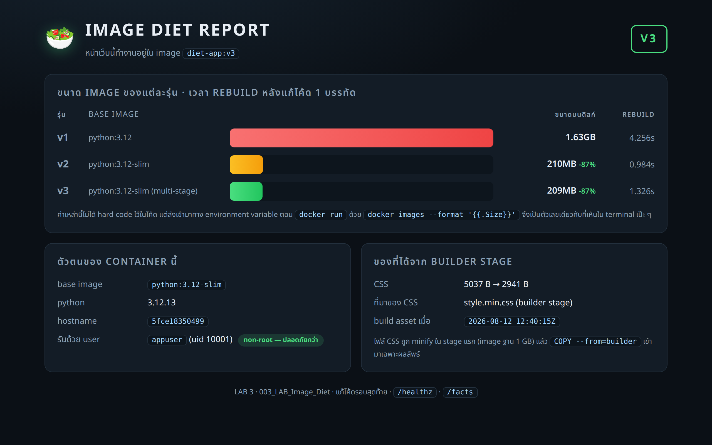

# LAB 3 — ลดน้ำหนัก image

> โฟลเดอร์ `003_LAB_Image_Diet` = **LAB 3** ในสไลด์ `Docker_Week09_Slides.html`

## สิ่งที่จะได้เรียนรู้

- image ประกอบด้วย **layer** เรียงซ้อนกัน และ Docker เก็บ **cache** ไว้ทีละ layer
- **ลำดับบรรทัดใน Dockerfile** เปลี่ยนเวลาที่ต้องรอ build จริง ๆ (วัดเป็นวินาทีให้เห็น)
- `.dockerignore` ลดทั้ง **build context** ที่ต้องส่ง และ **ขนาด image** ที่ได้
- **multi-stage build** — ใช้เครื่องมือหนัก 1.6 GB ตอน build แต่ image สุดท้ายเหลือ 209 MB
- รันแอปด้วย **non-root user** และใส่ `HEALTHCHECK` ให้ Docker รู้ว่าแอปยังดีอยู่ไหม
- อ่าน `docker image history` เป็น — layer ไหนกินพื้นที่เท่าไร
- ทำไมต้อง **pin เวอร์ชัน** ของ dependency (จะเห็นตัวอย่างที่เวอร์ชันเปลี่ยนเองกับตา)

## ภาพรวมของแล็บนี้

1. **เตรียมของหนักให้เหมือนโปรเจกต์จริง** — สร้างโฟลเดอร์ dataset ~46 MB กับไฟล์ log 5 MB
   ไว้ในโปรเจกต์ แล้ว "ปิด" `.dockerignore` ไว้ก่อน เพื่อให้เห็นโลกก่อนมีมัน
2. **build v1 (แบบมือใหม่)** — `FROM python:3.12` + `COPY . .` ก่อน `pip install` + รันเป็น root
   ได้ image **1.74 GB** จดเวลาที่ใช้ไว้
3. **แก้โค้ด 1 บรรทัด แล้ว build v1 ใหม่** — cache พังตั้งแต่ `COPY` ทำให้ `pip install` ต้องทำงานใหม่ทั้งชุด
4. **build v2 (เรียง layer ใหม่)** — `COPY requirements.txt` → `pip install` → ค่อย `COPY` โค้ด
   แก้โค้ดบรรทัดเดิมอีกครั้ง คราวนี้ layer ของ pip ขึ้น `CACHED` เวลา build หายไปเกินครึ่ง
5. **เปิด `.dockerignore`** — เทียบ "ส่ง context 47.21MB" กับ "ส่ง 15.44kB" และ image 304MB → 210MB
6. **build v3 (multi-stage + non-root + healthcheck)** — stage แรกใช้ base 1.6 GB ทำงานหนัก
   stage สองหยิบไปเฉพาะผลลัพธ์ พิสูจน์ด้วย `docker run --rm diet-app:v3 whoami` → `appuser`
7. **อ่าน `docker image history`** ของ v1 กับ v3 ทีละ layer แล้วสรุปเป็นตารางเดียว
8. **รัน v3 จริง** เปิดเว็บที่ port 18031 ซึ่งหน้าเว็บจะรายงานขนาด image ของทั้ง 3 รุ่นให้ดู

> แล็บนี้ใช้ terminal เดียวตลอด ไม่ต้องเปิดหลายหน้าต่าง

---

## 0. เตรียมเครื่องเรียน

```bash
docker rm -f devtools-lab003
docker run -dit --name devtools-lab003 --privileged -p 2224:22 -p 18031:8080 tuchsanai/devtools:2569_1
ssh root@localhost -p 2224        # password : passwd
```

> 📝 **คำอธิบาย:** สามคำสั่งนี้เตรียม "เครื่องเรียน" ที่มี Docker ติดตั้งมาให้แล้ว ทุกคนจะได้ทำแล็บบนสภาพแวดล้อมเดียวกัน ·
> `docker rm -f devtools-lab003` ลบเครื่องเรียนตัวเก่าทิ้งก่อน (`-f` = force คือหยุดแล้วลบในคำสั่งเดียว ถ้ายังไม่เคยสร้างจะขึ้น error ว่าไม่พบ ปล่อยผ่านได้) ·
> `-dit` = `-d` รันเบื้องหลัง + `-i` เปิด stdin ค้างไว้ + `-t` ให้มี terminal รวมกันแล้วกล่องจะไม่ดับทันที ·
> `--privileged` ให้สิทธิ์เต็มเพื่อรัน Docker ซ้อนข้างในกล่อง (Docker-in-Docker) ซึ่งจำเป็นกับแล็บนี้ ·
> `-p 2224:22` คือช่อง SSH ของแล็บนี้ · `-p 18031:8080` คือช่องเว็บ : port 18031 ของเครื่องเรา → port 8080 ในเครื่องเรียน
> ถ้าขึ้น `port is already allocated` แปลว่ามีของเก่าค้างอยู่ ให้ลบกล่องที่จอง port นั้นก่อน

> ใน VS Code ใช้ **Remote-SSH** ต่อไปที่ `root@localhost:2224` แล้วทำแล็บทั้งหมดข้างใน

ตรวจว่า Docker ในเครื่องเรียนพร้อมใช้ :

```bash
docker --version
docker compose version
```

> 📝 **คำอธิบาย:** เช็กว่าในเครื่องเรียนมี Docker engine ให้ใช้จริงก่อนเริ่ม จะได้ไม่ไปเจอปัญหากลางทาง ·
> สังเกตว่าเป็น `docker compose` (เว้นวรรค) ไม่ใช่ `docker-compose` (ขีดกลาง) แบบขีดกลางคือรุ่นเก่าที่เลิกใช้แล้ว
> ถ้าขึ้น `command not found` แปลว่ายังไม่ได้อยู่ในเครื่องเรียน ให้ย้อนไป `ssh` เข้าไปใหม่

✅ **Expected output** — ขอแค่ขึ้นเลขเวอร์ชันทั้งสองบรรทัด (เลขของแต่ละคนอาจไม่ตรงกับเอกสารนี้):

```
Docker version 29.6.2, build dfc4efb
Docker Compose version v5.3.1
```

---

## 1. เข้าโฟลเดอร์แล็บ และดูของที่มี

ถ้ายังไม่เคย clone รีโพ ให้ clone ก่อน (ทำครั้งเดียว ใช้ได้ทุกแล็บ) :

```bash
mkdir -p ~/labwork ; cd ~/labwork
git clone https://github.com/Tuchsanai/DevTools.git
cd DevTools/03_Docker/02_Docker/003_LAB_Image_Diet
ls -a; echo "---- app ----"; ls -l app; echo "---- requirements ----"; cat app/requirements.txt
```

> 📝 **คำอธิบาย:** ดึงไฟล์ของวิชาลงมาไว้บนดิสก์ของเครื่องเรียน แล้วเข้าไปยืนในโฟลเดอร์ของแล็บนี้ ·
> `ls -a` ต้องเห็น `.dockerignore` (ขึ้นต้นด้วยจุด = ไฟล์ซ่อน ถ้าใช้ `ls` เฉย ๆ จะไม่เห็น) ·
> ในโฟลเดอร์มี **Dockerfile 3 ใบ** อยู่ที่ `v1/` `v2/` `v3/` แต่ใช้ **โค้ดชุดเดียวกัน** ใน `app/`
> **ต้องยืนอยู่ในโฟลเดอร์นี้ตลอดทั้งแล็บ** เพราะทุกคำสั่ง `docker build` ใช้ `.` (โฟลเดอร์ปัจจุบัน) เป็น build context

✅ **Expected output** — ขอให้เห็นครบ : `.dockerignore` · `app/` · `v1/` `v2/` `v3/` (ขนาดไฟล์และเวลาของแต่ละคนจะต่างกัน):

```
.
..
.dockerignore
.gitignore
app
v1
v2
v3
---- app ----
total 28
-rw-r--r-- 1 root root 8264 Aug 12 19:38 app.py
-rw-r--r-- 1 root root 1820 Aug 12 19:25 build_assets.py
-rw-r--r-- 1 root root   68 Aug 12 19:25 requirements.txt
-rw-r--r-- 1 root root 5037 Aug 12 19:38 style.css
---- requirements ----
flask==3.1.0
gunicorn==23.0.0
requests==2.32.3
python-dotenv==1.0.1
```

> **หมายเหตุ :** ผลลัพธ์ข้างบนจับมาจากสำเนาที่มีเฉพาะ "ไฟล์ทำงาน" ของแล็บ ถ้า clone มาจากรีโพจริงจะเห็น
> `README.md` · `images/` · `evidence/` เพิ่มมาด้วย — ทั้งสามอย่างถูกกันไว้ใน `.dockerignore` แล้ว
> จึงไม่มีผลกับ image ที่ build ได้ แต่ตัวเลข `du -sh .` และ `transferring context` ของเครื่องคุณจะมากกว่าในเอกสารนี้เล็กน้อย

| ไฟล์ | หน้าที่ |
|---|---|
| `app/app.py` | เว็บ Flask หน้าเดียว "IMAGE DIET REPORT" รายงานขนาด image + ตัวตนของ container |
| `app/style.css` | CSS ต้นฉบับ เขียนแบบอ่านง่าย มี comment เยอะ |
| `app/build_assets.py` | ขั้นตอน build : บีบ `style.css` → `static/style.min.css` (จะถูกเรียกใน stage แรกของ v3) |
| `app/requirements.txt` | dependency ที่ **pin เวอร์ชันไว้ครบ** |
| `v1/Dockerfile` | แบบมือใหม่ : base เต็ม + `COPY . .` ก่อน `pip install` + root |
| `v2/Dockerfile` | เรียง layer ใหม่ให้ cache ทำงาน + base ผอม |
| `v3/Dockerfile` | multi-stage + non-root + `HEALTHCHECK` |
| `.dockerignore` | รายชื่อไฟล์ที่ไม่ต้องส่งเข้า build context |

> **คำถามก่อนเริ่ม :** ถ้าเราแค่ **ย้ายบรรทัด `COPY` ขึ้น-ลง** ใน Dockerfile โดยไม่แตะโค้ดแอปเลย
> เวลาที่ใช้ build ใหม่จะเปลี่ยนไหม? และขนาด image จะเปลี่ยนไหม?
> เขียนคำตอบที่เดาไว้ในกระดาษก่อน แล้วเราจะวัดของจริงกันในข้อ 3–5

ดึง base image ทั้งสองตัวมาก่อน เพื่อให้เวลาที่จับได้ในข้อถัด ๆ ไปเป็น "เวลา build" ล้วน ๆ ไม่ปนเวลาโหลด :

```bash
docker pull python:3.12 | tail -3; docker pull python:3.12-slim | tail -3
```

> 📝 **คำอธิบาย:** `docker pull` ดึง image ลงมาเก็บไว้บนเครื่องก่อน จะได้ไม่ไปปนกับเวลาที่จับตอน build ·
> `| tail -3` ตัดให้เหลือ 3 บรรทัดท้ายพอ (บรรทัด `Digest:` / `Status:` / ชื่อเต็มของ image) ไม่ต้องดูรายการ layer ทั้งหมด
> สิ่งที่ต้องดูคือบรรทัด `Status:` ของทั้งสองตัว — จะขึ้น `Downloaded newer image` ถ้าเพิ่งโหลด หรือ `Image is up to date` ถ้าเคยมีอยู่แล้ว

✅ **Expected output** — digest ของแต่ละคนจะต่างกันตามวันที่ดึงมา:

```
Digest: sha256:dd4fe98ab39f91e936f8e7e7a65a3ce59ecfb11e32f9a125b3132779920ba7f7
Status: Image is up to date for python:3.12
docker.io/library/python:3.12
Digest: sha256:229a2c5bfa27522db7815ea81f9bed70af17ccb9de9fc7ad142b1877b5830d36
Status: Image is up to date for python:3.12-slim
docker.io/library/python:3.12-slim
```

```bash
docker images
```

> 📝 **คำอธิบาย:** `docker images` แสดง image ที่มีบนเครื่อง — Docker 29 เปลี่ยนหน้าตาตารางนี้ไปจากรุ่นเก่าแล้ว ·
> **DISK USAGE** = พื้นที่จริงที่กินบนดิสก์เครื่องนี้ · **CONTENT SIZE** = ขนาดที่ต้องดาวน์โหลด/อัปโหลดตอน push-pull (บีบอัดแล้ว)
> สิ่งที่ต้องดูคือ `python:3.12` ใหญ่กว่า `python:3.12-slim` เกือบ **9 เท่า** ทั้งที่เป็น Python เวอร์ชันเดียวกัน
> ส่วนต่างคือ compiler, header ของ C, เครื่องมือ build และเอกสาร ซึ่งแอปที่รันเสร็จแล้วไม่ได้ใช้เลย

✅ **Expected output** — สองบรรทัดของ image ฐาน (ตัวเลขของแต่ละคนอาจต่างกันตามวันที่ดึงมา):

```
IMAGE              ID             DISK USAGE   CONTENT SIZE   EXTRA
python:3.12        dd4fe98ab39f       1.62GB          429MB        
python:3.12-slim   229a2c5bfa27        179MB         45.4MB        
```

> ถ้าอยากได้ตารางหน้าตาแบบรุ่นเก่า (REPOSITORY / TAG / SIZE) ใช้
> `docker images --format "table {{.Repository}}\t{{.Tag}}\t{{.ID}}\t{{.Size}}"`

---

## 2. เตรียม "ของหนัก" ให้เหมือนโปรเจกต์จริง

โปรเจกต์จริงมักมีของที่ **ไม่ต้องเข้า image** ปนอยู่ในโฟลเดอร์ เช่น dataset, log, ไฟล์ที่ export ไว้
เราจะสร้างของพวกนั้นขึ้นมาเอง (ไม่ได้ commit ไว้ในรีโพ เพราะมันหนัก) :

```bash
mkdir -p app/assets
head -c 15M /dev/urandom > app/assets/dataset-01.bin
head -c 15M /dev/urandom > app/assets/dataset-02.bin
head -c 15M /dev/urandom > app/assets/dataset-03.bin
head -c 5M  /dev/urandom > debug.log
du -sh app/assets debug.log .
```

> 📝 **คำอธิบาย:** สร้างไฟล์ขยะขนาดใหญ่ด้วยข้อมูลสุ่ม เพื่อจำลอง dataset และ log ในโปรเจกต์จริง ·
> `head -c 15M /dev/urandom > ไฟล์` = อ่านข้อมูลสุ่ม 15 MB แล้วเขียนลงไฟล์ (ใช้ข้อมูลสุ่มเพราะบีบอัดไม่ลง ขนาดที่เห็นจึงเป็นขนาดจริง) ·
> `du -sh` = ดูขนาดรวมของแต่ละอย่าง (`-s` สรุปยอด `-h` อ่านง่ายเป็น MB/GB)
> บรรทัด `.` จะเหลือแค่ 68K เพราะ `du` **ไม่นับไฟล์ซ้ำ** ของที่นับไปแล้วในสองบรรทัดบนจะไม่ถูกนับอีก

✅ **Expected output** — ต้องได้ dataset ประมาณ 46 MB และ log 5 MB
(บรรทัด `.` ของเครื่องที่ clone มาจากรีโพจริงจะมากกว่า 68K อยู่บ้าง เพราะนับ `README.md` / `images/` / `evidence/` ด้วย):

```
46M	app/assets
5.0M	debug.log
68K	.
```

ตอนนี้ขอ **ปิด `.dockerignore` ไว้ก่อน** เพื่อให้เห็นว่าถ้าไม่มีมันจะเป็นอย่างไร (จะเปิดคืนในข้อ 5) :

```bash
mv .dockerignore .dockerignore.off
ls -a
```

> 📝 **คำอธิบาย:** เปลี่ยนชื่อไฟล์ให้ Docker หาไม่เจอ = เท่ากับยังไม่มี `.dockerignore` ในโปรเจกต์ ·
> ทำแบบนี้เพราะเราอยากได้ "ตัวเลขก่อน" ไว้เทียบกับ "ตัวเลขหลัง" ในข้อ 5 ·
> จำชื่อไฟล์ `.dockerignore.off` ไว้ให้ดี เดี๋ยวต้องย้ายกลับ
> สิ่งที่ต้องดูคือรายการไฟล์ต้องไม่มี `.dockerignore` แล้ว แต่มี `.dockerignore.off` แทน

✅ **Expected output**:

```
.
..
.dockerignore.off
.gitignore
app
debug.log
v1
v2
v3
```

---

## 3. v1 — Dockerfile แบบมือใหม่

```bash
cat v1/Dockerfile
```

> 📝 **คำอธิบาย:** อ่าน Dockerfile ก่อนสั่ง build เสมอ — จุดที่ต้องสังเกตมี 2 จุด ·
> จุดแรก `FROM python:3.12` คือ base image เต็มรูปแบบที่มี compiler และเครื่องมือ build ติดมาครบ (1.62 GB) ·
> จุดที่สอง `COPY . .` ถูกวางไว้ **ก่อน** `RUN pip install` ซึ่งจะกลายเป็นปัญหาใหญ่ในข้อ 4
> และสังเกตว่า `pip install flask gunicorn requests python-dotenv` ไม่ได้ระบุเวอร์ชันเลยสักตัว

✅ **Expected output** — ตัด comment ภาษาไทยด้านบนของไฟล์ออกให้เหลือแต่คำสั่ง:

```
FROM python:3.12

WORKDIR /app

COPY . .

RUN pip install flask gunicorn requests python-dotenv

ENV APP_VARIANT=v1 \
    BASE_IMAGE=python:3.12 \
    APP_PORT=8080

EXPOSE 8080

CMD ["python", "app/app.py"]
```

สั่ง build พร้อมจับเวลา :

```bash
time docker build -f v1/Dockerfile -t diet-app:v1 .
```

> 📝 **คำอธิบาย:** `docker build` สร้าง image จาก Dockerfile · `-f v1/Dockerfile` บอกว่าจะใช้ Dockerfile ใบไหน ·
> `-t diet-app:v1` ตั้งชื่อ:แท็กให้ image · จุดท้ายสุด `.` คือ **build context** = โฟลเดอร์ที่จะถูกส่งไปให้ Docker engine ทั้งก้อน ·
> `time` (คำสั่งของ shell) จะพิมพ์เวลาที่ใช้ทั้งหมดต่อท้ายให้ ดูที่บรรทัด `real`
> สิ่งที่ต้องจ้องมี 2 บรรทัด : `transferring context` ส่งไปกี่ MB และ `real` ใช้เวลากี่วินาที

✅ **Expected output** — ตัดมาเฉพาะบรรทัดสำคัญ (เวลาและ digest ของแต่ละคนจะไม่ตรงกับเอกสารนี้ ถ้าเน็ตช้ากว่านี้ ขั้น `pip install` จะนานกว่านี้มาก):

```
#5 [internal] load build context
#5 transferring context: 52.46MB 0.1s done
#5 DONE 0.2s

#6 [2/4] WORKDIR /app
#6 DONE 0.1s

#7 [3/4] COPY . .
#7 DONE 0.1s

#8 [4/4] RUN pip install flask gunicorn requests python-dotenv
#8 DONE 2.7s

real	0m4.911s
```

**52.46MB** คือ dataset กับ log ที่ถูกส่งเข้า build context ทั้งที่แอปไม่ได้ใช้เลยสักไบต์

```bash
docker images
```

> 📝 **คำอธิบาย:** ดูขนาดของ image ที่เพิ่ง build เทียบกับ base image ที่มันต่อยอดมา ·
> ให้เอา `diet-app:v1` (1.74GB) ไปลบกับ `python:3.12` (1.62GB) จะได้ส่วนที่ "เราเพิ่มเข้าไปเอง" ประมาณ 120 MB
> ซึ่งก็คือ dataset 46 MB + log 5 MB + lib ที่ pip ลงให้ + ค่าโสหุ้ยของ layer

✅ **Expected output** — image ID ของแต่ละคนจะไม่ซ้ำกัน:

```
IMAGE              ID             DISK USAGE   CONTENT SIZE   EXTRA
diet-app:v1        b235b5abeaa1       1.74GB          473MB        
python:3.12        dd4fe98ab39f       1.62GB          429MB        
python:3.12-slim   229a2c5bfa27        179MB         45.4MB        
```

---

## 4. แก้โค้ด 1 บรรทัด แล้ว build ใหม่ — cache พังตั้งแต่ `COPY`

นี่คือสิ่งที่เกิดขึ้นจริงวันละหลายสิบครั้งตอนพัฒนา : แก้โค้ดนิดเดียวแล้ว build ใหม่

```bash
sed -i "s|LAB 3 · 003_LAB_Image_Diet|LAB 3 · 003_LAB_Image_Diet · แก้โค้ดรอบที่ 1|" app/app.py
grep -n "003_LAB_Image_Diet ·" app/app.py
```

> 📝 **คำอธิบาย:** แก้ข้อความท้ายหน้าเว็บใน `app/app.py` แค่บรรทัดเดียว ไม่ได้แตะ `requirements.txt` เลย ·
> `sed -i "s|ของเดิม|ของใหม่|"` = แทนที่ข้อความในไฟล์ทันที (`-i` = in-place) ใช้ `|` เป็นตัวคั่นเพื่อไม่ให้ชนกับ `/` ในข้อความ ·
> `grep -n` พิมพ์บรรทัดที่แก้พร้อมเลขบรรทัด เพื่อยืนยันว่าแก้เข้าจริง
> สิ่งที่ต้องดูคือคำว่า `แก้โค้ดรอบที่ 1` ต้องโผล่ในบรรทัดนั้น

✅ **Expected output** — เลขบรรทัดของแต่ละคนอาจต่างกันถ้าไฟล์ถูกแก้มาก่อน:

```
221:  <footer>LAB 3 · 003_LAB_Image_Diet · แก้โค้ดรอบที่ 1 · <code>/healthz</code> · <code>/facts</code></footer>
```

```bash
time docker build -f v1/Dockerfile -t diet-app:v1 . 2>&1 | grep -E "^#[0-9]+ \[|CACHED|^#[0-9]+ DONE|transferring context"
```

> 📝 **คำอธิบาย:** build ใหม่แล้วกรองให้เหลือเฉพาะ "หัวข้อของแต่ละขั้น" จะได้อ่านง่าย ·
> `2>&1` รวม stderr เข้ามาด้วยเพราะ BuildKit พิมพ์ log ออกทาง stderr · `grep -E "...|CACHED|..."` เก็บบรรทัดขั้นตอนและบรรทัดที่มีคำว่า `CACHED` ·
> **คำว่า `CACHED` คือหัวใจของข้อนี้** — ขั้นไหนขึ้น `CACHED` แปลว่า Docker ใช้ของเดิม ไม่ต้องทำใหม่
> สิ่งที่ต้องดูคือขั้น `COPY . .` และ `RUN pip install` **ไม่มีคำว่า CACHED**

✅ **Expected output** — สังเกตว่ามีแค่ `WORKDIR` ที่ CACHED ส่วน `pip install` ต้องทำใหม่ 2.7 วินาที:

```
#6 [2/4] WORKDIR /app
#6 CACHED
#7 [3/4] COPY . .
#7 DONE 0.1s
#8 [4/4] RUN pip install flask gunicorn requests python-dotenv
#8 DONE 2.7s
#9 DONE 1.3s

real	0m4.493s
```

**ทำไม `pip install` ถึงต้องทำใหม่ ทั้งที่เราไม่ได้แก้ `requirements.txt`?**

Docker cache ทำงานแบบ **โซ่** : ถ้า layer ที่ n เปลี่ยน layer ที่ n+1, n+2, … ทั้งหมดจะถูกทิ้งไปด้วย
เพราะแต่ละ layer สร้างต่อยอดจาก layer ก่อนหน้า

```
FROM python:3.12          <- เหมือนเดิม  -> CACHED
WORKDIR /app              <- เหมือนเดิม  -> CACHED
COPY . .                  <- app.py เปลี่ยน 1 ตัวอักษร -> cache พัง
RUN pip install ...       <- อยู่หลังบรรทัดที่พัง       -> ต้องทำใหม่ทั้งชุด
```

> 📌 **กฎที่ต้องจำ :** เรียงบรรทัดใน Dockerfile จาก **"สิ่งที่เปลี่ยนน้อยที่สุด" ไปหา "สิ่งที่เปลี่ยนบ่อยที่สุด"**
> — dependency เปลี่ยนเดือนละครั้ง แต่โค้ดเปลี่ยนวันละสิบครั้ง ดังนั้น dependency ต้องอยู่ **บน** โค้ดเสมอ

---

## 5. v2 — เรียง layer ใหม่ให้ cache ทำงาน

```bash
cat v2/Dockerfile
```

> 📝 **คำอธิบาย:** เทียบกับ v1 มีของเปลี่ยน 3 อย่าง ·
> หนึ่ง `FROM python:3.12-slim` — Python เวอร์ชันเดิม แต่ตัด compiler / เครื่องมือ build / man page ออก เหลือ 179 MB ·
> สอง แยก `COPY app/requirements.txt` ออกมาไว้ **ก่อน** `pip install` แล้วค่อย `COPY app/ ./app/` ทีหลัง ·
> สาม ใช้ `-r requirements.txt` ที่ pin เวอร์ชันไว้ทุกตัว แทนการพิมพ์ชื่อ lib ลอย ๆ
> สังเกตว่า **โค้ดแอปไม่ได้เปลี่ยนเลย** เปลี่ยนแค่ลำดับบรรทัดกับ base image

✅ **Expected output** — ตัด comment ภาษาไทยด้านบนของไฟล์ออกให้เหลือแต่คำสั่ง:

```
FROM python:3.12-slim

WORKDIR /app

COPY app/requirements.txt ./requirements.txt

RUN pip install -r requirements.txt

COPY app/ ./app/

ENV APP_VARIANT=v2 \
    BASE_IMAGE=python:3.12-slim \
    APP_PORT=8080

EXPOSE 8080

CMD ["python", "app/app.py"]
```

build ครั้งแรกของ v2 (ยังไม่มี cache ของ image นี้ จึงต้องลง lib ใหม่ตามปกติ) :

```bash
time docker build -f v2/Dockerfile -t diet-app:v2 . 2>&1 | grep -E "^#[0-9]+ \[|CACHED|^#[0-9]+ DONE|transferring context"
docker images
```

> 📝 **คำอธิบาย:** build ครั้งแรกยังไม่มีอะไรให้ cache ใช้ เวลาจึงพอ ๆ กับ v1 — ยังไม่ใช่จุดที่จะเห็นความต่าง ·
> จุดที่ต้องดูตอนนี้คือ **ขนาด image** ที่ตามมาใน `docker images`
> `diet-app:v2` = 304MB เทียบกับ `diet-app:v1` = 1.74GB ทั้งที่แอปทำงานเหมือนกันเป๊ะ

✅ **Expected output** — เวลาของแต่ละคนจะต่างกัน แต่ลำดับขั้นตอนต้องเหมือนกัน:

```
#7 [3/5] COPY app/requirements.txt ./requirements.txt
#7 DONE 0.1s
#8 [4/5] RUN pip install -r requirements.txt
#8 DONE 2.6s
#9 [5/5] COPY app/ ./app/
#9 DONE 0.1s
#10 DONE 1.4s

real	0m4.699s
```

```
IMAGE              ID             DISK USAGE   CONTENT SIZE   EXTRA
diet-app:v1        c7d1b6ed18f0       1.74GB          473MB        
diet-app:v2        58afc2374362        304MB         99.1MB        
python:3.12        dd4fe98ab39f       1.62GB          429MB        
python:3.12-slim   229a2c5bfa27        179MB         45.4MB        
```

ทีนี้ **แก้โค้ดบรรทัดเดิมอีกครั้ง** แล้ว build ใหม่ — นี่คือจุดวัดผลจริงของข้อนี้ :

```bash
sed -i "s|แก้โค้ดรอบที่ 1|แก้โค้ดรอบที่ 2|" app/app.py
time docker build -f v2/Dockerfile -t diet-app:v2 . 2>&1 | grep -E "^#[0-9]+ \[|CACHED|^#[0-9]+ DONE|transferring context"
```

> 📝 **คำอธิบาย:** ทำสิ่งเดียวกับข้อ 4 เป๊ะ ๆ (แก้ 1 บรรทัดในไฟล์เดิม) แต่คราวนี้ Dockerfile เรียงบรรทัดใหม่แล้ว ·
> ให้เทียบกับผลของข้อ 4 บรรทัดต่อบรรทัด
> สิ่งที่ต้องดูคือขั้น `RUN pip install` คราวนี้ขึ้น **CACHED** และเวลา `real` ที่หายไปเกินครึ่ง

✅ **Expected output** — pip ขึ้น `CACHED` เหลือแค่ `COPY app/` ที่ต้องทำใหม่
(บรรทัด `transferring context: 8.66kB` คือ BuildKit ส่งเฉพาะไฟล์ที่เปลี่ยน ไม่ได้ส่งทั้งโฟลเดอร์ใหม่):

```
#4 [internal] load build context
#4 transferring context: 8.66kB done
#4 DONE 0.0s
#6 [3/5] COPY app/requirements.txt ./requirements.txt
#6 CACHED
#7 [2/5] WORKDIR /app
#7 CACHED
#8 [4/5] RUN pip install -r requirements.txt
#8 CACHED
#9 [5/5] COPY app/ ./app/
#9 DONE 0.1s
#10 DONE 1.0s

real	0m1.459s
```

| แก้โค้ด 1 บรรทัด แล้ว build ใหม่ | เวลาที่ใช้ | `pip install` |
|---|---|---|
| v1 (`COPY . .` อยู่ก่อน `pip install`) | **4.493s** | ทำใหม่ทั้งชุด |
| v2 (`COPY requirements.txt` → `pip install` → `COPY` โค้ด) | **1.459s** | `CACHED` |

> เครื่องเรียนนี้เน็ตเร็วมาก `pip install` จึงใช้เวลาแค่ ~2.7 วินาที ในโปรเจกต์จริงที่มี `numpy`/`pandas`/`torch`
> ขั้นตอนนี้กินเวลา **หลายนาที** — การย้ายบรรทัด `COPY` ลงไปข้างล่างจึงคุ้มมากกว่าที่ตัวเลขในเอกสารนี้แสดง

**นี่คือคำตอบของคำถามก่อนเริ่ม** : ย้ายบรรทัด `COPY` มีผลจริง และผลอยู่ที่ *เวลา* ไม่ใช่ที่ *ขนาด*

---

## 6. `.dockerignore` — ของที่ไม่ควรเข้า image

เปิด `.dockerignore` กลับมา :

```bash
mv .dockerignore.off .dockerignore
cat .dockerignore
```

> 📝 **คำอธิบาย:** `.dockerignore` ทำงานคล้าย `.gitignore` แต่ใช้กับ **build context** — บอกว่าไฟล์ไหนไม่ต้องส่งให้ Docker engine ·
> ผลที่ได้มี 2 อย่างพร้อมกัน : ส่งข้อมูลน้อยลง (build เร็วขึ้น) และ `COPY` หยิบของขยะเข้า image ไม่ได้ (image เล็กลง) ·
> **ข้อควรระวัง :** ไฟล์นี้ใส่ comment ได้เฉพาะบรรทัดที่ขึ้นต้นด้วย `#` เท่านั้น
> ถ้าเขียน comment ต่อท้าย pattern เช่น `app/assets/   # dataset` คำว่า `# dataset` จะกลายเป็นส่วนหนึ่งของ pattern แล้ว ignore ไม่ทำงาน

✅ **Expected output** — ตัดมาเฉพาะบรรทัด pattern:

```
app/assets/
*.log
__pycache__/
*.pyc
.venv/
.git/
.gitignore
app/static/
README.md
images/
evidence/
```

build v2 ซ้ำอีกครั้ง (ไม่ได้แก้โค้ดเลย เปลี่ยนแค่มี `.dockerignore`) :

```bash
time docker build -f v2/Dockerfile -t diet-app:v2 . 2>&1 | grep -E "^#[0-9]+ \[|CACHED|^#[0-9]+ DONE|transferring context"
docker images
```

> 📝 **คำอธิบาย:** ขั้น `COPY app/ ./app/` ต้องทำใหม่ เพราะ "รายการไฟล์ที่จะ copy" เปลี่ยนไป (dataset หายไปจาก context) ·
> แต่คราวนี้ layer ที่ได้เล็กลงมาก เวลาจึงลดลงอีกจาก 1.459s เหลือ 0.753s
> สิ่งที่ต้องดูคือ `diet-app:v2` ใน `docker images` : **304MB → 210MB** โดยที่แอปยังทำงานเหมือนเดิมทุกอย่าง

✅ **Expected output**:

```
#8 [4/5] RUN pip install -r requirements.txt
#8 CACHED
#9 [5/5] COPY app/ ./app/
#9 DONE 0.1s
#10 DONE 0.3s

real	0m0.753s
```

```
IMAGE              ID             DISK USAGE   CONTENT SIZE   EXTRA
diet-app:v1        c7d1b6ed18f0       1.74GB          473MB        
diet-app:v2        a8b458a7bd3c        210MB         51.9MB        
python:3.12        dd4fe98ab39f       1.62GB          429MB        
python:3.12-slim   229a2c5bfa27        179MB         45.4MB        
```

### วัด build context กันตรง ๆ

BuildKit จำ context ที่เคยส่งไว้ได้ รอบถัด ๆ ไปจึงส่งเฉพาะไฟล์ที่เปลี่ยน (จะเห็นเลข `8.66kB` แบบเมื่อกี้)
ถ้าอยากเห็นเลข "ส่งทั้งก้อน" แบบเครื่องที่เพิ่ง clone มา (หรือแบบ CI ที่เริ่มจากศูนย์ทุกครั้ง)
ให้ทำการทดลองเล็ก ๆ นี้ — คัดลอกโปรเจกต์ไปสองที่ ที่หนึ่งไม่มี `.dockerignore` อีกที่หนึ่งมี :

```bash
rm -rf ~/ctx-off ~/ctx-on
mkdir -p ~/ctx-off ~/ctx-on
cp -a . ~/ctx-off/
cp -a . ~/ctx-on/
rm -f ~/ctx-off/.dockerignore
du -sh ~/ctx-off ~/ctx-on
```

> 📝 **คำอธิบาย:** `cp -a` คัดลอกทั้งโฟลเดอร์พร้อมสิทธิ์และเวลาไฟล์ (`-a` = archive) ·
> ต้องคัดลอกไป **นอกโฟลเดอร์แล็บ** เพราะ path ใหม่ = context ใหม่ในสายตา BuildKit จึงต้องส่งทั้งก้อนใหม่ ·
> ทั้งสองโฟลเดอร์มีไฟล์เท่ากันเป๊ะ ต่างกันแค่ `~/ctx-off` ไม่มี `.dockerignore`
> สิ่งที่ต้องดูคือ `du` บอกว่าทั้งสองโฟลเดอร์หนัก 51M เท่ากัน

✅ **Expected output**:

```
51M	/root/ctx-off
51M	/root/ctx-on
```

```bash
docker build -f v2/Dockerfile -t ctx:off ~/ctx-off 2>&1 | grep -A1 "load build context"
docker build -f v2/Dockerfile -t ctx:on  ~/ctx-on  2>&1 | grep -A1 "load build context"
docker images ctx
```

> 📝 **คำอธิบาย:** สั่ง build จากสองโฟลเดอร์นั้น แล้วกรองดูเฉพาะบรรทัด `load build context` กับบรรทัดถัดไป (`-A1` = after 1 line) ·
> ตัวเลข `transferring context` คือปริมาณข้อมูลที่ถูกส่งจากโฟลเดอร์เข้า Docker engine จริง ๆ
> สิ่งที่ต้องดูคือสองตัวเลขนี้ต่างกันประมาณ **3,000 เท่า** และ image ที่ได้ก็ต่างกัน 94 MB

✅ **Expected output** — ตัวเลขที่หายไปคือ `app/assets/` (45 MiB) กับ `debug.log`:

```
#5 [internal] load build context
#5 transferring context: 47.21MB 0.1s done
```

```
#5 [internal] load build context
#5 transferring context: 15.44kB done
```

```
IMAGE     ID             DISK USAGE   CONTENT SIZE   EXTRA
ctx:off   2a6166344743        304MB         99.1MB        
ctx:on    d2115fcebc4b        210MB         51.9MB        
```

เก็บกวาดของทดลองนี้ทิ้ง :

```bash
docker rmi ctx:off ctx:on
rm -rf ~/ctx-off ~/ctx-on
```

> 📝 **คำอธิบาย:** ลบ image สองตัวกับโฟลเดอร์สำเนาที่สร้างมาเพื่อการทดลองนี้โดยเฉพาะ ·
> `docker rmi` = remove image (คนละคำสั่งกับ `docker rm` ที่ลบ container)
> สิ่งที่ต้องดูคือมีบรรทัด `Untagged:` และ `Deleted:` ของทั้งสอง tag

---

## 7. v3 — multi-stage + non-root + healthcheck

```bash
cat v3/Dockerfile
```

> 📝 **คำอธิบาย:** Dockerfile ใบนี้มี `FROM` **สองครั้ง** = สอง stage ·
> stage แรกชื่อ `builder` (`FROM python:3.12 AS builder`) ใช้ base ตัวหนักได้เต็มที่ ติดตั้ง lib ลง virtualenv ที่ `/opt/venv` แล้วรัน `build_assets.py` เพื่อบีบไฟล์ CSS ·
> stage สองเริ่มใหม่จาก `python:3.12-slim` แล้ว `COPY --from=builder` หยิบมาเฉพาะ **ผลลัพธ์** คือ venv กับโฟลเดอร์ app ·
> `ENV PATH="/opt/venv/bin:$PATH"` ใน stage สอง คือกุญแจที่ทำให้ `python` หยิบ lib จาก venv ที่ copy มา (ไม่งั้นจะหา flask ไม่เจอ) ·
> `RUN useradd` + `USER appuser` ทำให้ process ในกล่องไม่ได้เป็น root · `HEALTHCHECK` บอก Docker ว่าจะเช็กสุขภาพแอปอย่างไร
> ของที่อยู่ใน stage แรกแต่ไม่ถูก `COPY --from` **จะไม่ตามไปกับ image สุดท้ายเลย**

✅ **Expected output** — ตัดมาเฉพาะโครง (ดูไฟล์เต็มได้ที่ `v3/Dockerfile`):

```
FROM python:3.12 AS builder
WORKDIR /build
RUN python -m venv /opt/venv
ENV PATH="/opt/venv/bin:$PATH"
COPY app/requirements.txt ./requirements.txt
RUN pip install --no-cache-dir -r requirements.txt
COPY app/ ./app/
RUN python app/build_assets.py

FROM python:3.12-slim
RUN useradd --create-home --uid 10001 appuser
WORKDIR /app
COPY --from=builder /opt/venv /opt/venv
COPY --from=builder /build/app/ ./app/
ENV PATH="/opt/venv/bin:$PATH" \
    PYTHONUNBUFFERED=1 \
    APP_VARIANT=v3 \
    BASE_IMAGE=python:3.12-slim \
    APP_PORT=8080
USER appuser
EXPOSE 8080
HEALTHCHECK --interval=10s --timeout=3s --start-period=5s --retries=3 \
    CMD python -c "import urllib.request as u; u.urlopen('http://127.0.0.1:8080/healthz')" || exit 1
CMD ["python", "app/app.py"]
```

```bash
time docker build -f v3/Dockerfile -t diet-app:v3 . 2>&1 | grep -E "^#[0-9]+ \[|CACHED|^#[0-9]+ DONE|transferring context|build_assets"
docker images
```

> 📝 **คำอธิบาย:** สังเกตว่า BuildKit ทำสอง stage **พร้อมกัน** ได้ (เลข `#` สลับไปมาระหว่าง `builder` กับ `stage-1`) เพราะมันวิเคราะห์แล้วว่าอันไหนไม่ต้องรอกัน ·
> บรรทัด `[build_assets] style.css 5037 B -> style.min.css 2941 B` คือผลของขั้นตอน build asset ที่รันอยู่ใน stage แรก
> สิ่งที่ต้องดูคือ `diet-app:v3` = 209MB ทั้งที่ stage แรกใช้ base 1.62 GB ทำงาน

✅ **Expected output** — เวลาและ ID ของแต่ละคนจะต่างกัน:

```
#13 [builder 5/7] RUN pip install --no-cache-dir -r requirements.txt
#13 DONE 1.7s
#14 [builder 6/7] COPY app/ ./app/
#14 DONE 0.1s
#15 [builder 7/7] RUN python app/build_assets.py
#15 0.273 [build_assets] style.css 5037 B -> style.min.css 2941 B
#15 DONE 0.3s
#16 [stage-1 4/5] COPY --from=builder /opt/venv /opt/venv
#16 DONE 0.2s
#17 [stage-1 5/5] COPY --from=builder /build/app/ ./app/
#17 DONE 0.1s

real	0m5.822s
```

```
IMAGE              ID             DISK USAGE   CONTENT SIZE   EXTRA
diet-app:v1        c7d1b6ed18f0       1.74GB          473MB        
diet-app:v2        a8b458a7bd3c        210MB         51.9MB        
diet-app:v3        76146f411612        209MB         50.3MB        
```

### stage แรกที่เราทิ้งไว้ข้างหลัง ใหญ่แค่ไหน?

```bash
docker build --target builder -f v3/Dockerfile -t diet-app:builder .
docker images
```

> 📝 **คำอธิบาย:** `--target builder` สั่งให้ build **หยุดที่ stage ชื่อ builder** แล้วเอา stage นั้นมาเป็น image เลย ·
> ปกติเราไม่ทำแบบนี้ (ทำเพื่อดูของเฉย ๆ) แต่มันมีประโยชน์จริงตอน debug ว่า stage แรกได้ไฟล์ครบไหม ·
> ตัวเลขที่ได้คือคำตอบว่า "ถ้าไม่ใช้ multi-stage แล้ว build ทุกอย่างในไฟล์เดียว จะได้ image ใหญ่แค่ไหน"
> สิ่งที่ต้องดูคือ `diet-app:builder` = 1.64GB เทียบกับ `diet-app:v3` = 209MB → เล็กลง **87%**

✅ **Expected output**:

```
IMAGE              ID             DISK USAGE   CONTENT SIZE   EXTRA
diet-app:builder   5182e3993079       1.64GB          420MB        
diet-app:v1        c7d1b6ed18f0       1.74GB          473MB        
diet-app:v2        a8b458a7bd3c        210MB         51.9MB        
diet-app:v3        76146f411612        209MB         50.3MB        
```

```bash
docker rmi diet-app:builder
```

> 📝 **คำอธิบาย:** ลบ image ของ stage แรกทิ้ง เพราะเราสร้างมันมาเพื่อดูตัวเลขเท่านั้น ·
> ตัว **cache** ของ stage แรกยังอยู่ในระบบ build cache นะ ไม่ได้หายไปด้วย การ build v3 รอบหน้าจึงยังเร็วเหมือนเดิม
> สิ่งที่ต้องดูคือมีบรรทัด `Untagged: diet-app:builder`

### พิสูจน์ว่า v3 ไม่ได้รันด้วย root

```bash
docker run --rm diet-app:v1 whoami
docker run --rm diet-app:v3 whoami
docker run --rm diet-app:v3 id
```

> 📝 **คำอธิบาย:** สั่งให้แต่ละ image รันคำสั่ง `whoami` แทนคำสั่งเริ่มต้นของมัน แล้วดูว่าใครคือเจ้าของ process ·
> `--rm` ลบ container ทิ้งทันทีที่คำสั่งจบ จะได้ไม่มีขยะค้าง · `id` แสดง uid/gid เต็ม ๆ ·
> ค่า `uid 10001` มาจาก `RUN useradd --create-home --uid 10001 appuser` ใน Dockerfile
> ถ้าแอปในกล่องโดนเจาะ การเป็น root ในกล่องคือจุดเริ่มต้นที่ดีของผู้โจมตี — non-root จึงเป็นค่าเริ่มต้นที่ควรทำทุกครั้ง

✅ **Expected output**:

```
root
appuser
uid=10001(appuser) gid=10001(appuser) groups=10001(appuser)
```

### ผลของการไม่ pin เวอร์ชัน

```bash
docker run --rm diet-app:v1 pip show flask 2>/dev/null | head -2
echo "--- v3 ---"
docker run --rm diet-app:v3 pip show flask 2>/dev/null | head -2
```

> 📝 **คำอธิบาย:** เช็กว่า Flask ที่ถูกติดตั้งจริงในแต่ละ image เป็นเวอร์ชันอะไร ·
> `pip show flask | head -2` เอาแค่ 2 บรรทัดแรก (ชื่อกับเวอร์ชัน) · `2>/dev/null` ซ่อนคำเตือนของ pip · `echo "--- v3 ---"` เป็นแค่เส้นคั่นให้อ่านผลง่าย ·
> v1 เขียนว่า `pip install flask` เฉย ๆ → pip หยิบ **ตัวใหม่ที่สุด ณ วันที่ build** มาให้ ·
> v3 อ่านจาก `requirements.txt` ที่เขียนว่า `flask==3.1.0` → ได้ 3.1.0 เสมอไม่ว่าจะ build วันไหน
> **นี่คือเหตุผลที่ "เครื่องผมรันได้ เครื่องคุณรันไม่ได้"** ยังเกิดขึ้นแม้จะใช้ Docker แล้ว ถ้าไม่ pin เวอร์ชัน

✅ **Expected output** — เลขเวอร์ชันฝั่ง v1 ของแต่ละคนจะต่างกันตามวันที่ build:

```
Name: Flask
Version: 3.1.3
--- v3 ---
Name: Flask
Version: 3.1.0
```

---

## 8. อ่าน layer ด้วย `docker image history`

```bash
docker image history diet-app:v1
```

> 📝 **คำอธิบาย:** แสดงทุก layer ของ image เรียงจากใหม่สุด (บน) ไปเก่าสุด (ล่าง) พร้อมขนาดของแต่ละ layer ·
> `<missing>` ในคอลัมน์ IMAGE ไม่ใช่ error — เป็นเรื่องปกติของ layer ที่ไม่ได้มี tag ของตัวเอง ·
> คอลัมน์ `CREATED BY` คือคำสั่งใน Dockerfile ที่สร้าง layer นั้น (ของ base image ก็แสดงด้วย)
> สิ่งที่ต้องดูคือ layer ก้อนโต ๆ ที่ล่างสุด — 694MB / 202MB / 134MB / 72.8MB คือของที่ `python:3.12` แถมมาให้ ไม่ใช่โค้ดเรา

✅ **Expected output** — ตัดมาบางส่วน (ID และเวลาของแต่ละคนจะต่างกัน):

```
IMAGE          CREATED          CREATED BY                                      SIZE      COMMENT
<missing>      23 seconds ago   RUN /bin/sh -c pip install flask gunicorn re…   25.8MB    buildkit.dockerfile.v0
<missing>      26 seconds ago   COPY . . # buildkit                             52.5MB    buildkit.dockerfile.v0
<missing>      7 days ago       RUN /bin/sh -c set -eux;   wget -O python.ta…   72.8MB    buildkit.dockerfile.v0
<missing>      7 days ago       RUN /bin/sh -c set -ex;  apt-get update;  ap…   694MB     buildkit.dockerfile.v0
<missing>      7 days ago       RUN /bin/sh -c set -eux;  apt-get update;  a…   202MB     buildkit.dockerfile.v0
<missing>      7 days ago       RUN /bin/sh -c set -eux;  apt-get update;  a…   65MB      buildkit.dockerfile.v0
<missing>      9 days ago       # debian.sh --arch 'amd64' out/ 'trixie' '@1…   134MB     debuerreotype 0.17
```

บรรทัด `COPY . . 52.5MB` คือ dataset กับ log ที่ถูกยัดเข้า image ตอนยังไม่มี `.dockerignore`

```bash
docker image history diet-app:v3
```

> 📝 **คำอธิบาย:** เทียบกับของ v1 บรรทัดต่อบรรทัด — จะเห็นว่าไม่มี layer 694MB / 202MB ของ base ตัวหนักแล้ว ·
> layer ที่เราสร้างเองเหลือแค่ 2 ก้อน : venv 24.8MB (lib ทั้งหมด) กับ app 53.2kB (โค้ดของเรา) ·
> `USER` / `EXPOSE` / `HEALTHCHECK` / `ENV` มีขนาด **0B** เพราะเป็นแค่ metadata ไม่ได้เพิ่มไฟล์
> สิ่งที่ต้องดูคือ layer ของ base ที่ล่างสุดเหลือ 87.4MB + 41.4MB + 4.95MB เท่านั้น

✅ **Expected output** — ตัดมาบางส่วน:

```
IMAGE          CREATED          CREATED BY                                      SIZE      COMMENT
<missing>      7 seconds ago    HEALTHCHECK {Test:[CMD-SHELL python -c "impo…   0B        buildkit.dockerfile.v0
<missing>      7 seconds ago    USER appuser                                    0B        buildkit.dockerfile.v0
<missing>      7 seconds ago    COPY /build/app/ ./app/ # buildkit              53.2kB    buildkit.dockerfile.v0
<missing>      7 seconds ago    COPY /opt/venv /opt/venv # buildkit             24.8MB    buildkit.dockerfile.v0
<missing>      11 seconds ago   RUN /bin/sh -c useradd --create-home --uid 1…   69.6kB    buildkit.dockerfile.v0
<missing>      7 days ago       RUN /bin/sh -c set -eux;   savedAptMark="$(a…   41.4MB    buildkit.dockerfile.v0
<missing>      7 days ago       RUN /bin/sh -c set -eux;  apt-get update;  a…   4.95MB    buildkit.dockerfile.v0
<missing>      9 days ago       # debian.sh --arch 'amd64' out/ 'trixie' '@1…   87.4MB    debuerreotype 0.17
```

> 💡 layer ที่ถูกสร้างแล้ว **ลบไฟล์ทีหลังไม่ทำให้ image เล็กลง** — ถ้า `RUN` แรกโหลดไฟล์ 500MB มา
> แล้ว `RUN` ถัดไปสั่ง `rm` ไฟล์นั้น ขนาด image ยังรวม 500MB อยู่ดี เพราะ layer เดิมถูกเก็บไว้ทั้งอัน
> ทางแก้คือ **ต่อคำสั่งไว้ใน `RUN` เดียวกันด้วย `&&`** หรือใช้ multi-stage แบบ v3

---

## 9. วัดใหม่ทั้งชุด แล้วสรุปเป็นตารางเดียว

ตอนนี้ทั้งสาม image อยู่ในเงื่อนไขเดียวกันหมดแล้ว (มี `.dockerignore` ครบ) วัดเวลา rebuild ใหม่อีกรอบ
ด้วยการแก้โค้ดบรรทัดเดิม 1 บรรทัดแล้ว build ทั้งสามใบติดกัน :

```bash
sed -i "s|แก้โค้ดรอบที่ 2|แก้โค้ดรอบสุดท้าย|" app/app.py
echo "----- v1 -----"; time docker build -f v1/Dockerfile -t diet-app:v1 . >/dev/null 2>&1
echo "----- v2 -----"; time docker build -f v2/Dockerfile -t diet-app:v2 . >/dev/null 2>&1
echo "----- v3 -----"; time docker build -f v3/Dockerfile -t diet-app:v3 . >/dev/null 2>&1
```

> 📝 **คำอธิบาย:** `> /dev/null 2>&1` โยน log ของ build ทิ้งทั้งหมด เหลือแต่ผลของ `time` เพื่อให้อ่านตัวเลขง่าย ·
> ทั้งสามใบเจอ "การแก้โค้ด 1 บรรทัด" เหมือนกันเป๊ะ ในเครื่องเดียวกัน ในนาทีเดียวกัน จึงเทียบกันได้ตรง ๆ ·
> v3 ช้ากว่า v2 นิดหน่อยเป็นเรื่องปกติ เพราะมันต้องรัน `build_assets.py` ใหม่และ `COPY --from` สองครั้ง
> สิ่งที่ต้องดูคือ v1 ช้ากว่า v2 ประมาณ **4 เท่า** ทั้งที่แก้โค้ดเท่ากัน

✅ **Expected output** — เวลาของแต่ละคนจะไม่ตรงกับเอกสารนี้ แต่ลำดับ v1 > v3 > v2 ควรเหมือนกัน:

```
----- v1 -----
real	0m4.256s
----- v2 -----
real	0m0.984s
----- v3 -----
real	0m1.326s
```

```bash
docker images
```

> 📝 **คำอธิบาย:** ดูขนาดของทั้งสาม image ครั้งสุดท้าย ตอนนี้ทุกใบถูก build ในเงื่อนไขเดียวกันหมดแล้ว (มี `.dockerignore` ครบ) ·
> ตัวเลขในตารางนี้คือค่าที่จะเอาไปใส่ในตารางสรุปข้างล่าง และส่งเข้าหน้าเว็บในข้อ 10
> สิ่งที่ต้องดูคือ `diet-app:v1` เล็กลงจากรอบแรกเพราะไม่มี dataset ติดเข้าไปแล้ว แต่ก็ยังใหญ่กว่า v2/v3 อยู่ประมาณ 8 เท่า

✅ **Expected output** — `diet-app:v1` ลดจาก 1.74GB เหลือ 1.63GB แล้ว เพราะรอบนี้มี `.dockerignore` ช่วย:

```
IMAGE              ID             DISK USAGE   CONTENT SIZE   EXTRA
diet-app:v1        e6bafffc232b       1.63GB          420MB        
diet-app:v2        21a664610c84        210MB         51.9MB        
diet-app:v3        52c0caeb7825        209MB         50.3MB        
python:3.12        dd4fe98ab39f       1.62GB          429MB        
python:3.12-slim   229a2c5bfa27        179MB         45.4MB        
```

### ตารางสรุปของแล็บนี้

| image | base | ขนาดบนดิสก์ | ขนาดที่ต้องดาวน์โหลด | rebuild หลังแก้โค้ด 1 บรรทัด | รันด้วย user |
|---|---|---|---|---|---|
| `diet-app:v1` | `python:3.12` | **1.63 GB** | 420 MB | **4.256s** | `root` |
| `diet-app:v2` | `python:3.12-slim` | **210 MB** | 51.9 MB | **0.984s** | `root` |
| `diet-app:v3` | `python:3.12-slim` (multi-stage) | **209 MB** | 50.3 MB | **1.326s** | `appuser` |

| สิ่งที่ทำ | ได้อะไรกลับมา |
|---|---|
| เปลี่ยน `python:3.12` → `python:3.12-slim` | ขนาดลดจาก 1.63 GB เหลือ 210 MB (**−87%**) |
| ย้าย `COPY` โค้ดไว้หลัง `pip install` | rebuild เร็วขึ้นจาก 4.256s เหลือ 0.984s (**เร็วขึ้น ~4 เท่า**) |
| เพิ่ม `.dockerignore` | context 47.21MB → 15.44kB · image 304MB → 210MB |
| multi-stage (`--target builder` = 1.64 GB) | image สุดท้าย 209 MB — เครื่องมือ build ไม่ตามไปด้วย |
| `USER appuser` + `HEALTHCHECK` | ไม่รันด้วย root · Docker รู้ว่าแอปยังตอบได้อยู่ไหม |

---

## 10. รัน v3 จริง แล้วเปิดดูในเบราว์เซอร์

```bash
docker run -d --name diet-web -p 8080:8080 \
  -e IMAGE_TAG=diet-app:v3 \
  -e SIZE_V1="$(docker images --format "{{.Size}}" diet-app:v1)" \
  -e SIZE_V2="$(docker images --format "{{.Size}}" diet-app:v2)" \
  -e SIZE_V3="$(docker images --format "{{.Size}}" diet-app:v3)" \
  -e REBUILD_V1=4.256s -e REBUILD_V2=0.984s -e REBUILD_V3=1.326s \
  diet-app:v3
```

> 📝 **คำอธิบาย:** รันแอปจริงพร้อมป้อนตัวเลขที่เราวัดได้เองเข้าไปทาง environment variable ·
> `$(docker images --format '{{.Size}}' diet-app:v1)` = เอา **ผลลัพธ์ของคำสั่ง** มาเป็นค่าตัวแปร (`--format '{{.Size}}'` ให้พิมพ์เฉพาะช่องขนาด) ·
> `-e REBUILD_V1=...` ให้พิมพ์เวลาที่ **เครื่องของตัวเอง** วัดได้จากข้อ 9 ลงไป (ตัวเลขในเอกสารนี้เป็นของเครื่องที่ใช้ทำเอกสาร) ·
> `-p 8080:8080` เปิด port 8080 ของเครื่องเรียน ซึ่งข้อ 0 ได้ต่อออกไปที่ port 18031 ของเครื่องเราแล้ว
> สิ่งที่ต้องดูคือได้ container ID ยาว ๆ กลับมา ไม่มี error เรื่องชื่อซ้ำหรือ port ซ้ำ

รอสัก 10 วินาทีให้ `HEALTHCHECK` ทำงานรอบแรก แล้วดูสถานะ :

```bash
docker ps --format "table {{.Names}}\t{{.Image}}\t{{.Status}}\t{{.Ports}}"
curl -s http://localhost:8080/healthz; echo
docker inspect --format '{{.State.Health.Status}}' diet-web
```

> 📝 **คำอธิบาย:** `docker ps --format "table ..."` เลือกเฉพาะคอลัมน์ที่อยากดู จะได้ไม่ล้นจอ ·
> ช่วง 5 วินาทีแรก STATUS จะขึ้น `health: starting` (ตาม `--start-period=5s`) แล้วค่อยเปลี่ยนเป็น `healthy` เมื่อ `HEALTHCHECK` ผ่านรอบแรก ·
> `curl /healthz` คือการยิงเข้า endpoint เดียวกับที่ `HEALTHCHECK` ใช้ · `docker inspect --format` ดึงค่าเดียวออกมาจาก JSON ก้อนใหญ่
> ถ้าขึ้น `unhealthy` ให้ดู `docker logs diet-web` ว่าแอปพังตรงไหน

✅ **Expected output**:

```
NAMES      IMAGE         STATUS                    PORTS
diet-web   diet-app:v3   Up 12 seconds (healthy)   0.0.0.0:8080->8080/tcp, [::]:8080->8080/tcp
```

```
{"status":"ok","variant":"v3"}

healthy
```

ยืนยันว่าค่าที่ป้อนเข้าไปถึงในกล่องจริง :

```bash
docker exec diet-web env | grep -E "^(SIZE_|REBUILD_|APP_|BASE_)" | sort
```

> 📝 **คำอธิบาย:** `docker exec <ชื่อกล่อง> env` สั่งให้พิมพ์ตัวแปรสภาพแวดล้อมทั้งหมดที่อยู่ในกล่องนั้น ·
> `grep -E "^(SIZE_|...)"` กรองเอาเฉพาะตัวที่เราสนใจ · `sort` เรียงให้อ่านง่าย
> สังเกตว่า `APP_VARIANT` / `BASE_IMAGE` / `APP_PORT` มาจาก `ENV` ใน Dockerfile ส่วน `SIZE_*` / `REBUILD_*` มาจาก `-e` ตอน `docker run`

✅ **Expected output**:

```
APP_PORT=8080
APP_VARIANT=v3
BASE_IMAGE=python:3.12-slim
REBUILD_V1=4.256s
REBUILD_V2=0.984s
REBUILD_V3=1.326s
SIZE_V1=1.63GB
SIZE_V2=210MB
SIZE_V3=209MB
```

เปิดเบราว์เซอร์บนเครื่องเราที่ **`http://localhost:18031`**
(ถ้าใช้ VS Code ให้ forward port `18031` ในแท็บ **PORTS** ก่อน แล้วค่อยกดเปิด)



*หน้าเว็บนี้รันอยู่ใน image v3 ขนาด 209 MB · แถบสีคือขนาดของทั้งสามรุ่นที่เราเพิ่งวัดเอง ·
มุมล่างซ้ายยืนยันว่า process ในกล่องคือ `appuser` (uid 10001) ไม่ใช่ root ·
การ์ดขวายืนยันว่าไฟล์ CSS ถูกบีบใน builder stage แล้ว `COPY --from=builder` เข้ามาเฉพาะผลลัพธ์*

> ทดลองเสร็จแล้ว **ปิด port forward ทุกครั้ง** — ใน VS Code คลิกขวาที่ port ในแท็บ **PORTS** → **Stop Forwarding Port**

---

## Cleanup (บังคับ)

```bash
docker system df
```

> 📝 **คำอธิบาย:** ดูก่อนลบว่า Docker กินพื้นที่ไปเท่าไรและกู้คืนได้เท่าไร ·
> แถว **Build Cache** มักโตเงียบ ๆ จนใหญ่กว่าตัว image เอง — ในเอกสารนี้คือ 1.11GB
> สิ่งที่ต้องดูคือคอลัมน์ `RECLAIMABLE` = พื้นที่ที่ลบได้โดยไม่กระทบของที่ใช้อยู่

✅ **Expected output** — ตัวเลขของแต่ละคนจะต่างกัน:

```
TYPE            TOTAL     ACTIVE    SIZE      RECLAIMABLE
Images          5         1         1.896GB   87.91MB (4%)
Containers      1         1         4.096kB   0B (0%)
Local Volumes   0         0         0B        0B
Build Cache     47        0         1.11GB    555.4MB
```

```bash
docker rm -f diet-web
docker ps -a
```

> 📝 **คำอธิบาย:** ลบ container ของเว็บทิ้ง (`-f` = force หยุดแล้วลบในคำสั่งเดียว) ·
> `docker ps -a` แสดง container **ทั้งหมด** รวมที่หยุดแล้ว ต่างจาก `docker ps` ที่แสดงเฉพาะที่กำลังรัน
> สิ่งที่ต้องดูคือเหลือแค่บรรทัดหัวตาราง ไม่มี container ค้าง

✅ **Expected output**:

```
diet-web
CONTAINER ID   IMAGE     COMMAND   CREATED   STATUS    PORTS     NAMES
```

```bash
docker rmi diet-app:v1 diet-app:v2 diet-app:v3
docker image prune -f
docker images
```

> 📝 **คำอธิบาย:** `docker rmi` ลบ image ตามชื่อ:แท็ก (ลบไม่ได้ถ้ายังมี container ใช้อยู่ ต้องลบ container ก่อน — เราทำไปแล้ว) ·
> `docker image prune -f` เก็บกวาด image ที่ไม่มีใครอ้างถึงแล้ว (`<none>` หรือที่เรียกว่า dangling image) `-f` = ไม่ต้องถามยืนยัน ·
> ในเอกสารนี้ `prune` ได้ `0B` เพราะเราลบครบด้วย `rmi` ไปแล้ว ถ้ารันเป็นครั้งแรกหลัง build หลายรอบ มักได้คืนหลายร้อย MB
> สิ่งที่ต้องดูคือ `docker images` ต้องเหลือแค่ base image สองตัวที่ pull มาตอนต้นแล็บ

✅ **Expected output**:

```
Untagged: diet-app:v1
Deleted: sha256:e6bafffc232b059c72653d22ac87c7ef265ca57e61942c213dabad14c73f399b
Untagged: diet-app:v2
Deleted: sha256:21a664610c846374995eb68e52982f466a4d2179182c73d89c7dafa70645ca41
Untagged: diet-app:v3
Deleted: sha256:52c0caeb782501696d3461ef2c99da299a558d526f88c2885993bb0295f00d42
```

```
Total reclaimed space: 0B
```

```
IMAGE              ID             DISK USAGE   CONTENT SIZE   EXTRA
python:3.12        dd4fe98ab39f       1.62GB          429MB        
python:3.12-slim   229a2c5bfa27        179MB         45.4MB        
```

```bash
rm -rf app/assets debug.log && ls -a && du -sh .
```

> 📝 **คำอธิบาย:** ลบไฟล์ขยะที่เราสร้างขึ้นเองในข้อ 2 ออกจากโฟลเดอร์โปรเจกต์ แล้วดูว่าโฟลเดอร์กลับมาเบาแค่ไหน ·
> ไฟล์พวกนี้ถูกกันไว้ใน `.gitignore` อยู่แล้ว จึงไม่เคยขึ้น git แต่ยังกินพื้นที่ดิสก์อยู่ ·
> `du -sh .` ตอนนี้ต้องเหลือหลักสิบ KB จากเดิม 51 MB
> สิ่งที่ต้องดูคือ `.dockerignore` ต้องกลับมาชื่อเดิมเรียบร้อย (ไม่มี `.dockerignore.off` ค้าง)

✅ **Expected output**:

```
.
..
.dockerignore
.gitignore
app
v1
v2
v3
68K	.
```

```bash
docker builder prune -f | tail -3
docker system df
```

> 📝 **คำอธิบาย:** `docker builder prune -f` ลบ **build cache** ที่ BuildKit เก็บไว้ (คนละก้อนกับ image) ·
> มันพิมพ์รายการ cache ที่ลบออกมายาวมาก จึง `| tail -3` ดูแค่ท้าย ๆ พอ · บรรทัด `Total:` บอกว่าคืนพื้นที่มาได้เท่าไร ·
> ⚠️ หลังลบแล้ว build รอบหน้าจะช้าเหมือน build ครั้งแรก เพราะ `CACHED` ทั้งหมดหายไป — ทำเมื่อดิสก์ใกล้เต็มเท่านั้น
> สิ่งที่ต้องดูคือแถว Build Cache ใน `docker system df` ลดลงจากเดิม

✅ **Expected output** — รหัส cache และตัวเลขของแต่ละคนจะต่างกัน:

```
6gbi6xpumi7bps8azm258ulkf               	true 	23.95MB   	About a minute ago
vvqabglhufd0y0hnz4yxila5c               	true 	8.287kB   	About a minute ago
Total:	656MB
```

```
TYPE            TOTAL     ACTIVE    SIZE      RECLAIMABLE
Images          2         0         1.796GB   1.796GB (99%)
Containers      0         0         0B        0B
Local Volumes   0         0         0B        0B
Build Cache     11        0         454.1MB   0B
```

ออกจากเครื่องเรียน แล้วลบเครื่องเรียนทิ้งจาก terminal ของเครื่องเรา :

```bash
exit
docker rm -f devtools-lab003
docker ps -a --filter "name=^devtools-"
```

> 📝 **คำอธิบาย:** `exit` ออกจาก SSH กลับมาที่เครื่องตัวเอง · `docker rm -f devtools-lab003` ลบเครื่องเรียนของแล็บนี้ทิ้งทั้งกล่อง
> (ของทุกอย่างที่ทำในแล็บอยู่ในกล่องนี้ ลบทีเดียวหายหมด รวมทั้ง port 2224 และ 18031 ที่จองไว้) ·
> `--filter "name=^devtools-"` กรองดูเฉพาะกล่องที่ชื่อขึ้นต้นด้วย `devtools-` (`^` = ขึ้นต้นด้วย)
> สิ่งที่ต้องดูคือคำสั่งสุดท้ายต้องเหลือแค่บรรทัดหัวตาราง = ไม่มีเครื่องเรียนของแล็บไหนค้างอยู่เลย

> ⚠️ **ห้ามใช้** `docker rm -f $(docker ps -aq)` หรือ `docker system prune -a` บนเครื่องของตัวเอง
> เพราะมันลบ **ทุก container/ทุก image บนเครื่อง** รวมของงานอื่นที่ไม่เกี่ยวกับวิชานี้ด้วย
> ให้ระบุชื่อกล่องตรง ๆ แบบข้างบนเสมอ

---

## ตรวจความเข้าใจ

**1.** Dockerfile ข้างล่างนี้ผิดตรงไหน และแก้อย่างไร?

```dockerfile
FROM python:3.12
COPY . /app
WORKDIR /app
RUN pip install -r requirements.txt
CMD ["python", "app.py"]
```

<details>
<summary>เฉลย</summary>

ผิด 2 จุด :

1. `COPY . /app` อยู่**ก่อน** `pip install` → แก้โค้ด 1 บรรทัดเมื่อไร cache ของ `pip install` พังทันที
   แก้เป็น `COPY requirements.txt .` → `RUN pip install -r requirements.txt` → แล้วค่อย `COPY . .`
2. `FROM python:3.12` เป็น base เต็มรูปแบบ (1.62 GB) ทั้งที่แอปไม่ต้องใช้ compiler
   แก้เป็น `python:3.12-slim` เหลือ 179 MB

(ถ้าจะให้ครบอีกขั้น : ยังรันด้วย root อยู่ ควรเพิ่ม `RUN useradd ...` + `USER ...`)
</details>

**2.** เพื่อนบอกว่า "ผมเพิ่ม `RUN rm -rf /tmp/bigfile.zip` ต่อท้าย Dockerfile แล้ว แต่ image ไม่เล็กลงเลย" เพราะอะไร?

<details>
<summary>เฉลย</summary>

เพราะ layer ที่สร้างไปแล้ว **แก้ย้อนหลังไม่ได้** — ไฟล์ 500MB ยังถูกเก็บอยู่ใน layer ก่อนหน้า
`RUN rm` เป็นแค่การสร้าง layer ใหม่ที่ "ทำเครื่องหมายว่าไฟล์นี้ถูกลบ" ขนาดรวมของ image จึงไม่ลด (กลับเพิ่มขึ้นนิดหน่อยด้วยซ้ำ)

ทางแก้มี 2 ทาง : รวมทุกอย่างไว้ใน `RUN` **เดียวกัน** ด้วย `&&` (`RUN wget ... && unzip ... && rm ...`)
หรือใช้ **multi-stage** แบบ v3 คือดาวน์โหลด/แตกไฟล์ใน stage แรก แล้ว `COPY --from` เอาไปเฉพาะผลลัพธ์
</details>

**3.** `.dockerignore` กับ `.gitignore` ต่างกันอย่างไร? ถ้ามี `.gitignore` แล้วยังต้องมี `.dockerignore` อีกไหม?

<details>
<summary>เฉลย</summary>

คนละระบบกันคนละใบ : `.gitignore` บอก **git** ว่าไฟล์ไหนไม่ต้องติดตาม ส่วน `.dockerignore` บอก **docker build**
ว่าไฟล์ไหนไม่ต้องส่งเข้า build context — Docker ไม่ได้อ่าน `.gitignore` เลย

ต้องมีทั้งคู่ และมักมีรายการซ้ำกัน แต่ก็มีของที่ต่างกัน เช่น `.git/` (ต้องอยู่ใน `.dockerignore` แต่ไม่ต้องอยู่ใน `.gitignore`)
ในแล็บนี้เห็นผลชัด : พอมี `.dockerignore` context ลดจาก 47.21MB เหลือ 15.44kB และ image ลดจาก 304MB เหลือ 210MB
</details>

**4.** ในแล็บนี้ stage แรกของ v3 ใช้ `python:3.12` ที่หนัก 1.62 GB แต่ image สุดท้ายมีแค่ 209 MB — ของหนักหายไปไหน?

<details>
<summary>เฉลย</summary>

ไม่ได้หายไปไหน มันยังอยู่ใน **build cache** บนเครื่องที่ build (เห็นได้จาก `docker system df` แถว Build Cache
และเห็นเป็น image เต็ม ๆ 1.64GB ได้ถ้าสั่ง `docker build --target builder`)

แต่มันไม่ได้เป็นส่วนหนึ่งของ image สุดท้าย เพราะ stage ที่สอง `FROM python:3.12-slim` เริ่มนับหนึ่งใหม่
แล้วหยิบเข้ามาเฉพาะสิ่งที่ระบุด้วย `COPY --from=builder` เท่านั้น (venv 24.8MB + โค้ด 53.2kB)
เวลา push ขึ้น registry หรือ pull ไปรันบน server จึงส่งกันแค่ 209 MB
</details>

**5.** ทำไมการรันแอปด้วย `USER appuser` ถึงปลอดภัยกว่ารันด้วย root ทั้งที่ container แยกออกจาก host อยู่แล้ว?

<details>
<summary>เฉลย</summary>

เพราะ container ไม่ใช่กำแพงที่ทะลุไม่ได้ ถ้าแอปโดนเจาะ ผู้โจมตีจะได้สิทธิ์เท่าที่ process นั้นมี —
ถ้าเป็น root ในกล่อง ก็ติดตั้งเครื่องมือเพิ่ม แก้ไฟล์ระบบในกล่อง หรือเขียนทับไฟล์ที่ mount เข้ามาจาก host ได้ทันที
และถ้าเจอช่องโหว่ของ kernel/runtime ที่หลุดออกจากกล่องได้ การเป็น root ตั้งแต่ในกล่องทำให้เสียหายหนักกว่ามาก

`USER appuser` (uid 10001) เป็นการลดสิทธิ์ให้เหลือเท่าที่แอปต้องใช้จริง ๆ ซึ่งเป็นค่าเริ่มต้นที่ควรทำทุก image
</details>

---

*ผลลัพธ์ทุกบล็อกในเอกสารนี้มาจากการรันจริงในเครื่องเรียน `tuchsanai/devtools:2569_1` เมื่อ 12 ส.ค. 2026
ดูหลักฐานคำสั่ง+ผลลัพธ์ทั้งหมดได้ที่ `evidence/transcript.md`*
