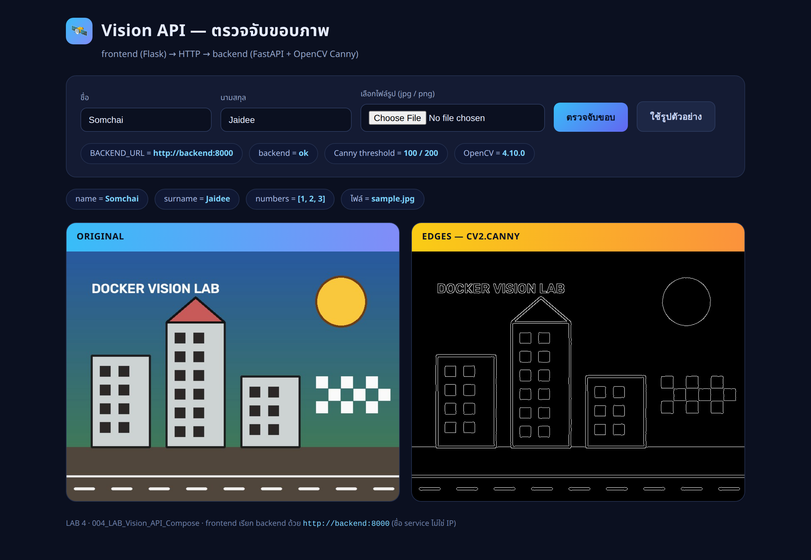
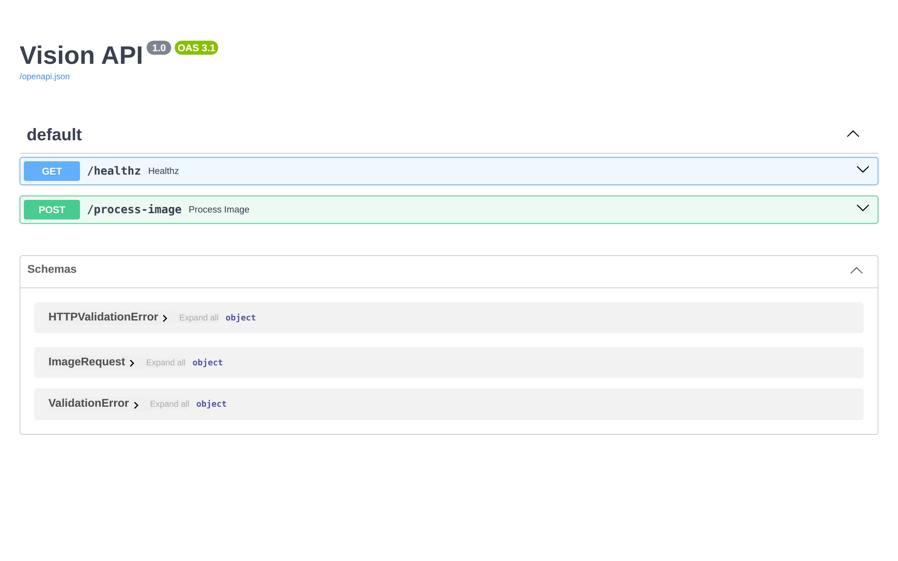

# LAB 4 — Vision API : 2 service ด้วย Compose

> โฟลเดอร์ `004_LAB_Vision_API_Compose` = **LAB 4** ในสไลด์ `Docker_Week09_Slides.html`

## สิ่งที่จะได้เรียนรู้

- ประกอบระบบจริงที่มี **2 service** : `frontend` (Flask) เรียก `backend` (FastAPI + OpenCV) ผ่าน HTTP
- container คุยกันด้วย **ชื่อ service** ไม่ใช่ IP — และพิสูจน์ว่าถ้าไม่อยู่ network เดียวกัน ชื่อนี้ใช้ไม่ได้
- ทำมือด้วย `docker network create` + `docker build` + `docker run` ก่อน แล้วค่อยย้ายมา `compose.yaml`
- อ่าน `compose.yaml` ให้ออกว่า **key แต่ละอันแทน flag ตัวไหน** ของ `docker run`
- `healthcheck` + `depends_on: condition: service_healthy` — รอจน backend "สุขภาพดี" จริงก่อนค่อยปล่อย frontend
- `docker compose up -d --build` / `ps` / `logs` / `exec` / `down` — ชุดคำสั่งที่ใช้จริงทุกวัน
- แก้ค่าในไฟล์ `.env` แล้ว `docker compose up -d` ซ้ำ → compose สร้างใหม่เฉพาะ service ที่ค่าเปลี่ยน

## ภาพรวมของแล็บนี้

1. **ดูสัญญาของระบบก่อน** — frontend ส่ง JSON `{image, name, surname, numbers}` (รูปเป็น base64) ไปที่
   `POST /process-image` ของ backend แล้ว backend ส่ง `processed_image` (ภาพขอบจาก `cv2.Canny`) กลับมา
2. **รอบแรก : ทำมือ** — สร้าง network เอง, build image ทั้งสองตัวเอง, `docker run` ทีละตัวพร้อม flag ยาว ๆ
   ระบบใช้งานได้จริง แต่ต้องพิมพ์ 5 คำสั่งและจำ flag ครบทุกตัว
3. **พิสูจน์เรื่องชื่อ** — `gethostbyname('backend')` จากในกล่อง frontend ได้ IP ออกมา
   แล้วลองกล่องที่ **ไม่ได้** อยู่ใน network เดียวกัน → หาไม่เจอทันที
4. **รอบสอง : `compose.yaml`** — ย้ายทุก flag ที่เพิ่งพิมพ์ไปเป็น key ในไฟล์เดียว แล้วสั่งครั้งเดียวจบ
   พร้อม `healthcheck` ที่ `docker run` ธรรมดาไม่ได้สั่งให้รอ
5. **ใช้งานจริง** — เปิดหน้าเว็บ อัปโหลดรูป เห็นภาพต้นฉบับกับภาพขอบวางคู่กัน และเปิด `/docs` ของ FastAPI
6. **เปลี่ยนค่าโดยไม่แก้โค้ด** — แก้ threshold ของ Canny ในไฟล์ `.env` แล้ว `up -d` ซ้ำ ภาพขอบเปลี่ยนทันที
   (ต่อยอดจาก LAB 2 เรื่อง ENV)
7. **เก็บกวาด** — `docker compose down` ลบ container + network ที่มันสร้างให้เอง แล้วลบ image และเครื่องเรียนทิ้ง

---

## 0. เตรียมเครื่องเรียน

```bash
docker rm -f devtools-lab004
docker run -dit --name devtools-lab004 --privileged \
  -p 2225:22 -p 18041:8501 -p 18042:8000 \
  tuchsanai/devtools:2569_1
ssh root@localhost -p 2225        # password : passwd
```

> 📝 **คำอธิบาย:** เตรียม "เครื่องเรียน" ที่มี Docker + Docker Compose ติดตั้งมาแล้ว เพื่อให้ทุกคนทำแล็บบนสภาพแวดล้อมเดียวกัน ·
> `docker rm -f devtools-lab004` ลบเครื่องเรียนตัวเก่าทิ้งก่อน (ถ้ายังไม่เคยสร้างจะขึ้น error ว่าไม่พบ ปล่อยผ่านได้) ·
> `-dit` = รันเบื้องหลัง + เปิด stdin ค้าง + มี terminal · `--privileged` จำเป็นเพราะเราจะรัน Docker ซ้อนข้างใน (Docker-in-Docker) ·
> `-p 2225:22` คือ SSH · `-p 18041:8501` คือหน้าเว็บ frontend · `-p 18042:8000` คือ FastAPI ของ backend
> **แล็บนี้ใช้เลข 2225 / 18041 / 18042 เท่านั้น** ถ้าขึ้น `port is already allocated` แปลว่ามีของเก่าค้างอยู่ ให้ลบทิ้งก่อน

> ใน VS Code ใช้ **Remote-SSH** ต่อไปที่ `root@localhost:2225` แล้วทำแล็บทั้งหมดข้างใน

```bash
docker --version
docker compose version
```

> 📝 **คำอธิบาย:** เช็กว่าในเครื่องเรียนมี Docker engine และ Docker Compose ให้ใช้จริง ก่อนเริ่มแล็บ ·
> สังเกตว่าเป็น `docker compose` (เว้นวรรค) ไม่ใช่ `docker-compose` (ขีดกลาง) ซึ่งเป็นรุ่นเก่าที่เลิกใช้แล้ว
> ถ้าคำสั่งใดขึ้น `command not found` ให้ย้อนกลับไป `ssh` เข้าเครื่องเรียนใหม่

✅ **Expected output** — ขอแค่ขึ้นเลขเวอร์ชันทั้งสองบรรทัด (เลขของแต่ละคนอาจไม่ตรงกับเอกสารนี้):

```
Docker version 29.6.2, build dfc4efb
Docker Compose version v5.3.1
```

เข้าโฟลเดอร์ของแล็บ :

```bash
mkdir -p ~/labwork ; cd ~/labwork
git clone https://github.com/Tuchsanai/DevTools.git
cd DevTools/03_Docker/02_Docker/004_LAB_Vision_API_Compose
```

> 📝 **คำอธิบาย:** ดึงไฟล์ของวิชาลงมาไว้บนดิสก์ของเครื่องเรียน แล้วเข้าไปยืนในโฟลเดอร์แล็บนี้ (ถ้าเคย clone แล้วให้ข้ามบรรทัด `git clone`) ·
> **ต้องยืนอยู่ในโฟลเดอร์นี้ตลอดทั้งแล็บ** เพราะทั้ง `docker build ... backend/` และ `docker compose` อ้าง path แบบสัมพัทธ์จากตรงนี้

โครงสร้างไฟล์ที่ใช้ในแล็บ :

```
004_LAB_Vision_API_Compose/
├── compose.yaml            ← ไฟล์เดียวที่แทน docker run ทั้งหมดในรอบแรก
├── env.example             ← ต้นแบบของ .env (คัดลอกไปใช้ในข้อ 3)
├── backend/
│   ├── main.py             ← FastAPI : POST /process-image + GET /healthz
│   ├── requirements.txt    ← pin เวอร์ชันทุกตัว
│   ├── Dockerfile          ← python:3.12-slim + HEALTHCHECK
│   └── .dockerignore
└── frontend/
    ├── app.py              ← Flask : หน้าอัปโหลดรูป เรียก backend แล้วโชว์ผล
    ├── requirements.txt    ← มีแค่ flask + requests (image เล็ก — บทเรียนจาก LAB 3)
    ├── Dockerfile
    ├── .dockerignore
    └── static/
        ├── sample.jpg      ← รูปตัวอย่างที่มีขอบชัด ๆ ขนาด 800×600
        └── make_sample.py  ← สคริปต์ที่ใช้สร้าง sample.jpg (ถูกกันไว้ใน .dockerignore ไม่เข้า image)
```

---

## 1. คำถามก่อนเริ่ม + สัญญาระหว่าง 2 service

> ❓ **คำถามก่อนเริ่ม:** `frontend` ที่อยู่คนละ container จะเรียก `backend` ด้วยอะไร —
> **IP ของ container** (เช่น `172.19.0.2`) หรือ **ชื่อ service** (`backend`) ?
> จดคำตอบไว้ แล้วเราจะพิสูจน์ด้วยคำสั่งจริงในข้อ 2.4

หน้าตาของระบบ :

```
[ เบราว์เซอร์ ] --18041--> [ frontend : Flask 8501 ] --http://backend:8000--> [ backend : FastAPI 8000 ]
                                                                                   |
                                                                            cv2.Canny(gray,100,200)
```

`backend/main.py` (ตัดมาเฉพาะหัวใจ) :

```python
@app.post("/process-image")
async def process_image(image_request: ImageRequest):
    image = decode_image(image_request.image)          # base64 -> numpy array
    edges = apply_canny(image)                          # cv2.cvtColor + cv2.Canny
    processed_image = encode_image(edges)               # numpy array -> base64
    return {"name": ..., "surname": ..., "numbers": ..., "processed_image": processed_image}
```

> 📝 **คำอธิบาย:** สัญญา (contract) ของ API คือสิ่งที่ทั้งสองฝั่งตกลงกันไว้ — frontend ส่ง JSON ที่มีคีย์
> `image` (data URL แบบ `data:image/jpeg;base64,...`), `name`, `surname`, `numbers` แล้ว backend ตอบกลับด้วยคีย์เดิม
> บวก `processed_image` · ตราบใดที่สัญญาไม่เปลี่ยน จะเขียน frontend ด้วยภาษาอะไรก็ได้ ·
> `backend` ยังมี `GET /healthz` ไว้ให้ Docker ใช้เช็กสุขภาพในข้อ 3 ด้วย

`frontend/app.py` มีบรรทัดสำคัญบรรทัดเดียว :

```python
BACKEND_URL = os.environ.get("BACKEND_URL", "http://backend:8000")
```

> 📝 **คำอธิบาย:** frontend **ไม่ฝัง** ที่อยู่ของ backend ไว้ในโค้ด แต่รับมาจาก environment variable
> (แนวคิดเดียวกับ `APP_COLOR` ใน LAB 2) · ทำให้ image ตัวเดียวเอาไปชี้ backend ตัวไหนก็ได้ โดยไม่ต้อง build ใหม่

---

## 2. รอบแรก — ทำมือ (ให้รู้สึกเจ็บก่อน)

### 2.1 สร้าง network ของเราเอง

```bash
docker network create visionnet
```

> 📝 **คำอธิบาย:** สร้างเครือข่ายเสมือนของเราเองไว้ให้ 2 container คุยกัน ·
> เหตุผลที่ต้องสร้างเอง : network ที่เราสร้าง (user-defined bridge) มี **DNS ในตัว** ที่แปลง "ชื่อ container" เป็น IP ให้อัตโนมัติ
> ส่วน network `bridge` ตัว default ที่ container ได้มาฟรีไม่มีบริการนี้ (จะเห็นหลักฐานในข้อ 2.4)
> สิ่งที่ต้องดูคือได้ network ID ยาว ๆ กลับมา 1 บรรทัด

✅ **Expected output** — network ID 64 ตัวอักษร (ของแต่ละคนจะไม่ซ้ำกัน):

```
16205aa6d65436eda4783850c0a9757a50bc3901b366afdeac53b97d0bc56d3e
```

### 2.2 build image ทั้งสองตัว

```bash
docker build -t vision-backend:1.0 backend/
docker build -t vision-frontend:1.0 frontend/
```

> 📝 **คำอธิบาย:** สร้าง image จาก Dockerfile คนละโฟลเดอร์ · `-t <ชื่อ>:<tag>` ตั้งชื่อและ tag ให้ image
> (เราตั้ง `1.0` เองเพื่อไม่ต้องพึ่ง `latest` — ตามที่ย้ำไว้ใน LAB 1) · argument ตัวสุดท้ายคือ **build context**
> คือโฟลเดอร์ที่ Docker จะส่งไฟล์เข้าไปใช้ตอน build
> รอบแรกจะช้าเพราะต้อง pull `python:3.12-slim` และ `pip install` จริง รอบต่อไปจะเร็วขึ้นมากเพราะ layer ถูก cache

✅ **Expected output** — (ตัดมาเฉพาะบรรทัดสำคัญของ `vision-backend:1.0` — เวลาที่ใช้และ hash ของแต่ละคนจะต่างกัน):

```
#8 [4/5] RUN pip install --no-cache-dir -r requirements.txt
#8 2.176 Downloading opencv_python_headless-4.10.0.84-cp37-abi3-manylinux_2_17_x86_64.manylinux2014_x86_64.whl (49.9 MB)
#8 7.975 Successfully installed annotated-types-0.8.0 anyio-4.14.2 click-8.4.2 fastapi-0.115.6 h11-0.16.0 httptools-0.8.0 idna-3.18 numpy-2.2.1 opencv-python-headless-4.10.0.84 pydantic-2.10.4 pydantic-core-2.27.2 python-dotenv-1.2.2 pyyaml-6.0.3 starlette-0.41.3 typing-extensions-4.16.0 uvicorn-0.34.0 uvloop-0.22.1 watchfiles-1.2.0 websockets-17.0.1
#8 DONE 8.2s

#9 [5/5] COPY main.py .
#9 DONE 0.1s

#10 exporting to image
#10 naming to docker.io/library/vision-backend:1.0 done
#10 DONE 6.7s
```

ดูขนาดของสองตัวเทียบกัน :

```bash
docker images vision-*
```

> 📝 **คำอธิบาย:** เทียบขนาด image สองตัวที่ base เดียวกัน (`python:3.12-slim`) ต่างกันแค่ "ลงอะไรเพิ่ม" ·
> backend ต้องมี OpenCV + numpy จึงหนักกว่า frontend ที่มีแค่ flask + requests หลายเท่า
> นี่คือเหตุผลที่เราแยกงานหนักไว้ที่ service เดียว ไม่ยัดทุกอย่างลงกล่องเดียว
> **Docker 29 เปลี่ยนหัวตาราง** เป็น `DISK USAGE` (พื้นที่จริงบนดิสก์หลังแตก layer) กับ `CONTENT SIZE` (ขนาดที่บีบอัดไว้) แทน `SIZE` เดิม

✅ **Expected output** — ตัวเลขของแต่ละคนอาจต่างเล็กน้อยตามเวอร์ชัน base image:

```
IMAGE                 ID             DISK USAGE   CONTENT SIZE   EXTRA
vision-backend:1.0    330bb0905094        526MB          129MB
vision-frontend:1.0   410ad58d243f        202MB         49.2MB
```

### 2.3 รัน 2 container ด้วยมือ

```bash
docker run -d --network visionnet --name backend -p 8000:8000 vision-backend:1.0
docker run -d --network visionnet --name frontend -e BACKEND_URL=http://backend:8000 -p 8501:8501 vision-frontend:1.0
```

> 📝 **คำอธิบาย:** สองบรรทัดนี้คือ "ระบบทั้งระบบ" ของรอบแรก · `--network visionnet` สั่งให้กล่องเข้าไปอยู่ในเครือข่ายที่เราสร้างไว้ ·
> `--name backend` สำคัญมาก เพราะ **ชื่อนี้จะกลายเป็นชื่อ host** ที่อีกฝั่งใช้เรียก ·
> `-e BACKEND_URL=http://backend:8000` ยัดค่า config เข้าไปจากข้างนอก · `-p` เปิด port ออกมาให้เครื่องเรียน
> ลองนับดู : 1 network + 2 build + 2 run = **5 คำสั่ง / 11 flag** ที่ต้องจำและพิมพ์ให้ถูกทุกครั้ง

✅ **Expected output** — container ID ตัวละ 1 บรรทัด (ของแต่ละคนจะไม่ซ้ำกัน):

```
6ac6c9aa28a70a057ad03686d18fbcf98ebdf795cf62f4554e03de54010dee4e
543db63a8e4608fe1f992c8f57b1f624a849fdf7be702722eba75ff01fc97640
```

```bash
docker ps --format "table {{.Names}}\t{{.Image}}\t{{.Status}}\t{{.Ports}}"
```

> 📝 **คำอธิบาย:** ดูว่าทั้งสองกล่องขึ้นจริงไหม โดยใช้ `--format` ตัดคอลัมน์ที่ไม่ต้องการออก (เครื่องมือจาก LAB 1) ·
> จุดที่ต้องดูคือ `backend` มีคำว่า **`(healthy)`** ต่อท้าย — มาจาก `HEALTHCHECK` ที่เขียนไว้ใน `backend/Dockerfile`
> ส่วน `frontend` ไม่มีเพราะไม่ได้เขียน HEALTHCHECK ไว้ · ถ้าเพิ่งรันไปไม่กี่วินาทีอาจยังเห็น `(health: starting)` ให้รอสักครู่แล้วดูใหม่

✅ **Expected output** — เวลาที่ขึ้นจะต่างกันไปตามจังหวะที่พิมพ์:

```
NAMES      IMAGE                 STATUS                    PORTS
frontend   vision-frontend:1.0   Up 18 seconds             0.0.0.0:8501->8501/tcp, [::]:8501->8501/tcp
backend    vision-backend:1.0    Up 19 seconds (healthy)   0.0.0.0:8000->8000/tcp, [::]:8000->8000/tcp
```

### 2.4 เฉลย "IP หรือชื่อ ?"

```bash
docker exec frontend python -c "import socket;print(socket.gethostbyname('backend'))"
```

> 📝 **คำอธิบาย:** สั่งให้ **ในกล่อง frontend** ลองแปลงชื่อ `backend` เป็น IP ดู ·
> ถ้าแปลงได้ แปลว่า Docker มี DNS ให้ในตัวและเราสามารถใช้ **ชื่อ service** ในโค้ดได้เลย
> สิ่งที่ต้องดูคือมี IP ออกมาโดยที่เราไม่เคยจดหรือกรอก IP นั้นไว้ที่ไหนเลย

✅ **Expected output** — เลข IP ของแต่ละคนจะไม่ตรงกับเอกสารนี้ ขอแค่มีเลขออกมาก็พอ:

```
172.19.0.2
```

**เฉลย : ใช้ชื่อ** — และ IP นี้เปลี่ยนทุกครั้งที่สร้าง container ใหม่ จึงห้ามฝัง IP ไว้ในโค้ดเด็ดขาด

ทดสอบด้านกลับ — กล่องที่ **ไม่ได้** อยู่ใน `visionnet` :

```bash
docker run -d --name frontend-bad vision-frontend:1.0
docker exec frontend-bad python -c "import socket;print(socket.gethostbyname('backend'))"
docker rm -f frontend-bad
```

> 📝 **คำอธิบาย:** รันกล่องเดิมซ้ำแต่ **ตัด `--network visionnet` ออก** กล่องนี้จะไปอยู่บน network `bridge` ตัว default ·
> **คำสั่งที่สองต้องพัง** — การขึ้น error คือผลลัพธ์ที่ถูกต้องของขั้นตอนนี้
> สรุปคือ "ชื่อ service" ใช้ได้เฉพาะกับกล่องที่อยู่ใน network เดียวกันที่เราสร้างเองเท่านั้น

✅ **Expected output** — บล็อกนี้คือผลของ**คำสั่งที่สอง**เท่านั้น (คำสั่งแรกคืน container ID ยาว ๆ และคำสั่งที่สามคืนคำว่า `frontend-bad`)
ให้ดูบรรทัดสุดท้าย `Name or service not known` (exit code = 1):

```
Traceback (most recent call last):
  File "<string>", line 1, in <module>
socket.gaierror: [Errno -2] Name or service not known
```

### 2.5 ทดสอบว่าระบบทำงานครบวง

```bash
curl -s http://localhost:8000/healthz
curl -s -F name=Somchai -F surname=Jaidee -F use_sample=1 http://localhost:8501/ | grep -oE "(Original|Edges — cv2.Canny|data:image/jpeg;base64)" | sort | uniq -c
```

> 📝 **คำอธิบาย:** คำสั่งแรกถาม backend ตรง ๆ ว่ายังดีอยู่ไหม · คำสั่งที่สองยิงฟอร์มเข้า **frontend** โดยกดปุ่ม "ใช้รูปตัวอย่าง"
> (`-F` คือส่งแบบ multipart form เหมือนกดปุ่มบนหน้าเว็บ) แล้วนับว่าในหน้า HTML ที่ตอบกลับมามีอะไรบ้าง ·
> ถ้าเห็น `data:image/jpeg;base64` **2 ครั้ง** แปลว่ามีทั้งรูปต้นฉบับและรูปขอบ — ครบวงจร frontend → backend → frontend

✅ **Expected output** — สองบล็อกนี้คือหลักฐานว่าทั้งระบบเชื่อมกันแล้ว:

```
{"status":"ok","canny_low":100,"canny_high":200,"cv2":"4.10.0"}
```

```
      1 Edges — cv2.Canny
      1 Original
      2 data:image/jpeg;base64
```

### 2.6 ล้างรอบแรกทิ้งก่อนไปต่อ

```bash
docker rm -f backend frontend && docker network rm visionnet
```

> 📝 **คำอธิบาย:** ลบทั้ง 2 กล่องและ network ที่สร้างเองด้วยมือ เพื่อไม่ให้ชนชื่อและชน port กับรอบ compose ·
> สังเกตว่าเราต้อง **จำเองว่าสร้างอะไรไว้บ้าง** ถึงจะลบได้ครบ — ในข้อ 7 จะเห็นว่า compose จำแทนเราให้ทั้งหมด
> ถ้าลืมลบ network จะเจอ error `network with name visionnet already exists` ตอนทำแล็บซ้ำ

✅ **Expected output** — ชื่อของสิ่งที่ถูกลบ บรรทัดละอัน:

```
backend
frontend
visionnet
```

---

## 3. รอบสอง — ย้ายทุกอย่างมาไว้ใน `compose.yaml`

ทุก flag ที่พิมพ์ไปเมื่อกี้ มีที่อยู่ของมันในไฟล์เดียว :

| รอบแรกพิมพ์เอง | ใน `compose.yaml` |
|---|---|
| `docker build -t vision-backend:1.0 backend/` | `build: ./backend` + `image: vision-backend:1.0` |
| `-p 8000:8000` | `ports: ["8000:8000"]` |
| `-e BACKEND_URL=http://backend:8000` | `environment: BACKEND_URL: http://backend:8000` |
| `--network visionnet` | `networks: [visionnet]` (compose สร้าง network ให้เอง) |
| `--name backend` | ชื่อ service `backend:` (กลายเป็นชื่อ host ให้อัตโนมัติ) |
| `HEALTHCHECK` ใน Dockerfile | `healthcheck:` (เขียนทับ/กำหนดจากภายนอกได้) |
| *(ไม่มี — `docker run` รอไม่เป็น)* | `depends_on: backend: condition: service_healthy` |

`compose.yaml` ของแล็บนี้ :

```yaml
name: vision

services:

  backend:
    build: ./backend
    image: vision-backend:1.0
    environment:
      CANNY_LOW: ${CANNY_LOW:-100}
      CANNY_HIGH: ${CANNY_HIGH:-200}
    ports:
      - "8000:8000"
    networks:
      - visionnet
    healthcheck:
      test: ["CMD", "python", "-c",
             "import urllib.request; urllib.request.urlopen('http://localhost:8000/healthz')"]
      interval: 5s
      timeout: 3s
      retries: 5
      start_period: 10s

  frontend:
    build: ./frontend
    image: vision-frontend:1.0
    environment:
      BACKEND_URL: http://backend:8000
      APP_TITLE: ${APP_TITLE:-Vision API}
    ports:
      - "8501:8501"
    depends_on:
      backend:
        condition: service_healthy
    networks:
      - visionnet

networks:
  visionnet:
```

> 📝 **คำอธิบาย:** อ่านจากบนลงล่าง — `name: vision` คือชื่อโปรเจกต์ (จะกลายเป็น prefix ของทุกอย่างที่ compose สร้าง) ·
> `${CANNY_LOW:-100}` แปลว่า "เอาค่าจากไฟล์ `.env` ถ้าไม่มีให้ใช้ 100" · `healthcheck.test` คือคำสั่งที่ Docker จะรัน
> **ข้างในกล่อง** ทุก `interval` เพื่อตัดสินว่ากล่องนี้ healthy หรือ unhealthy ·
> `depends_on ... condition: service_healthy` คือสิ่งที่ `docker run` ทำไม่ได้ : frontend จะไม่ถูกสตาร์ทจนกว่า backend จะตอบ `/healthz` ได้จริง
> (ถ้าใช้แค่ `depends_on: [backend]` เฉย ๆ จะรอแค่ "สตาร์ทแล้ว" ซึ่งยังไม่พร้อมรับ request)

เตรียมไฟล์ค่าคอนฟิก :

```bash
cp env.example .env
cat .env
```

> 📝 **คำอธิบาย:** compose จะอ่านไฟล์ชื่อ `.env` ในโฟลเดอร์เดียวกันอัตโนมัติ แล้วเอาค่าไปแทนที่ `${...}` ในไฟล์ YAML ·
> เหตุผลที่รีโพเก็บแค่ `env.example` เพราะ `.env` เป็นไฟล์ของแต่ละเครื่อง (ปกติจะถูกใส่ไว้ใน `.gitignore` ไม่ commit ขึ้น git)
> สิ่งที่ต้องดูคือได้ค่า 3 บรรทัดออกมา

✅ **Expected output**

```
APP_TITLE=Vision API — ตรวจจับขอบภาพ
CANNY_LOW=100
CANNY_HIGH=200
```

### 3.1 สั่งครั้งเดียวจบ

```bash
docker compose up -d --build
```

> 📝 **คำอธิบาย:** คำสั่งเดียวแทนทั้ง 5 คำสั่งของรอบแรก · `--build` สั่ง build image ก่อนเสมอ (ถ้าโค้ดไม่เปลี่ยนจะได้ `CACHED` ทุกชั้น) ·
> `-d` รันเบื้องหลัง · สิ่งที่ต้องดูคือบรรทัด **`Container vision-backend-1 Waiting`** ตามด้วย **`Healthy`**
> แล้วค่อยตามด้วย `vision-frontend-1 Starting` — นั่นคือ `depends_on: service_healthy` กำลังทำงานให้เห็นกับตา

✅ **Expected output** — (ท่อน build ถูกตัดออก เพราะรอบนี้ทุกชั้นเป็น `CACHED` จากข้อ 2.2 แล้ว):

```
 Image vision-backend:1.0 Built 
 Image vision-frontend:1.0 Built 
 Network vision_visionnet Creating 
 Network vision_visionnet Created 
 Container vision-backend-1 Creating 
 Container vision-backend-1 Created 
 Container vision-frontend-1 Creating 
 Container vision-frontend-1 Created 
 Container vision-backend-1 Starting 
 Container vision-backend-1 Started 
 Container vision-backend-1 Waiting 
 Container vision-backend-1 Healthy 
 Container vision-frontend-1 Starting 
 Container vision-frontend-1 Started 
```

> สังเกตชื่อที่ compose ตั้งให้ : `<ชื่อโปรเจกต์>-<ชื่อ service>-<ลำดับ>` เช่น `vision-backend-1`
> และ network ชื่อ `vision_visionnet` — เราไม่ต้องตั้งชื่อเองอีกต่อไป

```bash
docker compose ps
docker compose logs backend --tail 10
```

> 📝 **คำอธิบาย:** `docker compose ps` เหมือน `docker ps` แต่แสดงเฉพาะของโปรเจกต์นี้ และมีคอลัมน์ `SERVICE` เพิ่มมา ·
> `docker compose logs <service> --tail 10` ดู log 10 บรรทัดท้ายของ service นั้น (เติม `-f` เพื่อดูสด ๆ ได้เหมือน LAB 1) ·
> สิ่งที่ต้องดูคือคำว่า **`(healthy)`** ในคอลัมน์ STATUS และบรรทัด `GET /healthz HTTP/1.1" 200 OK` ใน log
> ซึ่งเป็นร่องรอยของ healthcheck ที่วิ่งเองทุก 5 วินาที

✅ **Expected output** — เวลาและเลข port ต้นทางของแต่ละคนจะต่างกันเล็กน้อย:

```
NAME                IMAGE                 COMMAND                  SERVICE    CREATED          STATUS                    PORTS
vision-backend-1    vision-backend:1.0    "uvicorn main:app --…"   backend    13 seconds ago   Up 12 seconds (healthy)   0.0.0.0:8000->8000/tcp, [::]:8000->8000/tcp
vision-frontend-1   vision-frontend:1.0   "python app.py"          frontend   13 seconds ago   Up 7 seconds              0.0.0.0:8501->8501/tcp, [::]:8501->8501/tcp
```

```
backend-1  | INFO:     Started server process [1]
backend-1  | INFO:     Waiting for application startup.
backend-1  | INFO:     Application startup complete.
backend-1  | INFO:     Uvicorn running on http://0.0.0.0:8000 (Press CTRL+C to quit)
backend-1  | INFO:     127.0.0.1:59174 - "GET /healthz HTTP/1.1" 200 OK
backend-1  | INFO:     127.0.0.1:59182 - "GET /healthz HTTP/1.1" 200 OK
```

---

## 4. เปิดใช้งานจริง

เปิดเว็บ — ให้ VS Code forward port ก่อน : แท็บ **PORTS** → **Forward a Port** → ใส่ `8501` แล้วเปิด `http://localhost:8501`
(หรือใช้ `ssh -L 8501:localhost:8501 root@localhost -p 2225` จาก terminal บนเครื่องเราเอง)

> 📝 **คำอธิบาย:** port `8501` คือ port ของ frontend **ภายในเครื่องเรียน** ซึ่งถูกส่งออกมาที่ port `18041` ของเครื่องเราตั้งแต่ข้อ 0 ·
> ถ้าใครรันเครื่องเรียนบนเครื่องตัวเองอยู่แล้ว เปิด `http://localhost:18041` ได้เลยไม่ต้อง forward ซ้ำ
> **ทดลองเสร็จแล้วปิด tunnel ทุกครั้ง** — แบบ `ssh -L` กด `Ctrl+D` · แบบ VS Code คลิกขวาที่ port → **Stop Forwarding Port**

กรอกชื่อ-นามสกุล เลือกไฟล์ `frontend/static/sample.jpg` (หรือรูปอะไรก็ได้) แล้วกด **ตรวจจับขอบ** :



*ซ้ายคือรูปที่อัปโหลด ขวาคือผลจาก `cv2.Canny` ที่ backend ส่งกลับมาเป็น base64 · แถบชิปด้านบนยืนยันว่า frontend คุยกับ `http://backend:8000` (ชื่อ service ไม่ใช่ IP) และ backend ตอบ `ok`*

เปิดหน้าเอกสารอัตโนมัติของ FastAPI ที่ port `8000` (forward เหมือนเดิม หรือเปิด `http://localhost:18042/docs`) :



*FastAPI สร้างหน้า `/docs` ให้ฟรีจาก type hint ในโค้ด — เห็น `GET /healthz` กับ `POST /process-image` และ schema `ImageRequest` ที่ตรงกับสัญญาในข้อ 1*

> 📝 **คำอธิบาย:** หน้า `/docs` กดทดสอบ API ได้โดยไม่ต้องมี frontend ซึ่งมีประโยชน์มากตอนไล่ปัญหา —
> ถ้าหน้านี้ใช้ได้แต่หน้าเว็บ frontend พัง แปลว่าปัญหาอยู่ที่ฝั่ง frontend หรือการเชื่อมต่อระหว่างสอง service ไม่ใช่ที่ backend

---

## 5. เข้าไปดูข้างในด้วย `compose exec`

```bash
docker compose exec backend python -c "import cv2;print(cv2.__version__)"
docker compose exec frontend python -c "import socket;print(socket.gethostbyname('backend'))"
```

> 📝 **คำอธิบาย:** `docker compose exec <service> <คำสั่ง>` = `docker exec <ชื่อ container ยาว ๆ> <คำสั่ง>`
> แต่เราอ้างด้วย **ชื่อ service** ไม่ต้องจำว่า container ชื่อ `vision-backend-1` ·
> คำสั่งแรกยืนยันว่า OpenCV ที่ติดตั้งใน image คือเวอร์ชันที่เรา pin ไว้จริง ·
> คำสั่งที่สองพิสูจน์ซ้ำว่าใน compose ชื่อ service ก็ใช้เป็นชื่อ host ได้เหมือนเดิม (เพราะอยู่ network เดียวกันที่ compose สร้างให้)

✅ **Expected output** — บล็อกแรกคือเวอร์ชัน OpenCV ซึ่งต้องได้ `4.10.0` เท่ากันทุกคน (เพราะ pin ไว้ใน `requirements.txt`)
ส่วนบล็อกที่สองคือ IP ซึ่งของแต่ละคนจะไม่ตรงกับเอกสารนี้:

```
4.10.0
```

```
172.19.0.2
```

---

## 6. เปลี่ยนค่าโดยไม่แตะโค้ด (ต่อจาก LAB 2)

```bash
sed -i "s/^CANNY_LOW=.*/CANNY_LOW=10/; s/^CANNY_HIGH=.*/CANNY_HIGH=40/" .env
docker compose up -d
curl -s http://localhost:8000/healthz
```

> 📝 **คำอธิบาย:** แก้แค่ตัวเลขในไฟล์ `.env` (ไม่แตะ `main.py` ไม่แตะ `compose.yaml`) แล้วสั่ง `up -d` ซ้ำ ·
> compose จะเทียบสภาพปัจจุบันกับสิ่งที่ควรจะเป็น แล้ว **สร้างใหม่เฉพาะ service ที่ค่าเปลี่ยน** ·
> สิ่งที่ต้องดูคือ `vision-frontend-1 Running` (ไม่ถูกแตะ) แต่ `vision-backend-1 Recreate` แล้วรอ `Healthy` ใหม่

✅ **Expected output** — สังเกตว่ามีแค่ backend ที่ถูกสร้างใหม่ และค่า threshold เปลี่ยนตาม `.env`:

```
 Container vision-frontend-1 Running 
 Container vision-backend-1 Recreate 
 Container vision-backend-1 Recreated 
 Container vision-backend-1 Starting 
 Container vision-backend-1 Started 
 Container vision-backend-1 Waiting 
 Container vision-backend-1 Healthy 
```

```
{"status":"ok","canny_low":10,"canny_high":40,"cv2":"4.10.0"}
```

รีเฟรชหน้าเว็บแล้วส่งรูปเดิมซ้ำ :


*ชิปด้านบนเปลี่ยนเป็น `Canny threshold = 10 / 40` และภาพขวาเก็บเส้นเล็ก ๆ ได้มากขึ้น (เส้นถนนกลายเป็นขอบคู่ มีจุดรบกวนเพิ่ม) — โค้ดบรรทัดเดียวกันเป๊ะ เปลี่ยนแค่ค่าจากข้างนอก*

คืนค่าเดิมก่อนไปต่อ :

```bash
sed -i "s/^CANNY_LOW=.*/CANNY_LOW=100/; s/^CANNY_HIGH=.*/CANNY_HIGH=200/" .env
docker compose up -d
curl -s http://localhost:8000/healthz
```

> 📝 **คำอธิบาย:** เปลี่ยนค่ากลับเป็น 100/200 แล้ว `up -d` อีกครั้ง เพื่อยืนยันว่ากระบวนการนี้กลับไปกลับมาได้เสมอ ·
> นี่คือรูปแบบการทำงานจริง : **image เดิม, โค้ดเดิม, เปลี่ยนแค่ค่าคอนฟิก** แล้ว deploy ใหม่

✅ **Expected output** — ค่ากลับมาเป็น 100/200:

```
{"status":"ok","canny_low":100,"canny_high":200,"cv2":"4.10.0"}
```

---

## 7. `docker compose down` ลบอะไรให้บ้าง

```bash
docker compose down
docker ps -a
docker network ls --filter name=vision
```

> 📝 **คำอธิบาย:** `docker compose down` หยุดและลบ **ทุก container ของโปรเจกต์นี้ พร้อม network ที่มันสร้างขึ้นมาเอง** ในคำสั่งเดียว
> เทียบกับรอบแรกที่เราต้อง `docker rm -f` ทีละตัวแล้วยังต้อง `docker network rm` เองอีก ·
> สิ่งที่ **ไม่ถูกลบ** คือ image (`vision-backend:1.0` / `vision-frontend:1.0`) — ต้องลบเองด้วย `docker rmi` ในขั้นตอน Cleanup
> สองคำสั่งหลังคือการยืนยันว่าไม่มีอะไรค้าง : ต้องเหลือแค่หัวตารางเปล่า ๆ

✅ **Expected output** — บล็อกแรกคือรายการที่ถูกลบ · สองบล็อกหลังต้องว่างเปล่า (มีแต่หัวตาราง):

```
 Container vision-frontend-1 Stopping 
 Container vision-frontend-1 Stopped 
 Container vision-frontend-1 Removing 
 Container vision-frontend-1 Removed 
 Container vision-backend-1 Stopping 
 Container vision-backend-1 Stopped 
 Container vision-backend-1 Removing 
 Container vision-backend-1 Removed 
 Network vision_visionnet Removing 
 Network vision_visionnet Removed 
```

```
CONTAINER ID   IMAGE     COMMAND   CREATED   STATUS    PORTS     NAMES
NETWORK ID   NAME      DRIVER    SCOPE
```

---

## สรุป

| ทำมือ (`docker run`) | Compose (`compose.yaml`) |
|---|---|
| 5 คำสั่ง 11 flag ต้องจำเองทุกครั้ง | 1 ไฟล์ + `docker compose up -d` |
| ต้องจำเองว่าสร้าง network/container อะไรไว้ ถึงจะลบครบ | `docker compose down` ลบให้ครบเอง |
| รอ "พร้อมจริง" ไม่ได้ ต้องมานั่ง `sleep` เอง | `depends_on` + `healthcheck` รอให้ |
| ค่าคอนฟิกอยู่ในประวัติคำสั่งบน terminal | อยู่ในไฟล์ `.env` / `compose.yaml` ที่อ่านและ review ได้ |

---

## Cleanup (บังคับ)

ทำในเครื่องเรียนก่อน :

```bash
docker compose down
docker rmi vision-backend:1.0 vision-frontend:1.0
docker images
```

> 📝 **คำอธิบาย:** `down` เก็บ container + network (ถ้าทำข้อ 7 ไปแล้ว คำสั่งนี้จะไม่พิมพ์อะไรออกมาเลยเพราะไม่มีอะไรให้ลบ ถือว่าปกติ) ·
> `docker rmi` ลบ image ของแล็บทั้งสองตัว — ต้องลบหลัง container หมดแล้วเท่านั้น ไม่งั้นจะติด error ว่า image ถูกใช้อยู่ ·
> `docker images` ปิดท้ายเพื่อยืนยันว่าไม่เหลือ image ของแล็บนี้

✅ **Expected output** — sha256 ของแต่ละคนจะไม่ตรงกับเอกสารนี้ ขอแค่มีคำว่า `Untagged` และ `Deleted` ครบทั้งสองตัว:

```
Untagged: vision-backend:1.0
Deleted: sha256:fa62e6fd5a0ab1e3b0709a7db6f111121c4312a838d3b864f0f69bf22244f01b
Untagged: vision-frontend:1.0
Deleted: sha256:393273ee375e137dad972ac2a8a58c597c97a26220effc843c0b6a6c060c146b
```

```
IMAGE   ID             DISK USAGE   CONTENT SIZE   EXTRA
```

จากนั้น **ออกจาก SSH** (`exit`) แล้วลบเครื่องเรียนบนเครื่องของเรา :

```bash
docker rm -f devtools-lab004
docker ps -a --filter "name=^devtools-"
```

> 📝 **คำอธิบาย:** สองคำสั่งนี้พิมพ์บน **เครื่องของเราเอง** ไม่ใช่ในเครื่องเรียน · คำสั่งแรกลบเครื่องเรียนของแล็บนี้ทิ้ง
> คำสั่งที่สองยืนยันว่าไม่มี container ของวิชานี้ค้างอยู่เลย (ต้องเหลือแค่หัวตาราง)

> ⚠️ **ห้ามใช้** `docker rm -f $(docker ps -aq)` หรือ `docker system prune -a` บนเครื่องของตัวเองเพื่อเก็บกวาดแล็บนี้ —
> คำสั่งพวกนั้นลบ **ทุก container / ทุก image ในเครื่อง** รวมของงานอื่นที่ไม่เกี่ยวกับวิชานี้ด้วย
> ให้ลบเจาะจงชื่อ `devtools-lab004` เท่านั้น

## ✅ เช็กลิสต์ก่อนจบแล็บ

- [ ] `docker network create visionnet` ได้ network ID กลับมา
- [ ] build ได้ทั้ง `vision-backend:1.0` และ `vision-frontend:1.0`
- [ ] `docker ps` เห็น `backend` เป็น `Up ... (healthy)`
- [ ] `gethostbyname('backend')` จากในกล่อง frontend **ได้ IP** แต่จากกล่องที่ไม่อยู่ใน `visionnet` **พัง**
- [ ] `docker compose up -d --build` เห็นบรรทัด `Waiting` → `Healthy` → frontend ค่อย `Starting`
- [ ] เปิดเว็บ 8501 อัปโหลดรูปแล้วเห็นภาพต้นฉบับคู่กับภาพขอบ และปิด tunnel เรียบร้อยแล้ว
- [ ] เปิด `/docs` ของ FastAPI เห็น `POST /process-image`
- [ ] แก้ `.env` เป็น 10/40 แล้ว `up -d` → มีแค่ backend ที่ `Recreate` และ `/healthz` เปลี่ยนค่าตาม
- [ ] `docker compose down` แล้ว `docker ps -a` กับ `docker network ls` ไม่เหลือของโปรเจกต์นี้
- [ ] `docker rmi` ลบ image ทั้งสองตัวแล้ว และลบ `devtools-lab004` บนเครื่องตัวเองแล้ว

## ตรวจความเข้าใจ

<details>
<summary>1. ทำไม frontend ถึงเรียก backend ด้วย <code>http://backend:8000</code> ได้ ทั้งที่ไม่เคยรู้ IP ของมันเลย ?</summary>

เพราะทั้งสอง container อยู่บน **user-defined network** เดียวกัน (`visionnet` ที่เราสร้างเอง หรือ `vision_visionnet` ที่ compose สร้างให้)
ซึ่งมี DNS ในตัวคอยแปลง "ชื่อ container / ชื่อ service" เป็น IP ปัจจุบันให้อัตโนมัติ
เราพิสูจน์ไปแล้วในข้อ 2.4 : จากในกล่อง frontend แปลงชื่อ `backend` ได้เป็น `172.19.0.2`
แต่กล่อง `frontend-bad` ที่ไม่ได้ใส่ `--network visionnet` ขึ้น `Name or service not known`
IP เปลี่ยนทุกครั้งที่สร้าง container ใหม่ จึงห้ามฝัง IP ไว้ในโค้ด
</details>

<details>
<summary>2. <code>depends_on: [backend]</code> เฉย ๆ กับ <code>depends_on: backend: condition: service_healthy</code> ต่างกันอย่างไร ?</summary>

แบบแรกรอแค่ "container ถูกสตาร์ทแล้ว" ซึ่งอาจเป็นตอนที่ uvicorn ยังโหลด OpenCV ไม่เสร็จและยังรับ request ไม่ได้
แบบที่สองรอจน **healthcheck ผ่านจริง** คือ `GET /healthz` ตอบ 200 ได้แล้วเท่านั้น
หลักฐานคือบรรทัด `Container vision-backend-1 Waiting` แล้วตามด้วย `Healthy` ก่อน `vision-frontend-1 Starting` ในข้อ 3.1
</details>

<details>
<summary>3. <code>docker compose down</code> ลบอะไรบ้าง และ<b>ไม่</b>ลบอะไร ?</summary>

ลบ container ทุกตัวของโปรเจกต์ และ network ที่ compose สร้างขึ้นมาเอง (`vision_visionnet`)
**ไม่ลบ image** ที่ build ไว้ — `docker images` ยังเห็น `vision-backend:1.0` กับ `vision-frontend:1.0` อยู่
ถ้าต้องการพื้นที่คืนต้อง `docker rmi` เองตามขั้นตอน Cleanup
</details>

<details>
<summary>4. ถ้าอยากเปลี่ยน threshold ของ Canny ต้อง build image ใหม่ไหม ?</summary>

ไม่ต้อง — โค้ดอ่านค่าจาก `os.environ.get("CANNY_LOW", "100")` ดังนั้นแก้ตัวเลขในไฟล์ `.env` แล้ว `docker compose up -d` พอ
compose จะสร้าง **เฉพาะ backend** ขึ้นใหม่ (เห็น `vision-frontend-1 Running` ไม่ถูกแตะ) และ `/healthz` จะรายงานค่าใหม่ทันที
หลักการเดียวกับ `APP_COLOR` ใน LAB 2 : **1 image หลายบุคลิก**
</details>

<details>
<summary>5. ทำไม image ของ backend ถึงใหญ่กว่า frontend หลายเท่า และแก้ได้อย่างไร ?</summary>

เพราะ backend ต้องลง `opencv-python-headless` (ล้อ 49.9 MB) + `numpy` ส่วน frontend มีแค่ `flask` + `requests`
ผลคือ `526MB` (DISK USAGE) เทียบกับ `202MB` การแยกงานหนักไว้ service เดียวทำให้ image อีกตัวเบาและ deploy เร็ว
ถ้าอยากลดอีกให้ใช้เทคนิคจาก LAB 3 : `.dockerignore`, จัดลำดับ `COPY` ให้ cache ทำงาน และ multi-stage build
</details>

---

*ผลลัพธ์ทั้งหมดในเอกสารนี้มาจากการรันจริงในเครื่องเรียน `tuchsanai/devtools:2569_1` (ดูบันทึกดิบได้ที่ `evidence/transcript.md`)*
