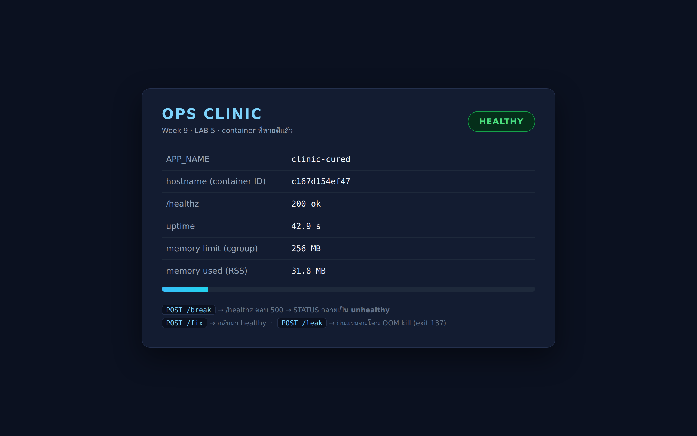
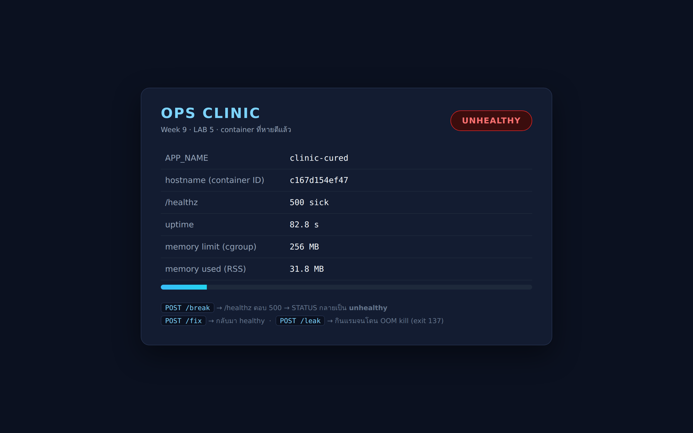

# LAB 5 — คลินิกอาการเสีย (Ops Clinic)

> โฟลเดอร์ `005_LAB_Ops_Clinic` = **LAB 5** ในสไลด์ `Docker_Week09_Slides.html`

## สิ่งที่จะได้เรียนรู้

- อ่าน **STATUS** ของ container ให้เป็น : `Exited (1)` · `Exited (137)` · `(health: starting)` · `(healthy)` · `(unhealthy)`
- ใช้ `docker ps -a` / `logs` / `inspect --format` / `port` / `stats` / `events` เป็น **เครื่องมือวินิจฉัย** ไม่ใช่แค่คำสั่งท่องจำ
- `HEALTHCHECK` — ให้ Docker วัดชีพจรแอปเองทุก ๆ กี่วินาที และดู log ของการตรวจย้อนหลังได้
- `--restart` มีกี่แบบ ต่างกันอย่างไร และทำไม "สั่งฆ่าเอง" แล้วมันไม่ลุกกลับมา
- `--memory` / `--cpus` — จำกัดทรัพยากร และรู้จักการตายแบบเงียบ ๆ (`OOMKilled = true`)
- `docker events` — ไทม์ไลน์ของทุกเหตุการณ์ที่เกิดกับ container ไว้สืบสวนย้อนหลัง
- **Playbook** : เจออาการแบบนี้ ควรพิมพ์คำสั่งอะไรก่อน

## ภาพรวมของแล็บนี้

วันนี้เราเป็น "หมอ" ประจำคลินิก container มีคนไข้ 4 รายที่อาการต่างกัน
แต่ละรายจะเดินตามขั้นตอนเดียวกัน : **อาการ → คำสั่งที่ใช้ → หลักฐาน → การรักษา**

1. **เตรียมคลินิก** — เปิดเครื่องเรียน ปลดล็อก memory controller แล้ว build image `ops-clinic:1.0`
   ซึ่งเป็นแอป Flask ที่ "แกล้งป่วยได้ตามสั่ง" (มี `/healthz`, `/break`, `/fix`, `/leak`)
2. **เคส A — ตายทันทีที่เกิด** : `docker ps` ไม่เห็น แต่ `docker ps -a` เห็น `Exited (1)`
   เรียนรู้ว่า container มีชีวิตเท่ากับ process หมายเลข 1 ของมันเท่านั้น
3. **เคส B — Up แต่เว็บเปิดไม่ได้** : แอปทำงานปกติทุกอย่าง แต่ลืม `-p`
   ใช้ `docker port` กับ `docker inspect` พิสูจน์ว่าไม่มีประตูจากข้างนอกเข้าไป
4. **เคส C — Up แต่ป่วย** : ใส่ `HEALTHCHECK` ให้ Docker ตรวจเอง แล้วดู STATUS ไหลจาก
   `health: starting` → `healthy` → `unhealthy` พร้อมอ่าน log การตรวจว่าล้มเพราะอะไร
5. **เคส D — โดนฆ่าเงียบ ๆ** : จำกัดแรม 64 MB แล้วให้แอปกินแรมเรื่อย ๆ จนโดน OOM killer
   ลงเอยที่ `Exited (137)` โดยที่ `docker logs` ไม่มีคำว่า error สักคำ
6. **เฝ้าไทม์ไลน์ด้วย `docker events`** — เปิด terminal ที่สองไว้ดูเหตุการณ์สด ๆ ขณะทำเคส
7. **คลินิกฉบับหายดี** — ประกอบยาทั้งหมด (`healthcheck` + `restart` + `limits`) ลงใน `compose.yaml`
   แล้วเปิดหน้าเว็บดูผลที่ port 18051
8. **สรุปเป็น Playbook** — ตารางที่เอาไปแปะข้างจอได้เลยว่าเจออาการไหนให้พิมพ์อะไรก่อน

## Terminal Map

แล็บนี้ต้องใช้ **2 terminal** พร้อมกันในข้อ 5 (และจะเปิดค้างไว้ตั้งแต่ต้นก็ได้)

| Terminal | หน้าที่ | เปิดด้วย |
|---|---|---|
| **T1** (หลัก) | พิมพ์คำสั่งทุกอย่างของแล็บ | `ssh root@localhost -p 2226` |
| **T2** (เฝ้าดู) | รัน `docker events` ค้างไว้ ดูเหตุการณ์ที่ T1 ทำ | `ssh root@localhost -p 2226` อีกหน้าต่าง |

> ทั้งสอง terminal ต่อเข้า **เครื่องเรียนตัวเดียวกัน** (`devtools-lab005`) ไม่ใช่คนละเครื่อง

---

## 0. เตรียมเครื่องเรียน

```bash
docker rm -f devtools-lab005
docker run -dit --name devtools-lab005 --privileged -p 2226:22 -p 18051:8080 tuchsanai/devtools:2569_1
ssh root@localhost -p 2226        # password : passwd
```

> 📝 **คำอธิบาย:** เตรียม "เครื่องเรียน" ที่มี Docker ติดตั้งมาให้แล้ว ทุกคนจะได้ทำแล็บบนสภาพแวดล้อมเดียวกัน ·
> `docker rm -f devtools-lab005` ลบเครื่องเรียนตัวเก่าทิ้งก่อน (`-f` = หยุดแล้วลบในคำสั่งเดียว ถ้ายังไม่เคยสร้างจะขึ้น error ว่าไม่พบ ปล่อยผ่านได้) ·
> `-dit` = รันเบื้องหลัง + เปิด stdin ค้าง + มี terminal กล่องจะได้ไม่ดับทันที · `--privileged` ให้สิทธิ์เต็มเพื่อรัน Docker ซ้อนข้างในได้ ·
> `-p 2226:22` คือช่อง SSH ของแล็บนี้ · `-p 18051:8080` คือช่องเว็บ : port 8080 **ในเครื่องเรียน** จะโผล่ที่ port 18051 **บนเครื่องเรา**
> ถ้าขึ้น `port is already allocated` แปลว่ามีของเก่าค้างอยู่ ให้ลบทิ้งก่อน

> ⚠️ เลข port ของแล็บนี้คือ **2226 / 18051** เท่านั้น อย่าใช้เลขของแล็บอื่น (LAB 1–4 ใช้ 2222–2225 และ 18081 / 18021-18023 / 18031 / 18041-18042)

ตรวจว่า Docker ในเครื่องเรียนพร้อมใช้ :

```bash
docker --version
docker compose version
```

> 📝 **คำอธิบาย:** เช็กว่าในเครื่องเรียนมี Docker engine และ Docker Compose ให้ใช้จริงก่อนเริ่มแล็บ จะได้ไม่ไปเจอปัญหาตอนกลางทาง ·
> ถ้าคำสั่งแรกขึ้น `Cannot connect to the Docker daemon` แปลว่า `dockerd` ยังไม่ขึ้น ให้รอสัก 2–3 วินาทีแล้วลองใหม่
> สิ่งที่ต้องดูคือมีเลขเวอร์ชันขึ้นครบทั้งสองบรรทัด (เลขไม่ต้องตรงกับเอกสารนี้)

✅ **Expected output** — ขอแค่ขึ้นเลขเวอร์ชันทั้งสองบรรทัด (เลขของแต่ละคนอาจไม่ตรงกับเอกสารนี้) :

```
Docker version 29.6.2, build dfc4efb
Docker Compose version v5.3.1
```

### 0.1 ปลดล็อกการจำกัดแรมของเครื่องเรียน (ทำครั้งเดียว)

เครื่องเรียนของเราคือ **Docker ซ้อนใน Docker** โดยค่าเริ่มต้นชั้นในยังไม่ได้รับสิทธิ์ควบคุมแรม
(cgroup memory controller) ทำให้ `--memory` ในข้อ 4 ใช้ไม่ได้ ต้องเปิดให้มันก่อน :

> ⚠️ คำสั่งในข้อ 0.1 ทั้งหมด (ทั้งการย้าย process ใน `/sys/fs/cgroup` และ `pkill dockerd`)
> ต้องพิมพ์ **ในเครื่องเรียนเท่านั้น** คือหลังจาก `ssh root@localhost -p 2226` เข้าไปแล้ว
> ห้ามพิมพ์บนเครื่องของเราเองเด็ดขาด เพราะมันจะไปยุ่งกับ cgroup ของเครื่องจริงและปิด Docker ของเราทิ้ง
> วิธีเช็กง่าย ๆ ว่ายืนอยู่ที่ไหน : `hostname` ในเครื่องเรียนจะเป็นรหัส container สั้น ๆ ไม่ใช่ชื่อเครื่องเรา

```bash
mkdir -p /sys/fs/cgroup/init
for p in $(cat /sys/fs/cgroup/cgroup.procs); do echo $p > /sys/fs/cgroup/init/cgroup.procs 2>/dev/null || true; done
echo "procs left in root: $(wc -l < /sys/fs/cgroup/cgroup.procs)"
echo "+cpu +memory +pids +io" > /sys/fs/cgroup/cgroup.subtree_control && echo "enable OK" || echo "enable FAIL"
cat /sys/fs/cgroup/cgroup.subtree_control
```

> 📝 **คำอธิบาย:** กฎของ cgroup v2 คือ "กลุ่มที่ยังมี process ค้างอยู่ จะแจกสิทธิ์ควบคุมให้ลูกไม่ได้" ·
> สองบรรทัดแรกจึงย้าย process ทุกตัว (รวมทั้ง `dockerd` และ `sshd`) ลงไปอยู่กลุ่มลูกชื่อ `init` ก่อน ·
> บรรทัด `echo "+cpu +memory +pids +io" > .../cgroup.subtree_control` คือการเปิดสิทธิ์ควบคุม cpu/แรม/จำนวน process/ดิสก์ ให้กลุ่มลูกใช้ได้
> สิ่งที่ต้องดูคือคำว่า `enable OK` และคำว่า **`memory`** ต้องโผล่ในบรรทัดสุดท้าย

✅ **Expected output** :

```
procs left in root: 0
enable OK
cpu io memory pids
```

จากนั้นรีสตาร์ต `dockerd` ในเครื่องเรียนให้รับค่าใหม่ แล้วตรวจผล :

```bash
pkill dockerd; sleep 3; (dockerd > /var/log/dockerd.log 2>&1 &); sleep 6
cat /sys/fs/cgroup/cgroup.subtree_control
docker run --rm --memory=64m alpine:3.21 cat /sys/fs/cgroup/memory.max
```

> 📝 **คำอธิบาย:** `pkill dockerd` ปิด Docker engine ของเครื่องเรียน (ตัวเครื่องเรียนไม่ดับ เพราะ process หลักของมันคือ bash) แล้วเปิดใหม่เบื้องหลัง ·
> คำสั่งสุดท้ายคือการทดสอบจริง : สร้าง container ที่จำกัดแรม 64 MB แล้วให้มันอ่านค่า limit ของตัวเองออกมา ·
> `--rm` ให้ลบ container ทิ้งทันทีที่คำสั่งจบ
> สิ่งที่ต้องดูคือเลข `67108864` = 64 × 1024 × 1024 ไบต์ = **64 MB** ตรงกับที่สั่งไว้เป๊ะ ๆ

✅ **Expected output** — ครั้งแรกจะมีบรรทัด pull image `alpine:3.21` เพิ่มมาด้วย :

```
cpuset cpu io memory hugetlb pids rdma
67108864
```

> ถ้าข้ามข้อ 0.1 ข้อ 4 (เคส D) จะพังด้วย error นี้ :
> `Error response from daemon: ... cannot enter cgroupv2 "/sys/fs/cgroup/docker" with domain controllers -- it is in threaded mode`
> และ `docker stats` จะรายงานแรมเป็น `0B / 0B` ทุกตัว

### 0.2 เข้าโฟลเดอร์ของแล็บ แล้ว build "คนไข้"

```bash
mkdir -p ~/labwork ; cd ~/labwork
git clone https://github.com/Tuchsanai/DevTools.git
cd DevTools/03_Docker/02_Docker/005_LAB_Ops_Clinic
ls -1 app patients compose.yaml
```

> 📝 **คำอธิบาย:** ดึงไฟล์ของวิชาลงมาไว้บนดิสก์ของเครื่องเรียน แล้วเข้าไปยืนในโฟลเดอร์ของแล็บนี้ (ถ้าเคย clone แล้วข้ามบรรทัด `git clone` ได้) ·
> `app/` คือซอร์สของแอปคนไข้ · `patients/` คือสคริปต์สร้างคนไข้แต่ละเคส (เป็น **ทางลัด** ของคำสั่งชุดเดียวกับที่จะพิมพ์เองในข้อ 1–4
> ส่วนเคส C ใช้ `HEALTHCHECK` ที่ติดมากับ image อยู่แล้วจึงไม่มีสคริปต์แยก) · `compose.yaml` คือคลินิกฉบับสมบูรณ์
> **ต้องยืนอยู่ในโฟลเดอร์นี้ตลอดแล็บ** เพราะคำสั่ง `docker build` และ `docker compose` อ้าง path แบบสัมพัทธ์

✅ **Expected output** :

```
compose.yaml

app:
Dockerfile
app.py
requirements.txt

patients:
case-a.sh
case-b.sh
case-d.sh
```

`app/app.py` คือ Flask เล็ก ๆ ที่ออกแบบมาให้ "ป่วยตามสั่ง" ได้ :

| endpoint | ทำอะไร |
|---|---|
| `GET /` | หน้าเว็บสถานะ (รีเฟรชค่าทุก 2 วินาที) |
| `GET /healthz` | ปกติตอบ **200** · ถ้าถูกสั่งพังจะตอบ **500** — `HEALTHCHECK` เรียกอันนี้ |
| `POST /break` | ทำให้ `/healthz` ตอบ 500 (จำลองอาการ "Up แต่ป่วย") |
| `POST /fix` | กลับมาปกติ |
| `POST /leak?mb=2&delay=1` | เริ่มกินแรมเพิ่มทีละ 2 MB ทุก 1 วินาที (ใช้ทดสอบ `--memory`) |

build เป็น image ชื่อ `ops-clinic:1.0` :

```bash
docker build -t ops-clinic:1.0 app/
docker images ops-clinic
```

> 📝 **คำอธิบาย:** `docker build -t <ชื่อ>:<tag> <โฟลเดอร์ที่มี Dockerfile>` แปลง `app/` ให้กลายเป็น image พร้อมรัน ·
> ใน `app/Dockerfile` มีคำสั่ง `HEALTHCHECK` ติดมาด้วย ซึ่งจะเป็นพระเอกของเคส C ·
> รอบแรกต้องดาวน์โหลด `python:3.12-slim` จึงใช้เวลาหลายสิบวินาที รอบต่อไปจะเร็วขึ้นมากเพราะมี cache
> สิ่งที่ต้องดูคือบรรทัด `naming to docker.io/library/ops-clinic:1.0` และไม่มีคำว่า ERROR

✅ **Expected output** — นี่คือ **ท้าย output เท่านั้น** (บรรทัดดาวน์โหลด layer ถูกตัดออก) เลข sha256 ของแต่ละคนจะไม่ตรงกัน :

```
#10 exporting manifest list sha256:75d571d2db84442848c95043c1316342d6c1eb2fa28aa76405319d510b520245 0.0s done
#10 naming to docker.io/library/ops-clinic:1.0 done
#10 unpacking to docker.io/library/ops-clinic:1.0
#10 unpacking to docker.io/library/ops-clinic:1.0 0.2s done
#10 DONE 0.8s
```

และ `docker images ops-clinic` (Docker 29 เปลี่ยนหัวตารางเป็น DISK USAGE / CONTENT SIZE แล้ว) :

```
IMAGE            ID             DISK USAGE   CONTENT SIZE   EXTRA
ops-clinic:1.0   75d571d2db84        197MB         48.2MB        
```

---

## คำถามก่อนเริ่ม

> ❓ **คำถามก่อนเริ่ม:** ถ้า `docker ps` ขึ้นว่า `Up 3 minutes` แปลว่าแอปข้างในนั้น
> **ใช้งานได้แล้ว** ใช่หรือไม่ ?
>
> เขียนคำตอบไว้ในใจก่อน แล้วดูว่าเคส B และเคส C จะพิสูจน์อะไรให้เห็น

---

## 1. เคส A — ตายทันทีที่เกิด

**อาการที่คนไข้เล่า** : "รัน `docker run -d` แล้วนะ แต่ `docker ps` ไม่เห็นมันเลย หายไปไหน?"

```bash
docker rm -f patient-a >/dev/null 2>&1
docker run -d --name patient-a alpine:3.21 sh -c 'echo "boot: reading /etc/app.conf"; echo "FATAL: config not found" >&2; exit 1'
```

> 📝 **คำอธิบาย:** สร้างคนไข้รายแรกจาก `alpine:3.21` โดยสั่งให้มันพิมพ์ข้อความตอนบูต แล้ว **จบด้วย exit code 1** เลียนแบบแอปที่หา config ไม่เจอ ·
> `sh -c '...'` ใช้เพื่อให้รันหลายคำสั่งต่อกันได้ · `>&2` คือส่งข้อความออกทาง stderr (ช่องข้อความ error) ·
> `-d` = detached รันเบื้องหลังแล้วคืน prompt ทันที จึงเห็นแค่ container ID ไม่เห็นข้อความข้างใน
> สิ่งที่ต้องดูคือ **คำสั่งนี้ไม่ error** — ได้ container ID ยาว ๆ กลับมาเหมือนปกติทุกอย่าง

✅ **Expected output** — container ID 64 ตัวอักษร (ของแต่ละคนจะไม่ซ้ำกัน) :

```
440f10188a766439dba3c4b4c83560891d0e7d879c81f20265856f0c3b3ac583
```

### 1.1 คำสั่งวินิจฉัยคำสั่งแรก : `docker ps -a`

```bash
docker ps --filter name=patient-a
docker ps -a --filter name=patient-a
```

> 📝 **คำอธิบาย:** `docker ps` แสดงเฉพาะ container ที่ **กำลังรัน** ส่วน `-a` (all) แสดง **ทั้งที่รันและที่ตายไปแล้ว** ·
> `--filter name=patient-a` กรองให้เหลือเฉพาะคนไข้ที่เราสนใจ จะได้ไม่ปนกับ container อื่นในเครื่อง ·
> นี่คือบทเรียนข้อแรกของแล็บ : **"ไม่เห็นใน `docker ps` ไม่ได้แปลว่าไม่มี"** แปลว่ามันตายไปแล้วต่างหาก
> สิ่งที่ต้องดูคือคอลัมน์ `STATUS` ของคำสั่งที่สอง

✅ **Expected output** — คำสั่งแรกมีแต่หัวตาราง คำสั่งที่สองเจอคนไข้พร้อมสาเหตุ (เวลาและ ID ของแต่ละคนจะต่างกัน) :

```
CONTAINER ID   IMAGE     COMMAND   CREATED   STATUS    PORTS     NAMES
```

```
CONTAINER ID   IMAGE         COMMAND                   CREATED          STATUS                      PORTS     NAMES
440f10188a76   alpine:3.21   "sh -c 'echo \"boot: …"   15 seconds ago   Exited (1) 14 seconds ago             patient-a
```

`Exited (1)` = **จบไปแล้วด้วย exit code 1** เลขในวงเล็บคือ exit code ของ process หมายเลข 1 ในกล่อง
ซึ่ง `0` = จบปกติ · ตัวเลขอื่น = ผิดพลาด

### 1.2 หลักฐานชั้นถัดไป : `docker logs`

```bash
docker logs patient-a
docker inspect --format 'status={{.State.Status}}  exitCode={{.State.ExitCode}}  OOMKilled={{.State.OOMKilled}}  error="{{.State.Error}}"' patient-a
```

> 📝 **คำอธิบาย:** `docker logs` ดึงทุกอย่างที่ container เคยพิมพ์ออกทาง stdout/stderr **แม้ว่ามันจะตายไปแล้ว** (log ยังอยู่จนกว่าจะ `docker rm`) ·
> `docker inspect --format '...'` ดึงเฉพาะฟิลด์ที่ต้องการจาก JSON ก้อนใหญ่ ไม่ต้องอ่านทั้งหมด — `{{.State.ExitCode}}` คือ exit code, `{{.State.OOMKilled}}` คือ "โดนฆ่าเพราะแรมหมดหรือเปล่า" ·
> ลำดับสองบรรทัดใน log อาจสลับกันได้ เพราะ stdout กับ stderr เป็นคนละสาย
> สิ่งที่ต้องดูคือคำว่า `FATAL: config not found` ซึ่งคือคำตอบทั้งหมดของเคสนี้

✅ **Expected output** :

```
FATAL: config not found
boot: reading /etc/app.conf
```

```
status=exited  exitCode=1  OOMKilled=false  error=""
```

**วินิจฉัย** : แอปบูตแล้วหา config ไม่เจอ จึงจบตัวเองด้วย exit 1 —
container ไม่ได้ "หาย" มันแค่ตายตาม process หมายเลข 1 ของมัน
**container มีชีวิตอยู่ได้นานเท่าที่ process แรกยังทำงานอยู่เท่านั้น**

### 1.3 การรักษาที่ "ดูเหมือนจะได้ผล" : `--restart`

```bash
docker rm -f patient-a2 >/dev/null 2>&1
docker run -d --name patient-a2 --restart on-failure:3 alpine:3.21 sh -c 'echo "boot: reading /etc/app.conf"; sleep 2; echo "FATAL: config not found" >&2; exit 1'
```

> 📝 **คำอธิบาย:** `--restart on-failure:3` สั่งให้ Docker สตาร์ตกล่องนี้ใหม่อัตโนมัติ **เมื่อจบด้วย exit code ที่ไม่ใช่ 0** และลองได้ไม่เกิน 3 ครั้ง ·
> คราวนี้ใส่ `sleep 2` ก่อนตาย เพื่อให้เราทันเห็นตัวเลขค่อย ๆ ไต่ขึ้น (ถ้าตายทันทีมันจะครบ 3 ครั้งในเสี้ยววินาที)
> สิ่งที่ต้องดูในขั้นถัดไปคือ `RestartCount` ที่เพิ่มขึ้นแล้ว **หยุดที่ 3**

```bash
for i in 0 1 2 3 4 5 6 7; do
  printf 't=%2ss  RestartCount=%s  Status=%s\n' $((i*2)) \
    "$(docker inspect --format '{{.RestartCount}}' patient-a2)" \
    "$(docker inspect --format '{{.State.Status}}' patient-a2)"
  sleep 2
done
```

> 📝 **คำอธิบาย:** วน 8 รอบ รอบละ 2 วินาที เพื่อถ่ายภาพสถานะของคนไข้เป็นช่วง ๆ — เทคนิคนี้ใช้แทนการนั่งกด `docker ps` รัว ๆ ·
> `{{.RestartCount}}` คือจำนวนครั้งที่ Docker สตาร์ตให้ใหม่ · `{{.State.Status}}` มีค่าได้เช่น `running` / `restarting` / `exited`
> สิ่งที่ต้องดูคือตัวเลขไต่ 0 → 1 → 2 → 3 แล้ว **ค้างที่ 3** พร้อมสถานะจบที่ `exited`

✅ **Expected output** — เวลาที่ตัวเลขเปลี่ยนของแต่ละคนอาจคลาดกันหนึ่งบรรทัด :

```
t= 0s  RestartCount=0  Status=running
t= 2s  RestartCount=1  Status=running
t= 4s  RestartCount=2  Status=running
t= 6s  RestartCount=3  Status=restarting
t= 8s  RestartCount=3  Status=running
t=10s  RestartCount=3  Status=exited
t=12s  RestartCount=3  Status=exited
t=14s  RestartCount=3  Status=exited
```

| นโยบาย | ความหมาย |
|---|---|
| `no` (ค่าเริ่มต้น) | ตายแล้วจบเลย ไม่สตาร์ตให้ |
| `on-failure[:N]` | สตาร์ตใหม่เฉพาะเมื่อ exit code ≠ 0 · จำกัดจำนวนครั้งได้ |
| `always` | ตายเมื่อไรก็สตาร์ตใหม่ และสตาร์ตอีกครั้งเมื่อ Docker daemon เริ่มทำงาน |
| `unless-stopped` | เหมือน `always` แต่ถ้า **เราสั่งหยุดเอง** จะไม่ปลุกขึ้นมาอีก |

> ⚠️ `--restart` เป็น "ผ้าพันแผล" ไม่ใช่ "ยา" — ถ้าสาเหตุคือ config หาย
> ต่อให้สตาร์ตอีกร้อยครั้งก็ตายอีกร้อยครั้ง ต้องกลับไปแก้ที่ต้นเหตุตาม `docker logs` เสมอ

---

## 2. เคส B — Up ปกติ แต่เว็บเปิดไม่ได้

**อาการที่คนไข้เล่า** : "`docker ps` บอกว่า Up (healthy) ด้วยซ้ำ แต่เปิดเว็บแล้วขึ้นว่าต่อไม่ได้"

```bash
docker rm -f patient-b >/dev/null 2>&1
docker run -d --name patient-b ops-clinic:1.0
```

> 📝 **คำอธิบาย:** รันแอปคลินิกแบบ "ลืมใส่ `-p`" ซึ่งเป็นความผิดพลาดที่เจอบ่อยที่สุดอันดับต้น ๆ ของคนเริ่มใช้ Docker ·
> คำสั่งนี้จะสำเร็จทุกประการ ไม่มี error ใด ๆ ให้เห็น — นั่นแหละคือความน่ากลัวของเคสนี้
> สิ่งที่ต้องดูคือได้ container ID กลับมาปกติ

✅ **Expected output** :

```
a95f5b508ea8f6964cd18e311b78d461336ba02399fb1cb56443625ba45f8852
```

```bash
docker ps --filter name=patient-b
```

✅ **Expected output** — สังเกตว่า STATUS คือ `Up ... (healthy)` แปลว่าแอปข้างในสุขภาพดีจริง ๆ :

```
CONTAINER ID   IMAGE            COMMAND           CREATED         STATUS                   PORTS      NAMES
a95f5b508ea8   ops-clinic:1.0   "python app.py"   8 seconds ago   Up 7 seconds (healthy)   8080/tcp   patient-b
```

> 📝 **คำอธิบาย:** คอลัมน์ `PORTS` เขียนว่า `8080/tcp` เฉย ๆ **ไม่มีลูกศร** `->` นำหน้า ·
> `8080/tcp` มาจากคำสั่ง `EXPOSE 8080` ใน Dockerfile ซึ่งเป็นเพียง "ป้ายบอกว่าแอปนี้ฟังที่ port ไหน" ไม่ได้เปิดประตูให้ใคร ·
> ถ้ามีการ publish จริงจะเห็นเป็น `0.0.0.0:8081->8080/tcp` แบบมีลูกศร
> **`EXPOSE` ≠ `-p`** — จำประโยคนี้ไว้ให้ดี

### 2.1 พิสูจน์ว่าต่อไม่ได้จริง

```bash
curl -s --max-time 3 http://localhost:8081/healthz; echo "curl exit code = $?"
```

> 📝 **คำอธิบาย:** ยิง HTTP ไปที่ port 8081 ของเครื่องเรียน · `--max-time 3` กันไม่ให้ค้างรอนาน · `$?` คือ exit code ของคำสั่งก่อนหน้า ·
> `curl` exit code **7** = "Failed to connect to host" คือต่อไม่ติดตั้งแต่ชั้น TCP ยังไม่ทันคุย HTTP ด้วยซ้ำ
> สิ่งที่ต้องดูคือไม่มีเนื้อหาตอบกลับมาเลย มีแต่บรรทัด exit code

✅ **Expected output** :

```
curl exit code = 7
```

### 2.2 เครื่องมือชี้ขาด : `docker port` และ `docker inspect`

```bash
docker port patient-b; echo "(ไม่มีบรรทัดไหนพิมพ์ออกมาเลย = ไม่มี port ที่ publish)"
docker inspect --format '{{json .NetworkSettings.Ports}}' patient-b
```

> 📝 **คำอธิบาย:** `docker port <ชื่อ>` ตอบคำถามเดียวคือ "กล่องนี้เปิดประตูอะไรออกมาข้างนอกบ้าง" — ถ้าไม่พิมพ์อะไรออกมาเลยแปลว่า **ไม่มีเลยสักบาน** ·
> `{{json .NetworkSettings.Ports}}` แสดงตารางประตูแบบดิบ ๆ : `"8080/tcp": null` อ่านว่า "รู้จัก port 8080 แต่ไม่ได้ผูกกับ port ไหนของ host" ·
> สองคำสั่งนี้คือคำสั่ง **แรก** ที่ควรพิมพ์เสมอเมื่อเจออาการ "Up แต่เข้าไม่ได้"

✅ **Expected output** — บรรทัดในวงเล็บเป็นข้อความที่เราสั่ง `echo` เอง :

```
(ไม่มีบรรทัดไหนพิมพ์ออกมาเลย = ไม่มี port ที่ publish)
```

```
{"8080/tcp":null}
```

### 2.3 พิสูจน์ว่าแอปไม่ได้ผิดอะไรเลย

```bash
docker exec patient-b python -c "import urllib.request;print(urllib.request.urlopen('http://127.0.0.1:8080/healthz').read().decode())"
```

> 📝 **คำอธิบาย:** `docker exec` สั่งให้คำสั่งไปทำงาน **ข้างในกล่อง** — เท่ากับเรามุดเข้าไปยืนอยู่ในเครื่องเดียวกับแอปแล้วเรียกตัวเอง ·
> ใช้ `python -c` แทน `curl` เพราะ image `python:3.12-slim` ไม่มี `curl` ติดมา (ยิ่งเล็กยิ่งดี — บทเรียนจาก LAB 3) ·
> สิ่งที่ต้องดูคือได้ JSON `"status":"ok"` กลับมา **แปลว่าแอปทำงานถูกต้องสมบูรณ์** ปัญหาอยู่ที่ประตูเข้าล้วน ๆ

✅ **Expected output** — ค่า `host` และ `uptime_sec` ของแต่ละคนจะต่างกัน :

```
{"app":"ops-clinic","host":"a95f5b508ea8","rss_mb":32.2,"status":"ok","uptime_sec":7.6}
```

### 2.4 รักษารอบแรก — ยังไม่หายดี

```bash
docker rm -f patient-b >/dev/null 2>&1
docker run -d --name patient-b -p 127.0.0.1:8081:8080 ops-clinic:1.0 >/dev/null
sleep 4
docker port patient-b
```

> 📝 **คำอธิบาย:** คราวนี้ใส่ `-p` แล้ว แต่ระบุหน้าไว้ว่า `127.0.0.1:` ซึ่งแปลว่า **เปิดให้เฉพาะคนที่อยู่บนเครื่องนี้เท่านั้น** ·
> รูปแบบเต็มของแฟล็กคือ `-p [IP ของ host:]PORT_HOST:PORT_CONTAINER` ·
> เติม `>/dev/null` ท้ายคำสั่ง `run` เพื่อซ่อน container ID ที่ยาวเหยียด จะได้เห็นเฉพาะผลของ `docker port` · `sleep 4` รอให้แอปบูตเสร็จก่อน
> สิ่งที่ต้องดูคือ `docker port` เริ่มมีบรรทัดออกมาแล้ว และหน้าลูกศรเขียนว่า `127.0.0.1`

✅ **Expected output** :

```
8080/tcp -> 127.0.0.1:8081
```

ทดสอบสองทาง — จาก localhost และจาก IP จริงของเครื่องเรียน :

```bash
probe(){ c=$(curl -s --max-time 3 -o /dev/null -w "%{http_code}" "$1"); if [ "$c" = "000" ]; then echo "$1  ->  ต่อไม่ติด"; else echo "$1  ->  HTTP $c"; fi; }
IP=$(hostname -i | awk '{print $1}')
echo "IP ของเครื่องเรียน = $IP"
probe http://localhost:8081/healthz
probe http://$IP:8081/healthz
```

> 📝 **คำอธิบาย:** สร้างฟังก์ชันเล็ก ๆ ชื่อ `probe` ที่ยิง URL แล้วรายงานรหัส HTTP · `-o /dev/null` ทิ้งเนื้อหา · `-w "%{http_code}"` พิมพ์เฉพาะรหัส · รหัส `000` ของ `curl` แปลว่าต่อไม่ติด ·
> `hostname -i` คือ IP ของเครื่องเรียนบนเครือข่าย — ใช้แทน "คนนอก" ที่พยายามเข้ามา
> สิ่งที่ต้องดูคือสองบรรทัดล่างให้ผล **ต่างกัน** ทั้งที่ยิงไปที่ port เดียวกัน

✅ **Expected output** — IP ของแต่ละคนจะไม่ตรงกับเอกสารนี้ :

```
IP ของเครื่องเรียน = 172.17.0.3
http://localhost:8081/healthz  ->  HTTP 200
http://172.17.0.3:8081/healthz  ->  ต่อไม่ติด
```

### 2.5 รักษาให้ถูก

```bash
docker rm -f patient-b >/dev/null 2>&1
docker run -d --name patient-b -p 8081:8080 ops-clinic:1.0 >/dev/null
sleep 4
docker port patient-b
```

> 📝 **คำอธิบาย:** คราวนี้ตัด `127.0.0.1:` ข้างหน้าออก เหลือแค่ `-p 8081:8080` ซึ่งแปลว่า "เปิดประตูให้ทุกหน้าเครือข่ายของเครื่องนี้" ·
> ตัวเลขสองตัวอ่านว่า **เลขซ้าย = port ของเครื่องเรา · เลขขวา = port ที่แอปฟังอยู่ในกล่อง** สลับกันไม่ได้ ·
> ต้องลบกล่องเดิมทิ้งก่อนเสมอ เพราะ `-p` เปลี่ยนทีหลังไม่ได้ ต้องสร้างใหม่เท่านั้น
> สิ่งที่ต้องดูคือ `docker port` เปลี่ยนจาก `127.0.0.1` เป็น `0.0.0.0`

✅ **Expected output** — `0.0.0.0` แปลว่า "รับจากทุกหน้าเครือข่าย" และ `[::]` คือฝั่ง IPv6 :

```
8080/tcp -> 0.0.0.0:8081
8080/tcp -> [::]:8081
```

```bash
probe http://localhost:8081/healthz
probe http://$IP:8081/healthz
docker ps --filter name=patient-b --format "table {{.Names}}\t{{.Status}}\t{{.Ports}}"
```

> 📝 **คำอธิบาย:** ยิงทดสอบชุดเดิมซ้ำอีกครั้ง เพื่อเปรียบเทียบกับผลของข้อ 2.4 แบบตรง ๆ ·
> ฟังก์ชัน `probe` และตัวแปร `$IP` มาจากบล็อกในข้อ 2.4 — **ถ้าเปิด terminal ใหม่ ต้องพิมพ์สองบรรทัดนั้นซ้ำก่อน** ไม่งั้นจะขึ้น `probe: command not found` ·
> คำสั่งสุดท้ายใช้ `--format "table ..."` เพื่อขอเฉพาะ 3 คอลัมน์ที่สนใจ จะได้อ่านง่ายกว่าตารางเต็ม
> สิ่งที่ต้องดูคือคอลัมน์ `PORTS` มีลูกศร `->` แล้ว ต่างจากตอนต้นเคสที่มีแค่ `8080/tcp`

✅ **Expected output** — คราวนี้ผ่านทั้งสองทาง และคอลัมน์ PORTS มีลูกศรแล้ว :

```
http://localhost:8081/healthz  ->  HTTP 200
http://172.17.0.3:8081/healthz  ->  HTTP 200
```

```
NAMES       STATUS                            PORTS
patient-b   Up 4 seconds (health: starting)   0.0.0.0:8081->8080/tcp, [::]:8081->8080/tcp
```

**วินิจฉัย** : แอปไม่ได้ป่วยเลยสักนิด — ป่วยที่ "ประตู"
`-p HOST:CONTAINER` คือประโยคที่ต้องตรวจก่อนเสมอ และอย่าลืมว่า **เลขซ้ายคือของเรา เลขขวาคือของกล่อง**

---

## 3. เคส C — Up และเปิดเว็บได้ แต่ป่วยข้างใน

**อาการที่คนไข้เล่า** : "`docker ps` เขียนว่า Up ตลอด แต่ลูกค้าบอกว่าระบบล่มมาชั่วโมงแล้ว"

ปัญหาคือ `Up` แปลว่า "process ยังไม่ตาย" เท่านั้น มันไม่ได้แปลว่า "แอปยังทำงานถูกต้อง"
ทางแก้คือให้ Docker **ตรวจชีพจรเอง** ด้วย `HEALTHCHECK`

```bash
grep -n -A1 "^HEALTHCHECK" app/Dockerfile
```

✅ **Expected output** :

```
17:HEALTHCHECK --interval=5s --timeout=3s --start-period=5s --retries=3 \
18-  CMD python -c "import urllib.request;urllib.request.urlopen('http://127.0.0.1:8080/healthz',timeout=2)"
```

| พารามิเตอร์ | ความหมาย |
|---|---|
| `--interval=5s` | ตรวจทุก 5 วินาที |
| `--timeout=3s` | ตรวจครั้งหนึ่งต้องเสร็จใน 3 วินาที ไม่งั้นถือว่าล้ม |
| `--start-period=5s` | 5 วินาทีแรกเป็น "ช่วงผ่อนผัน" ตอนแอปกำลังบูต ล้มได้ไม่นับ |
| `--retries=3` | ต้องล้มติดกัน 3 ครั้ง จึงประกาศว่า `unhealthy` |
| `CMD ...` | คำสั่งที่ใช้ตรวจ · **exit 0 = แข็งแรง · exit อื่น = ล้ม** |

> 📝 **คำอธิบาย:** คำสั่งตรวจใช้ `urllib.request.urlopen` ของ Python ซึ่งจะ **โยน exception ทันทีเมื่อได้ HTTP 500** ทำให้ exit code ไม่ใช่ 0 โดยอัตโนมัติ ·
> ค่าปกติในโปรดักชันมักตั้ง `--interval=30s` แต่แล็บนี้ตั้ง 5 วินาทีเพื่อให้เห็นผลทันในคาบเรียน

### 3.1 เฝ้าดู `health: starting` → `healthy`

```bash
docker rm -f patient-c >/dev/null 2>&1
docker run -d --name patient-c -p 8082:8080 ops-clinic:1.0 >/dev/null
for i in 0 1 2 3 4 5; do printf "t=%2ss  %s\n" $((i*3)) "$(docker ps --filter name=patient-c --format '{{.Status}}')"; sleep 3; done
```

✅ **Expected output** — จังหวะที่พลิกเป็น `healthy` ของแต่ละคนอาจต่างกัน 1 บรรทัด :

```
t= 0s  Up Less than a second (health: starting)
t= 3s  Up 3 seconds (health: starting)
t= 6s  Up 6 seconds (healthy)
t= 9s  Up 9 seconds (healthy)
t=12s  Up 12 seconds (healthy)
t=15s  Up 15 seconds (healthy)
```

> 📝 **คำอธิบาย:** `health: starting` คือช่วง `--start-period` ที่ยังไม่ตัดสินอะไร · พอผ่านการตรวจครั้งแรกได้ก็เลื่อนเป็น `healthy` ·
> นี่คือข้อมูลที่ `Up 6 seconds` เฉย ๆ ให้ไม่ได้ — **มีหรือไม่มี `HEALTHCHECK` ต่างกันตรงนี้**

### 3.2 ทำให้ป่วย แล้วดูว่าใครจับได้ก่อน

```bash
curl -s -X POST http://localhost:8082/break; echo
curl -s -o /dev/null -w "GET /healthz -> HTTP %{http_code}\n" http://localhost:8082/healthz
```

> 📝 **คำอธิบาย:** `POST /break` เป็น endpoint ที่เราเขียนไว้เองเพื่อจำลองอาการ "แอปยังอยู่แต่ทำงานไม่ได้" เช่น หลุดจากฐานข้อมูล ·
> `-X POST` ระบุ HTTP method · หลังจากนี้ `/healthz` จะตอบ 500 ทุกครั้ง แต่ process ยังไม่ตาย
> สิ่งที่ต้องดูคือ `HTTP 500`

✅ **Expected output** :

```
{"healthy":false,"ok":true,"reason":"database connection lost (simulated by POST /break)"}

GET /healthz -> HTTP 500
```

```bash
for i in 0 1 2 3 4 5 6; do printf "t=%2ss  %s\n" $((i*3)) "$(docker ps --filter name=patient-c --format '{{.Status}}')"; sleep 3; done
```

> 📝 **คำอธิบาย:** ลูปเดิมกับข้อ 3.1 แต่คราวนี้ดูขาลง — คอยจับจังหวะที่ป้ายพลิกจาก `(healthy)` เป็น `(unhealthy)` ·
> ระหว่างนี้ Docker ยังเรียก `/healthz` ทุก 5 วินาทีอยู่เบื้องหลัง เราแค่ถ่ายภาพสถานะทุก 3 วินาทีเท่านั้น
> สิ่งที่ต้องดูคือ **ช่วงเวลาที่ยังเขียนว่า healthy ทั้งที่แอปพังไปแล้ว** — นั่นคือ "หน้าต่างตาบอด" ของ HEALTHCHECK

✅ **Expected output** — สังเกตว่ากว่าจะพลิกใช้เวลา ~15 วินาที = `interval 5s × retries 3` :

```
t= 0s  Up 18 seconds (healthy)
t= 3s  Up 21 seconds (healthy)
t= 6s  Up 24 seconds (healthy)
t= 9s  Up 27 seconds (healthy)
t=12s  Up 30 seconds (healthy)
t=15s  Up 33 seconds (unhealthy)
t=18s  Up 36 seconds (unhealthy)
```

### 3.3 เปิดเวชระเบียน : `.State.Health`

```bash
docker inspect --format 'Health = {{.State.Health.Status}}   FailingStreak = {{.State.Health.FailingStreak}}' patient-c
```

> 📝 **คำอธิบาย:** `.State.Health` คือ "เวชระเบียน" ที่ Docker เก็บไว้ให้เฉพาะ container ที่มี `HEALTHCHECK` เท่านั้น ·
> `Status` มีได้ 3 ค่า : `starting` / `healthy` / `unhealthy` · `FailingStreak` คือจำนวนครั้งที่ล้ม **ติดต่อกัน** ถ้าผ่านสักครั้งจะรีเซ็ตเป็น 0
> สิ่งที่ต้องดูคือ `FailingStreak = 3` ซึ่งเท่ากับ `--retries=3` พอดี = เหตุผลที่ป้ายเพิ่งพลิกเมื่อกี้

✅ **Expected output** :

```
Health = unhealthy   FailingStreak = 3
```

```bash
docker inspect --format '{{json .State.Health}}' patient-c \
  | python3 -c "import json,sys; h=json.load(sys.stdin); [print(p['Start'][11:19], 'exit=' + str(p['ExitCode']), '|', (p['Output'].strip().splitlines() or ['(ผ่าน ไม่มี output)'])[-1]) for p in h['Log']]"
```

> 📝 **คำอธิบาย:** Docker เก็บผลการตรวจ **5 ครั้งล่าสุด** ไว้ใน `.State.Health.Log` พร้อมเวลา exit code และ output ของคำสั่งตรวจ ·
> JSON ก้อนนี้ยาวมาก (มี traceback ของ Python เต็ม ๆ) จึงส่งต่อให้ `python3` ย่อยให้เหลือบรรทัดเดียวต่อการตรวจหนึ่งครั้ง ·
> ถ้าอยากเห็นแบบเต็มใช้ `docker inspect --format '{{json .State.Health}}' patient-c | python3 -m json.tool`
> สิ่งที่ต้องดูคือ **จุดที่ exit เปลี่ยนจาก 0 เป็น 1** นั่นคือวินาทีที่คนไข้เริ่มป่วย

✅ **Expected output** — เวลาของแต่ละคนจะไม่ตรงกับเอกสารนี้ :

```
19:43:45 exit=0 | (ผ่าน ไม่มี output)
19:43:51 exit=0 | (ผ่าน ไม่มี output)
19:43:56 exit=1 | urllib.error.HTTPError: HTTP Error 500: INTERNAL SERVER ERROR
19:44:01 exit=1 | urllib.error.HTTPError: HTTP Error 500: INTERNAL SERVER ERROR
19:44:06 exit=1 | urllib.error.HTTPError: HTTP Error 500: INTERNAL SERVER ERROR
```

### 3.4 ข้อควรระวังที่คนพลาดกันเยอะ

```bash
docker ps --filter name=patient-c --format "table {{.Names}}\t{{.Status}}"
curl -s -o /dev/null -w "หน้าเว็บ / ยังตอบ HTTP %{http_code}\n" http://localhost:8082/
```

> 📝 **คำอธิบาย:** ยิงสองอย่างพร้อมกันเพื่อเทียบกันตรง ๆ — ฝั่งซ้ายคือ "ความเห็นของ Docker" ฝั่งขวาคือ "ความจริงที่ผู้ใช้เจอ" ·
> `-o /dev/null -w "...%{http_code}"` คือขอเฉพาะรหัส HTTP ไม่เอาเนื้อหน้าเว็บ
> สิ่งที่ต้องดูคือ STATUS เป็น `(unhealthy)` แต่หน้าเว็บ `/` **ยังตอบ 200 ได้ตามปกติ** — container ไม่ได้ถูกหยุดหรือถูกตัดออกจากระบบเลย

✅ **Expected output** :

```
NAMES       STATUS
patient-c   Up About a minute (unhealthy)
หน้าเว็บ / ยังตอบ HTTP 200
```

> ⚠️ **`unhealthy` ไม่ได้ทำให้ container หยุดหรือรีสตาร์ตเอง** — Docker แค่ "ติดป้าย" ไว้เฉย ๆ
> ตัวที่จะทำอะไรกับป้ายนี้คือคนอื่น เช่น `depends_on: condition: service_healthy` ของ Compose (LAB 4),
> load balancer, หรือ orchestrator ดังนั้นอย่าคิดว่าใส่ `HEALTHCHECK` แล้วระบบจะรักษาตัวเองได้

รักษา :

```bash
curl -s -X POST http://localhost:8082/fix; echo
sleep 8
docker ps --filter name=patient-c --format "table {{.Names}}\t{{.Status}}"
docker inspect --format 'Health = {{.State.Health.Status}}   FailingStreak = {{.State.Health.FailingStreak}}' patient-c
```

> 📝 **คำอธิบาย:** `POST /fix` สั่งให้แอปกลับมาตอบ 200 · `sleep 8` รอให้ Docker ตรวจรอบถัดไป (ทุก 5 วินาที) อย่างน้อยหนึ่งครั้ง ·
> การ "หายป่วย" ไม่ต้องรอครบ 3 ครั้งเหมือนตอนป่วย เพราะ `--retries` นับเฉพาะขา **ล้ม** เท่านั้น
> สิ่งที่ต้องดูคือ STATUS กลับเป็น `(healthy)` และ `FailingStreak` ถูกรีเซ็ตเป็น `0`

✅ **Expected output** — พอผ่านการตรวจ **แค่ครั้งเดียว** ก็กลับเป็น healthy ทันที (ต่างจากตอนป่วยที่ต้องล้ม 3 ครั้ง) :

```
{"healthy":true,"ok":true}

NAMES       STATUS
patient-c   Up About a minute (healthy)
Health = healthy   FailingStreak = 0
```

---

## 4. เคส D — โดนฆ่าเงียบ ๆ

**อาการที่คนไข้เล่า** : "มันดับเองตอนกลางดึก ไม่มี error อะไรใน log เลย"

```bash
docker rm -f patient-d >/dev/null 2>&1
docker run -d --name patient-d --memory=64m --memory-swap=64m -p 8083:8080 ops-clinic:1.0
sleep 5
docker ps --filter name=patient-d --format "{{.Names}}  {{.Status}}"
```

> 📝 **คำอธิบาย:** `--memory=64m` จำกัดแรมของกล่องนี้ไว้ที่ 64 MB · `--memory-swap=64m` ตั้งให้เท่ากับ `--memory` เพื่อ **ปิด swap** ทั้งหมด (ถ้าไม่ตั้ง มันจะยืมพื้นที่ดิสก์มาใช้แล้วไม่ตายสักที) ·
> ค่า `64m` เขียนแบบนี้ได้เลย จะใช้ `512m` หรือ `2g` ก็ได้เช่นกัน
> สิ่งที่ต้องดูคือกล่องนี้ **สตาร์ตขึ้นได้ปกติ** เพราะแอปตอนเริ่มใช้แรมราว 22 MB ยังไม่ชนเพดาน

✅ **Expected output** :

```
6e0f71d152bb72810f0368c3f3a5b9d86fa969103dea7a9b6806d2fb4801d74c
patient-d  Up 5 seconds (health: starting)
```

```bash
docker stats --no-stream --format "table {{.Name}}\t{{.MemUsage}}\t{{.MemPerc}}\t{{.CPUPerc}}"
```

> 📝 **คำอธิบาย:** `docker stats` คือ "เครื่องวัดสัญญาณชีพ" ของ container ทุกตัวที่กำลังรัน · ปกติมันจะรีเฟรชสด ๆ ไปเรื่อย ๆ
> `--no-stream` สั่งให้ถ่ายภาพนิ่งครั้งเดียวแล้วจบ เหมาะกับการเอาไปใส่สคริปต์
> สิ่งที่ต้องดูคือคอลัมน์ `MEM USAGE / LIMIT` ที่ฝั่งขวาของ `/` เป็น **64MiB ตามที่เราสั่ง** ไม่ใช่แรมทั้งเครื่อง

✅ **Expected output** — ตัวเลขของแต่ละคนจะต่างกันเล็กน้อย :

```
NAME        MEM USAGE / LIMIT   MEM %     CPU %
patient-d   21.59MiB / 64MiB    33.73%    0.01%
```

### 4.1 สั่งให้ป่วย แล้วเฝ้าดูสัญญาณชีพ

```bash
curl -s -X POST "http://localhost:8083/leak?mb=2&delay=1"; echo
```

> 📝 **คำอธิบาย:** เรียก endpoint `/leak` ให้แอปเริ่ม thread ที่จองแรมเพิ่มทีละ 2 MB ทุก 1 วินาที — เลียนแบบ memory leak ของจริง ·
> ต้องใส่เครื่องหมาย `"` ครอบ URL เพราะมี `&` อยู่ ถ้าไม่ครอบ shell จะคิดว่าเราสั่งให้รันเบื้องหลัง
> สิ่งที่ต้องดูคือ JSON ที่ตอบกลับบอก `limit_mb: 64` — แอปอ่านเพดานของตัวเองจาก cgroup ได้ถูกต้อง

✅ **Expected output** :

```
{"chunk_mb":2,"delay_sec":1.0,"leaking":true,"limit_mb":64,"ok":true,"rss_mb":34.5}
```

```bash
for i in 1 2 3 4 5 6 7 8; do
  S=$(docker stats --no-stream --format "{{.MemUsage}}  {{.MemPerc}}" patient-d 2>/dev/null)
  P=$(docker ps -a --filter name=patient-d --format "{{.Status}}")
  printf "%-28s %s\n" "${S:-(ตายแล้ว)}" "$P"
  sleep 2
done
```

✅ **Expected output** — จำนวนบรรทัดก่อนตายของแต่ละคนอาจต่างกัน :

```
35.95MiB / 64MiB  56.17%     Up 12 seconds (healthy)
41.89MiB / 64MiB  65.45%     Up 15 seconds (healthy)
47.74MiB / 64MiB  74.59%     Up 18 seconds (healthy)
53.82MiB / 64MiB  84.09%     Up 21 seconds (healthy)
59.75MiB / 64MiB  93.36%     Up 24 seconds (healthy)
0B / 0B  0.00%               Exited (137) 1 second ago
0B / 0B  0.00%               Exited (137) 3 seconds ago
0B / 0B  0.00%               Exited (137) 5 seconds ago
```

> 📝 **คำอธิบาย:** เห็นแรมไต่ 56% → 93% แล้วหายไปเลย — จังหวะที่ชนเพดาน kernel จะเลือกฆ่า process ที่กินแรมมากที่สุดในกลุ่มนั้น ซึ่งก็คือแอปของเรา ·
> จนวินาทีสุดท้ายก่อนตาย STATUS ยังเป็น `healthy` อยู่เลย — **`HEALTHCHECK` จับอาการนี้ไม่ทัน**

### 4.2 ใบชันสูตร

```bash
docker inspect --format 'status={{.State.Status}}  exitCode={{.State.ExitCode}}  OOMKilled={{.State.OOMKilled}}  error="{{.State.Error}}"' patient-d
docker logs --tail 4 patient-d
```

✅ **Expected output** :

```
status=exited  exitCode=137  OOMKilled=true  error=""
```

```
172.18.0.1 - - [12/Aug/2026 12:34:58] "POST /leak?mb=2&delay=1 HTTP/1.1" 200 -
127.0.0.1 - - [12/Aug/2026 12:35:02] "GET /healthz HTTP/1.1" 200 -
127.0.0.1 - - [12/Aug/2026 12:35:07] "GET /healthz HTTP/1.1" 200 -
127.0.0.1 - - [12/Aug/2026 12:35:12] "GET /healthz HTTP/1.1" 200 -
```

> 📝 **คำอธิบาย:** log จบลงกลางคันด้วยบรรทัด `200 -` ธรรมดา ๆ ไม่มีคำว่า error, exception หรือ out of memory เลยแม้แต่คำเดียว ·
> เพราะ SIGKILL ไม่เปิดโอกาสให้ process ได้เขียนอะไรทิ้งไว้ **นี่คือเหตุผลที่ต้องดู `.State` ไม่ใช่ดูแต่ log**

**เลข 137 มาจากไหน?** `137 = 128 + 9` โดย 9 คือ `SIGKILL` — แปลว่า "โดนสั่งฆ่าแบบไม่ให้เก็บของ"
แต่ระวัง : `docker rm -f` และ `docker kill` ก็ให้ 137 เหมือนกัน
**ตัวชี้ขาดว่าเป็น OOM จริงคือ `OOMKilled = true` เท่านั้น**

```bash
docker inspect --format 'Memory={{.HostConfig.Memory}} bytes  MemorySwap={{.HostConfig.MemorySwap}} bytes  NanoCpus={{.HostConfig.NanoCpus}}' patient-d
```

> 📝 **คำอธิบาย:** `.HostConfig` คือ "ใบสั่งยา" ที่เราสั่งไว้ตอน `docker run` (ต่างจาก `.State` ที่เป็นอาการปัจจุบัน) — ดูได้แม้ container ตายไปแล้ว ·
> ค่าที่เก็บจะเป็น **ไบต์เสมอ** ไม่ว่าเราจะพิมพ์ `64m` หรือ `256M` เข้าไปก็ตาม · `NanoCpus` มีหน่วยเป็น 1/1,000,000,000 ของ 1 core
> สิ่งที่ต้องดูคือ `Memory` เท่ากับ `MemorySwap` = swap ถูกปิด ซึ่งเป็นเหตุผลที่มันตายเร็วแบบนี้

✅ **Expected output** — `NanoCpus=0` แปลว่าไม่ได้จำกัด CPU (ถ้าใส่ `--cpus="0.5"` จะได้ `500000000`) :

```
Memory=67108864 bytes  MemorySwap=67108864 bytes  NanoCpus=0
```

**วินิจฉัย** : แอปรั่ว + มีเพดานแรม = โดน OOM killer เก็บ
การรักษาที่ถูกคือ **แก้โค้ดที่รั่ว** ส่วน `--memory` คือเข็มขัดนิรภัยที่กันไม่ให้แอปหนึ่งตัวลากเครื่องทั้งเครื่องล่มไปด้วย
— ถ้าไม่ใส่ limit เลย มันจะกินแรมของ host จนแอปตัวอื่นตายไปพร้อมกัน

---

## 5. เฝ้าไทม์ไลน์ด้วย `docker events` (ใช้ 2 terminal)

**T2 (หน้าต่างเฝ้าดู)** — พิมพ์คำสั่งนี้แล้ว **ปล่อยค้างไว้** :

```bash
docker events --filter type=container \
  --filter event=create --filter event=start --filter event=health_status \
  --filter event=kill --filter event=die --filter event=destroy
```

> 📝 **คำอธิบาย:** `docker events` คือสายพานเหตุการณ์สด ๆ ของ Docker daemon ทุกอย่างที่เกิดขึ้นจะไหลผ่านตรงนี้ ·
> ถ้าไม่ใส่ `--filter` จะเจอ `exec_create` / `exec_start` / `exec_die` ของ HEALTHCHECK ท่วมจอ (เพราะมันตรวจทุก 5 วินาที) จึงกรองเหลือเฉพาะเหตุการณ์สำคัญ ·
> `--filter event=health_status` จับทั้ง `health_status: healthy` และ `health_status: unhealthy`
> หยุดดูเมื่อไรกด **Ctrl+C**

**T1 (หน้าต่างหลัก)** — ทำครบวงจรชีวิตให้ดู :

```bash
docker run -d --name patient-e -p 8084:8080 ops-clinic:1.0
sleep 9
curl -s -X POST http://localhost:8084/break
sleep 18
docker rm -f patient-e
```

✅ **Expected output** — นี่คือสิ่งที่ **T2** พิมพ์ออกมา (เวลาและ ID ของแต่ละคนจะไม่ตรงกับเอกสารนี้) :

```
2026-08-12T19:36:45.746034365+07:00 container create ff621db6e80a32d2019964823b3ee5735b0fc1cedab036b33b202f56149ca19a (image=ops-clinic:1.0, name=patient-e)
2026-08-12T19:36:45.984212851+07:00 container start ff621db6e80a32d2019964823b3ee5735b0fc1cedab036b33b202f56149ca19a (image=ops-clinic:1.0, name=patient-e)
2026-08-12T19:36:51.076190266+07:00 container health_status: healthy ff621db6e80a32d2019964823b3ee5735b0fc1cedab036b33b202f56149ca19a (image=ops-clinic:1.0, name=patient-e)
2026-08-12T19:37:06.354251147+07:00 container health_status: unhealthy ff621db6e80a32d2019964823b3ee5735b0fc1cedab036b33b202f56149ca19a (image=ops-clinic:1.0, name=patient-e)
2026-08-12T19:37:13.018027822+07:00 container kill ff621db6e80a32d2019964823b3ee5735b0fc1cedab036b33b202f56149ca19a (image=ops-clinic:1.0, name=patient-e, signal=9)
2026-08-12T19:37:13.360433406+07:00 container die ff621db6e80a32d2019964823b3ee5735b0fc1cedab036b33b202f56149ca19a (execDuration=27, exitCode=137, image=ops-clinic:1.0, name=patient-e)
2026-08-12T19:37:13.387867894+07:00 container destroy ff621db6e80a32d2019964823b3ee5735b0fc1cedab036b33b202f56149ca19a (image=ops-clinic:1.0, name=patient-e)
```

อ่านไทม์ไลน์นี้แล้วเล่าเรื่องได้ทั้งเรื่องเลย : เกิด (`create`) → เริ่มทำงาน (`start`) → แข็งแรงตอนวินาทีที่ 6
→ ป่วยตอนวินาทีที่ 21 → โดนสั่งฆ่าด้วย `signal=9` → ตายด้วย `exitCode=137` → ถูกลบทิ้ง

> 📝 **คำอธิบาย:** สังเกตว่าบรรทัด `die` ของ `docker rm -f` ก็ให้ `exitCode=137` เหมือนเคส D เป๊ะ ๆ
> แต่ที่นี่มีบรรทัด `kill ... signal=9` นำหน้า ซึ่งเป็นร่องรอยว่า "มีคนสั่ง" ไม่ใช่ kernel ฆ่าเอง
> ถ้าอยากดูย้อนหลังโดยไม่ต้องเปิดค้าง ใช้ `docker events --since 30m --until 0s` ได้

---

## 6. คลินิกฉบับหายดี — รวมยาทุกขนานไว้ใน `compose.yaml`

```bash
cat compose.yaml
```

> 📝 **คำอธิบาย:** เปิดดูไฟล์คลินิกฉบับสมบูรณ์ก่อนสั่งรัน — ทุกบรรทัดในไฟล์นี้คือ "ยา" ที่เราเพิ่งพิสูจน์ทีละขนานมาแล้วในเคส A–D ·
> `build: ./app` = สร้าง image จากโฟลเดอร์ `app/` เอง · `image: ops-clinic:1.0` = ตั้งชื่อ image ที่ build ได้ · `container_name: clinic` = ตั้งชื่อกล่องให้คงที่ จะได้ `docker inspect clinic` ได้ง่าย ๆ
> สิ่งที่ต้องดูคือสามคอมเมนต์ "ยาที่ 1/2/3" ซึ่งตรงกับแฟล็กที่เคยพิมพ์มือในตารางถัดไป

```
services:
  clinic:
    build: ./app
    image: ops-clinic:1.0
    container_name: clinic
    ports:
      - "8080:8080"
    environment:
      APP_NAME: clinic-cured
    # ยาที่ 1 : ล้มแล้วลุกเองอัตโนมัติ (แต่ไม่ลุกถ้าเราสั่ง stop เอง)
    restart: unless-stopped
    # ยาที่ 2 : ให้ Docker วัดชีพจรเอง แทนที่จะรอคนมาเปิดเว็บดู
    healthcheck:
      test: ["CMD", "python", "-c",
             "import urllib.request;urllib.request.urlopen('http://127.0.0.1:8080/healthz',timeout=2)"]
      interval: 5s
      timeout: 3s
      retries: 3
      start_period: 5s
    # ยาที่ 3 : จำกัดทรัพยากร ไม่ให้ป่วยแล้วลากเครื่องทั้งเครื่องลงไปด้วย
    deploy:
      resources:
        limits:
          memory: 256M
          cpus: "0.50"
```

| แฟล็กที่เคยพิมพ์มือ | คีย์ใน `compose.yaml` |
|---|---|
| `-p 8080:8080` | `ports: ["8080:8080"]` |
| `-e APP_NAME=clinic-cured` | `environment: {APP_NAME: clinic-cured}` |
| `--restart unless-stopped` | `restart: unless-stopped` |
| `--memory=256m` | `deploy.resources.limits.memory: 256M` |
| `--cpus="0.5"` | `deploy.resources.limits.cpus: "0.50"` |
| `HEALTHCHECK` ใน Dockerfile | `healthcheck:` (เขียนทับของใน image ได้) |

```bash
docker compose up -d --build
```

> 📝 **คำอธิบาย:** `up` = สร้างและสตาร์ตทุก service ในไฟล์ · `-d` = เบื้องหลัง · `--build` = build image ใหม่ก่อนเสมอ ·
> Compose จะสร้าง **network ของโปรเจกต์เอง** ให้อัตโนมัติ (ชื่อ `<โฟลเดอร์>_default`)
> สิ่งที่ต้องดูคือบรรทัด `Container clinic Started`

✅ **Expected output** — นี่คือท้าย output (ส่วนของ build ถูกตัดออก) ชื่อ network จะขึ้นกับชื่อโฟลเดอร์ที่รัน :

```
 Image ops-clinic:1.0 Built 
 Network lab_default Creating 
 Network lab_default Created 
 Container clinic Creating 
 Container clinic Created 
 Container clinic Starting 
 Container clinic Started 
```

```bash
docker compose ps
docker inspect --format 'RestartPolicy = {{.HostConfig.RestartPolicy.Name}}   Memory = {{.HostConfig.Memory}} bytes   NanoCpus = {{.HostConfig.NanoCpus}}   Health = {{.State.Health.Status}}' clinic
```

> 📝 **คำอธิบาย:** `docker compose ps` ต่างจาก `docker ps` ตรงที่แสดงเฉพาะ service ในโปรเจกต์นี้ และมีคอลัมน์ `SERVICE` เพิ่มมา ·
> คำสั่งที่สองคือการ "ตรวจว่าใบสั่งยาถูกจ่ายจริง" — อ่านค่าที่ Docker เก็บไว้จริง ๆ ไม่ใช่เชื่อไฟล์ YAML อย่างเดียว
> สิ่งที่ต้องดูคือ `256M` กลายเป็น `268435456` ไบต์ และ `0.50` cpu กลายเป็น `500000000` nano-cpu

✅ **Expected output** :

```
NAME      IMAGE            COMMAND           SERVICE   CREATED          STATUS                    PORTS
clinic    ops-clinic:1.0   "python app.py"   clinic    18 seconds ago   Up 17 seconds (healthy)   0.0.0.0:8080->8080/tcp, [::]:8080->8080/tcp
```

```
RestartPolicy = unless-stopped   Memory = 268435456 bytes   NanoCpus = 500000000   Health = healthy
```

```bash
docker compose logs clinic --tail 3
curl -s http://localhost:8080/healthz
```

> 📝 **คำอธิบาย:** `docker compose logs` รวม log ของทุก service ไว้ที่เดียว โดยเติมชื่อ service ไว้หน้าบรรทัดให้ (`clinic |`) ·
> `--tail 3` ขอแค่ 3 บรรทัดท้าย · ทุกบรรทัดที่เห็นคือ **HEALTHCHECK เรียก `/healthz` ทุก 5 วินาที** จาก `127.0.0.1` ข้างในกล่องเอง
> สิ่งที่ต้องดูคือ `APP_NAME` ที่ `curl` ตอบกลับมาเป็น `clinic-cured` ซึ่งมาจาก `environment:` ใน compose (ผูกกับ LAB 2)

✅ **Expected output** — เวลาและ container ID ของแต่ละคนจะไม่ตรงกับเอกสารนี้ :

```
clinic  | 127.0.0.1 - - [12/Aug/2026 12:56:15] "GET /healthz HTTP/1.1" 200 -
clinic  | 127.0.0.1 - - [12/Aug/2026 12:56:21] "GET /healthz HTTP/1.1" 200 -
clinic  | 127.0.0.1 - - [12/Aug/2026 12:56:26] "GET /healthz HTTP/1.1" 200 -
```

```
{"app":"clinic-cured","host":"c167d154ef47","rss_mb":32.2,"status":"ok","uptime_sec":17.7}
```

### 6.1 เปิดหน้าเว็บของคลินิก

ให้ VS Code forward port ของแล็บนี้ออกมาก่อน : แท็บ **PORTS** → **Forward a Port** → พิมพ์ `18051`
→ เปิด `http://localhost:18051` (หรือใช้ `ssh -L 18051:localhost:8080 root@localhost -p 2226` ก็ได้)



*คนไข้ที่หายดีแล้ว : ป้าย **HEALTHY** สีเขียว · `/healthz` ตอบ `200 ok` · `memory limit (cgroup)` อ่านได้ `256 MB` ตรงกับที่ตั้งใน compose*

ลองสั่งให้ป่วยแล้วรีเฟรชดู :

```bash
curl -s -X POST http://localhost:8080/break
```

> 📝 **คำอธิบาย:** สั่งให้คลินิกป่วยแบบเดียวกับเคส C แต่คราวนี้ดูผลด้วย **ตา** บนหน้าเว็บแทนการอ่าน CLI ·
> หน้าเว็บเรียก `/healthz` เองทุก 2 วินาที ป้ายจึงเปลี่ยนสีเองโดยไม่ต้องกดรีเฟรช (แต่ STATUS ใน `docker ps` จะยังตามมาช้ากว่าราว 15 วินาที ตามกฎ `interval × retries`)



*ป้ายเปลี่ยนเป็น **UNHEALTHY** สีแดง และ `/healthz` กลายเป็น `500 sick` — ค่าอื่น ๆ (container ID, memory limit) ยังเหมือนเดิมทุกอย่าง*

อย่าลืมรักษาก่อนไปต่อ : `curl -s -X POST http://localhost:8080/fix`

### 6.2 ทดสอบ "ยาที่ 1" — ล้มแล้วลุกเองไหม

ลองสั่งฆ่าดูก่อน :

```bash
docker kill clinic
sleep 8
docker ps --filter name=clinic --format "{{.Names}}  {{.Status}}"
docker inspect --format 'RestartCount = {{.RestartCount}}' clinic
```

> 📝 **คำอธิบาย:** `docker kill` ส่ง `SIGKILL` เข้าไปที่ process หมายเลข 1 ทันที (ไม่ขอร้องก่อนเหมือน `docker stop`) · `sleep 8` เผื่อเวลาให้ restart policy ได้ทำงานถ้ามันจะทำ ·
> `docker kill` พิมพ์ชื่อกล่องที่ถูกฆ่ากลับมาหนึ่งบรรทัดเสมอ อย่าสับสนว่าเป็นผลของ `docker ps`
> สิ่งที่ต้องดูคือ `docker ps` **ไม่มีแถวข้อมูลเลย** และ `RestartCount` ยังเป็น 0 ทั้งที่ตั้ง `restart: unless-stopped` ไว้

✅ **Expected output** — บรรทัดแรกคือชื่อที่ถูกฆ่า จากนั้น `docker ps` **ไม่พิมพ์อะไรเลย** (แปลว่าไม่ได้รันอยู่) :

```
clinic
RestartCount = 0
```

**มันไม่ลุก!** ดูสถานะเต็ม ๆ :

```bash
docker inspect --format 'status={{.State.Status}}  RestartCount={{.RestartCount}}  policy={{.HostConfig.RestartPolicy.Name}}  exitCode={{.State.ExitCode}}' clinic
```

✅ **Expected output** :

```
status=exited  RestartCount=0  policy=unless-stopped  exitCode=137
```

> 📝 **คำอธิบาย:** นี่ไม่ใช่บั๊ก — `docker kill` และ `docker stop` ถือเป็น **"เจ้าของสั่งหยุดเอง"** ·
> นโยบาย `unless-stopped` (และ `always`) จะเลิกยุ่งทันทีเมื่อเจอคำสั่งจากคน (ในบันทึกของ dockerd จะมีบรรทัด `stopping restart-manager` เขียนไว้) ·
> เพราะถ้าไม่ทำแบบนี้ เราจะหยุด container ไม่ได้เลยสักครั้ง

สตาร์ตกลับ แล้วทดสอบด้วย **อาการจริง** (แรมรั่วจนโดน OOM) แทน :

```bash
docker compose up -d >/dev/null 2>&1
sleep 8
docker compose ps --format "table {{.Name}}\t{{.Status}}"
curl -s -X POST "http://localhost:8080/leak?mb=8&delay=0.2"; echo
```

✅ **Expected output** — คราวนี้เพดานคือ 256 MB ตาม compose :

```
NAME      STATUS
clinic    Up 8 seconds (healthy)
{"chunk_mb":8,"delay_sec":0.2,"leaking":true,"limit_mb":256,"ok":true,"rss_mb":40.0}
```

```bash
for i in 1 2 3 4 5 6 7 8 9 10; do
  printf "t=%2ss  %-34s RestartCount=%s  OOMKilled=%s\n" $((i*3)) \
    "$(docker ps -a --filter name=clinic --format '{{.Status}}')" \
    "$(docker inspect --format '{{.RestartCount}}' clinic)" \
    "$(docker inspect --format '{{.State.OOMKilled}}' clinic)"
  sleep 3
done
```

✅ **Expected output** — ตายแล้ว **ลุกเองอัตโนมัติ** แล้วกลับมา `healthy` ภายในไม่กี่วินาที :

```
t= 3s  Up 13 seconds (healthy)            RestartCount=0  OOMKilled=false
t= 6s  Up 16 seconds (healthy)            RestartCount=0  OOMKilled=false
t= 9s  Up 19 seconds (healthy)            RestartCount=0  OOMKilled=false
t=12s  Up 2 seconds (health: starting)    RestartCount=1  OOMKilled=false
t=15s  Up 5 seconds (health: starting)    RestartCount=1  OOMKilled=false
t=18s  Up 8 seconds (healthy)             RestartCount=1  OOMKilled=false
t=21s  Up 11 seconds (healthy)            RestartCount=1  OOMKilled=false
t=24s  Up 14 seconds (healthy)            RestartCount=1  OOMKilled=false
t=27s  Up 17 seconds (healthy)            RestartCount=1  OOMKilled=false
t=30s  Up 20 seconds (healthy)            RestartCount=1  OOMKilled=false
```

> 📝 **คำอธิบาย:** ยาสามขนานทำงานร่วมกันครบวงจร : **limit** กันไม่ให้ลากเครื่องล่ม → **restart policy** พาลุกกลับมาเอง → **healthcheck** ยืนยันว่ากลับมาใช้งานได้จริง ·
> ข้อควรระวัง : หลังรีสตาร์ตแล้ว `.State.OOMKilled` จะกลับเป็น `false` เพราะ `.State` เล่าเรื่องของ "ชีวิตปัจจุบัน" เท่านั้น
> ถ้าจะสืบว่ารีสตาร์ตเพราะอะไร ต้องดู `docker events` หรือ `RestartCount` ที่เพิ่มขึ้นแทน

---

## 7. Playbook — เจออาการแบบนี้ ให้พิมพ์อะไรก่อน

| อาการ | คำสั่งแรกที่ควรพิมพ์ | สิ่งที่มองหา |
|---|---|---|
| `docker ps` ไม่เห็น container ที่เพิ่งรัน | `docker ps -a` แล้วต่อด้วย `docker logs <ชื่อ>` | `Exited (N)` — N คือ exit code · บรรทัดสุดท้ายของ log คือสาเหตุ |
| Up แต่เปิดเว็บไม่ได้ | `docker port <ชื่อ>` · `docker inspect --format '{{json .NetworkSettings.Ports}}' <ชื่อ>` | ไม่มีบรรทัด / เห็น `null` = ลืม `-p` · เห็น `127.0.0.1:` = เปิดเฉพาะในเครื่อง |
| Up แต่ผู้ใช้บอกว่าใช้ไม่ได้ | `docker ps` ดูวงเล็บท้าย STATUS · `docker inspect --format '{{json .State.Health}}'` | `(unhealthy)` · `FailingStreak` · output ของการตรวจครั้งล่าสุด |
| ดับเองโดยไม่มี error | `docker inspect --format '{{.State.ExitCode}} {{.State.OOMKilled}}'` | `137` + `true` = OOM · `137` + `false` = มีคนสั่ง kill · `1` = แอปจบเอง |
| รีสตาร์ตวนไม่หยุด | `docker inspect --format '{{.RestartCount}}'` · `docker logs --tail 20` | ตัวเลขไต่เรื่อย ๆ = ผ้าพันแผลปิดแผลไม่อยู่ ต้องแก้ที่ต้นเหตุ |
| แรม/CPU พุ่ง | `docker stats --no-stream` | คอลัมน์ `MEM USAGE / LIMIT` · ถ้าฝั่งขวาเป็นแรมทั้งเครื่อง = ยังไม่ได้ใส่ limit |
| อยากรู้ว่าเมื่อคืนเกิดอะไรขึ้น | `docker events --since 12h --until 0s --filter type=container` | ลำดับ `start` → `health_status` → `die (exitCode=…)` |

**สามคำสั่งที่ควรพิมพ์เป็นสัญชาตญาณ** เมื่อมีอะไรผิดปกติ :

```bash
docker ps -a          # มันตายหรือยังอยู่ และตายด้วยรหัสอะไร
docker logs <ชื่อ>     # มันพูดอะไรไว้ก่อนตาย
docker inspect <ชื่อ>  # ความจริงทั้งหมดที่ Docker เก็บไว้ (ใช้ --format เจาะเอา)
```

> 📝 **คำอธิบาย:** ไล่จากหยาบไปละเอียด — `ps -a` ตอบว่า "ยังอยู่ไหม" · `logs` ตอบว่า "แอปบ่นอะไรไว้" · `inspect` ตอบว่า "Docker เห็นอะไร" ·
> ถ้าสามคำสั่งนี้ยังไม่พอ ค่อยไปที่ `docker stats` (ทรัพยากร) และ `docker events` (ไทม์ไลน์ย้อนหลัง)

---

## ✅ เช็กลิสต์ก่อนจบแล็บ

- [ ] `echo "+cpu +memory +pids +io" > /sys/fs/cgroup/cgroup.subtree_control` ขึ้น `enable OK` และเห็นคำว่า `memory`
- [ ] `docker run --rm --memory=64m alpine:3.21 cat /sys/fs/cgroup/memory.max` ได้ `67108864`
- [ ] เคส A : `docker ps -a` เห็น `Exited (1)` และ `docker logs` เห็น `FATAL: config not found`
- [ ] เคส A : `RestartCount` ไต่ 0 → 3 แล้วหยุด เพราะตั้ง `on-failure:3`
- [ ] เคส B : `docker port patient-b` ไม่พิมพ์อะไรเลยตอนลืม `-p` และเห็น `0.0.0.0:8081->8080/tcp` หลังแก้
- [ ] เคส B : `docker exec` เข้าไปเรียก `/healthz` ข้างในได้ `status: ok` ทั้งที่ข้างนอกต่อไม่ติด
- [ ] เคส C : เห็น STATUS ไหลจาก `(health: starting)` → `(healthy)` → `(unhealthy)`
- [ ] เคส C : `.State.Health.Log` เห็นจุดที่ `exit=0` เปลี่ยนเป็น `exit=1` พร้อมข้อความ `HTTP Error 500`
- [ ] เคส D : `docker stats` เห็นแรมไต่จนเกือบ 100% แล้ว `Exited (137)` พร้อม `OOMKilled=true`
- [ ] `docker events` ใน T2 เห็นครบ `create` → `start` → `health_status` → `die` → `destroy`
- [ ] compose : `docker compose ps` ขึ้น `(healthy)` และ `Memory = 268435456 bytes`
- [ ] เปิด `http://localhost:18051` เห็นป้าย HEALTHY และลอง `/break` แล้วเป็น UNHEALTHY
- [ ] เก็บกวาดครบ : `docker ps -a` ในเครื่องเรียนว่าง และ `docker ps -a --filter "name=^devtools-"` ว่าง

## Cleanup (บังคับ)

เก็บกวาดในเครื่องเรียนก่อน :

```bash
docker compose down
docker rm -f patient-a patient-a2 patient-b patient-c patient-d
docker rmi ops-clinic:1.0
docker ps -a
docker images ops-clinic
```

> 📝 **คำอธิบาย:** `docker compose down` หยุดและลบทุก container ของโปรเจกต์ **พร้อมกับ network ที่ compose สร้างไว้** ·
> `docker rm -f` ลบคนไข้ที่เหลือทั้งหมดในคำสั่งเดียว (ใส่หลายชื่อต่อกันได้) · `docker rmi` ลบ image ทิ้ง — ต้องลบ container ที่ใช้ image นี้ให้หมดก่อน ไม่งั้นจะขึ้น error ว่า image is being used ·
> ชื่อ network ในผลลัพธ์ (`lab_default` ในเอกสารนี้) จะเปลี่ยนไปตามชื่อโฟลเดอร์ที่รัน `docker compose` เช่นเดียวกับตอน `up`
> สิ่งที่ต้องดูคือสองคำสั่งท้ายต้องเหลือแค่หัวตาราง ไม่มีแถวข้อมูล

✅ **Expected output** :

```
 Container clinic Stopping 
 Container clinic Stopped 
 Container clinic Removing 
 Container clinic Removed 
 Network lab_default Removing 
 Network lab_default Removed 
```

```
patient-a
patient-a2
patient-b
patient-c
patient-d
```

```
Untagged: ops-clinic:1.0
Deleted: sha256:0582a7b40c5af416d5ee8cdaebfff76453186109441b71f5d1bf72ae53db6bbc
```

```
CONTAINER ID   IMAGE     COMMAND   CREATED   STATUS    PORTS     NAMES
IMAGE   ID             DISK USAGE   CONTENT SIZE   EXTRA
```

จากนั้น **ออกจาก SSH** (`exit`) แล้วลบเครื่องเรียนทิ้งบนเครื่องของเราเอง :

```bash
docker rm -f devtools-lab005
docker ps -a --filter "name=^devtools-"
```

> 📝 **คำอธิบาย:** สองคำสั่งนี้พิมพ์บน **เครื่องของเราเอง** ไม่ใช่ในเครื่องเรียน · คำสั่งแรกลบเครื่องเรียนของแล็บนี้ทิ้ง (container ลูก ๆ ข้างในหายไปพร้อมกัน) ·
> คำสั่งที่สองคือการตรวจสอบขั้นสุดท้าย `^devtools-` คือ regex ที่แปลว่า "ชื่อขึ้นต้นด้วย devtools-"
> สิ่งที่ต้องดูคือเหลือแค่หัวตาราง แปลว่าไม่มีเครื่องเรียนของแล็บไหนค้างอยู่เลย

✅ **Expected output** :

```
devtools-lab005
```

```
CONTAINER ID   IMAGE     COMMAND   CREATED   STATUS    PORTS     NAMES
```

> ⚠️ **ห้ามใช้** `docker rm -f $(docker ps -aq)` หรือ `docker system prune -a` บนเครื่องของเราเอง
> เพราะมันจะลบ container **ทุกตัวในเครื่อง** รวมถึงของงานอื่นที่ไม่เกี่ยวกับแล็บนี้ด้วย
> ให้ลบเป็นรายชื่อเสมอ

---

## ตรวจความเข้าใจ

**1.** `docker ps` ขึ้นว่า `Up 3 minutes` — สรุปได้ไหมว่าแอปข้างในใช้งานได้แล้ว?

<details>
<summary>เฉลย</summary>

**ไม่ได้** — `Up` บอกแค่ว่า process หมายเลข 1 ยังไม่ตาย เท่านั้น
เคส B พิสูจน์แล้วว่า `Up (healthy)` แต่ไม่มีใครเข้าถึงได้เพราะลืม `-p`
เคส C พิสูจน์ว่า process ยังอยู่แต่แอปตอบ 500 ทุก request
สิ่งที่บอกได้ใกล้เคียงที่สุดคือวงเล็บท้าย STATUS ที่มาจาก `HEALTHCHECK` — ถ้าไม่มี `HEALTHCHECK` ก็ไม่มีวงเล็บนี้ให้ดู
</details>

**2.** `Exited (137)` แปลว่าโดน OOM kill เสมอหรือไม่? แล้วดูตรงไหนถึงจะชี้ขาดได้?

<details>
<summary>เฉลย</summary>

**ไม่เสมอ** — 137 = 128 + 9 (SIGKILL) ซึ่งเกิดได้ทั้งจาก kernel OOM killer, `docker kill`,
`docker rm -f` หรือ `docker stop` ที่หมดเวลารอแล้วยิง SIGKILL ตาม
ตัวชี้ขาดคือ `docker inspect --format '{{.State.OOMKilled}}' <ชื่อ>` — ถ้า `true` คือ OOM จริง
อีกทางคือดู `docker events` ว่ามีบรรทัด `kill ... signal=9` นำหน้าหรือไม่ (มี = มีคนสั่ง)
</details>

**3.** ใส่ `HEALTHCHECK` แล้ว container ที่กลายเป็น `unhealthy` จะรีสตาร์ตให้เองไหม?

<details>
<summary>เฉลย</summary>

**ไม่** — Docker แค่ติดป้ายว่า `unhealthy` ไว้เฉย ๆ container ยังรันต่อและยังรับ request ตามปกติ
(ในแล็บนี้พิสูจน์แล้วว่าหน้าเว็บ `/` ยังตอบ HTTP 200 ขณะที่ STATUS เป็น unhealthy)
ป้ายนี้มีไว้ให้ "คนอื่น" ใช้ตัดสินใจ เช่น `depends_on: condition: service_healthy` ของ Compose,
load balancer ที่จะถอดเครื่องป่วยออกจากวง หรือ orchestrator ที่จะสร้างตัวใหม่มาแทน
</details>

**4.** ตั้ง `restart: unless-stopped` ไว้แล้ว ทำไมพอ `docker kill` มันถึงไม่ลุกกลับมา?

<details>
<summary>เฉลย</summary>

เพราะ `docker kill` / `docker stop` นับเป็น **คำสั่งจากเจ้าของ** Docker จึงปิด restart-manager ของ container ตัวนั้นทิ้ง
(เห็นได้ในบันทึกของ dockerd ว่า `stopping restart-manager`) ถ้าไม่ทำแบบนี้เราจะสั่งหยุด container ไม่ได้เลย
นโยบายจะทำงานก็ต่อเมื่อ container **ตายเอง** เช่น แอป crash หรือโดน OOM kill —
ซึ่งพิสูจน์แล้วในข้อ 6.2 ว่า `RestartCount` เพิ่มจาก 0 เป็น 1 หลังโดน OOM
</details>

**5.** อยากรู้ว่าเมื่อคืนตอนตี 3 container ตัวไหนตายบ้าง ต้องใช้คำสั่งอะไร?

<details>
<summary>เฉลย</summary>

`docker events --since 12h --until 0s --filter type=container --filter event=die`
เพราะ `docker logs` จะเห็นแค่สิ่งที่ **แอปพิมพ์ออกมาเอง** ซึ่งเคส OOM ไม่ได้พิมพ์อะไรเลย
ส่วน `docker inspect` เล่าได้แค่ชีวิตปัจจุบัน (ถ้ารีสตาร์ตไปแล้ว `.State` จะเป็นของรอบใหม่)
มีแต่ `docker events` ที่เก็บไทม์ไลน์ย้อนหลังพร้อม `exitCode` ของทุกครั้งที่ตาย
</details>

---

*ผลลัพธ์ทั้งหมดในเอกสารนี้มาจากการรันจริงในเครื่องเรียน `tuchsanai/devtools:2569_1` เมื่อ 12 ส.ค. 2026*
*(บันทึกคำสั่ง+ผลลัพธ์ดิบทั้งหมดอยู่ที่ `evidence/transcript.md`)*
