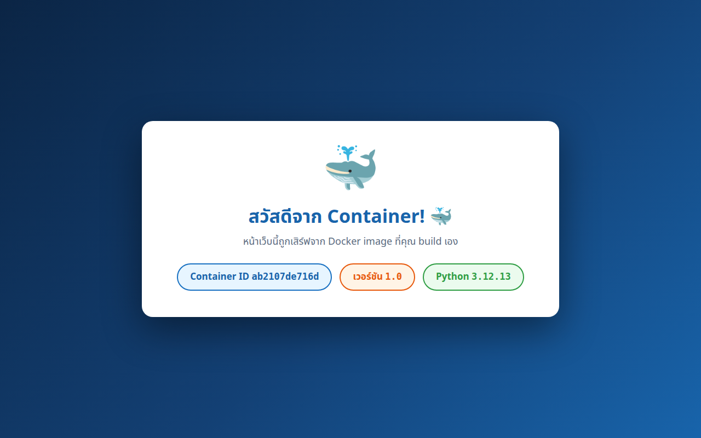
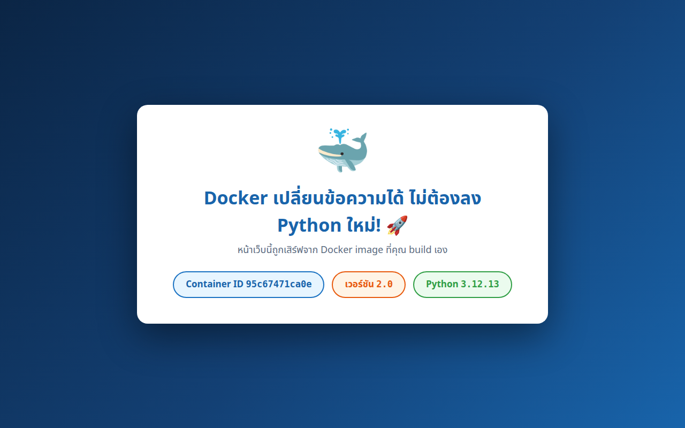

# LAB 1 — สร้าง Docker Image แรกของคุณด้วย Dockerfile

> โฟลเดอร์ `001_LAB_Dockerfile_First_Image` = **LAB 1** ในสไลด์ `Docker_Week11_Slides.html`
> (ไฟล์โค้ดของแล็บนี้ : `Dockerfile` · `app.py` · `requirements.txt` · `.dockerignore`)

## สิ่งที่จะได้เรียนรู้

- อ่าน **Dockerfile** ให้ออกทุกบรรทัด : `FROM` · `WORKDIR` · `COPY` · `RUN` · `ENV` · `EXPOSE` · `CMD` — คำสั่งไหนทำงาน **ตอน build** คำสั่งไหนทำงาน **ตอน start**
- `docker build` คำสั่งเดียว เปลี่ยนโค้ด + สูตร ให้กลายเป็น **image ของเราเอง** ที่รันได้ทุกเครื่อง
- image ไม่ใช่ก้อนทึบ แต่คือ **layer ซ้อนกันเป็นชั้น** — ส่องย้อนกลับได้ด้วย `docker history`
- **image = พิมพ์เขียว · container = บ้านที่สร้างจากพิมพ์เขียว** — 1 image รันได้หลาย container พร้อมกัน
- **layer cache** ทำให้ build รอบสองเร็วกว่ารอบแรกหลายเท่า — และนี่คือเหตุผลที่ต้อง `COPY requirements.txt` ก่อน `COPY app.py`
- `docker run -e` ทับค่า **ENV** ได้ตอนรัน — เปลี่ยน config โดยไม่ต้องแก้ Dockerfile ไม่ต้อง build ใหม่
- `.dockerignore` กันไฟล์ที่ไม่เกี่ยว (git history, รูป, เอกสาร) ไม่ให้หลุดเข้า build context และ image

## ภาพรวมของแล็บนี้

1. **เปิดเครื่องเรียนแล้วเช็กว่า Docker พร้อม** — image ที่เราจะ build ทั้งหมดเกิดขึ้นข้างในกล่องเรียนนี้ พังก็ลบทิ้งสร้างใหม่ได้
2. **Clone โค้ดแล็บแล้วอ่านไฟล์ทั้ง 4 ให้เข้าใจก่อน build** — จะได้ไม่ใช่การกดตามสูตร แต่รู้ว่าแต่ละบรรทัดของ Dockerfile กำลังสั่งอะไร
3. **`docker build` ครั้งแรก** — เห็น Docker pull base image แล้วไล่ทำทีละ step จนได้ `myapp:1.0` ของเราเอง
4. **ส่อง layer ด้วย `docker history`** — พิสูจน์ว่าแต่ละบรรทัดใน Dockerfile ทิ้งรอยไว้เป็น layer จริง ๆ
5. **รัน container จาก image แล้วเปิดหน้าเว็บในเบราว์เซอร์** — หน้าเว็บแรกที่เสิร์ฟจาก image ที่ "ฉัน build เอง"
6. **รัน container ตัวที่สองจาก image เดิม** — สองบ้านจากพิมพ์เขียวเดียวกัน แต่ละหลังมี Container ID ของตัวเอง
7. **แก้โค้ด 1 บรรทัดแล้ว build ใหม่** — จับเวลาเทียบกัน เห็น layer cache ทำงานด้วยตาตัวเอง
8. **รันเวอร์ชันใหม่พร้อม override ENV** — เปลี่ยนป้ายเวอร์ชันบนหน้าเว็บด้วย `-e` โดยไม่แตะ Dockerfile
9. **เช็ก `.dockerignore` แล้วล้างกระดาน** — ยืนยันว่าใน image มีเฉพาะไฟล์ที่เราตั้งใจใส่

> **คำถามก่อนเริ่ม:** ถ้าแก้ `app.py` แค่บรรทัดเดียวแล้วสั่ง build ใหม่ Docker ต้องดาวน์โหลด Python และติดตั้ง Flask ใหม่ทั้งหมดอีกรอบหรือไม่? ข้อ 7 จะตอบด้วยตัวเลขเวลาจริงจากเครื่องเรียน

---

## 0. เตรียมเครื่องเรียน

ทำบนเครื่องของเราเอง (ไม่ใช้ cloud) — เปิด container ที่ติดตั้ง Docker มาให้แล้ว

```bash
docker start devtools 2>/dev/null || \
  docker run -dit --name devtools --privileged -p 2222:22 tuchsanai/devtools:2569_1
ssh root@localhost -p 2222        # password : passwd
```

> 📝 **คำอธิบาย:** `docker start ... || docker run ...` เปิดเครื่องเรียนเดิมถ้ามี และสร้างใหม่เฉพาะเมื่อยังไม่มี จึงไม่ลบ clone จาก LAB ก่อนหน้า ·
> `-dit` คือ `-d` รันเบื้องหลัง + `-i` เปิด stdin ค้างไว้ + `-t` ให้มี terminal กล่องจะได้ไม่ดับทันที · `--privileged` ให้สิทธิ์เต็มเพื่อรัน **Docker ซ้อนข้างในกล่อง** (จำเป็น — image `myapp` ที่เราจะ build ในแล็บนี้ ถูกสร้างโดย Docker ที่รันอยู่ข้างในเครื่องเรียนอีกที) ·
> `-p 2222:22` ส่ง port 2222 ของเครื่องเรา เข้า port 22 (SSH) ของกล่อง

> ⚠️ `--privileged` ใช้เฉพาะ disposable classroom container นี้ ไม่ใช่ค่าที่ควรใช้กับ production workload

> ใน VS Code ใช้ **Remote-SSH** ต่อไปที่ `root@localhost:2222` แล้วทำแล็บทั้งหมดข้างใน

ตรวจว่าพร้อมใช้งาน :

```bash
docker --version
docker info --format 'Docker daemon: {{.ServerVersion}}'
```

> 📝 **คำอธิบาย:** บรรทัดแรกเช็ก Docker CLI และบรรทัดที่สองถาม daemon โดยตรง จึงยืนยันได้ว่าคำสั่ง `docker` วิ่งถึง daemon ก่อนเริ่มแล็บ · สิ่งที่ต้องดูคือ "มีเลขเวอร์ชันขึ้นมาไหม" ไม่ใช่ "เลขตรงกับเอกสารไหม" ·
> ถ้าขึ้น `Cannot connect to the Docker daemon` แปลว่ายังอยู่นอกกล่องเรียนหรือ daemon ยังไม่ขึ้น ให้ย้อนทำข้อ 0 ใหม่

✅ **Expected output** — ขอแค่มี **เลขเวอร์ชัน** ขึ้นครบสองบรรทัด ไม่ใช่ error (เลขเวอร์ชันของแต่ละคนอาจไม่ตรงกับเอกสารนี้):

```
Docker version 29.6.2, build dfc4efb
Docker daemon: 29.6.2
```

---

## 1. Clone โค้ดแล็บ

```bash
mkdir -p ~/labwork && cd ~/labwork
git clone https://github.com/Tuchsanai/DevTools.git
cd DevTools/03_Docker/04_Docker/001_LAB_Dockerfile_First_Image
```

> 📝 **คำอธิบาย:** `mkdir -p ~/labwork` สร้างโฟลเดอร์เก็บงาน (`-p` = มีอยู่แล้วก็ไม่ error) · `git clone` ดึงรีโพของวิชาลงมา ทำครั้งเดียวใช้ได้ทุกแล็บของสัปดาห์นี้ · แล้ว `cd` เข้าโฟลเดอร์แล็บ ซึ่งมี `Dockerfile` · `app.py` · `requirements.txt` · `.dockerignore` รออยู่แล้ว ·
> ถ้าเคย clone ไว้ git จะบอกว่าโฟลเดอร์ไม่ว่าง — ข้ามไป `cd` ได้เลย

---

## 2. สำรวจไฟล์แล็บ — อ่าน Dockerfile ให้ออกทีละบรรทัด

```bash
ls -la
```

✅ **Expected output** — เห็นไฟล์ครบ 4 ตัว (วันเวลา · ขนาดของแต่ละคนอาจไม่ตรงกับเอกสารนี้):

```
total 24
drwxr-xr-x 2 root root 4096 Aug 12 18:37 .
drwxr-xr-x 3 root root 4096 Aug 12 18:50 ..
-rw-r--r-- 1 root root  153 Aug 12 18:37 .dockerignore
-rw-r--r-- 1 root root  627 Aug 12 18:37 Dockerfile
-rw-r--r-- 1 root root 2331 Aug 12 18:37 app.py
-rw-r--r-- 1 root root   13 Aug 12 18:37 requirements.txt
```

ดูพระเอกของแล็บนี้กันก่อน — **Dockerfile** คือ "สูตรทำอาหาร" ที่บอก Docker ว่าจะประกอบ image ขึ้นมาอย่างไร :

```bash
cat Dockerfile
```

```dockerfile
# ── Image แรกของคุณ : Flask web app ขนาดเล็ก ──────────────────────────
# ลำดับบรรทัดมีความหมาย! คัดลอก requirements.txt ก่อน source code
# เพื่อให้ layer "pip install" ถูก cache ไว้ แม้เราแก้ app.py กี่ครั้งก็ตาม

FROM python:3.12-slim

WORKDIR /app

COPY requirements.txt .
RUN pip install --no-cache-dir -r requirements.txt

COPY app.py .

ENV APP_VERSION=1.0

EXPOSE 5000

CMD ["python", "app.py"]
```

> 📝 **คำอธิบาย (anatomy ของ Dockerfile — ไล่จากบนลงล่าง):**
> `FROM python:3.12-slim` — ทุก image ต้องเริ่มจาก **base image**; เราไม่ได้ลง Python เอง แต่ "ต่อยอด" จาก image ทางการของ Python · `:3.12-slim` คือ **tag** ระบุเวอร์ชัน (`slim` = Debian ฉบับตัดให้เล็ก เหลือเท่าที่ Python ต้องใช้) — pin tag เสมอ เพื่อให้ทั้งห้อง build แล้วได้ผลเหมือนกัน ·
> `WORKDIR /app` — ตั้ง "โฟลเดอร์ทำงาน" ใน image (ยังไม่มีก็สร้างให้) คำสั่ง `COPY`/`RUN`/`CMD` หลังจากนี้ทำงานในโฟลเดอร์นี้ทั้งหมด ·
> `COPY requirements.txt .` แล้วค่อย `RUN pip install ...` — คัดลอก **เฉพาะรายชื่อไลบรารี** เข้าไปก่อน แล้วติดตั้ง; ยังไม่แตะ source code — คอมเมนต์หัวไฟล์บอกเหตุผลไว้แล้ว และข้อ 7 จะพิสูจน์ด้วยการจับเวลา ·
> `RUN` ทำงาน **ตอน build** — ผลของคำสั่ง (Flask ที่ติดตั้งแล้ว) ถูก "อบ" เก็บไว้ใน layer ของ image เลย (`--no-cache-dir` ไม่เก็บ cache ของ pip ให้ image เล็กลง) ·
> `COPY app.py .` — ค่อยเอา source code เข้ามาเป็นลำดับท้าย ๆ เพราะเป็นไฟล์ที่เราแก้บ่อยที่สุด ·
> `ENV APP_VERSION=1.0` — ฝังตัวแปร environment เป็น **ค่า default** ของทุก container ที่เกิดจาก image นี้ (ข้อ 8 จะทับค่านี้ด้วย `-e` ตอนรัน) ·
> `EXPOSE 5000` — **แค่ประกาศ** ให้คนอ่าน/เครื่องมือรู้ว่าแอปข้างในฟัง port 5000 — **ไม่ได้เปิด port จริง!** ตัวที่เปิดจริงคือ `-p` ตอน `docker run` ·
> `CMD ["python", "app.py"]` — คำสั่งที่จะรัน **ตอน container start** (ไม่ใช่ตอน build) มีได้บรรทัดเดียว — คู่เปรียบเทียบ `RUN` vs `CMD` คือหัวใจของบรรทัดนี้: `RUN` = ทำตอนประกอบ image, `CMD` = ทำตอนเปิดใช้งาน

ต่อด้วยตัวเว็บแอป — Flask ขนาดจิ๋วที่โชว์ข้อความ, Container ID และเวอร์ชัน :

```bash
cat app.py
```

```python
import os
import socket
import sys

from flask import Flask

app = Flask(__name__)

# ── ลองแก้ข้อความบรรทัดล่างนี้ แล้ว build image ใหม่ เพื่อดู layer cache ทำงาน ──
MESSAGE = "สวัสดีจาก Container! 🐳"

PAGE = """<!doctype html>
        ... (HTML + CSS ของหน้าเว็บ — การ์ดสีขาวบนพื้นน้ำเงิน ราว 40 บรรทัด) ...
</html>"""


@app.route("/")
def home():
    return PAGE.format(
        message=MESSAGE,
        hostname=socket.gethostname(),
        version=os.environ.get("APP_VERSION", "dev"),
        py="%d.%d.%d" % sys.version_info[:3],
    )


if __name__ == "__main__":
    app.run(host="0.0.0.0", port=5000)
```

> 📝 **คำอธิบาย:** จุดที่เกี่ยวกับแล็บมี 4 จุด · **(1)** `MESSAGE` คือบรรทัดที่เราจะแก้ในข้อ 7 (มีคอมเมนต์ชี้เป้าไว้แล้ว) · **(2)** `socket.gethostname()` — ใน container ค่า hostname คือ **Container ID 12 ตัวแรก** หน้าเว็บจึงบอกได้ว่า "ฉันรันอยู่ในบ้านหลังไหน" (ข้อ 6 ใช้พิสูจน์เรื่อง 1 image หลาย container) ·
> **(3)** `os.environ.get("APP_VERSION", "dev")` อ่านค่าจาก ENV — ต้นทางคือ `ENV APP_VERSION=1.0` ใน Dockerfile หรือค่าที่ `-e` ทับตอนรัน · **(4)** `host="0.0.0.0"` สำคัญมาก: ให้ Flask ฟัง **ทุก interface** — ถ้าฟังแค่ `127.0.0.1` จะเข้าจากนอก container ไม่ได้เลยแม้จะ `-p` แล้วก็ตาม

ปิดท้ายด้วยไฟล์ประกอบอีกสองตัว :

```bash
cat requirements.txt
cat .dockerignore
```

✅ **Expected output**:

```
flask==3.0.3
# ไฟล์ที่ไม่ควรหลุดเข้าไปใน build context / image
__pycache__/
*.pyc
.git
.gitignore
readme.md
images/
```

> 📝 **คำอธิบาย:** `requirements.txt` pin เวอร์ชัน Flask ตายตัว — build วันไหนก็ได้ไลบรารีชุดเดิม · `.dockerignore` ทำงานเหมือน `.gitignore` แต่กับ **build context**: รายชื่อในไฟล์นี้จะไม่ถูกส่งให้ Docker ตอน build เลย (ข้อ 3 จะเห็นบรรทัด `load .dockerignore` ในผล build และข้อ 9 จะพิสูจน์ผลลัพธ์ใน image จริง)

---

## 3. Build Image แรก — `docker build`

ได้เวลาเสก 4 ไฟล์ให้กลายเป็น image — ใส่ `time` ไว้หน้าเพื่อจับเวลาเก็บไว้เทียบกับข้อ 7 :

```bash
time docker build -t myapp:1.0 .
```

> 📝 **คำอธิบาย:** `docker build` อ่าน `Dockerfile` แล้วไล่ทำทีละบรรทัด · `-t myapp:1.0` ตั้ง **ชื่อ:tag** ให้ image (ไม่ตั้งจะได้ image ไร้ชื่อ เรียกใช้ลำบาก) · `.` (จุด!) คือ **build context** — "ส่งโฟลเดอร์ปัจจุบันทั้งโฟลเดอร์ให้ Docker ใช้เป็นวัตถุดิบ" คำสั่ง `COPY` หยิบไฟล์ได้เฉพาะจากในนี้เท่านั้น · `time` ของ shell รายงานเวลารวมไว้บรรทัด `real` ท้ายผลลัพธ์ ·
> ⚠️ จุดพลาดอันดับหนึ่ง: **ลืมจุดท้ายคำสั่ง** — จะเจอ `ERROR: "docker buildx build" requires exactly 1 argument` · และต้องรันจากในโฟลเดอร์แล็บ (มี `Dockerfile` อยู่) เท่านั้น

✅ **Expected output** — ครั้งแรก Docker ต้อง **pull base image** ก่อน (นานเท่าไรแล้วแต่เน็ต) แล้วไล่ step `[1/5]` ถึง `[5/5]` ตามบรรทัดใน Dockerfile จบด้วย `naming to docker.io/library/myapp:1.0` (digest · ตัวเลขเวลาของแต่ละคนจะไม่ตรงกับเอกสารนี้):

```
#1 [internal] load build definition from Dockerfile
#1 transferring dockerfile: 666B done

#2 [internal] load metadata for docker.io/library/python:3.12-slim
#2 DONE 1.4s

#3 [internal] load .dockerignore
#3 transferring context: 195B done

#4 [internal] load build context
#4 transferring context: 2.42kB done

#5 [1/5] FROM docker.io/library/python:3.12-slim@sha256:229a2c5bfa27...
#5 sha256:26c307b5e35a... 29.78MB / 29.78MB 2.1s done
        ... (pull base image รวม 4 blob ≈ 43MB — เกิดเฉพาะครั้งแรกที่เครื่องยังไม่มี image นี้) ...
#5 DONE 3.3s

#6 [2/5] WORKDIR /app
#6 DONE 0.1s
#7 [3/5] COPY requirements.txt .
#7 DONE 0.1s
#8 [4/5] RUN pip install --no-cache-dir -r requirements.txt
#8 1.044 Collecting flask==3.0.3 (from -r requirements.txt (line 1))
        ... (ดาวน์โหลด + ติดตั้ง dependency ของ Flask อีก 6 ตัว) ...
#8 1.595 Successfully installed Jinja2-3.1.6 MarkupSafe-3.0.3 Werkzeug-3.1.8 blinker-1.9.0 click-8.4.2 flask-3.0.3 itsdangerous-2.2.0
#8 DONE 1.7s
#9 [5/5] COPY app.py .
#9 DONE 0.1s
#10 exporting to image
#10 exporting manifest list sha256:c8886bd31b845f085b4870d061873746de16ae40306c0c24dd5e80d7556db6a6 0.0s done
#10 naming to docker.io/library/myapp:1.0 done
#10 DONE 0.8s

real	0m7.924s
```

> 📝 **สังเกต 3 จุดในผลลัพธ์:** (1) `load .dockerignore` — Docker อ่านไฟล์กันของหลุดตั้งแต่วินาทีแรก และ `load build context` ส่งไฟล์ไปแค่ **2.42kB** เพราะ readme/รูปถูกกันไว้หมด · (2) step `[1/5]`–`[5/5]` map ตรงกับบรรทัด `FROM`→`WORKDIR`→`COPY`→`RUN`→`COPY` ใน Dockerfile (ส่วน `ENV`/`EXPOSE`/`CMD` เป็น metadata ไม่นับเป็น step ทำงาน) · (3) **จดเวลา `real` ของตัวเองไว้** — ข้อ 7 จะใช้เทียบ

image เกิดแล้วจริงไหม — ดูรายการ image ในเครื่อง :

```bash
docker images
```

✅ **Expected output** — มี `myapp:1.0` ขนาดราว 200MB (ID ของแต่ละคนจะไม่ตรงกับเอกสารนี้):

```
IMAGE       ID             DISK USAGE   CONTENT SIZE   EXTRA
myapp:1.0   c8886bd31b84        197MB         48.2MB
```

> 📝 **คำอธิบาย:** Docker รุ่นใหม่ (29+) รายงานสองขนาด — `DISK USAGE` คือขนาดจริงบนดิสก์หลังคลายออก (~197MB — ส่วนใหญ่คือ Debian + Python จาก base image ไม่ใช่โค้ดเรา) ส่วน `CONTENT SIZE` คือขนาดแบบบีบอัดถ้าจะส่งขึ้น registry (~48MB) ·
> สังเกตว่า `python:3.12-slim` ไม่โผล่เป็นแถวแยก — BuildKit เก็บ base image ไว้ใน **build cache** ให้เอง

---

## 4. ส่อง Layer ด้วย `docker history`

image ที่เพิ่งได้มาไม่ใช่ก้อนทึบก้อนเดียว — มันคือ **layer ซ้อนกันเป็นชั้น ๆ** และแต่ละชั้นย้อนรอยกลับไปหาบรรทัดใน Dockerfile ได้ :

```bash
docker history myapp:1.0
```

✅ **Expected output** — อ่าน **จากล่างขึ้นบน** = ลำดับเวลาการสร้าง (7 แถวบนคือฝีมือเรา แถวล่าง ๆ คือ base image · ID/เวลาของแต่ละคนจะไม่ตรงกับเอกสารนี้):

```
IMAGE          CREATED          CREATED BY                                      SIZE      COMMENT
c8886bd31b84   19 seconds ago   CMD ["python" "app.py"]                         0B        buildkit.dockerfile.v0
<missing>      19 seconds ago   EXPOSE [5000/tcp]                               0B        buildkit.dockerfile.v0
<missing>      19 seconds ago   ENV APP_VERSION=1.0                             0B        buildkit.dockerfile.v0
<missing>      19 seconds ago   COPY app.py . # buildkit                        12.3kB    buildkit.dockerfile.v0
<missing>      19 seconds ago   RUN /bin/sh -c pip install --no-cache-dir -r…   15.2MB    buildkit.dockerfile.v0
<missing>      21 seconds ago   COPY requirements.txt . # buildkit              12.3kB    buildkit.dockerfile.v0
<missing>      21 seconds ago   WORKDIR /app                                    8.19kB    buildkit.dockerfile.v0
<missing>      7 days ago       CMD ["python3"]                                 0B        buildkit.dockerfile.v0
        ... (layer ของ base image python:3.12-slim อีก 9 แถว — ตัว Python 41.4MB + Debian 87.4MB) ...
```

> 📝 **คำอธิบาย:** ทุกบรรทัดของ Dockerfile ทิ้งรอยไว้ที่นี่ — ไล่เทียบได้เลย: `WORKDIR /app` → `COPY requirements.txt` → `RUN pip install` (**15.2MB** = Flask กับผองเพื่อนที่ติดตั้งไป) → `COPY app.py` → `ENV`/`EXPOSE`/`CMD` ·
> แถวที่ `SIZE = 0B` คือ **metadata layer** — บันทึกการตั้งค่า ไม่มีไฟล์เพิ่ม · `<missing>` เป็นเรื่องปกติ: layer ย่อยไม่มี image ID ของตัวเอง มีแค่ image ปลายทาง · แถว `7 days ago` ลงไปคือชั้นของ `python:3.12-slim` ที่คนอื่นสร้างไว้ — **เราต่อยอดโดยไม่ต้อง build ซ้ำ** · ที่ต้องรู้จัก layer ตอนนี้ เพราะข้อ 7 กลไก cache จะทำงาน "ทีละ layer" ตามลำดับนี้เป๊ะ ๆ

---

## 5. รัน Container จาก Image ของเราเอง

พิมพ์เขียวพร้อมแล้ว — สร้างบ้านหลังแรก :

```bash
docker rm -f myapp 2>/dev/null || true
docker run -d --name myapp -p 8081:5000 myapp:1.0
```

> 📝 **คำอธิบาย:** `docker rm -f myapp 2>/dev/null` เก็บกวาด container ชื่อซ้ำจากรอบก่อน (ถ้าไม่มีก็เงียบ ๆ ไป) · `-d` รันเบื้องหลัง · `--name myapp` ตั้งชื่อไว้เรียกสั้น ๆ · `-p 8081:5000` **นี่คือตัวเปิด port จริง**: ส่ง port 8081 ของเครื่องเรียน เข้า port 5000 ที่ Flask ฟังอยู่ใน container (ฝั่งซ้าย = ข้างนอก, ฝั่งขวา = ข้างใน) — `EXPOSE 5000` ใน Dockerfile เป็นเพียงป้ายประกาศ ไม่เคยเปิดอะไรให้ · ท้ายสุดคือชื่อ image `myapp:1.0` ที่เรา build เอง ไม่ได้ pull มาจากไหน

✅ **Expected output** — container ID ยาว 64 ตัวอักษร = container เริ่มรันแล้ว (ID ของแต่ละคนจะไม่ตรงกับเอกสารนี้):

```
ab2107de716d7db49328b1d876efb6e59ad5c163b28382a25b1aba75cfa5dea6
```

```bash
docker ps
```

✅ **Expected output** — STATUS เป็น `Up` และ PORTS มีลูกศร `0.0.0.0:8081->5000/tcp` (ID · เวลาของแต่ละคนจะไม่ตรงกับเอกสารนี้):

```
CONTAINER ID   IMAGE       COMMAND           CREATED         STATUS         PORTS                                         NAMES
ab2107de716d   myapp:1.0   "python app.py"   3 seconds ago   Up 3 seconds   0.0.0.0:8081->5000/tcp, [::]:8081->5000/tcp   myapp
```

> 📝 **คำอธิบาย:** คอลัมน์ `COMMAND` โชว์ `"python app.py"` — มาจากบรรทัด `CMD` ใน Dockerfile ของเราเป๊ะ ๆ · `CONTAINER ID` 12 ตัวนี้ (ของเราคือ `ab2107de716d`) จะไปโผล่บนหน้าเว็บด้วย เพราะมันคือ hostname ของ container

ยิงคำขอแรกหา web server ของเราเอง :

```bash
curl -s http://localhost:8081 | grep -o 'สวัสดีจาก Container! 🐳'
```

> 📝 **คำอธิบาย:** `curl -s` ดึงหน้าเว็บแบบเงียบ ๆ · `grep -o` คัดเฉพาะข้อความทักทายออกมาจาก HTML — แค่มีบรรทัดนี้เด้งกลับมา ก็พิสูจน์แล้วว่า **request วิ่งผ่าน port 8081 → เข้า container → Flask ตอบ** ครบวงจร ·
> ⚠️ ถ้าเจอ `Connection refused` ทั้งที่ `docker ps` ขึ้น `Up` — Flask ใช้เวลาบูต 1–2 วินาทีแรก รอแป๊บแล้ว curl ซ้ำ

✅ **Expected output**:

```
สวัสดีจาก Container! 🐳
```

### เปิดหน้าเว็บในเบราว์เซอร์

หน้าเว็บเปิดอยู่ที่ port `8081` **ข้างในเครื่องเรียน** ไม่ใช่บนเครื่องเราโดยตรง — ต้องให้ VS Code forward port ออกมาก่อน (VS Code จะสร้าง **SSH tunnel** ให้อัตโนมัติ) :

1. เปิดแท็บ **PORTS** (แถวเดียวกับ TERMINAL)
2. กดปุ่ม **Forward a Port**
3. พิมพ์ `8081` แล้วกด **Enter**
4. เปิด `http://localhost:8081` ในเบราว์เซอร์ (หรือคลิกไอคอนลูกโลกในแถวของ port)

✅ เจอการ์ดสีขาวบนพื้นน้ำเงิน — ข้อความทักทาย พร้อมชิป **Container ID** (ตรงกับ `docker ps`!) · **เวอร์ชัน 1.0** (จาก `ENV`) · เวอร์ชัน Python:



> **Wow moment แรกของแล็บ :** หน้าเว็บทั้งหน้านี้เสิร์ฟออกมาจาก image ที่ **คุณ build เองเมื่อหนึ่งนาทีที่แล้ว** ด้วยคำสั่งเดียว — บนเครื่องไหนก็ได้ที่มี Docker ผลจะออกมาหน้าตาแบบนี้เป๊ะ ๆ

#### ทางเลือก : forward ด้วยคำสั่ง `ssh -L` (ไม่ใช้ VS Code)

เปิด terminal ใหม่บนเครื่องเรา แล้ว ssh พร้อมพ่วง tunnel :

```bash
ssh -L 8081:localhost:8081 root@localhost -p 2222        # password : passwd
```

> 📝 **คำอธิบาย:** ทำ SSH tunnel ด้วยมือ แทนการกดปุ่มในแท็บ PORTS · `-L 8081:localhost:8081` เปิด port 8081 บนเครื่องเรา แล้วส่งทุก connection ผ่านท่อ ssh ไปโผล่ที่ `localhost:8081` ฝั่งเครื่องเรียน ·
> `-p 2222` ตรงนี้คือ port ของ SSH (คนละความหมายกับ `-p` ของ `docker run`) · หน้าต่างนี้ต้องเปิดค้างไว้ — ปิดเมื่อไหร่ tunnel หายทันที และเบราว์เซอร์จะเปิดหน้าเว็บไม่ได้อีก

#### ทดลองเสร็จแล้ว — ลบ tunnel ทุกครั้ง

- แบบ `ssh -L` : พิมพ์ `exit` (หรือกด `Ctrl+D`) ใน session นั้น — tunnel ปิดทันที
- แบบ VS Code : แท็บ **PORTS** → คลิกขวาที่ port `8081` → **Stop Forwarding Port**

> ยังไม่ต้องปิดตอนนี้ก็ได้ — ข้อ 8 จะกลับมาดูหน้าเว็บผ่าน port เดิมอีกครั้ง แต่**จบแล็บแล้วต้องปิดเสมอ**

---

## 6. 1 Image → หลาย Container

ถ้า image คือพิมพ์เขียว ก็ต้องสร้างบ้านหลังที่สองได้โดยไม่ต้องเขียนแบบใหม่ — รันอีก container จาก image **ตัวเดิม** แค่เปลี่ยนชื่อกับ port :

```bash
docker run -d --name myapp2 -p 8082:5000 myapp:1.0
docker ps --format 'table {{.Names}}\t{{.Image}}\t{{.Ports}}\t{{.Status}}'
```

> 📝 **คำอธิบาย:** image `myapp:1.0` ตัวเดิมเป๊ะ — ที่ต้องเปลี่ยนคือ `--name` (ชื่อห้ามซ้ำ) และ port ฝั่งซ้าย `8082` (port เครื่องเรียนหนึ่ง port มีเจ้าของได้คนเดียว) ส่วนฝั่งขวายังเป็น `5000` เหมือนเดิมเพราะใน "บ้านของใครของมัน" Flask ก็ฟัง 5000 ของตัวเอง ไม่ชนกัน ·
> `docker ps --format 'table ...'` เลือกโชว์เฉพาะคอลัมน์ที่อยากดู — ตารางจะได้ไม่ล้นจอ

✅ **Expected output** — สอง container สถานะ `Up` จาก **IMAGE เดียวกัน** คนละ port (ID · เวลาของแต่ละคนจะไม่ตรงกับเอกสารนี้):

```
96edad8719a76e6f13b7f00937006234304d8a647a7a0691151036eb025973bc
NAMES     IMAGE       PORTS                                         STATUS
myapp2    myapp:1.0   0.0.0.0:8082->5000/tcp, [::]:8082->5000/tcp   Up 2 seconds
myapp     myapp:1.0   0.0.0.0:8081->5000/tcp, [::]:8081->5000/tcp   Up 5 minutes
```

สองบ้านนี้เป็นคนละหลังจริงไหม — ถาม Container ID จากหน้าเว็บของแต่ละตัว :

```bash
curl -s http://localhost:8081 | grep -oE '[0-9a-f]{12}'
curl -s http://localhost:8082 | grep -oE '[0-9a-f]{12}'
```

> 📝 **คำอธิบาย:** `grep -oE '[0-9a-f]{12}'` คัดเฉพาะสตริงฐานสิบหก 12 ตัวจาก HTML — ก็คือค่า hostname ที่ `app.py` อ่านจาก `socket.gethostname()` = Container ID ของแต่ละบ้าน · ยิงสอง port ได้ **คนละค่า** ทั้งที่โค้ดและ image เดียวกันทุกไบต์

✅ **Expected output** — สองบรรทัด **ไม่ซ้ำกัน** และตรงกับ `CONTAINER ID` ใน `docker ps` (ค่าของแต่ละคนจะไม่ตรงกับเอกสารนี้):

```
ab2107de716d
96edad8719a7
```

> **image = พิมพ์เขียว · container = บ้าน :** พิมพ์เขียวหนึ่งแผ่นสร้างบ้านได้กี่หลังก็ได้ แต่ละหลังมีเลขที่บ้าน (Container ID) ของตัวเอง มีชีวิตของตัวเอง — ลบบ้านทิ้งพิมพ์เขียวก็ยังอยู่ · หลักการเดียวกันนี้คือวิธีที่ระบบจริง scale: อยากรับโหลดเพิ่มก็ปั๊ม container เพิ่มจาก image เดิม

บ้านหลังที่สองหมดหน้าที่แล้ว — รื้อทิ้ง :

```bash
docker rm -f myapp2
```

✅ **Expected output**:

```
myapp2
```

---

## 7. แก้โค้ดแล้ว Build ใหม่ — ดู Layer Cache ทำงาน

ถึงคำถามก่อนเริ่มแล็บแล้ว — แก้ `MESSAGE` ใน `app.py` เป็นข้อความใหม่ จะเปิดแก้ใน VS Code ตรง ๆ ก็ได้ หรือใช้ `sed` บรรทัดเดียว :

```bash
sed -i 's/สวัสดีจาก Container! 🐳/Docker เปลี่ยนข้อความได้ ไม่ต้องลง Python ใหม่! 🚀/' app.py
grep -n 'MESSAGE =' app.py
```

> 📝 **คำอธิบาย:** `sed -i 's/เก่า/ใหม่/' app.py` แทนที่ข้อความในไฟล์ทันที (`-i` = แก้ลงไฟล์จริง) · `grep -n` เช็กผลว่าแก้เข้าแล้วจริง พร้อมเลขบรรทัด — เราแตะไฟล์ **แค่บรรทัดเดียว** และไม่ได้แตะ `requirements.txt` เลย จำจุดนี้ไว้ให้ดี

✅ **Expected output**:

```
10:MESSAGE = "Docker เปลี่ยนข้อความได้ ไม่ต้องลง Python ใหม่! 🚀"
```

build ใหม่เป็น tag `2.0` — จับเวลาเหมือนเดิม แล้วดูให้ดีว่ารอบนี้ Docker "ทำ" อะไรจริง ๆ บ้าง :

```bash
time docker build -t myapp:2.0 .
```

✅ **Expected output** — สาม step แรกขึ้น **`CACHED`** ทำงานจริงแค่ `COPY app.py` กับ export · เวลารวมเหลือ **ไม่ถึง 2 วินาที** จาก ~8 วินาทีในข้อ 3 (ตัวเลขของแต่ละคนจะไม่ตรงกับเอกสารนี้ แต่ต้องเห็น `CACHED` ครบสามบรรทัดเหมือนกัน):

```
#5 [1/5] FROM docker.io/library/python:3.12-slim@sha256:229a2c5bfa27...
#5 DONE 0.0s
#6 [2/5] WORKDIR /app
#6 CACHED
#7 [3/5] COPY requirements.txt .
#7 CACHED
#8 [4/5] RUN pip install --no-cache-dir -r requirements.txt
#8 CACHED
#9 [5/5] COPY app.py .
#9 DONE 0.0s
#10 exporting to image
#10 naming to docker.io/library/myapp:2.0 done
#10 DONE 0.3s

real	0m1.922s
```

> 📝 **คำอธิบาย — กลไก cache ตัดสินทีละ layer ตามลำดับ:** `WORKDIR` ไม่เปลี่ยน → ใช้ของเดิม · `COPY requirements.txt` — Docker เทียบ **เนื้อไฟล์** แล้วพบว่าไม่เปลี่ยน → ใช้ของเดิม · เมื่อ layer ก่อนหน้าเหมือนเดิมหมด `RUN pip install` จึง **ไม่ต้องรันซ้ำ** — Flask ไม่ถูกติดตั้งใหม่ ไม่มีการแตะเน็ตเลย · มาถึง `COPY app.py` เนื้อไฟล์เปลี่ยน → ทำใหม่ตั้งแต่ layer นี้ลงไป ·
> **นี่คือคำตอบว่าทำไม Dockerfile ถึง `COPY requirements.txt` แยกก่อน `COPY app.py`** — ถ้าเขียน `COPY . .` บรรทัดเดียว แก้โค้ดหนึ่งตัวอักษร layer `pip install` ก็พังจาก cache ต้องติดตั้งใหม่ทุกไลบรารีทุกรอบ ·
> ⚠️ cache ไล่จากบนลงล่างและ **พังแล้วพังยาว**: layer ไหนเปลี่ยน ทุก layer หลังจากนั้นต้องทำใหม่หมด — เพราะงั้นใน Dockerfile จริง ให้เรียง "ของที่เปลี่ยนบ่อย" ไว้ล่างสุดเสมอ

> **Wow moment ที่สอง :** build รอบแรก `real 0m7.924s` — รอบนี้ `real 0m1.922s` เร็วขึ้น **~4 เท่า** ทั้งที่สั่ง build เต็ม ๆ เหมือนกันทุกตัวอักษร ยิ่งโปรเจกต์จริงที่ `pip install` กินเวลาหลายนาที ยิ่งต่างกันหลายสิบเท่า

ตอนนี้ในเครื่องมี image สองรุ่นอยู่คู่กัน :

```bash
docker images
```

✅ **Expected output** — `myapp` สอง tag (`U` ในคอลัมน์ EXTRA = image นั้นกำลังถูก container ที่รันอยู่ใช้งาน — ตอนนี้ `myapp` ตัวเก่ายังรัน `1.0` อยู่):

```
IMAGE       ID             DISK USAGE   CONTENT SIZE   EXTRA
myapp:1.0   c8886bd31b84        197MB         48.2MB   U
myapp:2.0   32d6df8973f1        197MB         48.2MB
```

> 📝 **คำอธิบาย:** ขนาดขึ้นเป็น 197MB ทั้งคู่ แต่ **ไม่ได้กินดิสก์ 394MB** — สอง image นี้แชร์ layer ร่วมกันเกือบทั้งหมด (base + pip install) ต่างกันจริงแค่ layer `COPY app.py` ไม่กี่ kB · การเก็บหลายเวอร์ชันไว้คู่กันจึงถูกมาก และถอยกลับ (rollback) ไป `1.0` ได้ทุกเมื่อ

---

## 8. รันเวอร์ชันใหม่ + Override ENV ด้วย `-e`

สลับ container มาใช้ image ใหม่ พร้อมของแถม: ทับค่า `APP_VERSION` ตอนรันด้วย `-e` — ไม่ต้องแก้ Dockerfile ไม่ต้อง build ซ้ำ :

```bash
docker rm -f myapp
docker run -d --name myapp -p 8081:5000 -e APP_VERSION=2.0 myapp:2.0
```

> 📝 **คำอธิบาย:** ต้อง `docker rm -f` ตัวเก่าก่อน — **container ที่รันอยู่ไม่มีวันเปลี่ยน image เอง** เพราะโค้ดถูก "อบ" ไว้ใน image ตั้งแต่ตอน build (แก้ไฟล์บนเครื่องแล้วรีเฟรชเบราว์เซอร์จึงไม่มีอะไรเปลี่ยน จนกว่าจะ build + run ใหม่แบบนี้) ·
> `-e APP_VERSION=2.0` ตั้งค่า environment variable ให้ container นี้ — ค่านี้ **ชนะ** `ENV APP_VERSION=1.0` ใน Dockerfile · ลำดับความสำคัญ: `-e` ตอน run > `ENV` ตอน build > default ในโค้ด (`"dev"`) ·
> ⚠️ ถ้าลืมใส่ `-e` หน้าเว็บจะขึ้น "เวอร์ชัน 1.0" ทั้งที่รันจาก `myapp:2.0` — เพราะเราไม่เคยแก้บรรทัด `ENV` ใน Dockerfile เลย นี่ไม่ใช่บั๊ก แต่คือ default ทำงานตามหน้าที่

✅ **Expected output** — ชื่อตัวเก่าที่ถูกลบ ตามด้วย ID ตัวใหม่ (ID ของแต่ละคนจะไม่ตรงกับเอกสารนี้):

```
myapp
95c67471ca0ea50a30a048ba242efe9763dc1992d1d24de2b7aee9db72011d1f
```

เช็กทั้งข้อความใหม่ (จาก image `2.0`) และเวอร์ชันใหม่ (จาก `-e`) ในคำขอเดียวกัน :

```bash
curl -s http://localhost:8081 | grep -o '<h1>.*</h1>'
curl -s http://localhost:8081 | grep -o 'เวอร์ชัน&nbsp;<b>[0-9.]*'
```

✅ **Expected output** — ข้อความใหม่มาจากการ build เวอร์ชัน `2.0` ส่วนเลขเวอร์ชันมาจาก `-e` ล้วน ๆ:

```
<h1>Docker เปลี่ยนข้อความได้ ไม่ต้องลง Python ใหม่! 🚀</h1>
เวอร์ชัน&nbsp;<b>2.0
```

รีเฟรชเบราว์เซอร์ที่ `http://localhost:8081` (tunnel เดิมจากข้อ 5 ใช้ต่อได้เลย — port ไม่เปลี่ยน) :



> **Wow moment ที่สาม :** ป้าย "เวอร์ชัน 2.0" บนหน้าเว็บ **ไม่ได้อยู่ในไฟล์ไหนเลย** — Dockerfile ยังเขียนว่า `1.0` อยู่เหมือนเดิม ค่านี้ถูกฉีดเข้ามาตอน `docker run -e` เท่านั้น · แอปเดียว build ครั้งเดียว แต่รันเป็น dev/staging/production ที่ config ต่างกันได้ ด้วยการเปลี่ยนแค่ตัวแปรตอนรัน — นี่คือแพตเทิร์นมาตรฐานของงาน deploy จริง

---

## 9. `.dockerignore` — พิสูจน์ว่าไม่มีไฟล์แปลกปลอมใน Image

ตอน build เราส่งทั้งโฟลเดอร์เป็น context แล้วไฟล์อื่น ๆ (readme, รูป, git history) ตามเข้าไปใน image ด้วยหรือเปล่า? เข้าไปดูในบ้านจริง ๆ :

```bash
docker exec myapp ls -la /app
```

> 📝 **คำอธิบาย:** `docker exec` แอบเข้าไปรันคำสั่งใน container ที่กำลังทำงาน · `/app` คือ `WORKDIR` ที่ Dockerfile ตั้งไว้ — ที่ที่ `COPY` วางไฟล์ลงไป

✅ **Expected output** — มีแค่ **2 ไฟล์** ที่ `COPY` ระบุชื่อไว้เท่านั้น (วันเวลาของแต่ละคนจะไม่ตรงกับเอกสารนี้):

```
total 16
drwxr-xr-x 1 root root 4096 Aug 12 11:57 .
drwxr-xr-x 1 root root 4096 Aug 12 11:58 ..
-rw-r--r-- 1 root root 2400 Aug 12 11:57 app.py
-rw-r--r-- 1 root root   13 Aug 12 11:37 requirements.txt
```

> 📝 **คำอธิบาย:** ความสะอาดนี้มาจากสองด่านที่ทำงานร่วมกัน · **ด่านแรก `.dockerignore`** — กันไฟล์ตามรายชื่อ (`.git`, `readme.md`, `images/`, `__pycache__/`) ไม่ให้เข้า build context ตั้งแต่ต้นทาง ผลคือ context เหลือ 2.42kB (เห็นในข้อ 3) build เร็วขึ้นและของที่ไม่ควรหลุด (ประวัติ git, ไฟล์ค้างในเครื่อง) ไม่มีทางไปโผล่ใน image ·
> **ด่านที่สอง `COPY` แบบระบุชื่อ** — Dockerfile ของเราสั่ง copy ทีละไฟล์ ไม่ใช่ `COPY . .` กวาดทั้งโฟลเดอร์ · งานจริงควรมีทั้งสองด่านเสมอ: `.dockerignore` เป็นตาข่ายนิรภัย ส่วน `COPY` เจาะจงเป็นเจตนาที่อ่านออก ·
> ⚠️ อันตรายคลาสสิกของการไม่มี `.dockerignore` + ใช้ `COPY . .` คือไฟล์ secret (`.env`, private key) หลุดติดเข้า image แล้วถูก push ขึ้น registry ให้คนทั้งโลกดึงไปแกะ

---

## 10. ล้างกระดาน (cleanup)

จบแล็บแล้ว — รื้อบ้าน เผาพิมพ์เขียว ให้เครื่องกลับมาสะอาดเหมือนก่อนเริ่ม :

```bash
docker rm -f myapp
docker rmi myapp:1.0 myapp:2.0
```

> 📝 **คำอธิบาย:** ลำดับสำคัญ — ต้องลบ **container ก่อน image** (`docker rmi` จะไม่ยอมลบ image ที่ยังมี container ใช้อยู่) · `docker rm -f` หยุดแล้วลบ container · `docker rmi` ลบ image ได้ทีละหลายตัวในคำสั่งเดียว

✅ **Expected output** — ชื่อ container ที่ลบ ตามด้วยรายการ `Untagged`/`Deleted` ของทั้งสอง tag (digest ของแต่ละคนจะไม่ตรงกับเอกสารนี้):

```
myapp
Untagged: myapp:1.0
Deleted: sha256:c8886bd31b845f085b4870d061873746de16ae40306c0c24dd5e80d7556db6a6
Untagged: myapp:2.0
Deleted: sha256:32d6df8973f18758c77f35ad8ec4c6180d73ea42c8aa3919bd288fac1b9ff232
```

ตรวจซ้ำว่าสะอาดจริง :

```bash
docker ps -a
docker images
```

✅ **Expected output** — สองตารางเหลือแค่หัว ไม่มีแถวข้อมูล:

```
CONTAINER ID   IMAGE     COMMAND   CREATED   STATUS    PORTS     NAMES
IMAGE   ID             DISK USAGE   CONTENT SIZE   EXTRA
```

> 📝 **คำอธิบาย:** `docker ps -a` เอา container ที่หยุดแล้วมาด้วย (`-a`) — ถ้ายังมีแถวเหลือ ลบด้วย `docker rm -f <ชื่อ>` ก่อนไปแล็บถัดไป · สิ่งเดียวที่ยังอยู่คือ **build cache** (รวม base image `python:3.12-slim`) — ตั้งใจเก็บไว้ เพราะแล็บถัด ๆ ไป build จะได้เร็ว ถ้าอยากล้างจริง ๆ ใช้ `docker builder prune -af` ได้ · ถ้ายังเปิด tunnel ของหน้าเว็บค้างอยู่ อย่าลืมปิดตามท้ายข้อ 5 ด้วย

---

## แก้ปัญหาที่พบบ่อย

| อาการ | สาเหตุ | วิธีแก้ |
|---|---|---|
| `Cannot connect to the Docker daemon` | ยังอยู่นอกกล่องเรียน หรือ daemon ยังไม่ขึ้น | ssh เข้ากล่องเรียนแล้วเช็กตามข้อ 0 ใหม่ |
| `ERROR: "docker buildx build" requires exactly 1 argument` | ลืม `.` (build context) ท้ายคำสั่ง build | เติม `.` — `docker build -t myapp:1.0 .` |
| `failed to read dockerfile ... no such file or directory` | รัน build จากโฟลเดอร์ที่ไม่มี `Dockerfile` | `cd` เข้าโฟลเดอร์แล็บก่อน (ข้อ 1) |
| `docker: ... The container name "/myapp" is already in use` | container ชื่อซ้ำค้างจากรอบก่อน | `docker rm -f myapp` แล้วรัน `docker run` ใหม่ |
| `Bind for 0.0.0.0:8081 failed: port is already allocated` | มี container อื่นจอง port 8081 อยู่ | `docker ps` หาตัวที่จอง แล้ว `docker rm -f` ตัวนั้น (หรือเปลี่ยนไปใช้ port อื่น เช่น `-p 8083:5000`) |
| `curl: (7) ... Connection refused` ทันทีหลัง `docker run` | Flask ยังบูตไม่เสร็จ (1–2 วินาทีแรก) | รอครู่เดียวแล้ว curl ซ้ำ — ถ้ายังไม่หายให้เช็ก `docker ps` ว่า container ยัง `Up` |
| แก้ `app.py` แล้วรีเฟรชเบราว์เซอร์ — ข้อความไม่เปลี่ยน | container ยังรัน image เก่า — โค้ดถูกอบไว้ตอน build แล้ว | build tag ใหม่ (ข้อ 7) แล้ว `docker rm -f` + `docker run` จาก image ใหม่ (ข้อ 8) |
| หน้าเว็บขึ้น "เวอร์ชัน 1.0" ทั้งที่รัน `myapp:2.0` | ลืม `-e APP_VERSION=2.0` — จึงใช้ค่า `ENV` เดิมใน Dockerfile | ใส่ `-e APP_VERSION=2.0` ตอน `docker run` (ข้อ 8) |
| เปิด `http://localhost:8081` ไม่ขึ้น | ยังไม่ได้ forward port หรือ tunnel ถูกปิดไปแล้ว | forward port `8081` ใหม่ในแท็บ PORTS (หรือเปิด `ssh -L` ค้างไว้) ตามข้อ 5 |

---

## สรุปสิ่งที่ได้เรียนรู้

| สิ่งที่ทำ | คำสั่ง/แนวคิดหลัก | ทำไมสำคัญ |
|---|---|---|
| อ่าน Dockerfile ครบทุกบรรทัด | `FROM` · `WORKDIR` · `COPY` · `RUN` · `ENV` · `EXPOSE` · `CMD` | สูตรสร้าง image ที่ทำซ้ำได้เหมือนเดิมทุกเครื่อง — และรู้ว่าอะไรทำงานตอน build (`RUN`) อะไรตอน start (`CMD`) |
| build image ของตัวเอง | `docker build -t myapp:1.0 .` | เปลี่ยนโค้ดเป็นของส่งมอบที่รันได้ทุกที่ ด้วยคำสั่งเดียว |
| ส่องข้างใน image | `docker history myapp:1.0` | image = layer ซ้อนกัน แต่ละบรรทัดของ Dockerfile ทิ้งรอยไว้หนึ่งชั้น |
| เปิดเว็บจาก container | `docker run -d -p 8081:5000` | `EXPOSE` เป็นแค่ป้ายประกาศ — `-p` คือตัวเปิด port จริง |
| รัน 2 container จาก image เดียว | `docker run --name myapp2 -p 8082:5000 myapp:1.0` | image = พิมพ์เขียว · container = บ้าน — นี่คือรากของการ scale ระบบจริง |
| build ซ้ำหลังแก้โค้ด | `CACHED` ใน output — 7.9s → 1.9s | layer cache ตัดสินทีละชั้นตามลำดับ — เหตุผลที่ `COPY requirements.txt` ต้องมาก่อน source code |
| เปลี่ยน config ตอนรัน | `docker run -e APP_VERSION=2.0` | `-e` ชนะ `ENV` ใน Dockerfile — แยก config ออกจาก image โดยไม่ต้อง build ใหม่ |
| กันไฟล์หลุดเข้า image | `.dockerignore` + `COPY` แบบระบุชื่อ | context เล็ก build เร็ว และ secret/ไฟล์ขยะไม่หลุดขึ้น registry |

ตอนนี้เรารู้แล้วว่า Dockerfile กลายเป็น image และ image กลายเป็น container ได้อย่างไร — แต่บรรทัดสุดท้าย `CMD ["python", "app.py"]` ยังมีความลับซ่อนอยู่: ถ้าพิมพ์อะไรต่อท้าย `docker run` คำสั่งนั้นจะ **ทับ CMD ทั้งบรรทัดทิ้งเลย** แล้วถ้าอยากให้ container มีคำสั่งประจำตัวที่ทับไม่ได้ล่ะ? **LAB 2 (`002_LAB_CMD_vs_ENTRYPOINT`)** จะทดลองจับคู่ `CMD` กับ `ENTRYPOINT` ให้เห็นความต่างด้วยการรันจริงทุกแบบ

## ✅ เช็กลิสต์ก่อนจบแล็บ

- [ ] `docker --version` และ `docker info --format ...` ขึ้นเลขเวอร์ชันทั้งคู่ ไม่มี error
- [ ] `ls -la` ในโฟลเดอร์แล็บเห็นครบ 4 ไฟล์ และอธิบายได้ว่า Dockerfile แต่ละบรรทัดทำอะไร
- [ ] `time docker build -t myapp:1.0 .` ผ่าน — เห็น pull base image, step `[1/5]`–`[5/5]` และจบด้วย `naming to docker.io/library/myapp:1.0` (จดเวลา `real` ไว้)
- [ ] `docker images` เห็น `myapp:1.0` ขนาดราว 200MB
- [ ] `docker history myapp:1.0` — ชี้ได้ว่าแถวไหนมาจากบรรทัดไหนใน Dockerfile และแถวไหนเป็นของ base image
- [ ] `docker ps` เห็น `myapp` สถานะ `Up` พร้อม `0.0.0.0:8081->5000/tcp` และ `curl` เจอ `สวัสดีจาก Container! 🐳`
- [ ] เปิดหน้าเว็บผ่าน port forward เห็นการ์ด v1 — Container ID บนหน้าเว็บตรงกับ `docker ps`
- [ ] รัน `myapp2` ที่ port 8082 แล้ว — สอง port ตอบ Container ID **คนละค่า** จาก image เดียวกัน แล้วลบ `myapp2` ทิ้ง
- [ ] แก้ `MESSAGE` แล้ว `time docker build -t myapp:2.0 .` — เห็น `CACHED` สามบรรทัด และเวลาเร็วกว่ารอบแรกชัดเจน
- [ ] รัน `myapp:2.0` พร้อม `-e APP_VERSION=2.0` — หน้าเว็บขึ้นข้อความใหม่ + เวอร์ชัน 2.0 และอธิบายได้ว่าเลข 2.0 มาจากไหน
- [ ] `docker exec myapp ls -la /app` เห็นแค่ `app.py` กับ `requirements.txt`
- [ ] ปิด tunnel ของหน้าเว็บแล้ว (Stop Forwarding Port หรือ `exit` ใน session ของ `ssh -L`)
- [ ] `docker rm -f myapp` + `docker rmi myapp:1.0 myapp:2.0` แล้ว `docker ps -a` และ `docker images` เหลือแค่หัวตาราง

*ผลลัพธ์ทั้งหมดในเอกสารนี้มาจากการรันจริงในเครื่องเรียน `tuchsanai/devtools:2569_1` เมื่อ 12 ส.ค. 2026*
