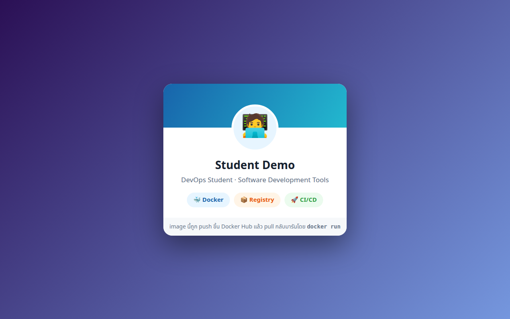

# LAB 3 — ส่งนามบัตรออนไลน์ของคุณขึ้น Docker Hub

> โฟลเดอร์ `003_LAB_Docker_Hub_Registry` = **LAB 3** ในสไลด์ `Docker_Week11_Slides.html`
> (ไฟล์โค้ดของแล็บนี้ : `Dockerfile` · `index.html` · `.dockerignore`)

## สิ่งที่จะได้เรียนรู้

- **registry** คือ "บ้านของ image" — build ที่เครื่องเรา เก็บบนคลาวด์ แล้วดึงไปรันที่เครื่องไหนก็ได้
- กติกาการตั้งชื่อ image `registry/username/repo:tag` — เรียนรู้จาก **push ที่โดนปฏิเสธจริง ๆ**
- login Docker Hub ด้วย **Access Token** แทนรหัสผ่าน — เพิกถอนได้ จำกัดสิทธิ์ได้
- `docker tag` คือการติด **ป้ายชื่อเพิ่ม** ไม่ใช่การสำเนา image — พิสูจน์ด้วย IMAGE ID
- วงจรเต็ม **build → push → ลบทิ้งทั้งเครื่อง → pull กลับมารัน** ในแล็บเดียว
- registry ฉลาดเรื่อง **layer** — push เวอร์ชันใหม่จะอัปโหลดเฉพาะชั้นที่เปลี่ยน

## ภาพรวมของแล็บนี้

1. **แก้นามบัตรให้เป็นชื่อของคุณ** — แล็บนี้ทุกคนได้ image ของตัวเอง ไม่ใช่ของอาจารย์ เพราะของที่เรากำลังจะ push ขึ้นคลาวด์ควรเป็นของเราจริง ๆ
2. **build image `docker-card:1.0` แล้วรันดูก่อน** — ต้องมั่นใจว่า image ใช้งานได้ ก่อนจะเอาไปแจกคนอื่น
3. **ลอง push ตรง ๆ แล้วโดนปฏิเสธ** — จงใจพลาดเพื่อให้เข้าใจกติกาการตั้งชื่อ image ลึกกว่าการท่องจำ
4. **สร้าง Access Token แล้ว `docker login`** — พิสูจน์ตัวตนกับ Docker Hub อย่างปลอดภัยโดยไม่พิมพ์รหัสผ่านจริงลง CLI
5. **`docker tag` ให้ถูกกติกาแล้ว push จริง** — นามบัตรของเราขึ้นไปอยู่บนคลาวด์ ใครก็ pull ได้
6. **ลบทุกอย่างออกจากเครื่องจนเกลี้ยง** — เพื่อพิสูจน์ว่า image ไม่ได้อยู่แค่ในเครื่องเราแล้ว
7. **pull กลับมารันใหม่** — นามบัตรเดินทางขึ้นคลาวด์แล้วกลับมา ครบวงจรชีวิตของ image
8. **โบนัส : push เวอร์ชัน 2.0** — ดูว่า registry อัปโหลดเฉพาะ layer ที่เปลี่ยน ที่เหลือขึ้น `Layer already exists`
9. **ล้างกระดาน** — logout + ลบ container/image ให้เครื่องเรียนสะอาดก่อนไปแล็บถัดไป

> **คำถามก่อนเริ่ม:** ถ้าเรา build image เสร็จแล้ว **ลบมันออกจากเครื่องจนไม่เหลือสักไบต์** เราจะยังเอามันกลับมารันได้อีกไหม? ข้อ 8–9 จะพิสูจน์คำตอบด้วยการลบจริง ๆ

---

## 0. เตรียมเครื่องเรียน

ทำบนเครื่องของเราเอง (ไม่ใช้ cloud) — เปิด container ที่ติดตั้ง Docker มาให้แล้ว

```bash
docker start devtools 2>/dev/null || \
  docker run -dit --name devtools --privileged -p 2222:22 tuchsanai/devtools:2569_1
ssh root@localhost -p 2222        # password : passwd
```

> 📝 **คำอธิบาย:** `docker start ... || docker run ...` เปิดเครื่องเรียนเดิมถ้ามี และสร้างใหม่เฉพาะเมื่อยังไม่มี จึงไม่ลบ clone จาก LAB ก่อนหน้า ·
> `-dit` คือ `-d` รันเบื้องหลัง + `-i` เปิด stdin ค้างไว้ + `-t` ให้มี terminal กล่องจะได้ไม่ดับทันที · `--privileged` ให้สิทธิ์เต็มเพื่อรัน **Docker ซ้อนข้างในกล่อง** (จำเป็น — image นามบัตรของแล็บนี้จะถูก build และรันอยู่ข้างในเครื่องเรียนอีกที) ·
> `-p 2222:22` ส่ง port 2222 ของเครื่องเรา เข้า port 22 (SSH) ของกล่อง

> ⚠️ `--privileged` ใช้เฉพาะ disposable classroom container นี้ ไม่ใช่ค่าที่ควรใช้กับ production workload

> ใน VS Code ใช้ **Remote-SSH** ต่อไปที่ `root@localhost:2222` แล้วทำแล็บทั้งหมดข้างใน

ตรวจว่าพร้อมใช้งาน :

```bash
docker --version
docker info --format 'Docker daemon: {{.ServerVersion}}'
```

> 📝 **คำอธิบาย:** บรรทัดแรกเช็ก Docker CLI และบรรทัดที่สองถาม daemon โดยตรง จึงยืนยันได้ว่าคำสั่ง `docker` วิ่งถึง daemon ก่อนเริ่มแล็บ · สิ่งที่ต้องดูคือ "มีเลขเวอร์ชันขึ้นมาไหม" ไม่ใช่ "เลขตรงกับเอกสารไหม" ·
> ถ้าขึ้น `Cannot connect to the Docker daemon` แปลว่ายังอยู่นอกกล่องเรียนหรือ daemon ยังไม่ขึ้น ให้ย้อนทำข้อ 0 ใหม่

✅ **Expected output** — ขอแค่มี **เลขเวอร์ชัน** ขึ้นครบสองบรรทัด ไม่ใช่ error (เลขเวอร์ชันของแต่ละคนอาจไม่ตรงกับเอกสารนี้):

```
Docker version 29.6.2, build dfc4efb
Docker daemon: 29.6.2
```

---

## 1. Clone โค้ดแล็บ

```bash
mkdir -p ~/labwork && cd ~/labwork
git clone https://github.com/Tuchsanai/DevTools.git
cd DevTools/03_Docker/04_Docker/003_LAB_Docker_Hub_Registry
```

> 📝 **คำอธิบาย:** `mkdir -p ~/labwork` สร้างโฟลเดอร์เก็บงาน (`-p` = มีอยู่แล้วก็ไม่ error) · `git clone` ดึงรีโพของวิชาลงมา ทำครั้งเดียวใช้ได้ทุกแล็บของชุดนี้ · แล้ว `cd` เข้าโฟลเดอร์แล็บ ซึ่งมี `Dockerfile` · `index.html` · `.dockerignore` รออยู่แล้ว ·
> ถ้าเคย clone ไว้จาก LAB ก่อนหน้า git จะบอกว่าโฟลเดอร์ไม่ว่าง — ข้ามไป `cd` ได้เลย

---

## 2. รู้จักไฟล์แล็บ + แก้นามบัตรให้เป็นชื่อคุณ

ดูว่าเรากำลังจะ build อะไร :

```bash
cat Dockerfile
cat index.html
```

> 📝 **คำอธิบาย:** `Dockerfile` ของแล็บนี้สั้นมาก — มีแค่ 3 คำสั่ง · `index.html` คือหน้านามบัตรออนไลน์หนึ่งหน้า (HTML + CSS จบในไฟล์เดียว) ที่เราจะยัดเข้าไปใน image

`Dockerfile` ทั้งไฟล์ :

```dockerfile
FROM nginx:1.27-alpine

COPY index.html /usr/share/nginx/html/index.html

EXPOSE 80
```

> 📝 **คำอธิบาย:** `FROM nginx:1.27-alpine` เริ่มจาก web server สำเร็จรูปรุ่น **alpine** ซึ่งเล็กมาก (ทั้ง image เนื้อจริงราว 21MB) — ยิ่ง image เล็ก push/pull ยิ่งเร็ว เหมาะกับแล็บที่ต้องส่งขึ้นคลาวด์จริง ·
> `COPY index.html /usr/share/nginx/html/index.html` วางนามบัตรของเราทับหน้า default ของ nginx — **นี่คือ layer เดียวที่เป็นของเราจริง ๆ** ที่เหลือเป็นของ nginx ทั้งหมด (จำจุดนี้ไว้ ข้อโบนัสจะเห็นผลของมันชัดมาก) ·
> `EXPOSE 80` เป็นเพียง "ป้ายประกาศ" ว่า container นี้ให้บริการที่ port 80 — ไม่ได้เปิด port ให้จริง ตอนรันเราต้องใช้ `-p` เอง

ส่วนของ `index.html` ที่ต้องแก้ (อยู่ราวบรรทัดที่ 38–40) :

```html
    <!-- ✏️ แก้ชื่อด้านล่างให้เป็นชื่อของคุณเอง ก่อน build image -->
    <h1>YOUR NAME</h1>
    <p class="role">DevOps Student · Software Development Tools</p>
```

แก้ `YOUR NAME` เป็นชื่อของคุณ — จะเปิดไฟล์แก้ใน VS Code / `nano` ก็ได้ หรือใช้ `sed` บรรทัดเดียว (เอกสารนี้ใช้ชื่อสมมติ `Student Demo` — **ให้แทนด้วยชื่อจริงของคุณ**) :

```bash
sed -i 's/YOUR NAME/Student Demo/' index.html
grep -n "Student Demo" index.html
```

> 📝 **คำอธิบาย:** `sed -i 's/เก่า/ใหม่/' ไฟล์` แทนที่ข้อความในไฟล์ทันที (`-i` = แก้ลงไฟล์จริง ไม่ใช่แค่พิมพ์ให้ดู) · `grep -n` ค้นข้อความพร้อมเลขบรรทัด ใช้ยืนยันว่าแก้สำเร็จ ·
> จุดพลาดบ่อย: แก้ไฟล์ **หลัง** build ไปแล้ว — image ไม่เปลี่ยนตามไฟล์ ต้อง `docker build` ใหม่เท่านั้น ดังนั้นแก้ชื่อให้เสร็จก่อนไปข้อ 3

✅ **Expected output** — เห็นบรรทัด `<h1>` เป็นชื่อของคุณแล้ว (เลขบรรทัดอาจต่างเล็กน้อยถ้าไฟล์ถูกปรับ):

```
39:    <h1>Student Demo</h1>
```

มีอีกไฟล์ที่ทำงานเงียบ ๆ คือ `.dockerignore` :

```
# กัน readme และรูปประกอบไม่ให้เข้า build context
readme.md
images/
.git
```

> 📝 **คำอธิบาย:** ตอน `docker build` Docker จะส่งไฟล์ทั้งโฟลเดอร์ (เรียกว่า **build context**) ให้ daemon — `.dockerignore` คือรายชื่อไฟล์ที่ **ไม่ต้องส่ง** เช่นเอกสารและรูปประกอบแล็บ ทำให้ context เล็ก build ไว และไม่เผลอ COPY ไฟล์ที่ไม่ตั้งใจเข้า image

---

## 3. Build image แล้วรันดูก่อน push

ของที่จะแจกคนอื่น ต้องทดสอบเองก่อนเสมอ — build :

```bash
docker build -t docker-card:1.0 .
```

> 📝 **คำอธิบาย:** `-t docker-card:1.0` ตั้งชื่อ image เป็น `docker-card` พร้อมป้ายเวอร์ชัน (tag) `1.0` — สังเกตว่า **ยังไม่มีชื่อ username นำหน้า** (จุดนี้จะเป็นประเด็นใหญ่ในข้อ 4) · `.` (จุด) คือ build context = โฟลเดอร์ปัจจุบัน ·
> ครั้งแรก Docker ต้องดึง base image `nginx:1.27-alpine` จาก Docker Hub ให้ก่อน จึงเห็นการดาวน์โหลด layer หลายรายการ · จุดพลาดบ่อย: ลืม `.` ท้ายคำสั่ง — Docker จะฟ้องว่าไม่รู้จะ build จากอะไร

✅ **Expected output** — ดูขั้น `[2/2] COPY` ผ่าน และปิดท้ายด้วย `naming to docker.io/library/docker-card:1.0` (เวลา · digest ของแต่ละคนจะไม่ตรงกับเอกสารนี้):

```
#1 [internal] load build definition from Dockerfile
#1 transferring dockerfile: 402B done
#1 DONE 0.1s

#2 [internal] load metadata for docker.io/library/nginx:1.27-alpine
#2 DONE 2.4s

#3 [internal] load .dockerignore
#3 transferring context: 163B done
#3 DONE 0.0s

#4 [internal] load build context
#4 transferring context: 2.12kB done
#4 DONE 0.1s

#5 [1/2] FROM docker.io/library/nginx:1.27-alpine@sha256:65645c7bb6...
        ... (ดาวน์โหลด + แตกไฟล์ layer ของ nginx:1.27-alpine รวม 10 รายการ) ...
#5 DONE 2.3s

#6 [2/2] COPY index.html /usr/share/nginx/html/index.html
#6 DONE 0.1s

#7 exporting to image
#7 exporting layers 0.2s done
#7 exporting manifest list sha256:76f06bd3bded... done
#7 naming to docker.io/library/docker-card:1.0 done
#7 DONE 0.5s
```

> สังเกตบรรทัด `naming to docker.io/library/docker-card:1.0` — เราพิมพ์แค่ `docker-card:1.0` แต่ Docker เติมชื่อเต็มให้เป็น `docker.io/library/...` เอง · `library/` คือ "นามสกุล" ของ **official images** บน Docker Hub — เก็บคำนี้ไว้ เดี๋ยวข้อ 4 มันจะย้อนมาเล่นงานเรา

ดู image ที่เพิ่งได้ :

```bash
docker images
```

> 📝 **คำอธิบาย:** Docker รุ่นใหม่ (29+) แสดงตารางแบบใหม่: `CONTENT SIZE` คือขนาดเนื้อ image จริงที่จะถูกอัปโหลด/ดาวน์โหลด ส่วน `DISK USAGE` คือพื้นที่ที่ใช้บนดิสก์หลังแตกไฟล์ · ถ้าเครื่องคุณเป็น Docker รุ่นเก่ากว่า จะเห็นหัวตาราง `REPOSITORY / TAG / IMAGE ID / SIZE` แทน — ดูใจความเดียวกัน ·
> จุดที่ต้องดู: image เราหนักเพียง **21MB** — นี่คือผลของการเลือก base แบบ alpine ทำให้ push ขึ้นคลาวด์ในข้อ 7 เร็วมาก

✅ **Expected output** — มี `docker-card:1.0` โผล่มา ขนาดราว 21MB (ID ของแต่ละคนจะไม่ตรงกับเอกสารนี้):

```
IMAGE             ID             DISK USAGE   CONTENT SIZE   EXTRA
docker-card:1.0   76f06bd3bded       73.6MB           21MB
```

รันแล้วทดสอบ :

```bash
docker run -d --name card -p 8083:80 docker-card:1.0
curl -s localhost:8083 | grep -o "Student Demo"
```

> 📝 **คำอธิบาย:** `-d` รันเบื้องหลัง · `--name card` ตั้งชื่อสั้น ๆ ไว้จัดการทีหลัง · `-p 8083:80` ส่ง port 8083 ของเครื่องเรียน เข้า port 80 ของ nginx ใน container ·
> `curl -s localhost:8083` ดึงหน้าเว็บ แล้ว `grep -o "Student Demo"` กรองเอาเฉพาะชื่อ (เปลี่ยนเป็นชื่อที่คุณแก้ไว้ในข้อ 2) — ถ้า grep เจอ แปลว่า nginx เสิร์ฟนามบัตร **ฉบับที่เราแก้แล้ว** จริง ·
> จุดพลาดบ่อย: รันซ้ำแล้วเจอ `port is already allocated` หรือชื่อ `card` ซ้ำ — ลบตัวเก่าด้วย `docker rm -f card` ก่อน

✅ **Expected output** — ได้ container ID ยาว 64 ตัวอักษร ตามด้วยชื่อที่ grep เจอ (ID ของแต่ละคนจะไม่ตรงกับเอกสารนี้):

```
1ef406acc639839a6cffcb33d3458c4e8632680552c16f6d0b546daa9b472d93
Student Demo
```

### เปิดนามบัตรในเบราว์เซอร์

หน้าเว็บเปิดอยู่ที่ port `8083` **ข้างในเครื่องเรียน** ไม่ใช่บนเครื่องเราโดยตรง — ให้ VS Code forward port ออกมาก่อน :

1. เปิดแท็บ **PORTS** (แถวเดียวกับ TERMINAL)
2. กดปุ่ม **Forward a Port**
3. พิมพ์ `8083` แล้วกด **Enter**
4. เปิด `http://localhost:8083` ในเบราว์เซอร์ (หรือคลิกไอคอนลูกโลกในแถวของ port)

✅ **Expected output** — เห็นนามบัตรพื้นหลังไล่สีม่วง–ฟ้า พร้อม **ชื่อที่คุณแก้เอง** อยู่กลางการ์ด:



#### ทางเลือก : forward ด้วยคำสั่ง `ssh -L` (ไม่ใช้ VS Code)

เปิด terminal ใหม่บนเครื่องเรา แล้ว ssh พร้อมพ่วง tunnel :

```bash
ssh -L 8083:localhost:8083 root@localhost -p 2222        # password : passwd
```

> 📝 **คำอธิบาย:** `-L 8083:localhost:8083` เปิด port 8083 บนเครื่องเรา แล้วส่งทุก connection ผ่านท่อ ssh ไปโผล่ที่ `localhost:8083` ฝั่งเครื่องเรียน · `-p 2222` คือ port ของ SSH (คนละความหมายกับ `-p` ของ `docker run`) ·
> หน้าต่างนี้ต้องเปิดค้างไว้ — ปิดเมื่อไหร่ tunnel หายทันที

#### ดูเสร็จแล้ว — ปิด tunnel ทุกครั้ง

- แบบ `ssh -L` : พิมพ์ `exit` (หรือกด `Ctrl+D`) ใน session นั้น — tunnel ปิดทันที
- แบบ VS Code : แท็บ **PORTS** → คลิกขวาที่ port `8083` → **Stop Forwarding Port**

> จะเปิดค้างไว้ก่อนก็ได้ — ข้อ 9 จะกลับมาเปิดหน้านี้อีกครั้งหลัง pull กลับมา แต่**จบแล็บแล้วต้องปิดเสมอ**

---

## 4. ลอง push ตรง ๆ — โดนปฏิเสธ (และนั่นคือบทเรียน)

image ใช้งานได้แล้ว ลองส่งขึ้น Docker Hub ทั้งอย่างนี้เลย :

```bash
docker push docker-card:1.0
```

> 📝 **คำอธิบาย:** `docker push` ส่ง image ขึ้น registry ตาม **ชื่อของ image นั้นเอง** — เราตั้งชื่อไว้แค่ `docker-card` โดยไม่มี username นำหน้า Docker จึงตีความเป็น `docker.io/library/docker-card` · ข้อนี้**ตั้งใจให้พัง** — อ่าน error ให้จบก่อนไปข้อถัดไป

✅ **Expected output** — ทุก layer ค้างที่ `Waiting` แล้วจบด้วย **access denied** (นี่คือผลที่ถูกต้องของข้อนี้):

```
The push refers to repository [docker.io/library/docker-card]
c016efea144c: Waiting
bb397e74b945: Waiting
        ... (ทุก layer ค้างสถานะ Waiting) ...
push access denied, repository does not exist or may require authorization: server message: insufficient_scope: authorization failed
```

> ⚠️ **ทำไมถึงโดนปฏิเสธ?** ชื่อ image เต็ม ๆ มีกติกา: `registry/username/repo:tag` — ถ้าไม่ระบุ registry จะได้ `docker.io` (Docker Hub) และถ้าไม่ระบุ username จะได้ `library/` ซึ่งเป็น **พื้นที่ของ official images** (nginx, python, ubuntu, …) ที่มีแต่ทีม Docker เขียนได้ ·
> เราเลยเพิ่ง "พยายามเอานามบัตรตัวเองไปแปะบ้านคนอื่น" — registry จึงตอบ `insufficient_scope: authorization failed` (บาง error จะบอกใบ้ต่อว่า `may require 'docker login'`) · ทางแก้มีสองส่วน: **พิสูจน์ตัวตน** (ข้อ 5) และ **เปลี่ยนชื่อ image ให้อยู่ใต้ username ของเรา** (ข้อ 6) — ขาดข้อใดข้อหนึ่งก็ push ไม่ได้

---

## 5. สร้าง Access Token แล้ว docker login

ยังไม่มีบัญชี Docker Hub ให้สมัครก่อน (ฟรี) ที่ <https://hub.docker.com> — **จำ username ที่ตั้งไว้ให้แม่น** เพราะมันจะกลายเป็นส่วนหนึ่งของชื่อ image เรา

จากนั้นสร้าง **Access Token** สำหรับใช้แทนรหัสผ่านบน CLI :

1. login เว็บ Docker Hub → คลิกรูปโปรไฟล์มุมขวาบน → **Account Settings**
2. เมนู **Personal access tokens** (อยู่ในหมวด Security) → **Generate new token**
3. ตั้งชื่อ token เช่น `devtools-lab` · Expiration ตามสะดวก · Access permissions เลือก **Read & Write**
4. กด **Generate** แล้ว **คัดลอก token เก็บทันที** — หน้าจอนี้แสดง token ให้เห็น**ครั้งเดียว**

> ⚠️ **ห้ามใช้รหัสผ่านจริงบน CLI** — token ปลอดภัยกว่าเพราะ (1) จำกัดสิทธิ์ได้ (แล็บนี้ขอแค่ Read & Write ไม่ต้องให้สิทธิ์ลบ) (2) ตั้งวันหมดอายุได้ (3) หลุดเมื่อไหร่ก็กดเพิกถอนทิ้งได้ทันทีโดยไม่ต้องเปลี่ยนรหัสผ่าน · และ**ห้าม commit token ลง git เด็ดขาด**

กลับมาที่เครื่องเรียน แล้ว login :

```bash
docker login -u <DOCKERHUB_USERNAME>
```

> 📝 **คำอธิบาย:** `-u <DOCKERHUB_USERNAME>` แทนด้วย username จริงของคุณ (ไม่ต้องพิมพ์เครื่องหมาย `<>`) · เมื่อขึ้น `Password:` ให้**วาง token ที่คัดลอกไว้** แล้วกด Enter — ตอนวางหน้าจอจะไม่แสดงอะไรเลย เป็นเรื่องปกติของการพิมพ์รหัสใน terminal ·
> จุดพลาดบ่อย: วาง token แล้วขึ้น `unauthorized` — มักเป็นเพราะคัดลอก token มาไม่ครบ หรือใช้ token ที่กดสร้างค้างไว้นานจนหมดอายุ ให้สร้างใบใหม่

✅ **Expected output** — จุดชี้ขาดคือ `Login Succeeded` (WARNING ที่ตามมาไม่ใช่ error — อ่านคำอธิบายใต้บล็อก):

```
Password:
Login Succeeded

WARNING! Your credentials are stored unencrypted in '/root/.docker/config.json'.
Configure a credential helper to remove this warning. See
https://docs.docker.com/go/credential-store/
```

> ⚠️ **WARNING นี้แปลว่าอะไร?** Docker เก็บ token ของเรา (เข้ารหัสแบบ base64 ซึ่ง **ถอดกลับได้** ไม่ใช่การเข้ารหัสลับจริง) ไว้ในไฟล์ `/root/.docker/config.json` — ใครอ่านไฟล์นี้ได้ก็ได้ token เราไป · บนเครื่องจริงควรตั้ง credential helper ให้เก็บในระบบจัดการรหัสของ OS · ในเครื่องเรียนแบบใช้แล้วทิ้งยอมรับได้ แต่**จบแล็บต้อง `docker logout`** เพื่อลบ token ออกจากไฟล์ (อยู่ในข้อ 11 แล้ว)

---

## 6. tag ให้ถูกกติกา — ติดป้ายชื่อใบที่สอง

login แล้ว แต่ image เรายังชื่อ `library/docker-card` อยู่ — ต้องตั้งชื่อใหม่ให้อยู่ใต้ username ของเรา :

```bash
docker tag docker-card:1.0 <DOCKERHUB_USERNAME>/docker-card:1.0
docker images
```

> 📝 **คำอธิบาย:** `docker tag <ชื่อเดิม> <ชื่อใหม่>` อ่านว่า "เอา image ที่ชื่อเดิมนี้ **ติดป้ายชื่อเพิ่ม** อีกหนึ่งป้าย" — ไม่มีการสำเนาข้อมูลใด ๆ เกิดขึ้น เสร็จในเสี้ยววินาทีไม่ว่า image ใหญ่แค่ไหน ·
> แล้ว `docker images` ดูผล — **จุดที่ต้องดูคือคอลัมน์ ID**

✅ **Expected output** — สองบรรทัด สองชื่อ แต่ **ID เดียวกันเป๊ะ** (ID · ตัวอักษร `U` ของแต่ละคนอาจไม่ตรงกับเอกสารนี้):

```
IMAGE                                  ID             DISK USAGE   CONTENT SIZE   EXTRA
docker-card:1.0                        76f06bd3bded       73.6MB           21MB   U
<DOCKERHUB_USERNAME>/docker-card:1.0   76f06bd3bded       73.6MB           21MB   U
```

> **นี่คือหลักฐานว่า tag ≠ copy** — image ตัวจริงมีก้อนเดียว (ID `76f06bd3bded`) ส่วนชื่อเป็นเพียงป้ายที่ชี้เข้าหามัน จะติดกี่ป้ายก็ได้ · `U` ในคอลัมน์ EXTRA = image กำลังถูก **U**se โดย container `card` ที่ยังรันอยู่ ·
> เพราะเหตุนี้ `DISK USAGE` รวมของสองบรรทัดจึง**ไม่ใช่** 73.6 + 73.6 — ดิสก์ถูกใช้ก้อนเดียว

---

## 7. push จริง — นามบัตรขึ้นคลาวด์

```bash
docker push <DOCKERHUB_USERNAME>/docker-card:1.0
```

> 📝 **คำอธิบาย:** คราวนี้ชื่อ image ชี้ไปที่ `docker.io/<DOCKERHUB_USERNAME>/docker-card` ซึ่งเป็นพื้นที่ของเราเอง และเรา login แล้ว — เงื่อนไขครบทั้งสองข้อจากข้อ 4 · Docker จะอัปโหลดเป็นราย **layer** แล้วปิดท้ายด้วย **digest** (ลายนิ้วมือ sha256 ของ image ทั้งก้อน) · repo `docker-card` ยังไม่เคยมีบน Hub — push ครั้งแรกจะสร้างให้อัตโนมัติ (เป็น public repo)

✅ **Expected output** — ทุก layer ขึ้น `Pushed` แล้วจบด้วยบรรทัด digest (digest ของแต่ละคนจะไม่ตรงกับเอกสารนี้):

```
The push refers to repository [docker.io/<DOCKERHUB_USERNAME>/docker-card]
c016efea144c: Pushed
bb397e74b945: Pushed
197eb75867ef: Pushed
b464cfdf2a63: Pushed
34a64644b756: Pushed
81bd8ed7ec67: Pushed
d7e507024086: Pushed
61ca4f733c80: Pushed
f18232174bc9: Pushed
39c2ddfd6010: Pushed
1.0: digest: sha256:76f06bd3bdedef92190189722a692baaad4470f316575a3c364089f32c2e3b44 size: 856
```

> สังเกตว่า digest `sha256:76f06bd3bded...` ขึ้นต้นตรงกับ IMAGE ID ในข้อ 6 — Docker รุ่นใหม่ใช้ digest ของ image เป็น ID ตรง ๆ ดังนั้น "ID เดียวกัน" จึงแปลว่า "เนื้อ image เหมือนกัน 100%" ·
> (บนเครื่องที่ใช้ Docker รุ่นเก่ากว่า บาง layer ของ base อาจขึ้น `Mounted from library/nginx` แทน `Pushed` — คือ registry จำ layer ของ nginx ได้และไม่ให้อัปโหลดซ้ำ — Docker รุ่นที่เราใช้แสดงพฤติกรรมประหยัดนี้ตอน push ซ้ำในข้อโบนัสแทน)

เปิดเบราว์เซอร์ไปที่ `https://hub.docker.com/r/<DOCKERHUB_USERNAME>/docker-card` — จะเห็น repo ของเราพร้อม tag `1.0` อยู่บนคลาวด์แล้ว 🎉 (แชร์ลิงก์นี้ให้เพื่อนได้เลย)

---

## 8. ลบทุกอย่างในเครื่อง — พิสูจน์ว่านามบัตรอยู่บนคลาวด์แล้ว

ถึงเวลาทดสอบคำถามก่อนเริ่มแล็บ — ลบ image ออกจากเครื่องให้**เกลี้ยง** :

```bash
docker rm -f card
docker rmi docker-card:1.0 <DOCKERHUB_USERNAME>/docker-card:1.0
docker builder prune -af
docker images
```

> 📝 **คำอธิบาย:** `docker rm -f card` ลบ container ก่อน (image ที่มี container ใช้อยู่จะลบไม่ได้) · `docker rmi` ลบได้หลายชื่อในคำสั่งเดียว — สองป้ายจากข้อ 6 ชี้ image ก้อนเดียว พอป้ายหมด Docker จึง `Deleted` ตัว image จริง ·
> `docker builder prune -af` ล้าง **build cache** ที่เหลือจากตอน build (`-a` เอาทุกรายการ `-f` ไม่ต้องถามยืนยัน) — ถ้าไม่ล้าง ชิ้นส่วน layer ที่แอบค้างใน cache จะทำให้ pull ในข้อ 9 "ดูเหมือนไม่ได้ดาวน์โหลด" · ปิดท้ายด้วย `docker images` พิสูจน์ว่าไม่เหลืออะไร

✅ **Expected output** — เห็น `Untagged` สองป้าย + `Deleted` หนึ่งครั้ง แล้วตาราง image เหลือแค่หัว (ยอด cache ที่ล้างได้ของแต่ละคนจะไม่ตรงกับเอกสารนี้):

```
card
Untagged: docker-card:1.0
Untagged: <DOCKERHUB_USERNAME>/docker-card:1.0
Deleted: sha256:76f06bd3bdedef92190189722a692baaad4470f316575a3c364089f32c2e3b44
        ... (ตารางรายการ build cache ที่ถูกลบ) ...
Total:  73.62MB
IMAGE   ID             DISK USAGE   CONTENT SIZE   EXTRA
```

> ⚠️ ลำดับสำคัญมาก: **ต้องเห็น push สำเร็จ (ข้อ 7) ก่อนถึงจะลบได้** — ถ้า push ยังไม่ผ่านแล้วลบตอนนี้ นามบัตรของคุณหายจริงถาวร ต้องกลับไป build ใหม่ตั้งแต่ข้อ 3

ตอนนี้เครื่องเรียน**ไม่มี image นามบัตรเหลืออยู่เลยสักไบต์** — ถ้าเปิดเบราว์เซอร์รีเฟรช `http://localhost:8083` จะพบว่าเปิดไม่ขึ้นแล้วด้วย (container ถูกลบไปแล้ว)

---

## 9. pull กลับมารัน — นามบัตรเดินทางกลับบ้าน

```bash
docker pull <DOCKERHUB_USERNAME>/docker-card:1.0
```

> 📝 **คำอธิบาย:** `docker pull` ดาวน์โหลด image จาก registry ตามชื่อ — เหมือนที่ Docker เคย pull `nginx` ให้เราอัตโนมัติ แต่คราวนี้ **ของที่ดึงลงมาคือผลงานของเราเอง** · เครื่องไหนก็ทำได้ ขอแค่มี Docker กับอินเทอร์เน็ต — ไม่ต้องมี Dockerfile ไม่ต้องมี source code ไม่ต้อง login ด้วยซ้ำ (repo เป็น public)

✅ **Expected output** — ทุก layer ถูกดาวน์โหลดจริง (`Pulling fs layer` → `Pull complete`) และ **Digest ตรงกับตอน push เป๊ะ** (ความเร็ว · ลำดับบรรทัดของแต่ละคนจะไม่ตรงกับเอกสารนี้):

```
1.0: Pulling from <DOCKERHUB_USERNAME>/docker-card
bb397e74b945: Pulling fs layer
34a64644b756: Pulling fs layer
39c2ddfd6010: Pulling fs layer
        ... (Pulling fs layer → Download complete → Pull complete ทีละ layer) ...
39c2ddfd6010: Pull complete
bb397e74b945: Pull complete
Digest: sha256:76f06bd3bdedef92190189722a692baaad4470f316575a3c364089f32c2e3b44
Status: Downloaded newer image for <DOCKERHUB_USERNAME>/docker-card:1.0
docker.io/<DOCKERHUB_USERNAME>/docker-card:1.0
```

รันจาก image ที่เพิ่งกลับมาจากคลาวด์ :

```bash
docker run -d --name card -p 8083:80 <DOCKERHUB_USERNAME>/docker-card:1.0
curl -s localhost:8083 | grep -o "Student Demo"
```

> 📝 **คำอธิบาย:** คำสั่งเดียวกับข้อ 3 ต่างแค่ชื่อ image เป็นฉบับ `<DOCKERHUB_USERNAME>/...` ที่เพิ่ง pull มา (`grep` ใช้ชื่อที่คุณแก้ไว้เช่นเดิม) — ถ้าเห็นชื่อ แปลว่านามบัตร **build ที่นี่ → ขึ้นคลาวด์ → โดนลบทั้งเครื่อง → กลับลงมารันใหม่** ครบวงจรแล้ว · เปิดเบราว์เซอร์ที่ `http://localhost:8083` ซ้ำได้ — หน้าเดิมกลับมาทุกพิกเซล

✅ **Expected output** — container ID ใหม่ + ชื่อของคุณกลับมา (ID ของแต่ละคนจะไม่ตรงกับเอกสารนี้):

```
a5f9b045287f8307fda706c3503370dd2c7dc7245ba22c390ddd74a203feef9f
Student Demo
```

> **registry คือบ้านของ image** — เครื่องเราเป็นแค่ที่ build กับที่รัน · นี่คือกลไกเดียวกับที่ทีมจริงใช้ deploy: CI build แล้ว push ขึ้น registry เซิร์ฟเวอร์ pull ลงไปรัน ·
> ลองแลก username กับเพื่อนแล้ว `docker pull <ชื่อเพื่อน>/docker-card:1.0 && docker run -d --name friend-card -p 8084:80 <ชื่อเพื่อน>/docker-card:1.0` — เปิดนามบัตรของกันและกันได้ทันที (เสร็จแล้ว `docker rm -f friend-card`)

---

## 10. โบนัส : push เวอร์ชัน 2.0 — registry ฉลาดเรื่อง layer

เลื่อนตำแหน่งตัวเองบนนามบัตร แล้วออกเวอร์ชันใหม่ :

```bash
sed -i 's/DevOps Student/Docker Hub Publisher/' index.html
docker build -t docker-card:2.0 .
docker tag docker-card:2.0 <DOCKERHUB_USERNAME>/docker-card:2.0
docker push <DOCKERHUB_USERNAME>/docker-card:2.0
```

> 📝 **คำอธิบาย:** แก้ `index.html` แค่บรรทัดเดียว (ตำแหน่งใต้ชื่อเปลี่ยนเป็น `Docker Hub Publisher` — ก็ push image ขึ้น Hub มาแล้วนี่นา สมควรได้เลื่อนขั้น) · build เป็น tag ใหม่ `2.0` — คราวนี้ **เร็วกว่าครั้งแรกมาก** เพราะ layer ของ nginx มีครบในเครื่องแล้ว (มากับ image ที่ pull ในข้อ 9) เหลือแค่ COPY ไฟล์เดียว ·
> แล้ว tag + push ตามกติกาเดิมทุกประการ — **จุดที่ต้องจ้องคือสถานะรายบรรทัดตอน push**

✅ **Expected output** — layer ของ nginx ทั้ง 8 ขึ้น `Layer already exists` มีเพียง layer ใหม่ที่ `Pushed` (digest ของแต่ละคนจะไม่ตรงกับเอกสารนี้):

```
The push refers to repository [docker.io/<DOCKERHUB_USERNAME>/docker-card]
197eb75867ef: Layer already exists
b464cfdf2a63: Layer already exists
d7e507024086: Layer already exists
f18232174bc9: Layer already exists
39c2ddfd6010: Layer already exists
81bd8ed7ec67: Layer already exists
61ca4f733c80: Layer already exists
34a64644b756: Layer already exists
82c6cbb690ec: Pushed
5f10595b23a5: Pushed
2.0: digest: sha256:109ec4304b4692eea4ea36021ef3719cede22b7b24a9faf54de41b7c5e7c54cf size: 856
```

> **registry เก็บ layer แยกชิ้นตามลายนิ้วมือ (digest)** — layer ของ nginx ทั้ง 8 ชิ้นขึ้นไปอยู่บน repo ตั้งแต่ push `1.0` แล้ว รอบนี้ registry เช็ก digest แล้วตอบว่า "มีแล้ว ไม่ต้องส่งมา" จึงอัปโหลดจริงแค่ **ชั้นที่เปลี่ยน** (ไฟล์ html ใหม่ของเรา ไม่กี่ kB) ·
> นี่คือเหตุผลที่ทีมจริง push image วันละหลายสิบรอบได้สบาย ๆ — และเป็นเหตุผลเดียวกับที่ Dockerfile ที่ดีจะวางของที่เปลี่ยนบ่อย (โค้ดเรา) ไว้ **ชั้นล่างสุดของไฟล์** ให้ชั้นบน ๆ cache ค้างได้ · เปิดหน้า repo บน Hub ตอนนี้จะเห็นครบทั้ง tag `1.0` และ `2.0`

---

## 11. ล้างกระดาน (cleanup)

```bash
docker logout
docker rm -f card
docker rmi docker-card:2.0 <DOCKERHUB_USERNAME>/docker-card:1.0 <DOCKERHUB_USERNAME>/docker-card:2.0
docker ps -a
docker images
```

> 📝 **คำอธิบาย:** `docker logout` ลบ token ออกจาก `/root/.docker/config.json` — ปิดความเสี่ยงจาก WARNING ในข้อ 5 (ทำเป็นนิสัย โดยเฉพาะเครื่องที่ใช้ร่วมกับคนอื่น) · จากนั้นลบ container `card` และ image ทั้ง 3 ป้ายที่เหลือในเครื่อง (`docker-card:2.0` + ฉบับ `<DOCKERHUB_USERNAME>/...` ทั้งสอง tag) · build cache ของข้อโบนัสจะล้างด้วย `docker builder prune -af` แบบเดียวกับข้อ 8 ก็ได้ถ้าอยากคืนพื้นที่ ·
> สองคำสั่งท้ายตรวจว่าสะอาดจริง: `docker ps -a` ต้องไม่เหลือ container (`-a` เอาตัวที่หยุดแล้วด้วย) และ `docker images` ต้องเหลือแค่หัวตาราง · ถ้ายังเปิด tunnel ของ port 8083 ค้างอยู่ อย่าลืมปิดตามท้ายข้อ 3

✅ **Expected output** — logout สำเร็จ ลบครบ และสองตารางท้ายเหลือแค่หัว ไม่มีแถวข้อมูล:

```
Removing login credentials for https://index.docker.io/v1/
card
Untagged: docker-card:2.0
Untagged: <DOCKERHUB_USERNAME>/docker-card:1.0
Deleted: sha256:76f06bd3bdedef92190189722a692baaad4470f316575a3c364089f32c2e3b44
Untagged: <DOCKERHUB_USERNAME>/docker-card:2.0
Deleted: sha256:109ec4304b4692eea4ea36021ef3719cede22b7b24a9faf54de41b7c5e7c54cf
CONTAINER ID   IMAGE     COMMAND   CREATED   STATUS    PORTS     NAMES
IMAGE   ID             DISK USAGE   CONTENT SIZE   EXTRA
```

> repo `docker-card` บน **Docker Hub ไม่โดนลบไปด้วย** (คลาวด์คือบ้าน — ลบของในเครื่องไม่กระทบบ้าน) · จะเก็บไว้โชว์ในพอร์ตโฟลิโอก็ได้ หรือถ้าอยากลบ: เข้าเว็บ Hub → repo `docker-card` → **Settings** → Delete repository · token ที่สร้างไว้ ถ้าไม่ใช้แล้วเพิกถอนได้ที่หน้า Personal access tokens

---

## แก้ปัญหาที่พบบ่อย

| อาการ | สาเหตุ | วิธีแก้ |
|---|---|---|
| `push access denied ... insufficient_scope: authorization failed` | ชื่อ image ไม่มี username นำหน้า (ตกไปอยู่ `library/`) หรือยังไม่ได้ login | `docker login -u <DOCKERHUB_USERNAME>` แล้ว `docker tag` ให้ชื่อขึ้นต้นด้วย username ของเรา (ข้อ 5–6) |
| push แล้ว denied ทั้งที่ login แล้ว | username ในชื่อ image **สะกดไม่ตรง** กับบัญชีที่ login | `docker images` เทียบชื่อกับ username จริง แล้ว `docker tag` ใหม่ให้ตรงทุกตัวอักษร |
| `docker login` ขึ้น `unauthorized` / `incorrect username or password` | token คัดลอกมาไม่ครบ หรือหมดอายุ/ถูกเพิกถอน | สร้าง token ใหม่ (Read & Write) แล้ว login อีกครั้ง — วางทั้งก้อน อย่าพิมพ์เอง |
| `port is already allocated` หรือชื่อ `card` ซ้ำ (`already in use`) | container เก่าจากรอบก่อนยังจองอยู่ | `docker rm -f card` แล้วรัน `docker run` ใหม่ |
| เปิด `http://localhost:8083` ไม่ขึ้น | ยังไม่ได้ forward port · tunnel ถูกปิด · หรือ container ไม่ได้รัน | เช็ก `docker ps` ว่ามี `card` สถานะ `Up` แล้ว forward `8083` ใหม่ตามข้อ 3 |
| แก้ `index.html` แล้วแต่หน้าเว็บ/ image ไม่เปลี่ยน | image ถูก build ไปก่อนแก้ไฟล์ — ไฟล์กับ image ไม่ผูกกัน | `docker build` ใหม่ (ตั้ง tag ใหม่เช่น `2.0`) แล้ว `docker rm -f card` ก่อนรันฉบับใหม่ |
| ตาราง `docker images` หน้าตาไม่เหมือนเอกสาร | Docker คนละรุ่น (รุ่นเก่าใช้หัว `REPOSITORY / TAG / IMAGE ID / SIZE`) | ดูใจความเดียวกัน: ชื่อ:tag · ID (สอง tag ต้อง ID เดียวกัน) · ขนาด |
| `Cannot perform an interactive login from a non TTY device` | login จาก shell ที่ไม่มี terminal จริง (สคริปต์/pipe) | ใช้ terminal ปกติ หรือ `echo "<ACCESS_TOKEN>" \| docker login -u <DOCKERHUB_USERNAME> --password-stdin` |

---

## สรุปสิ่งที่ได้เรียนรู้

| สิ่งที่ทำ | คำสั่ง/แนวคิดหลัก | ทำไมสำคัญ |
|---|---|---|
| อ่านกติกาชื่อ image จาก error จริง | `registry/username/repo:tag` — ไม่ระบุ = `docker.io/library/...` | เข้าใจทันทีว่าทำไม push แรกโดนปฏิเสธ และอ่านชื่อ image ยาว ๆ ออกตลอดไป |
| พิสูจน์ตัวตนกับ Docker Hub | `docker login -u <username>` + **Access Token** (Read & Write) | ใช้แทนรหัสผ่านจริง — จำกัดสิทธิ์ · ตั้งหมดอายุ · เพิกถอนได้เมื่อหลุด |
| ติดป้ายชื่อให้ image | `docker tag เดิม ใหม่` → สองชื่อ **IMAGE ID เดียวกัน** | tag ไม่ใช่การสำเนา — เปลี่ยนชื่อ/ออกเวอร์ชันได้โดยไม่เปลืองดิสก์เลย |
| ส่ง image ขึ้นคลาวด์ | `docker push <username>/docker-card:1.0` → digest | แจกงานของเราให้ทุกเครื่องบนโลกได้ด้วยชื่อเดียว |
| พิสูจน์ว่า registry คือบ้านของ image | `docker rmi` ทุกป้าย + `docker builder prune` → `docker pull` กลับมา | เครื่อง = ที่ build/รัน ส่วนบ้านจริงของ image อยู่บน registry — แกนของการ deploy ทุกระบบ |
| push เวอร์ชันใหม่แบบประหยัด | push `2.0` → `Layer already exists` ×8 | registry เก็บ layer ตาม digest — อัปโหลดเฉพาะชั้นที่เปลี่ยน push ใหม่จึงเร็วมาก |
| เก็บกวาดความปลอดภัย | `docker logout` | token ไม่ค้างอยู่ใน `config.json` ให้คนอื่นแอบใช้ |

นามบัตรของเราตอนนี้ build ได้ · แจกได้ · กู้กลับได้จากทุกที่ — แต่ container ที่เรารันมาถึงตอนนี้ยังเป็น **ตัวใครตัวมัน** อยู่เลย: nginx ใบเดียว โดดเดี่ยวบน port ของมัน · แอปจริงไม่ได้อยู่ตัวเดียว — เว็บต้องคุยกับ database, API ต้องคุยกับ cache — **LAB 4 (`004_LAB_Docker_Network_DNS`)** จะพา container หลายตัวมารู้จักกันผ่าน network ของ Docker และเรียกหากันด้วย **ชื่อ** แทนเลข IP

## ✅ เช็กลิสต์ก่อนจบแล็บ

- [ ] `docker --version` และ `docker info --format ...` ขึ้นเลขเวอร์ชันทั้งคู่ ไม่มี error
- [ ] แก้ `YOUR NAME` ใน `index.html` เป็นชื่อตัวเองแล้ว `grep` เจอ **ก่อน** build
- [ ] `docker build -t docker-card:1.0 .` ผ่าน และ `docker images` เห็นขนาดราว 21MB
- [ ] `curl` เจอชื่อตัวเอง และเปิดนามบัตรในเบราว์เซอร์ผ่าน port `8083` ได้
- [ ] `docker push docker-card:1.0` โดนปฏิเสธ — และอธิบายได้ว่า `library/` คือของใคร
- [ ] สร้าง Access Token (Read & Write) แล้ว `docker login` ขึ้น `Login Succeeded`
- [ ] `docker tag` แล้ว `docker images` เห็นสองชื่อ **ID เดียวกัน** — อธิบายได้ว่าทำไมไม่เปลืองดิสก์
- [ ] `docker push <DOCKERHUB_USERNAME>/docker-card:1.0` ผ่าน เห็น digest และเปิด repo บนเว็บ Hub เจอ tag `1.0`
- [ ] ลบ container + image + build cache จน `docker images` ว่าง แล้ว `docker pull` กลับมารันได้ ชื่อเดิมครบ
- [ ] โบนัส: push `2.0` แล้วเห็น `Layer already exists` — อธิบายได้ว่า registry รู้ได้อย่างไร
- [ ] ปิด tunnel/port forward ของ `8083` แล้ว
- [ ] `docker logout` + ลบทุกอย่างตามข้อ 11 — `docker ps -a` และ `docker images` เหลือแค่หัวตาราง

*ผลลัพธ์ทั้งหมดในเอกสารนี้มาจากการรันจริงในเครื่องเรียน `tuchsanai/devtools:2569_1` เมื่อ 12 ส.ค. 2026*
