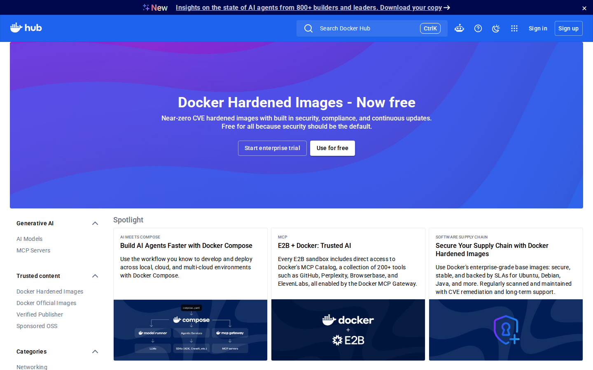
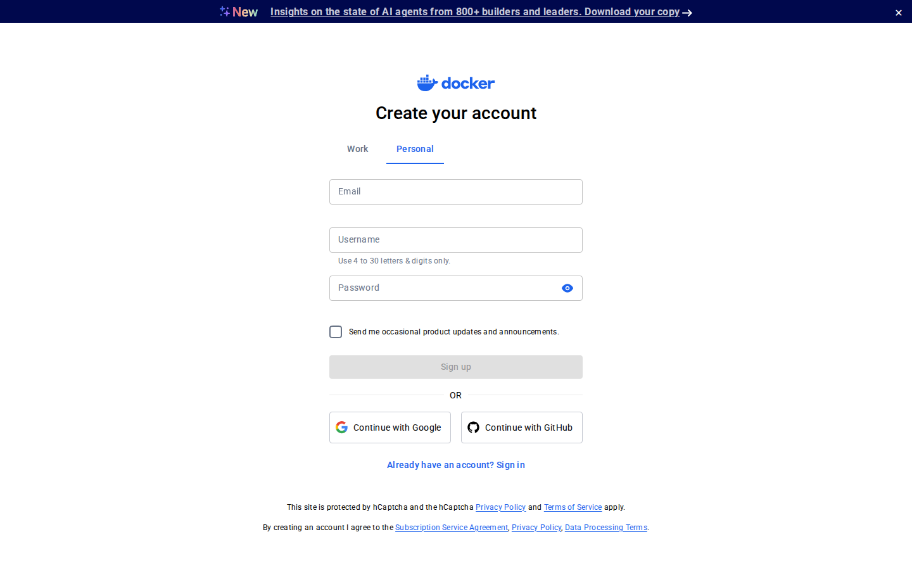
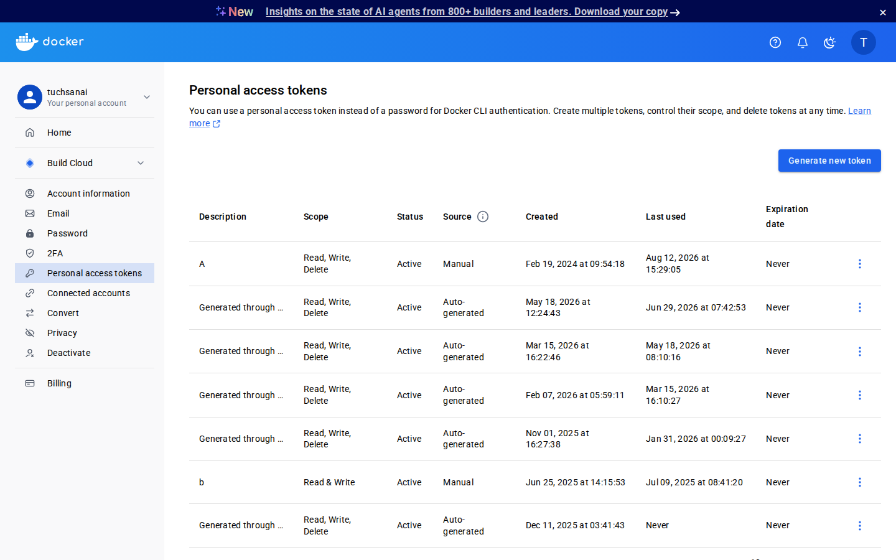
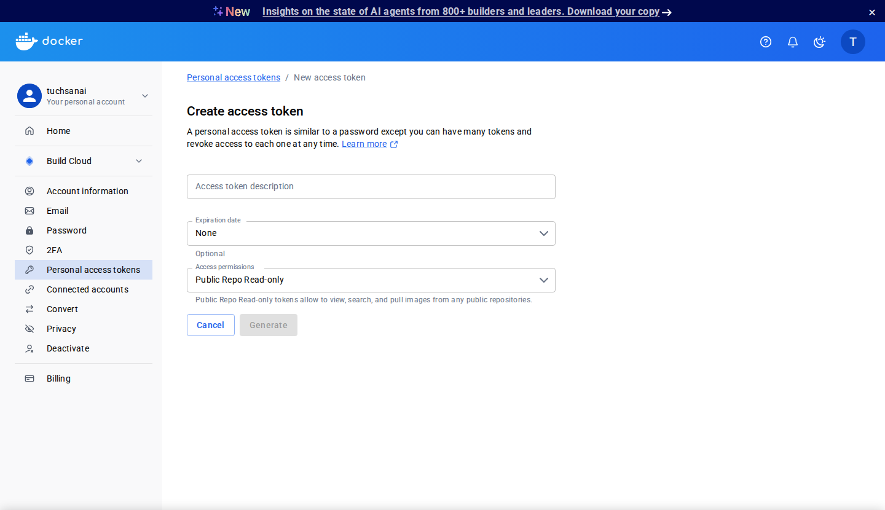
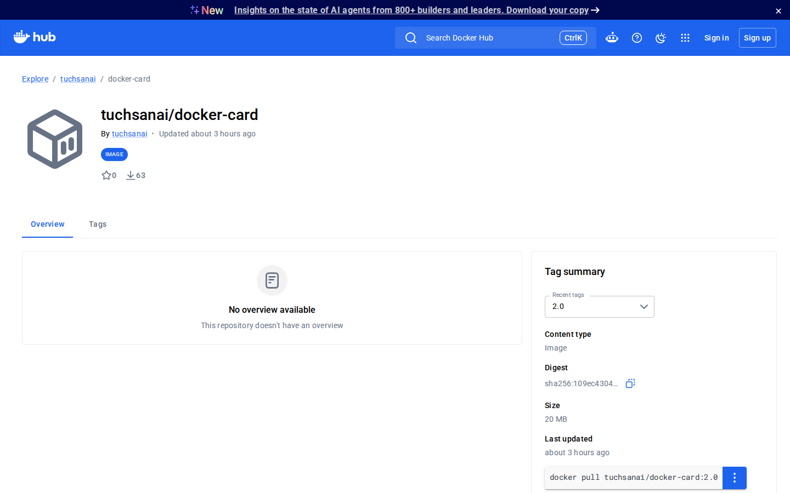
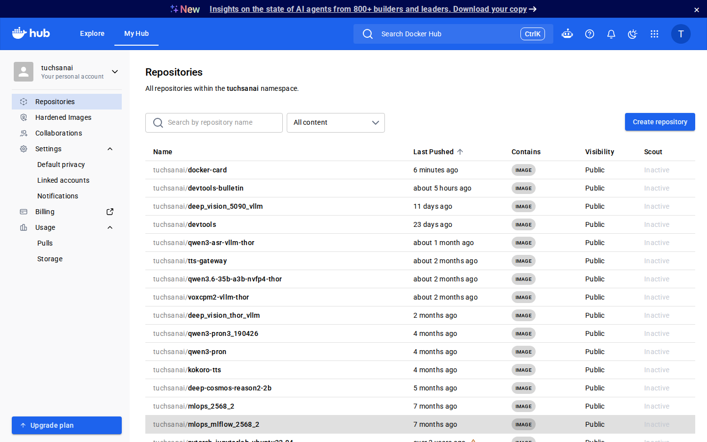
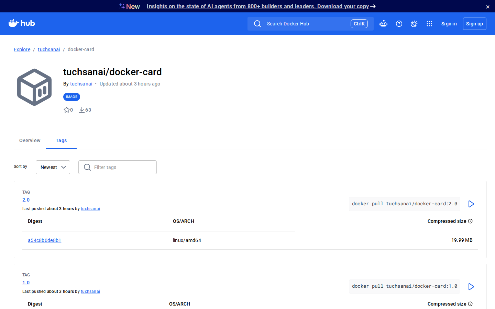

# LAB 3 — ส่งนามบัตรออนไลน์ขึ้น Docker Hub (⏱ ~20 นาที)

> โฟลเดอร์ `003_LAB_Docker_Hub_Registry` — คู่กับสไลด์ `new_Docker_Week11_Slides.html` Section 3
> ไฟล์ในแล็บ : `Dockerfile` · `index.html` · `.dockerignore` · `verify.sh`

**เป้าหมาย:** เข้าใจกติกาชื่อ `registry/username/repo:tag` จาก **error จริง** · login ด้วย Access Token · `tag`/`push`/`pull` ครบวงจร · แถม push เข้า registry ที่ self-host เอง

> **ทายก่อนเริ่ม:** build image เสร็จแล้ว**ลบทิ้งจากเครื่องจนหมด** — ยังเอากลับมารันได้ไหม? ข้อ 7 มีคำตอบ

---

## 0. เตรียมเครื่องเรียน + สมัคร Docker Hub

```bash
docker start devtools 2>/dev/null || \
  docker run -dit --name devtools --privileged -p 2222:22 tuchsanai/devtools:2569_1
ssh root@localhost -p 2222        # password : passwd
```

ยังไม่มีบัญชี Docker Hub? สมัครฟรีที่ <https://hub.docker.com> — กด **Sign up** แล้วกรอกอีเมล/username/รหัสผ่าน (**จำ username ให้แม่น** เพราะมันจะกลายเป็นส่วนหนึ่งของชื่อ image เรา)

หน้าเว็บจริงที่จะเจอ (capture จาก hub.docker.com):





## 1. Clone แล้วแก้นามบัตรให้เป็นชื่อคุณ

```bash
mkdir -p ~/labwork && cd ~/labwork
git clone https://github.com/Tuchsanai/DevTools.git 2>/dev/null
cd DevTools/03_Docker/04_Docker/003_LAB_Docker_Hub_Registry
sed -i 's/YOUR NAME/Student Demo/' index.html      # ← เปลี่ยน "Student Demo" เป็นชื่อเล่น/ชื่อสมมติของคุณ
grep -n '<h1>' index.html
```

> 📝 `Dockerfile` สั้นมาก: `FROM nginx:1.27-alpine` + `COPY index.html` ทับหน้า default — layer ที่เป็นของเราจริง ๆ มีชั้นเดียว · **ต้องแก้ชื่อก่อน build** เพราะ image ไม่เปลี่ยนตามไฟล์ที่แก้ทีหลัง

✅ `grep` เห็นบรรทัด `<h1>` เป็นชื่อที่แก้แล้ว

## 2. Build แล้วทดสอบก่อน push

```bash
docker build -t docker-card:1.0 .
docker rm -f card 2>/dev/null; docker run -d --name card -p 8083:80 docker-card:1.0
curl -s localhost:8083 | grep -o 'Student Demo'
```

✅ build จบด้วย `naming to docker.io/library/docker-card:1.0` แล้ว `curl` เจอชื่อที่แก้ไว้ — ของที่จะแจกคนอื่นต้องทดสอบเองก่อนเสมอ (อยากดูในเบราว์เซอร์: forward port `8083` ใน VS Code แท็บ PORTS)

> สังเกต `library/` ในชื่อเต็ม — Docker เติมให้เองเมื่อไม่ระบุ username · จำคำนี้ไว้ เดี๋ยวมันย้อนมาเล่นงานเรา

## 3. ลอง push ตรง ๆ — โดนปฏิเสธ (ตั้งใจ!)

```bash
docker push docker-card:1.0
```

✅ **ต้องล้มเหลว** — นี่คือผลที่ถูกต้องของข้อนี้:

```
The push refers to repository [docker.io/library/docker-card]
c016efea144c: Waiting
push access denied, repository does not exist or may require authorization: ...
```

> 📝 **กติกาชื่อ image:** `registry/username/repo:tag` — ไม่ระบุ registry = `docker.io` · ไม่ระบุ username = `library/` ซึ่งเป็น**พื้นที่ official images** ที่มีแต่ทีม Docker เขียนได้ · เราเพิ่งพยายามเอานามบัตรไปแปะบ้านคนอื่น! ทางแก้: **login** (ข้อ 4) + **เปลี่ยนชื่อให้อยู่ใต้ username เรา** (ข้อ 5)

## 4. สร้าง Access Token แล้ว login

บนเว็บ Docker Hub: รูปโปรไฟล์ → **Account Settings** → **Personal access tokens** (หมวด Security) → **Generate new token** — ตั้งชื่อ เช่น `devtools-lab` สิทธิ์ **Read & Write** → คัดลอกเก็บทันที (โชว์ครั้งเดียว!)

หน้าจอจริง (capture จากบัญชีที่ล็อกอินแล้ว):





```bash
docker login -u <DOCKERHUB_USERNAME>
```

> พอขึ้น `Password:` ให้**วาง token** (ไม่ใช่รหัสผ่านจริง) — หน้าจอไม่แสดงอะไรตอนวาง เป็นเรื่องปกติ

✅ จุดชี้ขาดคือ `Login Succeeded` (WARNING ที่ตามมาไม่ใช่ error — มันเตือนว่า token ถูกเก็บแบบถอดกลับได้ใน `~/.docker/config.json` → จบแล็บต้อง `docker logout`)

> ⚠️ ทำไมต้อง token: จำกัดสิทธิ์ได้ · ตั้งวันหมดอายุได้ · หลุดแล้วเพิกถอนได้ทันที · **ห้าม commit token ลง git เด็ดขาด**

## 5. tag ให้ถูกกติกา แล้ว push จริง

```bash
docker tag docker-card:1.0 <DOCKERHUB_USERNAME>/docker-card:1.0
docker images
docker push <DOCKERHUB_USERNAME>/docker-card:1.0
```

✅ `docker images` เห็นสองชื่อ **ID เดียวกันเป๊ะ** (tag = ติดป้ายเพิ่ม ไม่ใช่ copy — ไม่เปลืองดิสก์) · push คราวนี้ทุก layer ขึ้น `Pushed` จบด้วย digest:

```
IMAGE                                  ID             DISK USAGE   CONTENT SIZE   EXTRA
docker-card:1.0                        76f06bd3bded       73.6MB           21MB   U
<DOCKERHUB_USERNAME>/docker-card:1.0   76f06bd3bded       73.6MB           21MB   U
...
1.0: digest: sha256:76f06bd3bded... size: 856
```

เปิด `https://hub.docker.com/r/<DOCKERHUB_USERNAME>/docker-card` — repo ของเราอยู่บนคลาวด์แล้ว 🎉 หน้าตาจริงประมาณนี้:



หรือดูรวมทุก repo ของเราที่ **My Hub → Repositories** — `docker-card` โผล่พร้อมเวลา push ล่าสุด:



## 6. แถมเทคนิคองค์กร : self-host registry เอง

registry ก็เป็นแค่ container ตัวหนึ่ง! บริษัทจริงมักมี private registry ของตัวเอง (ghcr.io, GitLab, AWS ECR) — กติกาชื่อเดิม เปลี่ยนแค่ "นามสกุล registry" หน้าชื่อ:

```bash
docker run -d -p 5000:5000 --name registry registry:2
docker tag docker-card:1.0 localhost:5000/docker-card:1.0
docker push localhost:5000/docker-card:1.0
curl -s localhost:5000/v2/_catalog
```

✅ push เข้า registry ในเครื่องตัวเองสำเร็จ ไม่ต้อง login และ catalog ตอบ:

```
{"repositories":["docker-card"]}
```

## 7. พิสูจน์ว่า registry คือบ้านของ image — ลบเกลี้ยงแล้ว pull คืน

```bash
docker rm -f card
docker rmi docker-card:1.0 <DOCKERHUB_USERNAME>/docker-card:1.0 localhost:5000/docker-card:1.0
docker builder prune -af
docker pull <DOCKERHUB_USERNAME>/docker-card:1.0
docker run -d --name card -p 8083:80 <DOCKERHUB_USERNAME>/docker-card:1.0
curl -s localhost:8083 | grep -o 'Student Demo'
```

> 📝 `builder prune -af` ล้าง build cache ด้วย — ไม่งั้น pull จะ "ดูเหมือนไม่ได้ดาวน์โหลด" เพราะชิ้นส่วน layer ค้างใน cache

✅ pull ดาวน์โหลดทุก layer จริง (`Pull complete` ทีละชั้น) **digest ตรงกับตอน push เป๊ะ** แล้วนามบัตรกลับมาทุกพิกเซล — build ที่นี่ → ขึ้นคลาวด์ → ลบทั้งเครื่อง → กลับมารันใหม่ ครบวงจร

แท็บ **Tags** บนหน้า repo คือที่ที่เพื่อน ๆ มาคัดลอกคำสั่ง pull ของเรา:



## 7.5 โบนัส : ออกเวอร์ชัน 2.0 — ดู registry ฉลาดเรื่อง layer

เลื่อนตำแหน่งตัวเองบนนามบัตร แล้ว push เวอร์ชันใหม่:

```bash
sed -i 's/DevOps Student/Docker Hub Publisher/' index.html
docker build -t docker-card:2.0 .
docker tag docker-card:2.0 <DOCKERHUB_USERNAME>/docker-card:2.0
docker push <DOCKERHUB_USERNAME>/docker-card:2.0
```

✅ layer ของ nginx ทั้ง 8 ขึ้น **`Layer already exists`** — registry มี layer เดิมจาก push 1.0 แล้ว จึงอัปโหลดจริงเฉพาะชั้น html ที่เปลี่ยน (ไม่กี่ kB):

```
197eb75867ef: Layer already exists
...
82c6cbb690ec: Pushed
2.0: digest: sha256:... size: 856
```

> เปิดแท็บ Tags บน Hub ตอนนี้จะเห็นครบทั้ง `1.0` และ `2.0` · เก็บกวาดเพิ่มตอนจบ: `docker rmi docker-card:2.0 <DOCKERHUB_USERNAME>/docker-card:2.0 2>/dev/null`

## 8. ตรวจงานด้วย verify.sh

```bash
bash verify.sh
```

✅ ทุกข้อ `PASS` จบด้วย `ALL CHECKS PASSED` (exit 0) — ใช้ได้แม้ยังไม่มีบัญชี Docker Hub (ตรวจกติกาชื่อ + registry ในเครื่อง)

## 9. ล้างกระดาน

```bash
docker logout
docker rm -f card registry
docker rmi <DOCKERHUB_USERNAME>/docker-card:1.0 localhost:5000/docker-card:1.0 registry:2 2>/dev/null
docker ps -a && docker images
```

✅ `Removing login credentials...` แล้วสองตารางเหลือแค่หัว · repo บน Hub **ไม่โดนลบไปด้วย** (จะเก็บโชว์พอร์ตโฟลิโอ หรือลบผ่านเว็บ: repo → Settings → Delete repository)

---

## ปัญหาที่พบบ่อย

| อาการ | สาเหตุ | วิธีแก้ |
|---|---|---|
| `push access denied ... insufficient_scope` | ชื่อ image ไม่มี username นำหน้า (ตกไป `library/`) หรือยังไม่ login | `docker login -u <DOCKERHUB_USERNAME>` + `docker tag` ให้ขึ้นต้นด้วย username (สะกดตรงทุกตัวอักษร) |
| `docker login` ขึ้น `unauthorized` | token คัดลอกไม่ครบ หรือหมดอายุ/ถูกเพิกถอน | สร้าง token ใหม่ (Read & Write) แล้ววางทั้งก้อน อย่าพิมพ์เอง |
| แก้ `index.html` แล้ว image/หน้าเว็บไม่เปลี่ยน | build ไปก่อนแก้ไฟล์ — ไฟล์กับ image ไม่ผูกกัน | `docker build` ใหม่ (tag ใหม่ เช่น `2.0`) แล้ว `rm -f card` ก่อนรันฉบับใหม่ |

*ผลลัพธ์ทั้งหมดมาจากการรันจริงในเครื่องเรียน `tuchsanai/devtools:2569_1` · เอกสารนี้ใช้ชื่อสมมติ `Student Demo` และ placeholder `<DOCKERHUB_USERNAME>` — แทนด้วยของจริงของคุณตอนทำแล็บ*
