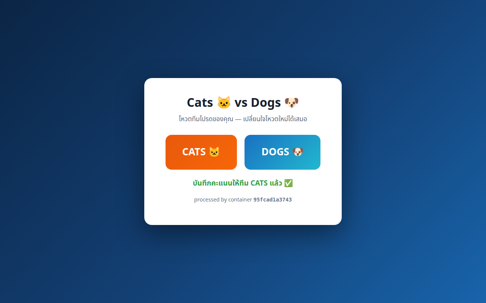
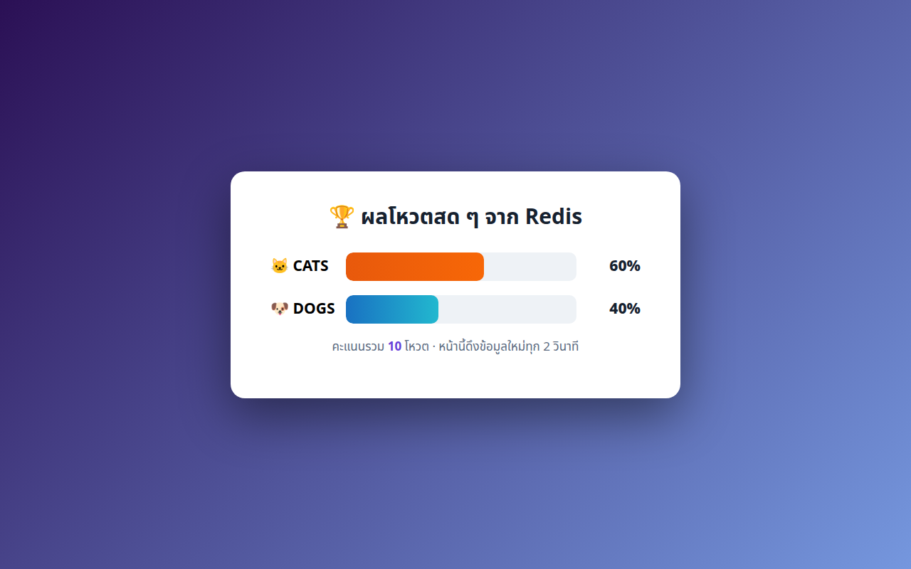

# LAB 5 — Docker Compose : ประกอบแอปโหวต Cats vs Dogs ทั้งระบบด้วยคำสั่งเดียว

> โฟลเดอร์ `005_LAB_Docker_Compose_Voting` = **LAB 5** ในสไลด์ `Docker_Week11_Slides.html`
> (ไฟล์โค้ดของแล็บนี้ : `docker-compose.yml` · `vote/{Dockerfile, app.py, requirements.txt}` · `result/{Dockerfile, app.py, requirements.txt}`)

## สิ่งที่จะได้เรียนรู้

- จากการพิมพ์ `docker run` ทีละ container ใน LAB 1–4 สู่การ **ประกาศทั้งระบบไว้ในไฟล์เดียว** แล้วเปิดด้วยคำสั่งเดียว
- อ่าน `docker-compose.yml` ให้เป็น : `services` · `build` vs `image` · `ports` · `environment` · `depends_on` · `networks` · `volumes`
- **healthcheck + `condition: service_healthy`** — บังคับให้ redis "พร้อมรับงานจริง" ก่อนเว็บถึงจะเปิด ไม่ใช่แค่ "สตาร์ตแล้ว"
- ชื่อ service = ชื่อ DNS — `vote` และ `result` เรียกฐานข้อมูลด้วยชื่อ `redis` เฉย ๆ (DNS จาก LAB 4 ทำงานที่นี่!) และบริหารทั้งระบบด้วย `compose ps` / `logs` / `exec` โดยไม่ต้องจำชื่อ container จริง
- ความต่างที่จับต้องได้ระหว่าง `down` / `down -v` — **named volume ทำให้คะแนนโหวตรอดตายข้ามการลบ container**
- โบนัสทันสมัย : `docker compose up --watch` — แก้โค้ดแล้วเห็นผลบนหน้าเว็บใน ~2 วินาที **โดยไม่ต้อง build ใหม่**

## ภาพรวมของแล็บนี้

1. **ทัวร์โปรเจกต์ก่อนรัน** — ระบบนี้มี 3 services (vote · result · redis) 2 networks 1 volume อ่าน `docker-compose.yml` ทีละ key ให้เข้าใจว่าแต่ละบรรทัดมาแทน flag ไหนของ `docker run` ที่เราเคยพิมพ์เอง
2. **เปิดทั้งระบบด้วย `docker compose up -d --build`** — Docker จะ build 2 image, pull redis, สร้าง network + volume แล้วเปิดทุกอย่าง **เรียงลำดับให้เองตาม dependency**
3. **สำรวจสิ่งที่ compose สร้างและเล่นจริง** — ดูกติกาการตั้งชื่ออัตโนมัติของ compose แล้วเปิดหน้าโหวตกับหน้าผลคะแนนคนละแท็บ กดโหวตแล้วดูกราฟขยับสด ๆ
4. **แอบดูใน Redis** — พิสูจน์ว่าคะแนนที่เห็นบนเว็บคือ key `votes:cats` / `votes:dogs` จริง ๆ ด้วย `docker compose exec`
5. **ทดสอบชีวิตจริง : ลบทั้งระบบแล้วเปิดใหม่** — `down` แล้ว `up` คะแนนต้อง **ยังอยู่ครบ** เพราะ volume ไม่ถูกลบ
6. **`down -v` = ล้างจริง** — รอบนี้ volume ถูกลบด้วย คะแนนกลับเป็นศูนย์ เห็นความต่างที่จับต้องได้
7. **โบนัส `compose watch`** — แก้ `vote/app.py` ขณะระบบรันอยู่ แล้วดู compose sync โค้ดเข้า container ให้เองทันที

> **คำถามก่อนเริ่ม:** ถ้าสั่ง `docker compose down` ลบ container ทิ้งทั้งหมด แล้ว `up` กลับขึ้นมาใหม่ คะแนนโหวตที่กดไว้จะหายไปหรือยังอยู่? ข้อ 7–8 จะพิสูจน์คำตอบ (และเงื่อนไขที่ทำให้คำตอบเปลี่ยน)

### Terminal Map

| หน้าต่าง | หน้าที่ | เปิดเมื่อใด |
|---|---|---|
| **T1** | คำสั่งหลักทุกข้อ และ `docker compose up --watch` ในข้อ 9 | ใช้ตั้งแต่เริ่ม LAB |
| **T2** | แก้ไฟล์ `vote/app.py` ขณะ T1 ค้างอยู่กับ `--watch` | เปิดในข้อ 9 |

คำสั่ง `docker compose up --watch` เป็น foreground: เมื่อเห็น `Watch enabled` ให้ **ปล่อยหน้าต่างนั้นค้างไว้** แล้วไปแก้ไฟล์ในอีกหน้าต่าง

---

## 0. เตรียมเครื่องเรียน

ทำบนเครื่องของเราเอง (ไม่ใช้ cloud) — เปิด container ที่ติดตั้ง Docker มาให้แล้ว

```bash
docker start devtools 2>/dev/null || \
  docker run -dit --name devtools --privileged -p 2222:22 tuchsanai/devtools:2569_1
ssh root@localhost -p 2222        # password : passwd
```

> 📝 **คำอธิบาย:** `docker start ... || docker run ...` เปิดเครื่องเรียนเดิมถ้ามี และสร้างใหม่เฉพาะเมื่อยังไม่มี จึงไม่ลบ clone จาก LAB ก่อนหน้า ·
> `-dit` คือ `-d` รันเบื้องหลัง + `-i` เปิด stdin ค้างไว้ + `-t` ให้มี terminal กล่องจะได้ไม่ดับทันที · `--privileged` ให้สิทธิ์เต็มเพื่อรัน **Docker ซ้อนข้างในกล่อง** (จำเป็น — ทั้ง 3 services ของแล็บนี้เป็น container ที่รันอยู่ข้างในเครื่องเรียนอีกที) ·
> `-p 2222:22` ส่ง port 2222 ของเครื่องเรา เข้า port 22 (SSH) ของกล่อง

> ⚠️ `--privileged` ใช้เฉพาะ disposable classroom container นี้ ไม่ใช่ค่าที่ควรใช้กับ production workload

> ใน VS Code ใช้ **Remote-SSH** ต่อไปที่ `root@localhost:2222` แล้วทำแล็บทั้งหมดข้างใน

ตรวจว่าพร้อมใช้งาน :

```bash
docker --version
docker info --format 'Docker daemon: {{.ServerVersion}}'
docker compose version
```

> 📝 **คำอธิบาย:** สองบรรทัดแรกเช็ก Docker CLI กับ daemon เหมือนทุกแล็บ · บรรทัดที่สามเช็กปลั๊กอิน **Compose v2** — สังเกตว่าเป็นคำสั่งลูกของ docker (`docker compose` เว้นวรรค) ไม่ใช่โปรแกรมแยก `docker-compose` ขีดกลางรุ่นเก่า ·
> สิ่งที่ต้องดูคือ "มีเลขเวอร์ชันขึ้นครบไหม" ไม่ใช่ "เลขตรงกับเอกสารไหม" · ถ้าขึ้น `Cannot connect to the Docker daemon` แปลว่ายังอยู่นอกกล่องเรียน ให้ย้อนทำข้อ 0 ใหม่

✅ **Expected output** — มีเลขเวอร์ชันครบสามบรรทัด ไม่ใช่ error (เลขเวอร์ชันของแต่ละคนอาจไม่ตรงกับเอกสารนี้):

```
Docker version 29.6.2, build dfc4efb
Docker daemon: 29.6.2
Docker Compose version v5.3.1
```

---

## 1. Clone โค้ดแล็บ

```bash
mkdir -p ~/labwork && cd ~/labwork
git clone https://github.com/Tuchsanai/DevTools.git
cd DevTools/03_Docker/04_Docker/005_LAB_Docker_Compose_Voting
```

> 📝 **คำอธิบาย:** `mkdir -p ~/labwork` สร้างโฟลเดอร์เก็บงาน (`-p` = มีอยู่แล้วก็ไม่ error) · `git clone` ดึงรีโพของวิชาลงมา — ถ้าเคย clone จากแล็บก่อนแล้ว git จะบอกว่าโฟลเดอร์ไม่ว่าง ข้ามไป `cd` ได้เลย ·
> จากนี้ไป **ทุกคำสั่ง `docker compose` ต้องสั่งจากโฟลเดอร์นี้** เพราะ compose หาไฟล์ `docker-compose.yml` จากโฟลเดอร์ปัจจุบัน — สั่งจากที่อื่นจะเจอ `no configuration file provided: not found`

---

## 2. ทัวร์โปรเจกต์ — 3 services · 2 networks · 1 volume

ดูก่อนว่าในโฟลเดอร์มีอะไรบ้าง :

```bash
find . -maxdepth 2 -type f | sort
```

✅ **Expected output** — โปรเจกต์เล็กมาก: ไฟล์ compose 1 ไฟล์ + โค้ดเว็บ 2 ชุด (ชุดละ 3 ไฟล์):

```
./docker-compose.yml
./result/Dockerfile
./result/app.py
./result/requirements.txt
./vote/Dockerfile
./vote/app.py
./vote/requirements.txt
```

สถาปัตยกรรมที่เรากำลังจะเปิด :

```
              เครื่องเรา (เบราว์เซอร์ 2 แท็บ)
          ┌──────────┴──────────────┐
   http://localhost:8085     http://localhost:8086
          │                         │
    ┌─────▼─────┐             ┌─────▼─────┐
    │   vote    │             │  result   │      ← front-tier (โลกภายนอกเข้าถึง)
    └─────┬─────┘             └─────┬─────┘
          │ INCR votes:cats         │ GET votes:cats (ทุก 2 วิ)
          └───────────┬─────────────┘
                ┌─────▼─────┐
                │   redis   │                    ← back-tier (ภายในเท่านั้น ไม่ map port)
                └─────┬─────┘
              volume "vote-data"                 ← คะแนนตัวจริงนอนอยู่ที่นี่
```

ทั้งหมดนี้ประกาศอยู่ในไฟล์เดียว — เปิดอ่านกัน :

```bash
cat docker-compose.yml
```

✅ **Expected output** — ไฟล์เต็ม (มีคอมเมนต์ภาษาไทยอยู่ในไฟล์แล้ว):

```yaml
services:

  vote:
    build: ./vote
    ports:
      - "8085:5000"
    environment:
      REDIS_HOST: redis
    depends_on:
      redis:
        condition: service_healthy
    networks:
      - front-tier
      - back-tier
    # โบนัสท้ายแล็บ : รัน `docker compose up --watch`
    # แล้วลองแก้ vote/app.py — โค้ดจะถูก sync เข้า container ทันที
    develop:
      watch:
        - action: sync
          path: ./vote
          target: /app

  result:
    build: ./result
    ports:
      - "8086:5000"
    environment:
      REDIS_HOST: redis
    depends_on:
      redis:
        condition: service_healthy
    networks:
      - front-tier
      - back-tier

  redis:
    image: redis:7-alpine
    command: redis-server --appendonly yes
    volumes:
      - vote-data:/data
    healthcheck:
      test: ["CMD", "redis-cli", "ping"]
      interval: 5s
      timeout: 3s
      retries: 5
    networks:
      - back-tier

volumes:
  vote-data:

networks:
  front-tier:
  back-tier:
```

> 📝 **คำอธิบาย — อ่านทีละ key:** `services:` หัวใจของไฟล์ — 1 service = container 1 แบบ (แล็บนี้มี `vote` · `result` · `redis`) ·
> `build: ./vote` บอกว่า image ของ service นี้ให้ **build จาก Dockerfile ในโฟลเดอร์ `./vote`** ส่วน redis ใช้ `image: redis:7-alpine` คือ **ดึงจาก registry ตรง ๆ** — สองคำนี้คือทางเลือกคู่กัน: โค้ดเราเอง → `build` / ของสำเร็จรูป → `image` ·
> `ports: - "8085:5000"` คือ `-p 8085:5000` ของ `docker run` ในเวอร์ชัน YAML (host:container) — สังเกตว่า redis **ไม่มี ports เลย** = โลกภายนอกเข้าไม่ถึง เข้าได้เฉพาะเพื่อน container ในเครือข่ายเดียวกัน · `environment: REDIS_HOST: redis` ส่งตัวแปรให้ `app.py` ใช้เลือกปลายทาง — ค่า `redis` คือ **ชื่อ service** เพราะ compose ตั้ง DNS ให้ชื่อ service ชี้ไปยัง container ตัวจริงอัตโนมัติ (กลไกเดียวกับที่ทดลองใน LAB 4)

> 📝 **คำอธิบาย (ต่อ) — คู่หูที่ทำให้ระบบเปิดถูกลำดับ:** `healthcheck:` ฝั่ง redis สั่งให้ Docker รัน `redis-cli ping` ทุก `interval: 5s` ถ้าเกิน `timeout: 3s` ถือว่าล้มเหลว และล้มติดกันเกิน `retries: 5` ครั้งจะถูกตราหน้าว่า `unhealthy` ·
> `depends_on: redis: condition: service_healthy` ฝั่ง vote/result แปลว่า "อย่าเพิ่งสตาร์ตฉัน จนกว่า redis จะ **healthy**" — เข้มกว่า `depends_on` แบบสั้นที่รอแค่ "สตาร์ตแล้ว" เพราะ container ขึ้น `Up` ≠ โปรแกรมข้างในพร้อมรับ connection ·
> `command: redis-server --appendonly yes` override คำสั่งเริ่มต้นของ image ให้เปิดโหมด AOF — เขียนทุกการเปลี่ยนแปลงลงไฟล์ใน `/data` · `volumes: - vote-data:/data` เอา named volume มาแปะทับ `/data` พอดี **คะแนนโหวตจึงอยู่นอกตัว container** — ข้อ 7 จะใช้จุดนี้ทำเรื่องเซอร์ไพรส์ ·
> `networks:` vote/result อยู่ทั้งสองวง แต่ redis อยู่แค่ `back-tier` — แยกโซน "โลกภายนอกเข้าถึง" ออกจาก "ฐานข้อมูลภายใน" · ท้ายไฟล์ `volumes:` กับ `networks:` เปล่า ๆ คือประกาศให้ compose สร้างทรัพยากรเหล่านี้ด้วยค่า default · `develop: watch:` เก็บไว้ใช้จริงในข้อ 9

> 📝 **จุดทันสมัย:** ไฟล์นี้ **ไม่มีบรรทัด `version:`** — Compose ยุคใหม่ (Compose Specification) เลิกใช้แล้ว ถ้าใส่มา Docker จะเตือนว่า obsolete — ตัวอย่างเก่าที่ขึ้นต้นด้วย `version: "3"` คือมรดกจากยุค docker-compose v1

แถม — เปิดดู `vote/Dockerfile` จะพบว่าไม่มีอะไรใหม่เลย :

```bash
cat vote/Dockerfile
```

✅ **Expected output** — โครงเดียวกับ Dockerfile ที่เขียนเองใน LAB 1 เป๊ะ (ของ `result/` ก็หน้าตาเดียวกัน):

```dockerfile
FROM python:3.12-slim

WORKDIR /app

COPY requirements.txt .
RUN pip install --no-cache-dir -r requirements.txt

COPY app.py .

EXPOSE 5000

CMD ["python", "app.py"]
```

> 📝 **คำอธิบาย:** compose ไม่ได้มาแทนความรู้เดิม — Dockerfile ยังคือ Dockerfile, network ยังคือ network, volume ยังคือ volume · สิ่งที่เพิ่มมีอย่างเดียว: **เลิกพิมพ์ flag ยาว ๆ เอง แล้วประกาศทุกอย่างเป็นไฟล์** ที่ commit ลง git ได้ ทีมอ่านได้ รันซ้ำได้เหมือนกันทุกเครื่อง

---

## 3. เปิดทั้งระบบด้วยคำสั่งเดียว

```bash
docker compose up -d --build
```

> 📝 **คำอธิบาย:** `up` = สร้างและเปิดทุกอย่างที่ประกาศไว้ (image → network → volume → container ครบวงจร) · `-d` รันเบื้องหลังเหมือน `docker run -d` · `--build` บังคับ build image ของ `vote`/`result` ใหม่ก่อน up เสมอ — ครั้งแรกจำเป็นอยู่แล้ว ครั้งถัด ๆ ไปช่วยกันพลาด "แก้โค้ดแล้วแต่รัน image เก่า" ·
> compose ตั้งชื่อทุกอย่างเป็น `<ชื่อโปรเจกต์>_<ชื่อทรัพยากร>` โดยชื่อโปรเจกต์ default = ชื่อโฟลเดอร์ตัวพิมพ์เล็ก จึงเห็น `005_lab_docker_compose_voting_...` ยาว ๆ ในผลลัพธ์

✅ **Expected output** — ยาวมาก ตัดมาเฉพาะช่วงที่ต้องดู: pull redis + build 2 image แล้วปิดท้ายด้วยการสร้าง Network/Volume/Container — **จุดชี้ขาดคือ redis ต้องขึ้น `Healthy` ก่อน vote/result ถึงค่อย `Starting`** (digest · เวลา build ของแต่ละคนจะไม่ตรงกับเอกสารนี้):

```
 Image redis:7-alpine Pulling
        ... (รวม 7 layer · Pulling fs layer → Download complete → Pull complete ทีละ layer) ...
 Image redis:7-alpine Pulled
 Image 005_lab_docker_compose_voting-vote Building
 Image 005_lab_docker_compose_voting-result Building
        ... (build ตามขั้นใน Dockerfile: FROM python:3.12-slim → COPY requirements.txt → RUN pip install → COPY app.py ทั้งสอง image) ...
#12 1.837 Successfully installed Jinja2-3.1.6 MarkupSafe-3.0.3 Werkzeug-3.1.8 blinker-1.9.0 click-8.4.2 flask-3.0.3 itsdangerous-2.2.0 redis-5.0.8
 Image 005_lab_docker_compose_voting-result Built
 Image 005_lab_docker_compose_voting-vote Built
 Network 005_lab_docker_compose_voting_back-tier Created
 Network 005_lab_docker_compose_voting_front-tier Created
 Volume 005_lab_docker_compose_voting_vote-data Created
        ... (Container ทั้ง 3 ตัว Created) ...
 Container 005_lab_docker_compose_voting-redis-1 Starting
 Container 005_lab_docker_compose_voting-redis-1 Started
 Container 005_lab_docker_compose_voting-redis-1 Waiting
 Container 005_lab_docker_compose_voting-redis-1 Healthy
 Container 005_lab_docker_compose_voting-result-1 Starting
 Container 005_lab_docker_compose_voting-vote-1 Starting
        ... (vote และ result ขึ้น Started ครบ) ...
```

> **บทเรียนสำคัญ:** สังเกตช่วงท้าย — redis ถูกสั่ง `Waiting` แล้วต้องผ่านด่าน **`Healthy`** (ไม่ใช่แค่ `Started`) vote/result ถึงเริ่ม `Starting` ได้ นี่คือ `depends_on` + `condition: service_healthy` ทำงานให้เห็นจริง ๆ — ถ้าเราเปิดเองด้วย `docker run` สามครั้ง ต้องนั่งเดาเองว่า redis พร้อมหรือยัง

---

## 4. สำรวจสิ่งที่ compose สร้างให้

```bash
docker compose ps
```

> 📝 **คำอธิบาย:** เหมือน `docker ps` แต่กรองเฉพาะ container **ของโปรเจกต์นี้** และเพิ่มคอลัมน์ SERVICE ให้อ้างชื่อสั้นได้ · จุดที่ต้องดู: STATUS ของ redis ต้องเป็น `Up ... (healthy)` — คำในวงเล็บมาจาก healthcheck ที่เราประกาศ · ชื่อ container จริงถูกตั้งเป็น `<โปรเจกต์>-<service>-<ลำดับ>` เช่น `...-vote-1`

✅ **Expected output** — 3 ตัว `Up` ครบ, redis มี `(healthy)`, ports map เฉพาะ vote/result (เวลาของแต่ละคนจะไม่ตรงกับเอกสารนี้):

```
NAME                                     IMAGE                                  COMMAND                  SERVICE   CREATED          STATUS                    PORTS
005_lab_docker_compose_voting-redis-1    redis:7-alpine                         "docker-entrypoint.s…"   redis     18 seconds ago   Up 17 seconds (healthy)   6379/tcp
005_lab_docker_compose_voting-result-1   005_lab_docker_compose_voting-result   "python app.py"          result    18 seconds ago   Up 12 seconds             0.0.0.0:8086->5000/tcp, [::]:8086->5000/tcp
005_lab_docker_compose_voting-vote-1     005_lab_docker_compose_voting-vote     "python app.py"          vote      18 seconds ago   Up 12 seconds             0.0.0.0:8085->5000/tcp, [::]:8085->5000/tcp
```

network กับ volume ที่ประกาศไว้ท้ายไฟล์ ก็ถูกสร้างจริง :

```bash
docker network ls
docker volume ls
```

> 📝 **คำอธิบาย:** เห็น network 2 วง (`..._front-tier` · `..._back-tier`) และ volume 1 ลูก (`..._vote-data`) ขึ้นต้นด้วยชื่อโปรเจกต์ทั้งหมด — กติกา prefix นี้ทำให้หลายโปรเจกต์ compose อยู่ร่วมเครื่องเดียวกันได้โดยชื่อไม่ชนกัน · `bridge`/`host`/`none` คือ network ติดเครื่องที่เจอกันแล้วใน LAB 4

✅ **Expected output** — (ID ของแต่ละคนจะไม่ตรงกับเอกสารนี้):

```
NETWORK ID     NAME                                       DRIVER    SCOPE
0f36c9a53c47   005_lab_docker_compose_voting_back-tier    bridge    local
d1184c854f3b   005_lab_docker_compose_voting_front-tier   bridge    local
        ... (bridge / host / none 3 ตัวติดเครื่องเดิมจาก LAB 4) ...
DRIVER    VOLUME NAME
local     005_lab_docker_compose_voting_vote-data
```

อ่าน log รายบริการด้วยชื่อ service :

```bash
docker compose logs redis --tail 5
```

> 📝 **คำอธิบาย:** `compose logs <service>` คือ `docker logs` เวอร์ชันเรียกด้วยชื่อ service — ไม่ต้องรู้ชื่อ container จริง · `--tail 5` เอา 5 บรรทัดสุดท้าย · จุดที่ต้องดู: redis สร้างไฟล์ AOF (`appendonly.aof...`) ตอน start = โหมด `--appendonly yes` ทำงานจริง และไฟล์อยู่ใน `/data` ที่มี volume แปะอยู่

✅ **Expected output** — (เวลาของแต่ละคนจะไม่ตรงกับเอกสารนี้):

```
redis-1  | 1:M 12 Aug 2026 11:50:08.807 * Running mode=standalone, port=6379.
redis-1  | 1:M 12 Aug 2026 11:50:08.807 * Server initialized
redis-1  | 1:M 12 Aug 2026 11:50:08.812 * Creating AOF base file appendonly.aof.1.base.rdb on server start
redis-1  | 1:M 12 Aug 2026 11:50:08.819 * Creating AOF incr file appendonly.aof.1.incr.aof on server start
redis-1  | 1:M 12 Aug 2026 11:50:08.819 * Ready to accept connections tcp
```

---

## 5. เล่นจริง! — เปิดเว็บโหวต 2 แท็บ

หน้าเว็บทั้งสองเปิดอยู่ **ข้างในเครื่องเรียน** ต้อง forward port ออกมาก่อน — รอบนี้มี 2 port:

1. เปิดแท็บ **PORTS** ใน VS Code (แถวเดียวกับ TERMINAL) → กด **Forward a Port** พิมพ์ `8085` กด **Enter** → กด **Add Port** เพิ่ม `8086` อีกครั้ง
2. เปิดเบราว์เซอร์ 2 แท็บ : `http://localhost:8085` (หน้าโหวต) และ `http://localhost:8086` (หน้าผลคะแนน)

#### ทางเลือก : forward ด้วยคำสั่ง `ssh -L` (ไม่ใช้ VS Code)

เปิด terminal ใหม่บนเครื่องเรา แล้วพ่วง tunnel สองพอร์ตในคำสั่งเดียว :

```bash
ssh -L 8085:localhost:8085 -L 8086:localhost:8086 root@localhost -p 2222        # password : passwd
```

> 📝 **คำอธิบาย:** ใส่ `-L` ซ้ำได้หลายครั้งใน ssh คำสั่งเดียว — แต่ละ `-L <พอร์ตเครื่องเรา>:localhost:<พอร์ตในเครื่องเรียน>` คือท่อหนึ่งเส้น · `-p 2222` คือ port ของ SSH (คนละความหมายกับ `-p` ของ `docker run`) · หน้าต่างนี้ต้องเปิดค้างไว้ — ปิดเมื่อไหร่ tunnel ทั้งสองเส้นหายทันที ·
> **จบแล็บแล้วปิด tunnel เสมอ:** แบบ `ssh -L` พิมพ์ `exit` ใน session นั้น · แบบ VS Code คลิกขวาที่ port `8085` และ `8086` → **Stop Forwarding Port**

เข้าแท็บแรก `http://localhost:8085` — เจอหน้าโหวต กดปุ่มได้เลย :

**ภารกิจ:** กด **CATS 🐱** รวม **6 ครั้ง** และ **DOGS 🐶** รวม **4 ครั้ง** — ระหว่างกด ให้สลับไปดูแท็บ `http://localhost:8086` ด้วย จะเห็นแท่งคะแนนขยับตามภายใน ~2 วินาที **โดยไม่ต้องกด refresh**

✅ **Expected output** — หน้าโหวตหลังกดปุ่ม ขึ้นข้อความยืนยันสีเขียว (ชื่อ container ท้ายหน้าเว็บของแต่ละคนจะไม่ตรงกับเอกสารนี้ — มันคือ hostname ของ container `vote` ซึ่ง Docker สุ่มจาก container ID):



และแท็บผลคะแนนต้องแสดง **60% : 40% รวม 10 โหวต** ตามที่เรากด :



ตรวจตัวเลขดิบ ๆ ด้วย terminal (T1 ในเครื่องเรียน) อีกทาง :

```bash
curl -s http://localhost:8086/data
```

> 📝 **คำอธิบาย:** `/data` คือ API ภายในที่ JavaScript ของหน้า result เรียกทุก 2 วินาที — จาก terminal ในเครื่องเรียนเรียกได้ตรง ๆ ไม่ต้องผ่าน tunnel เพราะ port 8086 ถูก map ไว้กับเครื่องเรียนเอง

✅ **Expected output** — ต้องตรงกับที่กดไว้เป๊ะ:

```
{
  "cats": 6,
  "dogs": 4
}
```

> 📝 **เบื้องหลังที่เพิ่งเกิดขึ้น:** ปุ่มที่กดยิง POST ไปหา `vote` → Flask สั่ง `INCR votes:cats` (หรือ `votes:dogs`) ไปที่ **`redis`** → ฝั่ง `result` อ่านค่าเดิมทุก 2 วินาทีมาวาดแท่ง · ทั้ง vote และ result ต่อ redis ด้วยชื่อ `redis` เฉย ๆ ตามตัวแปร `REDIS_HOST` — **ไม่มี IP สักตัวในโค้ด** เพราะ DNS ของ network ที่ compose สร้างจัดการให้ (ความรู้ LAB 4 ตัวเป็น ๆ)

---

## 6. แอบดูข้อมูลใน Redis

คะแนนบนเว็บมาจากไหน — เข้าไปถามฐานข้อมูลตรง ๆ :

```bash
docker compose exec redis redis-cli KEYS 'votes:*'
docker compose exec redis redis-cli GET votes:cats
```

> 📝 **คำอธิบาย:** `compose exec <service> <คำสั่ง>` คือ `docker exec` เวอร์ชันเรียกด้วย **ชื่อ service** — compose แปลงเป็นชื่อ container จริง (`005_lab_..._redis-1`) ให้เอง · `redis-cli` คือ CLI ที่ติดมากับ image redis อยู่แล้ว · `KEYS 'votes:*'` ไล่หา key ที่ขึ้นต้นด้วย `votes:` (อย่าลืม quote — กัน shell ขยาย `*` เป็นชื่อไฟล์) · `GET` อ่านค่าของ key เดียว

✅ **Expected output** — เจอ 2 key และค่า `votes:cats` คือ 6 ตรงกับหน้าเว็บ — เว็บทั้งสองตัวเป็นแค่ "หน้ากาก" ของข้อมูลใน redis ซึ่งนอนอยู่ใน volume `vote-data`:

```
votes:cats
votes:dogs
6
```

---

## 7. พิสูจน์พลัง volume — คะแนนรอดตายข้าม down/up

ทำลายทั้งระบบทิ้งต่อหน้าต่อตา :

```bash
docker compose down
```

> 📝 **คำอธิบาย:** `down` คือคู่ตรงข้ามของ `up` — หยุดแล้ว **ลบ** container ทุกตัว + network ทุกวงของโปรเจกต์ · แต่จงอ่าน output ดี ๆ: **ไม่มีบรรทัด Volume สักบรรทัด** — `down` เฉย ๆ ไม่แตะ volume เพราะข้อมูลเป็นของมีค่า ต้องสั่งลบอย่างเจาะจงเท่านั้น

✅ **Expected output** — Container และ Network ถูก `Removed` ครบ แต่ไม่มีคำว่า Volume ปรากฏ:

```
 Container 005_lab_docker_compose_voting-vote-1 Stopping
 Container 005_lab_docker_compose_voting-result-1 Stopping
        ... (ทั้ง 3 container: Stopping → Stopped → Removing → Removed โดย redis ปิดท้าย) ...
 Container 005_lab_docker_compose_voting-redis-1 Removed
 Network 005_lab_docker_compose_voting_front-tier Removed
 Network 005_lab_docker_compose_voting_back-tier Removed
```

ยืนยันว่า container หายเกลี้ยง แต่ volume ยังอยู่ :

```bash
docker ps -a
docker volume ls
```

✅ **Expected output** — ตาราง container เหลือแค่หัว (redis ตายไปแล้วทั้งตัว!) แต่ `vote-data` ยังนอนรอ:

```
CONTAINER ID   IMAGE     COMMAND   CREATED   STATUS    PORTS     NAMES
DRIVER    VOLUME NAME
local     005_lab_docker_compose_voting_vote-data
```

แล้วชุบชีวิตทั้งระบบกลับมา :

```bash
docker compose up -d
curl -s http://localhost:8086/data
```

> 📝 **คำอธิบาย:** รอบนี้ไม่ต้อง `--build` เพราะ image ทั้งสองถูก build ไว้แล้ว compose จึงข้ามไปสร้าง network + container เลย เร็วกว่ารอบแรกมาก · volume `vote-data` มีอยู่แล้ว compose จะ **ใช้ลูกเดิมต่อ** · `curl` ปิดท้ายคือคำถามสำคัญของแล็บนี้: คะแนนยังอยู่ไหม?

✅ **Expected output** — ระบบกลับมาครบ (redis ผ่านด่าน `Healthy` เหมือนเดิม) และ **คะแนน 6 : 4 ยังอยู่ครบ** ทั้งที่ container redis ตัวเก่าถูกลบไปแล้ว:

```
 Network 005_lab_docker_compose_voting_front-tier Created
 Network 005_lab_docker_compose_voting_back-tier Created
        ... (Created → redis Healthy → vote/result Started เหมือนข้อ 3 แต่ไม่มีขั้น build/pull) ...
{
  "cats": 6,
  "dogs": 4
}
```

> **นี่คือคำตอบของคำถามก่อนเริ่ม:** container เป็นของใช้แล้วทิ้ง แต่ **ข้อมูลใน named volume อยู่ยงคงกระพัน** — redis ตัวใหม่ mount `vote-data` ลูกเดิม อ่านไฟล์ AOF เดิม คะแนนจึงกลับมาครบทุกแต้ม · เปิด `http://localhost:8086` ดูอีกครั้งได้เลย — 60:40 เหมือนไม่มีอะไรเกิดขึ้น

---

## 8. `down -v` = ล้างจริง — เริ่มโลกใหม่

คราวนี้สั่งลบแบบเอา volume ไปด้วย :

```bash
docker compose down -v
```

> 📝 **คำอธิบาย:** เพิ่ม `-v` (หรือ `--volumes`) ตัวเดียว — ความหมายเปลี่ยนจาก "ปิดระบบ" เป็น "**ล้างระบบ**": ลบ container + network เหมือนเดิม แล้วลบ named volume ของโปรเจกต์ทิ้งด้วย · ใช้เมื่อ "อยากได้สภาพห้องใหม่แกะกล่อง" เช่น ก่อนส่งงาน หรือหลังทดลองข้อมูลพัง ๆ

✅ **Expected output** — รอบนี้มีบรรทัด `Volume ... Removed` โผล่มาแล้ว (ต่างจากข้อ 7 ชัดเจน):

```
        ... (ทั้ง 3 container ถูก Removed เหมือนข้อ 7) ...
 Volume 005_lab_docker_compose_voting_vote-data Removing
 Volume 005_lab_docker_compose_voting_vote-data Removed
 Network 005_lab_docker_compose_voting_front-tier Removed
 Network 005_lab_docker_compose_voting_back-tier Removed
```

เปิดใหม่แล้วดูคะแนน :

```bash
docker compose up -d
curl -s http://localhost:8086/data
```

> 📝 **คำอธิบาย:** volume เพิ่งถูกลบ compose จึงต้องสร้าง `vote-data` ลูกใหม่เอี่ยม (สังเกตบรรทัด `Volume ... Created` กลับมา) — redis ตัวใหม่เจอ `/data` ว่างเปล่า ไม่มีไฟล์ AOF ให้อ่าน

✅ **Expected output** — ระบบขึ้นครบเหมือนเดิม แต่คะแนนกลายเป็น **0 : 0** — โลกใหม่จริง ๆ:

```
 Network 005_lab_docker_compose_voting_front-tier Created
 Network 005_lab_docker_compose_voting_back-tier Created
 Volume 005_lab_docker_compose_voting_vote-data Created
        ... (redis Healthy → vote/result Started เหมือนเดิม) ...
{
  "cats": 0,
  "dogs": 0
}
```

สรุปสามคำสั่งที่หน้าตาคล้ายแต่ผลต่างกันคนละโลก :

| คำสั่ง | Container | Network | Volume (ข้อมูล) | ใช้เมื่อ |
|---|---|---|---|---|
| `docker compose stop` | หยุด (ยังอยู่) | อยู่ | อยู่ | พักชั่วคราว เดี๋ยวกลับมา `start` ต่อ |
| `docker compose down` | **ลบ** | **ลบ** | อยู่ | ปิดงานวันนี้ พรุ่งนี้ `up` ใหม่ ข้อมูลต้องอยู่ |
| `docker compose down -v` | **ลบ** | **ลบ** | **ลบ** | ล้างกระดาน เริ่มสภาพใหม่แกะกล่อง |

---

## 9. โบนัสทันสมัย : `docker compose up --watch` — แก้โค้ดแล้วเห็นผลทันที

ระบบจากข้อ 8 ยังรันอยู่พอดี — **T1** สั่งแบบเปิด watch mode (foreground):

```bash
docker compose up --watch
```

> 📝 **คำอธิบาย:** `--watch` เปิดใช้บล็อก `develop: watch:` ที่ประกาศไว้ใน service `vote` — compose จะเฝ้าดูโฟลเดอร์ `./vote` บนเครื่อง แล้ว **sync ไฟล์ที่เปลี่ยนเข้าไปที่ `/app` ใน container** ทันที · รอบนี้ไม่มี `-d` เพราะอยากเห็น log สด ๆ — terminal ค้างอยู่กับ log ของทั้ง 3 services **ปล่อยค้างไว้ อย่าเพิ่งกดอะไร**

✅ **Expected output** — container เดิมยังรันอยู่ compose จึงรายงาน `Running` แล้วขึ้นบรรทัดสำคัญ `Watch enabled`:

```
 Container 005_lab_docker_compose_voting-redis-1 Running
 Container 005_lab_docker_compose_voting-vote-1 Running
 Container 005_lab_docker_compose_voting-result-1 Running
        ⦿ Watch enabled
Attaching to redis-1, result-1, vote-1
        ^ ค้างอยู่ตรงนี้ — compose กำลังเฝ้าดูโฟลเดอร์ ./vote ให้เรา
```

**หน้าต่างที่ 2 (T2)** — เปิด terminal ใหม่ (ssh `root@localhost -p 2222` อีก session) แล้วแก้ข้อความบนหน้าโหวตหนึ่งบรรทัด :

```bash
cd ~/labwork/DevTools/03_Docker/04_Docker/005_LAB_Docker_Compose_Voting
sed -i 's|โหวตทีมโปรดของคุณ — เปลี่ยนใจโหวตใหม่ได้เสมอ|แก้โค้ดสด ๆ ผ่าน compose watch ⚡|' vote/app.py
```

> 📝 **คำอธิบาย:** `sed -i 's|เก่า|ใหม่|' ไฟล์` แทนที่ข้อความในไฟล์จาก command line — จะเปิดแก้บรรทัด `<p class="sub">...` ใน VS Code แทนก็ได้ ผลเหมือนกัน · ทันทีที่ไฟล์ถูกบันทึก **ชำเลืองดู T1** จะเห็น compose ตรวจจับและ sync ให้เอง แล้ว Flask (โหมด debug) restart ตัวเองเพราะเห็นไฟล์ `/app/app.py` เปลี่ยน

✅ **Expected output ฝั่ง T1** — สองจังหวะต่อเนื่อง: compose sync แล้ว Flask reload (จำนวน changes และ PIN ของแต่ละคนจะไม่ตรงกับเอกสารนี้):

```
        ⦿ Syncing service "vote" after 2 changes were detected
vote-1  |  * Detected change in '/app/app.py', reloading
vote-1  |  * Restarting with stat
vote-1  |  * Debugger is active!
vote-1  |  * Debugger PIN: 101-597-111
```

พิสูจน์ว่าเว็บเสิร์ฟข้อความใหม่แล้วจริง — ที่ T2 :

```bash
curl -s http://localhost:8085 | grep -o "compose watch ⚡"
```

✅ **Expected output** — ข้อความใหม่อยู่บนหน้าเว็บแล้ว **โดยเราไม่ได้สั่ง build หรือ restart อะไรเองเลย** (refresh เบราว์เซอร์แท็บ 8085 ก็เห็นเหมือนกัน):

```
compose watch ⚡
```

> **ทำไมต้องมีท่านี้:** วงจรเดิมคือ แก้โค้ด → `up -d --build` → รอ build → ทดสอบ ซ้ำวนไป · `watch` ตัดเหลือ แก้โค้ด → เห็นผลใน ~2 วินาที (ต้องมี `develop: watch:` ประกาศไว้ และแอปรองรับ auto-reload เช่น Flask debug mode)

เสร็จแล้วเก็บของ: กลับไปที่ **T1** กด **Ctrl+C** เพื่อปิด watch — สังเกตว่า foreground `up` เมื่อถูก Ctrl+C จะ **stop** container ทั้งหมดให้ด้วย (หยุดแต่ไม่ลบ — เดี๋ยวข้อ 10 จัดการต่อ):

```
        ... (ทั้ง 3 container: Stopping → Stopped) ...
 Container 005_lab_docker_compose_voting-redis-1 Stopped
```

แล้วแก้ไฟล์กลับเป็นข้อความเดิม (ที่ T2 — สลับ "เก่า/ใหม่" ใน sed) :

```bash
sed -i 's|แก้โค้ดสด ๆ ผ่าน compose watch ⚡|โหวตทีมโปรดของคุณ — เปลี่ยนใจโหวตใหม่ได้เสมอ|' vote/app.py
grep -n 'class="sub"' vote/app.py
```

✅ **Expected output** — `grep` ยืนยันว่าบรรทัด sub กลับเป็นข้อความเดิมแล้วจริง (แล็บจบแล้วไฟล์ต้องกลับสภาพเดิมเสมอ):

```
49:    <p class="sub">โหวตทีมโปรดของคุณ — เปลี่ยนใจโหวตใหม่ได้เสมอ</p>
```

---

## 10. ล้างกระดาน (cleanup)

ลบทุกอย่างที่แล็บนี้สร้าง — คำสั่งเดียวเช่นเคย :

```bash
docker compose down -v --rmi local
```

> 📝 **คำอธิบาย:** `down -v` ลบ container + network + volume ตามข้อ 8 · เพิ่ม `--rmi local` = ลบ **image ที่ compose build ให้โปรเจกต์นี้** (vote กับ result) ด้วย — คำว่า local ลบเฉพาะ image ที่ไม่มี tag ของ registry จึงไม่แตะ `redis:7-alpine` ที่ pull มา · สั่งกับ stack ที่ถูก Ctrl+C หยุดไว้จากข้อ 9 ได้เลย — down จัดการ container ที่หยุดแล้วได้เหมือนกัน

✅ **Expected output** — เห็นครบทั้ง 4 ชนิด: Container / **Image** / Volume / Network ถูก Removed:

```
        ... (ทั้ง 3 container ถูก Removed) ...
 Image 005_lab_docker_compose_voting-result:latest Removed
 Image 005_lab_docker_compose_voting-vote:latest Removed
 Volume 005_lab_docker_compose_voting_vote-data Removed
 Network 005_lab_docker_compose_voting_front-tier Removed
 Network 005_lab_docker_compose_voting_back-tier Removed
```

ตรวจว่าสะอาดจริงครบทุกชั้น :

```bash
docker ps -a
docker volume ls
docker network ls
docker image ls
```

> 📝 **คำอธิบาย:** ไล่ตรวจทีละชนิด — container ต้องว่าง · volume ต้องว่าง · network เหลือเฉพาะ 3 ตัวติดเครื่อง · image เหลือได้เฉพาะ `redis:7-alpine` (ตั้งใจเก็บไว้ — อยากคืนพื้นที่ก็ `docker rmi redis:7-alpine` ได้)

✅ **Expected output** — (ID ของแต่ละคนจะไม่ตรงกับเอกสารนี้):

```
CONTAINER ID   IMAGE     COMMAND   CREATED   STATUS    PORTS     NAMES
DRIVER    VOLUME NAME
NETWORK ID     NAME      DRIVER    SCOPE
        ... (เหลือเฉพาะ bridge / host / none 3 ตัวติดเครื่อง) ...
IMAGE            ID             DISK USAGE   CONTENT SIZE   EXTRA
redis:7-alpine   e7723ff73d96       57.8MB         16.8MB
```

> ⚠️ ถ้ายังเปิด tunnel ของข้อ 5 ค้างอยู่ อย่าลืมปิด: `exit` ใน session ของ `ssh -L` หรือ **Stop Forwarding Port** ทั้ง `8085` และ `8086` ในแท็บ PORTS

---

## แก้ปัญหาที่พบบ่อย

| อาการ | สาเหตุ | วิธีแก้ |
|---|---|---|
| `no configuration file provided: not found` | สั่ง `docker compose` จากโฟลเดอร์ที่ไม่มี `docker-compose.yml` | `cd ~/labwork/DevTools/03_Docker/04_Docker/005_LAB_Docker_Compose_Voting` ก่อนแล้วสั่งใหม่ |
| `up` ค้างที่ `Container ..._redis-1 Waiting` นาน ๆ แล้วล้ม | redis ไม่ผ่าน healthcheck (พังตอน start) | อ่าน `docker compose logs redis` หา error — vote/result จะไม่มีวันเปิดถ้า redis ไม่ `healthy` (นี่แหละหน้าที่ของ `condition: service_healthy`) |
| `port is already allocated` ตอน `up` | มี container อื่นจองพอร์ต 8085/8086 อยู่ (เช่น ของแล็บก่อนที่ยังไม่ได้เก็บกวาด) | `docker ps` หาตัวที่คาบพอร์ต แล้ว `docker rm -f <ชื่อ>` หรือกลับไปโฟลเดอร์แล็บนั้นแล้ว `docker compose down` |
| เปิด `http://localhost:8085` ไม่ขึ้น ทั้งที่ `compose ps` เห็น `Up` | ยังไม่ได้ forward port หรือ tunnel ถูกปิดไปแล้ว | forward `8085` และ `8086` ใหม่ในแท็บ PORTS (หรือเปิด `ssh -L` ค้างไว้) ตามข้อ 5 |
| แก้ `vote/app.py` แล้วหน้าเว็บไม่เปลี่ยน | รัน `up -d` ธรรมดา (ไม่มี watch) — โค้ดใน image เป็นตัวเก่า | ใช้ `docker compose up --watch` ตามข้อ 9 หรือ build ใหม่ด้วย `docker compose up -d --build` |

---

## สรุปสิ่งที่ได้เรียนรู้

| สิ่งที่ทำ | คำสั่ง/แนวคิดหลัก | ทำไมสำคัญ |
|---|---|---|
| ประกาศทั้งระบบในไฟล์เดียว | `docker-compose.yml` : `services` · `networks` · `volumes` | โครงสร้างพื้นฐานกลายเป็นโค้ดที่ commit ได้ อ่านได้ รันซ้ำได้เหมือนกันทุกเครื่อง — เลิกส่งต่อคำสั่ง `docker run` ยาว ๆ ทางแชท |
| เปิด/ปิดทั้งระบบคำสั่งเดียว | `docker compose up -d --build` / `docker compose down` | จาก 3 คำสั่ง `docker run` + สร้าง network/volume เองหลายขั้น เหลือคำสั่งเดียวที่เรียงลำดับให้ถูกเสมอ |
| บังคับลำดับการเปิดด้วยความพร้อมจริง | `healthcheck` + `depends_on.condition: service_healthy` | container `Up` ≠ โปรแกรมพร้อม — เว็บที่เปิดก่อนฐานข้อมูลพร้อมคือ bug คลาสสิกที่ compose ป้องกันให้ตั้งแต่ design |
| เรียกข้ามบริการด้วยชื่อ service | `REDIS_HOST: redis` — DNS อัตโนมัติใน network ของโปรเจกต์ | โค้ดไม่ต้องฝัง IP เลย ย้ายเครื่อง/รีสตาร์ตกี่ครั้งก็เจอกันเสมอ (ต่อยอด LAB 4 โดยตรง) |
| แยกโซนเครือข่าย | `front-tier` (เว็บ) / `back-tier` (ฐานข้อมูล ไม่ map port) | จำกัดพื้นที่ความเสียหาย — โลกภายนอกไม่มีทางยิงตรงเข้า redis ได้ |
| พิสูจน์ชะตากรรมของข้อมูล | `down` (volume รอด) vs `down -v` (volume หาย) | เส้นแบ่งระหว่าง "ปิดระบบ" กับ "ลบข้อมูลถาวร" — ต้องแม่นก่อนไปแตะระบบที่มีข้อมูลจริง |
| บริหารระบบด้วยชื่อ service | `compose ps` / `logs redis` / `exec redis redis-cli` | ไม่ต้องจำชื่อ container ยาว ๆ ที่ compose ตั้งให้ — สั่งงานด้วยชื่อสั้นในไฟล์ได้เลย |
| แก้โค้ดสดแบบไม่ build | `docker compose up --watch` + `develop.watch` | วงจรพัฒนาเร็วขึ้นจากหลักนาทีเหลือ ~2 วินาที — ท่ามาตรฐานของการ dev บน compose ยุคใหม่ |

จบชุดแล็บ Docker ของสัปดาห์นี้พอดี — เส้นทางที่เดินมาคือภาพย่อของการใช้ Docker จริงทั้งวงจร: เริ่มจากสร้าง image ของตัวเองด้วย Dockerfile (LAB 1) เข้าใจพฤติกรรม CMD/ENTRYPOINT ของ container (LAB 2) เอา image ขึ้น registry ให้คนอื่นใช้ (LAB 3) จับหลาย container คุยกันผ่าน network + DNS (LAB 4) และวันนี้เอาความรู้ทุกชิ้นมาประกอบร่างเป็น **ระบบจริงที่เปิดได้ด้วยคำสั่งเดียว** — ครั้งหน้าที่เจอโปรเจกต์ที่มี `docker-compose.yml` วางอยู่ ให้รู้เลยว่าอ่านออกทุกบรรทัด และถ้าโปรเจกต์ไหนยังไม่มี... คนที่จะเขียนให้คือเรา

## ✅ เช็กลิสต์ก่อนจบแล็บ

- [ ] `docker --version` · `docker info` · `docker compose version` ขึ้นเลขเวอร์ชันครบ ไม่มี error
- [ ] อ่าน `docker-compose.yml` แล้วชี้ได้ว่า key ไหนแทน flag ไหนของ `docker run`
- [ ] `docker compose up -d --build` เห็น redis ผ่าน `Healthy` **ก่อน** vote/result `Starting` · `compose ps` เห็น redis มี `(healthy)`
- [ ] `docker network ls` เห็น `front-tier`/`back-tier` และ `docker volume ls` เห็น `vote-data` (มี prefix ชื่อโปรเจกต์ครบ)
- [ ] เปิดเว็บผ่าน port forward แล้วโหวต **CATS 6 : DOGS 4** — หน้า result ขยับเองใน ~2 วิ ไม่ต้อง refresh
- [ ] `curl -s http://localhost:8086/data` ได้ `{"cats": 6, "dogs": 4}` และ `compose exec redis redis-cli GET votes:cats` ได้ `6`
- [ ] `down` แล้ว `up -d` — คะแนน **ยังอยู่** (volume ไม่ถูกลบ) · `down -v` แล้ว `up -d` — คะแนน **เป็น 0** (volume ถูกลบ)
- [ ] `up --watch` เห็น `Watch enabled` → แก้ `vote/app.py` → เห็น `Syncing service "vote"` และ curl เจอข้อความใหม่โดยไม่ build → แก้ไฟล์กลับเรียบร้อย
- [ ] ปิด tunnel/port forward ของ `8085` และ `8086` แล้ว
- [ ] `docker compose down -v --rmi local` แล้วตรวจ `docker ps -a` / `volume ls` / `network ls` / `image ls` สะอาดตามข้อ 10

*ผลลัพธ์ทั้งหมดในเอกสารนี้มาจากการรันจริงในเครื่องเรียน `tuchsanai/devtools:2569_1` (Docker 29.6.2 · Compose v5.3.1) เมื่อ 12 ส.ค. 2026*
