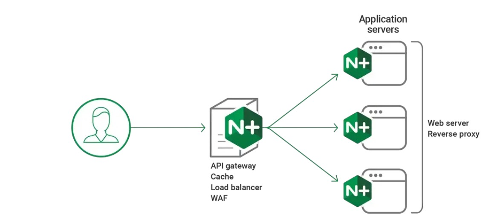
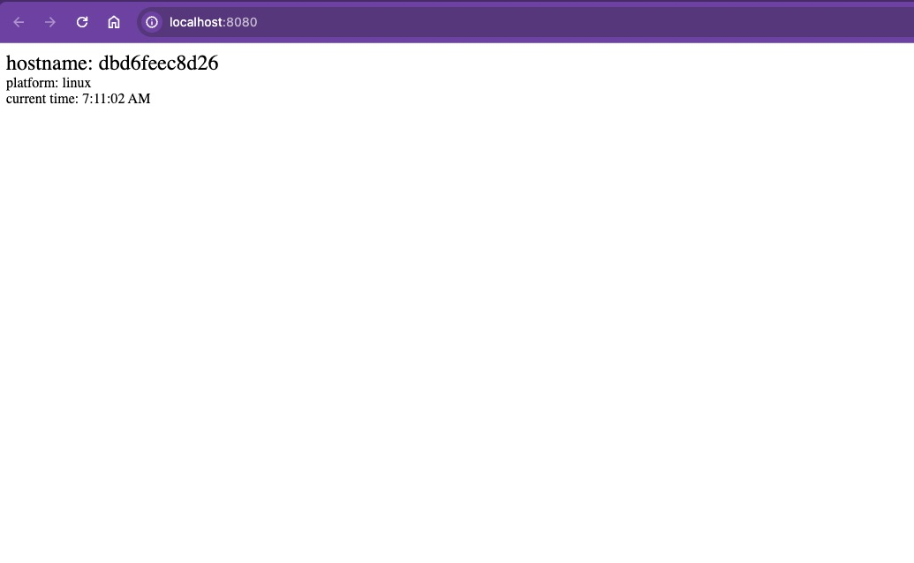

# 🚀 Load Balancer with Nginx + Docker

This lab demonstrates how to use **Nginx** as a **load balancer** for multiple **Express.js containers**.

Think of a load balancer as a **traffic officer at an intersection** 🚦. When requests (cars) arrive, the officer decides which server (road) each request should go to. This prevents one server from being overloaded while others stay idle.

We will cover **two main strategies**:

* **🔄 Round Robin** → Requests are distributed evenly, one by one, across all servers.
* **⚖️ Weighted Round Robin** → Some servers handle more requests than others (based on assigned weight).

---

## 📌 What You’ll Learn

* Build and run multiple Express.js servers in Docker
* Use Nginx as a reverse proxy and load balancer
* Understand Round Robin and Weighted Round Robin balancing strategies
* Test how requests are distributed between servers

---

## 🖼️ How Load Balancing Works



Nginx acts as a **reverse proxy** and **load balancer** in front of multiple application servers. Clients send requests to Nginx, and Nginx forwards them to backend servers according to the chosen strategy.

---

## 🔄 Round Robin

**Concept:**
Like customers lining up at supermarket counters — each new customer goes to the next available counter in order.


**Nginx configuration:**

```nginx
events {}

http {
    upstream food-app {
        server food-server1:5000;
        server food-server2:3000;  
        server food-server3:8000;  
    }

    server {
        listen 80;

        location / {
            proxy_pass http://food-app;
        }
    }
}
```

➡️ Requests are sent in this sequence: `server1 → server2 → server3 → server1 → ...`

---

## ⚖️ Weighted Round Robin

**Concept:**
Some servers are more powerful and can handle more traffic. By giving them a **weight**, Nginx sends more requests their way.


**Nginx configuration (3:2 ratio):**

```nginx
events {}

http {
    upstream food-app {
        server food-server1:5000 weight=3;
        server food-server2:3000 weight=2;  
    }

    server {
        listen 80;

        location / {
            proxy_pass http://food-app;
        }
    }
}
```

➡️ This means:

* `food-server1` handles **3 requests**
* `food-server2` handles **2 requests**
* Then it repeats

---

## 🧪 LAB A: Round Robin

We’ll build two Express servers, then configure Nginx to balance requests between them.

---

### 1️⃣ Create Project Folder

```bash
mkdir LAB1_Week10
cd LAB1_Week10
```

---

### 2️⃣ Clone Repository

```bash
git clone -b dev https://github.com/Tuchsanai/DevTools.git
cd DevTools/02_Docker/Week10/01_LAB1_Nginx_LoadBalance
```

This repo contains a simple Express app (`app.js`) and Docker setup.

---

### 3️⃣ Express App (`app.js`)

```js
const express = require('express');
const os = require('os');

const app = express();
const port = 3000;

app.get('/', (req, res) => {
    const currentTime = new Date().toLocaleTimeString();

    res.send(`<div>
                <span style="font-size: 24px;">hostname: ${os.hostname()}</span><br>
                <span>platform: ${os.platform()}</span><br>
                <span>current time: ${currentTime}</span>
              </div>`);
});

app.listen(port, () => {
    console.log(`Express app listening on port ${port}`);
});
```

👉 Each container will display its own **hostname**, **platform**, and **current time**.

---

### 4️⃣ Dockerfile

```dockerfile
FROM node:14

WORKDIR /usr/src/app
COPY package*.json ./
RUN npm install
COPY . .
EXPOSE 3000

CMD ["node", "app.js"]
```

👉 This builds a **Node.js Express app** image.

---

### 5️⃣ Build the Image

```bash
docker build -t express-app .
```

---

### 6️⃣ Create Docker Network

```bash
docker network create express-network
```

This lets containers talk to each other by name.

---

### 7️⃣ Run Express Containers

```bash
docker run -d --name app1 --network express-network -p 3001:3000 express-app
docker run -d --name app2 --network express-network -p 3002:3000 express-app
```

Now you have two running apps, each showing different hostnames.

Check:

```bash
docker ps -a
```

---

### 8️⃣ Configure Nginx (`nginx.conf`)

```nginx
events {}

http {
    upstream backend {
        server app1:3000;
        server app2:3000;
    }

    server {
        listen 8080;

        location / {
            proxy_pass http://backend;
        }
    }
}
```

👉 Nginx will forward requests alternately to `app1` and `app2`.

---

### 9️⃣ Run Nginx Container

```bash
docker run -d --name nginx-load-balancer \
  --network express-network \
  -p 8080:8080 \
  -v ./nginx.conf:/etc/nginx/nginx.conf:ro \
  nginx
```

---

### 🔟 Test in Browser

Visit:

```
http://localhost:8080
```

Refresh several times → you’ll see **different hostnames** switching between containers.

| From App1      | From App2      |
| -------------- | -------------- |
|  |  |

---

## 🧪 LAB B: Weighted Round Robin

```

ทำเอง 

```


---

## 🧹 Cleanup

Stop and remove everything:

```bash
docker stop $(docker ps -a -q)  
docker rm $(docker ps -a -q) 
docker rmi $(docker images -q) 
docker volume rm $(docker volume ls -q)  
docker network prune -f
```

---

✅ You now have a working **Nginx + Docker load balancer** setup with both **Round Robin** and **Weighted Round Robin** strategies!

---

Would you like me to also add a **troubleshooting section** (e.g., common errors like "port already in use" or "network not found") to help students debug faster?
