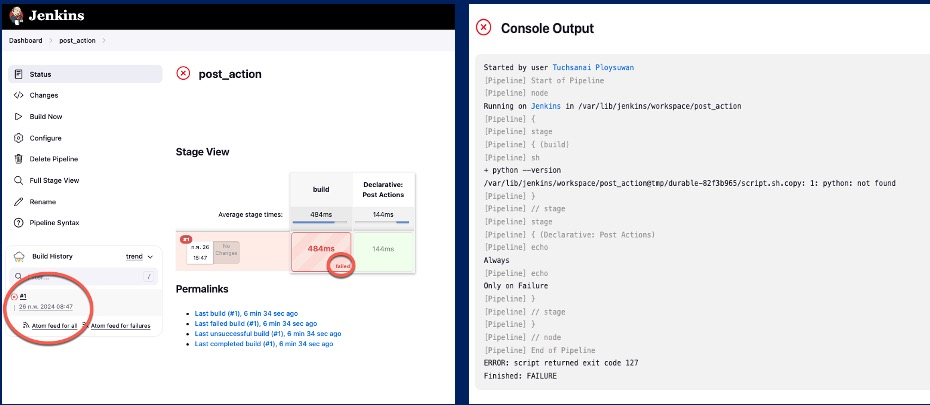
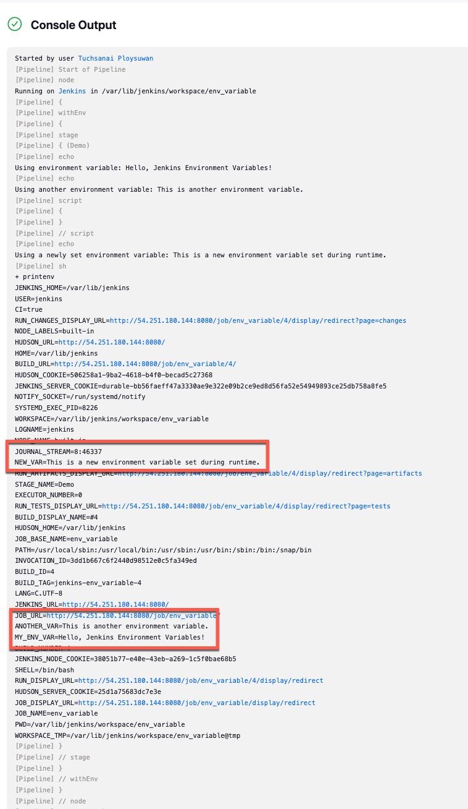

# * There are 4 labs in this section (Example 1,2,3,4) *

## Example 1. Multiple Stages

```bash
pipeline {
    agent any
    stages {
        stage('pre -build') {
            steps {
                sh 'echo Pre-build'
            }
        }
        stage('build') {
            steps {
                sh 'echo Build in progress.'
            }
        }
        stage('Unit tests') {
            steps {
                sh 'echo Running unit tests'
            }
        }
        stage('deploy') {
            steps {
                sh 'echo Deploying build'
            }
        }
        stage('Regression tests') {
            steps {
                sh 'echo Running E2E tests'
            }
        }
        stage('Release to prod') {
            steps {
                sh 'echo Releasing to prod'
            }
        }
    }
 
}
```

- if successful, you will get the following output


## Example 2. Post actions and Conditions

```bash

pipeline {
    agent any
    stages {
        stage('build') {
            steps {
                sh 'python3 --version'
            }
        }
    }
    post {
        always {
            echo 'Always'
        }
        success {
            echo 'Only on SUCCESS'
        }
        failure {
            echo 'Only on Failure'
        }
        unstable {
            echo 'Only if run is unstable'
        }
        changed {
            echo 'Only if status changed from Success to Failure or vice versa w.r.t. last run.'
        }
    }
}

```

- if there are no python you will get the following output



- To install Python on Ubuntu, you can use the following steps. 

```bash
sudo apt update
sudo apt install python3
```

```
python3 --version
```

- If you have python installed, you will get the following output


## Example 3. Environment Variables and Docker

### - 3.1 Basic environment variables 1

```bash

pipeline {
    agent any

    environment {
        // Define environment variables
        MY_ENV_VAR = 'Hello, Jenkins Environment Variables!'
        ANOTHER_VAR = 'This is another environment variable.'
    }

    stages {
        stage('Demo') {
            steps {

                // Use the environment variables
                echo "Using environment variable: ${env.MY_ENV_VAR}"
                echo "Using another environment variable: ${env.ANOTHER_VAR}"
                
                // Set a new environment variable or modify an existing one
                script {
                    env.NEW_VAR = 'This is a new environment variable set during runtime.'
                }
                
                echo "Using a newly set environment variable: ${env.NEW_VAR}"
                sh 'printenv'
            }
        }
    }
}


```

- if successful, you will get the following output


### - 3.2 Basic environment variables 2

```bash

pipeline {
    agent any

    environment {
        DISABLE_AUTH = 'true'
        DB_ENGINE    = 'sqlite'
    }

    stages {
        stage('Build') {
            steps {
                echo "Database engine is ${DB_ENGINE}"
                echo "DISABLE_AUTH is ${DISABLE_AUTH}"
                sh 'printenv'
            }
        }
    }
}

```


###  Example 4. Docker and Environment variables


```bash
pipeline {
    agent any  // Execute on any available Jenkins agent

    environment {
        // Define an environment variable 
        DOCKER_VERSION = ''
    }

    stages {
        stage('Check Docker') {
            steps {
                script {
                    // Try to get Docker version
                    def dockerCheck = sh(script: 'docker --version', returnStdout: true).trim()

                    sh 'echo dockerCheck = ' + dockerCheck

                    // Check if Docker is available and set environment variable accordingly
                    if (dockerCheck.contains('Docker version')) {
                        env.DOCKER_VERSION = dockerCheck
                    } else {
                        env.DOCKER_VERSION = 'No Docker'
                    }
                }
            }
        }

        stage('Run Docker Hello World') {
            steps {
                script {
                    // Check if Docker version was found and run hello-world image
                    if (env.DOCKER_VERSION != 'No Docker') {
                        sh 'docker run hello-world'
                    } else {
                        echo 'No Docker available on this machine'
                    }
                }
            }
        }
    }
}

```

- if successful, you will get the following output

