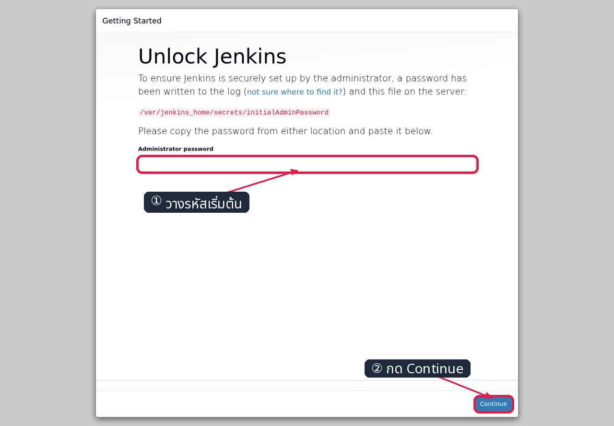
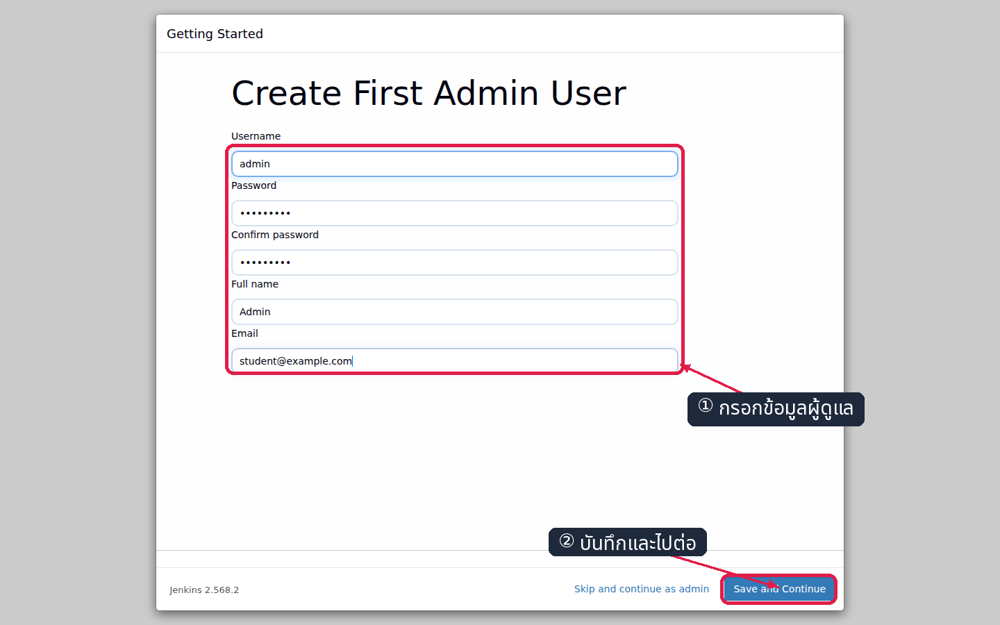
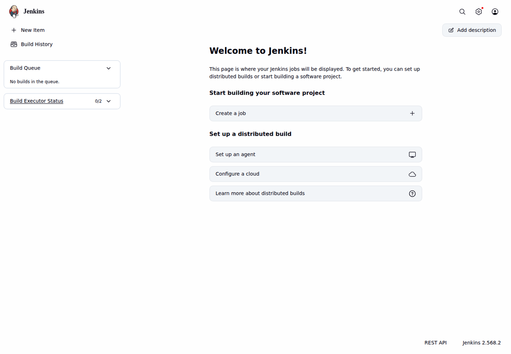
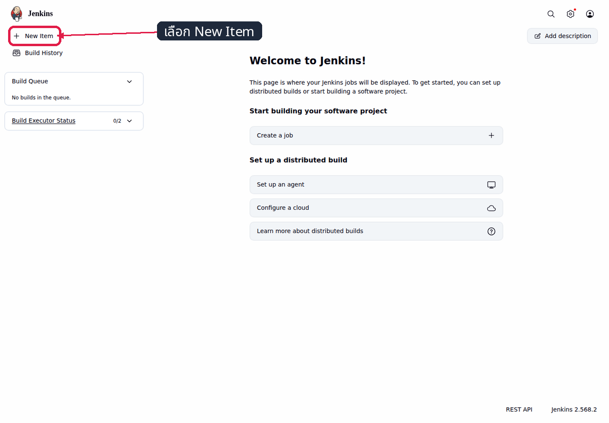
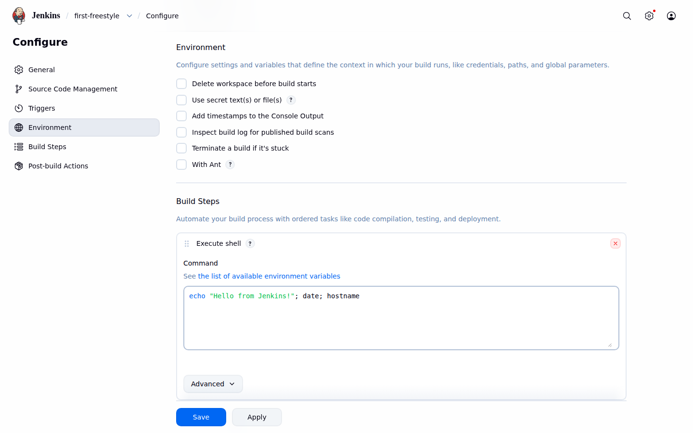
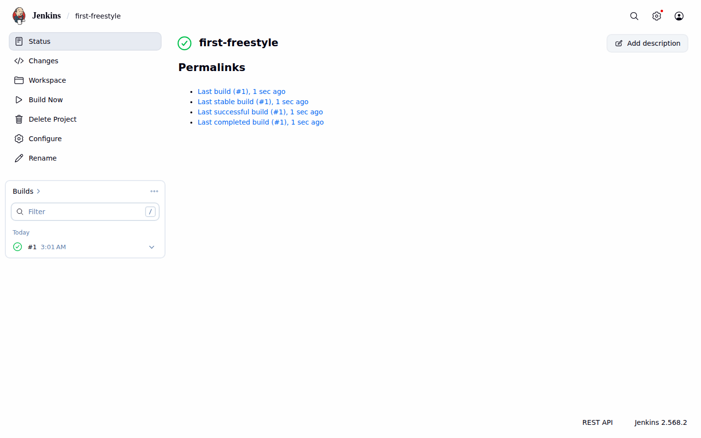
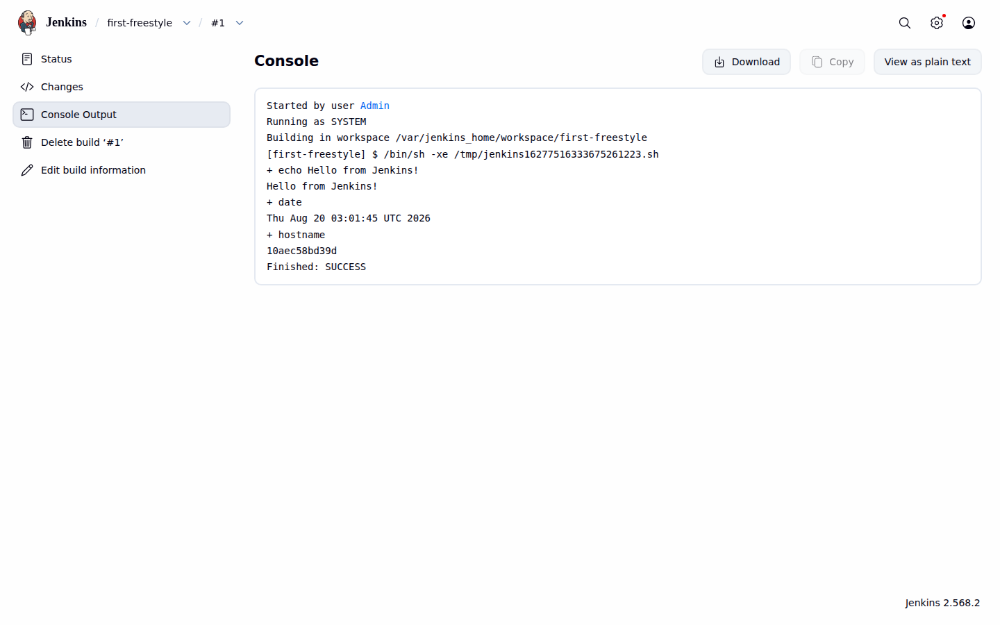
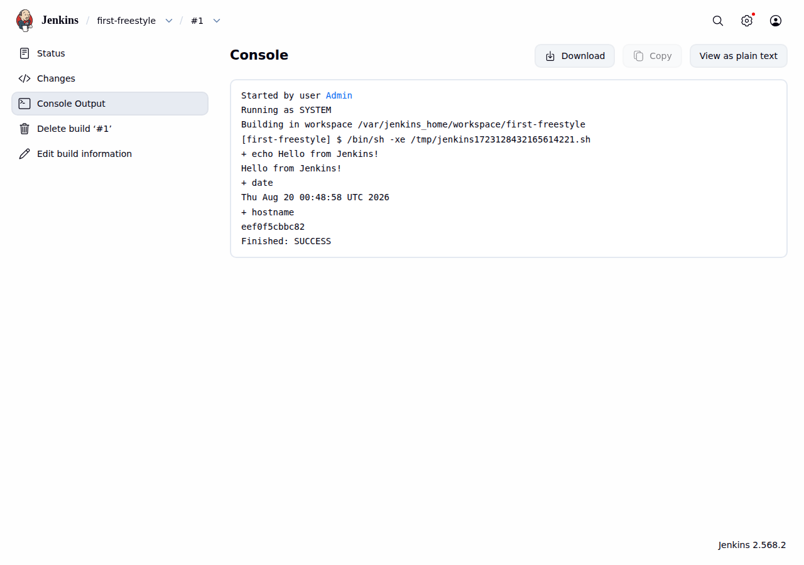

# LAB 1 — เริ่มต้น Jenkins บน Docker

แล็บใช้เวลาประมาณ 40 นาทีและตอบคำถามว่า “จะติดตั้ง Jenkins บน Docker และรักษาสถานะงานผ่านการ restart ได้อย่างไร” เมื่อสิ้นสุดการทดลอง นักศึกษาจะสามารถติดตั้ง Jenkins ผ่านหน้าเว็บ สร้างและรัน Freestyle job อ่าน Console Output และอธิบายบทบาทของ volume ต่อการคงอยู่ของข้อมูลได้

## ทฤษฎีก่อนลงมือ

Jenkins คือ automation server ที่รับเหตุการณ์หรือคำสั่งและดำเนินกระบวนการซ้ำตามที่กำหนด ในระบบ CI/CD มักใช้ checkout โค้ด รันทดสอบ สร้าง artifact และส่งต่อไป deploy เพื่อลดการดำเนินงานด้วยมือ รายละเอียดภาพรวมดู slide **ตอนที่ 1 — จากงานมือสู่ CI/CD**

คำว่า **controller** หมายถึง Jenkins ตัวที่เก็บการตั้งค่าและจัดคิวงาน, **job** คือสูตรงานหนึ่งชุด, **build** คือการรันสูตรนั้นแต่ละครั้ง และ **workspace** คือไดเรกทอรีทำงานของ job ระหว่าง build ดูความสัมพันธ์ของคำเหล่านี้ใน slide **ตอนที่ 2 — รู้จัก Jenkins**

การรัน Jenkins ใน Docker ทำให้สร้างสภาพแวดล้อมซ้ำ เริ่ม หยุด และเปลี่ยนเวอร์ชันได้โดยไม่ต้องติดตั้ง Java บนเครื่องหลัก พอร์ต `8080` ให้บริการหน้าเว็บและ HTTP API ส่วนพอร์ต `50000` ใช้รับ inbound Jenkins agents; แล็บนี้ใช้ built-in node จึงไม่เผยแพร่พอร์ตดังกล่าว ดูสถาปัตยกรรมใน slide **ตอนที่ 3 — Jenkins บน Docker**

container สามารถลบและสร้างใหม่ได้ แต่ข้อมูลใน writable layer อาจสูญหาย จึงต้องผูก named volume `jenkins_home` ที่ `/var/jenkins_home` เพื่อเก็บ config, users, jobs, build history และ workspaces ดังนั้น container ทำหน้าที่ประมวลผล ส่วน volume ทำหน้าที่เก็บสถานะถาวร

> **คำเตือนความปลอดภัย:** `--privileged` ให้สิทธิ์สูงมากและเหมาะกับ devtools แบบ disposable ของแล็บเท่านั้น ระบบ production ควรแยก agent, ใช้ least privilege และจัด config/secret ด้วย JCasC หรือ secret manager

## 🎯 ขอบเขตและผลลัพธ์การเรียนรู้

- อธิบายหน้าที่ของ controller, job, build, workspace และ `jenkins_home` ได้
- สร้าง network, volume และ Jenkins controller ด้วยค่าที่กำหนดได้
- unlock Jenkins ติดตั้ง suggested plugins และสร้างผู้ดูแลได้
- สร้าง Freestyle job และตรวจผล build ผ่าน Console Output ได้
- พิสูจน์ได้ว่า job และประวัติ build ยังคงอยู่หลัง restart สองชั้น

## สภาพตั้งต้น

ต้องมี Docker, Git, อินเทอร์เน็ต และพื้นที่ว่างอย่างน้อย 5 GB; LAB 1 เริ่มจากเครื่องที่ยังไม่มี `devtools-jenkins` คำสั่งเริ่มระบบ canonical คือ:

```bash
docker run -dit --name devtools-jenkins --privileged \
  --tmpfs /run -v jenkins-dind:/var/lib/docker \
  -p 2222:22 -p 8080:8080 -p 8000:8000 \
  tuchsanai/devtools:2569_1
docker ps
ssh root@localhost -p 2222
```

✅ **สิ่งที่ต้องเห็น** (ตัดเฉพาะแถวที่เกี่ยวข้อง):

```text
...
CONTAINER ID   IMAGE                         ...   NAMES
...            tuchsanai/devtools:2569_1    ...   devtools-jenkins
root@...:~#
```

เมื่อ SSH ขอรหัสผ่าน ให้ใช้ `passwd` แล้ว clone public repository และกำหนด course root ภายใน devtools ดังนี้:

```bash
if [ -d "$HOME/DevTools/.git" ]; then
  git -C "$HOME/DevTools" pull
else
  git clone --depth 1 https://github.com/Tuchsanai/DevTools.git "$HOME/DevTools"
fi
export COURSE_ROOT="$HOME/DevTools/04_Jenkins/001_Jenikin"
echo 'export COURSE_ROOT="$HOME/DevTools/04_Jenkins/001_Jenikin"' > /etc/profile.d/course.sh
```

✅ **สิ่งที่ต้องเห็น** (รันครั้งแรก):

```text
Cloning into '/root/DevTools'...
...
```

ถ้ามี `~/DevTools` อยู่แล้ว ต้องเห็นผลจาก `git pull` เช่น `Already up to date.` แทน การวัดใน container ทดสอบพบว่า shallow clone ทั้ง repository มีขนาด `221M` ซึ่งไม่เกิน 300 MB จึงใช้ clone ธรรมดาและไม่ต้อง sparse checkout การทดลองที่ 1–6 และ 8 ดำเนินการใน shell ของ devtools ส่วนการทดลองที่ 7 ดำเนินการจาก terminal ของเครื่องหลัก

> LAB 1 ไม่มีสถานะจากแล็บก่อนหน้า หาก `docker run` แจ้งว่าชื่อซ้ำ ให้เริ่ม container เดิมด้วย `docker start devtools-jenkins` แล้วเชื่อมต่อผ่าน SSH

## การทดลองที่ 1 — Jenkins ต้องเชื่อมกับ network ใด

**คำถาม:** จะยก Jenkins controller ให้มีชื่อ พอร์ต volume และ restart policy ตรงกับระบบแล็บได้อย่างไร?

```bash
docker network create cicd-net
docker run -d --name jenkins --network cicd-net --restart unless-stopped -p 8080:8080 -v jenkins_home:/var/jenkins_home jenkins/jenkins:lts-jdk21
docker ps
```

✅ **สิ่งที่ต้องเห็น** :

```text
...
CONTAINER ID   IMAGE                       ...   NAMES
...            jenkins/jenkins:lts-jdk21   ...   jenkins
```

> 📝 การดาวน์โหลด image ครั้งแรกใช้เวลาตามเครือข่าย รอจน `docker ps` แสดงสถานะ `Up` ก่อนเปิดเว็บ

## การทดลองที่ 2 — รหัส unlock อยู่ที่ไหน

**คำถาม:** จะอ่าน initial admin password ที่ Jenkins สร้างไว้ใน container ได้อย่างไร?

```bash
docker exec jenkins cat /var/jenkins_home/secrets/initialAdminPassword
```

✅ **สิ่งที่ต้องเห็น** :

```text
...
```

บรรทัดตัวอย่างแทน stdout จริงด้วยข้อความ redact เท่านั้น; คำสั่ง `cat` พิมพ์สตริงดิบ 32 ตัวอักษรโดยไม่มี prefix และค่าของแต่ละเครื่องจะแตกต่างกัน

> 📝 คัดลอกรหัสนี้เฉพาะตอน unlock; หลังสร้าง `admin` แล้วให้ใช้ `admin2569` แทน

## การทดลองที่ 3 — Wizard เตรียม Jenkins ให้พร้อมใช้อย่างไร

**คำถาม:** จะ unlock ติดตั้ง plugins และสร้างผู้ดูแลผ่านหน้าเว็บอย่างไร?

Setup Wizard ทำหน้าที่เปลี่ยน Jenkins จากสถานะติดตั้งใหม่ให้เป็นระบบที่ยืนยันตัวตนได้และมี plugin พื้นฐานพร้อมใช้งาน ลำดับต่อไปนี้ต้องดำเนินการต่อเนื่องจนถึง Dashboard

1. เปิด `http://localhost:8080` วางรหัสจากการทดลองที่ 2 แล้วกด **Continue**



*เครื่องหมาย ① ชี้ช่อง Administrator password และ ② ชี้ปุ่ม Continue ตามลำดับการดำเนินการ*

2. เลือก **Install suggested plugins** และรอประมาณ 2–3 นาทีจนการติดตั้งเสร็จสมบูรณ์


*กรอบสีแดงชี้ตัวเลือก suggested plugins ซึ่งจัดเตรียมความสามารถพื้นฐาน รวมถึง Pipeline และ Git*

3. กรอก Username `admin`, Password และ Confirm password เป็น `admin2569`, Full name `Admin`, Email `student@example.com` แล้วกด **Save and Continue**



*แบบฟอร์มผู้ดูแลกรอกค่าครบ โดยช่อง Password และ Confirm password แสดงเป็นจุดเพื่อปิดบังรหัสผ่าน*

4. คง Jenkins URL เป็น `http://localhost:8080/` แล้วกด **Save and Finish → Start using Jenkins**

✅ **สิ่งที่ต้องเห็น** :

```text
Welcome to Jenkins!
```



*Dashboard แสดงว่า Setup Wizard เสร็จสมบูรณ์และ Jenkins พร้อมสร้าง job*

> 📝 ถ้า plugin บางตัวขึ้น Retry ให้กด Retry; อย่าปิด container ระหว่างติดตั้ง

## การทดลองที่ 4 — Job แรกประกอบด้วยอะไร

**คำถาม:** จะสร้าง Freestyle job ที่รัน shell สามคำสั่งได้อย่างไร?

Freestyle job เหมาะสำหรับศึกษาความสัมพันธ์ระหว่างการกำหนดค่า job กับ build ก่อนเข้าสู่ Pipeline การบันทึก job จะสร้าง config ภายใต้ `jenkins_home` และเปิดหน้าสถานะของ job นั้น

1. จาก Dashboard ตรวจเมนู **New Item, Build History, Manage Jenkins** แล้วเลือก **New Item**



*กรอบและป้ายชี้เมนู New Item ด้านซ้าย ซึ่งเป็นจุดเริ่มต้นของการสร้าง job*

2. กรอกชื่อ `first-freestyle` เลือก **Freestyle project** แล้วกด **OK**


*หน้า New Item แสดงชื่อ first-freestyle ประเภท Freestyle project และปุ่ม OK ที่พร้อมใช้งาน*

3. ไปที่ **Build Steps → Add build step → Execute shell** แล้วกรอกคำสั่งต่อไปนี้ในช่อง Command

```bash
echo "Hello from Jenkins!"
date
hostname
```

✅ **สิ่งที่ต้องเห็นใน Console Output**:

```text
Hello from Jenkins!
...
...
```



*ส่วน Build Steps แสดง Execute shell และคำสั่งสามส่วนก่อนบันทึก config*

4. ตรวจข้อความในช่อง Command แล้วกด **Save**

✅ **สิ่งที่ต้องเห็น** :

```text
หน้า job ชื่อ first-freestyle และมีเมนู Build Now
```


*หน้า Status หลัง Save แสดงชื่อ first-freestyle เมนู Build Now และยังไม่มี build history*

ขณะนี้ระบบอยู่ที่หน้า Status ของ `first-freestyle` และพร้อมสร้าง build แรก การทดลองถัดไปจะใช้ config ที่บันทึกไว้นี้

## การทดลองที่ 5 — Build บอกอะไรเราได้บ้าง

**คำถาม:** Console Output และ workspace ของ build แรกอยู่ที่ใด?

Console Output เป็นหลักฐานว่าคำสั่งใดถูกรัน ใน workspace ใด และจบด้วยสถานะใด ส่วน workspace แสดงตำแหน่งข้อมูลทำงานของ job ภายใน volume

ต่อไปเรียกเลข build แรกที่พบว่า `#N` เพื่อให้คำแนะนำใช้ได้แม้มี build history เดิม

1. จากหน้า Status เลือก **Build Now** แล้วรอจน build `#N` แสดงเครื่องหมายสีเขียว



*หน้า job แสดง build #1 เป็น Last successful build และมีเครื่องหมายสถานะสีเขียว*

2. เลือก `#N → Console Output` และตรวจว่ามีข้อความ `Hello from Jenkins!` กับ `Finished: SUCCESS`



*Console Output แสดง workspace คำสั่ง echo, date, hostname และผลลัพธ์ Finished: SUCCESS*

3. กลับมาที่ shell แล้วตรวจ workspace ที่ Jenkins เก็บใน volume

```bash
docker exec jenkins sh -c 'ls -ld /var/jenkins_home/workspace/first-freestyle'
```

✅ **สิ่งที่ต้องเห็น** :

```text
Building in workspace /var/jenkins_home/workspace/first-freestyle
Hello from Jenkins!
Finished: SUCCESS
drwxr-xr-x 2 jenkins jenkins 4096 Aug 20 ... /var/jenkins_home/workspace/first-freestyle
```



*ภาพ Console Output ชุดเดิมยืนยันรูปแบบผลลัพธ์ที่ต้องตรวจสอบหลัง build สำเร็จ*

> 📝 Build number คือประวัติการรัน ไม่ใช่ job ใหม่; workspace นี้อยู่ใต้ `/var/jenkins_home` จึงอยู่ใน `jenkins_home`

## การทดลองที่ 6 — Restart Jenkins แล้วอะไรยังอยู่

**คำถาม:** เมื่อ restart เฉพาะ Jenkins container งานและประวัติ build จะหายหรือไม่?

```bash
docker restart jenkins
sleep 20
curl -fsS -u admin:admin2569 'http://localhost:8080/job/first-freestyle/lastBuild/api/json?tree=number,result'
```

✅ **สิ่งที่ต้องเห็น** :

```json
{"_class":"hudson.model.FreeStyleBuild","number":<BUILD_NUMBER>,"result":"SUCCESS"}
```

สถานะยังคงอยู่เพราะ `jenkins_home` ถูก mount กลับเข้าตำแหน่งเดิมและไม่ผูกกับอายุของ container process ขณะนี้ job และ build history พร้อมสำหรับการทดสอบ restart ชั้นนอก

## การทดลองที่ 7 — Restart devtools ทั้งตัวแล้วระบบกู้ตัวเองได้หรือไม่

**คำถาม:** เมื่อ restart container ชั้นนอก dockerd และ Jenkins จะกลับมาเองหรือไม่?

ออกจาก SSH แล้วรันสองคำสั่งนี้บน terminal ของเครื่องหลัก:

```bash
docker restart devtools-jenkins
sleep 20
docker exec devtools-jenkins docker ps
```

✅ **สิ่งที่ต้องเห็น** :

```text
CONTAINER ID   IMAGE   ...   NAMES
...            ...     ...   jenkins
```

`--tmpfs /run` ป้องกัน PID เก่าของ dockerd ค้าง ส่วน `--restart unless-stopped` ทำให้ Jenkins กลับมา และ named volume `jenkins-dind` เก็บ inner image/volume ไว้

## การทดลองที่ 8 — สถานะจบ LAB 1 ครบหรือยัง

**คำถาม:** จะตรวจ container, volume, job และผล build ล่าสุดพร้อมกันได้อย่างไร?

SSH กลับเข้า devtools แล้วรอ Jenkins HTTP พร้อมก่อนตรวจชุดสอนที่ clone ไว้ในขั้นสภาพตั้งต้น:

```bash
sleep 20
(
  cd "$COURSE_ROOT/001_LAB_Jenkins_On_Docker"
  bash check.sh
)
```

readiness loop รอให้หน้า login ตอบสำเร็จจริงก่อน acceptance จึงไม่ตัดสินจากสถานะ container `Up` เพียงอย่างเดียว

✅ **สิ่งที่ต้องเห็น** :

```text
PASS: container jenkins is Up
PASS: volume jenkins_home exists
PASS: job first-freestyle exists
PASS: latest build #N is SUCCESS
LAB 1 CHECK: PASS
```

`check.sh` คืน exit code `0` เมื่อครบทุกข้อ และคืน `1` พร้อมรายการที่ขาดเมื่อสถานะยังไม่พร้อม

## กู้สถานะหลัง restart/ปิดเครื่อง

บนเครื่องหลัก เปิด devtools ตัวเดิมแล้วรอประมาณ 20 วินาที:

```bash
docker start devtools-jenkins
sleep 20
docker exec devtools-jenkins docker ps
```

✅ **สิ่งที่ต้องเห็น** (ตัดเฉพาะแถวที่เกี่ยวข้อง):

```text
devtools-jenkins
CONTAINER ID   IMAGE   ...   NAMES
...            ...     ...   jenkins
```

ต้องเห็น `jenkins` กลับมา `Up` โดยไม่ต้องทำ wizard ซ้ำ จากนั้น SSH เข้าและรัน `bash check.sh` หากต้องสร้าง devtools ใหม่ ให้ใช้คำสั่ง canonical เดิมพร้อม `-v jenkins-dind:/var/lib/docker` เพื่อผูกสถานะเดิมกลับมา

## แก้ปัญหาที่พบบ่อย

| อาการ | สาเหตุ | วิธีแก้ |
|---|---|---|
| `Bind for 0.0.0.0:8080 failed` | พอร์ต 8080 ของเครื่องหลักถูกใช้ | รัน `docker ps` แล้วดูคอลัมน์ PORTS; หยุดเฉพาะตัวที่คุณเป็นเจ้าของ แล้วรัน canonical command ใหม่ |
| Wizard ช้ามากหรือ update center ล้ม | อินเทอร์เน็ตช้า/บริการ update center สะดุด | รอ 2–3 นาทีแล้วกด **Retry**; ตรวจอินเทอร์เน็ตและลองใหม่โดยไม่ลบ `jenkins_home` |
| ลืม `initialAdminPassword` หลังตั้ง admin แล้ว | รหัส initial ใช้เฉพาะ unlock ครั้งแรก | เข้าด้วย `admin/admin2569`; ไม่ต้องอ่าน initial password อีก |
| Restart แล้ว dockerd ใน devtools ไม่ขึ้น | ตอนสร้าง devtools ขาด `--tmpfs /run` จึงมี PID เก่าค้าง | สร้าง devtools ใหม่ด้วยคำสั่ง canonical ที่มี `--tmpfs /run` และผูก `jenkins-dind` เดิม |
| เปิด `localhost:8080` แล้ว connection refused | Jenkins ยังเริ่มไม่เสร็จหรือ container หยุด | รอ `docker logs jenkins` แสดง `Jenkins is fully up and running` และตรวจ `docker ps` |
| `check.sh` แจ้ง API login failed | รหัส admin หรือ Jenkins URL ไม่ตรง fixture | ใช้ `admin/admin2569`; รันจากใน devtools หรือกำหนด `JENKINS_URL` ให้ถูก |
