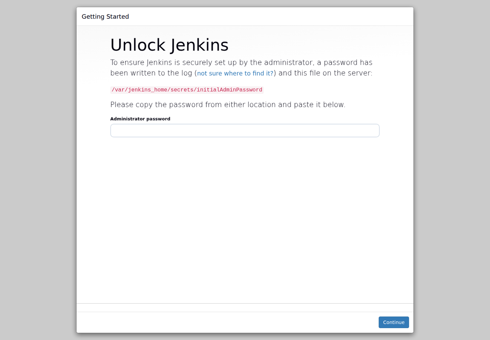
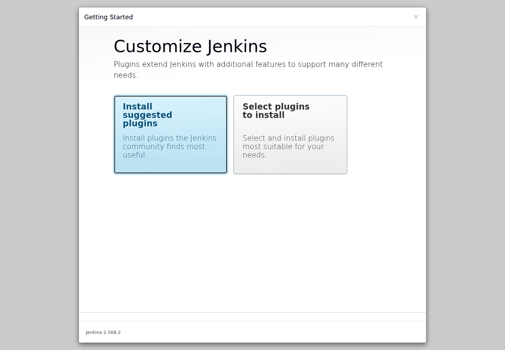

# LAB 1 — ยก Jenkins ขึ้นด้วย Docker

แล็บ 40 นาทีนี้ตอบคำถามว่า “จะเริ่ม Jenkins บน Docker และเก็บงานให้รอดจากการ restart ได้อย่างไร” เมื่อจบแล้วคุณจะติดตั้ง Jenkins ผ่านหน้าเว็บ สร้างและรัน Freestyle job แรก อ่าน Console Output และพิสูจน์ได้ว่างานยังอยู่เพราะใช้ volume

## ทฤษฎีก่อนลงมือ

Jenkins คือ automation server ที่รับเหตุการณ์หรือคำสั่งแล้วทำงานซ้ำ ๆ ให้แทนเรา ในวง CI/CD มันมัก checkout โค้ด รันทดสอบ build artifact และส่งต่อไป deploy แทนการให้คนกดคำสั่งทุกขั้น รายละเอียดภาพรวมดู slide **ตอนที่ 1 — จากงานมือสู่ CI/CD**

คำว่า **controller** หมายถึง Jenkins ตัวที่เก็บการตั้งค่าและจัดคิวงาน, **job** คือสูตรงานหนึ่งชุด, **build** คือการรันสูตรนั้นแต่ละครั้ง และ **workspace** คือไดเรกทอรีทำงานของ job ระหว่าง build ดูความสัมพันธ์ของคำเหล่านี้ใน slide **ตอนที่ 2 — รู้จัก Jenkins**

เราใส่ Jenkins ไว้ใน Docker เพื่อสร้างสภาพแวดล้อมซ้ำได้ เริ่ม/หยุด/เปลี่ยนเวอร์ชันได้โดยไม่ติดตั้ง Java ลงเครื่องหลัก พอร์ต `8080` เปิดหน้าเว็บและ HTTP API ส่วน `50000` มีไว้รับ inbound Jenkins agents; แล็บนี้ใช้ built-in node จึงไม่เปิดพอร์ตนั้น ดูสถาปัตยกรรมใน slide **ตอนที่ 3 — Jenkins บน Docker**

container ลบแล้วสร้างใหม่ได้ แต่ข้อมูลใน writable layer อาจหาย จึงผูก named volume `jenkins_home` ที่ `/var/jenkins_home` ซึ่งเก็บ config, users, jobs, build history และ workspaces กล่าวสั้น ๆ คือ **container เป็นตัวรัน ส่วน volume เป็นหัวใจของสถานะ**

> **คำเตือนความปลอดภัย:** `--privileged` ให้สิทธิ์สูงมากและเหมาะกับ devtools แบบ disposable ของแล็บเท่านั้น ระบบ production ควรแยก agent, ใช้ least privilege และจัด config/secret ด้วย JCasC หรือ secret manager

## 🎯 แล็บนี้ใน 30 วินาที

- เปิด devtools แบบ Docker-in-Docker แล้วเข้า shell ผ่าน SSH
- สร้าง network, volume และ Jenkins controller
- unlock Jenkins ติดตั้ง suggested plugins และสร้างผู้ดูแล
- สร้าง Freestyle job แล้วอ่านผล build แรก
- restart สองชั้นและตรวจว่า job กับประวัติยังอยู่

## สภาพตั้งต้น

ต้องมี Docker, Git, อินเทอร์เน็ต และพื้นที่ว่างอย่างน้อย 5 GB; LAB 1 เริ่มจากเครื่องที่ยังไม่มี `devtools-jenkins` คำสั่งเริ่มระบบ canonical คือ:

```bash
docker run -dit --name devtools-jenkins --privileged \
  --tmpfs /run -v jenkins-dind:/var/lib/docker \
  -p 2222:22 -p 8080:8080 -p 3000:3000 -p 8000:8000 \
  tuchsanai/devtools:2569_1
ssh root@localhost -p 2222
```

เมื่อ SSH ถามรหัสผ่าน ใช้ `passwd` แล้วทำการทดลองที่ 1–6 และ 8 ใน shell ของ devtools นี้ ส่วนการทดลองที่ 7 รันจาก terminal ของเครื่องหลัก

```bash
docker ps --format '{{.Names}}\t{{.Status}}'   # ต้องเห็น: devtools-jenkins
```

> ยังไม่มี LAB ก่อนหน้า — ถ้า `docker run` แจ้งว่าชื่อซ้ำ ให้ใช้ container เดิมด้วย `docker start devtools-jenkins` แล้ว SSH เข้าไป

## การทดลองที่ 1 — Jenkins ต้องเชื่อมกับ network ใด

**คำถาม:** จะยก Jenkins controller ให้มีชื่อ พอร์ต volume และ restart policy ตรงกับระบบแล็บได้อย่างไร?

```bash
docker network create cicd-net
docker run -d --name jenkins --network cicd-net --restart unless-stopped -p 8080:8080 -v jenkins_home:/var/jenkins_home jenkins/jenkins:lts-jdk21
```

✅ **สิ่งที่ต้องเห็น** :

```text
e2201dd068b4156ead5570e0675ae8dd8fa4394e8f283ff9fd30f96c026a0cd3
eef0f5cbbc82638edf28df8b866ff82d43e5a1c9508effe5b6dc52a4bb988d7c
```

> 📝 การดาวน์โหลด image ครั้งแรกใช้เวลาตามเครือข่าย รอจน `docker ps` แสดงสถานะ `Up` ก่อนเปิดเว็บ

## การทดลองที่ 2 — รหัส unlock อยู่ที่ไหน

**คำถาม:** จะอ่าน initial admin password ที่ Jenkins สร้างไว้ใน container ได้อย่างไร?

```bash
docker exec jenkins cat /var/jenkins_home/secrets/initialAdminPassword
```

✅ **สิ่งที่ต้องเห็น** :

```text
initialAdminPassword=8e0a...8cad (length=32)
```

บรรทัดนี้ตัดจากการรันจริงโดยปิดรหัสช่วงกลางไว้; ค่าของแต่ละเครื่องจะต่างกัน แต่ต้องยาว 32 ตัว

> 📝 คัดลอกรหัสนี้เฉพาะตอน unlock; หลังสร้าง `admin` แล้วให้ใช้ `admin2569` แทน

## การทดลองที่ 3 — Wizard เตรียม Jenkins ให้พร้อมใช้อย่างไร

**คำถาม:** จะ unlock ติดตั้ง plugins และสร้างผู้ดูแลผ่านหน้าเว็บอย่างไร?

1. เปิด `http://localhost:8080` วางรหัสจากการทดลองที่ 2 แล้วกด **Continue**
2. กด **Install suggested plugins** และรอประมาณ 2–3 นาที; ถ้าช้ากว่านี้ให้ดูตารางแก้ปัญหา
3. สร้างผู้ใช้ `admin` รหัสผ่าน `admin2569`, Full name `Admin`, Email `student@example.com`
4. คง Jenkins URL เป็น `http://localhost:8080/` แล้วกด **Save and Finish → Start using Jenkins**

✅ **สิ่งที่ต้องเห็น** :

```text
Welcome to Jenkins!
```





> 📝 ถ้า plugin บางตัวขึ้น Retry ให้กด Retry; อย่าปิด container ระหว่างติดตั้ง

## การทดลองที่ 4 — Job แรกประกอบด้วยอะไร

**คำถาม:** จะสร้าง Freestyle job ที่รัน shell สามคำสั่งได้อย่างไร?

1. จาก Dashboard ดูเมนู **New Item, Build History, Manage Jenkins** แล้วกด **New Item**
2. ตั้งชื่อ `first-freestyle` เลือก **Freestyle project** แล้วกด **OK**
3. ที่ **Build Steps → Add build step → Execute shell** ใส่ข้อความด้านล่าง แล้วกด **Save**

```bash
echo "Hello from Jenkins!"; date; hostname
```

✅ **สิ่งที่ต้องเห็น** :

```text
หน้า job ชื่อ first-freestyle และมีเมนู Build Now
```


## การทดลองที่ 5 — Build บอกอะไรเราได้บ้าง

**คำถาม:** Console Output และ workspace ของ build แรกอยู่ที่ใด?

1. กด **Build Now** รอให้ `#1` เป็นวงกลมสีเขียว แล้วกด `#1 → Console Output`
2. กลับมาที่ shell ตรวจ workspace ที่ Jenkins เก็บใน volume

```bash
docker exec jenkins sh -c 'ls -ld /var/jenkins_home/workspace/first-freestyle'
```

✅ **สิ่งที่ต้องเห็น** :

```text
Building in workspace /var/jenkins_home/workspace/first-freestyle
Hello from Jenkins!
Finished: SUCCESS
drwxr-xr-x 2 jenkins jenkins 4096 Aug 20 00:48 /var/jenkins_home/workspace/first-freestyle
```


> 📝 Build number คือประวัติการรัน ไม่ใช่ job ใหม่; workspace นี้อยู่ใต้ `/var/jenkins_home` จึงอยู่ใน `jenkins_home`

## การทดลองที่ 6 — Restart Jenkins แล้วอะไรยังอยู่

**คำถาม:** เมื่อ restart เฉพาะ Jenkins container งานและประวัติ build จะหายหรือไม่?

```bash
docker restart jenkins
curl -fsS -u admin:admin2569 'http://localhost:8080/job/first-freestyle/lastBuild/api/json?tree=number,result'
```

✅ **สิ่งที่ต้องเห็น** :

```json
{"_class":"hudson.model.FreeStyleBuild","number":1,"result":"SUCCESS"}
```

สถานะยังอยู่เพราะ `jenkins_home` ถูก mount กลับเข้าที่เดิม ไม่ได้ฝากไว้กับอายุของ container process

## การทดลองที่ 7 — Restart devtools ทั้งตัวแล้วระบบกู้ตัวเองได้หรือไม่

**คำถาม:** เมื่อ restart container ชั้นนอก dockerd และ Jenkins จะกลับมาเองหรือไม่?

ออกจาก SSH แล้วรันสองคำสั่งนี้บน terminal ของเครื่องหลัก:

```bash
docker restart devtools-jenkins
docker exec devtools-jenkins sh -c 'until docker info >/dev/null 2>&1; do sleep 2; done; docker ps --format "{{.Names}} {{.Status}}"'
```

✅ **สิ่งที่ต้องเห็น** :

```text
jenkins Up Less than a second
```

`--tmpfs /run` ป้องกัน PID เก่าของ dockerd ค้าง ส่วน `--restart unless-stopped` ทำให้ Jenkins กลับมา และ named volume `jenkins-dind` เก็บ inner image/volume ไว้

## การทดลองที่ 8 — สถานะจบ LAB 1 ครบหรือยัง

**คำถาม:** จะตรวจ container, volume, job และผล build ล่าสุดพร้อมกันได้อย่างไร?

SSH กลับเข้า devtools แล้วไปยังโฟลเดอร์ชุดสอนซึ่งผู้สอนได้เตรียมไว้ จากนั้นรัน:

```bash
cd /workspace/001_Jenikin/001_LAB_Jenkins_On_Docker
bash check.sh
```

✅ **สิ่งที่ต้องเห็น** :

```text
PASS: container jenkins is Up
PASS: volume jenkins_home exists
PASS: job first-freestyle exists
PASS: latest build #1 is SUCCESS
LAB 1 CHECK: PASS
```

`check.sh` คืน exit code `0` เมื่อครบทุกข้อ และคืน `1` พร้อมรายการที่ขาดเมื่อสถานะยังไม่พร้อม

## กู้สถานะหลัง restart/ปิดเครื่อง

บนเครื่องหลัก เปิด devtools ตัวเดิมแล้วรอประมาณ 20 วินาที:

```bash
docker start devtools-jenkins
docker exec devtools-jenkins sh -c 'until docker info >/dev/null 2>&1; do sleep 2; done; docker ps'
```

ต้องเห็น `jenkins` กลับมา `Up` โดยไม่ต้องทำ wizard ซ้ำ จากนั้น SSH เข้าและรัน `bash check.sh` หากต้องสร้าง devtools ใหม่ ให้ใช้คำสั่ง canonical เดิมพร้อม `-v jenkins-dind:/var/lib/docker` เพื่อผูกสถานะเดิมกลับมา

## แก้ปัญหาที่พบบ่อย

| อาการ | สาเหตุ | วิธีแก้ |
|---|---|---|
| `Bind for 0.0.0.0:8080 failed` | พอร์ต 8080 ของเครื่องหลักถูกใช้ | ดูตัวที่ใช้ด้วย `docker ps --format '{{.Names}} {{.Ports}}'`; หยุดเฉพาะตัวที่คุณเป็นเจ้าของ แล้วรัน canonical command ใหม่ |
| Wizard ช้ามากหรือ update center ล้ม | อินเทอร์เน็ตช้า/บริการ update center สะดุด | รอ 2–3 นาทีแล้วกด **Retry**; ตรวจอินเทอร์เน็ตและลองใหม่โดยไม่ลบ `jenkins_home` |
| ลืม `initialAdminPassword` หลังตั้ง admin แล้ว | รหัส initial ใช้เฉพาะ unlock ครั้งแรก | เข้าด้วย `admin/admin2569`; ไม่ต้องอ่าน initial password อีก |
| Restart แล้ว dockerd ใน devtools ไม่ขึ้น | ตอนสร้าง devtools ขาด `--tmpfs /run` จึงมี PID เก่าค้าง | สร้าง devtools ใหม่ด้วยคำสั่ง canonical ที่มี `--tmpfs /run` และผูก `jenkins-dind` เดิม |
| เปิด `localhost:8080` แล้ว connection refused | Jenkins ยังเริ่มไม่เสร็จหรือ container หยุด | รอ `docker logs jenkins` แสดง `Jenkins is fully up and running` และตรวจ `docker ps` |
| `check.sh` แจ้ง API login failed | รหัส admin หรือ Jenkins URL ไม่ตรง fixture | ใช้ `admin/admin2569`; รันจากใน devtools หรือกำหนด `JENKINS_URL` ให้ถูก |
