# LAB 1 — Jenkins on Docker

> ⏱️ ประมาณ 40–45 นาที · 🧪 7 การทดลอง · 🎯 จบเมื่อ job `first-freestyle` มี build ล่าสุดเป็น `SUCCESS` และยังคงอยู่หลังลบและสร้างคอนเทนเนอร์ใหม่

แล็บนี้ตอบคำถามว่า **“จะติดตั้ง Jenkins บน Docker ให้พร้อมใช้งาน และพิสูจน์ได้อย่างไรว่าระบบทำงานถูกต้อง”** นักศึกษาจะยก Jenkins ขึ้นเป็นคอนเทนเนอร์ ตั้งค่าผ่าน Setup Wizard สร้าง job แรก ทดลองให้ build **ล้มเหลวโดยตั้งใจ** เพื่อฝึกอ่าน Console Output แล้วลบคอนเทนเนอร์ทิ้งเพื่อพิสูจน์ว่าประวัติ build ยังอยู่ใน volume

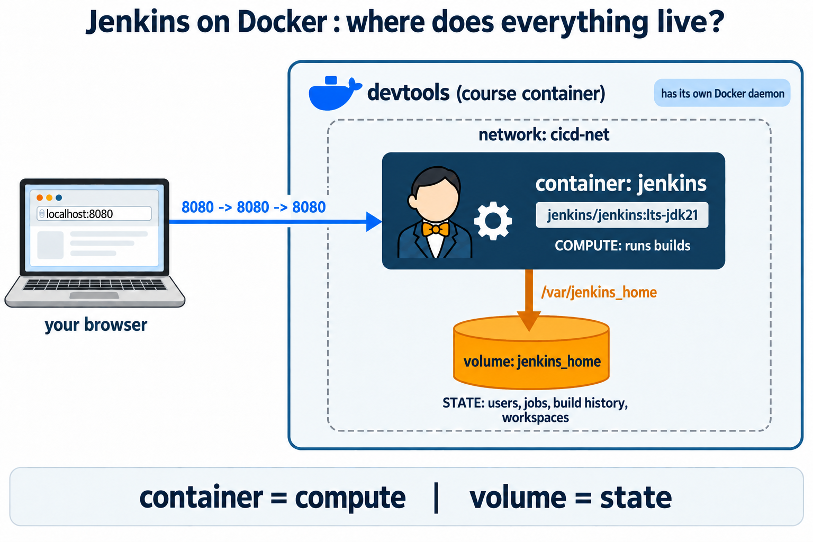

*ภาพที่ 1 ภาพรวมระบบของแล็บ: คอนเทนเนอร์ `jenkins` ทำหน้าที่ประมวลผล (compute) ส่วน volume `jenkins_home` เก็บสถานะทั้งหมด (state)*

---

## 📚 ทฤษฎีก่อนลงมือ

### 1. Continuous Integration และบทบาทของ automation server

**Continuous Integration (CI)** คือแนวปฏิบัติที่ให้นักพัฒนารวม (integrate) การเปลี่ยนแปลงของโค้ดเข้าสู่ฐานโค้ดกลางบ่อยครั้ง และให้ทุกการเปลี่ยนแปลงผ่านการ build และทดสอบโดยอัตโนมัติ เป้าหมายคือค้นพบข้อผิดพลาดให้เร็วที่สุด เพราะข้อผิดพลาดที่พบใกล้เวลาที่เกิดจะวิเคราะห์และแก้ไขได้ด้วยต้นทุนต่ำกว่า ส่วน **Continuous Delivery/Deployment (CD)** ต่อยอดจาก CI โดยนำผลลัพธ์ที่ผ่านการทดสอบไปจัดเตรียมหรือส่งขึ้นสภาพแวดล้อมเป้าหมายอย่างเป็นระบบ

กระบวนการทั้งสองต้องมีตัวกลางที่ **รับเหตุการณ์ (trigger) แล้วดำเนินขั้นตอนเดิมด้วยลำดับเดิมทุกครั้ง** ซึ่งเรียกว่า *automation server* Jenkins เป็น automation server แบบโอเพนซอร์สที่ใช้แพร่หลาย จุดเด่นคือระบบ plugin ที่ขยายความสามารถได้กว้าง และการบันทึกหลักฐานของทุกการทำงาน (build log และผลลัพธ์) ไว้ตรวจย้อนหลังได้

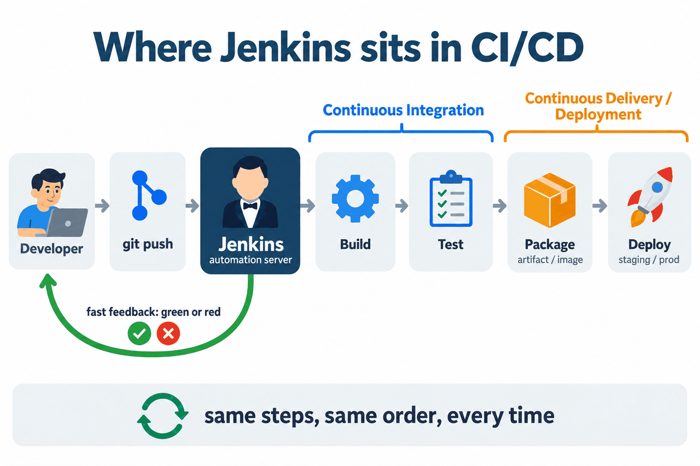

*ภาพที่ 2 Jenkins อยู่ระหว่างการ push โค้ดกับการ build/test/package/deploy และส่งผล (เขียว/แดง) กลับไปยังนักพัฒนาอย่างรวดเร็ว*

### 2. สถาปัตยกรรมภายใน Jenkins controller

ในแล็บนี้ Jenkins ทำงานเป็น **controller** ตัวเดียว ภายในประกอบด้วยส่วนหลักดังนี้

| ส่วนประกอบ | หน้าที่ | สิ่งที่จะเห็นในแล็บ |
|---|---|---|
| Web UI + REST API | ช่องทางสั่งงานและอ่านผล ทั้งผ่านเบราว์เซอร์และผ่านโปรแกรม | หน้าเว็บที่พอร์ต `8080` และ `.../api/json` |
| Build Queue | คิวของ build ที่รอทรัพยากร | กล่อง *Build Queue* บน Dashboard |
| Executor | ช่องประมวลผลที่รับ build จากคิวไปทำ 1 build ต่อ 1 ช่อง | *Build Executor Status* `0/2` = มี 2 ช่องว่างอยู่ |
| `JENKINS_HOME` | ไดเรกทอรีเก็บสถานะทั้งหมด: `jobs/`, `builds/`, `workspace/`, `plugins/`, `secrets/` | `/var/jenkins_home` ซึ่งผูกกับ volume `jenkins_home` |

เมื่อกด **Build Now** คำขอจะเข้าคิว → executor ที่ว่างรับไปทำงานใน **workspace** ของ job → ผลลัพธ์และ log ถูกบันทึกลง `jobs/<job>/builds/<N>/`

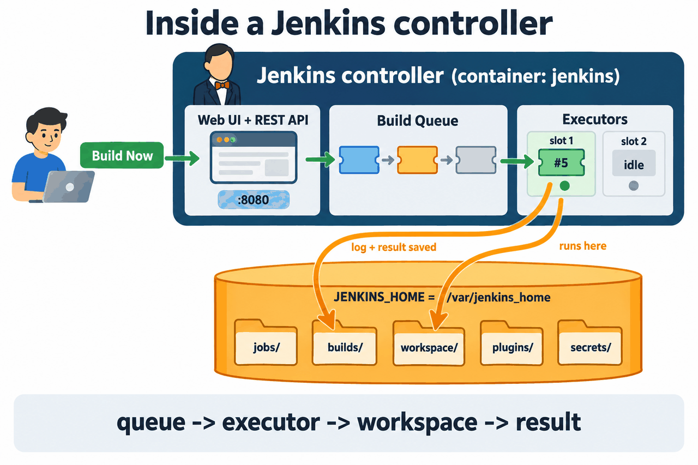

*ภาพที่ 3 เส้นทางของ build หนึ่งครั้งภายใน controller และตำแหน่งที่ข้อมูลถูกเขียนลงใน `JENKINS_HOME`*

### 3. นิยามศัพท์: Job, Build, Workspace, Executor

| คำศัพท์ | นิยาม | เปรียบเทียบ |
|---|---|---|
| **Job** | นิยามของงานหนึ่งชุด (ทำอะไร ลำดับใด) | สูตรอาหาร |
| **Build** | การดำเนินงานตาม job หนึ่งครั้ง มีหมายเลขเพิ่มขึ้นทีละหนึ่ง `#1, #2, …` และมีผลลัพธ์ของตัวเอง | การทำอาหารตามสูตรแต่ละครั้ง |
| **Workspace** | ไดเรกทอรีทำงานของ job บน executor | โต๊ะเตรียมอาหาร |
| **Executor** | ช่องประมวลผลที่รัน build ได้ครั้งละหนึ่ง | เตาหนึ่งหัว |
| **Console Output** | บันทึกทุกบรรทัดที่เกิดขึ้นระหว่าง build — เป็น *หลักฐาน* ของผลลัพธ์ | บันทึกการทำอาหาร |

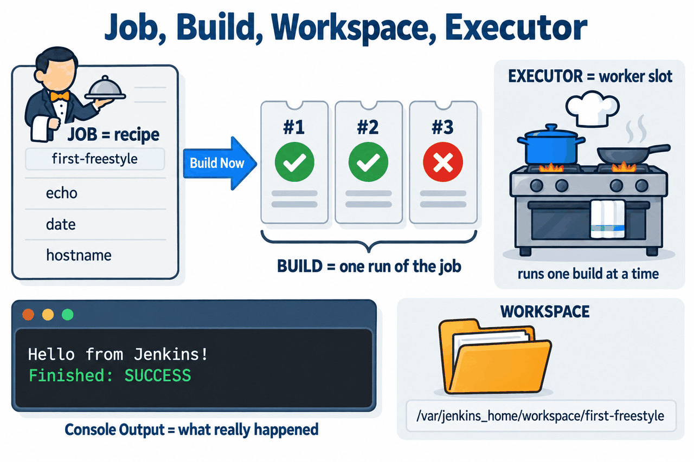

*ภาพที่ 4 job หนึ่งตัวสร้าง build ได้หลายครั้ง แต่ละ build มีผลของตัวเอง (สำเร็จ/ล้มเหลว)*

### 4. ผลของ build ถูกตัดสินจาก exit code

Freestyle job ที่ใช้ขั้น **Execute shell** จะรันคำสั่งด้วย `/bin/sh -xe`

- ตัวเลือก `-x` (xtrace) พิมพ์คำสั่งแต่ละบรรทัดก่อนรันโดยขึ้นต้นด้วย `+` จึงเห็นได้ว่าบรรทัดใดกำลังทำงาน
- ตัวเลือก `-e` (errexit) หยุดสคริปต์ทันทีเมื่อคำสั่งใดคืน **exit code ≠ 0**

Jenkins จึงตัดสินผลว่า `SUCCESS` เมื่อทุกคำสั่งคืน `0` และตัดสินเป็น `FAILURE` เมื่อมีคำสั่งใดคืนค่าอื่น นี่คือกลไกเดียวกับที่ระบบ CI ใช้แยกโค้ดที่ “ผ่าน” กับ “ไม่ผ่าน” ในการทดลองที่ 6 เราจะพิสูจน์กลไกนี้ด้วยตนเอง

### 5. Containerization และการแยก compute ออกจาก state

การรัน Jenkins ในคอนเทนเนอร์ทำให้สร้างสภาพแวดล้อมเดิมซ้ำได้ (reproducible) และเปลี่ยนเวอร์ชันได้โดยไม่ต้องติดตั้ง Java บนเครื่องหลัก แต่คอนเทนเนอร์เป็นสิ่งที่ **ลบทิ้งได้ (ephemeral)** ไฟล์ใน writable layer จะหายไปพร้อมคอนเทนเนอร์ จึงต้องแยก **สถานะถาวร** ออกไปไว้ใน **named volume** ที่มีวงจรชีวิตอิสระจากคอนเทนเนอร์

หลักการนี้เรียกได้ว่า *stateless compute + persistent state* — ถ้าผูก `-v jenkins_home:/var/jenkins_home` ไว้ เราสามารถลบคอนเทนเนอร์ทิ้งแล้วสร้างใหม่ (เช่น เพื่ออัปเกรดเวอร์ชัน) ได้โดยผู้ใช้ job และประวัติ build ยังอยู่ครบ นอกจากนี้ restart policy `--restart unless-stopped` ทำให้ Docker เริ่ม Jenkins ให้เองเมื่อ Docker daemon เริ่มใหม่

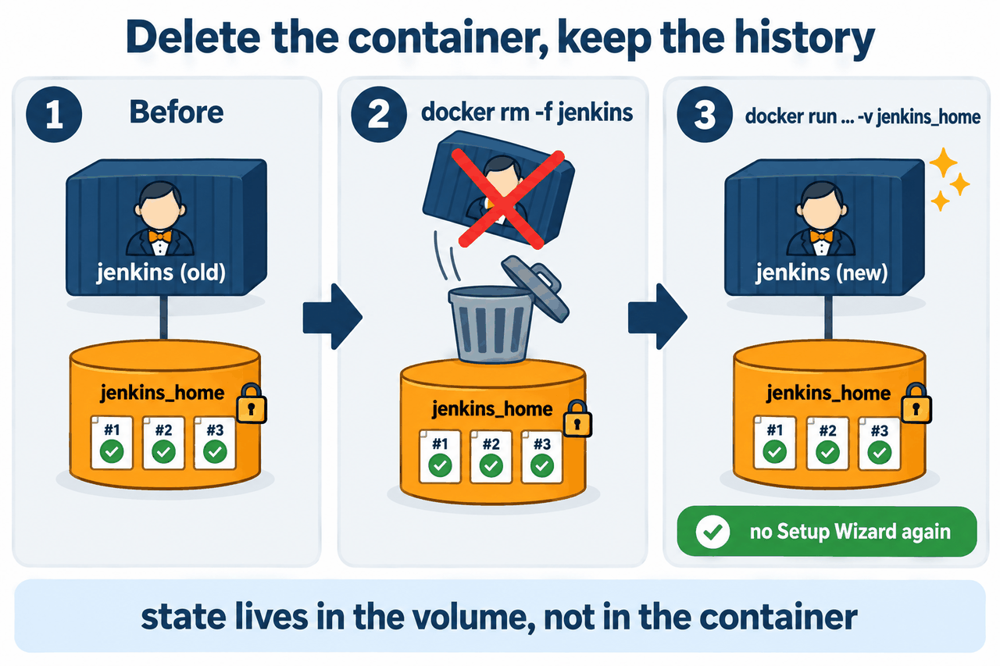

*ภาพที่ 5 สมมติฐานที่จะพิสูจน์ในการทดลองที่ 7: สถานะอยู่ใน volume ไม่ได้อยู่ในคอนเทนเนอร์*

> ⚠️ **ข้อควรระวังด้านความปลอดภัย:** `--privileged` ให้สิทธิ์สูงมาก ใช้ได้เฉพาะสภาพแวดล้อมทดลองที่ลบทิ้งได้ ระบบจริงควรแยก build agent ออกจาก controller ใช้หลัก least privilege และจัดการ config/secret ด้วย JCasC หรือ secret manager

---

## 🎯 Learning Objectives — ผลลัพธ์การเรียนรู้

เมื่อจบแล็บนี้ นักศึกษาจะสามารถ

1. อธิบายบทบาทของ automation server ในสาย CI/CD และองค์ประกอบภายใน Jenkins controller ได้
2. สร้างคอนเทนเนอร์ Jenkins พร้อม network, port และ named volume ตามที่กำหนด และตรวจความพร้อมจาก log ได้
3. ตั้งค่า Jenkins ครั้งแรกผ่าน Setup Wizard ได้
4. สร้างและรัน Freestyle job แล้วแปลความหมายของ Console Output ทีละบรรทัดได้
5. อธิบายได้ว่า exit code กำหนดผล `SUCCESS`/`FAILURE` ของ build อย่างไร
6. พิสูจน์ด้วยการทดลองว่าสถานะของ Jenkins อยู่ใน volume ไม่ได้อยู่ในคอนเทนเนอร์

## 🗺️ ภาพรวมระบบและลำดับการทดลอง

| องค์ประกอบ | ค่าในแล็บนี้ | หน้าที่ |
|---|---|---|
| คอนเทนเนอร์ชั้นนอก | `devtools` | สภาพแวดล้อมของรายวิชา มี Docker daemon ของตัวเอง (Docker-in-Docker) |
| เครือข่าย | `cicd-net` | เครือข่ายที่คอนเทนเนอร์ของแล็บใช้ร่วมกันตั้งแต่ LAB 3 |
| คอนเทนเนอร์ Jenkins | `jenkins` จาก `jenkins/jenkins:lts-jdk21` | ประมวลผล — รับงาน จัดคิว รันคำสั่ง |
| named volume | `jenkins_home` → `/var/jenkins_home` | เก็บสถานะถาวร |
| พอร์ต | `8080` | หน้าเว็บและ REST API |

| การทดลอง | ทำอะไร | หลักฐานที่ต้องได้ |
|---|---|---|
| 1 · Start | สร้าง network และคอนเทนเนอร์ Jenkins | ได้ ID ของ network และคอนเทนเนอร์ |
| 2 · Verify | ตรวจสถานะและ log | `Up` และ `Jenkins is fully up and running` |
| 3 · Unlock | อ่านรหัสปลดล็อกแล้วเปิดหน้าเว็บ | เข้าหน้า Unlock Jenkins ได้ |
| 4 · Setup Wizard | ติดตั้ง plugin และสร้างผู้ดูแล | เห็น `Welcome to Jenkins!` |
| 5 · First job | สร้าง `first-freestyle` แล้ว build | `#1` = `SUCCESS` |
| 6 · Fail & fix | ทำให้ build ล้มเหลวโดยตั้งใจ แล้วแก้ | `#3` = `FAILURE`, `#4` = `SUCCESS` |
| 7 · Persistence | ลบคอนเทนเนอร์ สร้างใหม่ด้วย volume เดิม | ประวัติ `#1–#4` ยังอยู่ และ `#5` = `SUCCESS` |

> ห้ามข้ามขั้น — หากขั้นใดไม่ได้หลักฐานตามตาราง ให้แก้ให้ผ่านก่อนไปขั้นถัดไป

---

## 0. เตรียมเครื่องเรียน

ทำบนเครื่องของเราเอง (ไม่ใช้ cloud) — เปิด container ที่ติดตั้ง Docker มาให้แล้ว

```bash
docker rm -f devtools
docker run -dit --name devtools --privileged --tmpfs /run \
  -p 2222:22 -p 8080:8080 -p 3000:3000 -p 8000:8000 \
  tuchsanai/devtools:2569_1
ssh root@localhost -p 2222        # password : passwd
```

> ⚠️ **`docker rm -f devtools` ทำเฉพาะตอนเริ่ม LAB 1 เท่านั้น** — คำสั่งนี้ลบข้อมูลทั้งหมดในเครื่องเรียน (รวม Jenkins) · ครั้งต่อไปให้ใช้ `docker start devtools`

> ใน VS Code ใช้ **Remote-SSH** ต่อไปที่ `root@localhost:2222` แล้วทำแล็บทั้งหมดข้างใน

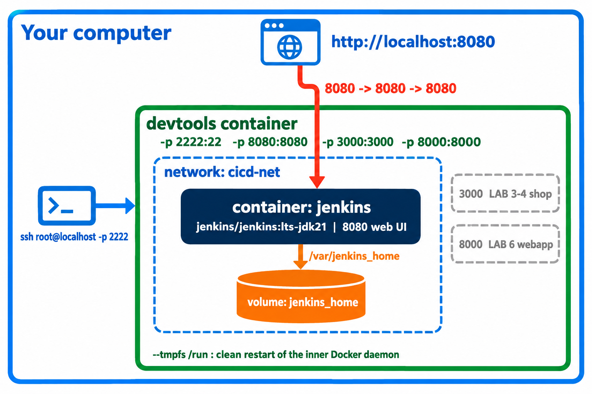

> `localhost:8080` บนเครื่องเรา → `devtools` → container `jenkins` · SSH ใช้ `2222` → `22` · `3000` และ `8000` จองไว้ให้ LAB 3–4 และ LAB 6

ตรวจว่าพร้อมใช้งาน (คำสั่งทั้งหมดต่อจากนี้พิมพ์**ข้างในเครื่องเรียน**) :

```bash
docker --version
docker compose version
```

✅ **Expected output** — ขอแค่มี **เลขเวอร์ชัน** ขึ้นครบสองบรรทัด ไม่ใช่ error (เลขเวอร์ชันของแต่ละคนอาจไม่ตรงกับเอกสารนี้):

```
Docker version 29.8.1, build 4a63305
Docker Compose version v5.5.1
```

> ถ้าขึ้น `Cannot connect to the Docker daemon` หรือ port 8080 ถูกจอง ดู [แก้ปัญหาที่พบบ่อย](#แก้ปัญหาที่พบบ่อย)

---

## 1. Clone โค้ดแล็บ

```bash
mkdir -p ~/labwork && cd ~/labwork
git clone https://github.com/Tuchsanai/DevTools.git
cd DevTools/04_Jenkins/001_Jenikin/001_LAB_Jenkins_On_Docker
ls ~/labwork/DevTools/04_Jenkins/001_Jenikin
```

> 📝 **คำอธิบาย:** ดึงรีโพของวิชาลงมาไว้ใน `~/labwork/DevTools` — **ทำครั้งเดียว ใช้ได้ทุกแล็บของชุด Jenkins** แล้ว `cd` เข้าโฟลเดอร์ LAB 1 · `ls` ยืนยันว่าชุดแล็บอยู่ที่ `~/labwork/DevTools/04_Jenkins/001_Jenikin` — **ทุกแล็บในชุดนี้อ้าง path เต็มนี้ตรง ๆ** (เช่น LAB 3 อยู่ที่ `~/labwork/DevTools/04_Jenkins/001_Jenikin/003_LAB_Docker_Build_Push`) จึงไม่ต้องตั้งตัวแปรใด ๆ ·
> รีโพเต็มใหญ่ **1.3 GB** รอบทดสอบจริงใช้เวลา clone 65–80 วินาที — ถ้าเน็ตช้าใช้ `git clone --depth 1 https://github.com/Tuchsanai/DevTools.git` แทน (ดึงเฉพาะ commit ล่าสุด เหลือราว 221 MB) · ถ้าเคย clone ไว้แล้ว git จะบอกว่าโฟลเดอร์ไม่ว่าง — ให้ `git -C ~/labwork/DevTools pull` เพื่ออัปเดตแทน แล้วไปต่อที่บรรทัด `cd` ได้เลย

✅ **Expected output** — บรรทัดสุดท้ายต้องเห็นโฟลเดอร์ของ 6 แล็บ :

```
Cloning into 'DevTools'...
001_LAB_Jenkins_On_Docker
002_LAB_Declarative_Pipeline
003_LAB_Docker_Build_Push
004_LAB_Pipeline_From_Git
005_LAB_Webhook_Trigger
006_LAB_CICD_Capstone
Jenkins_CICD_Docker_Slides.html
readme.md
```

> ถ้าขึ้น `No such file or directory` แปลว่า clone ไม่สำเร็จ หรือ clone ไว้คนละโฟลเดอร์ — ตรวจด้วย `ls ~/labwork` ว่ามีโฟลเดอร์ `DevTools` หรือไม่

---

## การทดลองที่ 1 — Start: สร้าง network และคอนเทนเนอร์ Jenkins

**ทำอะไร:** สร้าง Docker network ของรายวิชา แล้วยก Jenkins ขึ้นบน network นั้น

ตั้งแต่การทดลองนี้เป็นต้นไป ทุกคำสั่งพิมพ์ใน shell ของ `devtools` — แล็บนี้จะสร้างของ 4 อย่างข้างในเครื่องเรียน :

| สิ่งที่สร้าง | ชื่อ | หน้าที่ |
|---|---|---|
| network | `cicd-net` | ให้ container ของแล็บถัดไปเรียกหากันด้วยชื่อได้ |
| container | `jenkins` | ตัว Jenkins — รับงาน จัดคิว รันคำสั่ง |
| volume | `jenkins_home` | เก็บสถานะทั้งหมดของ Jenkins (ผู้ใช้ job ประวัติ build) |
| port | `8080` | หน้าเว็บและ REST API |

**ทำไม:** แต่ละตัวเลือกของ `docker run` สอดคล้องกับทฤษฎีข้อ 5 โดยตรง

| ตัวเลือก | ความหมาย |
|---|---|
| `--network cicd-net` | ให้คอนเทนเนอร์ของแล็บถัดไปเรียกหากันด้วยชื่อได้ |
| `--restart unless-stopped` | Docker เริ่ม Jenkins ให้เองเมื่อ daemon เริ่มใหม่ |
| `-p 8080:8080` | เปิดหน้าเว็บและ API |
| `-v jenkins_home:/var/jenkins_home` | **แยกสถานะออกไปไว้ใน named volume** |

```bash
docker network create cicd-net
docker run -d --name jenkins --network cicd-net --restart unless-stopped \
  -p 8080:8080 -v jenkins_home:/var/jenkins_home jenkins/jenkins:lts-jdk21
```

✅ **ผลการทดลองจริง** (บรรทัดแรกคือ ID ของ network บรรทัดสุดท้ายคือ ID ของคอนเทนเนอร์):

```text
de9c114500d30602950879d70270185de8e729cfeb7a38a1c600d22319f45473
Unable to find image 'jenkins/jenkins:lts-jdk21' locally
lts-jdk21: Pulling from jenkins/jenkins
...
Status: Downloaded newer image for jenkins/jenkins:lts-jdk21
76ef30adedca8975fabb539c5756e81aeaedde93180964eda2d6c2b4d3a735d6
```

> 📝 ในการทดลองจริง การดาวน์โหลด image ครั้งแรกใช้เวลาประมาณ 15 วินาที (ขึ้นกับความเร็วเครือข่าย) **จำ 12 ตัวแรกของ ID คอนเทนเนอร์ไว้** (`76ef30adedca`) — จะได้เจออีกครั้งใน Console Output
>
> ID ของแต่ละเครื่องไม่ซ้ำกัน — รอบทดสอบ setup ใหม่ได้ network ID `ce6ddbb3874b...` และ container ID `2974be225c58` และ Jenkins พร้อมใน 19 วินาที · เอกสารนี้ใช้ `76ef30adedca` ตามภาพหน้าจอ ให้เทียบกับ ID ของเครื่องตัวเอง

---

## การทดลองที่ 2 — Verify: ตรวจว่า Jenkins พร้อมให้บริการ

**ทำอะไร:** ตรวจสถานะคอนเทนเนอร์และอ่าน log

**ทำไม:** สถานะ `Up` บอกเพียงว่า *process* ในคอนเทนเนอร์ทำงานอยู่ แต่ Jenkins ต้องโหลด plugin และ job ให้เสร็จก่อนจึงพร้อมรับคำขอ การยืนยันจาก log จึงเป็นหลักฐานที่แม่นยำกว่า

```bash
docker ps
docker logs jenkins 2>&1 | grep -E "initial setup|fully up"
```

✅ **ผลการทดลองจริง** (ตัดคอลัมน์ COMMAND และ CREATED ออกเพื่อให้อ่านง่าย):

```text
CONTAINER ID   IMAGE                       STATUS         PORTS                                                    NAMES
76ef30adedca   jenkins/jenkins:lts-jdk21   Up 3 minutes   0.0.0.0:8080->8080/tcp, [::]:8080->8080/tcp, 50000/tcp   jenkins
[LF]> Jenkins initial setup is required. An admin user has been created and a password generated.
2026-09-25 05:47:11.005+0000 [id=69]	INFO	hudson.lifecycle.Lifecycle#onReady: Jenkins is fully up and running
```

> 📝 พอร์ต `50000/tcp` คือพอร์ตสำหรับ agent เชื่อมต่อเข้ามา (ยังไม่ใช้ในแล็บนี้) · จากการทดลองจริง Jenkins พร้อมภายในประมาณ **20 วินาที** หลังสร้างคอนเทนเนอร์

---

## การทดลองที่ 3 — Unlock: อ่านรหัสปลดล็อกแล้วเปิดหน้าเว็บ

**ทำอะไร:** อ่าน initial admin password ภายในคอนเทนเนอร์ แล้วนำไปปลดล็อก Jenkins

**ทำไม:** Jenkins ที่ติดตั้งใหม่จะสุ่มรหัสผ่านแล้วเขียนไว้ใน `/var/jenkins_home/secrets/initialAdminPassword` **ภายในคอนเทนเนอร์** ผู้ที่อ่านไฟล์นี้ได้ย่อมเป็นผู้ที่เข้าถึงเครื่องได้จริง จึงใช้เป็นหลักฐานยืนยันตัวผู้ติดตั้ง

```bash
docker exec jenkins cat /var/jenkins_home/secrets/initialAdminPassword
```

✅ **ผลการทดลองจริง:** สตริงเลขฐานสิบหก 32 ตัวหนึ่งบรรทัด (ของแต่ละเครื่องจะต่างกัน) เช่น

```text
6b925c83bf0b4b26••••••••••••••••
```

เปิดเบราว์เซอร์บนเครื่องหลักไปที่ **http://localhost:8080** วางรหัสในช่อง **Administrator password** แล้วกด **Continue**

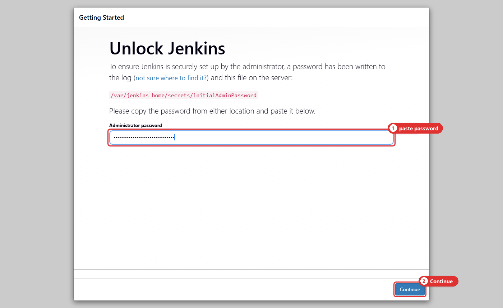

*ภาพที่ 6 ① วางรหัสผ่านที่อ่านได้ ② กด Continue*

> 📝 รหัสนี้ใช้ครั้งเดียวสำหรับปลดล็อก หลังสร้างผู้ดูแลแล้วให้ใช้ `admin` / `admin2569` เสมอ

---

## การทดลองที่ 4 — Setup Wizard: ติดตั้ง plugin และสร้างผู้ดูแล

**ทำอะไร:** ติดตั้งชุด plugin พื้นฐานและสร้างบัญชีผู้ดูแล

**ทำไม:** Jenkins core มีความสามารถจำกัด ความสามารถส่วนใหญ่ เช่น Pipeline, Git และ Pipeline Graph View มาจาก plugin ชุด *suggested plugins* จึงจำเป็นต่อ LAB 2 เป็นต้นไป

**4.1) เลือก Install suggested plugins**

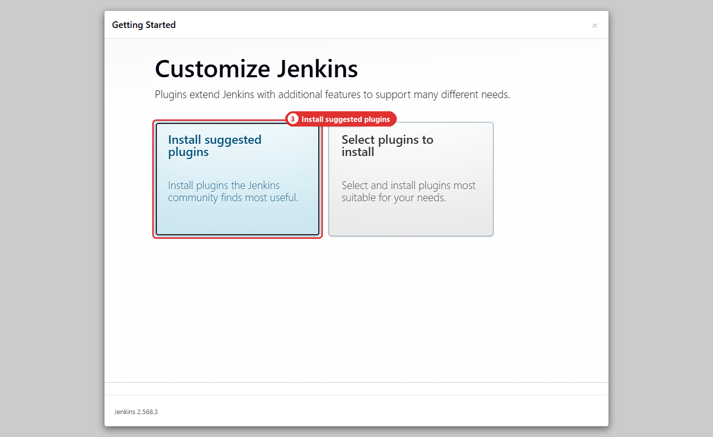

*ภาพที่ 7 เลือก Install suggested plugins*

**4.2) รอการติดตั้ง** (การทดลองจริงใช้เวลาประมาณ 2–4 นาที) สังเกตว่ามี **Pipeline**, **Git** และ **Pipeline Graph View** อยู่ในรายการ

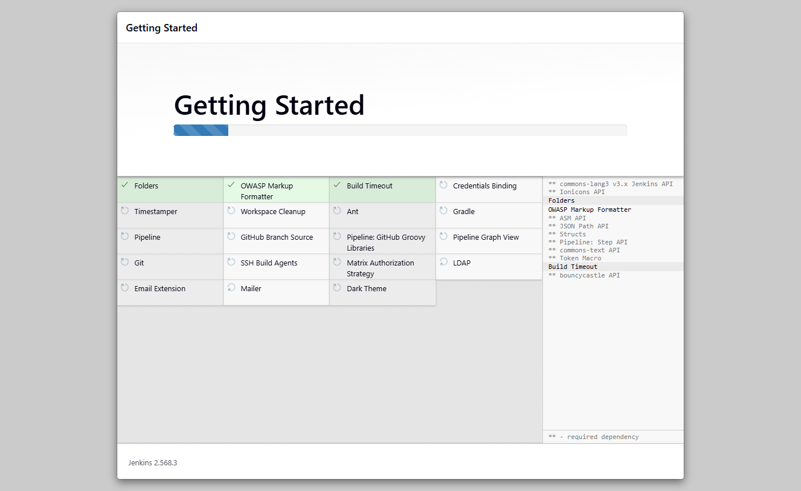

*ภาพที่ 8 เครื่องหมาย ✓ คือ plugin ที่ติดตั้งแล้ว แผงด้านขวาแสดง dependency (`**`) ที่ถูกติดตั้งตามมา*

**4.3) สร้างผู้ดูแลระบบ** กรอกตามภาพ แล้วกด **Save and Continue**

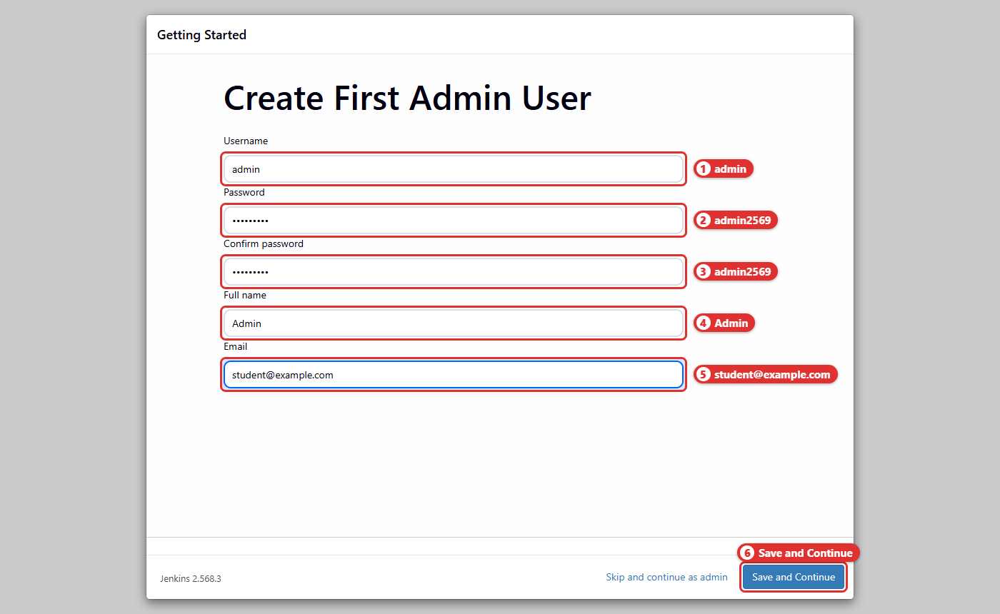

*ภาพที่ 9 Username `admin` · Password `admin2569` (2 ช่อง) · Full name `Admin` · Email `student@example.com`*

**4.4) คง Jenkins URL เป็น `http://localhost:8080/`** แล้วกด **Save and Finish**

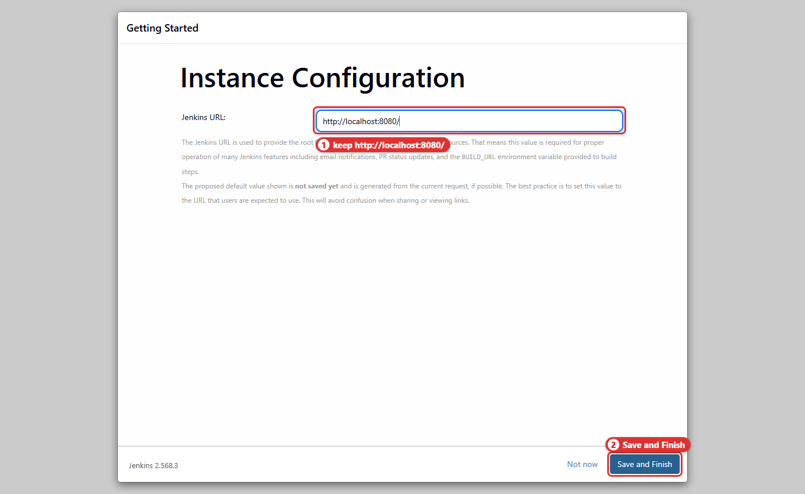

*ภาพที่ 10 Jenkins URL ถูกใช้สร้างลิงก์ในอีเมลและตัวแปร `BUILD_URL` ของทุก build*

**4.5) กด Start using Jenkins**

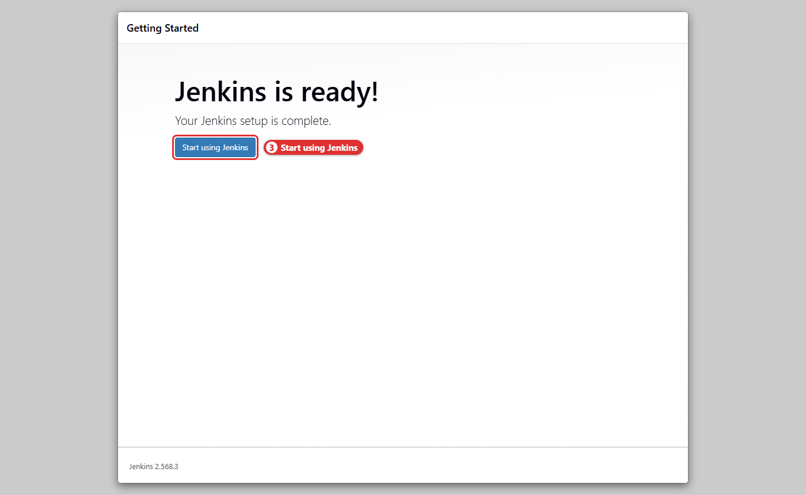

*ภาพที่ 11 Setup Wizard เสร็จสมบูรณ์*

✅ **สิ่งที่ต้องเห็น:** Dashboard ที่มีข้อความ `Welcome to Jenkins!` และกล่อง *Build Executor Status* แสดง `0/2` (ใช้ไป 0 จาก 2 executor)

> 📝 ถ้า plugin บางตัวขึ้น **Retry** ให้กด Retry และห้ามปิดคอนเทนเนอร์ระหว่างติดตั้ง

---

## การทดลองที่ 5 — First job: สร้าง Freestyle job แล้วอ่าน Console Output

**ทำอะไร:** สร้าง job `first-freestyle` ที่รันคำสั่ง shell 6 บรรทัด แล้วตีความผลทีละบรรทัด

**ทำไม:** เป็นการทดสอบแบบครบวงจร (end-to-end) ว่า Jenkins รับงาน จัดคิว รันคำสั่ง และบันทึกผลได้จริง คำสั่งถูกเลือกให้ *เผยข้อมูลของสภาพแวดล้อมที่ build ทำงานอยู่* — ใคร ที่ไหน ครั้งที่เท่าไร

**5.1) จาก Dashboard เลือก New Item**


*ภาพที่ 12 เมนู New Item และสถานะ executor `0/2`*

**5.2) กรอกชื่อ `first-freestyle` เลือก Freestyle project แล้วกด OK**

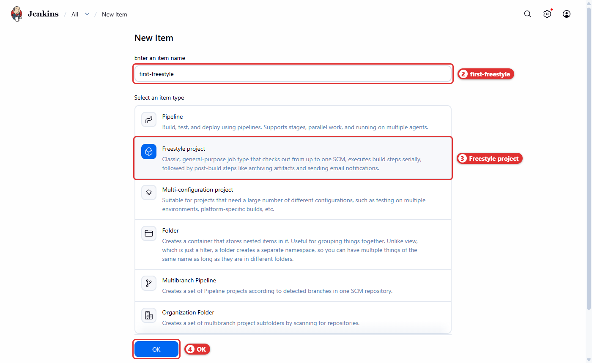

*ภาพที่ 13 ตั้งชื่อ job และเลือกชนิด Freestyle project*

**5.3) เลื่อนลงไปที่ Build Steps → Add build step → Execute shell**

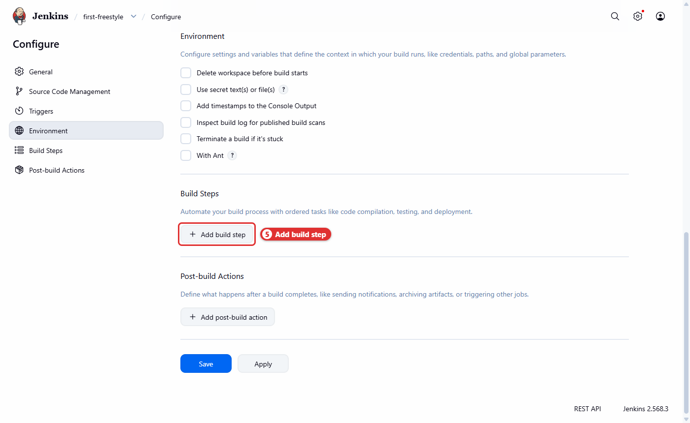

*ภาพที่ 14 ปุ่ม Add build step*

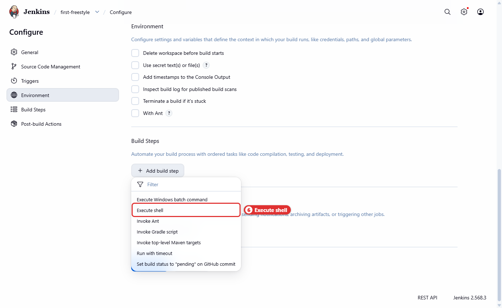

*ภาพที่ 15 เลือก Execute shell*

**5.4) พิมพ์คำสั่งต่อไปนี้ในช่อง Command แล้วกด Save**

```bash
echo "Hello from Jenkins!"
echo "Job: $JOB_NAME | Build: #$BUILD_NUMBER"
date
hostname
whoami
pwd
```

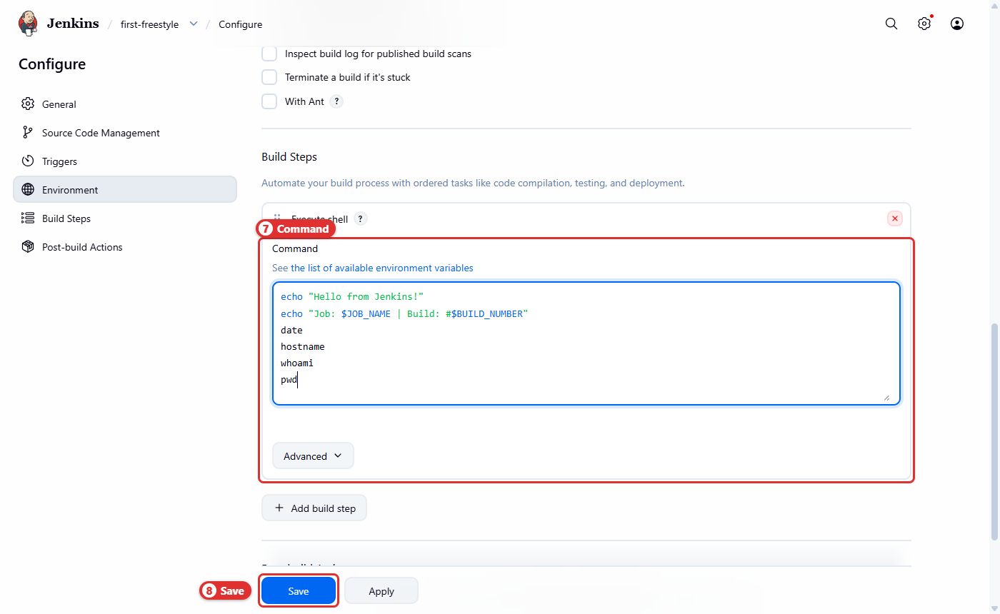

*ภาพที่ 16 `$JOB_NAME` และ `$BUILD_NUMBER` เป็นตัวแปรที่ Jenkins กำหนดให้ทุก build โดยอัตโนมัติ*

**5.5) ในหน้า job กด Build Now**

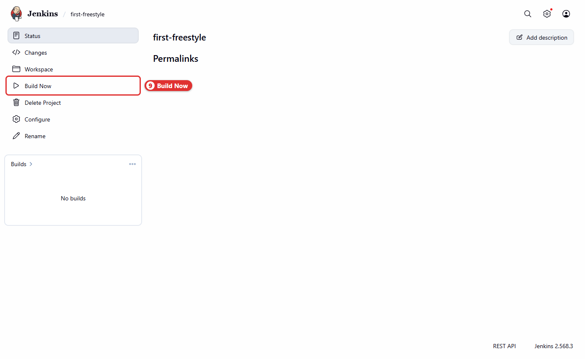

*ภาพที่ 17 job ถูกสร้างแล้วแต่ยังไม่มี build (No builds)*

**5.6) รอจน `#1` ขึ้นเครื่องหมายสีเขียว**

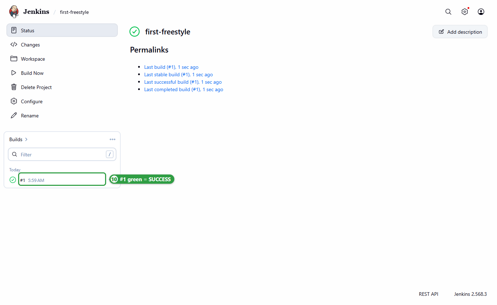

*ภาพที่ 18 build `#1` สำเร็จ และ Permalinks ชี้ไปที่ Last successful build (#1)*

**5.7) คลิก `#1` → Console Output**

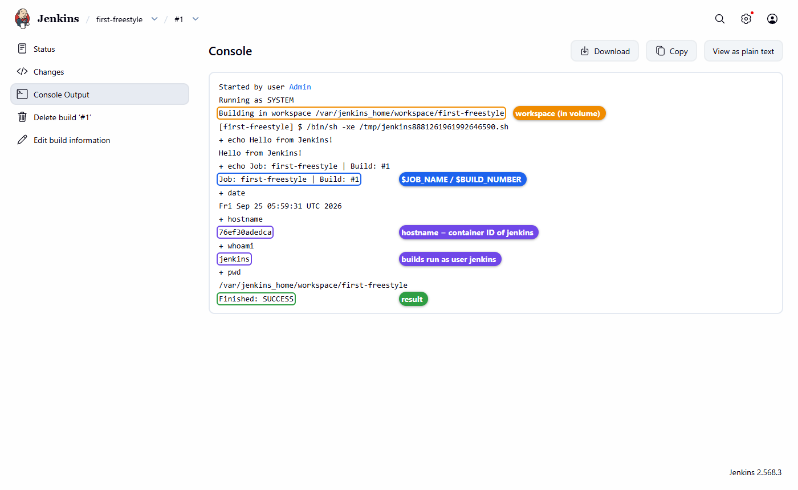

*ภาพที่ 19 Console Output จริงของ build `#1` พร้อมคำอธิบาย*

✅ **ผลการทดลองจริง:**

```text
Started by user Admin
Running as SYSTEM
Building in workspace /var/jenkins_home/workspace/first-freestyle
[first-freestyle] $ /bin/sh -xe /tmp/jenkins8881261961992646590.sh
+ echo Hello from Jenkins!
Hello from Jenkins!
+ echo Job: first-freestyle | Build: #1
Job: first-freestyle | Build: #1
+ date
Fri Sep 25 05:59:31 UTC 2026
+ hostname
76ef30adedca
+ whoami
jenkins
+ pwd
/var/jenkins_home/workspace/first-freestyle
Finished: SUCCESS
```

🔍 **ตีความผลการทดลอง**

| บรรทัดที่เห็น | ความหมาย |
|---|---|
| `Started by user Admin` | สาเหตุ (cause) ของ build — ในแล็บนี้คือคนกด ต่อไปใน LAB 4–5 จะเป็น SCM/webhook |
| `Building in workspace /var/jenkins_home/workspace/...` | workspace อยู่ใต้ `/var/jenkins_home` จึง **อยู่ใน volume** |
| `/bin/sh -xe` และบรรทัดที่ขึ้นต้นด้วย `+` | ผลของตัวเลือก `-x` (ทฤษฎีข้อ 4) |
| `76ef30adedca` | ผลของ `hostname` **ตรงกับ ID คอนเทนเนอร์** จากการทดลองที่ 1 → build รันอยู่ *ภายใน* คอนเทนเนอร์ `jenkins` |
| `jenkins` | ผู้ใช้ของระบบปฏิบัติการที่รัน build (ส่วน `Running as SYSTEM` คือสิทธิ์ภายใน Jenkins ซึ่งเป็นคนละระดับกัน) |
| `UTC` | คอนเทนเนอร์ใช้เขตเวลา UTC ขณะที่หน้าเว็บแสดงเวลาตามเครื่องของผู้ใช้ |
| `Finished: SUCCESS` | ทุกคำสั่งคืน exit code 0 |

---

## การทดลองที่ 6 — Fail & fix: ทำให้ build ล้มเหลวโดยตั้งใจ แล้วแก้ไข

**ทำอะไร:** build ซ้ำหนึ่งครั้ง จากนั้นเพิ่มคำสั่งที่ต้องล้มเหลว อ่านสาเหตุจาก Console Output แล้วแก้ให้กลับมาสำเร็จ

**ทำไม:** ในการทำงานจริง build ที่ล้มเหลวคือ *สัญญาณ* ที่ CI ส่งกลับมา ทักษะสำคัญจึงไม่ใช่การทำให้เขียวอย่างเดียว แต่คือ **การอ่านหลักฐานเพื่อหาสาเหตุ** การทดลองนี้ยังพิสูจน์ทฤษฎีข้อ 4 ว่า exit code เป็นตัวตัดสินผล

**6.1) กด Build Now อีกครั้ง** → ได้ `#2` (สำเร็จ) สังเกตว่า Console Output แสดง `Build: #2` — job เดิม แต่เป็น build ครั้งใหม่

**6.2) Configure → เพิ่มบรรทัดสุดท้ายในช่อง Command** แล้วกด Save

```bash
ls /this-folder-does-not-exist
```

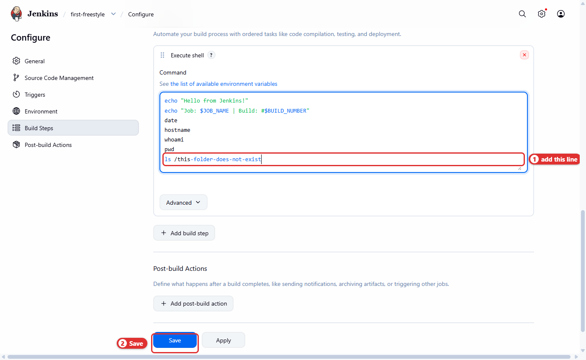

*ภาพที่ 20 เพิ่มคำสั่งที่อ้างถึงโฟลเดอร์ซึ่งไม่มีอยู่จริง*

**6.3) กด Build Now** → ได้ `#3` เป็น **สีแดง**

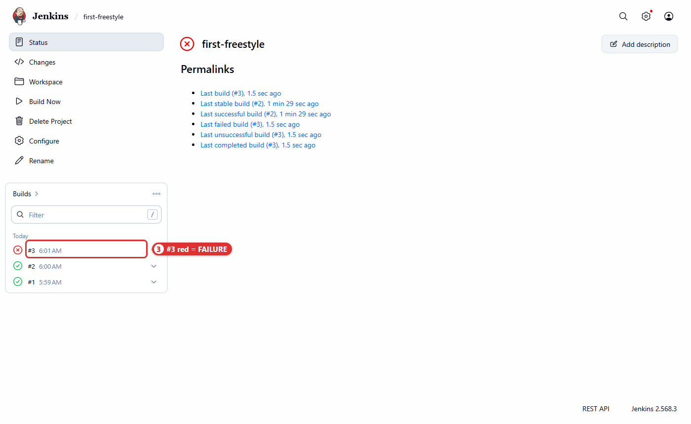

*ภาพที่ 21 build `#3` ล้มเหลว ส่วน Permalinks แยก Last stable build (#2) กับ Last failed build (#3) ให้อัตโนมัติ*

**6.4) เปิด Console Output ของ `#3`**

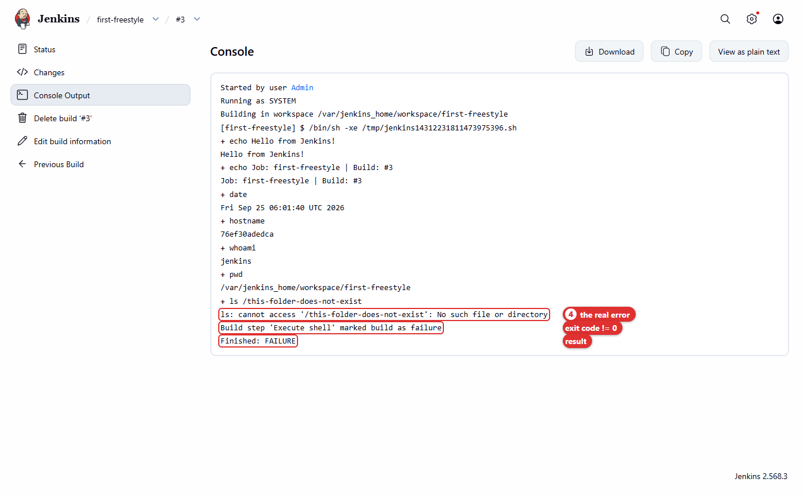

*ภาพที่ 22 บรรทัดสาเหตุจริงอยู่ก่อน `Finished: FAILURE` เสมอ*

✅ **ผลการทดลองจริง** (ตัดเฉพาะท้าย log):

```text
+ pwd
/var/jenkins_home/workspace/first-freestyle
+ ls /this-folder-does-not-exist
ls: cannot access '/this-folder-does-not-exist': No such file or directory
Build step 'Execute shell' marked build as failure
Finished: FAILURE
```

🔍 **ตีความ:** `ls` คืน exit code `2` → ตัวเลือก `-e` หยุดสคริปต์ → Jenkins ระบุว่าขั้น *Execute shell* ทำให้ build ล้มเหลว วิธีอ่าน log ที่ล้มเหลวคือ **เริ่มจากบรรทัด `Finished:` แล้วไล่ขึ้นไปหาบรรทัด error แรก**

**6.5) แก้ไข:** Configure → ลบบรรทัด `ls /this-folder-does-not-exist` → Save → Build Now → ได้ `#4` สีเขียว

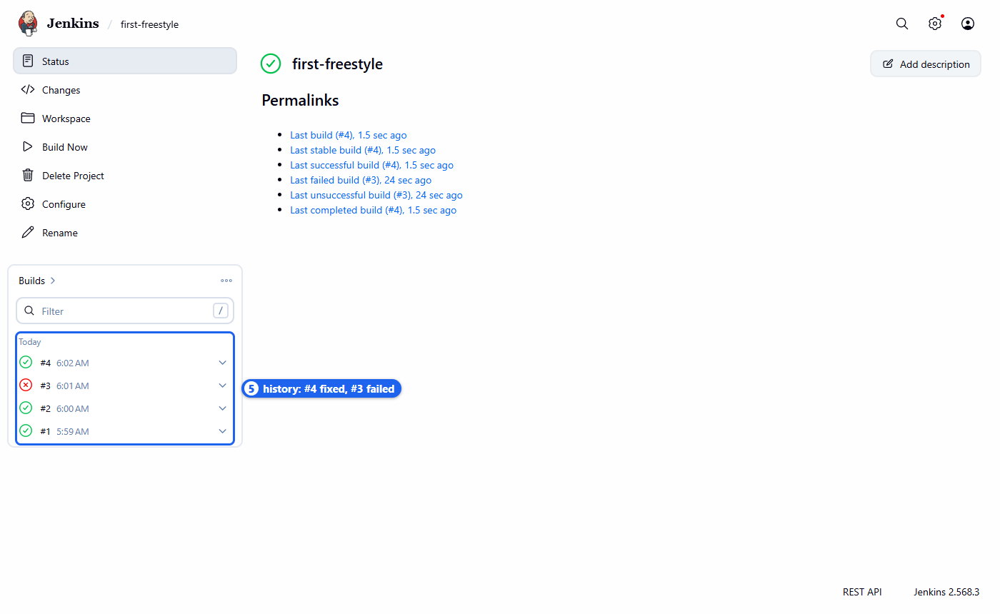

*ภาพที่ 23 ประวัติ build: `#1` ✓ `#2` ✓ `#3` ✗ `#4` ✓ — ทุกครั้งมีหลักฐานของตัวเองให้ตรวจย้อนหลังได้*

---

## การทดลองที่ 7 — Persistence: ลบคอนเทนเนอร์ทิ้ง แต่ประวัติไม่หาย

**ทำอะไร:** ดูว่า build ถูกเก็บไว้ที่ใด ลบคอนเทนเนอร์ `jenkins` ทิ้ง สร้างใหม่ด้วย volume เดิม แล้วตรวจผล

**ทำไม:** เป็นการทดสอบสมมติฐานของทฤษฎีข้อ 5 ด้วยวิธีที่เข้มกว่าการ `restart` เพราะคอนเทนเนอร์เดิม **ถูกทำลายจริง** หากประวัติยังอยู่ แสดงว่าสถานะอยู่ใน volume ไม่ได้อยู่ในคอนเทนเนอร์

**7.1) ดูหลักฐานใน volume ก่อนลบ**

```bash
docker exec jenkins ls /var/jenkins_home/jobs/first-freestyle/builds
docker exec jenkins du -sh /var/jenkins_home
```

✅ **ผลการทดลองจริง:**

```text
1
2
3
4
permalinks
301M	/var/jenkins_home
```

แต่ละ build คือไดเรกทอรีหนึ่งโฟลเดอร์ ส่วน 301 MB ส่วนใหญ่คือ plugin ที่ติดตั้งในการทดลองที่ 4

**7.2) ลบคอนเทนเนอร์ แล้วตรวจว่าเหลืออะไร**

```bash
docker rm -f jenkins
docker ps -a --filter name=jenkins
docker volume ls
```

✅ **ผลการทดลองจริง:**

```text
jenkins
CONTAINER ID   IMAGE     COMMAND   CREATED   STATUS    PORTS     NAMES
DRIVER    VOLUME NAME
local     jenkins_home
```

คอนเทนเนอร์หายไปแล้ว แต่ volume `jenkins_home` ยังอยู่

**7.3) สร้างคอนเทนเนอร์ใหม่ด้วยคำสั่งเดิม (volume เดิม)**

```bash
docker run -d --name jenkins --network cicd-net --restart unless-stopped \
  -p 8080:8080 -v jenkins_home:/var/jenkins_home jenkins/jenkins:lts-jdk21
docker ps --format "table {{.ID}}\t{{.Image}}\t{{.Status}}\t{{.Names}}"
docker logs jenkins 2>&1 | grep -c "initial setup is required"
```

✅ **ผลการทดลองจริง:**

```text
4881b7bdf55133e22dc45c3720e9fc09eeaf952935be9072a4ef1b088d2564ff
CONTAINER ID   IMAGE                       STATUS         NAMES
4881b7bdf551   jenkins/jenkins:lts-jdk21   Up 4 seconds   jenkins
0
```

ID คอนเทนเนอร์เปลี่ยนเป็น `4881b7bdf551` และ log **ไม่มี** ข้อความ `initial setup is required` (นับได้ `0`)

**7.4) ตรวจจากเบราว์เซอร์** — เปิด http://localhost:8080 จะพบหน้า **Sign in** ไม่ใช่หน้า Unlock เข้าสู่ระบบด้วย `admin` / `admin2569`

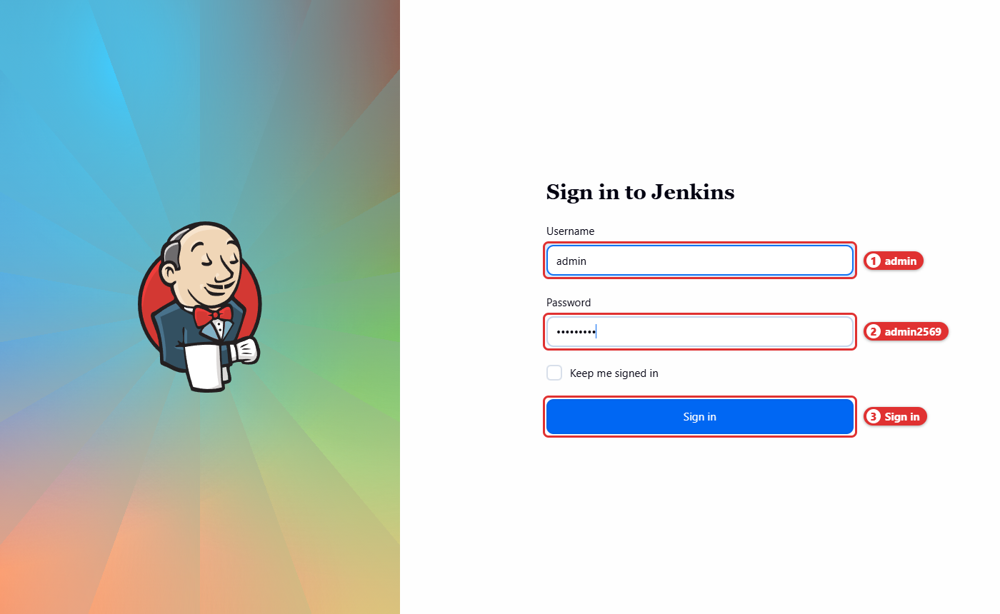

*ภาพที่ 24 ไม่ต้องทำ Setup Wizard ซ้ำ เพราะผู้ใช้ `admin` ถูกเก็บไว้ใน volume*

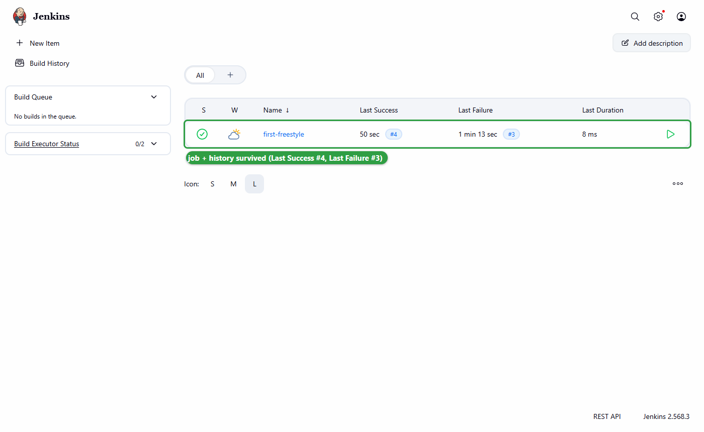

*ภาพที่ 25 job และประวัติยังอยู่ครบ: Last Success `#4`, Last Failure `#3`*

**7.5) กด Build Now อีกหนึ่งครั้ง แล้วเปิด Console Output ของ `#5`**

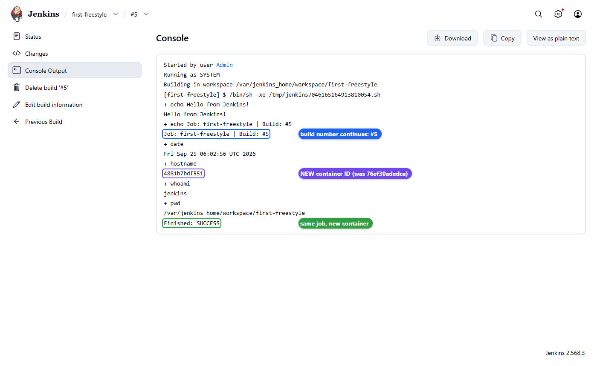

*ภาพที่ 26 หมายเลข build ต่อจากเดิมเป็น `#5` แต่ hostname เป็น ID ของคอนเทนเนอร์ตัวใหม่*

✅ **ผลการทดลองจริง:**

```text
Job: first-freestyle | Build: #5
+ hostname
4881b7bdf551
Finished: SUCCESS
```

🔍 **ข้อสรุปของการทดลอง:** `hostname` เปลี่ยนจาก `76ef30adedca` เป็น `4881b7bdf551` (คอนเทนเนอร์คนละตัว) แต่หมายเลข build ต่อเนื่องจาก `#4` เป็น `#5` แสดงว่า **ตัวนับ build ประวัติ และผู้ใช้ ล้วนอยู่ใน volume** ซึ่งยืนยันหลัก *container = compute, volume = state*

---

## ✅ ตรวจผลปิดแล็บ

ตรวจผ่าน REST API ของ Jenkins ซึ่งเป็นช่องทางเดียวกับที่เครื่องมืออัตโนมัติใช้

```bash
docker ps --filter name=jenkins --format "{{.Names}} {{.Status}}"
docker volume ls --filter name=jenkins_home
curl -s -u admin:admin2569 "http://localhost:8080/job/first-freestyle/lastBuild/api/json?tree=number,result"; echo
curl -gs -u admin:admin2569 "http://localhost:8080/job/first-freestyle/api/json?tree=builds[number,result]"; echo
```

✅ **ผลการทดลองจริง:**

```text
jenkins Up 12 minutes
DRIVER    VOLUME NAME
local     jenkins_home
{"_class":"hudson.model.FreeStyleBuild","number":5,"result":"SUCCESS"}
{"_class":"hudson.model.FreeStyleProject","builds":[{"_class":"hudson.model.FreeStyleBuild","number":5,"result":"SUCCESS"},{"_class":"hudson.model.FreeStyleBuild","number":4,"result":"SUCCESS"},{"_class":"hudson.model.FreeStyleBuild","number":3,"result":"FAILURE"},{"_class":"hudson.model.FreeStyleBuild","number":2,"result":"SUCCESS"},{"_class":"hudson.model.FreeStyleBuild","number":1,"result":"SUCCESS"}]}
```

อ่านผลบรรทัดสุดท้ายได้ว่า `#5 SUCCESS, #4 SUCCESS, #3 FAILURE, #2 SUCCESS, #1 SUCCESS` ตรงกับที่ทำในการทดลองที่ 5–7

> 📝 `curl -g` ปิดการตีความวงเล็บ `[...]` ของ curl จึงส่งพารามิเตอร์ `tree=builds[...]` ไปยัง Jenkins ได้ถูกต้อง (ถ้าไม่ใส่จะได้ `curl: (3) bad range in URL`)

**Checklist ปิดแล็บ**

- [ ] คอนเทนเนอร์ `jenkins` อยู่ในสถานะ `Up` และมี volume `jenkins_home`
- [ ] เข้า http://localhost:8080 ด้วย `admin` / `admin2569` ได้
- [ ] job `first-freestyle` มี build ล่าสุดเป็น `SUCCESS`
- [ ] อธิบายได้ว่าทำไม `#3` ล้มเหลว และทำไม `#5` มี hostname ต่างจาก `#1`

## 📊 สรุปผลการทดลองจริง

ทดสอบเมื่อ 25 ก.ย. 2569 ในคอนเทนเนอร์ทดลองแยกจาก image `tuchsanai/devtools:2569_1` กับ Jenkins **2.568.3** (`jenkins/jenkins:lts-jdk21`)

| รายการ | ผลที่วัดได้ |
|---|---|
| ดาวน์โหลด image `jenkins/jenkins:lts-jdk21` ครั้งแรก | ~15 วินาที |
| สร้างคอนเทนเนอร์จนถึง `Jenkins is fully up and running` | ~20 วินาที |
| ติดตั้ง suggested plugins | ~3–4 นาที (ได้ไฟล์ plugin `.jpi` 92 ไฟล์ รวม dependency) |
| build `#1`–`#5` | `SUCCESS`, `SUCCESS`, `FAILURE`, `SUCCESS`, `SUCCESS` |
| ขนาด `/var/jenkins_home` หลังจบแล็บ | 301 MB |
| ลบ + สร้างคอนเทนเนอร์ใหม่ | ประวัติครบ ไม่ต้องทำ Setup Wizard ซ้ำ |
| `docker restart devtools` (มี `--tmpfs /run`) | Docker ข้างในกลับมาใน 3 วินาที · `jenkins` ตอบ `/login` = `200` ใน 9 วินาที |
| `docker stop` + `docker start devtools` | Docker ข้างในกลับมาใน 1 วินาที · `/login` = `200` ใน 7 วินาที |
| `docker restart devtools` (ไม่มี `--tmpfs /run`) | Docker ข้างในไม่ขึ้น — `Cannot connect to the Docker daemon at unix:///var/run/docker.sock` |

## 🤔 คำถามทบทวน

1. หากตอนสร้างคอนเทนเนอร์ลืมใส่ `-v jenkins_home:/var/jenkins_home` ผลของการทดลองที่ 7 จะต่างไปอย่างไร เพราะเหตุใด
2. ถ้าเปลี่ยนบรรทัดที่ล้มเหลวเป็น `ls /this-folder-does-not-exist || true` ผลของ build จะเป็นอะไร จงอธิบายด้วยแนวคิดเรื่อง exit code
3. Jenkins นี้มี executor 2 ช่อง หากกด Build Now ของ 3 job พร้อมกัน จะเกิดอะไรขึ้นกับ job ที่สาม
4. ทำไมระบบจริงจึงไม่ควรให้ build ทำงานบน controller โดยตรง (พิจารณาจากผล `whoami` และตำแหน่ง workspace)

---

## กู้สถานะเมื่อปิดเครื่องหรือเริ่มระบบใหม่

พิมพ์บน**เครื่องของเรา** (นอก devtools) :

```bash
docker start devtools
docker exec devtools docker ps
```

✅ **สิ่งที่ต้องเห็น:** แถวของ `jenkins` อยู่ในสถานะ `Up` โดยไม่ต้องทำ Setup Wizard ซ้ำ — รอบทดสอบจริง `docker stop` + `docker start devtools` ได้ Docker ข้างในกลับมาใน 1 วินาที และหน้า login ของ Jenkins ตอบ `200` ใน 7 วินาที (ถ้า `docker ps` ยังว่าง รออีกไม่กี่วินาทีแล้วสั่งใหม่) · ระวัง : `Up` ยังไม่ใช่ "พร้อม" — บางรอบ Jenkins ใช้เวลาโหลดนานถึง ~4 นาที ระหว่างนั้นหน้าเว็บขึ้น **Starting Jenkins** ให้รอจน `curl -s -o /dev/null -w "%{http_code}\n" http://localhost:8080/login` (ใน devtools) ได้ `200`

เหตุผล: `--restart unless-stopped` สั่งให้ Jenkins กลับมาเอง, `--tmpfs /run` ป้องกัน PID เก่าของ Docker daemon ค้าง และ image กับ volume `jenkins_home` ยังอยู่ข้างใน `devtools` ครบ ตราบใดที่**ไม่ลบ** `devtools` · ห้าม `docker rm devtools` หลังเริ่มแล็บแล้ว — ถ้าลบ Jenkins ข้างในจะหายไปด้วย ต้องเริ่ม LAB 1 ใหม่ตั้งแต่ส่วนที่ 0

## แก้ปัญหาที่พบบ่อย

| อาการ | สาเหตุ | วิธีแก้ |
|---|---|---|
| `Bind for 0.0.0.0:8080 failed: port is already allocated` | port 8080 ของเครื่องเราถูกโปรแกรมอื่นจองอยู่ | บนเครื่องเรา `docker ps` แล้วดูคอลัมน์ PORTS หยุดเฉพาะ container ที่ตนเป็นเจ้าของ (หรือปิดโปรแกรมที่ใช้ 8080) แล้วรันคำสั่งของส่วนที่ 0 ใหม่ |
| `Conflict. The container name "/devtools" is already in use` | ข้าม `docker rm -f devtools` ในส่วนที่ 0 | ถ้าเพิ่งเริ่ม LAB 1 ให้ `docker rm -f devtools` แล้วรันใหม่ · ถ้าทำแล็บไปแล้ว **อย่าลบ** ใช้ `docker start devtools` แทน |
| `network with name cicd-net already exists` | สร้าง network ไว้แล้วจากรอบก่อน | ข้ามบรรทัดนั้นแล้วทำต่อได้เลย |
| เปิด `localhost:8080` แล้ว connection refused | Jenkins ยังเริ่มระบบไม่เสร็จ | รอจน `docker logs jenkins` แสดง `Jenkins is fully up and running` |
| Wizard ช้าหรือ plugin ขึ้น Retry | เครือข่ายช้าหรือ update center ขัดข้อง | รอ 2–3 นาทีแล้วกด **Retry** ห้ามลบ volume `jenkins_home` |
| Console Output ไม่มีผลของคำสั่ง มีแค่ `Finished: SUCCESS` | ช่อง Command ว่าง หรือยังไม่ได้กด Save | เปิด Configure ตรวจช่อง Command กด **Save** แล้ว build ใหม่ |
| `curl: (3) bad range in URL` | curl ตีความ `[...]` ใน URL | ใส่ตัวเลือก `-g` เช่น `curl -gs ...` |
| หลังสร้างคอนเทนเนอร์ใหม่แล้วเจอหน้า Unlock อีก | ไม่ได้ผูก `-v jenkins_home:/var/jenkins_home` | ลบคอนเทนเนอร์ `jenkins` แล้วสร้างใหม่ตามการทดลองที่ 1 ให้ครบทุกตัวเลือก |
| ลืมรหัส initial หลังตั้งผู้ดูแลแล้ว | รหัสชุดนั้นใช้ครั้งเดียว | เข้าสู่ระบบด้วย `admin` / `admin2569` |
| API ตอบ 401 | รหัสผู้ดูแลไม่ตรง | ใช้ `-u admin:admin2569` |
| หลัง `docker restart devtools` ขึ้น `Cannot connect to the Docker daemon` และ `/var/log/dockerd.log` มี `delete /var/run/docker.pid` | สร้าง devtools โดยไม่มี `--tmpfs /run` — ไฟล์ `docker.pid` เก่าค้าง | กู้โดยไม่เสียข้อมูล (ทดสอบจริงแล้ว) : บนเครื่องเรา `docker exec devtools bash -c 'rm -f /var/run/docker.pid; (dockerd > /var/log/dockerd.log 2>&1 &)'` รอจน `docker exec devtools docker ps` ตอบ · ต้องทำซ้ำทุกครั้งที่ restart จนกว่าจะสร้าง devtools ใหม่ด้วยคำสั่งของส่วนที่ 0 (การสร้างใหม่ทำให้ Jenkins ข้างในหาย ต้องทำ LAB 1 ใหม่) |
| หน้าเว็บค้างที่ **Starting Jenkins** หรือ `curl .../login` ได้ `503` หลังเปิด devtools | Jenkins กำลังโหลด — ส่วนใหญ่ไม่กี่วินาที แต่รอบทดสอบจริงหนึ่งรอบใช้ ~4 นาที | รอ อย่าลบหรือ restart ซ้ำ · ตรวจด้วย `docker logs jenkins 2>&1 \| grep "fully up" \| tail -1` ให้เวลาเป็นรอบล่าสุด |

➡️ **แล็บถัดไป:** [LAB 2 — เขียน Declarative Pipeline แรก](../002_LAB_Declarative_Pipeline/README.md)
