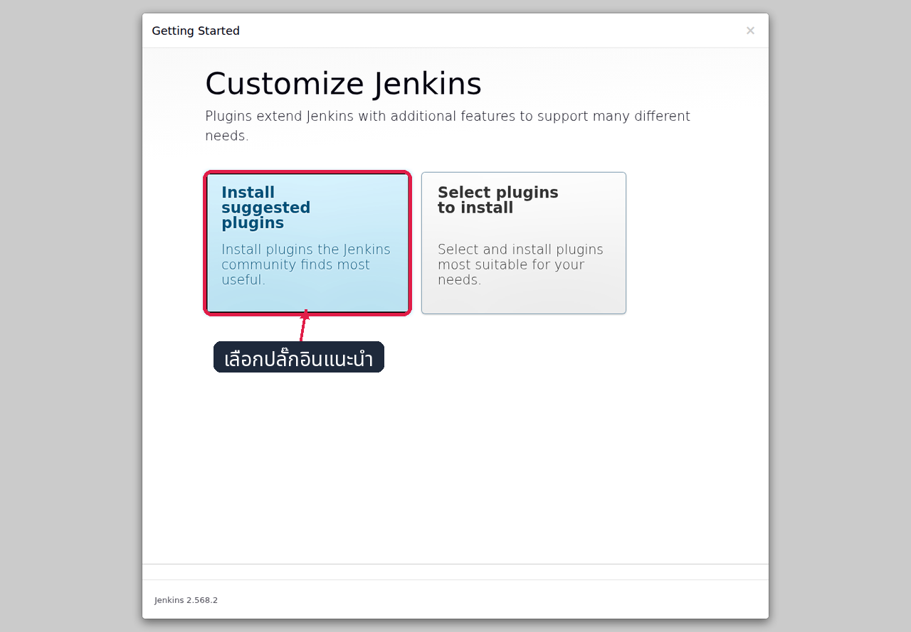
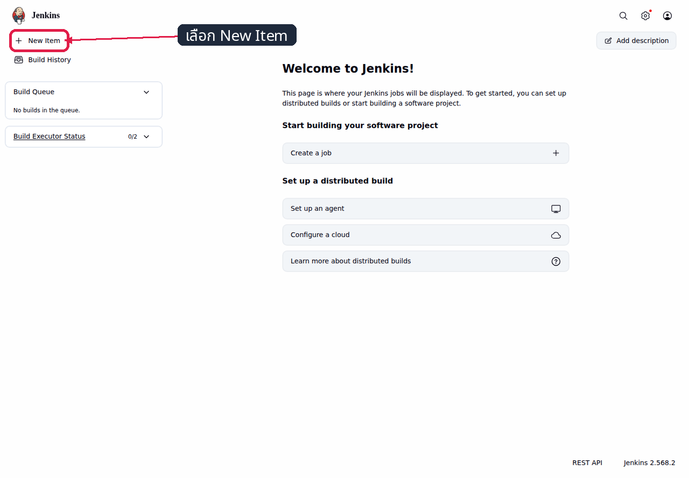
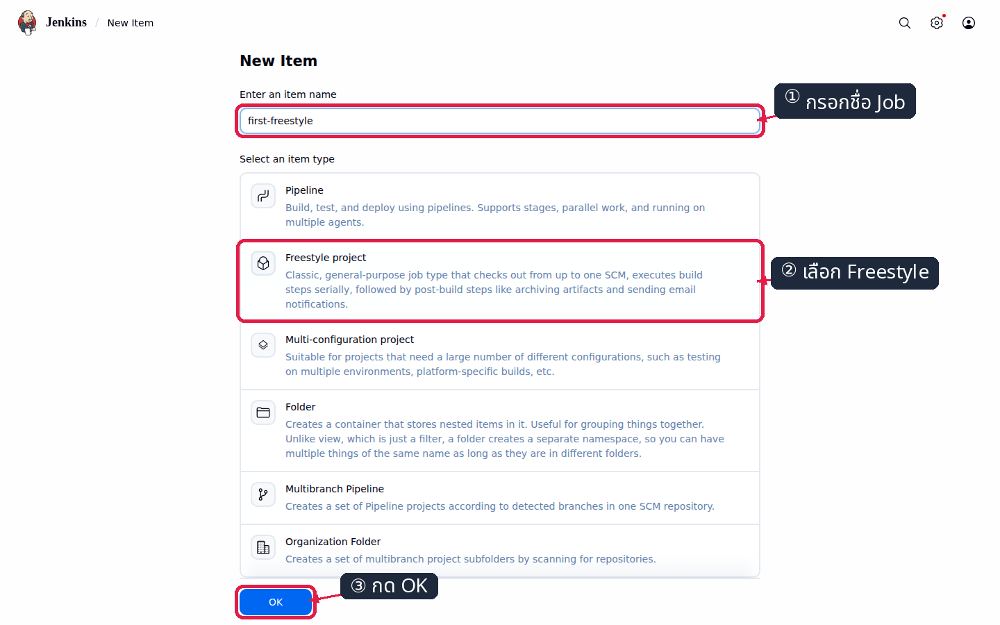
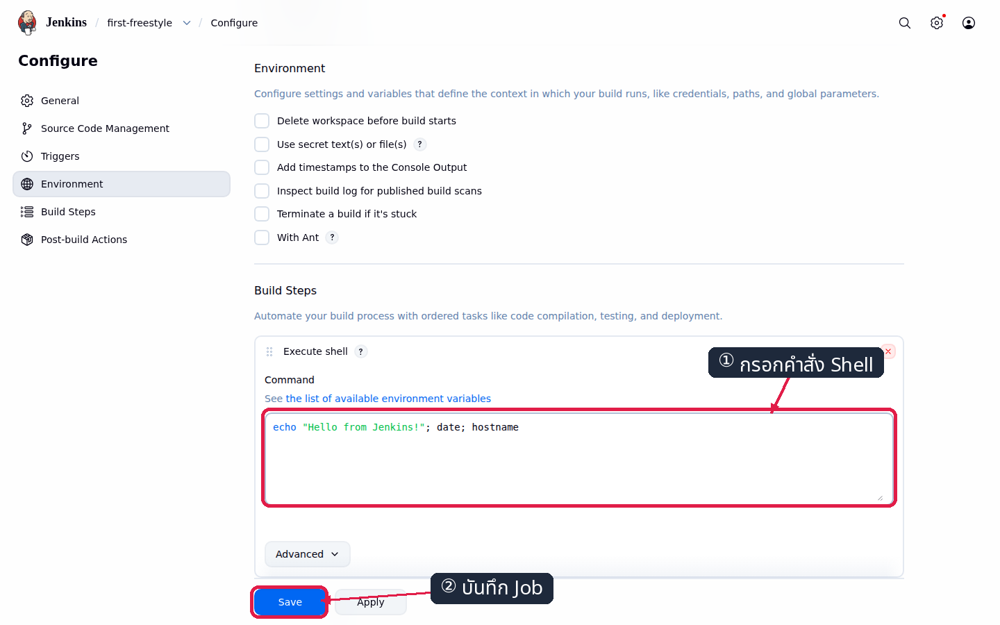
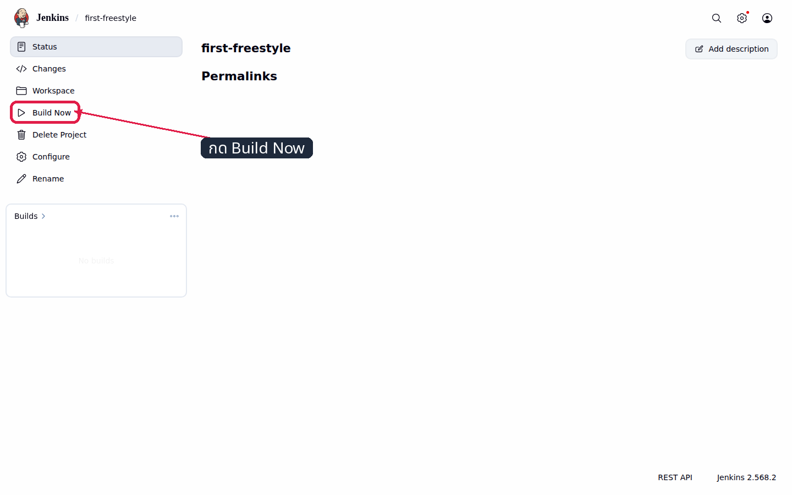
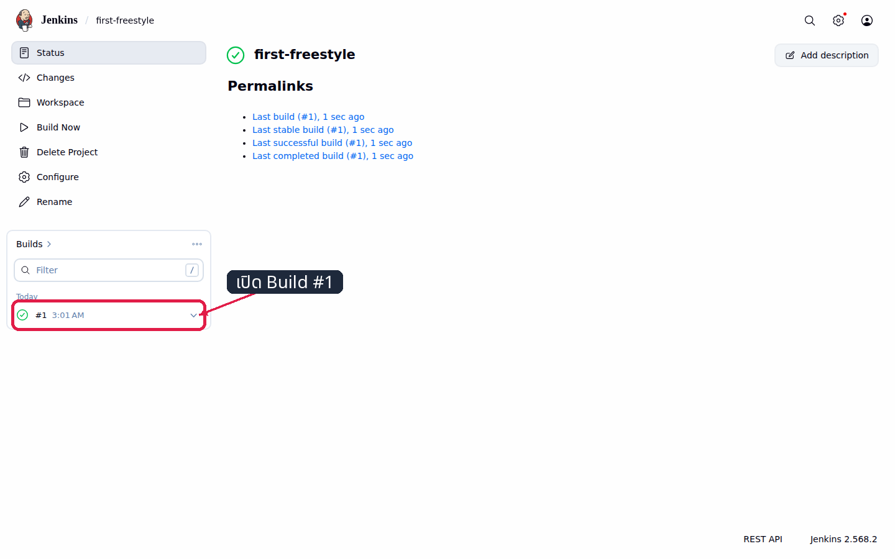

# LAB 1 — Jenkins on Docker

แล็บนี้ตอบคำถามว่า **“จะติดตั้งและเริ่มใช้งาน Jenkins บน Docker ได้อย่างไร”** เมื่อจบแล็บ นักศึกษาจะยก Jenkins ขึ้นเป็นคอนเทนเนอร์ ตั้งค่าครั้งแรกผ่านหน้าเว็บ สร้างงานพื้นฐานหนึ่งงาน และตรวจสอบผลการทำงานจาก Console Output ได้

## ทฤษฎีก่อนลงมือ

Jenkins คือ **automation server** ที่รับเหตุการณ์หรือคำสั่ง แล้วดำเนินกระบวนการตามที่กำหนดไว้ซ้ำได้เหมือนเดิมทุกครั้ง ในสาย CI/CD จะทำหน้าที่ประสานลำดับขั้น เช่น checkout โค้ด รันการทดสอบ สร้าง artifact และส่งต่อไปยังขั้น deploy — ดูภาพรวมใน slide **ตอนที่ 1 — จากปัญหาจริง สู่ CI และ CD**

คำศัพท์ที่จะใช้ตลอดแล็บ: **job** คือนิยามงานหนึ่งชุด, **build** คือการดำเนินงานตามนิยามนั้นครั้งที่ N, **workspace** คือไดเรกทอรีทำงานเฉพาะของ build นั้น และ **executor** คือช่องประมวลผลที่รับ build ไปทำงาน — ดูความสัมพันธ์ใน slide **ตอนที่ 2 — Jenkins คืออะไร และทำงานอย่างไร** (diagram D3)

การรัน Jenkins ในคอนเทนเนอร์ทำให้สร้างสภาพแวดล้อมเดิมซ้ำได้ เริ่ม หยุด และเปลี่ยนเวอร์ชันได้ โดยไม่ต้องติดตั้ง Java บนเครื่องหลัก พอร์ต `8080` ให้บริการหน้าเว็บและ HTTP API ส่วนสถานะทั้งหมด (users, jobs, build history, workspaces) ถูกเก็บไว้ใน named volume `jenkins_home` ที่ผูกกับ `/var/jenkins_home` ดังนั้น **คอนเทนเนอร์ทำหน้าที่ประมวลผล ส่วน volume ทำหน้าที่เก็บสถานะ** — ดู slide **ตอนที่ 3 — LAB 1 — Jenkins on Docker** (diagram D4 และ D5)

> **คำเตือนความปลอดภัย:** `--privileged` ให้สิทธิ์สูงมาก เหมาะกับสภาพแวดล้อมทดลองแบบลบทิ้งได้เท่านั้น ระบบจริงควรแยก agent ใช้หลัก least privilege และจัดการ config/secret ด้วย JCasC หรือ secret manager

## 🎯 Learning Objectives — ผลลัพธ์การเรียนรู้

เมื่อจบแล็บนี้ นักศึกษาจะสามารถ

- อธิบายได้ว่า Jenkins ทำหน้าที่อะไรในสาย CI/CD และเหตุใดจึงนิยมรันเป็นคอนเทนเนอร์
- สร้างและเริ่มคอนเทนเนอร์ Jenkins พร้อม network และ volume ตามที่กำหนดได้
- ตรวจสอบได้ว่าคอนเทนเนอร์ทำงานสำเร็จก่อนเข้าใช้งานหน้าเว็บ
- ตั้งค่า Jenkins ครั้งแรกผ่าน Setup Wizard ได้
- สร้างและรัน job พื้นฐาน แล้วอ่านผลจาก Console Output ได้
- อธิบายได้ว่าเหตุใดงานและประวัติ build จึงไม่หายเมื่อคอนเทนเนอร์เริ่มทำงานใหม่

## System Overview — ระบบที่กำลังสร้าง

แล็บนี้สร้าง Jenkins controller **หนึ่งตัว** ที่รันเป็นคอนเทนเนอร์ ประกอบด้วยส่วนต่อไปนี้ (ดูภาพใน slide **ตอนที่ 3** diagram D4 และ D5)

| องค์ประกอบ | ค่าในแล็บนี้ | หน้าที่ |
|---|---|---|
| คอนเทนเนอร์ชั้นนอก | `devtools-jenkins` | สภาพแวดล้อมของรายวิชา มี Docker daemon ของตัวเองและ map พอร์ตออกสู่เครื่องหลัก |
| เครือข่าย | `cicd-net` | เครือข่ายที่คอนเทนเนอร์ของแล็บทุกตัวใช้ร่วมกันตั้งแต่ LAB 3 |
| คอนเทนเนอร์ Jenkins | `jenkins` จาก `jenkins/jenkins:lts-jdk21` | ประมวลผล — รับงาน จัดคิว และรันคำสั่ง |
| named volume | `jenkins_home` → `/var/jenkins_home` | เก็บสถานะถาวร: users, jobs, build history, workspaces |
| พอร์ต | `8080` | หน้าเว็บและ HTTP API ของ Jenkins |

**ข้อสรุปเชิงสถาปัตยกรรม:** คอนเทนเนอร์ทำหน้าที่ *ประมวลผล* ส่วน volume ทำหน้าที่ *เก็บสถานะ* — ลบและสร้างคอนเทนเนอร์ใหม่ได้โดยงานไม่หาย ตราบใดที่ยังผูก volume เดิม

## LAB Workflow — ลำดับงานหกขั้น

| ขั้น | ทำอะไร | ผลลัพธ์ที่ตรวจได้ | สไลด์ของ LAB 1 |
|---|---|---|---|
| 1 · Start | สร้าง network และคอนเทนเนอร์ Jenkins | `jenkins` ทำงานบน `cicd-net` | สภาพตั้งต้น + การทดลองที่ 1 |
| 2 · Verify | ตรวจสถานะและ log ของคอนเทนเนอร์ | สถานะ `Up` และเริ่มระบบเสร็จ | การทดลองที่ 2 |
| 3 · Access | อ่านรหัสปลดล็อกแล้วเปิดหน้าเว็บ | เข้าหน้า Unlock ที่พอร์ต 8080 ได้ | การทดลองที่ 3 |
| 4 · Configure | ติดตั้ง plugin และสร้างผู้ดูแล | เข้าใช้งานด้วย `admin` ได้ | การทดลองที่ 4 |
| 5 · Test | สร้างและรัน job แรก | build แรกจบด้วย `SUCCESS` | การทดลองที่ 5 |
| 6 · Verify state | restart แล้วรันสคริปต์ตรวจผล | `LAB 1 CHECK: PASS` | การทดลองที่ 6 |

ห้ามข้ามขั้น — หากขั้นใดไม่ได้ผลตามตาราง ให้แก้ให้ผ่านก่อนไปขั้นถัดไป

## Expected Result — ผลลัพธ์ที่ต้องได้เมื่อจบแล็บ

เมื่อทำครบทั้งหกขั้น ระบบต้องอยู่ในสถานะต่อไปนี้

- เข้าหน้าเว็บ `http://localhost:8080` ด้วย `admin` / `admin2569` ได้
- มี job ชื่อ `first-freestyle` ที่มี build จบด้วย `SUCCESS` อย่างน้อยหนึ่งครั้ง
- restart คอนเทนเนอร์ `jenkins` แล้วไม่ต้องทำ Setup Wizard ซ้ำ
- `bash check.sh` แสดงผลต่อไปนี้และคืน exit code `0`

```text
PASS: container jenkins is Up
PASS: volume jenkins_home exists
PASS: job first-freestyle exists
PASS: latest build #N is SUCCESS
LAB 1 CHECK: PASS
```

## สภาพตั้งต้น

เครื่องของนักศึกษาต้องมี **Docker**, **Git**, การเชื่อมต่ออินเทอร์เน็ต และพื้นที่ว่างอย่างน้อย **5 GB** โดย LAB 1 เริ่มจากเครื่องที่ยังไม่มีคอนเทนเนอร์ `devtools-jenkins`

**ขั้นที่ 0.1 — สร้างคอนเทนเนอร์สภาพแวดล้อมของรายวิชา**

```bash
docker run -dit --name devtools-jenkins --privileged \
  --tmpfs /run -v jenkins-dind:/var/lib/docker \
  -p 2222:22 -p 8080:8080 -p 8000:8000 \
  tuchsanai/devtools:2569_1
```

คำสั่งนี้สร้างคอนเทนเนอร์ที่มี Docker daemon ของตัวเองอยู่ภายใน และเปิดพอร์ต `8080` (Jenkins), `8000` (เว็บแอปใน LAB 6) และ `2222` (SSH) ออกมายังเครื่องหลัก

**ขั้นที่ 0.2 — ตรวจว่าคอนเทนเนอร์ทำงานแล้วจึงเข้าใช้งาน**

```bash
docker ps
ssh root@localhost -p 2222
```

รหัสผ่านสำหรับ SSH คือ `passwd`

✅ **สิ่งที่ต้องเห็น** (ตัดเฉพาะแถวที่เกี่ยวข้อง):

```text
CONTAINER ID   IMAGE                        ...   NAMES
...            tuchsanai/devtools:2569_1    ...   devtools-jenkins
root@...:~#
```

**ขั้นที่ 0.3 — ดาวน์โหลดชุดไฟล์ของรายวิชาไว้ใน devtools**

```bash
if [ -d "$HOME/DevTools/.git" ]; then
  git -C "$HOME/DevTools" pull
else
  git clone --depth 1 https://github.com/Tuchsanai/DevTools.git "$HOME/DevTools"
fi
export COURSE_ROOT="$HOME/DevTools/04_Jenkins/001_Jenikin"
echo 'export COURSE_ROOT="$HOME/DevTools/04_Jenkins/001_Jenikin"' > /etc/profile.d/course.sh
```

ไฟล์ชุดนี้จะถูกใช้ในการทดลองที่ 6 เพื่อรันสคริปต์ตรวจผลปิดท้าย

✅ **สิ่งที่ต้องเห็น** (รันครั้งแรก):

```text
Cloning into '/root/DevTools'...
```

ถ้ามี `~/DevTools` อยู่แล้ว จะเห็นผลจาก `git pull` เช่น `Already up to date.` แทน — การทดลองทั้งหมดของแล็บนี้ดำเนินการใน shell ของ `devtools-jenkins`

> LAB 1 ไม่มีสถานะต่อเนื่องจากแล็บก่อนหน้า หาก `docker run` แจ้งว่าชื่อซ้ำ ให้เริ่มคอนเทนเนอร์เดิมด้วย `docker start devtools-jenkins` แล้วเชื่อมต่อผ่าน SSH

---

## การทดลองที่ 1 — Start: สร้าง network และคอนเทนเนอร์ Jenkins

**ทำอะไร:** สร้าง Docker network ของรายวิชา แล้วยกคอนเทนเนอร์ Jenkins ขึ้นบน network นั้น

**ทำไม:** `cicd-net` เป็นเครือข่ายที่คอนเทนเนอร์ของแล็บทุกตัวจะใช้ร่วมกันตั้งแต่ LAB 3 เป็นต้นไป จึงสร้างไว้ตั้งแต่ต้น ส่วนตัวเลือกของ `docker run` แต่ละตัวมีหน้าที่ดังนี้ — `-p 8080:8080` เปิดหน้าเว็บ, `-v jenkins_home:/var/jenkins_home` เก็บสถานะไว้นอกคอนเทนเนอร์ และ `--restart unless-stopped` ทำให้ Jenkins กลับมาทำงานเองเมื่อ Docker เริ่มใหม่

```bash
docker network create cicd-net
docker run -d --name jenkins --network cicd-net --restart unless-stopped -p 8080:8080 -v jenkins_home:/var/jenkins_home jenkins/jenkins:lts-jdk21
```

✅ **สิ่งที่ต้องเห็น:** คำสั่งแรกคืนรหัส network และคำสั่งที่สองคืนรหัสคอนเทนเนอร์ โดยไม่มีข้อความ error

> 📝 การดาวน์โหลด image ครั้งแรกใช้เวลาตามความเร็วเครือข่าย ให้รอจนคำสั่งคืน prompt กลับมาก่อนทำขั้นถัดไป

---

## การทดลองที่ 2 — Verify: ตรวจว่าคอนเทนเนอร์ทำงานสำเร็จ

**ทำอะไร:** ตรวจสถานะคอนเทนเนอร์ และรอจนกระบวนการเริ่มระบบของ Jenkins เสร็จสมบูรณ์

**ทำไม:** สถานะ `Up` หมายถึงคอนเทนเนอร์ทำงานอยู่ แต่ยังไม่ได้แปลว่า Jenkins พร้อมให้บริการ จึงต้องอ่าน log เพื่อยืนยันก่อนเปิดหน้าเว็บ มิฉะนั้นเบราว์เซอร์จะแสดง connection refused

```bash
docker ps
docker logs jenkins
```

✅ **สิ่งที่ต้องเห็น:**

```text
CONTAINER ID   IMAGE                       ...   PORTS                    NAMES
...            jenkins/jenkins:lts-jdk21   ...   0.0.0.0:8080->8080/tcp   jenkins
```

และบรรทัดปิดท้ายของ log ต้องมีข้อความ

```text
Jenkins is fully up and running
```

---

## การทดลองที่ 3 — Access: อ่านรหัสปลดล็อกแล้วเปิดหน้าเว็บ

**ทำอะไร:** อ่านค่า initial admin password ที่อยู่ภายในคอนเทนเนอร์ แล้วเปิดหน้าเว็บของ Jenkins

**ทำไม:** เมื่อติดตั้งใหม่ Jenkins จะสุ่มรหัสผ่านหนึ่งชุดแล้วเขียนเก็บไว้ที่ `/var/jenkins_home/secrets/initialAdminPassword` **ภายในคอนเทนเนอร์** คำสั่ง `docker exec` จึงถูกใช้เพื่อเข้าไปสั่ง `cat` อ่านไฟล์นั้นออกมา แล้วนำค่าที่ได้ไปกรอกในหน้า Unlock Jenkins เพื่อยืนยันว่าผู้ที่กำลังตั้งค่าคือผู้ที่เข้าถึงเครื่องได้จริง

```bash
docker exec jenkins cat /var/jenkins_home/secrets/initialAdminPassword
```

✅ **สิ่งที่ต้องเห็น:** สตริงตัวอักษรและตัวเลข 32 ตัวหนึ่งบรรทัด โดยไม่มีข้อความอื่นนำหน้า (ค่าของแต่ละเครื่องจะต่างกัน)

จากนั้นเปิดเบราว์เซอร์บนเครื่องหลักไปที่ `http://localhost:8080` แล้ววางรหัสดังกล่าวในช่อง **Administrator password** และกด **Continue**


*เครื่องหมาย ① ชี้ช่อง Administrator password และ ② ชี้ปุ่ม Continue ตามลำดับการดำเนินการ*

> 📝 รหัสชุดนี้ใช้เฉพาะการปลดล็อกครั้งแรก หลังสร้างผู้ดูแลในการทดลองที่ 4 แล้วให้เข้าสู่ระบบด้วย `admin` / `admin2569` เสมอ

---

## การทดลองที่ 4 — Configure: ตั้งค่า Jenkins ครั้งแรกด้วย Setup Wizard

**ทำอะไร:** ติดตั้งชุด plugin พื้นฐานและสร้างบัญชีผู้ดูแลระบบผ่านหน้าเว็บ

**ทำไม:** Setup Wizard เปลี่ยน Jenkins จากสถานะติดตั้งใหม่ให้เป็นระบบที่ยืนยันตัวตนได้และมีความสามารถพื้นฐานพร้อมใช้งาน ชุด suggested plugins ประกอบด้วย Git และ Pipeline ซึ่งจำเป็นต่อ LAB 2 เป็นต้นไป

**1) เลือก Install suggested plugins** แล้วรอประมาณ 2–3 นาทีจนติดตั้งเสร็จ



*กรอบสีแดงชี้ตัวเลือก suggested plugins ซึ่งจัดเตรียมความสามารถพื้นฐาน รวมถึง Pipeline และ Git*

**2) สร้างผู้ดูแลระบบ** โดยกรอก Username `admin`, Password และ Confirm password เป็น `admin2569`, Full name `Admin`, Email `student@example.com` แล้วกด **Save and Continue**


*แบบฟอร์มผู้ดูแลกรอกค่าครบ โดยช่อง Password และ Confirm password แสดงเป็นจุดเพื่อปิดบังรหัสผ่าน*

**3) คง Jenkins URL** เป็น `http://localhost:8080/` แล้วกด **Save and Finish → Start using Jenkins**

✅ **สิ่งที่ต้องเห็น:**

```text
Welcome to Jenkins!
```


*Dashboard แสดงว่า Setup Wizard เสร็จสมบูรณ์และ Jenkins พร้อมสร้าง job*

> 📝 ถ้ามี plugin บางตัวขึ้น Retry ให้กด Retry และห้ามปิดคอนเทนเนอร์ระหว่างติดตั้ง

---

## การทดลองที่ 5 — Test: สร้าง job แรกแล้วรันเพื่อยืนยันว่าระบบพร้อมใช้งาน

**ทำอะไร:** สร้าง Freestyle job ที่รันคำสั่ง shell สามบรรทัด สั่ง build แล้วอ่านผลจาก Console Output

**ทำไม:** เป็นการยืนยันแบบครบวงจรว่า Jenkins รับงาน จัดคิว รันคำสั่ง และบันทึกผลได้จริง Freestyle job ถูกเลือกเพราะแสดงความสัมพันธ์ระหว่าง *นิยามงาน* กับ *ผลการรัน* ได้ชัดเจนก่อนเข้าสู่ Pipeline ใน LAB 2

**1) จาก Dashboard เลือกเมนู New Item**



*กรอบและป้ายชี้เมนู New Item ด้านซ้าย ซึ่งเป็นจุดเริ่มต้นของการสร้าง job*

**2) กรอกชื่อ `first-freestyle`** เลือก **Freestyle project** แล้วกด **OK**



*หน้า New Item แสดงชื่อ first-freestyle ประเภท Freestyle project และปุ่ม OK ที่พร้อมใช้งาน*

**3) ไปที่ Build Steps → Add build step → Execute shell** แล้วกรอกคำสั่งต่อไปนี้ในช่อง Command

```bash
echo "Hello from Jenkins!"
date
hostname
```



*ส่วน Build Steps แสดง Execute shell และคำสั่งสามส่วนก่อนบันทึก config*

**4) กด Save** ระบบจะเปิดหน้า Status ของ job



*หน้า Status หลัง Save แสดงชื่อ first-freestyle เมนู Build Now และยังไม่มี build history*

**5) กด Build Now** แล้วรอจน build `#N` แสดงเครื่องหมายสีเขียว



*หน้า job แสดง build แรกเป็น Last successful build พร้อมเครื่องหมายสถานะสีเขียว*

**6) เลือก `#N` → Console Output** เพื่ออ่านผลการทำงาน


*Console Output แสดง workspace คำสั่ง echo, date, hostname และผลลัพธ์ Finished: SUCCESS*

✅ **สิ่งที่ต้องเห็นใน Console Output:**

```text
Building in workspace /var/jenkins_home/workspace/first-freestyle
Hello from Jenkins!
Finished: SUCCESS
```

บรรทัดแรกระบุว่า build นี้ทำงานอยู่ใน workspace ใด ซึ่งอยู่ภายใต้ `/var/jenkins_home` จึงถูกเก็บไว้ใน volume `jenkins_home`

> 📝 หมายเลข build คือลำดับการรันของ job เดิม ไม่ใช่ job ใหม่ — กด Build Now ซ้ำจะได้ `#2`, `#3` ต่อไปเรื่อย ๆ

---

## การทดลองที่ 6 — ยืนยันสถานะปิดท้ายแล็บ

**ทำอะไร:** เริ่มคอนเทนเนอร์ Jenkins ใหม่ ตรวจว่างานและประวัติ build ยังอยู่ แล้วรันสคริปต์ตรวจผลอัตโนมัติ

**ทำไม:** เป็นการพิสูจน์ข้อสรุปสำคัญของแล็บว่า **สถานะของ Jenkins อยู่ใน volume ไม่ได้อยู่ในคอนเทนเนอร์** หากทำ Setup Wizard ใหม่ทุกครั้งที่ restart แสดงว่าการผูก volume ไม่ถูกต้อง

```bash
docker restart jenkins
sleep 20
curl -fsS -u admin:admin2569 'http://localhost:8080/job/first-freestyle/lastBuild/api/json?tree=number,result'
```

✅ **สิ่งที่ต้องเห็น:**

```json
{"_class":"hudson.model.FreeStyleBuild","number":<BUILD_NUMBER>,"result":"SUCCESS"}
```

จากนั้นรันสคริปต์ตรวจผลของแล็บ ซึ่งจะตรวจคอนเทนเนอร์ volume job และผล build ล่าสุดพร้อมกัน

```bash
cd "$COURSE_ROOT/001_LAB_Jenkins_On_Docker"
bash check.sh
```

✅ **สิ่งที่ต้องเห็น:**

```text
PASS: container jenkins is Up
PASS: volume jenkins_home exists
PASS: job first-freestyle exists
PASS: latest build #N is SUCCESS
LAB 1 CHECK: PASS
```

`check.sh` คืน exit code `0` เมื่อผ่านครบทุกข้อ และคืน `1` พร้อมรายการที่ยังขาดเมื่อสถานะไม่พร้อม

---

## กู้สถานะเมื่อปิดเครื่องหรือเริ่มระบบใหม่

เมื่อเปิดเครื่องใหม่ ให้เริ่มคอนเทนเนอร์ชั้นนอกตัวเดิม แล้วรอประมาณ 20 วินาทีให้ Docker daemon ภายในและ Jenkins กลับมาทำงาน

```bash
docker start devtools-jenkins
sleep 20
docker exec devtools-jenkins docker ps
```

✅ **สิ่งที่ต้องเห็น** (ตัดเฉพาะแถวที่เกี่ยวข้อง):

```text
CONTAINER ID   IMAGE   ...   NAMES
...            ...     ...   jenkins
```

`jenkins` ต้องกลับมาอยู่ในสถานะ `Up` เองโดยไม่ต้องทำ Setup Wizard ซ้ำ เพราะ `--restart unless-stopped` สั่งให้บริการกลับมาเอง `--tmpfs /run` ป้องกัน PID เก่าของ Docker daemon ค้าง และ named volume `jenkins-dind` กับ `jenkins_home` เก็บ image และสถานะเดิมไว้ครบ หากต้องสร้าง `devtools-jenkins` ใหม่ ให้ใช้คำสั่งเดิมในหัวข้อสภาพตั้งต้นเพื่อผูก volume ชุดเดิมกลับมา

## แก้ปัญหาที่พบบ่อย

| อาการ | สาเหตุ | วิธีแก้ |
|---|---|---|
| `Bind for 0.0.0.0:8080 failed` | พอร์ต 8080 ของเครื่องหลักถูกใช้อยู่ | รัน `docker ps` แล้วดูคอลัมน์ PORTS; หยุดเฉพาะคอนเทนเนอร์ที่ตนเป็นเจ้าของ แล้วรันคำสั่งสร้าง devtools ใหม่ |
| เปิด `localhost:8080` แล้ว connection refused | Jenkins ยังเริ่มระบบไม่เสร็จ หรือคอนเทนเนอร์หยุดทำงาน | รอจน `docker logs jenkins` แสดง `Jenkins is fully up and running` แล้วตรวจ `docker ps` ซ้ำ |
| Wizard ช้ามากหรือ update center ล้มเหลว | เครือข่ายช้า หรือบริการ update center ขัดข้อง | รอ 2–3 นาทีแล้วกด **Retry**; ตรวจอินเทอร์เน็ตและลองใหม่โดยไม่ลบ volume `jenkins_home` |
| ลืมรหัส initial หลังตั้งผู้ดูแลแล้ว | รหัสชุดนั้นใช้เฉพาะการปลดล็อกครั้งแรก | เข้าสู่ระบบด้วย `admin` / `admin2569` ไม่ต้องอ่านรหัสเริ่มต้นอีก |
| restart แล้วต้องทำ Setup Wizard ใหม่ | ตอน `docker run` ไม่ได้ผูก `-v jenkins_home:/var/jenkins_home` | ลบคอนเทนเนอร์ `jenkins` แล้วสร้างใหม่ตามคำสั่งในการทดลองที่ 1 ให้ครบทุกตัวเลือก |
| restart แล้ว Docker daemon ใน devtools ไม่ขึ้น | ตอนสร้าง devtools ขาด `--tmpfs /run` จึงมี PID เก่าค้าง | สร้าง devtools ใหม่ด้วยคำสั่งในหัวข้อสภาพตั้งต้น และผูก `jenkins-dind` เดิมกลับมา |
| `check.sh` แจ้ง API login failed | รหัสผู้ดูแลหรือ Jenkins URL ไม่ตรงกับที่แล็บกำหนด | ใช้ `admin` / `admin2569` และรันสคริปต์จากภายใน devtools |
