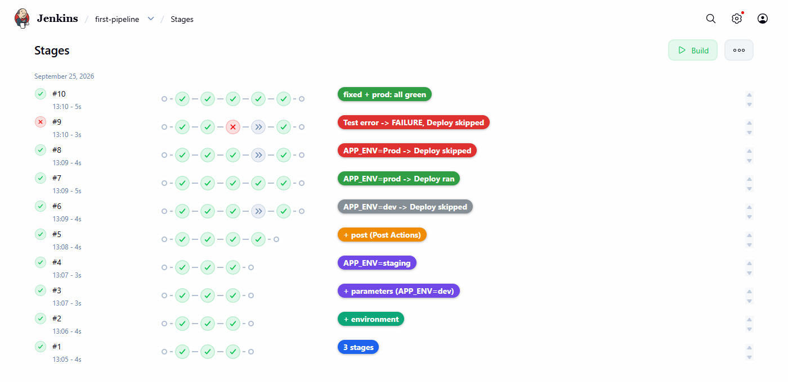

# LAB 2 — เขียน Declarative Pipeline แรก

> ⏱️ ประมาณ 40 นาที · 🧪 8 การทดลอง · 🎯 จบเมื่อ `first-pipeline` build ล่าสุดเป็น `SUCCESS` และทั้ง 5 ช่อง (Checkout, Build, Test, Deploy, Post Actions) เป็นสีเขียว

แล็บนี้ให้เราเขียน **Declarative Pipeline** เป็นครั้งแรก แทนการตั้งค่า Freestyle job ด้วยการคลิกแบบใน LAB 1 โครงสร้างหลักมีแค่นี้

```groovy
pipeline {                 // ขอบเขตของ Pipeline ทั้งหมด
  agent any                // รันบน executor ใดก็ได้ที่ว่าง
  stages {                 // รวมทุกขั้นของงาน
    stage('Build') {       // หนึ่งขั้น = หนึ่งช่องใน Pipeline Graph
      steps {              // คำสั่งที่ทำจริง
        echo "Build #${env.BUILD_NUMBER}"
      }
    }
  }
}
```

จากนั้นจะเติมทีละส่วน: ตัวแปร `environment` (อ่านด้วย `env.NAME`) และ `parameters` (อ่านด้วย `params.NAME`) — การแทนค่า `${...}` ทำงานเฉพาะในสตริงอัญประกาศคู่ `"..."` — ต่อด้วย `post` และ `when` ซึ่งจะอธิบายในการทดลองที่ใช้จริง

---

## 🎯 Learning Objectives — ผลลัพธ์การเรียนรู้

เมื่อจบแล็บนี้ นักศึกษาจะสามารถ

1. สร้าง Pipeline job และเขียน Declarative Pipeline ด้วย `pipeline`, `agent`, `stages`, `stage` และ `steps` ได้
2. ใช้ `environment` (`env.*`) และ `parameters` (`params.*`) พร้อมการแทนค่าในสตริงอัญประกาศคู่ได้
3. ใช้ `post` และ `when` เพื่อกำหนดงานหลัง build และการข้าม stage ได้
4. อ่าน Pipeline Graph และ Console Output เพื่ออธิบายว่า stage ใดทำงาน ถูกข้าม หรือล้มเหลว

---

## 0. สิ่งที่ต้องมีก่อนเริ่ม

- ทำ **LAB 1 สำเร็จแล้ว** และ clone รีโพไว้ที่ `~/labwork/DevTools` แล้ว
- ใช้เครื่องเรียน `devtools` และ Jenkins ตัวเดิมจาก LAB 1 — **ไม่ต้องลบ ไม่ต้องสร้างใหม่**

ถ้าปิดเครื่องไปแล้ว ให้กลับเข้าเครื่องเรียนจากเครื่องของเรา :

```bash
docker start devtools            # ถ้ารันอยู่แล้วก็ไม่เป็นไร
ssh root@localhost -p 2222       # password : passwd
```

> ⚠️ **ห้าม `docker rm -f devtools`** — Jenkins และประวัติ build ทั้งหมดอยู่ข้างในกล่องนี้ ลบแล้วต้องเริ่ม LAB 1 ใหม่

---

## 1. เข้าโฟลเดอร์แล็บ แล้วเปิด Jenkins

พิมพ์**ข้างในเครื่องเรียน** :

```bash
cd ~/labwork/DevTools/04_Jenkins/001_Jenikin/002_LAB_Declarative_Pipeline
```

เข้าสู่ระบบ Jenkins :

1. เปิด http://localhost:8080
2. กรอก **Username** `admin`
3. กรอก **Password** `admin2569`

   

   *ภาพหน้า Sign in: Username เป็น `admin` รหัสผ่านถูกซ่อนเป็นจุด แล้วกด **Sign in** (พอร์ต 18081 ในภาพเป็น tunnel สำหรับจับภาพ นักศึกษายังใช้ `localhost:8080`)*

4. กด **Sign in**
5. เมื่อเห็นหน้า Dashboard แล้ว ไปสร้าง Pipeline job ในการทดลองที่ 1

---

## การทดลองที่ 1 — สร้าง Pipeline job ที่มี 3 stages

**คำถาม:** Pipeline job ที่มี Checkout, Build และ Test สร้างจากหน้า Jenkins อย่างไร

**1.1) Dashboard → New Item** กรอกชื่อ `first-pipeline` เลือก **Pipeline** แล้วกด **OK**


*ภาพที่ 1 ต้องเลือกชนิด **Pipeline** ไม่ใช่ Freestyle project*

**1.2) เลื่อนไปหัวข้อ Pipeline** ตรวจว่า **Definition = Pipeline script** แล้ววางสคริปต์ต่อไปนี้ในช่อง **Script**

```groovy
pipeline {
  agent any

  stages {
    stage('Checkout') {
      steps {
        echo 'Checkout (simulated)'
        sleep 1
      }
    }
    stage('Build') {
      steps {
        echo 'Build'
        sleep 1
      }
    }
    stage('Test') {
      steps {
        echo 'Tests passed'
        sleep 1
      }
    }
  }
}
```


*ภาพที่ 2 Definition เป็น Pipeline script และโค้ด 3 stages อยู่ในช่อง Script*

**1.3) กด Save** → หน้า `first-pipeline` เปิดขึ้น และยังไม่มี build

> 📝 ช่อง Script มีตัวช่วย *try sample Pipeline…* และลิงก์ *Pipeline Syntax* สำหรับสร้างโค้ด step ต่าง ๆ ใช้ศึกษาต่อได้

---

## การทดลองที่ 2 — อ่าน Pipeline Graph

**คำถาม:** จะรู้ได้อย่างไรว่าแต่ละ stage สำเร็จและเรียงลำดับถูกต้อง

**2.1) กด Build Now** รอจน `#1` เป็นสีเขียว แล้วคลิก `#1` → เมนู **Pipeline Overview**


*ภาพที่ 3 ใน Jenkins รุ่นนี้ เมนูกราฟของ build ชื่อ **Pipeline Overview***


*ภาพที่ 4 กราฟ Start → Checkout → Build → Test → End ทุกโหนดเป็นสีเขียว คลิกแต่ละ stage เพื่อดู steps ที่อยู่ข้างใน*

✅ **ผลการทดลองจริง** (Console Output ของ `#1`, ตัดบางส่วน):

```text
[Pipeline] { (Checkout)
[Pipeline] echo
Checkout (simulated)
[Pipeline] sleep
Sleeping for 1 sec
[Pipeline] }
[Pipeline] // stage
[Pipeline] { (Build)
...
[Pipeline] { (Test)
[Pipeline] echo
Tests passed
...
[Pipeline] End of Pipeline
Finished: SUCCESS
```

🔍 **ตีความ:** บรรทัด `[Pipeline] { (ชื่อ stage)` คือจุดเริ่มของ stage และ `[Pipeline] // stage` คือจุดจบ ตรงกับวงเล็บปีกกาในโค้ด แต่ละ stage ใช้เวลาประมาณ 1 วินาทีตาม `sleep 1` รวมทั้ง build ประมาณ 4–5 วินาที

---

## การทดลองที่ 3 — `environment`: ให้ข้อความรู้จัก build

**คำถาม:** จะพิมพ์ตัวแปรของเรา ชื่อ job และหมายเลข build ใน stage ได้อย่างไร

**3.1) Configure → วางสคริปต์ฉบับเต็มนี้แทนของเดิม → Save → Build Now**

```groovy
pipeline {
  agent any

  environment {
    LAB_NAME = 'Declarative Pipeline'
  }

  stages {
    stage('Checkout') {
      steps {
        echo 'Checkout (simulated)'
        sleep 1
      }
    }
    stage('Build') {
      steps {
        echo "Building ${env.LAB_NAME}: ${env.JOB_NAME} #${env.BUILD_NUMBER}"
        sleep 1
      }
    }
    stage('Test') {
      steps {
        echo 'Tests passed'
        sleep 1
      }
    }
  }
}
```


*ภาพที่ 5 บล็อก `environment` ประกาศ `LAB_NAME` และบรรทัด `echo` ใช้อัญประกาศคู่เพื่อแทนค่า*

**3.2) เปิด Console Output ของ `#2`**


*ภาพที่ 6 ข้อความรวมค่าจากสามแหล่ง: `LAB_NAME` (เราประกาศ), `JOB_NAME` และ `BUILD_NUMBER` (Jenkins กำหนด)*

✅ **ผลการทดลองจริง:**

```text
[Pipeline] { (Build)
[Pipeline] echo
Building Declarative Pipeline: first-pipeline #2
```

---

## การทดลองที่ 4 — `parameters`: รับค่าจากผู้สั่ง build

**คำถาม:** ผู้กด build จะเลือก environment โดยไม่ต้องแก้สคริปต์ได้อย่างไร

**4.1) Configure → วางสคริปต์ฉบับเต็มนี้ → Save**

```groovy
pipeline {
  agent any

  parameters {
    string(name: 'APP_ENV', defaultValue: 'dev', description: 'Environment to deploy')
  }

  environment {
    LAB_NAME = 'Declarative Pipeline'
  }

  stages {
    stage('Checkout') {
      steps {
        echo 'Checkout (simulated)'
        sleep 1
      }
    }
    stage('Build') {
      steps {
        echo "Building ${env.LAB_NAME}: ${env.JOB_NAME} #${env.BUILD_NUMBER}"
        echo "APP_ENV=${params.APP_ENV}"
        sleep 1
      }
    }
    stage('Test') {
      steps {
        echo 'Tests passed'
        sleep 1
      }
    }
  }
}
```


*ภาพที่ 7 ประกาศ `APP_ENV` (ค่าเริ่มต้น `dev`) และอ่านด้วย `params.APP_ENV`*

**4.2) สังเกตเมนู — ยังเป็น Build Now** เพราะ Jenkins ยังไม่ได้รันสคริปต์ใหม่ จึงยังไม่รู้จัก parameter กด **Build Now** หนึ่งครั้ง (ได้ `#3`, ใช้ค่าเริ่มต้น `APP_ENV=dev`)


*ภาพที่ 8 ก่อน build ครั้งแรกหลังเพิ่ม `parameters` เมนูยังเป็น Build Now*


*ภาพที่ 9 หลัง `#3` เมนูเปลี่ยนเป็น **Build with Parameters***

🔍 **ตีความ:** นิยาม parameter อยู่ *ในสคริปต์* Jenkins จะอ่านและบันทึกเป็นการตั้งค่าของ job เมื่อสคริปต์ถูกรันแล้วหนึ่งครั้ง เปิด **Configure** จะเห็นว่า *This project is parameterized* ถูกเลือกให้เองตามโค้ด


*ภาพที่ 10 Name `APP_ENV`, Default Value `dev` มาจากโค้ด ไม่ต้องกรอกเอง*

**4.3) Build with Parameters → เปลี่ยนค่าเป็น `staging` → Build** (ได้ `#4`)


*ภาพที่ 11 ค่าที่กรอกในแบบฟอร์มถูกส่งเข้า `params.APP_ENV`*


*ภาพที่ 12 build `#4` ได้รับค่า `staging` จากแบบฟอร์ม*

✅ **ผลการทดลองจริง:**

```text
APP_ENV=dev       ← #3 (Build Now ครั้งแรก ใช้ค่าเริ่มต้น)
APP_ENV=staging   ← #4 (Build with Parameters)
```

---

## การทดลองที่ 5 — `post`: งานหลัง stages จบ

**คำถาม:** จะให้ข้อความหนึ่งทำงานเสมอ และอีกข้อความทำงานเฉพาะเมื่อสำเร็จได้อย่างไร

> 📝 บล็อก `post` ทำงานหลัง stages ทั้งหมดจบ: `always` ทำทุกครั้ง · `success` ทำเมื่อ build สำเร็จ · `failure` ทำเมื่อ build ล้มเหลว

**5.1) Configure → วางสคริปต์ฉบับเต็มนี้ → Save → Build with Parameters (คง `dev`) → Build** (ได้ `#5`)

```groovy
pipeline {
  agent any

  parameters {
    string(name: 'APP_ENV', defaultValue: 'dev', description: 'Environment to deploy')
  }

  environment {
    LAB_NAME = 'Declarative Pipeline'
  }

  stages {
    stage('Checkout') {
      steps {
        echo 'Checkout (simulated)'
        sleep 1
      }
    }
    stage('Build') {
      steps {
        echo "Building ${env.LAB_NAME}: ${env.JOB_NAME} #${env.BUILD_NUMBER}"
        echo "APP_ENV=${params.APP_ENV}"
        sleep 1
      }
    }
    stage('Test') {
      steps {
        echo 'Tests passed'
        sleep 1
      }
    }
  }

  post {
    always {
      echo "Finished ${env.JOB_NAME} #${env.BUILD_NUMBER}"
    }
    success {
      echo 'Pipeline succeeded'
    }
    failure {
      echo 'Pipeline failed - look for the red stage'
    }
  }
}
```


*ภาพที่ 13 บล็อก `post` มีสามเงื่อนไข: `always`, `success`, `failure`*

**5.2) เปิด Console Output ของ `#5` แล้วเลื่อนลงไปส่วน Declarative: Post Actions**


*ภาพที่ 14 `always` และ `success` ทำงาน ส่วน `failure` ไม่ทำงานเพราะ build สำเร็จ*

✅ **ผลการทดลองจริง:**

```text
[Pipeline] { (Declarative: Post Actions)
[Pipeline] echo
Finished first-pipeline #5
[Pipeline] echo
Pipeline succeeded
...
Finished: SUCCESS
```

🔍 **ตีความ:** ไม่มีข้อความ `Pipeline failed ...` ใน log ทั้งที่อยู่ในโค้ด แสดงว่าเงื่อนไข `failure` ถูกประเมินแล้วเป็นเท็จ — จะเห็นกรณีกลับกันในการทดลองที่ 7

---

## การทดลองที่ 6 — `when`: Deploy เฉพาะ prod

**คำถาม:** จะข้าม Deploy สำหรับ dev แต่ทำจริงสำหรับ prod ได้อย่างไร และถ้าพิมพ์ `Prod` จะเกิดอะไรขึ้น

> 📝 `when` ถูกตรวจ**ก่อน**เข้า stage ถ้าเงื่อนไขเป็นเท็จ stage นั้นจะถูกข้าม (skipped) โดย build ไม่ล้มเหลว · `params.APP_ENV == 'prod'` เทียบสตริงแบบแยกตัวพิมพ์ใหญ่–เล็ก

**6.1) Configure → วางสคริปต์ฉบับเต็มนี้ → Save** (ไฟล์นี้ตรงกับ [`Jenkinsfile`](./Jenkinsfile) ทุกตัวอักษร)

```groovy
pipeline {
  agent any

  parameters {
    string(name: 'APP_ENV', defaultValue: 'dev', description: 'Environment to deploy')
  }

  environment {
    LAB_NAME = 'Declarative Pipeline'
  }

  stages {
    stage('Checkout') {
      steps {
        echo 'Checkout (simulated)'
        sleep 1
      }
    }
    stage('Build') {
      steps {
        echo "Building ${env.LAB_NAME}: ${env.JOB_NAME} #${env.BUILD_NUMBER}"
        echo "APP_ENV=${params.APP_ENV}"
        sleep 1
      }
    }
    stage('Test') {
      steps {
        echo 'Tests passed'
        sleep 1
      }
    }
    stage('Deploy') {
      when {
        expression { params.APP_ENV == 'prod' }
      }
      steps {
        echo "Deploying to ${params.APP_ENV}"
        sleep 1
      }
    }
  }

  post {
    always {
      echo "Finished ${env.JOB_NAME} #${env.BUILD_NUMBER}"
    }
    success {
      echo 'Pipeline succeeded'
    }
    failure {
      echo 'Pipeline failed - look for the red stage'
    }
  }
}
```

**6.2) ทำนายก่อนทดลอง** — เติมคอลัมน์ “คาดว่า” ก่อน แล้วค่อยรันเพื่อตรวจ

| Build | ค่า `APP_ENV` | คาดว่า Deploy จะ… | ผลจริง |
|---|---|---|---|
| `#6` | `dev` | ? | ข้าม |
| `#7` | `prod` | ? | ทำงาน |
| `#8` | `Prod` (P ตัวใหญ่) | ? | ข้าม |

**6.3) Build with Parameters สามครั้งด้วยค่า `dev`, `prod`, `Prod`** แล้วเปิด **Pipeline Overview** ของแต่ละ build

✅ **ผลการทดลองจริง** (บรรทัดที่เกี่ยวข้องจาก Console Output):

```text
#6  APP_ENV=dev   →  Stage "Deploy" skipped due to when conditional
#7  APP_ENV=prod  →  Deploying to prod
#8  APP_ENV=Prod  →  Stage "Deploy" skipped due to when conditional
```

และผลจาก API `/stages/tree`:

```text
#6  Checkout=success Build=success Test=success Deploy=skipped Post Actions=success
#7  Checkout=success Build=success Test=success Deploy=success Post Actions=success
#8  Checkout=success Build=success Test=success Deploy=skipped Post Actions=success
```

> 💡 **แนวทางปรับปรุง:** ความผิดพลาดแบบ `#8` ป้องกันได้ด้วย `choice(name: 'APP_ENV', choices: ['dev', 'staging', 'prod'])` ซึ่งให้ผู้ใช้เลือกจากรายการแทนการพิมพ์เอง (ทดสอบแล้วบน Jenkins รุ่นเดียวกัน: ค่าแรกในรายการ `dev` เป็นค่าเริ่มต้นของ build แรก)

---

## การทดลองที่ 7 — ทำให้ stage ล้มเหลว แล้วแก้กลับ

**คำถาม:** เมื่อ Test ล้มเหลว stage ถัดไปและบล็อก `post` จะทำงานอย่างไร

> 📝 step `error 'ข้อความ'` ทำให้ stage ปัจจุบันล้มเหลวทันที stage ถัดไปจะถูกข้าม และ build มีผลเป็น `FAILURE`

**7.1) Configure → ในสคริปต์ฉบับเต็มของการทดลองที่ 6 เปลี่ยนบรรทัดเดียวใน stage `Test`** แล้วกด Save

```groovy
        echo 'Tests passed'      // ← เดิม
        error 'Tests failed'     // ← เปลี่ยนเป็นบรรทัดนี้
```

**7.2) Build with Parameters ด้วย `prod`** (ได้ `#9`) — ใช้ `prod` เพื่อพิสูจน์ว่าแม้ `when` จะเป็นจริง Deploy ก็ยังไม่ทำงาน

✅ **ผลการทดลองจริง:**

```text
[Pipeline] { (Test)
[Pipeline] error
...
Stage "Deploy" skipped due to earlier failure(s)
...
[Pipeline] { (Declarative: Post Actions)
Finished first-pipeline #9
Pipeline failed - look for the red stage
...
ERROR: Tests failed
Finished: FAILURE
```

🔍 **ตีความ:** เปรียบเทียบกับการทดลองที่ 6 — Deploy ถูกข้ามด้วยเหตุผลต่างกัน (`earlier failure(s)` ไม่ใช่ `when conditional`) นี่คือกลไก **fail fast** ของ CI คือหยุดไม่ให้โค้ดที่ทดสอบไม่ผ่านถูก deploy และยังส่งรายงานผ่าน `post` ได้ตามปกติ

**7.3) แก้กลับ:** Configure → เปลี่ยน `error 'Tests failed'` กลับเป็น `echo 'Tests passed'` (หรือวางสคริปต์ฉบับเต็มของการทดลองที่ 6 ใหม่) → Save → Build with Parameters ด้วย `prod` (ได้ `#10` ซึ่งเขียวทุกช่อง)

---

## การทดลองที่ 8 — มองภาพรวมทุกรัน และตรวจผลปิดแล็บ

**8.1) ที่หน้า `first-pipeline` เลือกเมนู Stages** (กราฟระดับ job)



*ภาพที่ 15 ประวัติ `#1–#10` ในหน้าเดียว เห็นการเติบโตของ Pipeline ตั้งแต่ 3 stages จนถึง 5 ช่อง และเห็นรันที่ข้ามหรือล้มเหลวได้ทันที*

**8.2) ตรวจผลผ่าน REST API** (รันใน shell ของ devtools)

```bash
curl -s -u admin:admin2569 "http://localhost:8080/job/first-pipeline/lastBuild/api/json?tree=number,result"; echo
curl -s -u admin:admin2569 "http://localhost:8080/job/first-pipeline/lastBuild/stages/tree" \
  | python3 -c 'import json,sys; [print(s["name"], s["state"]) for s in json.load(sys.stdin)["data"]["stages"]]'
```

✅ **ผลการทดลองจริง:**

```text
{"_class":"org.jenkinsci.plugins.workflow.job.WorkflowRun","number":10,"result":"SUCCESS"}
Checkout success
Build success
Test success
Deploy success
Post Actions success
```

> 📝 endpoint `/stages/tree` มาจาก plugin Pipeline Graph View จึงให้ข้อมูลเดียวกับกราฟบนหน้าเว็บ ลองเปลี่ยน `lastBuild` เป็น `9` จะได้ `Test failure` และ `Deploy skipped`

**Checklist ปิดแล็บ**

- [ ] มี Pipeline job ชื่อ `first-pipeline` ที่กำหนดงานด้วยสคริปต์
- [ ] build ล่าสุดเป็น `SUCCESS` และทั้ง 5 ช่องเป็น `success`
- [ ] อธิบายได้ว่าทำไม Deploy ของ `#6`, `#8` และ `#9` ถูกข้าม และเหตุผลต่างกันอย่างไร
- [ ] อธิบายได้ว่าบล็อกใดใน `post` ทำงานใน `#5` และ `#9`

## 📊 สรุปผลการทดลองจริง

ทดสอบเมื่อ 25 ก.ย. 2569 บน Jenkins **2.568.3** ต่อจากสถานะจบ LAB 1

| Build | APP_ENV | Checkout | Build | Test | Deploy | Post Actions | ผล |
|---|---|---|---|---|---|---|---|
| `#1` | – | success | success | success | – | – | SUCCESS |
| `#2` | – | success | success | success | – | – | SUCCESS |
| `#3` | dev | success | success | success | – | – | SUCCESS |
| `#4` | staging | success | success | success | – | – | SUCCESS |
| `#5` | dev | success | success | success | – | success | SUCCESS |
| `#6` | dev | success | success | success | **skipped** | success | SUCCESS |
| `#7` | prod | success | success | success | **success** | success | SUCCESS |
| `#8` | Prod | success | success | success | **skipped** | success | SUCCESS |
| `#9` | prod | success | success | **failure** | **skipped** | success | **FAILURE** |
| `#10` | prod | success | success | success | success | success | SUCCESS |

แต่ละ build ใช้เวลาประมาณ 3–5 วินาที (ส่วนใหญ่มาจาก `sleep 1` ในแต่ละ stage)

## 🤔 คำถามทบทวน

1. ถ้าเปลี่ยนบรรทัดใน stage `Build` เป็น `echo 'Building ${env.LAB_NAME}'` (อัญประกาศเดี่ยว) Console Output จะแสดงอะไร เพราะเหตุใด
2. Deploy ของ `#8` และ `#9` ถูกข้ามทั้งคู่ แต่ด้วยเหตุผลต่างกัน จงอธิบายโดยอ้างอิงข้อความใน Console Output
3. หากต้องการส่งข้อความแจ้งเตือนทั้งเมื่อ build สำเร็จและล้มเหลว ควรวางคำสั่งไว้ในเงื่อนไขใดของ `post`
4. ทำไม Jenkins จึงแสดง Build with Parameters หลังจากรันสคริปต์ที่มี `parameters` ไปแล้วหนึ่งครั้งเท่านั้น
5. จงแก้ `parameters` ให้ใช้ `choice` แทน `string` แล้วอธิบายว่าช่วยป้องกันปัญหาแบบ `#8` ได้อย่างไร

## แก้ปัญหาที่พบบ่อย

| อาการ | สาเหตุ | วิธีแก้ |
|---|---|---|
| เปิด `localhost:8080` ไม่ได้ หรือ `docker ps` ไม่มี `jenkins` | devtools หรือ Jenkins ภายในยังไม่ทำงาน | บนเครื่องเรา `docker start devtools` รอไม่กี่วินาที (รอบทดสอบจริง ~7 วินาที) แล้วตรวจ `docker exec devtools docker ps` · ถ้าไม่มี `jenkins` เลย ให้ย้อนทำ LAB 1 |
| ถูกส่งกลับไปหน้า Sign in | session หมดอายุหลัง restart | เข้าสู่ระบบด้วย `admin` / `admin2569` |
| หาเมนู Stages ในหน้า build ไม่เจอ | Jenkins รุ่นนี้ตั้งชื่อเมนูระดับ build ว่า **Pipeline Overview** | ระดับ build ใช้ Pipeline Overview · ระดับ job ใช้ Stages |
| ไม่มีเมนู Build with Parameters | Jenkins ยังไม่ได้รันสคริปต์ที่มี `parameters` | กด Build Now หนึ่งครั้งหลัง Save แล้วกลับไปหน้า job |
| Deploy ถูกข้ามทั้งที่ใส่ prod | พิมพ์ `Prod`, `PROD` หรือมีช่องว่างเกิน | ใส่ `prod` ตัวพิมพ์เล็กทั้งหมด หรือใช้ `choice` parameter |
| Console แสดง `${env.BUILD_NUMBER}` ตรงตัว | ใช้อัญประกาศเดี่ยว | เปลี่ยนเป็นอัญประกาศคู่ `"..."` |
| build ล้มเหลวทันทีโดยไม่มี stage ใดทำงาน และ log มี `WorkflowScript: 9: expecting '}', found ''` | ไวยากรณ์ผิด เช่น ปีกกาไม่ครบคู่ (ตัวเลขคือหมายเลขบรรทัด) | วางสคริปต์ฉบับเต็มใหม่ทั้งหมด แล้วตรวจวงเล็บให้ครบคู่ |
| API ตอบ 401 | ไม่ได้ใส่หรือใส่รหัสผ่านผิด | ใช้ `-u admin:admin2569` |

➡️ **แล็บถัดไป:** [LAB 3 — Docker Build & Push](../003_LAB_Docker_Build_Push/README.md)
