# LAB 2 — เขียน Declarative Pipeline แรก

> ⏱️ ประมาณ 40 นาที · 🧪 8 การทดลอง · 🎯 จบเมื่อ `first-pipeline` build ล่าสุดเป็น `SUCCESS` และทั้ง 5 ช่อง (Checkout, Build, Test, Deploy, Post Actions) เป็นสีเขียว

แล็บนี้ตอบคำถามว่า **“จะเปลี่ยนลำดับงานที่เคยตั้งค่าด้วยการคลิก ให้เป็นโค้ดที่อ่าน ตรวจ และทำซ้ำได้อย่างไร”** นักศึกษาจะค่อย ๆ ต่อเติม Pipeline ทีละ directive — `stages` → `environment` → `parameters` → `post` → `when` — แล้วสังเกตผลของแต่ละการเปลี่ยนแปลงจาก Pipeline Graph และ Console Output รวมถึงทดลองให้ stage ล้มเหลวเพื่อดูว่า Pipeline ตอบสนองอย่างไร

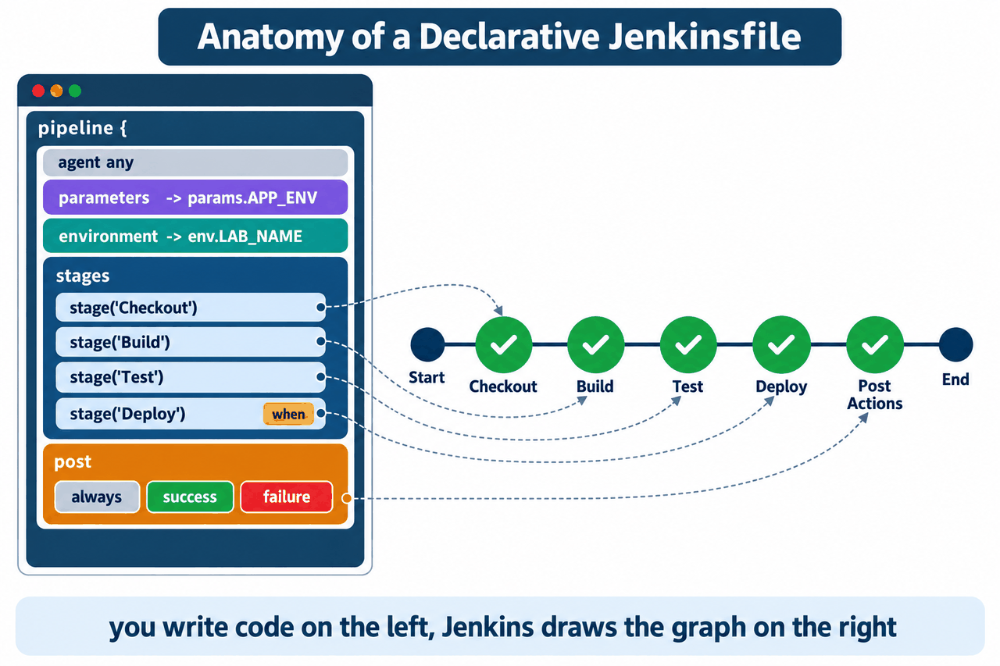

*ภาพที่ 1 โค้ดทางซ้ายถูกแปลงเป็นกราฟทางขวา: แต่ละ `stage` คือหนึ่งโหนด และบล็อก `post` คือโหนด Post Actions*

---

## 📚 ทฤษฎีก่อนลงมือ

### 1. Pipeline as Code

ใน LAB 1 ลำดับงานของ Freestyle job ถูกกำหนดผ่านแบบฟอร์มบนหน้าเว็บ ข้อจำกัดของแนวทางนี้คือการตั้งค่าอยู่ใน UI จึงตรวจทาน (review) เปรียบเทียบ และย้อนเวอร์ชันได้ยาก **Pipeline as Code** แก้ปัญหานี้ด้วยการบรรยายกระบวนการ build ทั้งหมดเป็นข้อความในไฟล์ชื่อ `Jenkinsfile` ซึ่งปฏิบัติต่อได้เหมือนซอร์สโค้ด กล่าวคือ

- **ควบคุมเวอร์ชันได้ (versioned)** — เก็บใน Git ร่วมกับโค้ดของโปรแกรม (จะทำใน LAB 4)
- **ตรวจทานได้ (reviewable)** — การเปลี่ยนขั้นตอน build ผ่าน code review ได้เหมือนโค้ดทั่วไป
- **ทำซ้ำได้ (reproducible)** — Jenkins ตัวใดอ่านไฟล์เดียวกันก็ได้กระบวนการเดียวกัน
- **สังเกตได้ (observable)** — แบ่งเป็น stage ที่มีสถานะแยกกัน จึงระบุจุดที่ล้มเหลวได้ทันที

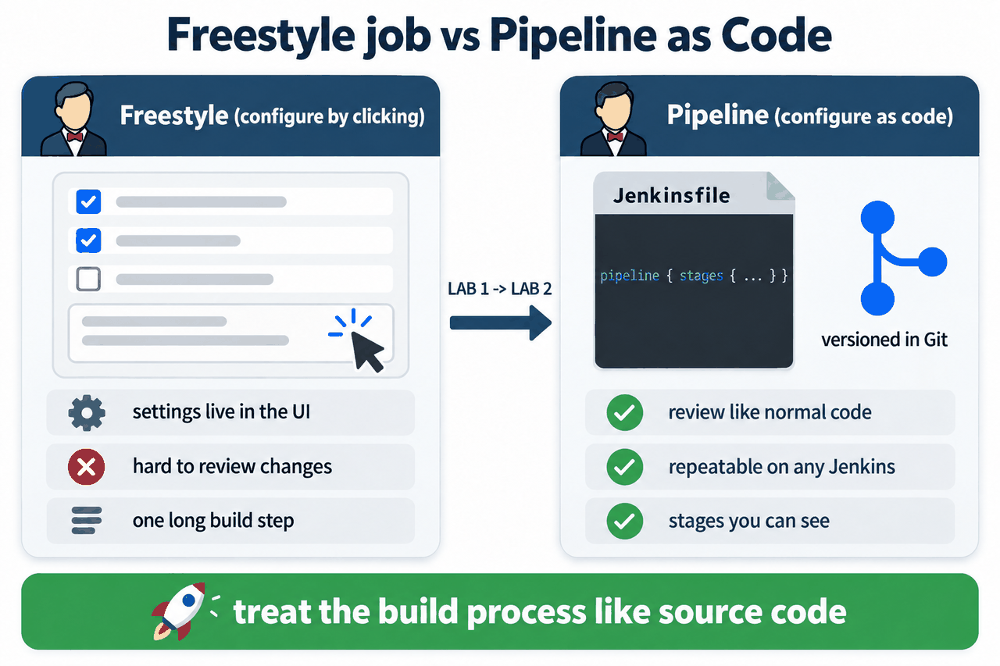

*ภาพที่ 2 จากการตั้งค่าด้วยการคลิก (LAB 1) สู่การตั้งค่าด้วยโค้ด (LAB 2)*

### 2. Declarative Pipeline: โครงสร้างและ directive

Jenkins รองรับ Pipeline สองรูปแบบ คือ **Scripted Pipeline** ซึ่งเป็นโค้ด Groovy ที่ยืดหยุ่นสูง และ **Declarative Pipeline** ซึ่งกำหนดโครงสร้างตายตัวด้วย directive ที่มีความหมายชัดเจน แล็บนี้ใช้แบบ Declarative เพราะอ่านง่าย และ Jenkins ตรวจโครงสร้างได้ก่อนเริ่มทำงาน

| Directive | ตำแหน่ง | หน้าที่ |
|---|---|---|
| `pipeline { }` | บนสุด | ขอบเขตของ Declarative Pipeline ทั้งหมด |
| `agent any` | ใน `pipeline` | ให้รันบน executor ใดก็ได้ที่ว่าง และจัดสรร workspace ให้ |
| `parameters { }` | ใน `pipeline` | ประกาศค่าที่ผู้สั่ง build กรอกได้ อ่านผ่าน `params.NAME` |
| `environment { }` | ใน `pipeline` หรือ `stage` | ประกาศตัวแปรสภาพแวดล้อม อ่านผ่าน `env.NAME` |
| `stages { stage('X') { steps { } } }` | ใน `pipeline` | ลำดับขั้นของงาน แต่ละ stage มี steps ที่ทำจริง |
| `when { }` | ใน `stage` | เงื่อนไขที่ตัดสินว่าจะเข้า stage นั้นหรือข้าม |
| `post { }` | ใน `pipeline` หรือ `stage` | งานที่ทำหลัง stages จบ ตามเงื่อนไขของผลลัพธ์ |

### 3. วงจรชีวิตของการรัน Pipeline หนึ่งครั้ง

เมื่อสั่ง build Jenkins จะ ① รับ trigger พร้อมค่า parameter → ② แปลและตรวจไวยากรณ์ของสคริปต์ (หากผิดจะล้มเหลวก่อนเริ่ม stage แรก) → ③ นำเข้าคิว → ④ จัดสรร executor และ workspace ตาม `agent` → ⑤ ทำ stage ตามลำดับ โดยประเมิน `when` ก่อนเข้าแต่ละ stage → ⑥ ทำบล็อก `post` แล้วบันทึกผลลัพธ์ ทุกขั้นถูกบันทึกลง Console Output ในรูปบรรทัด `[Pipeline] ...`

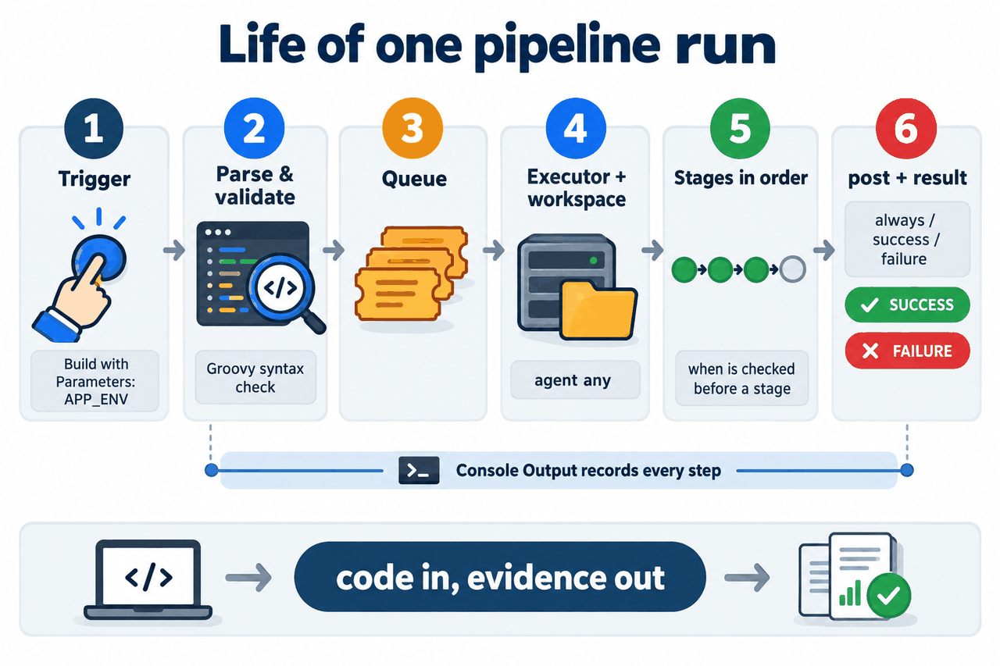

*ภาพที่ 3 จาก trigger ถึงผลลัพธ์: โค้ดเข้า หลักฐานออก*

### 4. ขอบเขตของตัวแปร และการแทนค่าในสตริง

| ประเภท | ประกาศที่ | อ่านด้วย | ตัวอย่างในแล็บ |
|---|---|---|---|
| ตัวแปรที่ Jenkins กำหนดให้ (built-in) | Jenkins ตั้งให้ทุก build | `env.NAME` | `env.JOB_NAME`, `env.BUILD_NUMBER` |
| ตัวแปรที่เราประกาศ | บล็อก `environment` | `env.NAME` | `env.LAB_NAME` |
| พารามิเตอร์ของ build | บล็อก `parameters` | `params.NAME` | `params.APP_ENV` |

> ⚠️ Groovy แทนค่า `${...}` เฉพาะในสตริง **อัญประกาศคู่** `"..."` เท่านั้น สตริงอัญประกาศเดี่ยว `'...'` จะพิมพ์ข้อความตามตัวอักษร ดังนั้น `echo "Build #${env.BUILD_NUMBER}"` แสดงเลข build แต่ `echo 'Build #${env.BUILD_NUMBER}'` แสดงข้อความ `${env.BUILD_NUMBER}` ตรงตัว

### 5. การควบคุมการไหลด้วย `when`

`when` ถูกประเมิน **ก่อน** เข้า stage หากเงื่อนไขเป็นเท็จ stage นั้นจะถูกข้าม (*skipped*) โดยไม่ทำให้ build ล้มเหลว ในแล็บนี้ใช้ `expression { params.APP_ENV == 'prod' }` ซึ่งเป็นการเปรียบเทียบสตริงแบบ **ตรงตัวและแยกตัวพิมพ์ใหญ่–เล็ก (case-sensitive)** จึงมีเพียงค่า `prod` เท่านั้นที่ทำให้ Deploy ทำงาน

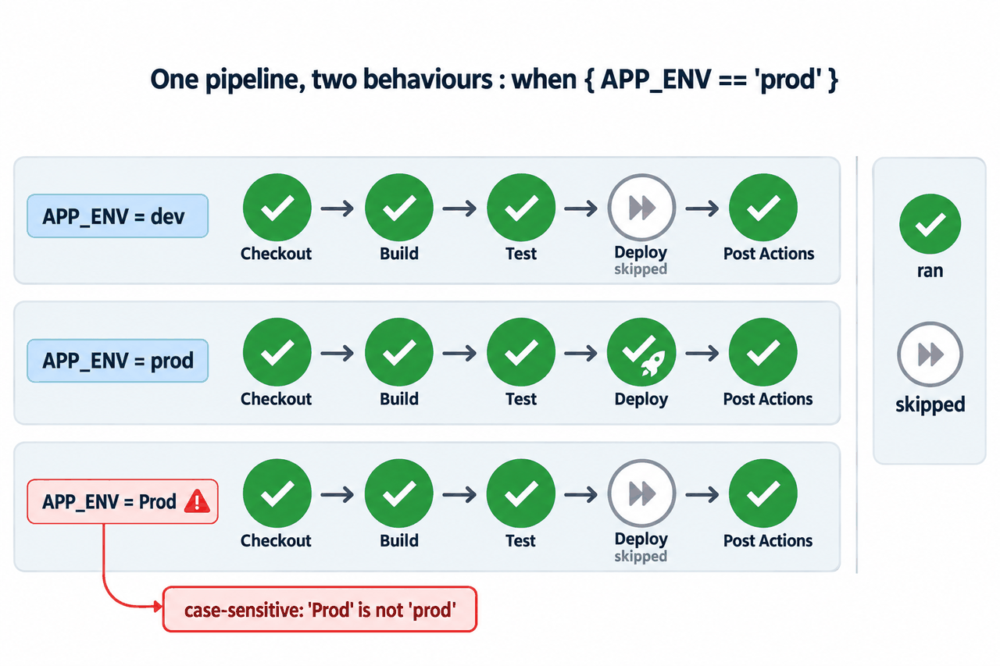

*ภาพที่ 4 Pipeline เดียว พฤติกรรมต่างกันตามค่า parameter — จะพิสูจน์ในการทดลองที่ 6*

Jenkins แยกการข้าม stage ไว้สองกรณีและบันทึกข้อความต่างกัน ได้แก่ `skipped due to when conditional` (เงื่อนไข `when` เป็นเท็จ) และ `skipped due to earlier failure(s)` (มี stage ก่อนหน้าล้มเหลว)

### 6. เงื่อนไขของบล็อก `post` และผลลัพธ์ของ build

บล็อก `post` ทำงานหลัง stages ทั้งหมดจบ โดยเลือกทำตามผลลัพธ์ของ build เหมาะกับงานรายงานผล ทำความสะอาด หรือแจ้งเตือน

| เงื่อนไข | ทำงานเมื่อ |
|---|---|
| `always` | ทุกครั้ง ไม่ว่าผลจะเป็นอะไร |
| `success` | ผลเป็น `SUCCESS` |
| `failure` | ผลเป็น `FAILURE` |
| `unstable`, `changed`, `fixed`, `aborted`, `cleanup` | เงื่อนไขอื่นที่ใช้ได้ (ไม่ใช้ในแล็บนี้) |

step `error 'ข้อความ'` ทำให้ stage ปัจจุบันล้มเหลวทันที stage ถัดไปจะถูกข้าม และ build มีผลเป็น `FAILURE`

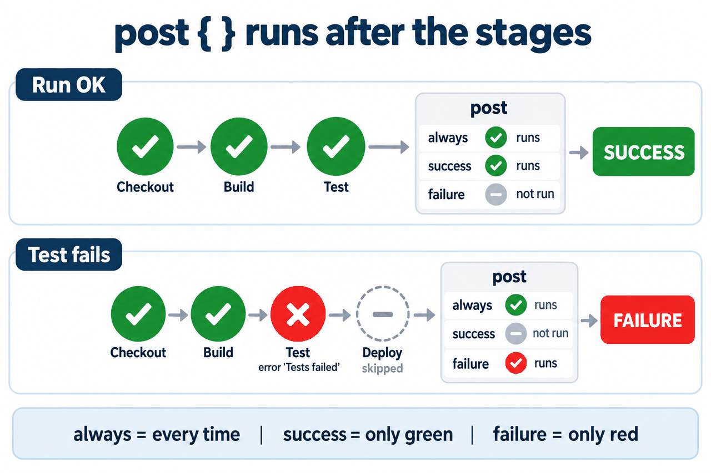

*ภาพที่ 5 บล็อกใดใน `post` ทำงานบ้าง ขึ้นกับว่ารันนั้นเขียวหรือแดง — จะพิสูจน์ในการทดลองที่ 5 และ 7*

### 7. Pipeline Graph View

plugin *Pipeline Graph View* (ติดตั้งมากับ suggested plugins ใน LAB 1) แสดงผลได้สองระดับ

- **ระดับ build** — เมนู **Pipeline Overview** ของ build หนึ่ง ๆ (URL `/job/<job>/<N>/stages/`) แสดงกราฟของรันนั้น คลิก stage เพื่อดู steps
- **ระดับ job** — เมนู **Stages** ของ job (URL `/job/<job>/multi-pipeline-graph/`) แสดงกราฟของทุกรันซ้อนกัน เหมาะกับการเปรียบเทียบ

สัญลักษณ์: ✓ เขียว = สำเร็จ · ✗ แดง = ล้มเหลว · » เทา (เส้นอ้อม) = ข้าม

---

## 🎯 Learning Objectives — ผลลัพธ์การเรียนรู้

เมื่อจบแล็บนี้ นักศึกษาจะสามารถ

1. อธิบายข้อได้เปรียบของ Pipeline as Code เมื่อเทียบกับ Freestyle job ได้
2. เขียน Declarative Pipeline ที่มี `agent`, `stages`, `environment`, `parameters`, `when` และ `post` ได้
3. แยกความแตกต่างของ `env.*` กับ `params.*` และการแทนค่าในสตริงอัญประกาศคู่ได้
4. อ่าน Pipeline Graph และ Console Output เพื่ออธิบายว่า stage ใดทำงาน ถูกข้าม หรือล้มเหลว และเพราะเหตุใด
5. ทำนายได้ว่าบล็อกใดใน `post` จะทำงานเมื่อ build สำเร็จหรือล้มเหลว

## 🗺️ แผนที่ build ของแล็บนี้

แล็บนี้สร้าง build ทั้งหมด 10 ครั้ง ตารางนี้ใช้ตรวจว่าทำมาถูกทาง (ถ้ากด build เกิน หมายเลขจะเลื่อนไป ไม่เป็นปัญหา)

| Build | การทดลอง | สิ่งที่เปลี่ยน | ผลที่ต้องได้ |
|---|---|---|---|
| `#1` | 1–2 | 3 stages | ✓ Checkout, Build, Test |
| `#2` | 3 | `+ environment` | `Building Declarative Pipeline: first-pipeline #2` |
| `#3` | 4 | `+ parameters` (Build Now ครั้งแรก) | `APP_ENV=dev` |
| `#4` | 4 | Build with Parameters | `APP_ENV=staging` |
| `#5` | 5 | `+ post` | `Finished first-pipeline #5`, `Pipeline succeeded` |
| `#6` | 6 | `+ Deploy / when`, `APP_ENV=dev` | Deploy **ข้าม** |
| `#7` | 6 | `APP_ENV=prod` | Deploy **ทำงาน** |
| `#8` | 6 | `APP_ENV=Prod` | Deploy **ข้าม** (case-sensitive) |
| `#9` | 7 | Test ใช้ `error` | ✗ `FAILURE`, Deploy ข้าม |
| `#10` | 7 | แก้กลับ, `APP_ENV=prod` | ✓ ทุกช่อง |

---

## สภาพตั้งต้น

ต้องมีสถานะจบ LAB 1: คอนเทนเนอร์ `devtools-jenkins` ทำงาน และมีคอนเทนเนอร์ `jenkins` อยู่ภายใน

```bash
docker ps
docker exec devtools-jenkins docker ps
```

✅ **สิ่งที่ต้องเห็น** (ตัดเฉพาะแถวที่เกี่ยวข้อง):

```text
CONTAINER ID   IMAGE                         ...   NAMES
...            tuchsanai/devtools:2569_1     ...   devtools-jenkins
CONTAINER ID   IMAGE                         ...   NAMES
...            jenkins/jenkins:lts-jdk21     ...   jenkins
```

เปิด http://localhost:8080 และเข้าสู่ระบบด้วย `admin` / `admin2569`

> ยังไม่มี? ย้อนไปทำ [LAB 1](../001_LAB_Jenkins_On_Docker/README.md) ก่อน (ใช้เวลาประมาณ 40 นาที)

---

## การทดลองที่ 1 — สร้าง Pipeline job ที่มี 3 stages

**คำถาม:** Pipeline job ที่มี Checkout, Build และ Test สร้างจากหน้า Jenkins อย่างไร

**1.1) Dashboard → New Item** กรอกชื่อ `first-pipeline` เลือก **Pipeline** แล้วกด **OK**


*ภาพที่ 6 ต้องเลือกชนิด **Pipeline** ไม่ใช่ Freestyle project*

**1.2) เลื่อนไปหัวข้อ Pipeline** ตรวจว่า **Definition = Pipeline script** แล้ววางสคริปต์ต่อไปนี้ในช่อง **Script**

```groovy
pipeline {
  agent any

  stages {
    stage('Checkout') {
      steps {
        echo 'Checkout (simulated)'
        sleep 1
      }
    }
    stage('Build') {
      steps {
        echo 'Build'
        sleep 1
      }
    }
    stage('Test') {
      steps {
        echo 'Tests passed'
        sleep 1
      }
    }
  }
}
```


*ภาพที่ 7 Definition เป็น Pipeline script และโค้ด 3 stages อยู่ในช่อง Script*

**1.3) กด Save** → หน้า `first-pipeline` เปิดขึ้น และยังไม่มี build

> 📝 ช่อง Script มีตัวช่วย *try sample Pipeline…* และลิงก์ *Pipeline Syntax* สำหรับสร้างโค้ด step ต่าง ๆ ใช้ศึกษาต่อได้

---

## การทดลองที่ 2 — อ่าน Pipeline Graph

**คำถาม:** จะรู้ได้อย่างไรว่าแต่ละ stage สำเร็จและเรียงลำดับถูกต้อง

**2.1) กด Build Now** รอจน `#1` เป็นสีเขียว แล้วคลิก `#1` → เมนู **Pipeline Overview**


*ภาพที่ 8 ใน Jenkins รุ่นนี้ เมนูกราฟของ build ชื่อ **Pipeline Overview***


*ภาพที่ 9 กราฟ Start → Checkout → Build → Test → End ทุกโหนดเป็นสีเขียว คลิกแต่ละ stage เพื่อดู steps ที่อยู่ข้างใน*

✅ **ผลการทดลองจริง** (Console Output ของ `#1`, ตัดบางส่วน):

```text
[Pipeline] { (Checkout)
[Pipeline] echo
Checkout (simulated)
[Pipeline] sleep
Sleeping for 1 sec
[Pipeline] }
[Pipeline] // stage
[Pipeline] { (Build)
...
[Pipeline] { (Test)
[Pipeline] echo
Tests passed
...
[Pipeline] End of Pipeline
Finished: SUCCESS
```

🔍 **ตีความ:** บรรทัด `[Pipeline] { (ชื่อ stage)` คือจุดเริ่มของ stage และ `[Pipeline] // stage` คือจุดจบ ตรงกับวงเล็บปีกกาในโค้ด แต่ละ stage ใช้เวลาประมาณ 1 วินาทีตาม `sleep 1` รวมทั้ง build ประมาณ 4–5 วินาที

---

## การทดลองที่ 3 — `environment`: ให้ข้อความรู้จัก build

**คำถาม:** จะพิมพ์ตัวแปรของเรา ชื่อ job และหมายเลข build ใน stage ได้อย่างไร

**3.1) Configure → วางสคริปต์ฉบับเต็มนี้แทนของเดิม → Save → Build Now**

```groovy
pipeline {
  agent any

  environment {
    LAB_NAME = 'Declarative Pipeline'
  }

  stages {
    stage('Checkout') {
      steps {
        echo 'Checkout (simulated)'
        sleep 1
      }
    }
    stage('Build') {
      steps {
        echo "Building ${env.LAB_NAME}: ${env.JOB_NAME} #${env.BUILD_NUMBER}"
        sleep 1
      }
    }
    stage('Test') {
      steps {
        echo 'Tests passed'
        sleep 1
      }
    }
  }
}
```


*ภาพที่ 10 บล็อก `environment` ประกาศ `LAB_NAME` และบรรทัด `echo` ใช้อัญประกาศคู่เพื่อแทนค่า*

**3.2) เปิด Console Output ของ `#2`**


*ภาพที่ 11 ข้อความรวมค่าจากสามแหล่ง: `LAB_NAME` (เราประกาศ), `JOB_NAME` และ `BUILD_NUMBER` (Jenkins กำหนด)*

✅ **ผลการทดลองจริง:**

```text
[Pipeline] { (Build)
[Pipeline] echo
Building Declarative Pipeline: first-pipeline #2
```

---

## การทดลองที่ 4 — `parameters`: รับค่าจากผู้สั่ง build

**คำถาม:** ผู้กด build จะเลือก environment โดยไม่ต้องแก้สคริปต์ได้อย่างไร

**4.1) Configure → วางสคริปต์ฉบับเต็มนี้ → Save**

```groovy
pipeline {
  agent any

  parameters {
    string(name: 'APP_ENV', defaultValue: 'dev', description: 'Environment to deploy')
  }

  environment {
    LAB_NAME = 'Declarative Pipeline'
  }

  stages {
    stage('Checkout') {
      steps {
        echo 'Checkout (simulated)'
        sleep 1
      }
    }
    stage('Build') {
      steps {
        echo "Building ${env.LAB_NAME}: ${env.JOB_NAME} #${env.BUILD_NUMBER}"
        echo "APP_ENV=${params.APP_ENV}"
        sleep 1
      }
    }
    stage('Test') {
      steps {
        echo 'Tests passed'
        sleep 1
      }
    }
  }
}
```


*ภาพที่ 12 ประกาศ `APP_ENV` (ค่าเริ่มต้น `dev`) และอ่านด้วย `params.APP_ENV`*

**4.2) สังเกตเมนู — ยังเป็น Build Now** เพราะ Jenkins ยังไม่ได้รันสคริปต์ใหม่ จึงยังไม่รู้จัก parameter กด **Build Now** หนึ่งครั้ง (ได้ `#3`, ใช้ค่าเริ่มต้น `APP_ENV=dev`)


*ภาพที่ 13 ก่อน build ครั้งแรกหลังเพิ่ม `parameters` เมนูยังเป็น Build Now*


*ภาพที่ 14 หลัง `#3` เมนูเปลี่ยนเป็น **Build with Parameters***

🔍 **ตีความ:** นิยาม parameter อยู่ *ในสคริปต์* Jenkins จะอ่านและบันทึกเป็นการตั้งค่าของ job เมื่อสคริปต์ถูกรันแล้วหนึ่งครั้ง เปิด **Configure** จะเห็นว่า *This project is parameterized* ถูกเลือกให้เองตามโค้ด


*ภาพที่ 15 Name `APP_ENV`, Default Value `dev` มาจากโค้ด ไม่ต้องกรอกเอง*

**4.3) Build with Parameters → เปลี่ยนค่าเป็น `staging` → Build** (ได้ `#4`)


*ภาพที่ 16 ค่าที่กรอกในแบบฟอร์มถูกส่งเข้า `params.APP_ENV`*


*ภาพที่ 17 build `#4` ได้รับค่า `staging` จากแบบฟอร์ม*

✅ **ผลการทดลองจริง:**

```text
APP_ENV=dev       ← #3 (Build Now ครั้งแรก ใช้ค่าเริ่มต้น)
APP_ENV=staging   ← #4 (Build with Parameters)
```

---

## การทดลองที่ 5 — `post`: งานหลัง stages จบ

**คำถาม:** จะให้ข้อความหนึ่งทำงานเสมอ และอีกข้อความทำงานเฉพาะเมื่อสำเร็จได้อย่างไร

**5.1) Configure → วางสคริปต์ฉบับเต็มนี้ → Save → Build with Parameters (คง `dev`) → Build** (ได้ `#5`)

```groovy
pipeline {
  agent any

  parameters {
    string(name: 'APP_ENV', defaultValue: 'dev', description: 'Environment to deploy')
  }

  environment {
    LAB_NAME = 'Declarative Pipeline'
  }

  stages {
    stage('Checkout') {
      steps {
        echo 'Checkout (simulated)'
        sleep 1
      }
    }
    stage('Build') {
      steps {
        echo "Building ${env.LAB_NAME}: ${env.JOB_NAME} #${env.BUILD_NUMBER}"
        echo "APP_ENV=${params.APP_ENV}"
        sleep 1
      }
    }
    stage('Test') {
      steps {
        echo 'Tests passed'
        sleep 1
      }
    }
  }

  post {
    always {
      echo "Finished ${env.JOB_NAME} #${env.BUILD_NUMBER}"
    }
    success {
      echo 'Pipeline succeeded'
    }
    failure {
      echo 'Pipeline failed - look for the red stage'
    }
  }
}
```


*ภาพที่ 18 บล็อก `post` มีสามเงื่อนไข: `always`, `success`, `failure`*

**5.2) เปิด Console Output ของ `#5` แล้วเลื่อนลงไปส่วน Declarative: Post Actions**


*ภาพที่ 19 `always` และ `success` ทำงาน ส่วน `failure` ไม่ทำงานเพราะ build สำเร็จ*

✅ **ผลการทดลองจริง:**

```text
[Pipeline] { (Declarative: Post Actions)
[Pipeline] echo
Finished first-pipeline #5
[Pipeline] echo
Pipeline succeeded
...
Finished: SUCCESS
```

🔍 **ตีความ:** ไม่มีข้อความ `Pipeline failed ...` ใน log ทั้งที่อยู่ในโค้ด แสดงว่าเงื่อนไข `failure` ถูกประเมินแล้วเป็นเท็จ — จะเห็นกรณีกลับกันในการทดลองที่ 7

---

## การทดลองที่ 6 — `when`: Deploy เฉพาะ prod

**คำถาม:** จะข้าม Deploy สำหรับ dev แต่ทำจริงสำหรับ prod ได้อย่างไร และถ้าพิมพ์ `Prod` จะเกิดอะไรขึ้น

**6.1) Configure → วางสคริปต์ฉบับเต็มนี้ → Save** (ไฟล์นี้ตรงกับ [`Jenkinsfile`](./Jenkinsfile) ทุกตัวอักษร)

```groovy
pipeline {
  agent any

  parameters {
    string(name: 'APP_ENV', defaultValue: 'dev', description: 'Environment to deploy')
  }

  environment {
    LAB_NAME = 'Declarative Pipeline'
  }

  stages {
    stage('Checkout') {
      steps {
        echo 'Checkout (simulated)'
        sleep 1
      }
    }
    stage('Build') {
      steps {
        echo "Building ${env.LAB_NAME}: ${env.JOB_NAME} #${env.BUILD_NUMBER}"
        echo "APP_ENV=${params.APP_ENV}"
        sleep 1
      }
    }
    stage('Test') {
      steps {
        echo 'Tests passed'
        sleep 1
      }
    }
    stage('Deploy') {
      when {
        expression { params.APP_ENV == 'prod' }
      }
      steps {
        echo "Deploying to ${params.APP_ENV}"
        sleep 1
      }
    }
  }

  post {
    always {
      echo "Finished ${env.JOB_NAME} #${env.BUILD_NUMBER}"
    }
    success {
      echo 'Pipeline succeeded'
    }
    failure {
      echo 'Pipeline failed - look for the red stage'
    }
  }
}
```

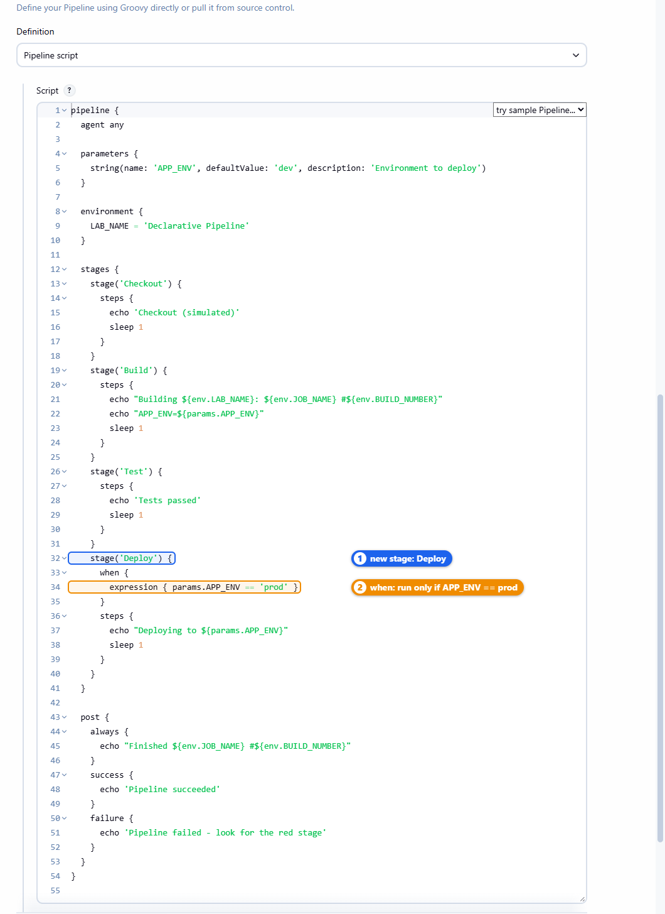

*ภาพที่ 20 stage `Deploy` มี `when` ที่เปรียบเทียบ `params.APP_ENV` กับ `'prod'`*

**6.2) ทำนายก่อนทดลอง** — เติมคอลัมน์ “คาดว่า” ก่อน แล้วค่อยรันเพื่อตรวจ

| Build | ค่า `APP_ENV` | คาดว่า Deploy จะ… | ผลจริง |
|---|---|---|---|
| `#6` | `dev` | ? | ข้าม |
| `#7` | `prod` | ? | ทำงาน |
| `#8` | `Prod` (P ตัวใหญ่) | ? | ข้าม |

**6.3) Build with Parameters สามครั้งด้วยค่า `dev`, `prod`, `Prod`** แล้วเปิด **Pipeline Overview** ของแต่ละ build

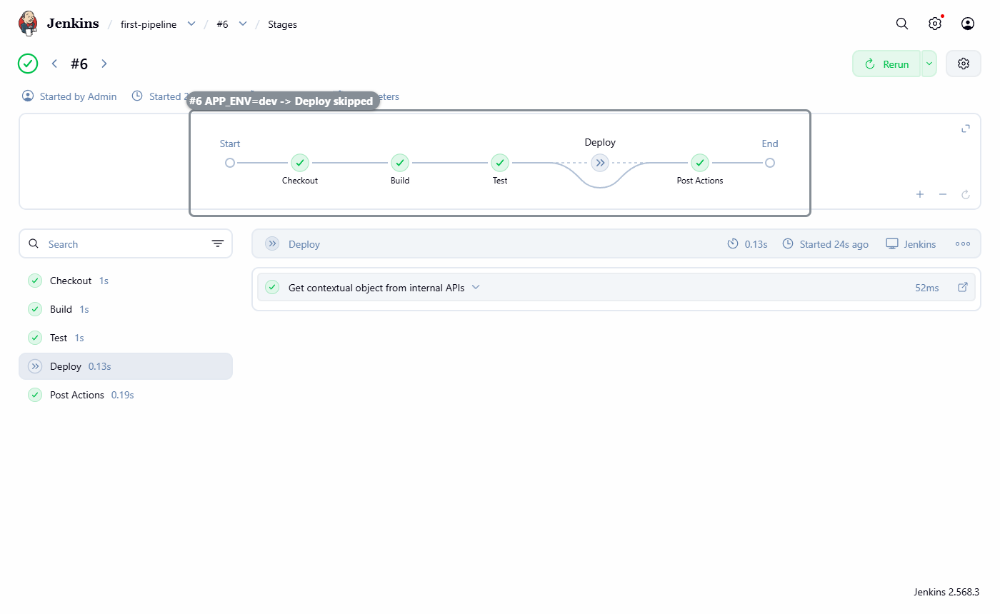

*ภาพที่ 21 `#6` (`dev`): โหนด Deploy เป็นสีเทาพร้อมเส้นอ้อม = ถูกข้าม แต่ build ยังสำเร็จ*

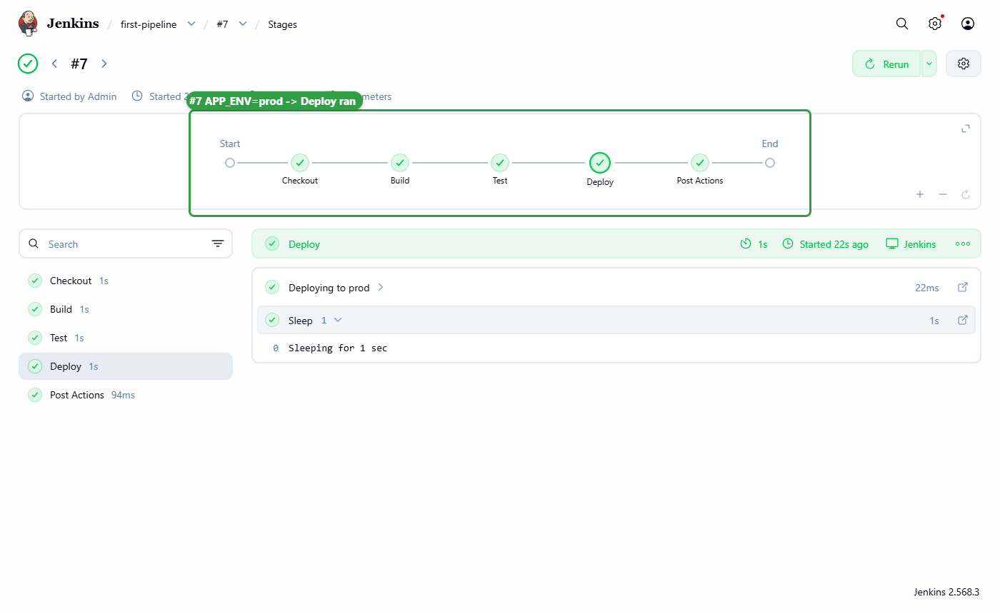

*ภาพที่ 22 `#7` (`prod`): Deploy เป็นสีเขียว และแสดง step `Deploying to prod`*

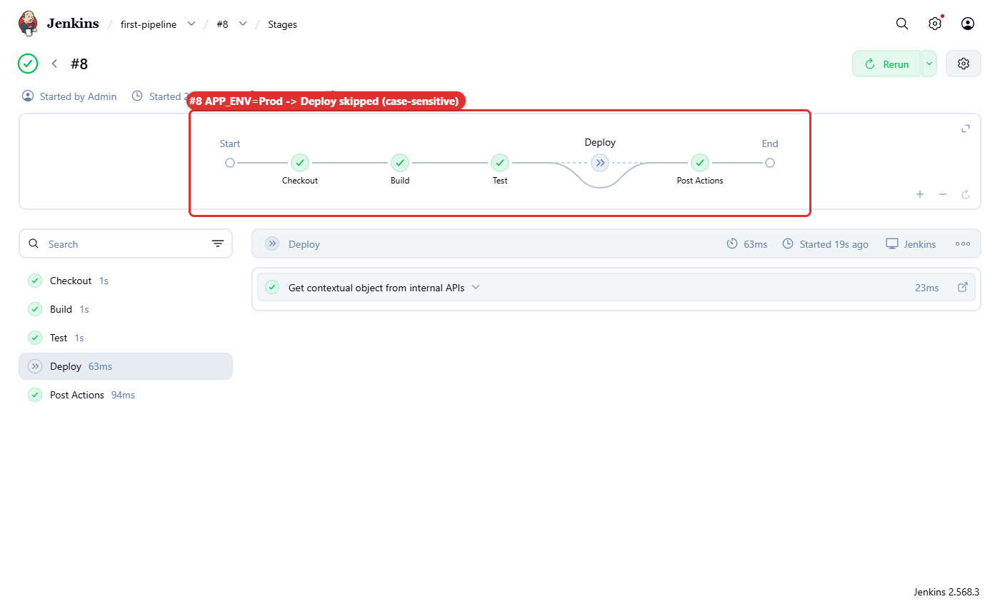

*ภาพที่ 23 `#8` (`Prod`): Deploy ถูกข้ามเหมือน dev เพราะการเปรียบเทียบแยกตัวพิมพ์ใหญ่–เล็ก*

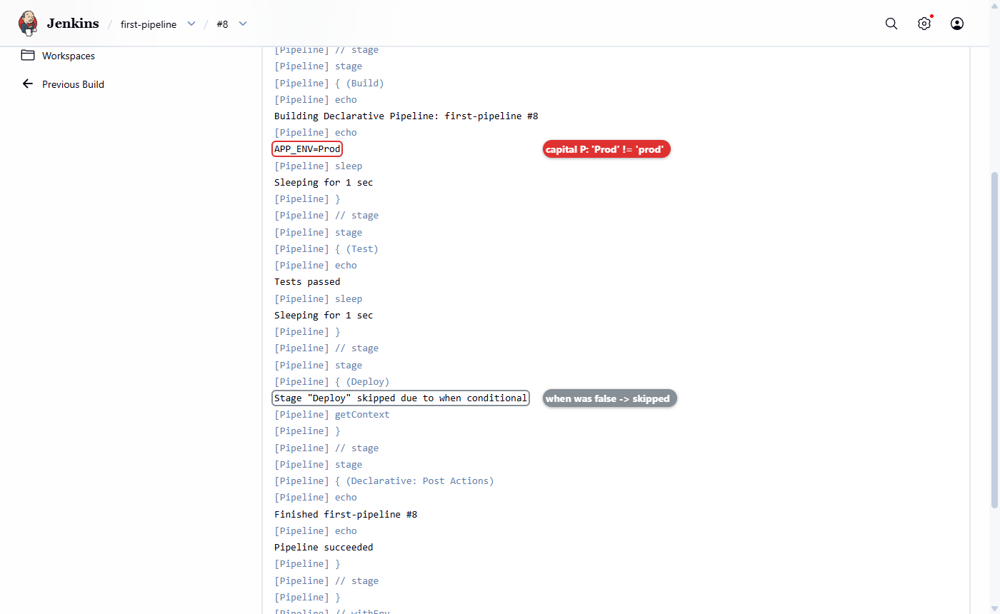

*ภาพที่ 24 Console Output ระบุเหตุผลของการข้ามไว้ชัดเจน*

✅ **ผลการทดลองจริง** (บรรทัดที่เกี่ยวข้องจาก Console Output):

```text
#6  APP_ENV=dev   →  Stage "Deploy" skipped due to when conditional
#7  APP_ENV=prod  →  Deploying to prod
#8  APP_ENV=Prod  →  Stage "Deploy" skipped due to when conditional
```

และผลจาก API `/stages/tree`:

```text
#6  Checkout=success Build=success Test=success Deploy=skipped Post Actions=success
#7  Checkout=success Build=success Test=success Deploy=success Post Actions=success
#8  Checkout=success Build=success Test=success Deploy=skipped Post Actions=success
```

> 💡 **แนวทางปรับปรุง:** ความผิดพลาดแบบ `#8` ป้องกันได้ด้วย `choice(name: 'APP_ENV', choices: ['dev', 'staging', 'prod'])` ซึ่งให้ผู้ใช้เลือกจากรายการแทนการพิมพ์เอง (ทดสอบแล้วบน Jenkins รุ่นเดียวกัน: ค่าแรกในรายการ `dev` เป็นค่าเริ่มต้นของ build แรก)

---

## การทดลองที่ 7 — ทำให้ stage ล้มเหลว แล้วแก้กลับ

**คำถาม:** เมื่อ Test ล้มเหลว stage ถัดไปและบล็อก `post` จะทำงานอย่างไร

**7.1) Configure → ในสคริปต์ฉบับเต็มของการทดลองที่ 6 เปลี่ยนบรรทัดเดียวใน stage `Test`** แล้วกด Save

```groovy
        echo 'Tests passed'      // ← เดิม
        error 'Tests failed'     // ← เปลี่ยนเป็นบรรทัดนี้
```

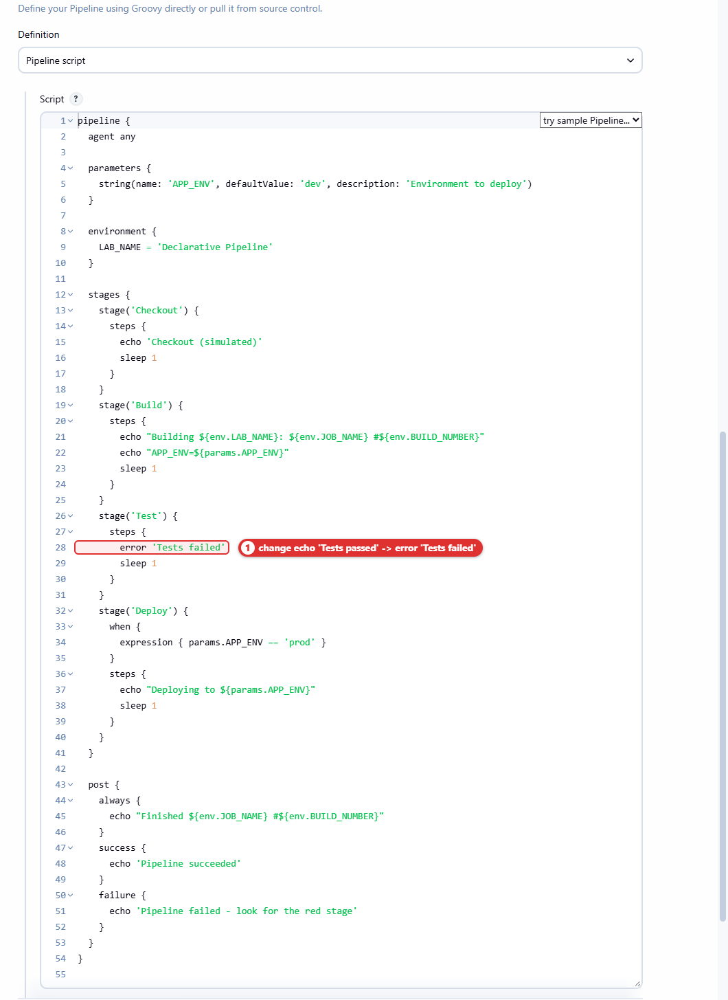

*ภาพที่ 25 step `error` จำลองสถานการณ์ที่ชุดทดสอบไม่ผ่าน*

**7.2) Build with Parameters ด้วย `prod`** (ได้ `#9`) — ใช้ `prod` เพื่อพิสูจน์ว่าแม้ `when` จะเป็นจริง Deploy ก็ยังไม่ทำงาน

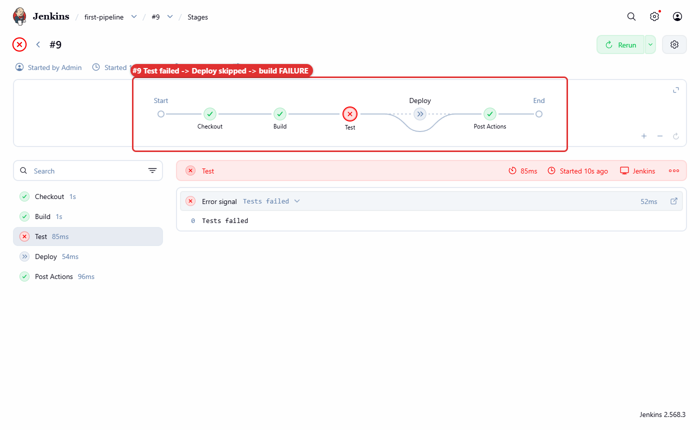

*ภาพที่ 26 Test เป็นสีแดง Deploy ถูกข้าม และไอคอนของ build `#9` เป็น ✗*

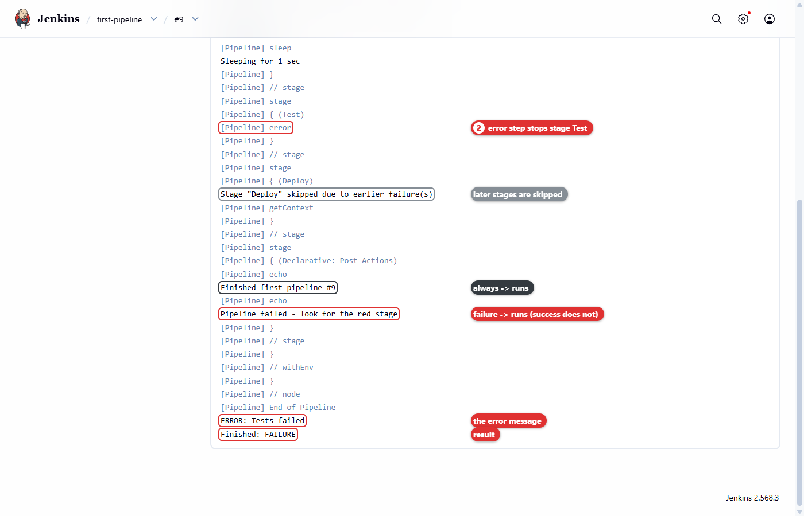

*ภาพที่ 27 `always` และ `failure` ทำงาน ส่วน `success` ไม่ทำงาน*

✅ **ผลการทดลองจริง:**

```text
[Pipeline] { (Test)
[Pipeline] error
...
Stage "Deploy" skipped due to earlier failure(s)
...
[Pipeline] { (Declarative: Post Actions)
Finished first-pipeline #9
Pipeline failed - look for the red stage
...
ERROR: Tests failed
Finished: FAILURE
```

🔍 **ตีความ:** เปรียบเทียบกับการทดลองที่ 6 — Deploy ถูกข้ามด้วยเหตุผลต่างกัน (`earlier failure(s)` ไม่ใช่ `when conditional`) นี่คือกลไก **fail fast** ของ CI คือหยุดไม่ให้โค้ดที่ทดสอบไม่ผ่านถูก deploy และยังส่งรายงานผ่าน `post` ได้ตามปกติ

**7.3) แก้กลับ:** Configure → เปลี่ยน `error 'Tests failed'` กลับเป็น `echo 'Tests passed'` (หรือวางสคริปต์ฉบับเต็มของการทดลองที่ 6 ใหม่) → Save → Build with Parameters ด้วย `prod` (ได้ `#10` ซึ่งเขียวทุกช่อง)

---

## การทดลองที่ 8 — มองภาพรวมทุกรัน และตรวจผลปิดแล็บ

**8.1) ที่หน้า `first-pipeline` เลือกเมนู Stages** (กราฟระดับ job)


*ภาพที่ 28 ประวัติ `#1–#10` ในหน้าเดียว เห็นการเติบโตของ Pipeline ตั้งแต่ 3 stages จนถึง 5 ช่อง และเห็นรันที่ข้ามหรือล้มเหลวได้ทันที*

**8.2) ตรวจผลผ่าน REST API** (รันใน shell ของ devtools)

```bash
curl -s -u admin:admin2569 "http://localhost:8080/job/first-pipeline/lastBuild/api/json?tree=number,result"; echo
curl -s -u admin:admin2569 "http://localhost:8080/job/first-pipeline/lastBuild/stages/tree" \
  | python3 -c 'import json,sys; [print(s["name"], s["state"]) for s in json.load(sys.stdin)["data"]["stages"]]'
```

✅ **ผลการทดลองจริง:**

```text
{"_class":"org.jenkinsci.plugins.workflow.job.WorkflowRun","number":10,"result":"SUCCESS"}
Checkout success
Build success
Test success
Deploy success
Post Actions success
```

> 📝 endpoint `/stages/tree` มาจาก plugin Pipeline Graph View จึงให้ข้อมูลเดียวกับกราฟบนหน้าเว็บ ลองเปลี่ยน `lastBuild` เป็น `9` จะได้ `Test failure` และ `Deploy skipped`

**Checklist ปิดแล็บ**

- [ ] มี Pipeline job ชื่อ `first-pipeline` ที่กำหนดงานด้วยสคริปต์
- [ ] build ล่าสุดเป็น `SUCCESS` และทั้ง 5 ช่องเป็น `success`
- [ ] อธิบายได้ว่าทำไม Deploy ของ `#6`, `#8` และ `#9` ถูกข้าม และเหตุผลต่างกันอย่างไร
- [ ] อธิบายได้ว่าบล็อกใดใน `post` ทำงานใน `#5` และ `#9`

## 📊 สรุปผลการทดลองจริง

ทดสอบเมื่อ 25 ก.ย. 2569 บน Jenkins **2.568.3** ต่อจากสถานะจบ LAB 1

| Build | APP_ENV | Checkout | Build | Test | Deploy | Post Actions | ผล |
|---|---|---|---|---|---|---|---|
| `#1` | – | success | success | success | – | – | SUCCESS |
| `#2` | – | success | success | success | – | – | SUCCESS |
| `#3` | dev | success | success | success | – | – | SUCCESS |
| `#4` | staging | success | success | success | – | – | SUCCESS |
| `#5` | dev | success | success | success | – | success | SUCCESS |
| `#6` | dev | success | success | success | **skipped** | success | SUCCESS |
| `#7` | prod | success | success | success | **success** | success | SUCCESS |
| `#8` | Prod | success | success | success | **skipped** | success | SUCCESS |
| `#9` | prod | success | success | **failure** | **skipped** | success | **FAILURE** |
| `#10` | prod | success | success | success | success | success | SUCCESS |

แต่ละ build ใช้เวลาประมาณ 3–5 วินาที (ส่วนใหญ่มาจาก `sleep 1` ในแต่ละ stage)

## 🤔 คำถามทบทวน

1. ถ้าเปลี่ยนบรรทัดใน stage `Build` เป็น `echo 'Building ${env.LAB_NAME}'` (อัญประกาศเดี่ยว) Console Output จะแสดงอะไร เพราะเหตุใด
2. Deploy ของ `#8` และ `#9` ถูกข้ามทั้งคู่ แต่ด้วยเหตุผลต่างกัน จงอธิบายโดยอ้างอิงข้อความใน Console Output
3. หากต้องการส่งข้อความแจ้งเตือนทั้งเมื่อ build สำเร็จและล้มเหลว ควรวางคำสั่งไว้ในเงื่อนไขใดของ `post`
4. ทำไม Jenkins จึงแสดง Build with Parameters หลังจากรันสคริปต์ที่มี `parameters` ไปแล้วหนึ่งครั้งเท่านั้น
5. จงแก้ `parameters` ให้ใช้ `choice` แทน `string` แล้วอธิบายว่าช่วยป้องกันปัญหาแบบ `#8` ได้อย่างไร

## แก้ปัญหาที่พบบ่อย

| อาการ | สาเหตุ | วิธีแก้ |
|---|---|---|
| เปิด `localhost:8080` ไม่ได้ | devtools หรือ Jenkins ภายในยังไม่ทำงาน | `docker start devtools-jenkins` รอ ~20 วินาที แล้วตรวจ `docker exec devtools-jenkins docker ps` |
| ถูกส่งกลับไปหน้า Sign in | session หมดอายุหลัง restart | เข้าสู่ระบบด้วย `admin` / `admin2569` |
| หาเมนู Stages ในหน้า build ไม่เจอ | Jenkins รุ่นนี้ตั้งชื่อเมนูระดับ build ว่า **Pipeline Overview** | ระดับ build ใช้ Pipeline Overview · ระดับ job ใช้ Stages |
| ไม่มีเมนู Build with Parameters | Jenkins ยังไม่ได้รันสคริปต์ที่มี `parameters` | กด Build Now หนึ่งครั้งหลัง Save แล้วกลับไปหน้า job |
| Deploy ถูกข้ามทั้งที่ใส่ prod | พิมพ์ `Prod`, `PROD` หรือมีช่องว่างเกิน | ใส่ `prod` ตัวพิมพ์เล็กทั้งหมด หรือใช้ `choice` parameter |
| Console แสดง `${env.BUILD_NUMBER}` ตรงตัว | ใช้อัญประกาศเดี่ยว | เปลี่ยนเป็นอัญประกาศคู่ `"..."` |
| build ล้มเหลวทันทีโดยไม่มี stage ใดทำงาน และ log มี `WorkflowScript: 9: expecting '}', found ''` | ไวยากรณ์ผิด เช่น ปีกกาไม่ครบคู่ (ตัวเลขคือหมายเลขบรรทัด) | วางสคริปต์ฉบับเต็มใหม่ทั้งหมด แล้วตรวจวงเล็บให้ครบคู่ |
| API ตอบ 401 | ไม่ได้ใส่หรือใส่รหัสผ่านผิด | ใช้ `-u admin:admin2569` |

➡️ **แล็บถัดไป:** [LAB 3 — Docker Build & Push](../003_LAB_Docker_Build_Push/README.md)
