# LAB 2 — เขียน Declarative Pipeline แรก

> ⏱️ ประมาณ 45 นาที · 🧪 7 การทดลอง · 🎯 จบเมื่อสังเกตผลของ `dev`, `prod`, `Prod` ในการทดลองที่ 7 แล้ว และ `first-pipeline` build ล่าสุดเป็น `prod` ที่ `SUCCESS` และทั้ง 5 ช่อง (Checkout, Build, Test, Deploy, Post Actions) เป็นสีเขียว

แล็บนี้ให้เราเขียน **Declarative Pipeline** เป็นครั้งแรก แทนการตั้งค่า Freestyle job ด้วยการคลิกแบบใน LAB 1 — **Pipeline** คือการเขียนขั้นตอนการทำงานเป็นโค้ด (process as code) จึงอ่าน แก้ไข และเก็บเวอร์ชันได้เหมือนโค้ดทั่วไป โครงสร้างหลักมีแค่นี้

```groovy
pipeline {                 // ขอบเขตของ Pipeline ทั้งหมด
  agent any                // รันบน executor ใดก็ได้ที่ว่าง
  stages {                 // รวมทุกขั้นของงาน
    stage('Build') {       // หนึ่งขั้น = หนึ่งช่องใน Pipeline Graph
      steps {              // คำสั่งที่ทำจริง
        echo "Build #${env.BUILD_NUMBER}"
      }
    }
  }
}
```

จากนั้นจะเติมทีละส่วน: ตัวแปร `environment` (อ่านด้วย `env.NAME`) และ `parameters` (อ่านด้วย `params.NAME`) — การแทนค่า `${...}` ทำงานเฉพาะในสตริงอัญประกาศคู่ `"..."` — ต่อด้วย `post` และ `when` ซึ่งจะอธิบายในการทดลองที่ใช้จริง

---

## 🎯 Learning Objectives — ผลลัพธ์การเรียนรู้

เมื่อจบแล็บนี้ นักศึกษาจะสามารถ

1. สร้าง Pipeline job และเขียน Declarative Pipeline ด้วย `pipeline`, `agent`, `stages`, `stage` และ `steps` ได้
2. ใช้ `environment` (`env.*`) และ `parameters` (`params.*`) พร้อมการแทนค่าในสตริงอัญประกาศคู่ได้
3. ใช้ `post` และ `when` เพื่อกำหนดงานหลัง build และการข้าม stage ได้
4. อ่าน Pipeline Graph และ Console Output เพื่ออธิบายว่า stage ใดทำงาน ถูกข้าม หรือล้มเหลว

---

## 0. สิ่งที่ต้องมีก่อนเริ่ม

- ทำ **LAB 1 สำเร็จแล้ว** และ clone รีโพไว้ที่ `~/labwork/DevTools` แล้ว
- ใช้เครื่องเรียน `devtools` และ Jenkins ตัวเดิมจาก LAB 1 — **ไม่ต้องลบ ไม่ต้องสร้างใหม่**

ถ้าปิดเครื่องไปแล้ว ให้กลับเข้าเครื่องเรียนจากเครื่องของเรา :

```bash
docker start devtools            # ถ้ารันอยู่แล้วก็ไม่เป็นไร
ssh root@localhost -p 2222       # password : passwd
```

> ⚠️ **ห้าม `docker rm -f devtools`** — Jenkins และประวัติ build ทั้งหมดอยู่ข้างในกล่องนี้ ลบแล้วต้องเริ่ม LAB 1 ใหม่

---

## 1. เข้าโฟลเดอร์แล็บ แล้วเปิด Jenkins

พิมพ์**ข้างในเครื่องเรียน** :

```bash
cd ~/labwork/DevTools/04_Jenkins/001_Jenikin/002_LAB_Declarative_Pipeline
```

เข้าสู่ระบบ Jenkins :

1. เปิด http://localhost:8080
2. กรอก **Username** `admin`
3. กรอก **Password** `admin2569`

   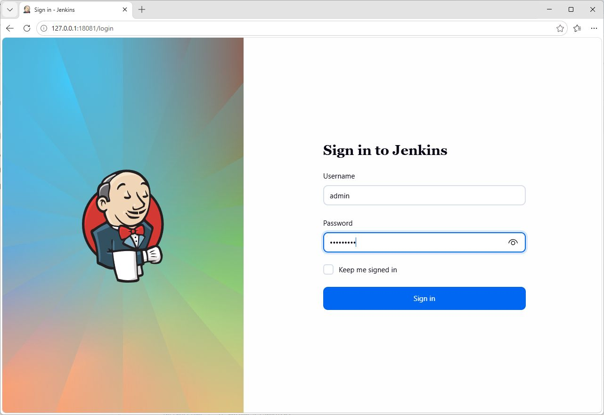

   *ภาพหน้า Sign in: Username เป็น `admin` รหัสผ่านถูกซ่อนเป็นจุด แล้วกด **Sign in** (พอร์ต 18081 ในภาพเป็น tunnel สำหรับจับภาพ นักศึกษายังใช้ `localhost:8080`)*

4. กด **Sign in**
5. เมื่อเห็นหน้า Dashboard แล้ว ไปสร้าง Pipeline job ในการทดลองที่ 1

---

## การทดลองที่ 1 — สร้าง Pipeline job ที่มี 3 stages

**คำถาม:** Pipeline job ที่มี Checkout, Build และ Test สร้างจากหน้า Jenkins อย่างไร

**1.1) Dashboard → New Item** กรอกชื่อ `first-pipeline` เลือก **Pipeline** แล้วกด **OK**

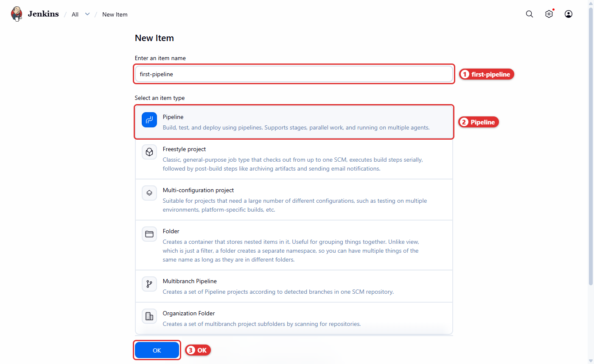

*ภาพที่ 1 ต้องเลือกชนิด **Pipeline** ไม่ใช่ Freestyle project*

**1.2) เลื่อนไปหัวข้อ Pipeline** ตรวจว่า **Definition = Pipeline script** แล้ววางสคริปต์ต่อไปนี้ในช่อง **Script**

```groovy
pipeline {
  agent any

  stages {
    stage('Checkout') {
      steps {
        echo 'Checkout (simulated)'
        sleep 1
      }
    }
    stage('Build') {
      steps {
        echo 'Build'
        sleep 1
      }
    }
    stage('Test') {
      steps {
        echo 'Tests passed'
        sleep 1
      }
    }
  }
}
```

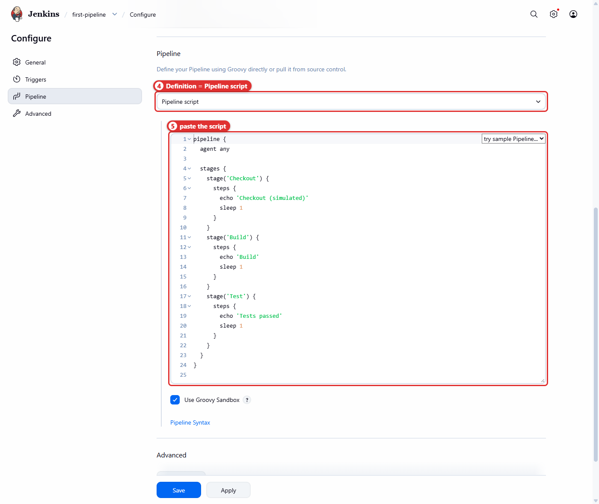

*ภาพที่ 2 Definition เป็น Pipeline script และโค้ด 3 stages อยู่ในช่อง Script*

**1.3) กด Save** → หน้า `first-pipeline` เปิดขึ้น และยังไม่มี build

> 📝 ช่อง Script มีตัวช่วย *try sample Pipeline…* และลิงก์ *Pipeline Syntax* สำหรับสร้างโค้ด step ต่าง ๆ ใช้ศึกษาต่อได้

---

## การทดลองที่ 2 — อ่าน Pipeline Graph

**คำถาม:** จะรู้ได้อย่างไรว่าแต่ละ stage สำเร็จและเรียงลำดับถูกต้อง

**2.1) กด Build Now** รอจน `#1` เป็นสีเขียว แล้วคลิก `#1` → เมนู **Pipeline Overview**

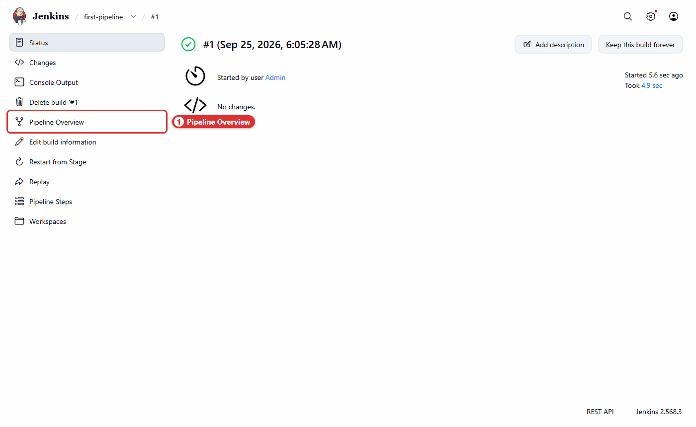

*ภาพที่ 3 ใน Jenkins รุ่นนี้ เมนูกราฟของ build ชื่อ **Pipeline Overview***

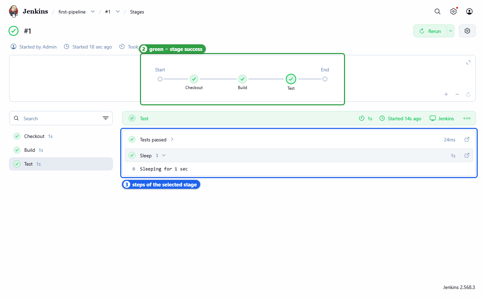

*ภาพที่ 4 กราฟ Start → Checkout → Build → Test → End ทุกโหนดเป็นสีเขียว คลิกแต่ละ stage เพื่อดู steps ที่อยู่ข้างใน*

✅ **ผลการทดลองจริง** (Console Output ของ `#1`, ตัดบางส่วน):

```text
[Pipeline] { (Checkout)
[Pipeline] echo
Checkout (simulated)
[Pipeline] sleep
Sleeping for 1 sec
[Pipeline] }
[Pipeline] // stage
[Pipeline] { (Build)
...
[Pipeline] { (Test)
[Pipeline] echo
Tests passed
...
[Pipeline] End of Pipeline
Finished: SUCCESS
```

🔍 **ตีความ:** บรรทัด `[Pipeline] { (ชื่อ stage)` คือจุดเริ่มของ stage และ `[Pipeline] // stage` คือจุดจบ ตรงกับวงเล็บปีกกาในโค้ด แต่ละ stage ใช้เวลาประมาณ 1 วินาทีตาม `sleep 1` รวมทั้ง build ประมาณ 4–5 วินาที

---

## การทดลองที่ 4 — `environment`: ให้ข้อความรู้จัก build

**คำถาม:** จะพิมพ์ตัวแปรของเรา ชื่อ job และหมายเลข build ใน stage ได้อย่างไร

**4.1) Configure → วางสคริปต์ฉบับเต็มนี้แทนของเดิม → Save → Build Now**

```groovy
pipeline {
  agent any

  environment {
    LAB_NAME = 'Declarative Pipeline'
  }

  stages {
    stage('Checkout') {
      steps {
        echo 'Checkout (simulated)'
        sleep 1
      }
    }
    stage('Build') {
      steps {
        echo "Building ${env.LAB_NAME}: ${env.JOB_NAME} #${env.BUILD_NUMBER}"
        sleep 1
      }
    }
    stage('Test') {
      steps {
        echo 'Tests passed'
        sleep 1
      }
    }
  }
}
```

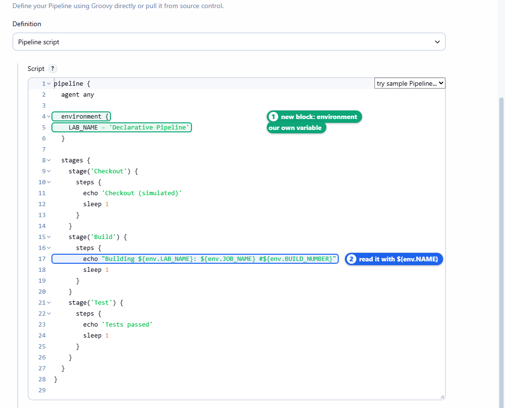

*ภาพที่ 5 บล็อก `environment` ประกาศ `LAB_NAME` และบรรทัด `echo` ใช้อัญประกาศคู่เพื่อแทนค่า*

**4.2) เปิด Console Output ของ `#2`**

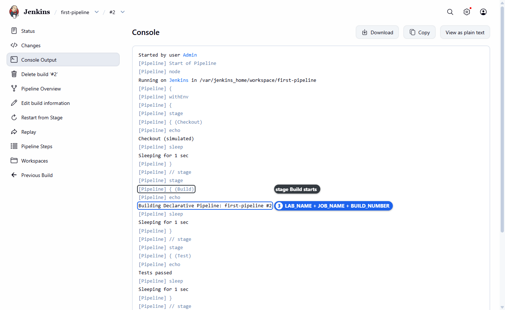

*ภาพที่ 6 ข้อความรวมค่าจากสามแหล่ง: `LAB_NAME` (เราประกาศ), `JOB_NAME` และ `BUILD_NUMBER` (Jenkins กำหนด)*

✅ **ผลการทดลองจริง:**

```text
[Pipeline] { (Build)
[Pipeline] echo
Building Declarative Pipeline: first-pipeline #2
```

---

## การทดลองที่ 5 — `parameters`: รับค่าจากผู้สั่ง build

**คำถาม:** ผู้กด build จะเลือก environment โดยไม่ต้องแก้สคริปต์ได้อย่างไร

**5.1) Configure → วางสคริปต์ฉบับเต็มนี้ → Save**

```groovy
pipeline {
  agent any

  parameters {
    string(name: 'APP_ENV', defaultValue: 'dev', description: 'Environment to deploy')
  }

  environment {
    LAB_NAME = 'Declarative Pipeline'
  }

  stages {
    stage('Checkout') {
      steps {
        echo 'Checkout (simulated)'
        sleep 1
      }
    }
    stage('Build') {
      steps {
        echo "Building ${env.LAB_NAME}: ${env.JOB_NAME} #${env.BUILD_NUMBER}"
        echo "APP_ENV=${params.APP_ENV}"
        sleep 1
      }
    }
    stage('Test') {
      steps {
        echo 'Tests passed'
        sleep 1
      }
    }
  }
}
```

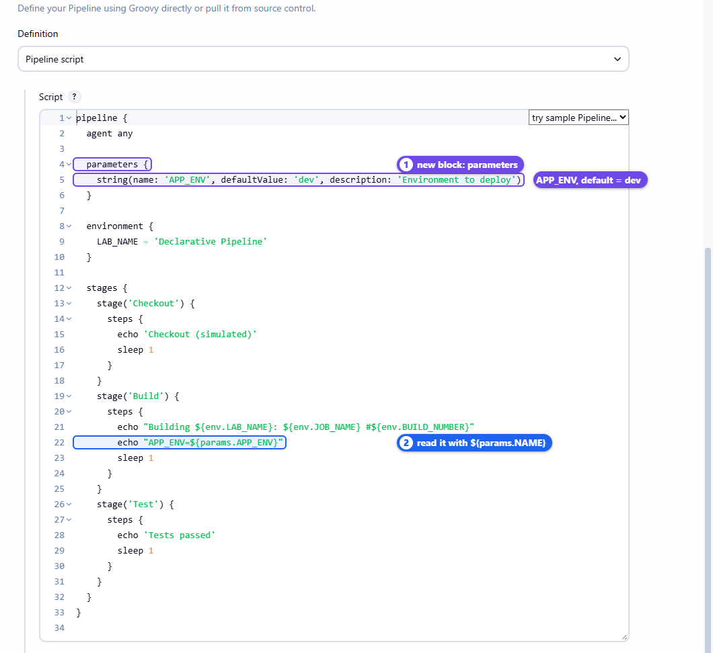

*ภาพที่ 7 ประกาศ `APP_ENV` (ค่าเริ่มต้น `dev`) และอ่านด้วย `params.APP_ENV`*

**5.2) สังเกตเมนู — ยังเป็น Build Now** เพราะ Jenkins ยังไม่ได้รันสคริปต์ใหม่ จึงยังไม่รู้จัก parameter กด **Build Now** หนึ่งครั้ง (ได้ `#3`, ใช้ค่าเริ่มต้น `APP_ENV=dev`)

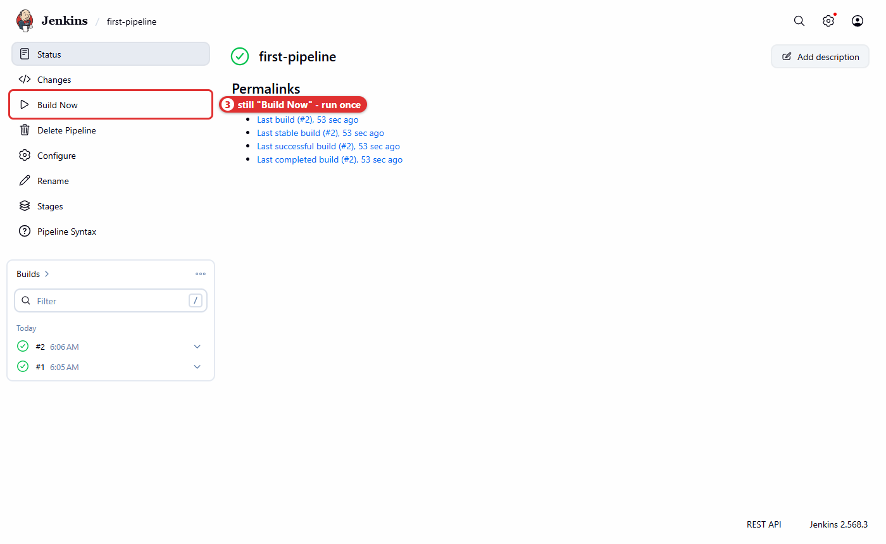

*ภาพที่ 8 ก่อน build ครั้งแรกหลังเพิ่ม `parameters` เมนูยังเป็น Build Now*

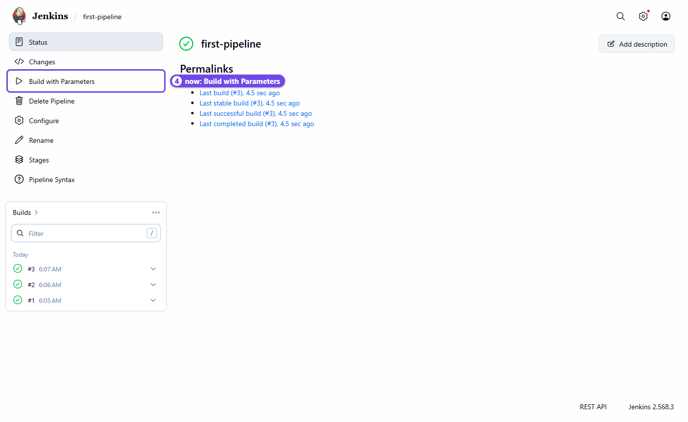

*ภาพที่ 9 หลัง `#3` เมนูเปลี่ยนเป็น **Build with Parameters***

🔍 **ตีความ:** นิยาม parameter อยู่ *ในสคริปต์* Jenkins จะอ่านและบันทึกเป็นการตั้งค่าของ job เมื่อสคริปต์ถูกรันแล้วหนึ่งครั้ง เปิด **Configure** จะเห็นว่า *This project is parameterized* ถูกเลือกให้เองตามโค้ด

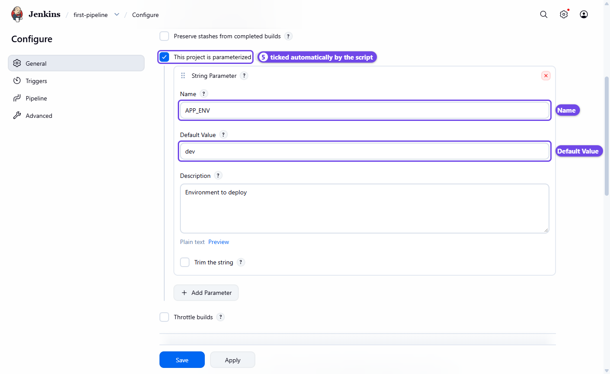

*ภาพที่ 10 Name `APP_ENV`, Default Value `dev` มาจากโค้ด ไม่ต้องกรอกเอง*

**5.3) Build with Parameters → เปลี่ยนค่าเป็น `staging` → Build** (ได้ `#4`)

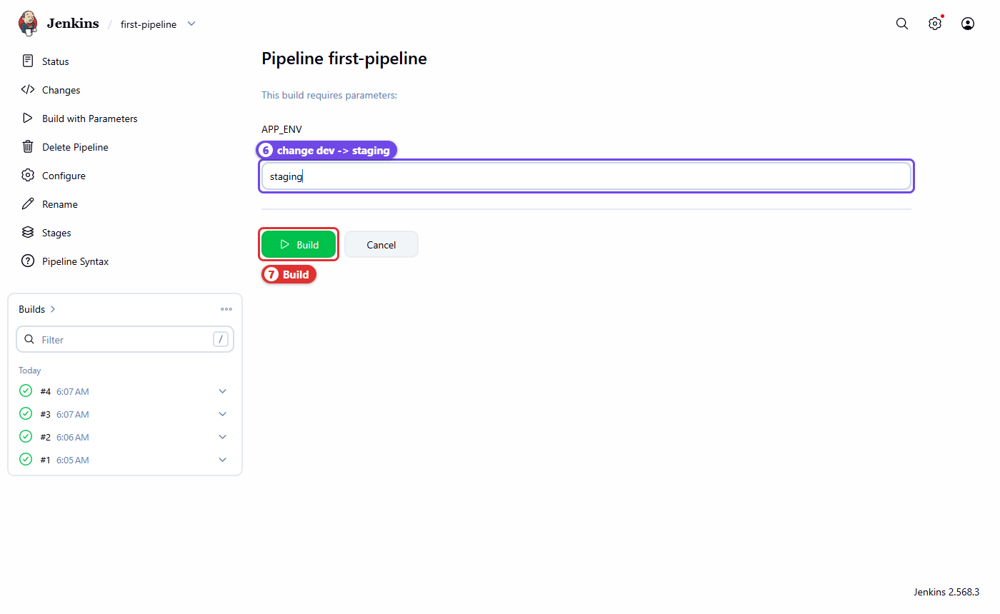

*ภาพที่ 11 ค่าที่กรอกในแบบฟอร์มถูกส่งเข้า `params.APP_ENV`*

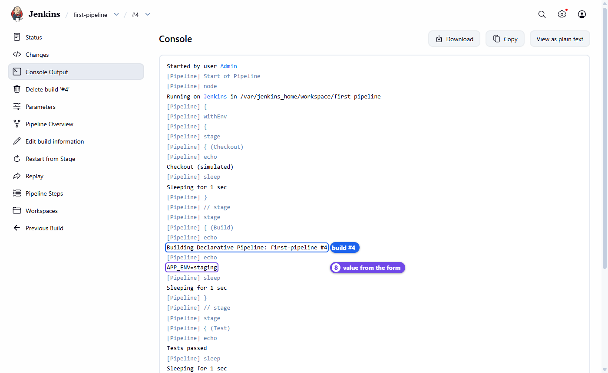

*ภาพที่ 12 build `#4` ได้รับค่า `staging` จากแบบฟอร์ม*

✅ **ผลการทดลองจริง:**

```text
APP_ENV=dev       ← #3 (Build Now ครั้งแรก ใช้ค่าเริ่มต้น)
APP_ENV=staging   ← #4 (Build with Parameters)
```

---

## การทดลองที่ 6 — `post`: งานหลัง stages จบ

**คำถาม:** จะให้ข้อความหนึ่งทำงานเสมอ และอีกข้อความทำงานเฉพาะเมื่อสำเร็จได้อย่างไร

> 📝 บล็อก `post` ทำงานหลัง stages ทั้งหมดจบ: `always` ทำทุกครั้ง · `success` ทำเมื่อ build สำเร็จ · `failure` ทำเมื่อ build ล้มเหลว

**6.1) Configure → วางสคริปต์ฉบับเต็มนี้ → Save → Build with Parameters (คง `dev`) → Build** (ได้ `#5`)

```groovy
pipeline {
  agent any

  parameters {
    string(name: 'APP_ENV', defaultValue: 'dev', description: 'Environment to deploy')
  }

  environment {
    LAB_NAME = 'Declarative Pipeline'
  }

  stages {
    stage('Checkout') {
      steps {
        echo 'Checkout (simulated)'
        sleep 1
      }
    }
    stage('Build') {
      steps {
        echo "Building ${env.LAB_NAME}: ${env.JOB_NAME} #${env.BUILD_NUMBER}"
        echo "APP_ENV=${params.APP_ENV}"
        sleep 1
      }
    }
    stage('Test') {
      steps {
        echo 'Tests passed'
        sleep 1
      }
    }
  }

  post {
    always {
      echo "Finished ${env.JOB_NAME} #${env.BUILD_NUMBER}"
    }
    success {
      echo 'Pipeline succeeded'
    }
    failure {
      echo 'Pipeline failed - look for the red stage'
    }
  }
}
```

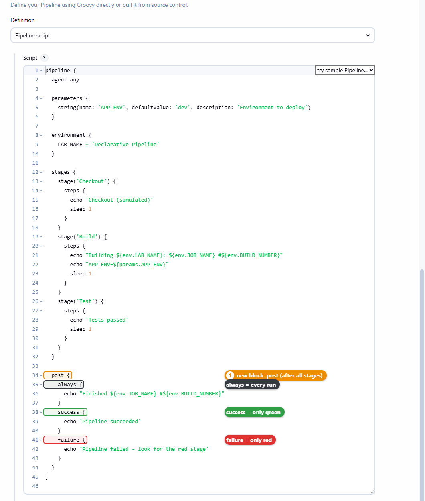

*ภาพที่ 13 บล็อก `post` มีสามเงื่อนไข: `always`, `success`, `failure`*

**6.2) เปิด Console Output ของ `#5` แล้วเลื่อนลงไปส่วน Declarative: Post Actions**

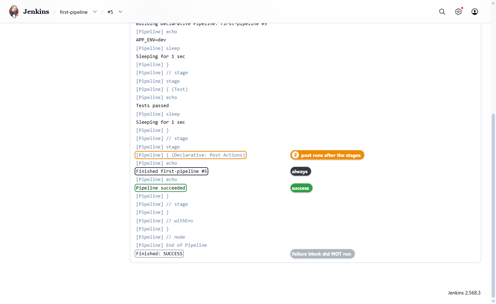

*ภาพที่ 14 `always` และ `success` ทำงาน ส่วน `failure` ไม่ทำงานเพราะ build สำเร็จ*

✅ **ผลการทดลองจริง:**

```text
[Pipeline] { (Declarative: Post Actions)
[Pipeline] echo
Finished first-pipeline #5
[Pipeline] echo
Pipeline succeeded
...
Finished: SUCCESS
```

🔍 **ตีความ:** ไม่มีข้อความ `Pipeline failed ...` ใน log ทั้งที่อยู่ในโค้ด แสดงว่าเงื่อนไข `failure` ถูกประเมินแล้วเป็นเท็จ

---

## การทดลองที่ 7 — `when`: Deploy เฉพาะ prod

**คำถาม:** จะข้าม Deploy สำหรับ dev แต่ทำจริงสำหรับ prod ได้อย่างไร และถ้าพิมพ์ `Prod` จะเกิดอะไรขึ้น

> 📝 `when` ถูกตรวจ**ก่อน**เข้า stage ถ้าเงื่อนไขเป็นเท็จ stage นั้นจะถูกข้าม (skipped) โดย build ไม่ล้มเหลว · `params.APP_ENV == 'prod'` เทียบสตริงแบบแยกตัวพิมพ์ใหญ่–เล็ก

**7.1) Configure → วางสคริปต์ฉบับเต็มนี้ → Save** (ไฟล์นี้ตรงกับ [`Jenkinsfile`](./Jenkinsfile) ทุกตัวอักษร)

```groovy
pipeline {
  agent any

  parameters {
    string(name: 'APP_ENV', defaultValue: 'dev', description: 'Environment to deploy')
  }

  environment {
    LAB_NAME = 'Declarative Pipeline'
  }

  stages {
    stage('Checkout') {
      steps {
        echo 'Checkout (simulated)'
        sleep 1
      }
    }
    stage('Build') {
      steps {
        echo "Building ${env.LAB_NAME}: ${env.JOB_NAME} #${env.BUILD_NUMBER}"
        echo "APP_ENV=${params.APP_ENV}"
        sleep 1
      }
    }
    stage('Test') {
      steps {
        echo 'Tests passed'
        sleep 1
      }
    }
    stage('Deploy') {
      when {
        expression { params.APP_ENV == 'prod' }
      }
      steps {
        echo "Deploying to ${params.APP_ENV}"
        sleep 1
      }
    }
  }

  post {
    always {
      echo "Finished ${env.JOB_NAME} #${env.BUILD_NUMBER}"
    }
    success {
      echo 'Pipeline succeeded'
    }
    failure {
      echo 'Pipeline failed - look for the red stage'
    }
  }
}
```

**7.2) ทำนายก่อนทดลอง** — เติมคอลัมน์ “คาดว่า” ก่อน แล้วค่อยรันเพื่อตรวจ

| Build | ค่า `APP_ENV` | คาดว่า Deploy จะ… | ผลจริง |
|---|---|---|---|
| `#6` | `dev` | ? | ข้าม |
| `#7` | `prod` | ? | ทำงาน |
| `#8` | `Prod` (P ตัวใหญ่) | ? | ข้าม |

**7.3) Build with Parameters สามครั้งด้วยค่า `dev`, `prod`, `Prod`** แล้วเปิด **Pipeline Overview** ของแต่ละ build

✅ **ผลการทดลองจริง** (บรรทัดที่เกี่ยวข้องจาก Console Output):

```text
#6  APP_ENV=dev   →  Stage "Deploy" skipped due to when conditional
#7  APP_ENV=prod  →  Deploying to prod
#8  APP_ENV=Prod  →  Stage "Deploy" skipped due to when conditional
```

และผลจาก API `/stages/tree`:

```text
#6  Checkout=success Build=success Test=success Deploy=skipped Post Actions=success
#7  Checkout=success Build=success Test=success Deploy=success Post Actions=success
#8  Checkout=success Build=success Test=success Deploy=skipped Post Actions=success
```

> 💡 **แนวทางปรับปรุง:** ความผิดพลาดแบบ `#8` ป้องกันได้ด้วย `choice(name: 'APP_ENV', choices: ['dev', 'staging', 'prod'])` ซึ่งให้ผู้ใช้เลือกจากรายการแทนการพิมพ์เอง (ทดสอบแล้วบน Jenkins รุ่นเดียวกัน: ค่าแรกในรายการ `dev` เป็นค่าเริ่มต้นของ build แรก)

**7.4) ปิดแล็บ:** ถ้า build ล่าสุดยังไม่ใช่ `prod` ที่เขียวทุกช่อง (เช่นจบที่ `Prod` ซึ่ง Deploy ถูกข้าม) ให้ Build with Parameters ด้วย `prod` อีกครั้ง

---

➡️ **แล็บถัดไป:** [LAB 3 — Docker Build & Push](../003_LAB_Docker_Build_Push/README.md)
