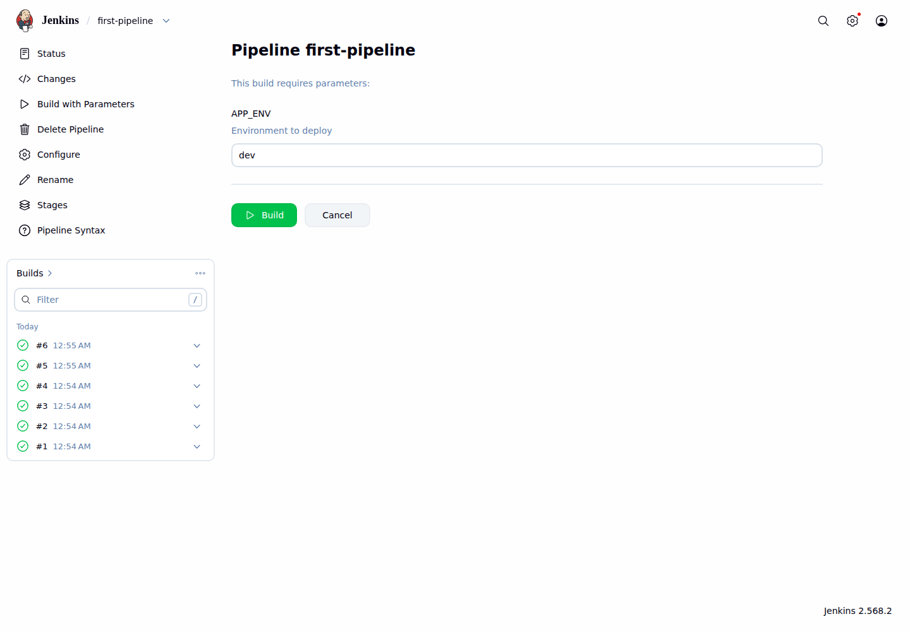
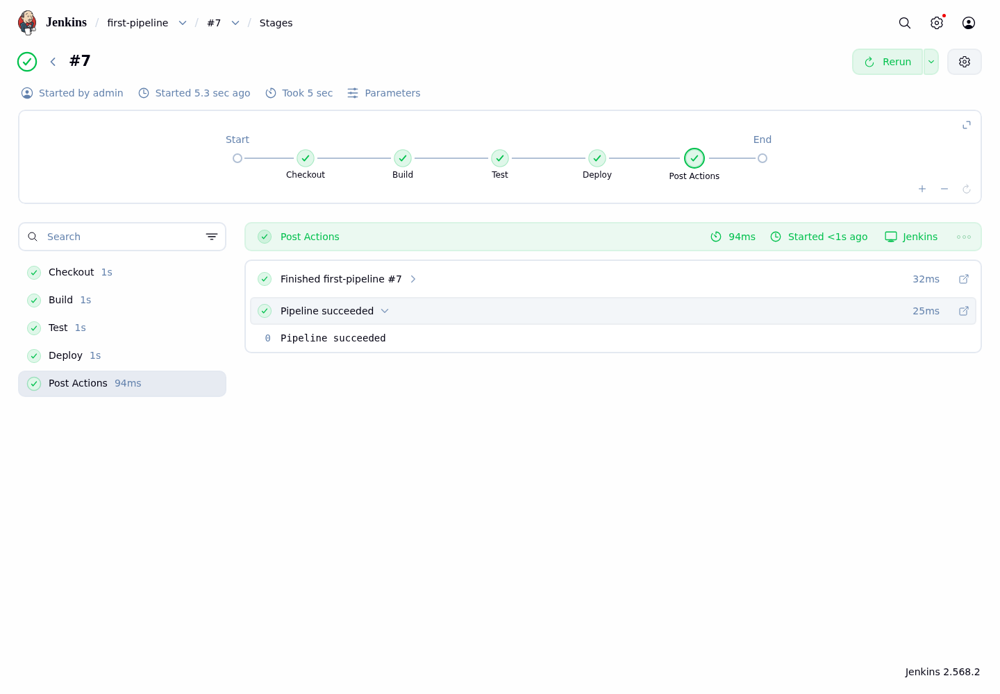

# LAB 2 — เขียน Declarative Pipeline แรก

แล็บ 30 นาทีนี้ตอบคำถามว่า “จะเปลี่ยนงานที่เคยกดทีละขั้นให้เป็นโค้ดได้อย่างไร” เมื่อจบแล้วนักศึกษาจะสร้าง Pipeline job จากหน้า Jenkins, แบ่งงานเป็น stage, ส่ง parameter, กำหนดเงื่อนไข Deploy และอ่านผลผ่าน Pipeline Graph ได้

## ทฤษฎีก่อนลงมือ

Pipeline as Code คือการเก็บลำดับงาน build ไว้เป็นข้อความที่ตรวจทานและนำกลับมาใช้ซ้ำได้ แทนการจำว่าต้องคลิกอะไรบ้าง ใน LAB นี้เราจะพิมพ์สคริปต์ใน UI เพื่อเห็นผลทันที แล้วใช้ไฟล์ `Jenkinsfile` เป็นฉบับอ้างอิงที่ตรงกับ UI ทุกตัวอักษร รายละเอียดภาพรวมดู slide ตอนที่ 2

Declarative Pipeline เริ่มด้วย `pipeline {}` ภายในมี `agent` ระบุว่าจะรันที่ใด และ `stages` แบ่งงานเป็นช่วงที่อ่านง่าย แต่ละ `stage` มี `steps` ซึ่งเป็นคำสั่งจริง เช่น `echo` และ `sleep`

`environment` สร้างตัวแปรที่ใช้ได้ตลอด Pipeline ส่วนตัวแปรของ Jenkins เช่น `JOB_NAME` และ `BUILD_NUMBER` อ่านผ่าน `env` ได้ `parameters` รับค่าจากคนกด Build และอ่านผ่าน `params`

`when` ควบคุมว่า stage จะรันหรือข้าม ส่วน `post` ทำงานหลัง stages จบ: `always` รันทุกผลลัพธ์ และ `success` รันเฉพาะเมื่อ Pipeline สำเร็จ หน้า Stages ที่ใช้ในแล็บมาจาก Pipeline Graph ซึ่งอยู่ใน suggested plugins ของ Jenkins ชุดนี้

## 🎯 แล็บนี้ใน 30 วินาที

- สร้าง Pipeline job ชื่อ `first-pipeline` และรัน 3 stages
- อ่านเส้นทางและสถานะของงานจาก Pipeline Graph
- เพิ่ม environment, parameter และ post actions
- ให้ Deploy รันเฉพาะ `APP_ENV=prod`
- รัน `check.sh` ตรวจ build ล่าสุดและ stage ผ่าน Pipeline Graph API

## สภาพตั้งต้น

ต้องมีสถานะจบ LAB 1: container `devtools-jenkins` ทำงาน และมี Jenkins container ชื่อ `jenkins` อยู่ภายใน

```bash
docker ps --format '{{.Names}}\t{{.Status}}'   # ต้องเห็น: devtools-jenkins
docker exec devtools-jenkins docker ps --format '{{.Names}}\t{{.Status}}'   # ต้องเห็น: jenkins
```

เปิด `http://localhost:8080` และเข้าใช้ด้วย `admin` / `admin2569`

> ยังไม่มี? ย้อนไปทำ [LAB 1](../001_LAB_Jenkins_On_Docker/README.md) ก่อน (ใช้เวลา ~40 นาที)

## การทดลองที่ 1 — โค้ดสร้าง 3 stages ได้อย่างไร

**คำถาม:** Pipeline job ที่มี Checkout, Build และ Test สร้างจากหน้า Jenkins อย่างไร?

- หน้า Dashboard เลือก **New Item** → ใส่ `first-pipeline` → เลือก **Pipeline** → **OK**
- ที่หัวข้อ **Pipeline** วางสคริปต์นี้ในช่อง Script แล้วกด **Save**

```groovy
pipeline {
  agent any

  stages {
    stage('Checkout') {
      steps {
        echo 'Checkout (simulated)'
        sleep 1
      }
    }
    stage('Build') {
      steps {
        echo 'Build'
        sleep 1
      }
    }
    stage('Test') {
      steps {
        echo 'Tests passed'
        sleep 1
      }
    }
  }
}
```

✅ **สิ่งที่ต้องเห็น** :

```text
หน้า first-pipeline เปิดขึ้น และยังไม่มี build
```

> 📝 เลือกชนิด Pipeline ไม่ใช่ Freestyle project และวางสคริปต์ในช่อง Script ใต้ Definition: Pipeline script

## การทดลองที่ 2 — Pipeline Graph บอกอะไรเรา

**คำถาม:** จะรู้ได้อย่างไรว่าแต่ละ stage สำเร็จและเรียงลำดับถูกต้อง?

- กด **Build Now** รอจน #1 เป็นสีเขียว แล้วคลิก **#1**
- เลือก **Stages** ทางซ้าย เพื่อเปิด Pipeline Graph ของ build นี้

✅ **สิ่งที่ต้องเห็น** :

```text
#1 SUCCESS: Checkout=success, Build=success, Test=success
```

หน้า build-level Stages แสดง run เดียวชัดที่สุด จึงใช้เป็นภาพอ้างอิงของแล็บนี้

## การทดลองที่ 3 — environment ทำให้ข้อความรู้จัก build ได้อย่างไร

**คำถาม:** จะพิมพ์ชื่อตัวแปรของเรา ชื่อ job และเลข build ใน stage ได้อย่างไร?

- เลือก **Configure** แล้วเพิ่ม `environment` ถัดจาก `agent any`
- เปลี่ยน `echo` ใน stage Build ตามด้านล่าง กด **Save** → **Build Now** → เปิด **Console Output**

```groovy
environment {
  LAB_NAME = 'Declarative Pipeline'
}

// ภายใน stage('Build')
echo "Building ${env.LAB_NAME}: ${env.JOB_NAME} #${env.BUILD_NUMBER}"
```

✅ **สิ่งที่ต้องเห็น** :

```text
Building Declarative Pipeline: first-pipeline #2
Finished: SUCCESS
```

> 📝 `LAB_NAME` เป็นตัวแปรที่เรากำหนด ส่วน `JOB_NAME` และ `BUILD_NUMBER` เป็นค่าที่ Jenkins เติมให้แต่ละ run

## การทดลองที่ 4 — Build with Parameters ส่งค่าเข้า Pipeline อย่างไร

**คำถาม:** ผู้กด Build จะเลือก environment โดยไม่แก้สคริปต์ได้อย่างไร?

- ที่ **Configure** เพิ่ม `parameters` ถัดจาก `agent any` และเพิ่มบรรทัด `echo` ใน stage Build แล้ว **Save**
- กด **Build Now** หนึ่งครั้งเพื่อให้ Jenkins ลงทะเบียน parameter จากนั้นเลือก **Build with Parameters** ใส่ `staging` แล้วกด **Build**

```groovy
parameters {
  string(name: 'APP_ENV', defaultValue: 'dev', description: 'Environment to deploy')
}

// ภายใน stage('Build')
echo "APP_ENV=${params.APP_ENV}"
```

✅ **สิ่งที่ต้องเห็น** :

```text
APP_ENV=dev      (#3 ครั้งแรก)
APP_ENV=staging  (#4 จาก Build with Parameters)
```



> 📝 ถ้ายังไม่เห็น Build with Parameters ให้กด Build Now หลัง Save หนึ่งครั้ง เพราะ Jenkins ต้องอ่าน `parameters` จากสคริปต์ก่อน

## การทดลองที่ 5 — post ทำงานหลัง stages แบบใด

**คำถาม:** จะให้ข้อความหนึ่งทำงานเสมอและอีกข้อความทำงานเฉพาะเมื่อสำเร็จได้อย่างไร?

- เลือก **Configure** แล้วเพิ่ม `post` ต่อจาก `stages` ภายใน `pipeline`
- กด **Save** → **Build with Parameters** ใช้ค่า `dev` → เปิด **Console Output**

```groovy
post {
  always {
    echo "Finished ${env.JOB_NAME} #${env.BUILD_NUMBER}"
  }
  success {
    echo 'Pipeline succeeded'
  }
}
```

✅ **สิ่งที่ต้องเห็น** :

```text
Finished first-pipeline #5
Pipeline succeeded
Finished: SUCCESS
```

## การทดลองที่ 6 — Deploy เฉพาะ prod ได้อย่างไร

**คำถาม:** จะข้าม Deploy สำหรับ dev แต่รันจริงสำหรับ prod ได้อย่างไร?

ไฟล์ด้านล่างคือฉบับเต็ม ให้วางแทน Script ทั้งหมดใน **Configure** ไฟล์นี้ตรงกับ [`Jenkinsfile`](./Jenkinsfile) ทุกตัวอักษร

```groovy
pipeline {
  agent any

  parameters {
    string(name: 'APP_ENV', defaultValue: 'dev', description: 'Environment to deploy')
  }

  environment {
    LAB_NAME = 'Declarative Pipeline'
  }

  stages {
    stage('Checkout') {
      steps {
        echo 'Checkout (simulated)'
        sleep 1
      }
    }

    stage('Build') {
      steps {
        echo "Building ${env.LAB_NAME}: ${env.JOB_NAME} #${env.BUILD_NUMBER}"
        sleep 1
      }
    }

    stage('Test') {
      steps {
        echo 'Tests passed'
        sleep 1
      }
    }

    stage('Deploy') {
      when {
        expression { params.APP_ENV == 'prod' }
      }
      steps {
        echo "Deploying to ${params.APP_ENV}"
        sleep 1
      }
    }
  }

  post {
    always {
      echo "Finished ${env.JOB_NAME} #${env.BUILD_NUMBER}"
    }
    success {
      echo 'Pipeline succeeded'
    }
  }
}
```

- กด **Save** → **Build with Parameters** ด้วย `dev`; หน้า Stages ต้องแสดง Deploy ว่าถูกข้าม
- กด **Build with Parameters** อีกครั้งด้วย `prod`; เปิด build ล่าสุด → **Stages**

✅ **สิ่งที่ต้องเห็น** :

```text
#6 APP_ENV=dev: Deploy=skipped
#7 APP_ENV=prod: Checkout, Build, Test, Deploy และ Post Actions เป็นสีเขียว
```



> 📝 ใน Jenkins รุ่นนี้เมนูชื่อ Stages และภาพด้านในคือ Pipeline Graph; ไม่ต้องค้นหาหรือติดตั้ง Stage View แบบตำราเก่า

## การทดลองที่ 7 — ตรวจผลจบแล็บอัตโนมัติได้อย่างไร

**คำถาม:** จะยืนยันได้อย่างไรว่างานล่าสุดสำเร็จและทั้ง 4 stages เป็นสีเขียว?

```bash
cd 002_LAB_Declarative_Pipeline && bash check.sh
```

✅ **สิ่งที่ต้องเห็น** :

```text
PASS: job=first-pipeline build=#7 result=SUCCESS
PASS: stages: Checkout=SUCCESS, Build=SUCCESS, Test=SUCCESS, Deploy=SUCCESS
```

ตัวตรวจอ่านสถานะ job จาก Jenkins core API และอ่าน stage จาก endpoint `/stages/tree` ของ Pipeline Graph ที่ติดตั้งอยู่จริง โดยไม่พึ่ง plugin เพิ่ม

## แก้ปัญหาที่พบบ่อย

| อาการ | สาเหตุ | วิธีแก้ |
|---|---|---|
| เปิด `localhost:8080` ไม่ได้ | devtools หรือ Jenkins ภายในยังไม่ทำงาน | รัน `docker start devtools-jenkins` รอ ~20 วินาที แล้วตรวจ `docker exec devtools-jenkins docker ps` |
| ไม่มีเมนู Build with Parameters | Jenkins ยังไม่อ่าน block `parameters` | Save แล้วกด Build Now หนึ่งครั้ง จากนั้นกลับหน้าหลัก job |
| Deploy แสดง skipped | `APP_ENV` ไม่ใช่ `prod` | ใช้ Build with Parameters ใส่ `prod` ตัวพิมพ์เล็ก |
| หา Stage View แบบในตำราเก่าไม่เจอ | Jenkins ชุดนี้ใช้ Pipeline Graph จาก suggested plugins | เปิด build ที่ต้องการแล้วเลือก **Stages**; ตอนนี้เรียก Pipeline Graph |
| `check.sh` บอก Deploy=SKIPPED | build ล่าสุดใช้ `dev` | รัน Build with Parameters ด้วย `prod` แล้วตรวจใหม่ |
| `check.sh` ได้ 401/403 | URL หรือ Jenkins credential ไม่ตรง | ใช้ค่าเริ่มต้น `http://localhost:8080` และ `admin:admin2569` หรือกำหนด `JENKINS_URL`/`JENKINS_AUTH` ให้ถูก |
| restart แล้วเข้าไม่ได้ทันที | Jenkins กำลังเริ่มระบบ | รอจน `curl -fsS http://localhost:8080/login` ผ่าน แล้วเปิดใหม่ |
